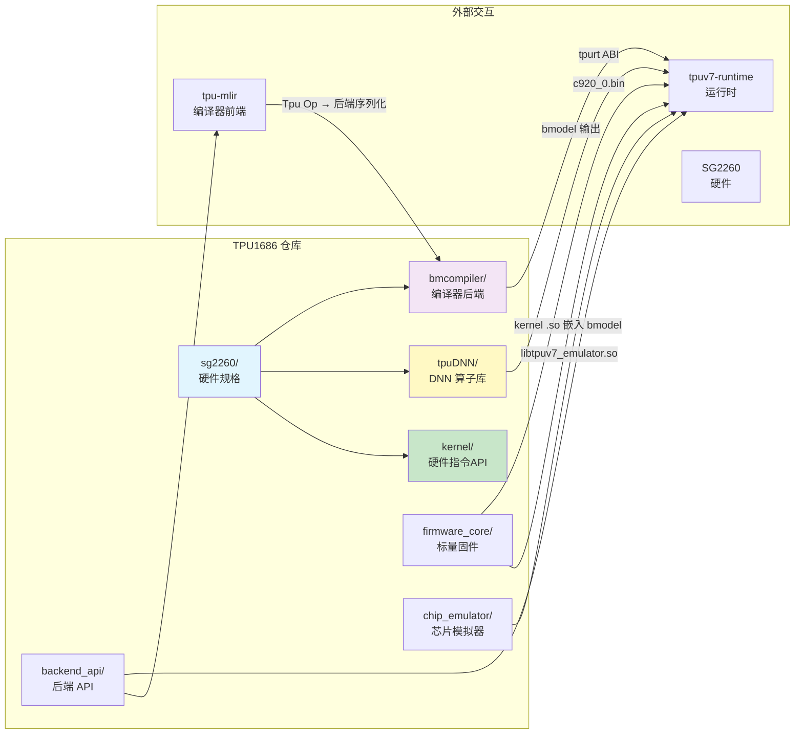

# TPU1686: 算子库与硬件定义

> SG2260 (BM1690/AKS) 芯片的硬件定义、算子实现库 (kernel/tpuDNN) 和编译器后端 (bmcompiler)。
> 与 tpuv7-runtime 协同，位于同一 workspace 下。

---

## 1. 概述

### 1.1 定位

TPU1686 在整个软件栈中扮演三个角色:

1. **硬件定义者** — SG2260 芯片的寄存器、内存映射、Core/Lane 规格参数
2. **算子实现者** — TPU Kernel (底层硬件指令) 和 tpuDNN (高层 DNN 库)
3. **编译器后端** — bmcompiler 生成最终的 bmodel 文件



### 1.2 目录结构

```
TPU1686/
├── sg2260/          # SG2260 芯片硬件规格 (寄存器, 内存映射, Core/Lane 参数)
├── sg2260e/         # SG2260E (BM1690E, AKSV) 芯片硬件规格
├── sg2262/          # SG2262 芯片硬件规格
│
├── kernel/          # TPU 硬件指令编程接口 (API 头文件 + 注册引擎)
│   ├── include/     #   tpu_kernel.h (6661行, 主编程接口), tpu_defs.h, tpu_macros.h
│   └── src/         #   tpu_kernel.c, tpu_kernel_common.c (通用工具)
│
├── tpuDNN/          # DNN 算子库 (类似 cuDNN)
│   ├── src/
│   │   ├── arch/    #     芯片架构适配
│   │   ├── platform/ #    平台策略 (Linux, RTOS, ...)
│   │   ├── graph/   #     图级别优化
│   │   └── legacy/  #     旧版兼容
│   ├── include/     #     公开头文件
│   └── python/      #     Python 绑定
│
├── bmcompiler/      # bmodel 编译器后端
│   └── libbackend/  #   libbackend_*.so (芯片特定后端)
│
├── firmware_core/   # 标量固件 (KBUILD 编译系统)
│                    #   产物: c920_0.bin/.elf (RISC-V C920)
│
├── chip_emulator/   # 芯片模拟器
│                    #   产物: libtpuv7_emulator.so
│
├── backend_api/     # 后端 API (编译器与运行时的桥)
│   └── src/         #   backend_api_conv.cpp, backend_api_matmul.cpp, ...
│
├── runtime/         # 运行时组件 (部分, 主体在 tpuv7-runtime)
├── bmlib_tmp/       # 底层库 (临时)
├── common/          # 共享工具
├── scripts/         # 构建脚本
│   └── build_tpuv7_emulators.sh  # Emulator 编译
├── samples/         # 示例
├── test/            # 测试
└── sgdnn_tmp/       # SGDNN (临时/实验)
```

---

## 2. SG2260 硬件架构

### 2.1 系统架构概览

SG2260 (BM1690/AKS) 是一款数据中心级 TPU 芯片，整体架构如下:

```
SG2260 芯片
┌──────────────────────────────────────────────────────────────────┐
│                                                                   │
│  ┌──────────┐  ┌──────────┐       ┌──────────┐  ┌──────────┐    │
│  │TPU Core 0│  │TPU Core 1│  ...  │TPU Core 6│  │TPU Core 7│    │
│  │ 64 CU    │  │ 64 CU    │       │ 64 CU    │  │ 64 CU    │    │
│  │ GDMA ×1  │  │ GDMA ×1  │       │ GDMA ×1  │  │ GDMA ×1  │    │
│  │ SDMA ×1  │  │ SDMA ×1  │       │ SDMA ×1  │  │ SDMA ×1  │    │
│  │ HAU  ×1  │  │ HAU  ×1  │       │ HAU  ×1  │  │ HAU  ×1  │    │
│  │ Scalar   │  │ Scalar   │       │ Scalar   │  │ Scalar   │    │
│  └────┬─────┘  └────┬─────┘       └────┬─────┘  └────┬─────┘    │
│       │              │                  │              │          │
│       └──────────────┴────── NoC ───────┴──────────────┘          │
│                          │                                        │
│              ┌───────────┴───────────┐                            │
│              │  共享 L2M (128MB)      │                            │
│              └───────────┬───────────┘                            │
│                          │                                        │
│              ┌───────────┴───────────┐                            │
│              │  片外 DDR/GMEM (4GB)   │                            │
│              └───────────────────────┘                            │
│                                                                   │
│  ┌──────────────────────────────────────────────────────────────┐ │
│  │ CDMA ×10: CDMA[0-7]=C2C / CDMA[8]=P2P / CDMA[9]=Host        │ │
│  └──────────────────────────────────────────────────────────────┘ │
│  ┌──────────────────────────────────────────────────────────────┐ │
│  │ ARE: All-Reduce Engine (L2M 就地 reduce)                      │ │
│  └──────────────────────────────────────────────────────────────┘ │
└──────────────────────────────────────────────────────────────────┘
```

### 2.2 TPU Core 内部架构

每个 TPU Core 的组成:
- **1 个 TIU** (单实例, 控制中心) — 取指、译码、地址生成、bank 仲裁
- **64 个 Lane (CU)** — TIU 广播同一条指令, 64 Lane 同时执行 (SIMD)
  - 每个 Lane 含: LMEM (256KB) + Vector Unit + **Cube Unit** (非 array 级共享)
- **4 个独立引擎** (各自指令流) — GDMA, SDMA, HAU, Scalar Engine
- **共享资源** — SMEM (64KB), 指令 Buffer (32KB, 在 TIU 内), L2M (128MB 跨 Core)

> 注: 指令集文档 §5.1 写 "每个CU包含...1个TIU", 但又说 "由TIU来统一控制" 且 TIU 含 32KB 指令 Buffer + 64KB SMEM (只有一个)。
> 此处存在文档内部矛盾。按 SPEC (SG2260_TPU_SPEC_v1.1) 的模块划分, TIU 为 **每 Core 单实例**, 通过总线控制所有 Lane。

```
TPU Core 内部
┌─────────────────────────────────────────────────────────────┐
│  ╔═══════════════════════════════════════════════════════╗  │
│  ║ TIU (Tensor Instruction Unit) — 每 Core 1 个, 单实例  ║  │
│  ║  ├ dpc_des:    指令获取 (PIO/DES) → 指令Buffer 32KB  ║  │
│  ║  ├ dpc_ls_pipe: 译码 → 坐标生成 → R0/R1/W0 地址      ║  │
│  ║  ├ dpc_arb:    Bank 冲突仲裁 + 时序控制               ║  │
│  ║  ├ dpc_cube_dat_eng: 跨 Lane 数据收集 (8种模式)       ║  │
│  ║  ├ eu_cmd:     EU 命令分发                            ║  │
│  ║  ├ pmu:        性能监控 (指令id/执行时间)             ║  │
│  ║  └ SMEM:       64KB (常数/表项/Scalar暂存)           ║  │
│  ╚══════════════╤════════════════════════════════════════╝  │
│                 │ 内部总线 (R0/R1/W0/SR/SD/DMA)             │
│                 ▼ 广播到所有 64 Lane (SIMD)                  │
│  ┌──────────────────────────────────────────────────────┐   │
│  │  8 组 arrays_with_fab, 每组 8 Lane = 64 Lane 总计    │   │
│  │                                                       │   │
│  │  ┌─── Lane 0 ───────────────┐  ┌─── Lane 1 ───────┐  │   │
│  │  │  LMEM: 256KB (16bank×2R2W) │  │  LMEM: 256KB   │ │   │
│  │  │  Vector Unit: 512b SIMD   │  │  Vector Unit    │ │   │
│  │  │    └ EU ×N (dtype 可变)   │  │    └ EU ×N      │ │   │
│  │  │  Cube Unit: MAC 阵列      │  │  Cube Unit      │ │   │
│  │  │    (64×4 INT8 / 32×4 FP16)│  │    (同左)       │ │   │
│  │  └───────────────────────────┘  └─────────────────┘  │   │
│  │  ... (重复 64 次, 每个 Lane 结构相同)                  │   │
│  │                                                       │   │
│  │  每 array 共享: dp_shf (crossbar 数据收集) + dpdma    │   │
│  └──────────────────────────────────────────────────────┘   │
│                                                               │
│  ┌──────────────────────────────────────────────────────┐   │
│  │ 其他引擎 (各自独立指令流, 与 TIU 并行)                │   │
│  │  GDMA: LMEM/SMEM/L2M/GMEM 间 DMA transfer            │   │
│  │  SDMA: L2M/GMEM 间 System DMA (双指令流)             │   │
│  │  HAU:  Sort/TopK 硬件加速 (访问 GMEM/L2M)            │   │
│  │  Scalar Engine: RISC-V CPU (任务调度+动态指令生成)    │   │
│  └──────────────────────────────────────────────────────┘   │
└─────────────────────────────────────────────────────────────┘
```

### 2.3 关键硬件参数

| 参数 | 值 | 说明 |
|---|---|---|
| **TPU Core 数量** | 8 | 每个 Core 独立运行 (有独立的 Scalar Engine) |
| **CU/Lane 数量** | 64 per Core (8 arrays × 8 lanes) | SIMD 模式，TIU 统一控制 |
| **LMEM 总量** | 16MB per Core (256KB × 64 Lane) | 地址连续，16 banks/Lane, 2R2W, 256bit |
| **SMEM** | 64KB per Core | 常数/表项存储，Scalar 数据暂存 |
| **指令 Buffer** | 32KB per Core | 可缓存约 400 条 TPU 指令 |
| **共享 L2M (L2 SRAM)** | 128MB | 8 个 Core 共享，通过 NoC 访问 |
| **片外 GMEM (DDR)** | 4GB | 全局内存，通过 GDMA/SDMA 访问 |
| **CDMA 数量** | 10 | CDMA[0-7]=C2C, CDMA[8]=P2P, CDMA[9]=Host |
| **GDMA** | 8 (每 Core 1 个) | LMEM/SMEM/L2M/GMEM 间搬运，支持跨 Core |
| **SDMA** | 8 (每 Core 1 个) | L2M/GMEM 间搬运，双指令流 |
| **HAU** | 8 (每 Core 1 个) | Sort/TopK 硬件加速 |
| **ARE** | 1 (共享) | All-Reduce Engine，L2M 就地 reduce |

### 2.4 执行模式

| 模式 | 说明 |
|---|---|
| **PIO 模式** | Scalar Engine 通过 AXI 接口直接向 TIU/GDMA/SDMA 推送指令。指令写入 dpc_des 寄存器后再存入指令 Buffer。 |
| **DES 模式** | TIU/GDMA/SDMA 通过 AXI 接口从外部 DDR 读取指令描述符 (cfg_des_addr)，再存入指令 Buffer。 |
| **指令发射控制** | `des_cmd_id_en[0]` 域控制：未设置=直接发射；已设置=需等待 sync_id_gdma ≥ 指令 ID 后再发射 (保证 GDMA 已完成操作数搬运)。 |

### 2.5 CU/Lane 内 Vector 计算能力

| 数据类型 | EU 数量 per Lane | 说明 |
|---|---|---|
| INT8 | 64 | 512-bit SIMD 向量 |
| INT16 | 32 | |
| FP16/BF16 | 32 | |
| FP32 | 16 | |
| INT4 | 128 | 4-bit packed |

### 2.6 Cube 计算能力 (卷积/矩阵乘)

> Cube 分布在各 Lane 内。指令集文档明确: "每个Lane中的Cube计算单元"。
> TIU 下发一条 Conv/MM 指令后，64 Lane 的 64 个 Cube 并行计算。
> SPEC 中 "cube 阵列 size=64×4" 的 64 = IC 维度 (匹配 64 Lane)，4 = 一次计算 4 个空间点。

| 数据类型 | 等效 MAC (跨 64 Lane 分布) | 说明 |
|---|---|---|
| INT8 | 64(Lane) × 4(空间点) | 每个 cycle 64 Lane 并行, 各计算 4 点的部分和 |
| FP16/BF16 | 64(Lane) × 4, MAC 减半 | 与 INT8 相比每 Lane MAC 数不同 |
| FP32/TF32 | 走 Vector 单元 | FP32 卷积不使用 Cube (用 Vector 16EU/Lane) |

### 2.7 同步机制

| 机制 | 使用场景 |
|---|---|
| **SyncID** | TPU ↔ GDMA 同步。指令设置 `sync_id`，当 `sync_id_gdma ≥ 指令ID` 时才发射，确保 GDMA 已完成数据搬运。 |
| **MSG** | TPU ↔ 其他加速引擎 (SDMA/CDMA/HAU) 同步。MSG 的 base ID 可外部配置，提升可移植性。CDMA 也通过 MSG 进行跨芯片同步。 |

### 2.8 sg2260/ 目录 (CMake 构建参数)

```
sg2260/config_common.cmake:
  NPU_SHIFT=6             # 64 Lane (CU) per Core
  EU_SHIFT=4              # 16 EU per Lane (FP32), 32 (FP16/BF16), 64 (INT8)
  LOCAL_MEM_BANKS=16      # 16 banks per Lane
  LOCAL_MEM_ADDRWIDTH=18  # 256KB per Lane
  L2_SRAM_SIZE=0x8000000  # 128MB shared L2M
  GLOBAL_MEM_SIZE=0x100000000  # 4GB GMEM/DDR
  MAX_TPU_CORE_NUM=8      # 8 TPU Cores
  MAX_CDMA_NUM=11          # CMake 构建上限 (指令集文档明确: 实际共 10 个 CDMA)
  STATIC_MEM_SIZE=0x10000  # 64KB SMEM
```

### 2.9 芯片变体

| 变体 | Device ID | Core 数 | L2M | Lane/Core | CDMA | 特化 |
|---|---|---|---|---|---|---|
| **BM1690 (AKS)** | 0x414B | 8 | 128MB | 64 | 10 | 标准版 (CDMA[0-7]=C2C, [8]=P2P, [9]=Host) |
| **BM1690E (AKSV)** | 0x414BE | 4 | 128MB | 64 | 10 | 增强 CDMA (级联模式 + PMU) |
| **SG2260N** | — | 4 | 16MB | 64 | — | 简化版 (精简 L2M) |

---

## 3. Kernel 算子库 (`kernel/`)

### 3.1 架构: API 头文件 + 算子实现分离

TPU1686 的 Kernel 算子库采用 **API 定义与算子实现分离** 的架构:

| 层 | 位置 | 内容 |
|---|---|---|
| **编程接口 (API)** | `kernel/include/` | `tpu_kernel.h` (6661行) — 403 BDC + 102 GDMA 函数声明 + 注册宏 |
| **注册引擎** | `kernel/src/` | `tpu_kernel_common.c` — `pairs[]` 数组, 按名称注册/查找/dump |
| **算子实现** | `firmware_core/src/` | ~240 个算子文件, 分 global_layer / local_layer / cv |

### 3.2 核心文件详解

```
kernel/
├── include/
│   ├── tpu_kernel.h     # 主编程接口 (6661行, ~713 函数声明)
│   │   ┌─────────────────────────────────────────────┐
│   │   │ API 章节 (约 16 个):                         │
│   │   │  COMMON       — 初始化/轮询/芯片查询/核同步  │
│   │   │  UTILS        — 步幅/类型转换/Lane索引       │
│   │   │  GDMA         — 数据搬运 (S2L/L2S/L2L/S2S)  │
│   │   │  SDMA         — System DMA (L2M/GMEM)          │
│   │   │  CDMA         — Chip-to-Chip DMA (多芯片)    │
│   │   │  BDC-SELECT   — 元素选择                     │
│   │   │  BDC-FP-MATRIX — 浮点矩阵乘 (FP32/16/FP8)   │
│   │   │  BDC-INT-MATRIX — 整型矩阵乘 (INT8+requant) │
│   │   │  BDC-FP-NN    — 浮点卷积/池化/BN/LRN        │
│   │   │  BDC-INT-NN   — 整型卷积/池化 (INT8)        │
│   │   │  BDC-QUANT    — 量化/反量化                  │
│   │   │  BDC-BINARY   — 逐元素二元 (FP+INT)          │
│   │   │  BDC-CAST     — 类型转换                     │
│   │   │  BDC-UNARY    — 一元 (abs/exp/log/sqrt/...)  │
│   │   │  BDC-SCATTER  — scatter/gather (分散-收集)   │
│   │   │  BDC-ACTIVE   — 激活 (relu/prelu/leaky/...)  │
│   │   │  HAU          — Hardware Acceleration Unit (排序/TopK) │
│   │   │  SYNC         — 同步/屏障/内存守卫           │
│   │   └─────────────────────────────────────────────┘
│   ├── tpu_defs.h       # 核心类型定义
│   │                     #   local_addr_t (u32), global_addr_t (u64)
│   │                     #   data_type_t: FP32/16/BF16/FP8/INT8/4/...
│   │                     #   dim2~5 形状描述符, 舍入模式, reduce方法
│   ├── tpu_macros.h     # 寄存器操作宏 (5行, 占位)
│   └── tpu_utils.h      # 工具函数
│
└── src/
    ├── tpu_kernel.c           # `__attribute__((weak))` 锁桩
    ├── tpu_kernel_common.c    # 注册引擎 + 类型辅助 + 调试
    │   ├── pairs[] 数组       #   全局 kernel 注册表
    │   ├── tpu_register_kernel_func()       # 注册
    │   ├── tpu_get_kernel_func_by_name()    # 按名查找
    │   └── tpu_dump_registered_kernel_funcs() # 调试dump
    └── tpu_kernel_memcheck.c  # 内存检查/验证
```

**算子实现 (非 kernel 目录, 在 firmware_core 中)**:
```
firmware_core/src/
├── global_layer/     # ~120 个文件: 全局内存算子
│                     #   conv, matmul, pool, norm, attention, ...
├── local_layer/      # ~120 个文件: 局部内存算子 (LMEM 优化)
│                     #   conv_local, matmul_local, ...
├── cv/               # 计算机视觉专用算子
└── <chip>/           # 芯片特定实现 (sg2260, bm1686, ...)

TPUKERNEL_FUNC_REGISTER 宏在 ~80+ 文件中使用,
全部位于 firmware_core/src/ 下。
```

### 3.3 算子自注册机制

每个 TPU Kernel 函数通过 `TPUKERNEL_FUNC_REGISTER` 宏自动注册:

```c
// tpu_kernel.h 中的注册宏
#define TPUKERNEL_FUNC_REGISTER(kernel_name, func_ptr)  \
    __attribute__((constructor))                         \
    static void _reg_##kernel_name(void) {              \
        tpu_kernel_register(#kernel_name, func_ptr);     \
    }

// 使用示例
static int tpu_conv2d_impl(void *args, unsigned int size) {
    // ... 写入 BDC/GDMA 寄存器, 执行卷积 ...
    return 0;
}
TPUKERNEL_FUNC_REGISTER(conv2d, tpu_conv2d_impl);
```

- `__attribute__((constructor))` 确保在 .so 加载时 (dlopen) 自动执行注册
- 全局函数表: 所有 kernel 按名称索引, TP Daemon 通过 `find_sym_by_name()` 查找

### 3.4 算子类型

| 类别 | 算子示例 | 指令引擎 |
|---|---|---|
| **卷积** | Conv2D, Conv3D, Deconv2D, Deconv3D | BDC |
| **矩阵运算** | MatMul, FullyConnected | BDC |
| **池化** | MaxPool, AvgPool, AdaptivePool | BDC |
| **激活** | ReLU, SiLU, GELU, Tanh, Sigmoid, Swish | BDC |
| **归一化** | BatchNorm, LayerNorm, RMSNorm, GroupNorm | BDC |
| **注意力** | Softmax, FlashAttention | BDC |
| **元素操作** | Add, Mul, Sub, Div, Min, Max | BDC |
| **数据搬运** | Transpose, Reshape, Slice, Concat, Split | GDMA |
| **量化** | Quantize, Dequantize, Requantize | BDC |
| **位置编码** | RoPE, SinusoidalPE | BDC |

### 3.5 BDC/GDMA 指令生成

> 实际 kernel 函数调用 `tpu_kernel.h` 中的高级 API (如 `tpu_bdc_conv_forward`) 来生成指令，而非直接写寄存器。
> 以下为简化的概念模型, 帮助理解 BDC/GDMA 指令生成的本质。

```c
// 简化的卷积 Kernel 结构
static int tpu_conv2d_impl(void *args, unsigned int size) {
    struct conv2d_args *p = (struct conv2d_args *)args;

    // 1. 配置 BDC 引擎 (卷积参数)
    BDC_WRITE_REG(CONV_CFG, (p->kernel_h << 16) | (p->kernel_w << 8) | ...);

    // 2. 设置数据地址
    BDC_WRITE_REG(SRC_ADDR,  p->input_addr);
    BDC_WRITE_REG(WEIGHT_ADDR, p->weight_addr);
    BDC_WRITE_REG(BIAS_ADDR,   p->bias_addr);
    BDC_WRITE_REG(DST_ADDR,   p->output_addr);

    // 3. 配置 GDMA 引擎 (如果需要数据搬运)
    if (need_dma) {
        GDMA_WRITE_REG(SRC, p->l2_addr);
        GDMA_WRITE_REG(DST, p->ddr_addr);
        GDMA_WRITE_REG(SIZE, p->dma_size);
    }

    // 4. 启动引擎
    BDC_WRITE_REG(ENGINE_START, 1);
    GDMA_WRITE_REG(ENGINE_START, 1);

    // 5. 等待完成 (轮询或中断)
    while (BDC_READ_REG(ENGINE_STATUS) != IDLE);

    return 0;
}
```

---

## 4. tpuDNN — DNN 算子库 (`tpuDNN/`)

### 4.1 概述

tpuDNN 是 **对标 cuDNN** 的高层 C++ DNN 算子库，使用策略模板设计避免 `#ifdef` 爆炸。

### 4.2 策略模板设计

```cpp
// tpuDNN 的核心类模板
template<
    typename DeviceConfig,    // 芯片型号 (SG2260, SG2260E, SG2262, BM1686, ...)
    typename OSPolicy,        // 操作系统策略 (Linux, RTOS, bare-metal)
    typename RuntimePolicy,   // 运行时策略 (tpurt vs bmlib)
    typename MemoryPolicy,    // 内存策略
    typename LaunchPolicy     // 启动策略 (sync/async)
> class TPUDNNHost {
    // 卷积
    Status Convolution(const ConvDescriptor &desc,
                       const Tensor &input, const Filter &filter,
                       const Bias &bias, Tensor &output);

    // 矩阵乘
    Status MatMul(const MatMulDescriptor &desc,
                  const Tensor &a, const Tensor &b, Tensor &c);

    // 激活函数
    Status Activation(ActivationMode mode,
                      const Tensor &input, Tensor &output);

    // ... 更多算子
};
```

**编译期策略选择**:

```cpp
// SG2260 上的具体实例化
using SG2260_DNN = TPUDNNHost<
    SG2260Config,      // 8 Core × 64 CU, 128MB L2M, 4GB GMEM
    LinuxPolicy,        // Linux 系统调用
    tpurt::tpurt,       // tpuv7-runtime API (tpuRt*)
    DefaultMemoryPolicy,
    AsyncLaunchPolicy
>;

// 旧芯片使用不同的运行时
using BM1686_DNN = TPUDNNHost<
    BM1686Config,
    LinuxPolicy,
    bmlib::bmlib,       // 旧版运行时 API
    DefaultMemoryPolicy,
    SyncLaunchPolicy
>;
```

### 4.3 与 tpuv7-runtime 的集成

- tpuDNN 将编译好的 firmware `.so` 作为 **二进制资源嵌入** (`compile_binary_file()`)
- 在 SG2260 上链接 `tpurt::tpurt` (即 tpuv7-runtime 的 `tpuRt*` API)
- model-runtime 和 tpuDNN **不直接链接** — 它们在 `tpurt` ABI 层解耦

```
┌─────────────────────────────────────────────────┐
│  用户应用                                        │
│    ├── model-runtime.  (tpuv7-runtime)           │
│    │     └── tpuRtLoadNet / tpuRtLaunchNet       │
│    └── tpuDNN 直接调用  (TPU1686)                │
│          └── TPUDNNHost.Convolution(...)         │
│                   │                │             │
│                   └── tpurt ABI ◄──┘             │
│                        (共享运行时接口)            │
└─────────────────────────────────────────────────┘
```

### 4.4 目录结构

```
tpuDNN/src/
├── arch/          # 芯片架构适配
│                  #   SG2260, BM1686, BM1684X, ...
├── platform/      # 平台策略
│                  #   Linux, RTOS, bare-metal
├── graph/         # 图级别优化
│                  #   算子融合, 内存规划
├── legacy/        # 旧版兼容
├── allocator.cpp  # 内存分配器
├── optimer.cpp    # 性能优化器
├── launchCache.cpp # 启动缓存
├── hash.h         # 哈希工具
└── logging.h      # 日志系统
```

---

## 5. bmcompiler — 编译器后端 (`bmcompiler/`)

### 5.1 定位

`bmcompiler/` 包含**预编译的 `.so` 后端库**，负责将编译好的图 IR **序列化**为 bmodel 文件。实际的编译器源码位于 tpu-mlir 仓库。

### 5.2 文件结构

```
bmcompiler/
└── libbackend/
    └── libbackend_1684x.so     # SG2260 后端预编译库 (非源码)
```

`libbackend_1684x.so` 提供 bmodel 文件的序列化功能:
- 将每层的 kernel 指令流 (BDC/GDMA/SDMA/Hau) 打包
- 权重数据去重和排列
- 内存分配表的序列化
- 动态编译元数据的写入
- FlatBuffers Model 结构的构造

### 5.3 编译器源码位置

实际的编译流程:
1. **tpu-mlir** — 图级 MLIR 编译 (算子融合、量化、Layout 优化) → 调用 `backend_api_*` 生成每层 kernel 命令
2. **bmcompiler** (libbackend_1684x.so) — 将编译好的图 IR 序列化为 `.bmodel` 二进制文件

### 5.4 编译流程 (bmcompiler 视角)

> 注意: Lowering、量化、融合、LayerGroup 等优化均在 tpu-mlir (tpuc-opt) 中完成。
> bmcompiler (libbackend_1684x.so) 接收的是**已优化完毕的图 IR**，仅负责**序列化**为 bmodel 文件。

```
输入: 已优化的图 IR (来自 tpu-mlir/tpuc-opt, 含每层 BDC/GDMA 指令 + Coeff + 内存布局)
  │
  ├── 1. Coeff 权重: 去重 (SHA256 check_code), 写入 Binary Payload
  ├── 2. 指令流打包: BDC/GDMA/SDMA/Hau 指令序列 → CmdGroup → Binary offset
  ├── 3. 内存分配表序列化: coeff_mem/neuron/io 的地址和大小
  ├── 4. 动态编译元数据: is_dynamic, n_dynamic, h_w_dynamic, core_num
  ├── 5. FlatBuffers Model 构造: Net → Stage → SubNet → CmdGroup → Tensor
  ├── 6. Binary 去重写入 (相同 binary 共享 offset+size 引用)
  └── 7. MODEL_HEADER_T (64B) + FlatBuffers + Binary Payload → .bmodel 文件
       │
输出: bmodel 文件
```

bmodel 生成后，下一步由 tpuv7-runtime 的 `Sgruntime::LoadBmodel` 解析并上传到 GMEM。

---

## 6. firmware_core — 标量固件 + 算子实现

### 6.1 双重角色

`firmware_core/` 有两个职责:
1. **算子实现主体** — ~240 个 BDC/GDMA 算子实现 (global_layer / local_layer / cv)
2. **标量固件** — 运行在 RISC-V C920 上的可执行固件

> **关键澄清**: `kernel/` 只提供 API 头文件 (`tpu_kernel.h`) 和注册引擎 (`tpu_kernel_common.c`)。
> 实际的 Conv/MatMul/Pool/Norm 等约 240 个算子的实现代码都在 `firmware_core/src/` 下。
> `TPUKERNEL_FUNC_REGISTER` 宏在 `firmware_core/src/` 的 ~80+ 文件中使用。

### 6.2 构建系统与产物

- `firmware_top/` (预编译固件) 使用 Kbuild → 产出 `c920_0.bin/.elf/.dis/.map`
- `firmware_core/src/` (算子源码) 使用 CMake → 产出:
  - `libfirmware_core.so` — 嵌入到 tpuDNN 或 bmodel 中的 kernel 算子库
  - `libfirmware_core_lite.so` — 精简版 (LITE_BUILD)
  - `libcmodel_firmware.so` — Emulator 变体

### 6.3 与 tpuv7-runtime 的关系

- **硬件模式**: `sgdrv_fw.c` → `sgdrv_fw_load()` 将 `c920_0.bin` 加载到芯片的 Scalar Engine
- **Emulator 模式**: AP Daemon 通过 `dlopen` 加载 `libtpuv7_emulator.so` (来自 `chip_emulator/`, 非 `firmware_core/`) 和 `libtpuv7_scalar_emulator.so` (TP Scalar 模拟器)
- **算子执行**: `libfirmware_core.so` 嵌入 bmodel 的 `kernel_module` 字段或 tpuDNN 的 `tpu_kernel_data` 资源，运行时在 TP Daemon 中 `dlopen` 并由 `find_sym_by_name()` 查找执行

### 6.4 测试桥

`test_fw/fw_reg_simulation.c` 是验证运行时 daemon 平台头文件与 firmware_base 一致性的显式测试桥。

---

## 7. chip_emulator — 芯片模拟器

### 7.1 定位

`chip_emulator/` 提供 **寄存器级** 的芯片模拟，允许在 x86 主机上开发和调试 TPU 程序。

### 7.2 产物

- `libtpuv7_emulator.so` — 编译后的模拟器共享库
- 通过环境变量 `TPU_EMULATOR_PATH` 指定路径
- AP Daemon 在初始化时通过 `dlopen(TPU_EMULATOR_PATH)` 加载

### 7.3 模拟行为

- **寄存器读写**: 模拟 TIU (TPU 指令) 和 GDMA 引擎寄存器的读写
- **内存操作**: 模拟 L2M (128MB) 和 GMEM (4GB) 的读写
- **计算模拟**: 用 x86 指令模拟 TPU Core 的矩阵/卷积运算
- **C2C 模拟**: 模拟多芯片互联

---

## 8. backend_api — 后端 API

### 8.1 定位

`backend_api/` 定义了 **编译器与运行时之间的接口**，由 bmcompiler 生成的代码调用。

### 8.2 接口分类

| 接口类别 | 文件示例 | 说明 |
|---|---|---|
| **卷积** | `backend_api_conv.cpp` | Conv2D/3D, Deconv 的参数和调用 |
| **矩阵** | (in backend_api.cpp) | MatMul, FC |
| **归一化** | (in backend_api.cpp) | BN, LN |
| **池化** | (in backend_api.cpp) | Max/Avg Pool |
| **量化** | `backend_api_dequant.cpp` | Quantize, Dequantize |
| **数据操作** | `backend_api_batch2space.cpp` | Batch2Space, Transpose, ... |
| **上下文** | `backend_api_context.cpp` | 执行上下文管理 |

### 8.3 关键设计模式

**`IMPL_BACKEND_API_GLB/LOC` 宏自动生成**:

```c
// backend_helper.h 中的宏定义
#define IMPL_BACKEND_API_GLB(name, type)                          \
    int backend_api_##name##_global(void *param, int size,        \
                                     void *pid_node) {            \
        return api_##name##_global(param, size, pid_node);        \
    }

// 编译器调用: backend_api_conv_global(param, size, node)
// 内部转发:  api_conv_global(param, size, node) → firmware_core
```

**`CMD_ID_NODE` 并行管理机制**:

每个 kernel 调用携带 `pid_node` 指针来追踪指令顺序和并行度。
`id_node_guard` RAII 类管理并行状态的进入/退出。
在并行模式下，BDC 和 GDMA 指令独立生成并交叉排列以实现并发执行。

**`api_header_t` 统一调度** (来自 `common/include/firmware/firmware_runtime.h`):

```c
typedef struct {
    u32 api_id;    // API 类型 (LOAD_LIB / LAUNCH_FUNC / UNLOAD_LIB)
    u32 api_size;  // 参数大小 (u32 字为单位)
} api_header_t;

typedef int (*api_handler_t)(void *param, int param_size);
```

每个 kernel 函数的参数布局通过 `FUNC_DESC_*` 宏定义 (位于 `common/include/api/tpu_kernel_param.h`)，
实现编译器和运行时之间统一的参数序列化格式。

```
tpu-mlir (编译器)
    │  生成 Tpu MLIR → 每个 Op 对应一个 backend_api 调用
    ▼
bmcompiler (后端)
    │  将 Tpu Op 编译为 backend_api_* 函数调用
    ▼
backend_api (接口)
    │  连接 → kernel (算子实现) + tpuDNN (DNN 库)
    ▼
tpuv7-runtime (运行时)
    │  tpuRtKernelLaunch 执行
    ▼
SG2260 硬件
```

---

## 9. 与 tpuv7-runtime 和 tpu-mlir 的交互

### 9.1 编译时关系

```
tpu-mlir (编译前端)  ──依赖──►  TPU1686 (bmcompiler, backend_api, kernel)

tpuv7-runtime (运行时) ──依赖──► TPU1686 (firmware_core, chip_emulator)
  (编译 cmodel 前需运行 build_tpuv7_emulators.sh)
```

### 9.2 运行时关系

```
tpuv7-runtime 加载 TPU1686 生成的产物:
  ├── bmodel (通过 bmcompiler 后端)
  ├── kernel.so (嵌入在 bmodel 中, 在 TP Daemon 中 dlopen)
  ├── libtpuv7_emulator.so (Emulator 模式)
  └── c920_0.bin (Firmware 模式)
```

### 9.3 运行时 ABI 收敛点

```
tpurt::tpurt 命名空间 (tpuv7-runtime 的 tpuRt* API)
  │
  ├─── model-runtime (tpuv7-runtime) ── 使用 tpurt ABI
  └─── tpuDNN (TPU1686) ──────────────── 使用 tpurt ABI
       (两者不直接链接, 在 ABI 层解耦)
```

---

## 10. 构建关系

### 10.1 编译顺序

```
1. TPU1686/scripts/build_tpuv7_emulators.sh
   ├── 编译 firmware_core → c920_0.bin/.elf
   └── 编译 chip_emulator → libtpuv7_emulator.so

2. tpuv7-runtime (cmodel 模式)
   └── cmake -DUSING_CMODEL=ON ...
       ├── dlopen libtpuv7_emulator.so (TPU_EMULATOR_PATH)
       └── dlopen libtpuv7_scalar_emulator.so (TPU_SCALAR_EMULATOR_PATH)

3. tpu-mlir 和 bmcompiler (独立编译, Docker 环境)
   └── ./build.sh → tpuc-opt + libbackend_1684x.so
```

### 10.2 Workspace 布局

```
workspace/
├── TPU1686/           # 硬件定义 + 算子库 + 编译器后端
├── tpuv7-runtime/     # UMD/KMD 运行时
└── tpu-mlir/          # MLIR 编译器前端 (可在任意位置)
```
