# TPU v7 运行时架构设计文档

> 版本: 2.0 | 对应代码版本: tpuv7-runtime v1.9.3 / cdm_driver v1.4.0

---

## 1. 概述

### 1.1 项目定位

TPU v7 Runtime (`tpuv7-runtime`) 是算能 (SOPHGO) SG2260 (BM1690/AKS) TPU v7 加速芯片的**主机侧与固件侧运行时软件栈**，为 AI 推理应用提供从模型加载到硬件执行的端到端软件通路。与之配套的 `TPU1686` 仓库负责硬件定义、算子实现和编译器。

### 1.2 核心能力全景

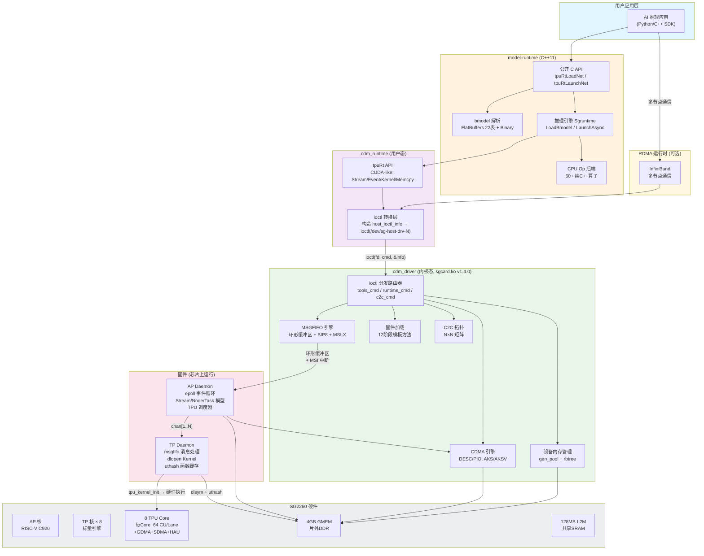

### 1.3 关键发现与注意事项

- **CPU Op 后端不使用 OneDNN**: 60+ CPU 算子全部是纯 C++ 实现，使用标准库数学函数 (`std::sin`/`std::cos`/`std::exp`/`std::log`) 和 `std::thread` 并行 (`BM_CPU_LAYER_NUM_THREAD` 环境变量控制)。`USING_ONEDNN` 编译选项仅在构建系统层面存在，但当前 CPU 算子实现中不包含任何 OneDNN/MKL-DNN API 调用。
- **Backend AKS vs AKSV**: BM1690 使用 AKS (8核)，BM1690E 使用 AKSV (4核)。`tpuRtLoadNet` 总是传入 `BackendAks()`，但 `LoadBmodel()` 会自动从 bmodel 的 chip 字段修正为正确的 backend。
- **已知 Bug**: LoadBmodel 中存在 null-dereference 隐患（`if (net->context == nullptr)` 后访问 `net->context->neuron_size`）；CPU Scatter 算子的 MIN/MAX 模式使用 `+=` 而非 `=`。

### 1.4 双模式设计

| 模式 | `USING_CMODEL=ON` (Emulator) | `USING_CMODEL=OFF` (Firmware) |
|---|---|---|
| 运行平台 | x86 主机 | RISC-V 交叉编译 (芯片上运行) |
| 通信方式 | Unix Domain Socket / TCP | 环形缓冲区 (BAR 共享内存) + MSI 中断 |
| TP 固件 | 多线程 pthread 模拟 (每 TP 核一线程) | 真实 RISC-V 标量核 (8 core) |
| AP 固件 | Socket 通信 (fd=read/write) | 内存映射硬件寄存器 (ioremap) |
| 内核驱动 | 不加载 | sgcard.ko (PCIe) 或 SoC platform_driver |
| 安装路径 | `/opt/tpuv7/tpuv7-runtime-emulator_*` | `/opt/tpuv7/tpuv7-runtime_*` |

---

## 2. 顶层构建系统

### 2.1 构建选项

```cmake
# 核心模式开关
USING_CMODEL=ON/OFF     # Emulator vs 真实硬件
USING_DEBUG=ON/OFF      # Debug (-g -O0) vs Release (-O3)
USING_ONEDNN=ON/OFF     # OneDNN CPU 加速后端

# Firmware 专项
BUILD_RTTHREAD=ON/OFF   # TP 使用 RT-Thread RTOS (替代 Linux userspace)
BUILD_SO=ON/OFF         # 编译 tp_Image.so (动态库模式)

# 交叉编译
CROSS_COMPILE_PATH      # RISC-V Linux 工具链
RTT_EXEC_PATH           # RISC-V musl 工具链 (RT-Thread)
CMAKE_TOOLCHAIN_FILE    # 工具链描述文件 (toolchain-riscv64-linux.cmake)
```

### 2.2 子模块依赖

```
CMakeLists.txt (顶层)
├── cdmlib/                         # 递归 add_subdirectory
│   ├── host/                       #   主机侧: cdm_driver + cdm_runtime + tpu-smi
│   └── fw/                         #   固件侧: AP daemon + TP daemon
├── model-runtime/bmodel/           # bmodel FlatBuffers 解析 (独立库)
├── model-runtime/runtime/          # 推理引擎 (链 bmodel + cdm_runtime)
├── rdma_rt/                        # RDMA 通信 (仅 USING_CMODEL=ON)
├── precompiled/                    # version.h.in → version.h (编译时间戳注入)
└── doc/                            # Sphinx RST 文档
```

### 2.3 打包产物

```
# Emulator 模式
tpuv7-runtime-emulator_1.9.3_amd64.deb       # 运行时库 + 工具
tpuv7-runtime-emulator-dev_1.9.3_amd64.deb   # 头文件 + 开发库

# 真实硬件模式
tpuv7-runtime_1.9.3_amd64.deb                # 运行时
tpuv7-runtime-dev_1.9.3_amd64.deb            # 开发包
tpuv7-driver_1.4.0_amd64.deb                 # 内核驱动 (DKMS)
```

---

## 3. CDM 内核驱动 (`cdmlib/host/cdm_driver/`)

### 3.1 总览

`cdm_driver` 是一个 **Linux 内核模块** (`sgcard.ko`，驱动名 `sg-host-drv`)，版本 1.4.0，GPL-2.0。它有两种平台模式：

- **PCIe 模式 (默认)**: `module_init(pci_init)` — 枚举 PCI 设备 (vendor 0x1f1c:0x1690, 0x16c3:0x414b)，注册 pci_driver
- **SoC 模式**: `module_platform_driver(sg_driver)` — 匹配 DT `"tpu,aks_host_driver"` 或 ACPI `"SOPH0009"`

**可选功能宏**:
```
ENABLE_C2C=1        # Chip-to-Chip 互联
ENABLE_RUNTIME=1    # Stream/Event/Task 运行时 API
ENABLE_DEBUGFS=1    # /proc/sgdrv 调试接口
ENABLE_VETH=1       # 虚拟以太网 (Host↔AP/RP)
ENABLE_RDMA=auto    # 检测 MLNX_OFED → RDMA peer memory
ENABLE_RP=0         # RP 协处理器支持
```

**核心源文件**:

| 文件 | 功能 |
|---|---|
| `sgdrv.h` | 用户态 ABI 契约: ioctl 命令号、所有 U/K 边界结构体 (`task_head`, `host_request_action`, `host_ioctl_info`, `cdma_description`) |
| `sgdrv_internal.h` | 驱动心脏: `struct sg_dev` (~120字段), `struct tpu_chip` (状态机), `struct tpu_card`, `struct callback_function_t` (策略虚表) |
| `sgdrv_fops.c` (2690行) | 字符设备 (`/dev/sg-host-drv-N`) + ioctl 命令分发路由器 |
| `sgdrv_fops.h` | 文件操作声明 |
| `sgdrv_pcie.c` (788行) | PCIe 平台驱动: probe/remove + BAR iomap + MSI-X |
| `sgdrv_soc.c` (394行) | SoC 平台驱动 (替代 PCIe) |
| `sgdrv_card.c` | 板卡拓扑: 最多 16 卡 × 4 芯片/卡 |
| `sgdrv_chip.c` | 芯片状态机编排 + 回调策略选择 |
| `sgdrv_io.c` (636行) | MMIO 寄存器读写层 + iATU 编程 |
| `msgfifo.c` (35KB) | Host↔Device 消息 FIFO + IRQ 下半部 |
| `sgdrv_fw.c` (1454行) | 多阶段固件加载 (模板方法模式) |
| `sgdrv_module_stubs.h` | 可选模块的空操作桩 (消除调用侧 `#ifdef`) |
| `sgdrv_topology.c` | C2C 端口拓扑 N×N 矩阵构建 |
| `sgdrv_napi.c` (712行) | 虚拟以太网 vethap/vethrp |
| `aks/sgdrv_cdma.c` (674行) | BM1690 变体 CDMA 引擎 |
| `aksv/sgdrv_cdma.c` (1616行) | BM1690E 变体 CDMA 引擎 (级联模式) |

### 3.2 芯片状态机

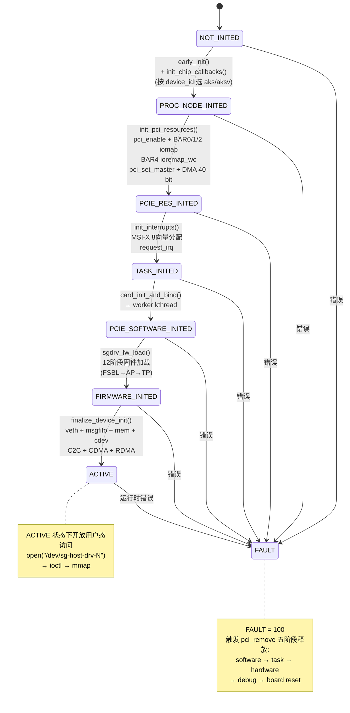

### 3.3 PCIe 探测与初始化流程

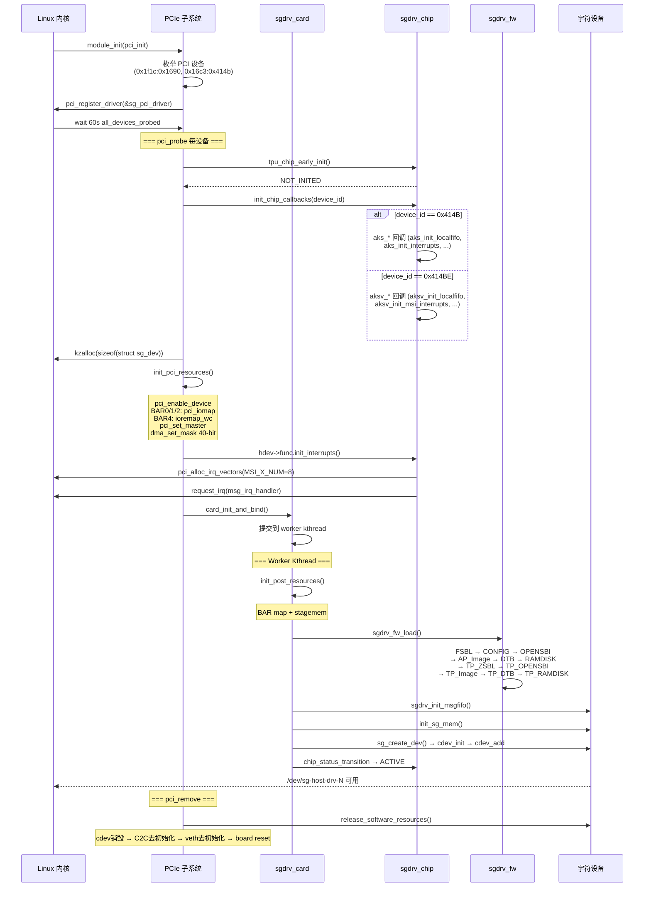

### 3.4 ioctl 命令分发架构

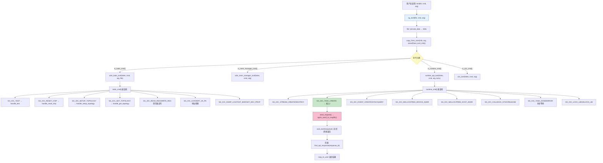

用户态通过 `/dev/sg-host-drv-N` 字符设备与驱动交互，所有操作汇聚到 `sg_ioctl()`：

```c
// sgdrv_fops.c 核心分发逻辑
static long sg_ioctl(struct file *file, unsigned int cmd, unsigned long arg) {
    // 1. 从 file->private_data 恢复 hdev
    struct sg_dev *hdev = file->private_data;

    // 2. copy_from_user 获取完整的 host_ioctl_info (含 request + task + kernel_info + response)
    struct host_ioctl_info *info = kmalloc(sizeof(*info), GFP_KERNEL);
    copy_from_user(info, (void __user *)arg, sizeof(*info));

    // 3. 命令分类 → 三级路由
    if (is_tools_cmd(cmd))
        cdm_tools_ioctl(hdev, cmd, arg, file);     // 工具类
    else if (is_mem_manager_cmd(cmd))
        cdm_mem_manager_ioctl(hdev, cmd, arg);     // 内存管理类
    else if (is_runtime_cmd(cmd))
        runtime_api_ioctl(hdev, cmd, arg, &ctx);   // 运行时 API 类
    else if (is_c2c_cmd(cmd))
        c2c_ioctl(hdev, cmd, arg);                 // C2C 拓扑类
}
```

**工具命令表** (`tools_cmd[]`):

| ioctl 命令 | 处理函数 | 功能 |
|---|---|---|
| `SG_IOC_TEST` | handle_test | 连通性测试 |
| `SG_IOC_RESET_CHIP` | handle_reset_chip | 芯片复位 (board reset + C2C 处理) |
| `SG_IOC_SETUP_TOPOLOGY` | handle_setup_topology | 初始化 C2C 拓扑发现 |
| `SG_IOC_GET_TOPOLOGY` | handle_get_topology | 读取 C2C 拓扑矩阵 |
| `SG_IOC_CONVERT_VA_PA` | convert_va2pa | VA→PA 地址转换 (RDMA) |
| `SG_IOC_READ_REG` | handle_read_reg | 读寄存器 |
| `SG_IOC_WRITE_REG` | handle_write_reg | 写寄存器 |
| `SG_IOC_DUMP_LOG` | handle_dump_log | 导出设备日志 |
| `SG_IOC_TEST_BAR` | handle_test_bar | BAR 空间压力测试 |
| `SG_IOC_GET_DEV_PROP` | handle_get_dev_prop | 获取设备属性 |

**运行时命令表** (`runtime_cmd[]`):

| ioctl 命令 | 处理函数 | 功能 |
|---|---|---|
| `SG_IOC_STREAM_CREATE` | rt_stream_create | 创建流 → 通知 AP |
| `SG_IOC_STREAM_DESTROY` | rt_stream_destroy | 销毁流 |
| `SG_IOC_CALLBACK_SYNC` | rt_callback_sync | 回调同步等待 |
| `SG_IOC_CALLBACK_RELEASE` | rt_callback_release | 释放回调 |
| `SG_IOC_EVENT_CREATE` | rt_event_create | 创建事件 |
| `SG_IOC_EVENT_SYNC` | rt_event_sync | 事件同步 |
| `SG_IOC_EVENT_QUERY` | rt_event_query | 查询事件状态 |
| `SG_IOC_TASK_CREATE` | rt_task_create | **核心**: 创建任务 (一键完成 request+task+kernel 提交) |
| `SG_IOC_CVTASK_CREATE` | rt_cvtask_create | 创建 CV 任务 (RP) |
| `SG_IOC_MALLOC_DEVICE_ADDR` | rt_malloc_device_addr | 分配设备内存 |
| `SG_IOC_FREE_DEVICE_ADDR` | rt_free_device_addr | 释放设备内存 |
| `SG_IOC_MALLOC_HOST_ADDR` | rt_malloc_host_addr | 分配主机端内存 |
| `SG_IOC_FREE_HOST_ADDR` | rt_free_host_addr | 释放主机端内存 |
| `SG_IOC_TASK_DONE` | rt_task_done_response_sync | 等待任务完成响应 |
| `SG_IOC_TASK_ERROR` | rt_task_error | 任务错误处理 |
| `SG_IOC_LOCK_LIB` | handle_lock_lib | 锁定库文件 |
| `SG_IOC_UNLOCK_LIB` | handle_unlock_lib | 解锁库文件 |
| `SG_IOC_ALLOC_DEV_MEM` | rt_alloc_dev_mem | 直接分配设备内存 |
| `SG_IOC_GET_DEV_MEM` | rt_get_dev_mem | 查询设备内存信息 |
| `SG_IOC_GET_INSTR_CACHE` | rt_get_instr_cache | 查询指令缓存信息 |

### 3.5 MSGFIFO 通信协议

#### 3.5.1 环形缓冲区操作

```
TX (Host → AP):
┌─────────────────────────────────────────────┐
│  tx_circ_buf:                               │
│  ┌──────┬──────┬────────────────────────┐   │
│  │ head │ tail │ phy_addr (BAR 地址)     │   │
│  │(Host │(AP   │                        │   │
│  │ 写)  │ 读)  │                        │   │
│  └──────┴──────┴────────────────────────┘   │
│                                             │
│  MSG_FIFO_SIZE = 1MB (1 << 20)             │
│  head/tail 是 cacheline 对齐的 32-bit 值    │
└─────────────────────────────────────────────┘

RX (AP → Host):
┌─────────────────────────────────────────────┐
│  rx_circ_buf:                               │
│  ┌──────┬──────┬────────────────────────┐   │
│  │ head │ tail │ phy_addr               │   │
│  │(AP   │(Host │                        │   │
│  │ 写)  │ 读)  │                        │   │
│  └──────┴──────┴────────────────────────┘   │
└─────────────────────────────────────────────┘
```

#### 3.5.2 发送流程

```c
int sgdrv_send_to_msgfifo(struct sg_dev *hdev, uint8_t *src, int size) {
    struct cacheline_align_circ_buf circ_buf;

    // 1. 获取 TX 环形缓冲区状态 (head=Host写位置, tail=AP读位置)
    sgdrv_get_tx_circinfo(hdev, &circ_buf);

    // 2. 等待剩余空间 ≥ size (最多睡眠 100-1000us)
    wait_for_fifo_space(hdev, &circ_buf, size, &left);

    // 3. 计算 BIP8 校验 (64-bit XOR)
    uint64_t bip8 = calculate_bip8(hdev, src, size);

    // 4. 拷贝数据到共享内存 (BAR 映射的物理地址)
    dst = circ_buf.phy_addr + circ_buf.head;
    memcpy_toio((void *)dst, src, size);

    // 5. 追加 BIP8 校验值
    memcpy_toio((void *)(dst + size), &bip8, sizeof(bip8));

    // 6. 更新 head 指针 → 触发硬件中断
    hdev->tx_circ_buf.head = (head + size + BIP8_SIZE) & (MSG_FIFO_SIZE - 1);
    // Linux 内核环形缓冲宏: CIRC_SPACE, CIRC_SPACE_TO_END, CIRC_CNT
}
```

#### 3.5.3 IRQ 下半部分发

```c
// MSI-X 中断处理 → msgfifo.c 中处理
int sgdrv_msg_irq_handler(int irq, void *data) {
    struct sg_dev *hdev = (struct sg_dev *)data;

    // 1. 读取 RX 环形缓冲区
    sgdrv_get_rx_circinfo(hdev, &rx_circ_buf);
    while (CIRC_CNT(rx_circ_buf.head, rx_circ_buf.tail, MSG_FIFO_SIZE) > 0) {

        // 2. 读取 BIP8 校验
        calculate_bip8(hdev, rx_data, rx_size);

        // 3. 解析 host_response_action → 获取 type
        struct host_response_action *response = (void *)rx_data;

        // 4. 按类型分发
        switch (response->type) {
        case STREAM_CREATE_RESPONSE:   process_stream_create_request(...);  break;
        case EVENT_CREATE_RESPONSE:    process_event_create_request(...);   break;
        case CALLBACK_RESPONSE:        process_callback_request(...);       break;
        case MALLOC_DEVICE_MEM_RESPONSE: process_malloc_dev_mem_req(...);  break;
        case SETUP_C2C_RESPONSE:       process_setup_c2c_req(...);         break;
        case TASK_DONE_RESPONSE:       process_transfer_msg(...);           break;
        case BTM_TASK_DONE_RESPONSE:   process_transfer_msg(...);           break;
        case TASK_ERROR_RESPONSE:      process_transfer_msg(...);           break;
        case EVENT_TRIGGERED:          process_event_triggered_msg(...);    break;
        }

        // 5. 唤醒对应 waitqueue
        wake_up_interruptible(&hdev->ap_wqueue_list[response->type]);
    }
}

// 同步等待响应
int send_request(struct sg_dev *hdev, void *request_buf, int size, enum msg_t msg_type) {
    // 1. 发送请求到 MSGFIFO
    sgdrv_send_to_msgfifo(hdev, request_buf, size);

    // 2. 等待响应 (可中断睡眠)
    wait_event_interruptible_timeout(
        hdev->ap_wqueue_list[msg_type],
        find_api_response(hdev, response_id) != NULL,
        timeout_jiffies
    );

    // 3. 匹配并返回响应
    response = find_api_response(hdev, response_id);
    // 通过 response_id 精确匹配, 遍历 api_response 链表
}
```

### 3.6 设备内存管理

```
内存层次结构:
  zone (区)
    └── rank (级)
          └── bank (组) → gen_pool (通用内存池) + rbtree (红黑树簿记)

分配流程:
  mem_pool_alloc(hdev, sg_mem, cid=process_tgid, size, parallel_flag)
    ├── parallel_flag == 0 → zone[0] (设备内存)
    ├── parallel_flag == 0xf → zone[1] (指令缓存, 如果 config.instr_enable)
    ├── gen_pool_alloc(zone->rank->bank->gen_pool, size) → physical address
    ├── record_mem_info(rbtree, pa, size, cid)           # 红黑树记账
    └── 返回物理地址

释放流程:
  mem_pool_free(hdev, sg_mem, pa)
    ├── mem_get_recorded_entry(rbtree, pa) → 查找记录
    ├── gen_pool_free(gen_pool, pa, size)
    └── mem_del_recorded_entry(rbtree, pa)  # 删除簿记

进程退出清理:
  mem_pool_free_by_cid(hdev, cid)
    └── rbtree 前序遍历 → 释放该 cid (tgid) 的所有分配
```

### 3.7 CDMA 引擎编程

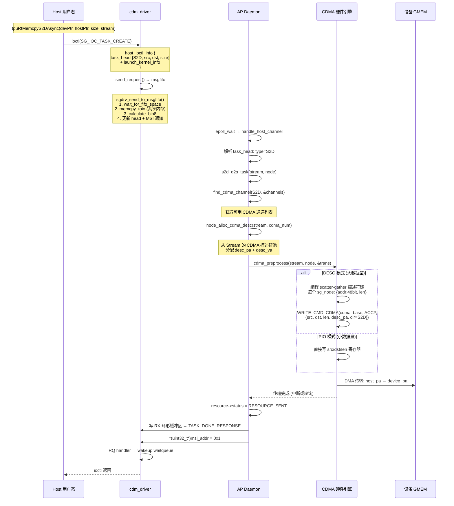

CDMA (Command DMA) 是硬件 DMA 引擎，用于 Host↔Device 和 Device↔Device 数据传输。

**AKS 变体 (BM1690)**:
- CDMA 寄存器基址: `CDMA_BASE + CDMA_MAIN_CTRL(0x800)`
- 支持 INT8→FP20/BF16 数据格式转换
- CDMA 方向: S2L/L2S/S2S/L2L/D2D/D2S/S2D
- stagemem: 4 槽位共享内存缓冲区

**AKSV 变体 (BM1690E)**:
- 增强 CDMA: 级联模式 (CASCADE_MODE: non/two/four)
- PMU 性能计数器 (H0-H7)
- per-channel `struct cdma` 状态 (base_addr, cascade_mode, sg_node, pmu paddr)
- `struct cdma_sg_node`: 48-bit 地址 + llen (打包)

**S2D 传输示例 (DESC 模式)**:
```c
// 1. 分配 CDMA 描述符
cdma_desc = alloc_cdma_desc(stream, CDMA_TYPE_SEND);

// 2. 构建 scatter-gather 列表
cdma_sg_list[0] = {.addr = host_pa, .len = chunk_size};

// 3. 编程 CDMA 寄存器
WRITE_CMD_CDMA(cdma_base, CDMA_CMD_ACCP0, {
    .src = host_pa,
    .dst = device_pa,
    .len = total_size,
    .desc_pa = desc_phys_addr,
    .cdma_direction = S2D,
    .cdma_mode = CDMA_DES
});

// 4. 等待完成 (或异步通过中断)
wait_for_cdma_completion(cdma_base);
```

**PIO 模式 vs DESC 模式**:
- PIO: 直接编程 src/dst/len 寄存器，适合小数据量
- DESC: 描述符链 (scatter-gather list)，适合大数据量 + 非连续内存

### 3.8 固件加载

`sgdrv_fw_load()` 使用**模板方法模式**加载多阶段固件：

```
sgdrv_fw_load(hdev)
├── fsbl_aks/fsbl_aksv          # First Stage Bootloader
├── CONFIG                      # 设备配置 (INI 文件)
├── OPENSBI (ap_fw_dynamic)     # OpenSBI 固件 (AP)
├── AP_Image                    # Linux 内核镜像 (AP)
├── DTB                         # Device Tree Blob (AP)
├── RAMDISK (ap_rootfs.cpio)    # 根文件系统 (AP)
├── TP_ZSBL                     # TP Zero Stage Bootloader
├── TP_OPENSBI                  # OpenSBI 固件 (TP)
├── TP_Image (或 tp_Image.so)   # TP 内核/动态库
├── TP_DTB                      # Device Tree (TP)
└── TP_RAMDISK (tp_rootfs.cpio) # 根文件系统 (TP)

每阶段通过 sg_fw_desc 描述:
  struct sg_fw_desc {
      char name[64];
      u32 type;           // FSBL/CONFIG/OPENSBI/AP_IMAGE/...
      u64 addr;           // 加载目标地址
      u64 flag;           // SKIP / LOAD
      int (*load_pre)(struct sg_dev *, struct sg_fw_desc *);
      int (*load_post)(struct sg_dev *, struct sg_fw_desc *);
  };
```

---

## 4. CDM 运行时 API (`cdmlib/host/cdm_runtime/`)

### 4.1 主 API (`tpuv7_rt.h`)

运行时 API 是用户态程序与 TPU 交互的唯一接口，模仿 CUDA Driver API 设计：

```c
// ====== 初始化 ======
tpuRtInit(void);                                           // 全局初始化
tpuRtGetDeviceCount(int *count);                           // 获取芯片数量
tpuRtSetDevice(int device);                                // 选择当前设备
tpuRtGetDevice(tpuRtDeviceProperties_t *props, int dev_id); // 设备属性

// ====== 内存管理 ======
tpuRtMalloc(void **devPtr, size_t size, int parallel_num);  // 设备内存 (0=普通, 0xf=指令缓存)
tpuRtFree(void **devPtr, int free_num);
tpuRtMallocHost(void **ptr, size_t size);                  // 主机固定内存
tpuRtFreeHost(void *ptr);
tpuRtMallocInstr(void **devPtr, size_t size, int parallel_num); // 指令缓存专用
tpuRtFreeInstr(void **devPtr, int free_num);

// ====== 数据拷贝 ======
tpuRtMemcpyS2D(void *devPtr, const void *hostPtr, size);    // 同步 S2D
tpuRtMemcpyD2S(void *hostPtr, const void *devPtr, size);    // 同步 D2S
tpuRtMemcpyD2D(void *dstDev, const void *srcDev, size);     // 同步 D2D
tpuRtMemcpyS2DAsync(..., tpuRtStream_t stream);             // 异步变体
tpuRtMemcpyD2SAsync(...);
tpuRtMemcpyD2DAsync(...);

// ====== Stream & Event ======
tpuRtStreamCreate(tpuRtStream_t *pStream);
tpuRtStreamDestroy(tpuRtStream_t stream);
tpuRtStreamSynchronize(tpuRtStream_t stream);
tpuRtStreamAddCallback(tpuRtStream_t stream, callback, userData);
tpuRtStreamWaitEvent(tpuRtStream_t stream, tpuRtEvent_t event);

tpuRtEventCreate(tpuRtEvent_t *pEvent);
tpuRtEventRecord(tpuRtEvent_t event, tpuRtStream_t stream);
tpuRtEventSynchronize(tpuRtEvent_t event);
tpuRtEventQuery(tpuRtEvent_t event);
tpuRtEventElapsedTime(float *ms, tpuRtEvent_t start, tpuRtEvent_t end);

// ====== Kernel 模块管理 ======
tpuRtKernelLoadModuleFile(const char *path, stream);         // 从文件加载 kernel .so
tpuRtKernelLoadModule(const char *data, size_t len, stream); // 从内存加载
tpuRtKernelLaunch(module, func_name, args, size,              // 同步启动
                  group_num, block_num, stream);
tpuRtKernelLaunchAsync(...);                                  // 异步启动
tpuRtKernelUnloadModule(tpuRtKernelModule_t module, stream);

// ====== 多卡通信 ======
tpuRtSetupC2C(int device_id);                                // 初始化 C2C 链路
tpuRtSetupTopology(void);                                    // 全局拓扑发现
tpuRtGetTopology(struct c2c_port_info **topology);           // 读取拓扑矩阵
tpuRtKernelLaunchWithLock(..., uuid, rank_id, rank_num);     // 跨卡同步 Kernel 启动
```

### 4.2 设备管理 API (`tpuv7_manager.h`)

```c
tpuRtGetChipCount(int *chip_count);               // 芯片总数
tpuRtGetStat(int device_id, dev_stat_t *stat);    // 显存使用+TPU利用率
tpuRtGetMiscInfo(int device_id, misc_info_t *m);  // BDF/驱动版本/芯片ID
tpuRtGetBoardPower(int device_id, int *power);    // 板卡功耗
tpuRtGetChipTemp(int device_id, int *temp);       // 芯片温度
tpuRtGetSN(int device_id, char *sn);              // 芯片序列号
tpuRtGetAllMemory(uint64_t *total);               // 总显存
tpuRtGetFreeMemory(uint64_t *free);               // 空闲显存
tpuRtGetPeakMemory(uint64_t *peak);               // 峰值显存
tpuRtResetPeakMemory(void);                       // 重置峰值
```

### 4.3 运行时实现文件

| 文件 | 功能 |
|---|---|
| `tpuv7_rt.c` | 主运行时实现：Stream/Event/Kernel/Memcpy/Malloc 全部 API |
| `tpuv7_manager.c` | 设备管理实现：温度/功耗/利用率/序列号查询 |
| `communication_layer.c` | Host 侧 MSGFIFO 通信层：构造 host_ioctl_info + ioctl 调用 |
| `tpu_scalar_api.c` | Scalar API：标量核相关的专用接口 |
| `sglib_md5.c` | MD5 校验 (Kernel 模块完整性) |
| `hashtable.c` | 哈希表 (内部数据结构) |
| `socket.c` | Socket 工具 (cmodel 模式通信) |

### 4.4 运行时内部实现

`cdm_runtime` 的主要职责是将上述 API 调用**转换为 ioctl 系统调用**，发送到 `cdm_driver`：

```
用户调用: tpuRtMemcpyS2D(devPtr, hostPtr, size)
    │
    ├── 构造 host_ioctl_info { TASK_CREATE, task_head{S2D, src, dst, size} }
    ├── ioctl(fd, SG_IOC_TASK_CREATE, &info)
    │     └── [内核] send_request → msgfifo → AP Daemon
    │              └── [AP] cdma_preprocess → CDMA 引擎
    │                     └── [AP] done → TASK_DONE_RESPONSE → msgfifo
    │                            └── [内核] IRQ handler → wakeup
    ├── ioctl(fd, SG_IOC_TASK_DONE, &info)  # 等待完成
    └── 返回

用户调用: tpuRtKernelLoadModuleFile("libkernels.so", stream)
    │
    ├── 读取 .so 文件内容
    ├── 构造 host_ioctl_info { module_info{name, md5, addr, size} }
    ├── ioctl(fd, SG_IOC_TASK_CREATE, &info)
    │     └── [内核] send_request → msgfifo
    │            └── [AP] load_module_api_task:
    │                   ├── map_addr + 写文件 → dlopen
    │                   ├── dlsym("tpu_kernel_init_v2" 或 "tpu_kernel_init")
    │                   └── tpu_kernel_init(core_id, &context)
    └── 返回 module handle
```

---

### 4.5 辅助模块

#### tpu-smi — TPU 系统管理接口 (`cdmlib/host/tpu-smi/`)

类似 NVIDIA 的 `nvidia-smi`，提供命令行工具监控 TPU 设备状态：

| 源文件 | 功能 |
|---|---|
| `tpu_smi.cpp` | 主入口：解析命令行参数，调用 creator 构建查询 |
| `tpu_smi_cmdline.cpp` | 命令行参数解析 (getopt) |
| `tpu_smi_creator.cpp` | 查询创建器：获取所有 TPU 设备信息 |
| `tpu_smi_display.cpp` | 终端格式化展示 (表格/列表) |
| `tpu_smi_display_topology.cpp` | C2C 互连拓扑可视化展示 |
| `tpu_smi_display_sglink.hpp` | SG-Link 链路状态展示 |
| `tpu_smi_test.cpp` | 硬件诊断测试 (BAR/mem/reg) |
| `util.cpp` | 通用工具函数 |

**监控信息**: 芯片温度、板卡功耗、显存使用率、TPU 利用率、PCIe 链路速度/宽度、C2C 拓扑矩阵、芯片序列号、驱动版本。

#### cdm_tools — 调试与诊断工具 (`cdmlib/host/cdm_tools/`)

| 工具 | 功能 |
|---|---|
| `tpu-ctrl.c` | TPU 控制工具：固件更新、芯片复位、模式切换 |
| `tpu-debugger.cpp` | TPU 调试器：寄存器读写、内存 dump、断点调试 |
| `tpu_fielddiag.c` | 现场诊断：完整的硬件自检套件 |
| `test_reg.c` | 寄存器读写测试 |
| `test_cdma.c / test_cdma_perf.c` | CDMA 功能/性能测试 |
| `test_gdma.c` | GDMA 测试 |
| `test_bar_perf.c` | BAR 空间带宽测试 |
| `test_memory_track.c` | 内存泄漏跟踪 |
| `test_tpuv7_manager.c` | 设备管理 API 测试 |
| `test_dump_log.c` | 设备日志导出 |
| `efuse_tool.c` | eFuse 熔丝编程 |
| `instr_cache.c` | 指令缓存管理 |
| `monitor_chip.sh` | 芯片监控脚本 |

#### cdm_test — 测试套件 (`cdmlib/host/cdm_test/`)

- `host_case/` — 功能回归测试用例
- `host_test/` — 集成测试
- `host_test_slt/` — SLT (System Level Test) 验收测试

#### config_file — 板卡配置文件 (`cdmlib/host/config_file/`)

每块板卡/芯片有不同的内存布局和通道配置，通过 INI 文件指定：

| 配置文件 | 对应板卡 |
|---|---|
| `aks_evb_config.ini` | AKS (BM1690) EVB 开发板 |
| `aksv_evb_config.ini` | AKSV (BM1690E) EVB 开发板 |
| `aks_soc_config.ini` | SoC 模式配置 |
| `mt00_config_chip0/1.ini` | MT00 板卡 (2 芯片) |
| `mt00v_config_chip[0-3].ini` | MT00V 板卡 (4 芯片) |
| `yu08-u1_config_chip0/1.ini` | YU08-U1 板卡 (2 芯片) |

配置文件由 `ini.c` (内核态 inih 移植) 解析，填充 `struct runtime_config`，其中包含：`chip_type`、`tpu_num`、`channel_num`、`device_mem_start/size`、`msgfifo_addr/size`、`tgs_sched_enable`、`debug_level` 等关键运行时参数。

#### 3rdparty — 第三方依赖 (`cdmlib/host/3rdparty/`)

包含编译 `cdm_runtime` 所需的外部库头文件和源码。

### 4.6 Stream 原语实现深度追踪

#### 4.6.1 Stream 创建: `tpuRtStreamCreate`

**完整调用链**: Host API → ioctl → 内核 MSGFIFO → AP Daemon → stream char dev 创建

```
tpuRtStreamCreate(&stream)                               // tpuv7_rt.c:545
  ├── sgstrm = calloc(1, sizeof(struct tpuRtStream))     // 分配用户态 stream 对象
  ├── sg_stream_create(sgstrm)                            // tpuv7_rt.c:97
  │     ├── info.send_info.type = STREAM_CREATE_REQUEST   // 构造请求
  │     ├── sgdev_communication(sgdev, &info)             // communication_layer.c:23
  │     │     ├── switch(info.send_info.type):
  │     │     │     case STREAM_CREATE_REQUEST → SG_IOC_STREAM_CREATE
  │     │     │     case STREAM_DESTROY_REQUEST → SG_IOC_STREAM_DESTROY
  │     │     │     case EVENT_CREATE_REQUEST → SG_IOC_EVENT_CREATE
  │     │     │     case TASK_CREATE_REQUEST → SG_IOC_TASK_CREATE
  │     │     │     ...
  │     │     └── ioctl(sgdev->fd, ioctl_msg, &info)     // 进入内核
  │     │
  │     │     ┌── 进入 cdm_driver 内核态 ─────────────────────┐
  │     │     │ sg_ioctl(file, cmd, arg)              // sgdrv_fops.c:2598
  │     │     │   └── runtime_api_ioctl(hdev, cmd, arg, &ctx)
  │     │     │         └── 线性查找 runtime_cmd[] table:
  │     │     │               SG_IOC_STREAM_CREATE → rt_stream_create()
  │     │     │
  │     │     │ rt_stream_create(hdev, arg, &ctx)     // sgdrv_fops.c:1944
  │     │     │   ├── ctx->send_info.pid = current->tgid
  │     │     │   ├── send_request(hdev, STREAM_CREATE_REQUEST, ...)
  │     │     │   │     └── process_stream_create_request()  // msgfifo.c:686
  │     │     │   │           ├── process_msg_core_info()    // 写入 MSGFIFO 环形缓冲区
  │     │     │   │           └── wait_event_*(ap_wqueue_list[RESPONSE])
  │     │     │   │               // 阻塞等待 AP Daemon 响应
  │     │     │   ├── 记录 stream_id 到 file→context 链表
  │     │     │   └── kmalloc stream_node → event_list → 加入 hdev→rt.stream_info.list
  │     │     └────────────────────────────────────────────────────┘
  │     │
  │     │     [AP Daemon 收到 STREAM_CREATE_REQUEST]
  │     │     stream_create_request(device, action)         // main.c:3367
  │     │       ├── stream = malloc(sizeof(struct sg_stream))
  │     │       ├── stream->stream_id = allocate_stream_id(device)
  │     │       │     └── __sync_add_and_fetch(&device->max_stream_id, 1)
  │     │       ├── INIT_LIST_HEAD(&stream->node_list)      // 任务/事件等待队列
  │     │       ├── INIT_LIST_HEAD(&stream->running_list)   // 运行中节点队列
  │     │       ├── 注册 ctx (hpid2ctx hashtable)
  │     │       ├── set_smid_target(&device->smid2sm, stream_id, stream)
  │     │       ├── stream_scheduler_init(stream, action)   // 绑定调度器策略
  │     │       ├── [硬件模式] ioctl(channel[CHANNEL_HOST].fd,
  │     │       │          SG_IOC_STREAM_CREATE, &stream_info)
  │     │       │   └── 内核 ap_sgcard: create_stream_cdev()
  │     │       │         ├── kmalloc v_port
  │     │       │         ├── device_create(sg-stream-file-<id>)
  │     │       │         ├── cdev_init(&port->cdev, &sg_fops) // read/write/ioctl
  │     │       │         ├── kmalloc port_rx_buf (2MB + 512KB reserve)
  │     │       │         └── cdev_add() + list_add → channel→port_list
  │     │       ├── system("mdev -s")                      // 创建设备节点
  │     │       ├── pthread_create(&stream->stream_pth, stream_function, stream)
  │     │       └── 发送 STREAM_CREATE_RESPONSE → Host channel
  │     │
  │     └── sgstrm->id = info.receive_info.stream_id       // 获取分配的 stream_id
  ├── DL_APPEND(sgdev->stream_list, sgstrm)                // 加入设备 stream 链表
  └── *pStream = sgstrm
```

**数据结构**: 用户态 `struct tpuRtStream` 结构体 (`sgrt_internal.h:153`):
```c
typedef struct tpuRtStream {
    unsigned int id;               // AP Daemon 分配的全局唯一 stream_id
    struct tpuRtStream *prev;      // UTlist 双向链表
    struct tpuRtStream *next;
    void *parent;                  // 指向 struct sg_device
    struct tpuRtCallback *callback_list; // stream 级 callback 链表
} *tpuRtStream_t;
```

AP Daemon 侧的 `struct sg_stream` (main.c/sg_rt.h:637) 要丰富得多，包含:
- `fd` + `wake_up_stream_fd`: 两个字符设备 fd (数据通道 + 唤醒通道)
- `epoll` + `epfd`: stream 线程自己的 epoll 实例
- `node_list` + `running_list`: 待处理/运行中的 node 队列
- 计数器: `all_task_node_nums`, `all_event_node_nums`, `queue_task_node_nums`
- `latest_trigger_eve`: 最近一次 event 的触发 ID
- `allocate_block_resource`: 指向调度器函数的函数指针
- `pthread_exit` + `stream_status`: 生命周期控制

#### 4.6.2 Stream 销毁: `tpuRtStreamDestroy`

```c
tpuRtStatus_t tpuRtStreamDestroy(tpuRtStream_t stream) {
    sg_stream_destroy(stream);    // tpuv7_rt.c:128
    //  1. 清理所有 callback: pthread_join 等待 callback 线程结束
    //  2. 清理所有 event record: 遍历 sgdev->event_list,
    //     删除指向本 stream 的 tpuRtRecord
    //  3. DL_DELETE 从 sgdev->stream_list 移除
    //  4. sgdev_communication → ioctl(SG_IOC_STREAM_DESTROY)
    //       → AP Daemon stream_destroy_request()
    //         ├── 加入 device->waitting_destroy_stream 链表
    //         ├── pthread_detach(stream->stream_pth)
    //         └── 发送 STREAM_DESTROY_RESPONSE
    //       → [AP Daemon] destroy_stream() 后回收
    //       → [内核] rt_stream_destroy: 遍历删除 event_node + stream_node
    //  5. free(sgstrm)
}
```

#### 4.6.3 Stream 同步: `tpuRtStreamSynchronize`

`tpuRtStreamSynchronize` 的内部实现**并非一个独立的硬件原语**，而是通过发送 `tpu_poll` kernel + 创建临时 Event + Event Record + Event Sync 组合实现:

```c
// tpuv7_rt.c:577
tpuRtStatus_t tpuRtStreamSynchronize(tpuRtStream_t stream) {
    // 1. 构造 "tpu_poll" kernel task (通知 TPU 不需要执行实际计算)
    buf->fun_name = "tpu_poll";  buf->size = 0;
    tpuRtSendLaunchKernelMsg(TPURT_API_ID_TPU_SCALAR_LAUNCH_FUNC, buf, ...);

    // 2. 创建临时 Event 并在 stream 上 record
    tpuRtEventCreate(&sgevnt);
    tpuRtEventRecord(sgevnt, stream);

    // 3. 阻塞等待该 event
    tpuRtStreamWaitEventSync(stream, sgevnt);

    // 4. 释放临时 event
    tpuRtEventFree(sgevnt, stream);
}
```

这保证了 stream 上所有之前提交的操作 (Kernel launch, Memcpy) 在返回前全部完成——Event 在 queue 中，只有前面所有 Task 完成后 Event 才会被 `check_event_complete` 触发。

#### 4.6.4 Stream Callback

```c
// tpuv7_rt.c:612
tpuRtStreamAddCallback(stream, callback, userData)
  ├── sgcbk = calloc(1, sizeof(struct tpuRtCallback))
  ├── pthread_create(&callback_threads, NULL, sg_thread_stream_callback_func, sgcbk)
  │     └── sg_thread_stream_callback_func(sgcbk)          // tpuv7_rt.c:184
  │           ├── info.send_info.type = CALLBACK_REQUEST
  │           ├── sgdev_communication(sgdev, &info)         // 通知 AP Daemon
  │           │     └── AP Daemon: callback_request()       // main.c:3532
  │           │           ├── 分配 NODE_TYPE_CALLBACK node
  │           │           ├── 插入 stream->node_list (在已有 callback node 之前)
  │           │           └── 后续 service_first_node() → 发送 CALLBACK_RESPONSE
  │           ├── sgcbk->func(sgcbk->arg)                  // 执行用户回调
  │           ├── info.send_info.type = CALLBACK_RELEASE
  │           └── sgdev_communication(sgdev, &info)         // 通知释放
  └── DL_APPEND(stream->callback_list, sgcbk)
```

### 4.7 Event/Record 原语实现深度追踪

#### 4.7.1 核心数据结构

```
struct sg_device (用户态)              tpuRtEvent 和 tpuRtRecord 的关系:
├── event_list ───────┐                        ┌─ tpuRtRecord ──┐
│   (UTlist,          │    event->record_list: │ stream = strm1 │
│    event_mutex)     │                        │ event  = evt   │
│                     ▼                        │ counter = 1    │  ← tpuRtEventRecord
│   struct tpuRtEvent {         tpuRtEvent evt │                 │    被调用 1 次
│     id: 0 (初始)     ◄──────► id: 5          ├─ tpuRtRecord ──┤
│     parent → sgdev               parent      │ stream = strm2 │
│     record_list ───────────────► record_list │ event  = evt   │  ← 同一个 event
│     last_triggered: 0                        │ counter = 1    │    在 strm2 上也
│     record_stream_id: 0                                          record 了
│     record_mutex                   }
│   }
│
├── stream_list ───────┐
│                      ▼
│   struct tpuRtStream {  id, parent, callback_list }
```

**Record 语义**: `tpuRtRecord` 记录了一个 Event 在某个 Stream 上的 "插入点"。当 Event node 在该 Stream 的执行序列中完成时，Event 被认为 "triggered"。同一个 Event 可以 Record 在多个 Stream 上，只有当所有记录点都到达时，`tpuRtEventSynchronize` 才会返回。

#### 4.7.2 Event 创建与 Record

**`tpuRtEventCreate`** (tpuv7_rt.c:752): 纯用户态操作，不触发任何 ioctl:
```c
sgevnt = calloc(1, sizeof(*sgevnt));
sgevnt->parent = sgdev;
DL_APPEND(sgdev->event_list, sgevnt);  // 仅加入设备 event 链表
pthread_mutex_init(&sgevnt->record_mutex, NULL);
```

**`tpuRtEventRecord`** (tpuv7_rt.c:809): 关键操作——将 event 插入 stream 的执行队列:
```
tpuRtEventRecord(event, stream)
  ├── 查找/创建 tpuRtRecord (stream, event, counter++)
  ├── event->record_stream_id = stream->id
  ├── info.send_info.type = EVENT_CREATE_REQUEST
  ├── info.send_info.stream_id = stream->id
  ├── info.send_info.event_id = event->id      // [硬件] 此时 event->id 可能为 0
  ├── info.send_info.record_stream_id = event->record_stream_id
  ├── sgdev_communication(sgdev, &info)
  │     ├── ioctl(SG_IOC_EVENT_CREATE, &info)    // 或 ioctl(SG_IOC_EVENT_QUERY) [见下]
  │     └── [内核] rt_event_create:              // sgdrv_fops.c:2047
  │           ├── ctx->send_info.event_id = atomic_inc_return(&hdev->rt.event_counter)
  │           ├── kmalloc event_node → list_add_tail → s_node->event_list
  │           └── send_request(EVENT_CREATE_REQUEST, ..., sync=0, NULL)
  │               // sync=0: 异步发送，不等待 AP 响应
  │               // msgfifo → AP Daemon → event_create_request()  // main.c:3575
  │               //   ├── 分配 NODE_TYPE_EVENT node
  │               //   ├── 插入 stream->node_list (在 callback node 之前)
  │               //   └── stream->queue_event_node_nums++
  │
  └── event->id = info.receive_info.event_id    // 获取内核分配的唯一 event_id
```

**关键设计**: `event->id` 在首次 Record 之前为 0，Record 后由内核原子分配一个单调递增的 ID。后续在同一 Event 上再次 Record 时复用该 ID。

#### 4.7.3 Event 同步: 阻塞等待

**`tpuRtEventSynchronize`** (tpuv7_rt.c:866): 遍历 event 上的所有 record，逐一等待:
```c
DL_FOREACH(event->record_list, rptr) {
    result = tpuRtStreamWaitEventSync(rptr->stream, event);
    // 如果 stream 已销毁 → goto again (record list 可能已变化)
}
pthread_mutex_unlock(&event->record_mutex);
```

**`tpuRtStreamWaitEventSync`** (tpuv7_rt.c:650): 阻塞等待指定 event 在指定 stream 上完成:
```c
DL_FOREACH(event->record_list, rptr) {
    if (rptr->stream == stream) { record = rptr; break; }
}
// [硬件] ioctl(SG_IOC_EVENT_SYNC, &info)
//   └── [内核] rt_event_sync:                   // sgdrv_fops.c:2182
//         if (stream_id == record_stream_id):
//           // 同 stream 等待: 在内核侧阻塞
//           wait_event_interruptible(
//             hdev->rt.ap_wqueue_list[EVENT_TRIGGERED],
//             find_api_event_id(...)  // 检查 event_id ≤ 已完成 event_id
//           )
//         else:
//           // 跨 stream 等待: 转发给 AP Daemon
//           send_request(EVENT_CREATE_REQUEST, ..., sync=0)
event->last_triggered = info.receive_info.time.end_time;
```

#### 4.7.4 Event 查询: 非阻塞轮询

**`tpuRtEventQuery`** (tpuv7_rt.c:883):
```c
record = event->record_list 的第一个元素;  // 取任意 record
if (record == NULL && event->record_stream_id != 0)
    return tpuRtSuccess;                   // event 曾经被 record 过且 record 已释放 → 已完成

// [硬件] ioctl(SG_IOC_EVENT_QUERY, &info)
//   └── [内核] rt_event_query:             // sgdrv_fops.c:2243
//         └── find_api_event_id(hdev, stream_id, event_id, &recv_info)
//               ├── 扫描 hdev→rt.stream_info.list 找到对应 stream_node
//               ├── 取第一个 event_node
//               ├── if event_node==NULL 或 event_node→event_id > event_id:
//               │     return 1 (EVENT_TRIGGERED)  // 已完成
//               └── else: return 0                // 未完成
if (info.receive_info.result == 1) {
    DL_DELETE(event->record_list, record);  // 清理已完成的 record
    free(record);
    return tpuRtSuccess;
} else {
    return tpuRtDevnotready;
}
```

**`find_api_event_id`** 的巧妙竞争逻辑 (msgfifo.c:587):
```c
// event_node 总是从尾部追加，因此只需要检查第一个
event = list_first_entry(&s_node->event_list, ...);
if (event == NULL || event->event_id > event_id) {
    ret = 1;  // 两种情况都表示目标 event 已完成:
              //   1. event_list 为空 → 所有 event 都已被 consume
              //   2. 第一个未完成 event 的 ID > 目标 ID → 目标 ID 已被 consume
}
```

#### 4.7.5 Event 耗时: `tpuRtEventElapsedTime`

```c
// tpuv7_rt.c:941 — 纯用户态计算
*ms = (end->last_triggered - start->last_triggered) / 1000.0;
```

两个 Event 的 `last_triggered` 分别在各自的 `tpuRtStreamWaitEventSync` 返回时由 `info.receive_info.time.end_time` 填充 (第 696/747 行)。时间戳由 AP Daemon 采自 `clock_gettime(CLOCK_MONOTONIC)`，单位为纳秒。

#### 4.7.6 `tpuRtStreamWaitEvent` vs `tpuRtStreamWaitEventSync`

| 函数 | 行为 | 典型用途 |
|---|---|---|
| `tpuRtStreamWaitEvent` | 检查 `record != NULL` → 直接返回 `tpuRtErrorInvalidValue` (已 record 过则拒绝) | 确保 stream A 在 event 记录前才开始等待 |
| `tpuRtStreamWaitEventSync` | 检查 `record == NULL` → 返回 `tpuRtErrorInvalidValue` (未 record 则拒绝) | 等待已 record 的 event 完成 |

`tpuRtStreamWaitEvent` 用于经典的 **Stream-to-Stream 依赖** 模式:
```c
// Stream A 上 record event，Stream B 上 wait event
tpuRtEventRecord(event, streamA);    // 在 streamA 执行序列中标记插入点
tpuRtStreamWaitEvent(streamB, event); // streamB 等待该插入点到达
```

### 4.8 内核驱动 IOCTL 分发路径 (`cdm_driver`)

#### 4.8.1 IOCTL 分发表

`cdm_driver/sgdrv_fops.c` 的 `sg_ioctl` 函数 (line 2598) 是内核态的入口点。它首先 `copy_from_user` 获取 `host_ioctl_info`，然后调用 `runtime_api_ioctl`:

```c
static struct rt_api_cmd_t runtime_cmd[] = {
    {SG_IOC_STREAM_CREATE,       rt_stream_create},       // cmd=0x80045701
    {SG_IOC_STREAM_DESTROY,      rt_stream_destroy},      // cmd=0x80045702
    {SG_IOC_CALLBACK_SYNC,       rt_callback_sync},       // cmd=0x80045703
    {SG_IOC_CALLBACK_RELEASE,    rt_callback_release},    // cmd=0x80045704
    {SG_IOC_EVENT_CREATE,        rt_event_create},        // cmd=0x80045705
    {SG_IOC_EVENT_SYNC,          rt_event_sync},          // cmd=0x80045706
    {SG_IOC_TASK_CREATE,         rt_task_create},         // cmd=0x80045707
    {SG_IOC_EVENT_QUERY,         rt_event_query},         // cmd=0x80045712
    // ... MALLOC, FREE, C2C, TOPOLOGY, etc.
};

static long runtime_api_ioctl(struct sg_dev *hdev, unsigned int cmd,
                               unsigned long arg, struct sg_ioctl_context *ctx) {
    for (i = 0; i < ARRAY_SIZE(runtime_cmd); i++) {
        if (runtime_cmd[i].cmd == cmd) {
            ret = runtime_cmd[i].func(hdev, arg, ctx);
            break;
        }
    }
}
```

#### 4.8.2 MSGFIFO 发送路径

所有硬件命令最终通过 `send_request` (msgfifo.c:838) 发送到 AP Daemon:

```c
int send_request(struct sg_dev *hdev, enum msg_t msg, void *msg_body,
                 int msg_len, int sync, struct host_response_action *receive_info) {
    switch (msg) {
    case STREAM_CREATE_REQUEST:
        ret = process_stream_create_request(hdev, msg, msg_info, msg_len, sync, receive_info);
        // sync=1: 调用后 wait_event_*(ap_wqueue_list[STREAM_CREATE_RESPONSE])
        break;
    case EVENT_CREATE_REQUEST:
        ret = process_event_create_request(hdev, msg_info, msg_len, sync, receive_info);
        // sync=0: 仅写入 msgfifo，不等待响应
        break;
    // ...
    }
}
```

`sync=1` 的请求 (如 STREAM_CREATE, MALLOC) 会阻塞等待 AP Daemon 的响应；`sync=0` 的请求 (如 EVENT_CREATE, CALLBACK_RELEASE) 是异步的，写入 msgfifo 后立即返回。

#### 4.8.3 EVENT_TRIGGERED 唤醒机制

```
AP Daemon → check_event_complete() → EVENT_TRIGGERED 响应
  │
  └── [内核 IRQ 处理] sgdrv_msg_irq_handler()                // msgfifo.c:1040
        └── process_event_triggered_msg(hdev, msg, info, response_node)
              ├── 从 s_node→event_list 删除对应的 event_node
              ├── kfree(event_node)
              └── wake_up_all(&hdev→rt.ap_wqueue_list[EVENT_TRIGGERED])
                    │
                    └── 唤醒 rt_event_sync() 中的 wait_event_interruptible()
                    └── 唤醒 rt_event_query() 的调用者
```

### 4.9 完整端到端调用链时序图

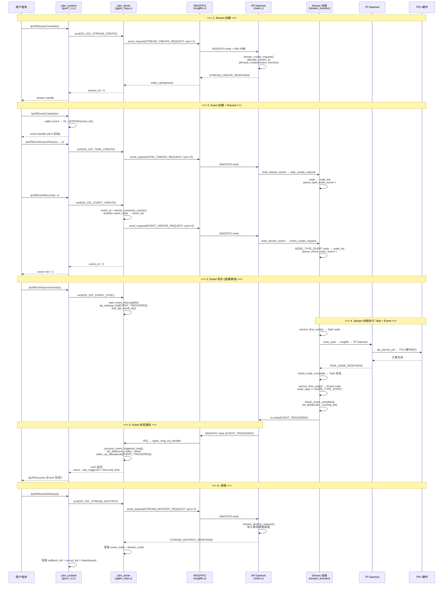

### 4.10 双模式通信路径

| 操作 | 硬件模式 (`#ifndef SOCKET`) | cmodel/模拟器模式 (`#ifdef SOCKET`) |
|---|---|---|
| 设备打开 | `open(/dev/sgdrv-0, O_RDWR)` | `find_available_port()` + `socket_client_init(port)` |
| ioctl 发送 | 标准 `ioctl(fd, SG_IOC_*, &info)` | `socket_msg(sgdev, &info)` — Unix domain socket |
| Event ID 分配 | 内核 `atomic_inc_return(&hdev->rt.event_counter)` | 用户态 `++sgdev->socket_event_id` |
| Stream 同步 | `ioctl(SG_IOC_EVENT_SYNC)` 在内核阻塞 | `socket_msg()` 在用户态阻塞 |
| Event 查询 | `ioctl(SG_IOC_EVENT_QUERY)` | `socket_msg()` 带 `type=0x90000001` |

---

## 5. AP Daemon 固件 (`cdmlib/fw/ap/daemon/`)

### 5.1 初始化序列

```c
int main(int argc, char *argv[]) {
    struct sg_device g_sg_device = {0};
    struct sg_device *sg_device = &g_sg_device;

    // === 第1阶段: 配置加载 ===
    parse_ini("/path/to/config.ini") → sg_device->config
    // 关键配置项: chip_type, tpu_num, channel_num,
    //   device_mem_start/size, msgfifo_addr/size,
    //   tgs_sched_enable, tgs_mode, tgs_hwq_num

    // === 第2阶段: 模拟器/硬件初始化 ===
    if (cmodel) {
        tpu_emulator_init();        // dlopen(libtpuv7_emulator.so)
        tpu_scalar_emulator_init(); // dlopen(libtpuv7_scalar_emulator.so)
            └── for each TPU: tp_emulator_entry(i, port) → pthread_create → tp_main()
    } else {
        tpu_scalar_init();          // 配置 TP 核启动参数
        irq_balance_init();         // IRQ 亲和性绑定
        hw_addr_map();              // 硬件地址段映射
    }

    // === 第3阶段: 核心子系统初始化 ===
    sg_device_mem_init();           // gen_pool + rbtree 内存池
    chip_build_info();              // PCIe/SYS 信息结构
    sg_device_software_init();
    │   ├── epoll_create1() → sg_device->epfd
    │   ├── for each channel:
    │   │   ├── open_device() → fd (cmodel=socket, hw=/dev节点)
    │   │   ├── epoll_ctl(EPOLL_CTL_ADD, fd)
    │   │   └── channel[i].channel_handle = handle_host_channel /
    │   │       handle_tpu_channel / handle_media_channel
    │   └── communication_buffer_init() # hw: 环形缓冲区地址映射
    sg_device_hardware_init();      // CDMA 引擎

    // === 第4阶段: 调度器绑定 ===
    tpu_sched_ops_bind(sg_device);
    │   ├── if (tgs_sched_runtime_enabled() && tgs_init() == 0)
    │   │       device->tpu_sched_ops = &tgs_tpu_sched_ops;  // TGS 硬件调度
    │   └── else
    │           device->tpu_sched_ops = &soft_tpu_sched_ops;  // 软件调度

    // === 第5阶段: 主事件循环 ===
    while (1) {
        nfds = epoll_wait(sg_device->epfd, events, MAX_EVENTS, timeout);
        for (i = 0; i < nfds; i++)
            channel[fd_to_channel(events[i].data.fd)].channel_handle(device, &events[i]);
    }
}
```

### 5.2 Channel 体系

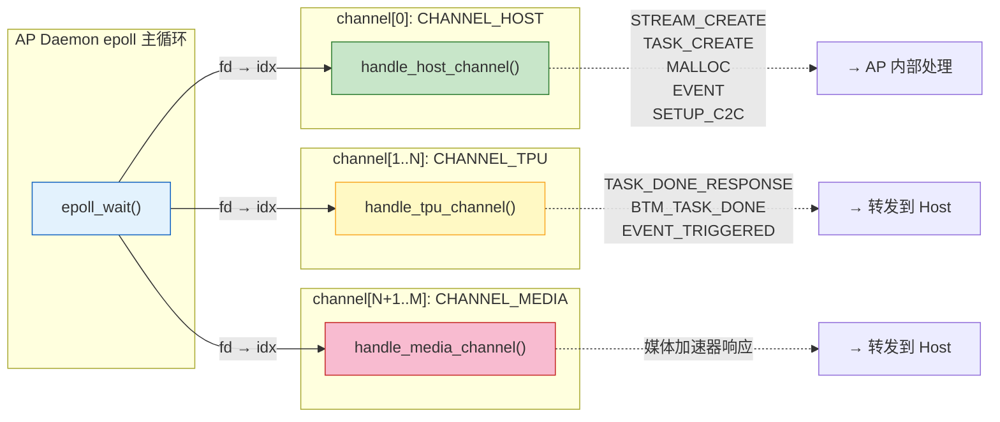

**Channel 结构** (`struct channel_info`):
```c
struct channel_info {
    char channel_name[64];
    int fd;                              // 通信 fd (socket / /dev节点)
    struct circ_buf tx, rx;              // 环形缓冲区
    struct circ_buf mirror_tx;           // 镜像 TX (write-combine 映射)
    void *msi_addr;                      // MSI 中断通知地址
    int (*channel_handle)(struct sg_device*, struct epoll_event*);
    int (*tx.write)(struct channel_info*, int fd, void *buf, uint64_t size);
    int (*rx.read)(struct circ_buf*, int fd, void **buf, uint64_t size, uint64_t *ctx);
    int (*rx.free_request_buf)(struct circ_buf*, struct stream_node*);
    pthread_spinlock_t write_lock;
    uint32_t task_num_has_send;          // 流控: 已发送未完成的任务数
    int communication_memory_index;
};
```

**通信路径对比**:

| 操作 | cmodel 模式 | 硬件模式 |
|---|---|---|
| tx.write | `sys_write` → `write(fd, buf, size)` (socket) | `user_write` → 环形缓冲区 + MSI 写 |
| tx (host ch) | 同上 | `host_ch_user_write` → 仅更新 head (数据已由内核写入) |
| mirror_tx.write | NULL | `mirror_user_write` → write-combine 映射区 |
| rx.read | `sys_read` → `read(fd, buf, size)` (socket) | `user_read` → 直接返回环形缓冲区指针 |
| rx.free | `sys_free_request_buffer` → `free()` | `user_free_request_buffer` → 更新 tail |

### 5.3 Stream 生命周期

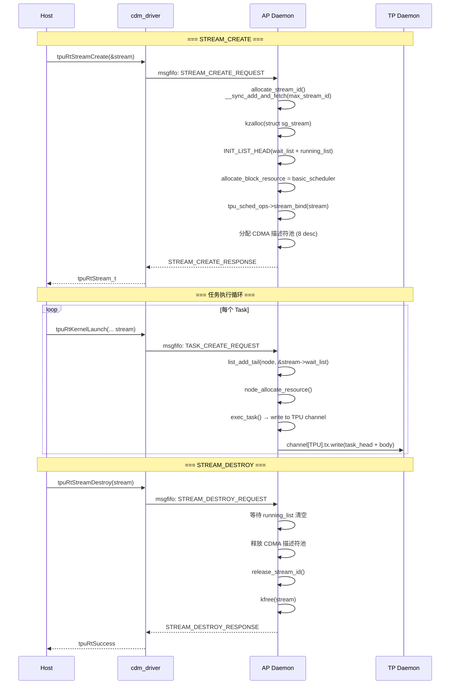

### 5.4 任务提交流程 (从 MSGFIFO 到 TPU)

```
TASK_CREATE_REQUEST 到达 host_channel_handler()
│
├── 1. 解析 task_head (从环形缓冲区读取)
│       struct task_head {
│           uint64_t task_id;
│           uint32_t task_type;       // S2D/D2S/D2D/LAUNCH_KERNEL
│           uint32_t task_resp;       // NEED_RESP / NOT_NEED_RESP
│           uint64_t src_addr;        // 或 group_num (kernel)
│           uint64_t dst_addr;        // 或 block_num (kernel)
│           uint64_t memcpy_size;     // 或 task_body_size (kernel)
│           uint64_t stream_id;
│           uint32_t msg_sync_id;
│           uint32_t request_cc_info; // barrier/group/block ID
│           uint64_t task_body_pa;    // 任务体物理地址
│       };
│
├── 2. 根据 task_type 分流:
│   ├── TASK_S2D / TASK_D2S → s2d_d2s_task()
│   ├── TASK_D2D → d2d_task()
│   ├── LAUNCH_KERNEL → launch_kernel_to_tp()  [见下方 5.5]
│   ├── TRIGGER_TASK → (内部触发)
│   └── POLL_ENGINE_DONE → (轮询TPU完成状态)
│
├── 3. 以 S2D 为例:
│   s2d_d2s_task(stream, node)
│   ├── find_cdma_channel(device, CDMA_S2D, &cdma_channels)
│   │     └── 返回可用 CDMA 引擎数量和 ID 列表
│   ├── node_alloc_cdma_desc(stream, node, CDMA_S2D, cdma_num)
│   │     └── 分配 CDMA 描述符: desc_pa[i], desc_va[i]
│   ├── cdma_preprocess(stream, node, &trans)
│   │     ├── DESC 模式: 编程 scatter-gather 描述符链
│   │     └── PIO 模式: 直接编程 CDMA 寄存器 src/dst/len
│   ├── resource->status = RESOURCE_SENT
│   └── list_add_tail(&node->running_list, &stream->running_list)
│
├── 4. 等待 CDMA 完成 (通过 TASK_DONE_RESPONSE)
│
└── 5. 发送 TASK_DONE_RESPONSE → Host (channel[0] RX 环形缓冲区 + MSI)
```

### 5.5 Kernel 启动流程 (LAUNCH_KERNEL → TPU) + 多核屏障

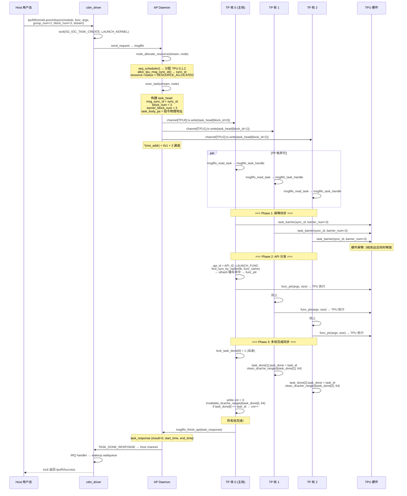

### 5.6 调度策略详解

**三种软件调度器**:

```
1. basic_scheduler(resource, node):
   for (begin = 0; begin < tpu_num - block_num + 1; begin++)
       for (loop = 0; loop < block_num; loop++)
           if (channel[tpu+loop].task_num_has_send < max_task_in_fifo)
               continue_channel++
       if (continue_channel == block_num) → 分配成功
   # 从 TPU0 开始找连续可用的 TPU 块

2. seq_scheduler(resource, node):
   begin = last_tpu_index  # 从上一次分配位置继续
   for (; begin < tpu_num - block_num + 1; begin++)
       # 同上检查, 成功后更新 last_tpu_index
   # 超时保护: WAIT_TIME=5s 后 reset last_tpu_index=0

3. reuse_scheduler(resource, node):
   if (stream->affinity_tpu_cnt == 0)
       分配新的亲和性 TPU 组
   else
       重用 stream->affinity_tpu[]  # 同一 Stream 粘滞在同一 TPU 组
   # 基于 device->next_avaliable_tpu 的全局轮询分配
```

**TGS 硬件调度器**:
```
#ifdef CONFIG_TGS_SCHED
tgs_tpu_sched_ops = {
    .launch_kernel = tgs_launch_kernel,    # 通过硬件队列下发
    .check_node_complete = tgs_check_complete,
    .stream_bind = tgs_stream_bind,
};

模式:
  TGS_MODE_SYNC   → 同步模式 (等待硬件完成)
  TGS_MODE_ASYNC  → 异步模式 (立即返回)
  TGS_MODE_BYPASS → 绕过模式 (直通, 不经过硬件调度器)
```

### 5.7 屏障 (Barrier) 机制

多 TPU 核同时启动一个 Kernel 时，需要屏障同步保证所有核到达同一起点：

```
AP 侧 (exec_task):
  block_id=0:      实际执行 Kernel 的 TPU
  block_id=BARRIER: 仅参与屏障, 不执行

  task_head.request_cc_info:
    .group_id = 0           # 通信组 ID
    .block_id = 0,1,...     # 组内 TPU 序号
    .barrier_block_id = 0,1,...  # 屏障序号
    .barrier_block_num = N  # 屏障参与者总数

TP 侧 (msgfifo_task_handle):
  if (block_id != BARRIER_TASK_ONLY && api_id == API_ID_LOAD_LIB)
      skip_barrier = 1  # 加载库时跳过屏障

  if (!skip_barrier)
      cur_thread->task_barrier(sync_id, barrier_block_num)
      # 调用 tpu_core_barrier() 内核函数
      # 所有 barrier_block_num 个 TPU 到达后才返回
```

### 5.8 模块加载

```mermaid
sequenceDiagram
    participant HOST as Host
    participant DRV as Driver
    participant AP as AP Daemon
    participant TP as TP Daemon
    participant FS as 文件系统 /tmp

    HOST->>DRV: tpuRtKernelLoadModuleFile(path, stream)
    DRV->>DRV: 读取 .so 文件 → buffer
    DRV->>AP: msgfifo: TASK_CREATE {module_info: name, md5, addr, size}

    AP->>AP: load_module_api_task()
    AP->>FS: write(/tmp/&lt;pid&gt;/ap/&lt;lib_name&gt;.so)
    Note over AP: [cmodel] ELF 检查:<br/>• 无 ELF magic? → emulator.so<br/>• 有 cmodel_init 符号? → emulator.so<br/>• 正常 .so → 原路径

    AP->>AP: dlopen(lib_file, RTLD_LOCAL|RTLD_LAZY)
    AP->>AP: dlsym("tpu_kernel_init_v2" | "tpu_kernel_init")
    AP->>AP: tpu_kernel_init(0, &context)
    Note over AP: list_add(&ap_module, &device->module_list)
    AP-->>DRV: STREAM_CREATE_RESPONSE

    Note over AP,TP: === Firmware 模式: Kernel 同时加载到 TP 核 ===

    AP->>TP: channel[TPU0..N]: 发送 LOAD_LIB task
    TP->>TP: load_lib_process()
    TP->>TP: map_vaddr = sg_get_device_memory_addr() + library_addr
    TP->>FS: write(/tmp/&lt;pid&gt;-&lt;tpu_id&gt;/&lt;rec&gt;/&lt;md5&gt;.so)
    TP->>TP: [cmodel] ELF 检查 (同AP)
    TP->>TP: dlopen(local_file, RTLD_LOCAL|RTLD_NOW)
    TP->>TP: dlsym("tpu_kernel_init_v2" | "tpu_kernel_init")
    TP->>TP: func_ptr(tpu_id, &context)
    TP->>TP: dlsym("tpu_core_barrier") → task_barrier
    TP->>TP: dlsym("tpu_poll") → poll_engine_done
    TP->>TP: list_add(&lib_item, &load_lib_list)
    TP-->>AP: TASK_DONE_RESPONSE
```

### 5.9 C2C 拓扑

```
SETUP_C2C_REQUEST 处理:
  ├── 从 SRAM 读取每芯片端口信息 (PER_CHIP_C2C_PORT_INFO_OFFSET)
  ├── 构建 N×N 端口矩阵 {src_device_id, dst_device_id, send_port, recv_port}
  ├── 写回 ALL_CHIP_C2C_PORT_INFO_OFFSET
  └── 更新每芯片 pcie_if_array[] (pcie_id, slot, socket, link_speed)

拓扑查询 (SG_IOC_GET_TOPOLOGY):
  ├── copy_to_user(&c2c_port_info_v2, ...)
  └── 每条 Link: src_pcie_id[0..1], dst_pcie_id[0..1], send_port[0..1], recv_port[0..1]
      # 最多 2 条 Link per chip pair (MAX_C2C_LINK_BETWEN2CHIP=2)
```

### 5.10 Host / AP / TP 三体协作模型 (全链路)

本节是对前面各章的收束,把 Host(用户态+内核态)、AP(芯片核)、TP(标量核)三者之间的**职责边界、通信介质、数据通路、中断流**讲清楚。这是理解整个软件栈的关键。

#### 5.10.1 三体的物理位置与职责

```
┌─────────────────────────────────────────────────────────────────────────┐
│                      x86 Host (主机, 原生 Linux)                          │
│                                                                          │
│  ┌──────────────┐      ┌────────────────────────┐                         │
│  │ cdm_runtime  │      │   cdm_driver (KMD)      │   ← Host 侧内核驱动     │
│  │ (UMD)        │─ioctl→│ sgcard.ko (/dev/sg-host-drv-N)                  │
│  │ tpuv7_rt.c   │      │ sgdrv_fops.c / msgfifo.c │                        │
│  └──────────────┘      └───────────┬────────────┘                        │
│                                    │ PCIe BAR0 (MMIO)                      │
└────────────────────────────────────┼─────────────────────────────────────┘
                                  PCIe
                ┌───────────────────┴────────────────────┐
                │          PCIe iATU / BAR 映射           │
┌───────────────┴────────────────────────────────────────┴─────────────────┐
│                  SG2260 芯片                                              │
│                                                                          │
│  ┌──────────────────────────────────────────────────────────────────┐     │
│  │  AP Core (RISC-V C920, 跑 linux-riscv)                            │     │
│  │                                                                   │     │
│  │  ┌─────────────────────────┐   ┌──────────────────────────┐       │     │
│  │  │ AP Daemon (用户态固件)    │   │ ap_sgcard.ko (KMD)         │ ← 片上内核驱动 │
│  │  │ main.c (epoll 主循环)     │──→│ sgdrv.h / ap_sgcard.c       │     │
│  │  │  └ channel[CHANNEL_MAX]  │   │  /dev/sgdrv-*              │     │
│  │  │     ├ [0] CHANNEL_HOST   │   │  /dev/sg-stream-file-*     │     │
│  │  │     ├ [1..8] CHANNEL_TPU │   │  /dev/wake-up-stream       │     │
│  │  │     └ [9..] CHANNEL_MEDIA│   │  (per-stream cdev)          │     │
│  │  └─────────────────────────┘   └──────────────────────────┘       │     │
│  └───────┬───────────────────────────────────────┬────────────────────┘     │
│          │ 片上共享内存 (cacheable SRAM/DDR)        │ MSI doorbell            │
│          │                                       │                         │
│  ┌────────┴────────┐  ┌──────────────────────────┴──────────────┐          │
│  │ TP Core × 8       │  │ TPU 硬件 (8 Core × 64 CU/Lane)            │          │
│  │ (RISC-V 标量核)   │  │  TIU/GDMA/SDMA/HAU 引擎                   │          │
│  │ TP Daemon (固件)  │──│                                          │          │
│  │  msgfifo_process()│  └──────────────────────────────────────────┘          │
│  └───────────────────┘                                                       │
└──────────────────────────────────────────────────────────────────────────────┘
```

**关键认知: 存在两个内核驱动 (KMD)**

| 维度 | `cdm_driver` (Host 侧) | `ap_sgcard` (片上, AP 核) |
|---|---|---|
| 仓库 | `tpuv7-runtime/cdmlib/host/cdm_driver/` | `linux-riscv/drivers/soc/sophgo/ap_sgcard/` |
| 运行位置 | x86 主机 Linux | 芯片 AP 核 RISC-V Linux |
| 驱动名 | `sg-host-drv` / sgcard.ko | platform_driver, `compatible="sophgo,sophgo-card"` |
| 设备节点 | `/dev/sg-host-drv-N` | `/dev/sgdrv-*` + `/dev/sg-stream-file-<id>` + `/dev/wake-up-stream` |
| ioctl 入口 | `sg_ioctl` → `runtime_api_ioctl` (sgdrv_fops.c) | `sg_ioctl` (ap_sgcard.c:1378) — 仅 `SG_IOC_STREAM_CREATE/SETUP_C2C/GET_PORT_RX_ADDR` |
| 核心职责 | 接收 UMD ioctl → 写 MSGFIFO → 阻塞等响应 | 为每个 stream 创建 cdev + 环形缓冲;AP Daemon 的 read/write 后端 |
| fops | read/write/ioctl/poll/mmap 全套 | read/write/ioctl/poll/mmap 全套 (per-port) |

`SG_IOC_STREAM_CREATE` 这个 ioctl 号**在两个驱动里都定义了,但语义不同**:在 Host 侧 cdm_driver 中,它表示"用户态要建流 → 经 MSGFIFO 转发给 AP";在 AP 侧 ap_sgcard 中,它表示"AP Daemon 要内核真正创建 per-stream 字符设备"。这正是 4.6.1 节调用链里同一 ioctl 出现两次的原因。

#### 5.10.2 两条 MSGFIFO:不同介质,相似结构

系统中有**两条独立的环形缓冲通信链**,容易混淆,务必区分:

```mermaid
graph LR
    subgraph HOST["Host x86"]
        UMD["cdm_runtime (UMD)"]
        HKMD["cdm_driver (KMD)"]
    end
    subgraph AP["AP Core (RISC-V)"]
        APKMD["ap_sgcard (KMD)"]
        APD["AP Daemon"]
    end
    subgraph TP["TP Cores (RISC-V ×8)"]
        TPD["TP Daemon ×8"]
    end
    subgraph HW["TPU 硬件"]
        ENGINES["TIU/GDMA/SDMA/HAU"]
    end

    UMD -->|"ioctl"| HKMD
    HKMD ====="MSGFIFO #1: PCIe BAR 共享内存<br/>(1MB ring, BIP8 校验, MSI-X)"|==> APD
    APKMD -.->|"per-stream cdev<br/>read/write 后端"| APD
    APD ====="MSGFIFO #2: 片上共享内存<br/>(RP/WP, cacheable, MSI doorbell)"|==> TPD
    TPD -->|"寄存器 MMIO"| ENGINES
    TPD -.->|"共享内存 task_done[]<br/>cacheline 对齐"| APD

    style HKMD fill:#e3f2fd,stroke:#1565c0
    style APKMD fill:#e8f5e9,stroke:#2e7d32
    style APD fill:#fff3e0,stroke:#f9a825
    style TPD fill:#fce4ec,stroke:#c62828
```

| 属性 | MSGFIFO #1 (Host ↔ AP) | MSGFIFO #2 (AP ↔ TP) |
|---|---|---|
| 物理介质 | PCIe BAR 映射的设备内存 / 主机内存 | 片上 SRAM / DDR (cacheable) |
| 环形缓冲结构 | `cacheline_align_circ_buf` (head/tail/phy_addr, cacheline 对齐) | TP 侧 `MSG_FIFO_RX/TX_BASE_OFFSET` + RP/WP (单生产单消费指针) |
| 读/写函数 | `cache_memory_read/write` (cacheable) 或 `device_memory_read/write` (MMIO) | `sg_shmem_read/write` + `clean/invalidate_dcache_range` |
| 校验 | BIP8/BIP64 XOR 校验 (`verify_data`) | 无 (DCache clean/fence 保证可见性) |
| 通知机制 | MSI-X 中断 (Host 端 `request_irq`) | MSI doorbell 写 (`*(msi_addr)=0x1`) + TP 端 `send_msi_to_host()` |
| 镜像/优化 | `mirror_circ_buf` write-combine 双缓冲 (仅 CHANNEL_HOST) | 无镜像,直接共享内存 |
| channel 数 | 1 (HOST) + 8 (TPU) + 32 (MEDIA) | 每 TP 核 1 个共享 FIFO,但 task body 按物理地址共享引用 |

#### 5.10.3 数据通路:一次 Kernel Launch 的三体交互

这是上面 4.9/10 节时序图背后的**数据流向细节**:

```
① Host 用户态:
   tpuRtKernelLaunchAsync(module, "func", args, group=1, block=3, stream)
     → 构造 host_ioctl_info { task_head{LAUNCH_KERNEL, group_num=1, block_num=3},
                               task_body{api_header + payload} }
     → ioctl(fd, SG_IOC_TASK_CREATE, &info)         [一次系统调用]

② Host 内核态 (cdm_driver):
   rt_task_create() → send_request(TASK_CREATE_REQUEST, sync=0)
     → process_msg_core_info():
         · copy task_head + task_body 到 TX 环形缓冲 (BAR 共享内存)
         · 写 BIP8 校验
         · 更新 tx_circ_buf.head
         · writel(msi_data, msi_va)  ← 触发 AP 侧 MSI-X 中断
     [sync=0: 异步,立即返回,不等 AP 响应]

③ AP Core (中断 → 内核 → 用户态):
   [内核] sgcard_interrupt() → host_int(card, channel[HOST])
     host_int():
       · 从 rx_buf 读 host_request_action (校验 BIP8)
       · 按 request_action.stream_id 找到对应 v_port
       · 把 request_action + task_body 拷到 port_rx_buf (per-stream ring)
       · wake_up_all(&port->read_available)
   [用户态] AP Daemon stream_function 的 epoll_wait 醒来
     → handle_stream_action() → read_stream_action()
       · sg_read() 从 port_rx_buf 读出 task
       · task_create_request(): 建 stream_node, 设 node_type=NODE_TYPE_TASK
       · 插入 stream->node_list (FIFO 等待队列)
       · service_first_node() → seq_scheduler 分配 TPU[0,1,2] + alloc_tpu_msg_sync_id()

④ AP → TP (片上 MSGFIFO #2):
   exec_task(stream, node):
     · 构建 task_head{msg_sync_id, block_id, barrier_block_num=3,
                      task_body_pa = stream->rx.buf_pa + 偏移}
     · 对每个参与的 TP 核 j:
         channel_index = TPU_TO_CHANNEL(j)
         channel[tx].write(channel, fd, &task_head, sizeof(task_head))
           user_write():  ← 只拷贝 task_head (48B) 到共享内存 ring
             · write_cache_mem(tx->buf + head, &task_head, 48)
             · *(volatile uint32_t*)tx->head = head; clean_dcache_range()
             · *(uint32_t*)channel->msi_addr = 0x1  ← TP 核 j 的 MSI doorbell
     ★ 注意: task_body 不拷贝! 它留在 AP 的 rx.buf 里, TP 通过 task_body_pa 用 map_to_kaddr() 访问

⑤ TP Core × 3 (各自独立运行 TP Daemon):
   msgfifo_process() → msgfifo_read_task():
     · sg_shmem_read(MSG_FIFO_RX_WP/RP) 判非空
     · msgfifo_read_task_header(): 读 48B task_head
     · map_to_kaddr(task_body_pa) → invalidate_dcache_range(body, size)  ← 拉最新 body
     · malloc task_item → list_append(task_list) → sg_msgfifo_rx_update(msg_size)
   msgfifo_task_handle(task_item):
     Phase 2 (屏障): cur_thread->task_barrier(sync_id, 3)  ← tpu_core_barrier, 3核到齐释放
     Phase 3 (分发): find_sym_by_name(lib, func) → uthash 缓存 → func_ptr(args, size)
                       func_ptr 内部发 BDC/GDMA 指令到 TPU 硬件寄存器
     Phase 4 (完成同步, SYNC_MODE):
       从核: task_done[block_id].task_done = task_id; clean_dcache_range(64B)
       主核: while(cnt<3) invalidate_dcache_range(&task_done[i],64) 检查

⑥ TP → AP (响应回传):
   主核 msgfifo_finish_api(&task_response):
     · sg_msgfifo_tx_response(): 写 task_response 到 TX 共享内存 + clean_dcache + fence iorw
     · send_msi_to_host()  ← AP 侧 MSI 中断
   [AP 内核] sgcard_interrupt() → tpu_int(card, channel[TPU0])
     tpu_int(): 从 rx_buf 读 task_response_from_tpu → 拷到第一个 port 的 rx_buf
                → wake_up_all(&port->read_available)
   [AP 用户态] AP Daemon epoll 醒来 → handle_tpu_channel() 读 response
     → check_node_complete_soft(): node 完成 → check_task_done
     → 发 TASK_DONE_RESPONSE 写 channel[CHANNEL_HOST].tx (回 Host)

⑦ AP → Host (MSGFIFO #1 响应):
   AP Daemon: channel[HOST].tx.write(&response) → host_ch_user_write() 更新 head + MSI
   [Host 内核] sgcard_interrupt → ... 其实 Host 侧 IRQ 经 cdm_driver 的 msgfifo IRQ 下半部
     → process_event_triggered_msg / find_task_done_rep 匹配 response_id
     → wake_up_interruptible(&hdev->ap_wqueue_list[...])
   [Host 用户态] 阻塞在 ioctl 的线程被唤醒 → ioctl 返回 tpuRtSuccess
```

#### 5.10.4 三体的并发模型与同步点

| 同步点 | 机制 | 位置 |
|---|---|---|
| Host UMD ↔ Host KMD | ioctl 阻塞 + `wait_event_interruptible(ap_wqueue_list[type])` | cdm_driver |
| Host KMD ↔ AP | MSGFIFO ring + MSI-X + BIP8 校验 | PCIe BAR 共享内存 |
| AP 内核 ↔ AP Daemon | epoll_wait + per-port `read_available` waitqueue | ap_sgcard + AP Daemon |
| AP Daemon 主循环 ↔ Stream 线程 | 每 stream 一个 pthread (`stream_function`) + 各自 epoll | AP Daemon |
| AP ↔ TP | 片上共享 ring + MSI doorbell (per-TP-core) | SRAM |
| TP 多核之间 | `task_barrier()` → `tpu_core_barrier()` (硬件屏障) + `task_done[]` 共享内存标志 + DCache clean/invalidate | TP 共享内存 |
| TP ↔ TPU 硬件 | MMIO 寄存器写 (TIU/GDMA descriptor) + `tpu_poll()` 轮询空闲 | 寄存器 |

#### 5.10.5 几个容易被忽略的实现细节

1. **`host_ch_user_write` 是特例**: AP 给 Host channel 写响应时,数据其实**已经由内核 `host_int` 写入了 port_rx_buf**,AP Daemon 的 `host_ch_user_write` 只需更新 head 指针 + MSI,不重复拷贝数据(对比给 TP channel 的 `user_write` 要拷贝 task_head)。这解释了 5.2 节表里那行看似奇怪的差异。

2. **task_body 用物理地址共享引用**: AP→TP 只传 48 字节 task_head,body 不拷贝。TP 用 `map_to_kaddr(task_body_pa)` 把物理地址转成自己的 mmap 虚地址访问。这避免了大数据拷贝,但也要求 DCache 同步(`invalidate_dcache_range` 拉最新,`clean_dcache_range` 写回可见)。

3. **`task_done[]` 必须 cacheline 对齐**: 每个 TP 核占 64 字节槽位,否则 false sharing 会把别的核的写"带飞"。主核轮询用 `invalidate_dcache_range(&task_done[i], 64)` 强制重新从内存读,不能用缓存值。

4. **MSGFIFO #1 的 BIP8 校验是软校验**: 每条消息末尾追加 8 字节 XOR 校验,AP 端 `verify_data()` 校验。这是为了在不依赖 PCIe TLP ECRC 的情况下做端到端完整性保护(可选,`verify_enable` 控制)。

5. **AP Daemon 是单进程多线程,不是多进程**: 主 epoll 线程处理 Host channel + TPU channel + Media channel 的响应;每 stream 一个 `stream_function` 线程各自 epoll 处理该 stream 的 task 读取。stream 之间通过 `tp_all_channel_mutex` + `running_list_mutex` 等自旋锁/互斥锁协调。

---

## 6. TP Daemon 固件 (`cdmlib/fw/tp/daemon/`)

### 6.1 初始化与主循环

```c
int main(int argc, char *argv[]) {
    cur_thread = malloc(sizeof(struct thread_item));
    INIT_LIST_HEAD(&cur_thread->load_lib_list);
    INIT_LIST_HEAD(&cur_thread->task_list);
    cur_thread->func_table = NULL;       // uthash 函数缓存

    vaddr_init();                        // 虚拟地址空间初始化
    cur_thread->tpu_id = sg_clint_read(CLINT_MHART_ID); // 读取核 ID
    tpu_init();                          // TPU 硬件初始化
    timer_init();                        // 定时器初始化

    // 配置日志 (内存日志/串口日志)
    log_init(log_addr, LOG_SIZE, log_type, memory_type);

    // 指令缓存配置
    tp_status_init(cur_thread);

    // 主循环
    while (1)
        msgfifo_process();
}
```

### 6.2 MSGFIFO 消息处理

```mermaid
flowchart TD
    START(["msgfifo_process() 主循环入口"])

    START --> CHECK{"task_list 为空?"}
    CHECK -->|是| READ["msgfifo_read_task()"]
    CHECK -->|否| ITER["list_for_each_safe"]

    READ --> EMPTY{"msgfifo_empty()?"}
    EMPTY -->|是| IDLE["run_empty_kernel()<br/>→ tpu_poll_empty()<br/>等待 TPU 空闲"]
    IDLE --> START

    EMPTY -->|否| HDR["msgfifo_read_task_header()<br/>读取 task_head"]

    HDR --> TYPE{"task_type?"}
    TYPE -->|TRIGGER_TASK| TRIGGER["遍历 task_list<br/>找到 task_id → task_enable=1"]
    TYPE -->|LAUNCH_KERNEL<br/>SYNC_TASK<br/>POLL_ENGINE_DONE| BODY["有 task_body?"]
    BODY -->|是| BODY_RD["map_to_kaddr(task_body_pa)<br/>invalidate_dcache_range"]
    BODY_RD --> ALLOC["malloc task_item<br/>填充 task_head + task_body<br/>list_append(task_list)"]
    BODY -->|否| ALLOC
    ALLOC --> RXUP["sg_msgfifo_rx_update(msg_size)"]
    RXUP --> START

    ITER --> HANDLE["msgfifo_task_handle(task_item)"]

    HANDLE --> PHASE1{"task_type?"}
    PHASE1 -->|POLL_ENGINE_DONE| POLL["cur_thread->poll_engine_done()<br/>(调用 tpu_poll 函数)"]
    POLL --> POLL_RESP["block_id==0? → msgfifo_finish_api()"]
    POLL_RESP --> FREE1["list_del + free"]

    PHASE1 -->|LAUNCH_KERNEL| PHASE2["Phase 2: 屏障同步"]
    PHASE2 --> BARRIER{"skip_barrier?"}
    BARRIER -->|否| SYNC["task_barrier(sync_id, barrier_num)<br/>调用 tpu_core_barrier()"]
    BARRIER -->|是 (LOAD_LIB)| DISPATCH
    SYNC --> BAR_ONLY{"block_id == BARRIER?"}
    BAR_ONLY -->|是| FREE2["list_del + free"]
    BAR_ONLY -->|否| DISPATCH

    DISPATCH["Phase 3: API 分发"]
    DISPATCH --> API{"ptr_api_header->api_id"}
    API -->|API_ID_LOAD_LIB| LOAD["load_lib_process()<br/>dlopen + tpu_kernel_init"]
    API -->|API_ID_LAUNCH_FUNC| LAUNCH["launch_func_process()<br/>find_sym_by_name → func_ptr(args)"]
    API -->|API_ID_UNLOAD_LIB| UNLOAD["unload_lib_process()<br/>dlclose + uthash 清理"]

    LOAD --> PHASE4
    LAUNCH --> PHASE4
    UNLOAD --> PHASE4

    PHASE4{"Phase 4: 完成同步"}
    PHASE4 -->|"SYNC_MODE"| SYNC_MODE{"block_id == 0?"}
    SYNC_MODE -->|"是 (主核)"| MASTER["自旋等待所有 task_done[i] == task_id"]
    MASTER --> MASTER_DONE["msgfifo_finish_api() 统一响应"]
    SYNC_MODE -->|"否 (从核)"| SLAVE["task_done[block_id].task_done = task_id<br/>clean_dcache_range(64B)"]
    PHASE4 -->|"ASYNC_MODE"| ASYNC["need_response = 1<br/>各核独立响应"]

    style START fill:#e3f2fd,stroke:#1565c0
    style HANDLE fill:#c8e6c9,stroke:#2e7d32
    style DISPATCH fill:#fff9c4,stroke:#f9a825
    style BARRIER fill:#f8bbd0,stroke:#c62828
    style MASTER fill:#ce93d8,stroke:#6a1b9a
```

### 6.3 任务分发执行

```c
void msgfifo_task_handle(struct task_item *task_item) {
    struct task_response task_response = {0};
    struct api_header *ptr_api_header;

    // === Phase 1: 轮询引擎完成 ===
    if (task_item->task.task_header.task_type == POLL_ENGINE_DONE) {
        if (cur_thread->poll_engine_done)
            cur_thread->poll_engine_done();  // 调用 tpu_poll() 等待 TPU idle
        task_response.result = 0;
        if (block_id == 0)
            msgfifo_finish_api(&task_response);  // 写回 AP
        list_del + free;  return;
    }

    // === Phase 2: 屏障同步 ===
    ptr_api_header = (struct api_header *)task_item->task.task_body;
    skip_barrier = (block_id != BARRIER && api_id == API_ID_LOAD_LIB);
    if (!skip_barrier) {
        sync_id = task_item->task.task_header.msg_sync_id;
        cur_thread->task_barrier(sync_id, barrier_block_num);
        // 调用 tpu_core_barrier(sync_id, num_cores)
        // 所有 num_cores 个核到达后才返回
    }

    // BARRIER_TASK_ONLY: 仅参与同步, 不执行 Kernel
    if (block_id == BARRIER_TASK_ONLY) {
        list_del + free;  return;
    }

    // === Phase 3: API 分发 ===
    switch (ptr_api_header->api_id) {
    case API_ID_LOAD_LIB:
        ret = load_lib_process(task_item);
        break;
    case API_ID_LAUNCH_FUNC:
        ret = launch_func_process(task_item);
        break;
    case API_ID_UNLOAD_LIB:
        ret = unload_lib_process(task_item);
        break;
    }

    // === Phase 4: 多核完成同步 (SYNC_MODE) ===
    if (sync_mode == SYNC_MODE) {
        if (block_id == 0) {
            // 主核等待所有参与核完成 (通过共享内存 task_done 标志)
            while (cnt < block_num)
                for (i = 0; i < block_num; i++)
                    if (lock_task_done[i] || task_done[i].task_done == task_id)
                        cnt++
            msgfifo_finish_api(&task_response);  // 写 TX → MSI host
        } else {
            // 非主核写入完成标志
            task_done[block_id].task_done = task_id;  // 64B cacheline对齐
            clean_dcache_range(&task_done[block_id], 64);
        }
    } else {
        // ASYNC_MODE: 每个核完成后单独报告
        task_item->need_response = 1;
    }
}
```

### 6.4 Kernel 加载流程

```c
int load_lib_process(struct task_item *task_item) {
    // 1. 先停止当前运行的 Kernel
    run_empty_kernel();          // 调用 tpu_poll_empty() 等待 TPU 空闲
    poll_cur_task_enable();

    // 2. 提取模块信息
    struct load_module_internal *load_module =
        (void *)task_item->task.task_body + sizeof(struct api_header);
    // {library_name, library_addr, size, md5, cur_rec}

    // 3. 从设备全局内存读取 Kernel .so 数据
    map_vaddr = sg_get_device_memory_addr() + load_module->library_addr;

    // 4. 创建本地文件: /tmp/<pid>-<tpu_id>/<rec>/<md5>.so
    sprintf(local_file, "%s/%d-%d/%d/%s.so",
            workdir(), getpid(), cur_thread->tpu_id,
            load_module->cur_rec, md5str);

    // 5. DCache 作废 + 写入文件
    invalidate_dcache_range(map_vaddr, load_module->size);
    write(fd, map_vaddr, load_module->size);

    // 6. [cmodel] ELF 检查 (同 AP Daemon 逻辑, 见 5.8 步骤6)

    // 7. dlopen 加载
    ptr_lib_item->lib.handle = dlopen(local_file, RTLD_LOCAL | RTLD_NOW);

    // 8. 加入加载库链表
    list_add(&ptr_lib_item->list, &cur_thread->load_lib_list);

    // 9. 调用初始化函数
    dlsym("tpu_kernel_init_v2" 或 "tpu_kernel_init")
    → tpu_func_ptr(cur_thread->tpu_id, &cur_thread->context);

    // 10. 注册核心函数指针
    dlsym("tpu_core_barrier") → cur_thread->task_barrier   # 屏障函数
    dlsym("tpu_poll")        → cur_thread->poll_engine_done # 轮询函数
}
```

### 6.5 Kernel 函数启动

```c
int launch_func_process(struct task_item *task_item) {
    struct launch_func_internal *launch_func =
        (void *)task_item->task.task_body + sizeof(struct api_header);
    // {lib_md5, fun_name, lib_name, size, args}

    if (sync_mode == SYNC_MODE)
        poll_cur_task_enable();  // 确保之前的任务已完成

    // 1. 找到对应的库
    list_for_each(pos_lib, &cur_thread->load_lib_list) {
        if (memcmp(launch_func->lib_md5, lib->md5, MD5SUM_LEN) == 0) {

            // 2. 设置 TPU Groupset 信息 (集群/组配置)
            get_tpu_groupset_info(&groupset_info);
            dlsym("tpu_set_groupset_info") → set_info(&groupset_info);

            // 3. 通过 dlsym (带哈希缓存) 找到目标函数
            ret = find_sym_by_name(lib, launch_func->fun_name, &func_ptr);
            // 先在 cur_thread->func_table (uthash) 中查找
            // 未命中则 dlsym → 缓存到 uthash

            // 4. 调用 Kernel 函数 → TPU 硬件执行
            ret = func_ptr(launch_func->args, launch_func->size);
            break;
        }
    }
}
```

### 6.6 函数符号哈希缓存

```c
// uthash 结构
struct func_item {
    unsigned char func_name[FUNC_MAX_NAME_LEN];  // 64 bytes
    unsigned char lib_md5[MD5SUM_LEN];           // 16 bytes
};
struct func_record {
    struct func_item f_item;    // key
    void *f_ptr;                // value (函数指针)
    UT_hash_handle hh;          // uthash 句柄
};

// 查找流程
int find_sym_by_name(struct lib_info *lib, unsigned char name[], char **pfunc) {
    // 1. 先在 uthash 中查找
    HASH_FIND(hh, cur_thread->func_table, &func_record.f_item,
              sizeof(struct func_item), p_func_record);
    if (p_func_record) {
        *pfunc = p_func_record->f_ptr;
        return 0;  // 缓存命中
    }

    // 2. 缓存未命中 → dlsym
    tmp = dlsym(lib->handle, (char *)name);
    // 错误检查: dlerror()

    // 3. 插入 uthash 缓存
    p_func_record = malloc(sizeof(struct func_record));
    p_func_record->f_ptr = tmp;
    memcpy(p_func_record->f_item.func_name, name, FUNC_MAX_NAME_LEN);
    memcpy(p_func_record->f_item.lib_md5, lib->md5, MD5SUM_LEN);
    HASH_ADD(hh, cur_thread->func_table, f_item, sizeof(struct func_item),
             p_func_record);
}
```

### 6.7 多核完成同步算法

多 TPU 核启动同一个 Kernel 后，主核 (block_id=0) 需要等待所有参与核完成：

```
共享内存布局 (cacheline 对齐, 每核 64B):
  task_done[0]  (block_id=0, 主核)
  task_done[1]  (block_id=1)
  ...
  task_done[N-1]

主核 (block_id=0) 逻辑:
  lock_task_done[0] = 1;  // 自身完成
  while (1) {
      cnt = 0;
      for (i = 0; i < block_num; i++) {
          if (lock_task_done[i]) {
              cnt++;
          } else {
              invalidate_dcache_range(&task_done[i], 64);
              if (task_done[i].task_done == task_id) {
                  lock_task_done[i] = 1;
                  cnt++;
              }
          }
      }
      if (cnt == block_num) break;  // 所有核完成
  }
  msgfifo_finish_api(&task_response);  // 写回响应

从核 (block_id != 0) 逻辑:
  task_done[block_id].task_done = task_id;
  clean_dcache_range(&task_done[block_id], 64);
  // 不发送响应, 由主核统一发送
```

### 6.8 平台抽象

```
daemon/plat/bm1690/
  ├── io.h          # devm_map, sg_read/sg_write, gp_reg_read/write, sg_clint_read
  ├── memmap.h      # 地址常量: SYS_BASE, L2M_BASE, INSTR_CACHE_START
  ├── timer.h       # get_time, timer_get_time_ns, timer_init
  └── tpu.h         # tpu_init, gp_reg_read_idx, gp_reg_write_idx

daemon/plat/bm1686/
  └── (类似, 针对旧芯片)

daemon/cmodel/
  └── (模拟实现: malloc 替代 devm_map, Unix Socket 替代 MSGFIFO)
```

---

## 7. 模型运行时 (`model-runtime/`)

### 7.1 总体架构

```
model-runtime/
├── runtime/          # TPU 推理引擎 (C++11)
│   ├── src/
│   │   ├── sgruntime_interface.cpp   # 公开 C API 实现
│   │   ├── sgruntime_bmodel.cpp      # BModel 加载 (LoadBmodel)
│   │   ├── sgruntime_launch.cpp      # 推理启动 (LaunchAsync)
│   │   ├── AKS.cpp / AKSV.cpp        # 芯片后端 (调用 tpuRtKernelLaunch)
│   │   └── sg_profile.cpp            # Profiling 支持
│   └── include/
│       ├── sg_runtime.h              # Sgruntime 类定义
│       ├── tpuv7_modelrt.h           # 公开 C API
│       └── sg_chip_alias.h           # 芯片别名映射
├── bmodel/           # BModel FlatBuffers 解析 (独立库)
│   ├── src/bmodel.cpp                # ModelCtx (文件加载 + FlatBuffers 解析)
│   └── tools/                        # tpu_model 工具 + flatbuffers 编译器
├── cpuop/            # CPU 算子后端
│   └── src/                          # 60+ CPU 算子实现 (NMS, ROIAlign, TopK, ...)
└── common/           # 共享工具
```

### 7.2 BModel 二进制文件格式

bmodel 文件基于 **FlatBuffers** 序列化框架，包含 22 个表 (table) 和 1 个结构体 (struct)：

```
+----------------------------+
| MODEL_HEADER_T  (64 bytes) |  __attribute__((packed))
|  magic: 0xFF55AAEE         |  头部魔数
|  header_size: 64           |
|  flatbuffers_size: N       |  FlatBuffers 段大小
|  binary_size: M            |  二进制负载大小
|  reserved[11]: 0           |  44 字节保留
+----------------------------+
| FlatBuffers Model  (N 字节) |  序列化的 FlatBuffers Model 根表
+----------------------------+
| Binary Payload  (M 字节)    |  原始二进制: 权重 + 指令 + Kernel .so + IR
+----------------------------+
```

**FlatBuffers 核心表结构**:
```
Model → {type, version, chip, net:[Net], neuron_size,
         kernel_module:KernelModule, cpuop_module:CpuopModule}

Net → {name, parameter:[NetParameter]}  // 一个 Net 包含多个 Stage

NetParameter → {input_tensor:[Tensor], output_tensor:[Tensor],
                ctx_addr, ctx_size,           // neuron 内存
                coeff_mem:CoeffMem,           // 权重 (SHA256 去重码)
                sub_net:[SubNet],             // TPU/CPU/MERGE/SWITCH
                is_dynamic, n_dynamic, h_w_dynamic,
                core_num, io_addr, io_size}

SubNet → {subnet_mode: 0=TPU / 1=CPU,
          cmd_group:[CmdGroup] 或 cpu_param:CpuParam,
          core_commands:[CoreCommands],
          input_tensor:[Tensor], output_tensor:[Tensor],
          is_dynamic, ir_offset, ir_len,
          id, next_subnet_ids:[int]}

CmdGroup → {bdc_num, gdma_num, bdc_cmd_byte, gdma_cmd_byte,
            binary_bdc:Binary, binary_gdma:Binary}

Binary → {start:uint64, size:uint64}  // 对 payload 段的偏移+长度引用
```

**文件解析 (`ModelCtx` 构造器)**:
1. 读取并验证 `MODEL_HEADER_T.magic == 0xFF55AAEE`
2. 验证 `file_size >= header_size + flatbuffers_size + binary_size`
3. 分配 `model_buffer_`，读取 FlatBuffers 段
4. `bmodel::VerifyModelBuffer(v)` → FlatBuffers 完整性校验
5. `bmodel::GetModel(model_buffer_)` → 获取根表指针
6. **Legacy 格式迁移**: `update_bmodel()` — 如果 Net 使用旧 `net_static`/`net_dynamic` 字段（而非 `parameter`），则自动转换为新格式：`ModelGen` 重新打包 + 重新解析

**二进制去重**: `ModelGen::WriteBinary()` 在写入前遍历已有的 Binary 引用，通过 size + `memcmp` 判断重复，相同数据返回已存在的引用。

```cpp
// 内部网络结构 (Sgruntime 拥有)
struct tpuRtNetInternal_t {
    std::shared_ptr<Sgruntime> sgrt;
    sgContextInternal_t *context;  // neuron_size, activation ptr
};

// 网络上下文
struct net_ctx_t {
    std::string net_name;
    bool is_dynamic;
    bool n_can_change, h_w_can_change;
    int addr_mode;                 // ADDR_MODE_IO_ALONE / ADDR_MODE_BASIC
    IOInfo_t input, output;        // names, dtypes, scales, zero_points
    std::vector<std::shared_ptr<net_stage_t>> stage_v;
    tpuRtNetInfo_t net_info;       // 对外暴露的 NetInfo
    sgContextInternal_t *context;
};

// Stage (一个 Stage = 一组 TPU 指令)
struct net_stage_t {
    int subnet_num;
    int data_parallel_num;
    uint64_t coeff_offset;         // 权重偏移
    uint64_t ctx_start;            // 上下文基址
    uint64_t io_offset;            // IO Alone 模式基址偏移
    uint64_t io_start, io_size;
    uint64_t cpu_mem_size;
    float *cpu_addr;
    std::vector<uint64_t> ctx_offset;    // 每核的 neuron 偏移
    std::vector<std::vector<tensor_attr_t>> inputs;   // [core_idx][tensor_idx]
    std::vector<std::vector<tensor_attr_t>> outputs;
    std::vector<core_command_t> core_commands;         // BDC/GDMA/HAU/SDMA/IR 命令
    std::vector<SUBNET_INFO_T *> subnet_v;
    std::map<std::string, tensor_ext_t> subnet_tensor_v;
    std::vector<uint64_t> ctx_borders;                 // 上下文段边界
};
```

### 7.3 LoadBmodel 完整流程

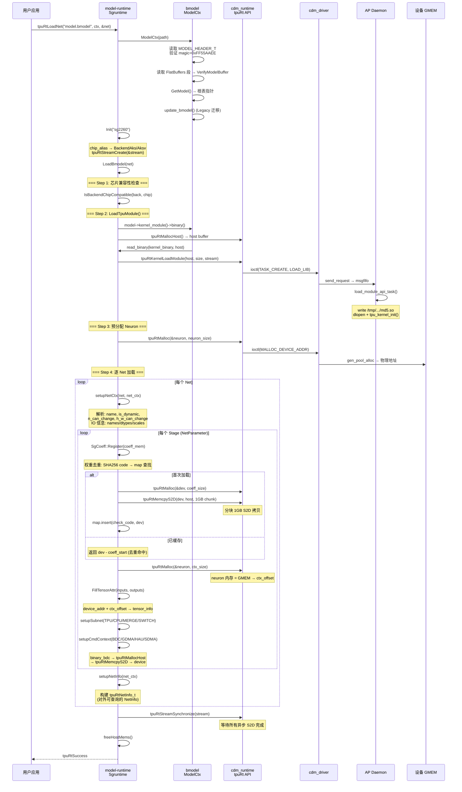

### 7.4 权重去重机制 (SgCoeff)

不同 Stage 可能共享相同权重 (如多 Batch Size 共用同一组卷积核)：

```cpp
uint64_t SgCoeff::Register(model_ctx, coeff_mem, stream, rt_handle) {
    // 1. 构建检查码: check_code (SHA256) + coeff_size (8 bytes)
    vector<u8> check_code = {coeff_mem->check_code(), ..., coeff_size_ptr, ...};

    // 2. 查重
    lock(mtx);
    auto iter = m_coeff_map.find(check_code);
    if (iter != m_coeff_map.end())
        return (iter->second.dev - coeff_start);  // 已加载, 返回偏移

    // 3. 分配 + 分块上传 (1GB 每块)
    tpuRtMalloc(&dev, coeff_size);
    void *block;
    tpuRtMallocHost(&block, min(1GB, coeff_size));
    for (i = 0; i < coeff_size / 1GB; i++) {
        model_ctx->read_binary(coeff_binary, offset, block, 1GB);
        tpuRtMemcpyS2D(dev + offset, block, 1GB);
        offset += 1GB;
    }
    // tail: 剩余部分
    if (coeff_size % 1GB)
        tpuRtMemcpyS2D(dev + offset, block, coeff_size % 1GB);

    tpuRtFreeHost(block);

    // 4. 记录
    m_coeff_map.insert({check_code, {.dev = dev, .devid = devid}});
    return (dev - coeff_start);
}
```

### 7.5 推理执行流程 (LaunchAsync)

```
tpuRtLaunchNet(net, inputs, outputs, "net_name", stream)
  └── tpuRtLaunchNetAsync(...)  # 同步 = 异步 + 隐式 stream sync

tpuRtLaunchNetAsync(net, inputs, outputs, net_name, stream)
  └── net_inter->sgrt->LaunchAsync(inputs, input_num, outputs, output_num, name, stream)
        │
        ├── 1. getNetCtx(name) → net_ctx
        │
        ├── 2. getStageIdx(inputs, net_ctx) → stage_idx
        │     ├── [static net] getStaticStageIdx:
        │     │     └── 遍历 stage_v → 找 shape 完全匹配的 stage
        │     │         单 stage 时: 允许 element count 匹配 (shape 可不同)
        │     └── [dynamic net] getDynamicStageIdx:
        │           └── 遍历 stage_v → 找最大能容纳用户 input shape 的 stage
        │               比较: dims 的差值的乘积 = sum, 取 sum 最小者
        │
        ├── 3. InitOutputTensors(stage, net_ctx, outputs)
        │     └── 填充 output.shape 和 output.dtype
        │
        ├── 4. 单子网静态模型: LaunchStaticSubnetAsync(stage, inputs, outputs)
        │     │
        │     ├── FillTpuNetInfo(stage, inputs, outputs) → tpu_net_info_t
        │     │   ├── FillTpuTensorInfo:
        │     │   │   ├── user_global_addr = (uint64_t)input.data
        │     │   │   ├── compiled_global_addr = stage->inputs[core][idx].dev_mem
        │     │   │   └── tensor_byte_size = TensorByteSize(input)
        │     │   ├── FillTpuCmdInfo:
        │     │   │   └── bdc_cmd_num, gdma_cmd_num, cmd_byte_size (per group)
        │     │   └── core_commands[core].bdc_cmd_addr = stage->bdc_mem.addr
        │     │       core_commands[core].gdma_cmd_addr = stage->gdma_mem.addr
        │     │
        │     └── m_backend->LaunchStaticSubnetAsync(net_info, kernel_module, stream)
        │           └── [AKS.cpp / AKSV.cpp] 构建 Kernel Launch 参数:
        │               ├── task_head.task_type = LAUNCH_KERNEL
        │               ├── task_head.group_num = total_tpu_groups
        │               ├── task_head.block_num = tpu_cores_per_group
        │               ├── task_body = {api_header{API_ID_LAUNCH_FUNC},
        │               │               launch_func{lib_md5, fun_name, args, ...}}
        │               └── tpuRtKernelLaunchAsync(module, func, args, size,
        │                       group_num, block_num, stream)
        │
        └── 5. 多子网/动态: LaunchMultiSubnetsAsync(stage, inputs, outputs)
              └── 遍历 subnet_v:
                  ├── SUBNET_MODE_TPU:
                  │     ├── 映射 tensor: TENSOR_TYPE_NET_INPUT → user input
                  │     │                TENSOR_TYPE_IMM_IO → intermediate
                  │     ├── [dynamic] LaunchDynamicSubnetAsync
                  │     │     └── 构建 dyn_info: ir_addr, input_shapes/addrs,
                  │     │         core_num, ctx_mem_borders, get_output_shape=true
                  │     │         → m_backend->LaunchDynamicSubnetSync()
                  │     │         → tpuRtStreamSynchronize() 等待 TPU 完成
                  │     │         → 读取 output_shape → reshape output tensors
                  │     └── [static] LaunchStaticSubnetAsync
                  └── SUBNET_MODE_CPU:
                        └── cpu_op_dispatch(op_type, params, inputs, outputs)
```

### 7.6 CPU Op 后端

CPU Op 后端处理 TPU 不支持的算子，目前包含 60+ 个实现：

**主要分类**:

| 类别 | 算子 |
|---|---|
| 目标检测 | NMS, BoxNMS, SSD Detect Out, YOLO Detect Out, Generate Proposals, RPN, ROI Align, ROI Pooling, BBox Transform |
| 索引/收集 | Gather, GatherND, ScatterND, Embedding, IndexPut, PytorchIndex, FullIndex |
| 排序/TopK | TopK, TopK Ascending, TopK MXNet, Argsort |
| 条件/控制流 | Where, MaskedSelect |
| 采样/插值 | GridSampler, ResizeInterpolation, CropAndResize, AffineGrid |
| 随机 | RandomUniform, RandomUniformInt |
| 其他 | BinaryOp, UnaryOp, ReverseSequence, RepeatInterleave, DeformConv |

**并行机制**: 通过 `BM_CPU_LAYER_NUM_THREAD` 环境变量控制 `BlockExecutor::run()` 的线程数。大任务按线程数分块并行。

**注册模式**: 每个算子通过 `REGISTER_CPULAYER_CLASS(CPU_GATHER, cpu_gather)` 宏静态注册到 `CpuLayerRegistry`（在 `main()` 之前完成）。

**注意**: 当前 CPU Op 后端**不使用 OneDNN**。所有实现均为纯 C++（标准库 + std::thread）。

---

## 8. Profiling 架构

### 8.1 Profile 类层次

```
Profile (base, sg_profile.h)
├── AKSProfile  (BM1690/SG2260, arch=5, 11 CDMA entries)
└── AKSVProfile (BM1690E/SG2260E, arch=6, 10 CDMA entries)

工厂: createProfile(chipType) → 检查 ENABLE_ALL_PROFILE 环境变量
```

### 8.2 PMU 数据格式

硬件性能计数器 (PMU) 数据通过 `sg_api_set_profile` / `sg_api_get_profile_data` kernel 调用读取，以打包结构体形式返回：

```c
tiu_pmu_item_t (16B):  inst_start_time, inst_end_time, inst_id,
                       thread_id_and_bank_conflict
gdma_pmu_item_t (16B): inst_start_time, inst_end_time,
                       last_wr_txn_cycles, gif_latency
cdma_pmu_item_t (32B): wr_issued, wait_tdm_data, last_wr_txn, ...
```

### 8.3 Profiling API

- `profile->enable(module, stream)`: 设置 PMU 参数 + 启动性能计数器
- `profile->disable()`: 暂停 + 读取 PMU 数据 + 写入 `.profile` 文件
- `profile->record_cmd_data()`: 记录命令字节数据
- `profile->record_subnet_cmd_info()`: 记录每个 core 的 BDC/GDMA 命令地址

---

## 9. RDMA 运行时 (`rdma_rt/`)

RDMA 运行时提供基于 InfiniBand 的多节点通信，仅在 emulator 模式下编译 (`USING_CMODEL=ON`)。

**API 分类**:

| 类别 | API | 说明 |
|---|---|---|
| 初始化 | `tpuRtRDMAInit` | Host 侧: PD, MR, CQ, QP 初始化 |
| | `tpuRtRDMAInitOnTpu` | TPU 侧: CQ, QP 初始化 |
| 通信 | `tpuRtRDMASend`/`SendAsync` | 发送数据 (单次/批量 num_post) |
| | `tpuRtRDMAReceive`/`ReceiveAsync` | 接收数据 |
| | `tpuRtRDMARead` | RDMA READ (单边) |
| | `tpuRtRDMAWrite`/`WriteAsync` | RDMA WRITE (单边) |
| 流控 | `tpuRtRDMASendCpuAsync` | CTS+FIFO 流控发送 |
| | `tpuRtRDMAReceiveCpuAsync` | CTS+FIFO 流控接收 |
| | `tpuRtRDMASendSync`/`ReceiveSync` | 等待完成 |
| 内存 | `tpuRtRDMAMalloc`/`RDMAFree` | RDMA 缓冲区分配 (GPU/CPU 模式) |
| 销毁 | `tpuRtRDMADestroy`/`DestroyOnTpu` | QP 销毁 |

**CTS 流控协议**: 接收方通过 RDMA WRITE 将本地 buffer 地址写入发送方 CTS FIFO，发送方等待 CTS 条目后执行 RDMA WRITE + SEND 信号。Progress Thread 后台处理 CQ 事件。

---

## 10. 完整推理数据流

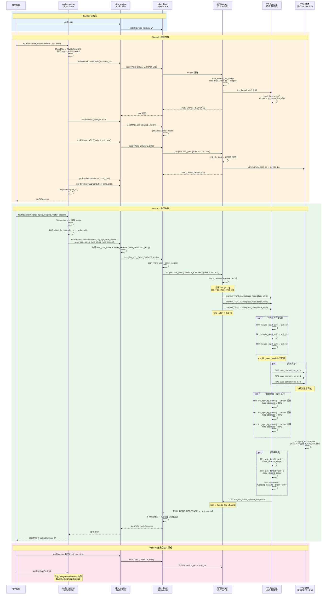

---

## 11. 核心数据结构设计分析

### 11.1 结构全景

```
                    ┌────────────────────────────────────────────┐
  Host 用户态       │ tpuRtNet_t → tpuRtTensor_t → tpuRtStream_t │
                    │ tpuRtNetInternal_t → Sgruntime             │
                    ├────────────────────────────────────────────┤
  Host 内核态       │ sg_dev → tpu_chip → tpu_card               │
  (KMD)             │ callback_function_t (vtable)               │
                    │ host_ioctl_info → host_request_action      │
                    ├════════════════════════════════════════════┤
  AP Daemon         │ sg_device → channel_info[N]               │
  (固件)            │  └── sg_stream → stream_node → task/resource│
                    │      → wait_list + running_list            │
                    │ runtime_config, shared_resource, sg_device_mem│
                    ├────────────────────────────────────────────┤
  TP Daemon         │ thread_item → task_item → task             │
  (固件)            │  └── library_item → func_record (uthash)   │
                    ├────────────────────────────────────────────┤
  Model-Runtime     │ Sgruntime → net_ctx_t → net_stage_t       │
                    │  └── SUBNET_INFO_T → single_core_command_t │
                    │ SgCoeff → CoeffPair (SHA256 → dev ptr)     │
                    └────────────────────────────────────────────┘
```

### 11.2 AP Daemon: `sg_device` — 全局设备单例

```c
struct sg_device {        // ~70 字段, 按访问模式分组
    // === I/O 多路复用 ===
    struct channel_info channel[CHANNEL_MAX];  // Host + TPU0-7 + Media0-31
    struct epoll_event events[CHANNEL_MAX];
    int epfd;                                  // epoll fd
    int wake_up_stream_fd;                     // 命名管道, 唤醒 stream

    // === 全局唯一 ID 分配 (原子递增, 无锁) ===
    struct shared_resource shared_resource;     // stream/event/task/sync_id 计数器
    struct scheduler_info scheduler_info;       // last_tpu_index + 分配连续性标志

    // === 内存管理 ===
    struct sg_device_mem *sg_mem;               // zone→rank→bank + gen_pool + rbtree

    // === 调度策略 (可插换) ===
    const struct tpu_kernel_sched_ops *tpu_sched_ops;  // soft vs TGS vtable

    // === 并发控制 ===
    pthread_spinlock_t tp_all_channel_mutex;    // 保护跨 TPU channel 的原子性
    pthread_spinlock_t module_list_lock;        // 保护已加载 kernel 模块链表

    // === 模块管理 ===
    struct list_head module_list;               // 已加载 ap_module 链表
    struct ap_module_func ap_module_fn;          // {context, tpu_kernel_init ptr}

    // === 上下文 ===
    struct context_info ctx[STREAM_NUM_MAX];     // per-pid 的内存账本
    struct chip_attr chip_attr;                  // 温度/功耗/利用率监控

    // === 硬件配置 (只读, 从 INI 文件解析) ===
    struct runtime_config *config;               // ~50 个配置项
    struct map_addr map_addr_section[16];        // 硬件地址段 VA 映射
};
```

**设计要点**:
- `shared_resource` 中所有 ID 计数器通过 `__sync_add_and_fetch` 原子递增, 无需加锁。每个 ID 从 0 或 1000 开始 (stream/event/callback 从 1000 起, 为 internal use 预留低 ID)。
- `channel` 数组按索引区分角色: `channel[0]=Host`, `channel[1..8]=TPU0-7`, `channel[9..40]=Media0-31`。`TPU_TO_CHANNEL(tpu_id) = tpu_id + CHANNEL_TPU0`。
- `config` 从 `config_file/*.ini` 解析, 包含 `tpu_num`, `channel_num`, `memory_start/size`, `scheduler_type`, `tgs_sched_enable` 等关键运行时参数。

### 11.3 AP Daemon: `sg_stream` — 任务流水线核心

```c
struct sg_stream {         // ~40 字段
    uint64_t stream_id;    // 全局唯一, 从 shared_resource.max_stream_id 原子分配

    // === 双链表模型 (核心设计) ===
    struct list_head node_list;        // 待处理节点 (wait_list 别名)
    pthread_spinlock_t running_list_mutex;
    struct list_head running_list;     // 已下发到硬件的节点
    uint64_t queue_task_node_nums;     // 排队任务计数
    uint64_t running_task_node_nums;   // 执行中任务计数

    // === 调度策略 (函数指针, 可运行时切换) ===
    int (*allocate_block_resource)(struct resource*, struct stream_node*);
    // 指向 basic_scheduler / seq_scheduler / reuse_scheduler

    // === 亲和性绑定 ===
    uint64_t affinity_tpu_cnt;         // 0=首次需分配, >0=已绑定
    uint32_t affinity_tpu[MAX_TP_NUM]; // 绑定的 TPU 列表
    uint64_t affinity_tpu_bitmap;      // 位图快速查询

    // === 上次执行追踪 (用于 GPU-style 连续执行优化) ===
    uint64_t last_available_tpu_cnt;
    uint32_t last_available_tpu[MAX_TP_NUM]; // 上次使用的 TPU
    uint64_t last_available_tpu_bitmap;

    // === CDMA 描述符池 ===
    struct cdma_desc_per_stream s2d_desc;           // S2D 专用
    struct cdma_desc_per_stream d2s_desc;           // D2S 专用
    struct cdma_desc_per_stream d2d_desc[CDMA_MAX-2]; // D2D 多通道
    struct cdma_desc_per_stream *desc_array[CDMA_MAX_TYPE]; // 统一索引
};
```

**双链表模型的设计意图**:

```
  node_list (wait_list):         running_list:
  ┌───────┐  ┌───────┐         ┌───────┐  ┌───────┐
  │ Node 3 │→│ Node 4 │         │ Node 1 │→│ Node 2 │
  │(等待TPU)│  │(等待TPU)│         │(TPU执行中)│(CDMA执行中)│
  └───────┘  └───────┘         └───────┘  └───────┘

  调度循环:
  1. 从 node_list 取 Node → node_allocate_resource()
  2. 资源分配成功 → exec_task() → list_move(Node, node_list→running_list)
  3. TASK_DONE_RESPONSE 到达 → list_del(Node from running_list) → free

  严格 FIFO: node_list 中的 Node 必须按序处理
  running_list 中可以有多个并行执行的 Node (不同 TPU 通道)
```

### 11.4 AP Daemon: `stream_node` — 任务抽象

```c
struct stream_node {
    // 双链表节点 (同时存在于两个链表中)
    struct list_head list;           // node_list (waiting)
    struct list_head running_list;   // running_list (executing)

    uint64_t node_type;              // TASK / EVENT / CALLBACK
    uint64_t node_status;            // CREATED → QUEUED → RUNNING → DELETE
    uint64_t id;                     // 全局唯一 (from max_task_id)
    uint64_t token;                  // 请求跟踪 token

    struct node_property property;   // {task_type, task_dest, task_resp, cdma_mode}
    pthread_mutex_t node_mutex;

    void *request;                   // host_request_action 指针
    struct task *task_point;         // task_head + task_body (flex array)

    int resource_num;                // 所需的资源种类数
    struct resource *resource;       // 资源数组 (TPU/CDMA/Media)

    struct time_stamp time;          // 全流程时间戳追踪
    uint64_t request_tail;           // RX 缓冲区的请求尾指针
    uint64_t task_tail;              // task_body 在 RX 缓冲区的位置
    uint64_t update_tail;            // 完成后更新 RX tail 的值
};
```

**`time_stamp` 的精细时间追踪**:
```c
struct time_stamp {
    uint64_t kr_time;             // 内核接收到请求的时间
    uint64_t wait_resource_time;  // 开始等待资源的时间
    uint64_t wait_hw_avaliable;   // 硬件就绪的时间
    uint64_t tmp_last_time;       // 超时检测的临时时间戳 (复用于超时报告)
    uint64_t start_time;          // 任务实际开始执行的时间
    uint64_t end_time;            // 任务完成的时刻
};
```
每个时间戳用于：1) 性能分析 (端到端延迟分解)，2) 超时检测 (超过 5s 打印告警)，3) 调度器死锁避免 (`tmp_last_time` 检测后 reset `last_tpu_index`)。

### 11.5 AP Daemon: `task_head` — 指令字的多重语义

```c
struct task_head {              // __attribute__((packed)), 固定 64B
    // Byte 0-7: 属性联合体
    union {
        struct { uint8_t task_type;     // S2D/D2S/D2D/LAUNCH_KERNEL/...
                 uint8_t task_dest;     // TP/AP/RP
                 uint8_t task_resp;     // NEED_RESP / NOT_NEED_RESP
                 uint8_t cdma_mode;     // CDMA_DES / CDMA_PIO
                 uint32_t msg_sync_id; };
        struct node_property property;  // 64-bit 统一访问
    };

    // Byte 8-15: 任务标识
    uint64_t task_id;      // 或 task_token

    // Byte 16-23: 组数 / 源地址
    union { struct { uint32_t group_num; uint32_t barrier_group_num; };
            uint64_t src_addr; };

    // Byte 24-31: 块数 / 目的地址
    union { struct { uint32_t block_num; uint32_t barrier_block_num; };
            uint64_t dst_addr; };

    // Byte 32-39: 集合通信信息 / 搬运大小
    union { struct cc_sys_info request_cc_info;   // {group_id, block_id,
                                                   //  barrier_group_id, barrier_block_id}
            uint64_t memcpy_size; };

    // Byte 40-63
    uint64_t stream_id;
    uint64_t task_body_size;     // task_body 的字节数
    uint64_t task_body_pa;       // task_body 在 RX 缓冲区中的物理地址
};
```

**多重语义的设计意图**: 同一个 64 字节结构根据 `task_type` 表示不同语义:

| task_type | src_addr 字段 | dst_addr 字段 | memcpy_size 字段 |
|---|---|---|---|
| TASK_S2D | 主机物理地址 | 设备物理地址 | 拷贝大小 |
| TASK_D2S | 设备物理地址 | 主机物理地址 | 拷贝大小 |
| TASK_D2D | 源设备地址 | 目标设备地址 | 拷贝大小 |
| LAUNCH_KERNEL | group_num | block_num | task_body_size |
| SYNC_TASK | — | — | — |
| POLL_ENGINE_DONE | group_num | block_num | — |

**`cc_sys_info` 并行控制**: `group_id` 标识通信组, `block_id` 标识组内序号 (0=主核), `barrier_group_id` 和 `barrier_block_id` 控制参与屏障的 TPU 集合。`block_id == 0xFFFF` 表示 BARRIER_TASK_ONLY (不参与计算,仅屏障)。

### 11.6 AP Daemon: `resource` — 资源分配的联合体设计

```c
struct resource {
    struct list_head stream_list;       // 同一 stream 内链表
    struct list_head scheduler_list;    // 等待调度器的链表
    struct sg_stream *stream;

    uint32_t resource_type;             // CDMA / TPU / MEDIA / C2C_CDMA
    uint32_t status;                    // UNKNOWN→REQUEST→ALLOCATED→SENT→USING→USED
    uint32_t block_num;                 // 需要的 block 数
    uint32_t received_response_num;     // 已收到的响应数

    union {
        // === TPU 资源分配 ===
        struct {
            uint32_t group_num, current_group;
            uint32_t available_tpu[MAX_TP_NUM];     // 分配的 TPU 列表
            uint64_t available_tpu_bitmap;           // 位图
            int msg_sync_id;                         // 分配的 sync_id
        };
        // === CDMA 资源分配 ===
        struct {
            uint32_t cdma_type;                      // S2D/D2S/D2D
            uint32_t cdma_mode;                      // DES/PIO
            uint32_t request_cdma_list[CDMA_MAX];    // 分配的 CDMA 通道
            uint64_t cdma_desc_pa[CDMA_MAX];         // 描述符物理地址
            uint64_t cdma_desc_va[CDMA_MAX];         // 描述符虚拟地址
        };
    };
};
```

**联合体设计的意图**: TPU 和 CDMA 资源类型互斥，共用一个 `resource` 结构体搭配 `resource_type` 标记 + union 节省内存。`resource` 数组挂在 `stream_node` 上 (`resource_num` 和 `resource[]`)，一个 Node 可能需要多种资源(如 TPU+CDMA 组合)。

### 11.7 AP Daemon: 内存管理数据结构

```
zone (区) → rank (级) → bank (组)
  MAX 5       MAX 2       MAX 4

struct zone_info { uint32_t zone_id, rank_num; uint64_t start, size, allocated;
                   struct rank_info rank[MAX_RANK_NUM]; };
struct rank_info { uint32_t rank_id, bank_num; uint64_t start, size, allocated;
                   struct bank_info bank[MAX_BANK_NUM]; };
struct bank_info { uint64_t bank_id, start, size, allocated; void *va;
                   struct gen_pool *pool;                    // 通用内存池分配器
                   struct rb_root root; };                   // 红黑树簿记

struct record_mem_entry {              // rbtree 节点
    struct rb_node node;
    uint64_t allocated_pa;             // 分配的物理地址
    uint64_t allocated_va;             // 分配的虚拟地址
    uint64_t allocated_size;           // 分配大小
    uint64_t allocated_cid;            // 进程 tgid (用于 per-process 清理)
};
```

**为什么不用位图分配器?** 
- gen_pool (Linux kernel 通用内存池) 支持任意大小的分配，比位图灵活
- 指令缓存 zone (`parallel=0xf`) 和设备内存 zone (`parallel=0`) 有不同对齐和碎片化需求
- rbtree 簿记支持按地址快速查找分配记录和按进程 tgid 的批量释放

### 11.8 AP Daemon: `channel_info` 与环形缓冲区

```c
struct channel_info {
    char channel_name[64];
    int fd;                                       // socket fd (cmodel) / dev node (hw)
    uint32_t communication_memory_index;            // 环形缓冲区的索引
    pthread_spinlock_t task_num_mutex;
    int task_num_has_send;                        // 流控: 已发送未完成的任务数
    int (*channel_handle)(int fd, struct sg_device*); // 消息处理回调

    struct circ_buf tx, rx;                        // 主收发缓冲区
    struct circ_buf mirror_tx;                     // 镜像发送 (WC 映射, 零拷贝)
    uint64_t communication_buffer_size;
    pthread_spinlock_t write_lock;                  // 写锁 (多个 stream 可能并发写)
    void *msi_addr;                                 // MSI 中断触发地址
};

struct circ_buf {
    uint32_t *head;      // 生产者指针 (Host/AP 写侧)
    uint32_t *tail;      // 消费者指针 (Device 读侧), 硬件更新
    uint32_t cur_head;   // 本地缓存的 head (减少 MMIO 读)
    uint32_t cur_tail;   // 本地缓存的 tail
    char *buf;           // 数据区指针
    uint64_t buf_pa;     // 物理地址 (DMA 使用)
    int (*read)(...);    // 读策略 (user_read / sys_read)
    int (*write)(...);   // 写策略 (user_write / sys_write / host_ch_user_write)
    int (*free_request_buf)(...); // 缓冲释放策略
    uint64_t communication_buffer_size;
};

// 硬件共享内存侧的 cacheline 对齐结构
struct cacheline_align_circ_buf {
    union { uint64_t head; uint64_t head_align[8]; }; // 64B 对齐
    union { uint64_t tail; uint64_t tail_align[8]; };
    uint64_t phy_addr;
    char *buf;
    int (*circ_buf_read)(...);
    int (*circ_buf_write)(...);
    uint64_t align[4];                                // 填充到 128B
};
```

**Cacheline 对齐的设计意图**:

head 和 tail 各自占据独立的 64B cacheline，避免 CPU 写 head 时 invalidate 包含 tail 的 cacheline (硬件在写 tail)。这消除了 false sharing。

**mirror_tx 的优化**: 硬件模式下的 mirror_tx 通过 `ioremap_wc` (write-combine) 映射，允许 CPU 对连续写进行合并，大幅提升写带宽。适用于 Host → AP 的大块数据。

### 11.9 TP Daemon: `thread_item` — 每核执行上下文

```c
struct thread_item {
    struct list_head list;                // 全局线程链表 (cmodel)
    struct list_head load_lib_list;       // 已加载的 kernel .so 链表
    struct list_head task_list;           // 待处理任务链表
    struct func_record *func_table;       // uthash: func_name+lib_md5 → func_ptr
    int tpu_id;                           // 核 ID (from CLINT_MHART_ID)
    int kernel_running;                   // 当前 kernel 运行状态
    int sync_mode;                        // SYNC_MODE / ASYNC_MODE
    void *context;                        // tpu_kernel_init 返回的上下文
    uint64_t kernel_exec_time;            // kernel 执行累计时间
    uint64_t start_time, end_time;        // 单次任务计时
    struct tp_status *tp_status;          // 共享内存状态区
    int (*task_barrier)(int sync_id, int block_num); // 屏障函数指针
    void (*poll_engine_done)(void);                   // 轮询函数指针
    int sockfd;                           // cmodel socket fd
};
```

**uthash 函数缓存的访问模式**:
```c
// Key: {func_name[64], lib_md5[16]} = 80 bytes
// Value: func_ptr (8 bytes)
//
// 查找路径: HASH_FIND(hh, func_table, key, 80, result)
//   命中 → 直接返回缓存 (O(1) 平均)
//   未命中 → dlsym(lib->handle, name) → HASH_ADD
// 清理:    HASH_ITER → HASH_DEL (unload_lib_process)
//
// 为什么不用 std::unordered_map? — TP Daemon 运行在裸机/RTOS,
// C 语言实现, 无 C++ STL 可用。uthash 是宏实现的侵入式哈希表。
```

### 11.10 Model-Runtime: 推理引擎数据结构

```c
struct tpuRtNetInternal_t {                    // tpuRtNet_t 的真实类型
    std::shared_ptr<Sgruntime> sgrt;           // 编译器生成的 C++ 类
    sgContextInternal_t *context;               // 共享的 neuron 内存
};

class Sgruntime {                              // 推理引擎
    std::shared_ptr<ModelCtx> m_model_ctx;     // bmodel FlatBuffers 解析器
    std::shared_ptr<Backend> m_backend;        // AKS/AKSV 芯片后端 (vtable)
    std::shared_ptr<Profile> m_profile;        // PMU profiling
    vector<shared_ptr<net_ctx_t>> m_net_ctx;   // 多 net 支持
    tpuRtStream_t m_stream;                    // 加载用 stream
    tpuRtKernelModule_t m_kernel_module;       // 设备端 kernel module handle
    vector<void*> m_host_mems, m_dev_mems;     // 追踪分配 (用于析构释放)
};

struct net_ctx_t {                             // 一个命名网络
    string net_name;
    IOInfo_t input, output;                    // 输入/输出元数据
    vector<shared_ptr<net_stage_t>> stage_v;  // 多 stage (不同 shape)
    bool is_dynamic; int n_can_change, h_w_can_change;
    int32_t addr_mode;                         // 5 种 IO 地址模式
    void* ioalone_mem; uint64_t ioalone_mem_size;
    tpuRtNetInfo_t net_info;                   // 对外暴露的 C 结构
    sgContextInternal_t *context;               // 共享 neuron 内存
};

struct net_stage_t {                           // 一个 shape 对应的执行计划
    vector<uint64_t> ctx_offset;               // 每 core 的 neuron 偏移
    vector<vector<tensor_attr_t>> inputs, outputs; // [core_idx][tensor_idx]
    vector<single_core_command_t> core_commands;   // BDC/GDMA/HAU/SDMA 指令
    vector<SUBNET_INFO_T*> subnet_v;           // TPU/CPU/MERGE/SWITCH 子网
    map<string, tensor_ext_t> subnet_tensor_v;  // 中间 tensor 映射表
    int subnet_num; int data_parallel_num;
    uint64_t coeff_offset, ctx_start, io_offset;
};

struct single_core_command_t {                 // 单核的指令集合
    vector<int> bdc_id, gdma_id;               // 每组 BDC/GDMA 指令数
    vector<u32> bdc_cmd_byte, gdma_cmd_byte;   // 每组指令字节数
    SgMemory bdc_mem, gdma_mem;                 // 设备端指令内存
    SgMemory hau_mem, sdma_mem;                // HAU/SDMA 指令 (v7.1+)
    SgMemory ir_mem;                            // 动态网络 IR
};
```

**`tensor_ext_t` 的多态 IO 内存**:
```c
typedef struct {
    tpuRtTensor_t tensor_info;       // 设备端 tensor (dtype + shape + data ptr)
    host_mem_t host_mem;             // 主机端内存 ({addr, size, type})
    int mem_type;                    // TPU / CPU / TPU+CPU
    tensor_io_type_t io_type;        // NET_INPUT / NET_OUTPUT / IMM_IO
    int io_index;                    // 在 net input/output 数组中的索引
    SUBNET_INFO_T* src_subnet;       // 中间 tensor: 来源子网指针
} tensor_ext_t;
```
对于中间 tensor (`IMM_IO`)，`src_subnet` 指针实现跨子网的零拷贝传递。同一 stage 内的不同 subnet 通过 `subnet_tensor_v` 映射表共享设备内存地址。

**`SgCoeff` 权重去重**:
```cpp
class SgCoeff {
    map<vector<uint8_t>, MemPair> m_coeff_map; // check_code → {dev_ptr, devid}
    mutex mtx;  // 线程安全

    uint64_t Register(...) {
        // 1. 构建 check_code = SHA256(weight_data) + coeff_size
        // 2. lock → map.find(check_code)
        // 3. 命中 → 返回 (existing_dev - coeff_start)  // 去重!
        // 4. 未命中 → tpuRtMalloc + 1GB chunk S2D → map.insert
    }
};
```
多个 Stage 可能共享相同权重 (如不同 Batch Size)。通过 SHA256 去重避免重复上传和分配。

### 11.11 并发模型: spinlock vs mutex 的选择

| 场景 | 锁类型 | 原因 |
|---|---|---|
| `tp_all_channel_mutex` | `pthread_spinlock_t` | 保护多 TPU channel 的 task 下发，临界区极短 (写环形缓冲区) |
| `running_list_mutex` | `pthread_spinlock_t` | 保护 running_list 的 add/del，操作只在 O(1) 完成 |
| `write_lock` per channel | `pthread_spinlock_t` | 多 stream 可能并发写同一 channel，临界区仅 memcpy+msi write |
| `task_num_mutex` | `pthread_spinlock_t` | 保护流控计数器 `task_num_has_send` |
| `node_mutex` | `pthread_mutex_t` | Node 操作可能跨多次 epoll 事件，持锁时间不确定 |
| `module_list_lock` | `pthread_spinlock_t` | dlopen 链表操作，临界区短 |
| `SgCoeff::mtx` | `std::mutex` | Host 侧，可能包含 S2D 操作 |

**选择原则**: 临界区长度 < ~100 cycles 且不会 sleep → `spinlock`。临界区可能 sleep (如 S2D 等待) 或持锁时间长 → `mutex`。

### 11.12 原子计数器: 无锁 ID 分配

```c
// shared_resource 中的所有 ID 通过原子操作分配
uint64_t allocate_stream_id() {
    __sync_add_and_fetch(&max_stream_id, 1);  // 原子递增
    __sync_add_and_fetch(&all_stream_nums, 1);
    return max_stream_id;
}

// sync_id 使用 ring-buffer 风格的轮转分配
uint64_t alloc_tpu_msg_sync_id() {
    pthread_spin_lock(&msg_sync_id_lock);
    int id = msg_sync_id_base + (sync_id_index++);
    sync_id_index &= (msg_sync_id_num - 1);  // wrap around
    pthread_spin_unlock(&msg_sync_id_lock);
    return id;
}
```

---

## 12. 设计模式总览

| 模式 | 位置 | 说明 |
|---|---|---|
| **CUDA-like API** | cdm_runtime | Device/Stream/Event/Kernel/Memcpy 接口 |
| **Linux 内核模块** | cdm_driver | PCIe 字符设备 + SoC platform_driver 双模式, DKMS 分发 |
| **策略/虚表多态** | cdm_driver chip init | `callback_function_t` 按 device_id 选 aks/aksv |
| **芯片状态机** | cdm_driver | 8 阶段推进 + 状态门控的五阶段资源释放 |
| **ioctl 命令分发** | cdm_driver fops | 二级命令表 (tools_cmd + runtime_cmd) |
| **空操作桩 (Stub)** | cdm_driver | `sgdrv_module_stubs.h` — static inline 空函数消除 `#ifdef` |
| **模板方法** | cdm_driver fw | `sg_fw_desc` load_pre/load_post 回调定制固件加载 |
| **PCIe iATU** | cdm_driver io | 运行时 outbound ATU 编程实现 CDMA 地址映射 |
| **环形缓冲区** | 全局 MSGFIFO | cacheline 对齐 head/tail + BIP8 校验 + MSI 通知 |
| **同步响应 (Waitqueue)** | cdm_driver | `ap_wqueue_list[msg_type]` + `response_id` 精确匹配 |
| **epoll 事件驱动** | AP Daemon | 单线程 epoll 多路复用所有 channel |
| **三级任务模型** | AP Daemon | Stream → Node (wait + running list) → Task (task_head + body) |
| **调度策略多态** | AP Daemon | `tpu_kernel_sched_ops` → basic/seq/reuse/TGS |
| **屏障同步** | TP Daemon | 64B cacheline 共享内存 + DCache invalidate/clean |
| **平台抽象层 (PAL)** | TP Daemon | plat/bm1690/, plat/bm1686/, cmodel/ 三个平台 |
| **uthash 函数缓存** | TP Daemon | find_sym_by_name → HASH_FIND → dlsym → HASH_ADD |
| **dlopen 插件化** | AP + TP Daemon | Kernel 以 .so 动态加载, MD5 校验, tpu_kernel_init 回调 |
| **Constructor 自注册** | TPU1686 kernel | `__attribute__((constructor))` + `TPUKERNEL_FUNC_REGISTER` |
| **策略模板多态** | TPU1686 tpuDNN | `TPUDNNHost<DeviceConfig, OSPolicy, RuntimePolicy, ...>` 编译期多态 |
| **二进制资源嵌入** | TPU1686 tpuDNN | `compile_binary_file()` 将 .so 嵌入 C 数组 |
| **权重去重** | model-runtime | SgCoeff Register: SHA256+size → map 去重, 1GB 分块 S2D |
| **Stage 动态选择** | model-runtime | Static: shape 完全匹配; Dynamic: dim 差值乘积最小 |
| **gen_pool + rbtree** | cdm_driver mem | 内核通用内存池 + 红黑树簿记 (支持 per-process 清理) |
| **CDMA 描述符池** | AP Daemon | 每 Stream 8 个备用 CDMA 描述符, 环形分配 |
| **write-combine 双缓冲** | AP Daemon | Mirror TX (ioremap_wc) 加速写操作 |
| **IRQ 亲和性绑定** | AP Daemon | 4 CPU 核心 Round-Robin IRQ 绑定 |
| **Debian + DKMS 打包** | 构建系统 | CPack .deb + dkms.conf + postinst/prerm |

---

## 13. UMD/KMD 架构对比与优化空间

> 本章把 SG2260 的 `cdm_runtime` (UMD) / `cdm_driver`+`ap_sgcard` (KMD) / `AP Daemon`+`TP Daemon` (固件) 三层结构,放在行业主流 AI 加速器的坐标系里,拆解热路径延迟,指出可优化空间。所有对竞品的描述基于其公开的架构设计文档与开源驱动实现。

### 13.1 对标对象与对比维度

| 维度 | 含义 | 为何重要 |
|---|---|---|
| UMD↔KMD 边界 | 用户态与内核态的职责切分 | 决定热路径要不要进内核、要不要系统调用 |
| 命令提交介质 | ioctl / 共享内存队列 / doorbell | 决定每次提交的固定开销 (syscall vs MMIO write) |
| 调度位置 | UMD / KMD / 片上固件 / 硬件 | 决定灵活性 vs 延迟的取舍 |
| 内存管理 | 谁做 VA→PA、谁 pin 页 | 影响内存延迟与多进程隔离 |
| 同步原语 | 软件等待队列 / 硬件 fence / doorbell | 影响 Stream/Event 的延迟与 CPU 占用 |
| 热路径批处理 | 单 op 提交 vs 命令列表批提交 | 决定能否摊薄固定开销 |

**核心架构张力**: 几乎所有现代加速器都在把**尽可能多的工作推到"离硬件最近的地方"**——UMD 直接写命令队列、片上微控制器 (NVIDIA GuC / AMD MES) 做调度、硬件 fence 做同步——以最小化主机侧的参与和延迟。SG2260 目前仍把 AP Daemon (一个跑在 AP 核上的**用户态进程**) 放在每一条命令的路径上,这是它和头部方案最大的结构差异。

### 13.2 主流芯片 UMD/KMD 架构速览

#### 13.2.1 NVIDIA CUDA

```
用户态                          内核态 (nvidia.ko / open NVIDIA Open GPU Kernel Modules)
┌────────────┐                ┌──────────────────────┐
│ libcuda.so │                │  channel/context 管理  │
│ (UMD)      │                │  VM (VA→PA, page table)│
│            │─ GPFIFO ──────→│  waitqueue/事件        │
│ 用户态直接  │  (用户映射的    │  MSI/MSI-X 中断分发    │
│ 写命令缓冲) │   ring + putptr)└──────────┬───────────┘
│ doorbell页 │                          │
│ (MMIO WC)  │                          ▼
└────────────┘              ┌──────────────────────────┐
                            │ 片上 PMU/PPMU 微控制器      │
                            │ + 硬件 channel 调度器       │
                            │ + 硬件 semaphore/fence     │
                            └──────────────────────────┘
```

**关键机制**:
- **GPFIFO (控制 GPFIFO)**: 一个**映射到用户态的环形缓冲**,UMD 直接把命令包 (push buffer 描述符) 写进去,只更新一个用户可见的 put 指针。**每次提交不是一次 ioctl,而是一次 MMIO 写 (doorbell)**。
- **Doorbell**: 每个 channel 一个 WC MMIO 页,UMD 写一个值就"敲门"通知硬件有新命令。这把每次提交的固定开销从 syscall (~μs 级) 降到一次 MMIO 写 (~ns 级)。
- **Context/Channel**: UMD 拥有 channel 状态,KMD 只负责资源注册和地址空间管理,**不在计算提交的路径上**。
- **硬件 semaphore / timeline**: 同步靠内存映射的 fence 值 (semaphore surface),UMD 直接轮询或等中断,不靠内核 waitqueue 逐条匹配 response_id。
- **PMU/微控制器**: 片上有微控制器做 channel 调度、功耗管理,KMD 把调度权 largely 让渡给片上固件+硬件。

NVIDIA 的哲学:**UMD 直接和硬件对话,KMD 尽量不参与热路径**。门铃令牌定期由 GSP 刷新并写入 user-mapped notifier 位置,因此令牌发生变更 (例如故障后) 也不产生系统调用。

#### 13.2.2 AMD ROCm

```
用户态                          内核态 (amdgpu.ko)
┌──────────────┐              ┌────────────────────┐
│ HIP runtime  │              │  VM bind (VA→PA)    │
│ amd_comgr    │─ AQL queue ─→│  doorbell 注册       │
│ (UMD, HSA)   │  (用户映射,   │  fence 中断          │
│              │   用户写包)   │  SVM/缺页处理         │
│ doorbell     │              └─────────┬──────────┘
└──────────────┘                        │
                                        ▼
                          ┌──────────────────────────┐
                          │ 硬件 compute/SDMA queue    │
                          │ + MES (Microcode Eng. Sched)│
                          │ + 硬件 fence / sync object  │
                          └──────────────────────────┘
```

**关键机制**:
- **AQL (Architected Queuing Language) queue**: 用户态直接写标准化的 AQL 包到映射的队列,doorbell 提交。比 NVIDIA 更进一步——**队列调度逻辑大量在 UMD (HSA runtime)**。
- **doorbell**: 同样是 MMIO 写,UMD 直接敲门 SDMA/compute queue。
- **SVM (Shared Virtual Memory) / unified addressing**: CPU 和 GPU 共享地址空间,IOMMU 做按需缺页,**不需要显式 pin/malloc 拷贝**。MI300A 更进一步——CPU/GPU 共享 HBM 并具有一致缓存层次结构 (APU 模型)。
- **CP HWS (MI200/MI300) / MES (gfx11+)**: 片上微代码调度器接管 queue→engine 的调度。MI200/MI300 的 CP HWS 做硬件 runlist,gfx11+ 用 MES (三级层次:Process→Gang→Queue,5 优先级)。KMD 退居幕后。
- **HSA signals 混合自旋+阻塞**: 同步先用户态自旋 ~200μs,未完成才降级到内核 kfd_event 阻塞——短等待零系统调用,长等待免 CPU 空转。

AMD 的哲学:**"用户态是调度器"——KFD 提供队列/doorbell 原语,ROCr 在用户态构建调度策略**。

#### 13.2.3 Intel oneAPI / Level Zero + i915/Xe

```
用户态                          内核态 (i915 / Xe driver)
┌──────────────┐              ┌────────────────────┐
│ libze_loader │─ execbuf ──→  │  VM bind (异步)      │
│ Level Zero   │  (ioctl, 但    │  GuC submission      │
│ driver (UMD) │   批量)        │  user fence          │
│              │              │  engine 抽象          │
│ user fence   │              └─────────┬──────────┘
│ (映射内存轮询)│                        │
└──────────────┘                        ▼
                          ┌──────────────────────────┐
                          │ GuC (Graphics micro       │
                          │   controller) 调度上下文    │
                          │ + 硬件 engine + fence      │
                          └──────────────────────────┘
```

**关键机制**:
- **GuC (Graphics microcontroller)**: Intel 把 context 调度从 KMD 软件队列**迁移到片上 GuC 微控制器**,KMD 只提交 context 描述符。这是从 "KMD 软件调度" 到 "片上固件调度" 的明确演进。
- **VM bind (异步)**: VA→PA 映射通过独立的 VM bind ioctl 异步建立,**不阻塞提交**。
- **user fence**: 映射到用户态的 fence 值,UMD 自行轮询,无需进内核查询完成。
- **execbuf 批量**: 一次 ioctl 提交一批 batch buffer,摊薄固定开销。

Intel 的哲学:**KMD 用批量 ioctl + 片上 GuC 调度,异步 VM bind 不挡路**。ULLS (Ultra-Low-Latency Submission) 模式——持续运行的 batch buffer + 硬件 semaphore 绕过 execbuf——将重复提交延迟降到硬件极限。

#### 13.2.4 华为昇腾 (CANN)

```
用户态                              内核态 (drv_vascend.ko + asdrv_trs.ko + asdrv_svm.ko)
┌────────────────┐                ┌──────────────────────┐
│ libascendcl.so │─ SQ/CQ ring ─→│  SQ/CQ 分配 (TRS)     │
│ libruntime.so  │  (共享内存,      │  SVM 管理 (devmm_svm) │
│ (ACL UMD)      │   64B SQ entries)│  HDC 主机-设备通信     │
│                │                │  ts_agent 流调度      │
│ halSqTaskSend  │─ doorbell ────→  │  STARS 硬件调度        │
│ (MMIO 写)       │  (BAR2 写)       └──────────┬───────────┘
└────────────────┘                            │
                                              ▼
                              ┌──────────────────────────┐
                              │ STARS 硬件任务调度器 (片上)   │
                              │ + AICPU 固件 (控制/数据/AI)  │
                              │ + 共享内存 CQ (用户态轮询)    │
                              │ + 条件 ISA (LABEL/SWITCH/COND)│
                              └──────────────────────────┘
```

**关键机制**:
- **SQ/CQ rings (TRS_SQCQ_ALLOC) + 共享内存 doorbell**: Stream 拥有 SQ/CQ 对 (64 字节 SQE,12 字节 CQE,深度 1024)。UMD 在用户态填 SQE → `halSqTaskSend` 写 BAR2 doorbell MMIO → 片上 **STARS 硬件调度器**拉 SQE 并分发到 AI Core/SDMA/HCCP 引擎。**每条 doorbell 可以覆盖批量 SQE,不限制单个**。
- **STARS (硬件任务调度器)**: STARS 在片上硬件直接遍历 SQ,执行条件 ISA 指令 (`LABEL_SET/LABEL_SWITCH/LABEL_GOTO/COND_SWITCH/CASE_SWITCH`),向硬件引擎分发,将 CQE 返回共享内存 CQ。**整个模型-执行 (GE/ASCEND GRAPH) 可以由单个 MODEL_EXECUTE SQE 驱动数千个 AI Core 内核,且全程零主机往返**。
- **AICPU (片上 AI CPU 固件)**: 将非 AI Core 工作 (模型执行、数据转储、性能分析、通知) 下沉到 AICPU 固件,避免主机往返。可配置为控制 CPU / 数据 CPU / AI CPU 的角色分区。与 STARS 协作:STARS 做热路径分发,AICPU 做控制面和模型管理。
- **CQ 用户态轮询**: UMD 的 `shmCq_.QueryLatestTaskId()` 轮询共享内存 CQ (每 64 次迭代由 THREAD_MONITOR 轮询)。中断仅用作唤醒,不作为主要完成信号。
- **HCCL NPU-direct RDMA**: 集合通信由用户态直接写 RoCE 门铃,且通过同一 STARS 流的 SQE 与计算流水线化处理——零主机往返。

昇腾的哲学:**"片上硬件做调度,主机仅负责写入共享内存并敲门铃"。STARS 硬件直接解析 SQE 队列,无需主机或固件按操作干预**。

#### 13.2.5 四大架构的共性规律

| 趋势 | NVIDIA | AMD | Intel | 昇腾 |
|---|---|---|---|---|
| UMD 直写命令队列 | ✅ GPFIFO ring | ✅ AQL queue | 批量 execbuf | ✅ SQ ring |
| 门铃替代每 op ioctl | ✅ BAR1 token 写 | ✅ KFD doorbell page | 批量 ioctl | ✅ BAR2 MMIO |
| 片上固件/硬件调度 | ✅ ESCHED/PBDMA | ✅ CP HWS/MES | ✅ GuC CTB | ✅ STARS |
| 硬件通知/用户态轮询 | ✅ semaphore surface | ✅ syncobj+HSA signal | ✅ user fence+event pool | ✅ CQ polling |
| SVM/统一地址 | 部分 (UVM+ATS) | ✅ HSA SVM | 部分 (USM) | ✅ SMMU+PASID |
| 零主机往返模式 | ✅ CUDA Graph | ✅ AQL barrier | ✅ ULLS | ✅ GE Graph |
| 热路径命中固件 | 硬件直接递交 | 队列门铃直连 | GuC 仅处理批 | AICPU 只处理控制面 |

**核心结论**:所有头部方案都在把调度决策移向"离设备更近的地方"——UMD 直写队列门铃让 syscall 从热路径消失,片上调度器 (硬件 ESCHED/PBDMA/STARS 或微控制器 GuC/CP HWS/AICPU) 接管 engine 映射和上下文切换,内存通知(fence/semaphore/CQ)映射到用户态从而实现零系统调用同步。**SG2260 目前把内核用户态进程 (AP Daemon) 以及内核 `wait_event` 路径放在了每条命令上,这是主要的结构性差异。**

### 13.3 SG2260 现状的热路径延迟拆解

把一次异步 Kernel Launch 从用户 API 到 TPU 硬件开始执行,按源码逐段拆解:

```
tpuRtKernelLaunchAsync()                              [UMD]
  │
  ├─ get_sgdev(): tid→sgdev hashtable 查找 + mutex     ~50 ns  (mutex 锁)
  ├─ 构造 host_ioctl_info (栈/堆)                       ~10 ns
  ├─ sgdev_communication(): switch(type)→SG_IOC_*       ~5 ns
  └─ ioctl(fd, SG_IOC_TASK_CREATE, &info)              ── 进入内核 ──
        │                                              [KMD: sgdrv_fops.c]
        ├─ copy_from_user(info, arg, ~256B)            ~200 ns  (页表检查+拷贝)
        ├─ runtime_api_ioctl: 线性扫 runtime_cmd[]      ~50 ns
        ├─ rt_task_create():
        │    ├─ mutex_lock(&rt.msgfifo_mutex)          ★ 全局锁! 串行化所有提交
        │    ├─ send_request(TASK_CREATE_REQUEST, sync=0)
        │    │    └─ process_msg_core_info():
        │    │         ├─ sgdrv_get_tx_circinfo (读 head/tail)   ~100 ns
        │    │         ├─ wait_for_fifo_space: 可能 usleep_range(100,1000μs) ★ 背压时阻塞
        │    │         ├─ shmem_reg_memcpy_toio (拷 task 到 BAR)  ~按字节,PCIe 写延迟
        │    │         ├─ calculate_bip8 + 写校验                 ~按长度
        │    │         ├─ smp_mb + 更新 head (MMIO 写)            ~PCIe write
        │    │         └─ writel(msi) 触发 AP MSI-X               ~PCIe write + 中断跨域
        │    └─ mutex_unlock(&rt.msgfifo_mutex)
        └─ [sync=0 异步, ioctl 返回]                     合计 ~数 μs (无背压时)

── 跨 PCIe 到 AP 核 (中断 + 调度延迟) ──                    ~数 μs (中断+调度)

        [AP KMD: ap_sgcard.c]
        ├─ sgcard_interrupt → host_int():
        │    ├─ 读 rx ring + verify_data (BIP8 校验)     ~PCIe 读
        │    ├─ 按 stream_id 找 v_port (线性链表!)        ★ O(n) 扫 port_list
        │    ├─ memcpy 到 port_rx_buf
        │    └─ wake_up_all(&port->read_available)
        [AP 用户态: AP Daemon]
        ├─ epoll_wait 醒 → sg_read() (copy_to_user)
        ├─ read_stream_action → task_create_request → 建 stream_node
        ├─ service_first_node → seq_scheduler (扫 TPU 分配)
        └─ exec_task: 对每个 TP 核 user_write(48B head) + MSI doorbell   ~片上 SRAM 写

── AP→TP 片上共享内存 + MSI ──                             ~百 ns~μs

        [TP Daemon]
        ├─ msgfifo_process → msgfifo_read_task
        ├─ map_to_kaddr(body_pa) + invalidate_dcache
        ├─ msgfifo_task_handle:
        │    ├─ task_barrier (等多核到齐)                 ★ 屏障等待,可能 μs 级
        │    ├─ find_sym_by_name (uthash, 首次未命中 dlsym)
        │    └─ func_ptr(args) → 写 TIU/GDMA 寄存器      ── TPU 硬件开始算 ──
```

**单次 Launch 的端到端固定开销**:在无背压、无跨片的情况下,粗估 **5~20 μs** (取决于 PCIe 往返 + AP 中断调度 + TP 屏障)。这其中的"纯软件税":

1. **一次系统调用** (ioctl 进出内核): ~1 μs
2. **copy_from_user + BIP8 软校验 + shmem_reg_memcpy_toio**: PCIe 写穿透,~1-3 μs
3. **全局 msgfifo_mutex**: 多 stream/多线程提交时串行化 → 队头阻塞
4. **AP 中断 + 内核 host_int + 用户态 epoll 调度**: 中断→软中断→唤醒→用户态调度,~数 μs
5. **AP Daemon 用户态串行处理**: 单 stream 线程逐个 read_stream_action→service_first_node
6. **v_port 线性查找**: `list_for_each_entry` 找 stream_id,O(n) port 数

### 13.4 优化空间 (结合竞品方案的落地建议)

下列每条标注**对标方案**、**当前源码位置**、**预期收益**。

#### 13.4.1 用户态直接写命令队列 + doorbell (最高优先级)

**对标**: NVIDIA GPFIFO + doorbell / AMD AQL queue + doorbell。

**现状问题**: 每次 Kernel Launch / Memcpy 都是一次 `ioctl` → `copy_from_user` → `mutex_lock(msgfifo_mutex)` → `memcpy_toio` → MSI。一次 op 一次 syscall,固定开销无法摊薄。`cdm_runtime/communication_layer.c:70` 每次都 `ioctl(sgdev->fd, ioctl_msg, info)`。

**建议**:
- 把 MSGFIFO 的 TX 环形缓冲 + head/tail **mmap 到 UMD** (KMD 在 `sg_mmap` 里已支持,目前只映射给 AP 侧)。UMD 自己写 `host_request_action` + task_body 到 ring,更新 head。
- 暴露一个 **WC doorbell 页** 给 UMD:写一个值即触发 AP MSI-X,等价于 `channel_tx_send_irq` 的 `writel(msi_data, msi_va)` (ap_sgcard.c:415),但从用户态直接写。
- KMD 退化为"资源注册器":只在 stream/malloc/event_create 时进内核,热路径 Launch/Memcpy **零 syscall**。

**收益**: 消除每次 op 的 syscall + copy_from_user + 全局 mutex,热路径延迟从 μs 级降到 ns 级 (一次 MMIO 写)。这是 ROI 最高的一项。

#### 13.4.2 批量命令提交 + 完整图模式 (command list / execution graph)

**对标**: Intel execbuf 批量 ioctl (单次提交整体命令列表) / NVIDIA CUDA Graph (预录制图,单次提交) / 昇腾 GE Graph (`MODEL_EXECUTE` 单 SQE 驱动数千内核)。

**现状问题**: `SG_IOC_TASK_CREATE` 一次只提交一个 task (一个 task_head + body)。model-runtime 的 LaunchAsync 虽然一次性发整个 SubNet 的多条 BDC/GDMA 指令,但每条仍是独立路径上的 task (见第 7 章与 Demo 文档)。没有**执行图**抽象——重复运行同一模型时,每层仍需走完整路径。

**建议**:
- **短期**:增加 `SG_IOC_TASK_BATCH` ioctl,接收 command list (多个 task_head 引用 + 一个门铃),UMD 攒够 N 条再敲门。AP 单次中断处理整批。
- **中期**:引入 execution graph 抽象——预录制图 (kernel sequence + dependency + barrier),单次提交 → 片上 TGS 硬件自行遍历图节点并分发引擎。等效于昇腾 GE graph 或 CUDA Graph 的 `cudaGraphLaunch`。重复推理零主机往返。
- **长期**:若 STARS 级硬件条件 ISA 可行,在命令流中嵌入 `LABEL_SET/COND/CASE` 控制流,实现**无主机干预的完整模型执行**。

**收益**: 摊薄中断 + 调度开销;重复推理场景热路径几乎归零。利好小算子密集模型 (如 Demo 里 MicroResNet 多层 Conv) 和生产部署中的固定图推理。

#### 13.4.3 硬件通知/共享内存 CQ,替代软件 waitqueue 同步

**对标**: NVIDIA semaphore surface (user-mapped notifier,用户态轮询) / AMD HSA signals (混合:先自旋 200μs,超时后才降级到内核 kfd_event) / 昇腾 `shmCq_.QueryLatestTaskId()` (CQ 共享内存轮询,中断仅作唤醒辅助) / Intel host-visible event pool + user fence。

**现状问题**: Event 同步是 `wait_event_interruptible(ap_wqueue_list[EVENT_TRIGGERED], find_api_event_id())` (sgdrv_fops.c:2195)——内核线程睡眠,靠 AP 回送 `EVENT_TRIGGERED` → IRQ → `wake_up_all` 唤醒,再线性扫描 event_node 匹配。`StreamSynchronize` 更重:发一个 `tpu_poll` kernel + 建临时 Event + 等 + 销毁 (tpuv7_rt.c:577)。

**建议**:
- TP 侧完成时写一个**映射到 UMD 的 fence 值** (timeline),而非仅回 `task_response`。UMD 直接轮询该值 (像 NVIDIA user fence),或用 `futex`/`poll` 等待。
- Event 的 `last_triggered` 已经是用户态字段 (tpuv7_rt.c:696),可以让它直接指向一个 mmap 的硬件/固件可写内存,省掉 IRQ→waitqueue→ioctl 返回的整条回程。

**收益**: 同步延迟从"中断+调度+唤醒"降到"一次内存读";`StreamSynchronize` 不必再发 poll task。

#### 13.4.4 调度下沉到 TGS 硬件,弱化 AP Daemon 在热路径的角色

**对标**: NVIDIA PMU / AMD MES / Intel GuC (片上微控制器接管调度)。

**现状问题**: **每一条 task 都要经过 AP Daemon 这个用户态进程** (read_stream_action → service_first_node → exec_task)。AP Daemon 的 stream 线程串行处理 node_list,是吞吐瓶颈。即使有 TGS (`tgs_sched.c`),`stream_function` 主循环仍在用户态。

**建议**:
- 把静态命令缓冲 (bmodel 里编译好的 BDC/GDMA 指令) 的**提交路径绕过 AP Daemon**:UMD 直接把指令缓冲地址 + TGS descriptor 写到片上,由 TGS 硬件调度器分发到 TPU Core,不经 AP Daemon 的 node_list 串行处理。
- AP Daemon 退化为"动态调度 + 资源管理"角色,只处理需要动态决策的 task (如动态 shape、C2C)。
- TP 多核屏障同步 (`task_done[]` 轮询 invalidate_dcache,第 6.7 节) 可由硬件 barrier (已有 `tpu_core_barrier`) + 硬件 fence 替代软件 cacheline 轮询。

**收益**: 静态推理的热路径不再受 AP Daemon 单线程处理能力限制;接近 NVIDIA "UMD 直达硬件" 模型。这是结构性改动,但收益最大。

#### 13.4.5 去掉每消息 BIP8 软校验 (或改硬件)

**对标**: 竞品依赖 PCIe TLP 的 ECRC / 硬件 CRC,不在软件层逐包校验。

**现状问题**: `calculate_bip8` (ap_sgcard.c:429) 对每条 msgfifo 消息做 8 字节 XOR 软校验,AP 端 `verify_data` 再校验。这是 CPU 周期,且随消息长度线性增长。

**建议**: 若 PCIe 启用 ECRC (TLP 层硬件校验),可关闭 `verify_enable` (已经是可选项)。片上 AP↔TP 的 MSGFIFO #2 本就无校验 (靠 DCache fence),可统一策略。

**收益**: 省掉每消息的 CPU 校验开销,尤其在长 task_body 时。

#### 13.4.6 内存管理:SVM / 异步 VM bind / 减少 pin

**对标**: AMD ROCm SVM (统一地址 + 按需缺页) / Intel 异步 VM bind / NVIDIA UVM。

**现状问题**: 设备内存用 KMD `gen_pool` + rbtree 显式管理 (第 3.6 节),host↔device 拷贝靠 CDMA + `dma_map_page`/pin 页。`tpuRtMallocHost` 分配固定内存。没有统一地址空间,跨设备/跨进程地址需显式转换 (`SG_IOC_CONVERT_VA_PA`)。

**建议**:
- 引入 **IOMMU + SVM**: 让 host 和 device 共享 VA,IOMMU 按需缺页,省掉显式 pin 和 `dma_map_page` 循环 (msgfifo.c 里 `process_transfer_submsg_common` 逐页 map/unmap 的开销)。
- VA→PA 建立用**异步 VM bind** (像 Intel Xe),不阻塞提交。

**收益**: 减少 S2D/D2S 的页管理开销;多进程隔离更干净 (IOMMU 保证)。

#### 13.4.7 per-context 命令环,替代全局 msgfifo_mutex

**对标**: NVIDIA per-channel ring / AMD per-queue。

**现状问题**: `rt.msgfifo_mutex` (sgdrv_fops.c:271) 是**设备级全局锁**,所有 stream、所有 host 线程的提交都串行经过它。高并发 (多 stream、多线程) 时成为序列化点。

**建议**: 改为 **per-context / per-stream** 命令环 (配合 13.4.1 的用户态映射),每 stream 独立 head/tail + 独立 doorbell,锁粒度降到 per-stream。

**收益**: 多 stream 并发提交不再互相阻塞。

#### 13.4.8 v_port / stream 查找改哈希或基数树

**对标**: 通用做法 (红黑树/哈希),驱动内本就有此习惯。

**现状问题**: `host_int` 用 `list_for_each_entry` 线性扫 `port_list` 找 `stream_id` (ap_sgcard.c:548),代码里甚至有注释 `//TODO: red-black tree`。stream 多时是 O(n)。

**建议**: 用哈希表或基数树按 stream_id 索引 v_port。

**收益**: 大量 stream 场景下 AP 中断路径的查找从 O(n) 降到 O(1)。

### 13.5 演进路线建议

按 ROI 和改动量排序的推荐阶段:

```
阶段 1 (低改动,高收益):
  ├─ 13.4.5 关 BIP8 软校验 (配置项,几行)
  ├─ 13.4.8 v_port 查找改哈希 (单文件)
  └─ 13.4.2 批量命令提交 (新增 ioctl + UMD 攒批)

阶段 2 (中改动,高收益):
  ├─ 13.4.7 per-context 环 + 细化锁
  └─ 13.4.3 硬件 fence / 用户态轮询同步

阶段 3 (大改动,结构性收益):
  ├─ 13.4.1 UMD 直写命令队列 + doorbell (需 mmap 策略 + doorbell 页)
  └─ 13.4.4 静态路径绕过 AP Daemon,调度下沉 TGS

阶段 4 (生态级):
  └─ 13.4.6 SVM / IOMMU 统一地址空间
```

**一句话总结**: SG2260 当前的 `ioctl → 全局锁 → BIP8 → PCIe 共享环 → MSI → AP 用户态 Daemon 串行处理 → TP` 这条链路,把**主机内核态、片上用户态固件**两层都放在了每条命令的路径上,这在功能完备性和跨平台部署 (DKMS、cmodel) 上是合理的工程取舍;但相对 NVIDIA/AMD/Intel "UMD 直写队列 + doorbell + 片上调度 + 硬件 fence" 的范式,热路径固定开销和并发伸缩性有明显的优化空间。TGS 硬件调度器已经迈出了"调度下沉"的第一步,沿着这个方向把 AP Daemon 从静态命令的热路径上移除,是最大的结构性机会。

---

## 附录 A: 环境变量

| 变量 | 用途 |
|---|---|
| `TPU_EMULATOR_PATH` | libtpuv7_emulator.so 路径 |
| `TPU_SCALAR_EMULATOR_PATH` | libtpuv7_scalar_emulator.so 路径 |
| `TPU_KERNEL_PATH` | TPU Kernel 动态库搜索路径 |
| `TPUKERNEL_FIRMWARE_PATH` | 覆盖 bmodel 内嵌 firmware 路径 |
| `TPU_SCALAER_EMULATOR_WORKDIR` | TP Scalar 工作目录 (默认 `/tmp`) |
| `LD_LIBRARY_PATH` | 运行时 SO 库搜索路径 |
| `PARALLEL_NUM` | 数据并行核数 (覆盖 bmodel 设置) |
| `ModelRtRunWithTorchTpu` | TorchTPU 集成模式 |

## 附录 B: 编译速查

```bash
# Emulator 模式 (普通)
cmake -DUSING_CMODEL=ON -DUSING_DEBUG=ON ..

# Emulator 模式 (OneDNN)
cmake -DUSING_CMODEL=ON -DUSING_ONEDNN=ON ..

# Firmware (Linux, RISC-V 交叉编译)
cmake -DUSING_CMODEL=OFF \
    -DCROSS_COMPILE_PATH=.../gcc-riscv64-unknown-linux-gnu/bin \
    -DCMAKE_TOOLCHAIN_FILE=../../cdmlib/fw/toolchain-riscv64-linux.cmake \
    ../../cdmlib/fw/

# Firmware (RT-Thread)
cmake -DUSING_CMODEL=OFF -DBUILD_RTTHREAD=ON \
    -DRTT_EXEC_PATH=.../gcc-riscv64-unknown-linux-musl/bin \
    ../../cdmlib/fw/

# 内核驱动 (DKMS)
cd cdmlib/host/cdm_driver && make MODE=pcie
```

## 附录 C: 关键文件索引

| 文件 | 行数 | 核心内容 |
|---|---|---|
| `cdm_driver/sgdrv_fops.c` | 2690 | ioctl 命令分发表 + 所有 runtime_cmd 实现 |
| `cdm_driver/msgfifo.c` | 35KB | 环形缓冲发送/接收 + IRQ 下半部 + 响应匹配 |
| `cdm_driver/sgdrv_fw.c` | 1454 | 12 阶段固件加载 + 模板方法回调 |
| `cdm_driver/aksv/sgdrv_cdma.c` | 1616 | BM1690E CDMA 引擎 (级联模式 + PMU) |
| `cdm_driver/sgdrv_pcie.c` | 788 | PCIe 探测/移除 + BAR iomap + MSI-X |
| `cdm_runtime/tpuv7_rt.h` | 821 | 完整 CUDA-like 运行时 C API |
| `cdm_runtime/tpuv7_manager.h` | 150 | 设备监控 C API |
| `fw/ap/daemon/main.c` | 5000+ | AP 主入口 + 全部任务流程实现 |
| `fw/tp/daemon/main.c` | 266 | TP 主入口 + msgfifo 循环 |
| `fw/tp/daemon/api.c` | 500+ | TP Kernel 加载/卸载/启动 |
| `fw/tp/daemon/msgfifo.c` | 361 | TP 侧 MSGFIFO 读/处理/响应 |
| `model-runtime/sgruntime_bmodel.cpp` | 1068 | LoadBmodel 全流程 |
| `model-runtime/sgruntime_launch.cpp` | 626 | LaunchAsync 全流程 |
| `model-runtime/sgruntime_interface.cpp` | 119 | 公开 C API 封装 |
| `model-runtime/tpuv7_modelrt.h` | 239 | 模型运行时公开 C API |
| `rdma_rt/rdma_rt_api.h` | 324 | RDMA 通信 C API |
