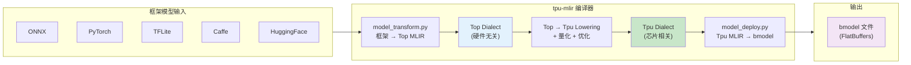
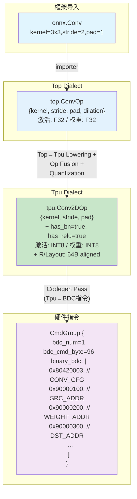
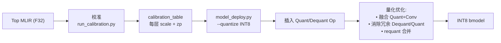

# tpu-mlir: MLIR 编译工具链

> 基于 MLIR 的 TPU 模型编译器，将 ONNX/PyTorch/TFLite/Caffe 模型编译为 bmodel 部署文件。
> 项目地址: https://github.com/sophgo/tpu-mlir | 论文: arXiv 2210.15016

---

## 1. 概述

### 1.1 定位

tpu-mlir 是整个 SG2260 软件栈的**编译器前端**。它接收主流框架的训练模型，产出可在 TPU 上高效执行的 bmodel 文件。



### 1.2 核心能力

| 能力 | 说明 |
|---|---|
| **多框架前端** | ONNX, PyTorch, TFLite, Caffe, HuggingFace (其他通过 ONNX 桥接) |
| **MLIR 方言系统** | Top Dialect (硬件无关) → Tpu Dialect (芯片相关) |
| **全量化管线** | F32, BF16, F16, INT8 (对称/非对称), AWQ/GPTQ/AutoRound 直通, 校准, QAT |
| **LLM 一键转换** | `llm_convert.py` 支持 HuggingFace LLM (Qwen, MiniCPM-V, ...) |
| **LayerGroup 内存优化** | 多层融合减少 GMEM 搬运 |
| **生产工具链** | model_runner, model_tool, 精度验证, 模拟器, 可视化 |

---

## 2. 项目结构

```
tpu-mlir/
├── lib/                     # 核心 C++ 库 (MLIR 方言定义+转换+优化)
│   ├── Dialect/
│   │   ├── Top/             #   Top Dialect: 硬件无关算子 IR
│   │   │   ├── IR/          #     Op 定义 (.td 文件, TableGen)
│   │   │   ├── Transforms/  #     图优化 Pass (算子融合, 形状推导, 常量折叠)
│   │   │   └── Interpreter/ #     Top 解释器 (用于精度验证)
│   │   └── Tpu/             #   Tpu Dialect: 芯片相关算子 IR
│   │       ├── IR/          #     Tpu Op 定义 (对应硬件指令)
│   │       ├── Transforms/  #     芯片特定优化 (Layout, 内存规划, 指令生成)
│   │       └── Interpreter/ #     Tpu 解释器 (芯片模拟器)
│   ├── Conversion/
│   │   ├── TopToTpu/        #   Top → Tpu 转换 (核心 Lowering)
│   │   ├── TopToLinalg/     #   Top → Linalg (可选, 利用上游 MLIR)
│   │   └── TopToTosa/       #   Top → TOSA (可选, 兼容 TOSA 生态)
│   ├── Builder/             #   MLIR 模块构建器
│   ├── CAPI/                #   C API 接口
│   ├── Interfaces/          #   MLIR Interface 定义
│   ├── Support/             #   支持库 (芯片配置, 工具函数)
│   ├── Traits/              #   MLIR Trait 定义
│   ├── Backend/             #   后端代码生成
│   └── PplBackend/          #   芯片后端插件
│
├── tools/                   # CLI 工具
│   ├── tpuc-opt/            #   TPU MLIR 优化器 (Pass 管线驱动)
│   ├── tpuc-tool/           #   TPU 工具集 (模型检查, 可视化)
│   ├── model_tool/          #   bmodel 检查/编辑/合并
│   ├── chiprunner/          #   芯片上运行器 (调试用)
│   ├── cvimodel_debug/      #   CVI 模型调试器
│   └── tpuc-opt-experiment/ #  实验性 Pass
│
├── python/                  # Python 包 (用户接口)
│   ├── tpu_mlir/            #   Python 包核心
│   │   ├── transform/       #     model_transform.py 实现
│   │   ├── calibration/     #     run_calibration.py 实现
│   │   ├── llm/             #     llm_convert.py 实现
│   │   ├── PerfAI/          #     性能分析工具
│   │   ├── profile_helper/  #     Profiling 辅助
│   │   ├── eval/            #     精度评估
│   │   ├── debugger/        #     调试工具
│   │   └── tools/           #     辅助工具
│   ├── samples/             #   示例脚本 (detect_yolov5.py, ...)
│   └── test/                #   Python 测试
│
├── include/tpu_mlir/        # 公开头文件
├── third_party/             # 第三方依赖 (LLVM/MLIR fork, ...)
├── docs/                    # 文档
├── regression/              # 回归测试 (模型 + 数据集)
├── test/                    # 单元测试
├── unittests/               # C++ 单元测试
├── experimental/            # 实验性功能
├── docker/                  # Docker 构建环境
└── build.sh                 # 一键构建脚本
```

---

## 3. 编译管线

### 3.1 核心工具链

```
                         用户操作                          内部实现
                   ═══════════════                    ═══════════════

训练模型          model_transform.py              框架 importer →
  │                  │                              Top Dialect 生成
  ▼                  ▼
Top MLIR ──────►  run_calibration.py              Top Interpreter 推理 →
  │              (仅 INT8)                         统计 min/max → 生成
  │                  │                             calibration table
  ▼                  ▼
                  model_deploy.py                 tpuc-opt (优化器) →
  │                  │                              Top→Tpu lowering →
  ▼                  ▼                              量化 → 优化 Pass →
bmodel ◄─────────── model_deploy.py               bmodel 打包 →
  │                  │                              FlatBuffers 序列化
  ▼                  ▼
部署到              model_tool                     bmodel 检查/合并/提取
目标服务器            model_runner.py               bmodel/MLIR/ONNX 推理
```

### 3.2 model_transform.py — 模型导入

```bash
model_transform.py \
  --model_name resnet18 \               # 模型名称
  --model_def resnet18.onnx \           # 模型定义文件
  --input_shapes [[1,3,224,224]] \      # 输入 shape
  --mean 123.675,116.28,103.53 \        # 预处理: 均值和缩放
  --scale 0.0171,0.0175,0.0174 \
  --pixel_format rgb \                  # 像素格式
  --output_names output \               # 输出 tensor 名称
  --test_input dog.jpg \                # 测试输入 (验证用)
  --test_result top_outputs.npz \       # 参考输出
  --mlir resnet18.mlir                  # 输出 Top MLIR 文件
```

**内部流程**:
1. 选择对应框架的 importer (ONNX/PT/TFLite/Caffe)
2. 解析模型图 → 构建 Top Dialect IR
3. 运行预处理 (mean/scale/resize → 生成 `_in_f32.npz`)
4. 可选: 用 `--test_input` 跑一次 Top Interpreter 推理验证输出正确性

### 3.3 run_calibration.py — INT8 量化校准

```bash
run_calibration.py resnet18.mlir \
  --dataset ../ILSVRC2012 \             # 校准数据集
  --input_num 200 \                     # 校准样本数
  -o resnet18_cali_table                # 输出校准表
```

**内部流程**:
1. 遍历校准数据集 (通常 100-1000 张)
2. 每层激活值统计 min/max 范围
3. 计算每层的量化参数: `scale = (max-min)/255`, `zero_point = round(-min/scale)`
4. 输出 calibration_table (每层 scale + zero_point)

### 3.4 model_deploy.py — 部署编译

```bash
model_deploy.py \
  --mlir resnet18.mlir \                # 输入 Top MLIR
  --quantize INT8 \                     # 量化类型: F32/BF16/F16/INT8
  --calibration_table resnet18_cali_table \  # INT8 校准表
  --processor bm1684x \                 # 目标芯片 (即 SG2260)
  --test_input resnet18_in_f32.npz \   # 测试输入
  --test_reference top_outputs.npz \    # 参考输出 (Top 推理结果)
  --tolerance 0.85,0.45 \              # 容忍度
  --model resnet18_int8.bmodel          # 输出 bmodel
```

**内部 Pass 管线** (`tpuc-opt` 驱动):

```
Top MLIR
  │
  ├── 1. Canonicalization (常量折叠, 死代码消除)
  │
  ├── 2. Top → Tpu Lowering
  │     └── 每个 Top Op  查表 → 对应的 Tpu Op
  │         例: top.ConvOp → tpu.Conv2DOp
  │
  ├── 3. 量化插入 (仅 INT8/BF16/F16)
  │     ├── INT8: 插入 tpu.QuantOp + tpu.DequantOp
  │     ├── BF16: F32 → BF16 截断
  │     └── F16: F32 → F16 截断
  │
  ├── 4. 算子融合 (Op Fusion)
  │     ├── ConvOp + BatchNormOp + ReluOp → tpu.ConvBNReluOp
  │     ├── AddOp + ReluOp → tpu.AddReluOp
  │     └── MatMulOp + AddOp → tpu.MatMulAddOp
  │
  ├── 5. Weight Layout 优化
  │     └── 重排权重内存布局以匹配 BDC 引擎 64B 对齐读取
  │
  ├── 6. SubNet 划分
  │     ├── TPU SubNet: 硬件可执行的操作
  │     └── CPU SubNet: 硬件不支持的操作用 CPU 回退
  │
  ├── 7. LayerGroup 优化 (内存规划)
  │     └── 将连续的 TPU 层分组, 中间结果留在 L2M (共享 128MB)
  │         L2M 内可容纳的层 → 零 GMEM 搬运
  │         超出 128MB → 切分为多个 Group, 仅首尾与 GMEM 交互
  │
  ├── 8. 指令生成 (Codegen)
  │     └── 每个 Tpu Op → BDC/GDMA 指令序列 (CmdGroup)
  │         BDC 指令: 矩阵/卷积/激活计算
  │         GDMA 指令: L2M ↔ GMEM 数据搬运
  │
  ├── 9. 内存分配
  │     ├── Coeff 权重: 分配 GMEM 空间, 去重 (SHA256)
  │     ├── Neuron: 分配临时激活值空间
  │     ├── IO: 输入/输出 tensor 空间
  │     └── 指令: BDC/GDMA 指令的内存区域
  │
  └── 10. bmodel 打包
        ├── FlatBuffers Model 构造 (Net → Stage → SubNet)
        ├── Binary 去重写入
        └── MODEL_HEADER_T 写入文件头
```

---

## 4. MLIR Dialect 系统

### 4.1 Top Dialect (硬件无关)

Top (Tensor Operator) Dialect 是框架模型导入后的第一个 IR 表示层，完全硬件无关。

**典型 Top Op**:
```
%0 = top.Conv(%input, %weight, %bias)
       {kernel_shape=[3,3], strides=[2,2], pads=[1,1,1,1]}

%1 = top.BatchNorm(%0, %bn_weight, %bn_bias, %bn_mean, %bn_var)

%2 = top.Relu(%1)

%3 = top.MaxPool(%2) {kernel_shape=[3,3], strides=[2,2]}

%4 = top.MatMul(%3, %fc_weight)
```

**Top Dialect 角色**:
- 统一表示: 屏蔽 ONNX/PyTorch/TFLite 的差异
- 图优化: 常量折叠、算子融合 (框架无关的融合)
- 精度基准: Top Interpreter 提供参考输出用于后续量化精度验证

### 4.2 Tpu Dialect (芯片相关)

Tpu Dialect 是 SG2260 芯片相关的算子表示，每个 Tpu Op 对应一条或多条硬件指令。

**典型 Tpu Op** (与 Top Op 对应):
```
// Conv + BN + ReLU 融合为单条指令
%0 = tpu.Conv2D(%input, %weight, %bias)
       {kernel=[3,3], stride=[2,2], pad=[1,1,1,1],
        has_bn=true, has_relu=true, dtype=INT8}

// 需要 GDMA 搬运数据的 Transpose
%1 = tpu.Transpose(%0) {order=[0,2,3,1]}

// 2D 矩阵乘
%2 = tpu.MatMul(%1, %fc_weight) {dtype=INT8}
```

**Tpu Dialect 特点**:
- 每个 Op 精确匹配 SG2260 的 BDC 指令或 GDMA 指令
- 含有芯片特定的属性 (数据布局, 量化参数, 内存位置)
- 支持 `tpu.GroupOp` 封装 LayerGroup

### 4.3 一个 Op 的两次转换过程 (以 Conv2D 为例)



---

## 5. 量化系统

### 5.1 支持的量化类型

| 类型 | 精度 | 速度 | 适用场景 |
|---|---|---|---|
| **F32** | 最高 | 最慢 | 精度调试, 基线对比 |
| **BF16** | 近似 F32 | 2× F32 | 大多数推理场景 (推荐) |
| **F16** | 略低于 BF16 | 2× F32 | 显存敏感场景 |
| **INT8 (对称)** | 良好 | 4× F32 | 标准 INT8 量化 |
| **INT8 (非对称)** | 最好 | 4× F32 | 精度敏感的 INT8 场景 |
| **INT4 (AWQ/GPTQ)** | 可接受 | 8× F32 | 大语言模型 |

### 5.2 量化公式

```
对称量化 (symmetric):
  q = round(x / scale)
  x' = q * scale

非对称量化 (asymmetric):
  q = round(x / scale) + zero_point
  x' = (q - zero_point) * scale

其中:
  scale = (max - min) / (qmax - qmin)
  zero_point = round(qmin - min / scale)
```

### 5.3 量化流程



### 5.4 LLM 量化 (W4BF16 / W4F16)

大语言模型支持更激进的权重量化:

```bash
# 权重量化到 4-bit, 激活保持 BF16
llm_convert.py \
  -m /path/to/model \
  -s 2048 \
  -q w4bf16 \
  -g 64 \                    # group_size
  -c bm1684x \
  -o output_dir

# 也可直接使用已量化的 AWQ/GPTQ/AutoRound 模型
llm_convert.py \
  -m /path/to/AWQ-quantized-model \
  --max_input_length 1024 \
  -s 2048 \
  -c bm1684x \
  -o output_dir
```

---

## 6. Python API 与工作流

### 6.1 标准工作流 (视觉模型)

```python
# 1. 模型转换
#    shell: model_transform.py --model_def model.onnx ... --mlir model.mlir

# 2. INT8 校准 (可选)
#    shell: run_calibration.py model.mlir --dataset ... -o cali_table

# 3. 部署编译
#    shell: model_deploy.py --mlir model.mlir --quantize INT8 \
#             --calibration_table cali_table --processor bm1684x --model model.bmodel

# 4. 精度验证
#    shell: model_runner.py --input test.npz --model model.bmodel --output out.npz
```

### 6.2 LLM 工作流

```python
# 一步到位 (转换+编译)
# shell: llm_convert.py \
#          -m /path/to/huggingface/model \
#          -s 2048 \
#          -q w4bf16 \
#          -c bm1684x \
#          -o output_dir

# 推理
# 拷贝 output_dir/*.bmodel 到 TPU 服务器
# shell: python pipeline.py -m model.bmodel -c config
```

### 6.3 Python API 编程

```python
import tpu_mlir

# 构建 MLIR Module
from tpu_mlir.builder import ModuleBuilder
builder = ModuleBuilder()
# ... 添加 Op ...

# 运行 Pass 管线
from tpu_mlir.transform import run_passes
run_passes(module, ["canonicalize", "top-to-tpu", "codegen"])

# 导出 bmodel
from tpu_mlir.tools import export_bmodel
export_bmodel(module, "output.bmodel", chip="bm1684x")
```

---

## 7. 构建系统

### 7.1 Docker 环境

```bash
# 拉取官方 Docker 镜像
docker pull sophgo/tpuc_dev:latest

# 启动容器
docker run --privileged --name tpu-mlir \
  -v $PWD:/workspace \
  -it sophgo/tpuc_dev:latest
```

### 7.2 源码编译

```bash
cd /workspace/tpu-mlir
pip install -r requirements.txt
source ./envsetup.sh      # 设置环境变量 (TPUC_ROOT, 工具链路径)
./build.sh                 # cmake + make
```

### 7.3 Pip 安装 (预编译)

```bash
pip install tpu_mlir  # 需要 Python ≥ 3.10, Ubuntu 22.04
```

---

## 8. 关键工具

| 工具 | 功能 |
|---|---|
| `model_transform.py` | 框架模型 → Top MLIR |
| `model_deploy.py` | Top MLIR → bmodel |
| `run_calibration.py` | INT8 量化校准 |
| `llm_convert.py` | HuggingFace LLM 一键转换 |
| `model_runner.py` | 通用推理运行器 (bmodel/MLIR/ONNX/PT/TFLite) |
| `model_tool` | bmodel 检查/打印/提取/合并/导出 |
| `tpuc-opt` | TPU MLIR 优化器 (Pass 管线引擎) |

---

## 9. 与 TPU1686 集成

- **算子实现**: Tpu Dialect 中每个 Op 的下层实现位于 TPU1686 `firmware_core/src/` 和 `tpuDNN/`
- **指令格式**: BDC/GDMA 指令格式定义在 TPU1686 `kernel/include/tpu_kernel.h` (6661行, ~713函数)
- **编译器后端**: `bmcompiler/libbackend_*.so` (预编译) 将编译好的图 IR 序列化为 bmodel 文件
- **芯片规格**: SG2260 硬件参数 (Core/Lane 数量, LMEM/L2M/GMEM 大小) 从 TPU1686 `sg2260/` 获取

---

## 10. 参考资料

- 论文: [TPU-MLIR (arXiv 2210.15016)](https://arxiv.org/abs/2210.15016)
- 文档: https://tpumlir.org
- 代码: https://github.com/sophgo/tpu-mlir
