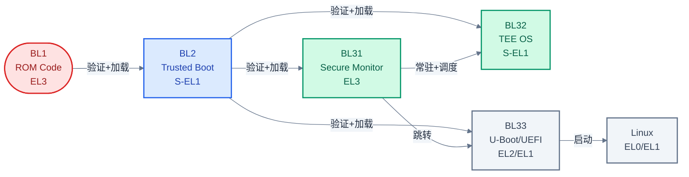
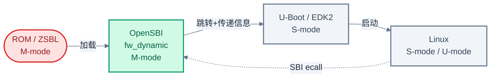
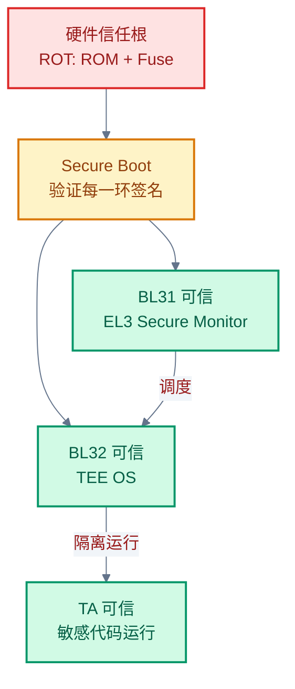

# 三大主题总览:TF-A、TEE 与 Secure Boot

> 一句话概括:本文建立 TF-A、TEE、Secure Boot 三大主题的本质认知,用 ARM 与 RISC-V 两条启动链说明它们的关联与边界。
> **工程师视角**:理解三者关系是后续所有章节的基础——Secure Boot 是"启动时验证",TEE 是"运行时隔离",TF-A 在 ARM 上同时承担两者。

### 关键术语

| 缩写 | 全称 | 含义 |
|------|------|------|
| TF-A | Trusted Firmware-A | ARMv8-A/v9-A 安全世界参考实现 |
| TEE | Trusted Execution Environment | 可信执行环境,与主 OS 隔离的安全运行时 |
| REE | Rich Execution Environment | 富执行环境,运行 Linux/Android |
| Secure Boot | — | 启动时验证,防止固件被篡改 |
| ROT | Root of Trust | 信任根,不可变的硬件信任起点 |
| EL3 | Exception Level 3 | ARM 最高特权级,Secure Monitor 所在 |
| M-mode | Machine Mode | RISC-V 最高特权级,OpenSBI 所在 |
| TrustZone | — | ARM 硬件安全扩展,划分安全/非安全世界 |
| PMP | Physical Memory Protection | RISC-V 物理内存保护机制 |

---

## 1. 三大主题的本质定位

在深入任何细节之前,先用一个具体场景说明三个主题"在做什么"。

### 1.1 Secure Boot:启动时验证

**场景**:你拿到一块开发板,按下电源键。从这一刻到 Linux 内核启动,中间会执行多段固件(bootloader、TEE OS、内核)。如果攻击者物理替换了 Flash 芯片,刷入了恶意 bootloader,后果是什么?这个恶意 bootloader 可以在 Linux 启动前篡改任何东西——窃取密钥、植入后门、伪装成正常系统。

Secure Boot 解决的就是这个问题:**在启动链的每一环,验证下一环的签名,确保没有篡改**。它是一个一次性过程,只在启动时发生。一旦所有阶段验证通过并跳转到 Linux,Secure Boot 的使命就完成了。

**适用范围**:任何有启动过程的系统,不依赖 TEE。一个不带 TrustZone 的简单 MCU 也可以做 Secure Boot(用 ROM 验证 bootloader 签名即可)。

### 1.2 TEE:运行时隔离

**场景**:Linux 内核跑起来后,你的支付应用需要处理用户指纹模板和交易签名。但 Linux 内核有数百万行代码,每年都有大量 CVE——一旦内核被攻破,攻击者就能读取你应用内存里的指纹数据。

TEE 解决的是**运行时隔离**问题:在主 OS 之外,提供一个隔离的执行环境,运行可信应用(Trusted Application, TA)。主 OS(称为 REE)无法直接访问 TEE 的内存,即使 REE 被攻破,TA 中的密钥仍然安全。

**适用范围**:需要运行时保护敏感代码/数据的场景。TEE 强依赖 Secure Boot——如果启动链不被信任,TEE OS 本身可能被篡改,隔离就失去意义。

### 1.3 TF-A:ARM 上的实现枢纽

**场景**:ARMv8-A 上要同时实现 Secure Boot 和 TEE,需要有人做两件事——启动时验证各阶段镜像( Secure Boot),运行时处理 REE 与 TEE 之间的切换(TEE 的 Secure Monitor)。TF-A 就是干这两件事的开源参考实现。

TF-A 不是一个抽象概念,而是一个具体的软件项目([src/tf-a-src/](./src/tf-a-src/))。它的 BL1/BL2 阶段做 Secure Boot 验证,BL31 阶段常驻 EL3 做 Secure Monitor,BL32 位置留给 TEE OS(如 OP-TEE)。

> **核心要点**:三个主题的关系——Secure Boot 是基础(启动时),TEE 是应用(运行时),TF-A 是 ARM 上同时实现两者的软件枢纽。Secure Boot 不依赖 TEE,但 TEE 强依赖 Secure Boot。

---

## 2. ARM 启动链全景

ARMv8-A 的典型安全启动链由 5 个阶段组成,每个阶段对应一个特权级和职责:

> **如何读这张图**:横向时间线展示启动顺序。颜色区分角色——红色(BL1)是不可变 ROM,蓝色(BL2)是验证阶段,绿色(BL31/BL32)是常驻运行时,灰色(BL33/OS)是普通世界。BL31 是枢纽:它被 BL2 加载后常驻 EL3,既调度 BL32(TEE),又跳转 BL33(主 OS)。

各阶段职责:

| 阶段 | 特权级 | 是否常驻 | 职责 |
|------|--------|:--------:|------|
| **BL1** | EL3 | 否(ROM) | 不可变,验证并加载 BL2 |
| **BL2** | S-EL1 | 否 | 验证 BL31/BL32/BL33,加载到 FIP 包 |
| **BL31** | EL3 | **是** | Secure Monitor,SMC 调度,PSCI 电源管理 |
| **BL32** | S-EL1 | **是** | TEE OS(如 OP-TEE),运行 TA |
| **BL33** | EL2/EL1 | 否 | U-Boot/UEFI,加载 Linux |

**为什么 BL31 要常驻?** 因为 Linux 运行后仍需要调用 SMC(进入 TEE、电源管理),这些请求必须由 EL3 处理。BL31 是唯一在 EL3 常驻的代码,承担"运行时 Secure Monitor"角色。其他阶段(BL1/BL2/BL33)执行完即退出。

**为什么 BL32 也是常驻?** TEE OS 需要持续响应 TA 请求,不能像 bootloader 那样执行完就退出。BL32 与 BL31 共同构成"安全世界运行时"。

---

## 3. RISC-V 启动链全景

RISC-V 的启动链与 ARM 概念对应,但实现不同:

RISC-V 启动链比 ARM 简洁,核心差异:

| 对比维度 | ARM | RISC-V |
|----------|-----|--------|
| 最高特权级 | EL3 | M-mode |
| Secure Monitor | BL31(TF-A) | OpenSBI |
| 调用接口 | SMC 指令 | ecall(SBI 约定) |
| TEE OS | BL32(OP-TEE) | **缺失**(Keystone/Penglai 研究级) |
| 启动验证 | TBBR 规范 | 无统一规范,U-Boot verified boot 为主 |
| 隔离硬件 | TrustZone(二元世界) | PMP(可编程多区) |

**为什么 RISC-V 没有 BL32 对应物?** ARM 的 TrustZone 在硬件上划分安全/非安全两个世界,BL32 自然占据"安全世界 S-EL1"位置。RISC-V 没有硬件级二元世界,只有可编程的 PMP——理论上可以划分多个隔离区,但缺乏统一规范导致 TEE OS 生态碎片化。详见 [10-riscv-secure-boot-and-tee.md](./10-riscv-secure-boot-and-tee.md)。

---

## 4. 概念正交与工程耦合

### 4.1 概念正交:两个独立问题

Secure Boot 和 TEE 解决的是**不同时间点**的不同问题:

- **Secure Boot**:启动时,验证下一阶段镜像签名。问题域是"信任传递"
- **TEE**:运行时,隔离敏感代码与主 OS。问题域是"执行隔离"

两者可以独立存在:

| 系统 | Secure Boot | TEE | 例子 |
|------|:-----------:|:---:|------|
| 简单 MCU | 有 | 无 | ROM 验证 bootloader 签名,无 TrustZone |
| 旧版 Android | 无 | 有 | 启动未验证,但有 TrustZone 跑 DRM |
| 现代手机 | 有 | 有 | 完整安全栈 |
| 普通服务器 | 无 | 无 | 传统 x86 服务器(无 Secure Boot、无 SGX) |

### 4.2 工程耦合:TEE 依赖 Secure Boot

虽然概念正交,但工程上 **TEE 强依赖 Secure Boot**。原因如下:

**没有 Secure Boot 的 TEE 会怎样?** 假设攻击者物理刷入恶意 BL31,这个 BL31 伪装成正常 Secure Monitor,但实际上会:
- 拦截所有 SMC 调用,窃取 TA 传入的密钥
- 直接读取 TEE OS 内存(因为它在 EL3,比 S-EL1 权限更高)
- 伪装 TA 通信,欺骗 CA 和 TA

此时 TEE 的"隔离"完全失效——因为隔离的根基(EL3 的可信性)被破坏了。

**所以**:Secure Boot 验证 BL31/BL32 的签名,确保它们未被篡改,这是 TEE 可信的前提。TF-A 同时实现两者,不是巧合,而是必然——TEE 的可信根植于 Secure Boot。

> **如何读这张图**:信任从硬件根(ROT)开始,通过 Secure Boot 传递到 BL31 和 BL32。只有 BL31/BL32 被验证可信,TEE 的隔离才有意义。这是"为什么 TEE 依赖 Secure Boot"的完整逻辑链。

> **核心要点**:Secure Boot 是 TEE 可信的前提——没有 Secure Boot 验证 BL31/BL32,TEE OS 可被篡改,隔离失去意义。TF-A 同时实现两者,正是因为这个依赖关系。

---

## 5. ARM 与 RISC-V 安全模型对比

| 对比维度 | ARM (TrustZone) | RISC-V (PMP/ePMP) |
|----------|-----------------|-------------------|
| **隔离粒度** | 二元(安全/非安全世界) | 多区(可编程 16-64 个 region) |
| **硬件机制** | AXI 总线 NS bit + TZPC/TZASC | PMP 寄存器 + 权限检查 |
| **特权级** | EL3(Secure Monitor) | M-mode(OpenSBI) |
| **调用接口** | SMC 指令(硬件异常) | ecall(SBI 软件约定) |
| **内存保护** | 安全内存只能安全世界访问 | 每个 region 可配 M/S/U 权限 |
| **中断隔离** | GIC Group 0/1,FIQ/IRQ | AIA + IMSIC,可配特权级 |
| **成熟度** | 生产级,广泛部署 | 演进中,WorldGuard 等扩展补齐 |
| **TEE OS** | OP-TEE(生产级) | Keystone/Penglai(研究级) |

**为什么 ARM 选择二元世界?** TrustZone 设计于 2000 年代,目标是"用最小硬件代价提供隔离"——只需一个 NS bit 就能区分安全/非安全事务,所有总线设备都能感知。二元模型简单,适合当时的需求。

**为什么 RISC-V 选择多区?** RISC-V 设计于 2010 年代,PMP 借鉴了 MMU 的页保护思路——每个 region 独立配置权限,更灵活。但灵活性带来复杂性:没有天然的"安全世界",需要软件(OpenSBI)来管理隔离。这也是 RISC-V TEE 生态碎片化的根源——不同方案(Keystone/Penglai/CURE)都基于 PMP,但接口不兼容。

---

## 6. 学习路径建议

根据你的角色,推荐不同的学习重点:

| 角色 | 推荐路径 | 重点章节 |
|------|----------|----------|
| **固件工程师** | 01→02→03→04→05→11 | TF-A 架构与 BL31 详解 |
| **安全应用开发者** | 01→06→07→08→11 | TEE 概念与 TA 开发 |
| **RISC-V 工程师** | 01→02→09→10→11 | OpenSBI 与 RISC-V 生态 |
| **系统架构师** | 全部 12 篇 | 关系图、SPD 调度、生态对比 |

### 6.1 前置知识

| 需要了解 | 参考文档 |
|----------|----------|
| ARMv8-A 特权级(EL0-EL3) | ARM Architecture Reference Manual |
| RISC-V 特权级(M/S/U) | [riscv/03-privileged/privileged-modes-and-csr.md](../riscv/03-privileged/privileged-modes-and-csr.md) |
| UEFI 启动流程 | [edk2/02-boot-sequence.md](../edk2/02-boot-sequence.md) |
| 基本密码学(RSA/ECDSA/哈希) | 任意密码学教材 |

### 6.2 本系列后续章节预告

- [02-secure-boot-concepts.md](./02-secure-boot-concepts.md) — 深入 Secure Boot 概念:信任根、信任链、度量启动 vs 验证启动
- [03-arm-tbbr-and-boot-chain.md](./03-arm-tbbr-and-boot-chain.md) — ARM TBBR 规范与启动链各阶段详解
- [06-tee-concepts-and-trustzone.md](./06-tee-concepts-and-trustzone.md) — TEE 概念与 TrustZone 硬件机制

---

## 参考资料

- [TF-A Documentation](https://trustedfirmware-a.readthedocs.io/) — TF-A 官方文档
- [TBBR Specification (ARM DEN0006)](https://developer.arm.com/documentation/den0006/) — 启动链信任传递规范
- [GlobalPlatform TEE Specifications](https://globalplatform.org/specs-library/) — TEE API 标准
- [OpenSBI Documentation](https://github.com/riscv-software-src/opensbi/blob/master/docs/) — OpenSBI 官方文档
- [RISC-V Privileged ISA Spec](https://riscv.org/technical/specifications/) — PMP、特权级规范

---

**下一篇**: [02-secure-boot-concepts.md](./02-secure-boot-concepts.md) — Secure Boot 概念基础
