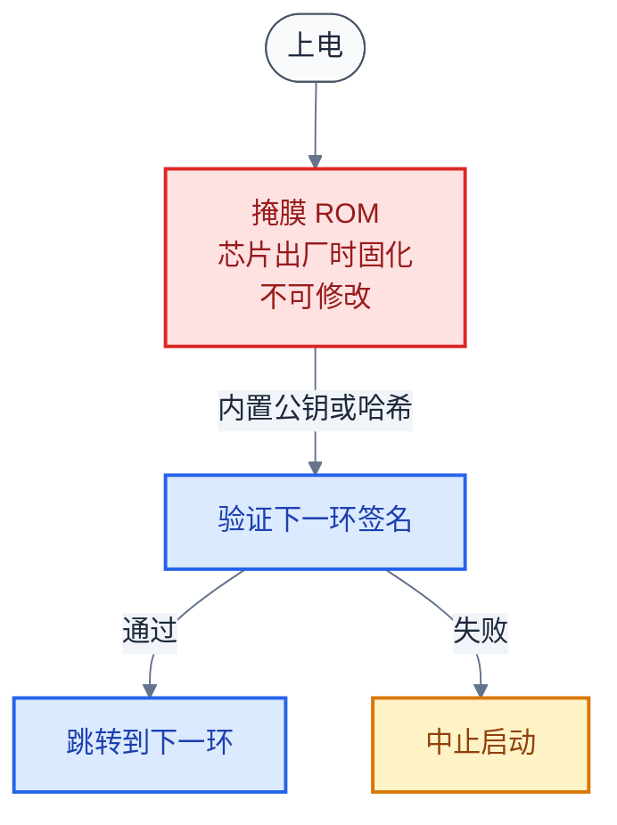
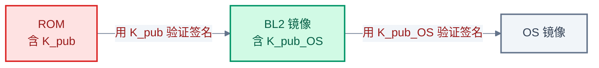
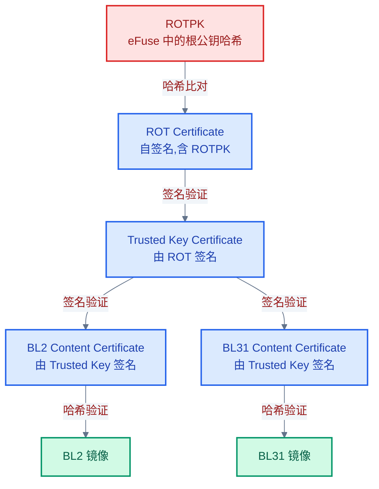
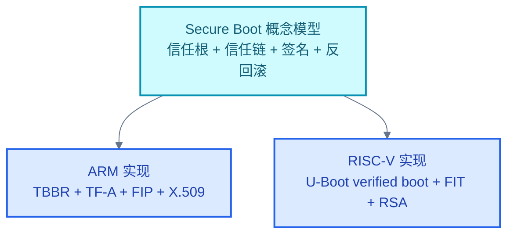

# Secure Boot 概念基础

> 一句话概括:本文从攻击场景出发,建立 Secure Boot 的核心概念体系——信任根、信任链、度量与验证、反回滚,并用一个可手动验证的 RSA 签名例子说明信任如何用密码学方法传递。
> **工程师视角**:Secure Boot 不是某个具体软件,而是一套"用密码学把信任从硬件根传递到 OS"的设计模式。理解这套模式后,再看 TF-A 的 TBBR 或 U-Boot 的 verified boot,都只是同一概念的不同实现。

### 关键术语

| 缩写 | 全称 | 含义 |
|------|------|------|
| ROT | Root of Trust | 信任根,不可变的硬件信任起点 |
| CoT | Chain of Trust | 信任链,每一环验证下一环 |
| ROTPK | Root Of Trust Public Key | 信任根公钥,烧录在芯片 Fuse 中 |
| OTP | One-Time Programmable | 一次性可编程存储,常用于存密钥 |
| NV Counter | Non-Volatile Counter | 非易失计数器,用于反回滚 |
| RSA | Rivest–Shamir–Adleman | 非对称加密/签名算法 |
| SHA | Secure Hash Algorithm | 安全哈希算法,如 SHA-256 |
| X.509 | — | 公钥证书的国际标准格式(ITU-T X.509) |
| DER | Distinguished Encoding Rules | ASN.1 编码格式,证书签名使用 |
| Measured Boot | — | 度量启动,记录哈希到 TPM/安全存储 |
| Verified Boot | — | 验证启动,启动前校验签名 |
| TPM | Trusted Platform Module | 可信平台模块,度量启动的存储后端 |

**前置阅读**:[01-trusted-firmware-overview.md](./01-trusted-firmware-overview.md) — 三大主题总览与关系

---

## 1. 为什么需要 Secure Boot

> [01-trusted-firmware-overview.md](./01-trusted-firmware-overview.md) 建立了三大主题的总览:Secure Boot 是基础,TEE 是应用,TF-A 是 ARM 上的实现枢纽。一个直接的问题是:Secure Boot 到底在防什么?信任又从哪里开始?本章从攻击场景出发,说明 Secure Boot 要解决的问题——先看"没有它会怎样",再引入信任根与信任链的概念。

### 1.1 没有 Secure Boot 会怎样

**场景**:一块嵌入式开发板,Flash 芯片是外置的 SPI NOR。攻击者拆开外壳,用夹具夹住 Flash 芯片,用编程器读出固件镜像,修改其中一段 bootloader(植入后门),再写回 Flash。重新上电后,修改过的 bootloader 正常执行——因为它没有任何校验机制,芯片 ROM 只是机械地把它加载到内存并跳转。

这个恶意 bootloader 可以做些什么?

- **在 Linux 启动前窃取密钥**:bootloader 有权限访问所有内存,可以在内核加载前把密钥区数据复制到预留位置,稍后通过网络传出
- **植入持久后门**:在 bootloader 中注入一段代码,每次启动都加载一个隐藏的内核模块
- **伪装成正常系统**:启动界面完全正常,用户察觉不到任何异常
- **绕过所有软件安全**:即使 Linux 内核有完善的权限控制,在它启动前就已经被篡改了——地基被换掉了

**问题的本质**:启动过程是一个链——ROM → bootloader₁ → bootloader₂ → OS。如果第一环(ROM)之后的任何一环可以被篡改而不被发现,整条链就不可信。Secure Boot 解决的就是"如何让每一环都能验证下一环的完整性"。

### 1.2 Secure Boot 的核心思想

Secure Boot 的核心操作:**在启动链的每一环,执行下一环之前,先验证它的签名**。验证通过才跳转,失败则中止启动。

这要求回答三个问题:

| 问题 | 答案 | 章节 |
|------|------|------|
| 信任从哪里开始? | 信任根(ROT)——硬件保证不可变 | 第 2 节 |
| 信任怎么传递? | 信任链(CoT)——每一环验证下一环 | 第 3 节 |
| 怎么防止刷入旧版固件? | 反回滚——用单调递增计数器 | 第 5 节 |

> **核心要点**:Secure Boot 不是某段代码或某个软件,而是一套设计模式——用密码学方法(签名+哈希)把信任从不可变的硬件根,逐级传递到操作系统。任何具体实现(TF-A TBBR、U-Boot verified boot、UEFI Secure Boot)都是这套模式的不同实例。

---

## 2. 信任根:信任的起点

> 上一节说明了 Secure Boot 要解决"信任从哪里开始"的问题。答案是信任根(Root of Trust, ROT)——一个硬件保证不可变的起点。本节讲信任根的三种实现形态,以及为什么它必须不可变。

### 2.1 信任根的本质

信任根是整条信任链的起点。它的核心特性是**不可变**——攻击者无法通过任何软件或硬件手段修改它。如果信任根本身可以被篡改,那么基于它建立的所有信任都是空中楼阁。

一个完整的信任根通常包含两部分:

| 组成 | 作用 | 典型实现 |
|------|------|----------|
| **不可变代码** | 第一段执行的代码,负责验证下一环 | Boot ROM(掩膜 ROM) |
| **不可变密钥** | 用于验证签名的公钥(ROTPK) | eFuse / OTP |

### 2.2 三种实现形态

**形态一:掩膜 ROM(最常见)**

芯片出厂时,一段代码被烧录在掩膜 ROM(Mask ROM)中。掩膜 ROM 的内容在芯片制造时就固定了,物理上无法修改——它和芯片的硅片是一体的。

ARM 的 BL1 通常就是掩膜 ROM。RISC-V 的 ZSBL(Zeroth Stage Boot Loader)也是。

**形态二:eFuse / OTP(存储公钥)**

ROM 容量有限(通常几十 KB),无法存储完整的验证逻辑和公钥链。常见做法是:ROM 中只存验证程序的代码,公钥(ROTPK)或公钥的哈希存在 eFuse(电子熔丝)或 OTP(One-Time Programmable,一次性可编程存储)中。

eFuse 的特性:

- **一次性写入**:出厂后只能"烧断"熔丝(把 0 变成 1),不能恢复
- **物理不可逆**:一旦烧录,任何软件都无法修改
- **容量小**:通常几百 bit,够存一个公钥哈希(SHA-256 = 256 bit)

**为什么存公钥哈希而不是公钥本身?** 因为 RSA-2048 公钥需要 2048 bit = 256 字节,而 eFuse 容量宝贵。存公钥的 SHA-256 哈希(32 字节)更经济——验证时先对证书中的公钥算哈希,再与 eFuse 中的哈希比对即可。

**形态三:硬件安全引擎**

一些 SoC 集成专用的硬件安全模块(如 NXP的 HAB、ST 的 ROM 保护),它们在 ROM 之外提供额外的硬件级验证。这类模块通常有自己的密钥存储和加密加速器,但本质仍是"不可变的信任起点"。

### 2.3 为什么信任根必须不可变

假设信任根可以被修改:攻击者替换 ROM 中的公钥为自己的公钥,然后用自己的私钥签名一个恶意 bootloader。验证时会通过——因为验证用的是攻击者的公钥。整条信任链从第一环就被攻破。

所以信任根的不可变性是 Secure Boot 的**绝对前提**。这也是为什么 Secure Boot 必须有硬件参与——纯软件方案无法提供真正的不可变性,因为软件总是可以被更高权限的软件修改。

> **核心要点**:信任根 = 不可变 ROM(验证代码)+ 不可变 eFuse(公钥哈希)。它的不可变性是物理保证的,任何软件手段都无法篡改。没有不可变信任根,就没有 Secure Boot。

---

## 3. 信任链:逐环传递

> 上一节建立了信任根的概念——它是不可变的起点。但信任根只验证第一环,第一环之后呢?答案是信任链(Chain of Trust, CoT):每一环在执行下一环前先验证它,信任就这样逐级传递。本节用一个三阶段的小例子说明这个过程。

### 3.1 信任链的小例子

假设启动链有三段:ROM → BL2 → OS。信任根是 ROM 中的公钥 $K_{pub}$。

**第一环:ROM 验证 BL2**

1. ROM 用 $K_{pub}$ 验证 BL2 的签名(签名用对应的私钥 $K_{priv}$ 生成)
2. 验证通过 → 信任 BL2
3. 跳转到 BL2 执行

**第二环:BL2 验证 OS**

但这里有个问题:BL2 用什么验证 OS?BL2 本身没有私钥(私钥绝不能放在固件里)。答案是:**BL2 中内嵌了另一个公钥 $K_{pub}^{OS}$**,这个公钥在 BL2 镜像中,而 BL2 已经被 ROM 验证过了——所以 $K_{pub}^{OS}$ 也是可信的。

1. BL2 用内嵌的 $K_{pub}^{OS}$ 验证 OS 的签名
2. 验证通过 → 信任 OS
3. 跳转到 OS 执行

这就是信任链的本质:**每一环携带验证下一环所需的公钥,而该公钥的可信性由上一环的验证保证**。

> **如何读这张图**:信任从 ROM(红色,不可变)出发。ROM 用内嵌公钥验证 BL2,BL2 通过后变成绿色(可信)。BL2 内嵌了另一个公钥 $K_{pub}^{OS}$,用它验证 OS。OS 在被验证前是灰色(未验证),验证通过后也变绿。信任就这样"接力"传递。

### 3.2 为什么不能让 ROM 直接验证所有阶段

理论上 ROM 可以内嵌所有阶段的公钥,直接验证 BL2、OS、甚至用户应用。但实际不这么做,原因有二:

**原因一:ROM 容量有限**。掩膜 ROM 通常只有几十 KB,还要放初始化代码(PLL、DDR、时钟)。每个 RSA-2048 公钥占 256 字节,看似不大,但 ROM 的成本是按 bit 计的——增加 ROM 容量直接增加芯片面积和成本。

**原因二:灵活性**。如果 OS 升级时换了签名密钥(比如密钥泄露后轮换),ROM 中的公钥无法更新(eFuse 不可逆)。而如果让 BL2 持有验证 OS 的公钥,OS 升级时可以同时更新 BL2(用 ROM 公钥重新签名),实现密钥轮换。

所以信任链是"逐级委托"模型:ROM 委托 BL2 验证后续阶段,BL2 再委托下一环。每一级只需信任上一级的公钥。

### 3.3 信任链的一般化

把上面的例子推广到 N 个阶段:

$$
\text{可信}(Stage_0) \xrightarrow{\text{验证}} \text{可信}(Stage_1) \xrightarrow{\text{验证}} \cdots \xrightarrow{\text{验证}} \text{可信}(Stage_N)
$$

- $Stage_0$:信任根(ROM),硬件保证可信
- $Stage_i$ 验证 $Stage_{i+1}$:用内嵌或证书中的公钥验证签名
- 任何一环验证失败,整条链中断

> **核心要点**:信任链是"逐级委托"模型——每一环携带验证下一环的公钥,该公钥的可信性由上一环保证。这样设计既绕过了 ROM 容量限制,又支持密钥轮换。如果任何一环断链,后续所有阶段都不可信。

---

## 4. 度量启动 vs 验证启动

> 上一节讲了信任链如何传递。但信任链的"验证"有两种不同做法:一种是"验证通过才执行"(验证启动),另一种是"记录哈希但不阻止执行"(度量启动)。本节讲两者的区别与联系——这是理解 Secure Boot 策略选择的关键。

### 4.1 两种策略的对比

| 对比维度 | 验证启动(Verified Boot) | 度量启动(Measured Boot) |
|----------|--------------------------|--------------------------|
| **核心动作** | 启动前验证签名,失败则中止 | 启动时计算哈希,记录到安全存储 |
| **是否阻止执行** | 是,验证失败不跳转 | 否,照常执行,只记录 |
| **信任判定时机** | 启动时(本地判定) | 启动后(由远程方判定) |
| **典型存储** | eFuse(公钥)+ NV Counter | TPM PCR(Platform Configuration Register) |
| **典型应用** | ARM TBBR、UEFI Secure Boot | 远程证明(Attestation)、可信计算 |
| **能否离线工作** | 是,不需要外部交互 | 需要远程方查询 PCR 才能判定 |

**为什么需要两种策略?** 它们解决不同问题:

- 验证启动解决"本地安全性"——设备自己判断固件是否可信,不可信就拒绝启动。适合消费电子(手机、路由器),设备离线也能保护自己。
- 度量启动解决"远程可审计性"——设备记录自己启动了什么,事后由服务器查询判定。适合服务器集群,管理员需要审计每台机器的启动状态,但不希望因验证失败导致机器无法启动(影响可用性)。

### 4.2 度量启动的工作方式

度量启动的核心是 TPM(Trusted Platform Module)中的 PCR(Platform Configuration Register)。PCR 有一个特殊性质:**只能扩展,不能直接写入**。

$$
PCR_{new} = \text{SHA-256}(PCR_{old} \| \text{hash}(Stage_i))
$$

- $PCR_{old}$:PCR 当前值,初始为全 0
- $\text{hash}(Stage_i)$:第 $i$ 阶段镜像的哈希
- $\|$:拼接操作

**为什么用扩展而不是直接覆盖?** 因为扩展是不可逆的——你无法把 PCR 恢复到之前的值。这样,启动链的每一阶段都会把它的哈希"叠加"到 PCR 中,最终 PCR 值是所有阶段哈希的链式摘要。篡改任何一个阶段,都会导致最终 PCR 值不同。

**小例子**:假设启动链有 2 个阶段,SHA-256 简化为 8 位(实际 256 位):

1. $PCR_0 = 00000000$ (初始值)
2. 阶段 1 哈希 = $10101100$,扩展后 $PCR_1 = \text{SHA-256}(00000000 \| 10101100) = 01110010$
3. 阶段 2 哈希 = $11001011$,扩展后 $PCR_2 = \text{SHA-256}(01110010 \| 11001011) = 10011101$

如果攻击者修改了阶段 1,它的哈希变了,后续所有 PCR 值都会不同。服务器通过比对 PCR 值就能发现篡改。

### 4.3 两者结合:度量+验证

生产级系统通常两者结合:先用验证启动保证本地安全(不可信固件不执行),同时用度量启动记录启动链状态(供远程审计)。ARM TF-A 的 TBBR 主要做验证启动,但也可以配置度量启动扩展。

> **核心要点**:验证启动是"门卫"(不让坏固件进门),度量启动是"监控"(记录谁进过门)。前者保证本地安全,后者支持远程审计。生产系统通常两者结合。

---

## 5. 反回滚保护

> 前面讲了签名验证可以防止篡改。但有一种攻击签名验证防不了——降级攻击(Rollback Attack)。本节讲反回滚如何解决这个问题。

### 5.1 降级攻击的场景

**场景**:厂商发现 v1.0 固件有漏洞,发布了 v1.1 修复。用户升级到 v1.1。但攻击者获取了 v1.0 的合法镜像(它是用正确私钥签名的,签名验证会通过!),把设备刷回 v1.0,然后利用已知漏洞攻击。

签名验证为什么防不住?因为 v1.0 镜像是**合法签名**的——它确实由厂商私钥签名,只是包含已知漏洞。签名机制只能验证"镜像是否被篡改",无法判断"这个版本是否应该被允许运行"。

### 5.2 反回滚的机制

反回滚的核心是**单调递增计数器**:

| 组件 | 作用 | 存储位置 |
|------|------|----------|
| **Security Counter(镜像中)** | 固件版本号,编译时写入镜像 | FIP 包头 / FIT 镜像 |
| **NV Counter(芯片中)** | 已见过最大版本号,只增不减 | eFuse 或安全 RTC 寄存器 |

验证流程:

1. 从镜像中读取 Security Counter(比如 v1.1 的值是 35)
2. 从芯片读取 NV Counter(比如当前值是 35)
3. 比较:若 `镜像 Security Counter >= NV Counter`,通过;否则拒绝
4. 验证通过后,把 NV Counter 更新为镜像的 Security Counter(若更大)

**为什么 NV Counter 必须在硬件中?** 如果存在 Flash 里,攻击者刷回 v1.0 时可以把计数器也改回去。硬件计数器(eFuse 或安全寄存器)只能单调递增,无法回退。

**eFuse 实现的代价**:eFuse 是一次性熔丝,每个 bit 烧断后不可恢复。常见的做法是用"一热编码"——32 bit 计数器只有 1 个 bit 是 1,每次升级烧断下一个 bit,这样最多支持 32 次升级。所以 eFuse 计数器的"步长"通常较大(比如每次 +1 代表一次重大版本),不能频繁使用。

### 5.3 RPMB:另一种抗回滚存储

eFuse 容量有限且不可逆,不适合频繁更新。另一种选择是 eMMC/UFS 的 RPMB(Replay Protected Memory Block)分区:

- RPMB 有一个硬件密钥(出厂时烧录在 eMMC 和 SoC 中)
- 写入 RPMB 时必须带上计数器,硬件保证计数器单调递增
- 读取 RPMB 时可以验证写入时的计数器

RPMB 适合存储频繁更新的安全数据(如 TA 的反回滚计数器),但依赖 eMMC/UFS 硬件。OP-TEE 的安全存储就用 RPMB 做抗回滚后端(详见 [08-optee-ta-development.md](./08-optee-ta-development.md))。

> **核心要点**:签名验证只能防篡改,防不了降级攻击。反回滚用硬件单调计数器(NV Counter)记录已见过最大版本号,拒绝旧版本运行。eFuse 计数器不可逆但容量小(适合固件级),RPMB 可更新但依赖 eMMC(适合应用级)。

---

## 6. 签名机制演算

> 前几节讲了信任根、信任链、反回滚的概念,都涉及"签名验证"但没展开。本节用一个可手动验证的小例子,完整演示 RSA 签名与验证的数学过程——让你理解"验证签名"到底在算什么。

### 6.1 RSA 签名的本质

RSA 签名的核心操作:

- **签名**:用私钥 $(d, n)$ 对哈希值做幂运算,$\text{sig} = \text{hash}^d \bmod n$
- **验证**:用公钥 $(e, n)$ 对签名做幂运算,$\text{hash}' = \text{sig}^e \bmod n$,若 $\text{hash}' = \text{hash}$ 则验证通过

为什么这样能验证签名?因为 $d$ 和 $e$ 满足特殊关系:$d \cdot e \equiv 1 \pmod{\varphi(n)}$,其中 $\varphi(n)$ 是欧拉函数。由欧拉定理,$m^{d \cdot e} \equiv m \pmod{n}$(当 $\gcd(m, n) = 1$)。所以:

$$
\text{sig}^e = (\text{hash}^d)^e = \text{hash}^{d \cdot e} \equiv \text{hash} \pmod{n}
$$

### 6.2 一个完整的小例子

**注意**:下面的数字极小(仅为演示数学过程),真实 RSA 至少用 2048 位(约 617 位十进制数)。

**密钥生成**:

1. 选两个质数 $p = 3$,$q = 11$
2. 计算 $n = p \times q = 33$
3. 计算欧拉函数 $\varphi(n) = (p-1)(q-1) = 2 \times 10 = 20$
4. 选公钥指数 $e = 3$(满足 $1 < e < 20$ 且 $\gcd(e, 20) = 1$)
5. 计算私钥指数 $d$,使得 $e \cdot d \equiv 1 \pmod{20}$
   - $3 \times 7 = 21 = 20 \times 1 + 1$,所以 $d = 7$

- $p, q$:两个质数(私钥的一部分,必须保密)
- $n$:模数,公钥和私钥都包含它($n = 33$)
- $\varphi(n)$:欧拉函数,用于计算 $d$(必须保密)
- $e$:公钥指数($e = 3$,公开)
- $d$:私钥指数($d = 7$,保密)

公钥对是 $(e, n) = (3, 33)$,私钥对是 $(d, n) = (7, 33)$。

**签名过程(厂商在发布固件时做)**:

假设 BL2 镜像的 SHA-256 哈希是 $\text{hash} = 4$(真实哈希是 256 位,这里简化为个位数)。

计算签名:

$$
\text{sig} = \text{hash}^d \bmod n = 4^7 \bmod 33
$$

逐步计算:

1. $4^1 = 4$
2. $4^2 = 16$
3. $4^3 = 64 \bmod 33 = 64 - 33 = 31$
4. $4^4 = 31 \times 4 = 124 \bmod 33 = 124 - 3 \times 33 = 124 - 99 = 25$
5. $4^5 = 25 \times 4 = 100 \bmod 33 = 100 - 3 \times 33 = 100 - 99 = 1$
6. $4^6 = 1 \times 4 = 4$
7. $4^7 = 4 \times 4 = 16$

所以 $\text{sig} = 16$。厂商把 BL2 镜像和签名 16 一起打包发布。

**验证过程(设备启动时,ROM 中做)**:

设备拿到 BL2 镜像和签名 $\text{sig} = 16$,用公钥 $(3, 33)$ 验证。

1. 对 BL2 镜像算 SHA-256,得到 $\text{hash} = 4$
2. 计算 $\text{hash}' = \text{sig}^e \bmod n = 16^3 \bmod 33$
3. 逐步计算:
   - $16^1 = 16$
   - $16^2 = 256 \bmod 33 = 256 - 7 \times 33 = 256 - 231 = 25$
   - $16^3 = 25 \times 16 = 400 \bmod 33 = 400 - 12 \times 33 = 400 - 396 = 4$
4. 比较:$\text{hash}' = 4 = \text{hash}$,验证通过 ✓

**如果攻击者篡改了镜像**:

假设攻击者把 BL2 改了,新的哈希是 5,但攻击者没有私钥 $d=7$,无法生成正确签名。攻击者只能用旧签名 $\text{sig} = 16$ 试图蒙混:

1. 新哈希 $\text{hash} = 5$
2. 验证:$\text{hash}' = 16^3 \bmod 33 = 4$(同上)
3. 比较:$\text{hash}' = 4 \neq 5 = \text{hash}$,验证失败 ✗,启动中止

> **如何理解这个例子**:签名 16 是哈希 4 经过私钥幂运算的"密码学指纹",只有持有私钥的人能生成。验证时用公钥"逆运算"还原出哈希,与实际哈希比对。篡改镜像会改变哈希,但攻击者无法生成匹配的新签名(没有私钥),所以验证必然失败。

### 6.3 真实场景与简化例子的差异

| 维度 | 上面的小例子 | 真实 RSA-2048 |
|------|-------------|---------------|
| 模数 $n$ | 33(5 bit) | $\approx 2^{2048}$(617 位十进制) |
| 质数 $p, q$ | 3, 11(个位数) | 各 1024 bit |
| 公钥指数 $e$ | 3 | 通常 65537($2^{16}+1$) |
| 哈希值 | 4(个位数) | SHA-256,256 bit |
| 签名长度 | 5 bit | 2048 bit = 256 字节 |
| 安全强度 | 无(可暴力分解 $n=33$) | 约 112 bit 安全性(不可暴力) |

真实场景的数学完全一样,只是数字大了几个数量级。核心操作仍是幂运算取模,只是需要大数运算库(如 OpenSSL)来实现。

### 6.4 ECDSA:更现代的替代

RSA 的缺点是密钥和签名都较长(2048 bit)。ECDSA(Elliptic Curve Digital Signature Algorithm)用椭圆曲线密码学,达到同等安全性只需 256 bit 密钥。TF-A 的 TBBR 同时支持 RSA 和 ECDSA,现代设计倾向 ECDSA。但数学原理更复杂(涉及椭圆曲线点运算),本文不展开。

> **核心要点**:签名验证的数学本质是"用公钥逆运算私钥的幂运算,还原出哈希"。攻击者没有私钥就无法生成匹配签名,篡改必然导致验证失败。RSA 数学简单但密钥大,ECDSA 更现代但原理复杂。

---

## 7. 证书链结构

> 上一节的签名例子中,公钥是"直接内嵌"在 ROM 或固件中的。但实际系统中,公钥通常封装在证书里,形成证书链。本节讲为什么需要证书链,以及它的结构。

### 7.1 为什么不直接内嵌公钥

直接内嵌公钥的问题:

- **密钥轮换困难**:公钥烧在 eFuse 中不可改。如果私钥泄露,所有设备都要召回
- **多层签名权限**:厂商可能有多个团队,各自签名不同组件(如 BL2 和 TA 由不同团队签名),需要多个公钥
- **撤销能力**:某个中间密钥泄露后,希望能撤销它而不影响根密钥

证书链解决这些问题:公钥不直接烧录,而是封装在 X.509 证书中,证书由上一级密钥签名,形成层级结构。

### 7.2 X.509 证书结构

X.509 是公钥证书的国际标准(ITU-T X.509)。一个证书包含:

| 字段 | 说明 |
|------|------|
| **Subject** | 证书持有者标识(如 "BL2 Content Certificate") |
| **Subject Public Key** | 持有者的公钥 |
| **Issuer** | 签发者标识(如 "Trusted Key") |
| **Signature** | 签发者用私钥对证书内容的签名 |
| **Validity** | 有效期(起止时间) |
| **Extensions** | 扩展字段(如密钥用途、约束) |

证书的本质是:**上一级用私钥签名下一级的公钥,证明"这个公钥确实属于某人"**。

### 7.3 TBBR 的证书链

ARM TBBR 定义了标准的证书链结构(详见 [03-arm-tbbr-and-boot-chain.md](./03-arm-tbbr-and-boot-chain.md)):

> **如何读这张图**:信任从 eFuse 中的 ROTPK(红色)出发。ROTPK 验证 ROT 证书(自签名),ROT 证书签名 Trusted Key 证书,Trusted Key 证书再签名各 BL 镜像的内容证书。内容证书中包含对应镜像的哈希。这样,验证任何一个 BL 镜像时,要回溯整条证书链直到 ROTPK。

**Content Certificate vs Key Certificate**:TBBR 区分两类证书:

- **Key Certificate(密钥证书)**:签发下一级密钥,如 ROT Certificate、Trusted Key Certificate
- **Content Certificate(内容证书)**:签发具体镜像的哈希,如 BL2 Content Certificate

这样设计的好处:密钥层级和镜像层级分离,升级某个 BL 镜像时只需重新签发它的 Content Certificate,不影响上层 Key Certificate。

> **核心要点**:证书链用层级签名解决密钥轮换、多层权限、撤销问题。X.509 证书的本质是"上一级签名下一级公钥"。TBBR 区分 Key Certificate(签密钥)和 Content Certificate(签镜像哈希),支持灵活升级。

---

## 8. ARM 与 RISC-V 的 Secure Boot 对比

> 前几节建立的概念是架构无关的——信任根、信任链、签名验证,任何架构都需要。但具体实现差异很大。本节对比 ARM 和 RISC-V 的 Secure Boot 实现,帮助你理解为什么 ARM 生态成熟而 RISC-V 仍在演进。

### 8.1 实现方式对比

| 对比维度 | ARM(TF-A TBBR) | RISC-V(无统一规范) |
|----------|------------------|----------------------|
| **规范** | ARM DEN0006(TBBR) | 无统一规范,各厂商自定义 |
| **信任根** | BL1 ROM + eFuse(ROTPK) | ZSBL ROM,部分 SoC 有 eFuse |
| **镜像格式** | FIP(Firmware Image Package) | FIT(Flattened Image Tree,U-Boot)或厂商自定义 |
| **证书格式** | X.509 v3(DER 编码) | X.509(U-Boot)或自定义 |
| **反回滚** | NV Counter(eFuse) | 部分支持,依赖厂商实现 |
| **参考实现** | TF-A(生产级) | U-Boot verified boot(社区级)+ 厂商私有 |
| **生态成熟度** | 广泛部署(手机/服务器) | 演进中,碎片化 |

### 8.2 为什么 RISC-V 缺少统一规范

ARM 的 TBBR 是 ARM 公司主导的规范,配合 TrustZone 硬件,形成了完整方案。RISC-V 的不同在于:

**架构设计哲学不同**:RISC-V 强调模块化和可配置,不强制要求安全扩展(TrustZone 类的硬件二元世界)。SoC 厂商可以自由选择是否实现 PMP、WorldGuard 等安全特性。这导致不同 RISC-V 平台的安全能力差异巨大——有的只有基本 PMP,有的有 WorldGuard 接近 TrustZone。

**缺少主导厂商**:RISC-V 是开放标准,没有单一厂商主导安全规范。虽然 OpenSBI 提供了 M-mode 固件,但它不强制 Secure Boot(把验证留给 S-mode bootloader,如 U-Boot)。U-Boot 的 verified boot 是社区方案,不等同于 TBBR 级别的完整规范。

**实际现状**:大多数 RISC-V 平台用 U-Boot 的 FIT 签名验证实现 Secure Boot,部分厂商(如 SiFive)有私有方案。完整度不如 ARM TBBR,但核心概念(信任根 + 信任链 + 签名验证)是一致的。

### 8.3 共同的概念基础

尽管实现不同,ARM 和 RISC-V 的 Secure Boot 都遵循第 1-7 节建立的概念框架:

> **核心要点**:Secure Boot 的概念模型(信任根 + 信任链 + 签名 + 反回滚)是架构无关的。ARM 用 TBBR 规范化实现,RISC-V 用 U-Boot verified boot 社区方案实现,成熟度有差距但概念一致。理解概念模型后,任何架构的具体实现都只是"换一种打包方式"。

---

## 9. 小结

### 9.1 核心概念回顾

| 概念 | 本质 | 解决的问题 |
|------|------|-----------|
| **信任根(ROT)** | 不可变的硬件起点(ROM + eFuse) | 信任从哪里开始 |
| **信任链(CoT)** | 逐环验证下一环签名 | 信任怎么传递 |
| **验证启动** | 验证通过才执行 | 本地安全(不让坏固件运行) |
| **度量启动** | 记录哈希到 TPM PCR | 远程审计(可发现篡改) |
| **反回滚** | 硬件单调计数器 | 防降级攻击 |
| **签名验证** | 公钥逆运算私钥幂运算 | 防篡改 |
| **证书链** | 层级签名公钥 | 密钥轮换、多层权限 |

### 9.2 Secure Boot 的边界

Secure Boot **不是**:

- **不是运行时保护**:它只在启动时验证,启动完成后就不再干预。运行时保护由 TEE 提供(见 [06-tee-concepts-and-trustzone.md](./06-tee-concepts-and-trustzone.md))
- **不是加密**:它验证完整性和真实性,不加密固件内容。固件在 Flash 中是明文的
- **不是万能**:它依赖信任根的不可变性。如果攻击者能物理修改 ROM 或 eFuse(如用聚焦离子束),Secure Boot 也会被绕过——但这需要极高成本和专业设备

Secure Boot **是**:

- **是信任传递机制**:用密码学把硬件信任根的信任传递到 OS
- **是 TEE 的前提**:TEE OS(BL32)必须被 Secure Boot 验证,否则隔离失去意义
- **是可审计的基础**:度量启动记录可供远程验证

### 9.3 下一篇预告

本文建立了 Secure Boot 的概念框架,没有涉及具体实现。下一篇 [03-arm-tbbr-and-boot-chain.md](./03-arm-tbbr-and-boot-chain.md) 将进入 ARM 的具体实现——TBBR 规范如何定义启动链各阶段,FIP 包格式长什么样,证书链在 TF-A 源码中如何实现。从概念到代码,是理解 TF-A 设计的关键一步。

---

## 参考资料

- [TBBR Specification (ARM DEN0006)](https://developer.arm.com/documentation/den0006/) — ARM 启动链信任传递规范,定义了证书链与 NV Counter 要求
- [UEFI Secure Boot](https://uefi.org/specs/UEFI/2.10/32_Secure_Boot_and_Driver_Signing.html) — UEFI 规范中的 Secure Boot 章节,与 TBBR 概念相通
- [TPM Main Specification](https://trustedcomputinggroup.org/resource/tpm-main-specification/) — TPM 与度量启动的 PCR 机制
- [RFC 5280: X.509 PKI Certificate and CRL Profile](https://datatracker.ietf.org/doc/html/rfc5280) — X.509 证书格式标准
- [U-Boot Verified Boot](https://docs.u-boot.org/en/latest/develop/uefi/uefi.html?highlight=verified%20boot#signed-images) — U-Boot 的 FIT 签名验证文档
- [RSA Cryptography Standard (PKCS#1)](https://datatracker.ietf.org/doc/html/rfc8017) — RSA 签名与加密的数学规范

---

**下一篇**: [03-arm-tbbr-and-boot-chain.md](./03-arm-tbbr-and-boot-chain.md) — ARM TBBR 规范与启动链详解
