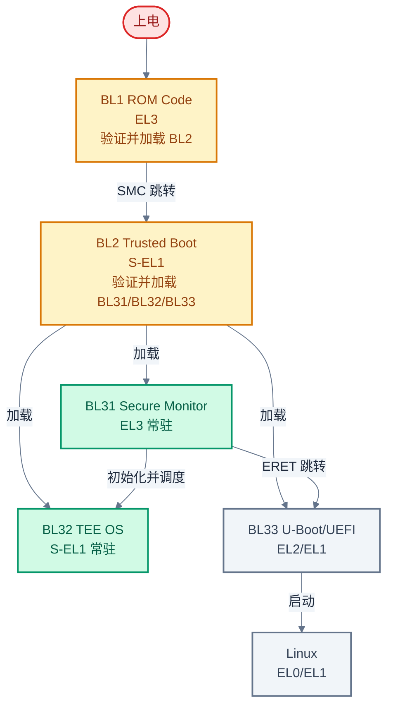
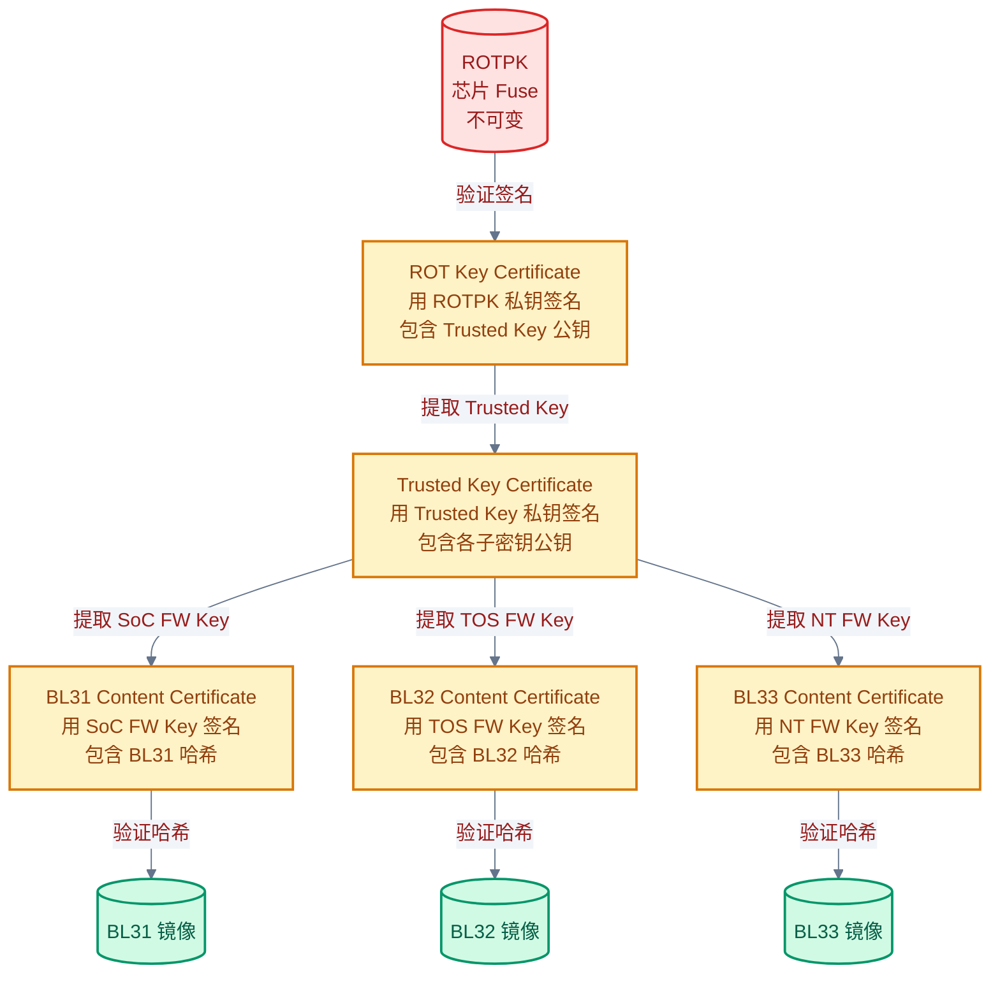
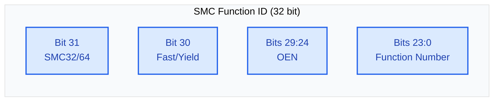

# ARM TBBR 规范与启动链详解

> 一句话概括:本文拆解 ARM TBBR 规范如何用证书链把信任从硬件根传递到每个启动镜像,并逐一说明 BL1→BL2→BL31→BL32→BL33 各阶段的职责与实现。
> **工程师视角**:理解 TBBR 的证书链是搞懂"为什么 TF-A 启动链这样设计"的钥匙——每一段代码都在回答"下一环怎么被验证"。

### 关键术语

| 缩写 | 全称 | 含义 |
|------|------|------|
| TBBR | Trusted Board Boot Requirements | ARM 启动链信任传递规范(ARM DEN0006) |
| FIP | Firmware Image Package | TF-A 固件打包格式,TOC + Payload |
| ROTPK | Root Of Trust Public Key | 信任根公钥,烧录在芯片 Fuse 中,不可变 |
| CoT | Chain of Trust | 信任链,每环验证下一环 |
| NV Counter | Non-Volatile Counter | 非易失计数器,用于反回滚 |
| SMC | Secure Monitor Call | ARM 触发 EL3 调用的指令 |
| SMCCC | SMC Calling Convention | SMC 调用约定规范(ARM DEN0028) |
| OEN | Owning Entity Number | SMC Function ID 中的服务归属号 |
| DER | Distinguished Encoding Rules | ASN.1 编码格式,证书签名/哈希使用 |
| BL1/BL2/BL31/BL32/BL33 | Boot Loader stage 1~3 | ARM 启动链各阶段 |
| EL3 | Exception Level 3 | ARM 最高特权级,Secure Monitor 所在 |
| S-EL1 | Secure EL1 | 安全世界 EL1,TEE OS 所在 |

**前置阅读**:[02-secure-boot-concepts.md](./02-secure-boot-concepts.md) — 信任根、信任链、度量启动 vs 验证启动

---

## 1. TBBR 规范简介

> [01-trusted-firmware-overview.md](./01-trusted-firmware-overview.md) 建立了三大主题的总览:Secure Boot 是基础,TEE 是应用,TF-A 是 ARM 上的实现枢纽。一个直接的问题是:ARM 平台上 Secure Boot 到底按什么规范做?各 BL 阶段的验证关系怎么定义?本章用 TBBR 规范来回答——先讲 TBBR 在做什么,再讲它的核心要求。

### 1.1 TBBR 在做什么

**场景**:你设计一块 ARM 开发板,从按下电源到 Linux 启动,中间要跑 BL1、BL2、BL31、BL32、BL33 五段固件。如果不验证,攻击者可以替换其中任意一段。你需要一套规则,规定"谁验证谁""用什么方式验证""信任从哪里开始"。TBBR(ARM DEN0006)就是这套规则。

TBBR 的核心操作:**把信任从硬件根(ROTPK)出发,通过证书链逐级传递到每个 BL 镜像**。每一环在执行前先验证下一环的签名,验证通过才跳转。如果任何一环被篡改,验证失败,启动中止。

**适用范围**:ARMv7-A/v8-A/v9-A 平台的安全启动。TBBR 定义的是规范(该做什么),TF-A 提供的是参考实现(怎么做)。

### 1.2 为什么需要 TBBR

没有 TBBR 会怎样?每个芯片厂商可以自己定义启动验证流程,导致:

- **生态碎片化**:A 厂用 RSA 签名,B 厂用 ECDSA,C 厂用自己的哈希方案,工具链不通用
- **安全漏洞**:厂商可能遗漏关键验证步骤(比如忘了验证 BL33),留下安全空洞
- **移植困难**:从一个平台移植 bootloader 到另一个平台,验证逻辑要全部重写

TBBR 统一了这些:定义了标准的镜像格式(FIP)、标准的证书结构(X.509)、标准的信任传递路径(ROTPK → 证书链 → 镜像)。厂商只需实现平台相关部分(ROTPK 存储方式、NV counter 硬件)。

### 1.3 ARM DEN0006 核心要求

TBBR 规范(ARM DEN0006)的核心要求:

| 要求 | 说明 |
|------|------|
| **不可变信任根** | ROTPK 烧录在芯片 Fuse/eFuse 中,硬件保证不可修改 |
| **逐环验证** | 每个阶段在跳转前必须验证下一阶段的完整性和真实性 |
| **反回滚保护** | 使用 NV Counter 防止降级攻击(刷入旧版固件绕过补丁) |
| **标准镜像格式** | 使用 FIP 打包,UUID 标识每个镜像和证书 |
| **X.509 证书链** | 证书使用 X.509 v3 格式,签名算法支持 RSA/ECDSA |
| **冷启动与热恢复** | 区分冷 boot(从上电开始)和热 boot(从 suspend 恢复) |

> **核心要点**:TBBR 不是某段代码,而是一套规范——定义了"信任从 ROTPK 出发,通过证书链传递到每个 BL 镜像"的标准路径。TF-A 是它的参考实现。

---

## 2. 启动链各阶段详解

> 上一章介绍了 TBBR 规范的核心要求:逐环验证、反回滚、标准格式。但规范没有告诉你每段固件具体干什么。本章逐一拆解 BL1→BL2→BL31→BL32→BL33 五个阶段——先看整体流程,再深入每个阶段的源码。

### 2.1 启动链全景



> **如何读这张图**:纵向展示启动时序。红色是上电起点;黄色(BL1/BL2)是验证阶段,执行完即退出;绿色(BL31/BL32)是常驻运行时;灰色(BL33/Linux)是普通世界。BL2 是验证枢纽——它一次性验证并加载 BL31、BL32、BL33 三个镜像。BL31 是运行时枢纽——它常驻 EL3,既初始化 BL32,又跳转 BL33。

### 2.2 BL1:不可变的信任根

BL1 是整个启动链的起点,通常烧录在芯片 ROM 中,不可修改。它在 EL3 执行,职责单一:**初始化最小硬件环境,验证并加载 BL2**。

BL1 的主入口 `bl1_main()` 的核心流程:

```c
/* 摘自 [tf-a-src/bl1/bl1_main.c](./src/tf-a-src/bl1/bl1_main.c) 第 51-175 行 */
void __no_pauth bl1_main(void)
{
    /* 1. 平台早期初始化(串口、时钟) */
    bl1_early_platform_setup();
    bl1_plat_arch_setup();   /* MMU、缓存 */

    /* 2. 初始化加密与认证模块 */
    crypto_mod_init();       /* 初始化 mbedTLS 等加密库 */
    auth_mod_init();         /* 初始化证书解析器 */

    /* 3. 平台后期初始化 */
    bl1_platform_setup();

    /* 4. 获取下一阶段镜像 ID(通常是 BL2) */
    image_id = bl1_plat_get_next_image_id();

    /* 5. 加载并验证 BL2 */
    if (image_id == BL2_IMAGE_ID) {
        bl1_load_bl2();      /* 内部调用 load_auth_image() 验证签名 */
    }

    /* 6. 准备跳转到 BL2 */
    bl1_prepare_next_image(image_id);
}
```

`bl1_load_bl2()` 内部调用 `load_auth_image(BL2_IMAGE_ID, info)`,该函数会从 FIP 中读取 BL2 镜像及其证书,用 ROTPK 验证证书链,再验证镜像哈希。

**为什么 BL1 必须在 ROM 中?** 如果 BL1 本身可以被篡改,那么它验证 BL2 的结果就不可信——攻击者可以直接修改 BL1 跳过验证。ROM 在硬件制造时写入,出厂后不可修改,是整个信任链的物理根基。

### 2.3 BL2:验证枢纽

BL2 在 S-EL1 执行(安全世界 EL1),是启动链的验证枢纽。它一次性验证并加载 BL31、BL32、BL33 三个镜像,然后通过 SMC 调用 BL1 完成跳转。

```c
/* 摘自 [tf-a-src/bl2/bl2_main.c](./src/tf-a-src/bl2/bl2_main.c) 第 43-101 行 */
void __no_pauth bl2_main(u_register_t arg0, u_register_t arg1,
                         u_register_t arg2, u_register_t arg3)
{
    entry_point_info_t *next_bl_ep_info;

    bl2_early_platform_setup2(arg0, arg1, arg2, arg3);
    bl2_arch_setup();
    bl2_plat_arch_setup();

    crypto_mod_init();       /* 初始化加密库 */
    auth_mod_init();         /* 初始化认证模块 */

    bl2_plat_preload_setup(); /* 初始化加载源(FIP/Flash) */

    /* 核心动作:加载并验证所有后续镜像 */
    next_bl_ep_info = bl2_load_images();

    /* 通过 SMC 调用 BL1,跳转到下一阶段(BL31) */
    smc(BL1_SMC_RUN_IMAGE, (unsigned long)next_bl_ep_info, 0, 0, 0, 0, 0, 0);
}
```

**为什么 BL2 通过 SMC 跳转而不是直接函数调用?** 因为 BL2 运行在 S-EL1,而下一阶段 BL31 运行在 EL3——从低特权级跳到高特权级必须通过 SMC 异常。BL1(仍在 EL3)接收这个 SMC,配置好 EL3 上下文,然后 ERET 到 BL31。

### 2.4 BL31:EL3 运行时固件

BL31 在 EL3 执行,**是唯一在启动完成后仍然常驻的阶段**。它承担 Secure Monitor 角色:运行时接收所有 SMC 调用,路由到对应服务(PSCI、SPD 等)。

BL31 的启动入口 `bl31_main()` 核心流程:

```c
/* 摘自 [tf-a-src/bl31/bl31_main.c](./src/tf-a-src/bl31/bl31_main.c) 第 105-239 行 */
void __no_pauth bl31_main(u_register_t arg0, u_register_t arg1,
                          u_register_t arg2, u_register_t arg3)
{
    bl31_early_platform_setup2(arg0, arg1, arg2, arg3);
    bl31_plat_arch_setup();

    /* 初始化 GIC(中断控制器) */
    gic_init(core_pos);
    gic_pcpu_init(core_pos);
    gic_cpuif_enable(core_pos);

    bl31_platform_setup();
    bl31_lib_init();         /* 初始化上下文管理 */

    /* 初始化运行时服务(PSCI、SPD 等) */
    runtime_svc_init();

    /* 如果 SPD 注册了 BL32 初始化函数,调用它 */
    if (bl32_init != NULL) {
        int32_t rc = (*bl32_init)();
    }

    /* 准备跳转到 BL33(普通世界) */
    bl31_prepare_next_image_entry();
}
```

`runtime_svc_init()` 是关键——它遍历所有用 `DECLARE_RT_SVC` 宏注册的运行时服务(链接器收集到 `.rt_svc_descs` 段),初始化每个服务并建立 SMC 查找表。详见 [05-tf-a-bl31-secure-monitor.md](./05-tf-a-bl31-secure-monitor.md)。

**为什么 BL31 要常驻?** Linux 运行后仍需要 SMC:进入 TEE(调用 TA)、电源管理(CPU_ON/CPU_OFF)、查询 PSCI 版本等。这些请求必须由 EL3 处理——EL3 是唯一能访问安全世界资源、控制 TrustZone 切换的特权级。BL1/BL2 执行完就退出了,只有 BL31 留下来充当"运行时 Secure Monitor"。

### 2.5 BL32:TEE OS

BL32 在 S-EL1 执行,是 TEE OS(如 OP-TEE)的位置。与 BL31 一样,BL32 在启动后**常驻内存**,持续响应可信应用(TA)的请求。

BL32 不是 TF-A 自己的代码——TF-A 只提供加载和调度框架。具体的 TEE OS 由独立项目实现:

- **OP-TEE**:Linux 基金会维护的开源 TEE OS,生产级(最常用)
- **TSP(Trusted Secure Payload)**:TF-A 自带的测试用 SP,用于验证 SPD 框架
- **Trusty**:Google 的 TEE OS,用于 Android

BL31 通过 SPD(Secure Partition Dispatcher)调度 BL32。以 OP-TEE 为例,BL31 加载 BL32 后,调用 `opteed_setup()` 初始化 OP-TEE,注册 SMC 处理器。此后 Linux 调用 SMC 进入 TEE 时,BL31 把请求转发给 OP-TEE。

### 2.6 BL33:普通世界入口

BL33 在 EL2 或 EL1 执行,是普通世界的第一个固件——通常是 U-Boot 或 UEFI。BL33 负责加载 Linux 内核,之后退出。

BL33 由 BL2 验证并加载,但与 BL31/BL32 不同:BL33 不常驻,Linux 启动后 BL33 的内存可以被回收。

### 2.7 各阶段对比

| 阶段 | 特权级 | 是否常驻 | 验证者 | 核心职责 | 执行后去向 |
|------|:------:|:--------:|:------:|----------|:----------:|
| **BL1** | EL3 | 否(ROM) | 硬件(不可变) | 验证+加载 BL2 | 退出 |
| **BL2** | S-EL1 | 否 | BL1 | 验证+加载 BL31/BL32/BL33 | 退出 |
| **BL31** | EL3 | **是** | BL2 | Secure Monitor,SMC 调度,PSCI | 常驻 |
| **BL32** | S-EL1 | **是** | BL2 | TEE OS,运行 TA | 常驻 |
| **BL33** | EL2/EL1 | 否 | BL2 | U-Boot/UEFI,加载 Linux | 退出 |

> **如何读这张表**:关注"是否常驻"列——只有 BL31 和 BL32 常驻,因为它们是运行时服务提供者。关注"验证者"列——信任逐级传递:硬件信任 BL1,BL1 信任 BL2,BL2 信任 BL31/BL32/BL33。BL2 是验证枢纽(验证 3 个镜像),BL31 是运行时枢纽(常驻 EL3)。

> **核心要点**:启动链的本质是"验证链"——每一环验证下一环,信任从 ROM 中的 BL1 传递到 Linux。BL1/BL2 是一次性验证阶段(执行完退出),BL31/BL32 是常驻运行时(响应 SMC 请求)。BL2 验证 3 个镜像(BL31/BL32/BL33),是启动链的验证枢纽。

---

## 3. FIP 固件包格式

> 上一章讲了各 BL 阶段的职责,但有一个问题没回答:BL2 一次性要加载 BL31、BL32、BL33 三个镜像和一堆证书,这些文件怎么打包存储?本章介绍 TF-A 的 FIP 格式——先讲 FIP 的结构,再讲 fiptool 怎么操作它。

### 3.1 FIP 在做什么

**场景**:Flash 里要存十几个文件——BL2、BL31、BL32、BL33、5 个证书、若干配置 DTB。如果裸存放,你需要为每个文件记录偏移和大小,还要区分哪个是 BL31 哪个是 BL32。FIP(Firmware Image Package)把这些文件打包成一个二进制包,用 UUID 标识每个文件。

FIP 的核心设计:**TOC(Table of Contents)+ Payload**。TOC 是目录,记录每个文件的 UUID、偏移、大小;Payload 是实际数据,紧跟 TOC 之后。

### 3.2 FIP 二进制结构

```mermaid
%%{init: {"theme": "base", "themeVariables": {"primaryColor": "#f8fafc", "primaryTextColor": "#1e293b", "primaryBorderColor": "#475569", "lineColor": "#64748b", "secondaryColor": "#f1f5f9", "secondaryBorderColor": "#94a3b8", "tertiaryColor": "#f8fafc", "fontFamily": "\"trebuchet ms\", verdana, arial, sans-serif"}}}%%
flowchart TD
    subgraph "FIP 包"
        Header["TOC Header<br/>name=0xAA640001<br/>serial_number<br/>flags"]
        TOC1["TOC Entry 1<br/>UUID=BL31<br/>offset, size"]
        TOC2["TOC Entry 2<br/>UUID=BL32<br/>offset, size"]
        TOC3["TOC Entry N<br/>UUID=BL33<br/>offset, size"]
        End["TOC End<br/>UUID=0x0"]
        Payload1["Payload: BL31 镜像"]
        Payload2["Payload: BL32 镜像"]
        Payload3["Payload: BL33 镜像"]
    end

    Header --> TOC1 --> TOC2 --> TOC3 --> End
    End --> Payload1
    Payload1 --> Payload2
    Payload2 --> Payload3

    classDef toc fill:#dbeafe,stroke:#2563eb,color:#1e40af,stroke-width:2px
    classDef data fill:#d1fae5,stroke:#059669,color:#065f46,stroke-width:2px
    class Header,TOC1,TOC2,TOC3,End toc
    class Payload1,Payload2,Payload3 data
```



FIP 的数据结构定义在头文件中:

```c
/* 摘自 [tf-a-src/include/tools_share/firmware_image_package.h](./src/tf-a-src/include/tools_share/firmware_image_package.h) 第 14-108 行 */

/* TOC Header 签名,用于校验 FIP 包有效性 */
#define TOC_HEADER_NAME  0xAA640001

/* TOC 头:位于 FIP 包起始位置 */
typedef struct fip_toc_header {
    uint32_t name;           /* 固定值 0xAA640001,用于校验 */
    uint32_t serial_number;  /* 序列号 */
    uint64_t flags;          /* 标志位 */
} fip_toc_header_t;

/* TOC 条目:每个镜像/证书对应一条 */
typedef struct fip_toc_entry {
    uuid_t    uuid;           /* 镜像/证书的 UUID,标识类型 */
    uint64_t  offset_address; /* 在 FIP 包中的偏移 */
    uint64_t  size;           /* 镜像数据大小(字节) */
    uint64_t  flags;          /* 标志位 */
} fip_toc_entry_t;
```

每个镜像用 UUID 唯一标识。TF-A 在 [tf-a-src/tools/fiptool/tbbr_config.c](./src/tf-a-src/tools/fiptool/tbbr_config.c) 中预定义了所有 TBBR 镜像和证书的 UUID:

```c
/* 摘自 tf-a-src/tools/fiptool/tbbr_config.c 第 14-69 行(节选) */
toc_entry_t toc_entries[] = {
    { .name = "Trusted Boot Firmware BL2",
      .uuid = UUID_TRUSTED_BOOT_FIRMWARE_BL2,
      .cmdline_name = "tb-fw" },
    { .name = "SCP Firmware SCP_BL2",
      .uuid = UUID_SCP_FIRMWARE_SCP_BL2,
      .cmdline_name = "scp-fw" },
    { .name = "EL3 Runtime Firmware BL31",
      .uuid = UUID_EL3_RUNTIME_FIRMWARE_BL31,
      .cmdline_name = "soc-fw" },
    { .name = "Secure Payload BL32 (Trusted OS)",
      .uuid = UUID_SECURE_PAYLOAD_BL32,
      .cmdline_name = "tos-fw" },
    { .name = "Non-Trusted Firmware BL33",
      .uuid = UUID_NON_TRUSTED_FIRMWARE_BL33,
      .cmdline_name = "nt-fw" },
    /* ... 证书和配置 DTB 的 UUID ... */
};
```

### 3.3 fiptool 操作

fiptool 是 TF-A 提供的命令行工具,用于创建、查看、解包 FIP 文件:

```bash
# 创建 FIP 包(将各镜像打包)
fiptool create \
    --tb-fw bl2.bin \
    --soc-fw bl31.bin \
    --tos-fw bl32.bin \
    --nt-fw bl33.bin \
    fip.bin

# 查看 FIP 包内容
fiptool info fip.bin
# 输出示例:
# Trusted Boot Firmware BL2: offset=0x100, size=0x12000
# EL3 Runtime Firmware BL31: offset=0x12100, size=0x8000
# Secure Payload BL32 (Trusted OS): offset=0x1A100, size=0x30000
# Non-Trusted Firmware BL33: offset=0x4A100, size=0x50000

# 解包 FIP
fiptool unpack fip.bin -d output_dir/

# 删除某个镜像
fiptool remove --nt-fw fip.bin
```

`--tb-fw`、`--soc-fw` 等命令行参数对应 `toc_entries` 中的 `cmdline_name` 字段,fiptool 内部将其映射到 UUID。

> **核心要点**:FIP 是 TF-A 的标准固件打包格式——TOC(目录)+ Payload(数据),用 UUID 标识每个镜像。fiptool 是操作 FIP 的命令行工具,支持创建、查看、解包、删除。FIP 让 BL2 可以用统一的 io_storage 接口加载所有镜像,无需关心底层 Flash 布局。

---

## 4. TBBR 证书链

> 上一章讲了 FIP 如何打包镜像,但 FIP 只是容器——它不保证内容可信。攻击者可以替换 FIP 中的 BL31 为恶意版本。本章讲 TBBR 的核心机制:证书链——如何用密码学手段把信任从 ROTPK 传递到每个 BL 镜像。

### 4.1 证书链在做什么

**场景**:BL2 从 FIP 中加载了 BL31 镜像。怎么确认这个 BL31 是厂商签发的原版,而不是攻击者替换的?直接对 BL31 做哈希比对?但 BL31 版本会更新,哈希会变。用厂商私钥签名?但 BL2 不知道厂商私钥,怎么验?

TBBR 的方案是**证书链**:

1. 厂商把 ROTPK(根公钥)烧录到芯片 Fuse 中,不可修改
2. 用 ROTPK 对应的私钥签名"ROT 证书",证书中包含"Trusted Key"(中间密钥的公钥)
3. 用 Trusted Key 的私钥签名"BL3x Content Certificate",证书中包含 BL3x 镜像的哈希
4. BL2 加载镜像时:先用 ROTPK 验证 ROT 证书,再用 ROT 证书中的 Trusted Key 验证 Content Certificate,最后用 Content Certificate 中的哈希验证镜像

这样,信任就从硬件 ROTPK 传递到了每个镜像。

### 4.2 证书链结构



> **如何读这张图**:信任从红色(ROTPK,芯片 Fuse)出发,经过黄色(证书链逐级签名验证),最终到达绿色(镜像哈希验证)。每一步都是"用上一级的公钥验证下一级的签名"。ROTPK 是唯一不依赖证书的信任源——它直接从硬件读取。

### 4.3 三种认证方法

TF-A 的认证模块 [tf-a-src/drivers/auth/auth_mod.c](./src/tf-a-src/drivers/auth/auth_mod.c) 实现了三种认证方法,每个镜像的认证方式由 CoT(Chain of Trust)描述符定义:

| 认证方法 | 枚举值 | 验证内容 | 适用场景 |
|----------|--------|----------|----------|
| **哈希比对** | `AUTH_METHOD_HASH` | 用父证书中的哈希验证当前镜像数据 | 验证 BL 镜像完整性 |
| **数字签名** | `AUTH_METHOD_SIG` | 用父证书中的公钥验证当前证书的签名 | 验证证书链 |
| **NV 计数器** | `AUTH_METHOD_NV_CTR` | 证书中的计数器值 ≥ 平台 NV 计数器值 | 反回滚保护 |

核心认证函数 `auth_mod_verify_img()` 遍历镜像的认证方法列表,逐一执行:

```c
/* 摘自 [tf-a-src/drivers/auth/auth_mod.c](./src/tf-a-src/drivers/auth/auth_mod.c) 第 469-530 行 */
int auth_mod_verify_img(unsigned int img_id, void *img_ptr, unsigned int img_len)
{
    const auth_img_desc_t *img_desc = FCONF_GET_PROPERTY(tbbr, cot, img_id);

    /* 1. 检查镜像完整性(X.509 证书解析) */
    rc = img_parser_check_integrity(img_desc->img_type, img_ptr, img_len);

    /* 2. 遍历认证方法,逐一验证 */
    for (i = 0; i < AUTH_METHOD_NUM; i++) {
        auth_method = &img_desc->img_auth_methods[i];
        switch (auth_method->type) {
        case AUTH_METHOD_HASH:
            rc = auth_hash(&auth_method->param.hash, img_desc, img_ptr, img_len);
            break;
        case AUTH_METHOD_SIG:
            rc = auth_signature(&auth_method->param.sig, img_desc, img_ptr, img_len);
            break;
        case AUTH_METHOD_NV_CTR:
            rc = auth_nvctr(&auth_method->param.nv_ctr, img_desc,
                            img_ptr, img_len, &cert_nv_ctr, &need_nv_ctr_upgrade);
            break;
        }
        if (rc != 0) return rc;  /* 任一方法失败则认证失败 */
    }

    /* 3. 标记镜像已认证 */
    auth_img_flags[img_desc->img_id] |= IMG_FLAG_AUTHENTICATED;
    return 0;
}
```

### 4.4 根证书的 ROTPK 验证

根证书(ROT Key Certificate)没有父证书——它的签名用 ROTPK 对应的私钥签发。验证时,`auth_signature()` 函数从平台读取 ROTPK:

```c
/* 摘自 tf-a-src/drivers/auth/auth_mod.c 第 204-282 行(节选) */
if (img_desc->parent != NULL) {
    /* 非根证书:从父证书提取公钥 */
    rc = auth_get_param(param->pk, img_desc->parent, &pk_ptr, &pk_len);
} else {
    /* 根证书:从平台读取 ROTPK */
    rc = plat_get_rotpk_info(param->pk->cookie, &pk_plat_ptr, &pk_plat_len, &flags);

    if ((flags & ROTPK_IS_HASH) != 0U) {
        /* 平台存储的是 ROTPK 的哈希:计算证书公钥的哈希,与平台比对 */
        rc = crypto_mod_verify_hash(pk_ptr, pk_len, pk_plat_ptr, pk_plat_len);
    } else {
        /* 平台存储完整 ROTPK:直接比对 */
        if (memcmp(pk_plat_ptr, pk_ptr, pk_len) != 0) return -1;
    }
}
```

**为什么平台可以只存 ROTPK 的哈希而不是完整公钥?** Fuse 空间有限(通常每格 32-64 位),RSA-2048 公钥需要 256 字节,存储成本高。SHA-256 哈希只需 32 字节。平台存哈希,验证时计算证书中公钥的哈希再比对——等价安全性,更低存储成本。

### 4.5 反回滚保护

NV Counter 是一个只能递增的硬件计数器,烧录在 eFuse 中。每个证书包含一个 NV Counter 值,验证时要求:

$$\text{cert\_nv\_ctr} \geq \text{plat\_nv\_ctr}$$

- 证书值 < 平台值:认证失败(旧版固件,拒绝回滚)
- 证书值 > 平台值:认证通过,且更新平台计数器到新值(防再次回滚)
- 证书值 = 平台值:认证通过

`auth_nvctr()` 函数实现这个逻辑,解析 DER 编码的计数器值并与平台值比较:

```c
/* 摘自 tf-a-src/drivers/auth/auth_mod.c 第 389-411 行 */
if (*cert_nv_ctr < plat_nv_ctr) {
    return 1;  /* 旧版本,拒绝回滚 */
} else if (*cert_nv_ctr > plat_nv_ctr) {
    *need_nv_ctr_upgrade = true;  /* 新版本,需要更新平台计数器 */
}
```

**为什么 NV Counter 只能递增?** 假设厂商发布了 v2 固件修复了 v1 的漏洞,攻击者想刷回 v1。v1 证书的 NV Counter 值较小,而平台已更新到 v2 的较大值——验证失败,无法回滚。eFuse 硬件保证计数器只能熔断更多 bit(递增),不能恢复(递减)。

> **核心要点**:TBBR 的核心是用证书链把信任从 ROTPK 传递到每个 BL 镜像——ROT Key Cert(ROTPK 签名)→ Trusted Key Cert(中间密钥)→ Content Cert(镜像哈希)。三种认证方法:哈希(验镜像)、签名(验证书)、NV Counter(防回滚)。根证书没有父证书,直接用芯片 Fuse 中的 ROTPK 验证。

---

## 5. SMC 调用约定简介

> 前几章讲了启动时的验证链,但 BL31 常驻后怎么与 Linux 交互?答案是 SMC。本章简要介绍 SMC 调用约定——BL31 的 SMC 调度机制详见 [05-tf-a-bl31-secure-monitor.md](./05-tf-a-bl31-secure-monitor.md)。

### 5.1 SMC 在做什么

**场景**:Linux 内核需要让 BL31 帮忙做电源管理(比如关闭一个 CPU 核)。但 Linux 在 EL1,BL31 在 EL3,Linux 不能直接调用 BL31 的函数。SMC(Secure Monitor Call)指令解决这个问题:执行 SMC 后,CPU 触发异常,陷入 EL3,BL31 获得控制权,根据参数执行对应操作后返回。

SMC 是一条 ARM 指令(汇编 `smc #0`),它不是函数调用——它触发一个同步异常,由 EL3 的异常向量处理。

### 5.2 SMC Function ID 编码

SMC 调用通过 x0 寄存器传递 Function ID(FID),标识请求的服务类型。SMCCC(ARM DEN0028)定义了 FID 的位域:



| 位域 | 含义 | 值 |
|------|------|----|
| Bit 31 | 调用约定 | 0=SMC32(参数为 32 位),1=SMC64(参数为 64 位) |
| Bit 30 | 调用类型 | 0=Fast(原子,不可抢占),1=Yield(可被中断抢占) |
| Bits 29:24 | OEN(Owning Entity Number) | 标识服务归属(ARM 标准=0x0,PSCI=0x0,SiP=0x6,OEM=0x8,TOS=0x3A) |
| Bits 23:0 | 功能号 | 具体功能编号 |

### 5.3 Fast SMC vs Yielding SMC

| 对比维度 | Fast SMC | Yielding SMC |
|----------|----------|--------------|
| **Bit 30** | 0 | 1 |
| **可抢占性** | 不可被中断抢占 | 可被中断抢占 |
| **执行时间** | 必须极短(微秒级) | 可以较长(毫秒级) |
| **典型用途** | PSCI_CPU_ON、PSCI_VERSION | OP-TEE 的 TA 调用 |
| **安全考虑** | 执行期间关中断,状态简单 | 执行期间可能睡眠,需保存上下文 |

**为什么 Fast SMC 不能被抢占?** Fast SMC 执行期间 BL31 关闭中断,处于原子状态。如果允许抢占,中断处理需要保存 BL31 的中间状态——但 EL3 的上下文空间有限,且 Fast SMC 本应极快完成。Yielding SMC 则允许中断,因为它可能执行很长时间(比如 TA 处理大数据)。

### 5.4 参数传递

SMC 通过寄存器传递参数和返回值:

| 寄存器 | 用途 |
|--------|------|
| x0 | 输入:Function ID;输出:返回码 |
| x1-x3 | 输入:参数 1-3;输出:返回值 1-3 |
| x4-x6 | 输入:参数 4-6(仅 SMC64) |
| x7 | 输入:参数 7(仅 SMC64) |

以 PSCI CPU_ON 为例,SMC64 的 FID 是 `0xc4000003`(Bit31=1, Bit30=0, OEN=0, 功能号=3):

```
x0 = 0xc4000003  (PSCI_CPU_ON_AARCH64)
x1 = target_cpu  (目标 CPU 的 MPIDR)
x2 = entrypoint  (目标 CPU 的入口地址)
x3 = context_id  (传递给目标 CPU 的上下文 ID)
```

BL31 收到 SMC 后,从 x0 提取 OEN,查找注册表中对应的服务(PSCI),调用 `psci_smc_handler()`,处理完成后将结果写入 x0 返回。

> **核心要点**:SMC 是 Linux(EL1)与 BL31(EL3)通信的唯一通道——通过 Function ID(x0)编码服务类型(OEN + 功能号)。Fast SMC 不可抢占(用于快速操作),Yielding SMC 可抢占(用于长时间操作如 TA 调用)。参数通过 x0-x7 寄存器传递。

---

## 参考资料

- [TBBR Specification (ARM DEN0006)](https://developer.arm.com/documentation/den0006/) — 启动链信任传递规范
- [SMC Calling Convention (ARM DEN0028)](https://developer.arm.com/documentation/den0028/) — SMC 调用约定
- [TF-A Documentation - Trusted Board Boot](https://trustedfirmware-a.readthedocs.io/en/latest/design/trusted-board-boot.html) — TBBR 实现文档
- [TF-A Documentation - FIP](https://trustedfirmware-a.readthedocs.io/en/latest/design/firmware-design.html#firmware-image-package) — FIP 格式说明

---

**下一篇**:[04-tf-a-architecture.md](./04-tf-a-architecture.md) — TF-A 架构与构建系统
