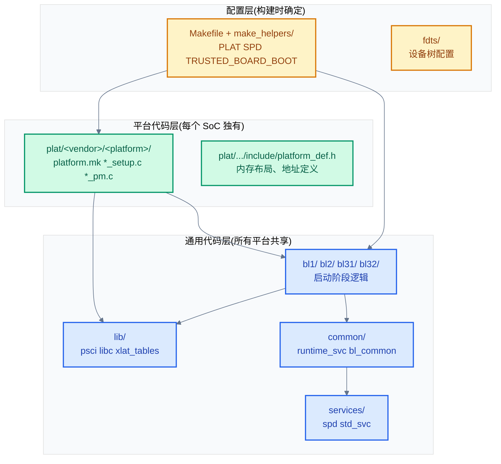
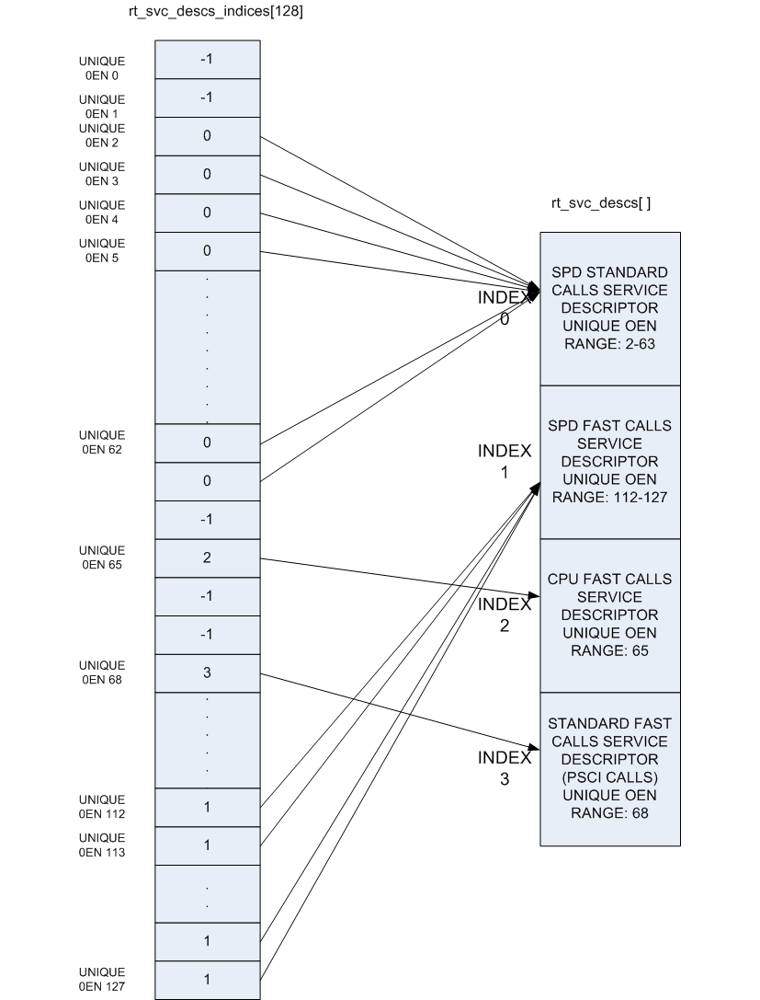
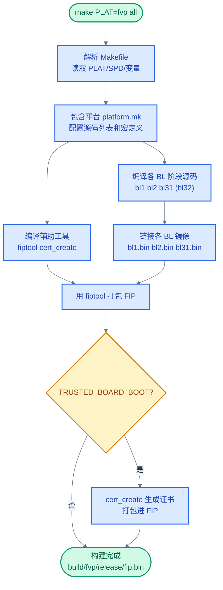
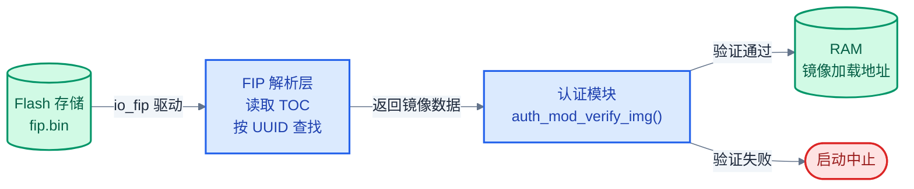

# TF-A 架构与构建系统

> 一句话概括:本文拆解 TF-A 源码的目录组织、构建系统、平台抽象层,并用 QEMU/FVP 为例说明如何构建和移植到新平台。
> **工程师视角**:理解 TF-A 的"通用代码 × 平台代码 × 配置变量"三分法,是移植和新平台 bring-up 的第一步。

### 关键术语

| 缩写 | 全称 | 含义 |
|------|------|------|
| FVP | Fixed Virtual Platform | ARM 官方虚拟平台模型,TF-A 默认构建目标 |
| PAL | Platform Abstraction Layer | 平台抽象层,plat/ 目录下的平台相关代码 |
| SPD | Secure Partition Dispatcher | BL31 中调度 TEE OS 的组件 |
| PSCI | Power State Coordination Interface | ARM 电源管理接口 |
| FIP | Firmware Image Package | TF-A 固件打包格式 |
| TBBR | Trusted Board Boot Requirements | ARM 启动链信任传递规范 |
| DTB | Device Tree Blob | 设备树二进制 |
| FCONF | Firmware Configuration Framework | TF-A 配置框架,用 DTB 传递配置 |
| XIP | eXecute In Place | 片上执行,代码直接在 Flash 中运行 |

**前置阅读**:[03-arm-tbbr-and-boot-chain.md](./03-arm-tbbr-and-boot-chain.md) — TBBR 规范与启动链各阶段

---

## 1. 顶层目录结构

> [03-arm-tbbr-and-boot-chain.md](./03-arm-tbbr-and-boot-chain.md) 讲了启动链各阶段的职责,但那些代码在源码树中怎么组织?怎么找到 BL31 的入口?本章自顶向下拆解 TF-A 的目录结构——先看全局,再看每个目录的职责。

### 1.1 目录总览

TF-A 源码根目录([tf-a-src/](./src/tf-a-src/))的组织遵循"通用代码与平台代码分离"原则:

| 目录 | 职责 | 典型内容 |
|------|------|----------|
| `bl1/` | BL1 阶段代码 | `bl1_main.c`(验证加载 BL2) |
| `bl2/` | BL2 阶段代码 | `bl2_main.c`(验证加载 BL3x) |
| `bl31/` | BL31 阶段代码 | `bl31_main.c`、`ehf.c`、`interrupt_mgmt.c` |
| `bl32/` | BL32 阶段代码 | TSP(测试用)、SP_MIN、OP-TEE 链接 |
| `common/` | 各阶段共享代码 | `runtime_svc.c`、`bl_common.c`、`fdt_wrappers.c` |
| `lib/` | 通用库 | `psci/`(电源管理)、`libc/`、`xlat_tables/`、`libfdt/` |
| `drivers/` | 硬件驱动 | `auth/`(认证)、`io/`(存储)、`arm/gic/`(中断) |
| `include/` | 公共头文件 | 按模块分子目录 |
| `plat/` | **平台抽象层** | `arm/board/fvp/`、`qemu/`、`st/stm32mp1/` 等 |
| `services/` | 运行时服务 | `spd/`(SPD 调度器)、`std_svc/` |
| `tools/` | 辅助工具 | `fiptool/`、`cert_create/` |
| `make_helpers/` | 构建辅助 | `common.mk`、`toolchain.mk`、`defaults.mk` |
| `fdts/` | 设备树源文件 | 各平台的 `.dts`/`.dtsi` |

> **如何读这张表**:关注 `plat/` 与 `bl*/` 的分离——`bl1/`、`bl2/`、`bl31/` 是通用启动逻辑(所有平台共享),`plat/` 是平台相关代码(每个 SoC 独有)。移植到新平台时,你主要写 `plat/` 下的代码,几乎不碰 `bl*/`。

### 1.2 代码分层模型



> **如何读这张图**:三层从下到上——配置层(黄色)决定编译哪些代码和参数;平台层(绿色)提供硬件相关实现;通用层(蓝色)是所有平台共享的核心逻辑。通用层通过函数指针(如 `psci_plat_pm_ops`)调用平台层的实现——这是 TF-A 实现可移植性的关键。

> **核心要点**:TF-A 源码分三层——通用代码(`bl*/`、`lib/`、`common/`)× 平台代码(`plat/`)× 配置(`Makefile` 变量)。通用层通过函数指针调用平台层,实现可移植性。移植新平台时主要写 `plat/` 下的代码。

---

## 2. 构建系统

> 上一章看了目录结构,但代码怎么编译成可执行镜像?本章讲 TF-A 的构建系统——Makefile 的用法、关键变量、构建流程。

### 2.1 基本构建命令

TF-A 使用 GNU Make 构建系统。最简单的构建命令:

```bash
# 构建 FVP 平台的所有镜像
CROSS_COMPILE=aarch64-none-elf- make PLAT=fvp all

# 构建 QEMU 平台,启用 TBBR
CROSS_COMPILE=aarch64-none-elf- make PLAT=qemu TRUSTED_BOARD_BOOT=1 all

# 指定 SPD(Secure Partition Dispatcher)
CROSS_COMPILE=aarch64-none-elf- make PLAT=fvp SPD=opteed all

# 清理构建产物
make PLAT=fvp clean
make distclean  # 清理所有平台
```

构建命令的组成:

| 部分 | 说明 | 示例 |
|------|------|------|
| `CROSS_COMPILE` | 交叉编译工具链前缀 | `aarch64-none-elf-` |
| `PLAT` | 目标平台(必须指定) | `fvp`、`qemu`、`stm32mp1` |
| `SPD` | Secure Partition Dispatcher | `opteed`、`tspd`、`trusty` |
| `TRUSTED_BOARD_BOOT` | 是否启用 TBBR 安全启动 | `1` 启用,`0` 不启用 |
| `DEBUG` | 调试模式 | `1` 开启 assert 和调试日志 |
| 构建目标 | 要构建的产物 | `all`、`fiptool`、`certtool` |

### 2.2 关键构建变量

TF-A 的 [tf-a-src/Makefile](./src/tf-a-src/Makefile) 定义了大量构建变量。以下是最常用的:

| 变量 | 默认值 | 说明 | 影响 |
|------|--------|------|------|
| `PLAT` | `fvp` | 目标平台 | 决定包含哪个 `plat/` 子目录 |
| `SPD` | `none` | TEE OS 调度器 | 决定 BL32 来源和 SMC 路由 |
| `BL32` | 空 | BL32 预编译镜像路径 | 若指定则直接打包,否则从源码构建 |
| `TRUSTED_BOARD_BOOT` | `0` | 是否启用 TBBR | 启用后编译 auth 模块和证书工具 |
| `DEBUG` | `0` | 调试模式 | 开启 assert、VERBOSE 日志 |
| `ARM_ARCH_MAJOR` | 平台定义 | ARM 架构主版本号 | `8` 或 `9` |
| `RESET_TO_BL31` | `0` | 是否 BL31 为第一阶段 | 无 BL1/BL2 的简化启动 |
| `BL2_RUNS_AT_EL3` | `0` | BL2 是否运行在 EL3 | 影响 SMC 跳转方式 |

Makefile 中 `PLAT` 变量的处理:

```makefile
# 摘自 [tf-a-src/Makefile](./src/tf-a-src/Makefile) 第 41-47 行
PLAT            := ${DEFAULT_PLAT}
include ${MAKE_HELPERS_DIRECTORY}plat_helpers.mk

# 平台默认值由 defaults.mk 定义,plat_helpers.mk 根据PLAT
# 定位到 plat/<vendor>/<platform>/platform.mk
```

### 2.3 SPD 与 BL32 的关系

SPD(Secure Partition Dispatcher)变量决定 BL31 如何调度 TEE OS。Makefile 中的处理逻辑:

```makefile
# 摘自 tf-a-src/Makefile 第 245-267 行(简化)
# All other SPDs in spd directory
SPD_DIR := spd

# 查找 services/spd/<SPD>/<SPD>.mk
SPD_MAKE := $(wildcard services/${SPD_DIR}/${SPD}/${SPD}.mk)
include ${SPD_MAKE}

# SPD 的 .mk 会设置 NEED_BL32 := yes
# BL32 来源:
#   1. BL32_SOURCES: 从源码构建(如 TSP)
#   2. BL32: 预编译二进制(如 OP-TEE 的 tee-header_v2.bin)
```

**为什么 BL32 有两种来源?** TSP(测试用 SP)是 TF-A 自带的,可以直接从源码编译。但 OP-TEE 是独立项目,通常先单独编译 OP-TEE 产物,再通过 `BL32=<path>` 传给 TF-A 构建。两种方式互斥——如果同时指定,预编译二进制优先。

### 2.4 运行时服务描述符布局

BL31 通过链接器段收集所有运行时服务描述符,形成统一的服务注册表。下图展示了运行时服务描述符在内存中的布局:



*来源:TF-A Documentation, Firmware Design*

> **如何读这张图**:链接器将所有通过 `DECLARE_RT_SVC` 宏声明的服务描述符收集到 `.rt_svc_descs` 段。每个描述符包含服务名称、OEN 范围、调用类型(Fast/Yielding)和处理函数指针。`runtime_svc_init()` 遍历这个段,建立 OEN→索引的查找表,实现 O(1) 的 SMC 路由。

### 2.5 构建流程



> **如何读这张图**:构建从解析 Makefile 开始,核心分两路——编译工具(黄色)和编译 BL 镜像(黄色),最终汇合打包成 FIP。如果启用 TBBR(菱形判断),还会额外用 cert_create 生成证书并打包。最终产物是 `build/<PLAT>/<debug|release>/fip.bin`。

> **核心要点**:TF-A 构建系统的核心变量是 `PLAT`(决定平台代码)、`SPD`(决定 TEE 调度)、`TRUSTED_BOARD_BOOT`(决定是否启用安全启动)。构建流程:解析配置 → 编译 BL 镜像 → 编译工具 → 打包 FIP → (可选)生成证书。

---

## 3. 平台抽象层

> 上一章讲了构建系统怎么选择平台,但平台代码到底要实现什么?本章深入 `plat/` 目录——先看目录结构,再看必须实现的函数,最后对比三个典型平台。

### 3.1 平台目录结构

TF-A 的平台代码按 `plat/<vendor>/<platform>/` 组织。以下是三个典型平台:

```
plat/
├── arm/board/fvp/          # ARM FVP 虚拟平台
│   ├── platform.mk          # 平台构建规则
│   ├── fvp_def.h            # 地址、内存布局定义
│   ├── fvp_common.c         # 通用初始化
│   ├── fvp_pm.c             # PSCI 电源管理实现
│   ├── fvp_gicv3.c          # GIC 中断控制器配置
│   └── fvp_console.c        # 串口控制台
├── qemu/qemu/               # QEMU 平台
│   ├── platform.mk
│   └── qemu_helpers.c
├── qemu/common/             # QEMU 共享代码
│   ├── common.mk
│   ├── qemu_common.c
│   ├── qemu_pm.c            # PSCI 电源管理
│   ├── qemu_gicv3.c         # GIC 配置
│   └── qemu_console.c
├── st/stm32mp1/             # ST STM32MP15 平台
│   ├── platform.mk
│   ├── stm32mp1_def.h
│   ├── stm32mp1_pm.c
│   └── stm32mp1_scmi.c
└── common/                  # 所有平台共享的辅助代码
    ├── plat_bl_common.c
    ├── plat_psci_common.c
    └── tbbr/plat_tbbr.c     # TBBR 平台接口
```

每个平台必须提供:

1. **`platform.mk`**:构建规则,定义源码列表、编译宏、依赖
2. **`platform_def.h`**:内存布局、地址定义(放在 `include/` 下)
3. **各阶段 setup 函数**:`bl1_plat_setup`、`bl2_platform_setup`、`bl31_platform_setup`
4. **PSCI 操作**:`plat_psci_ops_t` 结构体(如果支持电源管理)

### 3.2 必须实现的平台函数

平台通过弱符号(weak function)机制与通用代码对接——通用代码定义默认的 weak 实现,平台可以覆盖。以下是关键的平台函数:

| 函数 | 所属阶段 | 职责 | 必须实现? |
|------|----------|------|:---------:|
| `bl1_early_platform_setup()` | BL1 | 早期初始化(串口、时钟) | 是 |
| `bl1_plat_arch_setup()` | BL1 | MMU、缓存配置 | 是 |
| `bl1_plat_get_next_image_id()` | BL1 | 返回下一阶段镜像 ID | 是 |
| `bl2_early_platform_setup2()` | BL2 | 早期初始化(存储、串口) | 是 |
| `bl2_plat_arch_setup()` | BL2 | MMU 配置 | 是 |
| `bl2_plat_preload_setup()` | BL2 | 加载源初始化(FIP/Flash) | 是 |
| `bl2_load_images()` | BL2 | 加载 BL31/BL32/BL33 | 可覆盖 |
| `bl31_early_platform_setup2()` | BL31 | GIC、控制台初始化 | 是 |
| `bl31_platform_setup()` | BL31 | 平台运行时配置 | 是 |
| `bl31_plat_runtime_setup()` | BL31 | 运行时设置(如控制台切换) | 可覆盖 |
| `plat_psci_ops` | BL31 | PSCI 电源管理操作集 | 是(如支持 PSCI) |
| `plat_get_rotpk_info()` | BL1/BL2 | 获取 ROTPK(启用 TBBR 时) | 是(TBBR) |
| `plat_get_nv_ctr()` | BL1/BL2 | 获取 NV 计数器(TBBR) | 是(TBBR) |

### 3.3 PSCI 平台操作

电源管理是最复杂的平台移植部分。平台通过 `plat_psci_ops_t` 结构体注册电源管理回调:

```c
/* 摘自 [tf-a-src/plat/qemu/common/qemu_pm.c](./src/tf-a-src/plat/qemu/common/qemu_pm.c) 第 229-240 行 */
static const plat_psci_ops_t plat_qemu_psci_pm_ops = {
    .cpu_standby              = qemu_cpu_standby,
    .pwr_domain_on            = qemu_pwr_domain_on,
    .pwr_domain_off           = qemu_pwr_domain_off,
    .pwr_domain_pwr_down      = qemu_pwr_domain_pwr_down_wfi,
    .pwr_domain_suspend       = qemu_pwr_domain_suspend,
    .pwr_domain_on_finish     = qemu_pwr_domain_on_finish,
    .pwr_domain_suspend_finish= qemu_pwr_domain_suspend_finish,
    .system_off               = qemu_system_off,
    .system_reset             = qemu_system_reset,
    .validate_power_state     = qemu_validate_power_state,
};
```

通用 PSCI 库(`lib/psci/`)在收到 `PSCI_CPU_ON` 等 SMC 时,通过这个结构体调用平台实现。比如 `psci_cpu_on_start()` 调用 `psci_plat_pm_ops->pwr_domain_on()` 来物理上电目标 CPU——具体怎么上电(写电源控制器寄存器、发 SMC 给 SCP 等)由平台决定。

**为什么用函数指针而不是直接调用?** 不同平台的电源管理硬件完全不同:QEMU 用虚拟寄存器,FVP 用电源控制器模型,STM32MP15 用 SCMI 协议发消息给 SCP。函数指针让通用 PSCI 代码与平台实现解耦——通用代码只定义"什么时候调用",平台代码定义"怎么上电"。

### 3.4 平台移植清单对比

| 对比维度 | FVP | QEMU | STM32MP15 |
|----------|-----|------|-----------|
| **厂商** | ARM | QEMU 社区 | ST(意法半导体) |
| **架构** | ARMv8-A | ARMv7-A / ARMv8-A | ARMv7-A(Cortex-A7) |
| **GIC 驱动** | GICv3(默认) | GICv2(默认) | GICv2 |
| **BL2 特权级** | S-EL1 | S-EL1 | S-EL1 |
| **PSCI 传输** | 直接寄存器 | 虚拟寄存器 | SCMI 协议 |
| **ROTPK 来源** | 开发用(可跳过) | 编译时注入 | 硬件 Fuse |
| **存储介质** | 半托管(semihosting) | 虚拟 Flash | eMMC/NAND |
| **特殊点** | 多种特性测试平台 | 最简启动,适合学习 | 真实硬件,有 SCP |

> **如何读这张表**:关注"PSCI 传输"行——FVP 直接写寄存器,QEMU 用虚拟寄存器,STM32MP15 通过 SCMI 协议与系统控制处理器(SCP)通信。这体现了平台差异:简单虚拟平台直接操作硬件,复杂 SoC 通过协处理器间接管理电源。

### 3.5 平台构建规则示例

以 QEMU 为例,`platform.mk` 定义了平台特有的编译规则:

```makefile
# 摘自 [tf-a-src/plat/qemu/qemu/platform.mk](./src/tf-a-src/plat/qemu/qemu/platform.mk) 第 1-17 行
PLAT_QEMU_PATH         := plat/qemu/qemu
PLAT_QEMU_COMMON_PATH  := plat/qemu/common

SEPARATE_CODE_AND_RODATA := 1
ENABLE_STACK_PROTECTOR   := 0

include plat/qemu/common/common.mk

# 默认使用 GICv2
QEMU_USE_GIC_DRIVER     := QEMU_GICV2

# 如果启用 TBBR,添加认证源码
ifneq (${TRUSTED_BOARD_BOOT},0)
    AUTH_SOURCES += drivers/auth/tbbr/tbbr_cot_common.c
    BL1_SOURCES  += ${AUTH_SOURCES} bl1/tbbr/tbbr_img_desc.c \
                    plat/common/tbbr/plat_tbbr.c \
                    ${PLAT_QEMU_COMMON_PATH}/qemu_trusted_boot.c \
                    ${PLAT_QEMU_COMMON_PATH}/qemu_rotpk.S \
                    drivers/auth/tbbr/tbbr_cot_bl1.c
    BL2_SOURCES  += ${AUTH_SOURCES} \
                    drivers/auth/tbbr/tbbr_cot_bl2.c
    include drivers/auth/mbedtls/mbedtls_x509.mk
endif
```

这段 Makefile 展示了 TBBR 启用时的源码追加逻辑:`TRUSTED_BOARD_BOOT != 0` 时,向 BL1 和 BL2 的源码列表添加认证模块(`drivers/auth/`)、TBBR CoT 描述(`tbbr_cot_bl1.c`、`tbbr_cot_bl2.c`)、平台 ROTPK 实现(`qemu_rotpk.S`)。

> **核心要点**:平台移植的核心是 `platform.mk`(构建规则)+ `platform_def.h`(地址定义)+ setup 函数(各阶段初始化)+ `plat_psci_ops`(电源管理)。通用代码通过函数指针调用平台实现——平台只需提供"怎么做",通用代码决定"什么时候做"。

---

## 4. FIP 构建实战

> 前几章讲了目录结构和构建系统,本章用一个完整的构建示例把它们串起来——构建一个带 TBBR 的 FIP 包,查看其内容,理解每个产物的作用。

### 4.1 构建命令

以 QEMU 平台为例,构建一个启用 TBBR 和 OP-TEE 的完整启动链:

```bash
# 1. 设置环境
export CROSS_COMPILE=aarch64-none-elf-

# 2. 构建 TF-A(启用 TBBR,指定 SPD 为 opteed)
make PLAT=qemu SPD=opteed \
     TRUSTED_BOARD_BOOT=1 \
     BL32=<path-to-optee.bin> \
     BL33=<path-to-uboot.bin> \
     all

# 3. 生成证书(需要 ROT 私钥)
make PLAT=qemu TRUSTED_BOARD_BOOT=1 certificates \
     ROT_KEY=<path-to-rot-private-key.pem> \
     TRUSTED_WORLD_KEY=<path-to-trusted-world-key.pem> \
     NON_TRUSTED_WORLD_KEY=<path-to-non-trusted-world-key.pem>
```

### 4.2 构建产物

构建完成后,产物在 `build/qemu/release/` 目录下:

| 文件 | 说明 | 大小(典型) |
|------|------|:------------:|
| `bl1.bin` | BL1 镜像(ROM 代码的 RAM 副本) | ~20 KB |
| `bl2.bin` | BL2 镜像(验证加载阶段) | ~40 KB |
| `bl31.bin` | BL31 镜像(Secure Monitor) | ~60 KB |
| `fip.bin` | FIP 包(包含 BL2/BL31/BL32/BL33 + 证书) | ~500 KB |
| `fiptool` | FIP 操作工具 | — |
| `cert_create` | 证书生成工具 | — |

**为什么需要单独的 bl1.bin?** BL1 通常烧录在芯片 ROM 中,但开发和 QEMU 环境下 ROM 不可写,所以 BL1 也编译为独立镜像加载到 RAM。FIP 包中不包含 BL1——BL1 是验证 FIP 的前提,不能放在被验证的包里(循环依赖)。

### 4.3 查看 FIP 内容

用 fiptool 查看构建产物:

```bash
$ fiptool info build/qemu/release/fip.bin

Trusted Boot Firmware BL2: offset=0x100, size=0xA000
EL3 Runtime Firmware BL31: offset=0xA100, size=0xF000
Secure Payload BL32 (Trusted OS): offset=0x19100, size=0x30000
Non-Trusted Firmware BL33: offset=0x49100, size=0x50000
FW_CONFIG: offset=0x99100, size=0x200
Trusted Boot Firmware BL2 certificate: offset=0x99300, size=0x800
SoC Firmware content certificate: offset=0x99B00, size=0x800
Trusted OS Firmware content certificate: offset=0x9A300, size=0x800
Non-Trusted Firmware content certificate: offset=0x9AB00, size=0x800
Root Of Trust key certificate: offset=0x9B300, size=0x800
Trusted key certificate: offset=0x9BB00, size=0x800
```

输出展示了 FIP 包的完整内容:

1. **镜像文件**(BL2/BL31/BL32/BL33):启动链各阶段的二进制
2. **配置文件**(FW_CONFIG):FCONF 框架的设备树配置
3. **证书**(6 个):TBBR 证书链——ROT Key Cert、Trusted Key Cert、3 个 Content Cert

### 4.4 FIP 内部加载流程

BL1 和 BL2 通过 `io_storage` 驱动从 FIP 中读取镜像,加载流程:



> **如何读这张图**:镜像从 Flash 经 io_fip 驱动读取,解析 FIP TOC 定位镜像,经认证模块验证签名/哈希后加载到 RAM。验证失败则启动中止——这是 TBBR 的安全保证。

> **核心要点**:构建产物中 `fip.bin` 是核心——它打包了所有 BL 镜像、配置和证书。BL1 不在 FIP 中(它是验证 FIP 的前提)。用 `fiptool info` 可以查看 FIP 内的每个文件及其 UUID、偏移、大小。

---

## 5. 内存布局与地址管理

> 前几章讲了目录结构和构建系统,但 TF-A 各阶段在内存中怎么布局?每个 BL 阶段占多少空间?本章讲 TF-A 的内存模型——这是理解启动链和移植新平台的关键。

### 5.1 TF-A 内存区域分类

TF-A 使用多种内存区域,按安全属性分类:

| 内存类型 | 访问权限 | 典型用途 | 硬件保护机制 |
|----------|----------|----------|--------------|
| **Trusted SRAM** | 仅安全状态 | BL1/BL2 代码、安全数据 | TZC(TrustZone Controller)或硬件隔离 |
| **Trusted DRAM** | 仅安全状态 | BL31/BL32 代码、安全堆栈 | TZC 配置的安全 DRAM region |
| **Non-trusted SRAM** | 安全+非安全 | BL33(U-Boot)临时数据 | 无特殊保护 |
| **Non-trusted DRAM** | 安全+非安全 | BL33 主内存、Linux | 无特殊保护 |
| **Shared memory** | 安全+非安全 | REE↔TEE 通信缓冲区 | 软件边界检查 |

**为什么需要多种内存类型?** 安全启动要求 BL1/BL2 在可信内存中执行,防止非安全代码篡改;BL31/BL32 也需要可信内存保护密钥和敏感数据。但 BL33(Linux)不需要这种保护,且需要访问大量非安全内存。TF-A 通过内存分区实现安全隔离。

### 5.2 典型内存布局示例

以 ARM FVP 平台为例,内存布局如下:

```
物理地址空间 (64-bit)
┌─────────────────────────────────────────┐
│ 0x0000_0000 - 0x03FF_FFFF  (64 MB)     │
│ Trusted SRAM                           │
│ ├─ BL1 (ROM 副本)                      │
│ ├─ BL2 (验证加载阶段)                  │
│ └─ 安全数据区                          │
├─────────────────────────────────────────┤
│ 0x0400_0000 - 0x07FF_FFFF  (64 MB)     │
│ Trusted DRAM (TZC 保护)                │
│ ├─ BL31 (Secure Monitor)               │
│ ├─ BL32 (OP-TEE)                       │
│ └─ 安全堆栈                            │
├─────────────────────────────────────────┤
│ 0x0800_0000 - 0x7FFF_FFFF  (1.9 GB)    │
│ Non-trusted DRAM                       │
│ ├─ BL33 (U-Boot/UEFI)                  │
│ ├─ Linux 内核                          │
│ └─ 用户空间                            │
├─────────────────────────────────────────┤
│ 0x8000_0000 - 0xFFFF_FFFF  (2 GB)      │
│ Non-trusted DRAM (继续)                │
│ └─ 共享内存缓冲区                      │
└─────────────────────────────────────────┘
```

> **如何读这张图**:内存按安全属性分区——Trusted SRAM/DRAM 由硬件(TZC)保护,仅安全状态可访问;Non-trusted DRAM 对两个世界都可见。BL1/BL2 在 Trusted SRAM,BL31/BL32 在 Trusted DRAM,BL33 和 Linux 在 Non-trusted DRAM。

### 5.3 平台内存配置

平台通过 `platform_def.h` 定义内存布局:

```c
/* 摘自 [tf-a-src/plat/arm/board/fvp/include/platform_def.h](./src/tf-a-src/plat/arm/board/fvp/include/platform_def.h) 第 45-78 行 */

/* Trusted SRAM 布局 */
#define ARM_TRUSTED_SRAM_BASE       0x04000000
#define ARM_TRUSTED_SRAM_SIZE       0x00040000    /* 256 KB */

/* BL1 在 Trusted SRAM 中的位置 */
#define BL1_RO_BASE                 ARM_TRUSTED_SRAM_BASE
#define BL1_RO_LIMIT                (ARM_TRUSTED_SRAM_BASE + 0x10000)  /* 64 KB */
#define BL1_RW_BASE                 (BL1_RO_LIMIT)
#define BL1_RW_LIMIT                (ARM_TRUSTED_SRAM_BASE + ARM_TRUSTED_SRAM_SIZE)

/* Trusted DRAM 布局 */
#define ARM_TRUSTED_DRAM_BASE       0x06000000
#define ARM_TRUSTED_DRAM_SIZE       0x02000000    /* 32 MB */

/* BL31 在 Trusted DRAM 中的位置 */
#define BL31_BASE                   ARM_TRUSTED_DRAM_BASE
#define BL31_LIMIT                  (BL31_BASE + 0x20000)     /* 128 KB */

/* BL32 (OP-TEE) 在 Trusted DRAM 中的位置 */
#define BL32_BASE                   BL31_LIMIT
#define BL32_LIMIT                  (ARM_TRUSTED_DRAM_BASE + ARM_TRUSTED_DRAM_SIZE)

/* Non-trusted DRAM */
#define ARM_DRAM1_BASE              0x80000000
#define ARM_DRAM1_SIZE              0x80000000    /* 2 GB */
```

**为什么内存布局要平台定义?** 不同 SoC 的 SRAM/DRAM 大小和地址完全不同——FVP 有 256 KB Trusted SRAM,但 STM32MP15 只有 128 KB。平台通过 `platform_def.h` 告诉 TF-A 各阶段的内存位置,通用代码根据这些定义分配空间。

### 5.4 内存保护机制

TF-A 使用多种硬件机制保护内存:

| 机制 | 保护对象 | 实现方式 |
|------|----------|----------|
| **TZC (TrustZone Controller)** | Trusted DRAM region | ARM PL011 TZC 硬件,配置安全/非安全访问权限 |
| **MPU (Memory Protection Unit)** | Cortex-M 子系统 | 区域基址+大小,权限位 |
| **MMU (Memory Management Unit)** | Cortex-A 各阶段 | 页表映射,AP 权限位 |
| **SCR_EL3.NS** | 安全/非安全状态切换 | EL3 寄存器,控制物理地址空间的安全属性 |

**TZC 配置示例**(FVP 平台):

```c
/* 摘自 [tf-a-src/plat/arm/board/fvp/fvp_security.c](./src/tf-a-src/plat/arm/board/fvp/fvp_security.c) 第 32-45 行 */
void plat_arm_security_setup(void)
{
    /* 配置 TZC400,保护 Trusted DRAM */
    arm_tzc400_setup(ARM_TRUSTED_DRAM_BASE, ARM_TRUSTED_DRAM_SIZE);
    
    /* 区域 0: 整个 DRAM,非安全访问 */
    tzc400_configure_region0(TZC_REGION_S_NONE, 0x00000000, 0xFFFFFFFF);
    
    /* 区域 1: Trusted DRAM,仅安全访问 */
    tzc400_configure_region1(
        TZC_REGION_S_RDWR,              /* 安全状态可读写 */
        ARM_TRUSTED_DRAM_BASE,          /* 基址 */
        ARM_TRUSTED_DRAM_SIZE           /* 大小 */
    );
}
```

> **核心要点**:TF-A 内存布局分 Trusted SRAM/DRAM(安全)和 Non-trusted DRAM(非安全)。平台通过 `platform_def.h` 定义各阶段的内存位置,通用代码根据这些定义分配空间。TZC 硬件保护 Trusted DRAM,防止非安全状态访问。

---

## 6. 设备树与 FCONF 配置框架

> 前几章讲了内存布局,但 TF-A 怎么知道硬件的具体参数(如 UART 基址、GIC 地址)?本章讲 TF-A 的配置机制——设备树和 FCONF 框架。

### 6.1 设备树在 TF-A 中的角色

TF-A 使用设备树(Device Tree)描述硬件配置,与 Linux 内核类似但更简化:

| 用途 | 设备树类型 | 内容 |
|------|-----------|------|
| **硬件配置** | HW_CONFIG | UART、GIC、定时器、内存布局 |
| **固件配置** | FW_CONFIG | BL 阶段参数、启动选项 |
| **安全配置** | TOS_FW_CONFIG | OP-TEE 参数、共享内存地址 |
| **非安全配置** | NT_FW_CONFIG | BL33 参数、启动地址 |

### 6.2 FCONF 框架

FCONF(Firmware Configuration Framework)是 TF-A 的配置抽象层,允许从多种来源读取配置:

```c
/* 摘自 [tf-a-src/include/lib/fconf/fconf.h](./src/tf-a-src/include/lib/fconf/fconf.h) 第 15-28 行 */

/* FCONF 属性获取宏 */
#define FCONF_GET_PROPERTY(provider, populator, name) \
    fconf_get_property(FCONF_PROP_ID(provider, populator, name))

/* 示例:获取 UART 基址 */
uint64_t uart_base = FCONF_GET_PROPERTY(hw, uart, base);

/* 示例:获取 GIC  redistributor 地址 */
uint64_t gicr_base = FCONF_GET_PROPERTY(hw, gic, redist_base);
```

**为什么需要 FCONF?** 不同平台的硬件配置不同(FVP 的 UART 在 0x1C090000,QEMU 在 0x09000000)。FCONF 提供统一接口,平台实现具体的配置提供者(provider),通用代码通过 `FCONF_GET_PROPERTY` 获取配置,无需知道底层细节。

### 6.3 设备树解析

TF-A 使用 libfdt 库解析设备树:

```c
/* 摘自 [tf-a-src/common/fdt_wrappers.c](./src/tf-a-src/common/fdt_wrappers.c) 第 45-62 行 */
int fdt_get_reg_props_by_index(const void *dtb, int node,
                               int index, uintptr_t *base, size_t *size)
{
    int rc;
    uint64_t addr, sz;
    
    /* 从设备树读取 "reg" 属性 */
    rc = fdt_get_reg_props_by_index_internal(dtb, node, index, &addr, &sz);
    if (rc < 0)
        return rc;
    
    *base = (uintptr_t)addr;
    *size = (size_t)sz;
    return 0;
}

/* 使用示例:获取 UART 基址 */
int uart_node = fdt_path_offset(dtb, "/uart@1c090000");
uintptr_t uart_base;
size_t uart_size;
fdt_get_reg_props_by_index(dtb, uart_node, 0, &uart_base, &uart_size);
```

> **核心要点**:TF-A 使用设备树描述硬件配置,FCONF 框架提供统一接口获取配置。平台实现配置提供者,通用代码通过 `FCONF_GET_PROPERTY` 获取参数,实现硬件无关性。

---

## 参考资料

- [TF-A Documentation - Build System](https://trustedfirmware-a.readthedocs.io/en/latest/getting_started/build-options.html) — 构建选项参考
- [TF-A Porting Guide](https://trustedfirmware-a.readthedocs.io/en/latest/porting-guide/) — 平台移植指南
- [TF-A Documentation - Firmware Design](https://trustedfirmware-a.readthedocs.io/en/latest/design/firmware-design.html) — 固件设计文档
- [QEMU Platform in TF-A](https://trustedfirmware-a.readthedocs.io/en/latest/plat/qemu.html) — QEMU 平台文档

---

**下一篇**:[05-tf-a-bl31-secure-monitor.md](./05-tf-a-bl31-secure-monitor.md) — BL31 Secure Monitor 详解
