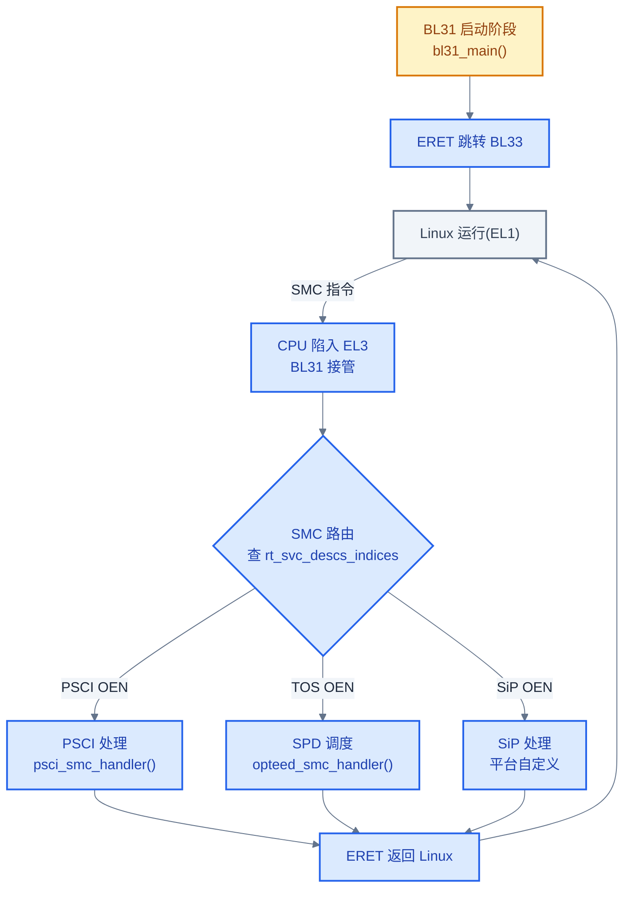
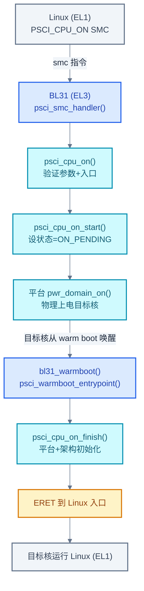
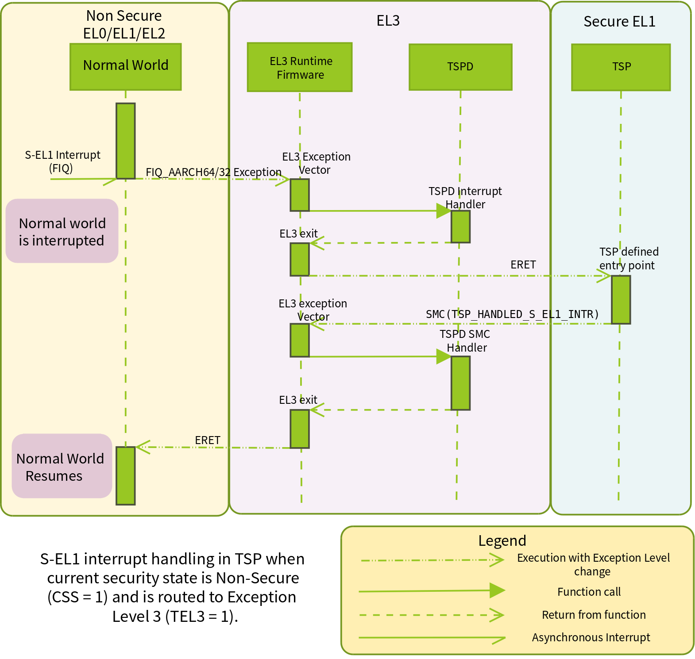
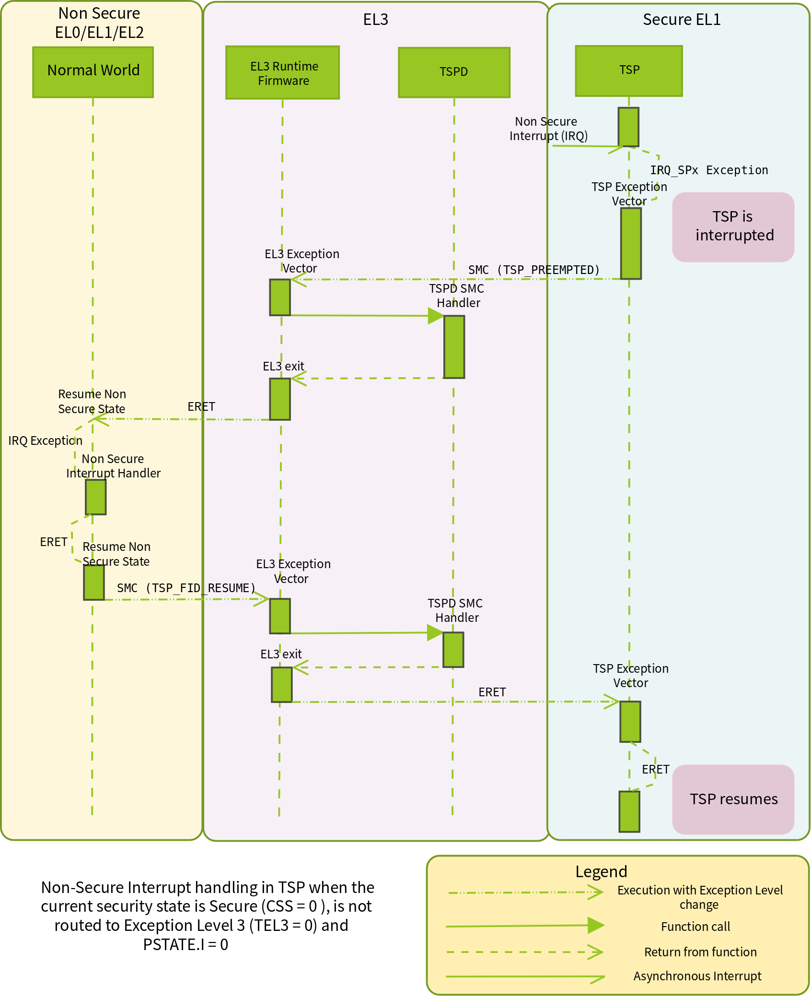
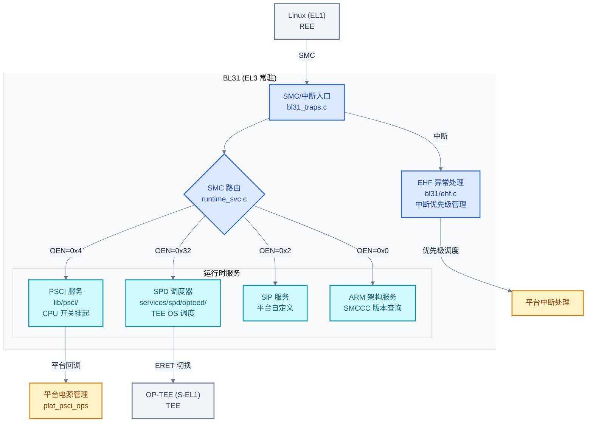

# BL31 Secure Monitor 详解

> 一句话概括:本文拆解 BL31 作为 EL3 常驻固件的三大职责——SMC 请求调度、PSCI 电源管理、SPD 调度 TEE,并分析 EHF 异常处理框架。
> **工程师视角**:BL31 是 EL3 的"操作系统"——它不运行用户代码,但管理所有安全世界与非安全世界之间的切换。

### 关键术语

| 缩写 | 全称 | 含义 |
|------|------|------|
| BL31 | Boot Loader stage 3-1 | EL3 常驻运行时固件,Secure Monitor |
| SMC | Secure Monitor Call | ARM 触发 EL3 调用的指令 |
| SMCCC | SMC Calling Convention | SMC 调用约定规范(ARM DEN0028) |
| PSCI | Power State Coordination Interface | ARM 电源管理接口 |
| SCMI | System Control and Management Interface | ARM 系统控制与管理接口 |
| SPD | Secure Partition Dispatcher | BL31 中调度 TEE OS 的组件 |
| EHF | EL3 Exception Handling Framework | EL3 异常处理框架 |
| OEN | Owning Entity Number | SMC Function ID 中的服务归属号 |
| TOS | Trusted Operating System | 可信操作系统,即 TEE OS |
| FIQ | Fast Interrupt reQuest | ARM 快速中断请求 |
| GIC | Generic Interrupt Controller | ARM 通用中断控制器 |
| OP-TEE | Open Portable Trusted Execution Environment | 开源 TEE OS |
| RME | Realm Management Extension | ARMv9-A 的机密计算架构扩展,引入 Realm 世界 |
| RMM | Realm Management Monitor | RME 架构中的 Realm 监控器 |

**前置阅读**:[04-tf-a-architecture.md](./04-tf-a-architecture.md) — TF-A 架构与构建系统

---

## 1. BL31 的角色定位

> [04-tf-a-architecture.md](./04-tf-a-architecture.md) 讲了 TF-A 的整体架构,但 BL31 作为一个"常驻 EL3 的微型操作系统"到底干什么?本章建立 BL31 的整体认知——先讲它"是什么",再讲它"做什么"。

### 1.1 BL31 在做什么

**场景**:Linux 内核运行在 EL1,需要关闭一个 CPU 核来省电。它执行 `PSCI_CPU_OFF` SMC 指令——CPU 立刻陷入 EL3。谁来处理这个请求?BL31。

BL31 是整个 ARM 系统中**唯一在启动后常驻 EL3 的代码**。它不运行应用程序,不管理文件系统,但它做三件事:

1. **SMC 路由**:接收所有 SMC 调用,根据 Function ID 分发到对应服务(PSCI、SPD、SiP 等)
2. **电源管理**:实现 PSCI 接口,控制 CPU 的开/关/挂起
3. **TEE 调度**:通过 SPD 组件,在 REE(Linux)和 TEE(OP-TEE)之间切换

**适用范围**:任何运行 ARMv8-A/v9-A 且需要 TrustZone 的系统。BL31 是 Secure Monitor 的参考实现——即使不使用 TEE,只要需要 PSCI 电源管理,就需要 BL31。

### 1.2 BL31 启动流程

BL31 由 BL2 加载后,从 `bl31_main()` 开始执行。核心启动流程:

```c
/* 摘自 [tf-a-src/bl31/bl31_main.c](./src/tf-a-src/bl31/bl31_main.c) 第 105-239 行 */
void __no_pauth bl31_main(u_register_t arg0, u_register_t arg1,
                          u_register_t arg2, u_register_t arg3)
{
    unsigned int core_pos = plat_my_core_pos();

    /* 1. 平台初始化 */
    bl31_early_platform_setup2(arg0, arg1, arg2, arg3);
    bl31_plat_arch_setup();              /* MMU、缓存 */

    /* 2. 初始化 GIC 中断控制器 */
    gic_init(core_pos);
    gic_pcpu_init(core_pos);
    gic_cpuif_enable(core_pos);

    bl31_platform_setup();               /* 平台运行时配置 */
    bl31_lib_init();                     /* 上下文管理初始化 */

    /* 3. 初始化 EHF(如启用) */
    #if EL3_EXCEPTION_HANDLING
        ehf_init();
    #endif

    /* 4. 初始化运行时服务(PSCI、SPD 等) */
    INFO("BL31: Initializing runtime services\n");
    runtime_svc_init();                  /* 关键:注册所有 SMC 服务 */

    /* 5. 初始化 BL32(如有 SPD 注册) */
    if (bl32_init != NULL) {
        int32_t rc = (*bl32_init)();     /* 调用 SPD 注册的 BL32 初始化 */
    }

    /* 6. 准备跳转到 BL33(普通世界) */
    bl31_prepare_next_image_entry();     /* 配置 ERET 到 BL33 */

    /* 7. 运行时设置 */
    bl31_plat_runtime_setup();           /* 如切换控制台到运行模式 */
}
```

`bl31_main()` 执行完后,通过 ERET 指令跳转到 BL33(U-Boot/UEFI)。此后 BL31 不再主动执行——它等待 SMC 异常或中断来唤醒。

### 1.3 BL31 的"常驻"含义



> **如何读这张图**:BL31 的生命周期分两阶段——启动阶段(黄色,执行 `bl31_main()` 后 ERET 到 BL33)和运行阶段(蓝色,被动等待 SMC)。运行阶段是无限循环:Linux 发 SMC → CPU 陷入 EL3 → BL31 路由到对应服务 → ERET 返回 Linux。BL31 永远不主动退出。

> **核心要点**:BL31 是 EL3 常驻固件,启动后通过 ERET 跳转到 BL33,此后被动等待 SMC 异常。它的三大职责:SMC 路由(分发请求)、PSCI 电源管理(CPU 开关挂起)、SPD 调度(REE↔TEE 切换)。

---

## 2. SMC 调度机制

> 上一章建立了 BL31 的整体认知,但 SMC 请求到达后怎么找到对应的服务?本章深入 SMC 调度机制——先讲服务注册表的结构,再讲 SMC 的完整处理流程。

### 2.1 运行时服务注册

BL31 用一个链接器段(`.rt_svc_descs`)收集所有运行时服务的描述符。每个服务用 `DECLARE_RT_SVC` 宏声明:

```c
/* 摘自 [tf-a-src/include/common/runtime_svc.h](./src/tf-a-src/include/common/runtime_svc.h) 第 61-82 行 */
typedef struct rt_svc_desc {
    uint8_t         start_oen;    /* 服务归属号起点 */
    uint8_t         end_oen;      /* 服务归属号终点 */
    uint8_t         call_type;    /* SMC_TYPE_FAST 或 SMC_TYPE_YIELD */
    const char      *name;        /* 服务名称 */
    rt_svc_init_t   init;         /* 初始化函数 */
    rt_svc_handle_t handle;       /* SMC 处理函数 */
} rt_svc_desc_t;

/* 声明宏:将描述符放入 .rt_svc_descs 链接器段 */
#define DECLARE_RT_SVC(_name, _start, _end, _type, _setup, _smch) \
    static const rt_svc_desc_t __svc_desc_##_name \
        __section(".rt_svc_descs") __used = { \
            .start_oen = (_start), \
            .end_oen   = (_end), \
            .call_type = (_type), \
            .name      = #_name, \
            .init      = (_setup), \
            .handle    = (_smch)  \
        }
```

**为什么用链接器段而不是数组?** 链接器段允许各模块独立声明自己的服务,无需修改中央注册表。PSCI 在 `lib/psci/` 中声明,OP-TEE SPD 在 `services/spd/opteed/` 中声明——它们互不依赖,链接器自动收集到同一段中。

### 2.2 服务注册表初始化

`runtime_svc_init()` 在 BL31 启动时遍历 `.rt_svc_descs` 段,为每个服务建立索引:

```c
/* 摘自 [tf-a-src/common/runtime_svc.c](./src/tf-a-src/common/runtime_svc.c) 第 367-431 行 */
void __init runtime_svc_init(void)
{
    uint8_t index, start_idx, end_idx;
    rt_svc_desc_t *rt_svc_descs;

    /* 清空索引表 */
    memset(rt_svc_descs_indices, -1, sizeof(rt_svc_descs_indices));

    /* 遍历所有注册的服务描述符 */
    rt_svc_descs = (rt_svc_desc_t *) RT_SVC_DESCS_START;
    for (index = 0U; index < RT_SVC_DECS_NUM; index++) {
        rt_svc_desc_t *service = &rt_svc_descs[index];

        /* 1. 验证描述符合法性 */
        rc = validate_rt_svc_desc(service);
        if (rc != 0) panic();

        /* 2. 调用服务的初始化函数(仅一次) */
        if (service->init != NULL) {
            rc = service->init();
        }

        /* 3. 用 OEN + call_type 计算唯一索引,填入查找表 */
        start_idx = get_unique_oen(service->start_oen, service->call_type);
        end_idx   = get_unique_oen(service->end_oen, service->call_type);
        for (; start_idx <= end_idx; start_idx++) {
            rt_svc_descs_indices[start_idx] = index;
        }
    }
}
```

索引表 `rt_svc_descs_indices` 是一个 128 项的数组,用 OEN 和调用类型的组合作为下标。SMC 到达时,从 Function ID 提取 OEN 和类型,直接查表得到服务描述符的索引——O(1) 查找。

### 2.3 SMC 处理流程

当 Linux 执行 SMC 指令时,CPU 触发同步异常,陷入 EL3。BL31 的异常处理器最终调用 `sync_handler()`:

```c
/* 摘自 tf-a-src/common/runtime_svc.c 第 212-236 行 */
static void sync_handler(cpu_context_t *ctx, uint32_t smc_fid, u_register_t scr_el3)
{
    rt_svc_handle_t handler;

    /* 1. 校验 Fast SMC 的保留位 */
    if (EXTRACT(FUNCID_TYPE, smc_fid) == SMC_TYPE_FAST &&
        EXTRACT(FUNCID_FC_RESERVED, smc_fid) != 0) {
        return smc_unknown(ctx);
    }

    /* 2. 查找服务处理函数 */
    if (!get_handler_for_smc_fid(smc_fid, &handler)) {
        return smc_unknown(ctx);
    }

    /* 3. 从上下文提取参数 x1-x4,调用处理函数 */
    get_smc_params_from_ctx(ctx, x1, x2, x3, x4);
    handler(smc_fid, x1, x2, x3, x4, NULL, ctx, get_flags(smc_fid, scr_el3));
}
```

`get_handler_for_smc_fid()` 的查找逻辑:

```c
/* 摘自 tf-a-src/common/runtime_svc.c 第 39-58 行 */
static bool get_handler_for_smc_fid(uint32_t smc_fid, rt_svc_handle_t *handler)
{
    /* 从 FID 提取 OEN + 调用类型,组合为唯一索引 */
    unsigned int idx = get_unique_oen_from_smc_fid(smc_fid);
    unsigned int index = rt_svc_descs_indices[idx];

    if (index >= RT_SVC_DECS_NUM)
        return false;  /* 未注册的服务 */

    /* 取出处理函数 */
    rt_svc_descs = (rt_svc_desc_t *) RT_SVC_DESCS_START;
    *handler = rt_svc_descs[index].handle;
    return true;
}
```

### 2.4 SMC 调用约定

SMC Function ID 的位域编码决定了路由:

| OEN 值 | 服务类型 | 典型处理者 | 示例 |
|--------|----------|------------|------|
| 0x00 | ARM 架构服务 | BL31 | `SMC_VERSION` |
| 0x01 | CPU 服务 | BL31 | CPU 特定功能 |
| 0x02 | SiP(Silicon Provider) | 平台自定义 | 厂商电源管理扩展 |
| 0x03 | OEM | 平台自定义 | OEM 特定功能 |
| 0x04 | Standard 服务 | BL31(PSCI/SCMI/SDEI) | `PSCI_VERSION`(0x84000000) |
| 0x05-0x07 | Hypervisor / EL3 扩展 | BL31/Hypervisor | 标准与厂商 Hypervisor 服务 |
| 0x30-0x31 | Trusted Application | TEE OS | TA 相关调用 |
| 0x32-0x3F | TOS(Trusted OS) | SPD(opteed/tspd) | OP-TEE 的 TA 调用 |

| 对比维度 | SMC32 | SMC64 |
|----------|-------|-------|
| **Bit 30** | 0 | 1 |
| **参数宽度** | 32 位(x1-x3) | 64 位(x1-x7) |
| **FID 示例** | `PSCI_CPU_ON_AARCH32`(0x84000003) | `PSCI_CPU_ON_AARCH64`(0xc4000003) |
| **适用场景** | AArch32 调用方 | AArch64 调用方 |

> **如何读这两张表**:第一张表说明 OEN 决定 SMC 被路由到哪个服务——PSCI 用 OEN=0x04(Standard 服务),OP-TEE 用 OEN=0x32(TOS 范围)。第二张表说明 Bit 30 决定参数宽度——AArch64 的 Linux 用 SMC64 传 64 位地址,AArch32 的 Linux 用 SMC32。

> **核心要点**:BL31 的 SMC 调度基于"链接器段注册 + OEN 索引查表"——各服务用 `DECLARE_RT_SVC` 宏独立声明,链接器收集到 `.rt_svc_descs` 段,启动时建立 OEN→服务 的查找表。SMC 到达时,从 FID 提取 OEN,O(1) 查表分发。

---

## 3. PSCI 电源管理

> 上一章讲了 SMC 怎么路由,但 PSCI 是 BL31 最重要的服务之一。本章深入 PSCI 实现——先讲核心调用,再追踪 CPU_ON 的完整调用链。

### 3.1 PSCI 在做什么

**场景**:一个 8 核 CPU,Linux 只在启动时唤醒了 1 个核(primary core)。当需要更多算力时,Linux 通过 PSCI_CPU_ON SMC 告诉 BL31:"把第 3 号核上电,入口地址是 0x8000f000"。BL31 负责物理上电、初始化、让目标核跳到指定地址。

PSCI(Power State Coordination Interface)是 ARM 定义的标准电源管理接口,通过 SMC 调用。它管理 CPU 核、集群、整个系统的电源状态。

### 3.2 核心 PSCI 调用

PSCI 的 Function ID 定义在 [tf-a-src/include/lib/psci/psci.h](./src/tf-a-src/include/lib/psci/psci.h) 中:

| PSCI 调用 | FID (SMC32) | FID (SMC64) | 说明 |
|-----------|:-----------:|:-----------:|------|
| `PSCI_VERSION` | 0x84000000 | — | 查询 PSCI 版本(当前 1.1) |
| `PSCI_CPU_SUSPEND` | 0x84000001 | 0xc4000001 | 挂起当前 CPU(保留或下电) |
| `PSCI_CPU_OFF` | 0x84000002 | — | 关闭当前 CPU |
| `PSCI_CPU_ON` | 0x84000003 | 0xc4000003 | 上电指定 CPU |
| `PSCI_AFFINITY_INFO` | 0x84000004 | 0xc4000004 | 查询 CPU 状态(ON/OFF/ON_PENDING) |
| `PSCI_SYSTEM_OFF` | 0x84000008 | — | 关闭整个系统 |
| `PSCI_SYSTEM_RESET` | 0x84000009 | — | 重启系统 |
| `PSCI_SYSTEM_SUSPEND` | 0x8400000E | 0xc400000E | 系统挂起到 RAM |
| `PSCI_SYSTEM_RESET2` | 0x84000012 | 0xc4000012 | 扩展重启(支持温启动) |

PSCI 版本号定义:

```c
/* 摘自 tf-a-src/include/lib/psci/psci.h 第 156-157 行 */
#define PSCI_MAJOR_VER  (U(1) << 16)   /* 主版本 1,放在 [31:16] */
#define PSCI_MINOR_VER  U(0x1)         /* 次版本 1,放在 [15:0] */
/* psci_version() 返回 0x10001,即 PSCI 1.1 */
```

### 3.3 PSCI SMC 处理

PSCI 服务通过 `DECLARE_RT_SVC` 注册为 OEN=0x4 的标准服务(Standard Service)。SMC 到达后,`psci_smc_handler()` 根据 FID 分发:

```c
/* 摘自 [tf-a-src/lib/psci/psci_main.c](./src/tf-a-src/lib/psci/psci_main.c) 第 434-613 行(节选) */
u_register_t psci_smc_handler(uint32_t smc_fid, u_register_t x1,
                              u_register_t x2, u_register_t x3,
                              u_register_t x4, void *cookie,
                              void *handle, u_register_t flags)
{
    /* 仅响应非安全世界的调用 */
    if (!is_caller_non_secure(flags))
        return (u_register_t)SMC_UNK;

    /* 检查功能是否启用 */
    if ((psci_caps & define_psci_cap(smc_fid)) == 0U)
        return (u_register_t)SMC_UNK;

    if (((smc_fid >> FUNCID_CC_SHIFT) & FUNCID_CC_MASK) == SMC_32) {
        /* SMC32 调用 */
        switch (smc_fid) {
        case PSCI_VERSION:
            ret = (u_register_t)psci_version();
            break;
        case PSCI_CPU_OFF:
            ret = (u_register_t)psci_cpu_off();
            break;
        case PSCI_CPU_ON_AARCH32:
            ret = (u_register_t)psci_cpu_on(r1, r2, r3);
            break;
        case PSCI_SYSTEM_OFF:
            psci_system_off();  /* 不返回 */
            break;
        case PSCI_SYSTEM_RESET:
            psci_system_reset(); /* 不返回 */
            break;
        /* ... 其他调用 ... */
        }
    } else {
        /* SMC64 调用(参数为 64 位) */
        switch (smc_fid) {
        case PSCI_CPU_ON_AARCH64:
            ret = (u_register_t)psci_cpu_on(x1, x2, x3);
            break;
        /* ... 其他 64 位调用 ... */
        }
    }
    return ret;
}
```

### 3.4 CPU_ON 完整调用链

`PSCI_CPU_ON` 是 PSCI 最复杂的调用——它要远程上电另一个 CPU 核。完整流程:

1. Linux 调用 `PSCI_CPU_ON(target_cpu, entrypoint, context_id)`
2. BL31 收到 SMC,路由到 `psci_smc_handler()`
3. 调用 `psci_cpu_on(target_cpu, entrypoint, context_id)`

```c
/* 摘自 [tf-a-src/lib/psci/psci_main.c](./src/tf-a-src/lib/psci/psci_main.c) 第 25-51 行 */
int psci_cpu_on(u_register_t target_cpu, uintptr_t entrypoint, u_register_t context_id)
{
    unsigned int target_idx = (unsigned int)plat_core_pos_by_mpidr(target_cpu);

    /* 1. 验证目标 CPU 的 MPIDR 合法性 */
    if (!is_valid_mpidr(target_cpu))
        return PSCI_E_INVALID_PARAMS;

    /* 2. 验证并记录入口地址 */
    ep = get_cpu_data_by_index(target_idx, warmboot_ep_info);
    rc = psci_validate_entry_point(ep, entrypoint, context_id);

    /* 3. 启动上电流程 */
    return psci_cpu_on_start(target_cpu);
}
```

4. `psci_cpu_on_start()` 执行实际的上电操作:

```c
/* 摘自 [tf-a-src/lib/psci/psci_on.c](./src/tf-a-src/lib/psci/psci_on.c) 第 62-153 行 */
int psci_cpu_on_start(u_register_t target_cpu)
{
    unsigned int target_idx = plat_core_pos_by_mpidr(target_cpu);

    /* 1. 加锁,防止多核同时上电同一目标 */
    psci_spin_lock_cpu(target_idx);

    /* 2. 检查目标 CPU 是否已 OFF */
    rc = cpu_on_validate_state(psci_get_aff_info_state_by_idx(target_idx));
    if (rc != PSCI_E_SUCCESS) goto on_exit;

    /* 3. 通知 SPD(如有),让它做账目记录 */
    if ((psci_spd_pm != NULL) && (psci_spd_pm->svc_on != NULL))
        psci_spd_pm->svc_on(target_cpu);

    /* 4. 设置目标 CPU 状态为 ON_PENDING */
    psci_set_aff_info_state_by_idx(target_idx, AFF_STATE_ON_PENDING);

    /* 5. 调用平台电源管理:物理上电目标 CPU */
    rc = psci_plat_pm_ops->pwr_domain_on(target_cpu);

on_exit:
    psci_spin_unlock_cpu(target_idx);
    return rc;
}
```

5. 平台实现 `pwr_domain_on()`(如 QEMU 的 `qemu_pwr_domain_on()`)释放目标 CPU 的 hold pen,让它开始执行
6. 目标 CPU 从 warm boot 入口(`bl31_warm_entrypoint`)开始执行,最终到达 `psci_cpu_on_finish()`

```c
/* 摘自 tf-a-src/lib/psci/psci_on.c 第 160-228 行 */
void psci_cpu_on_finish(unsigned int cpu_idx, const psci_power_state_t *state_info)
{
    /* 1. 平台完成上电(GIC、缓存) */
    psci_plat_pm_ops->pwr_domain_on_finish(state_info);

    /* 2. 架构初始化(进入非安全世界) */
    psci_arch_setup();

    /* 3. 通知 SPD 上电完成 */
    if ((psci_spd_pm != NULL) && (psci_spd_pm->svc_on_finish != NULL))
        psci_spd_pm->svc_on_finish(0);

    /* 4. 目标 CPU ERET 到 Linux 的入口地址 */
}
```

### 3.5 CPU_ON 调用链全景



> **如何读这张图**:CPU_ON 涉及两个 CPU 核——发起核(左侧 Linux→BL31→平台上电)和目标核(右侧 warm boot→finish→ERET)。发起核通过 SMC 请求 BL31 上电目标核,平台硬件释放目标核的复位,目标核从 warm boot 入口开始执行,完成初始化后 ERET 到 Linux 指定的入口地址。

> **核心要点**:PSCI_CPU_ON 是最复杂的 PSCI 调用——涉及两个 CPU 核的协调。发起核通过 SMC 请求 BL31,BL31 调用平台 `pwr_domain_on()` 物理上电目标核,目标核从 warm boot 唤醒后经 `psci_cpu_on_finish()` 完成初始化,最终 ERET 到 Linux 入口。

---

## 4. SCMI 系统控制接口

> PSCI 管理电源状态,但有些平台需要更细粒度的系统控制——时钟调节、传感器读取、性能域管理。本章简要介绍 SCMI,它补充 PSCI 的能力。

### 4.1 SCMI 在做什么

**场景**:SoC 上有一个系统控制处理器(SCP,System Control Processor)——一个独立的 MCU 专门管理电源、时钟、传感器。主 CPU 想调节 CPU 频率,但不能直接写时钟寄存器(那是 SCP 的管辖范围)。SCMI(System Control and Management Interface)定义了主 CPU 与 SCP 之间的通信协议。

SCMI 通过共享内存 + Mailbox 传递消息:

1. 主 CPU 在共享内存中填写 SCMI 请求(协议 ID + 消息 ID + 参数)
2. 触发 Mailbox 中断通知 SCP
3. SCP 处理请求,在共享内存中填写响应
4. SCP 触发 Mailbox 中断通知主 CPU

### 4.2 SCMI 与 PSCI 的关系

| 对比维度 | PSCI | SCMI |
|----------|------|------|
| **定义方** | ARM DEN0022 | ARM DEN0056 |
| **通信方式** | SMC 指令(直接陷入 EL3) | 共享内存 + Mailbox |
| **管理对象** | CPU 电源状态(开/关/挂起) | 时钟、传感器、性能域、电源域 |
| **处理者** | BL31(PSCI 库) | SCP(系统控制处理器) |
| **典型调用** | CPU_ON、CPU_OFF、SYSTEM_RESET | 时钟设置、电压调节、传感器读取 |

**为什么 PSCI 和 SCMI 共存?** PSCI 是 SMC 接口,直接在 EL3 处理,延迟极低——适合 CPU 电源管理这种高频操作。SCMI 通过共享内存与 SCP 通信,延迟较高但功能更丰富——适合时钟调节、传感器查询等低频操作。一些平台(如 STM32MP15)用 SCMI 作为电源管理的底层传输,PSCI 调用最终被转发为 SCMI 消息发给 SCP。

TF-A 中 SCMI 驱动位于 `drivers/scmi-msg/`,提供消息解析和响应框架。平台实现具体的 SCP 通信。

> **核心要点**:SCMI 是主 CPU 与 SCP 之间的系统控制协议,补充 PSCI 的能力——PSCI 管 CPU 电源(直接 SMC),SCMI 管时钟/传感器/性能域(共享内存+Mailbox)。两者互补:简单平台只用 PSCI,复杂 SoC 用 SCMI 把 PSCI 请求转发给 SCP。

---

## 5. SPD 安全载荷调度器

> PSCI 管电源,SCMI 管 SCP 通信,但 TEE OS 怎么调度?本章讲 SPD(Secure Partition Dispatcher)——BL31 中调度 TEE OS 的组件。

### 5.1 SPD 在做什么

**场景**:Linux(EL1)需要调用 OP-TEE(TEE OS,S-EL1)中的 TA。Linux 执行一个 SMC,SMC 的 OEN 是 0x3A(Trusted OS 范围)。BL31 收到后,不能自己处理——它需要把请求转发给 OP-TEE。SPD 就是这个"转发器"。

SPD 是 BL31 的插件,负责:

1. **初始化 TEE OS**:BL31 启动时,SPD 初始化 OP-TEE(加载到 S-EL1 并跳转)
2. **路由 TEE SMC**:把 OEN=0x32(TOS 范围)的 SMC 转发给 OP-TEE
3. **管理上下文切换**:在 REE(Linux)和 TEE(OP-TEE)之间保存/恢复寄存器

### 5.2 TF-A 内置的 SPD

TF-A 在 [tf-a-src/services/spd/](./src/tf-a-src/services/spd/) 中提供多个 SPD 实现:

| SPD | 目标 TEE OS | 说明 |
|-----|-------------|------|
| `opteed/` | OP-TEE | 最常用,生产级 |
| `tspd/` | TSP(测试用 SP) | TF-A 自带的测试 SP |
| `trusty/` | Trusty | Google 的 TEE OS(Android) |
| `tlkd/` | TLK(Trusted Little Kernel) | NVIDIA 的 TEE OS |
| `pncd/` | SP_MIN | AArch32 简化安全载荷 |

### 5.3 SPD 注册机制

以 OP-TEE 的 SPD 为例,它在 [tf-a-src/services/spd/opteed/opteed_main.c](./src/tf-a-src/services/spd/opteed/opteed_main.c) 中用 `DECLARE_RT_SVC` 注册两个服务——Fast SMC 和 Yielding SMC:

```c
/* 摘自 [tf-a-src/services/spd/opteed/opteed_main.c](./src/tf-a-src/services/spd/opteed/opteed_main.c) 第 871-891 行 */

/* Fast SMC 服务:用于 OP-TEE 的快速调用 */
DECLARE_RT_SVC(
    opteed_fast,
    OEN_TOS_START,        /* OEN = 0x3A (Trusted OS Start) */
    OEN_TOS_END,          /* OEN = 0x3B (Trusted OS End) */
    SMC_TYPE_FAST,        /* Fast SMC */
    opteed_setup,         /* 初始化函数 */
    opteed_smc_handler    /* SMC 处理函数 */
);

/* Yielding SMC 服务:用于 OP-TEE 的 TA 调用(可被中断抢占) */
DECLARE_RT_SVC(
    opteed_std,
    OEN_TOS_START,
    OEN_TOS_END,
    SMC_TYPE_YIELD,       /* Yielding SMC */
    NULL,                 /* 无需重复初始化 */
    opteed_smc_handler    /* 同一个处理函数 */
);
```

**为什么注册两个服务?** 同一个 OEN 范围(0x3A-0x3B)的 Fast 和 Yielding SMC 需要不同的处理策略:Fast SMC 不可抢占(原子执行),Yielding SMC 可被中断抢占(长时间 TA 调用)。注册为两个描述符,让 BL31 的调度框架根据调用类型选择正确的处理路径。

### 5.4 BL32 初始化流程

BL31 启动时,`runtime_svc_init()` 调用 SPD 的 `init` 函数(这里是 `opteed_setup()`)。`opteed_setup()` 完成后,会通过 `bl31_register_bl32_init()` 注册一个 BL32 初始化回调:

```c
/* 摘自 tf-a-src/bl31/bl31_main.c 第 50-57 行 */
/* 函数指针,由 SPD 通过 bl31_register_bl32_init() 设置 */
static int32_t (*bl32_init)(void);

/* bl31_main() 中调用 */
if (bl32_init != NULL) {
    INFO("BL31: Initializing BL32\n");
    int32_t rc = (*bl32_init)();  /* 初始化 OP-TEE */
    if (rc == 0)
        WARN("BL31: BL32 initialization failed\n");
}
```

`bl32_init` 回调执行时,BL31 配置 S-EL1 的上下文(MMU、寄存器),ERET 跳转到 OP-TEE 的入口。OP-TEE 完成自己的初始化后,通过 SMC 返回 BL31,BL31 继续跳转到 BL33。

> **核心要点**:SPD 是 BL31 调度 TEE OS 的插件——用 `DECLARE_RT_SVC` 注册 OEN=0x32(TOS 范围)的服务,把 TEE 相关 SMC 转发给 TEE OS。SPD 还负责初始化 TEE OS(通过 `bl31_register_bl32_init` 注册回调)。不同 TEE OS 有不同 SPD 实现(opteed/tspd/trusty)。

---

## 6. EHF 异常处理框架

> 前几章讲了 SMC 调度和 PSCI/SPD,但 BL31 还要处理中断。本章讲 EHF(EL3 Exception Handling Framework)——BL31 管理中断优先级的框架。

### 6.1 EHF 在做什么

**场景**:OP-TEE 正在处理一个 TA 请求(Yielding SMC,可能耗时较长),此时一个高优先级安全中断到达——比如 GIC 的维护中断或 RAS(可靠性可用性可服务性)错误中断。这个中断必须在 EL3 处理,但它不能等 TA 请求完成。

EHF(EL3 Exception Handling Framework)解决这个问题——它管理 EL3 的中断优先级,允许高优先级中断抢占低优先级处理:

1. **优先级分层**:平台定义多个中断优先级,每个优先级对应一个处理函数
2. **优先级激活/去活**:进入某优先级处理时,屏蔽更低优先级中断
3. **安全/非安全隔离**:安全世界执行时屏蔽非安全中断,防止 REE 中断干扰 TEE

### 6.2 EHF 初始化

EHF 在 BL31 启动时初始化:

```c
/* 摘自 [tf-a-src/bl31/ehf.c](./src/tf-a-src/bl31/ehf.c) 第 465-500 行 */
void __init ehf_init(void)
{
    unsigned int flags = 0;

    /* 确保平台支持 EL3 中断类型 */
    assert(plat_ic_has_interrupt_type(INTR_TYPE_EL3));

    /* 设置 EL3 中断在非安全世界的路由 */
    set_interrupt_rm_flag(flags, NON_SECURE);

    /* 注册 EL3 中断的顶层处理函数 */
    ret = register_interrupt_type_handler(INTR_TYPE_EL3,
            ehf_el3_interrupt_handler, flags);
}
```

### 6.3 EL3 中断处理

当 EL3 中断到达时,`ehf_el3_interrupt_handler()` 被调用:

```c
/* 摘自 tf-a-src/bl31/ehf.c 第 403-460 行 */
static uint64_t ehf_el3_interrupt_handler(uint32_t id, uint32_t flags,
        void *handle, void *cookie)
{
    unsigned int intr, pri, idx;
    ehf_handler_t handler;

    /* 1. 确认中断,获取中断 ID */
    intr_raw = plat_ic_acknowledge_interrupt();
    intr = plat_ic_get_interrupt_id(intr_raw);
    if (intr == INTR_ID_UNAVAILABLE)
        return 0;

    /* 2. 获取运行优先级 */
    pri = plat_ic_get_running_priority();
    assert(IS_PRI_SECURE(pri));  /* EL3 中断必须是安全优先级 */

    /* 3. 优先级转索引,查找已注册的处理函数 */
    idx = pri_to_idx(pri);
    handler = (ehf_handler_t) RAW_HANDLER(
            exception_data.ehf_priorities[idx].ehf_handler);

    /* 4. 调用处理函数 */
    ret = handler(intr_raw, flags, handle, cookie);
    return (uint64_t) ret;
}
```

### 6.4 优先级激活机制

EHF 的核心是优先级激活/去活——进入安全世界时,屏蔽非安全中断:

```c
/* 摘自 tf-a-src/bl31/ehf.c 第 99-154 行 */
void ehf_activate_priority(unsigned int priority)
{
    pe_exc_data_t *pe_data = this_cpu_data();

    /* 1. 检查请求优先级高于当前运行优先级 */
    run_pri = plat_ic_get_running_priority();
    if (priority >= run_pri)
        panic();

    /* 2. 设置优先级位图 */
    pe_data->active_pri_bits |= PRI_BIT(idx);

    /* 3. 设置 GIC 优先级掩码,屏蔽更低优先级中断 */
    old_mask = plat_ic_set_priority_mask(priority);

    /* 4. 首次激活时保存原始掩码 */
    if (cur_pri_idx == EHF_INVALID_IDX)
        pe_data->init_pri_mask = (uint8_t) old_mask;
}
```

EHF 还通过订阅上下文管理事件,在进入/退出安全世界时自动调整优先级掩码:

```c
/* 摘自 tf-a-src/bl31/ehf.c 第 539-540 行 */
/* 进入安全世界时:屏蔽非安全中断 */
SUBSCRIBE_TO_EVENT(cm_exited_normal_world, ehf_exited_normal_world);
/* 退出安全世界时:恢复非安全优先级掩码 */
SUBSCRIBE_TO_EVENT(cm_entering_normal_world, ehf_entering_normal_world);
```

**为什么要在进入安全世界时屏蔽非安全中断?** 如果 OP-TEE 正在处理密钥操作,一个非安全中断打断了它——中断处理在 EL3,可能切换到非安全世界,此时 OP-TEE 的中间状态(如部分加密结果)暴露给非安全世界。EHF 确保安全世界执行期间,非安全中断被屏蔽,直到安全操作完成。

### 6.5 中断处理流程

TF-A 的安全中断和非安全中断处理流程如下图所示:

**安全中断处理流程**:



*来源:TF-A Documentation, Interrupt Management Framework*

> **如何读这张图**:安全中断(S-EL1/EL3 中断)到达时,CPU 陷入 EL3。BL31 的异常处理器检查中断优先级,如果是高优先级 EL3 中断(如 RAS 错误),直接在 EL3 处理;如果是安全世界中断(S-EL1),则切换到安全世界,由 OP-TEE 处理。处理完成后 ERET 返回原世界。

**非安全中断处理流程**:



*来源:TF-A Documentation, Interrupt Management Framework*

> **如何读这张图**:非安全中断(REE 中断)到达时,如果当前在安全世界,BL31 先屏蔽非安全中断,切换到非安全世界,然后由 Linux 内核处理;如果当前已在非安全世界,直接由 Linux 处理。关键设计:安全世界执行期间,非安全中断被 EHF 屏蔽,防止中断处理暴露安全世界的中间状态。

> **核心要点**:EHF 是 BL31 的中断优先级管理框架——通过优先级位图和 GIC 优先级掩码,实现高优先级安全中断抢占低优先级处理。进入安全世界时自动屏蔽非安全中断,保护 TEE 操作的原子性。EHF 通过事件订阅机制与上下文管理库协作,自动在 REE↔TEE 切换时调整中断掩码。

---

## 7. BL31 全景总结



> **如何读这张图**:BL31 是 EL3 的"操作系统"——入口接收所有 SMC 和中断,路由器根据 OEN 分发到对应服务。PSCI 管电源(调用平台回调),SPD 管 TEE 调度(ERET 切换到 OP-TEE),EHF 管中断优先级。所有服务最终通过平台抽象层与硬件交互。

> **核心要点**:BL31 = SMC 路由(`runtime_svc.c`)+ PSCI 电源管理(`lib/psci/`)+ SPD 调度 TEE(`services/spd/`)+ EHF 异常处理(`bl31/ehf.c`)。它是 EL3 的"微型操作系统"——不运行应用,但管理所有安全世界与非安全世界之间的切换、电源管理和中断路由。

---

## 参考资料

- [SMC Calling Convention (ARM DEN0028)](https://developer.arm.com/documentation/den0028/) — SMC 调用约定规范
- [PSCI Specification (ARM DEN0022)](https://developer.arm.com/documentation/den0022/) — PSCI 电源管理接口规范
- [SCMI Specification (ARM DEN0056)](https://developer.arm.com/documentation/den0056/) — SCMI 系统控制接口规范
- [TF-A Documentation - EL3 Runtime](https://trustedfirmware-a.readthedocs.io/en/latest/design/firmware-design.html#el3-runtime) — BL31 运行时设计
- [TF-A Documentation - PSCI](https://trustedfirmware-a.readthedocs.io/en/latest/design/psci.html) — PSCI 实现文档
- [TF-A Documentation - EHF](https://trustedfirmware-a.readthedocs.io/en/latest/components/el3-svc.html) — EHF 框架文档

---

**下一篇**:[06-tee-concepts-and-trustzone.md](./06-tee-concepts-and-trustzone.md) — TEE 概念与 TrustZone 硬件
