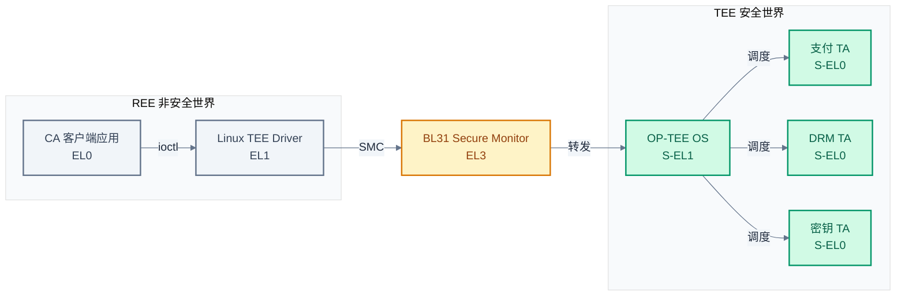

# TEE 概念与 TrustZone 硬件机制

> 一句话概括:本文从"为什么需要隔离"出发,建立 TEE 的概念框架,再用 ARM TrustZone 的总线信号、内存控制器与 GIC 中断分组解释这套隔离在硬件上如何落地。
> **工程师视角**:把 TrustZone 看成"一根 NS bit 贯穿全片总线"的硬件开关,把 TEE 看成"在这根开关上长出来的小型 OS",两者关系就清晰了。

### 关键术语

| 缩写 | 全称 | 含义 |
|------|------|------|
| TEE | Trusted Execution Environment | 可信执行环境,与主 OS 隔离的安全运行时 |
| REE | Rich Execution Environment | 富执行环境,运行 Linux/Android 等主 OS |
| GP | GlobalPlatform | 定义 TEE API 标准的国际组织 |
| CA | Client Application | 运行在 REE 侧、调用 TEE 服务的客户端应用 |
| TA | Trusted Application | 运行在 TEE 侧、受 TEE OS 管理的可信应用 |
| NS bit | Non-Secure bit | AXI 总线上区分安全/非安全事务的标志位 |
| AxPROT | AXI Protection signals | AXI 总线的事务保护信号,AxPROT[1] 即 NS bit |
| TZPC | TrustZone Protection Controller | 配置外设安全属性控制器 |
| TZASC | TrustZone Address Space Controller | 配置 DRAM 区域安全属性的内存控制器 |
| GIC | Generic Interrupt Controller | ARM 通用中断控制器 |
| FIQ | Fast Interrupt Request | ARM 快速中断请求,在 TrustZone 中用于安全中断 |
| IRQ | Interrupt Request | ARM 普通中断请求 |
| SMC | Secure Monitor Call | ARM 触发 EL3 调用的指令 |
| PMP | Physical Memory Protection | RISC-V 物理内存保护机制 |
| S-EL1 | Secure EL1 | 安全世界 EL1,TEE OS 运行的特权级 |

**前置阅读**:[05-tf-a-bl31-secure-monitor.md](./05-tf-a-bl31-secure-monitor.md) — BL31 作为 Secure Monitor 提供 SMC 调度,是 TEE 通信链路的必经节点。

---

## 1. 为什么需要 TEE

> 上一篇 [05-tf-a-bl31-secure-monitor.md](./05-tf-a-bl31-secure-monitor.md) 建立了 BL31 作为 EL3 Secure Monitor 的运行时模型——SMC 进、SMC 出。但 BL31 本身不实现业务逻辑,它只是"调度器"。真正承载安全业务(密钥、支付、生物特征)的代码住在哪里?本章用 TEE 回答这个问题,先讲"为什么需要隔离",再引出 TEE 的基本组成。

### 1.1 REE 的安全困境

**场景**:一部 Android 手机,Linux 内核跑起来后,支付应用需要处理指纹模板和交易签名。但 Linux 内核有数千万行代码,每年公开的 CVE (Common Vulnerabilities and Exposures, 通用漏洞披露) 数以千计——一旦内核被攻破,攻击者就能读取应用内存里的指纹数据、伪造交易签名。

Linux 内核为什么"太大而难以守住"?几个现实原因:

- **代码量大**:主线 Linux 内核代码超过 3000 万行,加上厂商驱动更多。攻击面与代码量正相关。
- **驱动不可控**:厂商 BSP (Board Support Package, 板级支持包) 中的闭源驱动质量参差不齐,常成为提权入口。
- **特权级过高**:内核运行在 EL1,能访问所有用户态进程的内存。一次内核漏洞 = 全盘沦陷。

**关键认知**:**问题不在于"加固 Linux 内核",而在于"重要数据根本不该放在 Linux 内核能碰到的地方"**。这是一个隔离问题,不是一个加固问题。

### 1.2 TEE 的核心思路:换个世界放敏感数据

TEE 的设计哲学:**与其修补一个不可能完全可信的 OS,不如把敏感操作搬到一个体量小、可审计、硬件隔离的运行环境里**。

具体来说,TEE 提供三样东西:

1. **隔离的执行环境**:TEE OS(如 OP-TEE)代码量通常在 10 万行级别,远小于 Linux 内核。它的攻击面更小、可审计性更高。
2. **硬件强制的内存隔离**:主 OS 即使被攻破,也无法通过直接读 DRAM 拿到 TEE 内存中的数据——因为硬件(TZASC)在总线层禁止了这种访问。
3. **受控的通信接口**:REE 与 TEE 之间的唯一通道是 SMC + 共享内存,所有交互都经过 TEE OS 的检查。没有"后门"通路。

> **核心要点**:TEE 解决的是"运行时隔离"——把敏感代码/数据放在主 OS 触及不到的地方,而不是去修补主 OS。硬件隔离边界是 TEE 可信性的根基,所以 TEE 强依赖 Secure Boot(否则 TEE OS 本身可被篡改,隔离就失去意义)。

---

## 2. TEE 的基本组成

> 上一章说明了"需要隔离",但隔离出来的环境里住着谁?REE 侧又怎么用上这个隔离环境?本章把 TEE 的基本角色——REE、TEE、CA、TA——拉清楚,这是后续所有章节的基础词汇。

### 2.1 REE 与 TEE:两个世界

ARMv8-A 安全扩展把系统分成两个"世界":

| 对比维度 | REE(Rich Execution Environment) | TEE(Trusted Execution Environment) |
|----------|--------------------------------|-------------------------------------|
| **运行什么** | Linux / Android 等主 OS | OP-TEE / QSEE 等 TEE OS |
| **特权级** | EL0(应用) / EL1(内核) / EL2(Hypervisor) | S-EL0(TA) / S-EL1(TEE OS) |
| **内存可见性** | 只能看非安全内存 | 安全 + 非安全内存都可访问 |
| **代码量** | 数千万行(Linux) | 数十万行(OP-TEE) |
| **业务** | UI、网络、文件系统等普通业务 | 密钥保管、支付签名、DRM、生物特征 |
| **被攻破后果** | 数据泄露限于 REE 范围 | 系统级灾难(所有 TA 失守) |

> **如何读这张表**:重点看"内存可见性"——这是隔离的关键。REE 只能看到非安全内存,TEE 既能看安全内存也能看非安全内存。这种"非对称可见性"就是 TrustZone 二元世界的本质:安全世界比非安全世界"看得更多"。

### 2.2 CA 与 TA:客户端与可信应用

业务上,TEE 里的代码不是一坨整体的"安全 OS",而是按应用粒度组织的:

- **CA (Client Application)**:跑在 REE 侧(EL0),是普通用户态进程。它需要使用某个安全服务(例如"签名一笔交易"),但自己不能直接做敏感操作。
- **TA (Trusted Application)**:跑在 TEE 侧(S-EL0),是 TEE OS 上的"用户态进程"。它持有密钥、执行加密,是真正的安全业务实现者。

**为什么 TA 不直接跑在 TEE OS 内核(S-EL1)里?** 两个原因:

1. **隔离**:不同 TA 之间也要隔离。支付 TA 不能被 DRM TA 读到内存。把 TA 放在 S-EL0、由 TEE OS 用 MMU 隔离,就能做到 TA 间互不可见。
2. **可加载性**:TA 是按需加载的 ELF (Executable and Linkable Format, 可执行可链接格式) 文件,不应该是内核的一部分。这和 Linux 把应用放在用户态是一个道理。



> **如何读这张图**:横向分两个世界。CA 在 REE 中通过 Linux TEE driver 触发 SMC,SMC 先到 EL3 的 BL31,再由 BL31 转发到 S-EL1 的 OP-TEE OS,最后由 OS 调度到对应的 TA。**两个世界之间唯一的通道是 BL31 这道闸**,这就是为什么 BL31 必须可信。

### 2.3 安全世界 vs 非安全世界:硬件视角

"世界"不是软件概念,是硬件概念。一颗支持 TrustZone 的 ARM SoC 在硬件上维护一个**当前安全状态**——这个状态决定了 CPU 当前发出的所有总线事务是"安全"还是"非安全":

- CPU 在 EL3 或 S-EL1/S-EL0 时,状态 = **安全**,发出的总线事务带 NS=0
- CPU 在 EL2/EL1/EL0(非安全侧)时,状态 = **非安全**,发出的总线事务带 NS=1

这个 NS 信号贯穿整个 SoC:CPU 核 → AXI 总线 → DRAM 控制器 → 外设。任何一个总线上的"守门人"(TZASC、TZPC)都能看到这个 bit,并据此决定允许或拒绝访问。

> **核心要点**:在 TrustZone 架构中,"隔离"不是软件实现的,而是**总线信号 + 总线守门人**共同实现的硬件隔离。软件只是配置守门人的规则,隔离本身由硬件强制。

---

## 3. GlobalPlatform TEE 规范

> 上一章定义了 CA 与 TA,但 CA 怎么调用 TA?TA 怎么写?如果每家厂商各搞一套接口,TA 就只能在自家芯片上跑。本章引入 GlobalPlatform TEE 规范,回答"接口怎么标准化"——它把 CA/TA 接口从厂商私有变成跨平台可移植。

### 3.1 为什么需要标准

假设没有 GP 规范,世界会怎样?

- 高通的 QSEE、联发的 Trustonic、ST 的 OP-TEE 各自定义一套 TA 接口
- 你为高通写了一个支付 TA,要移植到联发科?重写
- 你写了一个 CA 调用 TA 的代码,换一台手机?重写
- 应用商店想分发一个 TA 给所有 Android 手机?做不到

GP (GlobalPlatform) 是一个国际标准组织,专门定义智能卡、TEE 等安全接口。它的 TEE 规范把"CA 怎么调 TA"和"TA 内部怎么用 TEE 提供的能力"标准化了。结果是:**只要 TEE 厂商实现 GP 规范,TA 就可以跨平台分发**——这和 Android 应用只要符合 API 就能装到任何手机上是一个道理。

### 3.2 两套核心 API

GP TEE 规范有两套核心 API,分别面向 CA 侧和 TA 侧:

| 对比维度 | TEE Client API | TEE Internal Core API |
|----------|---------------|----------------------|
| **运行位置** | REE 侧(CA 进程中) | TEE 侧(TA 进程中) |
| **调用者** | CA 代码 | TA 代码 |
| **典型函数** | `TEEC_OpenSession`、`TEEC_InvokeCommand` | `TEE_OpenPersistentObject`、`TEE_AEInit` |
| **依赖库** | libteec(链接 CA) | libutee(链接 TA) |
| **能否访问安全存储** | 否,只能通过 TA 间接访问 | 是,直接访问 |
| **能否做加密运算** | 否,只能传参数给 TA | 是,直接调用硬件加速 |

> **如何读这张表**:Client API 是"遥控器",Internal API 是"被遥控的设备"。CA 只能按按钮(传参数、触发命令),真正干活(加密、存密钥)在 TA 里。这种分工让 CA 即使被攻破,攻击者也拿不到密钥——因为密钥从不离开 TA 的内存。

### 3.3 一个最小调用流程

把两套 API 串起来,一个完整的 CA→TA 调用流程是:

```
1. CA 调用 TEEC_InitializeContext  → 建立 CA 与 TEE 的连接
2. CA 调用 TEEC_OpenSession        → 用 TA 的 UUID 打开一个会话
3. CA 调用 TEEC_InvokeCommand      → 触发 TA 的某个命令,带参数
4. TA 的 TA_InvokeCommandEntryPoint 被调用 → TA 处理命令
5. TA 用 TEE_AllocateOperation 等做加密 → 通过 Internal API 调用 TEE 能力
6. TA 返回结果 → CA 从参数中读出结果
7. CA 调用 TEEC_CloseSession       → 关闭会话
8. CA 调用 TEEC_FinalizeContext    → 释放上下文
```

这个流程的每一步都对应 GP 规范定义的 API,任何符合 GP 的 TEE 实现都遵循同一调用顺序。后续 [08-optee-ta-development.md](./08-optee-ta-development.md) 会用真实代码演示完整流程。

> **核心要点**:GP 规范把 CA/TA 接口标准化,使 TA 可以像普通应用一样跨平台分发。Client API 在 REE 侧"按按钮",Internal API 在 TEE 侧"干活",敏感数据从不离开 TEE 的内存边界。

---

## 4. ARM TrustZone 硬件机制

> 上一章讲了 GP 规范定义的"软件接口",但接口本身不提供隔离——隔离是硬件干的。本章从总线信号、内存控制器、外设控制器三个层面,把"硬件怎么强制隔离"讲透。先看一个具体的总线事务示例,再推广到一般机制。

### 4.1 本质先行:一根 NS bit 贯穿全片

先抛开所有细节,看 TrustZone 在做什么:**给 CPU 发出的每一次总线访问打一个标签——"安全"或"非安全"——让总线上的守门人据此放行或拒绝**。

#### 4.1.1 TrustZone 架构概览

ARM TrustZone 技术通过硬件机制在单个 SoC 上创建两个隔离的执行环境。下图展示了 TrustZone 的整体架构:

```
┌─────────────────────────────────────────────────────────────┐
│                    ARM SoC with TrustZone                    │
├─────────────────────────────────────────────────────────────┤
│                                                              │
│  ┌──────────────────┐         ┌──────────────────┐          │
│  │  Secure World    │         │ Non-Secure World │          │
│  │                  │         │                  │          │
│  │  ┌────────────┐  │         │  ┌────────────┐  │          │
│  │  │  TEE OS    │  │         │  │  Rich OS   │  │          │
│  │  │ (OP-TEE)   │  │         │  │  (Linux)   │  │          │
│  │  │  S-EL1     │  │         │  │  EL1       │  │          │
│  │  └────────────┘  │         │  └────────────┘  │          │
│  │        ↑         │         │        ↑         │          │
│  │        │         │         │        │         │          │
│  │  ┌────────────┐  │         │  ┌────────────┐  │          │
│  │  │  Trusted   │  │         │  │  Non-      │  │          │
│  │  │  Apps      │  │         │  │  Secure    │  │          │
│  │  │  (TA)      │  │         │  │  Apps      │  │          │
│  │  │  S-EL0     │  │         │  │  EL0       │  │          │
│  │  └────────────┘  │         │  └────────────┘  │          │
│  │                  │         │                  │          │
│  └────────┬─────────┘         └────────┬─────────┘          │
│           │                             │                   │
│           └──────────┬──────────────────┘                   │
│                      │                                      │
│               ┌──────┴──────┐                               │
│               │   Monitor   │                               │
│               │    (EL3)    │                               │
│               │   BL31      │                               │
│               └──────┬──────┘                               │
│                      │                                      │
├──────────────────────┼──────────────────────────────────────┤
│                      │                                      │
│  ┌───────────────────┴────────────────────────────────┐    │
│  │              Hardware Security Engines              │    │
│  │  ┌──────────┐  ┌──────────┐  ┌──────────┐         │    │
│  │  │  TZASC   │  │  TZPC    │  │  GIC     │         │    │
│  │  │ (Memory  │  │(Peripheral│  │(Interrupt│         │    │
│  │  │ Protect) │  │ Protect) │  │ Control) │         │    │
│  │  └──────────┘  └──────────┘  └──────────┘         │    │
│  └────────────────────────────────────────────────────┘    │
│                                                              │
└─────────────────────────────────────────────────────────────┘
```

> **如何读这张图**:TrustZone 将系统分为安全世界(Secure World)和非安全世界(Non-Secure World)。安全世界运行 TEE OS 和 TA,非安全世界运行 Rich OS(如 Linux)。EL3 的 Monitor(BL31)负责两个世界之间的切换。硬件安全引擎(TZASC、TZPC、GIC)提供内存保护、外设保护和中断隔离。

这是一个具体的场景:

1. CPU 当前在 EL1 运行 Linux 内核(非安全状态)
2. Linux 执行 `LDR x0, [x1]`,x1 指向地址 0x80000000(DRAM 中间区域)
3. CPU 向 AXI 总线发出一次读事务,地址 = 0x80000000,同时 AxPROT[1] = 1(非安全)
4. TZASC(守门人)看到这次事务,查自己的配置表:0x80000000 属于 region 2,region 2 配置为"仅安全可访问"
5. TZASC 拒绝这次访问,返回 DECERR(解码错误)
6. CPU 收到数据中止,触发异常

如果 CPU 此时在 S-EL1 运行 TEE OS:

3'. CPU 发出读事务,地址 = 0x80000000,同时 AxPROT[1] = 0(安全)
4'. TZASC 看到 AxPROT[1] = 0,允许访问
5'. 数据正常返回

**关键**:同一个地址 0x80000000,安全 CPU 能读,非安全 CPU 不能读。这就是 TrustZone 的本质。

### 4.2 安全状态位 NS bit

CPU 的当前安全状态由以下寄存器位共同决定:

- **SCR_EL3.NS**(Secure Configuration Register 的 NS 位):EL3 下可写。当 NS=1,EL3 退出后进入非安全状态;NS=0,退出后进入安全状态。
- **PSTATE**:不直接编码安全状态,但当前异常级别(EL3 vs EL1)配合 SCR_EL3.NS 决定状态。

**为什么 NS bit 放在 SCR_EL3 而不是 CPU 通用状态?** 因为只有 EL3 能改 NS——EL3 是 Secure Monitor 的位置,REE 想切换到 TEE 必须通过 SMC 进 EL3,由 EL3 改 NS 后再跳到 S-EL1。这保证了"切换世界"这个动作只能由可信的 EL3 代码发起,REE 自己改不了。

### 4.3 AXI 总线信号:AxPROT[1]

CPU 发出的总线事务不只是地址 + 数据,还有一组**控制信号**告诉总线这次事务的属性。AXI (Advanced eXtensible Interface, 高级可扩展接口) 总线中,这些属性编码在 AxPROT 信号中:

| AxPROT 位 | 含义 | 取值 |
|-----------|------|------|
| AxPROT[0] | 特权/用户 | 0=特权,1=用户 |
| AxPROT[1] | **安全/非安全** | **0=安全,1=非安全** |
| AxPROT[2] | 指令/数据 | 0=指令,1=数据 |

**注意反直觉的一点**:AxPROT[1] = 0 表示**安全**,1 表示非安全。这是因为 TrustZone 把"安全"作为默认值,把"非安全"作为标记值——一旦硬件或配置出错导致 AxPROT 未驱动,默认是安全访问,只会被守门人拒绝(因为发起方不一定是安全 CPU),而不是让非安全访问混过去。

### 4.4 TZPC 与 TZASC:两类守门人

NS bit 是 CPU 发出的"标签",但还需要"守门人"在总线上执行访问控制。ARM 提供了两类控制器:

**TZASC (TrustZone Address Space Controller)**——管 DRAM:

- 把 DRAM 划分成多个 region(典型 8-16 个)
- 每个 region 可配:安全 only / 非安全 only / 全部允许
- 拦截所有 DRAM 访问,按 region 配置允许或拒绝
- 典型芯片:Texas Instruments 的 TZC-400

**TZPC (TrustZone Protection Controller)**——管外设:

- 配置外设的"安全可见性"
- 例如:让 UART0 只能被安全世界访问(作为 TEE 的调试串口),UART1 让非安全世界访问(Linux 用)
- 典型芯片:Texas Instruments 的 TZPC

```mermaid
%%{init: {"theme": "base", "themeVariables": {"primaryColor": "#f8fafc", "primaryTextColor": "#1e293b", "primaryBorderColor": "#475569", "lineColor": "#64748b", "secondaryColor": "#f1f5f9", "secondaryBorderColor": "#94a3b8", "tertiaryColor": "#f8fafc", "fontFamily": "\"trebuchet ms\", verdana, arial, sans-serif"}}}%%
flowchart TD
    CPU[CPU 核<br/>当前安全状态]
    CPU -->|AXI 事务<br/>地址 + AxPROT[1]| Bus{AXI 总线}
    Bus --> TZASC[TZASC<br/>管 DRAM region]
    Bus --> TZPC[TZPC<br/>管外设]
    TZASC --> DRAM[(DRAM)]
    TZPC --> Periph1[UART0 安全]
    TZPC --> Periph2[UART1 非安全]
    TZPC --> Periph3[Crypto 安全]

    classDef cpu fill:#fee2e2,stroke:#dc2626,color:#991b1b,stroke-width:2px
    classDef gate fill:#fef3c7,stroke:#d97706,color:#92400e,stroke-width:2px
    classDef sec fill:#d1fae5,stroke:#059669,color:#065f46,stroke-width:2px
    classDef ns fill:#f1f5f9,stroke:#64748b,color:#334155,stroke-width:2px
    class CPU cpu
    class TZASC,TZPC,Bus gate
    class DRAM,Periph1,Periph3 sec
    class Periph2 ns
```

> **如何读这张图**:CPU 发出的每次总线事务都带着 AxPROT[1] 标签。TZASC 和 TZPC 是总线上两类守门人:TZASC 守 DRAM(按 region 查表),TZPC 守外设(按外设查表)。任何一次访问只要被守门人拒绝,CPU 就收到 DECERR。

### 4.5 一个具体的小例子

假设 SoC 有 1GB DRAM,地址范围 0x40000000–0x80000000。我们想把高 256MB(0x70000000–0x80000000)划给 TEE OS:

```
TZASC region 0: 0x40000000 - 0x6FFFFFFF  → NS only(给 Linux 用)
TZASC region 1: 0x70000000 - 0x7FFFFFFF  → Secure only(给 TEE 用)
```

配置完成后:

- Linux 进程访问 0x75000000 → CPU 发 AxPROT[1]=1 → TZASC 看 region 1 = Secure only → 拒绝 → 进程收到 SIGSEGV
- TEE OS 访问 0x75000000 → CPU 发 AxPROT[1]=0 → TZASC 看 region 1 = Secure only → 允许 → 数据返回

**这就是隔离的物理基础**。无论 Linux 怎么被攻破,它的 CPU 指令永远无法让 AxPROT[1] 变成 0——因为只有 EL3 能改 SCR_EL3.NS,而 Linux 在 EL1 没有 EL3 的执行权限。

> **核心要点**:TrustZone 的硬件隔离 = **NS bit(标签)+ TZASC/TZPC(守门人)**。NS bit 由 CPU 发出、贯穿全总线,守门人据此查表放行或拒绝。这套机制是硬件强制的,REE 软件无法绕过。

---

## 5. 中断隔离:GIC 安全扩展

> 上一章讲了 CPU 和内存的隔离,但还有一个问题:外设产生中断后,中断该送到 REE 还是 TEE?如果所有中断都送到 Linux,那 TEE 永远收不到事件(比如安全定时器、安全加密引擎完成中断)。本章讲 GIC 安全扩展如何把中断也隔离开。

### 5.1 GIC 的中断分组

GIC (Generic Interrupt Controller, 通用中断控制器) 是 ARM 处理中断的标准 IP。在 TrustZone 安全扩展下,GICv3 把中断分成三组:

| 中断组 | 信任级别 | 处理者 | 典型来源 |
|--------|----------|--------|----------|
| **Group 0** | 安全(EL3) | BL31 | EL3 级别的安全中断,始终以 FIQ 触发 |
| **Group 1 Secure** | 安全(S-EL1) | TEE OS | 安全定时器、安全加密引擎 |
| **Group 1 Non-Secure** | 非安全 | Linux 内核 | 普通外设(网卡、USB、显卡) |

每个中断源(由中断号标识)在 GIC 的 GICD_IGROUPRn / GICD_IGRPMODRn 寄存器中配置所属分组。**配置由安全世界完成**——BL31/TEE OS 在启动时设置好,REE 无法修改。

**为什么要把中断分组?** 考虑一个安全加密引擎:它的中断必须送到 TEE,而不是 Linux,否则 Linux 可能伪造"加密完成"信号欺骗 TEE。把加密引擎中断配置为 Group 1 Secure,GIC 物理上保证这个中断只能被安全世界的 CPU 处理。

### 5.2 FIQ vs IRQ:中断路由

ARM 处理器有两种中断异常:**IRQ** 和 **FIQ**。GICv3 用它们来区分中断组——**Group 0 始终触发 FIQ**,Group 1 的信号类型取决于 CPU 当前的安全状态:

| CPU 当前状态 | Group 0 | Group 1 Secure | Group 1 Non-Secure |
|--------------|---------|-----------------|---------------------|
| 在非安全世界(Linux) | **FIQ** → 路由到 EL3 | **FIQ** → 路由到 S-EL1 | IRQ(Linux 处理) |
| 在安全世界(TEE) | **FIQ**(BL31 处理) | IRQ(TEE OS 处理) | **FIQ** → 路由回非安全世界 |

> **如何读这张表**:Group 0 无条件触发 FIQ,因为它是 EL3 级中断。Group 1 Secure 在安全世界以 IRQ 形式到达(TEE OS 用正常 IRQ 处理逻辑即可),在非安全世界以 FIQ 形式到达(陷阱回安全世界)。Group 1 Non-Secure 则相反——在非安全世界是 IRQ(Linux 正常处理),在安全世界是 FIQ(需转发回 REE)。

**反直觉但合理**:安全中断(Group 0/Group 1 Secure)在非安全世界以 FIQ 形式到达——Linux 默认不处理 FIQ,FIQ 会被路由到 EL3 的 BL31,BL31 再切换到安全世界、把中断交给 TEE OS。

一个具体场景:

1. Linux 在 EL1 运行(非安全状态)
2. 安全定时器产生中断(Group 1 Secure)
3. GIC 把它作为 FIQ 送给 CPU
4. CPU 跳到 EL3 的 FIQ 异常向量(因为 SCR_EL3 配置了 FIQ 路由)
5. BL31 处理 FIQ:切换到安全状态,跳到 S-EL1
6. TEE OS 的中断处理代码运行,处理定时器事件
7. 处理完毕,返回 BL31,BL31 切回非安全状态,返回 Linux

> **核心要点**:GICv3 把中断按信任级别分成三组(Group 0 / Group 1 Secure / Group 1 Non-Secure),通过 FIQ/IRQ 路由保证"安全中断只能被安全世界处理"。Group 0 始终是 FIQ(EL3 级),Group 1 的信号类型随 CPU 安全状态翻转。这确保即使 Linux 被攻破,也无法伪造或截获 TEE 的中断。

---

## 6. 与 RISC-V PMP 对比

> 前面几章讲的都是 ARM TrustZone 的方案。一个自然的问题:RISC-V 怎么做?本章用对比说明两种设计哲学的差异——TrustZone 是"二元世界",PMP 是"多区可编程",各有取舍。详细的 RISC-V 方案见 [10-riscv-secure-boot-and-tee.md](./10-riscv-secure-boot-and-tee.md)。

| 对比维度 | ARM TrustZone | RISC-V PMP/ePMP |
|----------|---------------|-----------------|
| **隔离模型** | 二元(安全 / 非安全世界) | 多区(可编程 16-64 个 region) |
| **硬件机制** | AXI 总线 NS bit + TZASC/TZPC | PMP 寄存器 + MMU 权限检查 |
| **NS 标签** | 总线事务自动带 NS bit | 无总线标签,只在 CPU 侧检查 |
| **DRAM 隔离** | TZASC 按 region 配置 | PMP region 配置 M/S/U 权限 |
| **外设隔离** | TZPC 配置外设安全可见性 | 无标准方案,需 SMMU/IOMMU |
| **中断隔离** | GIC Group 0/1 + FIQ/IRQ | AIA + IMSIC,可配特权级 |
| **切换机制** | SMC 指令(硬件异常到 EL3) | ecall(SBI 软件约定) |
| **TEE 生态** | OP-TEE(生产级) | Keystone/Penglai(研究级) |

**为什么 ARM 选择二元世界?** TrustZone 设计于 2000 年代,目标是"用最小硬件代价提供隔离"——只需一个 NS bit 就能区分安全/非安全事务,所有总线设备都能感知。二元模型简单,适合当时的需求,且生态成熟(OP-TEE、QSEE 等生产级 TEE OS 都基于此)。

**为什么 RISC-V 选择多区?** RISC-V 设计于 2010 年代,PMP 借鉴了 MMU 的页保护思路——每个 region 独立配置权限,更灵活。但灵活性带来复杂性:没有天然的"安全世界",需要软件(OpenSBI)来管理隔离。这也是 RISC-V TEE 生态碎片化的根源——不同方案(Keystone/Penglai/CURE)都基于 PMP,但接口不兼容。

**TrustZone 的局限**:二元模型难以支持"多 TEE 并存"场景(例如同时跑一个 DRM TEE 和一个支付 TEE,且彼此隔离)。ARMv9 引入 CCA (Confidential Compute Architecture, 机密计算架构) 和 RME (Realm Management Extension, 域管理扩展) 部分弥补了这个局限——把世界从 2 个扩展到 4 个(Realm、Secure、Root、Non-secure),但这是另一个话题。

> **核心要点**:TrustZone 用"一个 NS bit + 二元世界"换取了简单和生态成熟;PMP 用"多区可编程"换取了灵活性,但牺牲了统一标准。两者都是工程权衡,没有绝对优劣。

---

## 7. 总结

把全文要点收一下:

- **TEE 是什么**:运行时隔离环境,把敏感代码/数据放在主 OS 触及不到的地方。它解决的是隔离问题,不是加固问题。
- **谁住在 TEE 里**:TA(可信应用,跑在 S-EL0)是业务承载者;TEE OS(跑在 S-EL1)管理 TA、提供 GP API 实现。
- **CA 怎么调 TA**:通过 GP 规范定义的 Client API(libteec),走 SMC → BL31 → OP-TEE → TA 链路。GP 标准让 TA 跨平台可移植。
- **硬件怎么隔离**:NS bit(标签)+ TZASC/TZPC(守门人)在总线层强制隔离,REE 软件无法绕过。GIC 把中断也按 Group 0/1 隔离。
- **与 RISC-V 的差异**:TrustZone 是二元世界(简单、生态成熟),PMP 是多区可编程(灵活、生态碎片化)。

下一篇 [07-optee-architecture.md](./07-optee-architecture.md) 会进入 OP-TEE 内部——看 TEE OS 怎么组织、CA 与 TA 怎么通过 SMC + 共享内存完成一次完整调用。

---

## 参考资料

- [GlobalPlatform TEE Specifications](https://globalplatform.org/specs-library/) — TEE Client API 与 Internal Core API 标准
- [ARM TrustZone for ARMv8-A Architecture Reference Manual](https://developer.arm.com/documentation/100942/) — TrustZone 架构规范
- [ARM Generic Interrupt Controller Architecture Specification](https://developer.arm.com/documentation/ihi0069/) — GIC 安全扩展
- [TZC-400 TrustZone Address Space Controller Technical Reference Manual](https://developer.arm.com/documentation/ddi0504/) — TZASC 实现
- [OP-TEE Documentation — TEE Concepts](https://optee.readthedocs.io/en/latest/general/tee.html) — TEE 概念入门
- [1. TEE 的基本定位 — 01-trusted-firmware-overview.md](./01-trusted-firmware-overview.md) — 本仓库对 TEE/REE 的最初定义

---

**下一篇**: [07-optee-architecture.md](./07-optee-architecture.md) — OP-TEE 架构与 CA/TA 通信机制
