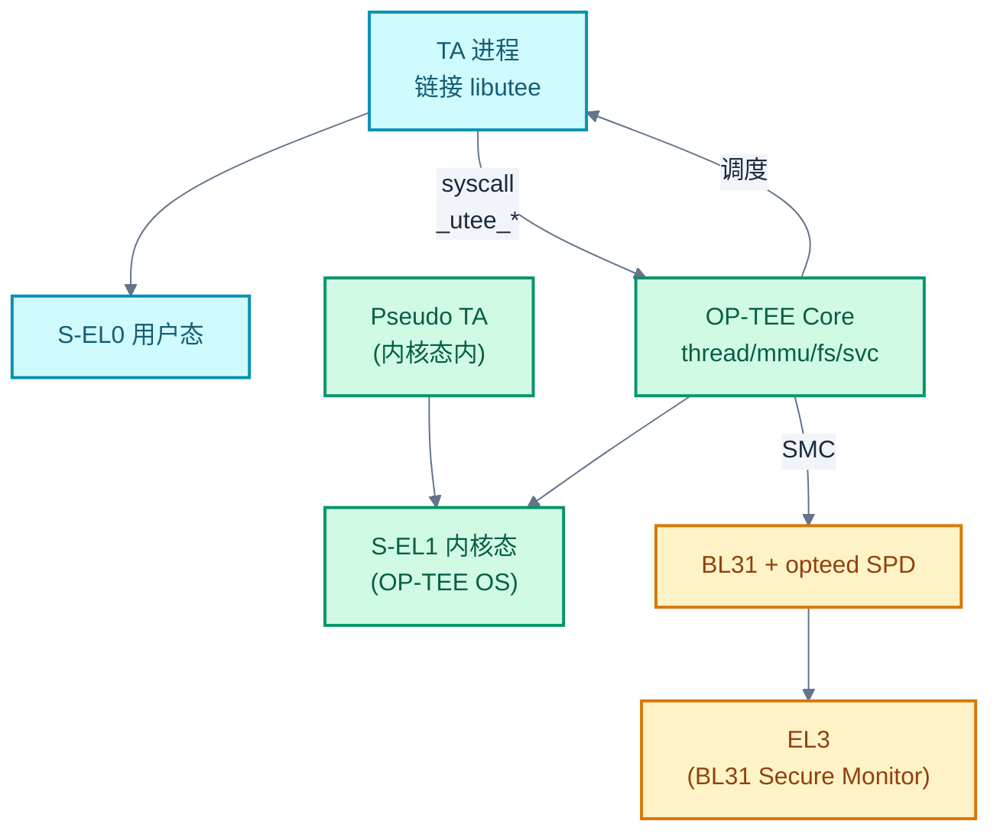
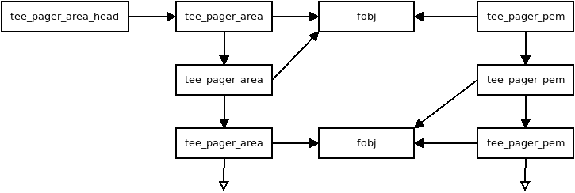
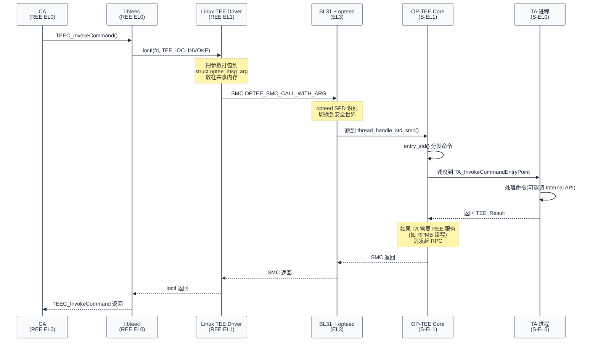

# OP-TEE 架构与 CA/TA 通信机制

> 一句话概括:本文从 OP-TEE 三件套生态出发,剖析 OP-TEE OS 内部结构,然后用一次 CA→TA 完整调用的 Mermaid 序列图,把"SMC 进、共享内存传参、TA 处理、SMC 出"这条链路打通。
> **工程师视角**:把 OP-TEE 当成"一个跑在 S-EL1 的小型 OS + 一组 GP API 实现",通信链路就是"Linux ioctl → SMC → BL31 → OP-TEE → TA",所有复杂性都围绕这条链路展开。

### 关键术语

| 缩写 | 全称 | 含义 |
|------|------|------|
| OP-TEE | Open Portable Trusted Execution Environment | Linaro 主导的开源 TEE OS 实现 |
| TEE OS | — | 运行在 S-EL1 的可信操作系统,本文即 OP-TEE |
| SMC | Secure Monitor Call | ARM 触发 EL3 调用的指令 |
| SPD | Secure Partition Dispatcher | BL31 中调度 TEE OS 的组件,本文为 opteed |
| SHM | Shared Memory | REE 与 TEE 之间的共享内存区域 |
| RPC | Remote Procedure Call | OP-TEE 反向调用 REE 的机制(注意:REE 是"远程") |
| GP API | GlobalPlatform API | GP 规范定义的 TEE Client/Internal API |
| libteec | — | REE 侧 CA 链接的库,实现 TEE Client API |
| libutee | — | TEE 侧 TA 链接的库,实现 TEE Internal Core API |
| ldelf | Loader of ELF | OP-TEE 加载 TA 时使用的 ELF 加载器 |
| PTA | Pseudo TA | OP-TEE 内核态(S-EL1)伪 TA,与用户态 TA 相对 |
| FF-A | Firmware Framework for Arm | ARMv9 推荐的新一代 TEE 通信框架,可替代 SMC+SHM |
| TA | Trusted Application | 运行在 S-EL0 的可信应用 |
| CA | Client Application | 运行在 REE 的客户端应用 |

**前置阅读**:[06-tee-concepts-and-trustzone.md](./06-tee-concepts-and-trustzone.md) — TEE 与 TrustZone 的概念框架,本文假设读者已了解 REE/TEE、CA/TA、GP 规范。

---

## 1. OP-TEE 生态三件套

> 上一篇建立了 TEE/CA/TA 的概念模型,但没有展开具体实现。本章先看 OP-TEE 工程上的"全家福"——它不是一个孤立的代码库,而是三个仓库协同工作。理解三件套的分工,是看懂后续通信链路的前提。

OP-TEE 项目由三个核心仓库组成,各自有明确职责:

| 仓库 | 路径 | 运行位置 | 职责 |
|------|------|----------|------|
| **optee_os** | [src/optee-src/](./src/optee-src/) | S-EL1 + S-EL0 | TEE OS 内核 + libutee(TA 用户态库)+ TA 框架 |
| **optee_client** | (不在本仓库) | REE(EL0 + EL1) | libteec(CA 库)+ tee-supplicant(RPC 服务进程)+ Linux TEE driver 头文件 |
| **optee_test** | (不在本仓库) | REE + TEE | xtest 测试套件,含 GP 合规测试与多个示例 TA |

**为什么拆三个仓库?** 工程上的考虑:

1. **构建系统独立**:optee_os 用自己的 Makefile 体系,不依赖 Linux 内核源码;optee_client 走普通 Linux 用户态构建;optee_test 独立编译。三者可分别升级。
2. **可替换性**:optee_client 与 optee_os 之间用 GP 标准接口和 SMC 协议解耦,理论上 optee_client 可以配其他 TEE OS(如 QSEE),反之亦然。
3. **代码量可控**:optee_os 约 20 万行,本仓库 submodule 仅包含它。

本系列引用的源码全部来自 [src/optee-src/](./src/optee-src/),即 optee_os。文中提到的"libteec"、"tee-supplicant"、"Linux TEE driver"虽然属于 optee_client/内核侧,但会用文字描述其行为,不直接引用源码。

> **核心要点**:OP-TEE 是"三件套"——optee_os(TEE OS,在 S-EL1)、optee_client(CA 库 + supplicant,在 REE)、optee_test(xtest)。三者通过 GP 标准接口和 SMC 协议解耦,本仓库只包含 optee_os。

---

## 2. OP-TEE OS 内部架构

> 上一章讲了三个仓库的分工,本章进入 optee_os 内部,看它的目录结构和关键组件。理解这些组件的职责,后续读通信链路时才知道每一步在哪个文件里发生。

### 2.1 目录结构

[optee-src/](./src/optee-src/) 的顶层目录布局:

| 目录 | 内容 | 关键文件 |
|------|------|----------|
| `core/` | TEE OS 内核(S-EL1) | `kernel/`、`mm/`、`tee/`、`arch/arm/`、`drivers/` |
| `lib/libutee/` | TA 用户态库(S-EL0 链接) | `tee_api.c`、`tee_api_operations.c`、`tee_api_objects.c` |
| `lib/libtomcrypt/`、`lib/libmbedtls/` | 加密后端 | AES/RSA/ECC 等算法实现 |
| `ta/` | TA 框架与官方示例 TA | `ta/avb/`、`ta/trusted_keys/`、`ta/pkcs11/` |
| `ta/arch/arm/` | TA 链接脚本与入口汇编 | `ta.ld.S`、`ta_entry_a32.S` |
| `ta/mk/` | TA 构建系统 | `ta_dev_kit.mk`、`build-user-ta.mk` |

`core/` 内部进一步细分:

```
core/
├── arch/arm/
│   ├── kernel/      # 线程管理、异常向量、启动
│   ├── mm/          # 安全世界 MMU、pager(分页)
│   ├── include/sm/  # SMC 调用约定(optee_smc.h)
│   └── tee/         # 快速 SMC 入口(entry_fast.c)
├── kernel/          # 调度、TA 管理、互斥锁
├── mm/              # 内存对象抽象(mobj)、core_mmu
├── tee/             # 标准 SMC 入口、文件系统、syscall 处理
└── drivers/         # GIC、UART、RPMB、TZASC 等驱动
```

### 2.2 关键组件速览

OP-TEE OS 内部由若干核心组件构成。下表列出本文后续会引用的关键组件:

| 组件 | 关键源文件 | 职责 |
|------|-----------|------|
| **thread** | [core/arch/arm/kernel/thread.c](./src/optee-src/core/arch/arm/kernel/thread.c)、`thread_optee_smc.c` | 线程管理,每个 SMC 调用占用一个线程,线程数 = `CFG_NUM_THREADS` |
| **tee_pager** | [core/arch/arm/mm/tee_pager.c](./src/optee-src/core/arch/arm/mm/tee_pager.c) | 按需分页,把不常用的代码页换出,节省安全 RAM |
| **core_mmu** | [core/arch/arm/mm/core_mmu.c](./src/optee-src/core/arch/arm/mm/core_mmu.c) | 安全世界 MMU 配置,管理安全/非安全内存映射 |
| **tee_mmu** | [core/mm/](./src/optee-src/core/mm/) | TA 地址空间管理,每个 TA 有独立 MMU 表 |
| **tee_fs** | [core/tee/tee_ree_fs.c](./src/optee-src/core/tee/tee_ree_fs.c)、`tee_rpmb_fs.c` | 安全存储后端:REE FS(加密)+ RPMB(抗回滚) |
| **tee_svc** | [core/tee/tee_svc.c](./src/optee-src/core/tee/tee_svc.c)、`tee_svc_cryp.c`、`tee_svc_storage.c` | TA syscall 处理(TEE_AllocateOperation 等) |
| **entry_fast** | [core/arch/arm/tee/entry_fast.c](./src/optee-src/core/arch/arm/tee/entry_fast.c) | 快速 SMC 入口(不阻塞,无 TA 调度) |
| **entry_std** | [core/tee/entry_std.c](./src/optee-src/core/tee/entry_std.c) | 标准 SMC 入口(可阻塞,处理 OpenSession/InvokeCommand) |
| **user_ta** | [core/kernel/user_ta.c](./src/optee-src/core/kernel/user_ta.c) | 用户态 TA 加载、会话管理 |
| **ldelf** | [core/kernel/ldelf_loader.c](./src/optee-src/core/kernel/ldelf_loader.c) | TA ELF 加载器(本身也是 S-EL0 进程) |

> **如何读这张表**:重点是 `thread_optee_smc.c` 和 `entry_std.c` 这一对——前者是 SMC 的物理入口(汇编跳进来后调用 C 函数),后者是标准 SMC 的命令分发器(决定 OpenSession/InvokeCommand 走哪条路)。第 4 章会详细展开这条链路。

### 2.3 用户态与内核态的边界

OP-TEE 内部也有"内核态 / 用户态"之分,与 Linux 类似但更简化:



> **如何读这张图**:TA 跑在 S-EL0(用户态),OP-TEE Core 跑在 S-EL1(内核态)。TA 调用 `TEE_AllocateOperation` 等 GP Internal API 时,libutee 把它转成 `_utee_*` syscall 进入 S-EL1,由 `tee_svc_cryp.c` 等内核态代码处理。注意:OP-TEE 还有"Pseudo TA"(PTA)——它跑在 S-EL1 内核态,用于实现设备相关服务(如 RPMB、attestation),性能更高但隔离性弱于用户态 TA。

### 2.4 内存管理与分页机制

OP-TEE 的内存管理是理解其架构的关键。下图展示了 OP-TEE 的 pager 区域布局:



*来源:OP-TEE Documentation, Architecture - Core*

> **如何读这张图**:OP-TEE 使用分页机制(pager)来管理安全内存。图中展示了:
> - **Pager area**:可分页的代码和数据区域,不常用的页面会被换出到非安全内存
> - **Non-paged area**:常驻内存的核心代码,如中断处理、关键数据结构
> - **TA area**:每个 TA 有独立的地址空间,通过 MMU 隔离
> 
> 这种设计让 OP-TEE 能在有限的安全内存(通常只有几 MB)中运行大量 TA。

#### 2.4.1 Pager 工作原理

OP-TEE 的 pager 机制类似于操作系统的虚拟内存,但更简化:

```c
/* 摘自 [optee-src/core/arch/arm/mm/tee_pager.c](./src/optee-src/core/arch/arm/mm/tee_pager.c) 第 89-125 行 */

/* Pager 区域定义 */
struct tee_pager_area {
    vaddr_t base;           /* 虚拟地址基址 */
    size_t size;            /* 区域大小 */
    uint32_t flags;         /* 权限标志(读/写/执行) */
    struct fobj *fobj;      /* 后端存储对象 */
};

/* 页面换出流程 */
static void tee_pager_pageout(struct tee_pager_area *area, vaddr_t page_addr)
{
    /* 1. 找到要换出的页面 */
    struct fobj *fobj = area->fobj;
    size_t page_idx = (page_addr - area->base) / SMALL_PAGE_SIZE;
    
    /* 2. 保存页面内容到非安全内存(加密) */
    fobj->ops->save_page(fobj, page_idx, page_addr);
    
    /* 3. 清除页表项,标记为不在内存中 */
    core_mmu_set_entry(&area->pgt, page_idx, 0, 0);
    
    /* 4. 更新 pager 状态 */
    area->flags |= TEE_PAGER_AREA_FLAG_PAGEOUT;
}

/* 页面换入流程 */
static void tee_pager_pagein(struct tee_pager_area *area, vaddr_t page_addr)
{
    /* 1. 分配一个物理页面 */
    void *page = tee_mm_alloc(&tee_mm_pool, SMALL_PAGE_SIZE);
    
    /* 2. 从非安全内存加载页面内容 */
    area->fobj->ops->load_page(area->fobj, page_idx, page);
    
    /* 3. 更新页表,映射到虚拟地址 */
    core_mmu_set_entry(&area->pgt, page_idx, (uintptr_t)page, area->flags);
    
    /* 4. 刷新 TLB */
    tlbi_mva_allasid(page_addr);
}
```

**为什么需要 pager?** ARM TrustZone 的安全内存(Trusted DRAM)通常只有几 MB(如 FVP 默认 32 MB),但 OP-TEE 需要支持多个 TA,每个 TA 可能有几十 KB 到几 MB 的代码。如果所有 TA 都常驻内存,安全内存很快耗尽。Pager 机制让不常用的 TA 代码页换出到非安全内存(加密存储),需要时再换入,实现"小内存跑大应用"。

**Pager 的安全性**:换出的页面存储在非安全内存中,但经过加密和完整性保护。攻击者无法篡改或重放这些页面,因为:
1. 加密密钥存储在安全内存中,非安全世界无法访问
2. 每个页面有唯一的 IV(基于虚拟地址),防止重放攻击
3. 换入时验证完整性,篡改的页面会被拒绝

---

## 3. 启动流程:TF-A 怎么把 OP-TEE 拉起来

> 上一章列了 OP-TEE 的组件,但这些组件什么时候被初始化?谁把 OP-TEE 加载到安全内存?本章回答启动问题,承接 [05-tf-a-bl31-secure-monitor.md](./05-tf-a-bl31-secure-monitor.md) 讲过的 BL31 启动流程。

OP-TEE 在 ARM 启动链中占据 **BL32** 位置。完整启动序列:

```
1. BL1(ROM)验证并加载 BL2
2. BL2 验证 BL31 / BL32(OP-TEE) / BL33 三个镜像
3. BL2 把 BL32 加载到安全内存(由 TZASC 保护的 DRAM region)
4. BL2 把控制权交给 BL31(不直接跳 BL32)
5. BL31 初始化自己,注册 opteed SPD(_secure partition dispatcher)
6. BL31 通过 SMC 调用 OPTEE_SMC_CALL_WITH_ARG 启动 OP-TEE
7. OP-TEE 在 S-EL1 初始化:MMU、GIC、线程池、文件系统
8. OP-TEE 完成初始化后,SMC 返回到 BL31
9. BL31 跳转 BL33(U-Boot/UEFI)→ Linux
10. Linux 启动后,通过 TEE driver 发 SMC 与 OP-TEE 交互
```

**为什么 BL2 不直接跳到 BL32,而是回到 BL31 再启动 BL32?** 因为 BL31 是 EL3 常驻 Secure Monitor,只有 EL3 能改 SCR_EL3.NS 切换世界。BL2 在 S-EL1 没有这个权限。所以 BL2 把 BL32 镜像准备好,然后"交棒"给 BL31,由 BL31 切换到安全状态、跳进 BL32。

**opteed SPD 是什么?** 它是 BL31 中的一个组件,代码在 TF-A 仓库的 `services/spd/opteed/`。它的作用是:当 Linux 发 SMC 调用 OP-TEE 时,BL31 收到 SMC,根据 SMC 的 Function ID 判断"这是给 OP-TEE 的",然后由 opteed SPD 切换到安全世界、跳进 OP-TEE 的入口函数。opteed 就是 BL31 与 OP-TEE 之间的"路由器"。

OP-TEE 启动入口在 [core/arch/arm/kernel/boot.c](./src/optee-src/core/arch/arm/kernel/boot.c) 的 `boot_init_primary_early()` 函数中,它会:

1. 解析 BL31 传入的参数(共享内存地址、可分页代码区地址)
2. 初始化 MMU,映射安全内存
3. 初始化线程池(`CFG_NUM_THREADS` 个线程,默认 2)
4. 初始化 GIC、定时器、文件系统后端
5. 通过 SMC 返回 BL31,完成"BL32 已就绪"通知

启动完成后,OP-TEE 在安全内存中**常驻**,等待 REE 通过 SMC 发起的请求。

> **核心要点**:OP-TEE 在 BL32 位置,由 BL2 加载镜像、由 BL31 通过 opteed SPD 启动。启动完成后 OP-TEE 常驻 S-EL1,所有后续 CA→TA 请求都经 BL31 的 opteed SPD 路由进来。

---

## 4. CA/TA 通信机制

> 前几章把 OP-TEE 的静态结构和启动流程讲清楚了。本章是本文的核心:一次 CA→TA 调用从用户态发起,到 TA 处理完毕返回,中间经过多少层?每层做什么?用一个 Mermaid 序列图打通整条链路。

### 4.1 一次完整调用的序列图

假设场景:CA 调用 `TEEC_InvokeCommand` 触发 TA 的某个加密命令。完整链路如下:



> **如何读这张图**:从上到下是时间顺序,纵向是参与角色。重点看三个"世界边界"——CA/Drv 是 REE,BL31 是 EL3,OS/TA 是 TEE。每次跨世界都通过 SMC,所有业务参数都通过共享内存传递(SMC 寄存器只传少量元数据 + 共享内存指针)。注意 RPC 那一步是可选的——TA 可能反向请求 REE 服务(如读写 RPMB),由 OP-TEE Core 通过 SMC 通知 supplicant 完成。

### 4.2 SMC 调用类型:Fast vs Standard

OP-TEE 的 SMC 调用分两类,通过 Function ID 的最高位区分:

| 类型 | 标志 | 特点 | 典型用途 |
|------|------|------|----------|
| **Fast SMC** | `OPTEE_SMC_FAST_CALL` (bit31=1) | 不分配线程,不阻塞,执行完立即返回 | 获取 OP-TEE 版本、获取共享内存配置、能力协商 |
| **Standard SMC** | `OPTEE_SMC_STD_CALL` (bit31=0) | 分配一个 TEE 线程,可被 RPC 中断挂起 | OpenSession、InvokeCommand、CloseSession |

FunctionID 的编码定义在 [core/arch/arm/include/sm/optee_smc.h](./src/optee-src/core/arch/arm/include/sm/optee_smc.h) 中:

```c
/* 来源: src/optee-src/core/arch/arm/include/sm/optee_smc.h */
#define OPTEE_SMC_32            U(0)
#define OPTEE_SMC_64            U(0x40000000)
#define OPTEE_SMC_FAST_CALL     U(0x80000000)
#define OPTEE_SMC_STD_CALL      U(0)

#define OPTEE_SMC_OWNER_TRUSTED_OS_OPTEED U(62)
#define OPTEE_SMC_OWNER_TRUSTED_OS_API    U(63)

/* 标准 SMC:发起一次带参数的调用 */
#define OPTEE_SMC_CALL_WITH_ARG \
    OPTEE_SMC_STD_CALL_VAL(OPTEE_SMC_FUNCID_CALL_WITH_ARG)
```

**为什么区分 Fast 和 Standard?** Fast SMC 不能阻塞,因为它不分配线程——如果它阻塞了,SMC 就无法返回,REE 就卡住了。Standard SMC 可以阻塞(在 TA 处理时),因为它有自己的线程上下文,TA 处理期间 REE 线程在等待 SMC 返回。Fast SMC 用于"问一句答一句"的轻量查询,Standard SMC 用于"做事可能要一会"的真正业务调用。

### 4.3 SMC 入口:thread_handle_std_smc

当 BL31 把 SMC 转发到 OP-TEE 时,入口在 [core/arch/arm/kernel/thread_optee_smc.c](./src/optee-src/core/arch/arm/kernel/thread_optee_smc.c):

```c
/* 来源: src/optee-src/core/arch/arm/kernel/thread_optee_smc.c (节选) */
uint32_t thread_handle_std_smc(uint32_t a0, uint32_t a1, uint32_t a2,
                               uint32_t a3, uint32_t a4, uint32_t a5,
                               uint32_t a6 __unused, uint32_t a7 __maybe_unused)
{
    uint32_t rv = OPTEE_SMC_RETURN_OK;
    thread_check_canaries();

    /*
     * thread_resume_from_rpc() 和 thread_alloc_and_run() 只在出错时返回。
     * 成功的返回通过 thread_exit() 或 thread_rpc() 完成。
     */
    if (a0 == OPTEE_SMC_CALL_RETURN_FROM_RPC) {
        thread_resume_from_rpc(a3, a1, a2, a4, a5);
        rv = OPTEE_SMC_RETURN_ERESUME;
    } else {
        thread_alloc_and_run(a0, a1, a2, a3, 0, 0);
        rv = OPTEE_SMC_RETURN_ETHREAD_LIMIT;
    }

    return rv;
}
```

这段代码做的事:`a0` 是 Function ID。如果是 `RETURN_FROM_RPC`,说明之前有一个被 RPC 中断的调用要恢复;否则就是新调用,分配一个线程跑起来。**注意这里"成功不返回,出错才返回"的注释**——因为线程切换是栈级别的跳转,新的 TEE 线程跑起来后,这个函数的栈就被"丢掉"了,只有出错(线程数超限)才会回到调用者。

### 4.4 命令分发:tee_entry_std

线程跑起来后,最终进入 [core/tee/entry_std.c](./src/optee-src/core/tee/entry_std.c) 的 `__tee_entry_std()`:

```c
/* 来源: src/optee-src/core/tee/entry_std.c (节选) */
TEE_Result __tee_entry_std(struct optee_msg_arg *arg, uint32_t num_params)
{
    TEE_Result res = TEE_SUCCESS;

    /* 标准 SMC 期间允许外部中断 */
    thread_set_foreign_intr(true);
    switch (arg->cmd) {
    case OPTEE_MSG_CMD_OPEN_SESSION:
        entry_open_session(arg, num_params);
        break;
    case OPTEE_MSG_CMD_CLOSE_SESSION:
        entry_close_session(arg, num_params);
        break;
    case OPTEE_MSG_CMD_INVOKE_COMMAND:
        entry_invoke_command(arg, num_params);
        break;
    case OPTEE_MSG_CMD_CANCEL:
        entry_cancel(arg, num_params);
        break;
    /* ... 还有 REGISTER_SHM / UNREGISTER_SHM / 异步通知等 ... */
    default:
        EMSG("Unknown cmd 0x%x", arg->cmd);
        res = TEE_ERROR_NOT_IMPLEMENTED;
    }
    return res;
}
```

`arg` 就是 REE 侧放在共享内存中的 `struct optee_msg_arg`——它包含 `cmd`(命令类型)、`session`(会话 ID)、`num_params`(参数个数)、`params[]`(参数数组)。这个结构是 REE 与 TEE 之间的"信封",所有业务数据都装在里面。

`entry_invoke_command` 内部会根据 `arg->session` 找到对应 TA 的会话,然后把命令转发给 TA 的 `TA_InvokeCommandEntryPoint`——这就是 TA 开发者写的入口函数。详细实现见 [08-optee-ta-development.md](./08-optee-ta-development.md)。

> **核心要点**:OP-TEE 的 SMC 入口分两层——`thread_optee_smc.c` 处理线程调度(分配/恢复线程),`entry_std.c` 处理命令分发(OpenSession/InvokeCommand/...)。两层解耦,使调度逻辑与业务逻辑互不影响。

---

## 5. 共享内存机制

> 上一章的序列图里反复提到"参数放在共享内存",但没说共享内存本身怎么来。本章把共享内存讲清楚——它是 CA/TA 通信的"数据通道",理解它的两种模式,才能看懂后续 TA 开发中的参数传递。

### 5.1 为什么需要共享内存

SMC 指令只通过寄存器(a0-a7)传参,最多 8 个 64 位值。但 CA→TA 的调用可能要传几 KB 的数据(如加密一块明文)。寄存器装不下,怎么办?

答案是:**让 REE 和 TEE 共享一段物理内存,SMC 寄存器只传"共享内存的指针 + 大小"**。这就是 `struct optee_msg_arg` 的来源——REE 把它写在共享内存里,SMC 调用时把指针放在 a1-a2,BL31/OP-TEE 通过指针读出 `optee_msg_arg` 中的 `params[]`,拿到业务数据。

共享内存本身有特殊要求:

- **物理连续**(早期实现要求,FFA 模式可放宽)
- **REE 和 TEE 都能访问**(配置为非安全内存,但 TEE 可以读非安全内存)
- **缓存属性一致**(避免 cache 不一致导致数据错乱)

### 5.2 两种共享内存模式

OP-TEE 支持两种共享内存分配方式:

| 模式 | 分配者 | 生命周期 | 典型用途 |
|------|--------|----------|----------|
| **保留式**(Reserved SHM) | OP-TEE 启动时预留一段 | 整个系统生命周期 | `optee_msg_arg` 本身——每次 SMC 都用它 |
| **动态式**(Dynamic SHM) | CA 运行时通过 `TEE_IOC_SHM_ALLOC` 申请 | CA 主动释放 | 大数据传输(加密明文/密文) |

**保留式共享内存**:在启动时,OP-TEE 通过 `OPTEE_SMC_GET_SHM_CONFIG` Fast SMC 告诉 Linux TEE driver:"我预留了一段物理内存,地址 X、大小 Y,你拿去用"。这段内存被双方预保留,用于存放 `optee_msg_arg`——每次 SMC 调用的"信封"。

**动态式共享内存**:CA 处理大数据时,通过 ioctl 向 Linux TEE driver 申请一段共享内存,driver 返回一个 fd,CA mmap 后得到虚拟地址,OP-TEE 侧通过物理地址访问。CA 把数据写进去,然后 `TEEC_InvokeCommand` 时把这个内存引用作为参数传给 TA,TA 直接读这段内存,避免拷贝。

对应的源码入口在 [core/arch/arm/tee/entry_fast.c](./src/optee-src/core/arch/arm/tee/entry_fast.c):

```c
/* 来源: src/optee-src/core/arch/arm/tee/entry_fast.c (节选) */
static void tee_entry_get_shm_config(struct thread_smc_args *args)
{
    args->a0 = OPTEE_SMC_RETURN_OK;
    args->a1 = default_nsec_shm_paddr;   /* 共享内存物理地址 */
    args->a2 = default_nsec_shm_size;     /* 共享内存大小 */
    args->a3 = core_mmu_is_shm_cached();  /* 缓存属性 */
}
```

**为什么共享内存可以是非安全的?** 因为 TEE 既能访问安全内存也能访问非安全内存。共享内存放在非安全侧,REE 能写、TEE 能读——但 TEE 读时会做边界检查(确保 TA 不会越界读到 REE 的其他数据)。这比让 REE 访问安全内存(不可能,被 TZASC 拒绝)合理得多。

### 5.3 RPC:TEE 反向调用 REE

通信不总是 CA→TA 单向。有时 TEE 需要请求 REE 提供服务——典型场景是 RPMB 读写:RPMB 驱动在 Linux 内核里(eMMC 控制器驱动),TEE 没有直接访问权限,必须请 REE 代劳。

这种"TEE 主动请求 REE"的机制叫 **RPC (Remote Procedure Call)**。流程:

1. TA 调用 `TEE_WriteObjectData` 写安全存储
2. OP-TEE Core 发现后端是 RPMB,需要读写 eMMC
3. OP-TEE Core 发起 RPC:把 RPC 命令写到共享内存,SMC 返回值标记为 `OPTEE_SMC_RETURN_IS_RPC`
4. BL31 把控制权交回 Linux TEE driver
5. Linux TEE driver 看到 RPC 标记,读共享内存中的 RPC 命令,转发给 tee-supplicant(用户态守护进程)
6. tee-supplicant 执行实际操作(如读 RPMB),把结果写回共享内存
7. tee-supplicant 通过 ioctl 通知 driver,driver 再次发 SMC `OPTEE_SMC_CALL_RETURN_FROM_RPC`
8. OP-TEE 恢复之前挂起的线程,继续执行

**tee-supplicant 的角色**:它是 optee_client 仓库提供的用户态守护进程,负责"TEE 不能直接做的事"——RPMB 读写、REE FS 文件读写(用于加密文件存储)、TA 加载(从 REE 文件系统读 TA 镜像)等。它的存在让 OP-TEE 不用实现完整的存储栈和文件系统驱动,降低了 TEE OS 的复杂度。

> **核心要点**:共享内存是 CA/TA 通信的"数据通道",分保留式(放 optee_msg_arg)和动态式(放大块业务数据)。RPC 是反向调用——TEE 通过 SMC 通知 tee-supplicant 代为执行 RPMB/REE FS 等操作,这是 OP-TEE 保持精简的关键设计。

---

## 6. 总结

把本文要点收一下:

- **三件套**:optee_os(TEE OS,在 S-EL1)、optee_client(libteec + supplicant,在 REE)、optee_test(xtest)。本仓库只含 optee_os。
- **内部架构**:OP-TEE Core 跑在 S-EL1,TA 跑在 S-EL0;libutee 把 TA 的 GP API 调用转成 syscall 进入 Core。关键组件:thread、core_mmu、tee_pager、tee_fs、tee_svc、entry_std。
- **启动流程**:BL2 加载 OP-TEE 镜像 → BL31 通过 opteed SPD 启动 OP-TEE → OP-TEE 初始化后常驻 S-EL1。
- **通信链路**:CA → libteec → Linux TEE driver → SMC → BL31(opteed SPD)→ OP-TEE(thread_handle_std_smc → entry_std)→ TA。所有业务参数通过共享内存传递。
- **SMC 分两类**:Fast(不阻塞,查询用)、Standard(可阻塞,业务用)。后者通过线程池承载。
- **共享内存**:保留式(放 optee_msg_arg)+ 动态式(放大块数据)。RPC 让 TEE 反向调用 tee-supplicant 完成 RPMB/REE FS 操作。

下一篇 [08-optee-ta-development.md](./08-optee-ta-development.md) 进入实战——怎么写一个 TA,CA 怎么调它,完整流程配可编译代码。

---

## 参考资料

- [OP-TEE Documentation — Architecture](https://optee.readthedocs.io/en/latest/architecture/) — OP-TEE 架构总览
- [OP-TEE Documentation — Secure Payload Dispatcher](https://trustedfirmware-a.readthedocs.io/en/latest/components/secure-partition-dispatcher.html) — TF-A 中的 opteed SPD
- [SMC Calling Convention (ARM DEN0028)](https://developer.arm.com/documentation/den0028/) — SMC 调用约定
- [GlobalPlatform TEE Internal Core API Specification](https://globalplatform.org/specs-library/) — GP Internal API
- [06-TEE 概念与 TrustZone 硬件 — 06-tee-concepts-and-trustzone.md](./06-tee-concepts-and-trustzone.md) — 本文前置概念
- [optee-src/core/arch/arm/kernel/thread_optee_smc.c](./src/optee-src/core/arch/arm/kernel/thread_optee_smc.c) — SMC 入口实现
- [optee-src/core/tee/entry_std.c](./src/optee-src/core/tee/entry_std.c) — 标准 SMC 命令分发
- [optee-src/core/arch/arm/tee/entry_fast.c](./src/optee-src/core/arch/arm/tee/entry_fast.c) — Fast SMC 命令分发
- [optee-src/core/arch/arm/include/sm/optee_smc.h](./src/optee-src/core/arch/arm/include/sm/optee_smc.h) — SMC 调用约定宏定义

---

**下一篇**: [08-optee-ta-development.md](./08-optee-ta-development.md) — OP-TEE TA 开发实践
