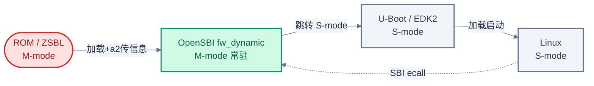
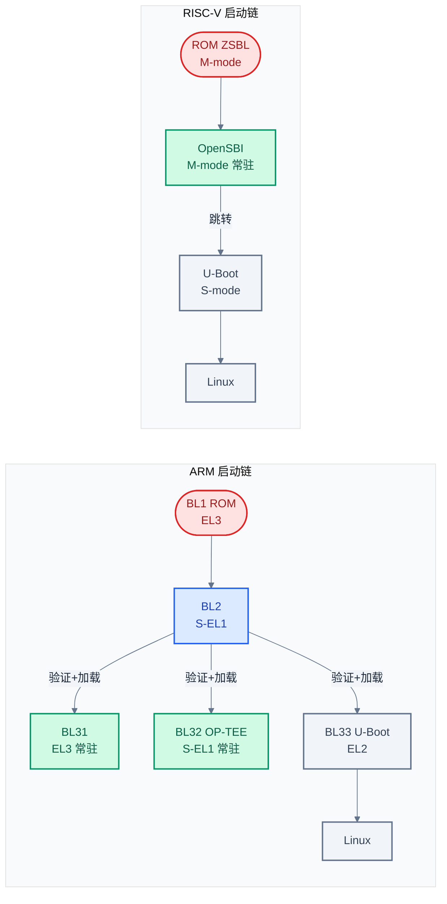

# OpenSBI:RISC-V 版的 TF-A

> 一句话概括:本文用 OpenSBI 回答"RISC-V 上对应 TF-A 的是什么",讲清它的固件类型、SBI 扩展、Domain 隔离,以及与 ARM TF-A 的能力边界差异。
> **工程师视角**:把 OpenSBI 理解为"TF-A 的运行时服务子集 + SBI 标准化接口"——它做了 BL31 的事(M-mode 常驻、ecall 调度、电源管理),但不做 BL1/BL2 的启动验证,也不提供 BL32 的 TEE OS。

### 关键术语

| 缩写 | 全称 | 含义 |
|------|------|------|
| OpenSBI | Open Source SBI | RISC-V 官方 M-mode 固件参考实现,对标 TF-A 的 EL3 角色 |
| SBI | Supervisor Binary Interface | RISC-V S-mode 与 M-mode 之间的调用接口,用 ecall 实现 |
| M-mode | Machine Mode | RISC-V 最高特权级,OpenSBI 运行于此 |
| S-mode | Supervisor Mode | RISC-V 次高特权级,Linux/U-Boot 运行于此 |
| HART | Hardware Thread | RISC-V 的硬件线程,近似 ARM 的 CPU core |
| EID | Extension ID | SBI 扩展标识符,区分不同服务组 |
| FID | Function ID | SBI 扩展内具体函数标识符 |
| HSM | Hart State Management | SBI 扩展(EID 0x48534D),管理 hart 启停,对标 PSCI |
| SRST | System Reset | SBI 扩展(EID 0x53525354),系统复位/关机 |
| PMP | Physical Memory Protection | RISC-V 物理内存保护,16-64 个可编程 region |
| ePMP | Enhanced PMP | PMP 增强,引入 Machine Security Mode |
| Domain | — | OpenSBI 的隔离分区,包含独立内存区域与 hart 集合 |
| PSCI | Power State Coordination Interface | ARM 电源管理接口,OpenSBI HSM 的对标对象 |
| ROT | Root of Trust | 信任根,不可变的硬件信任起点 |

---

### 前置阅读

- [01-三大主题总览](./01-trusted-firmware-overview.md) — 建立 TF-A/TEE/Secure Boot 三者关系
- [08-OP-TEE TA 开发实践](./08-optee-ta-development.md) — 理解 ARM 侧 TEE OS 的完整形态,便于对比 RISC-V 的缺口

---

## 1. OpenSBI 的定位:RISC-V 上的 M-mode 固件

> 上一章(08)讲了 OP-TEE TA 开发,展示了 ARM 上"BL31 调度 BL32"的完整 TEE 形态。一个自然的问题是:RISC-V 上对应 TF-A 的是什么?它有没有 EL3 那样的常驻运行时?本章用 OpenSBI 回答这个问题——先讲它的定位与 ARM 概念映射,再讲固件类型、SBI 扩展、Domain 隔离,最后点出它不做的部分。

### 1.1 本质:OpenSBI 在做什么

**场景**:RISC-V 系统上电后,ROM 把控制权交给 M-mode。此时 Linux 还在 S-mode 跑不了,但 S-mode 一旦跑起来,它会需要一些只有最高特权级才能做的事——读硬件计数器、设置下次时钟中断、唤醒其他 hart、刷新远程 TLB、系统关机复位。这些事如果让 Linux 直接操作 M-mode CSR,既破坏特权级隔离,也无法跨硬件平台移植。

OpenSBI 解决的就是这个问题:**常驻 M-mode,通过 SBI 标准化的 ecall 接口,向 S-mode 提供运行时服务**。它对应 ARM 上 BL31 的"Secure Monitor 运行时"角色——但注意,OpenSBI 不做 TrustZone 式的安全世界切换(因为 RISC-V 没有硬件二元世界)。

**适用范围**:任何运行 Linux/U-Boot 等 S-mode 软件的 RISC-V 系统。OpenSBI 是 RISC-V 官方([riscv-software-src](https://github.com/riscv-software-src/opensbi))维护的参考实现,QEMU、SiFive、Andes 等主流平台默认使用。

### 1.2 与 TF-A 的概念映射

| 对比维度 | ARM (TF-A) | RISC-V (OpenSBI) |
|----------|------------|------------------|
| **运行特权级** | EL3 | M-mode |
| **常驻角色** | BL31 Secure Monitor | M-mode 固件(常驻) |
| **调用接口** | SMC 指令(硬件异常) | ecall(SBI 软件约定) |
| **接口标准化** | PSCI / SMC Calling Convention | SBI Specification(EID/FID) |
| **电源管理** | PSCI(CPU on/off/suspend) | HSM 扩展(hart start/stop/suspend) |
| **系统复位** | PSCI SYSTEM_RESET | SRST 扩展(shutdown/reboot) |
| **隔离机制** | TrustZone 二元世界(NS bit) | PMP/ePMP 可编程多区 + Domain |
| **启动验证** | BL1/BL2 做 TBBR | **不做**(交给 S-mode bootloader) |
| **TEE OS** | BL32(OP-TEE 等) | **无**(Keystone/Penglai 研究级) |

> **如何读这张表**:逐行对比可见,OpenSBI 覆盖了 TF-A "运行时服务"那一半(电源、复位、ecall 调度),但缺失"启动验证"和"TEE OS"两块。这不是 OpenSBI 的设计缺陷,而是 RISC-V 安全生态的整体现状——详见 [10-riscv-secure-boot-and-tee.md](./10-riscv-secure-boot-and-tee.md)。

> **核心要点**:OpenSBI 与 TF-A 的对应关系是"运行时服务子集"——BL31 的 ecall 调度、PSCI 电源管理在 OpenSBI 中有完整对应(HSM/SRST),但 BL1/BL2 的 Secure Boot 和 BL32 的 TEE OS 在 OpenSBI 中不存在。

---

## 2. 三种固件类型:fw_dynamic / fw_jump / fw_payload

> 上一章建立了 OpenSBI 与 TF-A 的概念映射。接下来要问:OpenSBI 自身怎么被启动?它又怎么找到下一阶段(U-Boot/Linux)?本章先讲三种固件类型的本质差异,再深入主流的 fw_dynamic。

### 2.1 本质:固件类型解决"下一阶段从哪来"

OpenSBI 的三种固件类型,本质是回答同一个问题的三种方式:**下一阶段(bootloader 或 OS)的入口地址,OpenSBI 怎么获得?**

- **fw_jump**:编译时写死跳转地址。简单但不灵活,换 payload 要重编 OpenSBI。
- **fw_payload**:把下一阶段二进制内嵌进 OpenSBI 镜像。ROM 只需加载一个文件,但 payload 升级要重编 OpenSBI。
- **fw_dynamic**:运行时由前一阶段(ROM/LOADER)通过寄存器传入下一阶段信息。最灵活,是 QEMU、EDK2 等的主流选择。

**为什么 fw_dynamic 是主流?** 因为现代启动链中,ROM 或 SPL 通常已经具备加载多个二进制的能力(从 Flash、网络、SD 卡)。fw_dynamic 让 ROM 同时加载 OpenSBI 和 payload,再把 payload 地址通过 `a2` 寄存器告诉 OpenSBI——OpenSBI 不需要知道 payload 在哪,也不需要重新编译。这与 ARM 上 BL2 加载 BL31 后把 BL33 地址传给 BL31 的思路一致。

三种固件类型对比:

| 固件类型 | 下一阶段地址来源 | 是否内嵌 payload | 典型场景 | 对应 ARM 概念 |
|----------|------------------|:----------------:|----------|---------------|
| **fw_dynamic** | 运行时寄存器传入(`a2`) | 否 | QEMU、EDK2、通用平台 | BL31(地址由 BL2 传入) |
| **fw_jump** | 编译时固定地址 | 否 | 调试、简单平台 | 无直接对应(更像硬编码跳转) |
| **fw_payload** | 内嵌在镜像中 | 是 | ROM 能力弱、只加载一个文件 | BL31 + BL33 合并镜像 |

### 2.2 fw_dynamic 详解:动态信息传递

fw_dynamic 的核心是 `struct fw_dynamic_info`,前一阶段(ROM/SPL)通过 `a2` 寄存器传入它的地址。该结构定义在 [opensbi-src/include/sbi/fw_dynamic.h](./src/opensbi-src/include/sbi/fw_dynamic.h):

```c
/** Representation dynamic info passed by previous booting stage */
struct fw_dynamic_info {
    /** Info magic */
    unsigned long magic;
    /** Info version */
    unsigned long version;
    /** Next booting stage address */
    unsigned long next_addr;
    /** Next booting stage mode */
    unsigned long next_mode;
    /** Options for OpenSBI library */
    unsigned long options;
    /**
     * Preferred boot HART id
     *
     * It is possible that the previous booting stage uses same link
     * address as the FW_DYNAMIC firmware. In this case, the relocation
     * lottery mechanism can potentially overwrite the previous booting
     * stage while other HARTs are still running in the previous booting
     * stage leading to boot-time crash. To avoid this boot-time crash,
     * the previous booting stage can specify last HART that will jump
     * to the FW_DYNAMIC firmware as the preferred boot HART.
     */
    unsigned long boot_hart;
} __packed;
```

各字段含义:

- `magic`:固定值 `0x4942534f`(ASCII "OSBI"),用于校验传入信息有效
- `version`:信息版本(当前 v2),OpenSBI 据此判断哪些字段可用
- `next_addr`:下一阶段入口地址(如 U-Boot 加载地址)
- `next_mode`:下一阶段特权级,`0x0`=U-mode、`0x1`=S-mode、`0x3`=M-mode
- `options`:OpenSBI 运行时选项(如禁用启动打印)
- `boot_hart`:首选启动 hart id,解决重定位与前一阶段地址冲突问题

`boot_hart` 字段的注释解释了一个关键设计:当前一阶段与 OpenSBI 使用相同链接地址时,OpenSBI 的重定位"彩票机制"(relocation lottery,多 hart 抢占式重定位)可能覆盖仍在运行前一阶段的其他 hart。指定 `boot_hart` 让最后一个跳转的 hart 执行重定位,避免这个竞态。

OpenSBI 在汇编入口 `fw_save_info` 中把这些字段保存到全局变量,稍后 `fw_next_addr` / `fw_next_mode` 读取使用。以下是 [opensbi-src/firmware/fw_dynamic.S](./src/opensbi-src/firmware/fw_dynamic.S) 的核心逻辑(节选):

```asm
fw_save_info:
    /* Save next arg1 in 'a1' */
    lla    a4, _dynamic_next_arg1
    REG_S  a1, (a4)

    /* Save version == 0x1 fields */
    lla    a4, _dynamic_next_addr
    REG_L  a3, FW_DYNAMIC_INFO_NEXT_ADDR_OFFSET(a2)
    REG_S  a3, (a4)
    lla    a4, _dynamic_next_mode
    REG_L  a3, FW_DYNAMIC_INFO_NEXT_MODE_OFFSET(a2)
    REG_S  a3, (a4)
    /* ... options、boot_hart 同理 ... */
2:
    ret

fw_next_addr:
    lla    a0, _dynamic_next_addr
    REG_L  a0, (a0)
    ret
```

这段汇编做的是:入口阶段(只能用 `a0-a4` 寄存器)从 `a2` 指向的 `fw_dynamic_info` 结构中取出 `next_addr`、`next_mode` 等字段,存到数据段全局变量;后续 C 代码通过 `fw_next_addr()` 读取跳转目标。`a0`=hartid、`a1`=FDT 地址是 RISC-V 启动约定,`a2` 则是 fw_dynamic 专用的动态信息指针。

入口处还有 magic 校验,见 `fw_boot_hart`:

```asm
fw_boot_hart:
    li     a1, FW_DYNAMIC_INFO_MAGIC_VALUE
    REG_L  a0, FW_DYNAMIC_INFO_MAGIC_OFFSET(a2)
    bne    a0, a1, _start_hang     /* magic 不匹配则挂死 */
    li     a1, FW_DYNAMIC_INFO_VERSION_MAX
    REG_L  a0, FW_DYNAMIC_INFO_VERSION_OFFSET(a2)
    bgt    a0, a1, _start_hang     /* 版本超支持范围则挂死 */
    /* ... 读取 boot_hart ... */
```

这是 OpenSBI 的第一道防御:如果 `a2` 指向的数据 magic 不对或版本过高,直接挂死(`_start_hang`),避免用垃圾数据跳转。注意这不是安全机制(不验证签名),只是健壮性检查。

> **核心要点**:fw_dynamic 通过 `a2` 寄存器传入 `fw_dynamic_info` 结构,把"下一阶段在哪、以什么特权级跑"的决定权交给前一阶段——这是它能成为主流的原因:OpenSBI 与 payload 解耦,各自独立升级。

---

## 3. SBI 扩展:标准化的运行时服务

> 上一章讲了 OpenSBI 怎么被启动、怎么跳到下一阶段。跳转之后,OpenSBI 并不退出——它常驻 M-mode,等待 S-mode 通过 ecall 请求服务。本章讲它提供哪些服务,即 SBI 扩展。

### 3.1 本质:SBI ecall 约定

SBI 的调用约定很简单:S-mode 软件执行 `ecall` 指令触发异常,陷入 M-mode;OpenSBI 根据 `a7`(EID,扩展 ID)和 `a6`(FID,函数 ID)分发到对应处理函数,返回值放 `a0`。

这与 ARM 的 SMC 机制形似但实现不同:SMC 是硬件定义的同步异常,有专门的异常向量;ecall 是 RISC-V 通用环境调用,OpenSBI 在 trap 处理中识别"这是 SBI 调用"再分发。结果是 SBI 完全由软件约定(规范)定义,不绑定具体指令语义,扩展性更强——加新服务只需定义新 EID。

### 3.2 SBI 扩展总览

OpenSBI 实现的 SBI 扩展(源码定义见 [opensbi-src/include/sbi/sbi_ecall_interface.h](./src/opensbi-src/include/sbi/sbi_ecall_interface.h)):

| 扩展 | EID | 核心函数(FID) | 作用 | ARM 对标 |
|------|:----|----------------|------|----------|
| **Base** | `0x10` | get_spec_version / probe_ext / get_mvendorid | SBI 版本协商、扩展探测、厂商信息 | SMC Calling Convention 版本查询 |
| **Timer** | `0x54494D45` | set_timer | 设置下次时钟中断 | 通用定时器(GT) |
| **IPI** | `0x735049` | send_ipi | 向指定 hart 发核间中断 | GIC SGIs |
| **RFence** | `0x52464E43` | fence_i / sfence_vma / hfence_gvma 等 | 远程 TLB/指令缓存刷新 | TLB 广播维护 |
| **HSM** | `0x48534D` | hart_start / stop / get_status / suspend | hart 启停与状态管理 | **PSCI**(CPU on/off/suspend) |
| **SRST** | `0x53525354` | reset | 系统关机/冷复位/热复位 | PSCI SYSTEM_RESET |
| **PMU** | `0x504D55` | num_counters / cfg_match / start / stop / read | 性能计数器管理 | PMU/PMUv3 |
| **SUSP** | `0x53555350` | suspend | 系统级挂起(低功耗) | PSCI SYSTEM_SUSPEND |
| **DBCN** | `0x4442434E` | write / read / write_byte | 调试控制台(早期打印) | 无直接对应(调试用) |

> **如何读这张表**:EID 一列有两类值——小的数值(`0x10` 等)是早期/基础扩展;大的数值(如 `0x54494D45` = ASCII "TIME")是 SBI v0.2+ 引入的,用 ASCII 码避免冲突。每个扩展内用 FID 区分具体函数。HSM 和 SRST 是与 ARM PSCI 对标最直接的两个。

### 3.3 HSM 详解:对标 PSCI 的 hart 状态管理

HSM(Hart State Management)是 OpenSBI 中与 ARM PSCI 对应最紧密的扩展。它定义了 hart 的状态机和四个函数:

| FID | 函数 | 作用 | PSCI 对应 |
|:----|------|------|-----------|
| `0x0` | hart_start | 唤醒指定 hart,从给定地址开始执行 | CPU_ON |
| `0x1` | hart_stop | 当前 hart 停止运行,进入 STOPPED 状态 | CPU_OFF |
| `0x2` | hart_get_status | 查询指定 hart 状态 | 无直接对应(内部用) |
| `0x3` | hart_suspend | 当前 hart 挂起(保留/不保留状态) | CPU_SUSPEND |

HSM 定义了 hart 的状态机(`sbi_ecall_interface.h`):

- `STARTED`(0x0):正常运行
- `STOPPED`(0x1):已停止,可被 hart_start 唤醒
- `START_PENDING`(0x2)/`STOP_PENDING`(0x3):状态转换中
- `SUSPENDED`(0x4)/`SUSPEND_PENDING`(0x5)/`RESUME_PENDING`(0x6):挂起相关

处理函数实现见 [opensbi-src/lib/sbi/sbi_ecall_hsm.c](./src/opensbi-src/lib/sbi/sbi_ecall_hsm.c):

```c
static int sbi_ecall_hsm_handler(unsigned long extid, unsigned long funcid,
                                 struct sbi_trap_regs *regs,
                                 struct sbi_ecall_return *out)
{
    int ret = 0;
    struct sbi_scratch *scratch = sbi_scratch_thishart_ptr();
    ulong smode = (csr_read(CSR_MSTATUS) & MSTATUS_MPP) >>
                    MSTATUS_MPP_SHIFT;

    switch (funcid) {
    case SBI_EXT_HSM_HART_START:
        ret = sbi_hsm_hart_start(scratch, sbi_domain_thishart_ptr(),
                                 regs->a0, regs->a1, smode, regs->a2);
        break;
    case SBI_EXT_HSM_HART_STOP:
        ret = sbi_hsm_hart_stop(scratch, true);
        break;
    case SBI_EXT_HSM_HART_GET_STATUS:
        ret = sbi_hsm_hart_get_state(sbi_domain_thishart_ptr(), regs->a0);
        break;
    case SBI_EXT_HSM_HART_SUSPEND:
        ret = sbi_hsm_hart_suspend(scratch, regs->a0, regs->a1,
                                   smode, regs->a2);
        break;
    default:
        ret = SBI_ENOTSUPP;
    }
    /* ... */
}
```

这段代码展示了 SBI ecall 的标准处理模式:`funcid`(来自 `a6`)switch 分发,参数从 `regs->a0/a1/a2`(即调用时的寄存器)取。注意 `hart_start` 的参数 `regs->a0`=目标 hart id、`regs->a1`=启动地址、`regs->a2`=启动参数(a1 传给新 hart)——与 PSCI `CPU_ON(cpu_id, entry_point, context_id)` 几乎一一对应。

**为什么 HSM 要传 `smode`?** 因为 hart 被唤醒后要以什么特权级跑,需要由 M-mode 决定(不能让 S-mode 自己指定更高特权)。`smode` 从 `mstatus.MPP`(Previous Privilege)读出,确保唤醒后的 hart 落在 S-mode。

> **核心要点**:HSM 是 OpenSBI 对 PSCI 的完整对应——hart_start/stop/suspend/get_status 四个函数覆盖了 PSCI CPU_ON/OFF/SUSPEND 的核心能力。SBI 扩展体系通过 EID/FID 两级编号实现标准化服务发现与调用,比 ARM 的 SMC 调度更软件化。

---

## 4. Domain 隔离机制:可编程多区

> 上一章讲了 OpenSBI 的运行时服务。但 OpenSBI 还有一项 ARM TF-A 没有的能力——Domain 隔离。它不是 TrustZone 的二元世界,而是可编程的"多区"隔离。本章讲它的本质与实现。

### 4.1 本质:Domain 是什么

**场景**:一个多核 RISC-V SoC 上,你想让 hart0-hart3 跑 Linux(访问全部 RAM 和外设),hart4-hart7 跑一个实时内核(只能访问自己的私有 RAM 和特定外设)。ARM 上这种隔离需要 TrustZone + 安全世界,或 hypervisor;RISC-V 上 OpenSBI 的 Domain 机制可以直接做到——每个 Domain 拥有独立的内存区域集合和 hart 集合,Domain 间默认互不可见。

Domain 的本质是:**OpenSBI 在 M-mode 用 PMP 把硬件划分成多个隔离分区,每个分区分配一组 hart 和一组内存区域(含 MMIO),分区内跑各自的 S-mode 软件**。这比 TrustZone 的"安全/非安全"二元模型灵活——可以划任意多个 Domain。

**适用范围**:OpenSBI Domain 是"轻量隔离",不是完整 TEE。它没有 TA/CA 框架、没有 GP API、没有安全存储,只是内存与 hart 的访问控制。它适合多 OS 隔离、安全监控等场景,但不适合做密钥保护型 TEE(那需要 Keystone/Penglai,见 [10-riscv-secure-boot-and-tee.md](./10-riscv-secure-boot-and-tee.md))。

### 4.2 Domain 数据结构

Domain 的核心是两个结构体,定义在 [opensbi-src/include/sbi/sbi_domain.h](./src/opensbi-src/include/sbi/sbi_domain.h)。内存区域:

```c
/** Representation of OpenSBI domain memory region */
struct sbi_domain_memregion {
    /** Size of memory region as power of 2 (min 3, max __riscv_xlen) */
    unsigned long order;
    /** Base address, must be 2^order aligned */
    unsigned long base;
    /** Flags representing memory region attributes */
#define SBI_DOMAIN_MEMREGION_M_READABLE      (1UL << 0)
#define SBI_DOMAIN_MEMREGION_M_WRITABLE      (1UL << 1)
#define SBI_DOMAIN_MEMREGION_M_EXECUTABLE    (1UL << 2)
#define SBI_DOMAIN_MEMREGION_SU_READABLE     (1UL << 3)
#define SBI_DOMAIN_MEMREGION_SU_WRITABLE     (1UL << 4)
#define SBI_DOMAIN_MEMREGION_SU_EXECUTABLE   (1UL << 5)
#define SBI_DOMAIN_MEMREGION_ENF_PERMISSIONS (1UL << 6)
#define SBI_DOMAIN_MEMREGION_MMIO            (1UL << 31)
#define SBI_DOMAIN_MEMREGION_FW              (1UL << 30)
    unsigned long flags;
};
```

`order` 是 2 的幂次(如 `order=30` 表示 1 GiB),`base` 必须按 `2^order` 对齐——这是为了匹配 PMP 的粒度要求(PMP region 必须是 2 的幂且对齐)。`flags` 区分 M-mode/S-mode(U)的读/写/执行权限,`MMIO` 标记设备寄存器区,`FW` 标记固件自身区域。

Domain 实例:

```c
/** Representation of OpenSBI domain */
struct sbi_domain {
    struct sbi_dlist node;              /* 链表节点 */
    u32 index;                          /* 逻辑索引 */
    struct sbi_hartmask assigned_harts; /* 已分配的 hart */
    spinlock_t assigned_harts_lock;
    char name[64];                      /* Domain 名 */
    const struct sbi_hartmask *possible_harts; /* 可选 hart */
    struct sbi_domain_memregion *regions; /* 内存区域数组(order=0 结尾) */
    u32 boot_hartid;                    /* 启动该 Domain 的 hart */
    unsigned long next_arg1;            /* 下一阶段 a1(通常是 FDT) */
    unsigned long next_addr;            /* 下一阶段入口地址 */
    unsigned long next_mode;            /* 下一阶段特权级 */
    bool system_reset_allowed;          /* 是否允许复位系统 */
    bool system_suspend_allowed;        /* 是否允许挂起系统 */
    bool fw_region_inited;
};
```

每个 Domain 绑定一组 `assigned_harts`(hart 集合)和一组 `regions`(内存区域集合),还有自己的下一阶段入口。这意味着不同 Domain 可以跳到不同的 S-mode 软件——这正是多 OS 隔离的基础。

### 4.3 与 TrustZone 二元世界的差异

| 对比维度 | ARM TrustZone | OpenSBI Domain |
|----------|---------------|----------------|
| **分区数量** | 2 个(安全/非安全) | 任意多个(受 PMP region 数限制) |
| **隔离粒度** | 总线级 NS bit,全系统感知 | PMP 寄存器,M-mode 检查 |
| **权限模型** | 安全/非安全二元 | 每 region 独立配 M/S/U 的 R/W/X |
| **硬件依赖** | TZPC/TZASC + AXI NS bit | PMP(16-64 region)、ePMP、IOPMP |
| **动态性** | 固定(硬件划分) | 运行时可编程(软件配置) |
| **TA 框架** | 有(OP-TEE + GP API) | 无(仅内存/hart 隔离) |

**为什么 Domain 能划多个而 TrustZone 只有两个?** TrustZone 的隔离信号是总线上的一个 NS bit——每个事务要么安全要么非安全,硬件只能区分两种。PMP 则是 M-mode 软件配置的一组寄存器,每个 region 独立设置地址范围和权限,理论上 PMP 有 16-64 个 region 就能划十几个隔离区。代价是:PMP 只在 M-mode 检查,S-mode 软件如果直接访问物理地址(无 MMU 时)才受约束;且 PMP 是 per-hart 的,跨 hart 一致性需 OpenSBI 维护。

### 4.4 Domain 初始化约束

OpenSBI 在 `sbi_domain_finalize` 中对每个 Domain 做严格校验,见 [opensbi-src/lib/sbi/sbi_domain.c](./src/opensbi-src/lib/sbi/sbi_domain.c):

```c
/*
 * Check next mode
 *
 * We only allow next mode to be S-mode or U-mode, so that we can
 * protect M-mode context and enforce checks on memory accesses.
 */
if (dom->next_mode != PRV_S &&
    dom->next_mode != PRV_U) {
    sbi_printf("%s: %s invalid next booting stage mode 0x%lx\n",
               __func__, dom->name, dom->next_mode);
    return SBI_EINVAL;
}

/* Check next address and next mode */
if (!sbi_domain_check_addr(dom, dom->next_addr, dom->next_mode,
                           SBI_DOMAIN_EXECUTE)) {
    sbi_printf("%s: %s next booting stage address 0x%lx can't "
               "execute\n", __func__, dom->name, dom->next_addr);
    return SBI_EINVAL;
}
```

**为什么只允许下一阶段是 S-mode 或 U-mode?** 注释说得很清楚:为了保证 OpenSBI(M-mode)能保护自身上下文并对内存访问强制检查。如果允许下一阶段以 M-mode 运行,那个阶段就能直接改 PMP、读 OpenSBI 内存,隔离形同虚设。这是 Domain 隔离可信的根基——M-mode 是不可让渡的。

启动时 `sbi_domain_startup` 会遍历所有 Domain,为每个 Domain 的 boot hart 设置 `next_addr`/`next_mode`/`next_arg1`,然后通过 HSM 唤醒非冷启动 hart:

```c
/* Startup boot HART of domains */
sbi_domain_for_each(dom) {
    /* ... 校验 boot hart 是否属于该 Domain ... */
    if (dom->boot_hartid == cold_hartid) {
        scratch->next_addr = dom->next_addr;
        scratch->next_mode = dom->next_mode;
        scratch->next_arg1 = dom->next_arg1;
    } else {
        rc = sbi_hsm_hart_start(scratch, NULL,
                                dom->boot_hartid,
                                dom->next_addr,
                                dom->next_mode,
                                dom->next_arg1);
        /* ... */
    }
}
```

冷启动 hart(执行 OpenSBI 主流程的那个)直接把 Domain 的入口写入自己的 scratch;其他 Domain 的 boot hart 则通过 `sbi_hsm_hart_start` 远程唤醒——这把 Domain 机制与 HSM 扩展串联起来。

> **核心要点**:OpenSBI Domain 用 PMP 的可编程多区实现了比 TrustZone 二元世界更灵活的隔离——任意多个分区,每区独立 hart 与内存区域。但它只是"轻量隔离",没有 TA 框架和 GP API,不是完整 TEE。其可信根基在于 M-mode 不可让渡(`next_mode` 只能是 S/U)。

---

## 5. 启动流程:从 ROM 到 Linux

> 上一章讲了 Domain 隔离机制。本章把视角拉回启动链,对比 ARM 与 RISC-V 从上电到 Linux 的完整流程,看清 OpenSBI 在其中的位置。

### 5.1 RISC-V 启动链



> **如何读这张图**:横向是时间线。红色 ROM 是不可变起点;绿色 OpenSBI 是常驻运行时(跳转后不退出,持续响应 ecall);灰色是普通世界软件。虚线表示 Linux 运行时通过 ecall 回调 OpenSBI——这是"常驻"的意义。

启动流程编号步骤(以 fw_dynamic 为例):

1. 上电,ROM(ZSBL,Zeroth-stage Bootloader)在 M-mode 执行
2. ROM 加载 OpenSBI 的 fw_dynamic 镜像到内存,加载 U-Boot/EDK2 到另一地址
3. ROM 设置 `a0`=boot hartid、`a1`=FDT 地址、`a2`=`fw_dynamic_info` 结构地址(含 U-Boot 入口)
4. ROM 跳转到 OpenSBI 入口(`_start`)
5. OpenSBI 入口校验 magic,执行重定位(relocation lottery)
6. OpenSBI 冷启动 hart 执行 C 初始化:平台早期初始化、Domain 初始化、PMP 配置、SBI 扩展注册
7. OpenSBI 通过 `fw_next_addr()` 读取下一阶段地址,跳转到 U-Boot/EDK2(S-mode)
8. U-Boot 加载 Linux 内核并跳转
9. Linux 运行,需要时钟/IPI/hart 管理时通过 `ecall` 陷入 OpenSBI 处理

### 5.2 与 ARM 启动链对比



> **如何读这张图**:两条启动链并排对比。ARM 链有 5 个阶段(BL1→BL2→BL31/BL32/BL33),其中 BL2 做验证、BL31+BL32 常驻;RISC-V 链只有 3 个阶段(ROM→OpenSBI→U-Boot),OpenSBI 一个角色承担了 BL31 的常驻职责,但没有 BL2 的验证阶段,也没有 BL32 的 TEE OS。

核心差异:

| 对比维度 | ARM 启动链 | RISC-V 启动链 |
|----------|-----------|---------------|
| **阶段数** | 5(BL1-BL33) | 3(ROM-OpenSBI-Loader) |
| **验证阶段** | BL2 专责 TBBR 验证 | 无(OpenSBI 不验证) |
| **常驻运行时** | BL31 + BL32 | OpenSBI(仅一个) |
| **TEE OS** | BL32(OP-TEE) | 无 |
| **下一阶段信息传递** | BL2 加载到 FIP,传地址给 BL31 | fw_dynamic 用 `a2` 寄存器传结构 |
| **启动规范** | TBBR(ARM DEN0006) | 无统一规范 |

**为什么 RISC-V 没有 BL2 对应物?** ARM 的 BL2 专责验证和加载,是因为 TBBR 规范要求每环验证下一环签名。RISC-V 没有等价的统一启动规范,验证职责被推给 S-mode bootloader(如 U-Boot verified boot)——但 U-Boot 自己在被加载时并没有被验证(除非 ROM 实现)。这是 RISC-V 安全启动的核心缺口。

> **核心要点**:RISC-V 启动链比 ARM 简洁——ROM→OpenSBI→U-Boot→Linux 四级,OpenSBI 用 fw_dynamic 的 `a2` 寄存器接收下一阶段信息,对应 ARM 的"BL2 传地址给 BL31"。但没有 BL2 的验证阶段和 BL32 的 TEE OS,这是结构性的两块缺口。

---

## 6. OpenSBI 不做的事:边界与缺口

> 前几章讲了 OpenSBI 做了什么。要准确理解它的定位,同样重要的是讲清它不做什么——这决定了 RISC-V 安全生态还需要补什么。

### 6.1 不做完整 Secure Boot

OpenSBI 的 fw_dynamic 入口只校验 `fw_dynamic_info` 的 magic 和版本(健壮性检查),**不验证下一阶段(U-Boot/Linux)的签名**。也就是说,如果攻击者替换了 U-Boot 镜像,OpenSBI 会照常跳转过去。

**为什么 OpenSBI 不做?** 因为 Secure Boot 的信任根必须在不可变的 ROM 中。OpenSBI 本身是从 Flash 加载的可变固件,它自己都需要被验证,没有资格做验证者。ARM 的 BL1 是真 ROM,BL2 也有 BL1 验证;RISC-V 的 ROM(ZSBL)通常是厂商私有的,OpenSBI 作为开源固件无法假定 ROM 会做什么验证。

因此 RISC-V 的 Secure Boot 实践依赖两条路径:ROM 厂商私有验证链,或 U-Boot verified boot(验证 Linux 内核,但 U-Boot 自身不被验证)。详见 [10-riscv-secure-boot-and-tee.md](./10-riscv-secure-boot-and-tee.md)。

### 6.2 不做 TEE OS

OpenSBI 的 Domain 机制提供了内存/hart 隔离,但它**不提供 TEE OS**——没有 TA/CA 框架、没有 GP API、没有安全存储、没有 TA 调度。Domain 适合多 OS 隔离,但不适合"主 OS 受攻破时保护密钥"这种 TEE 场景。

**为什么 OpenSBI 不做?** TEE OS 需要一套完整的运行时(TA 加载、通信、存储、密码学),且强依赖安全硬件隔离(TrustZone 式二元世界)。RISC-V 的 PMP 是可编程多区,没有天然的"安全世界",做 TEE 需要额外的硬件扩展(如 SiFive WorldGuard)或软件框架(Keystone/Penglai)。OpenSBI 的定位是 M-mode 固件,不是 TEE OS——这层留给专门的 TEE 项目。

### 6.3 能力边界总结

| 能力 | TF-A (ARM) | OpenSBI (RISC-V) | 缺口归谁 |
|------|:----------:|:----------------:|----------|
| M-mode/EL3 常驻运行时 | ✅ BL31 | ✅ OpenSBI | — |
| 标准化调用接口 | ✅ SMC + PSCI | ✅ SBI ecall | — |
| 电源管理 | ✅ PSCI | ✅ HSM/SRST | — |
| 内存/hart 隔离 | ✅ TrustZone | ✅ Domain + PMP | — |
| 启动验证(Secure Boot) | ✅ BL1/BL2 TBBR | ❌ 不做 | ROM 厂商 / U-Boot |
| TEE OS | ✅ BL32 OP-TEE | ❌ 不做 | Keystone / Penglai |
| TA 框架 + GP API | ✅ OP-TEE | ❌ 不做 | TEE OS 项目 |

> **核心要点**:OpenSBI = TF-A 的"运行时服务"子集 + SBI 标准化接口,但 TEE OS 层缺失。它做了 BL31 的事(常驻、ecall、电源、隔离),但不做 BL1/BL2 的启动验证,也不做 BL32 的 TEE OS。这两块缺口分别由 U-Boot verified boot 和 Keystone/Penglai 等项目填补——但都还未达到 ARM 的生产级成熟度。

---

## 参考资料

- [OpenSBI Documentation](https://github.com/riscv-software-src/opensbi/blob/master/docs/) — OpenSBI 官方文档(本地 [src/opensbi-src/docs/](./src/opensbi-src/docs/))
- [RISC-V SBI Specification](https://github.com/riscv-non-isa/riscv-sbi-doc) — SBI 扩展规范(EID/FID 定义)
- [RISC-V Privileged ISA Spec](https://riscv.org/technical/specifications/) — PMP、M/S/U 特权级规范
- [OpenSBI Domain Support](https://github.com/riscv-software-src/opensbi/blob/master/docs/domain_support.md) — Domain 隔离机制文档
- [TF-A Documentation](https://trustedfirmware-a.readthedocs.io/) — 对比参考:TF-A BL31 实现

---

**下一篇**: [10-riscv-secure-boot-and-tee.md](./10-riscv-secure-boot-and-tee.md) — RISC-V 安全启动与 TEE 生态
