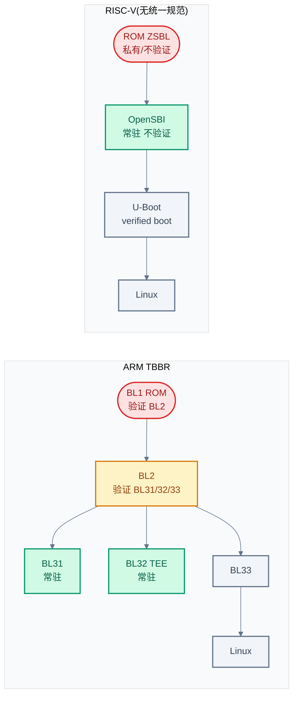
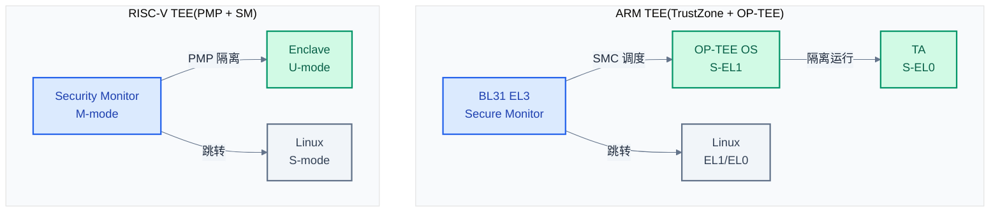

# RISC-V 安全启动与 TEE 生态

> 一句话概括:本文回答 RISC-V 的 Secure Boot 和 TEE 现状如何——从启动链、PMP/ePMP/WorldGuard 硬件机制,到 U-Boot verified boot 实践与 Keystone/Penglai 等 TEE 方案,系统对比与 ARM 的差距。
> **工程师视角**:RISC-V 安全生态目前处于"研究活跃、生产空白"阶段——硬件机制(PMP)灵活但碎片化,软件方案(Keystone/Penglai)仍属研究级,工程实践依赖 U-Boot verified boot 和厂商私有方案。

### 关键术语

| 缩写 | 全称 | 含义 |
|------|------|------|
| PMP | Physical Memory Protection | RISC-V 物理内存保护,16-64 个可编程 region |
| ePMP | Enhanced PMP | PMP 增强(Smepmp 扩展),引入 Machine Security Mode |
| WorldGuard | — | SiFive 的硬件级安全分区机制,接近 TrustZone |
| IOPMP | I/O PMP | 针对 DMA/外设的 PMP,保护非 CPU 访问 |
| LPMP | Large PMP | 扩展 PMP region 数量的方案,突破 64 个限制 |
| ZSBL | Zeroth-stage Bootloader | RISC-V ROM 启动代码,对应 ARM BL1 |
| FIT | Flattened Image Tree | U-Boot 的镜像格式,支持签名节点 |
| Verified Boot | — | U-Boot 对 FIT 镜像做 RSA 签名验证的机制 |
| TEE | Trusted Execution Environment | 可信执行环境,与主 OS 隔离 |
| TA | Trusted Application | 运行在 TEE 中的可信应用 |
| GP | GlobalPlatform | TEE 标准化组织,定义 Client/Internal API |
| Enclave | — | 隔离执行实例(Keystone/Penglai 术语) |
| SM | Security Monitor | Keystone/Penglai 中 M-mode 的安全监控器 |
| TBBR | Trusted Board Boot Requirements | ARM 启动链信任传递规范 |
| ROTPK | Root of Trust Public Key | 信任根公钥,固化在芯片中 |

---

### 前置阅读

- [09-OpenSBI:RISC-V 版的 TF-A](./09-opensbi-riscv-counterpart.md) — OpenSBI 定位与能力边界,本文的对照基础
- [02-Secure Boot 概念基础](./02-secure-boot-concepts.md) — 信任根、信任链、度量 vs 验证启动
- [06-TEE 概念与 TrustZone 硬件](./06-tee-concepts-and-trustzone.md) — ARM TEE 基线

---

## 1. RISC-V 启动链全景

> 上一章(09)讲了 OpenSBI 的固件类型、SBI 扩展和 Domain 隔离,并指出它在 Secure Boot 和 TEE 两块有缺口。本章把启动链作为切入点,对比 RISC-V 与 ARM TBBR,看清缺口具体在哪。

### 1.1 本质:RISC-V 启动链在做什么

RISC-V 的启动链与 ARM 概念对应,但实现更扁平:**ROM(ZSBL)→ OpenSBI(M-mode)→ U-Boot/EDK2(S-mode)→ Linux(S-mode)**。整个过程的核心问题是:每一环怎么验证下一环?在 ARM 上,TBBR 规范明确规定了 BL1 验证 BL2、BL2 验证 BL31/BL32/BL33 的信任链;在 RISC-V 上,这件事没有统一规范。

**适用范围**:本文描述的是通用 RISC-V 启动链。具体厂商(SiFive、Andes、阿里平头哥)的 SoC 可能在 ROM 中加入私有验证逻辑,但那是厂商实现,不是 RISC-V 规范的一部分。

### 1.2 与 ARM TBBR 启动链对比



> **如何读这张图**:ARM 链用黄色标出 BL1/BL2 两个验证环节,信任从 ROM 逐级传递;RISC-V 链中 OpenSBI 不验证下一阶段(无黄色),验证只发生在 U-Boot verified boot 这一步——而且 U-Boot 自身是否被验证,取决于厂商 ROM 是否实现了验证逻辑。

详细对比:

| 对比维度 | ARM TBBR | RISC-V 启动链 |
|----------|----------|---------------|
| **统一规范** | 有(ARM DEN0006) | 无 |
| **信任根** | ROTPK 固化在 fuse/ROM | 厂商私有(若有) |
| **验证阶段** | BL1(ROM)+ BL2 | 取决于 ROM 实现 |
| **OpenSBI/BL31 是否验证下一阶段** | BL31 不验证(由 BL2 完成) | OpenSBI 不验证 |
| **bootloader 验证 OS** | 可选(BL33 验证内核) | U-Boot verified boot(主流) |
| **镜像格式** | FIP | FIT |
| **反回滚** | TBBR 规定(用 fuse 计数) | 无统一方案 |

**为什么 RISC-V 没有 TBBR 级规范?** TBBR 是 ARM 生态(芯片厂、ARM、固件社区)协同制定的统一规范,绑定 ARM 的 BL1-BL33 阶段模型。RISC-V 是开放的 ISA,芯片厂商众多且 ROM 实现各异,缺乏一个有足够话语权的组织强制统一启动规范。RISC-V 项目组的启动规范仍在演进中,目前主要靠 U-Boot verified boot 这一事实标准。

> **核心要点**:RISC-V 启动链与 ARM 的核心差距不在"有没有 OpenSBI",而在"有没有统一验证规范"——ARM 有 TBBR 定义 BL1→BL2→BL31 的逐级验证,RISC-V 的验证要么靠厂商私有 ROM,要么靠 U-Boot verified boot(且 U-Boot 自身未必被验证)。

---

## 2. RISC-V 安全硬件机制

> 上一章指出 RISC-V 启动链缺统一验证规范。但安全不只靠启动验证,还靠运行时隔离的硬件基础。本章讲 RISC-V 的隔离硬件:PMP、ePMP、WorldGuard,它们是 TEE 得以实现的前提。

### 2.1 本质:PMP 在做什么

**场景**:RISC-V 的 M-mode 软件需要限制 S-mode 和 U-mode 能访问哪些物理内存。比如 OpenSBI 自己的代码区不能让 Linux 读写,Linux 的内核区不能让用户态进程直接访问(无 MMU 时)。ARM 用 TrustZone 的 NS bit 做二元区分;RISC-V 用 PMP 做细粒度的多区控制。

PMP 的本质是:**一组 M-mode 配置的寄存器(PMPADDR0-63 + PMPCFG0-15),每个 region 独立设置地址范围和 M/S/U 的 R/W/X 权限,硬件在每次内存访问时检查**。它不区分"安全/非安全",只区分"这个地址在哪个 region、当前特权级有没有权限"。

**适用范围**:PMP 检查对 M-mode 默认不生效(M-mode 可绕过),除非启用 ePMP 的 Machine Security Mode。这意味着 PMP 主要用来约束 S-mode/U-mode,保护 M-mode 自身——这正是 OpenSBI Domain 隔离的硬件基础。

### 2.2 PMP 详解

RISC-V 特权规范定义 PMP 的 region 数量是可配置的(16/64 等),OpenSBI 默认按最大 64 个 region 处理,见 [opensbi-src/include/sbi/riscv_encoding.h](./src/opensbi-src/include/sbi/riscv_encoding.h):

```c
#define PMP_SHIFT            2
#define PMP_COUNT            64
```

PMP region 的地址必须是 2 的幂次对齐,大小也是 2 的幂(最小 4 字节,即 `2^(PMP_SHIFT+2)` 的粒度)。每个 region 的配置字节(PMPCFG)包含:

| 字段 | 位 | 含义 |
|------|:--:|------|
| **R** | 0 | Read 允许 |
| **W** | 1 | Write 允许 |
| **X** | 2 | Execute 允许 |
| **A** | 3-4 | 地址模式(OFF/TOR/NA4/NAPOT) |
| **L** | 7 | Locked(锁定,且 M-mode 也受约束) |

**为什么有 `L`(Locked)位?** 这是 PMP 唯一能约束 M-mode 的机制。`L=0` 时,region 只约束 S/U-mode,M-mode 可任意访问;`L=1` 时,region 同时约束 M-mode,且该 region 的配置被锁定(M-mode 也不能再改)。这使得 PMP 可以实现"自我束缚"——M-mode 配好 region 后置 `L=1`,即使 M-mode 被攻破也无法改回。这是 Keystone/Penglai 等 TEE 方案能用 PMP 做隔离的关键。

OpenSBI 通过 CSR 操作配置 PMP,见 [opensbi-src/lib/sbi/sbi_hart_pmp.c](./src/opensbi-src/lib/sbi/sbi_hart_pmp.c):

```c
static int hart_pmp_write(pmp_t *pmp, unsigned int n)
{
    int pmpcfg_csr, pmpcfg_shift, pmpaddr_csr;
    unsigned long cfgmask, pmpcfg;

    if (n >= PMP_COUNT)
        return SBI_EINVAL;

#if __riscv_xlen == 32
    pmpcfg_csr   = CSR_PMPCFG0 + (n >> 2);
    pmpcfg_shift = (n & 3) << 3;
#elif __riscv_xlen == 64
    pmpcfg_csr   = (CSR_PMPCFG0 + (n >> 2)) & ~1;
    pmpcfg_shift = (n & 7) << 3;
#endif
    pmpaddr_csr = CSR_PMPADDR0 + n;

    /* write csrs */
    csr_write_num(pmpaddr_csr, pmp->addr);
    cfgmask = ~(0xffUL << pmpcfg_shift);
    /* ... 写 pmpcfg ... */
}
```

这段代码展示 PMP 的 CSR 布局:`pmpcfg_csr` 是配置寄存器(每 4/8 个 region 共用一个 CSR,取决于 XLEN),`pmpaddr_csr` 是地址寄存器(每个 region 独立一个)。OpenSBI 把 Domain 的 `memregion` 转换成 PMP 的 `pmpaddr`/`pmpcfg` 写入 CSR,硬件据此检查。

### 2.3 ePMP:增强的 PMP

ePMP(Enhanced PMP,由 `Smepmp` 扩展定义)在标准 PMP 基础上引入了 **Machine Security Mode(MML、MMWP)** 两个关键机制:

| 机制 | 含义 | 解决的问题 |
|------|------|-----------|
| **MML**(Machine Mode Lock) | 配置位的语义重定义:M-mode 的 R/W/X 变为"共享权限"语义 | 允许 M-mode 与 S-mode 共享 region,而不只是约束 S-mode |
| **MMWP**(Machine Mode Whitelist Policy) | M-mode 也必须遵守 PMP(白名单模式) | 默认 M-mode 绕过 PMP,MMWP 让 M-mode 受约束 |

**为什么需要 ePMP?** 标准 PMP 的 M-mode 默认绕过是 TEE 的致命弱点——如果攻击者攻陷 M-mode(OpenSBI),PMP 约束形同虚设。ePMP 的 MMWP 让 M-mode 也受 PMP 约束,配合 `L` 锁定位,可以实现更强的隔离:即使 OpenSBI 被攻破,攻击者也无法直接读取已锁定的 enclave 内存。这是 Penglai 等方案依赖 ePMP 的原因。

### 2.4 安全硬件机制对比

| 机制 | 来源 | 隔离模型 | 成熟度 | 对标 ARM |
|------|------|----------|:------:|----------|
| **PMP** | RISC-V 规范 | 可编程多区(16-64 region) | 规范成熟 | MMU 页保护(粒度更细) |
| **ePMP**(Smepmp) | RISC-V 扩展 | PMP + M-mode 约束 | 演进中 | — |
| **IOPMP** | RISC-V 规范(草案) | 外设 DMA 访问控制 | 草案阶段 | SMMU / TZASC |
| **WorldGuard** | SiFive 私有 | 硬件级安全分区(接近二元) | 厂商私有 | TrustZone NS bit |
| **Imsc/M-mode 加密扩展** | RISC-V 规范 | 加密指令加速 | 演进中 | ARMv8 加密扩展 |

**为什么 WorldGuard 更接近 TrustZone?** WorldGuard 是 SiFive 的硬件机制,给每个总线事务打一个"世界 ID"标签,硬件根据标签过滤访问——这与 ARM TrustZone 的 NS bit 在总线级隔离上思路一致。但 WorldGuard 是 SiFive 私有的,非 RISC-V 标准,其他厂商(Andes、平头哥)的 SoC 不一定有。这正是 RISC-V 安全硬件"碎片化"的体现。

> **核心要点**:RISC-V 的隔离硬件以 PMP 为核心——可编程多区,比 TrustZone 二元世界更灵活,但默认不约束 M-mode(需 ePMP 的 MMWP)。WorldGuard 提供了接近 TrustZone 的硬件级分区,但是厂商私有。硬件机制的碎片化是 RISC-V TEE 生态不统一的根源。

---

## 3. RISC-V Secure Boot 实践

> 上一章讲了隔离硬件。本章回到启动时验证,看 RISC-V 上 Secure Boot 的实际做法——主要是 U-Boot verified boot,以及 OpenSBI 度量启动的有限支持。

### 3.1 本质:U-Boot verified boot 在做什么

**场景**:RISC-V 系统上,U-Boot(S-mode)要加载 Linux 内核。如果攻击者替换了内核镜像,U-Boot 怎么发现?U-Boot verified boot 的做法是:用 FIT 镜像格式,把内核、设备树、签名打包在一起;U-Boot 用内置的 RSA 公钥验证签名,通过才跳转。

这与 ARM TBBR 的"BL2 验证 BL33"形似,但有关键区别:U-Boot 自己是被谁验证的?如果 ROM 没有验证 U-Boot,那么攻击者替换 U-Boot(带自己的公钥),整个验证链就失效了。这是 RISC-V Secure Boot 的根本缺口。

### 3.2 U-Boot RSA 签名验证实现

U-Boot 的 RSA 验证核心在 [u-boot-src/lib/rsa/rsa-verify.c](./src/u-boot-src/lib/rsa/rsa-verify.c)。验证一个签名分三步:模幂运算(用公钥解密签名)、填充检查(PKCS#1 v1.5 或 PSS)、哈希比对。核心函数 `rsa_verify_key`:

```c
static int rsa_verify_key(struct image_sign_info *info,
                          struct key_prop *prop, const uint8_t *sig,
                          const uint32_t sig_len, const uint8_t *hash,
                          const uint32_t key_len)
{
    int ret;
    struct checksum_algo *checksum = info->checksum;
    struct padding_algo *padding = info->padding;
    int hash_len;
    /* ... 参数校验、长度检查 ... */
    uint8_t buf[sig_len];
    hash_len = checksum->checksum_len;

    /* 1. 模幂运算:用公钥(prop)解密签名 sig,结果存 buf */
    ret = rsa_mod_exp(mod_exp_dev, sig, sig_len, prop, buf);
    if (ret) {
        debug("Error in Modular exponentation\n");
        return ret;
    }

    /* 2+3. 填充检查 + 哈希比对 */
    ret = padding->verify(info, buf, key_len, hash, hash_len);
    if (ret) {
        debug("In RSAVerify(): padding check failed!\n");
        return ret;
    }

    return 0;
}
```

这段代码展示了 RSA 验证的标准流程:`rsa_mod_exp` 执行 $sig^e \mod n$(用公钥的指数 `e` 和模数 `n`),得到填充后的明文 `buf`;`padding->verify` 检查 `buf` 的 PKCS#1 v1.5 填充格式,并比对其中嵌入的哈希与传入的 `hash`(对内核镜像计算的哈希)。两者一致则验证通过。

PKCS#1 v1.5 填充检查(节选自同文件):

```c
int padding_pkcs_15_verify(struct image_sign_info *info,
                           const uint8_t *msg, int msg_len,
                           const uint8_t *hash, int hash_len)
{
    struct checksum_algo *checksum = info->checksum;
    int ret, pad_len = msg_len - checksum->checksum_len;

    /* 检查 PKCS1.5 填充字节:0x00 0x01 0xFF...0xFF 0x00 */
    ret = rsa_verify_padding(msg, pad_len, checksum);
    if (ret) {
        debug("In RSAVerify(): Padding check failed!\n");
        return -EINVAL;
    }

    /* 比对尾部哈希与预期哈希 */
    if (memcmp((uint8_t *)msg + pad_len, hash, msg_len - pad_len)) {
        debug("In RSAVerify(): Hash check failed!\n");
        return -EACCES;
    }
    return 0;
}
```

填充格式是 `0x00 || 0x01 || 0xFF...(填充) || 0x00 || DER前缀 || 哈希`。`rsa_verify_padding` 检查前导字节和 `0xFF` 填充,`memcmp` 比对尾部哈希。这种"填充+哈希"设计防止了无填充 RSA 的伪造攻击(如 Bleichenbacher 攻击)。

### 3.3 公钥来源与配置

U-Boot 的 RSA 验证有两种公钥来源,对应两个 Kconfig 选项(见 [u-boot-src/lib/rsa/Kconfig](./src/u-boot-src/lib/rsa/Kconfig)):

| Kconfig 选项 | 公钥来源 | 场景 |
|--------------|----------|------|
| **FIT_SIGNATURE** | FIT 镜像内的 FDT 签名节点(预计算 key 属性) | 标准 FIT verified boot |
| **RSA_VERIFY_WITH_PKEY** | 直接用 DER 格式公钥,运行时计算 key 属性 | UEFI Secure Boot(无 FDT key 节点) |

`rsa_verify` 顶层函数的选择逻辑:

```c
if (!tools_build() && CONFIG_IS_ENABLED(RSA_VERIFY_WITH_PKEY) &&
        !info->fdt_blob) {
    /* 无 FDT,直接用 pkey 验证 */
    ret = rsa_verify_with_pkey(info, hash, sig, sig_len);
    return ret;
}

if (CONFIG_IS_ENABLED(FIT_SIGNATURE)) {
    /* 从 FDT 签名节点查找公钥,逐个尝试 */
    sig_node = fdt_subnode_offset(blob, 0, FIT_SIG_NODENAME);
    /* ... 按 keyname 查找,找不到则遍历所有 key ... */
    ret = rsa_verify_with_keynode(info, hash, sig, sig_len, node);
}
```

`FIT_SIGNATURE` 模式下,公钥存在 FIT 镜像的 `/signature/key-*` 节点里——这意味着公钥随镜像分发。**这安全吗?** 安全,因为验证用的是公钥的 modulus/exponent,而签名是用对应私钥生成的。攻击者替换公钥节点,需要重新用私钥签名镜像——但他没有私钥。真正的风险在于:U-Boot 自身存储的"信任公钥"如果是镜像内的,那替换整个镜像(含公钥+签名)就能绕过。所以生产环境会把 ROTPK 固化在 U-Boot 二进制中(或 ROM 中),而非镜像内。

**为什么支持两种填充?** `RSASSA_PSS` 选项(Kconfig)启用 PSS 填充,它比 PKCS#1 v1.5 更现代、抗攻击性更强(有随机盐)。PKCS#1 v1.5 保留是为了向后兼容旧镜像。

### 3.4 OpenSBI 度量启动:支持有限

OpenSBI 本身不做镜像签名验证(见 [09-opensbi-riscv-counterpart.md](./09-opensbi-riscv-counterpart.md) 第 6 节),但它能做"度量"——即计算下一阶段镜像的哈希并记录。这种度量启动(Measured Boot)与验证启动(Verified Boot)的区别在于:度量只记录"是什么",不阻止执行;验证则会拒绝未签名的镜像。

OpenSBI 的度量能力依赖平台实现(平台回调),核心库没有标准化的度量接口。相比之下,ARM TF-A 的 BL2 在 TBBR 下同时做验证(拒绝未签名镜像)和度量(记录到 TPM/secure memory)。RISC-V 这块的标准化仍在推进中。

> **待确认**:OpenSBI 是否已合并标准化的度量启动接口(如记录到某个安全内存区或 TPM),需以最新 mainline 代码为准。截至本文写作,主流方案仍是 U-Boot verified boot。

### 3.5 缺失环节总结

| Secure Boot 环节 | ARM TBBR | RISC-V 现状 |
|------------------|----------|-------------|
| **ROM 验证下一阶段** | BL1 验证 BL2 | 厂商私有(若有) |
| **固件验证固件** | BL2 验证 BL31/BL32/BL33 | 无(OpenSBI 不验证) |
| **bootloader 验证 OS** | BL33 可选验证 | U-Boot verified boot(主流) |
| **反回滚** | TBBR 规定(fuse 计数) | 无统一方案 |
| **信任根公钥固化** | ROTPK in fuse | 厂商私有(若有) |
| **统一规范** | TBBR(ARM DEN0006) | 无 |

> **核心要点**:RISC-V 的 Secure Boot 实践以 U-Boot verified boot 为主——它用 RSA 签名验证 Linux 内核(FIT 镜像),支持 PKCS#1 v1.5/PSS 两种填充。但缺口在于:U-Boot 自身是否被验证取决于厂商 ROM,且无统一规范和反回滚机制。这是"半截信任链"——从 U-Boot 到 Linux 可信,从 ROM 到 U-Boot 不一定。

---

## 4. RISC-V TEE 生态对比

> 前三章讲了启动验证和隔离硬件。本章看 RISC-V 的 TEE 方案——基于 PMP 的 Keystone、Penglai 等,它们如何用可编程多区实现 enclave,以及与 ARM OP-TEE 的差距。

### 4.1 本质:RISC-V TEE 怎么做

**场景**:RISC-V 上要做 TEE——让主 OS(Linux)运行时,有个隔离区域跑敏感代码(密钥处理、签名)。ARM 上用 TrustZone 划出安全世界,OP-TEE 在 S-EL1 跑 TA;RISC-V 没有硬件二元世界,怎么做?

RISC-V TEE 方案的共同思路是:**用 PMP(尤其是 ePMP 的锁定和 MMWP)在 M-mode 配置出隔离区(enclave),每个 enclave 有独立的内存和执行上下文,主 OS 无法访问**。一个 M-mode 的 Security Monitor(SM)负责管理 enclave 的创建/销毁/切换——它扮演了类似 ARM BL31+BL32 的角色,但用 PMP 而非 TrustZone 做隔离。

**适用范围**:这些方案大多是学术/研究项目,生产部署有限。OpenSBI Domain 是工程化的"轻量隔离",但不提供 TA 框架。

### 4.2 RISC-V TEE 方案对比

| 方案 | 来源 | 隔离机制 | 成熟度 | TA 框架 | 特点 |
|------|------|----------|:------:|:-------:|------|
| **Keystone** | UC Berkeley | PMP + SM | 研究级 | 自有 SDK | 学术先驱,核心仓库更新放缓 |
| **Penglai(蓬莱)** | 清华+蚂蚁 | PMP/ePMP + SM | 较活跃 | 自有 SDK | 国内最活跃,有实际落地 |
| **CURE** | 学术 | PMP + 细粒度隔离 | 研究级 | — | 另一个框架,强调统一隔离 |
| **COFFER** | 学术 | LPMP(扩展 PMP) | 研究级 | — | 用 LPMP 突破 enclave 数量限制 |
| **OpenSBI Domain** | RISC-V 官方 | PMP + Domain | 工程级 | 无 | 轻量隔离,非标准 TEE |

> **如何读这张表**:前四个是研究项目,核心机制都是"PMP + M-mode Security Monitor",差异在 enclave 数量管理、API 设计、ePMP 利用程度。OpenSBI Domain 是唯一工程化的方案,但只做内存/hart 隔离,没有 TA 框架——它是"TEE 的硬件基础",不是 TEE 本身。

### 4.3 Keystone 与 Penglai 详解

**Keystone**:RISC-V TEE 的学术先驱。架构分三层——M-mode 的 Security Monitor(SM)、S-mode 的 Host OS(Linux)、U-mode 的 Enclave。SM 用 PMP 为每个 enclave 划出独立内存,Host OS 无法访问。Keystone 的 SM 是独立于 OpenSBI 的 M-mode 软件,不依赖 OpenSBI Domain。

**Penglai(蓬莱)**:清华与蚂蚁集团合作的国内 TEE 方案。与 Keystone 类似用 PMP,但更重视 ePMP 的利用(尤其 MMWP 约束 M-mode),并有更完整的 SDK 和部署实践。Penglai 的设计目标是兼容 OpenSBI,在 OpenSBI 之上或并行提供 enclave 管理。

**为什么 Keystone 核心仓库更新放缓?** 学术项目的通病——论文发表后维护动力下降,且 RISC-V 硬件安全扩展(如 ePMP)的演进让早期设计需要重做。Penglai 因有工业界(蚂蚁)投入,更新更持续。

### 4.4 与 ARM TEE 的架构差异



> **如何读这张图**:ARM TEE 用三级特权(S-EL1/S-EL0)承载 TEE OS 和 TA,隔离靠 TrustZone 硬件二元世界;RISC-V TEE 的 enclave 跑在 U-mode(最低特权),由 M-mode 的 SM 用 PMP 隔离。关键差异:ARM 的 TEE OS(S-EL1)比 TA(S-EL0)特权高;RISC-V 的 SM(M-mode)比 enclave(U-mode)特权高,但没有中间的"TEE OS"层。

> **核心要点**:RISC-V TEE 方案(Keystone/Penglai)用 PMP + M-mode Security Monitor 实现 enclave,架构上 enclave 跑在 U-mode、SM 跑在 M-mode,没有 ARM 那样的 S-EL1 TEE OS 中间层。方案间 API 不兼容,且都未达到 OP-TEE 的生产级成熟度。

---

## 5. 与 ARM TEE 的差距分析

> 上一章对比了 RISC-V TEE 方案。本章从硬件、软件、生态三个层面系统总结差距,给出 RISC-V 安全生态的整体定位。

### 5.1 三层差距

| 层面 | ARM | RISC-V | 差距本质 |
|------|-----|--------|----------|
| **硬件层** | TrustZone(成熟,总线级二元隔离) | PMP/ePMP(可编程多区)+ WorldGuard(厂商私有) | 碎片化:无统一的硬件安全扩展标准 |
| **软件层** | OP-TEE(生产级,GP API,广泛部署) | Keystone/Penglai(研究级,API 不兼容) | 不成熟:缺生产级 TEE OS,API 未标准化 |
| **生态层** | GP API 标准 + TBBR 启动规范 + 厂商共识 | 学术方案各自为政 + 无统一启动规范 | 无标准:TEE 接口、启动验证都未统一 |

### 5.2 硬件层差距

ARM TrustZone 自 2008 年起就是 ARMv7-A/v8-A 的标准配置,所有 Cortex-A 系列都支持。它的优势是"全系统一致性"——AXI 总线的 NS bit 让 CPU、DMA、Cache、外设控制器都能感知安全/非安全事务,无需额外配置。

RISC-V 的 PMP 是规范的一部分,但 ePMP(Smepmp)是可选扩展,WorldGuard 是 SiFive 私有,IOPMP 还在草案阶段。结果是:不同 RISC-V SoC 的安全能力参差不齐,同一个 TEE 方案无法跨平台移植。这是 RISC-V TEE 生态碎片化的硬件根源。

**为什么碎片化这么致命?** TEE 的价值在于生态——TA 要跨设备运行,CA 要调用统一接口。ARM 上一个 OP-TEE TA 可以跑在不同厂商的手机上(只要都支持 GP API);RISC-V 上为 Keystone 写的 enclave 不能直接跑在 Penglai 上,更不能跑在没有 ePMP 的 SoC 上。没有统一的硬件基座,软件标准化就无从谈起。

### 5.3 软件层差距

ARM 的 OP-TEE 是生产级 TEE OS:完整的调度器、文件系统(secure storage)、密码学库、GP Client/Internal API、与 Linux 的 optee 驱动。它被部署在数亿设备上,经过充分安全审计。

RISC-V 的 Keystone/Penglai 仍是研究级:TA 框架不完整,安全存储依赖简单方案,GP API 支持有限或不支持,部署规模小。它们的贡献更多在于"验证 PMP-based TEE 的可行性",而非提供生产级产品。

### 5.4 生态层差距

ARM TEE 生态有 GlobalPlatform 定义 GP API 标准(TEE Client API、TEE Internal API),有 TBBR 定义启动规范,有 ARM 牵头协调芯片厂商。这三者让 ARM TEE 形成闭环:硬件 → 规范 → 软件 → 应用。

RISC-V 这三块都缺:TEE 接口无标准(各方案自定义),启动验证无统一规范(见第 1 节),缺乏有足够话语权的组织强制统一。RISC-V International 的安全工作组在推进规范,但进度慢于 ARM 生态。

> **核心要点**:RISC-V 安全生态处于"研究活跃、生产空白"阶段——硬件机制(PMP)灵活但碎片化,软件方案(Keystone/Penglai)仍属研究级且 API 不兼容,工程实践依赖 U-Boot verified boot 和厂商私有方案。要达到 ARM 的生产级成熟度,需要硬件安全扩展标准化、统一 TEE API 规范、以及一个生产级 TEE OS 的出现。

---

## 参考资料

- [U-Boot FIT Signature](https://docs.u-boot.org/en/latest/usage/fit/signature.html) — U-Boot verified boot 文档
- [RISC-V Privileged ISA Spec](https://riscv.org/technical/specifications/) — PMP、ePMP(Smepmp)规范
- [Keystone TEE](https://keystone-enclave.org/) — UC Berkeley 的 RISC-V TEE 项目
- [Penglai 蓬莱](https://github.com/Penglai-Enclave) — 清华+蚂蚁的 RISC-V TEE 项目
- [OpenSBI Domain Support](https://github.com/riscv-software-src/opensbi/blob/master/docs/domain_support.md) — OpenSBI Domain 隔离文档
- [SiFive WorldGuard](https://www.sifive.com/) — SiFive 硬件安全分区机制
- [GlobalPlatform TEE Specifications](https://globalplatform.org/specs-library/) — TEE API 标准(对比参考)
- [TBBR Specification (ARM DEN0006)](https://developer.arm.com/documentation/den0006/) — ARM 启动规范(对比参考)

---

**下一篇**: [11-实战:QEMU 跑通启动链](./11-secure-boot-practice.md) — 在 QEMU 上跑通 ARM 与 RISC-V 完整启动链
