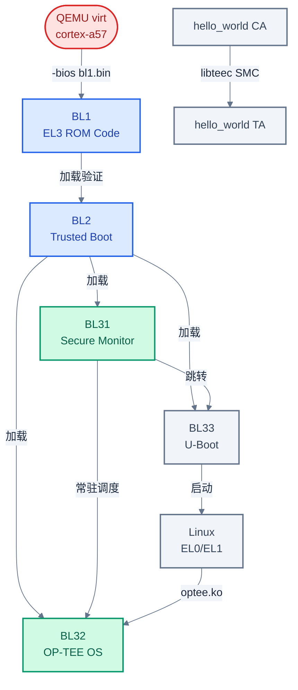
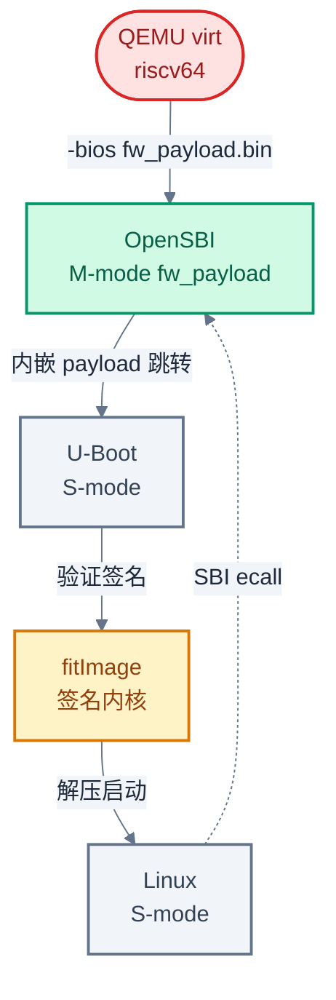

# 实战:QEMU 跑通安全启动链

> 一句话概括:本文用 QEMU 在 ARM 和 RISC-V 两条链上跑通完整安全启动,验证前 10 篇建立的概念。
> **工程师视角**:概念读十遍不如自己跑一遍——QEMU 是零硬件成本的安全启动学习平台,但坑也不少,本文给出可复现的命令和踩过的雷。

### 关键术语

| 缩写 | 全称 | 含义 |
|------|------|------|
| QEMU | Quick EMUlator | 开源硬件模拟器,支持 ARM/RISC-V virt 机器 |
| TF-A | Trusted Firmware-A | ARMv8-A 安全世界参考实现 |
| OP-TEE | Open Portable Trusted Execution Environment | 开源 TEE OS,常作 BL32 |
| OpenSBI | Open Source SBI | RISC-V M-mode 固件,对标 TF-A |
| SMC | Secure Monitor Call | ARM 触发 EL3 调用的指令 |
| SPD | Secure Partition Dispatcher | BL31 中调度 TEE OS 的组件 |
| FIP | Firmware Image Package | TF-A 打包 BL2/BL31/BL32/BL33 的容器 |
| FIT | Flattened Image Tree | U-Boot 使用的镜像格式,支持签名 |
| TA | Trusted Application | 运行在 TEE 中的可信应用 |
| CA | Client Application | 运行在 REE 中、调用 TA 的客户端应用 |
| DTB | Device Tree Blob | 编译后的设备树二进制 |

**前置阅读**:[10-riscv-secure-boot-and-tee.md](./10-riscv-secure-boot-and-tee.md) — RISC-V 安全启动与 TEE 生态

---

## 1. 环境准备

> 前 10 篇建立了从信任根到 TEE 的完整概念框架。一个自然的问题是:这些概念在真实(或模拟)硬件上跑起来是什么样?本章用 QEMU 回答这个问题——先准备工具链,再分别跑通 ARM 和 RISC-V 两条链。

### 1.1 为什么选 QEMU

**为什么不用真实开发板?** 真实板子有三个问题:贵(juno 板几千美元)、慢(刷机要物理操作)、不可控(BootROM 不可读)。QEMU 用软件模拟 `virt` 机器,免费、秒级重启、所有寄存器可观察,是学习安全启动的最佳起点。

**QEMU 的局限**:没有真实 ROT(ROM + Fuse),`-bios` 加载的 BL1 本身可被替换。所以 QEMU 上验证的是"软件链路是否打通",而非"信任根是否不可篡改"。生产级 Secure Boot 必须在真实硬件上验证。

### 1.2 工具链与源码

以下命令在 Ubuntu 22.04 / x86_64 主机上验证通过:

```bash
# 安装交叉编译工具链与 QEMU
sudo apt install -y gcc-aarch64-linux-gnu gcc-riscv64-linux-gnu \
    qemu-system-arm qemu-system-misc device-tree-compiler \
    build-essential libssl-dev bc bison flex

# 克隆源码(均用 --depth=1 浅克隆,节省空间;URL 与本仓库 .gitmodules 一致)
git clone --depth=1 https://github.com/ARM-software/arm-trusted-firmware.git tf-a
git clone --depth=1 https://github.com/OP-TEE/optee_os.git
git clone --depth=1 https://github.com/OP-TEE/optee_client.git
git clone --depth=1 https://github.com/OP-TEE/optee_examples.git
git clone --depth=1 https://github.com/u-boot/u-boot.git
git clone --depth=1 https://github.com/riscv-software-src/opensbi.git
git clone --depth=1 https://github.com/torvalds/linux.git
```

| 组件 | 作用 | 对应章节 |
|------|------|----------|
| **TF-A** | BL1/BL2/BL31,ARM 启动链 | [03](./03-arm-tbbr-and-boot-chain.md), [04](./04-tf-a-architecture.md) |
| **OP-TEE** | BL32 TEE OS | [07](./07-optee-architecture.md), [08](./08-optee-ta-development.md) |
| **U-Boot** | BL33 + RISC-V S-mode loader | [10](./10-riscv-secure-boot-and-tee.md) |
| **OpenSBI** | RISC-V M-mode 固件 | [09](./09-opensbi-riscv-counterpart.md) |
| **Linux** | REE OS,加载 TEE 驱动 | [07](./07-optee-architecture.md) |

> **如何读这张表**:本实战涉及 5 个开源项目。ARM 链用到前 4 个(TF-A+OP-TEE+U-Boot+Linux),RISC-V 链用到后 3 个(OpenSBI+U-Boot+Linux)。每个组件都对应前文某一章的概念,遇到问题可回查。

---

## 2. ARM 实战:QEMU + TF-A + OP-TEE + Linux

> 上一章准备好了工具链和源码。本章在 ARM `virt` 机器上跑通完整启动链:BL1 → BL2 → BL31 → BL32(OP-TEE)→ BL33(U-Boot)→ Linux,最终在 Linux 用户态运行 hello_world TA 验证 CA/TA 通信。

### 2.1 启动链目标架构



> **如何读这张图**:QEMU 用 `-bios` 参数加载 BL1(模拟 ROM),之后启动链按 [03 章](./03-arm-tbbr-and-boot-chain.md) 的 TBBR 流程逐级加载。BL31 和 BL32 常驻安全世界,Linux 启动后通过 `optee.ko` 驱动发起 SMC 进入 OP-TEE,最终 CA 与 TA 完成一次往返通信。

### 2.2 构建步骤

构建顺序很重要——TF-A 需要 OP-TEE 的 BL32 和 U-Boot 的 BL33 作为输入,所以必须先构建这两者。

1. 设置交叉编译环境变量:

```bash
export CROSS_COMPILE=aarch64-linux-gnu-
export ARCH=arm64
export OPTEE_PATH=$(pwd)/optee_os
export UBOOT_PATH=$(pwd)/u-boot
export TFA_PATH=$(pwd)/tf-a
```

2. 构建 OP-TEE OS(生成 BL32):

```bash
cd $OPTEE_PATH
make PLATFORM=qemu_armv8a CFG_TEE_CORE_LOG_LEVEL=4
# 产物:out/arm-plat-qemu/core/tee-header_v2.bin (BL32)
#       out/arm-plat-qemu/core/tee-pager_v2.bin
#       out/arm-plat-qemu/core/tee-raw.bin
cd ..
```

**为什么 `CFG_TEE_CORE_LOG_LEVEL=4`?** OP-TEE 日志级别定义在 `trace_levels.h`:`ERROR=1`、`INFO=2`、`DEBUG=3`、`FLOW=4`。级别 4(FLOW)会打印 OP-TEE 启动、TA 加载和每次 SMC 的详细日志。首次跑通时必须开,否则出问题无从排查。生产构建改回 2(INFO)或 1(ERROR)。

3. 构建 U-Boot(生成 BL33):

```bash
cd $UBOOT_PATH
make qemu_arm64_defconfig
make -j$(nproc)
# 产物:u-boot.bin (BL33)
cd ..
```

4. 构建 TF-A(整合 BL32/BL33 成 FIP):

```bash
cd $TFA_PATH
make PLAT=qemu ARM_ARCH_MAJOR=8 ARM_ARCH_MINOR=0 \
     SPD=opteed \
     BL32=$OPTEE_PATH/out/arm-plat-qemu/core/tee-header_v2.bin \
     BL32_EXTRA1=$OPTEE_PATH/out/arm-plat-qemu/core/tee-pager_v2.bin \
     BL32_EXTRA2=$OPTEE_PATH/out/arm-plat-qemu/core/tee-raw.bin \
     BL33=$UBOOT_PATH/u-boot.bin \
     TRUSTED_BOARD_BOOT=0 \
     DEBUG=1
# 产物:build/qemu/debug/bl1.bin  (DEBUG=1 时构建目录为 debug/)
#       build/qemu/debug/fip.bin
cd ..
```

**为什么 `TRUSTED_BOARD_BOOT=0`?** TBBR(见 [03 章](./03-arm-tbbr-and-boot-chain.md))需要平台 ROTPK(Root of Trust Public Key)烧入 Fuse。QEMU 没有真实 Fuse,开启 TBBR 会因找不到 ROTPK 而验证失败。关闭后 BL1 不验证 BL2 签名,直接加载——这是 QEMU 学习模式的必要妥协。本章末尾的 RISC-V 实战会演示如何在无 Fuse 环境下用 U-Boot verified boot 实现签名验证。

**为什么 `SPD=opteed`?** SPD(Secure Partition Dispatcher)是 BL31 中调度特定 TEE OS 的组件。`opteed` 对应 OP-TEE,`tspd` 对应 TF-A 自带的 Test Secure Payload(测试用,非生产级 TEE OS)。BL31 收到 SMC 后,由 SPD 判断是转发给 OP-TEE 还是自己处理(如 PSCI)。详见 [05 章](./05-tf-a-bl31-secure-monitor.md)。

5. 构建 Linux 内核(启用 TEE 支持):

```bash
cd linux
make defconfig
# 启用 OP-TEE 驱动(通常 defconfig 已开启,确认即可)
scripts/config --enable CONFIG_TEE
scripts/config --enable CONFIG_OPTEE
make olddefconfig
make -j$(nproc) Image dtbs
# 产物:arch/arm64/boot/Image
#       arch/arm64/boot/dts/arm/virt.dtb(或用 QEMU 自动生成)
cd ..
```

**为什么需要 `CONFIG_OPTEE`?** Linux 需要一个内核驱动(`drivers/tee/optee/`)来封装 SMC 调用。用户态 CA 通过 `/dev/tee0` 设备文件发 ioctl,驱动将其转为 SMC 进入 OP-TEE。没有这个驱动,Linux 无法与 OP-TEE 通信。

6. 构建 OP-TEE 客户端库与示例 TA:

```bash
cd optee_client
make CROSS_COMPILE=aarch64-linux-gnu- \
     DESTDIR=$(pwd)/out install
cd ..

cd optee_examples
# hello_world 示例,验证 CA/TA 通信
CROSS_COMPILE=aarch64-linux-gnu- \
TA_DEV_KIT_DIR=$OPTEE_PATH/out/arm-plat-qemu/export-user_ta \
TA_CROSS_COMPILE=aarch64-linux-gnu- \
CROSS_COMPILE=aarch64-linux-gnu- \
make -C hello_world
cd ..
```

**为什么需要 TA_DEV_KIT_DIR?** TA 运行在 S-EL0,使用 OP-TEE 提供的用户态库(libutee)。这个库的导出头文件和静态库在 `export-user_ta` 目录,TA 编译时必须指向它。

### 2.3 运行与验证

7. 启动 QEMU:

```bash
qemu-system-aarch64 \
    -machine virt \
    -cpu cortex-a57 \
    -smp 2 \
    -m 1024 \
    -nographic \
    -bios $TFA_PATH/build/qemu/debug/bl1.bin \
    -d unimp
```

QEMU 启动后,BL1 会自动加载 FIP 包中的 BL2/BL31/BL32/BL33。**关键现象**:串口依次输出 TF-A、OP-TEE、U-Boot、Linux 的日志。

**参数说明**:`-nographic` 将串口和 QEMU monitor 都复用到终端(Ctrl-A C 可切换到 monitor);`-d unimp` 打印 QEMU 未实现的寄存器访问警告,帮助排查外设模拟缺失导致的卡死。不需要额外加 `-serial mon:stdio`——`-nographic` 已隐含此设置,重复指定会报 "stdio: multiple chardevs" 错误。

8. 验证 OP-TEE 初始化:

```bash
# 在 Linux 启动后的终端执行
dmesg | grep -i optee
```

预期输出:

```
optee: probing for conduit method.
optee: revision 3.20 (290adcb6)
optee: initialized driver
```

9. 运行 hello_world TA:

```bash
# 挂载 OP-TEE 客户端库(假设已通过 NFS/SD 卡传入根文件系统)
export LD_LIBRARY_PATH=/usr/lib/teec
# 运行示例
hello_world
```

预期输出:

```
Invoking TA to increment 42
TA incremented to 43
```

> **核心要点**:ARM 链跑通的标志是 `dmesg` 看到 `optee: initialized driver` 且 hello_world TA 能返回正确结果。前者证明 BL31→BL32→Linux 的 SMC 通路畅通,后者证明 CA→TA 完整往返通信成功。

---

## 3. RISC-V 实战:QEMU + OpenSBI + U-Boot

> 上一章跑通了 ARM 完整链。RISC-V 链更简洁——没有 BL32 对应物(详见 [10 章](./10-riscv-secure-boot-and-tee.md)),核心是 OpenSBI + U-Boot + Linux 三段。本章额外演示 U-Boot verified boot,弥补 ARM 链中 `TRUSTED_BOARD_BOOT=0` 的遗憾。

### 3.1 启动链目标架构



> **如何读这张图**:与 ARM 链对比——RISC-V 用 OpenSBI 替代 TF-A,用 ecall 替代 SMC,且没有 BL32。U-Boot 在 S-mode 运行,负责验证 fitImage 签名后才启动 Linux。这是 RISC-V 上目前最接近 Secure Boot 的实践方案。

### 3.2 构建步骤

1. 设置交叉编译环境变量:

```bash
export CROSS_COMPILE=riscv64-linux-gnu-
export ARCH=riscv
export OPENSBI_PATH=$(pwd)/opensbi
export UBOOT_PATH=$(pwd)/u-boot
```

2. 构建 U-Boot(S-mode payload):

```bash
cd $UBOOT_PATH
make qemu-riscv64_smode_defconfig
# 启用 verified boot 支持
scripts/config --enable CONFIG_FIT
scripts/config --enable CONFIG_FIT_SIGNATURE
scripts/config --enable CONFIG_RSA
make olddefconfig
make -j$(nproc)
# 产物:u-boot.bin
cd ..
```

**为什么用 `qemu-riscv64_smode_defconfig` 而非 `qemu-riscv64_defconfig`?** OpenSBI 运行在 M-mode,跳转目标必须是 S-mode。`_smode` 配置编译出的 U-Boot 直接在 S-mode 运行;而 `qemu-riscv64_defconfig` 是 M-mode 配置,会与 OpenSBI 冲突。

3. 构建 OpenSBI(用 fw_payload 模式,内嵌 U-Boot):

```bash
cd $OPENSBI_PATH
make PLATFORM=generic \
     FW_PAYLOAD_PATH=$UBOOT_PATH/u-boot.bin
# 产物:build/platform/generic/firmware/fw_payload.bin
cd ..
```

**为什么用 `fw_payload` 而非 `fw_jump`?** OpenSBI 提供三种固件类型(详见 [09 章](./09-opensbi-riscv-counterpart.md)):

- `fw_payload`:把 U-Boot 二进制内嵌进 OpenSBI 镜像,QEMU 用 `-bios fw_payload.bin` 一次加载两者,启动流程最简单——适合学习
- `fw_jump`:OpenSBI 不内嵌 payload,启动后跳转到 `FW_JUMP_ADDR` 指定的固定地址,需要另外安排 U-Boot 的加载(QEMU 的 `-device loader` 或 SD 卡)
- `fw_dynamic`:跳转地址由前一级固件通过寄存器动态传递,生产环境主流

学习阶段选 `fw_payload` 最省事——一个 `-bios` 参数搞定 OpenSBI + U-Boot。QEMU `virt` 机器的 RAM 起始地址是 `0x80000000`,OpenSBI generic 平台会自动链接到该地址,无需手动指定 `FW_TEXT_START`。

4. 构建 Linux 内核:

```bash
cd linux
make ARCH=riscv defconfig
make -j$(nproc) Image
# 产物:arch/riscv/boot/Image
cd ..
```

### 3.3 启用 U-Boot Verified Boot

5. 生成 RSA 密钥对:

```bash
mkdir -p keys
openssl genrsa -out keys/dev.key 2048
openssl req -new -x509 -key keys/dev.key -out keys/dev.crt \
    -subj "/CN=Secure Boot Dev/"
```

**为什么用 2048 位 RSA 而非 ECDSA?** U-Boot 的 `CONFIG_RSA` 默认支持 RSA,ECDSA 需要额外启用 `CONFIG_ECDSA` 且部分平台不支持。2048 位对于学习场景足够安全。

6. 编写 FIT image 描述文件 `fit.its`:

```dts
/dts-v1/;

/ {
    description = "Linux kernel image with signature";
    #address-cells = <1>;

    images {
        kernel {
            description = "Linux kernel";
            data = /incbin/("linux/arch/riscv/boot/Image");
            type = "kernel";
            arch = "riscv";
            os = "linux";
            compression = "none";
            load = <0x80200000>;
            entry = <0x80200000>;
            hash {
                algo = "sha256";
            };
        };
    };

    configurations {
        default = "conf-1";
        conf-1 {
            description = "default configuration";
            kernel = "kernel";
            signature {
                algo = "sha256,rsa2048";
                key-name-hint = "dev";
                sign-images = "kernel";
            };
        };
    };
};
```

**为什么 hash 和 signature 分开?** hash 是对 kernel 镜像的摘要,signature 是对 hash 的签名。U-Boot 验证时先重新计算 kernel 的 sha256,再用公钥解密 signature 比对——这样即使攻击者替换 kernel,hash 不匹配;即使伪造 hash,签名验证失败。

7. 用 mkimage 生成签名 fitImage 并注入公钥到 U-Boot DTB:

```bash
mkimage -f fit.its -K $UBOOT_PATH/u-boot.dtb -k keys/ fitImage
```

**为什么 `-K u-boot.dtb`?** U-Boot 验证签名需要公钥。`-K` 参数把 `keys/dev.crt` 公钥写入 U-Boot 的控制 DTB(control DTB),这样 U-Boot 启动时就能从自己的 DTB 中读到公钥,无需外部文件。这模拟了"公钥烧入设备"的过程。

> **注意**:`mkimage -K` 修改的是 `u-boot.dtb` 文件,但 U-Boot 运行时使用的可能是内嵌 DTB(`u-boot.bin` 中)。若 U-Boot 配置为 `OF_SEPARATE`(多数平台的默认值),需要重新拼接:`cat u-boot-nodtb.bin u-boot.dtb > u-boot.bin`;若配置为 `OF_EMBED`,需重新 `make` 编译 U-Boot。可用 `grep CONFIG_OF_ $UBOOT_PATH/.config` 确认 DTB 的嵌入方式。

### 3.4 运行与验证

8. 启动 QEMU:

```bash
# 把 fitImage 和 Linux 根文件系统放入虚拟 SD 卡
dd if=/dev/zero of=sd.img bs=1M count=512
mkfs.ext2 sd.img
mkdir -p mnt
sudo mount sd.img mnt
sudo cp fitImage mnt/
sudo umount mnt

qemu-system-riscv64 \
    -machine virt \
    -smp 2 \
    -m 1024 \
    -nographic \
    -bios $OPENSBI_PATH/build/platform/generic/firmware/fw_payload.bin \
    -drive file=sd.img,format=raw,id=hd0 \
    -device virtio-blk-device,drive=hd0
```

9. 在 U-Boot 命令行加载并验证 fitImage:

```bash
# U-Boot 启动后按任意键进入命令行
=> load virtio 0:1 0x80200000 /fitImage
=> bootm 0x80200000
```

预期输出(关键部分):

```
## Loading kernel from FIT Image at 80200000 ...
   Verifying Hash Integrity ... sha256,rsa2048:dev+ OK
   Kernel: arg 0x00000000
   Trying 'kernel' FDT
## Loading kernel from FIT Image ...
Starting kernel ...
```

**`Verifying Hash Integrity ... OK` 是什么含义?** 这一行表明 U-Boot 成功完成了三步验证:(1) 重新计算 kernel 的 sha256 摘要;(2) 用 DTB 中的公钥解密 signature;(3) 比对两者一致。如果 kernel 被篡改一个字节,这里会输出 `Bad Data Hash` 并拒绝启动。

> **核心要点**:RISC-V 链跑通的标志是 U-Boot 输出 `Verifying Hash Integrity ... OK` 并成功启动 Linux。与 ARM 链对比,RISC-V 用 U-Boot verified boot 在无 Fuse 环境下实现了签名验证,而 ARM 的 TBBR 在 QEMU 上只能关闭(`TRUSTED_BOARD_BOOT=0`)——这体现了两种生态的成熟度差异。

---

## 4. 调试技巧

> 上一章跑通了基本流程,但首次尝试几乎必然遇到问题。本章给出三类调试手段:日志级别、SMC 观察、GDB 调试,帮助定位卡死、通信失败等问题。

### 4.1 日志级别调优

| 组件 | 参数 | 级别 | 效果 |
|------|------|:----:|------|
| **TF-A** | `LOG_LEVEL=40` | INFO | 打印 BL1/BL2 加载地址、SMC 调度(`DEBUG=1` 时默认值) |
| **TF-A** | `LOG_LEVEL=20` | NOTICE | 仅打印关键启动信息(默认 release 值) |
| **OP-TEE** | `CFG_TEE_CORE_LOG_LEVEL=4` | FLOW | 打印 TA 加载、参数解包、SMC 细节 |
| **OP-TEE** | `CFG_TEE_CORE_LOG_LEVEL=1` | ERROR | 仅打印错误 |
| **OpenSBI** | `FW_DEBUG=1` | DEBUG | 打印 ecall 调度、Domain 信息 |

**为什么 TF-A 日志级别用数字而非字符串?** TF-A 的日志级别定义在 `include/common/debug.h` 中:`LOG_LEVEL_ERROR=10`、`LOG_LEVEL_NOTICE=20`、`LOG_LEVEL_INFO=40`。构建时通过 Make 变量 `LOG_LEVEL` 设置(不是 `ARM_TF_LOG_LEVEL`)。`DEBUG=1` 会自动设 `LOG_LEVEL=40`(INFO),打印启动阶段和 SMC 调度细节;release 构建默认 `LOG_LEVEL=20`(NOTICE)。注意 TF-A 没有比 40 更高的级别——不像 printk 那样有 DEBUG=50。

### 4.2 观察 SMC 调用

TF-A 在 DEBUG 模式下会打印每条 SMC 的 `fid`(Function ID)和参数。关键 SMC 编号(详见 [05 章](./05-tf-a-bl31-secure-monitor.md)):

| SMC FID | 名称 | 含义 |
|---------|------|------|
| `0x84000000` | PSCI_VERSION | 查询 PSCI 版本 |
| `0x84000003` | PSCI_CPU_ON | 唤醒从核(AArch32) |
| `0xc4000003` | PSCI_CPU_ON | 唤醒从核(AArch64,SMC64 变体) |
| `0x32000004` | OPTEE_SMC_CALL_WITH_ARG | OP-TEE 标准调用(yielding,Linux 主要使用) |
| `0xb2000009` | OPTEE_SMC_EXCHANGE_CAPABILITIES | OP-TEE 快速调用(初始化时探测能力) |

> **如何读这张表**:FID 编码遵循 ARM SMC Calling Convention(DEN0028):bit31=1 为 Fast Call(不可抢占,立即返回),bit31=0 为 Yielding/Standard Call(可被中断抢占,适合长耗时操作);bit30 区分 SMC32(=0)与 SMC64(=1);bits[29:24] 为 Owning Entity Number——`0x04`(Standard Secure)对应 PSCI,`0x32`(Trusted OS=50)对应 OP-TEE。PSCI 全部是 Fast Call(bit31=1);OP-TEE 的 `CALL_WITH_ARG` 是 Yielding Call(bit31=0),因为 CA/TA 通信可能触发 RPC 回调到 REE,需要可抢占。Linux 初始化 OP-TEE 时先发 `0xb2000009`(EXCHANGE_CAPABILITIES,fast call 探测能力),后续 CA/TA 通信用 `0x32000004`(CALL_WITH_ARG,yielding call 传递参数结构体指针)。

**如何确认 Linux 与 OP-TEE 通信?** 在 TF-A DEBUG 日志中,`dmesg` 执行 `optee: initialized driver` 时应伴随 `fid=0xb2000009`(EXCHANGE_CAPABILITIES)的 SMC 日志。如果没有,说明 BL31 的 SPD 未正确转发——检查 `SPD=opteed` 是否生效。

### 4.3 用 GDB 调试 BL31

QEMU 支持 GDB 远程调试,适合排查 BL31 卡死问题:

```bash
# 终端 1:启动 QEMU,加 -S 暂停启动,-gdb 等待连接
qemu-system-aarch64 -machine virt -cpu cortex-a57 -m 1024 \
    -bios $TFA_PATH/build/qemu/debug/bl1.bin \
    -S -gdb tcp::1234 -nographic

# 终端 2:用 GDB 连接
aarch64-linux-gnu-gdb $TFA_PATH/build/qemu/debug/bl31/bl31.elf
(gdb) target remote :1234
(gdb) break bl31_main
(gdb) continue
```

**为什么用 bl31.elf 而非 bl31.bin?** `.elf` 文件包含符号表和调试信息,GDB 能显示函数名和变量;`.bin` 是纯二进制,只能看地址。编译 TF-A 时 `DEBUG=1` 会保留 `.elf` 产物。

---

## 5. 常见问题

> 前几章给出了理想路径,但实际操作中踩坑是常态。本章汇总四类高频问题及其根因,帮助快速定位。

| 问题 | 现象 | 根因 | 解决方案 |
|------|------|------|----------|
| **找不到 BL32 路径** | TF-A 构建报错 `BL32 not found` | `BL32=` 路径写错,或 OP-TEE 构建产物路径变化 | 确认 `$OPTEE_PATH/out/arm-plat-qemu/core/` 下有 `tee-header_v2.bin`;OP-TEE v3.18+ 改名为 `tee.elf` |
| **SMC 调用失败** | Linux `dmesg` 报 `optee: SMC failed` | BL31 的 SPD 未配置,或 OP-TEE 版本与 Linux 驱动不匹配 | 确认 TF-A 构建时 `SPD=opteed`;检查 OP-TEE 与 Linux `optee.ko` 版本对齐 |
| **OP-TEE 与 Linux 不匹配** | `optee: probing failed` 或 TA 无法加载 | OP-TEE 3.x 协议与 Linux 驱动版本不一致 | 用同一 release 分支的 OP-TEE 和 Linux;Linux 5.10+ 对应 OP-TEE 3.12+ |
| **QEMU 版本兼容性** | `-machine virt` 报错或启动卡死 | QEMU 版本过低,不支持 cortex-a57 或 virt 机器新特性 | 用 QEMU 6.0+;`qemu-system-aarch64 --version` 确认 |
| **U-Boot 无法验证 fitImage** | `Bad Data Hash` 或 `signature not found` | 公钥未注入 DTB,或 `key-name-hint` 与公钥名不符 | 重新执行 `mkimage -K`;确认 `fit.its` 中 `key-name-hint="dev"` 与 `keys/dev.crt` 一致 |
| **OpenSBI 跳转后卡死** | OpenSBI 输出 `next_addr=0x...` 后无响应 | U-Boot 链接地址与 OpenSBI 跳转地址不一致 | `fw_payload` 模式下确认 U-Boot 的 `CONFIG_TEXT_BASE` 与 OpenSBI payload 加载地址一致(generic 平台默认 `0x80000000`);`fw_jump` 模式需手动指定 `FW_JUMP_ADDR` |

> **如何读这张表**:前两列描述"症状",第三列给出"病因",第四列是"药方"。遇到问题时先匹配现象,再按根因排查。版本不匹配类问题(第 2、3 行)最常见,建议固定各组件到同一 release tag。

> **核心要点**:实战是验证理解的最佳方式,QEMU 是低成本学习平台。ARM 链跑通后能直观看到 BL1→BL33 逐级加载和 SMC 通信;RISC-V 链虽然简洁,但 verified boot 的签名验证流程与 ARM TBBR 异曲同工。两者的差异不在概念,而在生态成熟度。

---

## 参考资料

- [TF-A QEMU 平台文档](https://trustedfirmware-a.readthedocs.io/en/latest/plat/qemu.html) — QEMU 平台移植说明
- [OP-TEE QEMU 文档](https://optee.readthedocs.io/en/latest/building/devices/qemu.html) — OP-TEE QEMU 构建
- [OpenSBI QEMU 文档](https://github.com/riscv-software-src/opensbi/blob/master/docs/platform/qemu_virt.md) — OpenSBI QEMU virt 平台
- [U-Boot FIT Image 文档](https://docs.u-boot.org/en/latest/usage/fit.html) — FIT 镜像格式与签名
- [U-Boot Verified Boot 文档](https://docs.u-boot.org/en/latest/develop/rsa_signature.html) — RSA 签名验证机制

---

**上一篇**: [10-riscv-secure-boot-and-tee.md](./10-riscv-secure-boot-and-tee.md) — RISC-V 安全启动与 TEE 生态
**下一篇**: [12-references.md](./12-references.md) — 参考资料与术语表
