# 参考资料与术语表

> 一句话概括:本文汇总前 11 篇全部术语、源码导航、官方文档与推荐论文,并给出按角色划分的学习路径,是整个系列的索引入口。
> **工程师视角**:这篇不是"读完就忘"的附录——把它加书签,后续遇到术语或想深入某块时随时回查。

---

## 1. 术语表

> 前 11 篇贯穿了 ARM 与 RISC-V 安全启动的数十个缩写。本章按字母序汇总,每条标注全称、含义与首次出现文档,方便快速回溯。

### 1.1 术语汇总(按字母排序)

| 缩写 | 全称 | 含义 | 首次出现 |
|------|------|------|----------|
| **BL1** | Boot Loader stage 1 | ARM 启动链第一阶段,ROM 代码,验证并加载 BL2 | [01](./01-trusted-firmware-overview.md) |
| **BL2** | Boot Loader stage 2 | ARM 启动链第二阶段,验证 BL31/BL32/BL33 并打包到 FIP | [01](./01-trusted-firmware-overview.md) |
| **BL31** | Boot Loader stage 3-1 | ARM 启动链第三阶段,常驻 EL3 的 Secure Monitor | [01](./01-trusted-firmware-overview.md) |
| **BL32** | Boot Loader stage 3-2 | ARM 启动链中 TEE OS 位置(如 OP-TEE),常驻 S-EL1 | [01](./01-trusted-firmware-overview.md) |
| **BL33** | Boot Loader stage 3-3 | ARM 启动链中非安全世界 bootloader(U-Boot/UEFI) | [01](./01-trusted-firmware-overview.md) |
| **CA** | Client Application | 运行在 REE 中、通过 SMC 调用 TA 的客户端应用 | [01](./01-trusted-firmware-overview.md) |
| **CoT** | Chain of Trust | 信任链,启动链中每环验证下一环的机制 | [01](./01-trusted-firmware-overview.md) |
| **DTB** | Device Tree Blob | 编译后的设备树二进制,描述硬件拓扑 | [11](./11-secure-boot-practice.md) |
| **EHF** | Exception Handling Framework | TF-A 的异常处理框架,管理 EL3 中断 | [05](./05-tf-a-bl31-secure-monitor.md) |
| **EL3** | Exception Level 3 | ARMv8-A 最高特权级,Secure Monitor 所在 | [01](./01-trusted-firmware-overview.md) |
| **FIP** | Firmware Image Package | TF-A 打包 BL2/BL31/BL32/BL33 的容器格式 | [03](./03-arm-tbbr-and-boot-chain.md) |
| **FIT** | Flattened Image Tree | U-Boot 使用的镜像格式,支持签名与多配置 | [11](./11-secure-boot-practice.md) |
| **GP** | GlobalPlatform | TEE 标准化组织,定义 Client API 与 Internal API | [01](./01-trusted-firmware-overview.md) |
| **HSM** | Hart State Management | OpenSBI 的 hart 状态管理扩展,对标 PSCI | [01](./01-trusted-firmware-overview.md) |
| **M-mode** | Machine Mode | RISC-V 最高特权级,OpenSBI 所在 | [01](./01-trusted-firmware-overview.md) |
| **OpenSBI** | Open Source SBI | RISC-V 官方 M-mode 固件,对标 TF-A | [01](./01-trusted-firmware-overview.md) |
| **OP-TEE** | Open Portable TEE | 开源 TEE OS 实现,常作为 BL32 | [01](./01-trusted-firmware-overview.md) |
| **PMP** | Physical Memory Protection | RISC-V 物理内存保护机制,可编程多区隔离 | [01](./01-trusted-firmware-overview.md) |
| **PSCI** | Power State Coordination Interface | ARM 电源管理接口(CPU on/off/suspend) | [01](./01-trusted-firmware-overview.md) |
| **REE** | Rich Execution Environment | 富执行环境,运行 Linux/Android 等主 OS | [01](./01-trusted-firmware-overview.md) |
| **ROT** | Root of Trust | 信任根,不可变的硬件信任起点(ROM + Fuse) | [01](./01-trusted-firmware-overview.md) |
| **RPMB** | Replay Protected Memory Block | eMMC/UFS 抗回滚存储分区,用于安全存储 | [01](./01-trusted-firmware-overview.md) |
| **SBI** | Supervisor Binary Interface | RISC-V S-mode 与 M-mode 之间的调用接口 | [01](./01-trusted-firmware-overview.md) |
| **SCMI** | System Control and Management Interface | ARM 系统控制与管理接口(时钟/电源域) | [01](./01-trusted-firmware-overview.md) |
| **SMC** | Secure Monitor Call | ARM 触发 EL3 调用的指令 | [01](./01-trusted-firmware-overview.md) |
| **SPD** | Secure Partition Dispatcher | BL31 中调度特定 TEE OS 的组件(opteed/tspd) | [01](./01-trusted-firmware-overview.md) |
| **TA** | Trusted Application | 运行在 TEE 中的可信应用(S-EL0) | [01](./01-trusted-firmware-overview.md) |
| **TBBR** | Trusted Board Boot Requirements | ARM 启动链信任传递规范(ARM DEN0006) | [01](./01-trusted-firmware-overview.md) |
| **TF-A** | Trusted Firmware-A | ARMv8-A/v9-A 安全世界参考实现 | [01](./01-trusted-firmware-overview.md) |
| **TEE** | Trusted Execution Environment | 可信执行环境,与主 OS 隔离的安全运行时 | [01](./01-trusted-firmware-overview.md) |
| **TrustZone** | — | ARM 硬件安全扩展,划分安全/非安全两个世界 | [01](./01-trusted-firmware-overview.md) |
| **U-Boot** | Universal Boot Loader | 开源 bootloader,广泛用于嵌入式 Linux | [01](./01-trusted-firmware-overview.md) |

> **如何读这张表**:共 31 个核心术语。第 4 列"首次出现"指向各术语在系列中首次详细讨论的文档——想深入某术语,直接跳转对应章节。多数术语在 [01](./01-trusted-firmware-overview.md) 引入,因为总览篇建立了全局认知框架。

### 1.2 按主题分组速查

为方便按主题查找,以下是按领域的分组索引:

| 主题 | 相关术语 |
|------|----------|
| **ARM 启动链** | BL1, BL2, BL31, BL32, BL33, TBBR, FIP, ROT, CoT |
| **ARM 特权级与接口** | EL3, SMC, PSCI, SCMI, SPD, EHF, TrustZone |
| **TEE 与应用** | TEE, REE, TA, CA, GP, OP-TEE, RPMB |
| **RISC-V** | M-mode, OpenSBI, SBI, PMP, HSM |
| **Bootloader** | U-Boot, FIT, DTB |

---

## 2. 源码阅读导航

> 上一章汇总了术语。本章给出 4 个核心源码仓库的目录导航,帮助从"读文档"过渡到"读源码"——这是深入理解的必经之路。

本项目通过 Git Submodule 管理以下源码,路径见 [src/](./src/):

### 2.1 TF-A 源码导航

TF-A([src/tf-a-src/](./src/tf-a-src/))是 ARM 安全世界参考实现,源码按启动阶段和服务模块组织:

| 目录 | 职责 | 关键文件 | 对应文档 |
|------|------|----------|----------|
| `bl1/` | BL1 ROM 代码,验证并加载 BL2 | `bl1_main.c` | [03](./03-arm-tbbr-and-boot-chain.md) |
| `bl2/` | BL2 验证阶段,验证 BL31/BL32/BL33 | `bl2_main.c` | [03](./03-arm-tbbr-and-boot-chain.md) |
| `bl31/` | BL31 Secure Monitor,常驻 EL3 | `bl31_main.c`, `runtime_svc.c` | [05](./05-tf-a-bl31-secure-monitor.md) |
| `bl32/` | BL32 占位(实际 TEE OS 由 SPD 加载) | — | [07](./07-optee-architecture.md) |
| `plat/` | 平台抽象层(FVP/QEMU/STM32 等) | `plat/qemu/qemu_setup.c` | [04](./04-tf-a-architecture.md) |
| `lib/psci/` | PSCI 电源管理实现 | `psci_main.c`, `psci_cpu_on.c` | [05](./05-tf-a-bl31-secure-monitor.md) |
| `services/spd/` | SPD 调度器(opteed/tspd 等) | `opteed/opteed_main.c` | [05](./07-optee-architecture.md) |
| `services/std_svc/` | 标准服务(PSCI/SCMI/SDEI) | `psci/psci_svc.c` | [05](./05-tf-a-bl31-secure-monitor.md) |
| `drivers/auth/` | TBBR 证书验证(签名/哈希) | `img_mod.c`, `mbedtls/` | [03](./03-arm-tbbr-and-boot-chain.md) |
| `tools/fiptool/` | FIP 包打包/解包工具 | `fiptool.c` | [03](./04-tf-a-architecture.md) |
| `include/` | 公共头文件(SMC fid/寄存器定义) | `smccc.h`, `lib/psci/psci.h` | [05](./05-tf-a-bl31-secure-monitor.md) |

**如何切入 TF-A 源码?** 推荐顺序:(1) `bl31/bl31_main.c` 看启动入口;(2) `bl31/runtime_svc.c` 看 SMC 调度表如何注册;(3) `services/spd/opteed/opteed_main.c` 看 OP-TEE 如何被调度;(4) `lib/psci/psci_main.c` 看 PSCI 实现。这条路径对应 [05 章](./05-tf-a-bl31-secure-monitor.md) 的阅读顺序。

### 2.2 OpenSBI 源码导航

OpenSBI([src/opensbi-src/](./src/opensbi-src/))是 RISC-V M-mode 固件,结构比 TF-A 简洁:

| 目录 | 职责 | 关键文件 | 对应文档 |
|------|------|----------|----------|
| `firmware/` | 三种固件类型(fw_jump/fw_payload/fw_dynamic) | `fw_jump.S`, `fw_dynamic.c` | [09](./09-opensbi-riscv-counterpart.md) |
| `lib/sbi/` | SBI 核心与扩展实现 | `sbi_init.c`, `sbi_ecall.c`, `sbi_hsm.c` | [09](./09-opensbi-riscv-counterpart.md) |
| `lib/sbi/riscv_asm.c` | RISC-V 汇编封装( CSR 读写) | `riscv_asm.c` | [09](./09-opensbi-riscv-counterpart.md) |
| `lib/utils/` | 平台工具(Domain 隔离/复位) | `sys/`, `irqchip/` | [09](./09-opensbi-riscv-counterpart.md) |
| `include/sbi/` | SBI 接口定义 | `sbi_types.h`, `sbi_hsm.h` | [09](./09-opensbi-riscv-counterpart.md) |
| `platform/` | 平台代码(generic/qemu_virt) | `generic/platform.c` | [09](./09-opensbi-riscv-counterpart.md) |

**如何切入 OpenSBI 源码?** 推荐顺序:(1) `firmware/fw_jump.S` 看入口汇编;(2) `lib/sbi/sbi_init.c` 看初始化流程;(3) `lib/sbi/sbi_ecall.c` 看 ecall 调度表;(4) `lib/sbi/sbi_hsm.c` 看 HSM 扩展(对标 PSCI)。

### 2.3 OP-TEE 源码导航

OP-TEE([src/optee-src/](./src/optee-src/))分为 OS 内核与用户态库两部分:

| 目录 | 职责 | 关键文件 | 对应文档 |
|------|------|----------|----------|
| `core/` | TEE OS 内核(S-EL1) | `kernel/main.c`, `kernel/thread.c` | [07](./07-optee-architecture.md) |
| `core/arch/arm/` | ARM 架构相关(入口/SMC 处理) | `smc.c`, `entry_a64.S` | [07](./07-optee-architecture.md) |
| `core/tee/` | TEE 核心服务(TA 加载/会话) | `tee_svc.c`, `tee_ta_manager.c` | [07](./07-optee-architecture.md) |
| `lib/libutee/` | TA 用户态库(GP Internal API) | `tee_api.c`, `tee_api_objects.c` | [08](./08-optee-ta-development.md) |
| `lib/libutils/` | 工具库(字符串/内存) | `isoc/`, `ext/` | [08](./08-optee-ta-development.md) |
| `ta/` | TA 框架与示例 | `ta/create_ta_cert.sh`, `examples/` | [08](./08-optee-ta-development.md) |
| `core/pta/` | 预置 TA(安全存储/gprof) | `pta_stats.c`, `secstore_ta.c` | [08](./08-optee-ta-development.md) |

**如何切入 OP-TEE 源码?** 推荐顺序:(1) `core/arch/arm/entry_a64.S` 看入口;(2) `core/kernel/main.c` 看初始化;(3) `core/arch/arm/smc.c` 看 SMC 处理;(4) `lib/libutee/tee_api.c` 看 TA 如何调 GP API。

### 2.4 U-Boot 源码导航

U-Boot([src/u-boot-src/](./src/u-boot-src/))聚焦 verified boot 与 EFI secure boot:

| 目录 | 职责 | 关键文件 | 对应文档 |
|------|------|----------|----------|
| `lib/rsa/` | RSA 签名验证(verified boot) | `rsa-verify.c`, `rsa-checksum.c` | [10](./10-riscv-secure-boot-and-tee.md), [11](./11-secure-boot-practice.md) |
| `lib/ecdsa/` | ECDSA 签名验证 | `ecdsa-verify.c` | [10](./10-riscv-secure-boot-and-tee.md) |
| `lib/efi_loader/` | EFI 加载器(UEFI Secure Boot) | `efi_bootmgr.c`, `efi_signature.c` | [10](./10-riscv-secure-boot-and-tee.md) |
| `boot/` | 启动命令与镜像加载 | `bootm.c`, `image-fit.c` | [11](./11-secure-boot-practice.md) |
| `common/` | 主入口与命令分发 | `main.c`, `board_r.c` | [11](./11-secure-boot-practice.md) |
| `include/` | 配置头文件 | `config_defaults.h`, `u-boot/rsa.h` | [10](./10-riscv-secure-boot-and-tee.md) |

> **如何读这张表**:4 个仓库的源码导航按"启动阶段 → 服务模块 → 工具"的逻辑排列。每个目录的关键文件是该模块的入口,读源码时优先看入口文件的 `*_main.c` 或入口汇编,再按调用链深入。

---

## 3. 官方文档参考

> 上一章导航了源码。本章列出阅读系列时需要参考的官方规范,按 ARM/RISC-V/TEE 三个维度组织。

### 3.1 ARM 官方规范

| 文档 | 编号 | 内容 | 对应章节 | 阅读时机 |
|------|------|------|----------|----------|
| [TBBR Specification](https://developer.arm.com/documentation/den0006/) | ARM DEN0006 | 启动链信任传递规范,定义 BL1-BL33 验证流程 | [02](./02-secure-boot-concepts.md), [03](./03-arm-tbbr-and-boot-chain.md) | 学完 03 后 |
| [SMC Calling Convention](https://developer.arm.com/documentation/den0028/) | ARM DEN0028 | SMC 调用约定,定义 fid 编号与参数传递 | [05](./05-tf-a-bl31-secure-monitor.md) | 学完 05 后 |
| [PSCI Specification](https://developer.arm.com/documentation/den0022/) | ARM DEN0022 | 电源管理接口(CPU on/off/suspend) | [05](./05-tf-a-bl31-secure-monitor.md) | 学完 05 后 |
| [SCMI Specification](https://developer.arm.com/documentation/den0056/) | ARM DEN0056 | 系统控制与管理接口 | [05](./05-tf-a-bl31-secure-monitor.md) | 学完 05 后 |
| [ARM Architecture Reference Manual](https://developer.arm.com/documentation/ddi0487/) | ARM DDI0487 | ARMv8-A 架构手册(EL/TrustZone/异常) | 全系列 | 遇到架构细节时查 |
| [TF-A Documentation](https://trustedfirmware-a.readthedocs.io/) | — | TF-A 官方文档(本地 [src/tf-a-src/docs/](./src/tf-a-src/docs/)) | [04](./04-tf-a-architecture.md), [05](./05-tf-a-bl31-secure-monitor.md) | 学完 04 后 |

### 3.2 RISC-V 官方规范

| 文档 | 内容 | 对应章节 | 阅读时机 |
|------|------|----------|----------|
| [RISC-V Privileged ISA Spec](https://riscv.org/technical/specifications/) | PMP、特权级(M/S/U)、CSR 定义 | [09](./09-opensbi-riscv-counterpart.md), [10](./10-riscv-secure-boot-and-tee.md) | 学完 10 后 |
| [RISC-V SBI Specification](https://github.com/riscv-non-isa/riscv-sbi-doc) | SBI 扩展规范(HSM/SRST/PMU) | [09](./09-opensbi-riscv-counterpart.md) | 学完 09 后 |
| [OpenSBI Documentation](https://github.com/riscv-software-src/opensbi/blob/master/docs/) | OpenSBI 文档(本地 [src/opensbi-src/docs/](./src/opensbi-src/docs/)) | [09](./09-opensbi-riscv-counterpart.md) | 学完 09 后 |
| [RISC-V Security Spec (draft)](https://github.com/riscv/riscv-security) | WorldGuard/ePMP 安全扩展草案 | [10](./10-riscv-secure-boot-and-tee.md) | 学完 10 后 |

### 3.3 TEE 与 OP-TEE 文档

| 文档 | 内容 | 对应章节 | 阅读时机 |
|------|------|----------|----------|
| [GlobalPlatform TEE Specifications](https://globalplatform.org/specs-library/) | TEE Client API 与 Internal API 标准 | [06](./06-tee-concepts-and-trustzone.md), [08](./08-optee-ta-development.md) | 学完 06 后 |
| [OP-TEE Documentation](https://optee.readthedocs.io/) | OP-TEE 完整文档(构建/架构/TA 开发) | [07](./07-optee-architecture.md), [08](./08-optee-ta-development.md) | 学完 07 后 |
| [GlobalPlatform TEE Internal Core API](https://globalplatform.org/specs-library/) | TA 侧 API(加密/存储/时间) | [08](./08-optee-ta-development.md) | 学完 08 后 |

> **如何读这张表**:ARM 规范以 DEN 编号标识(DEN0006/DEN0028/DEN0022),是 ARM 官方权威文档,建议在对应章节学完后查阅原文。RISC-V 规范在 GitHub 上维护,版本演进较快。GlobalPlatform 规范是 TEE 生态的通用标准,不仅适用于 OP-TEE,也适用于其他 TEE 实现。

---

## 4. 推荐论文与资料

> 上一章列出了官方规范。本章补充学术论文与行业资料,适合想深入研究安全架构演进的读者。

### 4.1 学术论文

| 论文 | 作者/年份 | 核心贡献 | 对应章节 |
|------|-----------|----------|----------|
| [Keystone: An Open Framework for Architecting Trusted Execution Environments](https://arxiv.org/abs/1907.10119) | Lee et al., 2019 | RISC-V 上首个开源 TEE 框架,基于 PMP 实现隔离 | [10](./10-riscv-secure-boot-and-tee.md) |
| [Penglai: Scalable and Efficient Multiplexing of Trusted Execution Environments](https://arxiv.org/abs/2109.05275) | Peng et al., 2021 | RISC-V 多 TEE 并发隔离方案,改进 Keystone 单 TEE 限制 | [10](./10-riscv-secure-boot-and-tee.md) |
| [TrustZone Whitepaper](https://developer.arm.com/ip-products/security-ip/trustzone) | ARM, 2018 | TrustZone 架构白皮书,解释 NS bit 与安全扩展 | [06](./06-tee-concepts-and-trustzone.md) |
| [A Survey of ARM TrustZone](https://dl.acm.org/doi/10.1145/3462543) | Pinto & Santos, 2021 | TrustZone 学术综述,覆盖 100+ 篇研究 | [06](./06-tee-concepts-and-trustzone.md) |
| [Sanctum: Minimal Hardware Extensions for Strong Software Isolation](https://dl.acm.org/doi/10.5555/3357764.3358377) | Costan et al., 2016 | Keystone 的前身思想,提出最小硬件扩展实现隔离 | [10](./10-riscv-secure-boot-and-tee.md) |

**为什么 Keystone 论文必读?** Keystone([arXiv:1907.10119](https://arxiv.org/abs/1907.10119))是 RISC-V TEE 的奠基性工作,首次系统性地论证了"仅用 PMP 即可实现 TEE 隔离"。它对比了 TrustZone 的二元模型与 PMP 的多区模型,提出了 Security Monitor 软件层来管理多个隔离域。读懂这篇论文,RISC-V 安全生态的脉络就清晰了。

### 4.2 行业资料与开源项目

| 资料 | 来源 | 内容 | 对应章节 |
|------|------|------|----------|
| [Linaro Security Working Group](https://linaro.atlassian.net/wiki/spaces/SEC/overview) | Linaro | OP-TEE 与 TEE 生态推进,含会议记录 | [07](./07-optee-architecture.md) |
| [OP-TEE Build Guide](https://optee.readthedocs.io/en/latest/building/index.html) | OP-TEE 官方 | 完整构建指南,含 QEMU/树莓派/FPGA | [11](./11-secure-boot-practice.md) |
| [TF-A Porting Guide](https://trustedfirmware-a.readthedocs.io/en/latest/plat/porting-guide.html) | TF-A 官方 | 平台移植指南,解释 `plat/` 各接口 | [04](./04-tf-a-architecture.md) |
| [U-Boot Secure Boot Guide](https://docs.u-boot.org/en/latest/develop/rsa_signature.html) | U-Boot 官方 | Verified Boot 与 RSA 签名机制 | [10](./10-riscv-secure-boot-and-tee.md), [11](./11-secure-boot-practice.md) |
| [RISC-V Security WG](https://github.com/riscv/riscv-security) | RISC-V International | 安全扩展规范(WorldGuard/ePMP)进展 | [10](./10-riscv-secure-boot-and-tee.md) |

> **核心要点**:官方规范是"是什么"的权威来源,学术论文是"为什么这样设计"的深度来源。Keystone 论文是 RISC-V 安全领域的必读起点;TF-A 与 OP-TEE 官方文档则伴随日常开发。建议把本表加入书签,遇到具体问题时按"对应章节"回查。

---

## 5. 学习路径建议

> 前四章汇总了术语、源码、文档和论文。本章给出按角色划分的学习路径,帮助不同背景的读者高效阅读本系列 12 篇文档。

### 5.1 按角色推荐路径

| 角色 | 推荐路径 | 重点章节 | 预计学时 |
|------|----------|----------|:--------:|
| **固件工程师** | 01→02→03→04→05→11 | 04(TF-A 架构)、05(BL31)、11(实战) | 13-15h |
| **安全应用开发者** | 01→06→07→08→11 | 06(TEE 概念)、08(TA 开发)、11(实战) | 11-13h |
| **RISC-V 工程师** | 01→02→09→10→11 | 09(OpenSBI)、10(RISC-V 安全生态) | 11-13h |
| **系统架构师** | 全部 12 篇 | 01(关系图)、05(SPD 调度)、10(生态对比) | 25-30h |

> **如何读这张表**:每条路径以 [01](./01-trusted-firmware-overview.md) 总览为起点,因为三大主题的关系是后续所有内容的基础。"重点章节"列标注了该角色应投入最多精力的文档,非重点章节可快速浏览。

### 5.2 各角色详细说明

**固件工程师(BSP/嵌入式 Linux)**:

```
01 总览 → 02 Secure Boot 概念 → 03 TBBR → 04 TF-A 架构(重点)→ 05 BL31(重点)→ 11 实战
```

- 04 和 05 是核心:TF-A 架构与 BL31 详解直接对应日常工作(平台移植、SMC 处理)
- 03 的 TBBR 证书链是理解"为什么这样设计"的关键
- 11 的 QEMU 实战验证理解,可在此基础上移植到真实硬件

**安全应用开发者**:

```
01 总览 → 06 TEE 概念(重点)→ 07 OP-TEE 架构 → 08 TA 开发(重点)→ 11 实战
```

- 06 和 08 是核心:概念基础 + 实际开发能力
- 07 的通信机制帮助理解 CA/TA 交互的底层细节
- 02 的 Secure Boot 概念可按需补充,理解"为什么 TA 不会被篡改"

**RISC-V 工程师**:

```
01 总览 → 02 Secure Boot → 09 OpenSBI(重点)→ 10 RISC-V 安全生态(重点)→ 11 实战
```

- 09 和 10 是核心:RISC-V 对应方案与生态现状
- 建议先看 03 和 06 建立 ARM 基线,再回看 RISC-V 差异(尤其是 [10 章](./10-riscv-secure-boot-and-tee.md) 的对比表)
- 11 的 RISC-V 实战部分可直接上手,verified boot 流程与 ARM TBBR 对比学习

**系统架构师**:

```
全部 12 篇,重点关注 01(关系图)、05(SPD 调度)、10(生态对比)
```

- 01 的三大主题关系图是全局视角的入口
- 05 的 SPD 调度机制展示了"一个 Secure Monitor 如何服务多个安全服务"
- 10 的 ARM/RISC-V 生态对比帮助理解不同架构选择的权衡

### 5.3 学习节奏建议

```mermaid
%%{init: {"theme": "base", "themeVariables": {"primaryColor": "#f8fafc", "primaryTextColor": "#1e293b", "primaryBorderColor": "#475569", "lineColor": "#64748b", "secondaryColor": "#f1f5f9", "secondaryBorderColor": "#94a3b8", "tertiaryColor": "#f8fafc", "fontFamily": "\"trebuchet ms\", verdana, arial, sans-serif"}}}%%
gantt
    title 推荐学习节奏(系统架构师全系列)
    dateFormat X
    axisFormat %s天
    section 阶段一
    01-05 Secure Boot + TF-A :0, 10
    section 阶段二
    06-08 TEE + OP-TEE :10, 17
    section 阶段三
    09-10 RISC-V :17, 22
    section 阶段四
    11-12 实战 + 查阅 :22, 28
```



> **如何读这张图**:横轴是学习天数(总计约 28 天,每天 1-1.5 小时)。四个阶段对应 README 的学习路线图——阶段一建立 Secure Boot 与 TF-A 基础,阶段二进入 TEE,阶段三用 RISC-V 对比,阶段四实战验证。其他角色可跳过非重点阶段,相应缩短时间。

> **核心要点**:学习路径不是线性的——01 总览是所有人的起点,之后按角色分叉。但无论哪条路径,11(实战)是必经之地,因为"跑通一遍"比"读十遍"更能验证理解。本篇(12)则作为随时查阅的索引,贯穿整个学习过程。

---

## 参考资料

- [TF-A Documentation](https://trustedfirmware-a.readthedocs.io/) — TF-A 官方文档
- [TBBR Specification (ARM DEN0006)](https://developer.arm.com/documentation/den0006/) — 启动链信任传递规范
- [SMC Calling Convention (ARM DEN0028)](https://developer.arm.com/documentation/den0028/) — SMC 调用约定
- [PSCI Specification (ARM DEN0022)](https://developer.arm.com/documentation/den0022/) — 电源管理接口
- [GlobalPlatform TEE Specifications](https://globalplatform.org/specs-library/) — TEE API 标准
- [RISC-V SBI Specification](https://github.com/riscv-non-isa/riscv-sbi-doc) — SBI 扩展规范
- [OP-TEE Documentation](https://optee.readthedocs.io/) — OP-TEE 完整文档
- [OpenSBI Documentation](https://github.com/riscv-software-src/opensbi/blob/master/docs/) — OpenSBI 文档
- [Keystone Paper (arXiv:1907.10119)](https://arxiv.org/abs/1907.10119) — RISC-V TEE 奠基论文

---

**上一篇**: [11-secure-boot-practice.md](./11-secure-boot-practice.md) — 实战:QEMU 跑通安全启动链
**系列起点**: [01-trusted-firmware-overview.md](./01-trusted-firmware-overview.md) — 三大主题总览
