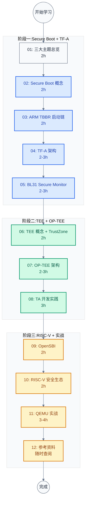
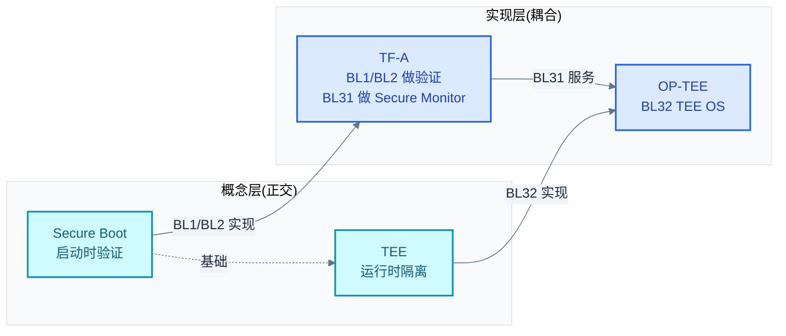

# Trusted Firmware / TEE / Secure Boot 学习笔记

> 面向系统软件与固件工程师的 ARM/RISC-V 安全启动与可信执行环境完整学习指南。从信任根到 TA 开发,覆盖 TF-A、OP-TEE、OpenSBI 三大主流实现。
>
> **工程师视角**:三大主题概念正交但工程耦合——Secure Boot 是基础,TEE 是应用,TF-A 是 ARM 上的实现枢纽。本指南以 ARM 为主线,RISC-V 作为对比参照。

### 关键术语

| 缩写 | 全称 | 含义 |
|------|------|------|
| TF-A | Trusted Firmware-A | ARMv8-A/v9-A 安全世界参考实现,提供 EL3 Secure Monitor 与启动链 |
| TBBR | Trusted Board Boot Requirements | ARM 启动链信任传递规范(ARM DEN0006) |
| TEE | Trusted Execution Environment | 可信执行环境,与富 OS 隔离的安全运行时 |
| REE | Rich Execution Environment | 富执行环境,运行 Linux/Android 等主 OS |
| GP | GlobalPlatform | TEE 标准化组织,定义 Client API 与 Internal API |
| SMC | Secure Monitor Call | ARM 触发 EL3 调用的指令 |
| PSCI | Power State Coordination Interface | ARM 电源管理接口(CPU on/off/suspend) |
| SCMI | System Control and Management Interface | ARM 系统控制与管理接口 |
| SPD | Secure Partition Dispatcher | BL31 中调度 TEE OS 的组件(opteed/tspd) |
| ROT | Root of Trust | 信任根,不可变的硬件信任起点 |
| CoT | Chain of Trust | 信任链,每环验证下一环 |
| BL1/BL2/BL31/BL32/BL33 | Boot Loader stage 1~3 | ARM 启动链各阶段 |
| TA | Trusted Application | 运行在 TEE 中的可信应用(S-EL0) |
| CA | Client Application | 运行在 REE 中、调用 TA 的客户端应用 |
| OpenSBI | Open Source SBI | RISC-V 官方 M-mode 固件,对标 TF-A |
| SBI | Supervisor Binary Interface | RISC-V S-mode 与 M-mode 之间的调用接口 |
| PMP | Physical Memory Protection | RISC-V 物理内存保护机制 |
| HSM | Hart State Management | OpenSBI 的 hart 状态管理扩展,对标 PSCI |
| RPMB | Replay Protected Memory Block | eMMC/UFS 抗回滚存储分区 |

---

## 学习路线图



> **如何读这张图**:三大主题按依赖关系分三阶段。阶段一建立 Secure Boot 与 TF-A 基础(TEE 的前提);阶段二进入 TEE 与 OP-TEE(依赖 TF-A 的 BL31);阶段三用 RISC-V 对比加深理解,并用 QEMU 实战验证。每篇 2-3 小时,总计约 25-30 小时。

---

## 文档索引

| 序号 | 文档 | 核心问题 | 概要 | 建议学时 |
|:----:|------|----------|------|:--------:|
| 01 | [三大主题总览](./01-trusted-firmware-overview.md) | TF-A、TEE、Secure Boot 是什么?怎么关联? | 三大主题本质、ARM/RISC-V 启动链全景、概念正交与工程耦合 | 2h |
| 02 | [Secure Boot 概念基础](./02-secure-boot-concepts.md) | 信任怎么从 ROM 传递到 OS? | 信任根、信任链、度量启动 vs 验证启动、反回滚、签名机制演算 | 2h |
| 03 | [ARM TBBR 与启动链](./03-arm-tbbr-and-boot-chain.md) | TBBR 如何定义启动链?各 BL 职责? | TBBR 规范、BL1→BL33 链详解、FIP 包、证书链、SMC 调用约定 | 2h |
| 04 | [TF-A 架构与构建系统](./04-tf-a-architecture.md) | TF-A 源码怎么组织?怎么构建移植? | 目录结构、Makefile、平台抽象层、FIP 工具、平台移植清单 | 2-3h |
| 05 | [BL31 Secure Monitor 详解](./05-tf-a-bl31-secure-monitor.md) | BL31 如何调度 SMC?如何实现 PSCI? | SMC 调度、PSCI 实现、SCMI、SPD、EHF | 2-3h |
| 06 | [TEE 概念与 TrustZone 硬件](./06-tee-concepts-and-trustzone.md) | TEE 是什么?TrustZone 如何隔离? | REE/TEE、GP 规范、TrustZone 硬件、AXI 信号、GIC 安全扩展 | 2h |
| 07 | [OP-TEE 架构与通信](./07-optee-architecture.md) | OP-TEE 内部如何组织?CA/TA 如何通信? | OP-TEE OS 架构、启动流程、SMC 通信链、共享内存 | 2-3h |
| 08 | [OP-TEE TA 开发实践](./08-optee-ta-development.md) | 怎么写一个 TA?怎么调 GP API? | TA 入口点、Client API、Internal API、安全存储、完整示例 | 3h |
| 09 | [OpenSBI:RISC-V 版 TF-A](./09-opensbi-riscv-counterpart.md) | RISC-V 上对应 TF-A 的是什么? | OpenSBI 定位、固件类型、SBI 扩展、Domain 隔离、与 TF-A 对比 | 2h |
| 10 | [RISC-V 安全启动与 TEE 生态](./10-riscv-secure-boot-and-tee.md) | RISC-V 安全生态现状如何? | RISC-V 启动链、PMP/ePMP/WorldGuard、Keystone/Penglai 对比 | 2h |
| 11 | [实战:QEMU 跑通启动链](./11-secure-boot-practice.md) | 如何在 QEMU 上跑通完整安全启动? | ARM 链(TF-A+OP-TEE+Linux)、RISC-V 链(OpenSBI+U-Boot)、调试技巧 | 3-4h |
| 12 | [参考资料与术语表](./12-references.md) | 后续学习去哪里找资料? | 术语汇总、源码导航、官方文档、推荐论文、按角色学习路径 | 随时 |

---

## 按角色推荐学习路径

### 固件工程师(BSP / 嵌入式 Linux)

关注启动链、Secure Monitor、平台移植:

```
01 总览 → 02 Secure Boot → 03 TBBR → 04 TF-A 架构(重点)→ 05 BL31(重点)→ 11 实战
```

- **04 和 05 是核心**:TF-A 架构与 BL31 详解直接对应日常工作
- 03 的 TBBR 证书链是理解"为什么这样设计"的关键
- 11 的 QEMU 实战验证理解

### 安全应用开发者

关注 TEE、TA 开发、GP API:

```
01 总览 → 06 TEE 概念(重点)→ 07 OP-TEE 架构 → 08 TA 开发(重点)→ 11 实战
```

- **06 和 08 是核心**:概念基础 + 实际开发能力
- 07 的通信机制帮助理解 CA/TA 交互
- 02 的 Secure Boot 概念可按需补充

### RISC-V 工程师

关注 RISC-V 安全机制与 ARM 差异:

```
01 总览 → 02 Secure Boot → 09 OpenSBI(重点)→ 10 RISC-V 安全生态(重点)→ 11 实战
```

- **09 和 10 是核心**:RISC-V 对应方案与生态现状
- 建议先看 03 和 06 建立 ARM 基线,再回看 RISC-V 差异
- 11 的 RISC-V 实战部分可直接上手

### 系统架构师

关注全貌与设计权衡:

```
全部 12 篇,重点关注 01(关系图)、05(SPD 调度)、10(生态对比)
```

---

## 源码管理

本项目使用 Git Submodule 管理 4 个核心源码仓库,均以 `--depth=1` 浅克隆:

```bash
# 初始化所有 submodule
git submodule update --init trusted-firmware/src/

# 更新某个 submodule 到最新
git submodule update --remote trusted-firmware/src/tf-a-src

# 固定到特定 commit(保证文档行号稳定)
cd trusted-firmware/src/tf-a-src
git checkout <tag-or-commit>
```

> **注意**:`trusted-firmware/src/` 已加入 `.gitignore`(沿用 `edk2/edk2-src/` 模式),避免 IDE 索引大量源码。但 submodule gitlink 仍由 git 跟踪,clone 仓库后执行 `git submodule update --init` 即可获取源码。

---

## 源码阅读导航

| 仓库 | 路径 | 关键目录 | 职责 | 对应文档 |
|------|------|----------|------|----------|
| **TF-A** | [src/tf-a-src/](./src/tf-a-src/) | `bl1/`, `bl2/`, `bl31/`, `bl32/` | 各启动阶段实现 | 03, 04, 05 |
| | | `plat/` | 平台抽象(FVP/QEMU/STM32 等) | 04 |
| | | `lib/psci/` | PSCI 电源管理实现 | 05 |
| | | `services/spd/opteed/` | OP-TEE 调度器 | 05, 07 |
| | | `drivers/auth/` | TBBR 证书验证 | 03 |
| | | `tools/fiptool/` | FIP 包工具 | 03, 04 |
| **OpenSBI** | [src/opensbi-src/](./src/opensbi-src/) | `firmware/` | fw_dynamic/fw_jump/fw_payload | 09 |
| | | `lib/sbi/` | SBI 扩展实现(HSM/SRST/PMU) | 09 |
| | | `lib/utils/` | Domain 隔离、固件工具 | 09 |
| **OP-TEE** | [src/optee-src/](./src/optee-src/) | `core/` | TEE OS 内核(S-EL1) | 07 |
| | | `lib/libutee/` | TA 用户态库 | 08 |
| | | `ta/` | TA 框架与示例 | 08 |
| **U-Boot** | [src/u-boot-src/](./src/u-boot-src/) | `lib/rsa/` | RSA 签名验证(Verified Boot) | 10, 11 |
| | | `lib/efi_loader/` | EFI 加载器(Secure Boot) | 10, 11 |

---

## 官方文档参考

| 文档 | 用途 | 阶段 |
|------|------|------|
| [TF-A Documentation](https://trustedfirmware-a.readthedocs.io/) | TF-A 完整文档(本地 [src/tf-a-src/docs/](./src/tf-a-src/docs/)) | 学完 04 后 |
| [TBBR Specification (ARM DEN0006)](https://developer.arm.com/documentation/den0006/) | 启动链信任传递规范 | 学完 03 后 |
| [SMC Calling Convention (ARM DEN0028)](https://developer.arm.com/documentation/den0028/) | SMC 调用约定 | 学完 05 后 |
| [PSCI Specification (ARM DEN0022)](https://developer.arm.com/documentation/den0022/) | 电源管理接口 | 学完 05 后 |
| [GlobalPlatform TEE Specifications](https://globalplatform.org/specs-library/) | TEE Client/Internal API 标准 | 学完 06 后 |
| [OP-TEE Documentation](https://optee.readthedocs.io/) | OP-TEE 完整文档 | 学完 07 后 |
| [OpenSBI Documentation](https://github.com/riscv-software-src/opensbi/blob/master/docs/) | OpenSBI 文档(本地 [src/opensbi-src/docs/](./src/opensbi-src/docs/)) | 学完 09 后 |
| [RISC-V SBI Specification](https://github.com/riscv-non-isa/riscv-sbi-doc) | SBI 扩展规范 | 学完 09 后 |
| [RISC-V Privileged ISA Spec](https://riscv.org/technical/specifications/) | PMP、特权级规范 | 学完 10 后 |

---

## 三大主题关系速览



> **如何读这张图**:概念层 Secure Boot 与 TEE 是正交关系(可独立存在),但工程实现上 TF-A 同时服务两者——BL1/BL2 实现 Secure Boot,BL31 作为 Secure Monitor 服务 TEE。TEE 强依赖 Secure Boot(否则 TEE OS 可被篡改),故用"基础"标注。

---

**文档版本**: v1.0
**最后更新**: 2026-07-11
**适用对象**: 固件工程师、安全应用开发者、RISC-V 工程师、系统架构师
**源码版本**: TF-A `b5eaba47ef` / OpenSBI `262571217c` / OP-TEE `0588594475` / U-Boot `6741b0dfb4`
