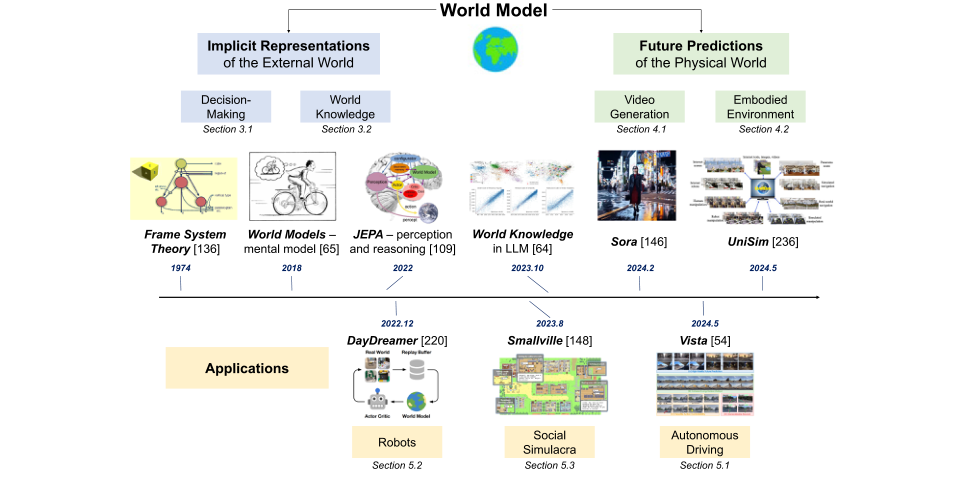
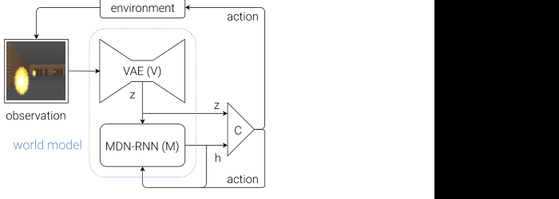
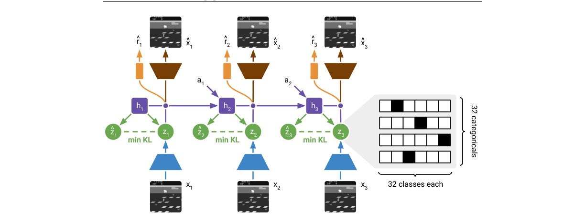
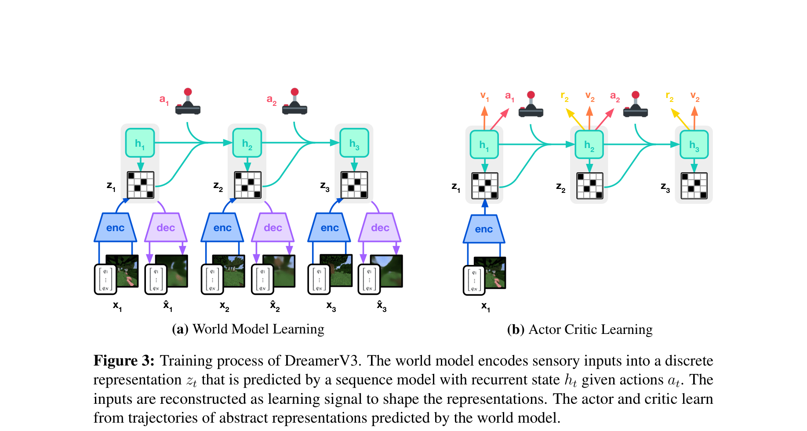
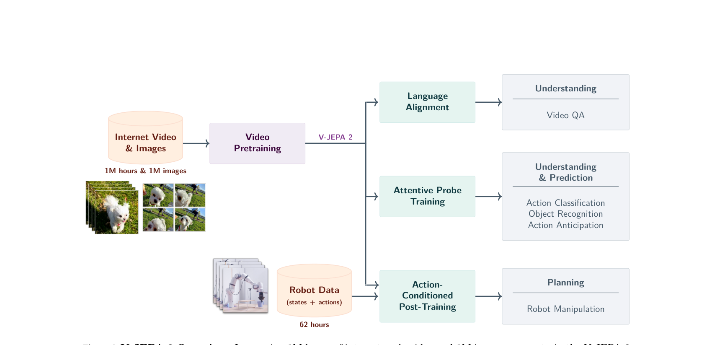
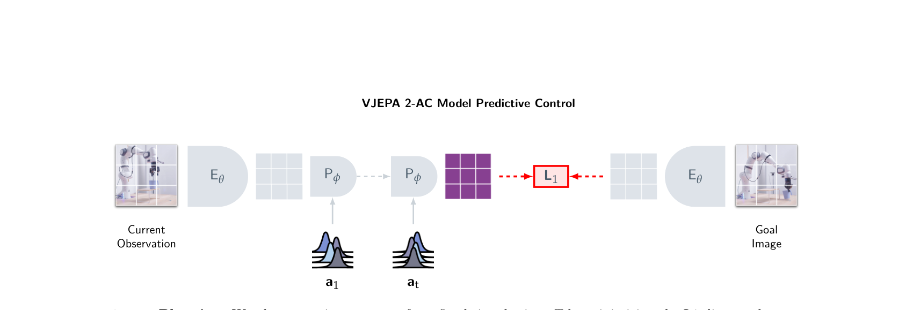
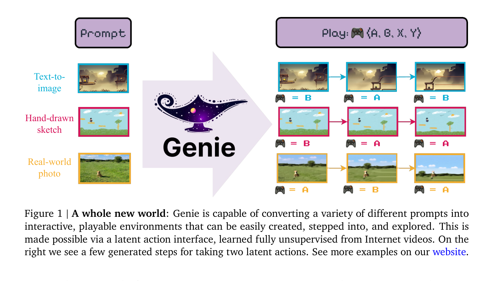

# 世界模型原理

> 从零开始，系统梳理世界模型的核心原理——先建立直觉，再逐步引入数学，深入讲解 RSSM 架构、训练目标与在想象中学习行为的每一环节。

### 关键术语

| 缩写 | 全称 | 含义 |
|------|------|------|
| WM | World Model | 世界模型，智能体对环境的内部动力学模型 |
| MBRL | Model-Based Reinforcement Learning | 基于模型的强化学习 |
| MFRL | Model-Free Reinforcement Learning | 无模型强化学习 |
| RSSM | Recurrent State-Space Model | 循环状态空间模型，Dreamer 系列的核心架构 |
| VAE | Variational Auto-Encoder | 变分自编码器 |
| MDN | Mixture Density Network | 混合密度网络 |
| MDN-RNN | Mixture Density Network RNN | 混合密度网络循环神经网络 |
| ELBO | Evidence Lower Bound | 证据下界 |
| KL | Kullback-Leibler Divergence | KL 散度 |
| ST | Straight-Through | 直通梯度估计器 |
| TD(λ) | Temporal Difference with λ-return | 时序差分 λ-回报 |
| V^λ | λ-Return Value Estimation | λ-回报值估计 |
| JEPA | Joint Embedding Predictive Architecture | 联合嵌入预测架构 |
| EMA | Exponential Moving Average | 指数移动平均 |
| VICReg | Variance-Invariance-Covariance Regularization | 方差-不变性-协方差正则化 |
| ST-Transformer | SpatioTemporal Transformer | 时空 Transformer，Genie 的骨干架构 |
| DiT | Diffusion Transformer | 扩散 Transformer，Sora 的骨干架构 |
| LAM | Latent Action Model | 隐式动作模型，从视频推断隐式动作 |
| VQ-VAE | Vector Quantized VAE | 向量量化变分自编码器 |
| CMA-ES | Covariance Matrix Adaptation Evolution Strategy | 协方差矩阵自适应进化策略 |
| MPC | Model Predictive Control | 模型预测控制 |

---

下图是 Ding et al., 2025 提出的世界模型整体框架，将世界模型研究分为两大主线——理解外部世界的隐式表征（Implicit Representations）和预测物理世界的未来（Future Predictions）。本文的章节安排与此框架对应：第 2-4 章聚焦基于隐式表征的决策（Model-based RL），第 5 章对比生成式预测与 JEPA 预测性表征，第 6 章讨论交互式世界模型。建议读者将此图作为学习路线图，随时对照当前所处的知识位置：



*来源：Ding et al., 2025 Fig.1*

---

## 1. 直觉：世界模型在做什么

### 1.1 从下棋推演说起

想象你在下围棋。面对一个复杂局面，你不会立刻落子，而是先在脑中推演：

- 如果我走这里，对手可能走那里
- 对手走那里后，我下一步可以走这里
- 这条路线看起来不错，但另一条路线似乎更稳妥

**这就是世界模型**——你在脑中构建了一个对围棋规则的内部模拟器，用它来预测未来、评估不同行动的优劣，而不需要在真实棋盘上把每一步都走出来。

**世界模型（World Model）** 的核心思想与此完全一致：智能体学习环境的动力学规律，构建一个内部模拟器，在想象中推演未来，从而更高效地做出决策。

### 1.2 Model-free vs Model-based

强化学习有两种基本范式，理解它们的差异是理解世界模型的起点：

| 对比维度 | Model-free RL | Model-based RL（世界模型） |
|----------|---------------|--------------------------|
| 学习方式 | 直接从真实交互中学习策略/价值函数 | 先学习环境模型，再在模型中训练策略 |
| 样本效率 | 低，需要大量真实交互（如 DQN 需要百万帧） | 高，可在想象中生成无限数据（10-100× 提升） |
| 计算开销 | 训练简单，推理直接 | 训练复杂（需学习模型），推理需模型推演 |
| 策略优化 | 策略梯度或 Q-learning | 在学到的世界模型中进行规划或策略搜索 |
| 典型代表 | DQN, PPO, SAC | Dreamer, MuZero, PlaNet |
| 核心优势 | 简单直接，不易受模型误差影响 | 样本效率高，支持规划与想象 |
| 核心劣势 | 样本效率低，难以处理稀疏奖励 | 模型误差会累积，长程预测困难 |

> **核心要点**：Model-free 只能从真实交互中学习，每次试错都要付出真实代价；Model-based 先学一个"模拟器"，在模拟器中试错是免费的——这就是世界模型的核心价值。

### 1.3 一个具体的例子

考虑一个小车避障任务：

- **Model-free 方法**：小车在真实环境中随机探索，撞墙 10000 次后才学会绕开障碍物。每次撞墙都是真实的失败。
- **Model-based 方法**：
  1. 先让小车在真实环境中探索 1000 次，收集 (状态, 动作, 下一状态, 奖励) 数据
  2. 用这些数据训练一个世界模型：输入当前状态和动作，预测下一状态和奖励
  3. 在世界模型中"想象"10000 次避障过程——撞墙不花任何真实代价
  4. 在想象中学会的策略，回到真实环境中只需微调 100 次即可

这个例子揭示了世界模型的本质：**把试错成本从真实世界转移到想象世界**。

### 1.4 世界模型的三种角色

世界模型在智能系统中扮演三种角色，对应不同的研究侧重：

| 角色 | 核心目标 | 代表工作 | 典型应用 |
|------|----------|----------|----------|
| **理解** | 构建环境的内部表征，理解状态含义 | JEPA (LeCun), VAE-based encoders | 表征学习、视觉理解 |
| **预测** | 给定当前状态和动作，预测未来状态 | RSSM, Sora, GAIA-1 | 视频预测、仿真 |
| **决策** | 支持规划、策略优化、动作选择 | Dreamer, MuZero, PlaNet | 机器人控制、游戏 |

> **核心要点**：一个完整的世界模型通常同时承担三种角色——它既要"看懂"当前状态（理解），又要"推演"未来（预测），还要"选择"最优动作（决策）。后续章节将围绕这三个角色展开。

---

## 2. 经典架构：Ha & Schmidhuber 2018

> 上一章建立了世界模型的直觉：智能体在脑中构建模拟器来预测未来、支持决策。一个自然的问题是：这个"模拟器"具体长什么样？2018 年 Ha & Schmidhuber 的工作给出了第一个完整的答案——V/M/C 三组件架构。本章拆解这个架构，为后续 RSSM 的改进做铺垫。

### 2.1 架构总览

Ha & Schmidhuber 2018 提出的世界模型由三个组件构成：



*来源：Ha & Schmidhuber, 2018 Fig.8*

用"眼睛→记忆→决策"的类比来理解：

- **V（Vision）**：像眼睛一样，把高维像素压缩成低维隐向量
- **M（Memory）**：像记忆一样，记住历史并预测下一个隐状态
- **C（Controller）**：像决策中枢，根据当前状态选择动作

整个流程是闭环的：

**闭环流程**：观测 $o_t$ → [V] → 隐状态 $z_t$ → [M] → 预测 $z_{t+1}$ → [C] → 动作 $a_t$ →（执行动作后回到新观测）

### 2.2 V：把像素压缩成隐向量

V 组件是一个 **VAE（Variational Auto-Encoder，变分自编码器）**，负责把高维观测（如 64×64×3 的图像）压缩成低维隐向量（如 32 维）。

**为什么用 VAE 而非普通自编码器？**

普通自编码器学到的是确定性映射：给定图像 → 隐向量。但世界模型需要处理不确定性——同一动作在不同随机因素下可能导致不同结果。VAE 的隐空间是概率分布（通常假设为高斯），天然适合表达这种不确定性。

**VAE 的前向过程**：

**VAE 前向流程**：
- 输入图像 $x$ 经过编码器，输出均值 $\mu$ 和标准差 $\sigma$
- 重参数化：$z = \mu + \sigma \cdot \epsilon$，其中 $\epsilon \sim \mathcal{N}(0, I)$
- 解码器将 $z$ 重建为图像 $\hat{x}$

**编码器架构**（Car Racing 实验）：

| 层 | 类型 | 输出尺寸 |
|----|------|----------|
| 输入 | — | 64×64×3 |
| Conv1 | 32 filters, 8×8, stride 2 | 32×32×32 |
| Conv2 | 64 filters, 6×6, stride 2 | 16×16×64 |
| Conv3 | 128 filters, 6×6, stride 2 | 8×8×128 |
| Conv4 | 256 filters, 4×4, stride 2 | 2×2×256 = 1024 |
| FC$_\mu$ | 1024 → 32 | 32 |
| FC$_\sigma$ | 1024 → 32 | 32 |

**解码器架构**（对称上采样）：

| 层 | 类型 | 输出尺寸 |
|----|------|----------|
| 输入 | z (32 维) | 32 |
| FC | 32 → 1024, reshape → 2×2×256 | 2×2×256 |
| DeConv1 | 128 filters, 6×6, stride 2 | 8×8×128 |
| DeConv2 | 64 filters, 6×6, stride 2 | 16×16×64 |
| DeConv3 | 32 filters, 8×8, stride 2 | 32×32×32 |
| Sigmoid | 3 filters, 8×8, stride 2 | 64×64×3 |

隐空间维度 **$z = 32$**。训练数据：从随机策略收集的 10,000 个回合，约 200-300 万帧 Car Racing 图像。

**重参数化技巧**：直接对 $z$ 采样会导致梯度无法回传。重参数化把随机性外提到 $\epsilon$，让 $z$ 对 $(\mu, \sigma)$ 可微：

$$z = \mu + \sigma \odot \epsilon, \quad \epsilon \sim \mathcal{N}(0, I)$$

**具体小例子**：假设输入是一张 4×4 灰度图（16 维），VAE 编码器输出 $\mu = [0.5, -0.3]$、$\sigma = [0.2, 0.1]$（2 维隐空间）。采样 $\epsilon = [0.8, -1.2]$，则：

$$z = [0.5, -0.3] + [0.2, 0.1] \odot [0.8, -1.2] = [0.5 + 0.16, -0.3 - 0.12] = [0.66, -0.42]$$

解码器把 $z = [0.66, -0.42]$ 映射回 16 维，得到重建图像。

VAE 的训练目标（ELBO）：

$$\mathcal{L}_{\text{VAE}} = \mathbb{E}_{q(z|x)}[\log p(x|z)] - \beta \cdot D_{\text{KL}}(q(z|x) \| p(z))$$

- 第一项：重建损失，让解码器能还原原始图像
- 第二项：KL 散度，让后验分布接近先验（通常为标准高斯），防止隐空间坍塌
- KL 权重 $\beta$ 设为极小值时，KL 项几乎不起作用，隐空间可以自由编码信息——这是 Ha & Schmidhuber 的设计选择，牺牲了隐空间的结构性（采样质量差），换来了更好的重建质量

### 2.3 M：预测下一个隐状态

M 组件是一个 **MDN-RNN（Mixture Density Network RNN，混合密度网络循环神经网络）**，负责根据历史隐状态和动作，预测下一个隐状态的概率分布。

**为什么用 MDN 而非单高斯？**

因为未来是多模态的。想象一个机器人在岔路口：左转到达 A，右转到达 B。单高斯只能预测一个"平均位置"（墙里），而 MDN 可以表达"要么在 A，要么在 B"的多峰分布。

**MDN-RNN 的架构**（Car Racing 实验）：

| 组件 | 规格 |
|------|------|
| RNN 类型 | LSTM（注意：不是 GRU，Dreamer 系列才改用 GRU） |
| LSTM 隐藏层 | 256 维 |
| 输入 | $[z_t, a_t]$ 拼接（32 + 3 = 35 维） |
| 高斯分量数 | **5 个**（$K = 5$） |
| 输出 | 混合权重 $\pi$（5 维）+ 均值 $\mu$（$5 \times 32$ 维）+ 标准差 $\sigma$（$5 \times 32$ 维） |

**MDN-RNN 的数学公式**：

给定当前隐状态 $z_t$、动作 $a_t$ 和 LSTM 隐状态 $h_t$，MDN-RNN 输出下一隐状态 $z_{t+1}$ 的概率分布：

$$p(z_{t+1} | z_t, a_t, h_t) = \sum_{k=1}^{K} \pi_k \cdot \mathcal{N}(z_{t+1} | \mu_k, \text{diag}(\sigma_k^2))$$

其中 $K = 5$ 是高斯分量数，$\pi_k$ 是混合权重（满足 $\sum \pi_k = 1$），$\mu_k$ 和 $\sigma_k$ 是第 $k$ 个高斯分量的均值和标准差。

**训练目标**：最小化负对数似然

$$\mathcal{L}_{\text{MDN-RNN}} = -\log p(z_{t+1} | z_t, a_t, h_t) = -\log \left( \sum_{k=1}^{K} \pi_k \cdot \mathcal{N}(z_{t+1} | \mu_k, \text{diag}(\sigma_k^2)) \right)$$

**具体数值演算**：假设隐状态是 2 维，MDN 用 3 个高斯分量。LSTM 输出：

- 混合权重：$\pi = [0.3, 0.6, 0.1]$（softmax 归一化）
- 分量 1：$\mu_1 = [0.5, 1.0]$，$\sigma_1 = [0.2, 0.1]$
- 分量 2：$\mu_2 = [2.0, -0.5]$，$\sigma_2 = [0.3, 0.4]$
- 分量 3：$\mu_3 = [-1.0, 3.0]$，$\sigma_3 = [0.5, 0.6]$

采样时，先按 $\pi$ 选分量（60% 概率选分量 2），再从选中的高斯采样。例如选到分量 2，则 $z_{t+1} \sim \mathcal{N}([2.0, -0.5], \text{diag}([0.09, 0.16]))$。

**计算负对数似然**：假设真实 $z_{t+1} = [1.8, -0.3]$

$$p(z_{t+1}) = 0.3 \cdot \mathcal{N}([1.8,-0.3]|[0.5,1.0],[0.2,0.1]) + 0.6 \cdot \mathcal{N}([1.8,-0.3]|[2.0,-0.5],[0.3,0.4]) + 0.1 \cdot \mathcal{N}([1.8,-0.3]|[-1.0,3.0],[0.5,0.6])$$

分量 2 的均值 [2.0, -0.5] 离 [1.8, -0.3] 最近，贡献最大（0.6 权重 × 高概率密度），所以损失较小——模型正确地把概率质量集中在了正确的模态上。

### 2.4 C：在梦境中训练策略

C 组件是一个**线性策略**：$a_t = W \cdot [z_t, h_t] + b$。它的输入是 VAE 隐向量 $z_t$（32 维）和 LSTM 隐状态 $h_t$（256 维）的拼接，输出是动作。

**为什么用线性策略 + 进化策略（CMA-ES）？**

因为控制器要在"梦境"（世界模型生成的想象轨迹）中训练。如果直接用梯度下降，梯度需要通过 RNN 和 VAE 回传，计算复杂且容易梯度消失。进化策略不需要梯度，直接在世界模型中评估不同参数的表现，选择表现最好的。

**CMA-ES（协方差矩阵自适应进化策略）**：

CMA-ES 是一种无梯度优化算法，核心思想是维护一个参数分布（多元高斯），每代从中采样一批参数向量，评估每个向量的适应度（在世界模型中的累计奖励），然后根据适应度更新分布的均值和协方差。

| CMA-ES 参数 | Car Racing 实验值 |
|-------------|------------------|
| 种群大小 | 64 个个体（每个个体 rollout 16 次取平均） |
| 迭代代数 | 约 1800 代 |
| 参数维度 | $(32 + 256) \times 3 + 3 = 867$（Car Racing 3 维动作） |
| 评估方式 | 每个参数向量在世界模型中 rollout 多次取平均奖励 |

**训练流程**（以 Doom 实验的"梦境训练"为例）：

1. 固定 V 和 M（已预训练好）
2. 用 V + M 构建一个"梦境环境"：给定初始状态 $z_0$（从真实数据随机采样），LSTM 预测 $z_{t+1}$ 的混合高斯分布，从中采样
3. CMA-ES 每代采样 64 组参数 $(W, b)$，每组在梦境中 rollout 一个完整回合
4. 按累计奖励排序，取最优的 ~25% 个体更新参数分布的均值和协方差
5. 重复约 1800 代，直到收敛

> **注意**：CarRacing 和 Doom 两个实验的训练方式不同。CarRacing 实验中，C 在**实际环境**中训练（V+M 作为特征提取器）；Doom 实验中，C 完全在**梦境环境**（DoomRNN）中训练，然后迁移到真实环境。

**关键实验结果**：

- **CarRacing**：C 在实际环境中用 V+M 特征训练，得分 **906 ± 21**（无模型直接训练约 632，论文附录的消融实验中加隐藏层后约 788）
- **Doom（梦境迁移）**：C 完全在梦境中训练，迁移到真实 DoomTakeCover-v0 得分 **1092 ± 556**，证明了"在想象中学习"的可行性

### 2.5 局限性

Ha & Schmidhuber 2018 的架构开创了世界模型的先河，但存在明显局限：

| 局限 | 具体表现 | 影响 |
|------|----------|------|
| MDN 表达能力有限 | 高斯混合难以表达复杂的离散状态转移 | 在 Atari 等离散环境中表现不佳 |
| 隐状态无结构 | 隐向量是扁平的，没有区分"确定性历史"和"随机未来" | 长序列预测时误差累积 |
| 训练分离 | V、M 预训练后固定，C 单独用进化策略优化 | 无法端到端优化，策略受限于模型质量 |
| 无奖励预测 | M 只预测隐状态，不预测奖励 | 策略评估需要额外环境交互 |

这些局限直接催生了下一代架构——RSSM。

---

## 3. 核心架构：RSSM

> 上一章拆解了 Ha & Schmidhuber 2018 的经典架构，发现 MDN-RNN 在表达离散状态转移和长程预测上存在明显不足。一个自然的问题是：如何设计一个更好的转移模型，既能记住历史，又能表达未来的不确定性？本章回答这个问题——RSSM（Recurrent State-Space Model，循环状态空间模型）。

### 3.1 为什么需要更好的转移模型

Ha & Schmidhuber 架构的核心问题是：**隐状态 $z_t$ 是扁平的**，没有区分"哪些信息是确定的（历史）"和"哪些信息是随机的（未来）"。

想象你正在开车：
- **确定性信息**：你已经行驶了 10 公里，当前速度 60km/h——这些是已发生的事实
- **随机信息**：前方路口是红灯还是绿灯——这是未知的，需要猜测

RSSM 的核心思想就是**把隐状态拆成两部分**：
- **$h_t$（确定性路径）**：用 RNN（GRU）记住历史，是"已经发生的事实"
- **$z_t$（随机性路径）**：用概率分布表达未来的不确定性，是"需要猜测的部分"

### 3.2 确定性 + 随机性：RSSM 的核心思想

RSSM 的状态分解：

$$s_t = (h_t, z_t)$$

- $h_t$：确定性隐状态，由 GRU 维护，压缩历史信息
- $z_t$：随机性隐状态，从概率分布中采样，表达当前时刻的不确定性

**信息流动**：

**RSSM 信息流**：
- 动作 $a_t$ 输入 GRU
- GRU 更新确定性状态：$h_t \leftarrow$ GRU$(h_{t-1}, z_{t-1}, a_{t-1})$
- 先验网络：$p(z_t | h_t)$ —— 仅用历史预测
- 后验网络：$q(z_t | h_t, o_t)$ —— 结合观测修正
- 从后验采样 $z_t$，与 $h_t$ 拼接成完整状态

**关键设计**：

1. **先验（Prior）**：$p(z_t | h_t)$ —— 只有历史 $h_t$，没有当前观测 $o_t$ 时的猜测
2. **后验（Posterior）**：$q(z_t | h_t, o_t)$ —— 有当前观测 $o_t$ 时的更准确的估计
3. **KL 正则**：训练时让先验接近后验，这样推理时（没有 $o_t$）也能做出合理猜测

> **核心要点**：RSSM 的核心创新不是某个单一技巧，而是**状态分解**——把"历史记忆"和"未来不确定性"拆成两条路径。确定性路径用 GRU 压缩历史，随机性路径用概率分布表达多模态未来。这一架构最初由 PlaNet（Hafner et al., 2018）提出，后被 Dreamer 系列继承和扩展。

### 3.3 RSSM 的数学框架

**符号定义**：

| 符号 | 维度 | 含义 |
|------|------|------|
| $o_t$ | 观测空间（如 64×64×3） | 时刻 $t$ 的原始观测（图像） |
| $a_t$ | 动作空间（如 3 维） | 时刻 $t$ 执行的动作 |
| $h_t$ | $d_h$ 维（如 600 维） | 确定性隐状态，GRU 的隐藏状态 |
| $z_t$ | $d_z$ 维（如 32 维） | 随机性隐状态，从分布中采样 |
| $s_t = (h_t, z_t)$ | $d_h + d_z$ 维 | 完整隐状态 |

**前向过程（有观测时——训练阶段）**：

1. **GRU 更新**：用上一时刻的完整状态和当前动作更新确定性路径

$$h_t = \text{GRU}(h_{t-1}, z_{t-1}, a_{t-1})$$

2. **后验编码**：用当前观测 $o_t$ 得到更准确的后验分布

$$q(z_t | h_t, o_t) = \mathcal{N}(\mu_t^{\text{post}}, \sigma_t^{\text{post}})$$

其中 $(\mu_t^{\text{post}}, \sigma_t^{\text{post}}) = \text{Encoder}(h_t, o_t)$

3. **采样**：从后验分布采样 $z_t$

$$z_t = \mu_t^{\text{post}} + \sigma_t^{\text{post}} \odot \epsilon, \quad \epsilon \sim \mathcal{N}(0, I)$$

**想象过程（无观测时——推理/规划阶段）**：

1. **GRU 更新**：同上

$$h_t = \text{GRU}(h_{t-1}, z_{t-1}, a_{t-1})$$

2. **先验预测**：没有观测 $o_t$，只能用先验猜测

$$p(z_t | h_t) = \mathcal{N}(\mu_t^{\text{prior}}, \sigma_t^{\text{prior}})$$

其中 $(\mu_t^{\text{prior}}, \sigma_t^{\text{prior}}) = \text{Prior}(h_t)$

3. **采样**：从先验分布采样 $z_t$

$$z_t = \mu_t^{\text{prior}} + \sigma_t^{\text{prior}} \odot \epsilon$$

**具体数值演算**：假设 $d_h = 4$，$d_z = 2$，走一遍 3 步序列：

**初始状态**：$h_0 = [0, 0, 0, 0]$，$z_0 = [0, 0]$

**t=1**：
- 动作 $a_0 = [1.0, 0.5]$
- GRU 更新：$h_1 = \text{GRU}(h_0, z_0, a_0) = [0.3, -0.2, 0.1, 0.4]$
- 观测 $o_1$ 到来，Encoder 输出：$\mu_1^{\text{post}} = [0.5, -0.3]$，$\sigma_1^{\text{post}} = [0.2, 0.1]$
- 采样 $\epsilon = [0.8, -1.2]$：$z_1 = [0.5 + 0.2 \times 0.8, -0.3 + 0.1 \times (-1.2)] = [0.66, -0.42]$
- Prior 输出：$\mu_1^{\text{prior}} = [0.4, -0.2]$，$\sigma_1^{\text{prior}} = [0.3, 0.2]$

**t=2**（想象模式，无观测）：
- 动作 $a_1 = [0.8, 0.3]$
- GRU 更新：$h_2 = \text{GRU}(h_1, z_1, a_1) = [0.5, 0.1, -0.1, 0.6]$
- 无观测，用 Prior：$\mu_2^{\text{prior}} = [0.3, 0.1]$，$\sigma_2^{\text{prior}} = [0.25, 0.15]$
- 采样 $\epsilon = [-0.5, 0.9]$：$z_2 = [0.3 + 0.25 \times (-0.5), 0.1 + 0.15 \times 0.9] = [0.175, 0.235]$

**t=3**（想象模式）：
- 动作 $a_2 = [0.5, 0.7]$
- GRU 更新：$h_3 = \text{GRU}(h_2, z_2, a_2) = [0.2, 0.4, 0.3, 0.1]$
- 用 Prior：$\mu_3^{\text{prior}} = [0.1, 0.3]$，$\sigma_3^{\text{prior}} = [0.2, 0.2]$
- 采样得到 $z_3$

这个例子展示了 RSSM 的关键特性：**确定性路径 $h_t$ 在想象模式下持续演化，随机路径 $z_t$ 每一步都从先验重新采样**。

### 3.4 从连续到离散：类别隐变量

Dreamer V1 中 $z_t$ 是连续高斯分布。但 Atari 等环境的状态转移本质上是离散的——吃豆人要么在位置 A，要么在位置 B，没有中间状态。

**Dreamer V2 的改进**：把 $z_t$ 从连续高斯改为 **$32 \times 32$ 类别分布**。

具体做法：
- 隐状态 $z_t$ 由 32 个独立的类别变量组成
- 每个类别变量有 32 个可能的取值
- 总共 $32^{32}$ 种组合，表达能力远超连续高斯

**为什么离散更适合 Atari？**

| 对比维度 | 连续高斯（Dreamer V1） | 离散类别（Dreamer V2） |
|----------|------------------------|------------------------|
| 表达能力 | 单峰，难以表达多模态 | 多峰，天然支持离散状态 |
| 梯度传播 | 重参数化，梯度平滑 | 直通估计器，梯度有偏但有效 |
| 信息容量 | 受方差约束 | 由类别数直接控制 |
| 适用环境 | 连续控制（如机器人） | 离散环境（如 Atari） |

**直通梯度估计器（Straight-Through, ST）**：

类别分布采样不可微。ST 估计器的做法是：

$$z_t = \text{one\_hot}(\arg\max_i(p_i)) + (p - \text{stop\_gradient}(p))$$

前向传播用 argmax 的硬采样，反向传播时梯度直接流过概率 $p$。虽然梯度有偏，但在实践中足够有效。

### 3.5 世界模型的训练目标

RSSM 的训练目标是一个扩展的 ELBO，包含四项：

$$\mathcal{L} = \underbrace{\mathbb{E}_{q}[\log p(o_t | s_t)]}_{\text{重建损失}} - \underbrace{\beta \cdot D_{\text{KL}}(q(z_t | h_t, o_t) \| p(z_t | h_t))}_{\text{KL 散度}} + \underbrace{\mathbb{E}_{q}[\log p(r_t | s_t)]}_{\text{奖励预测}} + \underbrace{\mathbb{E}_{q}[\log p(\gamma_t | s_t)]}_{\text{终止预测}}$$

**逐符号解释**：

- $o_t$：时刻 $t$ 的观测（图像）
- $s_t = (h_t, z_t)$：完整隐状态
- $r_t$：时刻 $t$ 的奖励
- $\gamma_t$：时刻 $t$ 的终止信号（是否结束）
- $q(z_t | h_t, o_t)$：后验分布（有观测）
- $p(z_t | h_t)$：先验分布（无观测）
- $\beta$：KL 权重系数

**重建损失**：让解码器能从隐状态还原原始观测

$$\log p(o_t | s_t) = -\|o_t - \text{Decoder}(s_t)\|^2$$

**KL 散度**：让先验接近后验，这样推理时（无观测）也能做出合理预测

$$D_{\text{KL}}(q \| p) = \frac{1}{2}\sum_i\left(\frac{(\mu^{\text{post}}_i - \mu^{\text{prior}}_i)^2}{(\sigma^{\text{prior}}_i)^2} + \frac{(\sigma^{\text{post}}_i)^2}{(\sigma^{\text{prior}}_i)^2} - 1 - \log\frac{(\sigma^{\text{post}}_i)^2}{(\sigma^{\text{prior}}_i)^2}\right)$$

**KL 平衡（Dreamer V2 技巧）**：

标准 KL 散度会让后验迁就先验，导致信息丢失。Dreamer V2 提出 KL 平衡：

$$\mathcal{L}_{\text{KL}} = \alpha \cdot D_{\text{KL}}(\text{sg}(q) \| p) + (1 - \alpha) \cdot D_{\text{KL}}(q \| \text{sg}(p))$$

其中 $\text{sg}$ 表示 stop-gradient（不计算梯度，固定该分布），$\alpha = 0.8$。

- 第一项 $\alpha \cdot D_{\text{KL}}(\text{sg}(q) \| p)$：固定后验 $q$，让先验 $p$ 去学习后验的模式（$\alpha = 0.8$ 时梯度主要流向先验）
- 第二项 $(1-\alpha) \cdot D_{\text{KL}}(q \| \text{sg}(p))$：固定先验 $p$，轻推后验 $q$ 使其不过分偏离（$(1-\alpha)=0.2$ 时梯度少量流向后验）
- $\alpha = 0.8$ 的权衡：更侧重于让先验学习后验的信息量，而非让后验坍塌到粗糙的先验

**具体数值演算**：假设 $d_z = 2$：

| | 维度 1 | 维度 2 |
|--|--------|--------|
| $\mu^{\text{post}}$ | 0.5 | -0.3 |
| $\sigma^{\text{post}}$ | 0.2 | 0.1 |
| $\mu^{\text{prior}}$ | 0.4 | -0.2 |
| $\sigma^{\text{prior}}$ | 0.3 | 0.2 |

计算 KL：

维度 1：
$$\frac{(0.5-0.4)^2}{0.3^2} + \frac{0.2^2}{0.3^2} - 1 - \log\frac{0.2^2}{0.3^2} = \frac{0.01}{0.09} + \frac{0.04}{0.09} - 1 - \log(0.444) = 0.111 + 0.444 - 1 + 0.811 = 0.366$$

维度 2：
$$\frac{(-0.3+0.2)^2}{0.2^2} + \frac{0.1^2}{0.2^2} - 1 - \log\frac{0.1^2}{0.2^2} = \frac{0.01}{0.04} + \frac{0.01}{0.04} - 1 - \log(0.25) = 0.25 + 0.25 - 1 + 1.386 = 0.886$$

总 $KL = (0.366 + 0.886) / 2 = 0.626$

**Free Bits（Dreamer V3 技巧）**：

标准 KL 散度存在**后验坍塌**（Posterior Collapse）问题：KL 项可能过早地将后验推向先验，导致隐变量不编码任何有用信息。Free Bits 对每个隐变量维度设置一个 KL 下限：

$$\text{KL}_{\text{free}, d} = \max(\lambda_{\text{free}}, \text{KL}_d)$$

其中 $\lambda_{\text{free}} = 1$ nat（自然单位的信息量），$d$ 是隐变量的每个维度。

**直觉**：当某个维度的 KL 低于 1 nat 时，不对该维度施加 KL 惩罚——允许它"自由"编码信息。只有当 KL 超过 1 nat 时才计算惩罚。这确保每个隐变量维度至少编码 1 nat 的信息，防止后验坍塌到先验。

**具体数值演算**：接上面的例子，维度 1 的 $\text{KL} = 0.366 < 1$ nat，维度 2 的 $\text{KL} = 0.886 < 1$ nat。使用 Free Bits 后：

- 维度 1：$\max(1, 0.366) = 1$（不施加惩罚，允许自由编码）
- 维度 2：$\max(1, 0.886) = 1$（同样不施加惩罚）

两个维度的 KL 都低于 1 nat 下限，Free Bits 机制让它们免受 KL 惩罚，鼓励隐变量编码更多信息。

### 3.6 RSSM 训练算法

将上述所有组件组合起来，RSSM 世界模型的训练算法如下：

```python
# RSSM 世界模型训练（Dreamer V2 风格）
for batch in replay_buffer.sample(batch_size=50, seq_len=50):
    h = zeros(batch_size, d_h)          # 初始化确定性状态
    z = zeros(batch_size, d_z)          # 初始化随机性状态
    
    loss_recon = 0
    loss_kl = 0
    loss_reward = 0
    loss_discount = 0
    
    for t in range(seq_len):
        # 1. GRU 更新确定性路径
        h = GRU(h, z, batch.action[t-1])
        
        # 2. 编码观测
        e_t = Encoder(batch.obs[t])
        
        # 3. 先验分布（无观测时的猜测）
        prior_logits = PriorNet(h)
        prior = Categorical(prior_logits)  # 32×32 类别分布
        
        # 4. 后验分布（有观测时的修正）
        post_logits = PosteriorNet(h, e_t)
        post = Categorical(post_logits)
        
        # 5. 采样隐变量（直通估计器）
        z = straight_through_sample(post)
        
        # 6. 计算损失
        s = concat(h, z)
        loss_recon += -log_prob(Decoder(s), batch.obs[t])
        loss_reward += -log_prob(RewardHead(s), batch.reward[t])
        loss_discount += -log_prob(DiscountHead(s), batch.discount[t])
        
        # KL 平衡 + Free Bits
        # α=0.8: 让先验学后验 (梯度流向 prior)
        kl_prior_learn = KL(sg(post), prior)
        # 0.2: 让后验不坍塌 (梯度流向 posterior)  
        kl_post_reg = KL(post, sg(prior))
        kl_per_dim = 0.8 * kl_prior_learn + 0.2 * kl_post_reg
        loss_kl += sum(max(1.0, kl_d) for kl_d in kl_per_dim)  # Free Bits
    
    total_loss = loss_recon + loss_kl + loss_reward + loss_discount
    total_loss.backward()
    optimizer.step()
```

**关键设计选择总结**：

| 设计 | 选择 | 原因 |
|------|------|------|
| KL 平衡 | $\alpha = 0.8$ | 侧重让先验学习后验的模式，保留后验的信息量 |
| Free Bits | $\lambda = 1$ nat | 防止后验坍塌，确保每个维度编码足够信息 |
| 离散隐变量 | $32 \times 32$ 类别 | 天然支持多模态，适合离散环境 |
| 直通估计器 | ST Gumbel-Softmax | 前向硬采样，反向软梯度 |
| 批次设置 | batch=50, seq=50 | 平衡训练效率和序列依赖建模 |

### 3.7 RSSM 架构图



*来源：Hafner et al., 2020 Fig.2 (Dreamer V2)*

这张图展示了 RSSM 的完整信息流动：

- **$h_t$（紫色）**：确定性路径，GRU 维护的历史状态，随时间步展开（$h_1 \to h_2 \to h_3$）
- **$z_t$（绿色）**：随机性路径，每步从后验分布采样，与 $h_t$ 拼接成完整状态
- **编码器（蓝色）**：观测 $x_t$ 经 CNN 编码，产生后验分布参数
- **先验 $\hat{z}_t$（浅绿色）**：$h_t$ 直接产生的先验猜测，与后验 $z_t$ 之间计算 KL 散度
- **解码器（棕色）**：从 $s_t = (h_t, z_t)$ 重建观测 $\hat{x}_t$、预测奖励 $\hat{r}_t$
- **离散隐变量（右侧）**：Dreamer V2 的 $32 \times 32$ 类别分布，每步从 32 个类别中各选 1 个值

---

## 4. 在想象中学习行为：Dreamer 系列

> 上一章建立了 RSSM 的数学框架——如何用确定性路径记住历史、用随机性路径表达不确定性。一个自然的问题是：学好了世界模型，怎么用它来学习行为？本章回答这个问题——Dreamer 系列如何在"梦境"中训练 Actor-Critic。

### 4.1 核心思想

Dreamer 的核心思想可以概括为一句话：**用 RSSM 生成想象轨迹，在想象中训练 Actor-Critic，然后把学到的策略应用到真实环境**。



*来源：Hafner et al., 2023 Fig.3*

这张图展示了 Dreamer 的训练循环：

1. 从真实环境收集数据，存入回放缓冲区
2. 用回放缓冲区的数据训练 RSSM 世界模型
3. 用 RSSM 生成想象轨迹（ rollout ）
4. 在想象轨迹上训练 Actor（策略）和 Critic（价值函数）
5. 用 Actor 在真实环境中执行动作，收集新数据
6. 回到步骤 2，循环迭代

### 4.2 Actor-Critic 在梦境中训练

**想象轨迹的生成**：

**想象轨迹生成算法**：
1. 从回放缓冲区采样一个真实状态 $s_t$
2. for $k = 1$ to $H$ ($H$ = 想象步长，如 15)：
   - $a_{t+k} = \text{Actor}(s_{t+k})$ —— 策略选择动作
   - $s_{t+k+1} \sim \text{RSSM}(s_{t+k}, a_{t+k})$ —— 世界模型预测下一状态
   - $r_{t+k} = \text{RewardPredictor}(s_{t+k})$ —— 预测奖励
3. 保存轨迹 $\{(s, a, r)\}_{t+1}^{t+H}$

**价值估计**：Dreamer 使用 $\lambda$-回报（$V^\lambda$）来估计状态价值：

$$V^{\lambda}_t = r_t + \gamma \left((1 - \lambda) V(s_{t+1}) + \lambda (r_{t+1} + \gamma V^{\lambda}_{t+1})\right)$$

其中：
- $\gamma$：折扣因子（如 0.99）
- $\lambda$：权衡参数（如 0.95），$\lambda=1$ 时退化为蒙特卡洛回报，$\lambda=0$ 时退化为 TD(0)

**具体数值演算**：假设 $\gamma = 0.99$，$\lambda = 0.95$，想象轨迹（奖励，价值估计）：

| 步 | 奖励 $r_t$ | $V(s_t)$ |
|----|----------|--------|
| 1 | 1.0 | 5.0 |
| 2 | 0.5 | 4.5 |
| 3 | 2.0 | 6.0 |
| 4 | 0.0 | 0.0（终止） |

从后往前计算 $V^\lambda$：

$V^\lambda_4 = 0$（终止）

$V^\lambda_3 = r_3 + \gamma \cdot V(s_4) = 2.0 + 0.99 \times 0 = 2.0$

$V^\lambda_2 = r_2 + \gamma \cdot [(1-\lambda) \cdot V(s_3) + \lambda \cdot V^\lambda_3]$
$\quad = 0.5 + 0.99 \times [0.05 \times 6.0 + 0.95 \times 2.0]$
$\quad = 0.5 + 0.99 \times [0.3 + 1.9]$
$\quad = 0.5 + 0.99 \times 2.2$
$\quad = 0.5 + 2.178 = 2.678$

$V^\lambda_1 = r_1 + \gamma \cdot [(1-\lambda) \cdot V(s_2) + \lambda \cdot V^\lambda_2]$
$\quad = 1.0 + 0.99 \times [0.05 \times 4.5 + 0.95 \times 2.678]$
$\quad = 1.0 + 0.99 \times [0.225 + 2.544]$
$\quad = 1.0 + 0.99 \times 2.769$
$\quad = 1.0 + 2.741 = 3.741$

**策略优化**：Dreamer 使用**解析梯度**通过世界模型反传。与 REINFORCE 或 CEM 不同，解析梯度直接计算 $\partial V / \partial a$，然后反传通过 RSSM 的预测网络，得到 $\partial V / \partial \theta_{\text{Actor}}$。

为什么解析梯度更高效？

| 方法 | 原理 | 方差 | 计算开销 |
|------|------|------|----------|
| REINFORCE | 蒙特卡洛采样估计梯度 | 高 | 需要大量样本 |
| CEM | 进化策略，无梯度 | 无梯度 | 需要大量评估 |
| 解析梯度 | 直接通过模型反传 | 低 | 只需一次前向+反向 |

解析梯度的前提是：世界模型可微。RSSM 的确定性路径（GRU）和连续隐变量（或 ST 估计器）保证了这一点。

**Actor-Critic 训练算法**：

```python
# Dreamer Actor-Critic 训练（在想象轨迹上，V2/V3 风格）
for _ in range(training_steps):
    # 1. 从回放缓冲区采样起始状态
    s_t = replay_buffer.sample_state()
    
    # 2. 生成想象轨迹（world model rollout）
    trajectory = []
    s = s_t
    for k in range(H):                     # V2: H=15, V3: H=15
        a = Actor(s)                       # 策略选择动作
        s_next = RSSM.imagine_step(s, a)   # 世界模型预测下一状态
        r = RewardPredictor(s)             # 预测奖励
        trajectory.append((s, a, r))
        s = s_next
    
    # 3. 计算 λ-回报 V^λ
    V_lambda = compute_lambda_return(
        trajectory, Critic, gamma=0.997, lam=0.95
    )                                      # V2: gamma=0.995, V1: gamma=0.99
    
    # 4. 更新 Critic（回归 V^λ）
    for k, (s, a, r) in enumerate(trajectory):
        V_pred = Critic(s)
        loss_critic += (V_pred - sg(V_lambda[k])) ** 2
    # Dreamer V3: 改用 Two-Hot 分布的交叉熵损失（255 bins）
    
    # 5. 更新 Actor（最大化 V^λ）
    for k, (s, a, r) in enumerate(trajectory):
        loss_actor += -V_lambda[k]              # 最大化价值
        loss_actor -= eta * entropy(Actor(s))   # 熵正则
    # Dreamer V3: 使用 5th-95th 百分位范围归一化 V^λ
    
    loss_critic.backward()
    loss_actor.backward()
    critic_optimizer.step()
    actor_optimizer.step()
```

**Dreamer V2 与 V3 的 Actor-Critic 关键差异**：

| 维度 | Dreamer V2 | Dreamer V3 |
|------|-----------|-----------|
| Critic 输出 | 标量价值 $V(s)$ | **分布式价值**（255 bins 概率分布） |
| Actor 目标 | 最大化 $\mathbb{E}[V^\lambda]$ | 最大化 **$V^\lambda$（5th-95th 百分位归一化）** |
| 价值回归 | MSE 损失 | **Two-Hot 交叉熵** |
| 回报归一化 | 均值/标准差 | **百分位数** |
| 熵正则 | 固定系数 | 自适应系数 |
| 超参数 | 需按任务调参 | **所有任务共享一套** |

**分布式价值函数**（Dreamer V3 核心创新）：

传统 Critic 输出标量 $V(s)$，但价值本身有不确定性（不同轨迹的回报差异大）。V3 的 Critic 输出价值的概率分布：将价值范围离散化为 255 个等间距 bin，输出 255 维 softmax 分布。训练时将 $V^\lambda$ 投影到最近的 bin 计算交叉熵，推理时取分布的期望。

**为什么分布式更好？** 价值的不确定性被保留在分布中，梯度信号更丰富——类似 C51 (Bellemare et al., 2017) 的思想。标量 Critic 只能预测均值，丢失了分布信息。

**鲁棒统计量**：V3 在多处使用百分位数替代均值，提高对异常值的鲁棒性。Actor 损失使用 5th-95th 百分位范围对 $V^\lambda$ 做归一化，而非简单期望，避免少数极端轨迹主导梯度。

### 4.3 Dreamer V1→V2→V3→V4 演进

| 特性 | Dreamer V1 (2019) | Dreamer V2 (2020) | Dreamer V3 (2023) | Dreamer V4 (2025) |
|------|-------------------|-------------------|-------------------|-------------------|
| **隐变量类型** | 连续高斯 ($d_z=30$) | $32 \times 32$ 离散类别 | $32 \times 32$ 离散类别 | 连续表示（Flow Matching） |
| **骨干网络** | GRU ($d_h=200$) | GRU ($d_h=600$) | GRU ($d_h=512$) | Block-Causal Transformer（空间/时间注意力交替） |
| **训练方式** | 解析梯度（BPTT 穿过多步模型） | 解析梯度 + ST 估计器 | 固定超参数，Free Bits | 纯离线三阶段训练 |
| **KL 技巧** | Free Nats ($3.0$ nat) | KL Balancing ($\alpha=0.8$) | KL Balancing + Free Bits ($1$ nat) | Shortcut Forcing（无 KL） |
| **Actor 输出** | tanh 变换高斯 | tanh 变换高斯 | tanh 变换高斯 | PMPO 策略优化 |
| **价值学习** | 标量 TD($\lambda$) | 标量 TD($\lambda$) | Two-Hot 分布 TD($\lambda$) | symexp Two-Hot TD($\lambda$) |
| **世界模型 LR** | 6e-4 | 2e-4 | 1e-4 | — |
| **Actor LR** | 8e-5 | 4e-5 | 3e-5 | — |
| **关键结果** | DMC 20 任务超越 D4PG | Atari 超越 DQN | 150+ 任务统一超参数 | 离线 Minecraft 钻石 |
| **里程碑** | RSSM + 解析梯度 | 离散隐变量突破 | Minecraft 挖钻石 | 2B 参数 Transformer 世界模型 |

**逐代核心改进**：

**V1 → V2**：
- 核心问题：连续高斯在 Atari 等离散状态转移环境中表现不佳
- 解决方案：$32 \times 32$ 离散类别隐变量 + KL Balancing
- V1 的 Free Nats（$3.0$ nat）被替换为 V2 的 KL Balancing（$\alpha=0.8$），前者是对 KL 统一设置下限，后者是通过非对称梯度来平衡先验/后验的学习
- 结果：在 Atari 55 款游戏上超越 DQN，首次证明世界模型在离散环境上的有效性

**V2 → V3**：
- 核心问题：超参数敏感，每个任务需要调参
- 解决方案：固定超参数设计 + Free Bits（KL 下限）+ 分布式价值函数 + 鲁棒统计量
- 结果：同一套超参数在 150+ 任务上工作，包括 Minecraft 挖钻石的里程碑

**Dreamer V3 固定超参数**（所有任务共享）：

| 超参数 | 值 |
|--------|-----|
| Batch size | 16 |
| Sequence length | 64 |
| 想象步长 H | 15 |
| GRU 隐藏层 | 512（单层 GRU + 512 维预测器 MLP） |
| 离散隐变量 | $32 \times 32$ 类别 |
| KL 平衡 $\alpha$ | 0.8 |
| Free Bits $\lambda$ | 1 nat |
| 折扣因子 $\gamma$ | 0.997 |
| TD($\lambda$) | 0.95 |
| 世界模型学习率 | 1e-4 |
| Actor 学习率 | 3e-5 |
| Critic 学习率 | 3e-5 |
| 回放缓冲区 | 1M |

> **核心要点**：Dreamer V3 的"固定超参数"不是技术炫技，而是降低应用门槛的关键——让不懂 RL 调参的工程师也能用上世界模型。

**V3 → V4**：
- 核心问题：GRU 的长程依赖能力有限，离线数据利用不足
- 解决方案：Transformer 替代 GRU + Flow Matching 动力学 + Shortcut Forcing + 纯离线视频学习
- V4 废弃了 RSSM 中的 GRU 及 KL 散度训练，改用连续表示 + Flow Matching + 扩散去噪
- 三阶段全离线训练流水线：世界模型预训练 → Agent 微调（插入 Agent Token）→ 想象训练
- 结果：2B 参数，首次纯离线获取 Minecraft 钻石（仅用 VPT 1/100 数据量），单 H100 GPU 上 K=4 采样步达 21.4 FPS 实时交互

**Shortcut Forcing**（Dreamer V4 核心技术）：

Dreamer V4 基于 **Flow Matching** 框架构建动力学模型。与传统自回归（Teacher Forcing）不同，Shortcut Forcing 结合了 Shortcut Models（一致性模型）和 Diffusion Forcing 的思想：

- **前向加噪**：将干净表征 $z_1$ 与高斯噪声 $z_0$ 按信号水平 $\tau$ 混合：$\tilde{z} = (1-\tau) \cdot z_0 + \tau \cdot z_1$
- **x-prediction 目标**：直接用 Flow Matching 预测干净表征 $\hat{z}_1 = f_\theta(\tilde{z}, \tau, d, a)$，避免 v-prediction 引入的高频伪影
- **多步联合训练**：同时训练不同步长 $d \in \{1, 2, 4, 8, \ldots, 64\}$ 的 Shortcut，大步长用 Bootstrap 损失监督
- **推理效率**：只用 $K=4$ 次前向传播即可完成单帧生成（$d=1/4$），在 H100 上达到 21.4 FPS

这不同于普通的 Scheduled Sampling——Shortcut Forcing 的核心是让模型学会在任意噪声水平下做固定步长的去噪跳转，而非随机混合真实/预测输入。

### 4.4 Dreamer V3 的关键实验

Dreamer V3 最著名的实验是在 Minecraft 中**从零开始挖钻石**。这是一个极具挑战性的任务：

- 需要学会：找木头 → 做工作台 → 做木镐 → 挖石头 → 做石镐 → 挖铁矿 → 做铁镐 → 挖钻石
- 奖励设计：里程碑奖励（每获得一个关键物品 +1 分，共 12 个里程碑，总分 0-12）
- 时间跨度长：需要数百步的连续操作
- **无需人类演示数据**，完全从零探索

**实验结果**：40 次独立运行中 **24/40 次成功挖到钻石**（60% 成功率），约 100M 步环境交互（~10 天 GPU 时间）。所有 model-free 方法（PPO, Rainbow, IQN）在 100M 步内从未挖到钻石。

**实验覆盖范围**：Atari 100k, Atari 200M, DMC, DMLab, Minecraft, BabyAI, Crafter——共 150+ 任务，同一套超参数。

**Dreamer V4 的 Minecraft 离线钻石**：

V4 首次实现了**纯离线**的 Minecraft 钻石获取，是一个重大突破：

| 方法 | 石镐成功率 | 铁镐成功率 | 钻石成功率 | 数据来源 |
|------|-----------|-----------|-----------|---------|
| VPT（OpenAI）离线 | 低 | 极低 | 0% | ~7000 年游戏时间数据 |
| BC（Gemma 3 VLA） | 中等 | 11% | 0% | — |
| Dreamer V4 BC only | 90%+ | — | — | 离线数据集 |
| **Dreamer V4 想象训练** | **90%+** | **29%** | **0.7%** | **仅用 VPT 1/100 数据** |

- 任务需要从原始像素选择超过 20,000 步的鼠标和键盘动作序列
- 世界模型的表征用于行为克隆时，效果优于 Gemma 3（通用视觉语言模型）
- 在 Overworld 训练的模型可泛化到未见过的 Nether（下界）场景

---

## 5. 两条路线：生成式 vs 预测性

> 上一章深入讲解了 Dreamer 系列——世界模型在强化学习中的核心应用。但世界模型的价值不止于 RL：视频生成模型（如 Sora）本质上也是世界模型，LeCun 的 JEPA 架构则走了一条完全不同的路。本章对比这两条路线，理解它们的设计哲学差异。

### 5.1 像素空间 vs 表征空间

世界模型有两种根本不同的预测目标：

| 对比维度 | 生成式世界模型 | 预测性世界模型 (JEPA) |
|----------|--------------|----------------------|
| **预测目标** | 像素/Token（重建未来帧） | 表征（预测未来表征） |
| **预测空间** | 高维像素空间 | 低维嵌入空间 |
| **信息损失** | 保留所有细节（包括噪声） | 丢弃无关细节，保留语义 |
| **计算开销** | 高（生成高维数据） | 低（预测低维向量） |
| **物理一致性** | 像素级一致，但物理规律可能错 | 语义级一致，物理规律内化于表征 |
| **代表工作** | Sora, GAIA-1, UniSim | I-JEPA, V-JEPA, V-JEPA 2 |
| **核心人物** | OpenAI, Wayve | LeCun (Meta) |

> **核心要点**：生成式模型在像素空间"画"出未来，JEPA 在表征空间"想"出未来。前者直观但计算昂贵，后者抽象但更接近智能的本质。

### 5.2 生成式世界模型

**Sora：视频生成作为世界模拟器**

Sora 的核心架构是 **Diffusion Transformer (DiT)**：

- 把视频帧切分成时空 Patch（Spacetime Patches）
- 用 Transformer 在 Patch 级别做扩散去噪
- 条件生成：文本提示 + 初始帧 → 未来视频

**DiT 架构详解**：

| 组件 | 设计 |
|------|------|
| 视频输入 | 压缩到低维潜在空间（类似 VAE 编码器） |
| Patchify | 将潜在表示切分为时空 Patch（如 2×2×2） |
| Transformer Block | 多头自注意力 + adaLN-Zero 条件化 + FFN |
| 条件注入 | 时间步 t 和文本 prompt 通过 adaLN-Zero 注入每层 |
| 输出 | 预测噪声（与输入同维度），经 VAE 解码器还原为视频 |

**adaLN-Zero 条件化**：与 U-Net 通过正弦编码注入时间步不同，DiT 使用自适应层归一化（adaLN）。时间步 $t$ 和文本条件经 MLP 映射为 $(\gamma, \beta, \alpha)$ 参数，控制每层的 LayerNorm 和残差连接：$\text{adaLN}(h) = (1 + \gamma) \odot \text{LayerNorm}(h) + \beta$，残差输出 $h' = \alpha \odot \text{Attention}(\text{adaLN}(h)) + h$。Zero 初始化（$\gamma, \alpha \approx 0$）确保训练初期条件化模块几乎不起作用，训练更稳定。

**Sora 的关键设计选择**：

| 设计 | 选择 | 原因 |
|------|------|------|
| 骨干网络 | Transformer（替代 U-Net） | 可扩展性：参数量增加时性能持续提升 |
| Patch 大小 | 时空联合 Patch | 同时捕获空间和时间维度的局部结构 |
| 潜在空间 | 先压缩再扩散 | 降低计算量（如 8×8×8 压缩比） |
| 训练数据 | 大规模互联网视频 | 覆盖多样化场景和物理规律 |

Sora 引发了一个关键争议：**它是否真正理解物理世界？**

- **支持方**：Sora 能生成符合物理规律的视频（物体碰撞、流体运动）
- **反对方**：它只是在像素层面模仿训练数据的统计规律，没有真正的物理理解

> **核心要点**：Sora 的"物理一致性"是涌现的（emergent），不是内化的。它能生成"看起来对"的视频，但不保证"物理上对"——比如一个球穿过墙壁的视频，如果训练数据中没有足够的碰撞样本，Sora 可能生成错误的物理。

**GAIA-1：自动驾驶世界模型**

GAIA-1 采用自回归 + 扩散的混合架构：

- 自回归模型：逐帧生成视频序列
- 扩散模型：每帧内部用扩散生成高质量图像
- 动作条件：输入驾驶动作（转向、油门），生成对应的未来场景

**具体小例子**：给定当前驾驶场景（前方路口）+ 动作"左转"，GAIA-1 生成：
- 车辆开始左转
- 路口左侧建筑进入视野
- 对向车道车辆保持静止

### 5.3 JEPA 架构



*来源：Feichtenhofer et al., 2025 Fig.1*

**LeCun 的核心论点**：

在《A Path Towards Autonomous Machine Intelligence》中，LeCun 提出了对世界模型的根本性质疑：

1. **像素级重建是浪费**：预测每一个像素的值需要巨大的计算量，但大部分像素信息对决策无关
2. **自回归不是通向 AGI 的路**：逐 Token 生成效率低下，且无法表达并行推理
3. **真正的理解在表征层面**：智能体需要学会"什么重要"的抽象表征，而非"每个像素是什么"

**JEPA 的核心架构**：

JEPA（Joint Embedding Predictive Architecture，联合嵌入预测架构）由三个组件构成：

**JEPA 架构**：
- 上下文 $x_1$ 经编码器 E 得到表征 $y_1$
- 目标 $x_2$ 经编码器 E 得到表征 $y_2$
- 预测器 P 根据 $y_1$ 预测 $\hat{y}_2$
- 目标：最小化 $\|\hat{y}_2 - y_2\|$

- **编码器 E**：把输入（图像/视频帧）映射到嵌入空间
- **预测器 P**：给定上下文表征 $y_1$，预测目标表征 $\hat{y}_2$
- **目标**：让预测表征 $\hat{y}_2$ 接近真实目标表征 $y_2$

**关键设计**：

1. **双编码器**：上下文和目标用同一套编码器参数（或 EMA 同步的编码器）
2. **在嵌入空间预测**：不预测像素，预测的是高维嵌入向量
3. **防止表征坍塌**：如果没有正则化，模型可能学到平凡的表征（如所有输入映射到同一个向量）。I-JEPA 使用 **VICReg** 正则化（V-JEPA 2 改用 L1 损失，见下文）：

$$\mathcal{L}_{\text{VICReg}} = \underbrace{\frac{1}{d}\sum_{j=1}^{d} \max(0, \gamma - \text{std}(Y_{:,j}))}_{\text{方差项}} + \underbrace{\frac{1}{d}\sum_{j=1}^{d} \|Y_{:,j} - \hat{Y}_{:,j}\|^2}_{\text{不变性项}} + \underbrace{\frac{1}{d(d-1)}\sum_{j \neq k} [C(Y)_{j,k}]^2}_{\text{协方差项}}$$

逐项解释：

- **方差项**：确保每个维度的标准差至少为 $\gamma$（通常 $\gamma = 1.0$）。如果 $\text{std}(Y_{:,j}) < \gamma$，则产生惩罚；否则为 0。这防止所有样本映射到同一个点（表征坍塌）
- **不变性项**：让预测表征 $\hat{Y}$ 接近目标表征 $Y$。这是 JEPA 的核心——在嵌入空间做预测
- **协方差项**：让不同维度去相关。$C(Y)$ 是表征的协方差矩阵，非对角线元素 $C(Y)_{j,k}$ 应接近 0。去相关确保每个维度编码不同的信息，最大化信息量

**为什么需要三项**？只用不变性项会导致坍塌（所有输入 → 同一向量，不变性损失 = 0）。方差项防止坍塌，协方差项防止冗余——三项缺一不可。

**双编码器的 EMA 同步**：

上下文编码器和目标编码器不共享参数，而是通过 EMA（指数移动平均）同步：

$$\theta_{\text{target}} \leftarrow \tau \cdot \theta_{\text{target}} + (1 - \tau) \cdot \theta_{\text{context}}$$

$\tau$ 从 0.999 线性增到 1.0。EMA 确保目标编码器缓慢更新，为目标表征提供稳定的训练信号——如果两个编码器完全同步，预测任务太简单；如果完全不同步，预测任务太难。EMA 在两者之间取得平衡。

**I-JEPA → V-JEPA → V-JEPA 2 演进**：

| 版本 | 输入 | 预测目标 | 关键创新 |
|------|------|----------|----------|
| I-JEPA | 静态图像 | 图像内部被掩码的块 | 无需数据增强的图像自监督 |
| V-JEPA | 视频 | 未来帧的表征 | 从静态到动态，学习时空表征 |
| V-JEPA 2 | 视频 + 动作 | 动作条件下的未来表征 | 从"理解"到"预测+决策" |

**V-JEPA 2 架构细节**：

| 组件 | 规格 |
|------|------|
| 骨干网络 | ViT-H（ViT-Huge） |
| 参数量 | ~600M |
| 层数 | 32 |
| 隐藏维度 | 1280 |
| 注意力头数 | 16 |
| Patch 大小 | 16×16（空间），2 帧（时间 tubelet） |
| 输入 | 视频片段（16 帧 × 256×256） |
| 掩码策略 | 多块掩码（继承自 I-JEPA 的掩码策略） |

**V-JEPA 2 的动作条件预测**：

V-JEPA 2 在 JEPA 基础上引入动作条件，使其从"被动理解"升级为"主动预测"：

1. 上下文编码器编码视频帧 $x_1, \ldots, x_t$ → 上下文表征
2. 动作 $a_t$ 通过嵌入层映射为动作向量
3. 预测器输入：[上下文表征, 动作向量]
4. 预测器输出：下一帧的表征预测 $\hat{y}_{t+1}$
5. 训练目标：最小化 $\|\hat{y}_{t+1} - \text{sg}(\text{TargetEncoder}(x_{t+1}))\|_1$（L1 损失）

**V-JEPA 2 的规划算法**（基于模型预测控制 MPC）：

1. 给定当前观测序列 $x_{1:t}$ 和候选动作集 $\{a^1, a^2, \ldots, a^N\}$
2. 对每个候选动作 $a^i$：预测未来表征 $\hat{y}^i_{t+1} = \text{Predictor}(\text{repr}(x_{1:t}), a^i)$
3. 用能量函数评估：$E(\hat{y}^i_{t+1}) = \|\hat{y}^i_{t+1} - y_{\text{goal}}\|_1$，其中 $y_{\text{goal}}$ 是目标图像的表征
4. 用交叉熵方法（CEM）优化动作序列，选择使能量最低的动作 $a^*$

规划不需要可学习的奖励模型——目标直接由目标图像的表征指定，通过能量最小化找到最接近目标的未来。



*来源：Feichtenhofer et al., 2025 Fig.7*

这张图展示了 V-JEPA 2 的动作条件预测：输入视频帧和候选动作，预测未来表征，选择使未来表征最优的动作。

### 5.4 两条路线的对比

| 对比维度 | 生成式世界模型 | JEPA |
|----------|--------------|------|
| 预测空间 | 像素/Token | 嵌入向量 |
| 计算效率 | 低（生成高维数据） | 高（预测低维向量） |
| 可解释性 | 高（直接看生成的视频） | 低（表征是抽象的） |
| 物理一致性 | 像素级，可能物理错误 | 语义级，物理内化于表征 |
| 下游任务 | 视频生成、仿真 | 表征学习、机器人控制 |
| 训练数据 | 需要大量视频 | 视频或图像均可 |
| 与 RL 结合 | 间接（生成数据再训练） | 直接（表征用于策略） |

> **核心要点**：两条路线不是对立的。生成式模型适合"可视化仿真"（如自动驾驶场景生成），JEPA 适合"高效决策"（如机器人控制）。未来的方向可能是融合：用 JEPA 学表征，用生成模型做可视化。

---

## 6. 交互式世界模型

> 上一章对比了生成式和预测性两条路线——前者在像素空间"画"未来，后者在表征空间"想"未来。但两者都是"被动预测"：给定过去，预测未来。一个自然的问题是：如果智能体想主动干预世界（比如按下一个按钮），世界模型能否响应？本章回答这个问题——交互式世界模型。

### 6.1 从"观看"到"进入"

视频预测是被动的：模型观察一段视频，预测接下来会发生什么。但智能体需要**主动干预**：执行动作，观察结果，再执行下一个动作。这要求世界模型满足三个属性：

| 属性 | 含义 | 例子 |
|------|------|------|
| **持久性（Persistence）** | 世界状态在交互中保持一致 | 推倒的墙不会自己立起来 |
| **能动性（Agency）** | 智能体的动作能改变世界 | 按跳跃键，角色跳起来 |
| **涌现性（Emergence）** | 复杂行为从简单规则中涌现 | 物理碰撞、流体运动 |

### 6.2 Genie 系列

**Genie 1：从无标签视频学习交互式 2D 世界**



*来源：Bruce et al., 2024 Fig.1*

Genie 1 的核心创新：**从无动作标签的视频中学习隐式动作空间**。

传统方法需要 (状态, 动作, 下一状态) 的标注数据。但互联网视频只有画面，没有动作标签。Genie 1 的解决方案：

1. 用视频训练一个**视频 Tokenizer**：把视频帧编码成离散 Token
2. 训练一个**Latent Action Model (LAM)**：从视频帧序列推断"发生了什么动作"
3. 训练一个**Dynamics Model**：给定当前帧 + 动作 Token，预测下一帧

**视频 Tokenizer 架构**：

| 组件 | 规格 |
|------|------|
| 类型 | VQ-VAE（Vector Quantized VAE） |
| 编码器 | CNN，64×64 图像 → 16×16 token 网格 |
| 码本大小 | 1024（$2^{10}$）个 codebook entry |
| 码本维度 | 32 维 |
| 解码器 | CNN，16×16 token 网格 → 64×64 图像 |
| 损失 | 重建损失 + VQ commitment 损失 |

**Latent Action Model (LAM) 架构**：

LAM 的核心任务：给定所有历史帧和下一帧，推断"发生了什么动作"。

1. 上下文编码器因果地处理完整视频序列 $x_{1:t+1}$，为每对相邻帧生成隐式动作
2. 动作 token 来自大小为 **8** 的动作码本——即 8 种离散隐式动作
3. 训练目标：给定 $(x_t, a_t)$，重建 $x_{t+1}$ 的 token

**隐式动作空间**：Genie 1 学到的动作不是人类定义的（如"左/右/跳"），而是从数据中自动涌现的。例如，它可能学到"向左移动"、"向右移动"、"跳跃"等动作，但这些动作的定义是数据驱动的。

**ST-Transformer（SpatioTemporal Transformer）架构**：

| 组件 | 规格 |
|------|------|
| 参数量 | ~1.6B（消融实验中最大变体） |
| 层数 | 28 |
| 注意力头数 | 22 |
| 隐藏维度 | 2560 |
| 注意力类型 | 交替空间/时间注意力 + 因果掩码 |

ST-Transformer 使用交替的空间注意力和时间注意力层：空间注意力让每个 token 关注同一帧内的其他 token，时间注意力让每个 token 关注前一帧的对应位置。时间注意力使用因果掩码，确保只关注过去而非未来。

**两阶段训练过程**：

1. **视频 Tokenizer 训练**：在视频帧上训练 VQ-VAE，学习紧凑的视觉 token 表示
2. **联合训练 LAM + Dynamics Model**：在视频 token 上同时训练隐式动作模型和动力学模型——LAM 从连续帧对推断隐式动作 $a_t$，Dynamics Model 给定 $[\text{tokens}_{1:t}, a_t]$ 自回归预测 $\text{tokens}_{t+1}$

**推理/交互**：用户提供初始帧 → 用户输入动作（键盘映射到 8 种隐式动作之一）→ Dynamics Model 自回归生成下一帧 token → Tokenizer 解码为图像。生成质量：64×64 分辨率。

**Genie 2：单图生成可交互 3D 环境**

Genie 2 的核心能力：**给定一张图片，生成一个可交互的 3D 世界**。

- 输入：一张场景图片（如森林、城市街道）
- 交互：键盘输入（前进、后退、左转、右转）
- 输出：根据输入实时生成下一帧，保持 3D 一致性

技术核心：
- 自回归隐空间扩散模型
- 10-60 秒的时间一致性
- 涌现的物理理解（物体碰撞、光照变化）

**Genie 3：长时间一致性突破**

Genie 3 进一步突破：
- 720p 实时生成
- 数分钟级别的一致性
- 视觉记忆回溯（回到之前看过的场景）
- 文本提示改变世界状态（"把白天变成夜晚"）

| 版本 | 核心能力 | 技术突破 |
|------|----------|----------|
| Genie 1 | 2D 交互世界 | 无标签视频学习隐式动作 |
| Genie 2 | 3D 交互环境 | 单图生成 + 自回归扩散 |
| Genie 3 | 长时间一致性 | 视觉记忆 + 文本条件控制 |

### 6.3 核心挑战

交互式世界模型面临三个核心挑战：

**长时一致性 vs 实时性矛盾**：

- 要生成长时间一致的世界，模型需要记住大量历史状态
- 但实时交互要求每帧生成速度在 30fps 以上
- 当前解决方案：分层生成（低分辨率规划 + 高分辨率渲染）

**从"看起来对"到"物理上对"**：

- Genie 2 能生成视觉上连贯的 3D 环境
- 但物理规律是涌现的，不是内化的——可能出现"穿墙"、"浮空"等违反物理的现象
- 评估困难：没有客观的"物理正确性"指标

**动作空间的泛化**：

- Genie 1 的隐式动作空间是数据驱动的
- 如果训练数据中没有"游泳"的动作，模型就无法学会
- 如何与显式动作空间（如游戏手柄输入）对齐，仍是开放问题

---

## 7. 核心挑战与前沿

> 前面的章节建立了世界模型的完整技术图景：从经典 V/R/C 架构到 RSSM，从 Dreamer 系列到生成式世界模型和 JEPA，再到交互式世界模型。本章收束全文，讨论世界模型尚未解决的核心难题和前沿方向。

### 7.1 长时一致性与误差累积

世界模型的根本困境：**想象轨迹越长，预测误差累积越严重**。

具体例子：假设 RSSM 每步预测有 1% 的误差（已经很优秀）：

- 10 步后：误差 $\approx 1 - 0.99^{10} \approx 9.6\%$
- 50 步后：误差 $\approx 1 - 0.99^{50} \approx 39.5\%$
- 100 步后：误差 $\approx 1 - 0.99^{100} \approx 63.4\%$

这意味着**长程规划仍然困难**。当前解决方案：

| 方法 | 原理 | 局限 |
|------|------|------|
| 短想象轨迹 | 限制想象步长 H（如 15 步） | 无法做长期规划 |
| 模型集成 | 多个世界模型投票 | 计算开销大 |
| 终止校正 | 定期回到真实状态重置 | 需要真实交互 |
| Transformer 骨干 | 长程注意力机制 | 计算复杂度 $O(n^2)$ |

### 7.2 物理一致性的评估难题

如何知道世界模型"真的"理解了物理？

| 评估维度 | 现有指标 | 问题 |
|----------|----------|------|
| 像素级质量 | FID, PSNR, SSIM | 像素好 ≠ 物理对 |
| 下游任务性能 | RL 任务成功率 | 任务成功可能靠捷径 |
| 人类判断 | 人工评估视频合理性 | 主观、不可扩展 |
| 物理规则测试 | 专门设计的物理实验 | 覆盖不全 |

> **核心要点**：世界模型缺乏像 ImageNet 准确率那样统一的评估标准。这是领域发展的瓶颈——没有标准，就无法公平比较不同方法。

### 7.3 计算效率与实时控制

| 应用场景 | 要求延迟 | 当前水平 | 差距 |
|----------|----------|----------|------|
| 自动驾驶 | < 100ms | 扩散模型 > 1s | 10× |
| 机器人控制 | < 10ms | RSSM ~ 10ms | 接近 |
| 游戏引擎 | < 33ms (30fps) | Genie 2 ~ 100ms | 3× |
| 视频生成 | 实时 | Sora > 分钟级 | 1000×+ |

核心矛盾：**高质量生成需要大模型，大模型无法满足实时要求**。

### 7.4 前沿方向

**世界模型 + LLM 融合**：

- LLM 擅长推理和规划，但缺乏物理世界的 grounding
- 世界模型提供物理模拟能力，但缺乏高层推理
- 融合方向：LLM 做高层规划，世界模型做低层模拟
- 代表工作：DIAMOND（Diffusion as World Model），用扩散模型作为世界模型在 Atari 上做 RL，在扩散模型的去噪过程中嵌入动作条件控制

**3D 结构化表征**：

- NeRF（Neural Radiance Field，神经辐射场）和 Gaussian Splatting（高斯泼溅）提供显式的 3D 表征
- 相比隐向量，3D 表征更易解释、更易控制
- 挑战：如何把 3D 表征与世界模型的动力学结合
- 代表工作：LEVO（3D 世界模型），将 NeRF 的 3D 一致性与世界模型的动力学预测结合

**因果推理能力**：

- 当前世界模型学到的是相关性，不是因果性
- "如果我做了 X，Y 会发生" vs "X 和 Y 经常一起出现"
- 因果世界模型：能回答反事实问题（"如果我当时走了另一条路..."）
- 挑战：因果发现需要干预数据，而世界模型主要从观察数据学习

**从观察学习到主动探索**：

- 当前世界模型主要从被动观察的数据中学习
- 主动探索：智能体选择"信息量最大"的动作来改进世界模型
- 与信息论结合：选择动作最大化模型不确定性的减少
- 与好奇心驱动探索结合：将预测误差作为内在奖励

**Sim-to-Real 迁移**：

- 世界模型在仿真中训练，需要迁移到真实机器人
- Domain Randomization：在仿真中随机化物理参数（摩擦力、质量、光照）
- Dynamics Randomization：在世界模型中随机化动力学参数
- 渐进式迁移：先在仿真中训练，再在真实环境中微调

**统一世界模型**：

- 当前世界模型通常是任务特定的（如只做 RL、只做视频预测）
- 统一方向：一个模型同时承担理解、预测、决策三种角色
- 代表趋势：Genie 2/3（交互式世界模型同时支持理解和生成）、V-JEPA 2（表征学习 + 规划）
- 挑战：不同目标可能冲突（生成质量 vs 决策效率）

---

## 参考资料

- [Ha & Schmidhuber, 2018](https://arxiv.org/abs/1803.10122) — 世界模型的开山之作，V/M/C 三组件架构
- [Hafner et al., 2018](https://arxiv.org/abs/1811.04551) — PlaNet，RSSM 架构的首次提出，确定性 + 随机性状态分解
- [Hafner et al., 2019](https://arxiv.org/abs/1912.01603) — Dreamer V1，首次用解析梯度从世界模型中学习策略
- [Hafner et al., 2020](https://arxiv.org/abs/2010.02193) — Dreamer V2，离散隐变量 + KL Balancing
- [Hafner et al., 2023](https://arxiv.org/abs/2301.04104) — Dreamer V3，固定超参数 + Free Bits + 分布式价值函数
- [Hafner et al., 2025](https://arxiv.org/abs/2509.24527) — Dreamer V4，Transformer 骨干 + Shortcut Forcing
- [Feichtenhofer et al., 2025](https://arxiv.org/abs/2506.09985) — V-JEPA 2，动作条件预测性世界模型
- [Bruce et al., 2024](https://arxiv.org/abs/2402.15391) — Genie，从无标签视频学习交互式世界
- [Ding et al., 2025](https://fi.ee.tsinghua.edu.cn/~dingjingtao/papers/3746449.pdf) — 世界模型综述，分类框架与知识树
- [Li et al., 2025](https://arxiv.org/abs/2510.16732) — 具身智能世界模型综述
- [LeCun, 2022](https://openreview.net/forum?id=BZ5a1r-kVsf) — A Path Towards Autonomous Machine Intelligence，JEPA 的理论基础
- [Alonso et al., 2024](https://arxiv.org/abs/2405.04934) — DIAMOND，扩散模型作为世界模型用于 RL
- [Peebles & Xie, 2023](https://arxiv.org/abs/2212.09748) — DiT，Diffusion Transformer 架构
