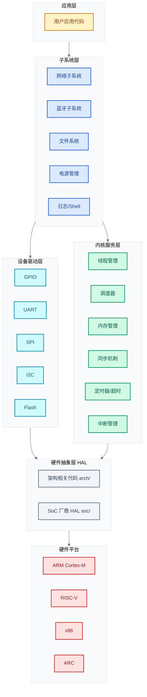
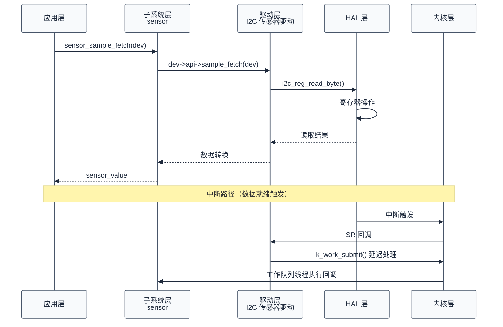
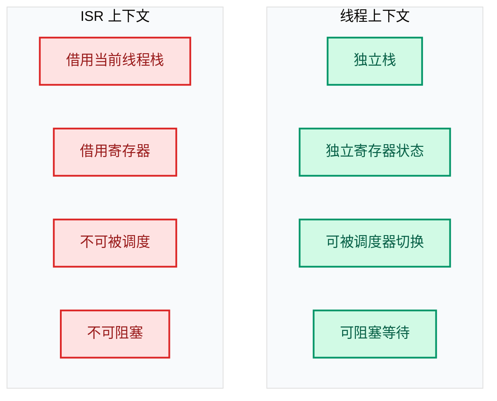
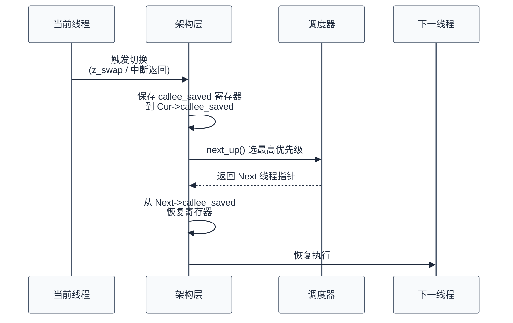

# 00. Zephyr RTOS 入门概览

> 一句话概括：Zephyr 是一款由 Linux 基金会托管、面向资源受限嵌入式设备的开源 RTOS，本文从"RTOS 在做什么"出发，建立系统分层心智模型，并速查核心组件。
> **工程师视角**：读完后你应当能回答"Zephyr 为什么这样分层"、"ISR 为什么不能调用 k_sleep"这两个问题，并知道每一类问题应去哪一章深究。

### 关键术语

| 缩写 | 全称 | 含义 |
|------|------|------|
| RTOS | Real-Time Operating System | 实时操作系统，强调确定性与低延迟 |
| ISR | Interrupt Service Routine | 中断服务例程，硬件异步事件的入口函数 |
| HAL | Hardware Abstraction Layer | 硬件抽象层，屏蔽架构与 SoC 差异 |
| SoC | System on Chip | 片上系统，集成 CPU 与外设的单芯片 |
| MMU | Memory Management Unit | 内存管理单元，提供虚拟地址与保护 |
| MPU | Memory Protection Unit | 内存保护单元，仅提供保护无虚拟地址 |
| SMP | Symmetric Multi-Processing | 对称多处理，多核平等运行同一内核镜像 |
| DTS | Devicetree Source | 设备树源文件，描述硬件配置 |
| Kconfig | Kernel Configuration | 内核配置系统，编译时裁剪功能 |
| West | — | Zephyr 的多仓库管理与构建命令工具 |

---

### 前置阅读

| 需要了解 | 参考文档 |
|----------|----------|
| 学习路线与文档索引 | [README](./README.md) |

---

## 1. 概述：RTOS 到底在做什么

> 本章是整个学习笔记的起点。一个问题驱动全文：**裸机程序用 `while(1)` + 中断就能跑，为什么还要 RTOS？** 回答这个问题后，再给出 Zephyr 的定位与特性清单。

### 1.1 一个具体场景：并发是 RTOS 的核心动机

想象一个嵌入式设备需要同时做三件事：

1. **传感器采样**：每 100ms 读一次温湿度，耗时 5ms
2. **网络上报**：每 10s 上报一次数据，耗时 200ms（含 TCP 重传可能）
3. **按键响应**：用户随时可能按键，要求 50ms 内响应

裸机方案的典型写法是状态机 + 中断：

```c
// 裸机方案：状态机轮询
void main(void) {
    while (1) {
        if (time_to_sample()) { sample_sensor(); }   // 5ms
        if (time_to_report()) { report_network(); }  // 200ms，会阻塞按键
        if (key_pressed())    { handle_key(); }      // 必须等上面完成
    }
}
```

问题立刻出现：网络上报的 200ms 期间，按键无法被及时响应。可以用中断解决按键，但传感器采样与网络上报之间的时序协调仍需要复杂的标志位与状态机。当并发任务从 3 个增加到 10 个时，状态机会迅速失控。

**RTOS 的核心价值**：把"并发任务的调度"从应用代码中抽离，交给内核。每个任务是一个**线程**，内核按优先级决定谁在何时运行：

```c
// RTOS 方案：每个任务独立线程，内核负责调度
void sensor_thread(void)    { while (1) { sample_sensor(); k_sleep(K_MSEC(100)); } }
void network_thread(void)   { while (1) { report_network(); k_sleep(K_SECONDS(10)); } }
void key_thread(void)       { while (1) { wait_key_event(); handle_key(); } }
```

按键线程优先级最高，无论网络线程在做什么，按键一旦发生，内核会在微秒级切换到按键线程。这就是 RTOS 的本质——**用线程抽象并发，用调度器管理时序**。

> **核心要点**：RTOS 解决的不是"让程序跑起来"的问题，而是"让多个并发任务在有限资源下可预测地共存"的问题。线程是并发抽象，调度器是时序仲裁，同步原语是协作契约——这三者构成 RTOS 的核心。

> **设计洞察**：Zephyr 调度器与 Linux 进程调度器虽然都是"决定谁在 CPU 上跑"，但优化目标截然不同。Linux 的 CFS (Completely Fair Scheduler, 完全公平调度器) 追求**公平性与吞吐量**，按虚拟运行时间排序让所有进程共享 CPU；Zephyr 调度器追求**确定性与最坏情况延迟**，严格按优先级抢占。这反映了"通用 OS"与"实时 OS"的本质分野——前者优化平均性能，后者优化最坏情况。
>
> 这个差异在工程上直接体现为优先级反转问题。裸的优先级抢占会遭遇经典反转：低优先级线程持锁时，中等优先级线程会"夹在中间"无限期阻塞高优先级线程。Zephyr 的互斥锁因此实现了**优先级继承协议**（Priority Inheritance Protocol）——持锁线程临时继承等待者的最高优先级。1997 年的 Mars Pathfinder 任务就因未启用此机制导致系统反复复位，这是嵌入式工程史上的经典案例。
>
> 另一个常被忽视的硬件因素是 **cache 局部性**。Linux 调度器在 SMP 间迁移线程时会权衡 cache 亲和性（`task_struct` 的 `cpus_allowed`），Zephyr 在 SMP 模式下也允许通过 `CONFIG_SCHED_CPU_MASK` 把线程"钉"在特定核上运行——目的是保留 L1 cache 中的热数据。在 Cortex-M 这类每核只有几 KB cache 的设备上，一次核间迁移可能让 cache miss 率从个位数飙到 50% 以上，得不偿失。

### 1.2 Zephyr 的定位

Zephyr 由 Linux 基金会托管，Apache 2.0 许可，专为资源受限的嵌入式设备设计。它从 Linux 继承了多项工程实践（Devicetree、Kconfig、CMake 构建），但内核本身从零设计，目标是 8KB RAM 即可运行。

| 特性 | 说明 |
|------|------|
| **轻量级** | 最小配置可运行在 8KB RAM 的设备上 |
| **可扩展** | 从传感器到网关、智能手表、IoT 网关均可覆盖 |
| **内存保护** | 支持 MPU/MMU 用户空间隔离与线程级权限 |
| **编译时裁剪** | Kconfig 按需包含功能，未选中的代码不进镜像 |
| **多架构** | ARM Cortex-M/A/R、RISC-V、x86、ARC、Xtensa 等 |
| **开源治理** | Linux 基金会托管，Apache 2.0 许可 |

### 1.3 与其他 RTOS 的定位差异

| 维度 | Zephyr | FreeRTOS | Linux |
|------|--------|----------|-------|
| **目标设备 RAM** | 8KB ~ MB 级 | KB 级 | MB ~ GB 级 |
| **设计借鉴** | Linux 工程实践 | 简洁实用 | — |
| **Devicetree** | ✅ 完整支持 | ❌ | ✅ |
| **Kconfig** | ✅ 编译时裁剪 | ❌ | ✅ |
| **MMU/用户空间** | ✅ 可选 | ❌ | ✅ 必须 |
| **SMP** | ✅ 原生支持 | 有限 | ✅ |
| **网络栈** | ✅ 原生 | ❌（需第三方） | ✅ |
| **蓝牙** | ✅ 原生 BLE/Mesh | ❌（需第三方） | ✅ |

> **如何读这张表**：Zephyr 的定位介于 FreeRTOS 与 Linux 之间——比 FreeRTOS 多了 Devicetree/Kconfig/SMP/原生网络蓝牙，比 Linux 少了完整的 POSIX 与海量驱动。它适合"需要 RTOS 确定性，但又需要 Linux 级工程化能力"的设备。

### 1.4 支持的架构

Zephyr 支持多种 CPU 架构（详见 [官方介绍](../zephyr-project/zephyr/doc/introduction/index.rst)）：

- **ARM**：Cortex-M（v6-M/v7-M/v8-M）、Cortex-A（v7-A/v8-A）、Cortex-R（v7-R/v8-R）
- **RISC-V**：32 位与 64 位
- **Intel x86**：32 位与 64 位
- **ARC**：ARCv2（EM/HS）、ARCv3（HS6X）
- **Tensilica Xtensa**：ESP32 系列等
- **其他**：MIPS、OpenRISC、Renesas RX、SPARC V8

---

## 2. 系统架构：分层与职责

> 上一章回答了"为什么需要 RTOS"。本章回答"Zephyr 内部如何组织"。一个自然的疑问是：从应用代码到硬件寄存器，中间经过几层？为什么这样分？本章用分层架构图回答这个问题——先看总体分层，再逐层剖析职责，最后用一个跨层调用示例串联。

### 2.1 分层架构总览



> **如何读这张图**：自上而下是调用方向，颜色由黄→蓝→绿→青→灰→红表示从应用贴近硬件。注意子系统层既调用内核服务（用线程/同步原语），又调用驱动层（操作硬件）——它是"领域级服务"的封装者。HAL 层是架构相关代码与 SoC 厂商代码的统称，屏蔽 CPU 核与芯片差异。

### 2.2 各层职责

| 层次 | 职责 | 关键机制 | 源码位置 |
|------|------|---------|---------|
| **应用层** | 业务逻辑实现 | 调用内核 API 和子系统 API | `samples/`、用户工程 |
| **子系统层** | 提供领域级服务 | 封装驱动，提供高层 API | [subsys/](file:///home/pbw/rtos/cs-learning-notes/zephyr-project/zephyr/subsys) |
| **内核服务层** | 核心调度与资源管理 | 线程调度、同步、内存管理 | [kernel/](file:///home/pbw/rtos/cs-learning-notes/zephyr-project/zephyr/kernel) |
| **设备驱动层** | 硬件操作的具体实现 | 实现 `xxx_driver_api` 接口 | [drivers/](file:///home/pbw/rtos/cs-learning-notes/zephyr-project/zephyr/drivers) |
| **硬件抽象层** | 架构与 SoC 相关代码 | 上下文切换、中断控制器 | [arch/](file:///home/pbw/rtos/cs-learning-notes/zephyr-project/zephyr/arch)、[soc/](file:///home/pbw/rtos/cs-learning-notes/zephyr-project/zephyr/soc) |

### 2.3 跨层交互示例：一次传感器读取



> **如何读这张图**：上半部分是同步调用链（应用主动取数据），下半部分是异步通知链（硬件主动通知）。注意 ISR 中只做最少工作（提交 work item），耗时操作推迟到工作队列线程——这是 Zephyr 的标准 ISR 模式，详见 [09-工作队列与延迟处理](./09-工作队列与延迟处理.md)。

> **核心要点**：分层不是装饰，而是职责隔离。应用层不感知硬件寄存器地址，驱动层不感知业务逻辑，内核层不感知具体外设。这种隔离让同一份驱动能在不同板卡上运行，同一份应用能换不同硬件。

> **设计洞察**：ISR 中"只做最少工作、把耗时操作推迟到线程"不是 Zephyr 独创，而是贯穿所有现代 OS 的通用设计。Linux 内核把中断处理显式分为 **top-half**（中断上下文，禁中断，只登记事件）和 **bottom-half**（tasklet、workqueue、softirq，可被更高优先级中断抢占）两段；FreeRTOS 用 `xSemaphoreGiveFromISR` + `portYIELD_FROM_ISR` 把唤醒工作推到任务里。Zephyr 的 `k_work_submit` 是同一思想的不同实现。
>
> 这个分层的根本原因在硬件：中断触发瞬间，CPU 自动关闭本核中断（Cortex-M 上由硬件置位 PRIMASK/BASEPRI），ISR 执行期间无法响应同级或更低级中断。如果 ISR 里做 I2C 读寄存器（可能耗时毫秒级），其他实时事件会全部丢失。把 I2C 读取推到工作队列线程后，ISR 退出瞬间硬件重新开中断，下一个事件立即能被响应。本质上，**ISR 是"硬件通知路径"，工作队列是"软件处理路径"**——前者追求最短延迟，后者追求最大吞吐。
>
> 这种"机制与策略分离"也体现在内核其他地方：调度器提供机制（切换、计时），策略（优先级、时间片）由配置决定；驱动模型提供机制（`struct device` 接口），具体硬件操作由策略（驱动实现）决定。这是 OS 设计中反复出现的模式——**机制放在内核，策略留给用户**。

---

## 3. 核心组件概览

> 上一章建立了分层心智模型。本章快速过一遍每一层的关键组件，每个组件用"本质 + 为什么需要"两句话概括，详细实现留给后续章节。读完后你应当知道每个组件对应哪一章深究。

### 3.1 线程与调度

**本质**：线程是"独立执行的函数实例"，调度器是"决定哪个线程此刻在 CPU 上运行的仲裁者"。

**为什么需要**：并发是 RTOS 的核心动机（见 §1.1）。没有线程，并发任务只能用状态机；没有调度器，线程切换需要应用自己实现。

Zephyr 线程的核心属性：

| 属性 | 含义 | 取值 |
|------|------|------|
| **优先级** | 数值越小优先级越高 | 负数=协作式，非负=抢占式 |
| **栈** | 线程私有运行栈 | `K_THREAD_STACK_DEFINE` |
| **状态** | 就绪/运行/等待/睡眠/挂起/终止 | 内核管理 |
| **选项** | 是否系统关键、是否用浮点、是否用户态 | `K_ESSENTIAL`/`K_FP_REGS`/`K_USER` |

调度策略详见 [06-调度策略详解](./06-调度策略详解.md)，线程生命周期详见 [05-线程与状态迁移](./05-线程与状态迁移.md)。

### 3.2 同步机制

**本质**：同步原语是"线程间协作的契约"，规定谁先谁后、谁能访问什么。

**为什么需要**：多线程共享资源时，若无同步，竞态条件会导致数据损坏（经典的 `counter++` 交错问题）。

| 机制 | 本质 | 适用场景 |
|------|------|---------|
| **信号量** | 计数器，take 减 1 give 加 1 | 资源池、简单同步 |
| **互斥锁** | 带所有权与优先级继承的信号量 | 保护临界区 |
| **条件变量** | 等待条件成立的通知机制 | 生产者-消费者 |
| **事件** | 32 位事件集合，支持 ANY/ALL | 多事件等待 |
| **自旋锁** | 忙等锁，禁用本核中断 | ISR/SMP 极短临界区 |

详见 [07-同步机制详解](./07-同步机制详解.md)。

### 3.3 内存管理

**本质**：内存管理是"在有限 RAM 上为不同分配需求提供合适方案"的机制。

**为什么需要**：静态分配确定性强但不灵活，动态分配灵活但有碎片风险。RTOS 需要在两者间权衡。

| 类型 | 本质 | 适用场景 |
|------|------|---------|
| **静态分配** | 编译时确定，零运行时开销 | 实时性要求高 |
| **k_heap** | 同步堆，基于 sys_heap（分桶自由列表） | 复杂应用，可阻塞 |
| **k_mem_slab** | 固定大小块池，O(1) 分配 | 网络缓冲区等固定对象 |
| **内存域** | 用户态隔离的地址空间 | 安全性要求高 |

**用户态与内存域**：上表"内存域"依赖一个 RTOS 中可选的高级概念——用户态。默认情况下 Zephyr 所有线程运行在特权模式（supervisor mode），可访问全部内存与所有 CPU 指令；启用用户态（`CONFIG_USERSPACE=y`）后，某些线程被降级为用户态（user mode），只能访问内核显式授予的内存区域（即"内存域"），且不能执行特权指令。

为什么需要用户态？在运行第三方代码、脚本引擎或解析不可信网络输入时，一个特权线程的越界写操作就能让整个系统崩溃。用户态把故障隔离在线程内部——一次越界访问会被 MPU 触发异常，内核可以终止该线程而不影响其他线程。代价是用户态/特权态切换与跨域调用都走系统调用（syscall）路径，有额外开销，因此默认不启用。

详见 [12-内存管理](./12-内存管理.md)。

> **设计洞察**：`k_mem_slab`（固定大小块池）与 Linux 内核的 **slab allocator** 源自同一思想——分配器性能的核心瓶颈不是算法复杂度，而是**外部碎片**。通用 `malloc` 用空闲链表管理变长块，长期运行后空闲内存被切成无数不连续小段，看似有 100KB 空闲却无法满足 50KB 请求。`k_mem_slab` 把内存预切为定长块，每个块用 O(1) 时间从自由链表弹出，碎片率恒为零。
>
> 这个设计在嵌入式场景特别关键：Cortex-M 设备通常只有 64KB~512KB RAM，长时间运行（如智能电表可能 10 年不重启）下任何细小碎片都会累积成灾难。Linux 桌面环境可以靠 `malloc` + 偶尔重启进程掩盖碎片，嵌入式不行。Zephyr 的网络缓冲区 `net_buf` 就基于 `k_mem_slab`，确保协议栈长时间运行不会因碎片崩溃——这与 Linux 的 `sk_buff` 设计同源。
>
> 关于用户态与 MPU：启用 `CONFIG_USERSPACE=y` 后，每次线程切换都要重配 MPU 区域寄存器（Cortex-M 的 `MPU_RNR`/`MPU_RBAR`/`MPU_RASR`），把当前线程可访问的内存域写入硬件。代价是上下文切换延迟从纯软件寄存器保存的 ~1μs 增加到 ~5μs。这印证了**安全总是与性能权衡**的工程铁律——Linux 默认开 MMU 是因为桌面/服务器有富余算力，Zephyr 默认关 MPU 用户态是因为 8KB RAM 设备上每一微秒都珍贵。

### 3.4 中断与定时

**本质**：中断是"硬件异步通知 CPU 的机制"，定时器是"按时间触发回调的内核对象"。

**为什么需要**：硬件事件（按键、数据就绪）随时发生，CPU 必须能立即响应；周期性任务需要精确时序。

| 概念 | 本质 | 关键约束 |
|------|------|---------|
| **ISR** | 中断服务例程 | 不能阻塞，不能调用 k_sleep |
| **k_timer** | 内核定时器 | 回调在 ISR 上下文执行 |
| **k_uptime_get** | 系统启动以来毫秒数 | 基于 sys_clock |
| **工作队列** | ISR 延迟处理机制 | 把耗时操作推到线程上下文 |

详见 [08-中断与时序](./08-中断与时序.md) 与 [09-工作队列与延迟处理](./09-工作队列与延迟处理.md)。

### 3.5 设备驱动模型

**本质**：驱动模型是"硬件操作接口的标准化"，让同一份应用代码能跑在不同硬件上。

**为什么需要**：没有驱动模型，每个应用都要直接操作寄存器；有了驱动模型，应用调用 `gpio_pin_set(dev, pin, 1)`，具体怎么操作寄存器由驱动实现。

核心抽象是 `struct device`：

```c
struct device {
    const char *name;            // 设备名
    const void *config;          // 配置（ROM，硬件相关常量）
    const void *api;             // API 函数表（ROM，驱动实现）
    struct device_state *state;  // 通用设备状态（RAM，由内核零初始化）
    void *data;                  // 运行时数据（RAM，驱动私有）
    struct device_ops ops;       // 设备操作回调表（ROM）
    device_flags_t flags;        // 标志位（ROM，编译期由 DT 设置）
    /* 另有 deps/pm/dt_meta 等条件编译字段，详见 include/zephyr/device.h */
};
```

详见 [13-设备驱动模型](./13-设备驱动模型.md)。

### 3.6 设备树

**本质**：设备树是"硬件配置的数据文件"，把"硬件描述"从"驱动代码"中分离。

**为什么需要**：同一 SoC 不同板卡引脚不同、外设不同。若硬编码在驱动里，每换板卡都要改代码；放进设备树后，驱动通过宏 API 读取硬件信息，板卡变更只改 DTS 不改代码。


详见 [03-设备树详解](./03-设备树详解.md)。

---

## 4. 构建系统概览

> 本章只给构建系统一个"全景"。一个常见困惑是：为什么 Zephyr 用三个工具（West + CMake + Kconfig）而不是一个？答案是它们各司其职——West 管多仓库，CMake 管编译编排，Kconfig 管功能裁剪。深入内容见 [02-构建系统](./02-构建系统.md)。

### 4.1 三大组件协作


| 组件 | 角色 | 配置文件 | 输出 |
|------|------|---------|------|
| **West** | 项目管理 + 构建入口 | `west.yml` | 拉取模块、调用 CMake |
| **CMake** | 构建编排 | `CMakeLists.txt` | Ninja/Makefile |
| **Kconfig** | 功能裁剪 | `Kconfig*`、`prj.conf` | `autoconf.h`、`.config` |

> **核心要点**：三者解耦的关键是 `.config` 文件——Kconfig 写、CMake 读。这让功能裁剪与构建编排互不干扰，也让 prj.conf 可以独立于构建系统维护。

### 4.2 Kconfig 机制简介

Kconfig 是 Zephyr 从 Linux 继承的编译时配置系统，决定哪些代码被编译进最终镜像。

```kconfig
# 定义一个布尔选项
config THREAD_NAME
    bool "Thread name"
    help
      This option allows to set a name for a thread.

# 带依赖的选项
config THREAD_MAX_NAME_LEN
    int "Max length of a thread name"
    default 32
    default 64 if ZTEST
    range 8 128
    depends on THREAD_NAME
    help
      Thread names get stored in the k_thread struct.
```

在 C 代码中通过 `#ifdef CONFIG_XXX` 条件编译使用。详见 [02-构建系统](./02-构建系统.md)。

---

## 5. 核心概念速查

> 本章回答两个常见困惑：**为什么 ISR 不能调用 k_sleep？为什么自旋锁持锁时间必须极短？** 理解这两个问题，就理解了 RTOS 上下文模型的核心。

### 5.1 ISR 与线程上下文的本质区别

ISR 与线程的根本区别在于**上下文**：线程有自己的栈与寄存器状态，可以被切换；ISR 借用当前线程的栈，不能被切换。



**为什么 ISR 不能调用 k_sleep**：`k_sleep` 会触发调度器切换到其他线程，但 ISR 没有自己的上下文可保存——它借用的是当前线程的栈。如果在中途切换，返回时栈状态会错乱。

**为什么 ISR 中信号量只能用 K_NO_WAIT**：`k_sem_take(timeout)` 在计数为 0 时会阻塞当前线程。ISR 不是线程，无法阻塞。

| 调用 | ISR 上下文 | 线程上下文 |
|------|----------|----------|
| `k_sleep()` | ❌ | ✅ |
| `k_sem_take(K_NO_WAIT)` | ✅ | ✅ |
| `k_sem_take(timeout)` | ❌ | ✅ |
| `k_mutex_lock()` | ❌ | ✅ |
| `k_sem_give()` | ✅ | ✅ |
| `k_work_submit()` | ✅ | ✅ |

> **核心要点**：ISR 的设计哲学是"做最少的工作，把耗时操作推迟"。标准模式是 ISR 中只读取硬件状态、提交 work item，耗时处理交给工作队列线程。详见 [09-工作队列与延迟处理](./09-工作队列与延迟处理.md)。

> **设计洞察**："ISR 不能调用 k_sleep" 不是 API 限制，而是**架构层级的硬约束**。CPU 进入中断时，硬件自动把返回地址与部分寄存器压入**当前线程的栈**（Cortex-M 上硬件压入 `{r0-r3, r12, lr, pc, xpsr}` 8 个寄存器），ISR 主体与被中断的线程共享同一段栈内存。如果 ISR 调用 k_sleep，调度器需要保存"ISR 的上下文"以便日后恢复——但 ISR 没有独立上下文，它的寄存器状态本来就压在线程栈上，调度器一旦切走线程，这些状态会被当作线程上下文覆盖。
>
> 这与 Linux 内核中"原子上下文不能睡眠"是同一原理。Linux 持有 `spin_lock` 时不能调用 `schedule()`，因为此时 CPU 处于"半中断"状态，没有可调度的进程上下文。FreeRTOS 的 `xQueueSendFromISR` 强制传入 `pxHigherPriorityTaskWoken` 参数而不是直接阻塞，也是同一原因。**"上下文"是 OS 中最本质的概念之一**——线程上下文有完整寄存器+栈，可被任意切换；ISR 上下文借用他人栈，只能跑完返回。
>
> 这条约束直接决定了 RTOS API 的形态：所有可能阻塞的 API（`k_sem_take` 带超时、`k_mutex_lock`、`k_sleep`、`k_msgq_get` 带超时）都有对应的"ISR 安全"版本（`K_NO_WAIT` 模式）或专门的 `_fromisr` 变体。这是一种**接口上的诚实**——让调用期就暴露约束，而不是运行时崩溃。

### 5.2 上下文切换

上下文切换是 RTOS 的核心机制，保存当前线程的寄存器状态并恢复下一个线程的寄存器状态：



### 5.3 自旋锁：最底层的同步原语

自旋锁是 Zephyr 中最底层的同步原语，用于内核内部和 SMP 多核场景：

- **忙等待**：不阻塞，持续检测锁状态
- **ISR 安全**：获取锁时自动禁用本核中断
- **SMP 必需**：多核间保护共享数据
- **短临界区**：仅用于极短的临界区（几条指令）

**为什么自旋锁持锁时间必须极短**：持锁期间本核中断被禁用，长时间持锁会让本核错过中断响应；在 SMP 下，其他核会忙等浪费 CPU。所有上层同步原语（信号量、互斥锁等）内部都用自旋锁保护，但持锁时间都极短。

详见 [07-同步机制详解](./07-同步机制详解.md)。

---

## 6. 源码目录速查

> 本章是查阅源码的索引。开发时遇到具体问题，先在这里找到对应目录，再深入源码。

```
zephyr/
├── arch/           # 架构相关代码（ARM、RISC-V、x86、ARC、Xtensa）
│   └── <arch>/     # 每种架构的上下文切换、中断处理
├── kernel/         # 内核核心代码
│   ├── sched.c     # 调度器
│   ├── thread.c    # 线程管理
│   ├── init.c      # 内核初始化
│   ├── sem.c       # 信号量
│   ├── mutex.c     # 互斥锁
│   ├── condvar.c   # 条件变量
│   ├── events.c    # 事件
│   ├── timer.c     # 定时器
│   ├── work.c      # 工作队列
│   ├── timeout.c   # 超时管理
│   ├── queue.c     # FIFO/Queue
│   ├── msg_q.c     # 消息队列
│   ├── mailbox.c   # 邮箱
│   ├── pipe.c      # 管道
│   ├── kheap.c     # 同步堆
│   ├── mem_slab.c  # 内存块
│   ├── smp.c       # SMP 支持
│   └── device.c    # 设备模型
├── drivers/        # 设备驱动
├── dts/            # 设备树源文件与绑定
├── subsys/         # 子系统（网络、蓝牙、文件系统等）
├── lib/            # 库函数（heap、libc、utils）
├── soc/            # SoC 支持
├── boards/         # 开发板定义
├── include/        # 头文件
│   └── zephyr/     # 公共 API 头文件
├── scripts/        # 构建与工具脚本
├── cmake/          # CMake 模块
└── modules/        # 外部模块（通过 West 管理）
```

---

## 7. 内核核心数据结构速查

| 结构体 | 用途 | 所在文件 |
|--------|------|---------|
| `k_thread` | 线程控制块 | [kernel/thread.c](file:///home/pbw/rtos/cs-learning-notes/zephyr-project/zephyr/kernel/thread.c) |
| `_thread_base` | 线程调度核心信息 | [include/zephyr/kernel_structs.h](file:///home/pbw/rtos/cs-learning-notes/zephyr-project/zephyr/include/zephyr/kernel_structs.h) |
| `k_mutex` | 互斥锁 | [kernel/mutex.c](file:///home/pbw/rtos/cs-learning-notes/zephyr-project/zephyr/kernel/mutex.c) |
| `k_sem` | 信号量 | [kernel/sem.c](file:///home/pbw/rtos/cs-learning-notes/zephyr-project/zephyr/kernel/sem.c) |
| `k_timer` | 定时器 | [kernel/timer.c](file:///home/pbw/rtos/cs-learning-notes/zephyr-project/zephyr/kernel/timer.c) |
| `k_queue` | 队列 | [kernel/queue.c](file:///home/pbw/rtos/cs-learning-notes/zephyr-project/zephyr/kernel/queue.c) |
| `device` | 设备结构 | [kernel/device.c](file:///home/pbw/rtos/cs-learning-notes/zephyr-project/zephyr/kernel/device.c) |
| `_timeout` | 超时结构 | [kernel/timeout.c](file:///home/pbw/rtos/cs-learning-notes/zephyr-project/zephyr/kernel/timeout.c) |

详细剖析见 [11-核心数据结构](./11-核心数据结构.md)（重点关注 §2 链表族、§5 环形缓冲区族、§6 无锁队列族）。

---

## 8. 常用 API 速查

```c
// 线程
k_thread_create()         // 创建线程
k_thread_start()          // 启动线程
k_thread_suspend()        // 挂起线程
k_thread_resume()         // 恢复线程
k_thread_abort()          // 终止线程
k_sleep()                 // 线程睡眠
k_yield()                 // 让出 CPU

// 同步
k_sem_take()              // 获取信号量
k_sem_give()              // 释放信号量
k_mutex_lock()            // 锁定互斥锁
k_mutex_unlock()          // 解锁互斥锁
k_condvar_wait()          // 等待条件变量
k_condvar_signal()        // 通知条件变量

// 调度
k_sched_lock()            // 锁定调度器
k_sched_unlock()          // 解锁调度器
k_thread_priority_set()   // 设置优先级

// 设备
device_is_ready()         // 检查设备就绪
DEVICE_DT_GET()           // 从设备树获取设备
```

---

## 参考资料

- [Zephyr 官方介绍](../zephyr-project/zephyr/doc/introduction/index.rst) — 参考了 §"What is the Zephyr Project"、§"Project Components"、§"Supported Boards"
- [Zephyr 术语表](../zephyr-project/zephyr/doc/glossary.rst) — 参考了 subsystem、thread、ISR、device driver 等核心术语定义
- [Zephyr GitHub](https://github.com/zephyrproject-rtos/zephyr) — 源码仓库主入口
- [Zephyr 官方文档](https://docs.zephyrproject.org/) — 在线文档总入口

## 下一篇

[01-快速开始](./01-快速开始.md) — 搭建开发环境，跑通第一个 Blinky 工程。
