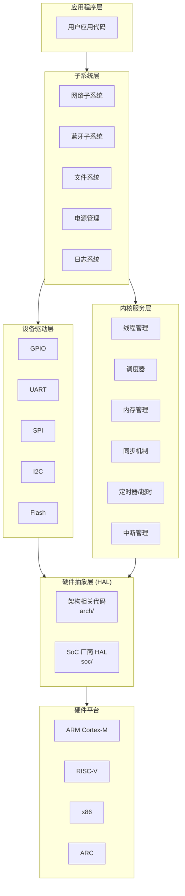
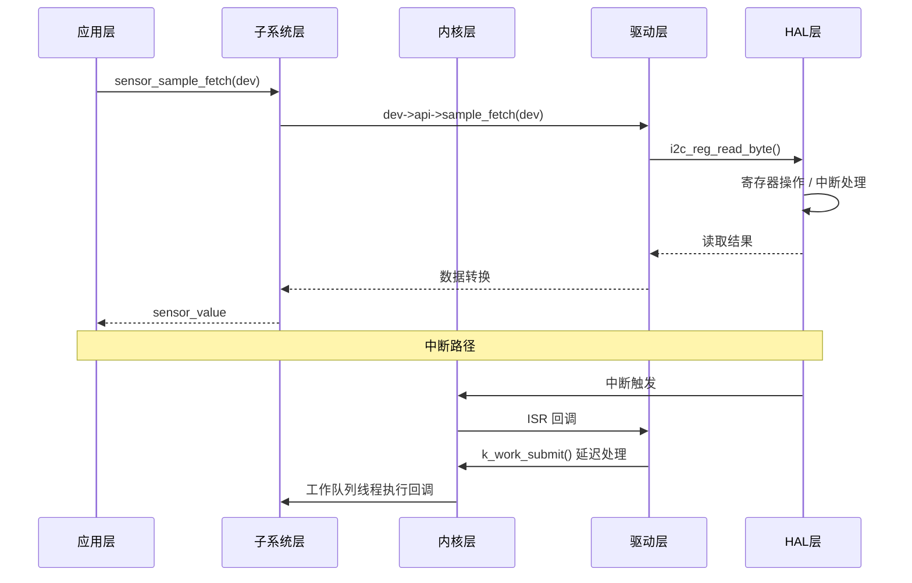
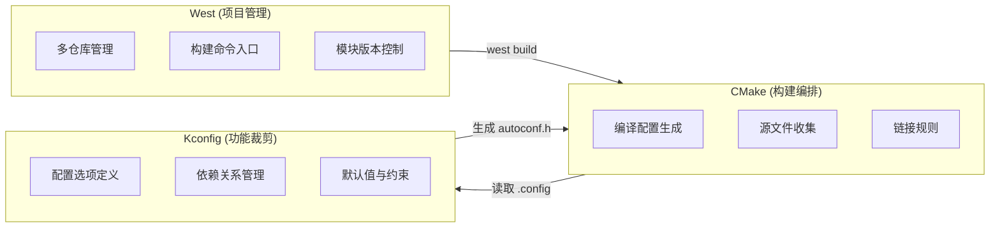
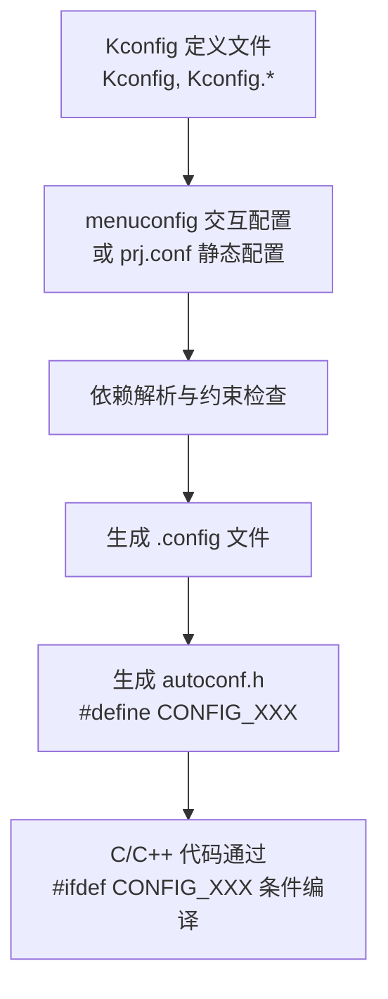
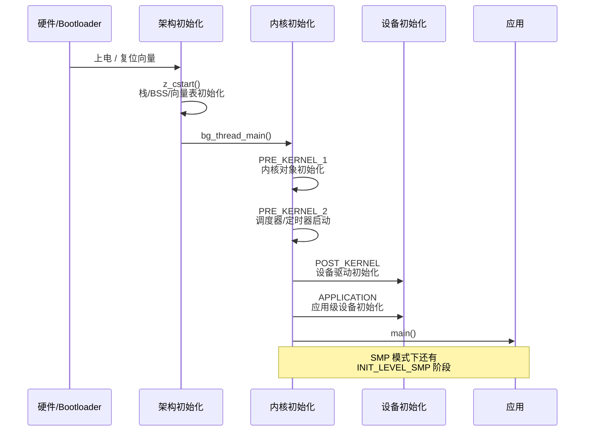
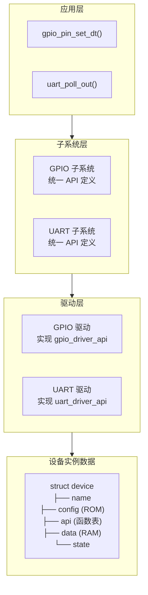
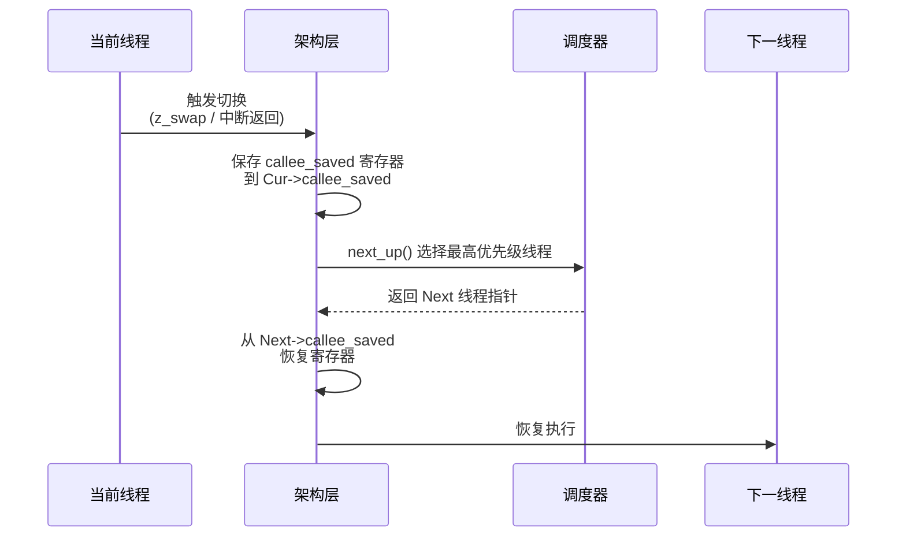

# Zephyr RTOS 入门概览

> 返回：[文档导航](../README.md)

本文档是 Zephyr RTOS 学习的入口，包含文档导航、系统概览和快速参考。

---

## 一、文档导航

### 学习路径

```
入门阶段
├── 00_入门概览.md        ← 本文档（导航 + 概览）
└── 01_快速开始.md        ← 环境搭建，Hello World

核心概念
└── 02_设备树详解.md      ← DTS/DTB 全面解析

内核机制（深入）
├── 03_内存管理.md        ← 静态/动态内存分配，内存池
├── 05_同步机制详解.md    ← 信号量、互斥锁、条件变量
├── 06_核心数据结构详解.md ← k_thread, k_mutex 等结构体
├── 07_线程状态迁移详解.md ← 线程状态机分析
└── 08_调度策略详解.md    ← 调度算法，SMP调度

驱动开发
└── 04_设备驱动模型.md    ← 驱动架构，实战编写
```

### 学习建议

| 阶段 | 内容 | 关键目标 |
|-----|------|---------|
| **入门** | 本文档 + 01_快速开始.md | 理解架构，跑通 Hello World |
| **核心概念** | 02_设备树详解.md | 掌握硬件描述与代码的解耦机制 |
| **内核机制** | 03、05、07、08 号文档 | 深入调度、同步、内存的源码实现 |
| **驱动开发** | 04_设备驱动模型.md | 能独立编写符合 Zephyr 规范的驱动 |

---

## 二、Zephyr RTOS 简介

Zephyr RTOS 是由 Linux 基金会托管的开源实时操作系统，专为资源受限的嵌入式设备设计。

| 特性 | 说明 |
|-----|------|
| **轻量级** | 最小可运行在 8KB RAM 的设备上 |
| **可扩展** | 支持从传感器到网关的各种场景 |
| **安全性** | 内存保护（MPU/MMU）、用户空间隔离 |
| **可配置** | Kconfig 编译时裁剪，按需包含功能 |
| **开源** | Apache 2.0 许可证，Linux 基金会托管 |

### 与其他 RTOS 的定位差异

| 维度 | Zephyr | FreeRTOS | Linux |
|-----|--------|----------|-------|
| **目标设备** | 8KB~MB 级 RAM | KB 级 RAM | MB~GB 级 RAM |
| **架构借鉴** | Linux 设计理念 | 简洁实用 | — |
| **设备树** | ✅ 完整支持 | ❌ | ✅ |
| **Kconfig** | ✅ 编译时裁剪 | ❌ | ✅ |
| **MMU/用户空间** | ✅ 可选 | ❌ | ✅ 必须 |
| **SMP** | ✅ 原生支持 | 有限 | ✅ |

---

## 三、系统架构

### 3.1 分层架构



### 3.2 各层职责与交互

| 层次 | 职责 | 关键机制 | 源码位置 |
|-----|------|---------|---------|
| **应用程序层** | 业务逻辑实现 | 调用内核 API 和子系统 API | `samples/`, 用户代码 |
| **子系统层** | 提供领域级服务 | 封装驱动，提供高层 API | `subsys/` |
| **内核服务层** | 核心调度与资源管理 | 线程调度、同步、内存管理 | `kernel/` |
| **设备驱动层** | 硬件操作的具体实现 | 实现 `xxx_driver_api` 接口 | `drivers/` |
| **硬件抽象层** | 架构和 SoC 相关代码 | 上下文切换、中断控制器 | `arch/`, `soc/` |

### 3.3 跨层交互方式



---

## 四、构建系统

Zephyr 的构建系统由三大组件协作完成，理解它们的关系是开发的基础。

### 4.1 三大组件关系



| 组件 | 角色 | 配置文件 | 输出 |
|-----|------|---------|------|
| **West** | 项目管理 + 构建入口 | `west.yml` | 拉取模块、调用 CMake |
| **CMake** | 构建编排 | `CMakeLists.txt` | Makefile / Ninja 文件 |
| **Kconfig** | 功能裁剪 | `Kconfig*`, `prj.conf` | `autoconf.h`, `.config` |

### 4.2 Kconfig 机制

Kconfig 是 Zephyr 从 Linux 继承的编译时配置系统，决定了哪些代码被编译进最终镜像。

**工作原理**：



**Kconfig 语法示例**：

```kconfig
# 定义一个布尔选项
config THREAD_NAME
    bool "Thread name support"
    default n
    help
      Enable thread name tracking. This adds a name field to each
      thread and allows reading/setting the name at runtime.

# 带依赖的选项
config THREAD_MAX_NAME_LEN
    int "Maximum length of a thread name"
    default 32
    depends on THREAD_NAME
    range 1 256
```

**在代码中使用**：

```c
#ifdef CONFIG_THREAD_NAME
    char name[CONFIG_THREAD_MAX_NAME_LEN];
#endif
```

### 4.3 West 工作区模型

West 采用**多仓库**（multi-repo）架构管理 Zephyr 及其外部模块：

```
zephyr-project/               ← West 工作区根目录
├── .west/                     ← West 配置
│   └── config                 ← 记录 manifest 仓库和版本
├── zephyr/                    ← Zephyr 主仓库（manifest 仓库）
│   ├── west.yml               ← 定义所有外部模块
│   ├── kernel/                ← 内核源码
│   ├── drivers/               ← 驱动源码
│   └── ...
├── modules/                   ← West 管理的外部模块
│   ├── hal/                   ← 硬件抽象层模块
│   ├── mbedtls/               ← TLS 库
│   ├── lvgl/                  ← GUI 库
│   └── ...
└── application/               ← 用户应用（可选）
```

`west.yml` 中的 manifest 定义了所有模块的仓库地址和版本：

```yaml
# zephyr/west.yml（简化）
manifest:
  remotes:
    - name: zephyrproject-rtos
      url-base: https://github.com/zephyrproject-rtos
  projects:
    - name: hal_stm32
      revision: main
      path: modules/hal/stm32
    - name: mbedtls
      revision: v3.5.0
      path: modules/mbedtls
```

---

## 五、内核启动流程

从上电到 `main()` 执行，Zephyr 经历了完整的初始化序列。源码位于 [kernel/init.c](file:///home/pbw/cs-learning-notes/zephyr-src/kernel/init.c)。

### 5.1 启动序列



### 5.2 初始化级别详解

源码中的初始化级别定义（[kernel/init.c](file:///home/pbw/cs-learning-notes/zephyr-src/kernel/init.c#L93)）：

| 级别 | 时机 | 可用服务 | 典型初始化内容 |
|-----|------|---------|--------------|
| **EARLY** | 最早，内核未启动 | 几乎无 | 极早期硬件设置 |
| **PRE_KERNEL_1** | 内核初始化阶段1 | 无中断、无调度 | 内核对象列表、obj_core |
| **PRE_KERNEL_2** | 内核初始化阶段2 | 中断可用 | 调度器、系统时钟 |
| **POST_KERNEL** | 内核启动后 | 全部内核服务 | 大多数设备驱动 |
| **APPLICATION** | 应用级别 | 全部服务 | 应用级初始化 |
| **SMP** | SMP 辅助 CPU 启动 | 全部服务 | 辅助 CPU 初始化 |

### 5.3 设备自动初始化

每个通过 `DEVICE_DEFINE` / `DEVICE_DT_DEFINE` 注册的设备都会被自动放入对应初始化级别的链表中，内核按级别顺序遍历执行：

```c
// kernel/init.c 中的初始化循环（简化）
static int do_init(const struct init_entry *entry)
{
    return entry->init(entry->dev);
}

void z_sys_init_run_level(int32_t level)
{
    // 遍历该级别的所有 init_entry，调用其 init 函数
    for (struct init_entry const *entry = __init_start[level];
         entry < __init_start[level + 1]; entry++) {
        do_init(entry);
    }
}
```

---

## 六、核心组件概览

### 6.1 线程管理

| 概念 | 说明 |
|-----|------|
| **线程控制块** | `struct k_thread`，存储线程所有信息 |
| **优先级** | 数值越小优先级越高，负数为协作式，非负为抢占式 |
| **状态** | 就绪、运行、等待、睡眠、挂起、终止 |
| **MetaIRQ** | 特殊协作式线程，可抢占其他协作式线程 |

详细内容：[07_线程状态迁移详解.md](./07_线程状态迁移详解.md)

### 6.2 调度机制

| 策略 | 特点 | 优先级范围 |
|-----|------|----------|
| **协作式** | 线程主动让出 CPU，不被抢占 | 负数 (K_PRIO_COOP(n)) |
| **抢占式** | 高优先级线程抢占低优先级 | 非负数 (K_PRIO_PREEMPT(n)) |
| **时间片** | 同优先级线程轮流执行 | 仅影响抢占式线程 |
| **EDF** | 最早截止时间优先 | 需 CONFIG_SCHED_DEADLINE |

详细内容：[08_调度策略详解.md](./08_调度策略详解.md)

### 6.3 同步机制

| 机制 | 用途 | 关键特性 |
|-----|------|---------|
| **信号量** | 资源计数、线程同步 | 计数型，无所有权 |
| **互斥锁** | 互斥访问 | 优先级继承，可递归，有所有权 |
| **条件变量** | 等待条件满足 | 需配合互斥锁使用 |
| **事件** | 多事件等待 | 支持 ANY/ALL 匹配 |
| **自旋锁** | SMP 多核互斥 | 忙等待，ISR 中可用 |

详细内容：[05_同步机制详解.md](./05_同步机制详解.md)

### 6.4 内存管理

| 类型 | 特点 | 适用场景 |
|-----|------|---------|
| **静态分配** | 编译时确定，零碎片 | 实时性要求高 |
| **堆分配 (sys_heap)** | 灵活，基于 buddy+自由列表 | 复杂应用 |
| **内存池** | 固定大小块，确定性 | 频繁分配固定大小对象 |
| **内存片 (mem_slab)** | 单一大小块，最简单 | 网络缓冲区等 |

详细内容：[03_内存管理.md](./03_内存管理.md)

### 6.5 设备驱动模型



详细内容：[04_设备驱动模型.md](./04_设备驱动模型.md)

### 6.6 设备树

设备树将硬件描述从内核源码中分离，实现硬件与驱动的解耦。


详细内容：[02_设备树详解.md](./02_设备树详解.md)

---

## 七、核心概念速查

### 7.1 中断服务例程 (ISR)

ISR 是响应硬件中断的函数，在 Zephyr 中有特殊限制：

| 特性 | ISR 上下文 | 线程上下文 |
|-----|----------|----------|
| **可调用 k_sleep()** | ❌ | ✅ |
| **可调用 k_sem_take(超时)** | ❌ 仅 K_NO_WAIT | ✅ |
| **可调用 k_mutex_lock()** | ❌ | ✅ |
| **可调用 k_sem_give()** | ✅ | ✅ |
| **可调用 k_work_submit()** | ✅ | ✅ |
| **可被抢占** | ❌ (中断优先级) | ✅ (线程优先级) |

**ISR 中的典型模式**：在 ISR 中做最少的工作（读取硬件状态、提交工作项），将耗时操作推迟到工作队列线程。

### 7.2 上下文切换

上下文切换是 RTOS 的核心机制，保存当前线程的寄存器状态并恢复下一个线程的寄存器状态：



### 7.3 自旋锁 (Spinlock)

自旋锁是 Zephyr 中最底层的同步原语，用于内核内部和 SMP 多核场景：

- **忙等待**：不阻塞，持续检测锁状态
- **ISR 安全**：获取锁时自动禁用中断
- **SMP 必需**：多核间保护共享数据
- **短临界区**：仅用于极短的临界区（几条指令）

所有上层同步原语（信号量、互斥锁等）内部都使用自旋锁保护。

---

## 八、核心数据结构

| 结构体 | 用途 | 所在文件 |
|--------|------|---------|
| `k_thread` | 线程控制块 | `kernel/thread.c` |
| `_thread_base` | 线程调度核心信息 | `include/zephyr/kernel_structs.h` |
| `k_mutex` | 互斥锁 | `kernel/mutex.c` |
| `k_sem` | 信号量 | `kernel/sem.c` |
| `k_timer` | 定时器 | `kernel/timer.c` |
| `k_queue` | 队列 | `kernel/queue.c` |
| `device` | 设备结构 | `kernel/device.c` |
| `_timeout` | 超时结构 | `kernel/timeout.c` |

详细内容：[06_核心数据结构详解.md](./06_核心数据结构详解.md)

---

## 九、快速参考

### 常用 API

```c
// 线程
k_thread_create()    // 创建线程
k_thread_start()     // 启动线程
k_thread_suspend()   // 挂起线程
k_thread_resume()    // 恢复线程
k_thread_abort()     // 终止线程
k_sleep()            // 线程睡眠
k_yield()            // 让出 CPU

// 同步
k_sem_take()         // 获取信号量
k_sem_give()         // 释放信号量
k_mutex_lock()       // 锁定互斥锁
k_mutex_unlock()     // 解锁互斥锁
k_condvar_wait()     // 等待条件变量
k_condvar_signal()   // 通知条件变量

// 调度
k_sched_lock()       // 锁定调度器
k_sched_unlock()     // 解锁调度器
k_thread_priority_set() // 设置优先级

// 设备
device_is_ready()    // 检查设备就绪
DEVICE_DT_GET()      // 从设备树获取设备
```

### 源码目录

```
zephyr/
├── arch/           # 架构相关代码 (ARM, RISC-V, x86, ARC)
│   └── <arch>/     # 每种架构的上下文切换、中断处理
├── kernel/         # 内核核心代码
│   ├── sched.c     # 调度器
│   ├── thread.c    # 线程管理
│   ├── init.c      # 内核初始化
│   ├── sem.c       # 信号量
│   ├── mutex.c     # 互斥锁
│   ├── timer.c     # 定时器
│   ├── work.c      # 工作队列
│   └── timeout.c   # 超时管理
├── drivers/        # 设备驱动
├── dts/            # 设备树源文件和绑定
├── subsys/         # 子系统 (网络、蓝牙、文件系统等)
├── lib/            # 库函数 (heap, libc, utils)
├── soc/            # SoC 支持
├── boards/         # 开发板定义
├── include/        # 头文件
│   └── zephyr/     # 公共 API 头文件
├── scripts/        # 构建和工具脚本
├── cmake/          # CMake 模块
└── modules/        # 外部模块 (通过 West 管理)
```

---

## 十、学习资源

- [Zephyr 官方文档](https://docs.zephyrproject.org/)
- [Zephyr GitHub](https://github.com/zephyrproject-rtos/zephyr)
- [Zephyr API 参考](https://docs.zephyrproject.org/apidoc/latest/)
- [Zephyr Kconfig 参考](https://docs.zephyrproject.org/latest/kconfig.html)
---

## 八、考题与思考

### 选择题

**1.** 关于 Zephyr RTOS 的线程优先级，以下说法正确的是：

A. 数值越大优先级越高
B. 负数优先级表示协作式线程
C. 优先级范围固定为 0-255
D. 空闲线程具有最高优先级

**2.** Zephyr 的最小内存需求是多少？

A. 2KB RAM
B. 8KB RAM
C. 16KB RAM
D. 32KB RAM

**3.** 以下哪个不是 Zephyr 支持的架构？

A. ARM Cortex-M
B. RISC-V
C. MIPS
D. x86

**4.** 关于 Zephyr 的同步机制，以下说法错误的是：

A. 互斥锁支持优先级继承
B. 信号量可以在 ISR 中使用
C. 条件变量可以单独使用，不需要互斥锁
D. 事件支持 32 位事件集合

**5.** Zephyr 的设备树（Device Tree）主要作用是：

A. 描述文件系统结构
B. 描述硬件配置信息
C. 描述线程依赖关系
D. 描述网络拓扑

### 简答题

**1.** 解释 Zephyr 中协作式线程和抢占式线程的区别，以及各自的适用场景。

**2.** 简述 Zephyr 的分层架构，并说明每一层的职责。

**3.** 为什么 Zephyr 推荐使用静态内存分配而不是动态内存分配？

**4.** 解释 Zephyr 中 `k_yield()` 和 `k_sleep()` 的区别。

**5.** 简述设备树（DTS）如何实现硬件描述与驱动代码的解耦。

### 编程题

**1.** 编写代码创建一个优先级为 5 的抢占式线程，线程每秒打印一次当前时间。

**2.** 使用信号量实现一个简单的生产者-消费者模型，缓冲区大小为 5。

### 参考答案

**选择题：** 1.B  2.B  3.C  4.C  5.B

**简答题答案要点：**

1. 协作式线程不会被抢占，必须主动让出 CPU；抢占式线程可被高优先级线程抢占。协作式适用于实时性要求高、执行时间可预测的任务；抢占式适用于响应速度要求高的场景。

2. 应用层 → 子系统层（网络、蓝牙等）→ 内核服务层（线程、调度、内存）→ 设备驱动层 → 硬件抽象层 → 硬件层。

3. 静态分配具有确定性、无碎片、编译时确定等优点，适合资源受限的嵌入式实时系统。

4. `k_yield()` 让出 CPU 但线程仍处于就绪状态；`k_sleep()` 使线程进入睡眠状态，指定时间后才会被唤醒。

5. 设备树将硬件配置信息（地址、中断、引脚等）从驱动代码中分离出来，驱动通过设备树 API 获取硬件信息，实现驱动与硬件的解耦。
