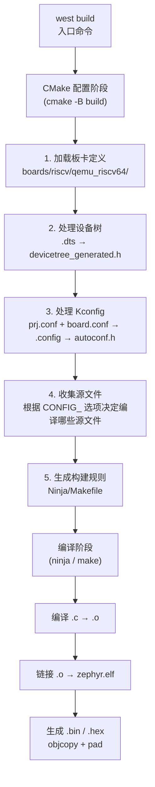

# Zephyr RTOS 快速开始

> 返回：[入门概览](./00_入门概览.md) | [文档导航](../README.md)

---

## 5分钟快速上手

本指南帮助你在5分钟内完成 Zephyr 开发环境的搭建，并以 **RISC-V64** 架构为核心，在 QEMU 模拟器中运行第一个应用。

---

## 1. 环境准备

### 1.1 系统要求

| 组件 | 最低要求 | 推荐配置 |
|-----|---------|---------|
| 操作系统 | Windows 10 / Linux / macOS | Ubuntu 22.04 LTS |
| 内存 | 4GB | 8GB+ |
| 磁盘空间 | 10GB | 20GB+ |
| Python | 3.10+ | 3.11+ |

### 1.2 安装依赖

**Ubuntu/Debian:**
```bash
sudo apt update
sudo apt install --no-install-recommends git cmake ninja-build gperf \
  ccache dfu-util device-tree-compiler wget \
  python3-dev python3-pip python3-setuptools python3-tk python3-wheel \
  xz-utils file make gcc gcc-multilib g++-multilib libsdl2-dev libmagic1
```

**安装 RISC-V QEMU 支持:**
```bash
sudo apt install qemu-system-riscv64
```

**Windows (使用 Chocolatey):**
```powershell
choco install cmake ninja gperf python git dtc-msys2 wget unzip qemu
```

**macOS:**
```bash
brew install cmake ninja gperf python3 ccache qemu dtc wget
```

---

## 2. 安装 Zephyr SDK

Zephyr SDK 包含预编译的交叉编译工具链（包括 RISC-V GCC）和调试工具。

### 2.1 下载并安装 SDK

```bash
# 创建安装目录
mkdir ~/zephyr-sdk
cd ~/zephyr-sdk

# 下载 SDK (以 v0.16.5 为例)
wget https://github.com/zephyrproject-rtos/sdk-ng/releases/download/v0.16.5/zephyr-sdk-0.16.5_linux-x86_64.tar.xz

# 解压
tar xvf zephyr-sdk-0.16.5_linux-x86_64.tar.xz

# 运行安装脚本
cd zephyr-sdk-0.16.5
./setup.sh
```

### 2.2 安装 Python 依赖

```bash
pip3 install --user -U west
```

---

## 3. 获取 Zephyr 源码

```bash
# 创建工作目录
mkdir ~/zephyr-project
cd ~/zephyr-project

# 初始化 west 并获取源码
west init -m https://github.com/zephyrproject-rtos/zephyr.git --mr v3.6.0

# 更新所有模块
west update

# 导出 Zephyr CMake 包
west zephyr-export

# 安装 Python 依赖
pip3 install --user -r ~/zephyr-project/zephyr/scripts/requirements.txt
```

---

## 4. RISC-V64 QEMU 测试

> **QEMU 是什么？** QEMU（Quick Emulator）是一款开源的硬件模拟器，可以在一台机器上模拟出完整的计算机系统。在嵌入式开发中，我们用它来**在没有真实硬件的情况下运行和调试固件**。Zephyr 将 QEMU 支持的板卡视为一等公民——你在 QEMU 上跑通的代码，烧到真实硬件上通常也能运行（前提是外设配置匹配）。

### 4.1 RISC-V64 支持的板卡

Zephyr 支持多种 RISC-V64 开发板，常用的 QEMU 模拟板卡包括：

| 板卡名称 | 架构 | 说明 |
|---------|------|------|
| `qemu_riscv64` | RV64IMAC | 64位 RISC-V QEMU 模拟器 |
| `qemu_riscv64_smp` | RV64IMAC + SMP | 多核 RISC-V QEMU 模拟器 |
| `hifive_unleashed` | RV64GC | SiFive HiFive Unleashed |
| `hifive_unmatched` | RV64GC | SiFive HiFive Unmatched |

### 4.2 编译 Hello World (RISC-V64)

```bash
# 进入 Zephyr 目录
cd ~/zephyr-project/zephyr

# 编译 Hello World 示例 (RISC-V64 QEMU)
west build -p auto -b qemu_riscv64 samples/hello_world
```

**预期输出:**
```
-- west build: generating a build system
Loading Zephyr default modules (Zephyr base).
...
-- Board: qemu_riscv64
-- ZEPHYR_TOOLCHAIN_VARIANT: zephyr
-- Found toolchain: zephyr (/home/user/zephyr-sdk-0.16.5)
...
[1/1] Linking C executable zephyr/zephyr.elf
```

### 4.3 运行应用

```bash
# 在 QEMU RISC-V64 模拟器中运行
west build -t run
```

**预期输出:**
```
*** Booting Zephyr OS build v3.6.0 ***
Hello World! qemu_riscv64
```

🎉 **恭喜！** 你已经成功在 RISC-V64 架构上运行了第一个 Zephyr 应用！

---

## 5. 创建自己的 RISC-V64 应用

### 5.1 应用目录结构

```
my_riscv_app/
├── CMakeLists.txt    # 构建配置
├── prj.conf          # 项目配置
└── src/
    └── main.c        # 主程序
```

### 5.2 创建应用文件

**CMakeLists.txt:**
```cmake
cmake_minimum_required(VERSION 3.20.0)

# 查找 Zephyr 包
find_package(Zephyr REQUIRED HINTS $ENV{ZEPHYR_BASE})

# 定义项目
project(my_riscv_app)

# 添加源文件
target_sources(app PRIVATE src/main.c)
```

**prj.conf:**
```
# 启用控制台
CONFIG_CONSOLE=y
CONFIG_UART_CONSOLE=y

# 启用 GPIO (如果需要)
CONFIG_GPIO=y
```

**src/main.c:**
```c
#include <zephyr/kernel.h>
#include <zephyr/sys/printk.h>

#define SLEEP_TIME_MS   1000

int main(void)
{
    printk("My First RISC-V64 Zephyr Application!\n");
    printk("Running on: %s\n", CONFIG_BOARD);

    while (1) {
        printk("Running on RISC-V64...\n");
        k_msleep(SLEEP_TIME_MS);
    }

    return 0;
}
```

### 5.3 编译并运行

```bash
# 编译应用 (RISC-V64)
west build -p auto -b qemu_riscv64 ~/my_riscv_app

# 运行
west build -t run
```

---

## 6. 多核 RISC-V64 测试 (SMP)

Zephyr 支持多核 RISC-V64，使用 `qemu_riscv64_smp` 板卡：

```bash
# 编译 SMP 版本
west build -p auto -b qemu_riscv64_smp samples/smp/pi

# 运行
west build -t run
```

---

## 7. 常用 west 命令速查

| 命令 | 说明 |
|-----|------|
| `west build` | 编译当前项目 |
| `west build -p auto` | 自动清理并重新编译 |
| `west build -b <board>` | 指定目标板卡 |
| `west build -t run` | 编译并运行 |
| `west flash` | 烧录到硬件 |
| `west debug` | 启动调试器 |
| `west update` | 更新所有模块 |
| `west list` | 列出所有模块 |
| `west boards` | 列出所有支持的板卡 |

### RISC-V 相关命令

```bash
# 查看所有 RISC-V 板卡
west boards | grep riscv

# 查看 RISC-V64 特定板卡
west boards | grep riscv64
```

---

## 8. 构建系统深入理解

### 8.1 `west build` 背后发生了什么

当你执行 `west build -p auto -b qemu_riscv64 samples/hello_world` 时，构建系统经历以下阶段：



### 8.2 构建输出结构

```
build/
├── zephyr/
│   ├── zephyr.elf              # 完整 ELF（含调试信息）
│   ├── zephyr.bin              # 纯二进制镜像
│   ├── zephyr.hex              # Intel HEX 格式
│   ├── zephyr.map              # 内存映射表
│   ├── include/
│   │   └── generated/
│   │       ├── autoconf.h      # Kconfig 生成的 #define
│   │       ├── devicetree_generated.h  # 设备树生成的宏
│   │       └── kobj-types-enum.h      # 内核对象类型枚举
│   └── .config                 # 最终生效的 Kconfig 配置
├── CMakeCache.txt              # CMake 缓存
└── ninja.build                 # Ninja 构建规则
```

### 8.3 配置文件优先级

Kconfig 的配置值由多个来源合并，优先级从高到低：

| 优先级 | 来源 | 说明 |
|-------|------|------|
| 1 (最高) | `prj.conf`（以及 `*.overlay` 的子 conf） | 项目配置（用户指定，最高优先） |
| 2 | `boards/<board>_defconfig` | 板级默认配置（SoC/架构基础） |
| 3 | `Kconfig` 中的 `default` | 选项默认值 |
| 4 (最低) | Kconfig `depends on` 的隐含选择 | 依赖链推导 |

> **理解**：`prj.conf` 可以覆盖板级默认值。例如 `qemu_riscv64_defconfig` 默认启用 `CONFIG_SERIAL=y`，但你在 `prj.conf` 中写 `CONFIG_SERIAL=n` 会覆盖它。如果某个选项必须启用（板级依赖），板级 Kconfig 会通过 `select` 强制要求，此时 `prj.conf` 中的 `=n` 无效。

查看最终生效的配置：

```bash
# 查看完整配置
cat build/zephyr/.config | grep CONFIG_

# 使用 menuconfig 交互式修改
west build -t menuconfig

# 使用 guiconfig 图形化修改
west build -t guiconfig
```

### 8.4 CMakeLists.txt 深入

Zephyr 应用的 `CMakeLists.txt` 不只是简单的构建脚本，`find_package(Zephyr)` 会完成大量工作：

```cmake
cmake_minimum_required(VERSION 3.20.0)

# find_package 会：
# 1. 定位 ZEPHYR_BASE
# 2. 加载板卡定义和 SoC 配置
# 3. 处理设备树
# 4. 运行 Kconfig 配置
# 5. 设置交叉编译工具链
# 6. 收集内核和驱动源文件
# 7. 定义构建目标 (app, zephyr)
find_package(Zephyr REQUIRED HINTS $ENV{ZEPHYR_BASE})

project(my_app)

# target_sources: 将源文件添加到 app 目标
target_sources(app PRIVATE src/main.c)

# 可选：添加 include 路径
target_include_directories(app PRIVATE ${CMAKE_CURRENT_SOURCE_DIR}/include)

# 可选：条件编译
if(CONFIG_MY_FEATURE)
  target_sources(app PRIVATE src/feature.c)
endif()
```

### 8.5 常用 Kconfig 配置项

| 配置项 | 作用 | 典型值 |
|-------|------|-------|
| `CONFIG_SERIAL` | 启用串口驱动 | y |
| `CONFIG_CONSOLE` | 启用控制台抽象 | y |
| `CONFIG_UART_CONSOLE` | UART 作为控制台 | y |
| `CONFIG_PRINTK` | 启用 printk 输出 | y |
| `CONFIG_LOG` | 启用日志系统 | y |
| `CONFIG_GPIO` | 启用 GPIO 驱动 | y |
| `CONFIG_THREAD_NAME` | 线程命名支持 | y |
| `CONFIG_THREAD_RUNTIME_STATS` | 线程运行时统计 | y |
| `CONFIG_SCHED_SCALABLE` | 可扩展调度器（红黑树） | y/n |
| `CONFIG_SMP` | 多核支持 | y/n |
| `CONFIG_TIMESLICING` | 时间片轮转 | y |
| `CONFIG_HEAP_MEM_POOL_SIZE` | 堆内存大小 | 4096 |

---

## 9. 调试工作流

### 9.1 GDB 调试

```bash
# 终端1：启动 QEMU 并等待 GDB 连接
west build -t debugserver

# 终端2：启动 GDB
west build -t debug
# 或手动：
riscv64-zephyr-elf-gdb build/zephyr/zephyr.elf
(gdb) target remote localhost:1234
(gdb) break main
(gdb) continue
```

### 9.2 常用 GDB 命令

| 命令 | 说明 |
|-----|------|
| `break main` | 在 main 设置断点 |
| `break z_swap` | 在上下文切换设置断点 |
| `info threads` | 查看所有线程 |
| `thread 2` | 切换到线程2 |
| `bt` | 查看调用栈 |
| `print thread->base.prio` | 查看线程优先级 |

### 9.3 内核日志与调试

```c
#include <zephyr/logging/log.h>

LOG_MODULE_REGISTER(my_app, LOG_LEVEL_DBG);

int main(void)
{
    LOG_INF("Application started");
    LOG_DBG("Debug value: %d", value);
    LOG_WRN("Warning: low memory");
    LOG_ERR("Error: device not ready");
}
```

对应的 `prj.conf`：

```
CONFIG_LOG=y
CONFIG_LOG_DEFAULT_LEVEL=4
```

---

## 10. 下一步

- 阅读入门概览，了解系统架构：[00_入门概览.md](./00_入门概览.md)
- 深入了解设备树机制：[02_设备树详解.md](./02_设备树详解.md)
- 学习 RISC-V 架构特定配置：[RISC-V 支持文档](https://docs.zephyrproject.org/latest/boards/riscv/index.html)

---

## 常见问题

### Q: 编译时提示找不到 Zephyr 包？
A: 确保已运行 `west zephyr-export`，并检查 `ZEPHYR_BASE` 环境变量是否设置正确。

### Q: QEMU RISC-V64 无法启动？
A: 确保已安装 QEMU RISC-V 支持。Ubuntu: `sudo apt install qemu-system-riscv64`

### Q: 如何查看支持的 RISC-V 板卡列表？
A: 运行 `west boards | grep riscv` 查看所有 RISC-V 相关板卡。

### Q: 如何指定 RISC-V 工具链？
A: Zephyr SDK 已包含 RISC-V 工具链，默认会自动使用。如需手动指定：
```bash
export ZEPHYR_TOOLCHAIN_VARIANT=zephyr
export ZEPHYR_SDK_INSTALL_DIR=~/zephyr-sdk-0.16.5
```

### Q: 如何调试 RISC-V 应用？
A: 使用 GDB 连接 QEMU：
```bash
# 启动 QEMU 并等待 GDB 连接
west build -t debugserver

# 另一个终端
riscv64-zephyr-elf-gdb build/zephyr/zephyr.elf
(gdb) target remote localhost:1234
```

---

## 考题与思考

### 选择题

**1.** 在 Zephyr 开发中，`west` 工具的主要作用是：

A. 编译代码
B. 管理项目和依赖
C. 调试程序
D. 烧录固件

**2.** 以下哪个命令用于在 QEMU 中运行 Zephyr 应用？

A. `west build -t flash`
B. `west build -t run`
C. `west debug`
D. `west flash`

**3.** Zephyr SDK 包含的内容不包括：

A. 交叉编译工具链
B. 调试工具
C. QEMU 模拟器
D. 设备树编译器（dtc）

**4.** 关于 RISC-V64 QEMU 测试，以下说法正确的是：

A. 只能使用 `qemu_riscv64` 板卡
B. SMP 版本使用 `qemu_riscv64_smp` 板卡
C. 必须有物理 RISC-V 硬件
D. 不支持多核测试

**5.** 在 `prj.conf` 中，`CONFIG_UART_CONSOLE=y` 的作用是：

A. 启用 GPIO
B. 启用串口控制台
C. 启用调试模式
D. 启用网络功能

### 简答题

**1.** 解释 `west build -p auto` 命令中 `-p auto` 参数的作用。

**2.** 简述 Zephyr 应用的典型目录结构及其各文件的作用。

**3.** 如何在 GDB 中调试 QEMU 运行的 Zephyr 应用？

**4.** 解释 `ZEPHYR_BASE` 环境变量的作用。

**5.** 为什么推荐使用 RISC-V 架构进行 Zephyr 学习？

### 实践题

**1.** 创建一个 Zephyr 应用，实现以下功能：
- 创建两个线程，分别以 500ms 和 1000ms 的间隔打印消息
- 使用 `printk` 输出线程名称和时间戳

**2.** 配置并编译一个 SMP 版本的应用，观察多核调度行为。

### 参考答案

**选择题：** 1.B  2.B  3.C  4.B  5.B

**简答题答案要点：**

1. `-p auto` 表示自动清理构建目录，当构建配置改变时自动执行清理操作。

2. 典型结构：`CMakeLists.txt`（构建配置）、`prj.conf`（内核配置）、`src/main.c`（主程序）。

3. 使用 `west build -t debugserver` 启动调试服务器，然后在另一个终端使用 GDB 连接 `localhost:1234`。

4. `ZEPHYR_BASE` 指向 Zephyr 源码根目录，用于 CMake 查找 Zephyr 包和相关模块。

5. RISC-V 是开源架构，QEMU 支持完善，无需物理硬件即可学习，且 Zephyr 对 RISC-V 支持良好。

---

*最后更新：2026-04-22*
