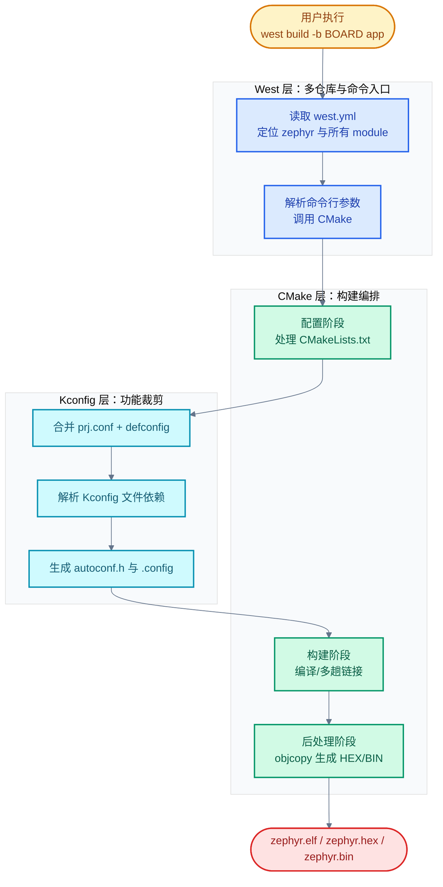

# 02. Zephyr RTOS 构建系统

> 一句话概括：Zephyr 用 West 管多仓库、CMake 编译编排、Kconfig 编译时裁剪、Snippets 复用配置、Sysbuild 编排多镜像，本文从"一份源码到固件镜像经历了什么"出发，讲清五大组件的协作本质与典型用法。
> **工程师视角**：读完后你应当能回答"为什么 West 用 manifest 而非 git submodule""为什么 Kconfig 用 `depends on` 而非 `#ifdef`""为什么不直接改 prj.conf 而要用 Snippet"这三个问题，并能独立添加一个自定义模块或板卡。

### 关键术语

| 缩写 | 全称 | 含义 |
|------|------|------|
| West | Zephyr's tool | Zephyr 的多仓库管理与构建命令工具 |
| Manifest | — | 清单文件 `west.yml`，描述工作区中所有项目及其版本 |
| Workspace | — | West 工作区，包含 manifest 仓库与所有 project 的根目录 |
| Topdir | Top directory | West 工作区根目录，由 `.west/` 目录标识 |
| Project | — | manifest 中声明的被 West 管理的 Git 仓库 |
| Module | — | 构建系统能识别的外部代码单元（HAL/库/驱动等），通常由 West project 提供 |
| CMake | Cross-platform Make | 跨平台构建系统，负责配置阶段与构建编排 |
| Kconfig | Kernel Configuration | 编译时配置系统，决定哪些代码进入镜像 |
| Defconfig | Default configuration | 板卡默认配置文件，位于 `boards/<vendor>/<board>/` |
| Snippet | — | 可复用的构建配置片段（Kconfig/devicetree/CMake 变量） |
| Sysbuild | System build | 上层构建系统，编排多个 Zephyr 镜像（如应用 + MCUboot） |
| Domain | — | Sysbuild 管理的每个独立 Zephyr 构建系统 |
| HAL | Hardware Abstraction Layer | 硬件抽象层 |

---

### 前置阅读

| 需要了解 | 参考文档 |
|----------|----------|
| Zephyr 分层架构与组件总览 | [00-入门概览](./00-入门概览.md) |
| 开发环境搭建与第一个 Blinky | [01-快速开始](./01-快速开始.md) |

---

## 1. 概述：构建系统在做什么

> 上一章（[00-入门概览](./00-入门概览.md)）建立了 Zephyr 分层心智模型，并提到构建系统由 West、CMake、Kconfig 三个组件协作。一个自然的疑问是：**一份 C 源码到一个可烧录的固件镜像，中间到底经历了什么？为什么需要三个工具而不是一个？** 本章先用一个具体小例子回答这个问题，再给出三大组件的协作全景，后续章节逐个深入。

### 1.1 一个具体场景：从 main.c 到 zephyr.elf

假设你写了一个最简应用：

```c
// app/src/main.c
#include <zephyr/kernel.h>

int main(void) {
    printk("Hello, Zephyr!\n");
    return 0;
}
```

执行：

```bash
west build -b qemu_x86 app
```

得到 `build/zephyr/zephyr.elf`。这个 ELF 文件里至少包含：你的 `main.c`、`printk` 实现、调度器、内核初始化代码、UART 驱动、设备树生成的宏、Kconfig 决定的 `CONFIG_*` 宏。一份源码变成固件镜像，经历了下面三件事：

1. **拉取依赖**：Zephyr 本体之外的代码（HAL、MCUboot、mbedtls 等）按 manifest 锁定的版本拉到本地——West 干这件事。
2. **决定编什么**：板卡是 `qemu_x86`，所以只编 x86 架构相关代码；`printk` 需要 UART 驱动；用户态未启用，相关代码不进镜像——Kconfig 干这件事。
3. **编排编译**：收集所有源文件、生成设备树头文件、生成 `autoconf.h`、链接脚本、多趟链接、生成 ELF/HEX/BIN——CMake 干这件事。

> **核心要点**：West、CMake、Kconfig 不是"三个并列的构建系统"，而是"分工不同的三层"——West 管版本与命令入口，Kconfig 管功能裁剪，CMake 管编译编排。三者通过 `.config` 文件解耦：Kconfig 写、CMake 读。

### 1.2 三大组件协作全景



> **如何读这张图**：自上而下是时间顺序。West 是入口，但只负责"找到代码"与"调用 CMake"；Kconfig 在 CMake 配置阶段内部被调用，输出 `autoconf.h` 与 `.config`；CMake 真正驱动编译与链接。Snippets 与 Sysbuild 是横切扩展（见 §5、§6），不改变这条主线。

### 1.3 关键"为什么"速览

| 设计选择 | 为什么 |
|---------|--------|
| 用 West manifest 而非 git submodule | manifest 支持原子化版本锁定、跨仓库 bisect、import 嵌套（见 §2.2） |
| 用 CMake 而非纯 Make | 跨平台、多构建后端（Ninja/Make）、依赖图原生支持 |
| 用 Kconfig `depends on` 而非 `#ifdef` | 依赖图 + 默认值传播，避免编出不可用的配置（见 §4.2） |
| 用 Snippet 而非直接改 prj.conf | 可复用、可叠加、板卡无关（见 §5.1） |
| 用 Sysbuild 而非手工合并镜像 | 多镜像的版本、配置、烧录顺序统一管理（见 §6.1） |

> **如何读这张表**：左列是"它选择了什么"，右列是"它解决了什么问题"。后续每一章会展开"不用它会怎样"。

---

## 2. West：多仓库管理

> 上一章指出 West 是构建系统的入口。本章回答两个问题：**West 的工作区是什么？为什么 Zephyr 不用 git submodule 管理多仓库？** 先讲工作区与 manifest 模型，再解析 `west.yml`，最后列出常用命令。

### 2.1 工作区与 manifest 仓库

West 的工作区（workspace）是一个目录树，根目录由 `.west/` 标识（称为 topdir）。工作区里恰好有一个 **manifest 仓库**（默认就是 `zephyr/`），它包含 `west.yml` 清单文件。清单列出其他被 West 管理的 Git 仓库，称为 **project**。

最小工作区结构（来自 [官方 basics 文档](../zephyr-project/zephyr/doc/develop/west/basics.rst)）：

```text
zephyrproject/                 # topdir
├── .west/                     # 标识 topdir 位置
│   └── config                 # 工作区级配置
├── zephyr/                    # manifest 仓库（含 west.yml）
├── modules/
│   └── lib/
│       └── zcbor/             # 被 West 管理的 project
└── tools/
    └── net-tools/             # 另一个 project
```

manifest 仓库本身不被 West 修改——切换它的版本要用普通 git 命令。每个 project 内部由 West 维护一个名为 `manifest-rev` 的特殊 Git 引用，指向 `west update` 时记录的版本（详见 [workspaces.rst](../zephyr-project/zephyr/doc/develop/west/workspaces.rst) 的"The manifest-rev branch"小节）。

### 2.2 为什么用 manifest 而非 git submodule

git submodule 也能"在一个仓库里引用其他仓库的特定版本"，但它有几个工程化痛点：

- **原子化版本锁定弱**：submodule 的版本信息分散在父仓库的 gitlink tree entry 中，bisect 父仓库时每个 commit 都要单独解析 submodule 状态；manifest 把所有版本集中在一个 YAML 文件里，单次 `west update` 原子切换。
- **嵌套导入困难**：submodule 不能轻易"继承"上游的子模块清单；West 的 `import: true` 直接从上游 manifest 中继承所有 project 定义（见 [manifest.rst 的 import 章节](../zephyr-project/zephyr/doc/develop/west/manifest.rst)）。
- **跨仓库操作命令少**：submodule 没有内建的 `forall`、`list`、`diff` 等跨仓库命令；West 提供了 `west forall`、`west list`、`west diff` 等。
- **覆盖与选择性导入**：manifest 支持 `name-allowlist`、`path-blocklist`、`group-filter`，可以"用上游 manifest 但替换其中某个 project 为自己的 fork"——submodule 做不到。

> **核心要点**：West manifest 把"多仓库版本协调"从 git 的内部状态（gitlink）提升为一份可读、可继承、可覆盖的 YAML 数据文件，让"完整复现一个 Zephyr 工程的所有源码版本"变成 `west init && west update` 两条命令。

> **设计洞察**：West manifest 体现了"可复现构建（Reproducible Build）"与"封闭构建（Hermetic Build）"的工程原则——构建结果只应依赖源码本身，不应依赖网络状态、系统时间、本地工具链版本等环境因素。这与 Bazel 的 `WORKSPACE` 文件、Nix 的 `flake.lock`、Go 的 `go.sum` 解决同一类问题：把"依赖图"从隐式状态（git submodule 的 gitlink tree entry）提升为显式数据（一份可读、可校验、可签名的清单文件）。
>
> 从软件供应链角度，manifest 还提供了"单一信任源"——审计人员只需审查 `west.yml` 中每个 project 的 revision 与 remote，就能确定整个工程的源码来源。这是 `west manifest --freeze` 命令存在的根本动机：把可变引用（branch/tag）固化为不可变 SHA，让"今天构建的固件 == 一年后构建的固件"成为可验证的命题。Linux 内核虽然自身不用 manifest，但 Yocto/OpenEmbedded 的 layer manifest、Android 的 `repo` 工具走的是同一条路。

### 2.3 多仓库历史模型

官方文档用下图描述 manifest 仓库与 project 仓库的版本对应关系：


*来源：Zephyr 官方文档 `doc/develop/west/west-mr-model.png`*

> **如何读这张图**：上方的"漂浮"线是 manifest 仓库（zephyr）的提交历史（A→B→...→G），下方的灰色平面是各 project（P1/P2/P3）的提交历史。**虚线箭头**表示"manifest 的某个 commit 期望 project 处于哪个 commit"。关键观察：manifest 从 C→D 时 P3 **回退**了版本——这是 submodule 难以表达的"有意识回退以规避回归"场景；P3 在 B→C 时一次跳过多个 commit；project 可以在 manifest 的不同 commit 之间保持不变（如 P1 在 F→G 没动）。每个 manifest commit 对每个 project 只指向**一个**确定 commit，这是版本可复现的基础。

### 2.4 west.yml 解析

Zephyr 上游的 `west.yml` 是最好的实战示例，位于 [`zephyr/west.yml`](file:///home/pbw/rtos/cs-learning-notes/zephyr-project/zephyr/west.yml)。它的顶层结构：

```yaml
manifest:
  defaults:
    remote: upstream        # 默认远程
  remotes:
    - name: upstream
      url-base: https://github.com/zephyrproject-rtos
  group-filter: [-babblesim, -optional, -testing]   # 默认禁用的组
  projects:
    - name: hal_nordic
      revision: 72b2bca6488dda83f99ca1daea6916d0235e5d25
      path: modules/hal/nordic
      groups: [hal]
    # ... 约 60 个 project
  self:
    path: zephyr
    west-commands: scripts/west-commands.yml
    import: submanifests     # 从 submanifests/ 目录导入额外清单
```

逐字段说明：

- `remotes`：远程 URL 前缀，project 用 `remote: <name>` 引用，避免重复写完整 URL。
- `defaults`：project 的默认值（`remote`、`revision`）。
- `projects`：被 West 管理的仓库列表。`name` 必填且唯一；`revision` 缺省为 `master`，可以是 branch/tag/SHA；`path` 缺省取 `name`。
- `groups` 与 `group-filter`：project 分组与启用/禁用。被禁用组中所有组都属于的 project 是 **inactive**，`west update` 不会更新它。
- `self`：manifest 仓库自身配置。`path` 指定 manifest 仓库克隆位置；`west-commands` 声明扩展命令入口（`west build`/`west flash` 等就是 Zephyr 通过它注入的）；`import` 引入额外清单文件。
- `submodules`：可选，让 `west update` 同时更新 project 内的 git submodule。

> **核心要点**：`self.import: submanifests` 让 Zephyr 把不同场景的 project 拆到多个 YAML 文件中（如 `submanifests/optional.yml`），主清单保持简洁。这是大型工程管理多场景依赖的推荐模式。

### 2.5 常用 West 命令

| 命令 | 作用 | 典型用法 |
|------|------|---------|
| `west init` | 创建工作区并克隆 manifest 仓库 | `west init -m <url> --mr <tag> <dir>` |
| `west update` | 按 manifest 拉取/更新所有 active project | `west update`（全量）/ `west update hal_nordic`（单个） |
| `west list` | 列出所有 project 及其路径、revision | `west list -f "{name} {path} {revision}"` |
| `west forall` | 在每个 project 中执行命令 | `west forall -c "git status"` |
| `west diff` / `west status` | 跨 project 批量执行 git 命令 | `west diff` |
| `west manifest --resolve` | 输出 import 解析后的最终 manifest | `west manifest --resolve -o resolved.yml` |
| `west manifest --freeze` | 输出所有 revision 替换为 SHA 的"冻结" manifest | `west manifest --freeze -o frozen.yml` |
| `west config` | 读写工作区/全局配置 | `west config build.board qemu_x86` |
| `west topdir` | 打印工作区根目录 | `west topdir` |

Zephyr 通过 `self.west-commands` 注入了扩展命令（详见 [zephyr-cmds.rst](../zephyr-project/zephyr/doc/develop/west/zephyr-cmds.rst)），常用的有：

| 扩展命令 | 作用 |
|---------|------|
| `west build` | 构建（封装 CMake 调用，见 §3） |
| `west flash` | 烧录（调用 runner） |
| `west debug` / `west debugserver` | 调试 |
| `west boards` | 列出支持的板卡 |
| `west sdk` | 安装/管理 Zephyr SDK |
| `west zephyr-export` | 把 Zephyr 注册为 CMake 包 |

`west build` 的常用参数：`-b <board>` 指定板卡、`-d <build_dir>` 指定构建目录、`-t <target>` 执行特定 target（如 `run`、`pristine`、`menuconfig`）、`-p=always` 强制 pristine 重建、`--sysbuild` 启用 Sysbuild（见 §6）、`-S <snippet>` 启用 Snippet（见 §5）。完整参数见 [build-flash-debug.rst](../zephyr-project/zephyr/doc/develop/west/build-flash-debug.rst)。

---

## 3. CMake：构建编排

> 上一章讲清了 West 如何管理源码版本。源码到齐后，下一个问题是：**CMake 把这些源码变成 ELF 经历了哪些阶段？为什么需要多趟链接？** 本章先给三阶段总览，再展开每阶段的细节，最后说明多趟链接的必要性。

### 3.1 三阶段总览

Zephyr 的 CMake 构建分为三大阶段，每阶段都有官方 SVG 详细描述（位于 [`doc/build/cmake/`](file:///home/pbw/rtos/cs-learning-notes/zephyr-project/zephyr/doc/build/cmake/index.rst)）：

```mermaid
%%{init: {"theme": "base", "themeVariables": {"primaryColor": "#f8fafc", "primaryTextColor": "#1e293b", "primaryBorderColor": "#475569", "lineColor": "#64748b", "secondaryColor": "#f1f5f9", "secondaryBorderColor": "#94a3b8", "tertiaryColor": "#f8fafc", "fontFamily": "\"trebuchet ms\", verdana, arial, sans-serif"}}}%%
flowchart LR
    subgraph Phase1["1. 配置阶段"]
        P1a[处理 CMakeLists.txt]
        P1b[Devicetree 生成<br/>devicetree_generated.h]
        P1c[Kconfig 生成<br/>autoconf.h 与 .config]
    end

    subgraph Phase2["2. 构建阶段"]
        P2a[Pre-build<br/>生成 offsets.h 等]
        P2b[编译源文件为归档]
        P2c[多趟链接<br/>pre0 → pre1 → final]
    end

    subgraph Phase3["3. 后处理阶段"]
        P3a[gen_device_deps<br/>设备依赖]
        P3b[gen_isr_tables<br/>中断向量表]
        P3c[gen_kobject_list<br/>内核对象哈希]
        P3d[objcopy 生成<br/>HEX/BIN]
    end

    Phase1 --> Phase2 --> Phase3
    Phase3 --> Out([zephyr.elf<br/>zephyr.hex<br/>zephyr.bin])

    classDef phase1 fill:#dbeafe, stroke:#2563eb, color:#1e40af, stroke-width:2px
    classDef phase2 fill:#d1fae5, stroke:#059669, color:#065f46, stroke-width:2px
    classDef phase3 fill:#cffafe, stroke:#0891b2, color:#155e75, stroke-width:2px
    classDef out fill:#fee2e2, stroke:#dc2626, color:#991b1b, stroke-width:2px
    class P1a,P1b,P1c phase1
    class P2a,P2b,P2c phase2
    class P3a,P3b,P3c,P3d phase3
    class Out out
```



> **如何读这张图**：左到右是时间顺序。配置阶段由 CMake 驱动，输出 Ninja/Makefile 与生成的头文件；构建阶段由 Ninja/Make 驱动，编译源码并多趟链接；后处理阶段对中间镜像做"反射式"补全（设备依赖、ISR 表、内核对象哈希等），最后 objcopy 生成可烧录格式。细节见官方 12 张 SVG：`build-config-phase.svg`、`build-build-phase-1~6.svg`、`build-postprocess-1~4.svg`。

### 3.2 配置阶段

配置阶段从用户执行 `west build -b <board> <app>` 开始。CMake 处理应用目录的 `CMakeLists.txt`，它通过 `find_package(Zephyr REQUIRED HINTS $ENV{ZEPHYR_BASE})` 引入 Zephyr 顶层 [`CMakeLists.txt`](file:///home/pbw/rtos/cs-learning-notes/zephyr-project/zephyr/CMakeLists.txt)。配置阶段做三件事：

1. **Devicetree 处理**：从架构/SoC/板卡/应用目录收集 `*.dts` 与 `*.dtsi`，经 C 预处理器合并 overlay，由 `gen_defines.py` 生成 `build/zephyr/include/generated/zephyr/devicetree_generated.h`。详见 [03-设备树详解](./03-设备树详解.md)。
2. **Kconfig 处理**：合并 `<board>_defconfig` 与应用 `prj.conf`，解析所有 `Kconfig` 文件，输出 `build/zephyr/include/generated/autoconf.h` 与 `build/zephyr/.config`。详见 §4。
3. **生成构建脚本**：CMake 把对源文件、include 路径、链接脚本的处理逻辑写进 `build.ninja` 或 `Makefile`。

配置阶段的可视化见下图，原图位于 [`doc/build/cmake/build-config-phase.svg`](../zephyr-project/zephyr/doc/build/cmake/build-config-phase.svg)：


*来源：Zephyr 官方文档 `doc/build/cmake/build-config-phase.svg`*

> **如何读这张图**：从左上角的"Application CMakeLists.txt"开始，CMake 自上而下处理：先收集 devicetree 源文件并生成 `devicetree_generated.h`，再合并 Kconfig 配置生成 `autoconf.h` 与 `.config`，最后把所有信息汇总为 `build.ninja`（或 Makefile）。注意 devicetree 与 Kconfig 之间有数据流——Kconfig 可通过 `kconfigfunctions.py` 读取 devicetree 信息（如某节点是否存在来决定某驱动是否编入）。

### 3.3 构建阶段：多趟链接是核心

构建阶段从执行 `ninja`/`make` 开始，核心产物是 `zephyr.elf`。但 Zephyr 通常需要**多趟链接**——这是因为某些数据需要"反射"中间镜像才能生成。

Zephyr 顶层 `CMakeLists.txt` [`zephyr/CMakeLists.txt`](file:///home/pbw/rtos/cs-learning-notes/zephyr-project/zephyr/CMakeLists.txt#L44-L69)明确说明了多趟链接：

```cmake
# Zephyr build system will use a dynamic number of linking stages based on build
# configuration.
#
# Currently up to three linking stages may be executed:
# zephyr_pre0:  First linking stage
# zephyr_pre1:  Second linking stage
# zephyr_final: Final linking stage
#
# Multiple linking stages are required in the following cases:
# - device dependencies structs must be generated (CONFIG_DEVICE_DEPS=y)
# - ISR tables must be generated (CONFIG_GEN_ISR_TABLES=y)
# - Kernel objects hash tables (CONFIG_USERSPACE=y)
# - Application memory partitions (CONFIG_USERSPACE=y)
```

链接阶段含义：

- `zephyr_pre0`：第一趟链接，链接脚本段大小可变、地址可重定位。
- `zephyr_pre1`：第二趟链接，所有段大小固定、地址不变。仅在 `CONFIG_USERSPACE` 或 `CONFIG_DEVICE_DEPS` 启用时存在。
- `zephyr_final`：最终链接，产出可烧录的 ELF。

其中 `CONFIG_USERSPACE` 控制 Zephyr 的**用户态**支持——开启后内核与各应用被隔离到不同的内存保护域（需要硬件 MPU/MMU），应用通过系统调用访问内核服务。它之所以触发额外的链接趟，是因为必须先拿到符号的最终地址，才能为每个应用生成内存分区链接脚本、为所有内核对象生成权限查表用的完美哈希表（详见 §3.4）。无 MPU 或资源受限的板卡通常关闭此选项以节省 Flash/RAM。

> **核心要点**：多趟链接不是 CMake 的怪癖，而是"用链接器自身做反射"——某些数据（如内核对象地址、设备依赖关系、ISR 表）必须在知道符号地址后才能生成，而符号地址要等链接后才确定。Zephyr 选择"先链接一次拿到地址 → 生成缺失数据 → 再链接一次填充"，比运行时初始化节省 Flash 与 RAM。

> **设计洞察**：多趟链接本质是"求解不动点（fixpoint）"——某些数据（内核对象哈希、设备依赖图、ISR 表）的值依赖符号地址，而符号地址要等链接后才确定。Zephyr 选择"先链接拿到近似解 → 用近似解生成缺失数据 → 再链接得到精确解"，这与编译器的"两趟汇编"（first pass 收集符号地址、second pass 生成代码）、DNS 的迭代解析、数据库查询计划的统计信息收集是同一类设计模式。
>
> 这种"用链接器做反射"的选择反映了嵌入式系统的资源约束：桌面 Linux 可以在 `/proc/kallsyms` 运行时查符号、用内核模块加载时重定位；但 8KB RAM 的 MCU 既容不下符号表，也承担不起运行时重定位的开销。把"反射"前置到链接期，用编译时多趟换运行时零开销——这是 Zephyr 能在 mmu-class 资源上实现用户态隔离的关键权衡。代价是构建时间变长，对开发者影响小；收益是镜像更小、启动更快，对最终设备影响大。

构建阶段的子阶段对应官方 SVG：

| 子阶段 | SVG | 做什么 |
|--------|-----|-------|
| Pre-build | `build-build-phase-1.svg` | 生成 `offsets.h`（结构体偏移，供汇编使用）、系统调用样板代码 |
| 中间二进制 | `build-build-phase-2.svg` | 编译 C/汇编为归档（archive） |
| 链接脚本生成 | `build-build-phase-3.svg` | `cpp` 合并链接脚本片段为 `linker.cmd`，第一趟链接产出未固定大小镜像 |
| 固定大小镜像 | `build-build-phase-4.svg` | 第二趟链接，段大小固定 |
| 最终镜像 | `build-build-phase-5.svg` | 第三趟链接，填充后处理生成的数据 |
| 格式转换 | `build-build-phase-6.svg` | `objcopy` 生成 HEX/BIN |

### 3.4 后处理阶段

后处理对中间镜像做反射式补全，四个脚本最常用：

| 脚本 | 触发条件 | 作用 |
|------|---------|------|
| `gen_app_partitions.py` | `CONFIG_USERSPACE=y` | 扫描归档，生成应用内存分区对齐的链接脚本片段 |
| `gen_device_deps.py` | devicetree 启用 | 扫描未固定镜像，生成设备依赖关系并优化查找表 |
| `gen_isr_tables.py` | `CONFIG_GEN_ISR_TABLES=y` | 扫描固定镜像，生成中断向量表 `isr_tables.c` |
| `gen_kobject_list.py` + `gperf` | `CONFIG_USERSPACE=y` | 扫描 ELF DWARF 信息，找内核对象地址，生成完美哈希表 |

后处理的可视化分别见 [`build-postprocess-1.svg`](../zephyr-project/zephyr/doc/build/cmake/build-postprocess-1.svg) 到 [`build-postprocess-4.svg`](../zephyr-project/zephyr/doc/build/cmake/build-postprocess-4.svg)。

---

## 4. Kconfig：编译时裁剪

> 上一章指出 CMake 配置阶段会调用 Kconfig 生成 `autoconf.h`。本章回答：**Kconfig 究竟在裁剪什么？为什么用 `depends on` 而非 `#ifdef`？prj.conf 与 defconfig 是什么关系？** 先讲本质，再讲语法与依赖解析，最后讲配置文件合并。

### 4.1 Kconfig 在做什么

Kconfig 是从 Linux 继承的编译时配置系统，决定**哪些代码进入镜像**。它的输入是分散在全代码库的 `Kconfig` 文件（定义选项与依赖），以及配置片段（`.conf`、`defconfig`，给出选项取值）。输出是 `autoconf.h`（C 宏定义）与 `.config`（人类可读的最终配置）。

```c
// 代码侧用法：通过 #ifdef 选择性编译
#ifdef CONFIG_FPU
    // FPU 相关代码
#endif
```

如果不启用 `CONFIG_FPU`，这段代码不会进入镜像——节省 Flash。这是 Zephyr 能在 8KB RAM 上运行的关键。

### 4.2 为什么用 `depends on` 而非 `#ifdef`

考虑这个例子：FPU 支持依赖 CPU 硬件有 FPU 单元。

```kconfig
# Kconfig 写法
config CPU_HAS_FPU
    bool                    # 不可见符号，由 SoC Kconfig 选中

config FPU
    bool "Support floating point operations"
    depends on CPU_HAS_FPU  # 依赖：CPU 必须有 FPU
    help
      Enable floating point operations.
```

如果用纯 `#ifdef`，开发者可能在没有 FPU 的 SoC 上写 `#define CONFIG_FPU y`，结果编出的镜像包含 FPU 代码但跑不起来——错误在链接期或运行期才暴露。Kconfig 的 `depends on` 把这个错误提前到配置阶段：

- `CPU_HAS_FPU=n` 时，`FPU` 选项在 menuconfig 中根本不出现，`prj.conf` 写 `CONFIG_FPU=y` 会触发警告并被忽略。
- `CPU_HAS_FPU=y` 时，`FPU` 默认为 `n`，需要用户显式启用。

更进一步，Kconfig 维护一张**依赖图**，支持 `select`（反向依赖，强制选中）、`default`（默认值传播）、`range`（取值范围）。例如：

```kconfig
config CPU_CORTEX_M4
    bool
    select CPU_HAS_FPU       # 选 Cortex-M4 自动选 CPU_HAS_FPU

config FPU
    bool "Support floating point operations"
    depends on CPU_HAS_FPU
```

选了 `CPU_CORTEX_M4` 后，`CPU_HAS_FPU` 被自动选中，`FPU` 选项变可见——开发者无需手动维护"选 M4 就要选 FPU 硬件"这条链。

> **核心要点**：`#ifdef` 只做"代码裁剪"，`depends on` 做"配置约束 + 默认值传播 + 依赖图"。它把"无效配置"从运行期错误提升为配置期错误，这是 RTOS 确定性的前置条件。

> **设计洞察**：Kconfig 的 `depends on` 体现了"故障左移（Shift Left）"原则——错误越早暴露代价越小。`#ifdef` 把"配置错误"推迟到链接期（符号找不到）或运行期（硬件无响应），调试成本指数级上升；`depends on` 把它提前到配置期，CMake 立即报错并指出依赖链。这与静态类型语言相对动态类型语言的优势是同一类：用前置约束换运行时安全。
>
> 更深一层，Kconfig 维护的"依赖图 + 默认值传播"是一种声明式配置（Declarative Configuration）范式——开发者描述"我想要什么"（FPU=y），系统自动推导"还需要什么"（CPU_HAS_FPU=y、CPU_CORTEX_M4=y），而不是命令式地逐条设置。这与 Terraform 的依赖图、Make 的先决条件推导、systemd 的 unit 依赖是同一种思路：让工具维护传递依赖，避免人工漏配。在 RTOS 场景下，这种确定性更是硬要求——固件一旦烧录就难以变更，配置期就必须保证一致性。

### 4.3 Kconfig 语法要点

| 语法 | 作用 | 示例 |
|------|------|------|
| `config <NAME>` | 定义一个选项 | `config FPU` |
| `bool` / `int` / `hex` / `string` / `tristate` | 选项类型 | `bool "提示文本"` |
| `prompt "..."` | 提示文本（可省略，无 prompt 即"不可见"） | `bool "Support FPU"` |
| `default <value>` | 默认值 | `default n` |
| `depends on <expr>` | 依赖（不满足则不可见、不可选） | `depends on CPU_HAS_FPU` |
| `select <NAME>` | 反向依赖（选中本项时强制选 NAME） | `select CPU_HAS_FPU` |
| `imply <NAME>` | 弱反向依赖（可被覆盖） | `imply FPU` |
| `range <min> <max>` | 数值范围 | `range 1 256` |
| `help` | 帮助文本 | `help\n  ...` |
| `choice` / `endchoice` | 多选一 | 详见 [setting.rst](../zephyr-project/zephyr/doc/build/kconfig/setting.rst) |
| `if <expr>` / `endif` | 条件块 | `if BOARD_MY_BOARD` |
| `source "<path>"` | 引入其他 Kconfig | `source "Kconfig.zephyr"` |

Zephyr 用 [Kconfiglib](https://github.com/zephyrproject-rtos/Kconfiglib) 实现，并扩展了 `osource`（可选源）、`rsource`（相对路径源）、`def_int`/`def_hex`/`def_string`、`configdefault`（添加默认值不削弱依赖）等关键字，详见 [extensions.rst](../zephyr-project/zephyr/doc/build/kconfig/extensions.rst)。

### 4.4 可见与不可见符号

Kconfig 区分两类符号（详见 [setting.rst](../zephyr-project/zephyr/doc/build/kconfig/setting.rst)）：

- **可见符号**：有 prompt，可在 menuconfig 中修改，可在 `.conf` 中赋值。
- **不可见符号**：无 prompt，由 `default` 或 `select` 决定，**不能**在 `.conf` 中赋值。修改它们的值只能在 `Kconfig.defconfig` 中通过再次定义 `default` 实现。

```kconfig
# 可见符号
config FPU
    bool "Support floating point operations"
    depends on HAS_FPU

# 不可见符号
config CPU_HAS_FPU
    bool                    # 无 prompt
    help
      This symbol is y if the CPU has a hardware floating point unit.
```

> **如何读这两段**：可见符号是"用户可调的旋钮"，不可见符号是"系统内部状态"。把 SoC 是否有 FPU 这种"硬件事实"建模为不可见符号，由 SoC Kconfig 通过 `select CPU_HAS_FPU` 设置，避免用户在 prj.conf 中误改。

### 4.5 配置文件合并：prj.conf 与 defconfig

最终配置由多个来源合并，按优先级从低到高（见 [setting.rst 的 "The Initial Configuration"](../zephyr-project/zephyr/doc/build/kconfig/setting.rst)）：

1. `boards/<vendor>/<board>/<board>_defconfig`：板卡默认配置。
2. CMake cache 中 `CONFIG_` 前缀变量（`-DCONFIG_XXX=y`）。
3. 应用配置，按以下顺序查找：
   - 若设置了 `CONF_FILE`，用它指定的文件。
   - 否则若 `boards/<board>.conf` 存在，与 `prj.conf` 合并。
   - 否则若启用板卡修订且 `boards/<board>_<revision>.conf` 存在，三者合并。
   - 否则用 `prj.conf`。
4. SoC Kconfig 片段 `socs/<soc>_<board_qualifiers>.conf`（若存在）。
5. 板卡 Kconfig 片段（若有）。

合并结果写到 `build/zephyr/.config`。同一符号在多处赋值时，**应用配置覆盖板卡 defconfig**。

修改不可见符号的值必须在 `boards/<vendor>/<board>/Kconfig.defconfig` 中：

```kconfig
# boards/my_vendor/my_board/Kconfig.defconfig
if BOARD_MY_BOARD

config FOO_WIDTH
    default 32             # 覆盖 base 定义中的 default

endif
```

> **核心要点**：prj.conf 是"应用级配置"，defconfig 是"板卡级默认"。两者分工：板卡配置说"我这板子有什么"，应用配置说"我要用这些做什么"。Snippets（§5）则是"跨应用可复用的配置片段"，弥补 prj.conf 不可复用的缺口。

### 4.6 查看与调试配置

```bash
# 在已有 build 目录中打开菜单界面
west build -t menuconfig

# 搜索某符号的依赖、默认值、当前值
west build -t guiconfig

# 直接看最终合并结果
cat build/zephyr/.config | grep FPU

# 输出所有 CONFIG_ 宏
cat build/zephyr/include/generated/autoconf.h
```

---

## 5. Snippets：可复用配置片段

> 上一章讲到 prj.conf 是应用级配置。一个常见痛点是：**多个应用都需要"把控制台从 UART 切到 USB CDC-ACM""启用调试选项""为某 SoC 配置双核"等相同配置，每个应用都复制一份 prj.conf？** Snippet 就是解决这个问题的可复用配置片段。本章先讲为什么需要它，再讲怎么用、怎么写。

### 5.1 为什么不直接改 prj.conf

直接改 prj.conf 有三个问题（详见 [snippets/design.rst](../zephyr-project/zephyr/doc/build/snippets/design.rst)）：

- **不可复用**：配置写死在某个应用的 prj.conf 里，其他应用要用得复制粘贴。
- **不可叠加**：同一应用想同时启用"USB 控制台"和"调试选项"两组配置，prj.conf 难以模块化组合。
- **板卡相关**：某些配置只在特定板卡上有意义，写死在 prj.conf 里需要 `# ifdef` 维护。

Snippet 的设计目标是 **extensible / composable / specializable / DRY**（见 [design.rst](../zephyr-project/zephyr/doc/build/snippets/design.rst)）：一个 snippet 可以同时携带 devicetree overlay、Kconfig 片段、CMake 变量；多个 snippet 可以叠加；可以针对特定板卡或板卡修订做特化；可以跨应用复用。

> **核心要点**：Snippet 是"配置的库函数"——把"启用 USB 控制台"这种通用需求封装成 `snippet.yml`，任何应用用 `-S` 启用即可，不用改自己的 prj.conf。

> **设计洞察**：Snippet 体现了"策略与机制分离"以及"组合优于继承"的设计原则。`prj.conf` 是"应用专属策略"，而"启用 USB 控制台""配置调试选项"是"可复用机制"——把它们封装成 Snippet 后，应用通过 `-S` 选择性组合，而不是把所有配置塞进一个膨胀的 prj.conf。这与 Unix 的"管道组合小工具"、Linux 内核的"驱动注册 + 总线匹配"、面向对象的"组合优先于继承"是同一种工程智慧。
>
> 从软件工程角度，Snippet 解决的是"配置代码的复用问题"——传统 RTOS（如 FreeRTOS）的 FreeRTOSConfig.h 是单文件、难复用、难叠加，跨项目移植要逐行 diff；Zephyr 用 Snippet 把"配置片段"提升为一等公民，支持板卡特化与版本修订。这种设计让"把一个项目的某项能力搬到另一个项目"从"复制粘贴 + 改冲突"变成"加一个 `-S` 参数"，是大型工程维护的关键。

### 5.2 使用 snippet

```bash
# 启用单个 snippet
west build -S foo app

# 启用多个 snippet（按顺序处理，后者覆盖前者）
west build -S snippet1 -S snippet2 app

# 用 CMake 直接调用
cmake -Sapp -Bbuild -DSNIPPET="snippet1;snippet2" [...]
cmake --build build
```

应用也可以在 `CMakeLists.txt` 中强制要求某个 snippet（见 [using.rst](../zephyr-project/zephyr/doc/build/snippets/using.rst)）：

```cmake
if(NOT snippet1 IN_LIST SNIPPET)
  set(SNIPPET snippet1 ${SNIPPET} CACHE STRING "" FORCE)
endif()

find_package(Zephyr ...)
```

Zephyr 自带一批 snippet，可查阅 [built-in snippets 列表](../zephyr-project/zephyr/doc/build/snippets/index.rst)。

### 5.3 编写 snippet

Snippet 用 `snippet.yml` 定义，位置由 `SNIPPET_ROOT` 决定（默认包含 `zephyr/snippets/`），详见 [writing.rst](../zephyr-project/zephyr/doc/build/snippets/writing.rst)。

```yaml
# snippets/foo/snippet.yml
name: foo
append:
  EXTRA_DTC_OVERLAY_FILE: foo.overlay    # 追加 devicetree overlay
  EXTRA_CONF_FILE: foo.conf              # 追加 Kconfig 片段
```

也可以为 sysbuild 添加配置：

```yaml
name: foo
append:
  SB_EXTRA_CONF_FILE: sb.conf            # sysbuild 配置
  EXTRA_CONF_FILE: app.conf              # 应用配置
```

板卡特化：用 `boards` 字段为不同板卡应用不同配置，支持按名称或正则匹配，甚至支持板卡修订：

```yaml
name: foo
boards:
  bar:                                   # 板卡名为 bar
    append:
      EXTRA_DTC_OVERLAY_FILE: bar.overlay
  /my_vendor_.*/:                        # 正则匹配
    append:
      EXTRA_DTC_OVERLAY_FILE: my_vendor.overlay
  baz:                                   # 板卡 baz，演示修订特化
    append:
      EXTRA_DTC_OVERLAY_FILE: first.overlay
    revisions:
      "0.7.0":
        append:
          EXTRA_DTC_OVERLAY_FILE: extra_0_7_0.overlay
```

> **如何读这段配置**：`append` 表示"在已有配置后追加"。`boards.bar` 下的设置会**叠加**到通用 `append` 上，不是替换。`revisions."0.7.0"` 进一步在板卡 `baz@0.7.0` 时叠加。处理顺序：通用 → 板卡 → 板卡修订；多个 snippet 按命令行中 `-S` 顺序处理，后者覆盖前者。

### 5.4 snippet 命名空间

为避免与现有 nodelabel 冲突，写 devicetree overlay 时建议用 `snippet_<name>` 或 `snippet-<name>` 前缀（见 [writing.rst 的 Namespacing](../zephyr-project/zephyr/doc/build/snippets/writing.rst)）：

```dts
chosen {
    zephyr,baz = &snippet_foo_bar_dev;
};

snippet_foo_bar_dev: device@12345678 {
    /* ... */
};
```

---

## 6. Sysbuild：多镜像构建

> 上一章解决了"配置复用"问题。还有一类问题 Snippet 解决不了：**当一个设备需要同时运行多个镜像（如 bootloader + 应用，或主核 + 副核）时，怎么统一构建、配置、烧录？** Sysbuild 就是为此设计的上层构建系统。本章讲它的本质与用法。

### 6.1 为什么需要 Sysbuild

**MCUboot** 是嵌入式领域常见的开源安全 bootloader，Zephyr 把它作为独立镜像构建。它的职责是上电后校验主应用镜像的签名与完整性，通过后才跳转执行，并支持 A/B 分区或 swap 模式的镜像升级与回滚。之所以把校验逻辑做成独立镜像而非编进主应用，是因为升级过程中主应用自身会被擦写——校验代码必须驻留在不会被改写的 Flash 区域。

考虑一个典型场景：你的设备需要 MCUboot 作为 bootloader，再加你的主应用。两个镜像各自是一个 Zephyr 工程，有各自的 prj.conf、板卡、Kconfig。如果不用 Sysbuild，你需要：

1. 手工构建 MCUboot，得到 `mcuboot.hex`。
2. 手工构建主应用，把它配置为 MCUboot 可引导格式（签名、padding 等）。
3. 手工按顺序烧录两个镜像。

每次配置变更（如改调试优化级别）都要在两个工程里各改一次，版本与配置容易失配。Sysbuild 把这些统一管理：一个 CMake 顶层项目编排多个 Zephyr 子构建，统一接受 `-D` 参数并按命名空间分发，统一生成 `domains.yaml` 让 `west flash` 按正确顺序烧录。

> **核心要点**：Sysbuild 不是"构建系统替代品"，而是"构建系统的编排器"。每个子镜像仍然是标准 Zephyr CMake 构建，Sysbuild 只是在它们之上加了一层——管理它们的配置命名空间、依赖顺序、烧录顺序。

### 6.2 启用 Sysbuild

```bash
# 单次启用
west build --sysbuild -b reel_board samples/hello_world

# 永久启用
west config build.sysbuild True

# 单次禁用（已永久启用时）
west build --no-sysbuild ...
```

直接用 CMake 时把源目录指向 sysbuild 项目，并用 `APP_DIR` 指定主应用：

```bash
cmake -Bbuild -GNinja -DBOARD=reel_board \
      -DAPP_DIR=samples/hello_world \
      share/sysbuild
ninja -Cbuild
```

架构总览见 [`sysbuild.svg`](../zephyr-project/zephyr/doc/build/sysbuild/sysbuild.svg)。

### 6.3 配置命名空间

Sysbuild 管理多个镜像，需要把命令行参数准确分发到正确的子构建。命名空间规则（详见 [sysbuild/index.rst](../zephyr-project/zephyr/doc/build/sysbuild/index.rst)）：

| 前缀 | 目标 | 示例 |
|------|------|------|
| `SB_CONFIG_<var>` | Sysbuild 自身的 Kconfig | `-DSB_CONFIG_BOOTLOADER_MCUBOOT=y` |
| `<image>_CONFIG_<var>` | 指定 image 的 Kconfig | `-Dmcuboot_CONFIG_DEBUG_OPTIMIZATIONS=y` |
| `CONFIG_<var>`（无前缀） | 主应用的 Kconfig | `-DCONFIG_DEBUG_OPTIMIZATIONS=y` |
| `<image>_<var>` | 指定 image 的 CMake 变量 | `-Dmy_sample_FOO=BAR` |

例如同时为 `hello_world` 和 MCUboot 启用调试优化：

```bash
west build --sysbuild -b reel_board samples/hello_world -- \
    -DSB_CONFIG_BOOTLOADER_MCUBOOT=y \
    -DCONFIG_DEBUG_OPTIMIZATIONS=y \
    -Dmcuboot_CONFIG_DEBUG_OPTIMIZATIONS=y
```

### 6.4 添加额外 Zephyr 镜像

在主应用目录下创建 `sysbuild.cmake` 和 `Kconfig.sysbuild`（详见 [images.rst](../zephyr-project/zephyr/doc/build/sysbuild/images.rst)）：

```cmake
# sysbuild.cmake
if(SB_CONFIG_SECOND_SAMPLE)
  ExternalZephyrProject_Add(
    APPLICATION second_sample
    SOURCE_DIR <path-to>/second_sample
  )
endif()
```

```kconfig
# Kconfig.sysbuild
source "sysbuild/Kconfig"

config SECOND_SAMPLE
    bool "Second sample"
    default y
```

也可以让额外镜像面向不同板卡（多核 SoC 场景）：

```cmake
ExternalZephyrProject_Add(
  APPLICATION my_sample
  SOURCE_DIR <path-to>/my_sample
  BOARD mps2/an521/cpu1      # 副核板卡
)
```

### 6.5 烧录与调试

`west flash` 在多镜像构建中按 sysbuild 定义的顺序逐个烧录。用 `--domain` 指定单个镜像：

```bash
west flash --domain mcuboot       # 只烧 MCUboot
west flash --domain hello_world   # 只烧主应用
```

调试同理，`west debug` 默认调试主应用（默认 domain 是命令行中传入的源目录对应镜像）：

```bash
west debug                          # 调试主应用
west debug --domain mcuboot         # 调试 MCUboot
```

### 6.6 sysbuild.conf

应用根目录可放 `sysbuild.conf` 配置 sysbuild 自身的 Kconfig：

```cfg
# sysbuild.conf
SB_CONFIG_BOOTLOADER_MCUBOOT=y
```

也可以用 `-DSB_CONF_FILE=<file>` 指定其他文件，实现"同一应用用不同 sysbuild 配置"。

---

## 7. 实战：自定义模块、板卡与 Kconfig

> 前六章讲清了五大组件。本章把理论落地——用三个最小可运行例子演示如何添加自定义模块、自定义板卡、自定义 Kconfig 选项，覆盖工程中最常见的三类扩展。

### 7.1 添加自定义模块

Zephyr 模块是被构建系统识别的外部代码单元，可以是 HAL、库、驱动等。模块通过 manifest 中的 project 拉取，通过 `module.yml` 声明如何接入构建。

最小模块结构：

```text
my-module/
├── CMakeLists.txt
├── module.yml             # 模块元数据
├── zephyr/
│   └── module.c
└── Kconfig
```

```yaml
# module.yml
build:
  cmake: .
  kconfig: Kconfig
```

```cmake
# CMakeLists.txt
zephyr_library()
zephyr_library_sources(zephyr/module.c)
```

```kconfig
# Kconfig
config MY_MODULE
    bool "My module support"
    default y
```

```c
/* zephyr/module.c */
#include <zephyr/kernel.h>

void my_module_init(void) {
    printk("my_module initialized\n");
}
```

在自己的应用 `west.yml` 中引用：

```yaml
manifest:
  remotes:
    - name: my-remote
      url-base: https://git.example.com
  projects:
    - name: my-module
      remote: my-remote
      revision: v1.0
      path: modules/my-module
```

`west update` 后，构建系统会自动发现该模块（通过 module.yml）并把 `MY_MODULE` 选项加入 Kconfig。在 prj.conf 中启用 `CONFIG_MY_MODULE=y` 即可。

### 7.2 添加自定义板卡

板卡定义位于 `boards/<vendor>/<board>/`，最少需要：

```text
boards/my_vendor/my_board/
├── board.yml                              # 板卡元数据
├── my_board_<qualifiers>_defconfig        # 默认 Kconfig 配置（如 my_board_stm32f405xx_defconfig）
├── my_board_<qualifiers>.dts              # 板卡设备树（如 my_board_stm32f405xx.dts）
├── Kconfig.my_board                       # 板卡 Kconfig 定义
└── Kconfig.defconfig                      # 板卡默认值（不可见符号）
```

```yaml
# board.yml
board:
  name: my_board
  full_name: My Custom Board
  vendor: my_vendor
  socs:
    - name: stm32f405xx
```

```kconfig
# Kconfig.board
config BOARD_MY_BOARD
    bool "My Custom Board"
    depends on SOC_STM32F405XX
    select CPU_CORTEX_M4
```

```kconfig
# my_board_defconfig
CONFIG_BOARD_MY_BOARD=y
CONFIG_SOC_STM32F405XX=y
CONFIG_SERIAL=y
```

```dts
/* my_board.dts */
/dts-v1/;
#include <st/f4/stm32f405.dtsi>

/ {
    model = "My Custom Board";
    compatible = "my_vendor,my_board";

    chosen {
        zephyr,console = &usart2;
        zephyr,shell-uart = &usart2;
    };
};

&usart2 {
    status = "okay";
    current-speed = <115200>;
};
```

让 Zephyr 发现你的板卡，需要设置 `BOARD_ROOT`：

```bash
west build -b my_board app -- -DBOARD_ROOT=/path/to/your/boards/parent
```

或在应用 `CMakeLists.txt` 中：

```cmake
list(APPEND BOARD_ROOT ${CMAKE_CURRENT_SOURCE_DIR})
find_package(Zephyr REQUIRED HINTS $ENV{ZEPHYR_BASE})
```

构建后用 `west boards` 应能看到 `my_board`。板卡移植的完整流程见 [官方板卡移植指南](../zephyr-project/zephyr/doc/hardware/porting/board_porting.rst)。

### 7.3 添加自定义 Kconfig 选项

在模块或应用目录的 `Kconfig` 文件中定义：

```kconfig
# Kconfig
config MY_FEATURE_TIMEOUT_MS
    int "My feature timeout in milliseconds"
    default 1000
    range 100 60000
    depends on MY_MODULE
    help
      Timeout for my feature operation. Must be between 100ms and 60s.
```

在 C 代码中使用：

```c
#include <zephyr/kernel.h>
#include <zephyr/sys_clock.h>

#define MY_TIMEOUT K_MSEC(CONFIG_MY_FEATURE_TIMEOUT_MS)

void my_feature_do(void) {
    k_sleep(MY_TIMEOUT);
}
```

在 `prj.conf` 中调整：

```cfg
CONFIG_MY_MODULE=y
CONFIG_MY_FEATURE_TIMEOUT_MS=500
```

> **核心要点**：自定义 Kconfig 选项的三步走——在 `Kconfig` 中定义（带类型、依赖、默认、范围、help），在 C 代码中用 `CONFIG_XXX` 引用，在 `prj.conf` 中赋值。这条链路贯穿"声明—使用—配置"，是 Zephyr 可裁剪性的根基。

---

## 参考资料

- [West basics](../zephyr-project/zephyr/doc/develop/west/basics.rst) — 工作区、manifest、init/update 基本概念
- [West workspaces](../zephyr-project/zephyr/doc/develop/west/workspaces.rst) — manifest-rev 分支、私有仓库、拓扑（T1/T2/T3）
- [West manifest](../zephyr-project/zephyr/doc/develop/west/manifest.rst) — manifest 文件完整语法、import、groups
- [West built-in commands](../zephyr-project/zephyr/doc/develop/west/built-in.rst) — init/update/list/forall 等命令详解
- [West build/flash/debug](../zephyr-project/zephyr/doc/develop/west/build-flash-debug.rst) — west build/flash/debug 全部参数与配置项
- [West Zephyr extension commands](../zephyr-project/zephyr/doc/develop/west/zephyr-cmds.rst) — boards/sdk/spdx/patch 等扩展命令
- [CMake build system](../zephyr-project/zephyr/doc/build/cmake/index.rst) — 三阶段构建流程与 12 张 SVG
- [Kconfig configuration system](../zephyr-project/zephyr/doc/build/kconfig/index.rst) — Kconfig 总览
- [Setting Kconfig values](../zephyr-project/zephyr/doc/build/kconfig/setting.rst) — 配置文件合并、可见性、defconfig
- [Kconfig extensions](../zephyr-project/zephyr/doc/build/kconfig/extensions.rst) — Kconfiglib 的扩展关键字
- [Snippets](../zephyr-project/zephyr/doc/build/snippets/index.rst) — Snippet 总览与子页面（using/writing/design）
- [Sysbuild](../zephyr-project/zephyr/doc/build/sysbuild/index.rst) — Sysbuild 架构、命名空间、镜像管理
- [Zephyr 源码 west.yml](file:///home/pbw/rtos/cs-learning-notes/zephyr-project/zephyr/west.yml) — 上游 manifest 实例
- [Zephyr 源码 CMakeLists.txt](file:///home/pbw/rtos/cs-learning-notes/zephyr-project/zephyr/CMakeLists.txt) — 多趟链接定义

## 下一篇

[03-设备树详解](./03-设备树详解.md) — Devicetree 源文件、bindings、phandles，以及 `devicetree_generated.h` 宏的展开机制。
