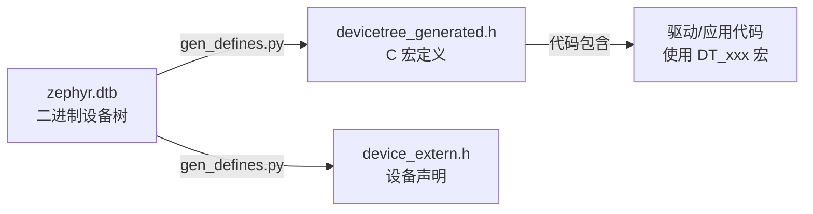
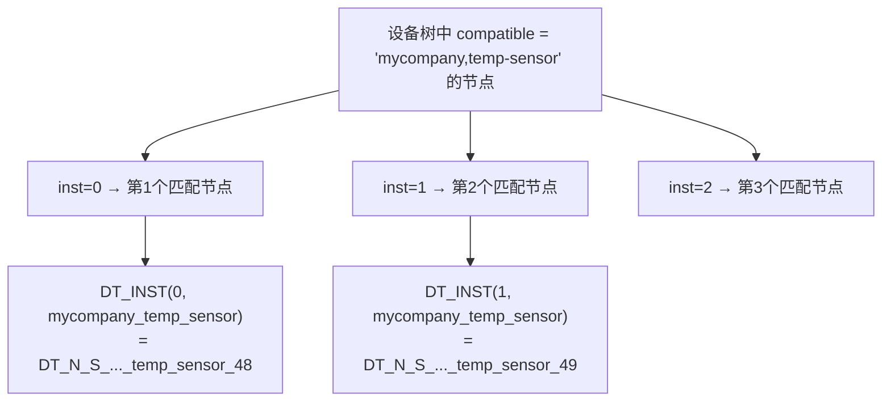
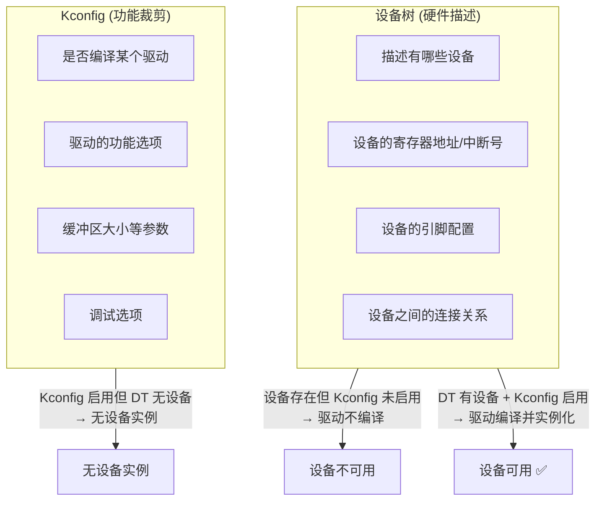

# Zephyr 设备树（Device Tree）详解

> 返回：[入门概览](./00_入门概览.md) | [文档导航](../README.md)

---

## 目录
1. [为什么需要设备树](#1-为什么需要设备树)
2. [设备树核心概念](#2-设备树核心概念)
3. [设备树语法详解](#3-设备树语法详解)
4. [Zephyr 设备树架构](#4-zephyr-设备树架构)
5. [设备树绑定（Bindings）](#5-设备树绑定bindings)
6. [设备树在代码中的应用](#6-设备树在代码中的应用)
7. [实战：添加自定义设备](#7-实战添加自定义设备)
8. [调试与排错](#8-调试与排错)

---

## 1. 为什么需要设备树

### 1.1 问题背景

在嵌入式开发中，硬件配置信息（如外设基地址、中断号、引脚配置等）传统上直接硬编码在源码中：

```c
// 传统方式：硬件信息硬编码
#define UART0_BASE_ADDR     0x40001000
#define UART0_IRQ           11
#define UART0_TX_PIN        5
#define UART0_RX_PIN        6
```

**这种方式的问题：**
- ❌ 同一芯片不同板卡需要维护多份代码
- ❌ 硬件变更需要重新编译整个内核
- ❌ 代码与硬件紧耦合，可移植性差
- ❌ 难以支持同一镜像运行在不同硬件上

### 1.2 设备树的解决方案

设备树（Device Tree）将硬件描述从内核源码中分离出来：

```
┌─────────────────────────────────────────────────────────────┐
│                      内核源码                                │
│  ┌─────────────────────────────────────────────────────┐   │
│  │  驱动代码（通用，与硬件无关）                        │   │
│  │  - 从设备树获取硬件信息                              │   │
│  │  - 标准化的设备操作接口                              │   │
│  └─────────────────────────────────────────────────────┘   │
└─────────────────────────────────────────────────────────────┘
                              │
                              │ 解析
                              ▼
┌─────────────────────────────────────────────────────────────┐
│                    设备树（DTB 二进制）                       │
│  ┌─────────────────────────────────────────────────────┐   │
│  │  硬件描述（板卡相关）                                │   │
│  │  - 外设基地址、中断号                                │   │
│  │  - 引脚复用配置                                      │   │
│  │  - 时钟、电源配置                                    │   │
│  └─────────────────────────────────────────────────────┘   │
└─────────────────────────────────────────────────────────────┘
```

**设备树的优势：**
- ✅ 硬件描述与内核分离，独立维护
- ✅ 同一内核镜像支持多种硬件平台
- ✅ 板级变更无需重新编译内核
- ✅ 硬件信息标准化，便于移植

### 1.3 设备树的历史

设备树最初由 **Open Firmware**（OpenBoot）标准定义，后被 Linux 内核采用用于支持 ARM 架构。Zephyr 从 Linux 继承了设备树机制，并针对资源受限的嵌入式场景进行了优化。

---

## 2. 设备树核心概念

### 2.1 设备树源文件与二进制

```
┌─────────────────┐    dtc编译    ┌─────────────────┐
│   .dts 源文件   │  ──────────►  │   .dtb 二进制   │
│  (人类可读)     │               │  (机器可读)     │
└─────────────────┘               └─────────────────┘
        │                                  │
        │ 包含                              │ 内核启动时
        ▼                                  ▼
┌─────────────────┐               ┌─────────────────┐
│   .dtsi 头文件  │               │  解析为设备节点  │
│  (公共定义)     │               │  供驱动使用      │
└─────────────────┘               └─────────────────┘
```

| 文件类型 | 说明 | 示例 |
|---------|------|------|
| `.dts` | 设备树源文件（板卡级） | `nrf52840dk_nrf52840.dts` |
| `.dtsi` | 设备树头文件（SoC级） | `nrf52840.dtsi` |
| `.dtb` | 设备树二进制（编译输出） | `zephyr.dtb` |
| `.yaml` | 设备绑定文件 | `uart.yaml` |

### 2.2 设备树基本结构

```dts
// 根节点 - 代表整个系统
/ {
    // 属性：描述系统级信息
    compatible = "zephyr,base";
    model = "My Development Board";
    
    // 子节点：代表具体硬件设备
    soc {
        // SoC 级设备
        uart0: uart@40001000 {
            compatible = "nordic,nrf-uarte";
            reg = <0x40001000 0x1000>;
            interrupts = <11 1>;
        };
    };
    
    // 板级设备
    leds {
        led0: led_0 {
            gpios = <&gpio0 13 GPIO_ACTIVE_LOW>;
            label = "User LED 0";
        };
    };
};
```

### 2.3 节点与属性

```dts
// 节点语法：label: node-name@unit-address {
//     属性 = <值>;
// };

uart0: serial@40001000 {
    // 兼容性属性：标识设备类型
    compatible = "nordic,nrf-uarte";
    
    // reg 属性：寄存器地址和大小
    reg = <0x40001000 0x1000>;
    
    // interrupts 属性：中断号和中断标志
    interrupts = <11 1>;
    
    // 自定义属性
    current-speed = <115200>;
    status = "okay";
};
```

**常用属性说明：**

| 属性 | 说明 | 示例 |
|-----|------|------|
| `compatible` | 设备兼容性标识 | `"nordic,nrf-uarte"` |
| `reg` | 寄存器地址和大小 | `<0x40001000 0x1000>` |
| `interrupts` | 中断配置 | `<11 1>` |
| `status` | 设备状态 | `"okay"` / `"disabled"` |
| `label` | 设备标签 | `"UART_0"` |
| `clocks` | 时钟引用 | `<&clock 0>` |

---

## 3. 设备树语法详解

### 3.1 节点定义

```dts
// 基本节点定义
node-name@unit-address {
    // 属性定义
};

// 带标签的节点（可在其他地方引用）
label: node-name@unit-address {
    // 属性定义
};

// 示例
uart0: serial@40001000 {
    compatible = "nordic,nrf-uarte";
};

// 引用节点
&uart0 {
    status = "okay";
    current-speed = <115200>;
};
```

### 3.2 属性类型

```dts
/ {
    // 1. 空属性（标志属性）
    empty-property;
    
    // 2. 字符串属性
    string-property = "hello world";
    
    // 3. 字符串列表
    string-list = "first", "second", "third";
    
    // 4. 32位整数（大端序）
    int-property = <42>;
    
    // 5. 整数列表
    int-list = <0x40001000 0x1000 11 1>;
    
    // 6. 引用其他节点
    phandle-property = <&uart0>;
    
    // 7. 字节数组
    byte-array = [01 02 03 04];
    
    // 8. 布尔值（用属性存在与否表示）
    boolean-property;  // 存在 = true，不存在 = false
};
```

### 3.3 包含文件与继承

```dts
// 包含公共定义
#include <nordic/nrf52840.dtsi>
#include <zephyr/dt-bindings/gpio/gpio.h>

// 或者使用 /include/ 语法
/include/ "nordic/nrf52840.dtsi"

/ {
    // 覆盖父设备树中的属性
    &uart0 {
        status = "okay";
    };
    
    // 添加新节点
    my_device {
        compatible = "mycompany,my-device";
    };
};
```

### 3.4 节点引用与覆盖

```dts
// 方式1：使用标签引用
&uart0 {
    status = "okay";
    current-speed = <115200>;
};

// 方式2：使用路径引用
&{/soc/serial@40001000} {
    status = "okay";
};

// 方式3：在引用中添加子节点
&gpio0 {
    my_led: my_led {
        gpios = <13 GPIO_ACTIVE_LOW>;
        label = "My LED";
    };
};
```

---

## 4. Zephyr 设备树架构

### 4.1 设备树文件组织

```
zephyr/
├── dts/
│   ├── bindings/           # 设备绑定定义
│   │   ├── base/           # 基础类型绑定
│   │   ├── gpio/           # GPIO 相关绑定
│   │   ├── serial/         # 串口相关绑定
│   │   └── ...
│   ├── common/             # 公共头文件
│   │   ├── mem.h
│   │   └── sram.h
│   ├── arm/                # ARM 架构设备树
│   │   └── nordic/         # Nordic SoC 定义
│   │       ├── nrf52840.dtsi
│   │       └── ...
│   └── riscv/              # RISC-V 架构设备树
│
├── boards/                 # 板卡设备树
│   ├── nordic/
│   │   └── nrf52840dk_nrf52840.dts
│   └── ...
│
└── soc/                    # SoC 设备树
    └── nordic/
        └── nrf52840/
            └── dts_fixup.h
```

### 4.2 设备树构建流程

```
┌─────────────────────────────────────────────────────────────────────┐
│                        设备树构建流程                                │
├─────────────────────────────────────────────────────────────────────┤
│                                                                     │
│  ┌─────────────────┐                                               │
│  │  SoC .dtsi 文件  │───┐                                          │
│  │  (硬件定义)      │   │                                          │
│  └─────────────────┘   │                                          │
│                        │                                          │
│  ┌─────────────────┐   │    ┌─────────────┐    ┌─────────────┐    │
│  │  Board .dts 文件 │───┼───►│   C 预处理器  │───►│   DTC 编译器  │    │
│  │  (板级配置)      │   │    │  (合并/宏展开)│    │  (生成 DTB) │    │
│  └─────────────────┘   │    └─────────────┘    └──────┬──────┘    │
│                        │                              │           │
│  ┌─────────────────┐   │                              ▼           │
│  │  Overlay 文件    │───┘                       ┌─────────────┐    │
│  │  (动态配置)      │                           │   zephyr    │    │
│  └─────────────────┘                           │   .dtb      │    │
│                                                └─────────────┘    │
│                                                                     │
│  ┌─────────────────────────────────────────────────────────────┐   │
│  │                     生成头文件                                │   │
│  │  gen_defines.py 解析 DTB，生成：                              │   │
│  │  - include/generated/devicetree_generated.h                  │   │
│  │  - include/generated/device_extern.h                         │   │
│  └─────────────────────────────────────────────────────────────┘   │
│                                                                     │
└─────────────────────────────────────────────────────────────────────┘
```

### 4.3 设备树在 Zephyr 中的使用

```c
// 代码中访问设备树信息
#include <zephyr/devicetree.h>

// 1. 获取节点标识符
#define LED0_NODE DT_ALIAS(led0)

// 2. 检查节点是否存在
#if DT_NODE_EXISTS(LED0_NODE)

// 3. 获取属性值
#define LED0_GPIO_PIN   DT_GPIO_PIN(LED0_NODE, gpios)
#define LED0_GPIO_FLAGS DT_GPIO_FLAGS(LED0_NODE, gpios)
#define LED0_LABEL      DT_LABEL(LED0_NODE)

// 4. 获取寄存器地址
#define UART0_BASE_ADDR DT_REG_ADDR(DT_NODELABEL(uart0))
#define UART0_REG_SIZE  DT_REG_SIZE(DT_NODELABEL(uart0))

#endif
```

---

## 5. 设备树绑定（Bindings）

### 5.1 什么是设备树绑定

设备树绑定定义了设备节点的**规范**：
- 节点应该包含哪些属性
- 属性的类型和取值范围
- 属性的约束条件

```yaml
# dts/bindings/serial/uart.yaml
description: UART controller

compatible: "uart-controller"

include: base.yaml

properties:
  reg:
    required: true
    type: array
    description: UART register base address and size
    
  interrupts:
    required: true
    type: array
    description: UART interrupt configuration
    
  current-speed:
    type: int
    description: Default baud rate
    
  hw-flow-control:
    type: boolean
    description: Enable hardware flow control
```

### 5.2 绑定文件结构

```yaml
# dts/bindings/sensor/my-sensor.yaml

description: |
  My Company's temperature and humidity sensor.
  This sensor supports I2C and SPI interfaces.

compatible: "mycompany,my-sensor"

# 继承其他绑定
include: [sensor-device.yaml, i2c-device.yaml]

properties:
  # 标准属性
  reg:
    required: true
    type: array
    
  # 自定义属性
  measurement-interval:
    type: int
    required: false
    default: 1000
    description: Measurement interval in milliseconds
    
  temperature-offset:
    type: int
    required: false
    default: 0
    description: Temperature calibration offset in millidegrees Celsius

  # 枚举类型属性
  resolution:
    type: string
    required: false
    default: "12bit"
    enum:
      - "9bit"
      - "10bit"
      - "11bit"
      - "12bit"
    description: ADC resolution

# 子节点定义
child-binding:
  description: Channel configuration
  properties:
    channel-id:
      type: int
      required: true
```

### 5.3 属性类型详解

| 类型 | 说明 | 示例 |
|-----|------|------|
| `type: string` | 字符串 | `"hello"` |
| `type: int` | 32位整数 | `42` |
| `type: array` | 整数数组 | `<1 2 3>` |
| `type: uint8-array` | 字节数组 | `[01 02]` |
| `type: string-array` | 字符串数组 | `"a", "b"` |
| `type: phandle` | 节点引用 | `<&node>` |
| `type: phandles` | 节点引用数组 | `<&n1 &n2>` |
| `type: boolean` | 布尔值 | 属性存在与否 |

---

## 6. 设备树在代码中的应用

### 6.1 设备定义宏

```c
#include <zephyr/devicetree.h>
#include <zephyr/drivers/gpio.h>

/* 获取 LED 设备定义 */
#define LED0_NODE DT_ALIAS(led0)

#if DT_NODE_HAS_STATUS(LED0_NODE, okay)

/* 定义 GPIO 规格 */
static const struct gpio_dt_spec led = GPIO_DT_SPEC_GET(LED0_NODE, gpios);

void led_init(void)
{
    int ret;
    
    /* 检查设备就绪 */
    if (!device_is_ready(led.port)) {
        printk("LED device not ready\n");
        return;
    }
    
    /* 配置 GPIO */
    ret = gpio_pin_configure_dt(&led, GPIO_OUTPUT_ACTIVE);
    if (ret < 0) {
        printk("Failed to configure LED pin\n");
        return;
    }
}

void led_toggle(void)
{
    gpio_pin_toggle_dt(&led);
}

#endif
```

### 6.2 设备实例化

```c
#include <zephyr/devicetree.h>
#include <zephyr/drivers/sensor.h>

/* 为每个传感器创建设备实例 */
#define SENSOR_INST(inst)                                   \
    static struct my_sensor_data my_sensor_data_##inst;     \
                                                            \
    static const struct my_sensor_config my_sensor_config_##inst = {  \
        .i2c = I2C_DT_SPEC_INST_GET(inst),                  \
        .measurement_interval = DT_INST_PROP(inst, measurement_interval), \
    };                                                      \
                                                            \
    DEVICE_DT_INST_DEFINE(inst,                             \
                          my_sensor_init,                   \
                          NULL,                             \
                          &my_sensor_data_##inst,           \
                          &my_sensor_config_##inst,         \
                          POST_KERNEL,                      \
                          CONFIG_SENSOR_INIT_PRIORITY,      \
                          &my_sensor_api);

/* 为所有实例生成代码 */
DT_INST_FOREACH_STATUS_OKAY(SENSOR_INST)
```

### 6.3 常用设备树宏

```c
#include <zephyr/devicetree.h>

/* 节点操作 */
DT_NODELABEL(label)              // 通过标签获取节点
DT_ALIAS(alias)                  // 通过别名获取节点
DT_PATH(path)                    // 通过路径获取节点
DT_INST(inst, compat)            // 通过实例号获取节点

/* 属性检查 */
DT_NODE_HAS_STATUS(node, status) // 检查节点状态
DT_NODE_HAS_PROP(node, prop)     // 检查属性存在
DT_PROP_HAS_IDX(node, prop, idx) // 检查数组索引

/* 属性读取 */
DT_PROP(node, prop)              // 读取属性值
DT_PROP_OR(node, prop, default)  // 读取属性值，不存在则使用默认值
DT_PROP_LEN(node, prop)          // 获取数组长度
DT_PROP_BY_IDX(node, prop, idx)  // 读取数组元素

/* GPIO 相关 */
DT_GPIO_PIN(node, prop)          // 获取 GPIO 引脚号
DT_GPIO_FLAGS(node, prop)        // 获取 GPIO 标志
DT_GPIO_CTLR(node, prop)         // 获取 GPIO 控制器
GPIO_DT_SPEC_GET(node, prop)     // 获取 GPIO 规格

/* 寄存器相关 */
DT_REG_ADDR(node)                // 获取寄存器地址
DT_REG_SIZE(node)                // 获取寄存器大小
DT_REG_ADDR_BY_IDX(node, idx)    // 获取第 idx 个寄存器地址

/* 中断相关 */
DT_IRQ(node, irq)                // 获取中断号
DT_IRQ_BY_IDX(node, idx, irq)    // 获取第 idx 个中断
DT_NUM_IRQS(node)                // 获取中断数量

/* I2C/SPI 相关 */
I2C_DT_SPEC_GET(node)            // 获取 I2C 规格
SPI_DT_SPEC_GET(node, operation, delay) // 获取 SPI 规格
```

---

## 7. 实战：添加自定义设备

### 7.1 场景描述

为 nRF52840 DK 板卡添加一个自定义 I2C 温度传感器（地址 0x48）。

### 7.2 创建设备树绑定

```yaml
# dts/bindings/sensor/mycompany,temp-sensor.yaml
description: My Company Temperature Sensor

compatible: "mycompany,temp-sensor"

include: [sensor-device.yaml, i2c-device.yaml]

properties:
  reg:
    required: true
    type: array
    description: I2C device address
    
  measurement-interval:
    type: int
    required: false
    default: 1000
    description: Measurement interval in milliseconds
```

### 7.3 修改板卡设备树

```dts
// boards/arm/nrf52840dk_nrf52840/nrf52840dk_nrf52840.dts

#include <nordic/nrf52840_qiaa.dtsi>

/ {
    model = "Nordic nRF52840 DK";
    compatible = "nordic,nrf52840-dk";
    
    // ... 其他配置 ...
    
    /* 添加温度传感器 */
    &i2c0 {
        status = "okay";
        sda-pin = <26>;
        scl-pin = <27>;
        clock-frequency = <I2C_BITRATE_STANDARD>;
        
        temp_sensor: temp-sensor@48 {
            compatible = "mycompany,temp-sensor";
            reg = <0x48>;
            label = "TEMP_SENSOR";
            measurement-interval = <2000>;
        };
    };
};
```

### 7.4 编写驱动代码

```c
// drivers/sensor/my_temp_sensor/my_temp_sensor.c

#define DT_DRV_COMPAT mycompany_temp_sensor

#include <zephyr/device.h>
#include <zephyr/drivers/i2c.h>
#include <zephyr/drivers/sensor.h>
#include <zephyr/devicetree.h>
#include <zephyr/kernel.h>

#include <zephyr/logging/log.h>
LOG_MODULE_REGISTER(my_temp_sensor, CONFIG_SENSOR_LOG_LEVEL);

/* 寄存器定义 */
#define TEMP_REG_VAL    0x00
#define TEMP_REG_CONF   0x01

struct my_temp_sensor_config {
    struct i2c_dt_spec i2c;
    uint32_t measurement_interval;
};

struct my_temp_sensor_data {
    int32_t temperature;
    struct k_work_delayable work;
    const struct device *dev;
};

static int my_temp_sensor_sample_fetch(const struct device *dev,
                                       enum sensor_channel chan)
{
    const struct my_temp_sensor_config *config = dev->config;
    struct my_temp_sensor_data *data = dev->data;
    uint8_t buf[2];
    int ret;
    
    if (chan != SENSOR_CHAN_ALL && chan != SENSOR_CHAN_AMBIENT_TEMP) {
        return -ENOTSUP;
    }
    
    /* 读取温度寄存器 */
    ret = i2c_burst_read_dt(&config->i2c, TEMP_REG_VAL, buf, sizeof(buf));
    if (ret < 0) {
        LOG_ERR("Failed to read temperature");
        return ret;
    }
    
    /* 转换为温度值 (0.01 摄氏度) */
    int16_t raw = (buf[0] << 8) | buf[1];
    data->temperature = raw * 100 / 256;
    
    return 0;
}

static int my_temp_sensor_channel_get(const struct device *dev,
                                      enum sensor_channel chan,
                                      struct sensor_value *val)
{
    struct my_temp_sensor_data *data = dev->data;
    
    if (chan != SENSOR_CHAN_AMBIENT_TEMP) {
        return -ENOTSUP;
    }
    
    val->val1 = data->temperature / 100;
    val->val2 = (data->temperature % 100) * 10000;
    
    return 0;
}

static const struct sensor_driver_api my_temp_sensor_api = {
    .sample_fetch = my_temp_sensor_sample_fetch,
    .channel_get = my_temp_sensor_channel_get,
};

static int my_temp_sensor_init(const struct device *dev)
{
    const struct my_temp_sensor_config *config = dev->config;
    
    if (!device_is_ready(config->i2c.bus)) {
        LOG_ERR("I2C bus not ready");
        return -ENODEV;
    }
    
    LOG_INF("Temperature sensor initialized (interval: %d ms)",
            config->measurement_interval);
    
    return 0;
}

/* 设备实例化宏 */
#define MY_TEMP_SENSOR_DEFINE(inst)                                     \
    static struct my_temp_sensor_data my_temp_sensor_data_##inst;       \
                                                                        \
    static const struct my_temp_sensor_config my_temp_sensor_config_##inst = { \
        .i2c = I2C_DT_SPEC_INST_GET(inst),                              \
        .measurement_interval = DT_INST_PROP(inst, measurement_interval), \
    };                                                                  \
                                                                        \
    DEVICE_DT_INST_DEFINE(inst,                                         \
                          my_temp_sensor_init,                          \
                          NULL,                                         \
                          &my_temp_sensor_data_##inst,                  \
                          &my_temp_sensor_config_##inst,                \
                          POST_KERNEL,                                  \
                          CONFIG_SENSOR_INIT_PRIORITY,                  \
                          &my_temp_sensor_api);

DT_INST_FOREACH_STATUS_OKAY(MY_TEMP_SENSOR_DEFINE)
```

### 7.5 使用设备

```c
// 应用代码
#include <zephyr/device.h>
#include <zephyr/drivers/sensor.h>
#include <zephyr/devicetree.h>

#define TEMP_SENSOR_NODE DT_NODELABEL(temp_sensor)

static const struct device *temp_sensor = DEVICE_DT_GET(TEMP_SENSOR_NODE);

void main(void)
{
    struct sensor_value temp;
    int ret;
    
    if (!device_is_ready(temp_sensor)) {
        printk("Temperature sensor not ready\n");
        return;
    }
    
    while (1) {
        /* 采样 */
        ret = sensor_sample_fetch(temp_sensor);
        if (ret < 0) {
            printk("Failed to fetch sample\n");
            continue;
        }
        
        /* 获取温度值 */
        ret = sensor_channel_get(temp_sensor, SENSOR_CHAN_AMBIENT_TEMP, &temp);
        if (ret < 0) {
            printk("Failed to get temperature\n");
            continue;
        }
        
        printk("Temperature: %d.%06d C\n", temp.val1, temp.val2);
        
        k_sleep(K_SECONDS(2));
    }
}
```

---

## 8. gen_defines.py 与宏展开原理

### 8.1 gen_defines.py 的角色

Zephyr 不像 Linux 那样在运行时解析 DTB，而是在**编译时**通过 Python 脚本 `gen_defines.py` 将 DTB 转换为 C 宏定义。这是 Zephyr 针对资源受限设备的关键优化——零运行时开销。



### 8.2 宏展开过程

以 `DT_NODELABEL(uart0)` 为例，展开过程如下：

```
第1步：DT_NODELABEL(uart0)
  → 展开为 DT_N_S_soc_S_serial_40001000
     (节点路径 /soc/serial@40001000 的标识符)

第2步：DT_PROP(DT_NODELABEL(uart0), reg)
  → 展开为 DT_N_S_soc_S_serial_40001000_P_reg
     (该节点的 reg 属性值)

第3步：在 devicetree_generated.h 中有：
  #define DT_N_S_soc_S_serial_40001000_P_reg_ADDR 0x40001000
  #define DT_N_S_soc_S_serial_40001000_P_reg_SIZE 0x1000
```

**关键理解**：所有设备树信息在编译时就已经确定，不存在运行时解析开销。

### 8.3 DT_INST 机制

`DT_INST(inst, compat)` 是驱动实例化的核心宏，它按 compatible 字符串匹配节点并按序编号：



`DT_INST_FOREACH_STATUS_OKAY(macro)` 会对每个状态为 okay 的实例调用宏，实现自动批量实例化。

### 8.4 三种节点引用方式对比

| 方式 | 宏 | 适用场景 | 特点 |
|-----|-----|---------|------|
| **标签引用** | `DT_NODELABEL(uart0)` | 应用代码中引用特定设备 | 最常用，稳定 |
| **别名引用** | `DT_ALIAS(led0)` | 引用具有通用语义的设备 | 板卡可重新映射 |
| **实例引用** | `DT_INST(n, compat)` | 驱动中批量实例化 | 驱动专用 |

> **Alias 的"通用语义"是什么？** 别名（alias）是一种间接层：不同板卡的 LED 可能用不同的 GPIO 引脚和驱动，但应用代码只需要关心"LED0"，不需要知道底层是哪个 SoC 的哪个引脚。板卡维护者通过别名将 `led0` 映射到实际的设备节点，应用层代码用 `DT_ALIAS(led0)` 就能适配所有板卡。Zephyr 标准别名包括 `led0`、`sw0`（按钮）、`watchdog0` 等，见 [Zephyr 官方别名约定](https://docs.zephyrproject.org/latest/build/dts/api/ov_reference.html#aliases)。

```dts
/ {
    aliases {
        led0 = &led0;    /* 别名 → 标签映射 */
    };

    leds {
        led0: led_0 {    /* 标签定义 */
            gpios = <&gpio0 13 GPIO_ACTIVE_LOW>;
        };
    };

    soc {
        temp0: temp@48 { /* 标签定义 */
            compatible = "mycompany,temp-sensor"; /* 实例匹配 */
            reg = <0x48>;
        };
    };
};
```

---

## 9. Chosen 节点详解

### 9.1 /chosen 节点的作用

`/chosen` 节点是 Zephyr 与硬件之间的**约定节点**，定义了系统级关键设备的映射关系。内核启动时通过 `/chosen` 找到控制台、闪存等关键设备。

```dts
/ {
    chosen {
        zephyr,console = &uart0;          /* 控制台设备 */
        zephyr,shell-uart = &uart0;       /* Shell 串口 */
        zephyr,uart-mcumgr = &uart0;      /* MCUmgr 串口 */
        zephyr,flash = &flash0;           /* Flash 设备 */
        zephyr,code-partition = &slot0;   /* 代码分区 */
        zephyr,sram = &sram0;            /* SRAM 区域 */
        zephyr,ccm = &ccm0;             /* CCM 区域 (STM32) */
        zephyr,entropy = &rng;           /* 熵源设备 */
        zephyr,canbus = &can0;           /* CAN 总线 */
    };
};
```

### 9.2 Zephyr 标准 Chosen 属性

| 属性 | 说明 | 内核使用位置 |
|-----|------|------------|
| `zephyr,console` | 控制台 UART | `subsys/console/` |
| `zephyr,shell-uart` | Shell 专用串口 | `subsys/shell/` |
| `zephyr,flash` | 主 Flash 设备 | `subsys/storage/` |
| `zephyr,sram` | 主 SRAM 区域 | `kernel/init.c` (栈初始化) |
| `zephyr,code-partition` | 代码运行分区 | `subsys/dfu/` |
| `zephyr,entropy` | 硬件随机数源 | `subsys/random/` |

### 9.3 在代码中使用 Chosen

Chosen 的设备引用在**编译时**就已确定。`DT_CHOSEN(zephyr_console)` 返回被选中设备节点的 node_id，然后通过 `DEVICE_DT_GET()` 获取对应的 `struct device *`。

不过，大多数用户不需要直接操作 chosen 宏——**内核启动代码**已经根据 chosen 初始化好了控制台、Flash 等关键设备。例如，`kernel/init.c` 中的 `z_early_console_init()` 就是通过 `DT_CHOSEN(zephyr_console)` 找到并初始化早期控制台的。

```c
#include <zephyr/devicetree.h>

// 获取 chosen 节点指定的设备
const struct device *console_dev = DEVICE_DT_GET(DT_CHOSEN(zephyr_console));

// 运行时判断：当前串口是否被选为控制台
#define CONSOLE_NODE DT_CHOSEN(zephyr_console)
#define MY_UART_NODE DT_NODELABEL(uart0)

if (DT_NODE_HAS_COMPAT(MY_UART_NODE, zephyr_console)) {
    // 这段代码只在 uart0 被选为控制台时才编译
    printk("uart0 is the console!\n");
}
```

> **运行时获取 chosen 设备**：`DEVICE_DT_GET()` 返回的指针永远指向同一个 `struct device`，chosen 只是编译时的绑定——它告诉内核"用这个设备作为控制台"。内核初始化完成后，你可以通过 `device_get_binding("UART_0")`、`DEVICE_DT_GET(DT_NODELABEL(uart0))` 等方式拿到同一个设备结构体。

---

## 10. 设备树与 Kconfig 的关系

设备树和 Kconfig 是两个独立的配置系统，但它们之间存在协作关系：



**核心原则**：
- **设备树**描述"硬件有什么"——哪些设备存在，它们的参数是什么
- **Kconfig**决定"软件用什么"——是否编译对应驱动，启用哪些功能
- 两者缺一不可：DT 有设备但 Kconfig 未启用驱动 → 设备不可用；Kconfig 启用驱动但 DT 无对应设备 → 无实例

---

## 11. Pinctrl（引脚控制）简介

### 11.1 什么是 Pinctrl

Pinctrl（Pin Control）是 Zephyr 中管理**引脚复用**和**引脚电气属性**的机制。一个 SoC 的 GPIO 引脚通常有多种功能——同一个物理引脚既可以当 GPIO，也可以复用为 I2C 的 SDA、SPI 的 MOSI、UART 的 TX 等。

Zephyr 通过**设备树中的 `pinctrl-N` 属性**来声明每个引脚的用途（而不是像传统嵌入式开发那样在代码中写寄存器值）。

### 11.2 设备树中的 Pinctrl

```dts
&i2c0 {
    pinctrl-0 = <&i2c0_sda_pin &i2c0_scl_pin>;
    pinctrl-names = "default";
};

&pinctrl {
    i2c0_sda_pin: i2c0_sda {
        pinmux = <PIN_PB(7, ALT4)>;    /* PB7 复用为 I2C SDA */
        bias-pull-up;                    /* 使能内部上拉 */
        drive-open-drain;                /* 开漏输出（I2C 要求） */
    };

    i2c0_scl_pin: i2c0_scl {
        pinmux = <PIN_PB(6, ALT4)>;    /* PB6 复用为 I2C SCL */
        bias-pull-up;
        drive-open-drain;
    };
};
```

`pinctrl-0` 指定默认状态（`"default"`）下使用哪些引脚配置。`pinctrl-names` 允许定义多种状态（如 `"sleep"` 低功耗状态）。驱动初始化时通过 `pinctrl_apply_state()` 将配置写入硬件寄存器。

### 11.3 与 gen_defines.py 的关系

Pinctrl 节点不会被 `gen_defines.py` 直接转换为 `DT_*` 宏，而是由构建系统预处理为 C 数组（引脚配置表），驱动通过 `PINCTRL_DT_INST_DEFINE()` 宏注入。这意味着 pinctrl 数据通常对应用层不可见——它们是驱动内部使用的。

> 详见 [Zephyr Pin Control 文档](https://docs.zephyrproject.org/latest/hardware/pinctrl/index.html)

---

## 12. 调试与排错

### 12.1 查看生成的设备树

```bash
# 查看生成的设备树头文件
cat build/zephyr/include/generated/devicetree_generated.h

# 查看设备树编译输出
cat build/zephyr/zephyr.dts.pre

# 查看设备树二进制信息
dtc -I dtb -O dts build/zephyr/zephyr.dtb
```

### 12.2 启用设备树调试

```conf
# prj.conf
CONFIG_DEVICE_TREE=y
CONFIG_DEVICE_DT_METADATA=y
```

### 12.3 常见问题

| 问题 | 原因 | 解决方案 |
|-----|------|---------|
| `DT_NODE_EXISTS` 为 false | 节点状态不是 "okay" | 检查 `status = "okay"` |
| 属性值为 0 | 属性名拼写错误 | 检查绑定文件中的属性名 |
| 编译错误：unknown type | 绑定文件缺失 | 创建对应的 .yaml 绑定文件 |
| 设备未就绪 | 依赖设备未初始化 | 检查设备依赖链 |

### 12.4 设备树验证工具

```bash
# 验证设备树语法
west build -t dts

# 查看设备树绑定检查
west build -t dts_binding_check

# 生成设备树文档
west build -t dts_doc
```

---

## 总结

设备树是 Zephyr 中描述硬件的核心机制，理解设备树对于 Zephyr 开发至关重要：

1. **分离关注点**：硬件描述与代码分离
2. **标准化**：统一的硬件描述方式
3. **可移植**：同一驱动适配多种硬件
4. **可配置**：编译时确定硬件配置

---

## 考题与思考

### 选择题

**1.** 设备树源文件的扩展名是：

A. `.dtb`
B. `.dts`
C. `.yaml`
D. `.h`

**2.** 以下哪个属性用于标识设备类型，驱动通过它匹配设备？

A. `reg`
B. `status`
C. `compatible`
D. `label`

**3.** 在代码中获取设备树节点的 GPIO 引脚号，应使用哪个宏？

A. `DT_PROP(node, gpios)`
B. `DT_GPIO_PIN(node, gpios)`
C. `DT_REG_ADDR(node)`
D. `DT_LABEL(node)`

**4.** 设备树绑定文件（.yaml）的主要作用是：

A. 定义设备节点
B. 定义属性的规范和约束
C. 编译设备树
D. 生成驱动代码

**5.** 以下哪个宏用于检查设备树节点是否处于 "okay" 状态？

A. `DT_NODE_EXISTS(node)`
B. `DT_NODE_HAS_STATUS(node, okay)`
C. `DT_PROP(node, status)`
D. `DT_IS_ENABLED(node)`

### 简答题

**1.** 解释 `.dts`、`.dtsi`、`.dtb` 三种文件的区别和用途。

**2.** 描述设备树从源文件到内核使用的完整构建流程。

**3.** 什么是 `compatible` 属性？它在驱动匹配中起什么作用？

**4.** 解释 `DEVICE_DT_INST_DEFINE` 宏的工作原理。

**5.** 如何在设备树中定义一个 I2C 设备，并在驱动中获取其 I2C 配置？

### 编程题

**1.** 编写设备树节点定义，描述一个 SPI 接口的温度传感器：
- SPI 总线：spi1
- 片选引脚：GPIO B 的第 12 引脚
- SPI 模式：Mode 0
- 最大频率：1MHz

**2.** 编写驱动代码，从设备树获取上述传感器的配置并初始化 SPI 设备。

**3.** 创建一个自定义设备树绑定文件，定义一个带有中断功能的按键设备。

### 分析题

**1.** 分析以下设备树节点，指出其中的错误：

```dts
sensor: temperature@48 {
    compatible = "mycompany,temp-sensor";
    reg = <0x48>;
    interrupt = <10 0>;
    status = "enabled";
    measurement-interval = "1000";
};
```

**2.** 解释为什么 Zephyr 选择在编译时处理设备树，而不是运行时？

### 参考答案

**选择题：** 1.B  2.C  3.B  4.B  5.B

**简答题答案要点：**

1. `.dts` 是板级设备树源文件；`.dtsi` 是可被包含的设备树头文件（SoC 级定义）；`.dtb` 是编译后的二进制格式。

2. `.dts/.dtsi` → C 预处理器（合并展开）→ DTC 编译器 → `.dtb` → `gen_defines.py` → `devicetree_generated.h`

3. `compatible` 是字符串属性，格式为 "厂商,设备型号"，驱动通过 `DT_DRV_COMPAT` 宏匹配对应的设备树节点。

4. 该宏根据设备树实例号自动定义设备，生成 config/data 结构体，并注册到系统中。

5. 在设备树中定义 `compatible` 属性和 `reg` 属性指定 I2C 地址；在驱动中使用 `I2C_DT_SPEC_INST_GET(inst)` 获取配置。

**分析题答案要点：**

1. 错误包括：`interrupt` 应为 `interrupts`；`status = "enabled"` 应为 `status = "okay"`；`measurement-interval` 应为整数 `<1000>` 而非字符串。

2. 编译时处理可以优化内存占用、提高运行效率、实现静态类型检查，适合资源受限的嵌入式系统。

---

*最后更新：2026-04-22*
