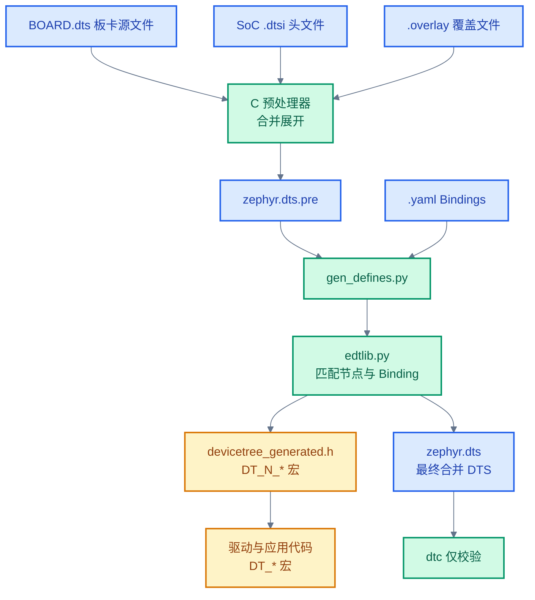

# 03. Zephyr 设备树详解

> 一句话概括：设备树（Devicetree）是 Zephyr 用来描述硬件的二进制化数据文件，本文从"一个 LED 节点"出发，逐层展开语法、Bindings、Phandles、宏 API 与实战 HOWTO。
> **工程师视角**：读完后你应当能回答"为什么 Zephyr 不在运行时解析 DTB"、"Bindings 解决了什么问题"、"DT_NODELABEL 与 DT_INST 各用于什么场景"这三个问题，并能为自定义硬件写一份完整的 DTS + Binding + 驱动实例化代码。

### 关键术语

| 缩写 | 全称 | 含义 |
|------|------|------|
| DTS | Devicetree Source | 设备树源文件，人类可读的文本格式 |
| DTSI | Devicetree Source Include | 设备树头文件，被 `.dts` 通过 `#include` 引入 |
| DTB | Devicetree Blob | 设备树二进制格式（Zephyr 仅用于校验，不运行时解析） |
| Binding | Devicetree Binding | YAML 文件，描述节点属性的规范（类型、必需、取值范围） |
| Node | Devicetree Node | 设备树中的节点，对应一个硬件设备或逻辑分组 |
| Phandle | Property Handle | 节点引用句柄，类似 C 指针，用于跨节点引用 |
| Compatible | Compatible Property | 节点的兼容标识，格式 `"vendor,device"`，用于匹配 Binding 与驱动 |
| SoC | System on Chip | 片上系统，集成 CPU 与外设的单芯片 |
| ISR | Interrupt Service Routine | 中断服务例程 |
| MMIO | Memory-Mapped I/O | 内存映射 I/O，外设寄存器映射到地址空间 |

---

### 前置阅读

| 需要了解 | 参考文档 |
|----------|----------|
| Zephyr 分层架构与设备树在系统中的位置 | [00-入门概览](./00-入门概览.md) |
| 构建流程与 West/CMake 协作 | [02-构建系统](./02-构建系统.md) |
| Kconfig 编译时裁剪机制 | [02-构建系统](./02-构建系统.md) |

---

## 1. 概述：设备树在做什么

> 本章是全文起点。一个核心问题驱动全文：**为什么不能把硬件信息直接 `#define` 在 C 头文件里？** 回答这个问题后，再用一个 LED + GPIO 的小例子建立设备树的直觉，最后给出 Zephyr 设备树的整体构建流程。

### 1.1 一个具体场景：硬件描述需要从代码中分离

考虑一个最简单的需求——点亮板卡上的用户 LED。裸机写法通常把引脚号硬编码在 C 头文件中：

```c
/* 传统裸机写法：硬件信息硬编码 */
#define LED0_GPIO_PORT  "GPIOB"
#define LED0_GPIO_PIN    13
#define LED0_GPIO_FLAGS  0
```

这种写法在三个层面失守：

1. **同 SoC 多板卡**：nRF52840 DK 与 nRF52840 Dongle 用同一颗 SoC，但 LED 引脚不同——每换一块板卡都要改头文件。
2. **同板卡多外设**：一块板卡上可能有 4 颗 LED、3 个传感器、2 路 UART，全写头文件会让硬件信息散落在几十个 `#define` 里，难以维护。
3. **驱动复用**：UART 驱动要适配几十款 SoC，每款的寄存器基地址、中断号都不同——若硬编码，驱动代码会被 `#ifdef` 撑爆。

设备树给出的方案是：**把硬件信息从代码中抽离到独立的数据文件**。LED 的引脚、UART 的基地址、I2C 控制器的中断号——全部写在 `.dts` 文件里，C 代码通过宏 API 在编译时读取。

下面是一段最小的设备树片段，描述一颗接在 GPIO 控制器上的 LED：

```dts
/ {
    leds {
        compatible = "gpio-leds";
        led0: led_0 {
            gpios = <&gpio0 13 GPIO_ACTIVE_LOW>;
        };
    };
};
```

四个要素立刻浮现：

- **节点（node）** `leds` 与 `led_0`——对应"LED 组"与"其中 0 号 LED"
- **属性（property）** `compatible` 与 `gpios`——描述"这是什么设备"与"接到哪里"
- **标签（label）** `led0`——给节点取的简短名字，供其他地方引用
- **phandle** `&gpio0`——指向 GPIO 控制器节点，类似 C 指针

> **核心要点**：设备树的本质是"硬件描述的数据文件"，把"硬件长什么样"从"驱动怎么操作"中剥离。这种分离让同一份驱动能跑在不同板卡上——驱动通过宏 API 读 DTS，板卡变更只改 DTS 不改代码。

### 1.2 Zephyr 设备树与 Linux 的关键差异

Zephyr 从 Linux 继承了设备树语法（DTS），但**处理方式截然不同**：

| 维度 | Linux | Zephyr |
|------|-------|--------|
| **运行时解析** | 内核启动时解析 DTB 二进制 | 不解析，全部编译时处理 |
| **C 接口** | 运行时 API（`of_*` 函数） | 编译时宏（`DT_*` 宏） |
| **存储开销** | DTB 进镜像，运行时占用 RAM | DTB 不进镜像，零运行时 RAM 开销 |
| **生成产物** | `dtc` 编译出的 `.dtb` | `gen_defines.py` 生成的 `devicetree_generated.h` |

> **如何读这张表**：Linux 设备庞大、内存充裕，运行时解析 DTB 换来灵活性；Zephyr 设备资源受限（最小 8KB RAM），把设备树"折叠"成 C 宏后，DTB 本身不进镜像，所有硬件信息在编译期就变成常量，零运行时开销。这是 Zephyr 针对嵌入式场景的关键优化。

> **设计洞察**：Linux 运行时解析 DTB、Zephyr 编译期展开为 C 宏，这一差异的根源是"资源约束驱动设计选择"。Linux 的场景是：服务器/桌面有 GB 级 RAM、设备可热插拔、同一镜像要跑在多款主板上——运行时解析换来的灵活性是刚需。Zephyr 的场景是：MCU 仅有 KB 级 RAM、设备固定焊接、每块板卡单独烧录镜像——灵活性无用，省 RAM 才是关键。这是"同一抽象（设备树）在不同约束下的两种实现"的典型案例。
>
> 从计算机体系结构角度，Zephyr 的"编译期折叠"让所有硬件参数变成 `const` 常量与 `static` 变量，链接器可以把它们放进 Flash（ROM）而非 RAM——这对 Cortex-M 这类哈佛架构尤其重要，因为它们的 Flash 与 SRAM 是独立地址空间，`const` 数据不占 SRAM。再加上编译器能对常量做常量传播与死代码消除（如 `if (CONFIG_FOO)` 整段被删），Zephyr 实现了"用同一份源码裁出 8KB 与 8MB 两种镜像"——这是 Linux 做不到的。

### 1.3 整体构建流程

下图（来自 Zephyr 官方文档）展示了从源文件到生成头文件的完整流程：


*来源：Zephyr 官方文档 `doc/build/dts/zephyr_dt_build_flow.svg`*

> **如何读这张图**：左侧是输入——`.dts`/`.dtsi` 源文件与 `.yaml` 绑定文件；中间是构建系统生成的 `devicetree.h`/`devicetree_generated.h` 等 C 头文件；右侧是最终使用这些头文件的 Zephyr 内核与应用源码。整个流程的核心是" DTS + Bindings → C 宏"。

---

## 2. 语法与结构

> 上一章用 LED 例子建立了"设备树在做什么"的直觉。本章把这个直觉形式化——先讲节点的层级与命名，再讲属性的类型与写法，最后讲别名（alias）与 chosen 节点这两种"间接引用"机制。掌握本章后，你应当能读懂任意一份 `BOARD.dts` 文件。

### 2.1 节点层级与命名

设备树是一棵树。根节点是 `/`，子节点用花括号嵌套表示。下面是官方文档的 I2C 总线示例（来自 `doc/build/dts/intro-syntax-structure.rst`）：

```dts
/dts-v1/;

/ {
    soc {
        i2c@40003000 {
            compatible = "nordic,nrf-twim";
            reg = <0x40003000 0x1000>;

            apds9960@39 {
                compatible = "avago,apds9960";
                reg = <0x39>;
            };
            ti_hdc@43 {
                compatible = "ti,hdc1010", "ti,hdc";
                reg = <0x43>;
            };
        };
    };
};
```

逐行拆解：

- `/dts-v1/;` —— 声明使用 DTS 语法第 1 版（取代过时的 v0）
- `/ { ... };` —— 根节点
- `soc { ... };` —— SoC 总线节点（无 unit address，因为它不代表具体地址设备）
- `i2c@40003000` —— I2C 控制器节点，`@40003000` 是 **unit address**，表示该节点在父节点地址空间中的偏移
- `apds9960@39` —— I2C 外设子节点，`@39` 是该外设在 I2C 总线上的地址

**unit address 的含义取决于硬件类型**：

| 硬件类型 | unit address 含义 | 示例 |
|---------|------------------|------|
| MMIO 外设 | 寄存器基地址 | `i2c@40003000` |
| I2C 外设 | 总线从地址 | `apds9960@39` |
| SPI 外设 | 片选线编号 | `sensor@0` |
| 内存 | 物理起始地址 | `memory@2000000` |
| Flash 分区 | 分区起始偏移 | `partition@20000` |

> **如何读这张表**：unit address 不是节点的"地址属性"，而是节点名的一部分，用来区分同一父节点下的多个同类设备。真正的地址信息写在 `reg` 属性里——unit address 是 `reg` 的"简写"，必须与 `reg` 的第一个地址值一致。

**节点标签（node label）** 是给节点取的简短名字，便于在其他地方引用。下例中 `i2c1` 是节点 `i2c@40002000` 的标签：

```dts
soc {
    i2c1: i2c@40002000 {
        compatible = "vnd,soc-i2c";
        reg = <0x40002000 0x1000>;
        status = "okay";
        clock-frequency = <100000>;
    };
};
```

引用时用 `&i2c1`，类似 C 的取地址符。一个节点可以有多个标签（如 `lbl_b: lbl_c: node-2 {}`）。

### 2.2 属性的写法与类型

属性是"名字 = 值"对。值的写法由其类型决定（见 [Bindings 语法章节](#5-bindings语法详解)）。下表汇总了所有属性类型与对应的 DTS 写法（来自 `doc/build/dts/intro-syntax-structure.rst`）：

| 属性类型 | DTS 写法 | 示例 |
|---------|---------|------|
| `string` | 双引号 | `a-string = "hello, world!";` |
| `int` | 尖括号 | `an-int = <1>;` |
| `boolean` | 无值即为 true，删除即为 false | `my-true-boolean;` |
| `array` | 尖括号，空格分隔 | `foo = <0xdeadbeef 1234 0>;` |
| `uint8-array` | 方括号，十六进制不带 `0x` | `a-byte-array = [00 01 ab];` |
| `string-array` | 逗号分隔 | `a-string-array = "one", "two";` |
| `phandle` | 尖括号，`&label` | `a-phandle = <&mynode>;` |
| `phandles` | 尖括号，空格分隔多个 phandle | `some-phandles = <&n0 &n1 &n2>;` |
| `phandle-array` | 尖括号分组，逗号分隔 | `a-phandle-array = <&n0 1 2>, <&n1 3 4>;` |

**cell 是 DTS 属性值的基本单位**——尖括号 `<...>` 内每个空格分隔的整数都是一个 cell，固定 32 位宽。这个概念是理解后续 `#interrupt-cells`、`#gpio-cells` 等机制的前提：这些属性声明"引用本节点时后面要跟几个 cell"，而每个 cell 的含义由 Binding 中的 `*-cells:` 命名。字符串和字节数组（`[...]`）不算 cell。

```dts
foo = <1 2 3>;     /* 3 个 cell，每个 32 位 */
bar = "hello";     /* 字符串，不是 cell */
baz = [de ad];     /* 字节数组，不是 cell */
```

几个易踩的坑：

- **64 位整数**：DTS 的 cell 是 32 位，64 位值要拆成两个 cell（大端序）。`0xaaaa0000bbbb1111` 写成 `<0xaaaa0000 0xbbbb1111>`。
- **算术表达式**：括号内可写算术与位运算，但**整个表达式必须用括号包起来**。`bar = <(2 * (1 << 5))>;` 合法，`bar = <2 * (1 << 5)>;` 非法。
- **布尔属性**：只能用"存在/缺失"表示真假，**不能写 `= "true"`**。设为 false 要用 `/delete-property/` 删除。

### 2.3 标准属性：compatible / reg / status / interrupts

Devicetree 规范定义了若干标准属性，下面是最关键的四个（详见 `doc/build/dts/intro-syntax-structure.rst`）：

**`compatible`** —— 设备兼容标识。格式 `"vendor,device"`，例如 `"avago,apds9960"`。可以写多个值，按从具体到通用顺序排列，例如 `"ti,hdc1010", "ti,hdc"`。构建系统用 `compatible` 匹配 Binding 文件，驱动用它匹配节点。

**`reg`** —— 设备寻址信息。值是 `(address, length)` 对的序列。对 MMIO 设备，`address` 是寄存器基地址、`length` 是寄存器空间大小；对 I2C 设备，`address` 是总线从地址、无 `length`；对 SPI 设备，`address` 是片选线编号、无 `length`。

**`status`** —— 节点启用状态。Zephyr 只识别两个值：`"okay"`（启用，默认）与 `"disabled"`（禁用）。`status` 缺失等价于 `"okay"`。**子节点不会因父节点 disabled 而自动 disabled**——必须显式声明。

**`interrupts`** —— 中断配置。值是一个或多个"中断说明符（interrupt specifier）"的数组，每个说明符由若干 cell 组成。cell 数量与含义由中断控制器节点的 `#interrupt-cells` 属性决定。

> **核心要点**：`compatible` 是连接"设备树节点—Binding 文件—驱动代码"的纽带。Binding 用它匹配节点做校验和宏生成，驱动用 `DT_DRV_COMPAT` 宏匹配节点做实例化。一个节点可以列多个 compatible，构建系统按顺序找第一个匹配的 Binding。

### 2.4 别名与 Chosen 节点

除了用标签（`&label`）和路径（`/soc/i2c@40002000`）引用节点，还有两种间接引用方式：

```dts
/ {
    aliases {
        sensor-controller = &i2c1;   /* 别名 → 标签 */
    };

    chosen {
        zephyr,console = &uart0;     /* 系统级约定 → 标签 */
    };

    soc {
        i2c1: i2c@40002000 { ... };
        uart0: serial@12340000 { ... };
    };
};
```

**`/aliases`** —— 别名节点。属性名是别名，值是 phandle。`sensor-controller = &i2c1` 表示"用 `sensor-controller` 这个名字指代 `i2c1` 节点"。C 代码用 `DT_ALIAS(sensor_controller)` 获取节点标识符。别名常用于让应用代码"与板卡无关"——例如 blinky 示例用 `led0` 别名指代 LED，板卡维护者把 `led0` 映射到具体节点，应用代码用 `DT_ALIAS(led0)` 适配所有板卡。

**`/chosen`** —— 系统级约定节点。属性名是约定名（通常带 `zephyr,` 前缀），值是 phandle。Zephyr 标准 chosen 属性举例如下：

| Chosen 属性 | 含义 | 使用位置 |
|------------|------|---------|
| `zephyr,console` | 控制台 UART | `subsys/console/` |
| `zephyr,shell-uart` | Shell 串口 | `subsys/shell/` |
| `zephyr,flash` | 主 Flash 设备 | `subsys/storage/` |
| `zephyr,sram` | 主 SRAM 区域 | 内核启动栈初始化 |
| `zephyr,entropy` | 硬件随机数源 | `subsys/random/` |

C 代码用 `DT_CHOSEN(zephyr_console)` 获取 chosen 节点标识符。大多数情况下内核启动代码已经根据 chosen 自动初始化好控制台等关键设备，应用代码无需直接操作。

---

## 3. 输入输出文件与构建流程

> 上一章讲了 DTS 的语法。本章回答一个工程问题：**一份 `BOARD.dts` 从源文件到驱动可用的 C 宏，中间经过哪些步骤、产生哪些文件？** 理解这一点是排查设备树问题的基础——90% 的设备树 bug 都可以通过查看中间产物定位。

### 3.1 输入文件

Zephyr 设备树的输入有四类（见 `doc/build/dts/intro-input-output.rst`）：

| 文件类型 | 扩展名 | 用途 | 典型位置 |
|---------|--------|------|---------|
| 源文件 | `.dts` | 板卡级设备树 | `boards/<arch>/<board>/<board>.dts` |
| 头文件 | `.dtsi` | SoC 与公共定义 | `dts/<arch>/.../<soc>.dtsi` |
| 覆盖文件 | `.overlay` | 应用或 Shield 修改板卡 DTS | 应用目录或 `boards/` |
| 绑定文件 | `.yaml` | 节点属性规范 | `dts/bindings/.../*.yaml` |

`.dts` 文件通过 `#include` 引入 `.dtsi`（注意是用 C 预处理器的 `#include`，不是 DTS 原生的 `/include/`）。`.dtsi` 描述 SoC 级硬件（CPU、外设控制器、内存映射），`.dts` 描述板级硬件（外设接法、引脚配置）。

`.overlay` 文件是**对板卡 DTS 的增量修改**。构建系统把 `BOARD.dts` 与所有 `.overlay` 拼接（overlay 在后），靠 DTS 的"同名节点合并"语法实现覆盖。这让应用无需改板卡源码就能启用外设、改引脚、加设备。

`.yaml` 绑定文件是"胶水"——它描述 `.dts`/`.dtsi`/`.overlay` 中节点属性的规范（类型、必需、取值范围），让构建系统能把 DTS 转成 C 宏。详见 [第 5 章](#5-bindings语法详解)。

### 3.2 输出文件

构建后，构建目录下会生成三个关键文件（见 `doc/build/dts/intro-input-output.rst`）：


*来源：Zephyr 官方文档 `doc/build/dts/zephyr_dt_inputs_outputs.svg`*

> **如何读这张图**：绿色为输入（`.dts`/`.dtsi`/`.overlay`/`.yaml`），黄色为输出。三个核心输出是 `zephyr.dts.pre`（C 预处理后的中间 DTS）、`zephyr.dts`（最终合并的 DTS，用于调试）、`devicetree_generated.h`（生成的 C 宏头文件，被 `<zephyr/devicetree.h>` 间接包含）。

| 输出文件 | 路径 | 用途 |
|---------|------|------|
| `zephyr.dts.pre` | `<build>/zephyr/zephyr.dts.pre` | C 预处理后的 DTS，是 `gen_defines.py` 的输入 |
| `zephyr.dts` | `<build>/zephyr/zephyr.dts` | 最终合并的设备树，**调试时看这个** |
| `devicetree_generated.h` | `<build>/zephyr/include/generated/zephyr/devicetree_generated.h` | C 宏头文件，被 `devicetree.h` 包含 |

> **警告**：不要在 C 代码里直接 `#include <zephyr/devicetree_generated.h>`——应包含 `<zephyr/devicetree.h>`，后者会自动引入生成的头文件并提供高层宏 API。

### 3.3 处理脚本

三个脚本（位于 `scripts/dts/`）协作完成 DTS → C 宏的转换：

- **`dtlib.py`** —— 底层 DTS 解析库，与 `dtc` 工具源码兼容
- **`edtlib.py`** —— 在 dtlib 之上，结合 Bindings 给出节点的高级视图
- **`gen_defines.py`** —— 用 edtlib 生成 C 宏头文件（Zephyr 专有逻辑）

此外，标准的 `dtc`（Devicetree Compiler）工具若安装会被调用，但**仅用于校验警告，输出不被使用**。板卡目录可通过 `pre_dt_board.cmake` 文件给 `dtc` 传额外参数：

```cmake
list(APPEND EXTRA_DTC_FLAGS "-Wno-simple_bus_reg")
```

### 3.4 完整构建流程的编号步骤

把上述内容串成一条流程：

1. CMake 在配置阶段找到 `BOARD.dts`（位置由 `BOARD` 变量决定）
2. C 预处理器展开 `BOARD.dts` 中的 `#include`，合并 `.dtsi` 与 `.overlay`
3. 产出 `zephyr.dts.pre`（中间 DTS 文件）
4. `gen_defines.py` 读取 `zephyr.dts.pre` 与所有 `.yaml` 绑定
5. `edtlib.py` 把每个节点匹配到 Binding，校验属性类型与必需性
6. 生成 `devicetree_generated.h`（含 `DT_N_*` 形式的宏）与 `zephyr.dts`（最终合并 DTS）
7. 若 `dtc` 已安装，对 `zephyr.dts` 跑一遍仅校验
8. 应用与驱动代码通过 `#include <zephyr/devicetree.h>` 使用 `DT_*` 宏

下图用 Mermaid 重绘步骤间的数据流，便于与官方 SVG 对照：



> **如何读这张图**：蓝色为输入文件，绿色为处理步骤，黄色为输出产物。注意 `dtc` 仅做校验，其输出不被使用——Zephyr 真正的"编译器"是 `gen_defines.py`，它把 DTS 与 Bindings 一起转成 C 宏。这也是为什么 Zephyr 不需要运行时解析 DTB——所有信息在编译期就变成了常量。

> **核心要点**：整个流程发生在 **CMake 配置阶段**（`west build` 早期），不在编译阶段也不在运行时。这意味着改 DTS 后必须重新跑 CMake——若发现 DTS 改动没生效，先试 `west build -t pristine` 清构建目录。

> **设计洞察**：`gen_defines.py` 把 DTS 与 Bindings 转成 C 宏，本质是"代码生成（Code Generation）作为元编程手段"——用 Python 描述"数据 → 代码"的转换逻辑，避免在 C 预处理器这种图灵不完备的层做复杂计算。这与 gRPC 的 protobuf 代码生成、ANTLR 的 parser 生成、ORM 的 schema→class 映射是同一种思路：在构建时用强能力工具（Python）生成弱能力工具（C）的代码。
>
> 对比 C++ 模板元编程或 Rust 的过程宏，Zephyr 选 Python 有两层考量：一是 C 预处理器无法做"匹配 compatible、校验类型、生成宏名"这种字符串密集型工作；二是 Python 脚本易于调试（可以单步、可以 print），而生成的 C 宏是纯文本，开发者可以直接打开 `devicetree_generated.h` 阅读。这种"外部代码生成 + 生成产物可审查"的设计，比"宏黑盒展开"更符合 KISS 原则——出问题时你能看到中间产物，而不是面对一团展开错误信息。

---

## 4. 设备树与 Kconfig 的分工

> 上一章讲了设备树的处理流程。但 Zephyr 还有另一个配置系统 Kconfig。一个常见困惑是：**什么时候用 DTS，什么时候用 Kconfig？** 本章用对比表与具体例子回答这个问题——这也是 Zephyr 官方 `doc/build/dts/dt-vs-kconfig.rst` 的核心内容。

### 4.1 职责划分

一句话原则：**DTS 描述硬件，Kconfig 配置软件**。

| 维度 | Devicetree | Kconfig |
|------|-----------|---------|
| **职责** | 描述硬件有什么 + 启动时配置 | 决定编译哪些代码 + 软件参数 |
| **典型内容** | 外设基地址、中断号、引脚配置 | 是否启用网络栈、缓冲区大小、调试开关 |
| **变更粒度** | 板卡级（每块板卡一份 DTS） | 应用级（每个应用一份 `prj.conf`） |
| **生效时机** | CMake 配置阶段生成宏 | CMake 配置阶段生成 `autoconf.h` |
| **C 接口** | `DT_*` 宏（编译时） | `CONFIG_*` 宏（编译时） |

举一个具体例子说明分工（来自 `dt-vs-kconfig.rst`）：

一块板卡的 SoC 有 2 路 UART。

- **DTS 负责**：描述这 2 路 UART **硬件**——两份 UART 节点，写明 `compatible`、`reg`（基地址）、`interrupts`（中断号）、`current-speed`（波特率）。
- **Kconfig 负责**：决定是否**编译** UART 驱动——`CONFIG_SERIAL=y` 启用串口子系统，`CONFIG_UART_NRFX=y` 启用 nRFx UART 驱动。
- **协作关系**：DTS 有 UART 节点但 Kconfig 未启用驱动 → 设备不可用；Kconfig 启用驱动但 DTS 无 UART 节点 → 无设备实例。**两者缺一不可**。

### 4.2 例外情况

有两类"软件配置"属性会出现在 DTS 而非 Kconfig 中（见 `dt-vs-kconfig.rst`）：

1. **Kconfig 难以表达的实例级参数**：如驱动内部缓冲区大小。这类属性应加 `zephyr,` 前缀表明它是 Zephyr 驱动配置而非硬件描述，例如 `zephyr,random-mac-address`。
2. **`chosen` 节点**：选择"哪个 UART 当控制台"——这是软件用途选择，但用 DTS 的 chosen 实现。

### 4.3 自动 Kconfig 符号

构建系统会扫描所有 Binding，为每个 `compatible = "vendor,chip"` 自动生成 Kconfig 符号（见 `dt-vs-kconfig.rst`）：

```kconfig
DT_COMPAT_VENDOR_CHIP := vendor,chip

config DT_HAS_VENDOR_CHIP_ENABLED
        def_bool $(dt_compat_enabled,$(DT_COMPAT_VENDOR_CHIP))
```

这个隐藏布尔符号 `CONFIG_DT_HAS_<COMPAT>_ENABLED` 跟踪"DTS 中是否存在至少一个 `status = "okay"` 且 compatible 匹配的节点"。驱动 Kconfig 选项可依赖它：

```kconfig
config SENSOR_VENDOR_CHIP
        bool "Vendor Chip sensor"
        default y
        depends on DT_HAS_VENDOR_CHIP_ENABLED
```

这样添加新 Binding 后，对应的 Kconfig 符号自动可用——无需手写 `DT_HAS_*` 定义。

> **核心要点**：DTS 与 Kconfig 是两个正交的配置系统，通过 `CONFIG_DT_HAS_*` 符号协作。DTS 决定"硬件有什么"，Kconfig 决定"软件编译什么"，两者交集决定"驱动是否实例化"。

> **设计洞察**：DTS 描述"硬件有什么"、Kconfig 决定"软件编什么"——这是"策略与机制分离"原则在配置系统的体现。DTS 是机制（硬件事实：UART 在 0x40003000、中断号是 12），Kconfig 是策略（要不要启用 UART 驱动、缓冲区设多大）。两者正交意味着同一份 DTS 可配合不同 Kconfig（调试版开日志、生产版关日志），同一份 Kconfig 也可跑在不同 DTS（同一应用部署到不同板卡）。这种正交性是"一份代码多场景部署"的根基。
>
> `CONFIG_DT_HAS_*` 自动符号是 DTS 与 Kconfig 的"桥接层"——它把"DTS 中存在某节点"这个事实翻译为"Kconfig 中可依赖的布尔符号"，避免驱动 Kconfig 选项被启用却找不到硬件节点。这种"用生成代码连接两个正交系统"的模式在系统软件中很常见：Linux 的 `defconfig` 与 `make dtbs`、Autoconf 的 `configure` 脚本与 `config.h`、CMake 的 `find_package` 与 `target_link_libraries` 都是同一思路——让两个独立系统通过一份自动生成的中间产物协作，而不是手工同步。

---

## 5. Bindings 语法详解

> 上一章讲了 DTS 与 Kconfig 的分工。本章深入 DTS 的"另一半"——Bindings。一个常见疑问是：**DTS 是非结构化的文本，构建系统怎么知道 `gpios` 属性该有几个 cell、`current-speed` 应该是整数？** 答案就是 Bindings——YAML 文件，描述节点属性的规范。本章对齐 `doc/build/dts/bindings-*.rst` 三篇官方文档。

### 5.1 Bindings 的本质与匹配规则

Binding 是 YAML 文件，描述"匹配某 `compatible` 的节点应该长什么样"。构建系统用 Binding 做两件事：

1. **校验** DTS 节点：检查必需属性是否存在、类型是否正确、取值是否在 `enum` 范围内
2. **生成宏**：把 DTS 属性值转成 C 宏（如 `DT_PROP(node, foo)` 展开为 `3`）

最小的 Binding 长这样（来自 `bindings-intro.rst`）：

```yaml
# 匹配 compatible = "foo-company,bar-device" 的节点
compatible: "foo-company,bar-device"

properties:
  num-foos:
    type: int
    required: true
```

对应的 DTS 节点：

```dts
bar-device {
    compatible = "foo-company,bar-device";
    num-foos = <3>;
};
```

构建系统因 `compatible` 匹配而把这份 Binding 应用于 `bar-device` 节点，校验 `num-foos` 存在且为 int，然后生成展开为 `3` 的 `DT_PROP` 宏。

**匹配规则**有四条（见 `bindings-intro.rst` 与 `bindings-syntax.rst`）：

1. **按 compatible 字符串匹配**：Binding 的 `compatible:` 行与节点的 `compatible` 属性相等则匹配
2. **多 compatible 按顺序找**：节点有多个 compatible 时，按顺序找第一个匹配的 Binding
3. **child-binding**：节点无 `compatible` 时，可继承父节点的 Binding（见 [§5.5](#55-child-binding-与总线)）
4. **on-bus 限定**：节点出现在总线上时，`on-bus` 限定的 Binding 优先于无 `on-bus` 的（见 [§5.5](#55-child-binding-与总线)）

### 5.2 顶层键一览

Bindings 文件的顶层键（见 `bindings-syntax.rst`）：

```yaml
title: 简短标题（可选）
description: |
  设备的高层描述，可多行
include: other.yaml            # 继承其他 Binding
compatible: "manufacturer,foo-device"  # 匹配节点的 compatible
properties:                    # 属性规范
  # ...
child-binding:                 # 子节点规范
  # ...
bus: spi                       # 本节点是 spi 总线控制器
on-bus: spi                    # 本节点出现在 spi 总线上
examples:                      # 用法示例
  - |
    leds { ... };
foo-cells:                     # phandle-array 中 specifier cell 的命名
  - channel
  - period
```

### 5.3 属性定义：type / required / default / enum / const

`properties:` 下每个属性条目的语法（见 `bindings-syntax.rst`）：

```yaml
<property name>:
  required: <true | false>      # 是否必需，默认 false
  type: <string | int | boolean | array | uint8-array | string-array |
         phandle | phandles | phandle-array | path | compound>
  deprecated: <true | false>    # 是否弃用，默认 false
  default: <default value>      # 缺失时的默认值
  description: <说明文字>
  enum:                         # 允许的取值列表
    - <item1>
    - <item2>
  const: <固定值>               # 属性必须等于该值
  specifier-space: <space-name> # phandle-array 的 specifier 空间（手动指定）
```

完整示例：

```yaml
properties:
  # 必需的 int 属性
  current-speed:
    type: int
    required: true
    description: 初始波特率

  # 带默认值的 int 属性
  int-with-default:
    type: int
    default: 123

  # 带枚举的 string 属性
  maximum-speed:
    type: string
    enum:
      - "low-speed"
      - "full-speed"
      - "high-speed"

  # 必须等于固定值的属性
  "#address-cells":
    type: int
    required: true
    const: 1
```

**关键规则**：

- `required: true` 与 `default` 不能同时出现——必需属性不可能有默认值
- 包含的 Binding 中 `required: false` 可被子 Binding 加强为 `required: true`，但反之不行（不能弱化要求）
- `compound` 类型是"复杂类型"兜底，生成器不会为它产出宏

### 5.4 属性类型与 DTS 写法对照

| type | 描述 | DTS 写法示例 |
|------|------|-------------|
| `string` | 单个字符串 | `status = "disabled";` |
| `int` | 单个 32 位整数 | `current-speed = <115200>;` |
| `boolean` | 布尔标志（存在即 true） | `hw-flow-control;` |
| `array` | 32 位整数数组 | `offsets = <0x100 0x200 0x300>;` |
| `uint8-array` | 字节数组 | `local-mac-address = [de ad be ef 12 34];` |
| `string-array` | 字符串数组 | `dma-names = "tx", "rx";` |
| `phandle` | 单个节点引用 | `interrupt-parent = <&gic>;` |
| `phandles` | 节点引用数组 | `pinctrl-0 = <&tx &rx>;` |
| `phandle-array` | 带 specifier 的节点引用数组 | `dmas = <&dma0 2>, <&dma0 3>;` |
| `path` | 节点路径 | `foo = &uart0;` 或 `foo = "/path/to/node";` |
| `compound` | 复杂类型兜底 | `foo = <&label>, [01 02];` |

> **如何读这张表**：`phandle` 类似 C 的"单指针"，`phandles` 类似"指针数组"，`phandle-array` 类似"带附加数据的指针数组"。`phandle-array` 是最复杂也最常用的——`gpios`、`pwms`、`dmas` 都是这种类型，详见 [第 6 章](#6-phandles-机制)。

### 5.5 child-binding 与总线

**`child-binding`** 用于"所有子节点共享同一套规范"的场景。典型例子是 `pwm-leds`：

```dts
pwmleds {
    compatible = "pwm-leds";
    red_pwm_led { pwms = <&pwm3 4 15625000>; };
    green_pwm_led { pwms = <&pwm3 0 15625000>; };
};
```

子节点 `red_pwm_led`、`green_pwm_led` 都没有 `compatible`，但都需要 `pwms` 属性。Binding 这样写：

```yaml
compatible: "pwm-leds"

child-binding:
  description: LED that uses PWM
  properties:
    pwms:
      type: phandle-array
      required: true
```

`child-binding` 可递归嵌套（孙节点也继承）。

**`bus:` 与 `on-bus:`** 用于总线场景。SPI/I2C 控制器节点用 `bus: spi` 声明"我是 SPI 总线控制器"，外设节点用 `on-bus: spi` 声明"我接在 SPI 总线上"。

考虑一个传感器既可接 SPI 也可接 I2C（见 `bindings-syntax.rst`）：

```dts
spi-bus@0 {
    /* 父节点 Binding 含 bus: spi */
    sensor@0 {
        compatible = "manufacturer,sensor";
        reg = <0>;
    };
};

i2c-bus@0 {
    /* 父节点 Binding 含 bus: i2c */
    sensor@79 {
        compatible = "manufacturer,sensor";
        reg = <79>;
    };
};
```

可以写两份 Binding：

```yaml
# manufacturer,sensor-spi.yaml
compatible: "manufacturer,sensor"
on-bus: spi

# manufacturer,sensor-i2c.yaml
compatible: "manufacturer,sensor"
on-bus: i2c
properties:
  uses-clock-stretching:
    type: boolean
```

构建系统对 `sensor@0`（在 SPI 总线上）只匹配第一份，对 `sensor@79`（在 I2C 总线上）只匹配第二份——**同一 compatible 在不同总线上可有不同 Binding**。

### 5.6 include：继承与过滤

Binding 可用 `include:` 继承其他 Binding 的属性定义（见 `bindings-syntax.rst`）。最常见的是包含 `base.yaml`（含 `reg`、`status`、`interrupts` 等标准属性的定义）：

```yaml
include: base.yaml

properties:
  reg:
    required: true    # 在 base.yaml 基础上加强为必需
```

支持多文件继承与属性过滤：

```yaml
include:
  - name: foo.yaml
    property-allowlist:
      - i-want-this-one
  - name: bar.yaml
    property-blocklist:
      - do-not-include-this-one
```

**关键规则**：多文件继承时，同名属性的 `required` 取 OR（任一为 true 则为 true），保证必需性不被弱化。

### 5.7 *-cells：命名 specifier cell

`phandle-array` 属性中 phandle 后跟的 cell 称为 specifier。Binding 用 `*-cells:` 给这些 cell 命名（见 `bindings-syntax.rst`）。PWM 控制器示例：

```dts
pwm1: pwm@deadbeef {
    compatible = "foo,pwm";
    #pwm-cells = <2>;
};

my-node {
    pwms = <&pwm1 1 2000>;
};
```

对应 Binding：

```yaml
# foo,pwm.yaml
compatible: "foo,pwm"
pwm-cells:
  - channel
  - period
```

命名后，C 代码可用 `DT_PWMS_CHANNEL_BY_IDX`、`DT_PWMS_PERIOD_BY_IDX` 按名字取值，比按索引更可读。

> **核心要点**：Binding 是 DTS 与 C 宏之间的"契约"——它告诉构建系统"这个 compatible 的节点应该有哪些属性、各属性是什么类型"。没有 Binding 的节点（除 `/zephyr,user` 等特例）属性不会被生成宏。写自定义设备的第一步就是写 Binding。

---

## 6. Phandles 机制

> 上一章讲了 Bindings。本章深入 DTS 中最易混淆的概念——phandle。一个常见困惑是：**`gpios = <&gpio0 13 0>;` 里 `&gpio0` 后面跟的 13 和 0 到底是什么？为什么不同属性的"后缀"数量不一样？** 答案是 specifier space 与 `*-cells`，本章对齐 `doc/build/dts/phandles.rst`。

### 6.1 phandle 的本质

phandle（property handle）类似 C 指针——它"指向"另一个节点。获取 phandle 的方式是从节点的标签取地址：`&label`。

```dts
/ {
    lbl_a: node-1 {};
    lbl_b: lbl_c: node-2 {};    /* 一个节点可多个标签 */
};
```

- `&lbl_a` 指向 `/node-1`
- `&lbl_b` 或 `&lbl_c` 都指向 `/node-2`

phandle 在 DTS 里用于三种属性类型（见 `phandles.rst`）：

1. **`phandle`**：单个节点引用。例如 `interrupt-parent = <&gic>;` 把中断控制器节点告诉当前节点。
2. **`phandles`**：节点引用数组。例如 `pinctrl-0 = <&tx_pin &rx_pin &clk_pin>;` 引用多个 pin 配置节点。
3. **`phandle-array`**：带"附加数据"的节点引用数组。例如 `gpios = <&gpio0 13 0>, <&gpio1 5 0>;`——每个引用后跟若干 cell 描述"这个资源具体怎么用"。

### 6.2 phandle-array 与 specifier space

`phandle-array` 是最常用也最复杂的类型。以 GPIO 为例（见 `phandles.rst`）：

```dts
my-external-ic {
    irq-gpios = <&gpioX 5 (GPIO_ACTIVE_LOW | GPIO_PULL_UP)>;
};
```

`&gpioX` 是 GPIO 控制器节点的 phandle，`5` 是引脚号，`(GPIO_ACTIVE_LOW | GPIO_PULL_UP)` 是 flags。这三个值组成一个"specifier"——描述"用 gpioX 的哪个引脚、什么配置"。

**问题**：构建系统怎么知道 `&gpioX` 后面跟 2 个 cell（pin + flags），而 `&pwm1` 后面跟 2 个 cell（channel + period）？

**答案**：specifier space。每个 `phandle-array` 属性有一个关联的"specifier 空间名"，由被引用节点的 `#<space>-cells` 属性决定 cell 数量。

| 属性名 | specifier space | 决定 cell 数的属性 | cell 含义 |
|--------|----------------|------------------|---------|
| `gpios` / `*-gpios` | `gpio` | `#gpio-cells` | pin, flags |
| `pwms` | `pwm` | `#pwm-cells` | channel, period |
| `dmas` | `dma` | `#dma-cells` | channel, ... |
| `io-channels` / `*-io-channels` | `io-channel` | `#io-channel-cells` | input |

GPIO 控制器节点声明 `#gpio-cells = <2>;`，所以 `gpios` 属性中每个 phandle 后跟 2 个 cell：

```dts
gpioX: gpio-controller@deadbeef {
    gpio-controller;
    #gpio-cells = <2>;
};
```

**命名规则**（见 `phandles.rst`）：

- 属性名 `foos` 隐含 specifier space 为 `foo`
- 特例：`*-gpios` 的 space 是 `gpio`（不是 `foo-gpio`），`*-io-channels` 的 space 是 `io-channel`
- 可在 Binding 中用 `specifier-space:` 手动指定，例如 `mboxes` 的 space 是 `mbox` 而非 `mboxe`

### 6.3 完整示例：GPIO phandle-array

下面是一个完整的 GPIO phandle-array 例子，串起所有概念：

```dts
/* GPIO 控制器节点：声明 #gpio-cells = <2> */
gpio0: gpio@50000000 {
    compatible = "nordic,nrf-gpio";
    gpio-controller;
    #gpio-cells = <2>;
    reg = <0x50000000 0x300>;
};

/* LED 节点：通过 phandle-array 引用 gpio0 */
leds {
    compatible = "gpio-leds";
    led0: led_0 {
        gpios = <&gpio0 13 GPIO_ACTIVE_LOW>;
    };
    led1: led_1 {
        gpios = <&gpio0 14 GPIO_ACTIVE_HIGH>;
    };
};
```

对应 Binding（`gpio-leds.yaml` 简化版）：

```yaml
compatible: "gpio-leds"

child-binding:
  description: LED connected to GPIO
  properties:
    gpios:
      type: phandle-array
      required: true
```

C 代码读取：

```c
#include <zephyr/devicetree.h>
#include <zephyr/drivers/gpio.h>

#define LED0_NODE DT_ALIAS(led0)

/* GPIO_DT_SPEC_GET 展开为 { .port = DEVICE_DT_GET(DT_GPIO_CTLR(LED0_NODE, gpios)),
 *                            .pin = DT_GPIO_PIN(LED0_NODE, gpios),
 *                            .dt_flags = DT_GPIO_FLAGS(LED0_NODE, gpios) } */
static const struct gpio_dt_spec led = GPIO_DT_SPEC_GET(LED0_NODE, gpios);
```

`DT_GPIO_PIN`、`DT_GPIO_FLAGS` 是 `DT_PHA_BY_IDX` 的硬件专用快捷宏——它们读 `gpios` 属性中 phandle 后的 cell，按 Binding 中 `gpio-cells: [pin, flags]` 的命名取值。

> **核心要点**：phandle-array 把"节点引用 + 附加数据"打包成一个值。被引用节点用 `#<space>-cells` 声明 cell 数量，Binding 用 `<space>-cells:` 给 cell 命名，C 代码用 `DT_PHA_BY_IDX` 或硬件专用宏（如 `DT_GPIO_PIN`）按索引或名字取值。这套机制让 `gpios`、`pwms`、`dmas` 等属性能统一描述"用某个控制器的某个资源"。

---

## 7. /zephyr,user 节点

> 上一章讲了 phandle 机制。本章介绍一个特殊节点——`/zephyr,user`。一个常见需求是：**我想在应用里用 DTS 配几个简单参数（GPIO、数值、字符串），但不想为它们写 Binding。** `/zephyr,user` 节点就是为此设计。本章对齐 `doc/build/dts/zephyr-user-node.rst`。

### 7.1 用途与限制

Zephyr 的设备树脚本把 `/zephyr,user` 节点作为特例处理——你可以往里面放**任意简单属性**，无需写 Binding 就能在 C 代码里读取。它适用于：

- 应用级可配置参数（如采样周期、阈值）
- 应用级 GPIO 配置（可被 overlay 重新配置）
- 示例代码与小工具

> **注意**：此节点**仅供示例与用户应用使用**，不应出现在 Zephyr 上游的驱动或子系统代码中。

### 7.2 简单值与 GPIO 例子

DTS overlay：

```dts
/ {
    zephyr,user {
        boolean;
        bytes = [81 82 83];
        number = <23>;
        numbers = <1>, <2>, <3>;
        string = "text";
        strings = "a", "b", "c";
    };
};
```

C 代码读取：

```c
#include <zephyr/devicetree.h>

#define ZEPHYR_USER_NODE DT_PATH(zephyr_user)

DT_PROP(ZEPHYR_USER_NODE, boolean) /* 1 */
DT_PROP(ZEPHYR_USER_NODE, bytes)   /* {0x81, 0x82, 0x83} */
DT_PROP(ZEPHYR_USER_NODE, number)  /* 23 */
DT_PROP(ZEPHYR_USER_NODE, numbers) /* {1, 2, 3} */
DT_PROP(ZEPHYR_USER_NODE, string)  /* "text" */
DT_PROP(ZEPHYR_USER_NODE, strings) /* {"a", "b", "c"} */
```

GPIO 配置示例——把"信号引脚"放进 `/zephyr,user`，便于用 overlay 重配：

```dts
#include <zephyr/dt-bindings/gpio/gpio.h>

/ {
    zephyr,user {
        signal-gpios = <&gpio0 1 GPIO_ACTIVE_HIGH>;
    };
};
```

C 代码用 `GPIO_DT_SPEC_GET` 转成 `gpio_dt_spec` 结构体后即可用 GPIO API：

```c
#include <zephyr/drivers/gpio.h>

#define ZEPHYR_USER_NODE DT_PATH(zephyr_user)

const struct gpio_dt_spec signal =
        GPIO_DT_SPEC_GET(ZEPHYR_USER_NODE, signal_gpios);

gpio_pin_configure_dt(&signal, GPIO_OUTPUT_INACTIVE);
gpio_pin_set_dt(&signal, 1);
```

`/zephyr,user` 节点也支持 phandle 属性——可在 overlay 里指向其他设备节点，C 代码用 `DEVICE_DT_GET(DT_PROP(ZEPHYR_USER_NODE, handle))` 拿到对应的 `struct device *`。详见 `zephyr-user-node.rst`。

> **核心要点**：`/zephyr,user` 是"免 Binding 容器"——适合放少量应用级可配置参数。复杂设备仍应写正式 Binding + 节点，不要把 `/zephyr,user` 当成万能口袋。

---

## 8. 从 C 代码访问设备树

> 前几章讲了 DTS 语法、Bindings、Phandles。本章回答最关键的工程问题：**驱动和应用代码怎么读 DTS 里的值？** 答案是 `<zephyr/devicetree.h>` 提供的 `DT_*` 宏 API。本章对齐 `doc/build/dts/api-usage.rst`，重点讲节点标识符、属性读取与驱动实例化。

### 8.1 节点标识符

要读节点信息，先要拿到"节点标识符"——一个引用该节点的 C 宏。**节点标识符不是值**，不能存到变量里，只能用宏展开。获取方式有六种（见 `api-usage.rst`）：

| 方式 | 宏 | 适用场景 |
|------|----|---------|
| 按路径 | `DT_PATH(soc, i2c_40002000)` | 已知完整路径 |
| 按标签 | `DT_NODELABEL(i2c1)` | 最常用，SoC `.dtsi` 提供的标签 |
| 按别名 | `DT_ALIAS(led0)` | 应用代码引用"通用语义"设备 |
| 按实例号 | `DT_INST(0, vnd_soc_i2c)` | 驱动批量实例化 |
| 按 chosen | `DT_CHOSEN(zephyr_console)` | 获取系统约定设备 |
| 按父/子 | `DT_PARENT(node)` / `DT_CHILD(node, name)` | 从已知节点跳转 |

> **重要**：DTS 名字中的 `-` 和 `@` 在 C 里要转成 `_`，且全部小写。`/soc/i2c@40002000` 在 C 里写成 `DT_PATH(soc, i2c_40002000)`，`clock-frequency` 写成 `clock_frequency`。

下面用一个贯穿本章的示例 DTS（来自 `doc/build/dts/main-example.dts`）：

```dts
/dts-v1/;

/ {
    aliases {
        sensor-controller = &i2c1;
    };

    soc {
        i2c1: i2c@40002000 {
            compatible = "vnd,soc-i2c";
            label = "I2C_1";
            reg = <0x40002000 0x1000>;
            status = "okay";
            clock-frequency = <100000>;
        };
    };
};
```

获取 `i2c@40002000` 节点标识符的四种等价写法：

```c
DT_PATH(soc, i2c_40002000)          /* 按路径 */
DT_NODELABEL(i2c1)                  /* 按标签 */
DT_ALIAS(sensor_controller)         /* 按别名 */
DT_INST(x, vnd_soc_i2c)             /* 按实例号，x 为某整数 */
```

### 8.2 属性读取

**简单属性**用 `DT_PROP`：

```c
DT_PROP(DT_NODELABEL(i2c1), clock_frequency)  /* 展开为 100000 */
DT_PROP(DT_NODELABEL(i2c1), status)           /* 展开为字符串字面量 "okay" */
```

**布尔属性**也用 `DT_PROP`（展开为 0 或 1），不要用 `DT_NODE_HAS_PROP`：

```c
DT_PROP(MY_NODE, hw_flow_control)  /* 1 或 0 */
```

**数组属性**用 `DT_PROP` 展开为数组初始化列表，`DT_PROP_LEN` 取长度：

```c
int a[] = DT_PROP(FOO, a);        /* {1000, 2000, 3000} */
size_t len = DT_PROP_LEN(FOO, a); /* 3 */
```

**`reg` 属性**不能用 `DT_PROP`，要用专用宏：

```c
DT_REG_ADDR(node_id)              /* 寄存器基地址 */
DT_REG_SIZE(node_id)              /* 寄存器空间大小 */
DT_REG_ADDR_BY_IDX(node_id, idx)  /* 第 idx 个寄存器块地址 */
DT_NUM_REGS(node_id)              /* 寄存器块数量 */
```

> **注意**：`DT_REG_ADDR_BY_IDX(node_id, idx)` 的 `idx` 必须是整数字面量或可展开为字面量的宏，**不能是变量**——这是宏展开的本质限制。

**`interrupts` 属性**用 `DT_IRQ_BY_IDX` 与 `DT_IRQN`：

```c
DT_IRQ_BY_IDX(node_id, idx, val)  /* 第 idx 个中断说明符中名为 val 的 cell */
DT_IRQN(node_id)                  /* 处理后的中断号（推荐用这个） */
DT_NUM_IRQS(node_id)              /* 中断数量 */
```

**phandle 属性**用 `DT_PHANDLE`、`DT_PHANDLE_BY_IDX`、`DT_PHANDLE_BY_NAME` 转换为节点标识符，再用上述宏读属性。硬件专用快捷宏更可读：

```c
DT_GPIO_CTLR(node, gpios)         /* GPIO 控制器节点标识符 */
DT_GPIO_PIN(node, gpios)          /* 引脚号 */
DT_GPIO_FLAGS(node, gpios)        /* flags */
DT_PWMS_CHANNEL(node, pwms)       /* PWM 通道号 */
```

### 8.3 驱动实例化：DT_DRV_COMPAT 与 DT_INST

驱动要为每个 `status = "okay"` 且 compatible 匹配的节点创建 `struct device`。`struct device` 是 Zephyr 运行时代表设备实例的核心结构体，持有设备名、配置指针（ROM 只读参数，如基地址/波特率）、数据指针（RAM 可变状态）、API 指针与初始化函数；应用通过 `const struct device *` 调用子系统 API，驱动负责填充并注册它。本文聚焦"DTS 如何驱动 struct device 的实例化"，其完整生命周期见 [13-设备驱动模型](./13-设备驱动模型.md)。

问题是：C 预处理器读不懂 `compatible` 和 `status`，怎么把 DTS 节点信息变成 C 代码？
Zephyr 用一条两阶段链解决：

```
DTS 节点 (compatible, status, reg 等)
  ↓ Python: gen_defines.py（cmake 时运行）
devicetree_generated.h（纯 C 宏：实例号映射、属性常量、遍历列表）
  ↓ C 预处理器
静态变量（struct device + data + config，编译期已全部分配）
```

第一阶段 **Python 读 DTS**，为每个 compatible 收集启用的节点、分配实例号、输出宏定义；
第二阶段 **C 预处理器**用这些宏展开成 N 份静态变量，**零运行时开销**。

#### DT_DRV_COMPAT：隐式参数

驱动 C 文件顶部定义 `DT_DRV_COMPAT`，声明"我负责哪个 compatible"：

```c
/* compatible = "vnd,my-device" → DT_DRV_COMPAT = vnd_my_device */
#define DT_DRV_COMPAT vnd_my_device
```

所有 `DT_INST_*` 宏都依赖它来确定自己在操作哪组节点——它是这些宏的**隐式参数**。
不定义则编译报错。

#### DT_INST：用实例号代替节点路径

```c
DT_DRV_INST(0)                    /* 等价于 DT_INST(0, vnd_my_device) */
DT_INST_PROP(0, clock_frequency)  /* 等价于 DT_PROP(DT_INST(0, vnd_my_device), clock_frequency) */
```

#### 完整追踪：从 DTS 到静态变量

输入 DTS：

```dts
uart0: serial@40002000 { compatible = "vnd,uart"; reg = <0x40002000 0x1000>;
                          current-speed = <115200>; status = "okay"; };
uart1: serial@40003000 { compatible = "vnd,uart"; reg = <0x40003000 0x1000>;
                          current-speed = <9600>;   status = "okay"; };
uart2: serial@40004000 { compatible = "vnd,uart"; reg = <0x40004000 0x1000>;
                          current-speed = <19200>;  status = "disabled"; };
```

**第 1 步**：`gen_defines.py` 为每个节点分配实例号，生成 `devicetree_generated.h`：

```c
/* 节点 → 实例号映射 */
#define DT_N_INST_0_vnd_uart  DT_N_S_serial_40002000  /* uart0 */
#define DT_N_INST_1_vnd_uart  DT_N_S_serial_40003000  /* uart1 */
#define DT_N_INST_2_vnd_uart  DT_N_S_serial_40004000  /* uart2 (disabled) */

/* 属性值 */
#define DT_N_S_serial_40002000_P_current_speed  115200
#define DT_N_S_serial_40003000_P_current_speed  9600

/* 启用实例遍历列表 (跳过 disabled 的 uart2) */
#define DT_FOREACH_OKAY_INST_vnd_uart(fn)  fn(0) fn(1)
```

**第 2 步**：驱动中 `DT_INST_FOREACH_STATUS_OKAY(CREATE_MY_UART)` 被预处理器逐层展开：

```
DT_INST_FOREACH_STATUS_OKAY(CREATE_MY_UART)
  → COND_CODE_1(1, (DT_FOREACH_OKAY_INST_vnd_uart(CREATE_MY_UART)), ())
  → DT_FOREACH_OKAY_INST_vnd_uart(CREATE_MY_UART)
  → CREATE_MY_UART(0) CREATE_MY_UART(1)
```

其中 `CREATE_MY_UART(0)` 内部的 `DT_INST_PROP(0, current_speed)` 展开链：

```
DT_INST_PROP(0, current_speed)
  → DT_PROP(DT_DRV_INST(0), current_speed)
  → DT_PROP(DT_INST(0, vnd_uart), current_speed)
  → DT_PROP(DT_N_INST_0_vnd_uart, current_speed)
  → DT_PROP(DT_N_S_serial_40002000, current_speed)
  → 115200
```

**第 3 步**：`DEVICE_DT_INST_DEFINE(0, ...)` 最终展开为全局静态变量：

```c
const struct device __device_dts_ord_42
    __attribute__((__section__(".z_device_POST_KERNEL_50"))) = {
        .name = "serial@40002000",
        .config = &uart_cfg_0,   /* { .speed = 115200 } */
        .data = &uart_data_0,
        ...
    };
```

同理 `CREATE_MY_UART(1)` 生成 `__device_dts_ord_43`（speed=9600）。
两个实例共享同一份驱动函数，数据各自独立。链接脚本按初始化级别排序这些变量，
启动时顺次调用 init。

#### 驱动模板

```c
#include <zephyr/devicetree.h>
#include <zephyr/device.h>

#define DT_DRV_COMPAT vnd_my_device

struct my_dev_data {
    /* 每设备 RAM 数据 */
};

struct my_dev_cfg {
    uint32_t freq;  /* 每设备 ROM 配置 */
};

static int my_dev_init(const struct device *dev) { /* ... */ return 0; }
static const struct my_api my_api_funcs = { /* ... */ };

/* 实例化宏：为实例号 inst 创建一个 struct device */
#define CREATE_MY_DEVICE(inst)                              \
    static struct my_dev_data my_data_##inst = {            \
        .freq = DT_INST_PROP(inst, clock_frequency),        \
    };                                                      \
    static const struct my_dev_cfg my_cfg_##inst = {        \
        .freq = DT_INST_PROP(inst, clock_frequency),        \
    };                                                      \
    DEVICE_DT_INST_DEFINE(inst,                             \
                          my_dev_init,                      \
                          NULL,                             \
                          &my_data_##inst,                  \
                          &my_cfg_##inst,                   \
                          POST_KERNEL,                      \
                          CONFIG_MY_DEV_INIT_PRIORITY,      \
                          &my_api_funcs);

/* 为每个 status = "okay" 的实例调用上面的宏 */
DT_INST_FOREACH_STATUS_OKAY(CREATE_MY_DEVICE)
```

`DT_INST_FOREACH_STATUS_OKAY` 不是运行时循环——编译期它就展开成 N 份独立的静态变量定义。

> **设计洞察**：`DT_INST_FOREACH_STATUS_OKAY(CREATE_MY_DEVICE)` 在编译期展开为 N 份静态变量，这是"零开销抽象（Zero-overhead Abstraction）"在 RTOS 中的体现——你用一份模板描述"如何创建设备实例"，预处理器为每个 DTS 节点生成一份独立代码，运行时既不需要遍历设备表初始化，也不需要动态分配。这与 C++ 模板、Rust 的泛型单态化、Linux 内核的 `module_init` 宏展开是同一种思路：把"循环"前置到编译期，运行时只剩下顺序执行。
>
> 更值得注意的设计是 `.z_device_POST_KERNEL_50` 这种链接段——`struct device` 按"初始化级别 + 优先级"被链接器分到不同段，启动代码按段顺序遍历调用 init。这是"用链接器做调度"的工程智慧：不维护运行时优先级队列，而是把排序信息编码进段名，链接器自动按段顺序排布。Linux 内核的 `__initcall` 段、U-Boot 的 `init_sequence` 都用了类似机制。这种设计在 MCU 上特别划算——段信息只占 Flash 几个字节，而运行时优先级队列要占 SRAM 还要付出排序开销。

### 8.4 由节点获取 struct device

应用代码拿到节点标识符后，用 `DEVICE_DT_GET` 获取对应的 `struct device *`（见 `howtos.rst`）：

```c
#define MY_SERIAL DT_NODELABEL(serial0)

const struct device *const uart_dev = DEVICE_DT_GET(MY_SERIAL);

if (!device_is_ready(uart_dev)) {
    return -ENODEV;  /* 设备未就绪，不可用 */
}
```

`DEVICE_DT_GET` 在**编译期**获取设备指针，无运行时开销。但设备可能未初始化或初始化失败，使用前必须用 `device_is_ready()` 检查。

变体宏：

- `DEVICE_DT_GET_OR_NULL`：节点不存在时返回 NULL
- `DEVICE_DT_GET_ONE`：获取匹配 compatible 的任一设备
- `DEVICE_DT_GET_ANY`：获取匹配 compatible 的任一设备（与 `GET_ONE` 类似）

若设备名在运行时才知道（如 shell 命令传入），用 `device_get_binding(name)`——它会扫描设备表按名字查找，有运行时开销。

### 8.5 宏展开小例子

理解 `DT_*` 宏的展开规则对调试很有帮助。以 `DT_NODELABEL(uart0)` 为例（参见 `devicetree_generated.h` 的实际生成内容）：

```
第1步：DT_NODELABEL(uart0)
  → 展开为 DT_N_NODELABEL_uart0
  → 进一步展开为 DT_N_S_soc_S_serial_40001000
     （DT_N_ 是根，S_ 表示路径分隔，soc/serial@40001000 → S_soc_S_serial_40001000）

第2步：DT_PROP(DT_NODELABEL(uart0), clock_frequency)
  → 展开为 DT_N_S_soc_S_serial_40001000_P_clock_frequency
     （P_ 表示属性）

第3步：在 devicetree_generated.h 中可找到：
  #define DT_N_S_soc_S_serial_40001000_P_clock_frequency 100000
  #define DT_N_S_soc_S_serial_40001000_REG_IDX_0_VAL_ADDRESS 0x40001000
  #define DT_N_S_soc_S_serial_40001000_REG_IDX_0_VAL_SIZE 0x1000

第4步：DT_REG_ADDR(DT_NODELABEL(uart0))
  → 展开为 DT_REG_ADDR_BY_IDX(DT_N_S_soc_S_serial_40001000, 0)
  → 进一步展开为 DT_N_S_soc_S_serial_40001000_REG_IDX_0_VAL_ADDRESS
  → 最终展开为 0x40001000
```

> **核心要点**：所有 `DT_*` 宏最终都展开为 `devicetree_generated.h` 中的 `DT_N_*` 形式的宏，再展开为常量。这是"编译时设备树"的实现机制——零运行时开销，但 `idx` 等参数必须是字面量。宏展开语法详见 `doc/build/dts/macros.bnf`。

---

## 9. HOWTO 实战

> 前八章讲了概念。本章给"照着做"的实战清单——获取构建产物、设置 overlay、写驱动、调试。本章对齐 `doc/build/dts/howtos.rst` 与 `troubleshooting.rst`。

### 9.1 获取 zephyr.dts 与 devicetree_generated.h

排查设备树问题的第一步是看"最终合并的 DTS 长什么样"。用 `--cmake-only` 跳过编译，只跑 CMake 配置阶段：

```bash
west build -b qemu_cortex_m3 samples/hello_world --cmake-only
```

CMake 会打印输入输出文件位置：

```
-- Found BOARD.dts: .../zephyr/boards/arm/qemu_cortex_m3/qemu_cortex_m3.dts
-- Generated zephyr.dts: .../build/zephyr/zephyr.dts
-- Generated devicetree_generated.h: .../build/zephyr/include/generated/zephyr/devicetree_generated.h
```

打开 `build/zephyr/zephyr.dts` 看最终合并的设备树——所有 `.dtsi` 与 `.overlay` 都已合并进来。`devicetree_generated.h` 开头有节点列表注释，便于按序号查找：

```c
/*
 * Node dependency ordering (ordinal and path):
 *   0   /
 *   1   /aliases
 *   2   /chosen
 *   3   /flash@0
 *   4   /memory@20000000
 *   ...
 *   15  /soc/i2c@deadbeef
 */
```

### 9.2 设置与使用 Overlay

Overlay 文件是"对板卡 DTS 的增量修改"。构建系统按以下顺序自动查找 overlay（见 `howtos.rst`）：

1. `socs/<SOC>_<BOARD_QUALIFIERS>.overlay`
2. `boards/<BOARD>.overlay`
3. `boards/<BOARD>_<revision>.overlay`（多 revision 板卡）

若以上任一步找到文件，停止查找；否则继续：

4. `<BOARD>.overlay`
5. `app.overlay`

也可用 CMake 变量 `DTC_OVERLAY_FILE` 显式指定，或用 `EXTRA_DTC_OVERLAY_FILE` 追加（后者优先级更高）。

Overlay 的常用写法：

```dts
/* 修改属性值 */
&serial0 {
    current-speed = <9600>;
};

/* 按路径修改（无标签时用） */
&{/soc/serial@40002000} {
    current-speed = <9600>;
};

/* 删除属性（也是设布尔属性为 false 的方法） */
&serial0 {
    /delete-property/ some-unwanted-property;
};

/* 在 I2C 总线上加新设备 */
&i2c2 {
    my_i2c_device: touchscreen@76 {
        compatible = "mycompany,touchscreen";
        reg = <76>;
    };
};
```

### 9.3 由节点获取 struct device 的完整流程

把 [§8.4](#84-由节点获取-struct-device) 的步骤串成可复用模板：

1. 在 DTS 或 overlay 中确认节点存在且 `status = "okay"`
2. 在 C 代码中用 `DT_NODELABEL` / `DT_ALIAS` / `DT_CHOSEN` 取节点标识符
3. 用 `DT_NODE_HAS_STATUS(node, okay)` 检查节点启用状态
4. 用 `DEVICE_DT_GET(node)` 获取 `struct device *`
5. 用 `device_is_ready(dev)` 检查设备就绪状态
6. 调用子系统 API 操作设备

```c
#include <zephyr/devicetree.h>
#include <zephyr/device.h>

#define MY_SERIAL DT_NODELABEL(serial0)

#if DT_NODE_HAS_STATUS(MY_SERIAL, okay)
const struct device *const uart_dev = DEVICE_DT_GET(MY_SERIAL);
#else
#error "Node is disabled"
#endif

if (!device_is_ready(uart_dev)) {
    printk("Device not ready\n");
    return -ENODEV;
}
```

### 9.4 排错清单

| 现象 | 可能原因 | 排查步骤 |
|------|---------|---------|
| DTS 改动不生效 | 构建目录未重新配置 | `west build -t pristine` 后重新构建 |
| `undefined reference to __device_dts_ord_N` | 节点 disabled 或驱动 Kconfig 未启用 | 看 `zephyr.dts` 确认 `status = "okay"`；启用对应 `CONFIG_*` |
| `DT_NODE_EXISTS` 返回 0 | 节点名拼错或被 `/delete-property/` | 看 `zephyr.dts` 确认节点存在 |
| 属性值为 0 或空 | 属性名拼错（C 中要小写下划线） | 检查 C 代码用 `clock_frequency` 而非 `clock-frequency` |
| 编译报"unknown type" | 节点无匹配 Binding | 在 `devicetree_generated.h` 中找节点，看是否有 Binding 注释 |
| `DT_INST_*` 报错 | 未定义 `DT_DRV_COMPAT` | 驱动 C 文件顶部加 `#define DT_DRV_COMPAT ...` |

**用 DT Doctor 工具**：构建时加 `-DZEPHYR_SCA_VARIANT=dtdoctor` 启用设备树诊断工具，详见 `doc/build/dts/troubleshooting.rst`。

**查看预处理输出**：启用 `CONFIG_COMPILER_SAVE_TEMPS=y` 后，构建目录下会有 `*.c.i` 预处理文件，可看 `DT_*` 宏的真实展开结果：

```bash
west build -b BOARD samples/hello_world -- -DCONFIG_COMPILER_SAVE_TEMPS=y
clang-format -i build/CMakeFiles/app.dir/src/main.c.i
```

**关闭宏展开追踪**：编译错误信息过长时，禁用 `CONFIG_COMPILER_TRACK_MACRO_EXPANSION` 可让每个错误只报一行。

---

## 10. 总结

设备树是 Zephyr 描述硬件的核心机制，理解它需要把握三层：

1. **本质**：硬件描述的数据文件，把"硬件有什么"从"驱动怎么操作"中剥离
2. **机制**：DTS 描述节点与属性，Binding 校验并生成 C 宏，`DT_*` 宏在编译时读取
3. **协作**：DTS 与 Kconfig 正交——DTS 决定硬件，Kconfig 决定软件，交集决定驱动实例化

掌握本章后，你应当能：

- 读懂任意 `BOARD.dts` 与 Binding 文件
- 用 overlay 修改板卡配置而不改源码
- 为自定义硬件写 Binding + DTS 节点 + 驱动实例化代码
- 通过 `zephyr.dts` 与 `devicetree_generated.h` 排查设备树问题

下一步建议结合 [13-设备驱动模型](./13-设备驱动模型.md) 学习 `struct device` 与 `DEVICE_DT_DEFINE` 的完整驱动框架。

---

## 参考资料

- [Devicetree Introduction](../zephyr-project/zephyr/doc/build/dts/intro.rst) — 设备树概念总览
- [Devicetree Scope and Purpose](../zephyr-project/zephyr/doc/build/dts/intro-scope-purpose.rst) — 设备树在 Zephyr 中的定位
- [Devicetree Syntax and Structure](../zephyr-project/zephyr/doc/build/dts/intro-syntax-structure.rst) — DTS 语法详解
- [Devicetree Input and Output Files](../zephyr-project/zephyr/doc/build/dts/intro-input-output.rst) — 输入输出文件与处理脚本
- [Devicetree Bindings](../zephyr-project/zephyr/doc/build/dts/bindings.rst) — Bindings 入口
- [Devicetree Bindings Syntax](../zephyr-project/zephyr/doc/build/dts/bindings-syntax.rst) — Bindings 完整语法
- [Phandles](../zephyr-project/zephyr/doc/build/dts/phandles.rst) — phandle 与 phandle-array 机制
- [Devicetree Access from C/C++](../zephyr-project/zephyr/doc/build/dts/api-usage.rst) — `DT_*` 宏 API
- [Devicetree HOWTOs](../zephyr-project/zephyr/doc/build/dts/howtos.rst) — 实战指南
- [Devicetree vs Kconfig](../zephyr-project/zephyr/doc/build/dts/dt-vs-kconfig.rst) — DTS 与 Kconfig 分工
- [The /zephyr,user Node](../zephyr-project/zephyr/doc/build/dts/zephyr-user-node.rst) — 用户节点
- [Troubleshooting Devicetree](../zephyr-project/zephyr/doc/build/dts/troubleshooting.rst) — 排错指南
- [Devicetree Specification](https://www.devicetree.org/specifications/) — Devicetree 官方规范
- [gen_defines.py 源码](file:///home/pbw/rtos/cs-learning-notes/zephyr-project/zephyr/scripts/dts/gen_defines.py) — C 宏生成脚本
- [dts/bindings 目录](file:///home/pbw/rtos/cs-learning-notes/zephyr-project/zephyr/dts/bindings) — Zephyr 内置 Bindings

## 下一篇

[04-内核启动与初始化](./04-内核启动与初始化.md) — 从上电到 `main()` 的完整初始化序列，含初始化级别与设备自动初始化机制。
