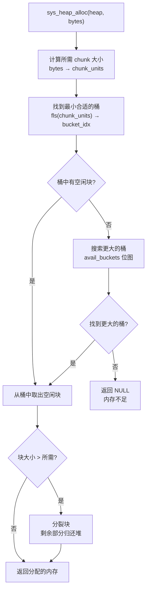
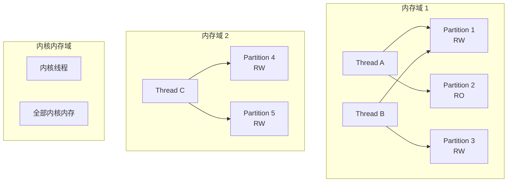
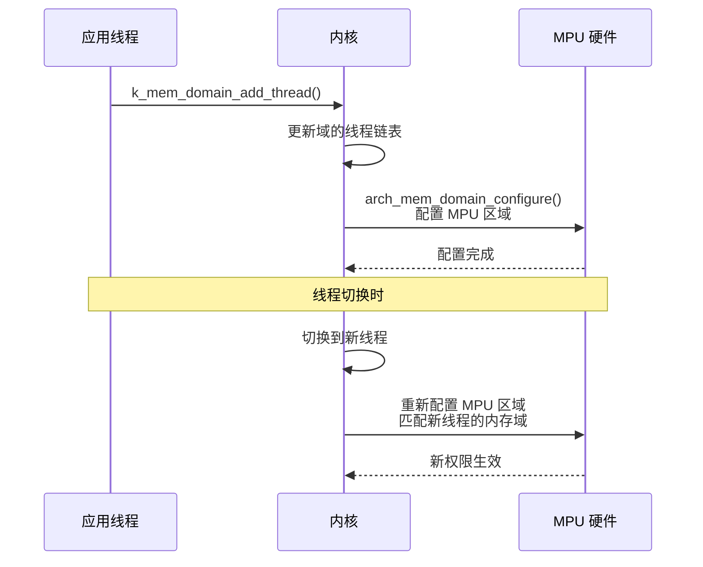
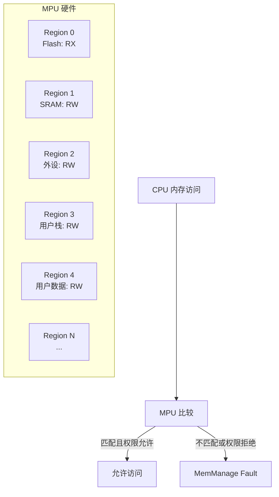

# Zephyr 内存管理详解

> 返回：[入门概览](./00_入门概览.md) | [文档导航](../README.md)

***

## 目录

1. [内存管理概述](#1-内存管理概述)
2. [静态内存分配](#2-静态内存分配)
3. [动态内存分配](#3-动态内存分配)
4. [内存池（Memory Pool）](#4-内存池memory-pool)
5. [内存域（Memory Domain）](#5-内存域memory-domain)
6. [内存保护](#6-内存保护)
7. [内存优化策略](#7-内存优化策略)
8. [调试与分析](#8-调试与分析)

***

## 1. 内存管理概述

### 1.1 设计背景

Zephyr 面向资源受限的嵌入式设备，内存管理设计需要平衡以下需求：

| 需求       | 设计考量             | 实现方式             |
| -------- | ---------------- | ---------------- |
| **确定性**  | 实时系统要求可预测的内存分配时间 | 静态分配、固定大小内存池     |
| **低开销**  | 最小化内存管理开销        | 简单的分配器、无虚拟内存     |
| **安全性**  | 防止内存越界和非法访问      | 内存保护、用户/内核空间隔离   |
| **可配置性** | 根据应用需求裁剪         | Kconfig 配置、模块化设计 |

### 1.2 内存类型

```
┌─────────────────────────────────────────────────────────────────┐
│                        Zephyr 内存布局                          │
├─────────────────────────────────────────────────────────────────┤
│                                                                 │
│  ┌─────────────────────────────────────────────────────────┐   │
│  │  代码段 (Text)                                          │   │
│  │  - 程序代码                                             │   │
│  │  - 常量数据                                             │   │
│  └─────────────────────────────────────────────────────────┘   │
│                                                                 │
│  ┌─────────────────────────────────────────────────────────┐   │
│  │  数据段 (Data)                                          │   │
│  │  - 已初始化的全局/静态变量                              │   │
│  └─────────────────────────────────────────────────────────┘   │
│                                                                 │
│  ┌─────────────────────────────────────────────────────────┐   │
│  │  BSS 段                                                 │   │
│  │  - 未初始化的全局/静态变量（自动清零）                  │   │
│  └─────────────────────────────────────────────────────────┘   │
│                                                                 │
│  ┌─────────────────────────────────────────────────────────┐   │
│  │  栈 (Stack)                                             │   │
│  │  - 中断栈                                               │   │
│  │  - 主线程栈                                             │   │
│  │  - 各线程栈                                             │   │
│  └─────────────────────────────────────────────────────────┘   │
│                                                                 │
│  ┌─────────────────────────────────────────────────────────┐   │
│  │  堆 (Heap) - 可选                                       │   │
│  │  - 动态内存分配                                         │   │
│  └─────────────────────────────────────────────────────────┘   │
│                                                                 │
│  ┌─────────────────────────────────────────────────────────┐   │
│  │  内存池 (Memory Pool) - 可选                            │   │
│  │  - 固定大小块分配                                       │   │
│  └─────────────────────────────────────────────────────────┘   │
│                                                                 │
└─────────────────────────────────────────────────────────────────┘
```

### 1.3 内存管理策略对比

| 策略       | 优点            | 缺点         | 适用场景        |
| -------- | ------------- | ---------- | ----------- |
| **静态分配** | 确定性、无碎片、编译时确定 | 不灵活、可能浪费内存 | 资源受限、实时性要求高 |
| **堆分配**  | 灵活、按需分配       | 可能碎片、非确定性  | 复杂应用、动态需求   |
| **内存池**  | 确定性、无碎片、可预测   | 固定块大小      | 频繁分配固定大小对象  |

### 1.4 内存分配性能对比

| 操作       | 静态分配 | 堆分配  | 内存池   | 内存片   |
| -------- | ---- | ----- | ----- | ----- |
| 分配时间    | 0 (编译时) | 可变    | 固定    | 固定    |
| 释放时间    | 0 (编译时) | 可变    | 固定    | 固定    |
| 内存开销    | 无     | 额外元数据 | 额外元数据 | 最小    |
| 碎片风险    | 无     | 高     | 无     | 无     |
| 确定性     | 100%   | 低     | 100%   | 100%   |

***

## 2. 静态内存分配

### 2.1 内核对象静态定义

Zephyr 推荐在编译时静态分配内存，确保确定性和零碎片。

```c
#include <zephyr/kernel.h>

/* 1. 静态定义线程 */
#define STACK_SIZE 1024
#define THREAD_PRIORITY 5

/* 线程栈空间 - 编译时分配 */
K_THREAD_STACK_DEFINE(my_stack, STACK_SIZE);

/* 线程控制块 - 编译时分配 */
struct k_thread my_thread_data;

/* 线程入口函数 */
void my_thread_entry(void *p1, void *p2, void *p3)
{
    while (1) {
        printk("Thread running\n");
        k_sleep(K_MSEC(1000));
    }
}

void main(void)
{
    /* 使用预分配的栈和控制块创建线程 */
    k_thread_create(&my_thread_data, my_stack, STACK_SIZE,
                    my_thread_entry,
                    NULL, NULL, NULL,
                    THREAD_PRIORITY, 0, K_NO_WAIT);
}
```

### 2.2 静态定义宏

Zephyr 提供了一系列宏用于静态定义内核对象：

```c
#include <zephyr/kernel.h>

/* 线程 */
K_THREAD_STACK_DEFINE(stack_name, size);           // 定义线程栈
K_THREAD_STACK_ARRAY_DEFINE(stacks, n, size);      // 定义线程栈数组

/* 信号量 */
K_SEM_DEFINE(my_sem, initial_count, limit);        // 定义信号量

/* 互斥锁 */
K_MUTEX_DEFINE(my_mutex);                          // 定义互斥锁

/* 队列 */
K_QUEUE_DEFINE(my_queue);                          // 定义队列

/* 消息队列 */
K_MSGQ_DEFINE(my_msgq, msg_size, msg_count, align);// 定义消息队列

/* 管道 */
K_PIPE_DEFINE(my_pipe, pipe_size);                 // 定义管道

/* 栈（LIFO） */
K_STACK_DEFINE(my_stack, stack_num_entries);       // 定义栈

/* 定时器 */
K_TIMER_DEFINE(my_timer, expiry_fn, stop_fn);      // 定义定时器

/* 工作队列 */
K_WORK_DEFINE(my_work, work_handler);              // 定义工作项
K_WORK_DELAYABLE_DEFINE(my_dwork, work_handler);   // 定义可延迟工作项
```

### 2.3 内存对齐

```c
#include <zephyr/kernel.h>

/* 对齐到指定边界 */
__aligned(8) char buffer[256];     // 8字节对齐
__aligned(32) int cache_line[16];  // 32字节对齐（缓存行）

/* 使用宏定义对齐 */
#define MY_ALIGNMENT 32
__aligned(MY_ALIGNMENT) uint8_t dma_buffer[1024];
```

***

## 3. 动态内存分配

### 3.1 堆配置

```conf
# prj.conf
# 启用堆内存管理器
CONFIG_HEAP_MEM_POOL_SIZE=8192    # 堆总大小（字节）
CONFIG_NEWLIB_LIBC=y              # 使用 newlib C库
# 或
CONFIG_PICOLIBC=y                 # 使用 picolibc（推荐，更小巧）
```

### 3.2 堆内存分配 API

```c
#include <zephyr/kernel.h>
#include <stdlib.h>

void heap_example(void)
{
    /* 1. 标准 C 库分配 */
    char *ptr1 = malloc(100);
    if (ptr1 != NULL) {
        /* 使用内存 */
        strcpy(ptr1, "Hello");
        
        /* 调整大小 */
        ptr1 = realloc(ptr1, 200);
        
        /* 释放 */
        free(ptr1);
    }
    
    /* 2. 对齐分配 */
    void *ptr2;
    int ret = posix_memalign(&ptr2, 32, 256);  // 32字节对齐
    if (ret == 0) {
        /* 使用对齐内存 */
        free(ptr2);
    }
    
    /* 3. 清零分配 */
    char *ptr3 = calloc(10, sizeof(int));  // 分配10个int，自动清零
    if (ptr3 != NULL) {
        free(ptr3);
    }
}
```

### 3.3 Zephyr 内核堆 API

```c
#include <zephyr/kernel.h>

void zephyr_heap_example(void)
{
    /* 1. 从内核堆分配 */
    void *ptr = k_malloc(256);
    if (ptr != NULL) {
        /* 使用内存 */
        
        /* 释放 */
        k_free(ptr);
    }
    
    /* 2. 对齐分配 */
    void *aligned_ptr = k_aligned_alloc(32, 256);
    if (aligned_ptr != NULL) {
        k_free(aligned_ptr);
    }
    
    /* 3. 查询堆状态 */
    struct sys_memory_stats stats;
    k_mem_paging_stats_get(NULL, &stats);
    
    printk("Free heap: %zu bytes\n", stats.free_bytes);
    printk("Allocated heap: %zu bytes\n", stats.allocated_bytes);
}
```

### 3.4 sys_heap 实现原理

> ⚠️ 注意：Zephyr 的 `sys_heap` **不是**传统的伙伴系统（buddy system），而是一种**分离适配（segregated fit）分配器**，使用 2 的幂次桶（power-of-two buckets）。

源码位于 [lib/heap/heap.c](file:///home/pbw/cs-learning-notes/zephyr-src/lib/heap/heap.c)，头文件注释明确描述了其设计：

> *"A more or less conventional segregated fit allocator with power-of-two buckets."*

#### 核心数据结构

```c
// lib/heap/heap.h（简化）
struct z_heap {
    uint32_t len;                // 堆总大小（chunk 单位）
    uint32_t avail_buckets;      // 位图：哪些桶有空闲块
    struct z_heap_bucket {
        chunkid_t next;          // 桶中第一个空闲 chunk
    } buckets[];                 // 变长数组，每个桶一个
    // chunk 数据紧随其后...
};
```

#### 分配算法



#### 关键特性

| 特性 | 说明 |
|-----|------|
| **空间效率** | 每个已分配 chunk 仅 4 字节开销（大堆 8 字节），chunk 可按 8 字节任意分割 |
| **碎片抵抗** | 释放时**立即合并**相邻空闲块；分配优先从最小够用桶取，减少浪费 |
| **性能保证** | 所有操作为常数时间（桶搜索有编译时可配置上限），约百条指令 |
| **Canary 保护** | 可选 `CONFIG_SYS_HEAP_CANARIES`，检测堆溢出和 double-free |

#### 释放与合并

```
释放 chunk 时：
1. 检查前一个 chunk 是否空闲 → 合并
2. 检查后一个 chunk 是否空闲 → 合并
3. 将合并后的 chunk 放入对应桶

合并是立即的，不是延迟的，这是抗碎片的关键。
```

#### 堆 Canary 机制

源码中的 canary 实现展示了 Zephyr 的安全设计（[lib/heap/heap.c](file:///home/pbw/cs-learning-notes/zephyr-src/lib/heap/heap.c#L50)）：

```c
// 每个 chunk 尾部放置 canary 值
static inline uint32_t compute_canary(struct z_heap *h, chunkid_t c)
{
    return ((c >> 16) | (c << 16)) ^ chunk_size(h, c) ^ HEAP_CANARY_MAGIC(h);
}

// 分配时验证 canary
static inline void verify_chunk_canary(struct z_heap *h, chunkid_t c, void *mem)
{
    uint32_t expected = compute_canary(h, c);
    uint32_t found = chunk_trailer(h, c)->canary;
    if (found != expected) {
        if (found == HEAP_CANARY_POISON) {
            LOG_ERR("heap canary: double free at %p", mem);
        } else {
            LOG_ERR("heap canary: corruption at %p", mem);
        }
        k_panic();
    }
}
```

***

## 4. 内存池（Memory Pool）

### 4.1 内存池设计

内存池提供固定大小内存块的快速分配，适合频繁分配/释放相同大小对象的场景。

```
┌─────────────────────────────────────────────────────────────────┐
│                      内存池结构                                 │
├─────────────────────────────────────────────────────────────────┤
│                                                                 │
│  内存池配置：                                                   │
│  ┌─────────────────────────────────────────────────────────┐   │
│  │  min_size = 16 bytes    (最小块大小)                    │   │
│  │  max_size = 256 bytes   (最大块大小)                    │   │
│  │  n_max = 4              (大小级别数)                    │   │
│  │  max_size = min_size * 2^(n_max-1)                      │   │
│  └─────────────────────────────────────────────────────────┘   │
│                                                                 │
│  块大小级别：                                                   │
│  ┌─────────┬─────────┬─────────┬─────────┐                     │
│  │ Level 0 │ Level 1 │ Level 2 │ Level 3 │                     │
│  │  16B    │  32B    │  64B    │  128B   │                     │
│  └─────────┴─────────┴─────────┴─────────┘                     │
│                                                                 │
│  分配示例：                                                     │
│  - 请求 20B → 分配 32B (Level 1)                                │
│  - 请求 50B → 分配 64B (Level 2)                                │
│  - 请求 100B → 分配 128B (Level 3)                              │
│                                                                 │
└─────────────────────────────────────────────────────────────────┘
```

### 4.2 内存池 API

```c
#include <zephyr/kernel.h>

/* 定义内存池 */
#define MIN_BLOCK_SIZE  16
#define MAX_BLOCK_SIZE  256
#define NUM_LEVELS      4
#define NUM_BLOCKS      8

K_MEM_POOL_DEFINE(my_pool, MIN_BLOCK_SIZE, MAX_BLOCK_SIZE, 
                  NUM_BLOCKS, NUM_LEVELS);

void mempool_example(void)
{
    struct k_mem_block block;
    int ret;
    
    /* 1. 分配内存块 */
    ret = k_mem_pool_alloc(&my_pool, &block, 50, K_NO_WAIT);
    if (ret == 0) {
        /* block.data 指向分配的内存 */
        memset(block.data, 0, 50);
        
        /* 使用内存... */
        
        /* 释放内存块 */
        k_mem_pool_free(&block);
    }
    
    /* 2. 带超时的分配 */
    ret = k_mem_pool_alloc(&my_pool, &block, 100, K_MSEC(100));
    if (ret == 0) {
        k_mem_pool_free(&block);
    } else if (ret == -EAGAIN) {
        printk("Allocation timeout\n");
    }
}
```

### 4.3 内存片（Memory Slab）

内存片是比内存池更简单的固定大小分配器。

```c
#include <zephyr/kernel.h>

/* 定义内存片 */
#define BLOCK_SIZE  64
#define NUM_BLOCKS  10

K_MEM_SLAB_DEFINE(my_slab, BLOCK_SIZE, NUM_BLOCKS, 4);

void memslab_example(void)
{
    void *block;
    int ret;
    
    /* 分配 */
    ret = k_mem_slab_alloc(&my_slab, &block, K_NO_WAIT);
    if (ret == 0) {
        /* 使用 block */
        memset(block, 0, BLOCK_SIZE);
        
        /* 释放 */
        k_mem_slab_free(&my_slab, block);
    }
    
    /* 查询状态 */
    printk("Free blocks: %zu\n", k_mem_slab_num_free_get(&my_slab));
    printk("Used blocks: %zu\n", k_mem_slab_num_used_get(&my_slab));
}
```

***

## 5. 内存域（Memory Domain）

### 5.1 内存域概念

内存域用于将线程分组，并对每组线程设置不同的内存访问权限，实现内存隔离。源码位于 [kernel/userspace/mem_domain.c](file:///home/pbw/cs-learning-notes/zephyr-src/kernel/userspace/mem_domain.c) 和 [include/zephyr/app_memory/mem_domain.h](file:///home/pbw/cs-learning-notes/zephyr-src/include/zephyr/app_memory/mem_domain.h)。



### 5.2 源码中的数据结构

```c
// include/zephyr/app_memory/mem_domain.h

struct k_mem_partition {
    uintptr_t start;              // 分区起始地址
    size_t size;                  // 分区大小
    k_mem_partition_attr_t attr;  // 访问属性（RW/RO/XN 等）
};

struct k_mem_domain {
#ifdef CONFIG_ARCH_MEM_DOMAIN_DATA
    struct arch_mem_domain arch;  // 架构相关数据（页表/MPU 配置）
#endif
    struct k_mem_partition partitions[CONFIG_MAX_DOMAIN_PARTITIONS];
#ifdef CONFIG_MEM_DOMAIN_HAS_THREAD_LIST
    sys_dlist_t thread_mem_domain_list;  // 属于该域的线程链表
#endif
    uint8_t num_partitions;       // 活跃分区数
};
```

**关键设计点**：
- 每个域最多 `CONFIG_MAX_DOMAIN_PARTITIONS` 个分区（默认 16）
- 线程只能属于一个内存域，但一个域可以有多个线程
- 架构相关数据（`arch_mem_domain`）存储 MPU 配置或页表信息

### 5.3 内存域 API

```c
#include <zephyr/app_memory/mem_domain.h>

// 定义内存分区
K_MEM_PARTITION_DEFINE(app_part1, app_buf1, 4096,
                       K_MEM_PARTITION_P_RW_U_RW);

K_MEM_PARTITION_DEFINE(app_part2, app_buf2, 2048,
                       K_MEM_PARTITION_P_RW_U_RO);

// 定义内存域
struct k_mem_domain app_domain;

// 初始化
struct k_mem_partition *parts[] = {&app_part1, &app_part2};
k_mem_domain_init(&app_domain, 2, parts);

// 将线程加入内存域
k_mem_domain_add_thread(&app_domain, k_current_get());

// 动态添加/移除分区
k_mem_domain_add_partition(&app_domain, &new_part);
k_mem_domain_remove_partition(&app_domain, &old_part);
```

> **K_MEM_PARTITION_DEFINE 与 k_mem_domain.partitions 的关系**：
>
> - `K_MEM_PARTITION_DEFINE(name, buf, size, attr)` 展开后生成一个 `struct k_mem_partition` 变量和一块内存区域。**它只是定义了一个分区，不与任何特定内存域绑定**。
> - `struct k_mem_domain` 的 `partitions[]` 数组存储的是指向 `struct k_mem_partition` 的**指针**，不是拷贝。
> - 同一个 `k_mem_partition` 可以被多个内存域引用（`k_mem_domain_add_partition()` 只是将指针加入数组）。
> - 实际的内存布局是：`K_MEM_PARTITION_DEFINE` 通过 `__section()` 属性将变量放到特殊链接段（如 `app_datas`、`app_bss`），MPU 初始化时遍历这些段来配置硬件区域。

### 5.4 内存域与 MPU 的协作



***

## 6. 内存保护

### 6.1 MPU/MMU 支持

Zephyr 支持通过 MPU（内存保护单元）或 MMU（内存管理单元）实现内存保护。

#### MPU vs MMU 对比

| 维度 | MPU (Cortex-M) | MMU (Cortex-A/x86) |
|-----|----------------|-------------------|
| **粒度** | 区域（Region），对齐要求 | 页（4KB），灵活 |
| **区域数量** | 通常 8-16 个 | 无实际限制 |
| **地址转换** | 无（物理地址直通） | 有（虚拟→物理） |
| **内存域支持** | 受限（区域数量限制） | 完整（每域独立页表） |
| **典型平台** | ARM Cortex-M0+/M3/M4/M7 | ARM Cortex-A, x86, RISC-V w/ MMU |

#### MPU 工作原理



#### MPU 配置流程

```c
// arch/arm/core/mpu/arm_core_mpu.c（简化）
// 线程切换时重新配置 MPU 区域
void z_arm_thread_swap(struct k_thread *incoming)
{
    // 1. 配置固定区域（Flash, SRAM, 外设）
    // 2. 配置线程栈区域
    // 3. 配置内存域分区
    // 4. 锁定 MPU 配置
}
```

#### Kconfig 配置

```conf
# 启用内存保护
CONFIG_MEMORY_PROTECTION=y
CONFIG_MPU=y                    # ARM Cortex-M
# 或
CONFIG_MMU=y                    # ARM Cortex-A / x86

# 用户模式
CONFIG_USERSPACE=y

# MPU 相关
CONFIG_MPU_GAP_FILLING=y       # 填充 MPU 区域间隙
CONFIG_MAX_DOMAIN_PARTITIONS=16 # 每域最大分区数
```

### 6.2 用户模式

```c
#include <zephyr/kernel.h>

/* 在用户模式下运行的线程 */
void user_thread_entry(void *p1, void *p2, void *p3)
{
    /* 在用户模式下，只能访问自己的栈和允许的内存 */
    
    /* 尝试访问内核内存会触发故障 */
    // int *kernel_ptr = (int *)0x20000000;  // 非法访问！
    
    /* 使用系统调用访问内核服务 */
    k_sleep(K_MSEC(100));
}

void main(void)
{
    /* 创建用户线程 */
    k_thread_create(&user_thread, user_stack, STACK_SIZE,
                    user_thread_entry, NULL, NULL, NULL,
                    PRIORITY, K_USER, K_NO_WAIT);
}
```

### 6.3 堆内存保护

```c
#include <zephyr/kernel.h>

/* 在用户模式下分配内存 */
void user_heap_example(void)
{
    /* 用户模式下的分配 */
    void *ptr = k_malloc(256);
    if (ptr != NULL) {
        /* 使用内存 */
        
        /* 释放 */
        k_free(ptr);
    }
    
    /* 查询堆状态（需要系统调用） */
    struct sys_memory_stats stats;
    k_mem_paging_stats_get(NULL, &stats);
}
```

***

## 7. 内存优化策略

### 7.1 栈大小优化

```c
#include <zephyr/kernel.h>

/* 使用栈使用分析确定合适的栈大小 */
#define STACK_SIZE 512  // 根据分析结果调整

K_THREAD_STACK_DEFINE(my_stack, STACK_SIZE);

void stack_analysis_example(void)
{
    /* 启用栈使用监控 */
    size_t unused = k_thread_stack_space_get(k_current_get());
    printk("Unused stack space: %zu bytes\n", unused);
    
    /* 或使用 CONFIG_INIT_STACKS 和 k_thread_stack_space_get */
}
```

### 7.2 内存使用分析

```conf
# prj.conf
# 启用内存分析
CONFIG_THREAD_STACK_INFO=y
CONFIG_INIT_STACKS=y
CONFIG_THREAD_MONITOR=y
```

```c
#include <zephyr/kernel.h>

void memory_analysis(void)
{
    /* 打印所有线程栈使用情况 */
    k_thread_foreach(thread, {
        size_t unused = k_thread_stack_space_get(thread);
        const char *name = k_thread_name_get(thread);
        printk("Thread %s: unused stack = %zu bytes\n", 
               name ? name : "?", unused);
    });
}
```

### 7.3 编译时内存分析

```bash
# 查看 RAM 使用情况——按符号/文件/库分组
west build -t ram_report

# 查看 ROM (Flash) 使用情况
west build -t rom_report
```

`ram_report` 输出类似：

```
Memory regions       Used Size  Region Size  %age Used
           SRAM:       12296 B        64 KB     18.77%
        IDT_LIST:          0 GB         2 KB      0.00%

Files sorted by size (/home/user/myapp):
  zephyr/zephyr.elf       :   5116 B
  kernel/init.c           :   2048 B
  kernel/sched.c          :   1024 B
  ...
```

其中 `kernel/sched.c` 的 1024B 包含了该文件中所有**静态变量**（包括线程栈、队列等）占用的 RAM。用这个报告可以快速定位是谁消耗了大量内存。

### 7.4 运行时内存分析

## 8. 调试与分析

### 8.1 内存泄漏检测

```conf
# prj.conf
CONFIG_SYS_HEAP_RUNTIME_STATS=y
CONFIG_SYS_HEAP_LISTENER=y
```

```c
#include <zephyr/sys/sys_heap.h>

void heap_stats_example(void)
{
    struct sys_memory_stats stats;
    
    /* 获取堆统计 */
    sys_heap_runtime_stats_get(&my_heap, &stats);
    
    printk("Heap statistics:\n");
    printk("  Free: %zu bytes\n", stats.free_bytes);
    printk("  Allocated: %zu bytes\n", stats.allocated_bytes);
    printk("  Max allocated: %zu bytes\n", stats.max_allocated_bytes);
}
```

### 8.2 内存损坏检测

```conf
# prj.conf
CONFIG_STACK_CANARIES=y           # 栈保护
CONFIG_STACK_SENTINEL=y           # 栈溢出检测
CONFIG_DEBUG=y                    # 调试信息
```

### 8.3 使用 GDB 调试内存

```bash
# 启动调试
west debug

# GDB 命令
(gdb) info registers              # 查看寄存器
(gdb) x/32x $sp                   # 查看栈内容
(gdb) p my_variable               # 打印变量
(gdb) watch my_variable           # 设置观察点
(gdb) bt                          # 查看调用栈
```

***

## 总结

Zephyr 的内存管理提供了从静态分配到动态分配、从简单堆到内存池、从无保护到内存域的完整方案：

1. **优先使用静态分配**：确定性、无碎片、编译时确定
2. **合理使用动态分配**：灵活但需注意碎片和非确定性
3. **内存池/内存片优化频繁分配**：固定大小、快速分配、无碎片
4. **内存域实现隔离**：多应用安全运行、权限控制
5. **MPU/MMU 提供硬件保护**：防止非法访问、提高系统安全性
6. **内存优化策略**：数据结构优化、编译选项优化、运行时管理
7. **调试与分析工具**：内存泄漏检测、内存损坏检测、性能分析

### 最佳实践

- **选择合适的分配策略**：根据场景选择静态分配、堆分配、内存池或内存片
- **合理设置内存大小**：根据实际需求调整栈大小、堆大小等
- **启用内存保护**：在支持的平台上启用 MPU/MMU 保护
- **定期分析内存使用**：使用编译时和运行时工具分析内存使用情况
- **及时释放内存**：避免内存泄漏，特别是在动态分配时
- **使用内存域隔离**：对于多应用场景，使用内存域实现安全隔离

***

*最后更新：2026-04-22*
