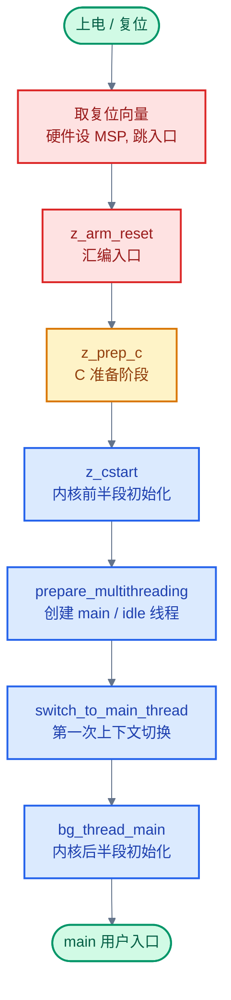
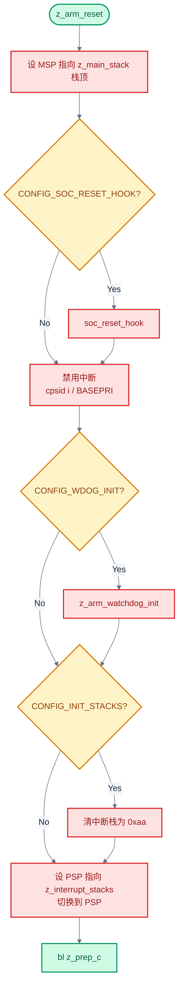
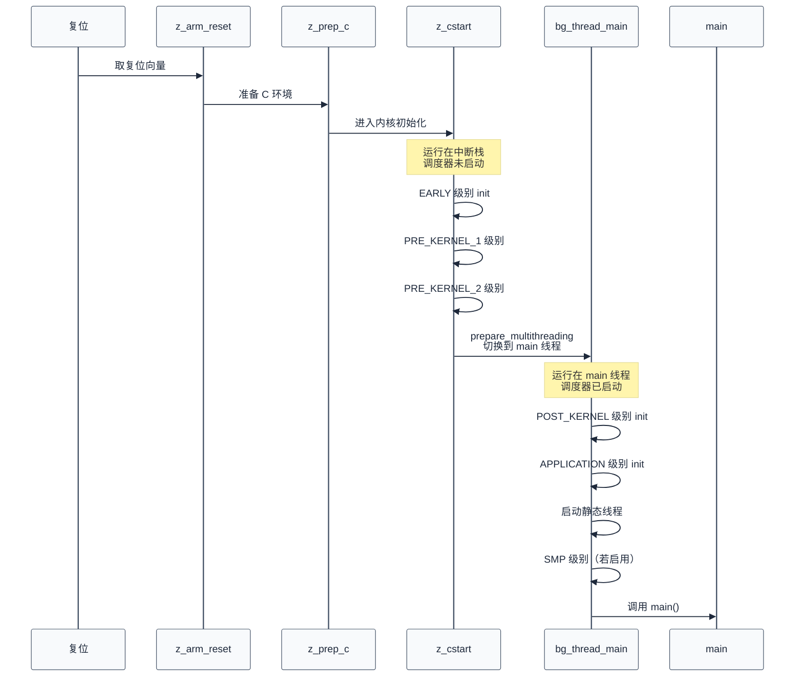

# 04. Zephyr 内核启动与初始化

> 一句话概括：本文以"上电→复位向量→`z_arm_reset`→`z_prep_c`→`z_cstart`→`prepare_multithreading`→`bg_thread_main`→`main`"这条完整调用链为主线，讲清 Zephyr 如何从"无内核"自举到"内核存活"，并把初始化级别、设备自动初始化、中断栈接力等机制挂回调用链的相应环节。
> **工程师视角**：读完后你应当能在脑中画出这条调用链，并回答三个问题——"为什么 `z_cstart` 之前必须有汇编""`z_cstart` 与 `bg_thread_main` 的分界线是什么""为什么 `PRE_KERNEL_1` 阶段不能用信号量"。

### 关键术语

| 缩写 | 全称 | 含义 |
|------|------|------|
| Bootloader | — | 引导加载程序，在 Zephyr 之前运行的固件，负责加载镜像或跳转到入口 |
| Reset Vector | — | 复位向量，CPU 上电后取指的第一个异常表项，包含栈顶与入口地址 |
| VTOR | Vector Table Offset Register | 向量表偏移寄存器，Cortex-M 用于重定位异常向量表 |
| MSP | Main Stack Pointer | 主栈指针，复位后默认使用，内核初始化阶段的中断栈 |
| PSP | Process Stack Pointer | 进程栈指针，线程模式下使用 |
| BSS | Block Started by Symbol | 未初始化静态变量段，启动时需清零 |
| XIP | eXecute In Place | 片内执行，代码直接在 Flash 运行，无需拷贝到 RAM |
| ISR Stack | Interrupt Service Routine Stack | 中断栈，内核初始化阶段与 ISR 共用的栈 |
| Init Level | Initialization Level | 初始化级别，Zephyr 把启动过程划分为 6 个有序级别 |
| EARLY | — | 最早初始化级别，刚进入 C 域、架构初始化之前 |
| PRE_KERNEL_1 | — | 内核初始化级别 1，内核服务尚未可用，运行在中断栈 |
| PRE_KERNEL_2 | — | 内核初始化级别 2，依赖 PRE_KERNEL_1 设备的就绪 |
| POST_KERNEL | — | 内核已存活，可使用内核原语，运行在 main 线程上下文 |
| APPLICATION | — | 应用层初始化级别，`main()` 调用前的最后阶段 |
| SMP | Symmetric Multi-Processing | 多核初始化级别，仅在 `CONFIG_SMP` 启用时存在 |
| DEVICE_DEFINE | — | 创建 `struct device` 并注册到自动初始化序列的宏 |
| DEVICE_DT_DEFINE | — | 从设备树节点创建 `struct device` 的宏 |
| SYS_INIT | — | 注册无设备的纯初始化函数的宏 |
| init_entry | — | 初始化条目结构体，链接脚本段中每个条目记录一个 init 函数或设备 |

---

### 前置阅读

| 需要了解 | 参考文档 |
|----------|----------|
| 设备树节点与 `compatible` 匹配 | [03-设备树详解](./03-设备树详解.md) |
| 分层架构与 `struct device` 概览 | [00-入门概览](./00-入门概览.md) |

---

## 1. 概述：启动全链路

> 线程是 Zephyr 的并发抽象，但线程本身是怎么"从无到有"建立起来的？CPU 上电时没有内核、没有调度器、没有线程，连栈都要汇编自己设。本章先用一个 3 阶段的小例子建立启动序列的整体心智模型，再给出 Zephyr 启动的**完整调用链全貌**与**各阶段综合视图**——这是理解后续所有章节的骨架。后续各章都是调用链某一环的展开。

### 1.1 一个具体场景：从上电到 main 的三个阶段

想象一块 Cortex-M 开发板，刚按下复位按键。CPU 现在的状态是：寄存器是复位默认值、RAM 内容未定义、Flash 里的 Zephyr 镜像原封不动。要让 `main()` 跑起来，CPU 必须完成三个阶段的接力：

1. **无内核阶段**（硬件→汇编→C 准备）：CPU 从向量表取复位向量，跳到 `z_arm_reset` 设栈、禁中断，再调 `z_prep_c` 清 BSS、拷贝 `.data`、初始化中断控制器。这一段没有任何内核抽象，连"线程"概念都不存在。
2. **内核自举阶段**（`z_cstart` 在中断栈上跑）：跑 `EARLY`/`PRE_KERNEL_1`/`PRE_KERNEL_2` 三个 init 级别，构造一个 dummy 线程占位，然后 `prepare_multithreading` 创建 main 线程与 idle 线程，`switch_to_main_thread` 触发第一次上下文切换。
3. **内核存活阶段**（`bg_thread_main` 在 main 线程栈上跑）：跑 `POST_KERNEL`/`APPLICATION`/`SMP` 三个 init 级别，启动静态线程，最后调用用户 `main()`。

> **核心要点**：启动序列的本质是"从无内核到有内核"的三段接力——前一段没有任何内核抽象，连栈都要汇编自己设；中段进入 C 但仍是"裸 C"，没有调度器、没有线程；后段才在真正的线程上下文里调用用户 `main`。三段的分界线就是"调度器是否启动""线程是否诞生"。

### 1.2 调用链全貌



> **如何读这张图**：颜色由绿→红→黄→蓝表示从硬件到应用的层次。红色是架构相关代码（每种 CPU 架构一份），黄色是架构到 C 的过渡，蓝色是架构无关的内核 C 代码。`z_cstart` 之前的代码每条架构都不同，`z_cstart` 之后则统一。注意 `switch_to_main_thread` 是关键转折点——它之前跑在中断栈、没有线程；之后跑在 main 线程栈、调度器活跃。后续各章都是这张图某一环的展开。

### 1.3 各阶段综合视图：调用链上每个环节的状态

上图的调用链有 7 个关键环节。每个环节的"运行上下文""栈""可用内核原语""执行的 init 级别""关键产物"都不同。下表把散落各处的信息收拢成一张完整图景，是理解后续章节的导航：

| 环节 | 函数 | 运行栈 | 线程上下文 | 可用内核原语 | 执行的 init 级别 | 关键产物 |
|------|------|--------|-----------|-------------|-----------------|---------|
| ① 取复位向量 | 硬件 | MSP=`z_main_stack` 栈顶 | 无 | 无 | — | MSP 与 PC 就绪 |
| ② 汇编入口 | `z_arm_reset` | MSP→PSP=`z_interrupt_stacks[0]` 栈顶 | 无 | 无 | — | 栈可用、中断禁用 |
| ③ C 准备 | `z_prep_c` | PSP（中断栈） | 无 | 无 | — | BSS 清零、`.data` 就位、中断控制器就绪 |
| ④ 内核前半段 | `z_cstart` | PSP（中断栈） | dummy 线程 | 几乎不可用 | EARLY / PRE_KERNEL_1 / PRE_KERNEL_2 | 调度器数据结构就绪、设备前两阶段初始化 |
| ⑤ 线程诞生 | `prepare_multithreading` + `switch_to_main_thread` | PSP（中断栈）→PSP（`z_main_stack`） | dummy→main 线程 | 调度器启动 | — | main 线程与 idle 线程就绪、第一次上下文切换 |
| ⑥ 内核后半段 | `bg_thread_main` | PSP（main 线程栈） | main 线程 | 全部可用 | POST_KERNEL / APPLICATION / SMP | 设备后两阶段初始化、静态线程启动、`main()` 被调用 |
| ⑦ 用户入口 | `main` | PSP（main 线程栈） | main 线程 | 全部可用 | — | 应用逻辑 |

> **如何读这张表**：这是本文的"地图"。注意第 ④ 行与第 ⑥ 行的分界——第 ④ 行跑在中断栈、用 dummy 线程占位、内核原语几乎不可用；第 ⑥ 行跑在 main 线程栈、调度器活跃、全部原语可用。这条分界线就是 `switch_to_main_thread`，也是 `PRE_KERNEL_*` 与 `POST_KERNEL` 的本质分界。第 ⑤ 行是转折点——它本身不跑 init 级别，只负责"造线程、切上下文"。后续 §2-§5 按这张表的顺序逐环展开，§6 讲中断栈（贯穿 ②-⑤），§7 讲 init 级别与自动初始化机制（贯穿 ④⑥）。

### 1.4 适用范围

本文以 ARM Cortex-M 为主要示例架构，因为它最常见且启动路径最直观。其他架构（RISC-V、x86、ARC、Xtensa）的复位向量、向量表格式、栈设置细节不同，但整体流程一致：复位 → 汇编入口 → `z_prep_c` 等价物 → `z_cstart`。源码位置见各架构目录下的 `reset.S` 与 `prep_c.c`。

---

## 2. 架构相关启动：复位 → z_arm_reset → z_prep_c

> 第一章建立了启动全链路。一个自然的问题是：CPU 上电后到底怎么找到 Zephyr 的入口？为什么需要一段汇编，不能直接进 C？本章用 Cortex-M 的源码回答这两个问题——对应综合视图表的环节 ①②③，讲清"硬件到 C"的过渡。

### 2.1 复位向量表

Cortex-M 的异常向量表是一张函数指针数组，放在镜像最起始位置。第 0 项是初始 MSP，第 1 项是复位处理函数地址。CPU 上电后硬件自动从 `0x00000000` 读 MSP、从 `0x00000004` 读 PC，跳转到复位处理函数。

Zephyr 的向量表定义在 [arch/arm/core/cortex_m/vector_table.S](file:///home/pbw/rtos/cs-learning-notes/zephyr-project/zephyr/arch/arm/core/cortex_m/vector_table.S#L32-L44)：

```asm
SECTION_SUBSEC_FUNC(exc_vector_table,_vector_table_section,_vector_table)

    /* setting the _very_ early boot on the main stack allows to use memset
     * on the interrupt stack when CONFIG_INIT_STACKS is enabled before
     * switching to the interrupt stack for the rest of the early boot
     */
    .word z_main_stack + CONFIG_MAIN_STACK_SIZE

    .word z_arm_reset
    .word z_arm_nmi

    .word z_arm_hard_fault
```

`.word z_main_stack + CONFIG_MAIN_STACK_SIZE` 是初始 MSP——指向 `z_main_stack`（main 线程栈）的栈顶。`.word z_arm_reset` 是复位入口地址，CPU 上电后从这里开始执行。

> **核心要点**：复位向量是 CPU 与 Zephyr 的"接头地点"。CPU 只认这张表，表里写谁就跳谁。这意味着只要改镜像起始处的两个字，就能换掉初始栈和入口函数——这就是 Bootloader 链式加载的工作方式。

### 2.2 汇编入口 z_arm_reset

`z_arm_reset` 在 [arch/arm/core/cortex_m/reset.S](file:///home/pbw/rtos/cs-learning-notes/zephyr-project/zephyr/arch/arm/core/cortex_m/reset.S#L83-L233)。它的工作是给 C 代码准备一个最小可用的环境，主要步骤编号如下：

1. 设置 MSP 指向 `z_main_stack + CONFIG_MAIN_STACK_SIZE`，保证栈可用
2. 清 `z_sys_post_kernel` 标志（仅 `CONFIG_DEBUG_THREAD_INFO` 时）
3. 调用 `soc_reset_hook`（若启用）—— SoC 厂商的自定义复位代码
4. 禁用中断：`cpsid i` 或设置 `BASEPRI`，保证初始化期间不被打断
5. 调用 `z_arm_watchdog_init`（若 `CONFIG_WDOG_INIT`）
6. 可选清栈：把 `z_interrupt_stacks` 填 `0xaa`（`CONFIG_INIT_STACKS`）
7. 设置 PSP 指向 `z_interrupt_stacks` 栈顶，切换到 PSP 运行
8. 跳转到 `z_prep_c`

第 7 步是关键：切换到 PSP 后，MSP 就空出来了，可以稍后设为中断栈；PSP 上的代码后续会进入 `z_cstart`，再切到 main 线程自己的栈。



> **如何读这张图**：三个菱形是 Kconfig 控制的可选路径，矩形是固定步骤。注意每条路径最终都汇合到 `z_prep_c`——汇编入口的工作就是"为 C 准备最小环境"，环境备好就立刻交给 C。

### 2.3 z_prep_c：从汇编到 C 的过渡

`z_prep_c` 在 [arch/arm/core/cortex_m/prep_c.c](file:///home/pbw/rtos/cs-learning-notes/zephyr-project/zephyr/arch/arm/core/cortex_m/prep_c.c#L198-L223)。它做 5 件事：

```c
FUNC_NORETURN void z_prep_c(void)
{
	soc_prep_hook();                  // 1. SoC 预准备钩子

	relocate_vector_table();          // 2. 重定位向量表（设 VTOR）
#if defined(CONFIG_CPU_HAS_FPU)
	z_arm_floating_point_init();      // 3. FPU 初始化
#endif
	arch_bss_zero();                  // 4. 清零 BSS 段
	arch_data_copy();                 // 5. 拷贝 .data 到 RAM（XIP 场景）
#if defined(CONFIG_ARM_CUSTOM_INTERRUPT_CONTROLLER)
	z_soc_irq_init();
#else
	z_arm_interrupt_init();           // 6. 初始化中断控制器
#endif
#if CONFIG_ARCH_CACHE
	arch_cache_init();                // 7. cache 初始化
#endif
	z_cstart();                       // 8. 进入内核初始化
	CODE_UNREACHABLE;
}
```

**为什么需要 `z_prep_c` 而不直接在汇编里调 `z_cstart`**：C 语言假设 BSS 已清零、`.data` 已就位、栈可用。汇编入口只设了栈，没动 BSS 和 `.data`——这两件事用 C 写更可读、可移植，但必须先有一段"准备 C 环境"的代码。`z_prep_c` 就是这段代码。

**`relocate_vector_table` 做什么**：Cortex-M 的 VTOR 寄存器允许向量表放在任意对齐地址。XIP 镜像在 Flash 时向量表在 Flash 起点；如果配置 `CONFIG_SRAM_VECTOR_TABLE`，此函数把向量表拷到 SRAM 并把 VTOR 指向 SRAM 副本——加快异常响应、允许运行时改 ISR。

> **核心要点**：架构相关启动的产物是"一个能跑 C 的最小环境"——栈已设、BSS 已清、`.data` 已就位、向量表已定位、中断控制器就绪。剩下的工作交给架构无关的 `z_cstart`。对应综合视图表的环节 ①②③。

---

## 3. z_cstart：内核前半段初始化

> 上一章把启动推进到 `z_cstart` 入口（综合视图表环节 ④）。此时 CPU 已能跑 C 代码，但内核对象尚未构造、调度器尚未启动、main 线程尚不存在。`z_cstart` 在中断栈上跑前三个 init 级别（EARLY/PRE_KERNEL_1/PRE_KERNEL_2），然后用 dummy 线程占位让日志/断言能引用 `k_current_get()`，最后调用 `prepare_multithreading` 与 `switch_to_main_thread` 把控制权交给 main 线程。本章聚焦 `z_cstart` 本身，线程诞生留在下一章。

### 3.1 z_cstart 主流程

`z_cstart` 在 [kernel/init.c](file:///home/pbw/rtos/cs-learning-notes/zephyr-project/zephyr/kernel/init.c#L538-L610)。主要步骤：

1. `gcov_static_init()`—— 代码覆盖率钩子
2. `z_sys_init_run_level(INIT_LEVEL_EARLY)`—— 跑 EARLY 级别所有 init 函数
3. `arch_kernel_init()`—— 架构相关内核初始化（含中断栈正式上任，见 §6.3）
4. `LOG_CORE_INIT()`—— 日志子系统核心初始化
5. `z_dummy_thread_init(&_thread_dummy)`（多线程时）—— 创建一个"假线程"作为当前上下文，让后续代码能引用 `k_current_get()`
6. `z_device_state_init()`—— 初始化所有 `struct device` 的 state 字段
7. `soc_early_init_hook()` / `board_early_init_hook()`
8. `z_sys_init_run_level(INIT_LEVEL_PRE_KERNEL_1)`—— 跑 PRE_KERNEL_1 级别
9. `arch_smp_init()`（若 SMP）
10. `z_sys_init_run_level(INIT_LEVEL_PRE_KERNEL_2)`—— 跑 PRE_KERNEL_2 级别
11. 初始化栈金丝雀（若 `CONFIG_REQUIRES_STACK_CANARIES`）
12. `timing_init()` / `timing_start()`（若启用）
13. `switch_to_main_thread(prepare_multithreading())`—— 构造 main/idle 线程并切换过去，**不再返回**

```c
__boot_func
FUNC_NORETURN void z_cstart(void)
{
	gcov_static_init();
	z_sys_init_run_level(INIT_LEVEL_EARLY);   // 步骤 2
	arch_kernel_init();                       // 步骤 3
	LOG_CORE_INIT();
#if defined(CONFIG_MULTITHREADING)
	z_dummy_thread_init(&_thread_dummy);      // 步骤 5
#endif
	z_device_state_init();                    // 步骤 6
	soc_early_init_hook();
	board_early_init_hook();
	z_sys_init_run_level(INIT_LEVEL_PRE_KERNEL_1);  // 步骤 8
#if defined(CONFIG_SMP)
	arch_smp_init();
#endif
	z_sys_init_run_level(INIT_LEVEL_PRE_KERNEL_2);  // 步骤 10
	/* ... 栈金丝雀、timing 初始化 ... */
	switch_to_main_thread(prepare_multithreading());  // 步骤 13
	CODE_UNREACHABLE;
}
```

### 3.2 _thread_dummy：自举困境的解决方案

注意步骤 5 的"假线程" `_thread_dummy`：此时调度器还没启动，没有真正的线程，但部分内核代码（如日志、断言）会调用 `k_current_get()`。Zephyr 用一个 dummy 线程占位，让这些调用不崩。

> **设计洞察**：`_thread_dummy` 是典型的"自举困境"（bootstrap paradox）解决方案——要管理线程就需要"当前线程"概念，但创建第一个真正线程之前还没有线程。这并非 Zephyr 独有的问题：Linux 内核的 `init_task`（即 task 0 / swapper）同样是静态构造的"假任务"，在 `start_kernel()` 期间充当 `_current`，直到 `rest_init()` 创建出真正的 init 进程（task 1）后才退居 idle 角色。
>
> 这种处理方式体现了**空对象模式**（Null Object Pattern）：与其在每个调用 `k_current_get()` 的地方加 `if (_current == NULL)` 分支，不如提供一个最小化的占位对象，让"无线程"状态在代码里与"有线程"状态不可区分。代价是多了一个静态对象（约几百字节），收益是日志、断言、追踪等基础设施在启动早期就能正常工作，无须为每个调用点写两套代码。OS 自举问题无处不在：调度器要调度才有线程，但创建线程又要调度器；中断栈要切到才有意义，但切栈动作又要跑在某个栈上——Zephyr 用"占位 + 接力"逐一化解。

> **核心要点**：`z_cstart` 在中断栈上完成三件事——跑前三个 init 级别、用 dummy 线程占位、调用 `prepare_multithreading` 创建真正的线程。它本身**不返回**，最后一步 `switch_to_main_thread` 触发上下文切换后，控制权转移到 `bg_thread_main`。

---

## 4. 线程诞生：prepare_multithreading 与 switch_to_main_thread

> 上一章把 `z_cstart` 讲到步骤 13——`switch_to_main_thread(prepare_multithreading())`。这一步是整个启动序列的关键转折点（综合视图表环节 ⑤）：它之前没有线程、调度器未启动、跑在中断栈；它之后 main 线程就绪、调度器活跃、跑在 main 线程栈。本章拆解这个转折点——`prepare_multithreading` 如何构造 main/idle 线程，`switch_to_main_thread` 如何完成第一次上下文切换。

### 4.1 prepare_multithreading：构造 main 与 idle 线程

`prepare_multithreading` 在 [kernel/init.c](file:///home/pbw/rtos/cs-learning-notes/zephyr-project/zephyr/kernel/init.c#L442-L473)：

```c
__boot_func
static char *prepare_multithreading(void)
{
	char *stack_ptr;

	z_sched_init();                          // 1. 初始化调度器数据结构
#ifndef CONFIG_SMP
	_kernel.ready_q.cache = &z_main_thread;  // 2. 主线程预填入调度缓存
#endif
	stack_ptr = z_setup_new_thread(&z_main_thread, z_main_stack,
				       K_THREAD_STACK_SIZEOF(z_main_stack),
				       bg_thread_main,                 // 3. 创建 main 线程
				       NULL, NULL, NULL,
				       CONFIG_MAIN_THREAD_PRIORITY,
				       K_ESSENTIAL, "main");
	z_mark_thread_as_not_sleeping(&z_main_thread);
	z_ready_thread(&z_main_thread);          // 4. main 线程入就绪队列

	z_init_cpu(0);                           // 5. 初始化 0 号 CPU：创建 idle 线程、设中断栈

	return stack_ptr;
}
```

五个步骤做了三件事：

1. **初始化调度器**（步骤 1）：`z_sched_init` 清零就绪队列数据结构，为后续 `z_ready_thread` 做准备。
2. **创建 main 线程**（步骤 2-4）：`z_setup_new_thread` 用 `z_main_stack` 作为栈、`bg_thread_main` 作为入口函数构造 main 线程；`z_ready_thread` 把它放入就绪队列。注意 `K_ESSENTIAL` 标志——main 线程退出会导致系统终止（直到 `bg_thread_main` 末尾调用 `z_thread_essential_clear` 才解除）。
3. **初始化 CPU 与 idle 线程**（步骤 5）：`z_init_cpu(0)` 做三件事——调用 `init_idle_thread(0)` 创建 idle 线程、把 idle 线程指针存进 `_kernel.cpus[0].idle_thread`、把 `z_interrupt_stacks[0]` 栈顶存进 `_kernel.cpus[0].irq_stack`。

### 4.2 switch_to_main_thread：第一次上下文切换

`switch_to_main_thread` 在 [kernel/init.c](file:///home/pbw/rtos/cs-learning-notes/zephyr-project/zephyr/kernel/init.c#L476-L491)：

```c
__boot_func
static FUNC_NORETURN void switch_to_main_thread(char *stack_ptr)
{
#ifdef CONFIG_ARCH_HAS_CUSTOM_SWAP_TO_MAIN
	arch_switch_to_main_thread(&z_main_thread, stack_ptr, bg_thread_main);
#else
	ARG_UNUSED(stack_ptr);
	/*
	 * Context switch to main task (entry function is _main()): the
	 * current fake thread is not on a wait queue or ready queue, so it
	 * will never be rescheduled in.
	 */
	z_swap_unlocked();
#endif /* CONFIG_ARCH_HAS_CUSTOM_SWAP_TO_MAIN */
	CODE_UNREACHABLE; /* LCOV_EXCL_LINE */
}
```

默认路径调用 `z_swap_unlocked()` 触发上下文切换：保存当前 dummy 上下文、加载 main 线程的寄存器、跳到 `bg_thread_main`。注释点明一个关键事实——dummy 线程不在任何就绪/等待队列里，所以它**永远不会被重新调度**，相当于静默丢弃。

从此代码运行在 main 线程上下文，栈是 `z_main_stack`，调度器已启动。

### 4.3 调用链分界线：PRE_KERNEL 与 POST_KERNEL

把 §3 和 §4 串起来，能看到一条清晰的分界线：

| 维度 | `z_cstart`（分界线之前） | `bg_thread_main`（分界线之后） |
|------|------------------------|------------------------------|
| **运行栈** | 中断栈（PSP=`z_interrupt_stacks[0]`） | main 线程栈（PSP=`z_main_stack`） |
| **当前线程** | dummy 线程 | main 线程 |
| **调度器** | 数据结构已初始化但未启动 | 活跃 |
| **内核原语** | 几乎不可用（不能阻塞） | 全部可用 |
| **执行的 init 级别** | EARLY / PRE_KERNEL_1 / PRE_KERNEL_2 | POST_KERNEL / APPLICATION / SMP |
| **能否 `k_sleep`/`k_sem_take`** | 否 | 是 |

> **如何读这张表**：这条分界线就是 `switch_to_main_thread`。它解释了为什么 `PRE_KERNEL_1` 阶段不能用信号量——不是信号量本身没初始化，而是调度器没启动，阻塞操作无处可切。`POST_KERNEL` 阶段之所以能用所有原语，是因为它跑在真正的线程上下文里，调度器可以正常切换。

> **核心要点**：`prepare_multithreading` + `switch_to_main_thread` 是启动序列的关键转折——它把系统从"无线程、跑在中断栈"切换到"有线程、跑在 main 线程栈、调度器活跃"。这条分界线就是 `PRE_KERNEL_*` 与 `POST_KERNEL` 的本质分界，决定了每个 init 级别能用什么 API。

---

## 5. bg_thread_main：内核后半段初始化

> 上一章讲完线程诞生，控制权已经转移到 main 线程的 `bg_thread_main`（综合视图表环节 ⑥）。此时调度器活跃、全部内核原语可用，`bg_thread_main` 跑后三个 init 级别（POST_KERNEL/APPLICATION/SMP）、启动静态线程、最后调用用户 `main()`。

### 5.1 bg_thread_main 主流程

`bg_thread_main` 在 [kernel/init.c](file:///home/pbw/rtos/cs-learning-notes/zephyr-project/zephyr/kernel/init.c#L283-L359)。从这里开始，代码运行在真正的线程上下文：

1. `z_mem_manage_init()`（MMU 启用时）
2. `z_sys_post_kernel = true`—— 标记"内核已存活"，`k_is_pre_kernel()` 从此返回 false
3. `arch_irq_offload_init()`（若 `CONFIG_IRQ_OFFLOAD`）
4. `z_sys_init_run_level(INIT_LEVEL_POST_KERNEL)`—— **跑 POST_KERNEL 级别**
5. `soc_late_init_hook()` / `board_late_init_hook()`
6. `boot_banner()`—— 打印启动 banner
7. `z_static_init_gnu()`（若 `CONFIG_STATIC_INIT_GNU`）—— 跑 GCC 风格的 `__init_array`
8. `z_sys_init_run_level(INIT_LEVEL_APPLICATION)`—— **跑 APPLICATION 级别**
9. `z_init_static_threads()`—— 启动所有 `K_THREAD_DEFINE` 定义的静态线程
10. `z_smp_init()` 与 `z_sys_init_run_level(INIT_LEVEL_SMP)`（SMP 启用时）—— 启动次核并跑 SMP 级别
11. `z_mem_manage_boot_finish()`（MMU 启用时）
12. 调用 `main()`
13. `z_thread_essential_clear(&z_main_thread)`—— main 退出后允许 main 线程被回收



> **如何读这张图**：注意中间的"切换"分界线——分界线之上运行在中断栈、调度器锁住、不能阻塞；分界线之下运行在 main 线程、调度器活跃、可以 `k_sleep` / `k_sem_take`。这条线就是 `PRE_KERNEL_2` 与 `POST_KERNEL` 的本质分界。

### 5.2 静态线程启动与 SMP 启动

`bg_thread_main` 步骤 9 的 `z_init_static_threads()` 启动所有用 `K_THREAD_DEFINE` 静态声明的线程。这些线程在编译时就构造好了 `struct k_thread` 与栈，但一直处于 suspended 状态，直到此刻才被 `z_ready_thread` 放入就绪队列。

步骤 10 的 SMP 启动分两步：`z_smp_init()` 唤醒次核并让它们跑各自的 idle 线程；`z_sys_init_run_level(INIT_LEVEL_SMP)` 跑 SMP 级别的 init 函数（仅在次核就绪后才有意义）。SMP 启动的详细握手时序见 [16-SMP多核支持](./16-SMP多核支持.md)。

> **核心要点**：`bg_thread_main` 在 main 线程上下文跑完最后三个 init 级别、启动静态线程与次核、最后调用 `main()`。`z_cstart` 与 `bg_thread_main` 的分界就是"内核是否存活"——前者在中断栈上把内核对象构造好、调度器启动、main 线程就绪；后者在 main 线程上下文跑后续 init、启动静态线程、最后交棒给 `main`。

---

## 6. 中断栈：双重用途与栈指针接力

> 前面四章的调用链多次提到"中断栈"——`z_arm_reset` 把 PSP 设为它的栈顶、`z_cstart` 在它上面跑前三个 init 级别、`z_init_cpu` 把它的栈顶存进 `_kernel.cpus[].irq_stack`、`switch_to_main_thread` 之后它变成运行时 MSP。中断栈贯穿综合视图表的环节 ②-⑤，是启动序列的"基础设施"。本章把散落各处的线索收拢成一张完整图景。

### 6.1 为什么需要独立中断栈

一个自然的问题是：中断也是代码，为什么不能直接用被打断线程的栈，而要单独划一块？

答案是 **RAM 成本与上下文隔离**。考虑中断嵌套场景：高优先级 ISR 打断低优先级 ISR，又打断某线程。若用线程栈，**每个线程**的栈都必须预留"最大嵌套深度 × 每层异常帧 + ISR 调用深度"的空间。设系统有 32 个线程、嵌套深度 3、每层约 256 字节，仅 ISR 预留就要 32 × 768 ≈ 24 KB——而真正同时活跃的 ISR 栈只需一份。

| 维度 | 共用线程栈 | 独立中断栈（Zephyr 选用） |
|------|-----------|------------------------|
| **RAM 开销** | 每个线程都要预留 ISR 空间 | 全系统每核一份，线程栈只算自身调用深度 |
| **栈大小估算** | 线程栈 = 线程深度 + ISR 深度，二者耦合 | 两者独立估算，互不影响 |
| **健壮性** | 线程栈溢出会直接破坏 ISR 上下文 | ISR 有独立栈，线程栈溢出不影响中断处理 |

代价是：需要硬件/软件机制在异常进入时切到中断栈。Cortex-M 由硬件自动完成（见 §6.4）；其他架构（RISC-V、x86 等）由 `z_irq_switch_isr_stack` 等软件函数在 ISR 入口手动切栈。

> **核心要点**：独立中断栈是 RTOS 用"一份固定 RAM"换"所有线程栈变薄 + ISR 上下文隔离"的设计。FreeRTOS（`configISR_STACK_SIZE`）与 Zephyr（`CONFIG_ISR_STACK_SIZE`）都采用此模型。

> **设计洞察**：独立中断栈是"硬件特性 + 软件约定"协同设计的范例。Cortex-M 在异常进入时硬件自动从 PSP 切到 MSP，这一硬件机制让"独立中断栈"几乎零成本——ISR 代码无须任何切栈指令，编译器甚至不需要知道 ISR 与普通函数的区别。x86 早期没有这种硬件支持，Linux 内核长期使用被打断线程的栈跑 ISR，直到 2.6.36 才引入 per-CPU 中断栈（`irq_stack_ptr`），手动在 IRQ 入口切栈；这种差异直接影响了 RTOS 的可移植性策略。
>
> 从系统设计角度看，独立中断栈是"资源共享 vs 资源隔离"权衡中偏向隔离的选择。共享（用线程栈跑 ISR）省 RAM，但把"线程栈大小估算"与"ISR 嵌套深度"耦合在一起——任何线程的栈都得预留 ISR 余量，且线程栈溢出会破坏 ISR 上下文。隔离（独立中断栈）用一份固定 RAM 解耦这两个维度，符合"故障域隔离"原则：ISR 上下文与线程上下文互不污染，调试栈溢出时也能立刻定位是哪一侧的问题。这种"用小份固定资源换解耦"的思路在 OS 设计中反复出现：per-CPU 数据结构、per-task 内核栈、独立的 NMI 栈都是同一家族的成员。

### 6.2 定义、配置与每核一份

中断栈的定义只有一行，在 [kernel/init.c](file:///home/pbw/rtos/cs-learning-notes/zephyr-project/zephyr/kernel/init.c#L141-L151)：

```c
/*
 * storage space for the interrupt stack
 *
 * Note: This area is used as the system stack during kernel initialization,
 * since the kernel hasn't yet set up its own stack areas. The dual purposing
 * of this area is safe since interrupts are disabled until the kernel context
 * switches to the init thread.
 */
K_KERNEL_PINNED_STACK_ARRAY_DEFINE(z_interrupt_stacks,
                                   CONFIG_MP_MAX_NUM_CPUS,
                                   CONFIG_ISR_STACK_SIZE);
```

三个关键点：

1. **二维数组**：`[CONFIG_MP_MAX_NUM_CPUS][CONFIG_ISR_STACK_SIZE]`——每个 CPU 一个独立中断栈。SMP 场景下核 0 的 ISR 不会与核 1 的争栈。
2. **Pinned**：`K_KERNEL_PINNED_STACK_ARRAY_DEFINE` 表示栈固定在常驻内存区域（不参与换页、不放在可被 power-gating 关闭的内存域），因为 ISR 随时可能打断，栈必须立即可访问。
3. **双重用途**：注释明确说明这块区域在初始化阶段当系统栈、运行时当 ISR 栈——前提是"切到 init 线程前中断禁用"，两段用途不会撞车。

大小由 [kernel/Kconfig](file:///home/pbw/rtos/cs-learning-notes/zephyr-project/zephyr/kernel/Kconfig#L186-L191) 的 `CONFIG_ISR_STACK_SIZE` 控制，默认 2048 字节，帮助文本写明"ISR and initialization stack size"：

```
config ISR_STACK_SIZE
    int "ISR and initialization stack size (in bytes)"
    default 2048
    help
      This option specifies the size of the stack used by interrupt
      service routines (ISRs), and during kernel initialization.
```

各 SoC 会按 SRAM 余量覆盖默认值：资源紧张的 STM32F0 给 256/512 字节，x86_64 给 16384 字节。估算自身需求时考虑：最深 ISR 嵌套层数 ×（异常帧 + ISR 局部变量 + ISR 调用链深度）。该值过小会在中断处理中栈溢出，典型症状是 HardFault（若启用 `CONFIG_BUILTIN_STACK_GUARD`，还会先触发 `MSPLIM` 下溢异常）。

### 6.3 启动期的栈指针接力

把第 2 章、§3.1、§4.1 里散落的栈操作串起来，能看到一条完整的"栈指针接力"——对应综合视图表环节 ①-⑤：

| 阶段 | MSP | PSP | 代码跑在 | 说明 |
|------|-----|-----|---------|------|
| 复位取向量 | `z_main_stack` 栈顶 | — | MSP | 向量表第 0 项硬件加载 |
| `z_arm_reset` 初 | `z_main_stack` 栈顶 | — | MSP | 步骤 1 重设 MSP（`PM_S2RAM` 时改设中断栈） |
| `z_arm_reset` 末 | `z_main_stack` 栈顶 | `z_interrupt_stacks[0]` 栈顶 | **PSP** | 步骤 7 切到 PSP，把中断栈借给 C 跑 |
| `z_prep_c` / `z_cstart` 早期 | `z_main_stack` 栈顶 | 中断栈 | PSP（中断栈） | EARLY/PRE_KERNEL_* 在此跑 |
| `arch_kernel_init` → `z_arm_interrupt_stack_setup` | **`z_interrupt_stacks[0]` 栈顶** | 中断栈 | PSP（中断栈） | 正式把 MSP 设为中断栈并设 `MSPLIM` |
| `z_init_cpu(0)` | 中断栈 | 中断栈 | PSP（中断栈） | 栈顶记入 `_kernel.cpus[0].irq_stack` |
| `switch_to_main_thread` | 中断栈 | **`z_main_stack`**（main 线程栈） | PSP（main 栈） | 从此线程跑 PSP，中断进入切 MSP |

`z_arm_interrupt_stack_setup` 在 [arch/arm/include/cortex_m/stack.h](file:///home/pbw/rtos/cs-learning-notes/zephyr-project/zephyr/arch/arm/include/cortex_m/stack.h#L39-L63)，由 §3.1 步骤 3 的 `arch_kernel_init()` 调用：

```c
static ALWAYS_INLINE void z_arm_interrupt_stack_setup(void)
{
    uint32_t msp = (uint32_t)(K_KERNEL_STACK_BUFFER(z_interrupt_stacks[0])) +
                   K_KERNEL_STACK_SIZEOF(z_interrupt_stacks[0]);

    __set_MSP(msp);
#if defined(CONFIG_BUILTIN_STACK_GUARD)
#if defined(CONFIG_CPU_CORTEX_M_HAS_SPLIM)
    __set_MSPLIM((uint32_t)z_interrupt_stacks[0]);   /* 栈下溢保护 */
#endif
#endif
}
```

这一步是"中断栈正式上任"——之前 MSP 还指着 `z_main_stack`，从此指向 `z_interrupt_stacks[0]`。文件头注释里的 "On Cortex-M, the interrupt stack is registered in the MSP, and switched to automatically when taking an exception" 点明了 Cortex-M 的中断栈就是 MSP。

> **如何读这张表**：注意第 4~6 行 MSP 与 PSP 都指向中断栈——这段时间代码跑在 PSP（即中断栈）上，而 MSP 被腾出来准备"上任"。一旦 `switch_to_main_thread` 把 PSP 换成 main 线程栈，中断栈就从"初始化系统栈"交接给"运行时 MSP"，完成双重用途的切换。

### 6.4 运行时：中断进入如何切到中断栈

切换到 main 线程之后，正常运行时代码跑在线程栈（PSP）。中断到达时，Cortex-M 硬件自动完成：

1. **压栈**：把 `{xPSR, PC, LR, R12, R3-R0}` 压入当前栈（线程模式下是 PSP）
2. **切栈**：若 `CONTROL.SPSEL=1`（用 PSP），硬件切到 MSP；此后 ISR 代码用 MSP（即中断栈）
3. **取向量**：从向量表读 ISR 地址并跳转执行
4. **返回**：ISR 末尾 `bx LR`（`EXC_RETURN`）触发硬件逆操作，切回 PSP

这就是"独立中断栈"在 Cortex-M 上几乎零成本的原因——硬件在异常进入/退出时自动切换 MSP/PSP，ISR 代码无需任何软件切栈。

`_kernel.cpus[id].irq_stack` 这个字段在 Cortex-M 上其实只在启动时设置一次（供 `z_arm_interrupt_stack_setup` 取址），运行时硬件直接用 MSP 寄存器；但在其他架构（RISC-V、x86 等）里，ISR 入口代码会从 `_kernel.cpus[id].irq_stack` 读取并手动切栈——这就是 §4.1 里 `z_init_cpu` 要把它存进 per-CPU 结构的原因。

> **核心要点**：中断栈是"一份栈，两段生命"——启动期当系统栈（此时没有线程栈可用）、运行时当 MSP/ISR 栈（与线程栈隔离）。Cortex-M 靠硬件自动切 MSP/PSP 实现零成本切换；其他架构靠软件从 `_kernel.cpus[id].irq_stack` 取址切栈。`CONFIG_ISR_STACK_SIZE` 决定尺寸，每核一份，pinned 不可换页。

---

## 7. 初始化级别与自动初始化机制

> 前面五章的调用链多次出现 `z_sys_init_run_level(INIT_LEVEL_XXX)`——它在 `z_cstart` 里跑前三个级别、在 `bg_thread_main` 里跑后三个级别。但"级别"是什么？init 函数怎么被自动调用的？为什么用链接脚本段而非注册函数？本章把原 §4 §5 的内容整合，以"调用链上各阶段执行什么 init 级别"为主线，回答这些问题。

### 7.1 六个级别在调用链上的位置

Zephyr 把启动过程划分为 6 个有序级别，定义在 [include/zephyr/init.h](file:///home/pbw/rtos/cs-learning-notes/zephyr-project/zephyr/include/zephyr/init.h#L20-L46) 与 [kernel/init.c](file:///home/pbw/rtos/cs-learning-notes/zephyr-project/zephyr/kernel/init.c#L126-L135)：

| 级别 | 序号 | 调用链位置 | 运行上下文 | 内核原语 | 典型用途 |
|------|------|-----------|-----------|---------|---------|
| **EARLY** | 0 | `z_cstart` 步骤 2 | 中断栈，进入 C 域后立即 | 几乎不可用 | 架构/SoC 极早期需要的服务 |
| **PRE_KERNEL_1** | 1 | `z_cstart` 步骤 8 | 中断栈 | 不可用 | 无依赖的纯硬件驱动：时钟、中断控制器、entropy |
| **PRE_KERNEL_2** | 2 | `z_cstart` 步骤 10 | 中断栈 | 不可用 | 依赖 PRE_KERNEL_1 设备的驱动 |
| **POST_KERNEL** | 3 | `bg_thread_main` 步骤 4 | main 线程 | 全部可用 | 需要内核原语的驱动、子系统初始化 |
| **APPLICATION** | 4 | `bg_thread_main` 步骤 8 | main 线程 | 全部可用 | 应用层初始化，`main()` 之前 |
| **SMP** | 5 | `bg_thread_main` 步骤 10 | main 线程 | 全部可用 | 次核启动后才跑的初始化 |

> **如何读这张表**：第三列"调用链位置"把 init 级别挂回 §3 §5 的调用链——EARLY/PRE_KERNEL_1/PRE_KERNEL_2 跑在 `z_cstart` 里（中断栈、调度器未启动），POST_KERNEL/APPLICATION/SMP 跑在 `bg_thread_main` 里（main 线程栈、调度器活跃）。这条分界线决定了每个级别能用什么 API：`PRE_KERNEL_1` 不能用信号量（调度器没启动），`POST_KERNEL` 可以。

### 7.2 为什么分多个级别

**U-Boot 不是也按序列初始化吗？两者有什么本质区别？**

是的——U-Boot 和 Zephyr 都是顺序初始化，序列本身不是差异。**本质区别在于"谁决定初始化顺序"**：

- **U-Boot**：板级决定，集中式。U-Boot 的 `board_init_f()` / `board_init_r()` 把初始化函数指针显式排列在一个 C 数组里（`init_sequence_f[]`），顺序由板级代码硬编码。如果你想加一个初始化步骤，必须找到对应板子的数组，在正确位置插入。

- **Zephyr**：驱动声明，分散式。每个驱动通过 `DEVICE_DEFINE(..., level, prio)` 声明自己的级别与优先级，链接器在链接时自动 `SORT` 排序。不需要任何中央数组，不需要改板级文件。

| 对比维度 | U-Boot | Zephyr |
|----------|--------|--------|
| **顺序决定者** | 板级开发者（人） | 链接器（工具） |
| **顺序决定时机** | 编码时 | 链接时 |
| **新增驱动** | 编辑板级 init 数组 | 只需写驱动自己，无需改任何中央代码 |
| **顺序可见性** | 读 C 数组（但数组可能被 `#ifdef` 拆散） | `west build -t initlevels` 一键 dump |
| **跨板移植** | 每个板子维护自己的 init 序列 | 架构无关，级别/优先级跟随驱动源码 |
| **运行时开销** | 无（编译时数组） | 无（链接时段） |

Zephyr 选择分散式设计的根本原因是**可伸缩性**（Scalability）：Zephyr 支持 500+ 开发板，如果每块板子都像 U-Boot 那样维护一个 init 序列，新增驱动就得改 500 次；链接器 `SORT` 是编译时操作，不增加运行时开销。

**但为什么一定要分 6 个级别，而不是一个扁平的优先级？**

因为初始化依赖存在**硬性分界**——有些内核服务（调度器、信号量）在某个点之前根本不存在。如果只有一个扁平优先级，理论上可以用 `prio=100` 表示"先于调度器"、`prio=200` 表示"后于调度器"，但**编译时无法检查 prio=100 的函数是否用了会触发调度的 API**。级别是给这些不可用服务划出了"编译时可见的边界"——调度器在 `PRE_KERNEL_2` 之后才启动，开发者看到 `PRE_KERNEL_1` 就知道"此处不能用信号量"。

> **核心要点**：Zephyr 用"级别 + 优先级"把依赖关系从"顺序"问题降维成"依赖段"问题。开发者只需说"我依赖哪一段的产物"——链接器自动把段内条目按优先级排序。这是"声明式"（Declarative）vs U-Boot "命令式"（Imperative）初始化顺序的本质区别。六个级别不是装饰，而是"依赖关系的离散投影"——`PRE_KERNEL_*` 与 `POST_KERNEL` 的分界是调度器是否启动。

> **设计洞察**：分级初始化不是 Zephyr 的发明，而是大型系统软件的共同模式。Linux 内核定义了 8 个 initcall 级别（`pure_initcall` → `core_initcall` → `postcore_initcall` → `arch_initcall` → `subsys_initcall` → `fs_initcall` → `device_initcall` → `late_initcall`），与 Zephyr 的 6 级几乎一一对应——`core_initcall` 对应 `PRE_KERNEL_1`，`subsys_initcall` 对应 `POST_KERNEL`。两个内核解决的是同一个问题：**初始化依赖图是有向无环图（DAG），需要拓扑排序**。把 DAG 离散化为若干级别，本质是用"分段线性"近似"图结构"——级别内仍需优先级排序，但级别间的硬性分界让"哪些服务可用"变得编译时可见。

### 7.3 PRE_KERNEL_1 阶段不能用信号量

这是 RTOS 启动设计中最容易踩的坑。在 `PRE_KERNEL_1` 阶段，下面这些 API 都**不能**调用：

- `k_sem_take(timeout)`（非 `K_NO_WAIT`）
- `k_mutex_lock(timeout)`
- `k_sleep()`
- `k_yield()`
- `k_malloc()`（取决于配置）
- 任何会触发调度的 API

**原因**：`PRE_KERNEL_1` 跑在中断栈上（见 §3.1 步骤 8），调度器尚未启动（`z_sched_init` 在 `prepare_multithreading` 里调用，发生在 `PRE_KERNEL_2` 之后，见 §4.1 步骤 1）。此时没有真正的线程上下文，`k_sem_take` 阻塞意味着"把当前线程挂起、切换到其他线程"——但当前根本不是线程（是 dummy 线程），也没有其他线程可切。

`k_sem_give` 在 `PRE_KERNEL_1` 中"通常"能用——它不会阻塞，只是增加计数器、可能触发调度（但调度器没启动就不会真切换）。但官方推荐避免在 `PRE_KERNEL_1` 用任何会触发 `z_swap` 的 API。

**如果驱动初始化时需要等待硬件就绪怎么办**：用忙等 `k_busy_wait` 而非 `k_sleep`；用轮询寄存器而非中断 + 信号量；或者把驱动初始化推迟到 `POST_KERNEL`。

### 7.4 优先级：级别内的细粒度排序

每个级别内，init 函数按优先级（0-999）升序执行。优先级在 `DEVICE_DEFINE` 与 `SYS_INIT` 的第三个参数指定：

```c
/* 来自 include/zephyr/init.h */
#define SYS_INIT(init_fn, level, prio)
```

Zephyr 在 [kernel/init.c](file:///home/pbw/rtos/cs-learning-notes/zephyr-project/zephyr/kernel/init.c#L647-L651)就用 `SYS_INIT` 注册了两个对象核心列表的初始化：

```c
SYS_INIT(init_cpu_obj_core_list, PRE_KERNEL_1,
	 CONFIG_KERNEL_INIT_PRIORITY_OBJECTS);
SYS_INIT(init_kernel_obj_core_list, PRE_KERNEL_1,
	 CONFIG_KERNEL_INIT_PRIORITY_OBJECTS);
```

`CONFIG_KERNEL_INIT_PRIORITY_OBJECTS` 通常定义为 `30`，确保内核对象自身最先初始化。常用优先级常量见 [kernel/Kconfig.device](file:///home/pbw/rtos/cs-learning-notes/zephyr-project/zephyr/kernel/Kconfig.device) 中的 `KERNEL_INIT_PRIORITY_*` 系列（Kconfig 选项，使用时写作 `CONFIG_KERNEL_INIT_PRIORITY_*`）：

| 常量 | 典型值 | 用途 |
|------|--------|------|
| `KERNEL_INIT_PRIORITY_OBJECTS` | 30 | 内核对象自身 |
| `KERNEL_INIT_PRIORITY_DEFAULT` | 40 | 默认设备优先级 |
| `KERNEL_INIT_PRIORITY_DEVICE` | 50 | 通用设备 |
| `APPLICATION_INIT_PRIORITY` | 90 | 级别内最末 |

**优先级必须是十进制字面量**，不能是表达式（如 `CONFIG_KERNEL_INIT_PRIORITY_DEFAULT + 5` 不允许）。这是为了让链接脚本能用 `SORT` 按字符串排序段名（见 §7.6）。

### 7.5 三个注册宏的对比

Zephyr 提供三个注册自动初始化的宏，定义在 [include/zephyr/device.h](file:///home/pbw/rtos/cs-learning-notes/zephyr-project/zephyr/include/zephyr/device.h) 与 [include/zephyr/init.h](file:///home/pbw/rtos/cs-learning-notes/zephyr-project/zephyr/include/zephyr/init.h)：

| 宏 | 是否创建 device | 来源 | 典型用途 |
|------|----------------|------|---------|
| **`DEVICE_DEFINE`** | 是 | 手动指定 dev_id 与 name | 不来自设备树的软件设备 |
| **`DEVICE_DT_DEFINE`** | 是 | 设备树节点 | 来自设备树的硬件驱动（推荐） |
| **`DEVICE_DT_INST_DEFINE`** | 是 | 设备树 compatible 实例 | 同一 compatible 的多实例驱动 |
| **`SYS_INIT`** | 否 | 纯函数 | 不需要设备对象的初始化（如内核对象列表） |

签名对比（精简）：

```c
/* include/zephyr/device.h */
#define DEVICE_DEFINE(dev_id, name, init_fn, pm, data, config, level, prio, api)

/* include/zephyr/device.h */
#define DEVICE_DT_DEFINE(node_id, init_fn, pm, data, config, level, prio, api, ...)

/* include/zephyr/init.h */
#define SYS_INIT(init_fn, level, prio)
```

`DEVICE_DEFINE` 与 `DEVICE_DT_DEFINE` 的区别在于：前者用开发者指定的 `dev_id` 作为设备符号名，后者从设备树节点的依赖序号自动生成符号名（`__device_dts_ord_<N>`）。后者还能让应用通过 `DEVICE_DT_GET(node_id)` 直接拿到设备指针，无需 `device_get_binding` 字符串查找。

### 7.6 从宏到执行：struct init_entry 与链接脚本段

无论用哪个宏，最终都生成一个 `struct init_entry` 结构体放到链接脚本段里。结构体定义在 [include/zephyr/init.h](file:///home/pbw/rtos/cs-learning-notes/zephyr-project/zephyr/include/zephyr/init.h#L66-L77)：

```c
struct init_entry {
	int (*init_fn)(void);       /* SYS_INIT 时存函数指针 */
	const struct device *dev;   /* DEVICE_DEFINE 时存设备指针 */
};
```

两个字段互斥：`SYS_INIT` 注册的条目 `dev = NULL`、`init_fn` 非 NULL；`DEVICE_DEFINE` 注册的条目 `dev` 非 NULL、`init_fn` 为 NULL。`z_sys_init_run_level` 根据这个区分调用谁。

段名由 `Z_INIT_ENTRY_SECTION` 宏决定，定义在 [include/zephyr/init.h](file:///home/pbw/rtos/cs-learning-notes/zephyr-project/zephyr/include/zephyr/init.h#L111-L113)：

```c
#define Z_INIT_ENTRY_SECTION(level, prio, sub_prio) \
	__attribute__((__section__( \
		".z_init_" #level "_P_" STRINGIFY(prio) "_SUB_" STRINGIFY(sub_prio)"_")))
```

例如 `SYS_INIT(my_init, POST_KERNEL, 50)` 会展开成：

```c
static const Z_DECL_ALIGN(struct init_entry)
	__attribute__((section(".z_init_POST_KERNEL_P_50_SUB_0_")))
	__used __noasan
	__init_my_init = { .init_fn = my_init, .dev = NULL };
```

段名 `.z_init_POST_KERNEL_P_50_SUB_0_` 编码了级别（`POST_KERNEL`）、优先级（`50`）、子优先级（`0`）。链接器按段名字典序排序，自然得到正确执行顺序。

链接脚本在 [include/zephyr/linker/common-rom/common-rom-kernel-devices.ld](file:///home/pbw/rtos/cs-learning-notes/zephyr-project/zephyr/include/zephyr/linker/common-rom/common-rom-kernel-devices.ld#L5-L21)：

```ld
SECTION_PROLOGUE(initlevel,,)
{
	PLACE_SYMBOL_HERE(__init_start);
	CREATE_OBJ_LEVEL(init, EARLY)
	CREATE_OBJ_LEVEL(init, PRE_KERNEL_1)
	CREATE_OBJ_LEVEL(init, PRE_KERNEL_2)
	CREATE_OBJ_LEVEL(init, POST_KERNEL)
	CREATE_OBJ_LEVEL(init, APPLICATION)
	CREATE_OBJ_LEVEL(init, SMP)
	PLACE_SYMBOL_HERE(__init_end);
} GROUP_ROM_LINK_IN(RAMABLE_REGION, ROMABLE_REGION)
```

`CREATE_OBJ_LEVEL` 宏在 [include/zephyr/linker/linker-defs.h](file:///home/pbw/rtos/cs-learning-notes/zephyr-project/zephyr/include/zephyr/linker/linker-defs.h#L70-L75)展开：

```ld
#define CREATE_OBJ_LEVEL(object, level)				\
		PLACE_SYMBOL_HERE(__##object##_##level##_start);\
		KEEP(*(SORT(.z_##object##_##level##_P_?_*)));	\
		KEEP(*(SORT(.z_##object##_##level##_P_??_*)));	\
		KEEP(*(SORT(.z_##object##_##level##_P_???_*)));
```

它做三件事：

1. 在每个级别起始处放一个符号（如 `__init_PRE_KERNEL_1_start`）
2. 用 `SORT` 按段名字典序收集 1 位、2 位、3 位优先级的段（`?_` / `??_` / `???_` 分别匹配 0-9、10-99、100-999）
3. `KEEP` 防止链接器因"无引用"丢弃这些段

字典序排序能正确得到数值顺序，前提是**优先级必须是定宽十进制字面量**——这就是 §7.4 为什么不允许表达式的根本原因。`SORT` 是字符串排序，`"50"` 排在 `"100"` 之后（因为 `'5' > '1'`），但因为优先级范围是 0-999，链接脚本分别匹配 1/2/3 位优先级段，按 `?_` → `??_` → `???_` 顺序合并，自然得到数值升序。

链接脚本末尾还有一个 `initlevel_error` 段：

```ld
SECTION_PROLOGUE(initlevel_error,,)
{
	KEEP(*(SORT(.z_init_*)))
}
ASSERT(SIZEOF(initlevel_error) == 0, "Undefined initialization levels used.")
```

它收集所有未被 `CREATE_OBJ_LEVEL` 匹配的 `.z_init_*` 段，并用 `ASSERT` 断言这个段大小为 0。如果你在 `SYS_INIT` 里写了一个不存在的级别（如 `POST_KERNEL_3`），链接器会报错"Undefined initialization levels used"。

### 7.7 __init_start[] 与 z_sys_init_run_level 的循环

`z_sys_init_run_level` 在 [kernel/init.c](file:///home/pbw/rtos/cs-learning-notes/zephyr-project/zephyr/kernel/init.c#L220-L250)：

```c
static void z_sys_init_run_level(enum init_level level)
{
	static const struct init_entry *levels[] = {
		__init_EARLY_start,
		__init_PRE_KERNEL_1_start,
		__init_PRE_KERNEL_2_start,
		__init_POST_KERNEL_start,
		__init_APPLICATION_start,
#ifdef CONFIG_SMP
		__init_SMP_start,
#endif
		__init_end,    /* End marker */
	};
	const struct init_entry *entry;

	for (entry = levels[level]; entry < levels[level+1]; entry++) {
		const struct device *dev = entry->dev;
		int result = 0;

		sys_trace_sys_init_enter(entry, level);
		if (dev != NULL) {
			if ((dev->flags & DEVICE_FLAG_INIT_DEFERRED) == 0U) {
				result = do_device_init(dev);
			}
		} else {
			result = entry->init_fn();
		}
		sys_trace_sys_init_exit(entry, level, result);
	}
}
```

逻辑很简单：根据 `level` 取起止指针 `levels[level]` 与 `levels[level+1]`，遍历这段内存里所有 `struct init_entry`，对每个条目：

- 如果 `dev != NULL`：是设备，调用 `do_device_init(dev)`（除非标记为 `DEVICE_FLAG_INIT_DEFERRED` 延迟初始化）
- 如果 `dev == NULL`：是 `SYS_INIT`，直接调用 `entry->init_fn()`

`do_device_init` 在 [kernel/device.c](file:///home/pbw/rtos/cs-learning-notes/zephyr-project/zephyr/kernel/device.c#L18-L61)：

```c
int do_device_init(const struct device *dev)
{
	int rc = 0;

	if (dev->ops.init != NULL) {
		rc = dev->ops.init(dev);
		if (rc != 0) {
			/* 记录正 errno 到 dev->state->init_res */
			if (rc < 0) {
				rc = -rc;
			}
			if (rc > UINT8_MAX) {
				rc = UINT8_MAX;
			}
			dev->state->init_res = rc;
		}
	}

	dev->state->initialized = true;   /* 标记已调用 init */

	if (rc == 0) {
		(void)pm_device_runtime_auto_enable(dev);
	}

	return -rc;  /* 返回 0 或负 errno */
}
```

注意`dev->state->initialized = true`：**无论 init 成功还是失败都置 true**。这意味着失败的设备不会被自动重试。应用层可以通过 `device_is_ready(dev)` 检查设备是否就绪——它内部检查 `initialized && init_res == 0`。

### 7.8 为什么用链接脚本段而非注册函数

这是 Zephyr 设计中一个有意识的权衡。设想的"注册函数方案"是：

```c
/* 假想的方案：运行时注册 */
void my_driver_init(void) {
	register_init(my_init_fn, POST_KERNEL, 50);
}
```

对比三种方案：

| 维度 | 链接脚本段（Zephyr 选用） | 运行时注册函数 | 构造函数（GCC `__attribute__((constructor))`） |
|------|------------------------|---------------|---------------------------------------------|
| **顺序确定时机** | 链接时 | 运行时（需先跑注册器） | 链接时（但跨编译单元顺序未指定） |
| **运行时开销** | 零额外 RAM、零额外调用 | 需要注册表 RAM、注册函数调用 | 零额外 RAM |
| **可裁剪** | 未引用的段被 `--gc-sections` 移除 | 注册代码必须条件编译 | 同上 |
| **依赖排序** | 链接器 `SORT` 按段名 | 注册器需自己排序 | 不可控 |
| **可观测性** | `west build -t initlevels` 直接看 | 需运行时打印 | 难以观察 |

**为什么 Zephyr 选链接脚本段**：

1. **编译时确定顺序**：链接器 `SORT` 一次性排好，启动时无需排序算法
2. **零运行时开销**：`struct init_entry` 数组在 ROM 里，不占 RAM，不需要注册调用
3. **可裁剪**：未启用的驱动源文件不参与编译，段自然不存在；启用的驱动即使没人引用，`KEEP` 也能保留
4. **可观测**：`west build -t initlevels` 直接 dump 链接后的 init 表，调试时一目了然

代价是：优先级必须是字面量（不能是表达式），且开发者需要理解链接脚本段的概念——但 RTOS 开发者本就该懂这些。

> **核心要点**：Zephyr 用"链接脚本段 + `__init_start[]` 遍历"实现自动初始化，本质是把"运行时排序"前移到"链接时排序"。代价是优先级必须是字面量，收益是零运行时开销、可裁剪、可观测。这是 RTOS"用编译时确定性换运行时性能"哲学的一个具体体现。

> **设计洞察**：链接脚本段方案是"数据驱动设计"在系统软件中的典型应用。把每个 init 条目视为数据（`struct init_entry`），让运行时代码（`z_sys_init_run_level`）成为通用遍历器，而不是为每个驱动硬编码调用——这与 Linux 内核的 `__initcall` 宏、GCC 的 `__attribute__((constructor))` 异曲同工。关键收益是**解耦**：新增驱动不需要修改内核启动代码，只需声明自己的级别与优先级；删除驱动也不需要清理任何中央注册表。这是"策略与机制分离"原则的体现——机制是链接脚本段与遍历器，策略是每个驱动声明的级别与优先级。
>
> 这一选择也体现了 RTOS 与通用 OS 的哲学差异。Linux 的 `module_init` 可以在运行时加载模块时执行 init，因为模块本身就是运行时概念；Zephyr 面向资源受限的嵌入式场景，镜像在烧录时就确定，运行时动态加载是少数派需求。把排序前移到链接时，避免了运行时排序算法（哪怕只是 O(n log n)）的 CPU 与 RAM 开销，启动时间也变得可预测——这对硬实时系统的启动延迟预算至关重要。"用编译时确定性换运行时性能"是 RTOS 反复出现的主题：静态线程优于动态创建、Kconfig 优于运行时配置、链接脚本段优于注册函数，背后都是同一条原则。

### 7.9 延迟初始化

某些设备不希望在启动时立即初始化——例如热插拔的 USB 设备，或者应用想自己控制初始化时机。Zephyr 提供 `zephyr,deferred-init` 设备树属性实现延迟初始化：

```dts
/ {
	a-driver@40000000 {
		reg = <0x40000000 0x1000>;
		zephyr,deferred-init;
	};
};
```

带这个属性的设备，`DEVICE_DT_DEFINE` 会设置 `DEVICE_FLAG_INIT_DEFERRED` 标志。`z_sys_init_run_level` 看到这个标志就跳过自动初始化（[kernel/init.c](file:///home/pbw/rtos/cs-learning-notes/zephyr-project/zephyr/kernel/init.c#L242)的 `if` 判断）。

应用稍后调用 `device_init(dev)` 显式初始化该设备，详见 [kernel/device.c](file:///home/pbw/rtos/cs-learning-notes/zephyr-project/zephyr/kernel/device.c#L63-L70)。`device_init` 内部检查 `dev->state->initialized`，若已初始化返回 `-EALREADY`，否则调用 `do_device_init`。

---

## 8. 实战：选择初始化级别与调试初始化失败

> 前面七章讲清了机制，本章回答工程师最常问的两个问题："我写的驱动该选哪个级别？""驱动 init 失败了怎么排查？" 本章给出决策树与具体调试步骤。

### 8.1 决策树：如何选择初始化级别


> **如何读这张图**：从顶部开始按问题回答。关键判断是"会不会阻塞"——任何会阻塞或依赖调度器的 init 必须放在 `POST_KERNEL` 或之后。"是否依赖其他驱动"决定 `PRE_KERNEL_1` 还是 `PRE_KERNEL_2`。

### 8.2 调试：查看 init 顺序

最强大的调试工具是 `west build -t initlevels`。它在构建后 dump 链接器排好序的 init 表：

```bash
west build -b <board> -t initlevels
```

输出形如：

```
=== Initialized devices ===
level  prio   name                      init function
EARLY      0  _kernel                   init_cpu_obj_core_list
PRE_KERNEL_1 00  entropy                 entropy_esp32_init
PRE_KERNEL_1 00  clock                   clock_control_init
PRE_KERNEL_1 60  gpio_0                  gpio_esp32_init
PRE_KERNEL_2 40  uart_0                  uart_esp32_init
POST_KERNEL  40  i2c_0                   i2c_esp32_init
POST_KERNEL  60  sensor_0                my_sensor_init
APPLICATION  99  app_init                app_init_fn
```

如果某个驱动没出现在表里，说明它没被编译进镜像——检查 `Kconfig` 是否启用、`CMakeLists.txt` 是否包含源文件、设备树节点是否 `status = "okay"`。

### 8.3 调试：init 失败的排查

设备 init 失败时，`dev->state->init_res` 记录正 errno，`dev->state->initialized` 仍为 true。应用调用 `device_is_ready(dev)` 会返回 false。排查步骤：

1. **确认设备在 init 表里**：`west build -t initlevels` 看驱动是否列出
2. **在 init 函数加日志**：注意 `PRE_KERNEL_*` 阶段日志子系统可能未就绪，用 `printk` 而非 `LOG_INF`
3. **检查返回值**：init 函数应返回 0 成功、负 errno 失败。`do_device_init` 会把负值翻正存入 `init_res`
4. **运行时检查**：用 `device_is_ready(dev)` 在 `main` 入口检查关键设备
5. **常见错误模式**：

| 症状 | 可能原因 |
|------|---------|
| `init_res = -ENODEV` | 设备树节点 `status` 不是 `"okay"` |
| `init_res = -EINVAL` | 配置参数错（时钟频率、引脚号等） |
| `init_res = -EIO` | 硬件通信失败（I2C/SPI 总线无应答） |
| 系统启动时硬错 | `PRE_KERNEL_1` 阶段调用了阻塞 API |
| 设备不在 init 表 | Kconfig 未启用、源文件未加入 CMakeLists |

> **核心要点**：选择初始化级别的核心是"我会不会阻塞"与"我依赖什么"。`west build -t initlevels` 是排查启动问题的第一工具——它直接展示链接器排好的顺序，比读源码猜顺序快十倍。`device_is_ready()` 是运行时检查设备是否初始化成功的标准 API。

---

## 参考资料

- [Zephyr 驱动模型官方文档](../zephyr-project/zephyr/doc/kernel/drivers/index.rst) — Initialization Levels、Deferred initialization、System Drivers 章节
- [kernel/init.c](file:///home/pbw/rtos/cs-learning-notes/zephyr-project/zephyr/kernel/init.c) — 内核初始化主流程源码
- [include/zephyr/init.h](file:///home/pbw/rtos/cs-learning-notes/zephyr-project/zephyr/include/zephyr/init.h) — 初始化级别与 `SYS_INIT` 宏定义
- [include/zephyr/device.h](file:///home/pbw/rtos/cs-learning-notes/zephyr-project/zephyr/include/zephyr/device.h) — `DEVICE_DEFINE` / `DEVICE_DT_DEFINE` 宏定义
- [kernel/device.c](file:///home/pbw/rtos/cs-learning-notes/zephyr-project/zephyr/kernel/device.c) — `do_device_init` 与 `device_init` 实现
- [include/zephyr/linker/common-rom/common-rom-kernel-devices.ld](file:///home/pbw/rtos/cs-learning-notes/zephyr-project/zephyr/include/zephyr/linker/common-rom/common-rom-kernel-devices.ld) — init 段链接脚本
- [include/zephyr/linker/linker-defs.h](file:///home/pbw/rtos/cs-learning-notes/zephyr-project/zephyr/include/zephyr/linker/linker-defs.h) — `CREATE_OBJ_LEVEL` 宏
- [arch/arm/core/cortex_m/reset.S](file:///home/pbw/rtos/cs-learning-notes/zephyr-project/zephyr/arch/arm/core/cortex_m/reset.S) — Cortex-M 复位汇编入口
- [arch/arm/core/cortex_m/prep_c.c](file:///home/pbw/rtos/cs-learning-notes/zephyr-project/zephyr/arch/arm/core/cortex_m/prep_c.c) — Cortex-M C 准备阶段
- [arch/arm/core/cortex_m/vector_table.S](file:///home/pbw/rtos/cs-learning-notes/zephyr-project/zephyr/arch/arm/core/cortex_m/vector_table.S) — Cortex-M 异常向量表
- [Zephyr 官方文档](https://docs.zephyrproject.org/) — 在线文档

## 下一篇

[05-线程与状态迁移](./05-线程与状态迁移.md) — 本章末尾 main 线程已经被创建并切换过去，下一章详细剖析线程的生命周期、状态机与系统线程（main/idle）的内部结构。
