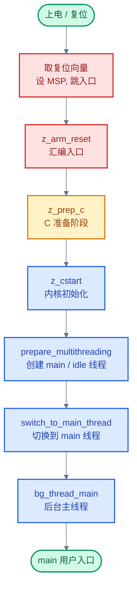
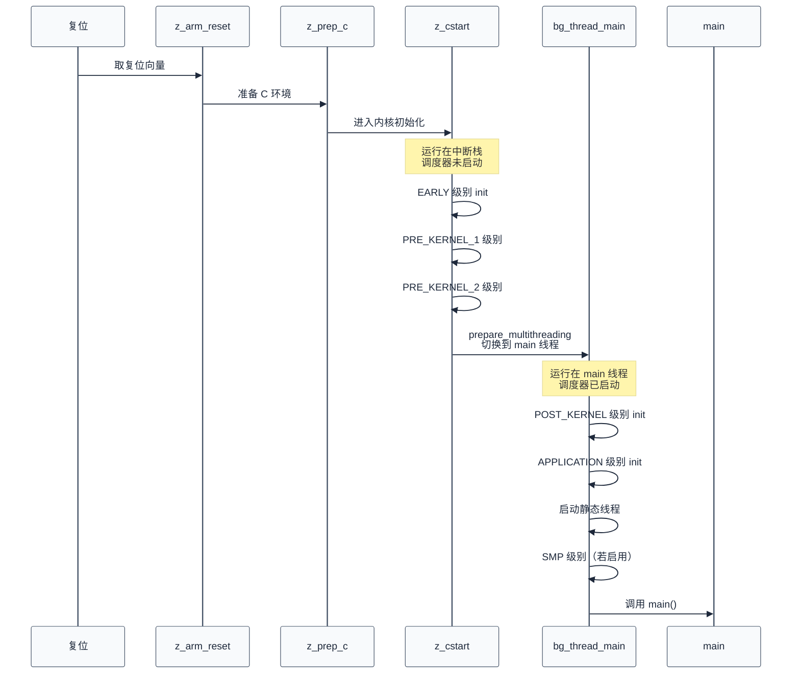
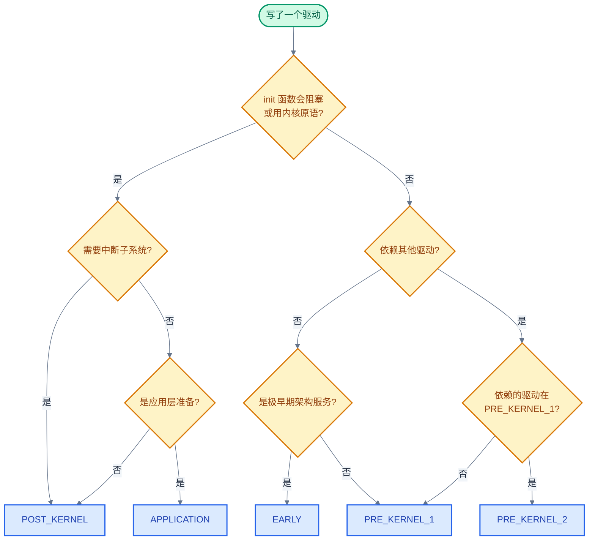

# 04. Zephyr 内核启动与初始化

> 一句话概括：本文从"上电后第一条指令"出发，沿复位向量 → 汇编入口 → `z_cstart()` → `bg_thread_main()` → `main()` 这条主线，剖析 Zephyr 的初始化级别、设备自动初始化机制以及链接脚本段的作用。
> **工程师视角**：读完后你应当能回答"为什么分多个初始化级别"、"为什么 `PRE_KERNEL_1` 阶段不能用信号量"、"为什么设备初始化用链接脚本段而非注册函数"三个问题，并能为自己写的驱动选择正确的级别与优先级。

### 关键术语

| 缩写 | 全称 | 含义 |
|------|------|------|
| Bootloader | — | 引导加载程序，在 Zephyr 之前运行的固件，负责加载镜像或跳转到入口 |
| Reset Vector | — | 复位向量，CPU 上电后取指的第一个异常表项，包含栈顶与入口地址 |
| VTOR | Vector Table Offset Register | 向量表偏移寄存器，Cortex-M 用于重定位异常向量表 |
| MSP | Main Stack Pointer | 主栈指针，复位后默认使用，内核初始化阶段的中断栈 |
| PSP | Process Stack Pointer | 进程栈指针，线程模式下使用 |
| BSS | Block Started by Symbol | 未初始化静态变量段，启动时需清零 |
| XIP | eXecute In Place | 片内执行，代码直接在 Flash 运行，无需拷贝到 RAM |
| ISR Stack | Interrupt Service Routine Stack | 中断栈，内核初始化阶段与 ISR 共用的栈 |
| Init Level | Initialization Level | 初始化级别，Zephyr 把启动过程划分为 6 个有序级别 |
| EARLY | — | 最早初始化级别，刚进入 C 域、架构初始化之前 |
| PRE_KERNEL_1 | — | 内核初始化级别 1，内核服务尚未可用，运行在中断栈 |
| PRE_KERNEL_2 | — | 内核初始化级别 2，依赖 PRE_KERNEL_1 设备的就绪 |
| POST_KERNEL | — | 内核已存活，可使用内核原语，运行在 main 线程上下文 |
| APPLICATION | — | 应用层初始化级别，`main()` 调用前的最后阶段 |
| SMP | Symmetric Multi-Processing | 多核初始化级别，仅在 `CONFIG_SMP` 启用时存在 |
| DEVICE_DEFINE | — | 创建 `struct device` 并注册到自动初始化序列的宏 |
| DEVICE_DT_DEFINE | — | 从设备树节点创建 `struct device` 的宏 |
| SYS_INIT | — | 注册无设备的纯初始化函数的宏 |
| init_entry | — | 初始化条目结构体，链接脚本段中每个条目记录一个 init 函数或设备 |

---

### 前置阅读

| 需要了解 | 参考文档 |
|----------|----------|
| 设备树节点与 `compatible` 匹配 | [03-设备树详解](./03-设备树详解.md) |
| 分层架构与 `struct device` 概览 | [00-入门概览](./00-入门概览.md) |

---

## 1. 概述：启动序列的本质

> 上一篇 [03-设备树详解](./03-设备树详解.md) 解决了"硬件描述如何进入镜像"的问题。但镜像被烧录到 Flash 后，CPU 上电的第一条指令从哪里来？内核尚未存在时，谁负责把内核"建"起来？本章用一个 5 步小例子先建立启动序列的整体心智模型，再在后续章节逐层剖析。

### 1.1 一个具体场景：从上电到 main 的 5 步

想象一块 Cortex-M 开发板，刚才按下了复位按键。CPU 现在的状态是：寄存器是复位默认值、RAM 内容未定义、Flash 里的 Zephyr 镜像原封不动。要让 `main()` 跑起来，CPU 必须完成下面 5 步：

1. **取复位向量**：CPU 从 `0x00000000` 读一个字作为初始 MSP，从 `0x00000004` 读一个字作为入口地址（PC），跳转过去执行
2. **汇编入口**：入口地址指向 `z_arm_reset`。它设置 MSP/PSP、禁用中断、可选地清栈、调用 `z_prep_c`
3. **进入 C 域**：`z_prep_c` 重定位向量表、清零 BSS、拷贝 `.data`（XIP 场景）、初始化 FPU 与中断控制器，然后调用 `z_cstart`
4. **内核初始化**：`z_cstart` 跑 `EARLY`/`PRE_KERNEL_1`/`PRE_KERNEL_2` 三个级别的 init 函数，构造 main 线程与 idle 线程，切换到 main 线程
5. **后台主线程**：`bg_thread_main` 跑 `POST_KERNEL`/`APPLICATION` init 函数、启动静态线程、（SMP 场景）启动次核、最后调用 `main()`

> **核心要点**：启动序列的本质是"从无内核到有内核"——前两步没有任何内核抽象，连栈都要汇编自己设；第三步进入 C 但仍是"裸 C"，没有调度器、没有线程；第四步才开始构造内核对象；第五步才在真正的线程上下文里调用用户 `main`。

### 1.2 启动序列的分层



> **如何读这张图**：颜色由绿→红→黄→蓝表示从硬件到应用的层次。红色是架构相关代码（每种 CPU 架构一份），黄色是架构到 C 的过渡，蓝色是架构无关的内核 C 代码。`z_cstart` 之前的代码每条架构都不同，`z_cstart` 之后则统一。

### 1.3 适用范围

本文以 ARM Cortex-M 为主要示例架构，因为它最常见且启动路径最直观。其他架构（RISC-V、x86、ARC、Xtensa）的复位向量、向量表格式、栈设置细节不同，但整体流程一致：复位 → 汇编入口 → `z_prep_c` 等价物 → `z_cstart`。源码位置见各架构目录下的 `reset.S` 与 `prep_c.c`。

---

## 2. 架构相关启动：从复位向量到 C 入口

> 上一章给出了 5 步总览。一个自然的问题是：CPU 上电后到底怎么找到 Zephyr 的入口？为什么需要一段汇编，不能直接进 C？本章用 Cortex-M 的源码回答这两个问题——先讲向量表，再讲汇编入口，最后讲 `z_prep_c` 如何完成从汇编到 C 的过渡。

### 2.1 复位向量表

Cortex-M 的异常向量表是一张函数指针数组，放在镜像最起始位置。第 0 项是初始 MSP，第 1 项是复位处理函数地址。CPU 上电后硬件自动从 `0x00000000` 读 MSP、从 `0x00000004` 读 PC，跳转到复位处理函数。

Zephyr 的向量表定义在 [arch/arm/core/cortex_m/vector_table.S](file:///home/pbw/rtos/cs-learning-notes/zephyr-project/zephyr/arch/arm/core/cortex_m/vector_table.S#L32-L44)：

```asm
SECTION_SUBSEC_FUNC(exc_vector_table,_vector_table_section,_vector_table)

    /* setting the _very_ early boot on the main stack allows to use memset
     * on the interrupt stack when CONFIG_INIT_STACKS is enabled before
     * switching to the interrupt stack for the rest of the early boot
     */
    .word z_main_stack + CONFIG_MAIN_STACK_SIZE

    .word z_arm_reset
    .word z_arm_nmi

    .word z_arm_hard_fault
```

`.word z_main_stack + CONFIG_MAIN_STACK_SIZE` 是初始 MSP——指向 `z_main_stack`（main 线程栈）的栈顶。`.word z_arm_reset` 是复位入口地址，CPU 上电后从这里开始执行。

> **核心要点**：复位向量是 CPU 与 Zephyr 的"接头地点"。CPU 只认这张表，表里写谁就跳谁。这意味着只要改镜像起始处的两个字，就能换掉初始栈和入口函数——这就是 Bootloader 链式加载的工作方式。

### 2.2 汇编入口 z_arm_reset

`z_arm_reset` 在 [arch/arm/core/cortex_m/reset.S](file:///home/pbw/rtos/cs-learning-notes/zephyr-project/zephyr/arch/arm/core/cortex_m/reset.S#L83-L233)。它的工作是给 C 代码准备一个最小可用的环境，主要步骤编号如下：

1. 设置 MSP 指向 `z_main_stack + CONFIG_MAIN_STACK_SIZE`，保证栈可用
2. 清 `z_sys_post_kernel` 标志（仅 `CONFIG_DEBUG_THREAD_INFO` 时）
3. 调用 `soc_reset_hook`（若启用）—— SoC 厂商的自定义复位代码
4. 禁用中断：`cpsid i` 或设置 `BASEPRI`，保证初始化期间不被打断
5. 调用 `z_arm_watchdog_init`（若 `CONFIG_WDOG_INIT`）
6. 可选清栈：把 `z_interrupt_stacks` 填 `0xaa`（`CONFIG_INIT_STACKS`）
7. 设置 PSP 指向 `z_interrupt_stacks` 栈顶，切换到 PSP 运行
8. 跳转到 `z_prep_c`

第 7 步是关键：切换到 PSP 后，MSP 就空出来了，可以稍后设为中断栈；PSP 上的代码后续会进入 `z_cstart`，再切到 main 线程自己的栈。


> **如何读这张图**：三个菱形是 Kconfig 控制的可选路径，矩形是固定步骤。注意每条路径最终都汇合到 `z_prep_c`——汇编入口的工作就是"为 C 准备最小环境"，环境备好就立刻交给 C。

### 2.3 z_prep_c：从汇编到 C 的过渡

`z_prep_c` 在 [arch/arm/core/cortex_m/prep_c.c](file:///home/pbw/rtos/cs-learning-notes/zephyr-project/zephyr/arch/arm/core/cortex_m/prep_c.c#L198-L223)。它做 5 件事：

```c
FUNC_NORETURN void z_prep_c(void)
{
	soc_prep_hook();                  // 1. SoC 预准备钩子

	relocate_vector_table();          // 2. 重定位向量表（设 VTOR）
#if defined(CONFIG_CPU_HAS_FPU)
	z_arm_floating_point_init();      // 3. FPU 初始化
#endif
	arch_bss_zero();                  // 4. 清零 BSS 段
	arch_data_copy();                 // 5. 拷贝 .data 到 RAM（XIP 场景）
#if defined(CONFIG_ARM_CUSTOM_INTERRUPT_CONTROLLER)
	z_soc_irq_init();
#else
	z_arm_interrupt_init();           // 6. 初始化中断控制器
#endif
#if CONFIG_ARCH_CACHE
	arch_cache_init();                // 7. cache 初始化
#endif
	z_cstart();                       // 8. 进入内核初始化
	CODE_UNREACHABLE;
}
```

**为什么需要 `z_prep_c` 而不直接在汇编里调 `z_cstart`**：C 语言假设 BSS 已清零、`.data` 已就位、栈可用。汇编入口只设了栈，没动 BSS 和 `.data`——这两件事用 C 写更可读、可移植，但必须先有一段"准备 C 环境"的代码。`z_prep_c` 就是这段代码。

**`relocate_vector_table` 做什么**：Cortex-M 的 VTOR 寄存器允许向量表放在任意对齐地址。XIP 镜像在 Flash 时向量表在 Flash 起点；如果配置 `CONFIG_SRAM_VECTOR_TABLE`，此函数把向量表拷到 SRAM 并把 VTOR 指向 SRAM 副本——加快异常响应、允许运行时改 ISR。

> **核心要点**：架构相关启动的产物是"一个能跑 C 的最小环境"——栈已设、BSS 已清、`.data` 已就位、向量表已定位、中断控制器就绪。剩下的工作交给架构无关的 `z_cstart`。

---

## 3. z_cstart() 到 bg_thread_main()：内核初始化主流程

> 上一章把启动推进到 `z_cstart` 入口。此时 CPU 已能跑 C 代码，但内核对象尚未构造、调度器尚未启动、main 线程尚不存在。本章回答："内核是怎么把自己建起来的？" 答案分两段：`z_cstart` 在中断栈上跑前三个 init 级别，然后构造 main 线程并切换过去；`bg_thread_main` 在 main 线程上下文跑后三个级别，最终调用 `main()`。

### 3.1 z_cstart() 主流程

`z_cstart` 在 [kernel/init.c](file:///home/pbw/rtos/cs-learning-notes/zephyr-project/zephyr/kernel/init.c#L538-L610)。主要步骤：

1. `gcov_static_init()`—— 代码覆盖率钩子
2. `z_sys_init_run_level(INIT_LEVEL_EARLY)`—— 跑 EARLY 级别所有 init 函数
3. `arch_kernel_init()`—— 架构相关内核初始化
4. `LOG_CORE_INIT()`—— 日志子系统核心初始化
5. `z_dummy_thread_init(&_thread_dummy)`（多线程时）—— 创建一个"假线程"作为当前上下文，让后续代码能引用 `k_current_get()`
6. `z_device_state_init()`—— 初始化所有 `struct device` 的 state 字段
7. `soc_early_init_hook()` / `board_early_init_hook()`
8. `z_sys_init_run_level(INIT_LEVEL_PRE_KERNEL_1)`—— 跑 PRE_KERNEL_1 级别
9. `arch_smp_init()`（若 SMP）
10. `z_sys_init_run_level(INIT_LEVEL_PRE_KERNEL_2)`—— 跑 PRE_KERNEL_2 级别
11. 初始化栈金丝雀（若 `CONFIG_REQUIRES_STACK_CANARIES`）
12. `timing_init()` / `timing_start()`（若启用）
13. `switch_to_main_thread(prepare_multithreading())`—— 构造 main/idle 线程并切换过去，**不再返回**

```c
__boot_func
FUNC_NORETURN void z_cstart(void)
{
	gcov_static_init();
	z_sys_init_run_level(INIT_LEVEL_EARLY);   // 步骤 2
	arch_kernel_init();                       // 步骤 3
	LOG_CORE_INIT();
#if defined(CONFIG_MULTITHREADING)
	z_dummy_thread_init(&_thread_dummy);      // 步骤 5
#endif
	z_device_state_init();                    // 步骤 6
	soc_early_init_hook();
	board_early_init_hook();
	z_sys_init_run_level(INIT_LEVEL_PRE_KERNEL_1);  // 步骤 8
#if defined(CONFIG_SMP)
	arch_smp_init();
#endif
	z_sys_init_run_level(INIT_LEVEL_PRE_KERNEL_2);  // 步骤 10
	/* ... 栈金丝雀、timing 初始化 ... */
	switch_to_main_thread(prepare_multithreading());  // 步骤 13
	CODE_UNREACHABLE;
}
```

注意第 5 步的"假线程" `_thread_dummy`：此时调度器还没启动，没有真正的线程，但部分内核代码（如日志、断言）会调用 `k_current_get()`。Zephyr 用一个 dummy 线程占位，让这些调用不崩。

### 3.2 prepare_multithreading：构造 main 与 idle 线程

`prepare_multithreading` 在 [kernel/init.c](file:///home/pbw/rtos/cs-learning-notes/zephyr-project/zephyr/kernel/init.c#L442-L473)：

```c
__boot_func
static char *prepare_multithreading(void)
{
	char *stack_ptr;

	z_sched_init();                          // 1. 初始化调度器数据结构
#ifndef CONFIG_SMP
	_kernel.ready_q.cache = &z_main_thread;  // 2. 主线程预填入调度缓存
#endif
	stack_ptr = z_setup_new_thread(&z_main_thread, z_main_stack,
				       K_THREAD_STACK_SIZEOF(z_main_stack),
				       bg_thread_main,                 // 3. 创建 main 线程
				       NULL, NULL, NULL,
				       CONFIG_MAIN_THREAD_PRIORITY,
				       K_ESSENTIAL, "main");
	z_mark_thread_as_not_sleeping(&z_main_thread);
	z_ready_thread(&z_main_thread);          // 4. main 线程入就绪队列

	z_init_cpu(0);                           // 5. 初始化 0 号 CPU：创建 idle 线程、设中断栈

	return stack_ptr;
}
```

`z_init_cpu(0)` 做了三件事：调用 `init_idle_thread(0)` 创建 idle 线程、把 idle 线程指针存进 `_kernel.cpus[0].idle_thread`、把 `z_interrupt_stacks[0]` 栈顶存进 `_kernel.cpus[0].irq_stack`——这一步把 MSP 切换的目标准备好。

`switch_to_main_thread` 最终调用 `z_swap_unlocked()` 触发上下文切换：保存当前 dummy 上下文、加载 main 线程的寄存器、跳到 `bg_thread_main`。从此代码运行在 main 线程上下文，栈是 `z_main_stack`，调度器已启动。

### 3.3 bg_thread_main：内核存活后的主流程

`bg_thread_main` 在 [kernel/init.c](file:///home/pbw/rtos/cs-learning-notes/zephyr-project/zephyr/kernel/init.c#L283-L359)。从这里开始，代码运行在真正的线程上下文，所有内核原语可用：

1. `z_mem_manage_init()`（MMU 启用时）
2. `z_sys_post_kernel = true`—— 标记"内核已存活"，`k_is_pre_kernel()` 从此返回 false
3. `arch_irq_offload_init()`（若 `CONFIG_IRQ_OFFLOAD`）
4. `z_sys_init_run_level(INIT_LEVEL_POST_KERNEL)`—— **跑 POST_KERNEL 级别**
5. `soc_late_init_hook()` / `board_late_init_hook()`
6. `boot_banner()`—— 打印启动 banner
7. `z_static_init_gnu()`（若 `CONFIG_STATIC_INIT_GNU`）—— 跑 GCC 风格的 `__init_array`
8. `z_sys_init_run_level(INIT_LEVEL_APPLICATION)`—— **跑 APPLICATION 级别**
9. `z_init_static_threads()`—— 启动所有 `K_THREAD_DEFINE` 定义的静态线程
10. `z_smp_init()` 与 `z_sys_init_run_level(INIT_LEVEL_SMP)`（SMP 启用时）—— 启动次核并跑 SMP 级别
11. `z_mem_manage_boot_finish()`（MMU 启用时）
12. 调用 `main()`
13. `z_thread_essential_clear(&z_main_thread)`—— main 退出后允许 main 线程被回收



> **如何读这张图**：注意中间的"切换"分界线——分界线之上运行在中断栈、调度器锁住、不能阻塞；分界线之下运行在 main 线程、调度器活跃、可以 `k_sleep` / `k_sem_take`。这条线就是 `PRE_KERNEL_2` 与 `POST_KERNEL` 的本质分界。

> **核心要点**：`z_cstart` 与 `bg_thread_main` 的分界就是"内核是否存活"。`z_cstart` 在中断栈上把内核对象构造好、调度器启动、main 线程就绪；`bg_thread_main` 在 main 线程上下文跑后续 init、启动静态线程、最后交棒给 `main`。

---

## 4. 初始化级别详解

> 上一章多次提到 EARLY / PRE_KERNEL_1 / PRE_KERNEL_2 / POST_KERNEL / APPLICATION / SMP 六个级别，但没有展开。一个自然的问题是：为什么要分这么多级别？为什么不能像 U-Boot 那样一个 init 序列跑到底？本章用对比表与"为什么"解释回答这些问题。

### 4.1 六个级别对比

下表来自 [include/zephyr/init.h](file:///home/pbw/rtos/cs-learning-notes/zephyr-project/zephyr/include/zephyr/init.h#L20-L46)的官方注释与 [kernel/init.c](file:///home/pbw/rtos/cs-learning-notes/zephyr-project/zephyr/kernel/init.c#L126-L135)的 `enum init_level`：

| 级别 | 序号 | 运行上下文 | 内核原语 | 典型用途 |
|------|------|-----------|---------|---------|
| **EARLY** | 0 | 中断栈，进入 C 域后立即 | 几乎不可用 | 架构/SoC 极早期需要的服务 |
| **PRE_KERNEL_1** | 1 | 中断栈 | 不可用 | 无依赖的纯硬件驱动：时钟、中断控制器、entropy |
| **PRE_KERNEL_2** | 2 | 中断栈 | 不可用 | 依赖 PRE_KERNEL_1 设备的驱动 |
| **POST_KERNEL** | 3 | main 线程 | 全部可用 | 需要内核原语的驱动、子系统初始化 |
| **APPLICATION** | 4 | main 线程 | 全部可用 | 应用层初始化，`main()` 之前 |
| **SMP** | 5 | main 线程 | 全部可用 | 次核启动后才跑的初始化 |

> **如何读这张表**：第二列"序号"对应 `enum init_level` 的整数值，决定了 `z_sys_init_run_level` 数组的索引顺序。第三列"运行上下文"是关键——PRE_KERNEL_* 与 POST_KERNEL 的分界线就是"调度器是否启动"。第四列"内核原语"决定了你能不能用 `k_sem_take`、`k_malloc` 等会阻塞或依赖调度器的 API。

### 4.2 为什么分多个级别

**为什么不用一个序列跑到底**：因为初始化之间存在**依赖关系**。

- GPIO 驱动初始化前，时钟驱动必须先跑——否则 GPIO 时钟没开
- I2C 传感器驱动初始化前，I2C 控制器驱动必须先跑——否则总线不通
- 子系统初始化前，调度器必须启动——否则子系统可能用 `k_work_submit`、信号量等会阻塞的 API

如果只有一个序列，每个 init 函数都得自己声明依赖、自己排序，复杂度爆炸。Zephyr 用 6 个粗粒度级别 + 级别内 0-999 的细粒度优先级，把依赖关系收敛到"选哪个级别"这个简单决策上：

- 不依赖任何东西的硬件驱动 → `PRE_KERNEL_1`
- 依赖 `PRE_KERNEL_1` 设备的驱动 → `PRE_KERNEL_2`
- 需要内核原语的驱动/子系统 → `POST_KERNEL`
- 应用层准备 → `APPLICATION`

> **核心要点**：初始化级别是"依赖顺序的离散化"——把"内核对象 → 调度器 → 设备 → 应用"这条依赖链切成 6 段，每段内的 init 函数按优先级排序。这样开发者只需声明"我依赖哪一段的产物"，链接器与 `z_sys_init_run_level` 自动保证顺序。

### 4.3 为什么 PRE_KERNEL_1 阶段不能用信号量

这是 RTOS 启动设计中最容易踩的坑。在 `PRE_KERNEL_1` 阶段，下面这些 API 都**不能**调用：

- `k_sem_take(timeout)`（非 `K_NO_WAIT`）
- `k_mutex_lock(timeout)`
- `k_sleep()`
- `k_yield()`
- `k_malloc()`（取决于配置）
- 任何会触发调度的 API

**原因**：`PRE_KERNEL_1` 跑在中断栈上，调度器尚未启动（`z_sched_init` 在 `prepare_multithreading` 里调用，发生在 `PRE_KERNEL_2` 之后）。此时没有真正的线程上下文，`k_sem_take` 阻塞意味着"把当前线程挂起、切换到其他线程"——但当前根本不是线程（是 dummy 线程），也没有其他线程可切。

`k_sem_give` 在 `PRE_KERNEL_1` 中"通常"能用——它不会阻塞，只是增加计数器、可能触发调度（但调度器没启动就不会真切换）。但官方推荐避免在 `PRE_KERNEL_1` 用任何会触发 `z_swap` 的 API。

**如果驱动初始化时需要等待硬件就绪怎么办**：用忙等 `k_busy_wait` 而非 `k_sleep`；用轮询寄存器而非中断 + 信号量；或者把驱动初始化推迟到 `POST_KERNEL`。

### 4.4 优先级：级别内的细粒度排序

每个级别内，init 函数按优先级（0-999）升序执行。优先级在 `DEVICE_DEFINE` 与 `SYS_INIT` 的第三个参数指定：

```c
/* 来自 include/zephyr/init.h */
#define SYS_INIT(init_fn, level, prio)
```

Zephyr 在 [kernel/init.c](file:///home/pbw/rtos/cs-learning-notes/zephyr-project/zephyr/kernel/init.c#L647-L651)就用 `SYS_INIT` 注册了两个对象核心列表的初始化：

```c
SYS_INIT(init_cpu_obj_core_list, PRE_KERNEL_1,
	 CONFIG_KERNEL_INIT_PRIORITY_OBJECTS);
SYS_INIT(init_kernel_obj_core_list, PRE_KERNEL_1,
	 CONFIG_KERNEL_INIT_PRIORITY_OBJECTS);
```

`CONFIG_KERNEL_INIT_PRIORITY_OBJECTS` 通常定义为 `30`，确保内核对象自身最先初始化。常用优先级常量见 [kernel/Kconfig.device](file:///home/pbw/rtos/cs-learning-notes/zephyr-project/zephyr/kernel/Kconfig.device) 中的 `KERNEL_INIT_PRIORITY_*` 系列（Kconfig 选项，使用时写作 `CONFIG_KERNEL_INIT_PRIORITY_*`）：

| 常量 | 典型值 | 用途 |
|------|--------|------|
| `KERNEL_INIT_PRIORITY_OBJECTS` | 30 | 内核对象自身 |
| `KERNEL_INIT_PRIORITY_DEFAULT` | 40 | 默认设备优先级 |
| `KERNEL_INIT_PRIORITY_DEVICE` | 50 | 通用设备 |
| `APPLICATION_INIT_PRIORITY` | 90 | 级别内最末 |

**优先级必须是十进制字面量**，不能是表达式（如 `CONFIG_KERNEL_INIT_PRIORITY_DEFAULT + 5` 不允许）。这是为了让链接脚本能用 `SORT` 按字符串排序段名（见下一章 §5.2）。

### 4.5 检测当前级别

运行时可以用两个工具判断当前处于哪个阶段：

- `k_is_pre_kernel()`：在 `POST_KERNEL` 之前返回 true，之后返回 false
- `z_sys_post_kernel` 全局变量：`bg_thread_main` 在跑 `POST_KERNEL` 之前置 true（[kernel/init.c](file:///home/pbw/rtos/cs-learning-notes/zephyr-project/zephyr/kernel/init.c#L297)）

驱动有时会在 API 实现里用 `k_is_pre_kernel()` 走不同分支——例如 `PRE_KERNEL_1` 阶段调用的 GPIO 驱动可能不支持中断（中断子系统未就绪），运行时被应用调用则支持中断。

> **核心要点**：六个级别不是装饰，而是"依赖关系的离散投影"。`PRE_KERNEL_*` 与 `POST_KERNEL` 的分界是调度器是否启动——这条线决定了你能不能阻塞、能不能用信号量、能不能 `k_sleep`。选错级别是新手最常见的启动崩溃原因。

---

## 5. 设备自动初始化机制

> 上一章讲了级别，但没讲"init 函数怎么被自动调用"。一个常见困惑是：我写了 `DEVICE_DEFINE(...)` 但没在任何地方显式调用它的 init 函数，内核怎么知道要跑它？答案是**链接脚本段**——`DEVICE_DEFINE` 与 `SYS_INIT` 把每个 init 条目放到一个特殊段里，链接器按级别+优先级排序段名，`z_cstart` 与 `bg_thread_main` 用 `__init_start[]` 数组遍历这个段。本章剖析这条链路。

### 5.1 三个宏的对比

Zephyr 提供三个注册自动初始化的宏，定义在 [include/zephyr/device.h](file:///home/pbw/rtos/cs-learning-notes/zephyr-project/zephyr/include/zephyr/device.h) 与 [include/zephyr/init.h](file:///home/pbw/rtos/cs-learning-notes/zephyr-project/zephyr/include/zephyr/init.h)：

| 宏 | 是否创建 device | 来源 | 典型用途 |
|------|----------------|------|---------|
| **`DEVICE_DEFINE`** | 是 | 手动指定 dev_id 与 name | 不来自设备树的软件设备 |
| **`DEVICE_DT_DEFINE`** | 是 | 设备树节点 | 来自设备树的硬件驱动（推荐） |
| **`DEVICE_DT_INST_DEFINE`** | 是 | 设备树 compatible 实例 | 同一 compatible 的多实例驱动 |
| **`SYS_INIT`** | 否 | 纯函数 | 不需要设备对象的初始化（如内核对象列表） |

签名对比（精简）：

```c
/* include/zephyr/device.h */
#define DEVICE_DEFINE(dev_id, name, init_fn, pm, data, config, level, prio, api)

/* include/zephyr/device.h */
#define DEVICE_DT_DEFINE(node_id, init_fn, pm, data, config, level, prio, api, ...)

/* include/zephyr/init.h */
#define SYS_INIT(init_fn, level, prio)
```

`DEVICE_DEFINE` 与 `DEVICE_DT_DEFINE` 的区别在于：前者用开发者指定的 `dev_id` 作为设备符号名，后者从设备树节点的依赖序号自动生成符号名（`__device_dts_ord_<N>`）。后者还能让应用通过 `DEVICE_DT_GET(node_id)` 直接拿到设备指针，无需 `device_get_binding` 字符串查找。

### 5.2 struct init_entry 与链接脚本段

无论用哪个宏，最终都生成一个 `struct init_entry` 结构体放到链接脚本段里。结构体定义在 [include/zephyr/init.h](file:///home/pbw/rtos/cs-learning-notes/zephyr-project/zephyr/include/zephyr/init.h#L66-L77)：

```c
struct init_entry {
	int (*init_fn)(void);       /* SYS_INIT 时存函数指针 */
	const struct device *dev;   /* DEVICE_DEFINE 时存设备指针 */
};
```

两个字段互斥：`SYS_INIT` 注册的条目 `dev = NULL`、`init_fn` 非 NULL；`DEVICE_DEFINE` 注册的条目 `dev` 非 NULL、`init_fn` 为 NULL。`z_sys_init_run_level` 根据这个区分调用谁。

段名由 `Z_INIT_ENTRY_SECTION` 宏决定，定义在 [include/zephyr/init.h](file:///home/pbw/rtos/cs-learning-notes/zephyr-project/zephyr/include/zephyr/init.h#L111-L113)：

```c
#define Z_INIT_ENTRY_SECTION(level, prio, sub_prio) \
	__attribute__((__section__( \
		".z_init_" #level "_P_" STRINGIFY(prio) "_SUB_" STRINGIFY(sub_prio)"_")))
```

例如 `SYS_INIT(my_init, POST_KERNEL, 50)` 会展开成：

```c
static const Z_DECL_ALIGN(struct init_entry)
	__attribute__((section(".z_init_POST_KERNEL_P_50_SUB_0_")))
	__used __noasan
	__init_my_init = { .init_fn = my_init, .dev = NULL };
```

段名 `.z_init_POST_KERNEL_P_50_SUB_0_` 编码了级别（`POST_KERNEL`）、优先级（`50`）、子优先级（`0`）。链接器按段名字典序排序，自然得到正确执行顺序。

### 5.3 链接脚本：CREATE_OBJ_LEVEL 的作用

链接脚本在 [include/zephyr/linker/common-rom/common-rom-kernel-devices.ld](file:///home/pbw/rtos/cs-learning-notes/zephyr-project/zephyr/include/zephyr/linker/common-rom/common-rom-kernel-devices.ld#L5-L21)：

```ld
SECTION_PROLOGUE(initlevel,,)
{
	PLACE_SYMBOL_HERE(__init_start);
	CREATE_OBJ_LEVEL(init, EARLY)
	CREATE_OBJ_LEVEL(init, PRE_KERNEL_1)
	CREATE_OBJ_LEVEL(init, PRE_KERNEL_2)
	CREATE_OBJ_LEVEL(init, POST_KERNEL)
	CREATE_OBJ_LEVEL(init, APPLICATION)
	CREATE_OBJ_LEVEL(init, SMP)
	PLACE_SYMBOL_HERE(__init_end);
} GROUP_ROM_LINK_IN(RAMABLE_REGION, ROMABLE_REGION)
```

`CREATE_OBJ_LEVEL` 宏在 [include/zephyr/linker/linker-defs.h](file:///home/pbw/rtos/cs-learning-notes/zephyr-project/zephyr/include/zephyr/linker/linker-defs.h#L70-L75)展开：

```ld
#define CREATE_OBJ_LEVEL(object, level)				\
		PLACE_SYMBOL_HERE(__##object##_##level##_start);\
		KEEP(*(SORT(.z_##object##_##level##_P_?_*)));	\
		KEEP(*(SORT(.z_##object##_##level##_P_??_*)));	\
		KEEP(*(SORT(.z_##object##_##level##_P_???_*)));
```

它做三件事：

1. 在每个级别起始处放一个符号（如 `__init_PRE_KERNEL_1_start`）
2. 用 `SORT` 按段名字典序收集 1 位、2 位、3 位优先级的段（`?_` / `??_` / `???_` 分别匹配 0-9、10-99、100-999）
3. `KEEP` 防止链接器因"无引用"丢弃这些段

字典序排序能正确得到数值顺序，前提是**优先级必须是定宽十进制字面量**——这就是 §4.4 为什么不允许表达式的根本原因。`SORT` 是字符串排序，`"50"` 排在 `"100"` 之后（因为 `'5' > '1'`），但因为优先级范围是 0-999，链接脚本分别匹配 1/2/3 位优先级段，按 `?_` → `??_` → `???_` 顺序合并，自然得到数值升序。

链接脚本末尾还有一个 `initlevel_error` 段：

```ld
SECTION_PROLOGUE(initlevel_error,,)
{
	KEEP(*(SORT(.z_init_*)))
}
ASSERT(SIZEOF(initlevel_error) == 0, "Undefined initialization levels used.")
```

它收集所有未被 `CREATE_OBJ_LEVEL` 匹配的 `.z_init_*` 段，并用 `ASSERT` 断言这个段大小为 0。如果你在 `SYS_INIT` 里写了一个不存在的级别（如 `POST_KERNEL_3`），链接器会报错"Undefined initialization levels used"。

### 5.4 __init_start[] 与 z_sys_init_run_level 的循环

`z_sys_init_run_level` 在 [kernel/init.c](file:///home/pbw/rtos/cs-learning-notes/zephyr-project/zephyr/kernel/init.c#L220-L250)：

```c
static void z_sys_init_run_level(enum init_level level)
{
	static const struct init_entry *levels[] = {
		__init_EARLY_start,
		__init_PRE_KERNEL_1_start,
		__init_PRE_KERNEL_2_start,
		__init_POST_KERNEL_start,
		__init_APPLICATION_start,
#ifdef CONFIG_SMP
		__init_SMP_start,
#endif
		__init_end,    /* End marker */
	};
	const struct init_entry *entry;

	for (entry = levels[level]; entry < levels[level+1]; entry++) {
		const struct device *dev = entry->dev;
		int result = 0;

		sys_trace_sys_init_enter(entry, level);
		if (dev != NULL) {
			if ((dev->flags & DEVICE_FLAG_INIT_DEFERRED) == 0U) {
				result = do_device_init(dev);
			}
		} else {
			result = entry->init_fn();
		}
		sys_trace_sys_init_exit(entry, level, result);
	}
}
```

逻辑很简单：根据 `level` 取起止指针 `levels[level]` 与 `levels[level+1]`，遍历这段内存里所有 `struct init_entry`，对每个条目：

- 如果 `dev != NULL`：是设备，调用 `do_device_init(dev)`（除非标记为 `DEVICE_FLAG_INIT_DEFERRED` 延迟初始化）
- 如果 `dev == NULL`：是 `SYS_INIT`，直接调用 `entry->init_fn()`

`do_device_init` 在 [kernel/device.c](file:///home/pbw/rtos/cs-learning-notes/zephyr-project/zephyr/kernel/device.c#L18-L61)：

```c
int do_device_init(const struct device *dev)
{
	int rc = 0;

	if (dev->ops.init != NULL) {
		rc = dev->ops.init(dev);
		if (rc != 0) {
			/* 记录正 errno 到 dev->state->init_res */
			if (rc < 0) {
				rc = -rc;
			}
			if (rc > UINT8_MAX) {
				rc = UINT8_MAX;
			}
			dev->state->init_res = rc;
		}
	}

	dev->state->initialized = true;   /* 标记已调用 init */

	if (rc == 0) {
		(void)pm_device_runtime_auto_enable(dev);
	}

	return -rc;  /* 返回 0 或负 errno */
}
```

注意`dev->state->initialized = true`：**无论 init 成功还是失败都置 true**。这意味着失败的设备不会被自动重试。应用层可以通过 `device_is_ready(dev)` 检查设备是否就绪——它内部检查 `initialized && init_res == 0`。

### 5.5 为什么用链接脚本段而非注册函数

这是 Zephyr 设计中一个有意识的权衡。设想的"注册函数方案"是：

```c
/* 假想的方案：运行时注册 */
void my_driver_init(void) {
	register_init(my_init_fn, POST_KERNEL, 50);
}
```

对比三种方案：

| 维度 | 链接脚本段（Zephyr 选用） | 运行时注册函数 | 构造函数（GCC `__attribute__((constructor))`） |
|------|------------------------|---------------|---------------------------------------------|
| **顺序确定时机** | 链接时 | 运行时（需先跑注册器） | 链接时（但跨编译单元顺序未指定） |
| **运行时开销** | 零额外 RAM、零额外调用 | 需要注册表 RAM、注册函数调用 | 零额外 RAM |
| **可裁剪** | 未引用的段被 `--gc-sections` 移除 | 注册代码必须条件编译 | 同上 |
| **依赖排序** | 链接器 `SORT` 按段名 | 注册器需自己排序 | 不可控 |
| **可观测性** | `west build -t initlevels` 直接看 | 需运行时打印 | 难以观察 |

**为什么 Zephyr 选链接脚本段**：

1. **编译时确定顺序**：链接器 `SORT` 一次性排好，启动时无需排序算法
2. **零运行时开销**：`struct init_entry` 数组在 ROM 里，不占 RAM，不需要注册调用
3. **可裁剪**：未启用的驱动源文件不参与编译，段自然不存在；启用的驱动即使没人引用，`KEEP` 也能保留
4. **可观测**：`west build -t initlevels` 直接 dump 链接后的 init 表，调试时一目了然

代价是：优先级必须是字面量（不能是表达式），且开发者需要理解链接脚本段的概念——但 RTOS 开发者本就该懂这些。

> **核心要点**：Zephyr 用"链接脚本段 + `__init_start[]` 遍历"实现自动初始化，本质是把"运行时排序"前移到"链接时排序"。代价是优先级必须是字面量，收益是零运行时开销、可裁剪、可观测。这是 RTOS"用编译时确定性换运行时性能"哲学的一个具体体现。

### 5.6 延迟初始化

某些设备不希望在启动时立即初始化——例如热插拔的 USB 设备，或者应用想自己控制初始化时机。Zephyr 提供 `zephyr,deferred-init` 设备树属性实现延迟初始化：

```dts
/ {
	a-driver@40000000 {
		reg = <0x40000000 0x1000>;
		zephyr,deferred-init;
	};
};
```

带这个属性的设备，`DEVICE_DT_DEFINE` 会设置 `DEVICE_FLAG_INIT_DEFERRED` 标志。`z_sys_init_run_level` 看到这个标志就跳过自动初始化（[kernel/init.c](file:///home/pbw/rtos/cs-learning-notes/zephyr-project/zephyr/kernel/init.c#L242)的 `if` 判断）。

应用稍后调用 `device_init(dev)` 显式初始化该设备，详见 [kernel/device.c](file:///home/pbw/rtos/cs-learning-notes/zephyr-project/zephyr/kernel/device.c#L63-L70)。`device_init` 内部检查 `dev->state->initialized`，若已初始化返回 `-EALREADY`，否则调用 `do_device_init`。

---

## 6. 实战：选择初始化级别与调试初始化失败

> 上一章讲了机制，本章回答工程师最常问的两个问题："我写的驱动该选哪个级别？""驱动 init 失败了怎么排查？" 本章给出决策树与具体调试步骤。

### 6.1 决策树：如何选择初始化级别



> **如何读这张图**：从顶部开始按问题回答。关键判断是"会不会阻塞"——任何会阻塞或依赖调度器的 init 必须放在 `POST_KERNEL` 或之后。"是否依赖其他驱动"决定 `PRE_KERNEL_1` 还是 `PRE_KERNEL_2`。

### 6.2 实战示例：一个 GPIO 驱动的选择

考虑一个简单的 GPIO 控制器驱动。它的 init 函数做四件事：开时钟、配置寄存器、注册 ISR、不阻塞。按决策树：

1. 不阻塞 → 进入右侧分支
2. 不依赖其他驱动 → 进入 `PRE_KERNEL_1` 还是 `EARLY`？
3. 不是极早期架构服务 → `PRE_KERNEL_1`

但如果它需要注册 ISR，而 ISR 注册依赖中断控制器初始化——中断控制器通常在 `PRE_KERNEL_1` 优先级 0 初始化。所以 GPIO 驱动应当用 `PRE_KERNEL_1` 且优先级 > 中断控制器优先级，或直接放 `PRE_KERNEL_2`。Zephyr 的 GPIO 子系统默认用 `POST_KERNEL` + `CONFIG_GPIO_INIT_PRIORITY`（默认 40，继承自 `KERNEL_INIT_PRIORITY_DEFAULT`），因为 GPIO 驱动经常需要等待 clock 子系统就绪。

### 6.3 调试：查看 init 顺序

最强大的调试工具是 `west build -t initlevels`。它在构建后 dump 链接器排好序的 init 表：

```bash
west build -b <board> -t initlevels
```

输出形如：

```
=== Initialized devices ===
level  prio   name                      init function
EARLY      0  _kernel                   init_cpu_obj_core_list
PRE_KERNEL_1 00  entropy                 entropy_esp32_init
PRE_KERNEL_1 00  clock                   clock_control_init
PRE_KERNEL_1 60  gpio_0                  gpio_esp32_init
PRE_KERNEL_2 40  uart_0                  uart_esp32_init
POST_KERNEL  40  i2c_0                   i2c_esp32_init
POST_KERNEL  60  sensor_0                my_sensor_init
APPLICATION  99  app_init                app_init_fn
```

如果某个驱动没出现在表里，说明它没被编译进镜像——检查 `Kconfig` 是否启用、`CMakeLists.txt` 是否包含源文件、设备树节点是否 `status = "okay"`。

### 6.4 调试：init 失败的排查

设备 init 失败时，`dev->state->init_res` 记录正 errno，`dev->state->initialized` 仍为 true。应用调用 `device_is_ready(dev)` 会返回 false。排查步骤：

1. **确认设备在 init 表里**：`west build -t initlevels` 看驱动是否列出
2. **在 init 函数加日志**：注意 `PRE_KERNEL_*` 阶段日志子系统可能未就绪，用 `printk` 而非 `LOG_INF`
3. **检查返回值**：init 函数应返回 0 成功、负 errno 失败。`do_device_init` 会把负值翻正存入 `init_res`
4. **运行时检查**：用 `device_is_ready(dev)` 在 `main` 入口检查关键设备
5. **常见错误模式**：

| 症状 | 可能原因 |
|------|---------|
| `init_res = -ENODEV` | 设备树节点 `status` 不是 `"okay"` |
| `init_res = -EINVAL` | 配置参数错（时钟频率、引脚号等） |
| `init_res = -EIO` | 硬件通信失败（I2C/SPI 总线无应答） |
| 系统启动时硬错 | `PRE_KERNEL_1` 阶段调用了阻塞 API |
| 设备不在 init 表 | Kconfig 未启用、源文件未加入 CMakeLists |

> **核心要点**：选择初始化级别的核心是"我会不会阻塞"与"我依赖什么"。`west build -t initlevels` 是排查启动问题的第一工具——它直接展示链接器排好的顺序，比读源码猜顺序快十倍。`device_is_ready()` 是运行时检查设备是否初始化成功的标准 API。

---

## 参考资料

- [Zephyr 驱动模型官方文档](../zephyr-project/zephyr/doc/kernel/drivers/index.rst) — Initialization Levels、Deferred initialization、System Drivers 章节
- [kernel/init.c](file:///home/pbw/rtos/cs-learning-notes/zephyr-project/zephyr/kernel/init.c) — 内核初始化主流程源码
- [include/zephyr/init.h](file:///home/pbw/rtos/cs-learning-notes/zephyr-project/zephyr/include/zephyr/init.h) — 初始化级别与 `SYS_INIT` 宏定义
- [include/zephyr/device.h](file:///home/pbw/rtos/cs-learning-notes/zephyr-project/zephyr/include/zephyr/device.h) — `DEVICE_DEFINE` / `DEVICE_DT_DEFINE` 宏定义
- [kernel/device.c](file:///home/pbw/rtos/cs-learning-notes/zephyr-project/zephyr/kernel/device.c) — `do_device_init` 与 `device_init` 实现
- [include/zephyr/linker/common-rom/common-rom-kernel-devices.ld](file:///home/pbw/rtos/cs-learning-notes/zephyr-project/zephyr/include/zephyr/linker/common-rom/common-rom-kernel-devices.ld) — init 段链接脚本
- [include/zephyr/linker/linker-defs.h](file:///home/pbw/rtos/cs-learning-notes/zephyr-project/zephyr/include/zephyr/linker/linker-defs.h) — `CREATE_OBJ_LEVEL` 宏
- [arch/arm/core/cortex_m/reset.S](file:///home/pbw/rtos/cs-learning-notes/zephyr-project/zephyr/arch/arm/core/cortex_m/reset.S) — Cortex-M 复位汇编入口
- [arch/arm/core/cortex_m/prep_c.c](file:///home/pbw/rtos/cs-learning-notes/zephyr-project/zephyr/arch/arm/core/cortex_m/prep_c.c) — Cortex-M C 准备阶段
- [arch/arm/core/cortex_m/vector_table.S](file:///home/pbw/rtos/cs-learning-notes/zephyr-project/zephyr/arch/arm/core/cortex_m/vector_table.S) — Cortex-M 异常向量表
- [Zephyr 官方文档](https://docs.zephyrproject.org/) — 在线文档

## 下一篇

[05-线程与状态迁移](./05-线程与状态迁移.md) — 本章末尾 main 线程已经被创建并切换过去，下一章详细剖析线程的生命周期、状态机与系统线程（main/idle）的内部结构。
