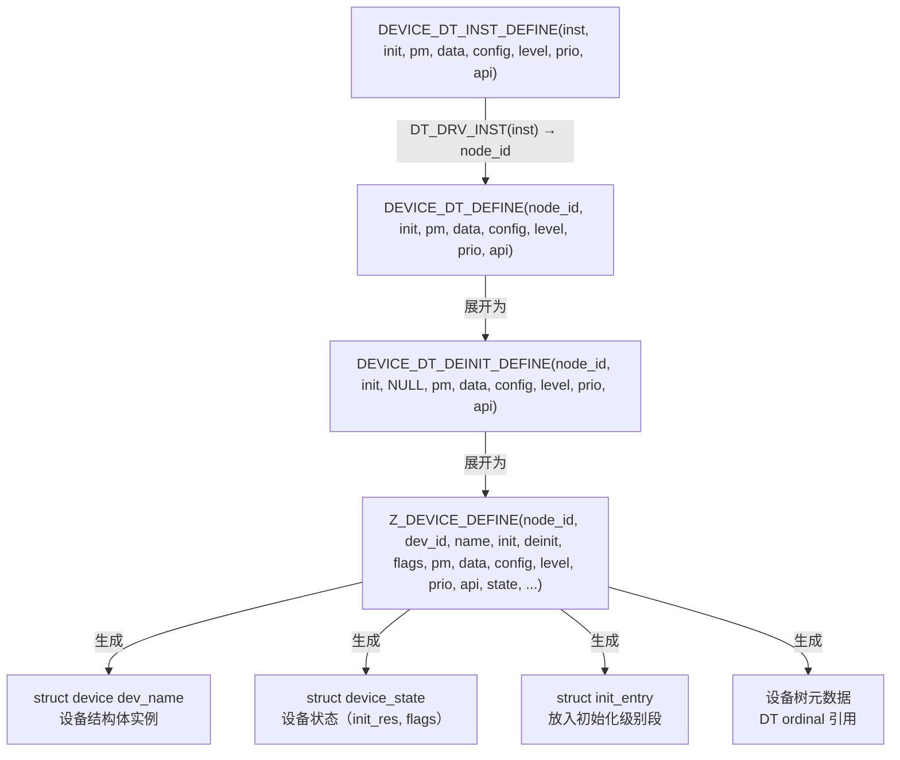
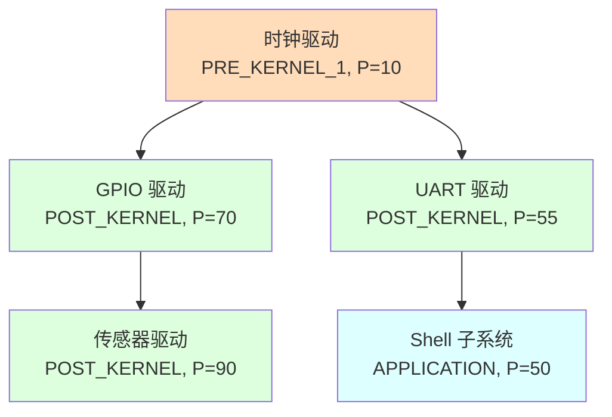

# Zephyr 设备驱动模型详解

> 返回：[入门概览](./00_入门概览.md) | [文档导航](../README.md)

---

## 目录
1. [驱动模型设计背景](#1-驱动模型设计背景)
2. [设备模型核心概念](#2-设备模型核心概念)
3. [设备驱动架构](#3-设备驱动架构)
4. [驱动注册与初始化](#4-驱动注册与初始化)
5. [设备树与驱动绑定](#5-设备树与驱动绑定)
6. [驱动 API 设计](#6-驱动-api-设计)
7. [实战：编写自定义驱动](#7-实战编写自定义驱动)
8. [驱动调试与优化](#8-驱动调试与优化)

---

## 1. 驱动模型设计背景

### 1.1 嵌入式驱动开发的挑战

在嵌入式系统开发中，设备驱动面临以下挑战：

| 挑战 | 具体问题 | Zephyr 解决方案 |
|-----|---------|----------------|
| **硬件多样性** | 不同 SoC 外设差异大 | 统一设备模型抽象 |
| **可移植性** | 驱动代码难以复用 | 设备树描述硬件，驱动与硬件分离 |
| **初始化顺序** | 设备依赖关系复杂 | 多级初始化机制 |
| **电源管理** | 功耗控制需求 | 统一的 PM 框架 |
| **实时性** | 中断响应要求 | 中断底半部机制 |

### 1.2 Zephyr 设备模型设计目标

```
┌─────────────────────────────────────────────────────────────────────┐
│                    Zephyr 设备模型设计目标                           │
├─────────────────────────────────────────────────────────────────────┤
│                                                                     │
│  ┌─────────────┐   ┌─────────────┐   ┌─────────────┐              │
│  │  一致性     │   │  可配置性   │   │  可扩展性   │              │
│  │             │   │             │   │             │              │
│  │ • 统一 API  │   │ • 设备树    │   │ • 子类化    │              │
│  │ • 标准接口  │   │ • Kconfig   │   │ • 私有数据  │              │
│  └─────────────┘   └─────────────┘   └─────────────┘              │
│                                                                     │
│  ┌─────────────┐   ┌─────────────┐   ┌─────────────┐              │
│  │  高效性     │   │  安全性     │   │  可维护性   │              │
│  │             │   │             │   │             │              │
│  │ • 编译时    │   │ • 用户空间  │   │ • 模块化    │              │
│  │ • 零开销    │   │ • 权限检查  │   │ • 清晰分层  │              │
│  └─────────────┘   └─────────────┘   └─────────────┘              │
│                                                                     │
└─────────────────────────────────────────────────────────────────────┘
```

---

## 2. 设备模型核心概念

### 2.1 核心数据结构

> ⚠️ 以下为源码中实际的 `struct device` 定义，比简化版本更复杂。源码位于 [include/zephyr/device.h](file:///home/pbw/cs-learning-notes/zephyr-src/include/zephyr/device.h)。

```c
// include/zephyr/device.h（实际定义，简化条件编译）

struct device {
    const char *name;             // 设备名称
    const void *config;           // 设备配置（ROM 中，编译时确定）
    const void *api;              // API 函数指针表
    void *data;                   // 运行时数据（RAM 中）
#ifdef CONFIG_PM_DEVICE
    struct pm_device *pm;         // 电源管理上下文
#endif
#ifdef CONFIG_DEVICE_DT_METADATA
    struct device_dt_metadata *dtm; // 设备树元数据
#endif
};
```

**关键设计**：

| 字段 | 存储位置 | 生命周期 | 说明 |
|-----|---------|---------|------|
| `name` | ROM | 永久 | 设备名称字符串 |
| `config` | ROM | 永久 | 硬件配置（寄存器地址、中断号等） |
| `api` | ROM | 永久 | 函数指针表，驱动实现 |
| `data` | RAM | 运行时 | 设备状态、缓冲区、锁等 |
| `pm` | RAM | 运行时 | 电源管理状态（可选） |

**config 与 data 分离的意义**：
- 同一驱动多个实例共享代码，但各自有独立的 config 和 data
- config 在 ROM 中，不占 RAM
- data 在 RAM 中，每个实例独立

### 2.2 设备类型层次

```
┌─────────────────────────────────────────────────────────────────────┐
│                      设备类型层次结构                                │
├─────────────────────────────────────────────────────────────────────┤
│                                                                     │
│                         ┌─────────────┐                            │
│                         │   device    │  ← 基类                    │
│                         │   (设备基类) │                            │
│                         └──────┬──────┘                            │
│                                │                                    │
│          ┌─────────────────────┼─────────────────────┐             │
│          │                     │                     │             │
│          ▼                     ▼                     ▼             │
│   ┌─────────────┐       ┌─────────────┐       ┌─────────────┐     │
│   │   sensor    │       │   gpio      │       │   uart      │     │
│   │   (传感器)  │       │   (GPIO)    │       │   (串口)    │     │
│   └──────┬──────┘       └──────┬──────┘       └──────┬──────┘     │
│          │                     │                     │             │
│    ┌─────┴─────┐               │               ┌─────┴─────┐       │
│    │           │               │               │           │       │
│    ▼           ▼               ▼               ▼           ▼       │
│ ┌──────┐   ┌──────┐      ┌──────────┐     ┌────────┐  ┌────────┐  │
│ │ temp │   │ accel│      │ gpio_emul│     │uart_ns │  │uart_stm│  │
│ │温度  │   │加速度│      │ GPIO模拟 │     │16550   │  │STM32   │  │
│ └──────┘   └──────┘      └──────────┘     └────────┘  └────────┘  │
│                                                                     │
└─────────────────────────────────────────────────────────────────────┘
```

> **这不是 OOP 继承**：Zephyr 用 C 语言实现，没有 C++ 的继承机制。图中箭头表示的是**由通用到特定**的层次关系，实际是通过 `struct device` 中的 `api` 函数指针表来实现多态的——例如所有 UART 驱动（16550、STM32）都实现同一个 `uart_driver_api`，上层代码通过同一个 API 表指针调用，不关心底层硬件差异。详见 [02-设备树详解](./02_设备树详解.md) §6 和 [06-核心数据结构详解](./06_核心数据结构详解.md) §5。

### 2.3 设备与驱动的关系

```
┌─────────────────────────────────────────────────────────────────────┐
│                    设备与驱动关系图                                  │
├─────────────────────────────────────────────────────────────────────┤
│                                                                     │
│  ┌─────────────────────┐          ┌─────────────────────┐          │
│  │      驱动代码        │          │      设备实例        │          │
│  │  (Driver Code)      │          │  (Device Instance)   │          │
│  │                     │          │                      │          │
│  │ ┌─────────────────┐ │          │ ┌─────────────────┐  │          │
│  │ │ API 函数指针表   │ │◄─────────│ │ api 指针        │  │          │
│  │ │ - init          │ │          │ ├─────────────────┤  │          │
│  │ │ - configure     │ │          │ │ config 指针     │──┼──┐       │
│  │ │ - read          │ │          │ │ (硬件配置)       │  │  │       │
│  │ │ - write         │ │          │ ├─────────────────┤  │  │       │
│  │ └─────────────────┘ │          │ │ data 指针       │──┼──┤       │
│  │                     │          │ │ (运行时数据)     │  │  │       │
│  │ ┌─────────────────┐ │          │ └─────────────────┘  │  │       │
│  │ │ 驱动逻辑         │ │          │                      │  │       │
│  │ │ - 硬件操作       │ │          │ 设备树/初始化代码    │  │       │
│  │ │ - 中断处理       │ │          │ 创建并配置          │  │       │
│  │ │ - 电源管理       │ │          │                     │  │       │
│  │ └─────────────────┘ │          │ ┌─────────────────┐  │  │       │
│  │                     │          │ │ 配置结构体       │◄─┘  │       │
│  │  一份驱动代码       │          │ │ - 寄存器基址     │     │       │
│  │  支持多个设备实例   │          │ │ - 中断号         │     │       │
│  │                     │          │ │ - 时钟配置       │     │       │
│  └─────────────────────┘          │ └─────────────────┘     │       │
│                                   │                         │       │
│                                   │ ┌─────────────────┐     │       │
│                                   │ │ 数据结构体       │◄────┘       │
│                                   │ │ - 设备状态       │             │
│                                   │ │ - 缓冲区         │             │
│                                   │ │ - 锁/信号量      │             │
│                                   │ └─────────────────┘             │
│                                   │                                 │
│                                   └─────────────────────────────────┘
│                                                                     │
└─────────────────────────────────────────────────────────────────────┘
```

---

## 3. 设备驱动架构

### 3.1 驱动分层架构

```
┌─────────────────────────────────────────────────────────────────────┐
│                        驱动分层架构                                  │
├─────────────────────────────────────────────────────────────────────┤
│                                                                     │
│  ┌─────────────────────────────────────────────────────────────┐   │
│  │                    应用层 (Application)                      │   │
│  │         应用代码调用标准 API 操作设备                        │   │
│  │              gpio_pin_set(), uart_tx()                      │   │
│  └─────────────────────────────────────────────────────────────┘   │
│                              │                                      │
│                              ▼                                      │
│  ┌─────────────────────────────────────────────────────────────┐   │
│  │                 子系统层 (Subsystem)                         │   │
│  │         提供统一的设备类 API                                 │   │
│  │    GPIO 子系统、Sensor 子系统、UART 子系统等                 │   │
│  └─────────────────────────────────────────────────────────────┘   │
│                              │                                      │
│                              ▼                                      │
│  ┌─────────────────────────────────────────────────────────────┐   │
│  │                  驱动层 (Driver)                             │   │
│  │         实现具体硬件的操作逻辑                               │   │
│  │    驱动注册、设备初始化、中断处理                            │   │
│  └─────────────────────────────────────────────────────────────┘   │
│                              │                                      │
│                              ▼                                      │
│  ┌─────────────────────────────────────────────────────────────┐   │
│  │              硬件抽象层 (HAL/BSP)                            │   │
│  │         SoC 厂商提供的底层寄存器操作                         │   │
│  │              HAL_Library, CMSIS, etc.                       │   │
│  └─────────────────────────────────────────────────────────────┘   │
│                              │                                      │
│                              ▼                                      │
│  ┌─────────────────────────────────────────────────────────────┐   │
│  │                    硬件层 (Hardware)                         │   │
│  │              实际的外设硬件                                  │   │
│  │         GPIO, UART, SPI, I2C, etc.                          │   │
│  └─────────────────────────────────────────────────────────────┘   │
│                                                                     │
└─────────────────────────────────────────────────────────────────────┘
```

### 3.2 驱动 API 结构

以 GPIO 驱动为例：

```c
// include/zephyr/drivers/gpio.h

/**
 * @brief GPIO 驱动 API 结构体
 * 
 * 每个 GPIO 控制器驱动都需要实现这些函数指针
 */
__subsystem struct gpio_driver_api {
    /* 配置引脚 */
    int (*pin_configure)(const struct device *port,
                         gpio_pin_t pin,
                         gpio_flags_t flags);
    
    /* 获取引脚状态 */
    int (*port_get_raw)(const struct device *port,
                        gpio_port_value_t *value);
    
    /* 设置引脚状态 */
    int (*port_set_masked_raw)(const struct device *port,
                               gpio_port_pins_t mask,
                               gpio_port_value_t value);
    
    /* 设置引脚（高电平） */
    int (*port_set_bits_raw)(const struct device *port,
                             gpio_port_pins_t pins);
    
    /* 清除引脚（低电平） */
    int (*port_clear_bits_raw)(const struct device *port,
                               gpio_port_pins_t pins);
    
    /* 翻转引脚 */
    int (*port_toggle_bits)(const struct device *port,
                            gpio_port_pins_t pins);
    
    /* 配置中断 */
    int (*pin_interrupt_configure)(const struct device *port,
                                   gpio_pin_t pin,
                                   enum gpio_int_mode mode,
                                   enum gpio_int_trig trig);
    
    /* 管理回调 */
    int (*manage_callback)(const struct device *port,
                           struct gpio_callback *cb,
                           bool set);
    
    /* 获取待处理中断 */
    uint32_t (*get_pending_int)(const struct device *dev);
};
```

### 3.3 配置与数据结构

```c
/**
 * @brief GPIO 驱动配置结构体（编译时确定，只读）
 */
struct gpio_driver_config {
    /* 端口支持的引脚掩码 */
    gpio_port_pins_t port_pin_mask;
};

/**
 * @brief GPIO 驱动运行时数据结构
 */
struct gpio_driver_data {
    /* 当前引脚配置状态 */
    gpio_port_pins_t output_states;
    gpio_port_pins_t input_states;
    
    /* 回调函数链表 */
    sys_slist_t callbacks;
};
```

---

## 4. 驱动注册与初始化

### 4.1 设备初始化宏

Zephyr 提供了多层宏来定义和注册设备，核心是 `DEVICE_DT_DEFINE`。

#### 宏展开链



#### 源码中的宏定义

```c
// include/zephyr/device.h（简化）

#define DEVICE_DT_DEFINE(node_id, init_fn, pm, data, config, level, prio, api, ...) \
    DEVICE_DT_DEINIT_DEFINE(node_id, init_fn, NULL, pm, data, config, \
                            level, prio, api, __VA_ARGS__)

#define DEVICE_DT_INST_DEFINE(inst, ...) \
    DEVICE_DT_DEFINE(DT_DRV_INST(inst), __VA_ARGS__)

// 获取设备引用
#define DEVICE_DT_GET(node_id) (&DEVICE_DT_NAME_GET(node_id))
#define DEVICE_DT_INST_GET(inst) DEVICE_DT_GET(DT_DRV_INST(inst))
```

#### 宏展开后的效果

以 `DEVICE_DT_INST_DEFINE(0, my_init, NULL, &data0, &config0, POST_KERNEL, 80, &api)` 为例，展开后大致生成：

```c
// 1. 设备状态
static struct device_state _device_state_inst_0 = { 0 };

// 2. 设备结构体
const Z_DECL_ALIGN(struct device) _device_inst_0 __used __attribute__((section(".device"))) = {
    .name = "TEMP_SENSOR",
    .config = &config0,
    .api = &api,
    .data = &data0,
};

// 3. 初始化条目（放入 POST_KERNEL + 优先级 80 的段）
static const struct init_entry _init_inst_0 __used __attribute__((section(".init_3_80"))) = {
    .dev = &_device_inst_0,
    .init = my_init,
};
```

**关键理解**：`DEVICE_DT_DEFINE` 不只是定义结构体，还通过 linker section 将初始化条目放入特定段，内核启动时按段遍历执行。

#### 常用宏对比

| 宏 | 用途 | 设备树关联 | PM 支持 |
|----|------|----------|--------|
| `DEVICE_DEFINE` | 手动定义设备 | 无 | 可选 |
| `DEVICE_DT_DEFINE` | 从设备树节点定义 | node_id | 可选 |
| `DEVICE_DT_INST_DEFINE` | 从 compatible 实例定义 | DT_DRV_INST(inst) | 可选 |
| `SYS_INIT` | 纯初始化函数（无设备） | 无 | 无 |

### 4.2 初始化级别与优先级

内核启动时，按级别和优先级顺序调用所有注册的初始化函数。源码位于 [kernel/init.c](file:///home/pbw/cs-learning-notes/zephyr-src/kernel/init.c)。

#### 初始化级别详解


| 级别 | 数值 | 可用服务 | 典型用途 | 典型优先级 |
|-----|------|---------|---------|----------|
| **EARLY** | 0 | 几乎无 | 时钟初始化、极早期硬件 | 0-99 |
| **PRE_KERNEL_1** | 1 | 中断向量表已就绪，但内核中断管理框架未建立；调度器不可用 | 内核对象管理、obj_core | 0-99 |
| **PRE_KERNEL_2** | 2 | 中断可用 | 调度器、系统时钟 | 0-99 |
| **POST_KERNEL** | 3 | 全部内核服务 | 大多数设备驱动 | 0-99 |
| **APPLICATION** | 4 | 全部服务 | 应用级初始化 | 0-99 |
| **SMP** | 5 | 全部服务 | 辅助 CPU 初始化 | 0-99 |

#### 优先级规则

同一级别内，优先级数值越小越先执行（0 最先）。常见约定：

| 优先级 | 用途 |
|-------|------|
| `CONFIG_KERNEL_INIT_PRIORITY_DEFAULT` (40) | 大多数驱动默认优先级 |
| `CONFIG_KERNEL_INIT_PRIORITY_DEVICE` (50) | 通用设备初始化 |
| `CONFIG_SENSOR_INIT_PRIORITY` (90) | 传感器驱动 |
| `CONFIG_UART_INIT_PRIORITY` (55) | UART 驱动 |
| `CONFIG_GPIO_INIT_PRIORITY` (70) | GPIO 驱动 |

#### 设备依赖机制

设备之间的依赖通过 `device_is_ready()` 和初始化级别/优先级来保证：



**运行时依赖检查**：

```c
static int my_sensor_init(const struct device *dev)
{
    const struct my_sensor_config *cfg = dev->config;

    // 检查依赖设备是否就绪
    if (!device_is_ready(cfg->i2c.bus)) {
        LOG_ERR("I2C bus not ready");
        return -ENODEV;
    }

    // 如果依赖未就绪，可以返回 -EAGAIN 让内核稍后重试
    // （需要 CONFIG_DEVICE_DEPS=y，此时内核会在所有设备 init 完成后
    //   再尝试一次初始化，用于处理初始化顺序未明确定义的情况）
    return 0;
}
```

### 4.3 驱动注册示例

```c
// drivers/gpio/gpio_stm32.c

#include <zephyr/drivers/gpio.h>
#include <zephyr/kernel.h>

/* 驱动私有数据结构 */
struct gpio_stm32_data {
    /* 运行时数据 */
    struct gpio_driver_data common;
    /* 其他私有数据... */
};

/* 驱动配置结构体 */
struct gpio_stm32_config {
    /* 硬件配置 */
    struct gpio_driver_config common;
    GPIO_TypeDef *base;           /* 寄存器基地址 */
    uint32_t clock;               /* 时钟配置 */
    /* 其他配置... */
};

/* 驱动 API 实现 */
static int gpio_stm32_configure(const struct device *dev,
                                 gpio_pin_t pin,
                                 gpio_flags_t flags)
{
    const struct gpio_stm32_config *cfg = dev->config;
    /* 配置引脚... */
    return 0;
}

static int gpio_stm32_port_set_masked_raw(const struct device *dev,
                                           gpio_port_pins_t mask,
                                           gpio_port_value_t value)
{
    const struct gpio_stm32_config *cfg = dev->config;
    /* 设置引脚... */
    return 0;
}

/* API 结构体 */
static const struct gpio_driver_api gpio_stm32_driver_api = {
    .pin_configure = gpio_stm32_configure,
    .port_set_masked_raw = gpio_stm32_port_set_masked_raw,
    /* ... 其他函数指针 ... */
};

/* 设备实例化宏 */
#define GPIO_STM32_DEFINE(inst)                                         \
    /* 设备数据 */                                                      \
    static struct gpio_stm32_data gpio_stm32_data_##inst;               \
                                                                        \
    /* 设备配置 */                                                      \
    static const struct gpio_stm32_config gpio_stm32_config_##inst = {  \
        .common = {                                                     \
            .port_pin_mask = STM32_GPIO_PORT_PIN_MASK,                  \
        },                                                              \
        .base = (GPIO_TypeDef *)DT_REG_ADDR(DT_INST_PARENT(inst)),      \
        .clock = DT_INST_PROP(inst, clock),                             \
    };                                                                  \
                                                                        \
    /* 设备初始化函数 */                                                \
    static int gpio_stm32_init##inst(const struct device *dev)          \
    {                                                                   \
        const struct gpio_stm32_config *cfg = dev->config;              \
        /* 初始化硬件... */                                             \
        return 0;                                                       \
    }                                                                   \
                                                                        \
    /* 注册设备 */                                                      \
    DEVICE_DT_INST_DEFINE(inst,                                         \
                          gpio_stm32_init##inst,                        \
                          NULL,                                         \
                          &gpio_stm32_data_##inst,                      \
                          &gpio_stm32_config_##inst,                    \
                          POST_KERNEL,                                  \
                          CONFIG_GPIO_INIT_PRIORITY,                    \
                          &gpio_stm32_driver_api);

/* 为所有设备树实例生成代码 */
DT_INST_FOREACH_STATUS_OKAY(GPIO_STM32_DEFINE)
```

---

## 5. 设备树与驱动绑定

### 5.1 设备树描述硬件

```dts
// 设备树描述硬件配置
&gpioa {
    status = "okay";
    
    /* 在 gpioa 下定义 LED */
    led0: led_0 {
        gpios = <&gpioa 5 GPIO_ACTIVE_HIGH>;
        label = "User LED";
    };
};

/* 独立设备定义 */
i2c0: i2c@40005400 {
    compatible = "st,stm32-i2c-v2";
    #address-cells = <1>;
    #size-cells = <0>;
    reg = <0x40005400 0x400>;
    clocks = <&rcc STM32_CLOCK_BUS_APB1 0x00200000>;
    interrupts = <31 0>, <32 0>;
    interrupt-names = "event", "error";
    status = "okay";
    
    /* I2C 设备 */
    sensor@48 {
        compatible = "mycompany,temp-sensor";
        reg = <0x48>;
        label = "TEMP_0";
    };
};
```

### 5.2 驱动获取设备树信息

```c
#include <zephyr/devicetree.h>
#include <zephyr/drivers/i2c.h>

#define TEMP_SENSOR_NODE DT_NODELABEL(temp_sensor)

/* 检查节点是否存在且可用 */
#if DT_NODE_HAS_STATUS(TEMP_SENSOR_NODE, okay)

/* 获取设备实例 */
static const struct device *temp_sensor = DEVICE_DT_GET(TEMP_SENSOR_NODE);

/* 获取 I2C 总线 */
static const struct i2c_dt_spec i2c_spec = I2C_DT_SPEC_GET(TEMP_SENSOR_NODE);

/* 获取属性值 */
#define SENSOR_ADDR DT_REG_ADDR(TEMP_SENSOR_NODE)
#define SENSOR_LABEL DT_LABEL(TEMP_SENSOR_NODE)

void sensor_init(void)
{
    /* 检查设备就绪 */
    if (!device_is_ready(temp_sensor)) {
        printk("Temperature sensor not ready\n");
        return;
    }
    
    /* 检查 I2C 总线就绪 */
    if (!device_is_ready(i2c_spec.bus)) {
        printk("I2C bus not ready\n");
        return;
    }
    
    printk("Sensor %s initialized at address 0x%02x\n", 
           SENSOR_LABEL, SENSOR_ADDR);
}

#endif
```

### 5.3 设备树绑定文件

```yaml
# dts/bindings/i2c/st,stm32-i2c-v2.yaml
description: STM32 I2C V2 controller

compatible: "st,stm32-i2c-v2"

include: [i2c-controller.yaml, pinctrl-device.yaml]

properties:
  reg:
    required: true
    type: array
    description: I2C register base address and size
    
  clocks:
    required: true
    type: phandles
    description: I2C clock configuration
    
  interrupts:
    required: true
    type: array
    description: I2C interrupt configurations
    
  interrupt-names:
    type: string-array
    description: Names for the interrupts
    
  clock-frequency:
    type: int
    required: false
    default: 100000
    description: I2C bus frequency in Hz
```

---

## 6. 驱动 API 设计

### 6.1 同步 API 设计

```c
/**
 * @brief I2C 驱动 API 设计示例
 */
__subsystem struct i2c_driver_api {
    /**
     * @brief 执行 I2C 传输
     * 
     * @param dev       设备实例
     * @param msgs      消息数组
     * @param num_msgs  消息数量
     * @param addr      从设备地址
     * @retval 0        成功
     * @retval -errno   失败
     */
    int (*transfer)(const struct device *dev,
                    struct i2c_msg *msgs,
                    uint8_t num_msgs,
                    uint16_t addr);
    
    /**
     * @brief 配置 I2C 控制器
     * 
     * @param dev       设备实例
     * @param dev_config 配置值
     * @retval 0        成功
     * @retval -errno   失败
     */
    int (*configure)(const struct device *dev,
                     uint32_t dev_config);
    
    /**
     * @brief 获取控制器配置
     */
    int (*get_config)(const struct device *dev,
                      uint32_t *dev_config);
    
    /**
     * @brief 目标模式回调（用于从设备模式）
     */
    int (*target_register)(const struct device *dev,
                           struct i2c_target_config *cfg);
    int (*target_unregister)(const struct device *dev,
                             struct i2c_target_config *cfg);
    
    /**
     * @brief 恢复控制器
     */
    int (*recover_bus)(const struct device *dev);
};
```

### 6.2 异步 API 设计

```c
/**
 * @brief 异步 I2C 传输 API
 */
struct i2c_async_xfer {
    /* 传输完成回调 */
    void (*callback)(const struct device *dev,
                     int result,
                     void *userdata);
    void *userdata;
    
    /* 传输参数 */
    struct i2c_msg *msgs;
    uint8_t num_msgs;
    uint16_t addr;
};

__subsystem struct i2c_driver_api {
    /* 同步 API */
    int (*transfer)(const struct device *dev,
                    struct i2c_msg *msgs,
                    uint8_t num_msgs,
                    uint16_t addr);
    
    /* 异步 API */
    int (*transfer_async)(const struct device *dev,
                          struct i2c_async_xfer *xfer);
    
    /* 取消异步传输 */
    int (*transfer_cancel)(const struct device *dev);
};
```

### 6.3 辅助 API 宏

```c
/**
 * @brief 封装常用操作，简化应用代码
 */

/* I2C 读取 */
static inline int i2c_read_dt(const struct i2c_dt_spec *spec,
                               uint8_t *buf, uint32_t num_bytes)
{
    struct i2c_msg msg;
    
    msg.buf = buf;
    msg.len = num_bytes;
    msg.flags = I2C_MSG_READ | I2C_MSG_STOP;
    
    return i2c_transfer(spec->bus, &msg, 1, spec->addr);
}

/* I2C 写入 */
static inline int i2c_write_dt(const struct i2c_dt_spec *spec,
                                const uint8_t *buf, uint32_t num_bytes)
{
    struct i2c_msg msg;
    
    msg.buf = (uint8_t *)buf;
    msg.len = num_bytes;
    msg.flags = I2C_MSG_WRITE | I2C_MSG_STOP;
    
    return i2c_transfer(spec->bus, &msg, 1, spec->addr);
}

/* I2C 寄存器读取 */
static inline int i2c_reg_read_byte_dt(const struct i2c_dt_spec *spec,
                                        uint8_t reg_addr,
                                        uint8_t *value)
{
    return i2c_burst_read_dt(spec, reg_addr, value, 1);
}

/* I2C 寄存器写入 */
static inline int i2c_reg_write_byte_dt(const struct i2c_dt_spec *spec,
                                         uint8_t reg_addr,
                                         uint8_t value)
{
    return i2c_reg_write_byte(spec->bus, spec->addr, reg_addr, value);
}
```

---

## 7. 实战：编写自定义驱动

### 7.1 需求分析

编写一个简单的虚拟温度传感器驱动：
- 支持 I2C 接口
- 提供温度读取 API
- 支持设备树配置

### 7.2 设备树绑定

```yaml
# dts/bindings/sensor/mycompany,virtual-temp.yaml
description: Virtual Temperature Sensor

compatible: "mycompany,virtual-temp"

include: [sensor-device.yaml, i2c-device.yaml]

properties:
  reg:
    required: true
    type: array
    description: I2C device address
    
  temp-offset:
    type: int
    required: false
    default: 0
    description: Temperature offset in millidegrees Celsius
```

### 7.3 驱动实现

```c
// drivers/sensor/virtual_temp/virtual_temp.c

#define DT_DRV_COMPAT mycompany_virtual_temp

#include <zephyr/device.h>
#include <zephyr/drivers/i2c.h>
#include <zephyr/drivers/sensor.h>
#include <zephyr/devicetree.h>
#include <zephyr/kernel.h>
#include <zephyr/logging/log.h>

LOG_MODULE_REGISTER(virtual_temp, CONFIG_SENSOR_LOG_LEVEL);

/* 寄存器定义 */
#define TEMP_REG_VAL    0x00
#define TEMP_REG_CONF   0x01

/* 驱动数据 */
struct virtual_temp_data {
    int32_t temperature;    /* 当前温度（毫摄氏度） */
    struct k_mutex lock;    /* 保护并发访问 */
};

/* 驱动配置 */
struct virtual_temp_config {
    struct i2c_dt_spec i2c;
    int32_t temp_offset;
};

/* 读取温度 */
static int virtual_temp_sample_fetch(const struct device *dev,
                                      enum sensor_channel chan)
{
    const struct virtual_temp_config *cfg = dev->config;
    struct virtual_temp_data *data = dev->data;
    uint8_t buf[2];
    int ret;
    
    if (chan != SENSOR_CHAN_ALL && chan != SENSOR_CHAN_AMBIENT_TEMP) {
        return -ENOTSUP;
    }
    
    k_mutex_lock(&data->lock, K_FOREVER);
    
    /* 读取温度寄存器 */
    ret = i2c_burst_read_dt(&cfg->i2c, TEMP_REG_VAL, buf, sizeof(buf));
    if (ret < 0) {
        LOG_ERR("Failed to read temperature: %d", ret);
        k_mutex_unlock(&data->lock);
        return ret;
    }
    
    /* 转换为温度值 */
    int16_t raw = (buf[0] << 8) | buf[1];
    data->temperature = (raw * 1000 / 16) + cfg->temp_offset;
    
    k_mutex_unlock(&data->lock);
    
    LOG_DBG("Temperature: %d mC", data->temperature);
    
    return 0;
}

/* 获取通道值 */
static int virtual_temp_channel_get(const struct device *dev,
                                     enum sensor_channel chan,
                                     struct sensor_value *val)
{
    struct virtual_temp_data *data = dev->data;
    
    if (chan != SENSOR_CHAN_AMBIENT_TEMP) {
        return -ENOTSUP;
    }
    
    val->val1 = data->temperature / 1000;           /* 整数部分 */
    val->val2 = (data->temperature % 1000) * 1000;  /* 小数部分 */
    
    return 0;
}

/* 传感器 API */
static const struct sensor_driver_api virtual_temp_api = {
    .sample_fetch = virtual_temp_sample_fetch,
    .channel_get = virtual_temp_channel_get,
};

/* 初始化函数 */
static int virtual_temp_init(const struct device *dev)
{
    const struct virtual_temp_config *cfg = dev->config;
    struct virtual_temp_data *data = dev->data;
    
    /* 检查 I2C 总线就绪 */
    if (!device_is_ready(cfg->i2c.bus)) {
        LOG_ERR("I2C bus not ready");
        return -ENODEV;
    }
    
    /* 初始化互斥锁 */
    k_mutex_init(&data->lock);
    
    /* 配置传感器 */
    uint8_t conf = 0x60;  /* 12位分辨率 */
    int ret = i2c_reg_write_byte_dt(&cfg->i2c, TEMP_REG_CONF, conf);
    if (ret < 0) {
        LOG_ERR("Failed to configure sensor: %d", ret);
        return ret;
    }
    
    LOG_INF("Virtual temperature sensor initialized (offset: %d mC)",
            cfg->temp_offset);
    
    return 0;
}

/* 设备实例化宏 */
#define VIRTUAL_TEMP_DEFINE(inst)                                       \
    static struct virtual_temp_data virtual_temp_data_##inst;           \
                                                                        \
    static const struct virtual_temp_config virtual_temp_config_##inst = { \
        .i2c = I2C_DT_SPEC_INST_GET(inst),                              \
        .temp_offset = DT_INST_PROP_OR(inst, temp_offset, 0),            \
    };                                                                  \
                                                                        \
    DEVICE_DT_INST_DEFINE(inst,                                         \
                          virtual_temp_init,                            \
                          NULL,                                         \
                          &virtual_temp_data_##inst,                    \
                          &virtual_temp_config_##inst,                  \
                          POST_KERNEL,                                  \
                          CONFIG_SENSOR_INIT_PRIORITY,                  \
                          &virtual_temp_api);

/* 为所有实例生成代码 */
DT_INST_FOREACH_STATUS_OKAY(VIRTUAL_TEMP_DEFINE)
```

### 7.4 CMakeLists.txt

```cmake
# drivers/sensor/virtual_temp/CMakeLists.txt

zephyr_library()

zephyr_library_sources(virtual_temp.c)

zephyr_library_include_directories(${ZEPHYR_BASE}/drivers)
```

### 7.5 Kconfig

```kconfig
# drivers/sensor/virtual_temp/Kconfig

config VIRTUAL_TEMP
    bool "Virtual Temperature Sensor"
    default y
    depends on DT_HAS_MYCOMPANY_VIRTUAL_TEMP_ENABLED
    depends on I2C
    help
      Enable driver for virtual temperature sensor.

if VIRTUAL_TEMP

config VIRTUAL_TEMP_LOG_LEVEL
    int "Log level"
    default 3
    range 0 4
    help
      0: OFF, 1: ERROR, 2: WARNING, 3: INFO, 4: DEBUG

endif # VIRTUAL_TEMP
```

### 7.6 使用示例

```c
// 应用代码
#include <zephyr/device.h>
#include <zephyr/drivers/sensor.h>
#include <zephyr/devicetree.h>

#define TEMP_SENSOR_NODE DT_NODELABEL(temp_sensor)

static const struct device *temp_sensor = DEVICE_DT_GET(TEMP_SENSOR_NODE);

void main(void)
{
    struct sensor_value temp;
    int ret;
    
    /* 检查设备就绪 */
    if (!device_is_ready(temp_sensor)) {
        printk("Temperature sensor not ready\n");
        return;
    }
    
    while (1) {
        /* 采样 */
        ret = sensor_sample_fetch(temp_sensor);
        if (ret < 0) {
            printk("Failed to fetch sample\n");
            continue;
        }
        
        /* 获取温度 */
        ret = sensor_channel_get(temp_sensor, SENSOR_CHAN_AMBIENT_TEMP, &temp);
        if (ret < 0) {
            printk("Failed to get temperature\n");
            continue;
        }
        
        printk("Temperature: %d.%06d C\n", temp.val1, temp.val2);
        
        k_sleep(K_SECONDS(1));
    }
}
```

---

## 8. 驱动调试与优化

### 8.1 调试技巧

```c
/* 1. 启用驱动日志 */
#define LOG_LEVEL CONFIG_LOG_DEFAULT_LEVEL
#include <zephyr/logging/log.h>
LOG_MODULE_REGISTER(my_driver);

/* 使用日志 */
LOG_ERR("Error occurred: %d", ret);
LOG_WRN("Warning: buffer full");
LOG_INF("Driver initialized");
LOG_DBG("Register value: 0x%02x", reg_val);

/* 2. 断言检查 */
__ASSERT(dev != NULL, "Device pointer is NULL");
__ASSERT_NO_MSG(cfg != NULL);

/* 3. 运行时检查 */
if (!device_is_ready(dev)) {
    LOG_ERR("Device not ready");
    return -ENODEV;
}
```

### 8.2 性能优化

```c
/* 1. 使用缓存友好的数据结构 */
struct driver_data {
    /* 热数据放在一起 */
    uint32_t active_regs[4];
    void *current_buf;
    
    /* 冷数据放在后面 */
    struct config config_data;
    char name[32];
} __aligned(32);

/* 2. 减少锁的粒度 */
static int driver_write(const struct device *dev, const void *buf, size_t len)
{
    struct driver_data *data = dev->data;
    
    /* 只保护必要的部分 */
    k_mutex_lock(&data->tx_lock, K_FOREVER);
    
    /* 准备传输（在锁外做） */
    setup_dma_transfer(buf, len);
    
    /* 启动传输（需要保护） */
    start_transfer();
    
    k_mutex_unlock(&data->tx_lock);
    
    /* 等待完成（在锁外等待） */
    return k_sem_take(&data->tx_done, K_FOREVER);
}

/* 3. 使用 DMA 减少 CPU 干预 */
static int driver_write_dma(const struct device *dev, const void *buf, size_t len)
{
    /* 配置 DMA */
    dma_config_xfer(buf, len);
    
    /* 启动 DMA，CPU 可以做其他事情 */
    dma_start();
    
    /* 等待 DMA 完成中断 */
    return k_sem_take(&dma_done, timeout);
}
```

### 8.3 电源管理

```c
#include <zephyr/pm/device.h>

/* 电源管理回调 */
static int my_driver_pm_action(const struct device *dev,
                                enum pm_device_action action)
{
    switch (action) {
    case PM_DEVICE_ACTION_SUSPEND:
        /* 进入低功耗模式 */
        disable_peripheral_clock();
        save_context();
        break;
        
    case PM_DEVICE_ACTION_RESUME:
        /* 恢复正常运行 */
        restore_context();
        enable_peripheral_clock();
        break;
        
    case PM_DEVICE_ACTION_TURN_OFF:
        /* 完全关闭 */
        power_down();
        break;
        
    case PM_DEVICE_ACTION_TURN_ON:
        /* 重新上电 */
        power_up();
        init_hardware();
        break;
        
    default:
        return -ENOTSUP;
    }
    
    return 0;
}

/* 注册带 PM 的设备 */
PM_DEVICE_DT_INST_DEFINE(inst, my_driver_pm_action);

DEVICE_DT_INST_DEFINE(inst,
                      my_driver_init,
                      PM_DEVICE_DT_INST_GET(inst),  /* PM 回调 */
                      &my_driver_data_##inst,
                      &my_driver_config_##inst,
                      POST_KERNEL,
                      CONFIG_KERNEL_INIT_PRIORITY_DEVICE,
                      &my_driver_api);
```

---

## 总结

Zephyr 的设备驱动模型提供了统一、可扩展的驱动开发框架：

1. **统一 API**：所有驱动遵循相同的接口规范
2. **设备树集成**：硬件配置与代码分离
3. **初始化机制**：多级初始化确保依赖正确
4. **电源管理**：统一的低功耗支持
5. **用户空间支持**：安全的用户态访问

---

## 考题与思考

### 选择题

**1.** Zephyr 设备初始化级别中，哪个级别最早执行？

A. `POST_KERNEL`
B. `PRE_KERNEL_1`
C. `APPLICATION`
D. `EARLY`

**2.** 关于设备结构体 `struct device`，以下说法正确的是：

A. `config` 指针指向运行时可修改的数据
B. `data` 指针指向只读的配置信息
C. `api` 指针指向驱动实现的函数指针表
D. 设备名称存储在 `data` 中

**3.** 以下哪个宏用于从设备树自动定义设备实例？

A. `DEVICE_DEFINE()`
B. `DEVICE_DT_DEFINE()`
C. `DEVICE_DT_INST_DEFINE()`
D. 以上都可以

**4.** 驱动 API 结构体使用 `__subsystem` 宏修饰的作用是：

A. 提高运行效率
B. 标识这是一个子系统 API
C. 强制类型检查
D. 自动生成文档

**5.** 在 `PRE_KERNEL_1` 初始化级别中，驱动代码不能使用：

A. 设备树信息
B. 中断
C. 静态变量
D. 寄存器操作

### 简答题

**1.** 解释设备驱动模型中 `config`、`data`、`api` 三个指针的作用和区别。

**2.** 描述 Zephyr 设备初始化的五个级别及其执行顺序。

**3.** 为什么驱动注册使用宏而不是函数调用？

**4.** 解释 `DT_INST_FOREACH_STATUS_OKAY` 宏的工作原理。

**5.** 设备驱动如何与电源管理框架集成？

### 编程题

**1.** 编写一个简单的 GPIO 驱动框架，实现 `pin_configure` 和 `port_set_bits_raw` 两个 API。

**2.** 创建一个虚拟传感器驱动，支持从设备树读取配置，并实现 `sample_fetch` 和 `channel_get` API。

**3.** 为驱动添加电源管理支持，实现 `PM_DEVICE_ACTION_SUSPEND` 和 `PM_DEVICE_ACTION_RESUME` 处理。

### 分析题

**1.** 分析以下驱动初始化代码的问题：

```c
static int my_driver_init(const struct device *dev)
{
    struct my_data *data = dev->data;
    
    k_mutex_init(&data->lock);
    k_sem_init(&data->sync, 0, 1);
    
    // 启动一个线程处理数据
    k_thread_create(&data->thread, data->stack, STACK_SIZE,
                    thread_entry, (void *)dev, NULL, NULL,
                    PRIORITY, 0, K_NO_WAIT);
    
    return 0;
}

DEVICE_DT_INST_DEFINE(inst, my_driver_init, NULL,
                      &my_data, &my_config,
                      PRE_KERNEL_1, 0, &my_api);
```

**2.** 某驱动在 `POST_KERNEL` 初始化，但依赖另一个 `PRE_KERNEL_1` 初始化的设备。分析这种设计的潜在问题。

### 参考答案

**选择题：** 1.D  2.C  3.C  4.B  5.B

**简答题答案要点：**

1. `config`：只读配置（寄存器地址、中断号等）；`data`：运行时可变数据（缓冲区、锁等）；`api`：驱动实现的函数指针表。

2. `EARLY` → `PRE_KERNEL_1` → `PRE_KERNEL_2` → `POST_KERNEL` → `APPLICATION` → `SMP`

3. 宏在编译时展开，可以生成静态数据结构，避免运行时开销，实现零成本抽象。

4. 该宏遍历设备树中所有状态为 "okay" 的指定 compatible 节点，为每个节点调用传入的宏。

5. 实现 `pm_action` 回调函数，使用 `PM_DEVICE_DT_INST_DEFINE` 定义 PM 数据，并在 `DEVICE_DT_INST_DEFINE` 中传入 PM 回调。

**分析题答案要点：**

1. 问题：在 `PRE_KERNEL_1` 阶段内核服务尚未完全就绪，`k_thread_create` 和同步原语可能无法正常工作。应将初始化级别改为 `POST_KERNEL`。

2. 问题：初始化顺序正确，但需要确保依赖设备已完全初始化。可以使用 `device_is_ready()` 检查或通过 `device_required` 声明依赖关系。

---

*最后更新：2026-04-22*
