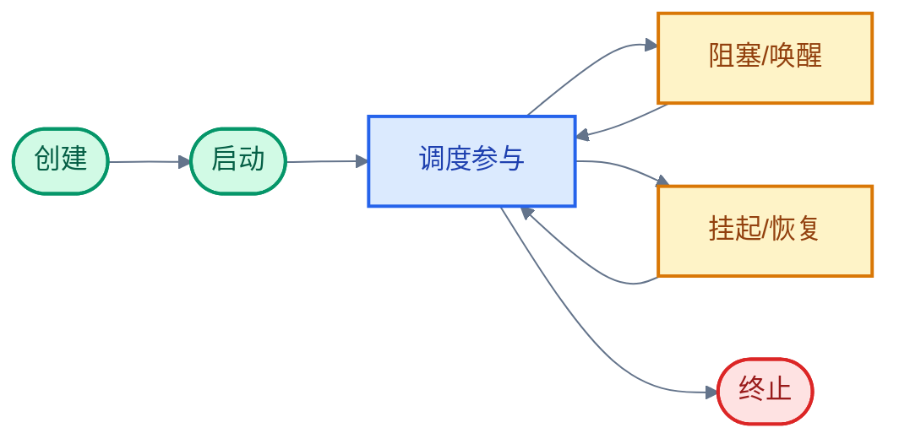
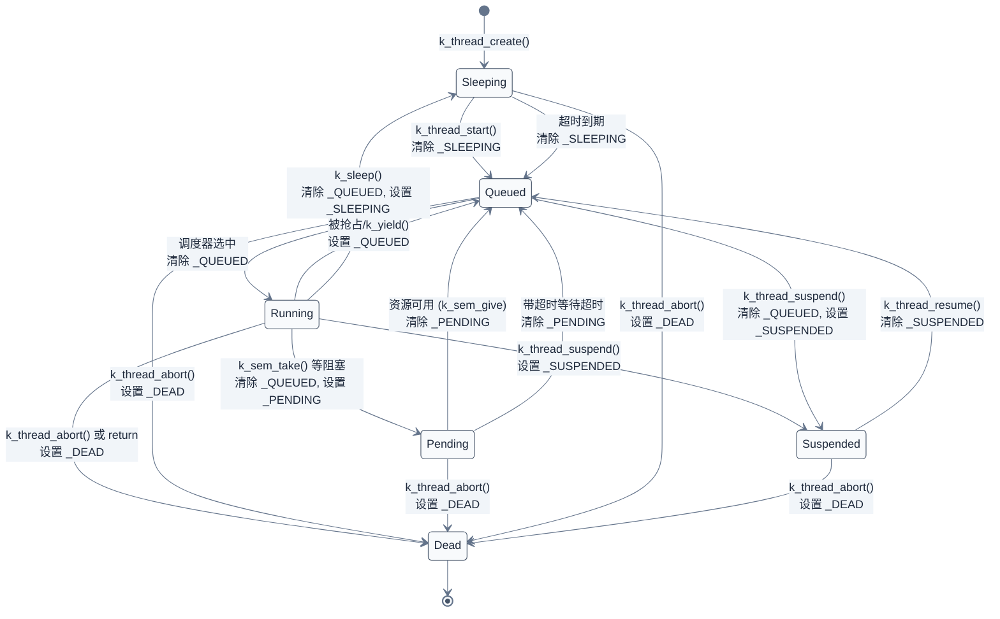
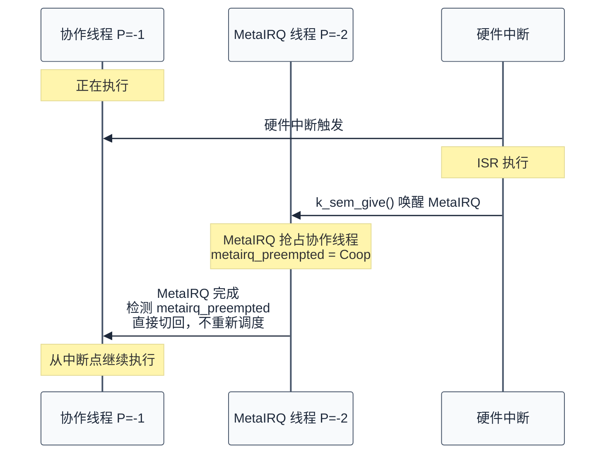

# 05. Zephyr RTOS 线程与状态迁移

> 一句话概括：本文以"线程生命周期调用链"为主线——从 `k_thread_create` 创建、`k_thread_start` 启动、`k_sem_take` 阻塞、`k_sem_give` 唤醒、`k_thread_suspend` 挂起、`k_thread_abort` 终止——讲清线程在"就绪队列/等待队列/超时队列"三类队列之间的迁移，并把优先级、栈管理、系统线程等机制挂回生命周期的相应环节。
> **工程师视角**：读完后你应当能在脑中画出"创建→启动→调度参与→阻塞/唤醒→挂起/恢复→终止"这条完整链路，并回答三个问题——"为什么创建后默认是 `_THREAD_SLEEPING`""线程在三类队列之间如何迁移""Meta-IRQ 与普通协作线程的本质区别"。

### 关键术语

| 缩写 | 全称 | 含义 |
|------|------|------|
| TCB | Thread Control Block | 线程控制块，内核为每个线程维护的元数据结构 `struct k_thread` |
| ISR | Interrupt Service Routine | 中断服务例程，硬件异步事件的入口函数 |
| CPU | Central Processing Unit | 中央处理器 |
| SMP | Symmetric Multi-Processing | 对称多处理，多核平等运行同一内核镜像 |
| MMU | Memory Management Unit | 内存管理单元，提供虚拟地址与保护 |
| MPU | Memory Protection Unit | 内存保护单元，仅提供保护无虚拟地址 |
| FP | Floating Point | 浮点（寄存器） |
| SSE | Streaming SIMD Extensions | x86 单指令多数据流扩展（寄存器） |
| IRQ | Interrupt Request | 中断请求 |
| Meta-IRQ | Meta-Interrupt Request | Zephyr 特殊线程类，介于硬件中断与协作线程之间 |
| IPI | Inter-Processor Interrupt | 处理器间中断，用于 SMP 跨核调度通知 |
| RAM | Random Access Memory | 随机存取存储器 |
| ROM | Read-Only Memory | 只读存储器 |
| TLS | Thread Local Storage | 线程本地存储 |

---

### 前置阅读

| 需要了解 | 参考文档 |
|----------|----------|
| 内核启动与初始化（main 线程的诞生） | [04-内核启动与初始化](./04-内核启动与初始化.md) |
| 入门概览中的线程/调度概念 | [00-入门概览](./00-入门概览.md) |

---

## 1. 概述：线程生命周期全链路

> 上一章建立了"从上电到 `main()`"的初始化框架。一个自然的问题是：`main()` 之后，CPU 如何在多个任务之间切换？本章用"线程"来回答这个问题——先用一个具体小例子建立直觉，再给出 Zephyr 线程的**生命周期调用链全貌**与**各阶段综合视图**，这是理解后续所有章节的骨架。后续各章都是生命周期某一环的展开。

### 1.1 一个具体小例子：两个线程交替打印

线程的本质是"一条独立的执行流"。它有自己的栈、自己的寄存器现场、自己的入口函数，但与其他线程共享同一个地址空间。最直观的方式是用一个最小例子观察它：

```c
#include <zephyr/kernel.h>

#define STACK_SIZE 512

/* 静态分配栈与 TCB —— 见 §8.2 解释为何用 K_THREAD_STACK */
K_THREAD_STACK_DEFINE(thread_a_stack, STACK_SIZE);
K_THREAD_STACK_DEFINE(thread_b_stack, STACK_SIZE);
static struct k_thread thread_a_data;
static struct k_thread thread_b_data;

void printer(void *p1, void *p2, void *p3)
{
    const char *name = (const char *)p1;
    uint32_t *counter = (uint32_t *)p2;

    while (1) {
        (*counter)++;
        printk("%s: count=%u\n", name, *counter);
        k_msleep(100);  /* 主动让出 CPU 100ms */
    }
}

void main(void)
{
    static uint32_t counter_a, counter_b;

    k_thread_create(&thread_a_data, thread_a_stack,
                    K_THREAD_STACK_SIZEOF(thread_a_stack),
                    printer, (void *)"A", (void *)&counter_a, NULL,
                    0 /* 优先级 0，最高抢占式 */, 0, K_NO_WAIT);

    k_thread_create(&thread_b_data, thread_b_stack,
                    K_THREAD_STACK_SIZEOF(thread_b_stack),
                    printer, (void *)"B", (void *)&counter_b, NULL,
                    0, 0, K_NO_WAIT);

    /* main 线程任务完成，正常返回后终止 */
}
```

运行后控制台会看到 `A: count=1`、`B: count=1`、`A: count=2`、`B: count=2`... 交替出现。两个线程"同时"在跑，但单核 CPU 同一时刻只能执行一个——这种"同时"的错觉是调度器切换出来的。

每一次切换实际只发生 3 步：

1. 当前线程调用 `k_msleep(100)`，内核把它从就绪队列移出，挂到超时队列，状态从 `RUNNING` 变为 `SLEEPING`
2. 调度器从就绪队列挑出下一个线程（这里是另一个 printer），把它的状态从 `QUEUED` 变为 `RUNNING`
3. `arch_switch()` 保存旧线程的 callee-saved 寄存器，恢复新线程的 callee-saved 寄存器，PC 跳到新线程上次离开的位置

> **核心要点**：线程的本质是一条独立的执行流，它通过"主动让出"或"被抢占"让出 CPU；切换的核心动作是"保存旧现场 + 恢复新现场"。所有看似并发的行为，背后都是调度器在这 3 步之间反复切换。

> **设计洞察**：线程切换本质上是"CPU 的虚拟化"——把一颗物理 CPU 切片成多条虚拟执行流，每条流都以为自己独占 CPU。这种虚拟化的代价不止"保存/恢复寄存器"那么简单：现代 CPU 的 cache、TLB、分支预测器都是"隐式状态"，切换线程会让这些缓存失效或污染。ARM Cortex-M 的 cache 行在切换后可能仍存有旧线程数据（cache 与线程无关），但分支预测器会因 PC 跳变而预热失败；带 MMU 的架构（如 Cortex-A）还要面对 TLB 刷新的开销。这是为什么"上下文切换次数/秒"是 RTOS 性能基准的核心指标——不仅是寄存器保存的字节数，更是 cache 局部性的破坏程度。
>
> 这种虚拟化的根本权衡是"协作 vs 抢占"。协作式切换（如早期 Windows 3.1、协程）只在显式让出点发生，切换时机可预测、临界区天然安全，但一个线程卡住就拖垮整个系统。抢占式切换（如所有现代 RTOS、Linux preempt model）依赖定时器中断强制切换，保证响应延迟，但要求所有共享数据都用锁保护——开发者不能再假设"我不会被打断"。Zephyr 的三类优先级（协作/抢占/Meta-IRQ）本质是在这两个极端之间提供可调谱：负优先级线程保留协作语义，非负优先级线程接受抢占，Meta-IRQ 则是"协作线程的特例中断"。

### 1.2 生命周期调用链全貌

线程的一生可以概括为六个阶段，每个阶段对应一组 API 与状态迁移：



> **如何读这张图**：线程从"创建"诞生，经"启动"进入"调度参与"（就绪队列 ↔ CPU 运行）。在调度参与期间，线程会反复"阻塞/唤醒"（等待资源）或"挂起/恢复"（被显式暂停）。最终通过"终止"结束生命。绿色是诞生阶段，蓝色是活跃阶段，黄色是阻塞阶段，红色是终止阶段。后续 §3-§6 按这张图的顺序逐环展开。

### 1.3 各阶段综合视图：状态、队列与操作

线程在生命周期各阶段处于不同的"状态"（位标志），位于不同的"队列"，由不同的 API 触发迁移。下表把散落各处的信息收拢成一张完整图景，是理解后续章节的导航：

| 阶段 | 触发 API | 内部状态标志 | 所在队列 | 调度器行为 | 源码位置 |
|------|---------|-------------|---------|-----------|---------|
| ① 创建 | `k_thread_create` | `_THREAD_SLEEPING` | 无 | 不参与调度 | `z_setup_new_thread` |
| ② 启动 | `k_thread_start`（=`k_wakeup`） | 清除 `_THREAD_SLEEPING`，设置 `_THREAD_QUEUED` | 就绪队列 | `ready_thread` + `update_cache` | `z_impl_k_wakeup` |
| ③ 调度参与（运行） | 调度器选中 | 清除 `_THREAD_QUEUED` | 无（`_current` 指向它） | `arch_switch` 切上下文 | `z_swap` / `do_swap` |
| ④a 阻塞（等待资源） | `k_sem_take` / `k_mutex_lock` / `k_sleep` | `_THREAD_PENDING` 或 `_THREAD_SLEEPING` | 等待队列 + 超时队列 | `z_swap` 切走 | `z_pend_curr` |
| ④b 唤醒（资源可用） | `k_sem_give` / `k_mutex_unlock` / 超时回调 | 清除 `_THREAD_PENDING`/`_THREAD_SLEEPING`，设置 `_THREAD_QUEUED` | 就绪队列 | `ready_thread` + `reschedule` | `z_sched_wake_thread_locked` |
| ⑤a 挂起 | `k_thread_suspend` | `_THREAD_SUSPENDED` | 无（从所在队列摘除） | `z_swap` 切走（若挂自己） | `z_impl_k_thread_suspend` |
| ⑤b 恢复 | `k_thread_resume` | 清除 `_THREAD_SUSPENDED`，设置 `_THREAD_QUEUED` | 就绪队列 | `ready_thread` + `reschedule` | `z_impl_k_thread_resume` |
| ⑥ 终止 | `k_thread_abort` / 入口函数 return | `_THREAD_DEAD` | 无（从所在队列摘除） | `z_thread_halt` | `z_thread_abort` |

> **如何读这张表**：这是本文的"地图"。注意第 ③ 行——运行中的线程**不在任何队列里**，由 `_current` 指针标识。第 ④a 行——阻塞的线程同时挂在两个队列（等待队列 + 超时队列），哪个条件先满足就先唤醒它并从另一个队列摘除。第 ⑥ 行——终止是从任何状态都可以直接跳转的"吸收态"。后续 §3-§6 按这张表的顺序逐环展开，§7-§9 讲生命周期各环节涉及的属性与机制。

### 1.4 三类队列：就绪/等待/超时

在深入生命周期之前，先认识贯穿全文的三类队列——线程在同一时刻至多在一个队列里（或正在 CPU 上跑）。它们定义在 [include/zephyr/kernel_structs.h](file:///home/pbw/rtos/cs-learning-notes/zephyr-project/zephyr/include/zephyr/kernel_structs.h)：

| 队列 | 数据结构 | 作用 | 线程何时在此 |
|------|---------|------|-------------|
| **就绪队列**（ready_q） | 链表/红黑树/多队列 | 存放所有可运行线程 | 状态含 `_THREAD_QUEUED` 且无阻塞标志 |
| **等待队列**（wait_q） | 链表或红黑树 | 存放等待某个内核对象（信号量/互斥量等）的线程 | 状态含 `_THREAD_PENDING`，`pended_on` 指向具体队列 |
| **超时队列**（timeout_q） | 链表（按到期时间排序） | 存放带超时的阻塞/睡眠线程 | 状态含 `_THREAD_SLEEPING` 或 `_THREAD_PENDING`，`timeout` 字段非空 |

> **核心要点**：线程生命周期各操作本质上都在这三类队列之间搬移线程。例如带超时的 `k_sem_take(&sem, K_MSEC(100))` 会把线程同时挂到 sem 的等待队列（置 `_THREAD_PENDING`）与超时队列——哪个条件先满足就先唤醒它，并从另一个队列摘除。理解了三类队列，就理解了状态迁移的物理意义。

---

## 2. 线程的核心数据结构

> 第一章建立了生命周期全貌。一个自然的问题是：内核靠什么跟踪一个线程的状态、优先级、所在的队列？答案是 TCB（Thread Control Block）。本章讲清 TCB 的核心字段，为后续生命周期各环节的源码分析做铺垫。

### 2.1 线程的 7 个关键属性

官方文档（[threads/index.rst](../zephyr-project/zephyr/doc/kernel/services/threads/index.rst)）列出线程的 7 个关键属性：

| 属性 | 类型 | 作用 |
|------|------|------|
| **栈区（Stack area）** | `k_thread_stack_t` 数组 | 存储局部变量、调用链、中断上下文 |
| **线程控制块（TCB）** | `struct k_thread` | 内核维护的元数据：状态、优先级、栈信息等 |
| **入口函数（Entry point）** | `k_thread_entry_t` | 线程启动后执行的函数，可接收 3 个参数 |
| **调度优先级（Priority）** | `int` | 数值越小优先级越高，决定 CPU 分配顺序 |
| **线程选项（Options）** | `uint32_t` | 如 `K_ESSENTIAL`、`K_FP_REGS` 等特殊处理标志 |
| **启动延迟（Start delay）** | `k_timeout_t` | `K_NO_WAIT` 立即启动，否则延迟指定时间 |
| **执行模式（Mode）** | supervisor / user | 默认 supervisor，`K_USER` 时进入受限用户模式 |

### 2.2 struct _thread_base：TCB 的核心

TCB 的核心字段定义在 [include/zephyr/kernel/thread.h](file:///home/pbw/rtos/cs-learning-notes/zephyr-project/zephyr/include/zephyr/kernel/thread.h#L46) 的 `struct _thread_base`：

```c
/* include/zephyr/kernel/thread.h （节选） */
struct _thread_base {
    union {
        sys_dnode_t qnode_dlist;    /* 就绪/等待队列节点（链表实现） */
        struct rbnode qnode_rb;     /* 就绪/等待队列节点（红黑树实现） */
    };
    _wait_q_t *pended_on;           /* 当前所在的等待队列 */

    uint16_t user_options;          /* 用户可见选项：K_ESSENTIAL/K_FP_REGS/... */

    union {
        struct {
            int8_t  prio;           /* 优先级：负数协作，非负抢占 */
            uint8_t sched_locked;   /* 调度器锁计数 */
        };
        uint16_t preempt;           /* 上述两字段拼接，用于 O(1) 抢占判断 */
    };

    uint8_t thread_state;           /* 状态位标志：_THREAD_PENDING/_SLEEPING/... */

#ifdef CONFIG_SMP
    uint8_t is_idle;                /* 是否为 idle 线程 */
    uint8_t cpu;                    /* 最后执行的 CPU ID */
    uint8_t global_lock_count;      /* irq_lock() 递归计数 */
#endif

    struct _timeout timeout;        /* 超时队列节点 */
};
```

这个结构体里藏着调度器跟踪线程的**三类队列入口**：

- `qnode_dlist`/`qnode_rb`：就绪/等待队列的链表（或红黑树）节点——线程被加入某队列时，这个字段就是它在队列里的"挂钩"
- `pended_on`：指向线程当前所等的那个等待队列（如某信号量的等待队列）——为 NULL 表示不在任何等待队列
- `timeout`：超时队列节点——带超时的阻塞/睡眠会把它挂到全局超时队列

`thread_state` 是 8 位标志字段，而非枚举——这是 Zephyr 的关键设计选择，§4.1 会展开解释"为什么用位标志"。

> **核心要点**：TCB 的 `qnode_dlist`/`qnode_rb`、`pended_on`、`timeout` 三个字段分别对应就绪/等待/超时三类队列的入口。生命周期各操作本质上就是在操作这三个字段——把线程从某个队列摘除、加入另一个队列。

---

## 3. 创建与启动：从无到就绪

> 第一章的生命周期全貌从"创建"开始。一个自然的问题是：`k_thread_create` 做了什么？为什么创建后线程不是立即运行，而是要等 `k_thread_start`？本章用源码回答这两个问题——对应综合视图表的阶段 ①②。

### 3.1 调度器锁与上下文切换原语

本章及后续代码片段反复出现 `_sched_spinlock`、`k_spinlock_key_t`、`z_swap` 三个符号，先集中说明，避免在每段源码里重复解释。（自旋锁的通用概念见 [00-入门概览 §5.3](./00-入门概览.md)。）

**`_sched_spinlock` 是保护调度器数据结构（就绪/等待/超时队列、`_current` 等）的那把自旋锁**。它不能用互斥锁替代：互斥锁本身就是调度器对象，阻塞时要调调度器，形成循环依赖；而 ISR 也会改就绪队列（如中断里 `k_sem_give` 唤醒线程），ISR 不能阻塞，只能用自旋锁。`k_spin_lock(&_sched_spinlock)` 返回一个 `k_spinlock_key_t`，记录加锁前的中断使能状态；`k_spin_unlock(lock, key)` 据此恢复。所以这把锁同时承担"互斥"与"关本核中断"两个职责——锁住期间 ISR 不会半途插入改队列；SMP 下其他核想改调度器数据则忙等这把锁。

**`z_swap(&_sched_spinlock, key)` 是"阻塞当前线程并切到下一个"的内核原语**，内部最终调用 §1.1 提到的 `arch_switch()` 完成寄存器现场切换。它接受锁与 key，在切走前用 key 解锁——这样切出去的线程不持锁，下一个线程能正常加锁。这就是为什么后续看到 `z_swap` 调用前不必单独 `k_spin_unlock`。`reschedule(&_sched_spinlock, key)` 是它的非阻塞变体：仅在需要切换时切换，否则直接解锁返回。

### 3.2 k_thread_create：初始化 TCB 与栈

`k_thread_create()` 是创建线程的核心 API。它的实现分为两步：`z_setup_new_thread()` 初始化 TCB 与栈，`thread_schedule_new()` 决定立即启动还是延迟启动。

```c
/* kernel/thread.c */
k_tid_t z_impl_k_thread_create(struct k_thread *new_thread,
                              k_thread_stack_t *stack,
                              size_t stack_size, k_thread_entry_t entry,
                              void *p1, void *p2, void *p3,
                              int prio, uint32_t options, k_timeout_t delay)
{
    __ASSERT(!arch_is_in_isr(), "Threads may not be created in ISRs");

    z_setup_new_thread(new_thread, stack, stack_size, entry, p1, p2, p3,
                      prio, options, NULL);

    if (!K_TIMEOUT_EQ(delay, K_FOREVER)) {
        thread_schedule_new(new_thread, delay);
    }

    return new_thread;
}
```

其中 `delay` 参数的类型 `k_timeout_t` 是 Zephyr 统一表达"等多久"的类型——`K_NO_WAIT`（不等待，立即返回）、`K_FOREVER`（无限等待）、`K_MSEC(n)`/`K_SECONDS(n)`（有限等待）。后续所有阻塞型 API（`k_sem_take`、`k_thread_join`、`k_sleep` 等）都接收 `k_timeout_t`，超时返回 `-EAGAIN`。`K_TIMEOUT_EQ(a, b)` 是比较两个超时值是否相等的宏（部分配置下 `k_timeout_t` 含 64 位时间戳，不能直接用 `==`）。

`z_setup_new_thread()` 内部把 `thread_state` 初始化为 `_THREAD_SLEEPING`，这意味着新线程默认处于"睡眠"状态，必须显式启动：

```c
/* kernel/thread.c （节选自 z_setup_new_thread） */
z_init_thread_base(&new_thread->base, prio, _THREAD_SLEEPING, options);
stack_ptr = setup_thread_stack(new_thread, stack, stack_size);
```

`z_init_thread_base()` 进一步把状态、优先级、调度锁计数都置为初值：

```c
/* kernel/thread.c （节选） */
void z_init_thread_base(struct _thread_base *thread_base, int priority,
                       uint32_t initial_state, unsigned int options)
{
    thread_base->pended_on = NULL;
    thread_base->user_options = (uint16_t)options;
    thread_base->thread_state = (uint8_t)initial_state;  /* _THREAD_SLEEPING */
    thread_base->prio = priority;
    thread_base->sched_locked = 0U;
    /* ... SMP/时间片等字段初始化 ... */
    z_init_thread_timeout(thread_base);
}
```

> **为什么初始状态是 `_THREAD_SLEEPING` 而非 `_THREAD_QUEUED`？** 因为创建线程时调度器尚未把它加入就绪队列。如果立即加入，可能在与 `k_thread_create()` 调用线程还未释放 `_sched_spinlock` 的窗口内被其他核选中执行——而此时它的栈还没完全初始化。`_THREAD_SLEEPING` 让它"等被显式唤醒"，提供了一致的启动语义。

### 3.3 k_thread_start：加入就绪队列

`k_thread_start()` 现在是 `k_wakeup()` 的薄包装（见 [include/zephyr/kernel.h](file:///home/pbw/rtos/cs-learning-notes/zephyr-project/zephyr/include/zephyr/kernel.h#L1304)）：

```c
/* include/zephyr/kernel.h */
static inline void k_thread_start(k_tid_t thread)
{
    k_wakeup(thread);
}
```

`k_wakeup()` 检查 `_THREAD_SLEEPING` 标志，若置位则取消超时、清除标志、加入就绪队列、触发重调度：

```c
/* kernel/sched.c */
void z_impl_k_wakeup(k_tid_t thread)
{
    k_spinlock_key_t  key = k_spin_lock(&_sched_spinlock);

    if (z_is_thread_sleeping(thread)) {
        z_abort_thread_timeout(thread);
        z_mark_thread_as_not_sleeping(thread);
        ready_thread(thread);
        reschedule(&_sched_spinlock, key);
    } else {
        k_spin_unlock(&_sched_spinlock, key);
    }
}
```

`ready_thread()` 把线程加入就绪队列并设置 `_THREAD_QUEUED`：

```c
/* kernel/sched.c */
static void ready_thread(struct k_thread *thread)
{
    if (!z_is_thread_queued(thread) && z_is_thread_ready(thread)) {
        SYS_PORT_TRACING_OBJ_FUNC(k_thread, sched_ready, thread);
        queue_thread(thread);     /* 内部调用 z_mark_thread_as_queued() */
        update_cache(0);          /* 更新调度缓存 */
        flag_ipi(ipi_mask_create(thread));  /* SMP：通知其他 CPU */
    }
}
```

注意 `z_is_thread_ready()` 的判断逻辑——它要求 `_THREAD_PENDING | _THREAD_SLEEPING | _THREAD_DEAD | _THREAD_DUMMY | _THREAD_SUSPENDED` 全部为 0。这意味着只要任何阻塞标志置位，线程就不会进入就绪队列。

> **核心要点**：`k_thread_create()` 把线程置于 `_THREAD_SLEEPING`，`k_thread_start()`（即 `k_wakeup()`）清除该标志并加入就绪队列。两步分离让"创建"与"启动"可以解耦——例如可以在所有线程都创建完后再统一启动。`ready_thread` 是生命周期中的关键函数——后续"唤醒""恢复"都会调用它。

---

## 4. 状态迁移：位标志与三类队列

> 上一章把线程从"创建"推进到"就绪"。一个自然的问题是：线程在三类队列之间迁移时，内核靠什么跟踪它的状态？答案是 8 位标志字段 `thread_state`。本章讲清位标志设计、状态迁移图，以及"为什么用位标志而非枚举"。

### 4.1 8 位状态标志：源码视角

Zephyr 用 8 位标志字段表示状态，而非枚举。定义在 [include/zephyr/kernel_structs.h](file:///home/pbw/rtos/cs-learning-notes/zephyr-project/zephyr/include/zephyr/kernel_structs.h#L52-L73)：

```c
/* include/zephyr/kernel_structs.h */
#define _THREAD_DUMMY     (BIT(0))   /* 虚拟线程（非真实线程） */
#define _THREAD_PENDING   (BIT(1))   /* 等待内核对象 */
#define _THREAD_SLEEPING  (BIT(2))   /* 主动睡眠 */
#define _THREAD_DEAD      (BIT(3))   /* 已终止 */
#define _THREAD_SUSPENDED (BIT(4))   /* 被显式挂起 */
#define _THREAD_ABORTING  (BIT(5))   /* 正在中止过程中 */
#define _THREAD_SUSPENDING (BIT(6))  /* 正在挂起过程中 */
#define _THREAD_QUEUED    (BIT(7))   /* 在就绪队列中 */
```

判断函数都是位与操作（[kernel/include/kthread.h](file:///home/pbw/rtos/cs-learning-notes/zephyr-project/zephyr/kernel/include/kthread.h#L88-L143)）：

```c
/* kernel/include/kthread.h */
static inline bool z_is_thread_prevented_from_running(const struct k_thread *thread)
{
    uint8_t state = thread->base.thread_state;
    return (state & (_THREAD_PENDING | _THREAD_SLEEPING | _THREAD_DEAD |
                     _THREAD_DUMMY | _THREAD_SUSPENDED)) != 0U;
}

static inline bool z_is_thread_ready(const struct k_thread *thread)
{
    return !z_is_thread_prevented_from_running(thread);
}
```

> **为什么用位标志而非枚举？** 因为线程可以**同时**处于多个状态。例如带超时的 `k_sem_take(&sem, K_MSEC(100))` 会同时设置 `_THREAD_PENDING`（在等待队列）和加入超时队列；超时到期时 `_THREAD_PENDING` 才被清除。再如 `_THREAD_QUEUED | _THREAD_PENDING` 这种组合在迁移过程中会瞬时出现——`z_sched_wake_thread_locked()` 会先调用 `unpend_thread_no_timeout()` 清除 `_PENDING`，再 `ready_thread()` 设置 `_QUEUED`，两步之间存在中间态。位标志让"组合状态"成为自然表达，枚举则必须为每种组合命名。

> **设计洞察**：用位标志而非枚举表示状态，是 OS 内核的通行做法。Linux 的 `task_struct->state` 同样用位标志（`TASK_RUNNING`、`TASK_INTERRUPTIBLE`、`TASK_UNINTERRUPTIBLE`...），FreeRTOS 的 `eTaskState` 虽然是枚举，但在 `uxTCBFlags` 里又回到位标志——因为真实系统的状态不是互斥的。从 FSM 理论看，枚举适合 Moore 机（状态决定输出），位标志适合 Mealy 机（状态组合决定迁移）；线程调度的迁移条件复杂（"在就绪队列 AND 没有阻塞标志 AND 优先级足够"），用位标志能以 O(1) 的位与运算判断，而枚举则需要穷举所有合法组合。
>
> 这种选择还有工程上的收益：**向前兼容与可扩展性**。新增一个状态只需占用一个空闲位，所有现有的位与判断都自动正确（新位置 0 不影响旧逻辑）；如果用枚举，新增状态可能改变 `switch` 语句的穷举性，触发编译警告或漏处理分支。Zephyr 的 `thread_state` 是 `uint8_t`，8 位已用 7 位，留 1 位给未来扩展——这种"用位预算控制状态空间"的思路在协议设计（如 TCP 标志位）、权限系统（如 Unix 文件权限位）中无处不在。

### 4.2 状态迁移图：Mermaid 重绘

下面的 Mermaid 图用内部位标志的视角重绘迁移条件。注意 `_THREAD_QUEUED` 是"在就绪队列中"的标志，与"Ready"概念近似；"Running"由 `_current == thread` 隐式表达，没有专门标志位。



> **如何读这张图**：状态名（如 `Sleeping`、`Pending`）是用户视角的概念名称，迁移标签上的 `_SLEEPING`/`_PENDING` 等是对应的内部位标志。`Sleeping`/`Pending`/`Suspended` 之间的关键区别是"谁触发恢复"：`Sleeping` 由超时回调恢复，`Pending` 由资源释放恢复，`Suspended` 只能由 `k_thread_resume()` 恢复。`Dead` 是吸收态——任何状态都可以被 `k_thread_abort()` 直接转到 `Dead`。

### 4.3 官方 6 个用户可见状态

Zephyr 官方文档把线程状态简化为 6 个用户可见状态（[threads/index.rst §Thread States](../zephyr-project/zephyr/doc/kernel/services/threads/index.rst)）：


*来源：Zephyr 官方文档*

> **如何读这张图**：6 个椭圆代表 6 个用户可见状态——`New`（新建未启动）、`Ready`（就绪，等待 CPU）、`Running`（在 CPU 上执行）、`Suspended`（被显式挂起）、`Waiting`（等待内核对象或超时）、`Terminated`（终止）。箭头标签是触发迁移的 API 或事件：`start`（`k_thread_start`）、`dispatch`（调度器选中）、`suspend`（`k_thread_suspend`）、`resume`（`k_thread_resume`）、`I/O or event wait`（`k_sem_take` 等阻塞调用）、`I/O or event completion`（`k_sem_give` 等唤醒）、`interrupt`（被抢占或时间片到）、`abort`（`k_thread_abort`）。
>
> 官方文档特别提醒：**`Ready` 与 `Running` 不是两个对等状态**。`Ready` 是线程状态，`Running` 是调度状态——一个线程"是 Ready 的，且当前在 CPU 上"即处于 Running。内核内部并没有专门的 `_THREAD_RUNNING` 位标志，而是用 `_current` 指针标识当前 Running 的线程。

> **核心要点**：Zephyr 用 8 位标志字段表示线程状态，而非枚举。`z_is_thread_ready()` 的判断逻辑是"没有任何阻塞标志置位"——`_PENDING`、`_SLEEPING`、`_DEAD`、`_DUMMY`、`_SUSPENDED` 中只要有一个置位，线程就不可调度。位标志让"组合状态"（如 `_THREAD_QUEUED | _THREAD_PENDING` 迁移中间态）成为自然表达。

---

## 5. 阻塞与唤醒：k_sem_take / k_sem_give 的状态迁移

> 上一章讲清了状态迁移机制。一个自然的问题是：线程在"运行"与"等待"之间如何迁移？这是生命周期中最频繁发生的环节——每次 `k_sem_take` 阻塞、`k_sem_give` 唤醒都是一次状态迁移。本章以信号量为例，讲清阻塞与唤醒的完整调用链。对应综合视图表的阶段 ④a④b。

### 5.1 阻塞：k_sem_take 与 z_pend_curr

当线程调用 `k_sem_take(&sem, timeout)` 而信号量计数为 0 时，线程会阻塞。调用链是：`k_sem_take` → `z_impl_k_sem_take` → `z_pend_curr` → `z_swap`。

`z_impl_k_sem_take` 在 [kernel/sem.c](file:///home/pbw/rtos/cs-learning-notes/zephyr-project/zephyr/kernel/sem.c)：

```c
/* kernel/sem.c （节选） */
int z_impl_k_sem_take(struct k_sem *sem, k_timeout_t timeout)
{
    k_spinlock_key_t key = k_spin_lock(&_sched_spinlock);

    if (sem->count != 0U) {
        sem->count--;
        k_spin_unlock(&_sched_spinlock, key);
        return 0;                    /* 资源可用：立即返回 */
    }

    if (K_TIMEOUT_EQ(timeout, K_NO_WAIT)) {
        k_spin_unlock(&_sched_spinlock, key);
        return -EBUSY;               /* 不等待：返回忙 */
    }

    /* 资源不可用且允许等待：阻塞当前线程 */
    return z_pend_curr(&_sched_spinlock, key, &sem->wait_q, timeout);
}
```

`z_pend_curr` 做三件事：

1. 把当前线程挂到 `sem->wait_q` 等待队列，设置 `_THREAD_PENDING`
2. 若 `timeout` 非 `K_FOREVER`，把线程也挂到超时队列
3. 调用 `z_swap` 切到下一个线程

从此线程离开 CPU，状态是 `_THREAD_PENDING`，同时挂在等待队列与超时队列。

### 5.2 唤醒：k_sem_give 与 z_sched_wake_thread_locked

当另一个线程调用 `k_sem_give(&sem)` 时，若等待队列非空，会唤醒队首线程。调用链是：`k_sem_give` → `z_impl_k_sem_give` → `z_sched_wake_thread_locked` → `ready_thread` → `reschedule`。

```c
/* kernel/sem.c （节选） */
void z_impl_k_sem_give(struct k_sem *sem)
{
    k_spinlock_key_t key = k_spin_lock(&_sched_spinlock);

    struct k_thread *thread = z_unpend_first_waiter(&sem->wait_q);

    if (thread != NULL) {
        /* 等待队列非空：唤醒队首线程 */
        z_sched_wake_thread_locked(thread, false);
    } else {
        sem->count++;                /* 无等待者：增加计数 */
    }

    reschedule(&_sched_spinlock, key);
}
```

`z_sched_wake_thread_locked` 做三件事：

1. 从超时队列摘除（若在）
2. 清除 `_THREAD_PENDING`（`unpend_thread_no_timeout`）
3. 调用 `ready_thread` 加入就绪队列并设置 `_THREAD_QUEUED`

注意第 2 步与第 3 步之间存在中间态——线程既不在等待队列（`_PENDING` 已清）也不在就绪队列（`_QUEUED` 还没设）。这就是 §4.1 说的"位标志让组合状态成为自然表达"。

### 5.3 超时唤醒

带超时的阻塞（如 `k_sem_take(&sem, K_MSEC(100))`）同时挂在等待队列与超时队列。如果 100ms 内没有 `k_sem_give`，超时队列的回调会触发：

1. 超时回调从等待队列摘除线程
2. 清除 `_THREAD_PENDING`
3. 调用 `ready_thread` 加入就绪队列
4. 线程被调度后，`z_pend_curr` 返回 `-EAGAIN`（表示超时）

如果 100ms 内有 `k_sem_give`，则 `z_sched_wake_thread_locked` 会先从超时队列摘除，再从等待队列摘除，线程正常返回 0。

> **核心要点**：阻塞与唤醒是生命周期中最频繁的环节。`k_sem_take` 阻塞时把线程挂到等待队列+超时队列（设置 `_THREAD_PENDING`），`k_sem_give` 唤醒时从队列摘除并加入就绪队列（清除 `_THREAD_PENDING`，设置 `_THREAD_QUEUED`）。带超时的阻塞靠"哪个条件先满足就先唤醒并从另一个队列摘除"保证一致性。这条调用链的完整剖析见 [07-同步机制详解](./07-同步机制详解.md)。

---

## 6. 挂起/恢复与终止

> 上一章讲完阻塞与唤醒。但线程生命周期还有两类操作：挂起/恢复（显式暂停）与终止（结束生命）。本章讲清这两类操作的源码实现与状态迁移。对应综合视图表的阶段 ⑤⑥。

### 6.1 挂起与恢复：k_thread_suspend / k_thread_resume

挂起是显式的、无期限的"暂停"。与 `k_sleep()` 不同，挂起的线程不会自动恢复——必须由其他线程调用 `k_thread_resume()`：

```c
/* kernel/sched.c （节选） */
void z_impl_k_thread_suspend(k_tid_t thread)
{
    /* 单核且挂起自己：直接走快速路径 */
    if (!IS_ENABLED(CONFIG_SMP) && (thread == _current) && !arch_is_in_isr()) {
        k_spinlock_key_t key = k_spin_lock(&_sched_spinlock);
        z_mark_thread_as_suspended(thread);
        z_metairq_preempted_clear(thread);
        dequeue_thread(thread);
        update_cache(1);
        z_swap(&_sched_spinlock, key);  /* 切到其他线程 */
        return;
    }

    k_spinlock_key_t  key = k_spin_lock(&_sched_spinlock);
    if (unlikely(z_is_thread_suspended(thread))) {
        k_spin_unlock(&_sched_spinlock, key);
        return;  /* 已挂起：幂等返回 */
    }
    z_thread_halt(thread, key, false);  /* 通用挂起路径 */
}
```

恢复则把 `_THREAD_SUSPENDED` 清除，重新加入就绪队列：

```c
/* kernel/sched.c */
void z_impl_k_thread_resume(k_tid_t thread)
{
    k_spinlock_key_t key = k_spin_lock(&_sched_spinlock);

    if (unlikely(!z_is_thread_suspended(thread))) {
        k_spin_unlock(&_sched_spinlock, key);
        return;  /* 未挂起：幂等返回 */
    }

    z_mark_thread_as_not_suspended(thread);
    ready_thread(thread);
    reschedule(&_sched_spinlock, key);  /* 可能立即抢占当前线程 */
}
```

> **为什么挂起要分"快速路径"与"通用路径"？** 快速路径仅限 **UP + 挂起自己 + 非 ISR** 这一种组合——当前线程就是目标线程，标记挂起后用 `z_swap` 直接切走。`z_swap` 在上下文切换中自动释放 `_sched_spinlock`，UP 下无锁竞争，这是安全的。通用路径覆盖另外三种场景：（1）**挂起其他线程**——`z_swap` 切走的是当前线程而非目标线程，必须用 `z_thread_halt` 把目标线程从它所在的队列（就绪/等待/超时）中摘除；（2）**ISR 中挂起**——中断上下文没有线程身份，不能直接调用 `z_swap`；（3）**SMP 下挂起自己**——不是因为 IPI（挂起自己不涉及远程核），而是快速路径的 `z_swap` 释放锁模式假设了无锁竞争，SMP 下 `_sched_spinlock` 可能被其他核争用，需走 `z_thread_halt` 的完整调度路径来正确处理多核锁释放。

### 6.2 终止：k_thread_abort 与 k_thread_join

线程终止有两条路径：**自动终止**（入口函数 `return`）与**强制终止**（其他线程调用 `k_thread_abort()`）。两条路径最终都汇聚到 `z_thread_abort()`：

```c
/* kernel/sched.c */
void z_thread_abort(struct k_thread *thread)
{
    bool essential = z_is_thread_essential(thread);
    k_spinlock_key_t key = k_spin_lock(&_sched_spinlock);

    if (z_is_thread_dead(thread)) {
        k_spin_unlock(&_sched_spinlock, key);
        return;  /* 已终止：幂等返回 */
    }

    z_thread_halt(thread, key, true);  /* halt=true 表示是 abort */

    if (essential) {
        __ASSERT(!essential, "aborted essential thread %p", thread);
        k_panic();  /* 终止 essential 线程 → 内核 panic */
    }
}
```

> **为什么 essential 线程终止会触发 panic？** essential 标志（`K_ESSENTIAL`）表示该线程对系统至关重要，它的终止意味着系统状态已不可恢复——例如 main 线程在初始化阶段终止会让内核处于半初始化状态。`k_panic()` 让系统以可预测的方式停机，而非带着损坏的状态继续运行。idle 线程也是 essential——它终止意味着 CPU 没有线程可运行。

`k_thread_join()` 让调用线程阻塞等待目标线程终止：

```c
/* kernel/sched.c */
int z_impl_k_thread_join(struct k_thread *thread, k_timeout_t timeout)
{
    k_spinlock_key_t key = k_spin_lock(&_sched_spinlock);
    int ret;

    if (z_is_thread_dead(thread)) {
        z_sched_switch_spin(thread);
        ret = 0;                              /* 已终止：立即返回 */
    } else if (K_TIMEOUT_EQ(timeout, K_NO_WAIT)) {
        ret = -EBUSY;                         /* 不等待：返回忙 */
    } else if ((thread == _current) ||
               (thread->base.pended_on == &_current->join_queue)) {
        ret = -EDEADLK;                       /* 自连接或互连：死锁 */
    } else {
        __ASSERT(!arch_is_in_isr(), "cannot join in ISR");
        add_to_waitq_locked(_current, &thread->join_queue);
        add_thread_timeout(_current, timeout);
        ret = z_swap(&_sched_spinlock, key);  /* 阻塞等待 */
        return ret;
    }

    k_spin_unlock(&_sched_spinlock, key);
    return ret;
}
```

`k_thread_join()` 的返回值是三种典型情况之一：`0`（成功）、`-EBUSY`（`K_NO_WAIT` 且未终止）、`-EAGAIN`（超时）。注意 `-EDEADLK` 是检测自连接或循环 join——这是一个常见并发陷阱。

> **核心要点**：挂起/恢复通过 `_THREAD_SUSPENDED` 标志实现——挂起时从所在队列摘除，恢复时重新加入就绪队列。终止通过 `z_thread_halt` 从所有队列摘除并设置 `_THREAD_DEAD`。`K_ESSENTIAL` 线程终止会触发 panic，这是保护系统完整性的最后防线。

---

## 7. 优先级与线程类型

> 前面六章讲清了生命周期调用链。一个自然的问题是：当多个线程同时 Ready，调度器选谁？答案是优先级。本章讲清 Zephyr 三类优先级——协作、抢占、Meta-IRQ——的本质区别，以及它们在生命周期中的差异。优先级的完整调度逻辑见 [06-调度策略详解](./06-调度策略详解.md)。

### 7.1 优先级数值与范围

Zephyr 的优先级是整数，**数值越小优先级越高**。优先级空间由两个 Kconfig 选项决定：

- `CONFIG_NUM_COOP_PRIORITIES`：协作优先级数，范围 `-NUM_COOP_PRIORITIES` 到 `-1`
- `CONFIG_NUM_PREEMPT_PRIORITIES`：抢占优先级数，范围 `0` 到 `NUM_PREEMPT_PRIORITIES - 1`


*来源：Zephyr 官方文档*

> **如何读这张图**：横轴是优先级数值，左端 `-CONFIG_NUM_COOP_PRIORITIES`（最低协作优先级），右端 `CONFIG_NUM_PREEMPT_PRIORITIES - 1`（最低抢占优先级）。中线 `0` 是分界：左侧负数是协作线程，右侧非负数是抢占线程。最右侧的 `Idle thread` 用最低抢占优先级（实际是 `K_IDLE_PRIO`，等于 `CONFIG_NUM_PREEMPT_PRIORITIES`）。例如配置 5 个协作 + 10 个抢占优先级，可用范围是 `-5 ~ -1` 与 `0 ~ 9`，idle 用 10（即 `K_IDLE_PRIO = CONFIG_NUM_PREEMPT_PRIORITIES`），比应用线程的最低优先级 9 还低一档。

### 7.2 三类线程的本质区别

线程类别的判断在 [kernel/include/kthread.h](file:///home/pbw/rtos/cs-learning-notes/zephyr-project/zephyr/kernel/include/kthread.h#L65-L81)：

```c
/* kernel/include/kthread.h */
static inline int thread_is_preemptible(const struct k_thread *thread)
{
    return thread->base.preempt <= _PREEMPT_THRESHOLD;  /* 0x007F = _NON_PREEMPT_THRESHOLD - 1 */
}

static inline int thread_is_metairq(const struct k_thread *thread)
{
#if CONFIG_NUM_METAIRQ_PRIORITIES > 0
    return (thread->base.prio - K_HIGHEST_THREAD_PRIO)
        < CONFIG_NUM_METAIRQ_PRIORITIES;
#else
    return 0;
#endif
}
```

三类线程的对比如下：

| 维度 | 协作线程 | 抢占线程 | Meta-IRQ 线程 |
|------|----------|----------|---------------|
| **优先级范围** | 负数（`-N ~ -1`） | 非负数（`0 ~ M-1`） | 最高的 N 个优先级（`K_HIGHEST_THREAD_PRIO` 起） |
| **被抢占条件** | 仅当自己阻塞/让出 | 任何更高或同等优先级就绪 | 不可被低优先级阻止 |
| **能抢占谁** | 不能抢占其他协作线程 | 能抢占更低优先级线程 | **能抢占任何低优先级线程**（含协作/抢占/低优先级 Meta-IRQ），包括持调度锁的 |
| **恢复语义** | 被抢占后重新调度 | 被抢占后重新调度 | 被抢占后**从中断点继续**，不重新调度 |
| **典型用途** | 设备驱动、协议栈 | 应用主逻辑 | 中断下半部、tasklet 风格延迟处理 |
| **创建宏** | `K_PRIO_COOP(i)` | `K_PRIO_PREEMPT(i)` | 配合 `CONFIG_NUM_METAIRQ_PRIORITIES` |

> **核心要点**：三类的本质区别不是"谁优先级更高"，而是"被抢占后的恢复语义"。协作线程之间不会互相抢占，让协作线程的代码可以假设"我不会被打断"——这是写驱动与协议栈的关键假设。Meta-IRQ 打破了这个假设，但提供了"恢复后从中断点继续"的承诺，使协作线程不会感到"被重新调度"。

### 7.3 Meta-IRQ 的特殊语义

Meta-IRQ 由 `CONFIG_NUM_METAIRQ_PRIORITIES` 启用，占据最高 N 个优先级。它的语义在 [threads/index.rst §Meta-IRQ Priorities](../zephyr-project/zephyr/doc/kernel/services/threads/index.rst) 有详细说明。核心机制是 `_cpu.metairq_preempted` 字段：

```c
/* include/zephyr/kernel_structs.h */
#if (CONFIG_NUM_METAIRQ_PRIORITIES > 0)
    /* Coop thread preempted by current metairq, or NULL */
    struct k_thread *metairq_preempted;
#endif
```

当 Meta-IRQ 抢占一个协作线程时，被抢占的协作线程指针保存在 `metairq_preempted`。Meta-IRQ 完成后，调度器检测到该字段非空，直接切回原协作线程——而不是走正常的"挑最高优先级 Ready 线程"流程。

下面用 Mermaid 时序图展示这个差异：



> **为什么 Meta-IRQ 要"从中断点继续"而不是重新调度？** 因为协作线程可能正在执行不可重入的临界区（如协议栈状态机）。如果走正常调度流程，被抢占的协作线程可能被其他就绪线程"插队"，导致它迟迟不能完成临界区。Meta-IRQ 的承诺是"我只短暂打断你，你立刻就能继续"——这让协作线程可以保留"我不会被同优先级线程打断"的简化假设，同时获得"中断下半部"的能力。

> **核心要点**：Meta-IRQ 不是"更高优先级的协作线程"，而是"伪装成线程的中断下半部"。它打破协作线程不可抢占的承诺，但通过 `metairq_preempted` 字段保证被抢占者从中断点继续。这种语义让它适合实现类似 Linux tasklet 的延迟处理——但官方文档警告：不要把它当作"高优先级协作线程"使用，否则会破坏协作线程的并发假设。

> **设计洞察**：Meta-IRQ 是"延迟执行"（deferred execution）模式家族的一员，这个家族横跨几乎所有 OS。Linux 内核的 softirq、tasklet（已废弃）、workqueue 解决的是同一个问题：**ISR 必须短，但中断处理有时需要做长事**。硬中断上下文禁止睡眠、禁止阻塞、关掉部分或全部中断，复杂工作必须推迟到可调度的上下文完成。Linux 把这些"下半部"机制分成了三种语义：softirq 静态定义、per-CPU、不可睡眠；workqueue 可睡眠、可调度；tasklet 介于其间。Zephyr 的 Meta-IRQ 选择了另一种切法——它运行在线程上下文（可调用阻塞 API 的轻量子集），但通过 `metairq_preempted` 字段保留了"协作线程不被重新调度"的承诺。
>
> 这一设计反映了实时系统的特殊关切：**延迟可预测性**。通用 OS 的 workqueue 由调度器自由调度，低优先级 worklet 可能被高优先级线程插队；但在 RTOS 中，"中断下半部"必须在有限延迟内执行，否则会丢失实时性。Meta-IRQ 占据最高优先级，保证它一就绪就抢占几乎一切；同时"从中断点继续"的语义让被抢占的协作线程不会因下半部而饿死。这种"半线程半中断"的混合体是 Zephyr 在"通用 OS 的灵活"与"裸机 ISR 的确定"之间找到的第三条路——代价是开发者必须理解"协作线程可能被 Meta-IRQ 打断"这一新约束，否则在不可重入临界区里会踩坑。

---

## 8. 栈管理与线程选项

> 前面七章讲清了生命周期调用链与优先级。但创建线程时还有两个关键参数：选项（`options`）与栈。本章讲 `K_ESSENTIAL` / `K_FP_REGS` / `K_USER` / `K_INHERIT_PERMS` 各自的含义，以及 `K_THREAD_STACK` 与 `K_KERNEL_STACK` 的本质区别。

### 8.1 线程选项

线程选项是 `uint32_t` 位标志，定义在 [include/zephyr/kernel.h](file:///home/pbw/rtos/cs-learning-notes/zephyr-project/zephyr/include/zephyr/kernel.h)。官方文档（[threads/index.rst §Thread Options](../zephyr-project/zephyr/doc/kernel/services/threads/index.rst)）列出 5 个：

| 选项 | 含义 | 使用场景 |
|------|------|----------|
| **`K_ESSENTIAL`** | 标记为 essential 线程；其终止或 abort 触发 fatal error | main 线程、idle 线程、关键守护线程 |
| **`K_FP_REGS`** | 线程使用浮点寄存器；切换时需保存/恢复 FP 上下文 | 数学计算、信号处理、音频编解码 |
| **`K_SSE_REGS`** | x86 专用：使用 SSE 寄存器（`K_FP_REGS` 的扩展） | x86 SIMD 计算 |
| **`K_USER`** | 用户模式线程，受限权限；需 `CONFIG_USERSPACE` | 不可信代码、安全隔离 |
| **`K_INHERIT_PERMS`** | 继承父线程的内核对象权限；需 `CONFIG_USERSPACE` | 子线程需要访问父线程授权的对象 |

选项通过 `|` 组合传入 `k_thread_create()`。例如创建一个使用浮点、继承权限的用户线程：

```c
k_thread_create(&t, stack, K_THREAD_STACK_SIZEOF(stack),
                entry, p1, p2, p3,
                prio,
                K_FP_REGS | K_USER | K_INHERIT_PERMS,
                K_NO_WAIT);
```

essential 标志的判断与设置在 [kernel/include/kthread.h](file:///home/pbw/rtos/cs-learning-notes/zephyr-project/zephyr/kernel/include/kthread.h#L198-L221)：

```c
/* kernel/include/kthread.h */
static inline void z_thread_essential_set(struct k_thread *thread)
{
    thread->base.user_options |= K_ESSENTIAL;
}

static inline void z_thread_essential_clear(struct k_thread *thread)
{
    thread->base.user_options &= ~K_ESSENTIAL;
}

static inline bool z_is_thread_essential(const struct k_thread *thread)
{
    return (thread->base.user_options & K_ESSENTIAL) == K_ESSENTIAL;
}
```

注意 `K_ESSENTIAL` 是**运行时可改**的——main 线程在 `bg_thread_main()` 完成初始化、调用 `main()` 返回后，会主动 `z_thread_essential_clear()` 清除自己的 essential 标志（见 [kernel/init.c](file:///home/pbw/rtos/cs-learning-notes/zephyr-project/zephyr/kernel/init.c#L351)），允许后续正常终止。

> **为什么 `K_USER` 用户线程不能创建 essential 线程？** 因为 essential 线程拥有"终止即 panic"的特权，等价于"系统级"权限。用户线程受限的本质就是"不能影响整个系统"——若允许它创建 essential 线程，它就能通过终止该线程触发 panic，相当于获得了 DoS 整个系统的能力。源码在 [kernel/thread.c](file:///home/pbw/rtos/cs-learning-notes/zephyr-project/zephyr/kernel/thread.c#L854-L855) 显式拒绝：`K_OOPS(K_SYSCALL_VERIFY(!(options & K_ESSENTIAL)))`。

### 8.2 栈管理：两类栈宏

Zephyr 提供两套栈分配宏：`K_THREAD_STACK` 与 `K_KERNEL_STACK`。它们的区别在于"是否需要支持用户模式"。

| 维度 | `K_THREAD_STACK_*` | `K_KERNEL_STACK_*` |
|------|---------------------|---------------------|
| **可承载用户线程** | 可以 | 不可以（用户态尝试使用会 fatal error） |
| **MPU 对齐要求** | 严格（满足 MPU 区域大小/对齐约束） | 宽松 |
| **额外内存开销** | 包含特权提升栈、内存管理元数据 | 无 |
| **`CONFIG_USERSPACE=n` 时** | 退化为与 `K_KERNEL_STACK` 等价 | 同左 |
| **典型用途** | 应用线程、混合线程 | 内核线程、idle 线程、中断栈 |
| **对应 `K_THREAD_STACK_SIZEOF`/`K_KERNEL_STACK_SIZEOF`** | 各自配套 | 各自配套 |

> **为什么需要两类栈宏？** 当 `CONFIG_USERSPACE=y` 时，用户线程的栈必须满足 MPU 区域约束——某些 MPU 要求区域大小是 2 的幂且按自身大小对齐（如 32 字节对齐 32 字节区域）。若所有栈都满足这个约束，会浪费大量 RAM。`K_KERNEL_STACK` 牺牲用户模式支持，换取更紧凑的内存布局——idle 线程、中断栈永远不需要进入用户模式，用 `K_KERNEL_STACK` 能节省可观 RAM。

顺带说明代码里反复出现的 `K_THREAD_STACK_SIZEOF(stack)` / `K_KERNEL_STACK_SIZEOF(stack)`：为什么不直接用 `sizeof(stack)`？因为 `CONFIG_USERSPACE=y` 时 `K_THREAD_STACK` 会在实际栈区外额外加 MPU 对齐填充，`sizeof` 会把填充也算进去，而 `k_thread_create` 需要的是实际可用栈大小。这两个宏返回去掉填充后的可用字节数，是传给 `k_thread_create` 的正确尺寸。

栈可以静态或动态分配。静态分配用 `K_THREAD_STACK_DEFINE` / `K_KERNEL_STACK_DEFINE`：

```c
/* 静态分配：编译时确定大小与对齐 */
K_THREAD_STACK_DEFINE(my_stack, 1024);       /* 用户线程可用 */
K_KERNEL_STACK_DEFINE(my_kstack, 1024);      /* 仅内核线程可用 */

struct k_thread my_thread_data;
k_tid_t tid = k_thread_create(&my_thread_data, my_stack,
                              K_THREAD_STACK_SIZEOF(my_stack),
                              entry, p1, p2, p3,
                              prio, 0, K_NO_WAIT);
```

动态分配用 `k_thread_stack_alloc` / `k_thread_stack_free`：

```c
/* 动态分配：运行时从堆分配 */
k_thread_stack_t *stack = k_thread_stack_alloc(CONFIG_DYNAMIC_THREAD_STACK_SIZE, 0);
struct k_thread t;
k_thread_create(&t, stack, CONFIG_DYNAMIC_THREAD_STACK_SIZE,
                entry, NULL, NULL, NULL, prio, 0, K_NO_WAIT);
k_thread_join(&t, K_FOREVER);
k_thread_stack_free(stack);  /* 用完后释放 */
```

> **核心要点**：`K_THREAD_STACK` 与 `K_KERNEL_STACK` 的选择标准是"是否会承载用户线程"。如果会，必须用 `K_THREAD_STACK`；如果确定不会（如 idle、中断处理），用 `K_KERNEL_STACK` 节省内存。当 `CONFIG_USERSPACE=n` 时两者等价，但代码风格上仍建议按未来可能的配置选择，便于将来启用用户模式时无需返工。

> **设计洞察**：两类栈宏的存在，根源在 MPU 硬件约束。ARM Cortex-M 的 MPU 要求区域大小是 2 的幂（32、64、...、4GB）、起始地址按自身大小对齐——这意味着 1KB 的线程栈如果对齐到 1KB 还好，但要支持用户模式隔离时，可能需要扩展到 2KB 才能放进一个 MPU 区域。`K_THREAD_STACK` 在分配时预留这种填充，`K_KERNEL_STACK` 则不需要——内核线程不进入用户模式，无须 MPU 区域隔离。这是"硬件能力决定软件抽象"的直接体现：MPU 的对齐约束越严，软件栈管理越复杂。
>
> 对比 Linux 内核栈的处理可见架构差异：Linux 用 MMU，最小保护粒度是 4KB 页，内核栈固定为 8KB（或 16KB），所有线程一视同仁——因为 4KB 对齐对任何分配都不算浪费。Zephyr 面向的 MCU 往往只有 MPU（甚至无 MPU），RAM 仅几十 KB，对齐填充的相对成本高得多，所以才需要区分两类栈宏来精细控制。这种"为不同硬件能力提供不同抽象"的思路在嵌入式系统里很常见：cache 行对齐、DMA 缓冲区对齐、cache 一致性维护，都是根据具体硬件能力选择具体策略。开发者选 `K_KERNEL_STACK` 还是 `K_THREAD_STACK`，本质是在回答"这段栈未来要不要被 MPU 隔离"——一个面向未来的设计决策。

---

## 9. 系统线程与运行时统计

> 前面八章讲清了用户线程的完整生命周期。但 Zephyr 还会自动创建两个特殊线程：main 与 idle。本章讲它们的角色，并补充自定义数据与运行时统计两个实用功能。

### 9.1 main 线程

main 线程是内核启动时自动创建的"背景线程"，其入口函数是 `bg_thread_main()`（见 [kernel/init.c](file:///home/pbw/rtos/cs-learning-notes/zephyr-project/zephyr/kernel/init.c#L283-L359)）。它完成的工作远超"调用 `main()`"：

1. 执行 `POST_KERNEL`、`APPLICATION` 初始化级别
2. 调用 `z_init_static_threads()` 启动所有静态定义的线程
3. SMP 模式下调用 `z_smp_init()` 启动副核
4. 调用应用的 `main()` 函数
5. `main()` 返回后清除自己的 essential 标志，正常终止

main 线程的创建在 [kernel/init.c](file:///home/pbw/rtos/cs-learning-notes/zephyr-project/zephyr/kernel/init.c#L459-L468)：

```c
/* kernel/init.c （节选） */
_kernel.ready_q.cache = &z_main_thread;

stack_ptr = z_setup_new_thread(&z_main_thread, z_main_stack,
                               K_THREAD_STACK_SIZEOF(z_main_stack),
                               bg_thread_main,
                               NULL, NULL, NULL,
                               CONFIG_MAIN_THREAD_PRIORITY,
                               K_ESSENTIAL, "main");
z_mark_thread_as_not_sleeping(&z_main_thread);
z_ready_thread(&z_main_thread);
```

注意 `z_main_stack` 的定义（[kernel/init.c](file:///home/pbw/rtos/cs-learning-notes/zephyr-project/zephyr/kernel/init.c#L55)）是 `K_THREAD_PINNED_STACK_DEFINE(z_main_stack, CONFIG_MAIN_STACK_SIZE)`，属于 `K_THREAD_STACK` 家族而非 `K_KERNEL_STACK`。这是因为 main 线程未来可能需要切换到用户模式或与用户线程共享栈区，`K_THREAD_PINNED_STACK` 在满足 MPU 对齐约束的同时支持这种扩展，而 `K_KERNEL_STACK` 不支持用户模式。

main 线程的默认优先级由 `CONFIG_MAIN_THREAD_PRIORITY` 控制（默认 0，即最高抢占优先级）。它在初始化阶段与执行 `main()` 期间是 essential——任何 fatal error 都会触发系统 panic。`main()` 返回后清除 essential，允许线程正常终止。

### 9.2 idle 线程

idle 线程在每个 CPU 上都有一个，是"最后兜底"的线程。它的入口函数是 `idle()`（[kernel/include/kthread.h](file:///home/pbw/rtos/cs-learning-notes/zephyr-project/zephyr/kernel/include/kthread.h#L37)），核心是一个无限循环：检查是否有电源管理可做，否则进入低功耗等待中断。

idle 线程的创建在 [kernel/init.c](file:///home/pbw/rtos/cs-learning-notes/zephyr-project/zephyr/kernel/init.c#L362-L391)：

```c
/* kernel/init.c （节选） */
static void init_idle_thread(int i)
{
    struct k_thread *thread = &z_idle_threads[i];
    k_thread_stack_t *stack = z_idle_stacks[i];
    size_t stack_size = K_KERNEL_STACK_SIZEOF(z_idle_stacks[i]);
    /* ... 生成线程名 "idle" 或 "idle 00" ... */

    z_setup_new_thread(thread, stack,
                      stack_size, idle, &_kernel.cpus[i],
                      NULL, NULL, K_IDLE_PRIO, K_ESSENTIAL,
                      tname);
    z_mark_thread_as_not_sleeping(thread);

#ifdef CONFIG_SMP
    thread->base.is_idle = 1U;  /* SMP 下用此标志识别 */
#endif
}
```

注意三点：

1. **用 `K_KERNEL_STACK`** 而非 `K_THREAD_STACK`——idle 永不进入用户模式，节省 RAM
2. **`K_IDLE_PRIO`** 是最低优先级（`K_LOWEST_APPLICATION_THREAD_PRIO`），让任何 Ready 线程都能抢占它
3. **`K_ESSENTIAL`** ——idle 终止意味着 CPU 没有线程可运行，是系统级故障

> **为什么 idle 是 essential？** 因为它的存在是调度器正确性的前提——调度器总需要一个"备胎"线程在没其他线程可运行时切到。如果 idle 终止，调度器找不到下一个线程会触发 NULL 指针解引用或死循环。把它标 essential 让意外终止触发可控 panic，而非带着未定义行为继续运行。

### 9.3 自定义数据与运行时统计

每个线程有一个指针宽度的 `custom_data` 字段（`void *`，32 位平台 32 bit，64 位平台 64 bit），由应用自由使用。需启用 `CONFIG_THREAD_CUSTOM_DATA`：

```c
/* kernel/thread.c */
void z_impl_k_thread_custom_data_set(void *value)
{
    _current->custom_data = value;
}

void *z_impl_k_thread_custom_data_get(void)
{
    return _current->custom_data;
}
```

典型用法是把 `custom_data` 当作指向线程私有数据的指针：

```c
struct thread_state {
    uint32_t call_count;
    uint32_t last_error;
};

void worker(void *p1, void *p2, void *p3)
{
    struct thread_state state = {0};

    /* 把私有数据挂到 custom_data，跨函数访问无需全局变量 */
    k_thread_custom_data_set(&state);

    while (1) {
        struct thread_state *s = k_thread_custom_data_get();
        s->call_count++;
        /* ... 业务逻辑 ... */
    }
}
```

> **为什么 `custom_data` 只能访问自己？** 因为它是 `_current->custom_data`——读取与写入都隐式针对当前线程。这个设计避免了"线程 A 改线程 B 的 custom_data"导致的竞态。如果确实需要跨线程共享数据，应使用专门的同步对象（如 `k_mutex` + 全局结构），而非绕过 `custom_data` 的语义。

启用 `CONFIG_THREAD_RUNTIME_STATS` 后，内核会按周期采样每个线程的执行时间，通过 `k_thread_runtime_stats_get()` 查询：

```c
k_thread_runtime_stats_t rt_stats_thread;

k_thread_runtime_stats_get(k_current_get(), &rt_stats_thread);
printk("Cycles: %llu\n", rt_stats_thread.execution_cycles);
```

`k_thread_runtime_stats_t` 的字段定义在 [include/zephyr/kernel/thread.h](file:///home/pbw/rtos/cs-learning-notes/zephyr-project/zephyr/include/zephyr/kernel/thread.h#L207-L240)，主要包括：

- `execution_cycles`：总执行周期数
- `total_cycles`：非 idle 周期数（线程视角等于 `execution_cycles`）
- `current_cycles` / `peak_cycles` / `average_cycles`：当前/峰值/平均执行周期（需 `CONFIG_SCHED_THREAD_USAGE_ANALYSIS`）
- `idle_cycles`：CPU 视角的 idle 周期（线程视角恒为 0）

线程名通过 `k_thread_name_set()` / `k_thread_name_get()` 设置/查询，需启用 `CONFIG_THREAD_NAME`。最大长度由 `CONFIG_THREAD_MAX_NAME_LEN` 控制。Shell 命令 `kernel threads` 列出所有线程及其状态、优先级、名称，是调试多线程程序的首选工具。

> **核心要点**：运行时统计与线程名是两个独立的可选功能——前者需要 `CONFIG_THREAD_RUNTIME_STATS`，后者需要 `CONFIG_THREAD_NAME`。在生产镜像中通常关闭它们以节省 RAM 与 CPU；在调试镜像中开启以便定位 CPU 占用高、栈溢出、死锁等问题。

---

## 参考资料

- [Threads（官方文档）](../zephyr-project/zephyr/doc/kernel/services/threads/index.rst) — 参考了 §"Thread Concepts"、§"Thread States"、§"Thread Priorities"、§"Thread Options"、§"Thread Stacks"、§"Thread Custom Data"、§"Runtime Statistics"
- [System Threads（官方文档）](../zephyr-project/zephyr/doc/kernel/services/threads/system_threads.rst) — 参考了 §"Main Thread"、§"Idle Thread"
- [线程状态机 SVG](../zephyr-project/zephyr/doc/kernel/services/threads/thread_states.svg) — 6 个用户可见状态的官方迁移图
- [优先级分布 SVG](../zephyr-project/zephyr/doc/kernel/services/threads/priorities.svg) — 协作/抢占优先级数值轴
- [kernel/thread.c](file:///home/pbw/rtos/cs-learning-notes/zephyr-project/zephyr/kernel/thread.c) — `k_thread_create`、`z_setup_new_thread`、`z_init_thread_base`、`k_thread_user_mode_enter`、运行时统计等实现
- [kernel/sched.c](file:///home/pbw/rtos/cs-learning-notes/zephyr-project/zephyr/kernel/sched.c) — `z_impl_k_thread_suspend`、`z_impl_k_thread_resume`、`z_impl_k_thread_abort`、`z_impl_k_thread_join`、`z_impl_k_wakeup`、`z_sched_wake_thread_locked` 等实现
- [kernel/sem.c](file:///home/pbw/rtos/cs-learning-notes/zephyr-project/zephyr/kernel/sem.c) — `z_impl_k_sem_take`、`z_impl_k_sem_give` 实现（阻塞与唤醒调用链）
- [kernel/init.c](file:///home/pbw/rtos/cs-learning-notes/zephyr-project/zephyr/kernel/init.c) — `bg_thread_main`、`init_idle_thread` 等 main/idle 线程初始化代码
- [include/zephyr/kernel_structs.h](file:///home/pbw/rtos/cs-learning-notes/zephyr-project/zephyr/include/zephyr/kernel_structs.h) — `_THREAD_*` 状态标志位定义、`struct _cpu`、`struct z_kernel`
- [include/zephyr/kernel/thread.h](file:///home/pbw/rtos/cs-learning-notes/zephyr-project/zephyr/include/zephyr/kernel/thread.h) — `struct _thread_base`、`struct k_thread_runtime_stats`、状态判断 inline 函数
- [include/zephyr/kernel.h](file:///home/pbw/rtos/cs-learning-notes/zephyr-project/zephyr/include/zephyr/kernel.h) — `k_thread_start` inline 实现、线程选项宏、栈宏
- [kernel/include/kthread.h](file:///home/pbw/rtos/cs-learning-notes/zephyr-project/zephyr/kernel/include/kthread.h) — 状态字符串、`thread_is_preemptible`、`thread_is_metairq`、essential 标志操作
- [kernel/include/ksched.h](file:///home/pbw/rtos/cs-learning-notes/zephyr-project/zephyr/kernel/include/ksched.h) — 调度器内部接口、优先级比较、`z_sched_wake_thread_locked` 声明

---

## 下一篇

[06-调度策略详解](./06-调度策略详解.md) — 本章讲清了线程的生命周期与状态迁移，下一章详细剖析调度器如何从就绪队列挑选下一个线程、如何决定是否抢占、如何完成上下文切换。
