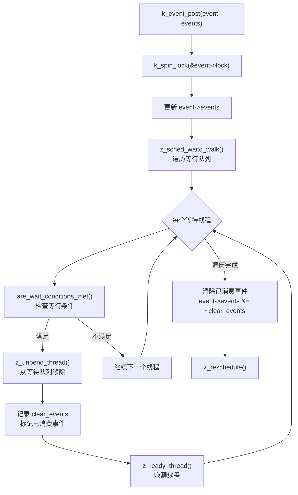
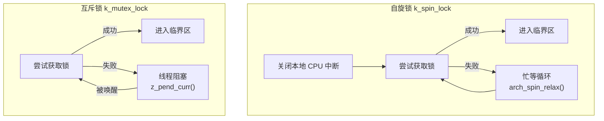
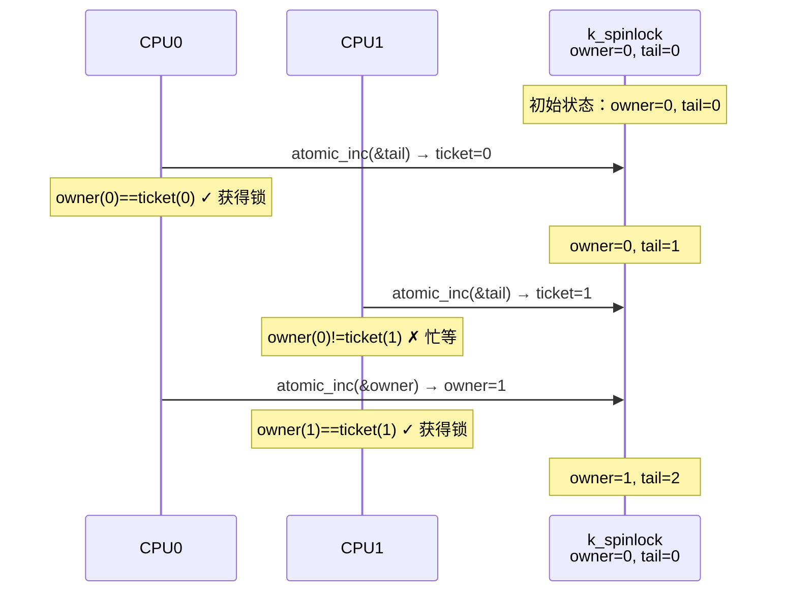

# Zephyr RTOS 同步机制深度解析

> 返回：[入门概览](./00_入门概览.md) | [文档导航](../README.md)

---

## 目录
1. [同步机制概述](#1-同步机制概述)
2. [信号量（Semaphore）](#2-信号量semaphore)
3. [互斥锁（Mutex）](#3-互斥锁mutex)
4. [条件变量（Condition Variable）](#4-条件变量condition-variable)
5. [事件（Event）](#5-事件event)
6. [自旋锁（Spinlock）](#6-自旋锁spinlock)
7. [同步机制对比](#7-同步机制对比)
8. [与其他RTOS对比](#8-与其他rtos对比)

---

## 1. 同步机制概述

### 1.1 为什么需要同步机制

在多线程环境中，多个线程可能同时访问共享资源，这会导致以下问题：

```
┌─────────────────────────────────────────────────────────────────────────────┐
│                           多线程竞态条件示例                                 │
├─────────────────────────────────────────────────────────────────────────────┤
│                                                                             │
│   共享变量: int counter = 0;                                                │
│                                                                             │
│   Thread A                          Thread B                                │
│   ─────────────                     ─────────────                          │
│   1. read counter (0)                                                      │
│                                      2. read counter (0)                   │
│   3. counter = 0 + 1                                                       │
│                                      4. counter = 0 + 1                    │
│   5. write counter (1)                                                     │
│                                      6. write counter (1)                  │
│                                                                             │
│   期望结果: counter = 2                                                     │
│   实际结果: counter = 1  (错误!)                                            │
│                                                                             │
└─────────────────────────────────────────────────────────────────────────────┘
```

### 1.2 Zephyr 同步机制分类

```
┌─────────────────────────────────────────────────────────────────────────────┐
│                           Zephyr 同步机制分类                                │
├─────────────────────────────────────────────────────────────────────────────┤
│                                                                             │
│   ┌─────────────────────────────────────────────────────────────────────┐ │
│   │                     互斥同步（Mutual Exclusion）                     │ │
│   │                                                                     │ │
│   │   目的：保护共享资源，确保同一时刻只有一个线程访问                    │ │
│   │                                                                     │ │
│   │   ┌─────────────┐  ┌─────────────┐                                │ │
│   │   │   信号量    │  │   互斥锁    │                                │ │
│   │   │  (k_sem)   │  │  (k_mutex)  │                                │ │
│   │   │            │  │             │                                │ │
│   │   │ • 二进制   │  │ • 优先级继承│                                │ │
│   │   │ • 计数型   │  │ • 所有权    │                                │ │
│   │   └─────────────┘  └─────────────┘                                │ │
│   └─────────────────────────────────────────────────────────────────────┘ │
│                                                                             │
│   ┌─────────────────────────────────────────────────────────────────────┐ │
│   │                     条件同步（Condition Synchronization）           │ │
│   │                                                                     │ │
│   │   目的：线程间协调，等待特定条件满足                                │ │
│   │                                                                     │ │
│   │   ┌─────────────┐  ┌─────────────┐                                │ │
│   │   │  条件变量   │  │    事件     │                                │ │
│   │   │(k_condvar) │  │  (k_event)  │                                │ │
│   │   │            │  │             │                                │ │
│   │   │ • 条件等待 │  │ • 事件集合  │                                │ │
│   │   │ • 广播唤醒 │  │ • ANY/ALL   │                                │ │
│   │   └─────────────┘  └─────────────┘                                │ │
│   └─────────────────────────────────────────────────────────────────────┘ │
│                                                                             │
│   ┌─────────────────────────────────────────────────────────────────────┐ │
│   │                     数据传递（Data Passing）                        │ │
│   │                                                                     │ │
│   │   目的：线程间数据传输                                              │ │
│   │                                                                     │ │
│   │   ┌─────────────┐  ┌─────────────┐  ┌─────────────┐               │ │
│   │   │   消息队列  │  │    管道     │  │    邮箱     │               │ │
│   │   │  (k_msgq)  │  │  (k_pipe)   │  │ (k_mbox)   │               │ │
│   │   └─────────────┘  └─────────────┘  └─────────────┘               │ │
│   └─────────────────────────────────────────────────────────────────────┘ │
│                                                                             │
└─────────────────────────────────────────────────────────────────────────────┘
```

### 1.3 同步机制选择指南

| 场景 | 推荐机制 | 原因 |
|-----|---------|------|
| 保护临界区 | 互斥锁 | 优先级继承，避免优先级反转 |
| 资源池管理 | 计数信号量 | 可计数多个资源 |
| 线程间简单同步 | 二进制信号量 | 轻量级 |
| 等待复杂条件 | 条件变量 | 与互斥锁配合使用 |
| 多事件等待 | 事件 | 支持事件集合 |
| 数据传输 | 消息队列/管道 | 带数据传递 |

---

## 2. 信号量（Semaphore）

### 2.1 概念与原理

> **背景知识**：信号量由荷兰计算机科学家 Edsger Dijkstra 于 1965 年提出，是一种用于控制多个进程/线程对共享资源访问的同步机制。

#### 2.1.1 信号量类型

```
┌─────────────────────────────────────────────────────────────────────────────┐
│                           信号量类型                                         │
├─────────────────────────────────────────────────────────────────────────────┤
│                                                                             │
│   ┌─────────────────────────────────────────────────────────────────────┐ │
│   │                     二进制信号量 (Binary Semaphore)                 │ │
│   │                                                                     │ │
│   │   计数范围: 0 或 1                                                  │ │
│   │   用途: 互斥访问、线程同步                                          │ │
│   │   初始值: 通常为 0（同步）或 1（互斥）                              │ │
│   │                                                                     │ │
│   │   ┌─────┐                                                           │ │
│   │   │  0  │ ◄─── 不可获取，线程等待                                   │ │
│   │   └─────┘                                                           │ │
│   │   ┌─────┐                                                           │ │
│   │   │  1  │ ◄─── 可获取，线程继续                                     │ │
│   │   └─────┘                                                           │ │
│   └─────────────────────────────────────────────────────────────────────┘ │
│                                                                             │
│   ┌─────────────────────────────────────────────────────────────────────┐ │
│   │                     计数信号量 (Counting Semaphore)                 │ │
│   │                                                                     │ │
│   │   计数范围: 0 到 N (limit)                                          │ │
│   │   用途: 资源池管理、生产者-消费者                                    │ │
│   │   初始值: 可用资源数量                                              │ │
│   │                                                                     │ │
│   │   ┌─────┐                                                           │ │
│   │   │  3  │ ◄─── 3个资源可用                                          │ │
│   │   └─────┘                                                           │ │
│   │   ┌─────┐                                                           │ │
│   │   │  0  │ ◄─── 无资源，线程等待                                     │ │
│   │   └─────┘                                                           │ │
│   └─────────────────────────────────────────────────────────────────────┘ │
│                                                                             │
└─────────────────────────────────────────────────────────────────────────────┘
```

### 2.2 数据结构

```c
// 信号量结构定义
struct k_sem {
    uint32_t count;          // 当前计数
    uint32_t limit;          // 最大计数限制
    _wait_q_t wait_q;        // 等待队列
    
#ifdef CONFIG_POLL
    sys_dlist_t poll_events; // 轮询事件列表
#endif
    
#ifdef CONFIG_OBJ_CORE_SEM
    struct k_obj_core obj_core;
#endif
};
```

### 2.3 源码实现分析

#### 2.3.1 初始化

```c
// kernel/sem.c
int z_impl_k_sem_init(struct k_sem *sem, unsigned int initial_count,
                      unsigned int limit)
{
    // 参数校验
    CHECKIF(limit == 0U || initial_count > limit) {
        return -EINVAL;
    }

    sem->count = initial_count;
    sem->limit = limit;

    // 初始化等待队列
    z_waitq_init(&sem->wait_q);
    
#if defined(CONFIG_POLL)
    sys_dlist_init(&sem->poll_events);
#endif
    
    k_object_init(sem);

    return 0;
}
```

#### 2.3.2 获取信号量（P操作/Wait）

```c
int z_impl_k_sem_take(struct k_sem *sem, k_timeout_t timeout)
{
    int ret;

    // ISR 中只能使用 K_NO_WAIT
    __ASSERT(((arch_is_in_isr() == false) ||
              K_TIMEOUT_EQ(timeout, K_NO_WAIT)), "");

    k_spinlock_key_t key = k_spin_lock(&lock);

    // 情况1: 信号量可用，直接获取
    if (likely(sem->count > 0U)) {
        sem->count--;
        k_spin_unlock(&lock, key);
        ret = 0;
        goto out;
    }

    // 情况2: 不等待，返回忙
    if (K_TIMEOUT_EQ(timeout, K_NO_WAIT)) {
        k_spin_unlock(&lock, key);
        ret = -EBUSY;
        goto out;
    }

    // 情况3: 阻塞等待
    ret = z_pend_curr(&lock, key, &sem->wait_q, timeout);

out:
    return ret;
}
```

#### 2.3.3 释放信号量（V操作/Signal）

```c
void z_impl_k_sem_give(struct k_sem *sem)
{
    k_spinlock_key_t key = k_spin_lock(&lock);
    struct k_thread *thread;
    bool resched;

    // 尝试唤醒等待的线程
    thread = z_unpend_first_thread(&sem->wait_q);

    if (unlikely(thread != NULL)) {
        // 有等待线程，唤醒它
        arch_thread_return_value_set(thread, 0);
        z_ready_thread(thread);
        resched = true;
    } else {
        // 无等待线程，增加计数
        sem->count += (sem->count != sem->limit) ? 1U : 0U;
        resched = handle_poll_events(sem);
    }

    // 可能需要重新调度
    if (unlikely(resched)) {
        z_reschedule(&lock, key);
    } else {
        k_spin_unlock(&lock, key);
    }
}
```

### 2.4 API 接口

```c
// 静态定义和初始化
K_SEM_DEFINE(my_sem, initial_count, limit);

// 动态初始化
int k_sem_init(struct k_sem *sem, unsigned int initial_count, unsigned int limit);

// 获取信号量（阻塞）
int k_sem_take(struct k_sem *sem, k_timeout_t timeout);

// 释放信号量
void k_sem_give(struct k_sem *sem);

// 重置信号量
void k_sem_reset(struct k_sem *sem);

// 获取当前计数
unsigned int k_sem_count_get(struct k_sem *sem);
```

### 2.5 使用示例

#### 2.5.1 二进制信号量 - 线程同步

```c
#include <zephyr/kernel.h>

K_SEM_DEFINE(sync_sem, 0, 1);  // 初始值0，用于同步

void producer_thread(void *p1, void *p2, void *p3)
{
    while (1) {
        produce_data();
        
        // 通知消费者数据已就绪
        k_sem_give(&sync_sem);
        
        k_msleep(100);
    }
}

void consumer_thread(void *p1, void *p2, void *p3)
{
    while (1) {
        // 等待数据就绪
        k_sem_take(&sync_sem, K_FOREVER);
        
        consume_data();
    }
}

K_THREAD_DEFINE(producer_id, STACK_SIZE, producer_thread, NULL, NULL, NULL,
                PRIORITY, 0, 0);
K_THREAD_DEFINE(consumer_id, STACK_SIZE, consumer_thread, NULL, NULL, NULL,
                PRIORITY, 0, 0);
```

#### 2.5.2 计数信号量 - 资源池管理

```c
#include <zephyr/kernel.h>

#define POOL_SIZE 5

K_SEM_DEFINE(pool_sem, POOL_SIZE, POOL_SIZE);  // 5个资源可用

void *resource_pool[POOL_SIZE];
int pool_index = 0;

void *acquire_resource(void)
{
    void *resource = NULL;
    
    // 等待资源可用
    if (k_sem_take(&pool_sem, K_MSEC(100)) == 0) {
        resource = resource_pool[pool_index++];
    }
    
    return resource;
}

void release_resource(void *resource)
{
    resource_pool[--pool_index] = resource;
    
    // 释放资源
    k_sem_give(&pool_sem);
}
```

### 2.6 状态转换图

```
┌─────────────────────────────────────────────────────────────────────────────┐
│                           信号量状态转换                                     │
├─────────────────────────────────────────────────────────────────────────────┤
│                                                                             │
│   k_sem_take() 流程:                                                        │
│                                                                             │
│   ┌─────────────────┐                                                       │
│   │ 调用 k_sem_take │                                                       │
│   └────────┬────────┘                                                       │
│            │                                                                │
│            ▼                                                                │
│   ┌─────────────────┐     是     ┌─────────────────┐                       │
│   │ count > 0 ?     │──────────►│ count--         │                       │
│   └────────┬────────┘            │ 返回成功        │                       │
│            │ 否                  └─────────────────┘                       │
│            ▼                                                                │
│   ┌─────────────────┐     是     ┌─────────────────┐                       │
│   │ timeout=NO_WAIT?│──────────►│ 返回 -EBUSY     │                       │
│   └────────┬────────┘            └─────────────────┘                       │
│            │ 否                                                             │
│            ▼                                                                │
│   ┌─────────────────┐                                                       │
│   │ 加入等待队列    │                                                       │
│   │ 阻塞当前线程    │                                                       │
│   └────────┬────────┘                                                       │
│            │                                                                │
│            ▼                                                                │
│   ┌─────────────────┐     被唤醒   ┌─────────────────┐                     │
│   │ 等待被唤醒或    │───────────►│ 返回成功        │                     │
│   │ 超时           │             └─────────────────┘                     │
│   └────────┬────────┘                                                       │
│            │ 超时                                                           │
│            ▼                                                                │
│   ┌─────────────────┐                                                       │
│   │ 返回 -EAGAIN    │                                                       │
│   └─────────────────┘                                                       │
│                                                                             │
│   k_sem_give() 流程:                                                        │
│                                                                             │
│   ┌─────────────────┐                                                       │
│   │ 调用 k_sem_give │                                                       │
│   └────────┬────────┘                                                       │
│            │                                                                │
│            ▼                                                                │
│   ┌─────────────────┐     是     ┌─────────────────┐                       │
│   │ 有等待线程？    │──────────►│ 唤醒第一个线程  │                       │
│   └────────┬────────┘            │ 触发调度        │                       │
│            │ 否                  └─────────────────┘                       │
│            ▼                                                                │
│   ┌─────────────────┐                                                       │
│   │ count < limit ? │                                                       │
│   └────────┬────────┘                                                       │
│            │                                                                │
│     ┌──────┴──────┐                                                         │
│     │             │                                                         │
│     ▼             ▼                                                         │
│ ┌───────┐    ┌───────┐                                                     │
│ │count++│    │忽略   │  count已达上限                                       │
│ └───────┘    └───────┘                                                     │
│                                                                             │
└─────────────────────────────────────────────────────────────────────────────┘
```

---

## 3. 互斥锁（Mutex）

### 3.1 概念与原理

> **背景知识**：互斥锁（Mutex，Mutual Exclusion 的缩写）是一种特殊的二进制信号量，具有**所有权**和**优先级继承**特性。

#### 3.1.1 互斥锁 vs 信号量

```
┌─────────────────────────────────────────────────────────────────────────────┐
│                        互斥锁与信号量对比                                    │
├─────────────────────────────────────────────────────────────────────────────┤
│                                                                             │
│   特性              互斥锁 (Mutex)          信号量 (Semaphore)              │
│   ─────────────────────────────────────────────────────────────────────    │
│   所有权            有（只有持有者可解锁）  无（任何线程可释放）            │
│   优先级继承        支持                    不支持                          │
│   递归锁定          支持（lock_count）      不支持                          │
│   计数              无（只有锁定/解锁）     有（可计数）                    │
│   ISR中使用         不允许                  允许（仅give）                  │
│   用途              保护临界区              同步、资源管理                  │
│                                                                             │
└─────────────────────────────────────────────────────────────────────────────┘
```

### 3.2 优先级继承

#### 3.2.1 优先级反转问题

```
┌─────────────────────────────────────────────────────────────────────────────┐
│                           优先级反转问题                                     │
├─────────────────────────────────────────────────────────────────────────────┤
│                                                                             │
│   场景：三个线程，优先级 L < M < H                                          │
│                                                                             │
│   时间轴 ───────────────────────────────────────────────────────────────►  │
│                                                                             │
│   Thread L (低优先级)                                                        │
│   ├───────┼─────────────────────────────────────────────────────┤          │
│   │获取锁 │                    被抢占                          │释放锁│    │
│   └───────┴─────────────────────────────────────────────────────┴──────┘    │
│                                                                             │
│   Thread M (中优先级)                                                        │
│           ├───────────────────────────────────────────┤                    │
│           │              运行中                       │                    │
│           └───────────────────────────────────────────┘                    │
│                                                                             │
│   Thread H (高优先级)                                                        │
│                   ├──────┤                              ├─────────┤        │
│                   │等待锁│                              │ 获取锁  │        │
│                   └──────┘                              └─────────┘        │
│                                                                             │
│   问题：高优先级线程 H 被中优先级线程 M 间接阻塞！                          │
│         H 必须等待 M 执行完，才能让 L 释放锁                                │
│                                                                             │
└─────────────────────────────────────────────────────────────────────────────┘
```

#### 3.2.2 优先级继承解决方案

```
┌─────────────────────────────────────────────────────────────────────────────┐
│                         优先级继承解决方案                                   │
├─────────────────────────────────────────────────────────────────────────────┤
│                                                                             │
│   当高优先级线程等待低优先级线程持有的互斥锁时：                             │
│   低优先级线程临时提升到高优先级，尽快释放锁                                 │
│                                                                             │
│   时间轴 ───────────────────────────────────────────────────────────────►  │
│                                                                             │
│   Thread L (低优先级)                                                        │
│   ├───────┼─────────────────────────────┤                                  │
│   │获取锁 │ 优先级提升到 H              │释放锁│                            │
│   └───────┴─────────────────────────────┴──────┘                            │
│           ▲           ▲                                                     │
│           │           │                                                     │
│           │     继承 H 的优先级                                             │
│           │                                                                 │
│   Thread H (高优先级)                                                        │
│                   ├──────┤            ├─────────┤                          │
│                   │等待锁│            │ 获取锁  │                          │
│                   └──────┘            └─────────┘                          │
│                                                                             │
│   Thread M (中优先级)                                                        │
│                                             ├───────────┤                  │
│                                             │  运行中   │                  │
│                                             └───────────┘                  │
│                                                                             │
│   结果：H 的等待时间大大减少！                                              │
│                                                                             │
└─────────────────────────────────────────────────────────────────────────────┘
```

### 3.3 数据结构

```c
// 互斥锁结构定义
struct k_mutex {
    struct k_thread *owner;       // 当前持有者
    uint32_t lock_count;          // 锁定计数（支持递归锁定）
    
#if (CONFIG_PRIORITY_CEILING < K_LOWEST_THREAD_PRIO)
    int owner_orig_prio;          // 持有者原始优先级
#endif
    
    _wait_q_t wait_q;             // 等待队列
    
#ifdef CONFIG_OBJ_CORE_MUTEX
    struct k_obj_core obj_core;
#endif
};
```

### 3.4 源码实现分析

#### 3.4.0 优先级继承与优先级天花板

> ⚠️ Zephyr 互斥锁同时支持**优先级继承**（Priority Inheritance）和**优先级天花板**（Priority Ceiling），源码位于 [kernel/mutex.c](file:///home/pbw/cs-learning-notes/zephyr-src/kernel/mutex.c)。

**优先级反转问题**：

```mermaid
gantt
    title 优先级反转与解决方案
    dateFormat X
    axisFormat %s
    
    section 无保护
    L 持有锁运行    :l1, 0, 10
    M 抢占 L 运行   :m1, 3, 7
    H 等待锁阻塞    :crit, h1, 5, 10
    
    section 优先级继承
    L 持有锁(提升到H) :l2, 0, 8
    H 获取锁运行      :h2, 8, 10
    M 等待            :m2, 10, 14
```



**两种协议对比**：

| 特性 | 优先级继承 (PI) | 优先级天花板 (PC) |
|-----|----------------|------------------|
| 触发时机 | 高优先级线程等待时才提升 | 获取锁时立即提升到天花板 |
| 提升目标 | 等待线程中最高优先级 | `CONFIG_PRIORITY_CEILING` 配置值 |
| 链式继承 | 支持（A→B→C） | 不需要 |
| 实现复杂度 | 较高 | 较低 |
| 阻塞时间上界 | 不确定（依赖运行时） | 确定性的（O(1)） |

**源码中的实现**：

```c
// kernel/mutex.c - 优先级天花板计算

#if (CONFIG_PRIORITY_CEILING < K_LOWEST_THREAD_PRIO)
static int32_t new_prio_for_inheritance(int32_t target, int32_t limit)
{
    // target: 请求锁的线程优先级
    // limit:  当前持有者的优先级
    // 取两者中更高的优先级，再应用天花板限制
    int new_prio = z_is_prio_higher(target, limit) ? target : limit;
    new_prio = z_get_new_prio_with_ceiling(new_prio);
    return new_prio;
}

static bool adjust_owner_prio(struct k_mutex *mutex, int32_t new_prio)
{
    if (mutex->owner->base.prio != new_prio) {
        return z_thread_prio_set(mutex->owner, new_prio);
    }
    return false;
}
#endif
```

**`CONFIG_PRIORITY_CEILING` 的含义**：
- 当该值 `< K_LOWEST_THREAD_PRIO` 时，优先级继承/天花板机制启用
- `z_get_new_prio_with_ceiling()` 确保提升后的优先级不超过天花板
- 天花板优先级是系统范围的配置，不是每个互斥锁独立的

#### 3.4.1 锁定互斥锁

```c
int z_impl_k_mutex_lock(struct k_mutex *mutex, k_timeout_t timeout)
{
    k_spinlock_key_t key;

    // ISR 中不允许使用互斥锁
    __ASSERT(!arch_is_in_isr(), "mutexes cannot be used inside ISRs");

    key = k_spin_lock(&lock);

    // 情况1: 互斥锁未被持有，或当前线程已持有（递归锁定）
    if (likely((mutex->lock_count == 0U) || (mutex->owner == _current))) {

        // 保存原始优先级（首次锁定时）
#if (CONFIG_PRIORITY_CEILING < K_LOWEST_THREAD_PRIO)
        mutex->owner_orig_prio = (mutex->lock_count == 0U) ?
                                _current->base.prio :
                                mutex->owner_orig_prio;
#endif

        mutex->lock_count++;
        mutex->owner = _current;

        k_spin_unlock(&lock, key);
        return 0;
    }

    // 情况2: 不等待，返回忙
    if (unlikely(K_TIMEOUT_EQ(timeout, K_NO_WAIT))) {
        k_spin_unlock(&lock, key);
        return -EBUSY;
    }

    // 情况3: 需要等待 - 实现优先级继承
#if (CONFIG_PRIORITY_CEILING < K_LOWEST_THREAD_PRIO)
    int new_prio = new_prio_for_inheritance(_current->base.prio,
                                            mutex->owner->base.prio);

    // 如果当前线程优先级更高，提升持有者优先级
    if (z_is_prio_higher(new_prio, mutex->owner->base.prio)) {
        adjust_owner_prio(mutex, new_prio);
    }
#endif

    // 阻塞等待
    int got_mutex = z_pend_curr(&lock, key, &mutex->wait_q, timeout);

    // 超时处理：恢复持有者优先级
    if (got_mutex != 0) {
        // ... 恢复优先级逻辑
    }

    return got_mutex;
}
```

#### 3.4.2 解锁互斥锁

```c
int z_impl_k_mutex_unlock(struct k_mutex *mutex)
{
    struct k_thread *new_owner;

    __ASSERT(!arch_is_in_isr(), "mutexes cannot be used inside ISRs");

    // 检查所有权
    CHECKIF(mutex->owner == NULL) {
        return -EINVAL;
    }
    CHECKIF(mutex->owner != _current) {
        return -EPERM;
    }

    // 递归锁定：减少计数
    if (mutex->lock_count > 1U) {
        mutex->lock_count--;
        return 0;
    }

    k_spinlock_key_t key = k_spin_lock(&lock);

    // 恢复持有者原始优先级
#if (CONFIG_PRIORITY_CEILING < K_LOWEST_THREAD_PRIO)
    adjust_owner_prio(mutex, mutex->owner_orig_prio);
#endif

    // 获取下一个等待者
    new_owner = z_unpend_first_thread(&mutex->wait_q);

    mutex->owner = new_owner;

    if (unlikely(new_owner != NULL)) {
        // 有等待者，转移所有权
#if (CONFIG_PRIORITY_CEILING < K_LOWEST_THREAD_PRIO)
        mutex->owner_orig_prio = new_owner->base.prio;
#endif
        arch_thread_return_value_set(new_owner, 0);
        z_ready_thread(new_owner);
        z_reschedule(&lock, key);
    } else {
        // 无等待者，释放锁
        mutex->lock_count = 0U;
        k_spin_unlock(&lock, key);
    }

    return 0;
}
```

### 3.5 API 接口

```c
// 静态定义和初始化
K_MUTEX_DEFINE(my_mutex);

// 动态初始化
int k_mutex_init(struct k_mutex *mutex);

// 锁定互斥锁
int k_mutex_lock(struct k_mutex *mutex, k_timeout_t timeout);

// 解锁互斥锁
int k_mutex_unlock(struct k_mutex *mutex);
```

### 3.6 使用示例

#### 3.6.1 基本使用

```c
#include <zephyr/kernel.h>

K_MUTEX_DEFINE(my_mutex);
int shared_counter = 0;

void increment_counter(void)
{
    k_mutex_lock(&my_mutex, K_FOREVER);
    
    shared_counter++;
    
    k_mutex_unlock(&my_mutex);
}

void protected_thread(void *p1, void *p2, void *p3)
{
    while (1) {
        increment_counter();
        k_msleep(10);
    }
}
```

#### 3.6.2 递归锁定

```c
#include <zephyr/kernel.h>

K_MUTEX_DEFINE(recursive_mutex);

void function_a(void)
{
    k_mutex_lock(&recursive_mutex, K_FOREVER);
    
    // 访问共享资源
    function_b();  // 内部也会锁定同一互斥锁
    
    k_mutex_unlock(&recursive_mutex);
}

void function_b(void)
{
    k_mutex_lock(&recursive_mutex, K_FOREVER);  // 递归锁定，成功
    
    // 访问共享资源
    
    k_mutex_unlock(&recursive_mutex);
}
```

#### 3.6.3 避免死锁

```c
#include <zephyr/kernel.h>

K_MUTEX_DEFINE(mutex_a);
K_MUTEX_DEFINE(mutex_b);

// 错误示例：可能导致死锁
void deadlock_example(void)
{
    // Thread 1          Thread 2
    // lock(A)           lock(B)
    // lock(B)           lock(A)  <- 死锁！
}

// 正确示例：按固定顺序获取锁
void safe_example(void)
{
    // 始终按相同顺序获取锁
    k_mutex_lock(&mutex_a, K_FOREVER);
    k_mutex_lock(&mutex_b, K_FOREVER);
    
    // 访问共享资源
    
    k_mutex_unlock(&mutex_b);
    k_mutex_unlock(&mutex_a);
}

// 更好的方案：使用 k_mutex_lock 带超时
void timeout_example(void)
{
    if (k_mutex_lock(&mutex_a, K_MSEC(100)) != 0) {
        return;  // 获取失败
    }
    
    if (k_mutex_lock(&mutex_b, K_MSEC(100)) != 0) {
        k_mutex_unlock(&mutex_a);
        return;  // 获取失败
    }
    
    // 访问共享资源
    
    k_mutex_unlock(&mutex_b);
    k_mutex_unlock(&mutex_a);
}
```

---

## 4. 条件变量（Condition Variable）

### 4.1 概念与原理

> **背景知识**：条件变量允许线程等待特定条件成立，通常与互斥锁配合使用，实现"等待-通知"模式。

#### 4.1.1 为什么需要条件变量

```
┌─────────────────────────────────────────────────────────────────────────────┐
│                        条件变量的必要性                                      │
├─────────────────────────────────────────────────────────────────────────────┤
│                                                                             │
│   问题场景：消费者等待生产者生产数据                                        │
│                                                                             │
│   方案1：轮询（效率低）                                                     │
│   ┌─────────────────────────────────────────────────────────────────────┐ │
│   │  while (1) {                                                        │ │
│   │      k_mutex_lock(&mutex, K_FOREVER);                              │ │
│   │      if (data_ready) {                                              │ │
│   │          consume_data();                                            │ │
│   │          data_ready = false;                                        │ │
│   │      }                                                              │ │
│   │      k_mutex_unlock(&mutex);                                        │ │
│   │      k_msleep(1);  // 浪费 CPU 时间！                               │ │
│   │  }                                                                  │ │
│   └─────────────────────────────────────────────────────────────────────┘ │
│                                                                             │
│   方案2：条件变量（高效）                                                   │
│   ┌─────────────────────────────────────────────────────────────────────┐ │
│   │  while (1) {                                                        │ │
│   │      k_mutex_lock(&mutex, K_FOREVER);                              │ │
│   │      while (!data_ready) {                                          │ │
│   │          k_condvar_wait(&condvar, &mutex, K_FOREVER);              │ │
│   │      }                                                              │ │
│   │      consume_data();                                                │ │
│   │      data_ready = false;                                            │ │
│   │      k_mutex_unlock(&mutex);                                        │ │
│   │  }                                                                  │ │
│   └─────────────────────────────────────────────────────────────────────┘ │
│                                                                             │
│   条件变量的优势：                                                          │
│   1. 线程在等待时被阻塞，不消耗 CPU                                        │
│   2. 条件满足时立即被唤醒，响应及时                                        │
│   3. 与互斥锁配合，避免竞态条件                                            │
│                                                                             │
└─────────────────────────────────────────────────────────────────────────────┘
```

### 4.2 数据结构

```c
// 条件变量结构定义
struct k_condvar {
    _wait_q_t wait_q;             // 等待队列
    
#ifdef CONFIG_OBJ_CORE_CONDVAR
    struct k_obj_core obj_core;
#endif
};
```

### 4.3 源码实现分析

#### 4.3.1 等待条件变量

```c
int z_impl_k_condvar_wait(struct k_condvar *condvar, struct k_mutex *mutex,
                          k_timeout_t timeout)
{
    k_spinlock_key_t key;
    int ret = -EAGAIN;

    if (unlikely(K_TIMEOUT_EQ(timeout, K_NO_WAIT))) {
        k_mutex_unlock(mutex);
        return ret;
    }

    key = k_spin_lock(&lock);
    
    // 先释放互斥锁（原子操作）
    k_mutex_unlock(mutex);

    // 阻塞等待
    ret = z_pend_curr(&lock, key, &condvar->wait_q, timeout);
    
    // 被唤醒后重新获取互斥锁
    if (ret == 0) {
        k_mutex_lock(mutex, K_FOREVER);
    }

    return ret;
}
```

#### 4.3.2 发送信号

```c
// 唤醒一个等待线程
int z_impl_k_condvar_signal(struct k_condvar *condvar)
{
    k_spinlock_key_t key = k_spin_lock(&lock);

    struct k_thread *thread = z_unpend_first_thread(&condvar->wait_q);

    if (unlikely(thread != NULL)) {
        arch_thread_return_value_set(thread, 0);
        z_ready_thread(thread);
        z_reschedule(&lock, key);
    } else {
        k_spin_unlock(&lock, key);
    }

    return 0;
}

// 唤醒所有等待线程
int z_impl_k_condvar_broadcast(struct k_condvar *condvar)
{
    struct k_thread *pending_thread;
    k_spinlock_key_t key;
    int woken = 0;

    key = k_spin_lock(&lock);

    // 唤醒所有等待线程
    for (pending_thread = z_unpend_first_thread(&condvar->wait_q);
         pending_thread != NULL;
         pending_thread = z_unpend_first_thread(&condvar->wait_q)) {
        woken++;
        arch_thread_return_value_set(pending_thread, 0);
        z_ready_thread(pending_thread);
    }

    if (woken > 0) {
        z_reschedule(&lock, key);
    } else {
        k_spin_unlock(&lock, key);
    }

    return woken;
}
```

### 4.4 API 接口

```c
// 静态定义和初始化
K_CONDVAR_DEFINE(my_condvar);

// 动态初始化
int k_condvar_init(struct k_condvar *condvar);

// 等待条件变量
int k_condvar_wait(struct k_condvar *condvar, struct k_mutex *mutex,
                   k_timeout_t timeout);

// 唤醒一个等待线程
int k_condvar_signal(struct k_condvar *condvar);

// 唤醒所有等待线程
int k_condvar_broadcast(struct k_condvar *condvar);
```

### 4.5 使用示例

#### 4.5.1 生产者-消费者模型

```c
#include <zephyr/kernel.h>

#define BUFFER_SIZE 10

K_MUTEX_DEFINE(buffer_mutex);
K_CONDVAR_DEFINE(not_empty);  // 缓冲区非空
K_CONDVAR_DEFINE(not_full);   // 缓冲区非满

int buffer[BUFFER_SIZE];
int count = 0;
int head = 0;
int tail = 0;

void producer_thread(void *p1, void *p2, void *p3)
{
    int data = 0;
    
    while (1) {
        k_mutex_lock(&buffer_mutex, K_FOREVER);
        
        // 等待缓冲区非满
        while (count == BUFFER_SIZE) {
            k_condvar_wait(&not_full, &buffer_mutex, K_FOREVER);
        }
        
        // 生产数据
        buffer[head] = data++;
        head = (head + 1) % BUFFER_SIZE;
        count++;
        
        // 通知消费者
        k_condvar_signal(&not_empty);
        
        k_mutex_unlock(&buffer_mutex);
        
        k_msleep(100);
    }
}

void consumer_thread(void *p1, void *p2, void *p3)
{
    int data;
    
    while (1) {
        k_mutex_lock(&buffer_mutex, K_FOREVER);
        
        // 等待缓冲区非空
        while (count == 0) {
            k_condvar_wait(&not_empty, &buffer_mutex, K_FOREVER);
        }
        
        // 消费数据
        data = buffer[tail];
        tail = (tail + 1) % BUFFER_SIZE;
        count--;
        
        // 通知生产者
        k_condvar_signal(&not_full);
        
        k_mutex_unlock(&buffer_mutex);
        
        process_data(data);
    }
}
```

#### 4.5.2 多线程等待同一条件

```c
#include <zephyr/kernel.h>

K_MUTEX_DEFINE(state_mutex);
K_CONDVAR_DEFINE(state_changed);

int system_state = 0;

void wait_for_state(int target_state)
{
    k_mutex_lock(&state_mutex, K_FOREVER);
    
    while (system_state != target_state) {
        k_condvar_wait(&state_changed, &state_mutex, K_FOREVER);
    }
    
    k_mutex_unlock(&state_mutex);
}

void set_state(int new_state)
{
    k_mutex_lock(&state_mutex, K_FOREVER);
    
    system_state = new_state;
    
    // 唤醒所有等待的线程
    k_condvar_broadcast(&state_changed);
    
    k_mutex_unlock(&state_mutex);
}
```

### 4.6 使用注意事项

```
┌─────────────────────────────────────────────────────────────────────────────┐
│                        条件变量使用注意事项                                  │
├─────────────────────────────────────────────────────────────────────────────┤
│                                                                             │
│   1. 必须与互斥锁配合使用                                                   │
│      ┌─────────────────────────────────────────────────────────────────┐   │
│      │  k_condvar_wait() 会原子地释放互斥锁并阻塞                      │   │
│      │  被唤醒后会自动重新获取互斥锁                                    │   │
│      └─────────────────────────────────────────────────────────────────┘   │
│                                                                             │
│   2. 使用 while 循环检查条件                                                │
│      ┌─────────────────────────────────────────────────────────────────┐   │
│      │  while (!condition) {                                           │   │
│      │      k_condvar_wait(&condvar, &mutex, K_FOREVER);              │   │
│      │  }                                                              │   │
│      │                                                                 │   │
│      │  原因：                                                         │   │
│      │  - 虚假唤醒：线程可能在没有 signal 的情况下被唤醒               │   │
│      │  - 条件变化：被唤醒时条件可能已不满足                           │   │
│      └─────────────────────────────────────────────────────────────────┘   │
│                                                                             │
│   3. signal vs broadcast                                                    │
│      ┌─────────────────────────────────────────────────────────────────┐   │
│      │  signal:   唤醒一个等待线程（效率高）                           │   │
│      │  broadcast: 唤醒所有等待线程（确保不遗漏）                      │   │
│      │                                                                 │   │
│      │  使用 signal 的条件：                                           │   │
│      │  - 所有等待线程等待相同条件                                    │   │
│      │  - 每次状态改变只允许一个线程继续                              │   │
│      │                                                                 │   │
│      │  使用 broadcast 的条件：                                        │   │
│      │  - 等待线程可能等待不同条件                                    │   │
│      │  - 状态改变可能满足多个线程                                    │   │
│      └─────────────────────────────────────────────────────────────────┘   │
│                                                                             │
└─────────────────────────────────────────────────────────────────────────────┘
```

---

## 5. 事件（Event）

### 5.1 概念与原理

事件（Event）是一种用于线程间同步的机制，允许线程等待一个或多个事件的发生。

#### 5.1.1 事件特性

```
┌─────────────────────────────────────────────────────────────────────────────┐
│                           事件特性                                          │
├─────────────────────────────────────────────────────────────────────────────┤
│                                                                             │
│   ┌─────────────────────────────────────────────────────────────────────┐ │
│   │                     事件集合 (Event Set)                            │ │
│   │                                                                     │ │
│   │   事件使用 32 位无符号整数表示，每一位代表一个事件：                │ │
│   │                                                                     │ │
│   │   Bit 31  30  29  ...  2   1   0                                   │ │
│   │       │   │   │       │   │   │                                    │ │
│   │       ▼   ▼   ▼       ▼   ▼   ▼                                    │ │
│   │   ┌───┬───┬───┬───┬───┬───┬───┐                                    │ │
│   │   │ 0 │ 1 │ 0 │...│ 1 │ 0 │ 1 │                                    │ │
│   │   └───┴───┴───┴───┴───┴───┴───┘                                    │ │
│   │       │           │       │                                        │ │
│   │       │           │       └─ Event 0: 数据就绪                     │ │
│   │       │           └─ Event 2: 网络连接                             │ │
│   │       └─ Event 30: 错误发生                                        │ │
│   │                                                                     │ │
│   └─────────────────────────────────────────────────────────────────────┘ │
│                                                                             │
│   ┌─────────────────────────────────────────────────────────────────────┐ │
│   │                     等待模式                                        │ │
│   │                                                                     │ │
│   │   K_EVENT_WAIT_ANY: 等待任意一个指定事件                           │ │
│   │   ┌───────────────────────────────────────────────────────────┐    │ │
│   │   │  等待事件: 0b0101                                         │    │ │
│   │   │  当前事件: 0b0010                                         │    │ │
│   │   │  匹配结果: 0b0000 (无匹配)                                │    │ │
│   │   │                                                           │    │ │
│   │   │  等待事件: 0b0101                                         │    │ │
│   │   │  当前事件: 0b0011                                         │    │ │
│   │   │  匹配结果: 0b0001 (Event 0 匹配)                          │    │ │
│   │   └───────────────────────────────────────────────────────────┘    │ │
│   │                                                                     │ │
│   │   K_EVENT_WAIT_ALL: 等待所有指定事件                               │ │
│   │   ┌───────────────────────────────────────────────────────────┐    │ │
│   │   │  等待事件: 0b0101                                         │    │ │
│   │   │  当前事件: 0b0011                                         │    │ │
│   │   │  匹配结果: 0b0000 (Event 2 未发生)                        │    │ │
│   │   │                                                           │    │ │
│   │   │  等待事件: 0b0101                                         │    │ │
│   │   │  当前事件: 0b0111                                         │    │ │
│   │   │  匹配结果: 0b0101 (Event 0 和 2 都发生)                   │    │ │
│   │   └───────────────────────────────────────────────────────────┘    │ │
│   │                                                                     │ │
│   └─────────────────────────────────────────────────────────────────────┘ │
│                                                                             │
└─────────────────────────────────────────────────────────────────────────────┘
```

### 5.2 数据结构

```c
// 事件结构定义
struct k_event {
    uint32_t events;            // 当前事件集合
    struct k_spinlock lock;     // 自旋锁
    _wait_q_t wait_q;           // 等待队列
    
#ifdef CONFIG_OBJ_CORE_EVENT
    struct k_obj_core obj_core;
#endif
};

// 线程中的事件相关字段
struct k_thread {
    // ...
    struct k_thread *next_event_link;   // 事件链表链接
    uint32_t events;                    // 等待/接收的事件
    uint32_t event_options;             // 事件选项
    // ...
};
```

### 5.3 源码实现分析

#### 5.3.1 事件遍历唤醒机制

> ⚠️ 这是 Event 实现的核心机制，源码位于 [kernel/events.c](file:///home/pbw/cs-learning-notes/zephyr-src/kernel/events.c)。

当 `k_event_post()` 被调用时，内核需要遍历等待队列，检查每个等待线程的条件是否满足。这个过程通过 `z_sched_waitq_walk()` 实现：



**关键设计**：多个线程可能等待同一事件的不同子集。`k_event_post()` 会一次性唤醒所有满足条件的线程，而不是只唤醒第一个。

#### 5.3.2 发送事件

```c
static uint32_t k_event_post_internal(struct k_event *event, uint32_t events,
                                      uint32_t events_mask)
{
    k_spinlock_key_t key;
    struct event_walk_data data;
    uint32_t previous_events;

    key = k_spin_lock(&event->lock);

    previous_events = event->events & events_mask;
    
    // 更新事件集合
    events = (event->events & ~events_mask) | (events & events_mask);

    data.events = events;
    data.clear_events = 0;
    
    // 遍历等待队列，唤醒满足条件的线程
    z_sched_waitq_walk(&event->wait_q, event_walk_op, EVENT_POST_WALK_OP_FN, &data);

    // 保存未被消费的事件
    event->events = data.events & ~data.clear_events;

    z_reschedule(&event->lock, key);

    return previous_events;
}

// 检查等待条件是否满足
static uint32_t are_wait_conditions_met(uint32_t desired, uint32_t current,
                                        unsigned int wait_condition)
{
    uint32_t match = current & desired;

    if ((wait_condition == K_EVENT_WAIT_ALL) && (match != desired)) {
        return 0;  // 需要所有事件，但不满足
    }

    return match;
}
```

#### 5.3.2 等待事件

```c
static uint32_t k_event_wait_internal(struct k_event *event, uint32_t events,
                                      unsigned int options, k_timeout_t timeout)
{
    uint32_t rv = 0;
    unsigned int wait_condition;
    struct k_thread *thread;

    if (events == 0) {
        return 0;
    }

    wait_condition = options & K_EVENT_WAIT_MASK;
    thread = k_sched_current_thread_query();

    k_spinlock_key_t key = k_spin_lock(&event->lock);

    // 可选：重置事件
    if (options & K_EVENT_OPTION_RESET) {
        event->events = 0;
    }

    // 检查条件是否已满足
    rv = are_wait_conditions_met(events, event->events, wait_condition);
    if (rv != 0) {
        // 可选：清除匹配的事件
        if (options & K_EVENT_OPTION_CLEAR) {
            event->events &= ~rv;
        }
        k_spin_unlock(&event->lock, key);
        goto out;
    }

    // 不等待
    if (K_TIMEOUT_EQ(timeout, K_NO_WAIT)) {
        k_spin_unlock(&event->lock, key);
        goto out;
    }

    // 保存等待信息到线程结构
    thread->events = events;
    thread->event_options = options;

    // 阻塞等待
    if (z_pend_curr(&event->lock, key, &event->wait_q, timeout) == 0) {
        rv = thread->events;  // 获取匹配的事件
    }

out:
    return rv;
}
```

### 5.4 API 接口

```c
// 静态定义和初始化
K_EVENT_DEFINE(my_event);

// 动态初始化
void k_event_init(struct k_event *event);

// 发送事件
uint32_t k_event_post(struct k_event *event, uint32_t events);

// 设置事件（覆盖所有）
uint32_t k_event_set(struct k_event *event, uint32_t events);

// 设置事件（掩码）
uint32_t k_event_set_masked(struct k_event *event, uint32_t events, uint32_t events_mask);

// 清除事件
uint32_t k_event_clear(struct k_event *event, uint32_t events);

// 等待任意事件
uint32_t k_event_wait(struct k_event *event, uint32_t events, bool reset, k_timeout_t timeout);

// 等待所有事件
uint32_t k_event_wait_all(struct k_event *event, uint32_t events, bool reset, k_timeout_t timeout);

// 安全等待（自动清除匹配事件）
uint32_t k_event_wait_safe(struct k_event *event, uint32_t events, bool reset, k_timeout_t timeout);
uint32_t k_event_wait_all_safe(struct k_event *event, uint32_t events, bool reset, k_timeout_t timeout);
```

### 5.5 使用示例

#### 5.5.1 基本事件同步

```c
#include <zephyr/kernel.h>

K_EVENT_DEFINE(my_event);

#define EVENT_DATA_READY   BIT(0)
#define EVENT_NETWORK_UP   BIT(1)
#define EVENT_ERROR        BIT(2)

void producer_thread(void *p1, void *p2, void *p3)
{
    while (1) {
        produce_data();
        
        // 发送数据就绪事件
        k_event_post(&my_event, EVENT_DATA_READY);
        
        k_msleep(100);
    }
}

void consumer_thread(void *p1, void *p2, void *p3)
{
    while (1) {
        // 等待数据就绪事件
        uint32_t events = k_event_wait(&my_event, EVENT_DATA_READY, 
                                        false, K_FOREVER);
        
        if (events & EVENT_DATA_READY) {
            consume_data();
        }
    }
}
```

#### 5.5.2 多事件等待

```c
#include <zephyr/kernel.h>

K_EVENT_DEFINE(system_event);

#define EVENT_SENSOR_1_READY  BIT(0)
#define EVENT_SENSOR_2_READY  BIT(1)
#define EVENT_SENSOR_3_READY  BIT(2)
#define EVENT_ALL_SENSORS     (EVENT_SENSOR_1_READY | EVENT_SENSOR_2_READY | EVENT_SENSOR_3_READY)

void sensor_thread_1(void *p1, void *p2, void *p3)
{
    while (1) {
        read_sensor_1();
        k_event_post(&system_event, EVENT_SENSOR_1_READY);
        k_msleep(100);
    }
}

void sensor_thread_2(void *p1, void *p2, void *p3)
{
    while (1) {
        read_sensor_2();
        k_event_post(&system_event, EVENT_SENSOR_2_READY);
        k_msleep(150);
    }
}

void sensor_thread_3(void *p1, void *p2, void *p3)
{
    while (1) {
        read_sensor_3();
        k_event_post(&system_event, EVENT_SENSOR_3_READY);
        k_msleep(200);
    }
}

void aggregator_thread(void *p1, void *p2, void *p3)
{
    while (1) {
        // 等待所有传感器数据就绪
        uint32_t events = k_event_wait_all(&system_event, EVENT_ALL_SENSORS,
                                            true, K_FOREVER);  // reset=true
        
        if (events == EVENT_ALL_SENSORS) {
            process_all_sensor_data();
        }
    }
}
```

#### 5.5.3 事件组合使用

```c
#include <zephyr/kernel.h>

K_EVENT_DEFINE(control_event);

#define EVENT_START    BIT(0)
#define EVENT_STOP     BIT(1)
#define EVENT_PAUSE    BIT(2)
#define EVENT_RESUME   BIT(3)
#define EVENT_ERROR    BIT(4)

void control_thread(void *p1, void *p2, void *p3)
{
    while (1) {
        // 等待启动或错误事件
        uint32_t events = k_event_wait(&control_event, 
                                        EVENT_START | EVENT_ERROR,
                                        false, K_FOREVER);
        
        if (events & EVENT_ERROR) {
            handle_error();
            continue;
        }
        
        if (events & EVENT_START) {
            run_operation();
        }
    }
}

void external_controller(void)
{
    // 启动操作
    k_event_post(&control_event, EVENT_START);
    
    // 暂停操作
    k_event_post(&control_event, EVENT_PAUSE);
    
    // 恢复操作
    k_event_post(&control_event, EVENT_RESUME);
    
    // 停止操作
    k_event_post(&control_event, EVENT_STOP);
}
```

---

## 6. 自旋锁（Spinlock）

### 6.1 概念与原理

> **背景知识**：自旋锁是最底层的同步原语，适用于 SMP 多核系统和中断上下文。与互斥锁不同，自旋锁在无法获取锁时**忙等（busy-wait）**而不是阻塞睡眠。源码位于 [include/zephyr/spinlock.h](file:///home/pbw/cs-learning-notes/zephyr-src/include/zephyr/spinlock.h)。

#### 6.1.1 自旋锁 vs 互斥锁



| 特性 | 自旋锁 | 互斥锁 |
|-----|--------|--------|
| 等待方式 | 忙等（CPU 旋转） | 阻塞（线程睡眠） |
| 使用场景 | ISR、SMP、极短临界区 | 一般线程同步 |
| 上下文切换 | 无 | 有 |
| 持锁时间 | 必须**极短** | 可以较长 |
| ISR 中使用 | ✅ 可以 | ❌ 禁止 |
| 优先级继承 | 不支持 | 支持 |
| 递归锁定 | ❌ 死锁 | ✅ 支持 |
| SMP 支持 | ✅ 核心用途 | ✅ 支持 |

### 6.2 数据结构

```c
// include/zephyr/spinlock.h

struct k_spinlock {
#ifdef CONFIG_SMP
#ifdef CONFIG_TICKET_SPINLOCKS
    atomic_t owner;    // 当前持有者的 ticket 号
    atomic_t tail;     // 下一个可用 ticket 号
#else
    atomic_t locked;   // 0=未锁定, 1=已锁定
#endif
#endif

#ifdef CONFIG_SPIN_VALIDATE
    uintptr_t thread_cpu;   // 持有锁的线程 + CPU ID
#ifdef CONFIG_SPIN_LOCK_TIME_LIMIT
    uint32_t lock_time;     // 获取锁的时间（用于检测持锁过长）
#endif
#endif
};

typedef struct z_spinlock_key k_spinlock_key_t;

struct z_spinlock_key {
    int key;   // 中断状态保存
};
```

**关键理解**：
- 单核（!CONFIG_SMP）时，自旋锁退化为中断禁用（`arch_irq_lock()`），不需要原子变量
- SMP 时使用原子 CAS 或 Ticket Lock 算法保证多核互斥
- `CONFIG_SPIN_VALIDATE` 启用后可以检测非法解锁、持锁过长等错误

### 6.3 源码实现分析

#### 6.3.1 加锁流程

```c
// include/zephyr/spinlock.h（简化）

static ALWAYS_INLINE k_spinlock_key_t k_spin_lock(struct k_spinlock *l)
{
    k_spinlock_key_t k;

    // 1. 关闭本地 CPU 中断
    k.key = arch_irq_lock();

    // 2. 验证（调试模式）
    z_spinlock_validate_pre(l);

#ifdef CONFIG_SMP
#ifdef CONFIG_TICKET_SPINLOCKS
    // 3a. Ticket Lock 算法
    atomic_val_t ticket = atomic_inc(&l->tail);  // 取号
    while (atomic_get(&l->owner) != ticket) {     // 等待叫号
        arch_spin_relax();                         // CPU hint（如 WFE/PAUSE）
    }
#else
    // 3b. 简单 CAS 算法
    while (!atomic_cas(&l->locked, 0, 1)) {       // 尝试 0→1
        do {
            arch_spin_relax();
        } while (atomic_get(&l->locked) != 0);    // 等待释放
    }
#endif
#endif

    // 4. 记录锁持有者（调试模式）
    z_spinlock_validate_post(l);

    return k;
}
```

#### 6.3.2 解锁流程

```c
static ALWAYS_INLINE void k_spin_unlock(struct k_spinlock *l,
                                        k_spinlock_key_t key)
{
    // 1. 验证（调试模式：检查是否当前 CPU 持有）
#ifdef CONFIG_SPIN_VALIDATE
    __ASSERT(z_spin_unlock_valid(l), "Not my spinlock %p", l);
#endif

#ifdef CONFIG_SMP
#ifdef CONFIG_TICKET_SPINLOCKS
    // 2a. Ticket Lock：递增 owner，下一个等待者获得锁
    (void)atomic_inc(&l->owner);
#else
    // 2b. 简单 CAS：清除 locked 标志
    (void)atomic_clear(&l->locked);
#endif
#endif

    // 3. 恢复中断状态
    arch_irq_unlock(key.key);
}
```

#### 6.3.3 Ticket Lock 算法详解



**Ticket Lock 的优势**：
- **公平性**：先到先得（FIFO），不会饥饿
- **无惊群效应**：只有一个等待者被唤醒
- 相比简单 CAS，避免了"同时竞争、同时失败"的缓存行弹跳

### 6.4 API 接口

```c
// 加锁（返回 key）
k_spinlock_key_t k_spin_lock(struct k_spinlock *l);

// 解锁（传入 key）
void k_spin_unlock(struct k_spinlock *l, k_spinlock_key_t key);

// 尝试加锁
int k_spin_trylock(struct k_spinlock *l, k_spinlock_key_t *key);

// 释放锁但不恢复中断（内部 API）
void k_spin_release(struct k_spinlock *l);
```

### 6.5 使用示例

#### 6.5.1 内核内部使用模式

```c
// Zephyr 内核中几乎所有的同步操作都使用自旋锁保护
// 典型模式：spin_lock → 操作 → reschedule/unlock

int z_impl_k_sem_take(struct k_sem *sem, k_timeout_t timeout)
{
    k_spinlock_key_t key = k_spin_lock(&lock);

    if (likely(sem->count > 0U)) {
        sem->count--;
        k_spin_unlock(&lock, key);
        return 0;
    }

    // 阻塞等待：z_pend_curr 内部会释放锁
    return z_pend_curr(&lock, key, &sem->wait_q, timeout);
}
```

#### 6.5.2 ISR 与线程共享数据

```c
#include <zephyr/kernel.h>

struct k_spinlock my_lock;
volatile uint32_t shared_counter;

void my_isr(const void *arg)
{
    ARG_UNUSED(arg);

    k_spinlock_key_t key = k_spin_lock(&my_lock);
    shared_counter++;
    k_spin_unlock(&my_lock, key);
}

void worker_thread(void *p1, void *p2, void *p3)
{
    while (1) {
        k_spinlock_key_t key = k_spin_lock(&my_lock);
        uint32_t local_copy = shared_counter;
        k_spin_unlock(&my_lock, key);

        process(local_copy);
        k_msleep(100);
    }
}
```

### 6.6 使用注意事项

| 规则 | 原因 |
|-----|------|
| **持锁时间必须极短** | 自旋锁忙等浪费 CPU，持锁期间本核中断被禁用 |
| **不能在持锁时调用可能阻塞的 API** | `k_msleep()`、`k_sem_take(K_FOREVER)` 等会导致死锁 |
| **不能递归加锁** | 同一 CPU 对同一自旋锁递归加锁会死锁 |
| **必须配对使用 lock/unlock** | 不配对会导致中断永久禁用 |
| **避免在持锁时调用 k_yield()** | 上下文切换时持锁是非法的 |

---

## 7. 同步机制对比

### 7.1 功能对比矩阵

| 特性 | 信号量 | 互斥锁 | 条件变量 | 事件 | 自旋锁 |
|-----|--------|--------|---------|------|--------|
| 互斥访问 | 支持 | 支持 | 不直接 | 不支持 | 支持 |
| 优先级继承 | 不支持 | 支持 | 不支持 | 不支持 | 不支持 |
| 所有权 | 无 | 有 | 无 | 无 | 无（CPU 级） |
| 递归锁定 | 不支持 | 支持 | 不适用 | 不适用 | ❌ 死锁 |
| 计数功能 | 支持 | 不支持 | 不支持 | 不支持 | 不支持 |
| 多条件等待 | 不支持 | 不支持 | 支持 | 支持 | 不支持 |
| 广播唤醒 | 不支持 | 不支持 | 支持 | 支持 | 不适用 |
| ISR 中使用 | give 可用 | ❌ 禁止 | ❌ 禁止 | 支持 | ✅ 核心用途 |
| SMP 安全 | ✅（自旋锁保护） | ✅（自旋锁保护） | ✅（自旋锁保护） | ✅（自旋锁保护） | ✅（本身即锁） |
| 内存占用 | 小 | 中 | 小 | 中 | 极小 |
| 持锁时间 | 无限制 | 无限制 | 无限制 | 无限制 | 必须极短 |

### 7.2 使用场景选择

```
┌─────────────────────────────────────────────────────────────────────────────┐
│                           同步机制选择指南                                   │
├─────────────────────────────────────────────────────────────────────────────┤
│                                                                             │
│   ┌─────────────────────────────────────────────────────────────────────┐ │
│   │                     场景：保护临界区                                │ │
│   │                                                                     │ │
│   │   推荐使用：互斥锁                                                  │ │
│   │   原因：                                                            │ │
│   │   - 优先级继承避免优先级反转                                       │ │
│   │   - 所有权确保只有持有者能解锁                                     │ │
│   │   - 支持递归锁定                                                   │ │
│   └─────────────────────────────────────────────────────────────────────┘ │
│                                                                             │
│   ┌─────────────────────────────────────────────────────────────────────┐ │
│   │                     场景：线程间简单同步                            │ │
│   │                                                                     │ │
│   │   推荐使用：二进制信号量                                            │ │
│   │   原因：                                                            │ │
│   │   - 实现简单                                                       │ │
│   │   - 内存占用小                                                     │ │
│   │   - ISR 中可以使用 k_sem_give                                      │ │
│   └─────────────────────────────────────────────────────────────────────┘ │
│                                                                             │
│   ┌─────────────────────────────────────────────────────────────────────┐ │
│   │                     场景：资源池管理                                │ │
│   │                                                                     │ │
│   │   推荐使用：计数信号量                                              │ │
│   │   原因：                                                            │ │
│   │   - 可以计数多个资源                                               │ │
│   │   - 自动管理资源数量                                               │ │
│   └─────────────────────────────────────────────────────────────────────┘ │
│                                                                             │
│   ┌─────────────────────────────────────────────────────────────────────┐ │
│   │                     场景：等待复杂条件                              │ │
│   │                                                                     │ │
│   │   推荐使用：条件变量                                                │ │
│   │   原因：                                                            │ │
│   │   - 与互斥锁配合保护条件变量                                       │ │
│   │   - 支持广播唤醒                                                   │ │
│   │   - 避免轮询                                                       │ │
│   └─────────────────────────────────────────────────────────────────────┘ │
│                                                                             │
│   ┌─────────────────────────────────────────────────────────────────────┐ │
│   │                     场景：多事件等待                                │ │
│   │                                                                     │ │
│   │   推荐使用：事件                                                    │ │
│   │   原因：                                                            │ │
│   │   - 支持 32 个独立事件                                             │ │
│   │   - 支持 ANY/ALL 等待模式                                          │ │
│   │   - ISR 中可以使用                                                 │ │
│   └─────────────────────────────────────────────────────────────────────┘ │
│                                                                             │
└─────────────────────────────────────────────────────────────────────────────┘
```

---

## 8. 与其他RTOS对比

### 8.1 同步机制对比

```
┌─────────────────────────────────────────────────────────────────────────────┐
│                        RTOS 同步机制对比                                     │
├─────────────────────────────────────────────────────────────────────────────┤
│                                                                             │
│   机制          Zephyr       FreeRTOS      μC/OS-II      RT-Thread        │
│   ─────────────────────────────────────────────────────────────────────    │
│   信号量        k_sem        Semaphore     OS_SEM        rt_semaphore     │
│   互斥锁        k_mutex      Mutex         OS_MUTEX      rt_mutex         │
│   条件变量      k_condvar    (无原生)      (无原生)      (无原生)         │
│   事件          k_event      EventGroup    OS_FLAG       rt_event         │
│   消息队列      k_msgq       Queue         OS_Q          rt_mq            │
│   管道          k_pipe       StreamBuffer  (无)          rt_pipe          │
│                                                                             │
└─────────────────────────────────────────────────────────────────────────────┘
```

### 8.2 设计差异分析

#### 8.2.1 互斥锁设计差异

| 特性 | Zephyr | FreeRTOS | μC/OS-II | RT-Thread |
|-----|--------|----------|----------|-----------|
| 优先级继承 | 自动 | 可选 | 自动 | 自动 |
| 优先级天花板 | 可配置 | 不支持 | 支持 | 不支持 |
| 递归锁定 | 支持 | 支持 | 支持 | 支持 |
| 所有权检查 | 严格 | 严格 | 严格 | 严格 |

#### 8.2.2 事件设计差异

```
┌─────────────────────────────────────────────────────────────────────────────┐
│                        事件机制设计差异                                      │
├─────────────────────────────────────────────────────────────────────────────┤
│                                                                             │
│   Zephyr:                                                                   │
│   ├── 32位事件集合                                                          │
│   ├── 支持 ANY/ALL 等待模式                                                 │
│   ├── 支持自动清除匹配事件                                                  │
│   └── 支持 ISR 中使用                                                       │
│                                                                             │
│   FreeRTOS:                                                                 │
│   ├── 24位事件标志（8位保留）                                               │
│   ├── 支持 ANY/ALL 等待模式                                                 │
│   ├── 支持退出时清除                                                        │
│   └── 支持 ISR 中使用                                                       │
│                                                                             │
│   μC/OS-II:                                                                 │
│   ├── 8/16/32位事件标志（可配置）                                           │
│   ├── 支持 ANY/ALL 等待模式                                                 │
│   ├── 支持消费模式                                                          │
│   └── 支持 ISR 中使用                                                       │
│                                                                             │
│   RT-Thread:                                                                │
│   ├── 32位事件集合                                                          │
│   ├── 支持 ANY/ALL 等待模式                                                 │
│   ├── 支持逻辑与/或                                                         │
│   └── 支持 ISR 中使用                                                       │
│                                                                             │
└─────────────────────────────────────────────────────────────────────────────┘
```

### 8.3 性能考量

| 指标 | Zephyr | FreeRTOS | 说明 |
|-----|--------|----------|------|
| 信号量操作 | 快 | 快 | 两者都优化良好 |
| 互斥锁操作 | 中 | 快 | Zephyr 有优先级继承开销 |
| 事件操作 | 快 | 快 | 两者性能相近 |
| 内存占用 | 可配置 | 固定 | Zephyr 更灵活 |

---

## 附录：常用API速查

### 信号量

```c
K_SEM_DEFINE(name, initial_count, limit);
int k_sem_init(struct k_sem *sem, unsigned int initial_count, unsigned int limit);
int k_sem_take(struct k_sem *sem, k_timeout_t timeout);
void k_sem_give(struct k_sem *sem);
void k_sem_reset(struct k_sem *sem);
unsigned int k_sem_count_get(struct k_sem *sem);
```

### 互斥锁

```c
K_MUTEX_DEFINE(name);
int k_mutex_init(struct k_mutex *mutex);
int k_mutex_lock(struct k_mutex *mutex, k_timeout_t timeout);
int k_mutex_unlock(struct k_mutex *mutex);
```

### 条件变量

```c
K_CONDVAR_DEFINE(name);
int k_condvar_init(struct k_condvar *condvar);
int k_condvar_wait(struct k_condvar *condvar, struct k_mutex *mutex, k_timeout_t timeout);
int k_condvar_signal(struct k_condvar *condvar);
int k_condvar_broadcast(struct k_condvar *condvar);
```

### 事件

```c
K_EVENT_DEFINE(name);
void k_event_init(struct k_event *event);
uint32_t k_event_post(struct k_event *event, uint32_t events);
uint32_t k_event_set(struct k_event *event, uint32_t events);
uint32_t k_event_clear(struct k_event *event, uint32_t events);
uint32_t k_event_wait(struct k_event *event, uint32_t events, bool reset, k_timeout_t timeout);
uint32_t k_event_wait_all(struct k_event *event, uint32_t events, bool reset, k_timeout_t timeout);
```

---

## 参考资料

- [Zephyr 官方文档 - Synchronization](https://docs.zephyrproject.org/latest/kernel/services/synchronization/index.html)
- [kernel/sem.c](file:///home/pbw/cs-learning-notes/zephyr-src/kernel/sem.c) - 信号量实现
- [kernel/mutex.c](file:///home/pbw/cs-learning-notes/zephyr-src/kernel/mutex.c) - 互斥锁实现
- [kernel/condvar.c](file:///home/pbw/cs-learning-notes/zephyr-src/kernel/condvar.c) - 条件变量实现
- [kernel/events.c](file:///home/pbw/cs-learning-notes/zephyr-src/kernel/events.c) - 事件实现
- [include/zephyr/spinlock.h](file:///home/pbw/cs-learning-notes/zephyr-src/include/zephyr/spinlock.h) - 自旋锁实现

---

*最后更新：2026-04-22*
