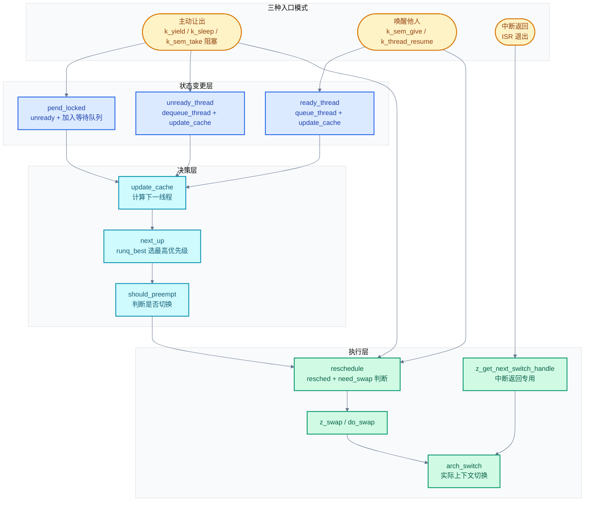
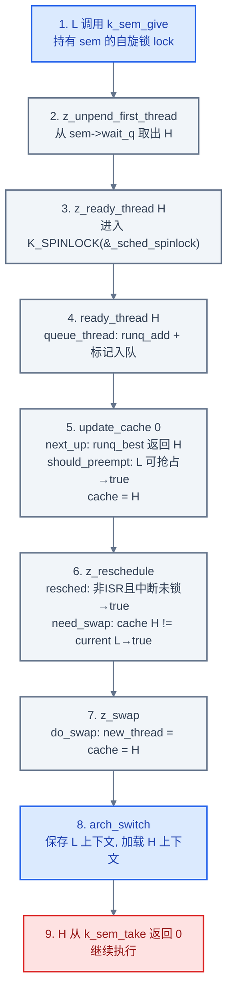
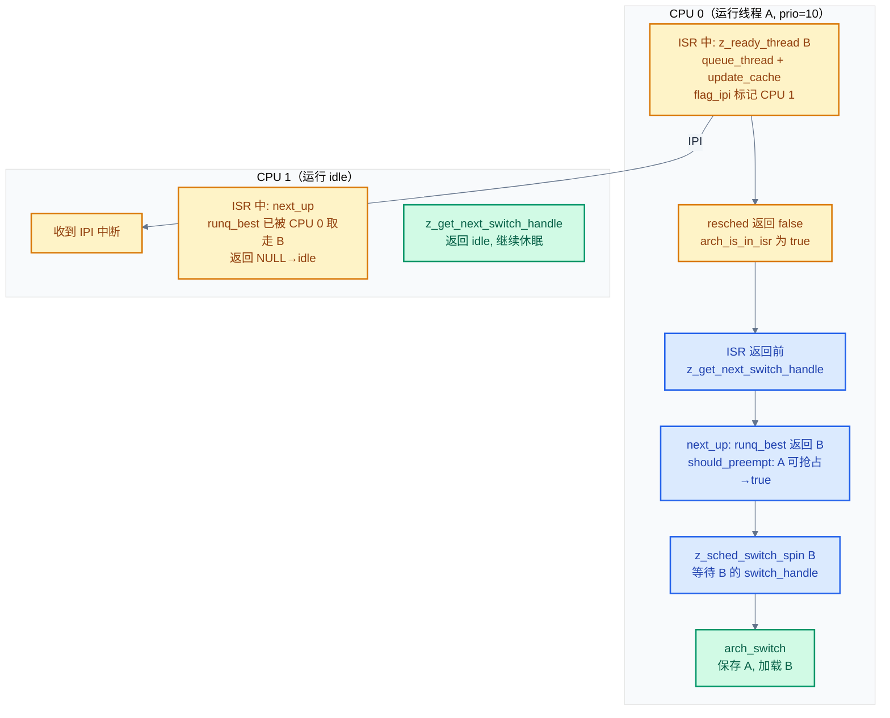
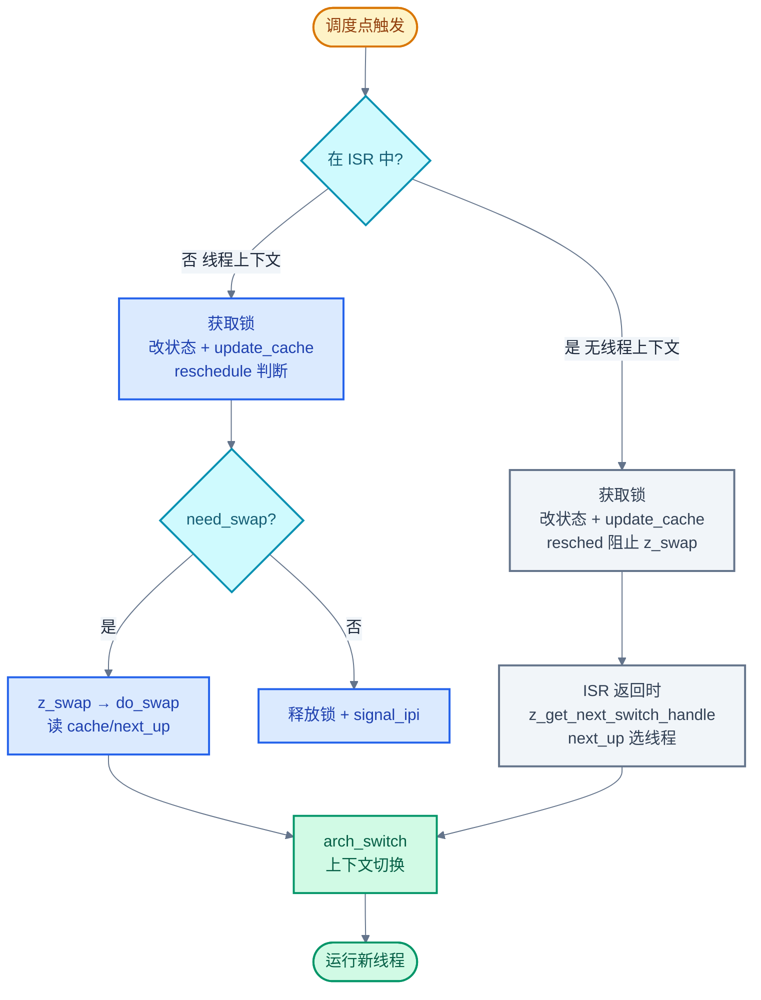

# 06. Zephyr RTOS 调度策略详解

> 一句话概括：本文以"调度调用链"为主线，从三种入口模式（主动让出/唤醒他人/中断返回）出发，讲清 Zephyr 调度器如何从 API 入口一路走到 `arch_switch` 上下文切换，并把优先级、就绪队列、协作/抢占/时间片、SMP 等策略挂回调用链的相应环节。
> **工程师视角**：读完后你应当能在脑中画出"调度点 → `ready_thread`/`unready_thread` → `update_cache` → `reschedule` → `z_swap` → `do_swap` → `arch_switch`"这条完整链路，并回答"为什么决策与执行要分离""为什么 SMP 下 `_current` 不在就绪队列""为什么中断返回不走 `z_swap`"三个问题。

### 关键术语

| 缩写 | 全称 | 含义 |
|------|------|------|
| RTOS | Real-Time Operating System | 实时操作系统 |
| ISR | Interrupt Service Routine | 中断服务例程 |
| SMP | Symmetric Multi-Processing | 对称多处理，多核平等运行同一内核镜像 |
| EDF | Earliest Deadline First | 最早截止时间优先，一种动态优先级调度算法 |
| IPI | Inter-Processor Interrupt | 处理器间中断，用于多核间通知 |
| CPU | Central Processing Unit | 中央处理器 |
| API | Application Programming Interface | 应用编程接口 |
| Scheduler | — | 调度器，决定哪个线程此刻在 CPU 上运行 |
| Priority | — | 优先级，数值越小优先级越高 |
| Cooperative | — | 协作式，线程一旦获得 CPU 不会被抢占，必须主动让出 |
| Preemptive | — | 抢占式，高优先级线程可抢占低优先级线程 |
| Timeslicing | — | 时间片轮转，同优先级线程轮流执行 |
| MetaIRQ | — | 一类特殊的高优先级协作线程，可抢占其他协作线程 |
| Reschedule Point | — | 调度点，可能触发调度器运行的时机 |
| Ready Queue | — | 就绪队列，存放所有可运行线程的数据结构 |
| Runqueue | — | 运行队列，就绪队列的同义说法 |
| Deadline | — | 截止时间，EDF 调度依据 |
| Cache | — | 调度缓存，单核下预先计算好的"下一线程"指针 |

---

### 前置阅读

| 需要了解 | 参考文档 |
|----------|----------|
| 线程状态机、线程生命周期 | [05-线程与状态迁移](./05-线程与状态迁移.md) |
| 内核分层与上下文模型 | [00-入门概览](./00-入门概览.md) |

---

## 1. 概述：调度全链路

> 线程是并发抽象，但 CPU 只有一个（先暂且只考虑单核），同一时刻只能执行一个线程。一个自然的问题是：多个线程如何共享这唯一的 CPU？本章先用一个 3 线程的小例子讲清调度的本质，再给出 Zephyr 调度器的**完整调用链全貌**——这是理解后续所有章节的骨架。后续各章都是调用链某一环的展开。

### 1.1 一个具体场景：3 个线程竞争 1 个 CPU

假设系统中有三个线程：

- **线程 H**：高优先级，处理按键事件，平时阻塞等待信号量
- **线程 M**：中优先级，执行传感器采样，每 100ms 唤醒一次
- **线程 L**：低优先级，做后台日志上报，长时间运行

某段时间内它们的执行时序如下：


> **如何读这张图**：时间从左到右流动。颜色越红表示优先级越高。每次切换都发生在"高优先级线程就绪"或"当前线程阻塞"的瞬间。这就是调度器在做的事——在有限的 CPU 资源上，按优先级与就绪状态决定下一个运行的线程。

### 1.2 调用链全貌：三种入口汇聚到 arch_switch

调度器要回答一个问题：**给定一组就绪线程，应该让哪一个在 CPU 上运行？**

Zephyr 的回答是一条从"调度点 API"到"`arch_switch` 上下文切换"的完整调用链。这条链有**三种入口模式**，它们最终汇聚到同一个执行点：



> **如何读这张图**：这是本文的"地图"。三种入口（黄色）经状态变更（蓝色）进入决策层（青色），决策层计算"下一线程"并判断"是否切换"，最后由执行层（绿色）完成上下文切换。**主动让出**和**唤醒他人**都走 `reschedule → z_swap`，但前者一定切换（自己要退出），后者需判断（可能不让出）；**中断返回**走独立的 `z_get_next_switch_handle`，因为 ISR 中没有线程上下文，不能调用 `z_swap`。后续各章都是这张图某一环的展开。

### 1.3 关键数据结构与全局变量

在深入调用链之前，先认识贯穿全文的几个核心变量。它们定义在 [include/zephyr/kernel_structs.h](file:///home/pbw/rtos/cs-learning-notes/zephyr-project/zephyr/include/zephyr/kernel_structs.h)（`_kernel`、`_current_cpu`、`_current`、`ready_q` 等）和 [kernel/sched.c](file:///home/pbw/rtos/cs-learning-notes/zephyr-project/zephyr/kernel/sched.c)（`_sched_spinlock`）：

| 变量 | 定义位置 | 语义 |
|------|---------|------|
| `_kernel` | 全局 `struct _kernel` | 内核主结构，单核下含 `ready_q`；SMP 下含 `cpus[]` 数组 |
| `_current_cpu` | `arch_curr_cpu()` 展开 | 指向当前 CPU 的 `struct _cpu`，每核私有状态入口 |
| `_current` | `_current_cpu->current` | 当前 CPU 上正在运行的线程 |
| `_sched_spinlock` | [kernel/sched.c](file:///home/pbw/rtos/cs-learning-notes/zephyr-project/zephyr/kernel/sched.c) | 全局调度自旋锁，保护就绪队列 |
| `ready_q` | `_kernel.ready_q`（单核） | 就绪队列，含 `runq` 和 `cache` 字段 |

`struct _cpu` 的关键字段（每核私有，定义在 [include/zephyr/kernel_structs.h](file:///home/pbw/rtos/cs-learning-notes/zephyr-project/zephyr/include/zephyr/kernel_structs.h)）：

| 字段 | 语义 |
|------|------|
| `id` | 核编号 |
| `current` | 当前线程（即 `_current`） |
| `idle_thread` | 该核的 idle 线程 |
| `swap_ok` | 是否允许同优先级切换（SMP 专用） |
| `metairq_preempted` | 被 MetaIRQ 抢占的协作线程指针 |

> **核心要点**：把每核频繁访问的状态放进 `struct _cpu`，是"按访问模式分片状态以消除锁竞争"的经典设计。本核读写自己的字段无需加锁；只有跨核共享的就绪队列才需要 `_sched_spinlock` 保护。这是 SMP 调度器避免锁竞争的关键——每个核先在自己的 `_current_cpu` 上完成决策，再仅在修改共享就绪队列时加锁。

> **设计洞察**：这与 Linux 内核的 per-cpu 变量如出一辙。Linux 的 `DEFINE_PER_CPU`、`percpu_counter` 都遵循同一思路：本核数据本核独占读写，无需原子操作与内存屏障，只有跨核聚合时才加锁。硬件层面还利用了 cache 局部性：每个核的 `struct _cpu` 驻留在自己的 L1 cache 中，访问零延迟；而全局就绪队列的每次修改都引发 cache 行在核间迁移（MESI 协议的 invalidate 流程），代价是数十到上百周期。把"热数据 per-CPU 化、冷数据全局化"是 SMP 性能优化的金科玉律。

调度器代码主体在 [kernel/sched.c](file:///home/pbw/rtos/cs-learning-notes/zephyr-project/zephyr/kernel/sched.c)，上下文切换在 [kernel/include/kswap.h](file:///home/pbw/rtos/cs-learning-notes/zephyr-project/zephyr/kernel/include/kswap.h)，时间片逻辑在 [kernel/timeslicing.c](file:///home/pbw/rtos/cs-learning-notes/zephyr-project/zephyr/kernel/timeslicing.c)，SMP 启动在 [kernel/smp.c](file:///home/pbw/rtos/cs-learning-notes/zephyr-project/zephyr/kernel/smp.c)。

---

## 2. 优先级与线程类型：决策的依据

> 第一章建立了调用链全貌。决策层（`next_up` + `should_preempt`）要回答"选哪个线程""是否切换"，需要依据。本章讲清调度的第一依据——优先级，以及由优先级数值范围区分的三类线程。这是后续 §5 决策层和 §7 策略层的基础。

### 2.1 优先级数值规则

Zephyr 优先级数值的规则是**数值越小优先级越高**，与 μC/OS-II、RT-Thread 一致，与 FreeRTOS（数值大=高优先级）相反。

优先级宏定义在 [include/zephyr/kernel.h](file:///home/pbw/rtos/cs-learning-notes/zephyr-project/zephyr/include/zephyr/kernel.h#L54-L61)：

```c
/* include/zephyr/kernel.h:54-61 */
#define K_PRIO_COOP(x)         (-(CONFIG_NUM_COOP_PRIORITIES - (x)))
#define K_PRIO_PREEMPT(x)      (x)

#define K_HIGHEST_THREAD_PRIO  (-CONFIG_NUM_COOP_PRIORITIES)
#define K_LOWEST_THREAD_PRIO   CONFIG_NUM_PREEMPT_PRIORITIES
#define K_IDLE_PRIO            K_LOWEST_THREAD_PRIO
#define K_HIGHEST_APPLICATION_THREAD_PRIO  (K_HIGHEST_THREAD_PRIO)
#define K_LOWEST_APPLICATION_THREAD_PRIO   (K_LOWEST_THREAD_PRIO - 1)
```

- `K_PRIO_COOP(x)`：协作式优先级，结果为负数
- `K_PRIO_PREEMPT(x)`：抢占式优先级，结果为非负数
- `K_HIGHEST_THREAD_PRIO`：系统最高优先级（最负的值）
- `K_LOWEST_THREAD_PRIO`：idle 线程优先级（最正的值）
- `K_LOWEST_APPLICATION_THREAD_PRIO`：应用线程最低优先级（比 idle 还低一档，保证 idle 总是最后）

对应 Kconfig 选项：

```kconfig
# 协作式优先级数量（默认 16）
config NUM_COOP_PRIORITIES
    int "Number of coop priorities"
    default 16

# 抢占式优先级数量（默认 15）
config NUM_PREEMPT_PRIORITIES
    int "Number of preemptible priorities"
    default 15

# MetaIRQ 优先级数量（默认 0）
config NUM_METAIRQ_PRIORITIES
    int "Number of very-high priority 'preemptor' threads"
    default 0
```

### 2.2 三类线程的优先级分布

默认配置下（`NUM_COOP_PRIORITIES=16`、`NUM_PREEMPT_PRIORITIES=15`、`NUM_METAIRQ_PRIORITIES=0`），优先级空间分布如下：

| 优先级范围 | 线程类型 | 是否可抢占 | 宏示例 |
|-----------|---------|----------|--------|
| `[-16, -1]` | 协作式（Cooperative） | 不被普通线程抢占 | `K_PRIO_COOP(0)` = -16，`K_PRIO_COOP(15)` = -1 |
| `[0, 14]` | 抢占式（Preemptive） | 可被更高优先级抢占 | `K_PRIO_PREEMPT(0)` = 0，`K_PRIO_PREEMPT(14)` = 14 |
| `15` | Idle 线程 | — | `K_IDLE_PRIO` = 15 |

当 `NUM_METAIRQ_PRIORITIES > 0` 时，最高优先级的若干个协作线程会被归为 MetaIRQ。例如 `NUM_METAIRQ_PRIORITIES=2` 时，优先级 -16 和 -15 是 MetaIRQ。

> **如何读这张表**：协作式优先级是负数，抢占式是非负数——这是一个关键的二分法。MetaIRQ 不是独立的优先级区间，而是协作式优先级的"前缀子集"。

### 2.3 为什么协作式优先级用负数

**这是一个关键的设计选择，原因是"让协作式与抢占式共享同一优先级空间，比较时只需一次整数减法"**。

`z_sched_prio_cmp()` 在 [kernel/include/ksched.h](file:///home/pbw/rtos/cs-learning-notes/zephyr-project/zephyr/kernel/include/ksched.h#L76-L107) 实现了优先级比较，核心只有一行 `return b2 - b1`：

```c
/* kernel/include/ksched.h:76-107 */
static ALWAYS_INLINE int32_t z_sched_prio_cmp(struct k_thread *thread_1,
                                               struct k_thread *thread_2)
{
    int32_t b1 = thread_1->base.prio;
    int32_t b2 = thread_2->base.prio;

    if (b1 != b2) {
        return b2 - b1;   /* 数值小的优先级高，返回正值表示 thread_1 优先级更高 */
    }
#ifdef CONFIG_SCHED_DEADLINE
    /* 同优先级时按 deadline 比较 */
    uint32_t d1 = thread_1->base.prio_deadline;
    uint32_t d2 = thread_2->base.prio_deadline;
    if (d1 != d2) {
        return (int32_t)(d2 - d1);
    }
#endif
    return 0;
}
```

如果协作式和抢占式分别用不同的数值空间（比如协作式 0-15、抢占式 0-14），比较时就得先判断类型再比较数值。Zephyr 用负数表示协作式后，整个优先级空间就是一个连续的整数轴，比较只需一次减法——这对调度器这种热路径极其重要。这个函数在 `next_up()`、`should_preempt()`、就绪队列插入时被反复调用。

### 2.4 三类线程的本质区别

线程类型的判断在 [kernel/include/kthread.h](file:///home/pbw/rtos/cs-learning-notes/zephyr-project/zephyr/kernel/include/kthread.h#L65-L81)：

```c
/* kernel/include/kthread.h:65-81 */
static inline int thread_is_preemptible(const struct k_thread *thread)
{
    /* preempt 字段是 prio 与 sched_locked 的组合体（见 kernel_structs.h） */
    return thread->base.preempt <= _PREEMPT_THRESHOLD;
}

static inline int thread_is_metairq(const struct k_thread *thread)
{
#if CONFIG_NUM_METAIRQ_PRIORITIES > 0
    return (thread->base.prio - K_HIGHEST_THREAD_PRIO)
        < CONFIG_NUM_METAIRQ_PRIORITIES;
#else
    return 0;
#endif
}
```

`_PREEMPT_THRESHOLD` 在 [include/zephyr/kernel_structs.h](file:///home/pbw/rtos/cs-learning-notes/zephyr-project/zephyr/include/zephyr/kernel_structs.h#L82-L86) 定义。`preempt` 是一个 16 位字段，由 `prio`（int8_t）和 `sched_locked`（uint8_t）拼成。当 `prio >= 0`（抢占式）且 `sched_locked == 0`（未锁调度器）时，线程可被抢占。这个编码让"是否可抢占"的判断退化为一次比较——`should_preempt()` 和 `next_up()` 都依赖它。

三类的本质区别如下：

| 维度 | 协作式 | 抢占式 | MetaIRQ |
|------|--------|--------|---------|
| **优先级** | 负数 | 非负数 | 最负的若干个 |
| **被普通线程抢占** | 否 | 是 | 否（最高） |
| **被 MetaIRQ 抢占** | 是 | 是 | 仅被更高 MetaIRQ |
| **参与时间片** | 否 | 是 | 否 |
| **典型用途** | 驱动、临界区 | 应用线程 | 中断下半部 |
| **让出方式** | 必须 `k_yield`/`k_sleep`/阻塞 | 任何调度点 | 同协作式 |

> **核心要点**：协作式优先级用负数不是为了"特殊"，而是为了让协作式与抢占式共享同一比较路径——一次整数减法即可判断优先级高低。MetaIRQ 是协作式的子集，但拥有"可抢占其他协作线程"的特权。这三类线程的区别最终体现在 `should_preempt()` 的判断逻辑中（见 §5.4）。

> **设计洞察**：把协作式与抢占式压进同一整数轴，是典型的"用编码技巧换热路径零分支"思想。Linux 内核中类似设计比比皆是：`list_head` 用同一结构既做链表又做队列、`page->flags` 把数十个状态位压进一个 `unsigned long`。共同动机是：热路径上的分支预测失败代价 10-20 周期，而整数比较只要 1 周期。Zephyr 把"协作式/抢占式二分"消解在数值符号里，`z_sched_prio_cmp` 只剩一行减法——调度器每次中断返回都调用它。代价是 API 可读性下降：新人看到 `K_PRIO_COOP(0) = -16` 会困惑。这是系统软件常见的 trade-off：内部表示为性能优化，对外用宏封装语义。

---

## 3. 就绪队列：调度的数据结构基础

> 第二章讲清了决策依据（优先级）。决策层需要遍历"所有就绪线程"找最高优先级，这个集合就是就绪队列。一个关键问题是：就绪队列该用什么数据结构？不同的选择在"插入/删除/查找最高优先级"三个操作上有不同的时间复杂度。本章讲清 Zephyr 三种实现的数据结构、复杂度与适用规模，为 §5 决策层的 `runq_best` 打基础。

### 3.1 三种实现概览

Zephyr 提供三种就绪队列实现，通过 Kconfig 选择：

```kconfig
choice SCHED_ALGORITHM
    prompt "Scheduler priority queue algorithm"
    default SCHED_SIMPLE

config SCHED_SIMPLE
    bool "Simple linked-list ready queue"

config SCHED_SCALABLE
    bool "Red/black tree ready queue"

config SCHED_MULTIQ
    bool "Traditional multi-queue ready queue"
endchoice
```

三种实现的核心差异：

| 维度 | Simple（链表） | Scalable（红黑树） | MultiQ（多队列） |
|------|---------------|-------------------|------------------|
| **数据结构** | 单条双向链表 | 一棵红黑树 | 每个优先级一条链表 + 位图 |
| **插入** | $O(n)$ | $O(\log n)$ | $O(1)$ |
| **删除** | $O(1)$ | $O(\log n)$ | $O(1)$ |
| **取最高优先级** | $O(1)$（链表头） | $O(1)$（树最左节点） | $O(1)$（位图找最低 bit） |
| **代码体积** | 最小（~省 2KB） | 较大（+~2KB） | 中等 |
| **适用规模** | ≤ 几个就绪线程 | > 20 个就绪线程 | 中等规模 |
| **支持 CPU 掩码** | 是 | 否 | 否 |
| **支持 EDF** | 是 | 是 | 否 |

> **如何读这张表**：Simple 在"少量线程"场景下最快（常数因子最小），但线程数多了插入会慢。Scalable 用红黑树保证 $O(\log n)$，适合大规模。MultiQ 看似全 $O(1)$，但需要"每个优先级一个链表头"的 RAM 开销，且不支持 EDF 和 CPU 掩码——这两个特性需要遍历整个就绪队列。

> **设计洞察**：三种就绪队列并存，体现了"按问题规模选数据结构"的工程智慧。绝大多数嵌入式系统就绪线程 < 5 个，Simple 链表常数因子最小（无树节点、无位图、无 per-prio 队列头），且代码体积省 2KB 对 RAM 紧张的 MCU 很重要。这与 Linux 内核形成对照：Linux CFS 用红黑树是因为服务器可能跑上千线程，而 Zephyr 默认 Simple 是因为 MCU 场景线程数少。MultiQ 则展示了硬件协同设计思路：利用 ARM `CLZ`/x86 `BSF` 单周期指令把"找最高优先级"压到 1 周期，但牺牲了 EDF/CPU 掩码的灵活性。

### 3.2 Simple：双向链表

Simple 实现使用一条按优先级排序的双向链表。定义在 [kernel/include/priority_q.h](file:///home/pbw/rtos/cs-learning-notes/zephyr-project/zephyr/kernel/include/priority_q.h#L109-L170)：

```c
/* kernel/include/priority_q.h:109-121 */
static ALWAYS_INLINE void z_priq_simple_add(sys_dlist_t *pq, struct k_thread *thread)
{
    struct k_thread *t;

    SYS_DLIST_FOR_EACH_CONTAINER(pq, t, base.qnode_dlist) {
        if (z_sched_prio_cmp(thread, t) > 0) {
            sys_dlist_insert(&t->base.qnode_dlist, &thread->base.qnode_dlist);
            return;
        }
    }
    sys_dlist_append(pq, &thread->base.qnode_dlist);
}
```

插入时遍历链表找到合适位置——所以是 $O(n)$。但取最高优先级只需取链表头，是 $O(1)$：

```c
/* kernel/include/priority_q.h:161-170 */
static ALWAYS_INLINE struct k_thread *z_priq_simple_best(sys_dlist_t *pq)
{
    struct k_thread *thread = NULL;
    sys_dnode_t *n = sys_dlist_peek_head(pq);
    if (n != NULL) {
        thread = CONTAINER_OF(n, struct k_thread, base.qnode_dlist);
    }
    return thread;
}
```

当启用 `CONFIG_SCHED_CPU_MASK` 时，`z_priq_simple_mask_best` 会遍历链表跳过不在当前 CPU 掩码内的线程（见 §9.3）。

### 3.3 Scalable：红黑树

Scalable 实现使用红黑树，按 `order_key` + 优先级排序。定义在 [kernel/include/priority_q.h](file:///home/pbw/rtos/cs-learning-notes/zephyr-project/zephyr/kernel/include/priority_q.h#L189-L251)：

```c
/* kernel/include/priority_q.h:201-222 */
static ALWAYS_INLINE void z_priq_rb_add(struct _priq_rb *pq, struct k_thread *thread)
{
    thread->base.order_key = pq->next_order_key;   /* FIFO 序号，保证同优先级按插入顺序 */
    ++pq->next_order_key;

    /* order_key 回绕时重新编号所有节点 */
    if (!pq->next_order_key) {
        RB_FOR_EACH_CONTAINER(&pq->tree, t, base.qnode_rb) {
            t->base.order_key = pq->next_order_key;
            ++pq->next_order_key;
        }
    }
    rb_insert(&pq->tree, &thread->base.qnode_rb);
}
```

取最高优先级是取红黑树最左节点，$O(1)$：

```c
/* kernel/include/priority_q.h:241-250 */
static ALWAYS_INLINE struct k_thread *z_priq_rb_best(struct _priq_rb *pq)
{
    struct k_thread *thread = NULL;
    struct rbnode *n = rb_get_min(&pq->tree);   /* 最左节点 = 最小 = 最高优先级 */
    if (n != NULL) {
        thread = CONTAINER_OF(n, struct k_thread, base.qnode_rb);
    }
    return thread;
}
```

**为什么 Scalable 用红黑树？** 因为 Scalable 面向"动态优先级"和"大量线程"场景。在 Simple 链表中，插入是 $O(n)$——当就绪线程达到上千个时，每次插入都要遍历整条链表，延迟不可接受。红黑树的 $O(\log n)$ 插入在对数级增长：

- 10 个线程：链表 10 步 vs 红黑树 ~3 步
- 1000 个线程：链表 1000 步 vs 红黑树 ~10 步
- 10000 个线程：链表 10000 步 vs 红黑树 ~13 步

EDF 调度（`CONFIG_SCHED_DEADLINE`）会动态修改线程的 `prio_deadline`，频繁改变排序键——这种场景下红黑树的优势最明显。

### 3.4 MultiQ：多队列 + 位图

MultiQ 是"教科书式"的实现：每个优先级一条链表，外加一个位图标记哪些优先级非空。定义在 [kernel/include/priority_q.h](file:///home/pbw/rtos/cs-learning-notes/zephyr-project/zephyr/kernel/include/priority_q.h#L270-L350)：

```c
/* kernel/include/priority_q.h:295-308 */
static ALWAYS_INLINE void z_priq_mq_add(struct _priq_mq *pq, struct k_thread *thread)
{
    struct prio_info pos = get_prio_info(thread->base.prio);

    sys_dlist_append(&pq->queues[pos.offset_prio], &thread->base.qnode_dlist);
    pq->bitmask[pos.idx] |= BIT(pos.bit);   /* 在位图中标记该优先级非空 */
    /* ...更新 cached_queue_index... */
}
```

取最高优先级时，用位图找最低非空优先级：

```c
/* kernel/include/priority_q.h:270-282 */
static ALWAYS_INLINE unsigned int z_priq_mq_best_queue_index(struct _priq_mq *pq)
{
    unsigned int i = 0;
    do {
        if (likely(pq->bitmask[i])) {
            return i * NBITS + TRAILING_ZEROS(pq->bitmask[i]);  /* CTZ 指令找最低 bit */
        }
        i++;
    } while (i < PRIQ_BITMAP_SIZE);
    return K_NUM_THREAD_PRIO - 1;
}
```

`TRAILING_ZEROS` 是一条硬件指令（如 ARM 的 `CLZ`/`CTZ`），能在单周期内找到最低非空 bit——这就是 MultiQ 取最高优先级是 $O(1)$ 的原因。

**为什么 MultiQ 不支持 EDF 和 CPU 掩码？** 因为 EDF 需要在"同优先级线程之间"按 deadline 排序，而 MultiQ 的每条链表是 FIFO——要支持 EDF 就得把每条链表改成排序结构，丧失 $O(1)$ 优势。CPU 掩码需要遍历所有线程检查 `cpu_mask`，而 MultiQ 的位图只标记"哪个优先级有线程"，不记录"哪个 CPU 能跑"。

> **核心要点**：三种实现各有适用场景——Simple 适合"小规模 + 需要 CPU 掩码"，Scalable 适合"大规模 + 需要 EDF"，MultiQ 适合"中等规模 + 传统 RTOS 习惯"。默认 Simple 是因为绝大多数嵌入式系统就绪线程数 < 5。三种实现对外暴露统一的 `runq_add`/`runq_remove`/`runq_best` 接口，调用链中的 `queue_thread`/`dequeue_thread`/`next_up` 无需感知具体实现。

---

## 4. 调度点：三种入口模式

> 第二章讲了决策依据，第三章讲了数据结构。本章进入调用链的第一个核心环节——**入口**。调度器不会自己运行，必须由"调度点"触发。Zephyr 的调度点看似繁多（`k_yield`、`k_sleep`、`k_sem_take`、`k_sem_give`、`k_thread_resume`、中断返回……），但按"当前线程的角色"归纳，只有三种入口模式。理解这三种模式的差异，就理解了调度器如何被驱动。

### 4.1 三种入口模式概览

| 入口模式 | 典型 API | 当前线程角色 | 是否一定切换 | 进入执行层的路径 |
|---------|---------|------------|------------|----------------|
| **主动让出** | `k_yield`/`k_sleep`/`k_sem_take` 阻塞 | 自己要退出 CPU | 是（自己已无法运行） | 直接 `z_swap` |
| **唤醒他人** | `k_sem_give`/`k_thread_resume`/`k_thread_start` | 自己继续运行，但可能该让出 | 否（需判断优先级） | `z_reschedule` → 判断后 `z_swap` 或仅释放锁 |
| **中断返回** | ISR 退出 | 无线程上下文（ISR 中） | 由 ISR 退出逻辑决定 | `z_get_next_switch_handle`（不走 `z_swap`） |

> **如何读这张表**：关键差异在第三、四列。主动让出"自己要退出"，所以直接 `z_swap`；唤醒他人"自己可能不让出"，需要 `z_reschedule` 判断优先级后再决定；中断返回"没有线程上下文"，不能调用 `z_swap`（`z_swap` 需要在线程栈上保存上下文），只能由 arch 层在中断返回时调用 `z_get_next_switch_handle` 选出下一线程。

### 4.2 主动让出：k_yield / k_sleep / 阻塞

主动让出类调度点的共同特征：当前线程自己要退出 CPU（无论是临时让出还是阻塞）。因此它们都直接调用 `z_swap`，不需要经过 `reschedule` 的优先级判断。

**`k_yield()`**——让出给同优先级或更高优先级线程，实现在 [kernel/sched.c](file:///home/pbw/rtos/cs-learning-notes/zephyr-project/zephyr/kernel/sched.c#L1127-L1139)：

```c
/* kernel/sched.c:1127-1139 */
void z_impl_k_yield(void)
{
    __ASSERT(!arch_is_in_isr(), "");

    k_spinlock_key_t key = k_spin_lock(&_sched_spinlock);

    runq_yield();              /* 把当前线程移到同优先级队列末尾 */
    update_cache(1);           /* preempt_ok=1 表示主动让出，允许同优先级切换 */
    z_swap(&_sched_spinlock, key);  /* 触发上下文切换 */
}
```

三步：`runq_yield` 把当前线程移到同优先级队尾 → `update_cache(1)` 重算下一线程（参数 1 允许同优先级切换）→ `z_swap` 执行切换。

**`k_sleep()`**——当前线程进入睡眠，实现在 [kernel/sched.c](file:///home/pbw/rtos/cs-learning-notes/zephyr-project/zephyr/kernel/sched.c#L1149-L1193)（简化）：

```c
/* kernel/sched.c:1149-1193（简化） */
static int32_t z_tick_sleep(k_timeout_t timeout)
{
    __ASSERT(!arch_is_in_isr(), "");

    if (K_TIMEOUT_EQ(timeout, K_NO_WAIT)) {
        k_yield();              /* K_NO_WAIT 被当作 yield 处理 */
        return 0;
    }

    k_spinlock_key_t key = k_spin_lock(&_sched_spinlock);
    unready_thread(_current);                          /* 从就绪队列移除 */
    expected_wakeup_ticks = z_add_thread_timeout(_current, timeout);  /* 设置超时 */
    z_mark_thread_as_sleeping(_current);               /* 标记睡眠 */
    (void)z_swap(&_sched_spinlock, key);               /* 切换到其他线程 */
    /* ...醒来后返回剩余 ticks... */
}
```

`unready_thread` 把当前线程从就绪队列移除（`dequeue_thread` + `update_cache`），然后 `z_swap` 切走。

**`k_sem_take()` 阻塞**——信号量不可用时挂起当前线程，实现在 [kernel/sem.c](file:///home/pbw/rtos/cs-learning-notes/zephyr-project/zephyr/kernel/sem.c#L132-L164)：

```c
/* kernel/sem.c:132-164（简化） */
int z_impl_k_sem_take(struct k_sem *sem, k_timeout_t timeout)
{
    k_spinlock_key_t key = k_spin_lock(&lock);

    if (likely(sem->count > 0U)) {
        sem->count--;
        k_spin_unlock(&lock, key);
        return 0;
    }

    if (K_TIMEOUT_EQ(timeout, K_NO_WAIT)) {
        k_spin_unlock(&lock, key);
        return -EBUSY;
    }

    /* 信号量不可用且需要等待：挂起当前线程 */
    return z_pend_curr(&lock, key, &sem->wait_q, timeout);
}
```

`z_pend_curr` 是阻塞类 API 的统一底层，实现在 [kernel/sched.c](file:///home/pbw/rtos/cs-learning-notes/zephyr-project/zephyr/kernel/sched.c#L691-L711)：

```c
/* kernel/sched.c:691-711 */
int z_pend_curr(struct k_spinlock *lock, k_spinlock_key_t key,
               _wait_q_t *wait_q, k_timeout_t timeout)
{
    /* 锁交换：释放调用方锁，确保持有调度锁直到上下文切换 */
    (void) k_spin_lock(&_sched_spinlock);
    pend_locked(_current, wait_q, timeout);   /* unready + 加入等待队列 + 设超时 */
    k_spin_release(lock);
    return z_swap(&_sched_spinlock, key);     /* 切换到其他线程 */
}
```

`pend_locked` 的实现在 [kernel/sched.c](file:///home/pbw/rtos/cs-learning-notes/zephyr-project/zephyr/kernel/sched.c#L611-L622)：

```c
/* kernel/sched.c:611-622 */
static void add_to_waitq_locked(struct k_thread *thread, _wait_q_t *wait_q)
{
    unready_thread(thread);               /* 从就绪队列移除 */
    z_mark_thread_as_pending(thread);     /* 标记为 pending（等待中） */

    if (wait_q != NULL) {
        thread->base.pended_on = wait_q;  /* 记录挂在哪个等待队列上 */
        _priq_wait_add(&wait_q->waitq, thread);  /* 加入等待队列 */
    }
}
```

> **核心要点**：主动让出类调度点的共同模式是"改自己的状态 + `z_swap`"。`k_yield` 改队列位置，`k_sleep` 改睡眠状态，`k_sem_take` 阻塞改 pending 状态——但最后都走到 `z_swap`。`z_pend_curr` 是所有阻塞类 API（信号量、互斥锁、队列、管道……）的统一底层。

### 4.3 唤醒他人：k_sem_give / k_thread_resume

唤醒他人类调度点的特征：当前线程继续运行，但它让另一个线程就绪了——可能需要让出 CPU。因此它们先调用 `z_ready_thread`（内含 `queue_thread` + `update_cache`），再调用 `z_reschedule` 判断是否需要切换。

**`k_sem_give()`**——释放信号量，可能唤醒等待线程，实现在 [kernel/sem.c](file:///home/pbw/rtos/cs-learning-notes/zephyr-project/zephyr/kernel/sem.c#L95-L120)：

```c
/* kernel/sem.c:95-120 */
void z_impl_k_sem_give(struct k_sem *sem)
{
    k_spinlock_key_t key = k_spin_lock(&lock);
    struct k_thread *thread;
    bool resched;

    thread = z_unpend_first_thread(&sem->wait_q);  /* 从等待队列取第一个 */

    if (unlikely(thread != NULL)) {
        arch_thread_return_value_set(thread, 0);   /* 设置被唤醒线程的返回值 */
        z_ready_thread(thread);                     /* 让线程就绪（入就绪队列+update_cache） */
        resched = true;
    } else {
        sem->count += (sem->count != sem->limit) ? 1U : 0U;
        resched = handle_poll_events(sem);
    }

    if (unlikely(resched)) {
        z_reschedule(&lock, key);    /* 判断是否需要切换 */
    } else {
        k_spin_unlock(&lock, key);
    }
}
```

这里的关键是 `z_ready_thread` + `z_reschedule` 的组合。`z_ready_thread` 让目标线程就绪（会调用 `update_cache` 重算 cache），`z_reschedule` 判断当前线程是否该让出。

**`z_ready_thread()`** 的实现在 [kernel/sched.c](file:///home/pbw/rtos/cs-learning-notes/zephyr-project/zephyr/kernel/sched.c#L348-L374)：

```c
/* kernel/sched.c:348-374 */
static void ready_thread(struct k_thread *thread)
{
    /* 如果已入队或未就绪，不重复添加 */
    if (!z_is_thread_queued(thread) && z_is_thread_ready(thread)) {
        queue_thread(thread);      /* 标记入队 + runq_add */
        update_cache(0);           /* 重算 cache（preempt_ok=0，仅更高优先级才切换） */
        flag_ipi(ipi_mask_create(thread));  /* SMP：通知其他 CPU */
    }
}

void z_ready_thread(struct k_thread *thread)
{
    K_SPINLOCK(&_sched_spinlock) {
        if (thread_active_elsewhere(thread) == NULL) {  /* SMP：不在其他核上运行 */
            ready_thread(thread);
        }
    }
}
```

`queue_thread` 的实现在 [kernel/sched.c](file:///home/pbw/rtos/cs-learning-notes/zephyr-project/zephyr/kernel/sched.c#L114-L126)：

```c
/* kernel/sched.c:114-126 */
static ALWAYS_INLINE void queue_thread(struct k_thread *thread)
{
    z_mark_thread_as_queued(thread);
    if (should_queue_thread(thread)) {   /* 单核总是 true；SMP 下 _current 不入队 */
        runq_add(thread);
    }
#ifdef CONFIG_SMP
    if (thread == _current) {
        /* 当前线程入队表示 yield */
        _current_cpu->swap_ok = true;
    }
#endif
}
```

注意 SMP 下的关键设计：`_current` 不在就绪队列中（`should_queue_thread` 对 `_current` 返回 false），避免多个 CPU 同时选中同一线程。只有单核下 `_current` 才留在队列里。

**`z_reschedule()`** 是唤醒他人模式的判断枢纽，实现在 [kernel/sched.c](file:///home/pbw/rtos/cs-learning-notes/zephyr-project/zephyr/kernel/sched.c#L799-L802)，委托给 `reschedule`：

```c
/* kernel/sched.c:560-568 */
static void reschedule(struct k_spinlock *lock, k_spinlock_key_t key)
{
    if (resched(key.key) && need_swap()) {
        z_swap(lock, key);           /* 需要切换：进入执行层 */
    } else {
        k_spin_unlock(lock, key);    /* 不需要：仅释放锁 */
        signal_pending_ipi();        /* SMP：发送待处理 IPI */
    }
}
```

两个判断条件：

1. **`resched(key)`**——是否允许在此处切换，实现在 [kernel/sched.c](file:///home/pbw/rtos/cs-learning-notes/zephyr-project/zephyr/kernel/sched.c#L533-L540)：

```c
/* kernel/sched.c:533-540 */
static inline bool resched(uint32_t key)
{
#ifdef CONFIG_SMP
    _current_cpu->swap_ok = 0;
#endif
    return arch_irq_unlocked(key) && !arch_is_in_isr();
}
```

如果中断被锁定（`key` 表示中断禁用）或当前在 ISR 中，`resched` 返回 false——不切换，只更新 cache，等中断解锁或 ISR 返回时再切。

2. **`need_swap()`**——cache 是否已指向不同线程，实现在 [kernel/sched.c](file:///home/pbw/rtos/cs-learning-notes/zephyr-project/zephyr/kernel/sched.c#L546-L558)：

```c
/* kernel/sched.c:546-558 */
static inline bool need_swap(void)
{
#ifdef CONFIG_SMP
    return true;   /* SMP 下在 C 层 z_swap 里处理 */
#else
    struct k_thread *new_thread = _kernel.ready_q.cache;
    return new_thread != _current;   /* 单核：cache 不是当前线程才需要切换 */
#endif
}
```

单核下，如果 `update_cache` 计算出的 cache 仍然是当前线程（说明没有更高优先级就绪），`need_swap` 返回 false——不切换，省一次上下文切换开销。

> **核心要点**：唤醒他人模式的核心是"`z_ready_thread` + `z_reschedule`"组合。`z_ready_thread` 只更新 cache（决策层），不直接切换；`z_reschedule` 通过 `resched` + `need_swap` 两层判断决定是否进入执行层。这个"先决策、后判断、再执行"的分层，让调度器能在 ISR 中安全地更新 cache（`resched` 返回 false），而真正的切换推迟到中断返回。

### 4.4 中断返回：z_get_next_switch_handle

中断返回是第三种入口模式。ISR 中可能唤醒了更高优先级线程（比如时钟中断唤醒了睡眠的线程），但 ISR 中不能调用 `z_swap`——`z_swap` 需要在线程栈上保存上下文，而 ISR 运行在中断栈上。

因此，Zephyr 把"中断中的调度决策"和"中断返回时的切换"分离：

1. **ISR 中**：调用 `z_ready_thread` 等函数更新 cache（`resched` 返回 false 因为 `arch_is_in_isr()`，所以不会 `z_swap`）
2. **ISR 返回时**：arch 层调用 `z_get_next_switch_handle` 读取 cache/`next_up`，返回新线程 handle，arch 层据此做上下文切换

`z_get_next_switch_handle` 的实现在 [kernel/sched.c](file:///home/pbw/rtos/cs-learning-notes/zephyr-project/zephyr/kernel/sched.c#L905-L975)：

```c
/* kernel/sched.c:905-975（简化） */
void *z_get_next_switch_handle(void *interrupted)
{
    z_check_stack_sentinel();

#ifdef CONFIG_SMP
    K_SPINLOCK(&_sched_spinlock) {
        struct k_thread *old_thread = _current, *new_thread;

        new_thread = next_up();                /* SMP：实时计算 */

        if (old_thread != new_thread) {
            z_sched_switch_spin(new_thread);   /* 等待新线程完成 arch_switch */
            _current_cpu->swap_ok = 0;
            new_thread->base.cpu = arch_curr_cpu()->id;
            set_current(new_thread);

            if (z_is_thread_queued(old_thread)) {
                runq_add(old_thread);          /* 旧线程放回就绪队列 */
            }
        }
        old_thread->switch_handle = interrupted;  /* 保存旧线程上下文句柄 */
        new_thread->switch_handle = NULL;         /* 活跃线程 handle 必须为 NULL */
        return new_thread->switch_handle;
    }
#else
    /* 单核：直接读 cache，因为 update_cache 已经算好了 */
    _current->switch_handle = interrupted;
    set_current(_kernel.ready_q.cache);
    return _current->switch_handle;
#endif
}
```

单核分支极其简单——直接读 `ready_q.cache`。因为 ISR 中调用的 `z_ready_thread` 已经通过 `update_cache` 把结果算好存在 cache 里了，中断返回时只需读取。这是"决策与执行分离"设计带来的红利：ISR 中做决策（写 cache），中断返回时做执行（读 cache + 切换）。

SMP 分支复杂得多，需要调 `next_up()` 实时计算，并处理 `switch_handle` 的竞态（见 §6.3）。

> **核心要点**：中断返回模式是"决策与执行分离"的必然产物。ISR 中没有线程上下文，不能 `z_swap`；但 ISR 中可以安全地更新 cache（`resched` 会阻止 `z_swap`）。中断返回时，arch 层调用 `z_get_next_switch_handle` 读取 cache 完成切换。这就是为什么 `z_ready_thread` 在 ISR 中调用是安全的——它只做决策，不做执行。

### 4.5 状态变更的统一原语

三种入口模式在状态变更层都使用同一组原语，定义在 [kernel/sched.c](file:///home/pbw/rtos/cs-learning-notes/zephyr-project/zephyr/kernel/sched.c)：

| 原语 | 作用 | 调用 `update_cache` | 使用场景 |
|------|------|-------------------|---------|
| `queue_thread` | 标记入队 + `runq_add` | 由调用方触发 | 线程就绪 |
| `dequeue_thread` | 标记出队 + `runq_remove` | 由调用方触发 | 线程阻塞/终止 |
| `ready_thread` | `queue_thread` + `update_cache(0)` + `flag_ipi` | 是 | 让线程就绪 |
| `unready_thread` | `dequeue_thread` + `update_cache(thread==_current)` | 是 | 让线程不再就绪 |
| `pend_locked` | `unready_thread` + 加入等待队列 + 设超时 | 是（通过 `unready_thread`） | 阻塞挂起 |
| `z_pend_curr` | `pend_locked` + `z_swap` | 是 | 阻塞类 API 底层 |

`unready_thread` 的实现在 [kernel/sched.c](file:///home/pbw/rtos/cs-learning-notes/zephyr-project/zephyr/kernel/sched.c#L599-L605)：

```c
/* kernel/sched.c:599-605 */
static void unready_thread(struct k_thread *thread)
{
    if (z_is_thread_queued(thread)) {
        dequeue_thread(thread);
    }
    update_cache(thread == _current);  /* 如果是自己移除，preempt_ok=1 */
}
```

注意 `update_cache` 的参数：如果被移除的是当前线程（`thread == _current`），传 1（允许同优先级切换，因为自己已经不能跑了）；否则传 0。

> **核心要点**：三种入口模式在状态变更层统一使用 `queue_thread`/`dequeue_thread`/`ready_thread`/`unready_thread` 这组原语。所有状态变更都会调用 `update_cache` 更新决策缓存。这让"策略"（优先级、抢占规则）和"机制"（入队/出队/缓存）彻底解耦——后续章节讨论的协作式/抢占式/时间片等策略，都只影响 `update_cache` 和 `should_preempt` 的判断，不改变状态变更原语本身。

---

## 5. 决策层：update_cache 与 next_up

> 第四章讲清了三种入口模式如何进入调度器。所有入口在状态变更后都汇聚到决策层——`update_cache` 计算下一线程，`should_preempt` 判断是否切换。本章深入这两个函数，讲清"决策与执行为何分离"这个 Zephyr 调度器的核心设计。

### 5.1 决策与执行为何分离

Zephyr 调度器把"选下一线程"（决策）和"切换上下文"（执行）分成两步：

- **决策层**：`update_cache` + `next_up` + `should_preempt`——只计算并缓存"下一线程"，不切换
- **执行层**：`z_swap` + `do_swap` + `arch_switch`——实际切换上下文

**为什么分离？** 因为 ISR 中不能 `z_swap`（没有线程上下文），但 ISR 中需要更新"下一线程"的决策。如果不分离，ISR 唤醒高优先级线程后无法立即反映这个变化，只能等中断返回后由线程代码触发调度——延迟不可控。

分离后，ISR 中调用 `z_ready_thread` → `update_cache` 只更新 cache（`resched` 阻止 `z_swap`），中断返回时 arch 层读 cache 完成切换。决策可以随时做，执行只在安全时机做。

### 5.2 update_cache：单核缓存 vs SMP 标志

`update_cache` 在 [kernel/sched.c](file:///home/pbw/rtos/cs-learning-notes/zephyr-project/zephyr/kernel/sched.c#L294-L320)：

```c
/* kernel/sched.c:294-320 */
static ALWAYS_INLINE void update_cache(int preempt_ok)
{
#ifndef CONFIG_SMP
    struct k_thread *thread = next_up();   /* 选出最高优先级 */

    if (should_preempt(thread, preempt_ok)) {
#ifdef CONFIG_TIMESLICING
        if (thread != _current) {
            z_reset_time_slice(thread);    /* 切换线程时重置时间片 */
        }
#endif
        update_metairq_preempt(thread);
        _kernel.ready_q.cache = thread;    /* 缓存新线程 */
    } else {
        _kernel.ready_q.cache = _current;  /* 不切换，缓存当前线程 */
    }
#else
    /* SMP 下不缓存，只记录"是否允许切换"标志 */
    _current_cpu->swap_ok = preempt_ok;
#endif
}
```

`preempt_ok` 参数的语义：是否允许"同优先级切换"。`k_yield` 调用时传 1（允许），其他调度点传 0（仅更高优先级才切换）。

单核与 SMP 的关键差异：
- **单核**：`next_up` 的结果缓存在 `ready_q.cache`，中断返回时直接读 cache，无需重新计算
- **SMP**：不缓存，只设 `swap_ok` 标志，每次 `next_up` 实时计算（因为其他 CPU 可能在此期间修改了就绪队列）

### 5.3 next_up：选出下一个线程

`next_up` 在 [kernel/sched.c](file:///home/pbw/rtos/cs-learning-notes/zephyr-project/zephyr/kernel/sched.c#L185-L279)，是调度器的核心。先看单核分支（极简）：

```c
/* kernel/sched.c:213-220（单核分支） */
#ifndef CONFIG_SMP
    /* 单核下 _current 一直在就绪队列中，选择很简单 */
    return (thread != NULL) ? thread : _current_cpu->idle_thread;
#endif
```

`thread = runq_best()` 取就绪队列最高优先级，如果为空就返回 idle 线程。单核下 `_current` 一直在队列中（见 §4.3 的 `should_queue_thread`），所以 `next_up` 只需取队头。

完整的 `next_up` 还包含 MetaIRQ 特殊处理（见 §5.5）和 SMP 分支（见 §9.2）。

### 5.4 should_preempt：是否切换的最终判断

`should_preempt` 在 [kernel/include/kthread.h](file:///home/pbw/rtos/cs-learning-notes/zephyr-project/zephyr/kernel/include/kthread.h#L224-L246)：

```c
/* kernel/include/kthread.h:224-246 */
static ALWAYS_INLINE bool should_preempt(const struct k_thread *thread,
                                         int preempt_ok)
{
    /* 1. 主动让出（preempt_ok != 0）→ 允许切换 */
    if (preempt_ok != 0) {
        return true;
    }

    /* 2. 当前线程已无法运行（阻塞/挂起/终止）→ 必须切换 */
    if (z_is_thread_prevented_from_running(_current)) {
        return true;
    }

    /* 3. 当前线程可抢占，或来者是 MetaIRQ → 允许切换 */
    if (thread_is_preemptible(_current) || thread_is_metairq(thread)) {
        return true;
    }
    /* ...其他边界情况... */
    return false;
}
```

三条规则与第二章的三类线程对应：

1. **主动让出**（`preempt_ok != 0`）→ 允许切换
2. **当前线程已无法运行** → 必须切换
3. **当前线程可抢占**（抢占式且未锁调度器），**或来者是 MetaIRQ** → 允许切换

把"当前线程类型 × 新线程类型"的所有组合列出来，得到完整的抢占规则：

| 当前线程 | 新线程 | 是否抢占 | 条件说明 |
|---------|--------|---------|---------|
| 协作式 | 协作式（非 MetaIRQ） | 否 | 协作式不被普通协作式抢占 |
| 协作式 | 抢占式 | 否 | 协作式不被抢占式抢占 |
| 协作式 | MetaIRQ | **是** | MetaIRQ 拥有抢占协作式的特权 |
| 协作式 | （主动让出后任意） | **是** | `k_yield`/阻塞后允许切换 |
| 抢占式 | MetaIRQ / 协作式 | **是** | 高优先级协作式可抢占低优先级抢占式 |
| 抢占式 | 抢占式（更高优先级） | **是** | 高优先级抢占 |
| 抢占式 | 抢占式（同优先级） | 否 | 需要时间片或主动让出 |
| 抢占式 | 抢占式（更低优先级） | 否 | 低优先级不能抢占 |
| MetaIRQ | 任意（更高 MetaIRQ） | **是** | 仅更高 MetaIRQ 可抢占 |

> **如何读这张表**：第一列是"当前正在运行的线程类型"，第二列是"新就绪的线程类型"，第三列是"是否立即切换到新线程"。关键差异在第一行——协作式线程遇到普通高优先级线程时不会被抢占，这是协作式与抢占式的本质区别。这个矩阵完全由 `should_preempt` 的三条规则导出。

### 5.5 MetaIRQ 的特殊返回

`next_up` 中有一段 MetaIRQ 专属逻辑，在 [kernel/sched.c](file:///home/pbw/rtos/cs-learning-notes/zephyr-project/zephyr/kernel/sched.c#L196-L211)：

```c
/* kernel/sched.c:196-211 */
#if (CONFIG_NUM_METAIRQ_PRIORITIES > 0)
    /* MetaIRQ 必须尝试返回到它抢占的协作式线程 */
    struct k_thread *mirqp = _current_cpu->metairq_preempted;

    if (mirqp != NULL && (thread == NULL || !thread_is_metairq(thread))) {
        if (z_is_thread_ready(mirqp)) {
            thread = mirqp;     /* 优先返回被抢占的协作线程 */
        } else {
            _current_cpu->metairq_preempted = NULL;
        }
    }
#endif
```

**为什么 MetaIRQ 需要这个特殊处理？** 因为协作式线程被承诺"不会被普通线程抢占"——只有 MetaIRQ 是例外。当 MetaIRQ 抢占了一个协作式线程后，MetaIRQ 结束时必须**返回到那个被抢占的协作线程**，而不是按优先级选其他线程。否则协作式线程的"不被抢占"承诺就被破坏了。

`update_metairq_preempt` 在 [kernel/sched.c](file:///home/pbw/rtos/cs-learning-notes/zephyr-project/zephyr/kernel/sched.c#L166-L180) 记录这个"被抢占的协作线程"：

```c
/* kernel/sched.c:166-180 */
static void update_metairq_preempt(struct k_thread *thread)
{
#if (CONFIG_NUM_METAIRQ_PRIORITIES > 0)
    if (thread_is_metairq(thread) && !thread_is_metairq(_current) &&
        !thread_is_preemptible(_current)) {
        /* 新线程是 MetaIRQ，当前是协作式——记录被抢占 */
        _current_cpu->metairq_preempted = _current;
    } else if (!thread_is_metairq(thread)) {
        /* 新线程不是 MetaIRQ——清除记录 */
        _current_cpu->metairq_preempted = NULL;
    }
#endif
}
```

> **核心要点**：决策层是"选下一线程 + 判断是否切换"。`update_cache` 调用 `next_up`（取 `runq_best`）选出候选线程，再用 `should_preempt` 判断是否真的切换。单核把结果存入 `ready_q.cache` 供中断返回时读取，SMP 不缓存而是实时计算。MetaIRQ 的特殊返回逻辑确保协作式线程的"不被抢占"承诺在 MetaIRQ 结束后得到恢复。

---

## 6. 执行层：z_swap 与 arch_switch

> 第五章讲清了决策层如何选出下一线程。本章进入执行层——实际切换上下文。决策层只算出"该切换到谁"，执行层才真正保存旧线程上下文、加载新线程上下文。本章还讲清 SMP 下的 `switch_handle` 竞态问题及其解法。

### 6.1 do_swap：执行层的核心

`z_swap` 是主动让出和唤醒他人两种入口模式的执行入口。它定义在 [kernel/include/kswap.h](file:///home/pbw/rtos/cs-learning-notes/zephyr-project/zephyr/kernel/include/kswap.h#L191-L194)，委托给 `do_swap`：

```c
/* kernel/include/kswap.h:191-194 */
static inline int z_swap(struct k_spinlock *lock, k_spinlock_key_t key)
{
    return do_swap(key.key, lock, true);
}
```

`do_swap` 的完整实现在 [kernel/include/kswap.h](file:///home/pbw/rtos/cs-learning-notes/zephyr-project/zephyr/kernel/include/kswap.h#L77-L184)：

```c
/* kernel/include/kswap.h:77-184（简化，保留核心路径） */
static ALWAYS_INLINE unsigned int do_swap(unsigned int key,
                                          struct k_spinlock *lock,
                                          bool is_spinlock)
{
    struct k_thread *new_thread, *old_thread;

    old_thread = _current;
    z_check_stack_sentinel();
    old_thread->swap_retval = -EAGAIN;

    /* 释放调用方锁，确保持有调度锁 */
    if (is_spinlock && lock != NULL && lock != &_sched_spinlock) {
        k_spin_release(lock);
    }
    if (IS_ENABLED(CONFIG_SMP) || IS_ENABLED(CONFIG_SPIN_VALIDATE)) {
        if (!is_spinlock || lock != &_sched_spinlock) {
            (void)k_spin_lock(&_sched_spinlock);
        }
    }

#ifdef CONFIG_SMP
    new_thread = z_swap_next_thread();   /* SMP：调 next_up 实时计算 */
#else
    new_thread = _kernel.ready_q.cache;  /* 单核：直接读决策层算好的 cache */
#endif

    if (new_thread != old_thread) {
        z_sched_usage_switch(new_thread);
#ifdef CONFIG_SMP
        new_thread->base.cpu = arch_curr_cpu()->id;
        if (!is_spinlock) {
            z_smp_release_global_lock(new_thread);
        }
#endif
        z_thread_mark_switched_out();
        z_sched_switch_spin(new_thread);       /* SMP：等待新线程完成 arch_switch */
        z_current_thread_set(new_thread);

#ifdef CONFIG_TIMESLICING
        z_reset_time_slice(new_thread);        /* 重置时间片 */
#endif
        arch_cohere_stacks(old_thread, NULL, new_thread);

#ifdef CONFIG_SMP
        z_requeue_current(old_thread);         /* SMP：把旧线程放回就绪队列 */
#endif
        void *newsh = new_thread->switch_handle;
        if (IS_ENABLED(CONFIG_SMP)) {
            new_thread->switch_handle = NULL;  /* 活跃线程 handle 必须为 NULL */
            barrier_dmem_fence_full();         /* 写屏障 */
        }
        k_spin_release(&_sched_spinlock);
        arch_switch(newsh, &old_thread->switch_handle);  /* 实际上下文切换 */
    } else {
        k_spin_release(&_sched_spinlock);
    }

    if (is_spinlock) {
        arch_irq_unlock(key);
    } else {
        irq_unlock(key);
    }
    return _current->swap_retval;
}
```

`do_swap` 的流程可以归纳为编号步骤：

1. 记录旧线程 `old_thread = _current`，设置 `swap_retval`
2. 释放调用方锁，确保持有 `_sched_spinlock`
3. 选出新线程：单核读 `ready_q.cache`，SMP 调 `z_swap_next_thread` → `next_up`
4. 如果新旧不同：设置新线程的 `cpu` 字段、标记切换出、`z_sched_switch_spin` 等待新线程就绪、`z_current_thread_set` 更新 `_current`、重置时间片
5. SMP 下把旧线程放回就绪队列（`z_requeue_current`）
6. 释放调度锁，调用 `arch_switch(newsh, &old_thread->switch_handle)` 切换上下文
7. 恢复中断状态（`arch_irq_unlock`）

> **核心要点**：单核下 `do_swap` 直接读 `ready_q.cache`——这是决策层（`update_cache`）提前算好的。SMP 下调 `next_up` 实时计算，因为其他 CPU 可能修改了就绪队列，cache 不可信。这就是单核用 cache、SMP 不用 cache 的根本原因。

### 6.2 arch_switch 的语义

`arch_switch` 是架构相关的上下文切换原语，签名在 [include/kernel_arch_func.h](file:///home/pbw/rtos/cs-learning-notes/zephyr-project/zephyr/include/kernel_arch_func.h) 中声明：

```c
/* 保存当前上下文到 old_handle，加载 new_handle 指向的上下文 */
void arch_switch(void *new_handle, void **old_handle);
```

- `new_handle`：要切换到的新线程的 `switch_handle`（指向新线程保存的上下文）
- `old_handle`：指向旧线程的 `switch_handle` 字段的指针——`arch_switch` 会把当前上下文保存到这里

`arch_switch` 的语义是"保存旧、加载新"。调用后，CPU 从新线程上次暂停的位置继续执行。旧线程的 `switch_handle` 被填入保存的上下文，将来切回它时用。

单核和 SMP 都用同一个 `arch_switch` 接口（`CONFIG_USE_SWITCH=y` 时），但 SMP 下 `switch_handle` 的管理更复杂（见 §6.3）。

如果 `CONFIG_USE_SWITCH=n`（仅单核可用），则用 `arch_swap(key)`——一个组合了"选线程 + 切换"的原语，定义在 [kernel/include/kswap.h](file:///home/pbw/rtos/cs-learning-notes/zephyr-project/zephyr/kernel/include/kswap.h#L209-L225)。

### 6.3 SMP 的 switch_handle 竞态

SMP 下有一个微妙的竞态：线程记录在就绪队列中时，其他 CPU 可能选中它；但此时该线程可能还没完成 `arch_switch` 保存上下文。如果另一个 CPU 直接切换到它，会读到未保存完的上下文。

Zephyr 的解决方案是 `switch_handle` + `z_sched_switch_spin`：

- 线程运行时 `switch_handle = NULL`（活跃线程的 handle 必须为 NULL）
- 线程被切换出时，`arch_switch` 把上下文存入 `switch_handle`
- 其他 CPU 选中一个线程时，如果 `switch_handle == NULL`，说明它还没存完上下文，调用 `z_sched_switch_spin` 自旋等待

`z_sched_switch_spin` 的实现在 [kernel/include/kswap.h](file:///home/pbw/rtos/cs-learning-notes/zephyr-project/zephyr/kernel/include/kswap.h#L53-L67)：

```c
/* kernel/include/kswap.h:53-67 */
static inline void z_sched_switch_spin(struct k_thread *thread)
{
#ifdef CONFIG_SMP
    volatile void **shp = (void *)&thread->switch_handle;

    while (*shp == NULL) {
        arch_spin_relax();   /* 自旋等待，让出总线 */
    }
    /* 读屏障：确保后续读操作不会重排到看到 handle 非 NULL 之前 */
    barrier_dmem_fence_full();
#endif
}
```

这个设计的注释（[kernel/include/kswap.h:34-52](file:///home/pbw/rtos/cs-learning-notes/zephyr-project/zephyr/kernel/include/kswap.h#L34-L52)）解释了"鸡生蛋"问题：线程需要从自己的上下文标记自己"不在运行"，但在到达 `arch_switch` 之前它显然还在运行。锁解决不了这个问题——被切换到的线程不知道自己被切出了，不会释放锁。

`z_requeue_current` 在 [kernel/sched.c](file:///home/pbw/rtos/cs-learning-notes/zephyr-project/zephyr/kernel/sched.c#L145-L151) 负责在 `arch_switch` 之后把旧线程放回就绪队列——此时旧线程的上下文已确定保存完毕：

```c
/* kernel/sched.c:145-151 */
void z_requeue_current(struct k_thread *thread)
{
    if (z_is_thread_queued(thread)) {
        runq_add(thread);    /* 现在才放回队列，此时 switch_handle 已非 NULL */
    }
    signal_pending_ipi();
}
```

> **核心要点**：执行层的核心是 `do_swap` → `arch_switch`。单核直接读 cache 切换；SMP 需要处理 `switch_handle` 竞态——用"活跃线程 handle 为 NULL + 自旋等待"的模式保证不会切到上下文未保存完的线程。旧线程在 `arch_switch` 之后才被放回就绪队列（`z_requeue_current`），确保其他 CPU 选中它时 handle 已就绪。这是 SMP 调度器最精巧的设计之一。

> **设计洞察**：这个 `switch_handle` 竞态是 SMP 上下文切换的固有难题。Linux 内核的 `context_tracking` 和 `task_struct->on_cpu` 字段用类似思路解决——线程通过 `on_cpu` 标记自己是否在运行，切换方等待 `on_cpu` 清零。Zephyr 用 `switch_handle == NULL` 作为"正在切换出"的标记，本质相同。共同点是：这类"自己标记自己状态"的竞态无法用锁解决，因为被切换出的线程无法在切换中途释放锁。

---

## 7. 策略如何影响决策

> 第五、六章讲清了决策层和执行层的机制。本章把前面散落的策略——协作式/抢占式、时间片、EDF——挂回调用链，讲清它们如何影响 `update_cache` 和 `should_preempt` 的判断。机制是骨架，策略是血肉。

### 7.1 协作式与抢占式：影响 should_preempt

协作式与抢占式的唯一行为差异体现在 `should_preempt` 的第三条规则（§5.4）：当前线程是否 `thread_is_preemptible`。协作式（`prio < 0`）返回 false，抢占式（`prio >= 0` 且未锁调度器）返回 true。

这意味着：

- **协作式线程**运行时，即使更高优先级的抢占式线程就绪，`should_preempt` 也返回 false——不会切换。必须等协作式线程主动让出（`k_yield`/`k_sleep`/阻塞）。
- **抢占式线程**运行时，更高优先级线程就绪即切换。

官方时序图清楚地展示了两种模式的差异：


*来源：Zephyr 官方文档，Cooperative Scheduling 时序图*

> **如何读这张图**：纵轴是优先级（高在上，低在下），横轴是时间。Thread 1（低优先级，协作式）正在运行时，ISR 发生并使 Thread 2（高优先级）就绪——但 Thread 1 不会立即让出 CPU，Thread 2 处于 Ready 状态等待。直到 Thread 1 主动 relinquish（让出）CPU，Thread 2 才开始运行。这是协作式的核心：**就绪不等于运行，必须等当前协作线程主动让出**。


*来源：Zephyr 官方文档，Preemptive Scheduling 时序图*

> **如何读这张图**：Thread 1（低优先级，抢占式）运行时，Thread 2（更高优先级）就绪——与协作式不同，Thread 1 立即被抢占（Preemption 箭头），Thread 2 开始运行。Thread 2 运行期间又被 Thread 3（更高优先级）抢占。Thread 3 完成后，恢复 Thread 2；Thread 2 完成后（Completion 箭头），恢复 Thread 1。这是抢占式的核心：**高优先级就绪即抢占，不等当前线程让出**。

协作式线程的让出方式有四种：调用 `k_yield()`、调用 `k_sleep()`、等待同步对象（如 `k_sem_take()` 阻塞）、线程终止。这些都属于 §4.2 的"主动让出"入口模式。

> **核心要点**：协作式与抢占式的唯一行为差异是"高优先级线程就绪时是否立即切换"——这完全由 `should_preempt` 的 `thread_is_preemptible` 判断决定。MetaIRQ 是一个特殊存在——它能抢占其他协作线程（`should_preempt` 第三条的 `thread_is_metairq(thread)` 分支），用于实现"中断下半部"等需要立即响应但不能阻塞的场景。

### 7.2 时间片轮转：影响 update_cache 的触发

时间片解决"多个同优先级抢占式线程如何共享 CPU"的问题。它的核心思想：把 CPU 时间切成固定长度的"片"，同优先级的抢占式线程按片轮流执行。


*来源：Zephyr 官方文档，Timeslicing 时序图*

> **如何读这张图**：Thread 1、Thread 2、Thread 3、Thread 4 是同优先级的抢占式线程。每个线程运行一个时间片（slice）后被切到队尾，下一个线程运行。循环往复，直到某线程阻塞或更高优先级线程就绪。注意：时间片**只影响同优先级的抢占式线程**——协作式线程和更高优先级线程不参与。

时间片的实现完全在 [kernel/timeslicing.c](file:///home/pbw/rtos/cs-learning-notes/zephyr-project/zephyr/kernel/timeslicing.c)。核心数据是每 CPU 一个的超时记录：

```c
/* kernel/timeslicing.c:11-14 */
static int slice_ticks = DIV_ROUND_UP(CONFIG_TIMESLICE_SIZE * Z_HZ_ticks, Z_HZ_ms);
static int slice_max_prio = CONFIG_TIMESLICE_PRIORITY;
static struct _timeout slice_timeouts[CONFIG_MP_MAX_NUM_CPUS];
static bool slice_expired[CONFIG_MP_MAX_NUM_CPUS];
```

时间片到期时的处理在 [kernel/timeslicing.c](file:///home/pbw/rtos/cs-learning-notes/zephyr-project/zephyr/kernel/timeslicing.c#L131-L161)：

```c
/* kernel/timeslicing.c:131-161（简化） */
void z_time_slice(void)
{
    k_spinlock_key_t key = k_spin_lock(&_sched_spinlock);
    struct k_thread *curr = _current;

    if (slice_expired[_current_cpu->id] && (z_time_slice_size(curr) != 0)) {
        if (!z_is_thread_prevented_from_running(curr)) {
            move_current_to_end_of_prio_q();   /* 移到同优先级队列末尾 */
        }
        z_reset_time_slice(curr);              /* 重置时间片计时 */
    }
    k_spin_unlock(&_sched_spinlock, key);
}
```

`move_current_to_end_of_prio_q` 在 [kernel/sched.c](file:///home/pbw/rtos/cs-learning-notes/zephyr-project/zephyr/kernel/sched.c#L284-L289)：

```c
/* kernel/sched.c:284-289 */
void move_current_to_end_of_prio_q(void)
{
    runq_yield();          /* 把当前线程移到同优先级队列末尾 */
    update_cache(1);       /* preempt_ok=1，允许同优先级切换 */
}
```

时间片到期是一个特殊的调度点——它通过 `move_current_to_end_of_prio_q` 调用 `update_cache(1)`，参数 1 表示允许同优先级切换。这正是时间片能让同优先级线程轮流运行的原因：`update_cache(1)` 让 `should_preempt` 的第一条规则（`preempt_ok != 0`）生效。

时间片到期的处理流程：

1. 时钟中断触发 `slice_timeout`，设置 `slice_expired[cpu] = true`
2. 下一次调度点调用 `z_time_slice()`
3. 检查 `slice_expired` 标志和线程是否参与时间片
4. 调用 `move_current_to_end_of_prio_q()` 把当前线程移到队尾
5. 重置时间片计时器

相关 Kconfig：

```kconfig
config TIMESLICING
    bool "Enable time slicing"
    default y

config TIMESLICE_SIZE
    int "Time slice size (in milliseconds)"
    default 0
    depends on TIMESLICING

config TIMESLICE_PRIORITY
    int "Time slicing priority threshold"
    default 0
    depends on TIMESLICING
```

`TIMESLICE_PRIORITY` 的语义：这里的"greater than"指**数值更大**，即**优先级更低**。默认值 0 表示只有优先级数值 ≥ 0 的线程（即所有抢占式线程）参与时间片。

> **核心要点**：时间片**不保证公平**——它不测量线程实际运行了多久，只保证"一个线程不会连续运行超过一个时间片"。如果线程在时间片内阻塞，重新就绪后会排到队尾，不会"补回"剩余时间。时间片通过 `update_cache(1)` 让 `should_preempt` 的"主动让出"分支生效，这是它在调用链中的挂载点。

### 7.3 EDF 调度：影响 z_sched_prio_cmp

EDF (Earliest Deadline First, 最早截止时间优先) 是一种动态优先级调度算法。**Zephyr 的 EDF 不替代优先级，而是在同优先级线程之间用 deadline 排序。**

这个设计在 `z_sched_prio_cmp()` 中体现（见 §2.3）：先比较 `prio`，相等时才比较 `prio_deadline`。因此 EDF 影响的是就绪队列的排序键——`runq_add` 插入时用 `z_sched_prio_cmp` 定位，启用了 EDF 后同优先级线程按 deadline 排序而非 FIFO。

`k_thread_deadline_set()` 的实现在 [kernel/sched.c](file:///home/pbw/rtos/cs-learning-notes/zephyr-project/zephyr/kernel/sched.c#L1062-L1070)：

```c
/* kernel/sched.c:1062-1070 */
void z_impl_k_thread_deadline_set(k_tid_t tid, int deadline)
{
    deadline = clamp(deadline, 0, INT_MAX);
    int32_t newdl = k_cycle_get_32() + deadline;   /* 转换为绝对截止时间 */
    z_impl_k_thread_absolute_deadline_set(tid, newdl);
}
```

`deadline` 参数是"从当前时刻起的相对周期数"，内核把它转换为绝对周期数 `k_cycle_get_32() + deadline` 后存入 `thread->base.prio_deadline`。

由于 EDF 会动态修改排序键，修改 deadline 时必须先出队再入队，否则会破坏红黑树的排序不变量。`z_impl_k_thread_absolute_deadline_set` 在 [kernel/sched.c](file:///home/pbw/rtos/cs-learning-notes/zephyr-project/zephyr/kernel/sched.c#L1041-L1060)：

```c
/* kernel/sched.c:1041-1060 */
void z_impl_k_thread_absolute_deadline_set(k_tid_t tid, int deadline)
{
    struct k_thread *thread = tid;

    K_SPINLOCK(&_sched_spinlock) {
        if (z_is_thread_queued(thread)) {
            dequeue_thread(thread);              /* 先出队 */
            thread->base.prio_deadline = deadline;
            queue_thread(thread);                /* 改后再入队 */
        } else {
            thread->base.prio_deadline = deadline;
        }
    }
}
```

| 维度 | 优先级调度 | EDF 调度（Zephyr 实现） |
|------|----------|------------------------|
| **第一依据** | 静态优先级 | 静态优先级 |
| **同优先级排序** | FIFO | deadline 近的优先 |
| **最优性** | 速率单调（次优） | 同优先级内最优 |
| **实现复杂度** | 低 | 中（需要红黑树或排序链表） |
| **适用场景** | 固定优先级任务 | 周期性实时任务 |

EDF 使用示例：

```c
/* 周期性任务：每 10ms 执行一次，deadline = 5ms */
void periodic_task(void *p1, void *p2, void *p3)
{
    int period_ms = 10;
    int deadline_ms = 5;

    while (1) {
        /* 设置本轮 deadline：从现在起 5ms 内必须完成 */
        k_thread_deadline_set(k_current_get(), K_MSEC(deadline_ms));

        do_periodic_work();   /* 执行实际工作 */

        /* 睡眠到下一周期开始 */
        k_msleep(period_ms);
    }
}
```

> **核心要点**：Zephyr EDF 是"同优先级内的 deadline 排序"，不是完全动态优先级。它通过影响 `z_sched_prio_cmp` 的返回值来改变就绪队列的排序——这是 EDF 在调用链中的挂载点。高优先级线程仍然会饿死低优先级线程——EDF 只解决"同优先级线程谁先跑"的问题。EDF 需要 Scalable（红黑树）实现，因为 Simple 链表虽然也能排序但大规模时插入慢，MultiQ 的 FIFO 队列无法排序。

---

## 8. 调度器锁、idle 与 k_busy_wait

> 第七章把策略挂回了调用链。本章讲几个与调度点相关的实用机制：调度器锁（临时禁止抢占）、CPU idle（无线程可跑时怎么办）、`k_sleep` vs `k_busy_wait`（都等待，但调度器参与与否截然不同）。它们都通过调用链的某一环起作用。

### 8.1 调度器锁：k_sched_lock / k_sched_unlock

调度器锁把当前线程临时当作协作式线程对待——其他线程无法抢占它，但当前线程仍然可以主动让出（如调用 `k_sleep`）。

实现位于 [kernel/sched.c](file:///home/pbw/rtos/cs-learning-notes/zephyr-project/zephyr/kernel/sched.c#L814-L845)：

```c
/* kernel/sched.c:814-845 */
void k_sched_lock(void)
{
    K_SPINLOCK(&_sched_spinlock) {
        __ASSERT(!arch_is_in_isr(), "");
        __ASSERT(_current->base.sched_locked != 1U, "");
        --_current->base.sched_locked;   /* 注意是递减，0xff 表示锁定 1 层 */
        compiler_barrier();
    }
}

void k_sched_unlock(void)
{
    k_spinlock_key_t key = k_spin_lock(&_sched_spinlock);

    __ASSERT(_current->base.sched_locked != 0U, "");
    __ASSERT(!arch_is_in_isr(), "");
    ++_current->base.sched_locked;        /* 递增，回到 0 表示完全解锁 */
    update_cache(0);                      /* 解锁后重算 cache */
    reschedule(&_sched_spinlock, key);    /* 解锁后检查是否需要调度 */
}
```

注意 `sched_locked` 字段的编码：**0 表示未锁定，0xff/0xfe/... 表示锁定 1/2/... 层**。这种编码是为了让 `preempt` 这个 16 位字段（`prio` + `sched_locked`）的"可抢占判断"退化为一次 `preempt <= _PREEMPT_THRESHOLD` 比较——只要 `sched_locked != 0`，整个 `preempt` 字段就会落入"不可抢占"区间。这直接影响 `should_preempt` 中 `thread_is_preemptible` 的返回值——调度器锁本质上是修改了 `should_preempt` 的判断输入。

`k_sched_unlock` 调用 `update_cache(0)` + `reschedule`，这是"唤醒他人"入口模式的变体——解锁后可能有线程在锁定期间就绪了，需要重新判断是否切换。

使用示例：

```c
/* 用调度器锁保护短临界区 */
void update_shared_state(void)
{
    k_sched_lock();          /* 禁止抢占 */
    shared_counter++;        /* 不会被抢占，无需互斥锁 */
    shared_flag = true;
    k_sched_unlock();        /* 恢复抢占，可能触发调度 */
}
```

**为什么用调度器锁而不是互斥锁？**

- 调度器锁：仅禁止抢占，**不阻塞**其他线程，**不引起优先级反转**。适合"极短临界区"
- 互斥锁：会阻塞其他尝试获取锁的线程，**有优先级继承**机制。适合"较长临界区"或"需要跨内核对象保护"

> **核心要点**：调度器锁的语义是"把当前线程临时降级为协作式"——通过修改 `sched_locked` 字段让 `thread_is_preemptible` 返回 false。它**不能**阻止当前线程主动让出（`k_yield` 仍然有效），只阻止"被动抢占"。锁定期间调用 `k_sleep` 会让线程阻塞，其他线程运行，唤醒后仍保持锁定状态。

### 8.2 CPU idle

当没有就绪线程时，调度器会让 idle 线程运行。idle 线程优先级最低（`K_IDLE_PRIO`），通常调用 `k_cpu_idle()` 让 CPU 进入低功耗状态。

```c
/* 让 CPU 进入低功耗，直到中断唤醒 */
void k_cpu_idle(void);

/* 原子地进入低功耗——传入的 key 是 irq_lock() 的返回值 */
void k_cpu_atomic_idle(unsigned int key);
```

`k_cpu_idle` 与 `k_cpu_atomic_idle` 的差异在于**原子性**：

- `k_cpu_idle`：直接进入低功耗。如果"检查事件"和"进入低功耗"之间发生中断，可能错过事件
- `k_cpu_atomic_idle`：在进入低功耗前保持中断禁用，进入低功耗的指令原子地解锁中断——避免竞态

idle 线程是 `next_up` 在就绪队列为空时的返回值（见 §5.3 的 `_current_cpu->idle_thread`）。当所有线程都阻塞时，`runq_best` 返回 NULL，`next_up` 返回 idle 线程。

### 8.3 k_sleep vs k_busy_wait

两者都"让线程等待一段时间"，但本质截然不同：

| 维度 | `k_sleep(timeout)` | `k_busy_wait(usec)` |
|------|--------------------|--------------------|
| **调度器参与** | 是 | 否 |
| **CPU 让出** | 让给其他线程 | 不让出，忙等 |
| **实现** | `unready_thread` + `z_swap`（见 §4.2） | 紧循环读取 cycle 计数器 |
| **精度** | tick 级（默认 1ms 或 10ms） | cycle 级（亚微秒） |
| **功耗** | 低（CPU 可进入 idle） | 高（CPU 全速运转） |
| **ISR 中可用** | 否 | 是 |
| **适用场景** | 毫秒级以上等待 | 微秒级短延时 |

`k_busy_wait` 不涉及调度器——它在 arch 层实现为紧循环读取 cycle 计数器。ISR 中只能用 `k_busy_wait`，因为 ISR 没有线程上下文，无法 `z_swap`（这正是 §4.4 中断返回模式不走 `z_swap` 的同一原因）。

> **核心要点**：`k_sleep` 让出 CPU 给其他线程（走"主动让出"入口），`k_busy_wait` 不让出。`k_cpu_idle` 是 idle 线程专用——应用线程通常不应直接调用，而是用 `k_sleep` 让出 CPU。

---

## 9. SMP 调度

> 前八章都假设单核。本章讲清多核下调度器的额外复杂性。SMP 调度的核心差异有三点：`_current` 不在就绪队列、无 cache 机制实时计算、`switch_handle` 竞态处理。这些差异在调用链的各个环节都有体现。

### 9.1 SMP 启动流程

Zephyr SMP 内核启动时，主 CPU（CPU 0）完成所有内核初始化，然后在进入 `main()` 之前调用 `z_smp_init()` 启动辅助 CPU。启动流程的官方示意图：


*来源：Zephyr 官方文档，SMP Initialization 流程图*

> **如何读这张图**：主 CPU 完成 init 后，通过 `arch_cpu_start()` 逐个启动辅助 CPU。辅助 CPU 在 `smp_init_top()` 中初始化自己的定时器，然后自旋等待"start flag"被释放。主 CPU 释放 flag 后，所有 CPU 同时调用 `z_swap()` 进入调度器，开始并行运行线程。

启动代码在 [kernel/smp.c](file:///home/pbw/rtos/cs-learning-notes/zephyr-project/zephyr/kernel/smp.c#L222-L241)：

```c
/* kernel/smp.c:222-241 */
void z_smp_init(void)
{
    (void)atomic_clear(&cpu_start_flag);

    unsigned int num_cpus = arch_num_cpus();
    for (int i = 1; i < num_cpus; i++) {
        z_init_cpu(i);
        start_cpu(i, NULL);    /* 逐个启动辅助 CPU */
    }

    (void)atomic_set(&cpu_start_flag, 1);  /* 释放 start_flag */
}
```

辅助 CPU 的入口在 [kernel/smp.c](file:///home/pbw/rtos/cs-learning-notes/zephyr-project/zephyr/kernel/smp.c#L110-L149)：

```c
/* kernel/smp.c:110-149（简化） */
static inline void smp_init_top(void *arg)
{
    (void)atomic_set(&ready_flag, 1);          /* 1. 通知主 CPU 自己已上电 */
    wait_for_start_signal(&cpu_start_flag);    /* 2. 等待主 CPU 释放 start_flag */
    z_dummy_thread_init(&_thread_dummy);       /* 3. 初始化 dummy 线程 */
    smp_timer_init();                          /* 4. 初始化每 CPU 定时器 */
    z_swap_unlocked();                         /* 5. 交给调度器决定运行哪个线程 */
}
```

辅助 CPU 最后调用 `z_swap_unlocked()` 进入调度器——这是"主动让出"入口模式的变体（`z_swap_unlocked` 定义在 [kernel/include/kswap.h](file:///home/pbw/rtos/cs-learning-notes/zephyr-project/zephyr/kernel/include/kswap.h#L196-L199)）。

### 9.2 SMP 下 next_up 的完整逻辑

SMP 下 `next_up` 比单核复杂得多，因为它要处理"_current 不在队列""多核竞争""swap_ok 标志"等问题。完整实现在 [kernel/sched.c](file:///home/pbw/rtos/cs-learning-notes/zephyr-project/zephyr/kernel/sched.c#L221-L278)：

```c
/* kernel/sched.c:221-278（简化） */
#else /* CONFIG_SMP */
    bool queued = z_is_thread_queued(_current);
    bool active = z_is_thread_ready(_current);

    if (thread == NULL) {
        thread = _current_cpu->idle_thread;
    }

    if (active) {
        int32_t cmp = z_sched_prio_cmp(_current, thread);
        /* 优先级相同：只有 swap_ok（当前线程主动让出）才切换 */
        if ((cmp > 0) || ((cmp == 0) && !_current_cpu->swap_ok)) {
            thread = _current;
        }
        if (!should_preempt(thread, _current_cpu->swap_ok)) {
            thread = _current;
        }
    }

    /* 把当前线程放回就绪队列（SMP 下 _current 不在队列中） */
    if (thread != _current && active && !queued && ...) {
        queue_thread(_current);
    }

    /* 把新线程移出就绪队列 */
    if (z_is_thread_queued(thread)) {
        dequeue_thread(thread);
    }

    _current_cpu->swap_ok = false;
    return thread;
#endif /* CONFIG_SMP */
```

单核与 SMP 的关键差异：

| 维度 | 单核 | SMP |
|------|------|-----|
| 就绪队列 | 全局一个 | 全局共享一个（除非 `CONFIG_SCHED_CPU_MASK_PIN_ONLY`） |
| `_current` 位置 | 在就绪队列中 | 不在就绪队列中（避免多核同时选同一线程） |
| 缓存机制 | `ready_q.cache` 缓存下一线程 | 无缓存，每次 `next_up()` 实时计算 |
| 抢占后处理 | 被抢占线程留在队列 | 被抢占线程在 `do_swap` 后由 `z_requeue_current` 放回 |
| 上下文切换 | `z_swap`（读 cache） | `z_swap`（调 `next_up`）+ `z_sched_switch_spin` |

> **如何读这张表**：SMP 下 `_current` 不在就绪队列是核心差异——这避免了多个 CPU 同时选中同一线程。代价是每次 `next_up` 都要实时计算（不能缓存），且被抢占线程要延迟到 `arch_switch` 之后才放回队列（`z_requeue_current`），否则会引发"选中尚未保存上下文的线程"的竞态（见 §6.3）。

### 9.3 CPU 掩码：线程亲和性

SMP 下可以限制线程只在某些 CPU 上运行。需要 `CONFIG_SCHED_CPU_MASK=y`：

```c
/* 把线程绑定到指定 CPU（永久） */
void k_thread_cpu_pin(k_tid_t thread, int cpu);

/* 清除线程的 CPU 掩码（线程无处可跑，需重新设置） */
int k_thread_cpu_mask_clear(k_tid_t thread);

/* 允许线程在所有 CPU 上运行 */
int k_thread_cpu_mask_enable_all(k_tid_t thread);

/* 允许线程在指定 CPU 上运行（叠加） */
int k_thread_cpu_mask_enable(k_tid_t thread, int cpu);

/* 禁止线程在指定 CPU 上运行 */
int k_thread_cpu_mask_disable(k_tid_t thread, int cpu);
```

使用示例：

```c
/* 把传感器采样线程绑定到 CPU 1，避免影响 CPU 0 上的关键任务 */
k_thread_cpu_pin(sensor_tid, 1);

/* 让日志线程避开 CPU 0 */
k_thread_cpu_mask_disable(log_tid, 0);
```

**重要约束**：CPU 掩码操作只能在线程**阻塞或挂起**时调用，对运行中的线程调用会返回 `-EINVAL`。原因：修改运行中线程的掩码可能导致它"突然不能在当前 CPU 上跑"，处理起来很复杂。

**CPU 掩码只支持 Simple 调度器**——因为掩码检查需要遍历就绪队列找"能在当前 CPU 上跑"的线程（`z_priq_simple_mask_best`，见 §3.2），而 Scalable/MultiQ 的优化前提是"直接取最高优先级"。

### 9.4 IPI：处理器间中断

当一个 CPU 让线程就绪，而其他 CPU 可能正 idle 或运行低优先级线程时，需要通过 IPI (Inter-Processor Interrupt, 处理器间中断) 通知它们重新调度。

IPI 在调用链中的挂载点是 `ready_thread` 的 `flag_ipi`（见 §4.3）和 `reschedule` 的 `signal_pending_ipi`（见 §4.3）。当一个 CPU 让线程就绪时，`flag_ipi` 标记需要通知的 CPU 掩码；`reschedule` 释放锁后 `signal_pending_ipi` 真正发送 IPI。

IPI 的典型场景：

1. **`k_thread_abort`**：如果目标线程在另一个 CPU 上运行，必须等它停下来——发 IPI 让那个 CPU 进入中断处理后检查终止标志
2. **idle 唤醒**：如果一个 CPU 进入低功耗 idle，而另一个 CPU 让一个线程就绪——发 IPI 唤醒 idle 的 CPU
3. **负载均衡**：高优先级线程就绪时，广播 IPI 让所有 CPU 重新评估

没有 IPI 的系统仍能正确运行，但性能受损——idle CPU 只能等下一次定时器中断才能看到新就绪的线程。

> **核心要点**：SMP 调度的核心差异是"_current 不在就绪队列中"——这避免了多个 CPU 同时选中同一个线程。这个设计决策 ripple 到调用链的每个环节：`next_up` 要实时计算、`do_swap` 要 `z_sched_switch_spin` 等待、`z_requeue_current` 要延迟放回。CPU 掩码是"分区负载"的机制，但代价是丧失 Scalable/MultiQ 的性能优势。IPI 是"主动通知其他 CPU 重新调度"的机制，对低功耗和实时性至关重要。

---

## 10. 端到端走查：两个完整实例

> 前九章分别讲了调用链的各个环节。本章用两个完整实例把所有环节串起来，从 API 入口一路追到 `arch_switch`，让读者建立"调度器如何完整工作"的认知。第一个实例是单核下的"信号量唤醒"，第二个是 SMP 下的"中断唤醒 + 跨核抢占"。

### 10.1 实例一：k_sem_give 唤醒高优先级线程（单核）

**场景**：单核系统。线程 L（prio=10，抢占式）正在运行，持有信号量 `sem`。线程 H（prio=1，抢占式）在 `k_sem_take(&sem, K_FOREVER)` 中阻塞等待。L 调用 `k_sem_give(&sem)`。

**完整调用链**：



逐步追踪：

**步骤 1-2**：`k_sem_give` 获取 `lock`，调用 `z_unpend_first_thread` 从 `sem->wait_q` 取出 H（H 之前通过 `z_pend_curr` 挂在这里）。`z_unpend_first_thread` 内部会调 `z_unpend_thread` 把 H 从等待队列移除。

**步骤 3-4**：`z_ready_thread(H)` 进入 `_sched_spinlock`，调 `ready_thread`。`ready_thread` 调 `queue_thread(H)`：`z_mark_thread_as_queued(H)` + `runq_add(H)`（H 按 prio=1 插入就绪队列，排在 L 前面）。

**步骤 5**：`ready_thread` 调 `update_cache(0)`。`next_up` 调 `runq_best` 返回 H（H 的 prio=1 < L 的 prio=10）。`should_preempt(H, 0)`：L 是抢占式且未锁调度器，`thread_is_preemptible(L)` 返回 true → `should_preempt` 返回 true。`cache = H`。

**步骤 6**：`z_reschedule` 调 `reschedule`。`resched(key)`：非 ISR 且中断未锁 → true。`need_swap()`：`cache H != _current L` → true。进入 `z_swap`。

**步骤 7-8**：`z_swap` → `do_swap`。`new_thread = _kernel.ready_q.cache = H`。`H != L`，进入切换路径：`z_current_thread_set(H)`、`z_reset_time_slice(H)`、释放 `_sched_spinlock`、`arch_switch(H->switch_handle, &L->switch_handle)`。CPU 保存 L 的上下文到 `L->switch_handle`，加载 H 的上下文。

**步骤 9**：H 从 `z_pend_curr` 的 `z_swap` 返回点继续执行——`z_swap` 返回 `swap_retval`（之前 `arch_thread_return_value_set` 设为 0），`k_sem_take` 返回 0。

> **核心要点**：这个例子展示了"唤醒他人"入口模式的完整路径。关键转折点是 `update_cache` 把 H 写入 cache——此后 `need_swap` 发现 cache 与当前线程不同，触发 `z_swap`。如果 H 的优先级低于或等于 L，`next_up` 会返回 L 自己，cache 不变，`need_swap` 返回 false，不切换。

### 10.2 实例二：中断唤醒 + SMP 跨核抢占

**场景**：双核 SMP 系统。CPU 0 运行线程 A（prio=10，抢占式）。CPU 1 运行 idle 线程（无线程可跑）。某 ISR 在 CPU 0 上触发，唤醒了线程 B（prio=1，抢占式），B 之前在 `k_sem_take` 中阻塞。

**完整调用链**：



逐步追踪：

**CPU 0 的 ISR 中**：

1. ISR 调用 `z_sem_give` 或类似函数唤醒 B。进入 `z_ready_thread(B)`：`queue_thread(B)`（B 入就绪队列，SMP 下 B 不是 `_current` 所以入队）+ `update_cache(0)`（SMP 下只设 `swap_ok = 0`，不缓存）+ `flag_ipi`（标记需要通知的 CPU，包括可能 idle 的 CPU 1）。

2. `z_reschedule` → `reschedule`：`resched(key)` 检查 `arch_is_in_isr()` → true，返回 false。不切换，只 `signal_pending_ipi()` 发送 IPI 给 CPU 1。

**CPU 1 收到 IPI**：

3. CPU 1 从 idle 唤醒，进入 IPI 的 ISR。ISR 中可能调 `z_reschedule`，但同样 `resched` 返回 false（在 ISR 中）。ISR 返回时调 `z_get_next_switch_handle`：`next_up` 调 `runq_best`，但 B 可能已被 CPU 0 取走（取决于时序），返回 NULL → 返回 idle。CPU 1 继续跑 idle。

**CPU 0 的 ISR 返回**：

4. ISR 返回前调 `z_get_next_switch_handle(NULL)`。进入 `_sched_spinlock`，调 `next_up()`：`runq_best` 返回 B（prio=1 < A 的 prio=10）。`should_preempt(B, swap_ok=0)`：A 是抢占式 → true。选中 B。

5. `z_sched_switch_spin(B)`：如果 B 的 `switch_handle` 还是 NULL（B 之前被切出时还没存完上下文），自旋等待。正常情况下 B 早就阻塞了，handle 已就绪，立即通过。

6. `set_current(B)`、`z_reset_time_slice(B)`、把 A 放回就绪队列（`runq_add(A)`，因为 A 是被抢占的，仍然就绪）、`B->switch_handle = NULL`、释放锁。返回 `B->switch_handle`。arch 层据此切换到 B。

> **核心要点**：这个例子展示了 SMP 下"中断返回"入口模式和 IPI 机制的协作。关键差异是：ISR 中 `resched` 返回 false（不能 `z_swap`），只更新状态和标记 IPI；真正的切换发生在 ISR 返回时的 `z_get_next_switch_handle`。IPI 的作用是唤醒可能 idle 的 CPU 1，但实际抢占发生在 CPU 0 自己（因为 B 的优先级高于 A）。如果 B 的优先级低于 A，CPU 0 不会切换，B 会在就绪队列中等待 CPU 1 的下一次调度。

> **设计洞察**：对比两个实例可以看出单核与 SMP 调度器的本质差异。单核靠 `ready_q.cache` 在 ISR 中做决策、中断返回时读 cache 做执行——简洁高效。SMP 没有 cache（其他 CPU 可能修改队列），每次 `next_up` 实时计算，还要处理 `switch_handle` 竞态——复杂但必要。这种复杂度是 SMP 的固有代价：多个 CPU 并发访问共享就绪队列，必须处理竞态。Linux 内核的 CFS 调度器走得更远——每个 CPU 有独立的 `rq`（per-CPU runqueue），定期做负载均衡，把锁竞争降到最低。Zephyr 的"全局就绪队列 + 单锁"设计更简单，适合核数较少（通常 ≤ 4）的嵌入式 SMP 场景。

---

## 调度器完整流程总览

把前述所有章节的调用链整合起来，Zephyr 调度器的运行时行为可以总结为一张完整的流程图：



> **如何读这张图**：这是本文所有章节的整合。调度点触发后，先判断是否在 ISR 中——这是分叉点。**非 ISR 路径**（左）：获取锁 → 改状态 → `update_cache` → `reschedule` 判断 → `z_swap` → `arch_switch`。**ISR 路径**（右）：获取锁 → 改状态 → `update_cache`（只算 cache/设标志，`resched` 会阻止 `z_swap`）→ 释放锁 → ISR 返回时 `z_get_next_switch_handle` → `next_up` → `arch_switch`。两条路径最终都汇聚到 `arch_switch` 完成切换。

> **核心要点**：Zephyr 调度器的完整设计可以归纳为"三种入口 + 两层分离"。三种入口（主动让出/唤醒他人/中断返回）覆盖所有调度场景；两层分离（决策层 `update_cache` + 执行层 `z_swap`/`z_get_next_switch_handle`）让 ISR 能安全做决策而推迟执行。单核用 `ready_q.cache` 缓存决策结果，SMP 实时计算并用 `switch_handle` 竞态保护。策略（优先级、协作/抢占、时间片、EDF、MetaIRQ）都只影响 `should_preempt` 和 `z_sched_prio_cmp` 的判断，不改变调用链结构。理解这条链和这些挂载点，就理解了 Zephyr 调度器的完整设计。

---

## 参考资料

- [Zephyr 官方调度文档](../zephyr-project/zephyr/doc/kernel/services/scheduling/index.rst) — 调度策略、时间片、调度器锁、CPU idle 官方说明
- [Zephyr 官方 SMP 文档](../zephyr-project/zephyr/doc/kernel/services/smp/smp.rst) — SMP 启动、CPU 掩码、IPI、自旋锁
- [kernel/sched.c](file:///home/pbw/rtos/cs-learning-notes/zephyr-project/zephyr/kernel/sched.c) — 调度器核心实现（`reschedule`、`update_cache`、`next_up`、`ready_thread`、`z_pend_curr`）
- [kernel/include/kswap.h](file:///home/pbw/rtos/cs-learning-notes/zephyr-project/zephyr/kernel/include/kswap.h) — `do_swap`、`z_swap`、`z_sched_switch_spin` 上下文切换
- [kernel/timeslicing.c](file:///home/pbw/rtos/cs-learning-notes/zephyr-project/zephyr/kernel/timeslicing.c) — 时间片轮转实现
- [kernel/smp.c](file:///home/pbw/rtos/cs-learning-notes/zephyr-project/zephyr/kernel/smp.c) — SMP 启动与全局锁
- [kernel/sem.c](file:///home/pbw/rtos/cs-learning-notes/zephyr-project/zephyr/kernel/sem.c) — `k_sem_give`/`k_sem_take` 作为调度点示例
- [kernel/include/ksched.h](file:///home/pbw/rtos/cs-learning-notes/zephyr-project/zephyr/kernel/include/ksched.h) — 调度器内部接口与优先级比较
- [kernel/include/priority_q.h](file:///home/pbw/rtos/cs-learning-notes/zephyr-project/zephyr/kernel/include/priority_q.h) — 三种就绪队列实现
- [kernel/include/kthread.h](file:///home/pbw/rtos/cs-learning-notes/zephyr-project/zephyr/kernel/include/kthread.h) — `thread_is_preemptible`、`should_preempt`
- [include/zephyr/kernel.h](file:///home/pbw/rtos/cs-learning-notes/zephyr-project/zephyr/include/zephyr/kernel.h) — `K_PRIO_COOP`/`K_PRIO_PREEMPT` 宏定义
- [include/zephyr/kernel_structs.h](file:///home/pbw/rtos/cs-learning-notes/zephyr-project/zephyr/include/zephyr/kernel_structs.h) — `_PREEMPT_THRESHOLD`、`_thread_base`、`struct _cpu` 结构

## 下一篇

[07-同步机制详解](./07-同步机制详解.md) — 信号量、互斥锁、条件变量、事件、自旋锁的源码分析与优先级反转处理。
