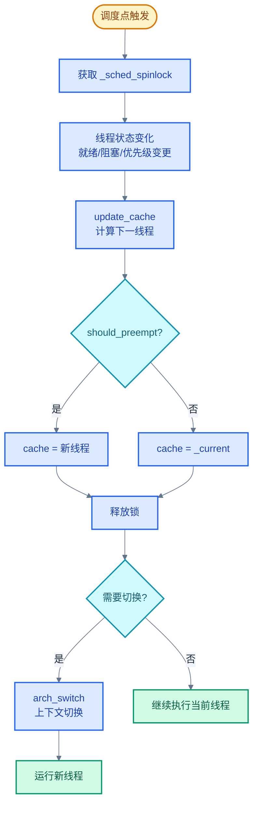

# 06. Zephyr RTOS 调度策略详解

> 一句话概括：本文从"3 个线程竞争 1 个 CPU"的具体场景出发，讲清 Zephyr 调度器的优先级模型、协作/抢占/时间片三类策略、就绪队列的三种实现，以及 SMP 多核调度。
> **工程师视角**：读完后你应当能回答"为什么协作式优先级用负数"、"为什么 Scalable 用红黑树"、"什么时候该用 `k_sched_lock` 而不是互斥锁"这三个问题。

### 关键术语

| 缩写 | 全称 | 含义 |
|------|------|------|
| RTOS | Real-Time Operating System | 实时操作系统 |
| ISR | Interrupt Service Routine | 中断服务例程 |
| SMP | Symmetric Multi-Processing | 对称多处理，多核平等运行同一内核镜像 |
| EDF | Earliest Deadline First | 最早截止时间优先，一种动态优先级调度算法 |
| IPI | Inter-Processor Interrupt | 处理器间中断，用于多核间通知 |
| CPU | Central Processing Unit | 中央处理器 |
| API | Application Programming Interface | 应用编程接口 |
| Scheduler | — | 调度器，决定哪个线程此刻在 CPU 上运行 |
| Priority | — | 优先级，数值越小优先级越高 |
| Cooperative | — | 协作式，线程一旦获得 CPU 不会被抢占，必须主动让出 |
| Preemptive | — | 抢占式，高优先级线程可抢占低优先级线程 |
| Timeslicing | — | 时间片轮转，同优先级线程轮流执行 |
| MetaIRQ | — | 一类特殊的高优先级协作线程，可抢占其他协作线程 |
| Reschedule Point | — | 调度点，可能触发调度器运行的时机 |
| Ready Queue | — | 就绪队列，存放所有可运行线程的数据结构 |
| Runqueue | — | 运行队列，就绪队列的同义说法 |
| Deadline | — | 截止时间，EDF 调度依据 |
| Cache | — | 调度缓存，单核下预先计算好的"下一线程"指针 |

---

### 前置阅读

| 需要了解 | 参考文档 |
|----------|----------|
| 线程状态机、线程生命周期 | [05-线程与状态迁移](./05-线程与状态迁移.md) |
| 内核分层与上下文模型 | [00-入门概览](./00-入门概览.md) |

---

## 1. 概述：调度在做什么

> 线程是并发抽象，但 CPU 只有一个（先暂且只考虑单核），同一时刻只能执行一个线程。一个自然的问题是：多个线程如何共享这唯一的 CPU？本章用一个 3 线程的小例子讲清调度的本质，再给出 Zephyr 调度器的整体结构。

### 1.1 一个具体场景：3 个线程竞争 1 个 CPU

假设系统中有三个线程：

- **线程 H**：高优先级，处理按键事件，平时阻塞等待信号量
- **线程 M**：中优先级，执行传感器采样，每 100ms 唤醒一次
- **线程 L**：低优先级，做后台日志上报，长时间运行

某段时间内它们的执行时序如下：


> **如何读这张图**：时间从左到右流动。颜色越红表示优先级越高。每次切换都发生在"高优先级线程就绪"或"当前线程阻塞"的瞬间。这就是调度器在做的事——在有限的 CPU 资源上，按优先级与就绪状态决定下一个运行的线程。

### 1.2 调度器的核心问题

把上面的时序抽象一下，调度器要回答一个问题：

> **给定一组就绪线程，应该让哪一个在 CPU 上运行？**

Zephyr 的回答分三层：

1. **优先级**：数值越小优先级越高。优先级最高的就绪线程先运行
2. **同优先级排序**：多个同优先级线程按 FIFO 顺序排队，或按时间片轮转
3. **线程类型**：协作式线程不会被抢占，抢占式线程会，MetaIRQ 可抢占其他协作线程

调度器代码主体在 [kernel/sched.c](file:///home/pbw/rtos/cs-learning-notes/zephyr-project/zephyr/kernel/sched.c)，时间片逻辑在 [kernel/timeslicing.c](file:///home/pbw/rtos/cs-learning-notes/zephyr-project/zephyr/kernel/timeslicing.c)，SMP 启动在 [kernel/smp.c](file:///home/pbw/rtos/cs-learning-notes/zephyr-project/zephyr/kernel/smp.c)。本文逐层展开。

> **核心要点**：调度器的本质是"在多个就绪线程中选一个让 CPU 运行"。所有复杂的策略——优先级、抢占、时间片、EDF、SMP——都是为了让这个选择"在正确的时机做正确的事"。

---

## 2. 优先级与线程类型

> 上一章用具体场景讲清了"调度在做什么"。本章回答"调度器依据什么做选择"。一个关键概念是优先级——它是 Zephyr 调度的第一依据。Zephyr 把线程分成协作式、抢占式、MetaIRQ 三类，用优先级数值的符号和范围区分。本章先讲清优先级规则，再解释三类线程的差异。

### 2.1 优先级数值规则

Zephyr 优先级数值的规则是**数值越小优先级越高**，与 μC/OS-II、RT-Thread 一致，与 FreeRTOS（数值大=高优先级）相反。

优先级宏定义在 [include/zephyr/kernel.h](file:///home/pbw/rtos/cs-learning-notes/zephyr-project/zephyr/include/zephyr/kernel.h) 第 54-61 行：

```c
/* include/zephyr/kernel.h:54-61 */
#define K_PRIO_COOP(x)         (-(CONFIG_NUM_COOP_PRIORITIES - (x)))
#define K_PRIO_PREEMPT(x)      (x)

#define K_HIGHEST_THREAD_PRIO  (-CONFIG_NUM_COOP_PRIORITIES)
#define K_LOWEST_THREAD_PRIO   CONFIG_NUM_PREEMPT_PRIORITIES
#define K_IDLE_PRIO            K_LOWEST_THREAD_PRIO
#define K_HIGHEST_APPLICATION_THREAD_PRIO  (K_HIGHEST_THREAD_PRIO)
#define K_LOWEST_APPLICATION_THREAD_PRIO   (K_LOWEST_THREAD_PRIO - 1)
```

- `K_PRIO_COOP(x)`：协作式优先级，结果为负数
- `K_PRIO_PREEMPT(x)`：抢占式优先级，结果为非负数
- `K_HIGHEST_THREAD_PRIO`：系统最高优先级（最负的值）
- `K_LOWEST_THREAD_PRIO`：idle 线程优先级（最正的值）
- `K_LOWEST_APPLICATION_THREAD_PRIO`：应用线程最低优先级（比 idle 还低一档，保证 idle 总是最后）

对应 Kconfig 选项：

```kconfig
# 协作式优先级数量（默认 16）
config NUM_COOP_PRIORITIES
    int "Number of coop priorities"
    default 16

# 抢占式优先级数量（默认 15）
config NUM_PREEMPT_PRIORITIES
    int "Number of preemptible priorities"
    default 15

# MetaIRQ 优先级数量（默认 0）
config NUM_METAIRQ_PRIORITIES
    int "Number of very-high priority 'preemptor' threads"
    default 0
```

### 2.2 三类线程的优先级分布

默认配置下（`NUM_COOP_PRIORITIES=16`、`NUM_PREEMPT_PRIORITIES=15`、`NUM_METAIRQ_PRIORITIES=0`），优先级空间分布如下：

| 优先级范围 | 线程类型 | 是否可抢占 | 宏示例 |
|-----------|---------|----------|--------|
| `[-16, -1]` | 协作式（Cooperative） | 不被普通线程抢占 | `K_PRIO_COOP(0)` = -16，`K_PRIO_COOP(15)` = -1 |
| `[0, 14]` | 抢占式（Preemptive） | 可被更高优先级抢占 | `K_PRIO_PREEMPT(0)` = 0，`K_PRIO_PREEMPT(14)` = 14 |
| `15` | Idle 线程 | — | `K_IDLE_PRIO` = 15 |

当 `NUM_METAIRQ_PRIORITIES > 0` 时，最高优先级的若干个协作线程会被归为 MetaIRQ。例如 `NUM_METAIRQ_PRIORITIES=2` 时，优先级 -16 和 -15 是 MetaIRQ。

> **如何读这张表**：协作式优先级是负数，抢占式是非负数——这是一个关键的二分法。MetaIRQ 不是独立的优先级区间，而是协作式优先级的"前缀子集"。

### 2.3 为什么协作式优先级用负数

**这是一个关键的设计选择，原因是"让协作式与抢占式共享同一优先级空间，比较时只需一次整数减法"**。

`z_sched_prio_cmp()` 在 [kernel/include/ksched.h](file:///home/pbw/rtos/cs-learning-notes/zephyr-project/zephyr/kernel/include/ksched.h) 第 76-107 行实现了优先级比较，核心只有一行 `return b2 - b1`：

```c
/* kernel/include/ksched.h:76-107 */
static ALWAYS_INLINE int32_t z_sched_prio_cmp(struct k_thread *thread_1,
                                               struct k_thread *thread_2)
{
    int32_t b1 = thread_1->base.prio;
    int32_t b2 = thread_2->base.prio;

    if (b1 != b2) {
        return b2 - b1;   /* 数值小的优先级高，返回正值表示 thread_1 优先级更高 */
    }
#ifdef CONFIG_SCHED_DEADLINE
    /* 同优先级时按 deadline 比较 */
    uint32_t d1 = thread_1->base.prio_deadline;
    uint32_t d2 = thread_2->base.prio_deadline;
    if (d1 != d2) {
        return (int32_t)(d2 - d1);
    }
#endif
    return 0;
}
```

如果协作式和抢占式分别用不同的数值空间（比如协作式 0-15、抢占式 0-14），比较时就得先判断类型再比较数值。Zephyr 用负数表示协作式后，整个优先级空间就是一个连续的整数轴，比较只需一次减法——这对调度器这种热路径极其重要。

### 2.4 三类线程的本质区别

线程类型的判断在 [kernel/include/kthread.h](file:///home/pbw/rtos/cs-learning-notes/zephyr-project/zephyr/kernel/include/kthread.h) 第 65-81 行：

```c
/* kernel/include/kthread.h:65-81 */
static inline int thread_is_preemptible(const struct k_thread *thread)
{
    /* preempt 字段是 prio 与 sched_locked 的组合体（见 kernel_structs.h） */
    return thread->base.preempt <= _PREEMPT_THRESHOLD;
}

static inline int thread_is_metairq(const struct k_thread *thread)
{
#if CONFIG_NUM_METAIRQ_PRIORITIES > 0
    return (thread->base.prio - K_HIGHEST_THREAD_PRIO)
        < CONFIG_NUM_METAIRQ_PRIORITIES;
#else
    return 0;
#endif
}
```

`_PREEMPT_THRESHOLD` 在 [include/zephyr/kernel_structs.h](file:///home/pbw/rtos/cs-learning-notes/zephyr-project/zephyr/include/zephyr/kernel_structs.h) 第 82-86 行定义。`preempt` 是一个 16 位字段，由 `prio`（int8_t）和 `sched_locked`（uint8_t）拼成。当 `prio >= 0`（抢占式）且 `sched_locked == 0`（未锁调度器）时，线程可被抢占。

三类的本质区别如下：

| 维度 | 协作式 | 抢占式 | MetaIRQ |
|------|--------|--------|---------|
| **优先级** | 负数 | 非负数 | 最负的若干个 |
| **被普通线程抢占** | 否 | 是 | 否（最高） |
| **被 MetaIRQ 抢占** | 是 | 是 | 仅被更高 MetaIRQ |
| **参与时间片** | 否 | 是 | 否 |
| **典型用途** | 驱动、临界区 | 应用线程 | 中断下半部 |
| **让出方式** | 必须 `k_yield`/`k_sleep`/阻塞 | 任何调度点 | 同协作式 |

> **核心要点**：协作式优先级用负数不是为了"特殊"，而是为了让协作式与抢占式共享同一比较路径——一次整数减法即可判断优先级高低。MetaIRQ 是协作式的子集，但拥有"可抢占其他协作线程"的特权。

---

## 3. 协作式与抢占式调度

> 上一章讲清了优先级与线程类型。本章回答"协作式和抢占式线程在运行时行为有何不同"。一个关键问题是：高优先级线程就绪时，低优先级线程是否会被立即打断？答案取决于低优先级线程的类型——这就是协作式与抢占式的本质差异。本章用官方时序图讲清两种模式的执行流。

### 3.1 协作式调度：主动让出

协作式线程一旦获得 CPU，会一直运行直到主动让出。让出方式有四种：

1. 调用 `k_yield()` 让出 CPU 给同优先级或更高优先级线程
2. 调用 `k_sleep()` 进入睡眠
3. 等待同步对象（如 `k_sem_take()` 阻塞）
4. 线程终止

官方时序图清楚地展示了协作式的行为：


*来源：Zephyr 官方文档，Cooperative Scheduling 时序图*

> **如何读这张图**：纵轴是优先级（高在上，低在下），横轴是时间。Thread 1（低优先级，协作式）正在运行时，ISR 发生并使 Thread 2（高优先级）就绪——但 Thread 1 不会立即让出 CPU，Thread 2 处于 Ready 状态等待。直到 Thread 1 主动 relinquish（让出）CPU，Thread 2 才开始运行。这是协作式的核心：**就绪不等于运行，必须等当前协作线程主动让出**。

`k_yield()` 的实现在 [kernel/sched.c](file:///home/pbw/rtos/cs-learning-notes/zephyr-project/zephyr/kernel/sched.c) 第 1127-1139 行：

```c
/* kernel/sched.c:1127-1139 */
void z_impl_k_yield(void)
{
    __ASSERT(!arch_is_in_isr(), "");

    k_spinlock_key_t key = k_spin_lock(&_sched_spinlock);

    runq_yield();              /* 把当前线程移到同优先级队列末尾 */
    update_cache(1);           /* preempt_ok=1 表示主动让出，允许同优先级切换 */
    z_swap(&_sched_spinlock, key);  /* 触发上下文切换 */
}
```

`runq_yield()` 把当前线程移到同优先级队列末尾，`update_cache(1)` 重新计算下一个要运行的线程（参数 1 表示"当前线程已主动让出，允许同优先级线程抢占"）。

### 3.2 抢占式调度：被动打断

抢占式线程在以下情况会被打断：

1. 更高优先级线程就绪
2. 中断处理中唤醒了更高优先级线程，中断返回时触发抢占
3. 调度器未锁定且时间片到期（仅同优先级）

官方时序图展示了抢占式的行为：


*来源：Zephyr 官方文档，Preemptive Scheduling 时序图*

> **如何读这张图**：Thread 1（低优先级，抢占式）运行时，Thread 2（更高优先级）就绪——与协作式不同，Thread 1 立即被抢占（Preemption 箭头），Thread 2 开始运行。Thread 2 运行期间又被 Thread 3（更高优先级）抢占。Thread 3 完成后，恢复 Thread 2；Thread 2 完成后（Completion 箭头），恢复 Thread 1。这是抢占式的核心：**高优先级就绪即抢占，不等当前线程让出**。

### 3.3 抢占判断：`should_preempt`

调度器在决定是否切换到新线程时调用 `should_preempt()`，实现在 [kernel/include/kthread.h](file:///home/pbw/rtos/cs-learning-notes/zephyr-project/zephyr/kernel/include/kthread.h) 第 224-246 行：

```c
/* kernel/include/kthread.h:224-246 */
static ALWAYS_INLINE bool should_preempt(const struct k_thread *thread,
                                         int preempt_ok)
{
    /* preempt_ok 非 0 表示软件层主动允许切换（如 k_yield） */
    if (preempt_ok != 0) {
        return true;
    }

    /* 当前线程已无法运行（阻塞/挂起/终止），必须切换 */
    if (z_is_thread_prevented_from_running(_current)) {
        return true;
    }

    /* 当前线程可抢占，或目标线程是 MetaIRQ，则允许切换 */
    if (thread_is_preemptible(_current) || thread_is_metairq(thread)) {
        return true;
    }
    /* ...其他边界情况... */
    return false;
}
```

这个函数的逻辑可以总结为三条规则：

1. 主动让出（`preempt_ok != 0`）→ 允许切换
2. 当前线程已无法运行 → 必须切换
3. 当前线程可抢占，或来者是 MetaIRQ → 允许切换

### 3.4 抢占规则矩阵

把"当前线程类型 × 新线程类型"的所有组合列出来，得到完整的抢占规则：

| 当前线程 | 新线程 | 是否抢占 | 条件说明 |
|---------|--------|---------|---------|
| 协作式 | 协作式（非 MetaIRQ） | 否 | 协作式不被普通协作式抢占 |
| 协作式 | 抢占式 | 否 | 协作式不被抢占式抢占 |
| 协作式 | MetaIRQ | **是** | MetaIRQ 拥有抢占协作式的特权 |
| 协作式 | （主动让出后任意） | **是** | `k_yield`/阻塞后允许切换 |
| 抢占式 | MetaIRQ / 协作式 | **是** | 高优先级协作式可抢占低优先级抢占式 |
| 抢占式 | 抢占式（更高优先级） | **是** | 高优先级抢占 |
| 抢占式 | 抢占式（同优先级） | 否 | 需要时间片或主动让出 |
| 抢占式 | 抢占式（更低优先级） | 否 | 低优先级不能抢占 |
| MetaIRQ | 任意（更高 MetaIRQ） | **是** | 仅更高 MetaIRQ 可抢占 |

> **如何读这张表**：第一列是"当前正在运行的线程类型"，第二列是"新就绪的线程类型"，第三列是"是否立即切换到新线程"。关键差异在第一行——协作式线程遇到普通高优先级线程时不会被抢占，这是协作式与抢占式的本质区别。

> **核心要点**：协作式与抢占式的唯一行为差异是"高优先级线程就绪时是否立即切换"。MetaIRQ 是一个特殊存在——它能抢占其他协作线程，用于实现"中断下半部"等需要立即响应但不能阻塞的场景。

---

## 4. 时间片轮转

> 上一章讲了协作式与抢占式。一个遗留问题是：多个**同优先级**的抢占式线程如何共享 CPU？高优先级抢占只能解决"不同优先级"的调度。本章用官方时序图讲清时间片轮转的机制——它让同优先级线程轮流执行，避免某个线程长时间独占 CPU。

### 4.1 时间片的本质

时间片轮转的核心思想：把 CPU 时间切成固定长度的"片"，同优先级的抢占式线程按片轮流执行。当一个线程的时间片用完，调度器把它移到同优先级队列末尾，下一个线程开始运行。


*来源：Zephyr 官方文档，Timeslicing 时序图*

> **如何读这张图**：Thread 1、Thread 2、Thread 3、Thread 4 是同优先级的抢占式线程。每个线程运行一个时间片（slice）后被切到队尾，下一个线程运行。循环往复，直到某线程阻塞或更高优先级线程就绪。注意：时间片**只影响同优先级的抢占式线程**——协作式线程和更高优先级线程不参与。

### 4.2 配置选项

时间片相关 Kconfig：

```kconfig
config TIMESLICING
    bool "Enable time slicing"
    default y

config TIMESLICE_SIZE
    int "Time slice size (in milliseconds)"
    default 0
    depends on TIMESLICING
    help
        Length of time slice in milliseconds. 0 means no time slicing.

config TIMESLICE_PRIORITY
    int "Time slicing priority threshold"
    default 0
    depends on TIMESLICING
    help
        Threads with priority equal to or greater than this value
        participate in time slicing.
```

`TIMESLICE_PRIORITY` 的语义需要解释：这里的"greater than"指**数值更大**，即**优先级更低**。默认值 0 表示只有优先级数值 ≥ 0 的线程（即所有抢占式线程）参与时间片。如果你想让高优先级线程（如 prio=0、1）免受时间片影响，可以把这个值设为 2，这样 prio ≥ 2 的线程才参与时间片。

### 4.3 实现机制

时间片的实现完全在 [kernel/timeslicing.c](file:///home/pbw/rtos/cs-learning-notes/zephyr-project/zephyr/kernel/timeslicing.c)。核心数据是每 CPU 一个的超时记录：

```c
/* kernel/timeslicing.c:11-14 */
static int slice_ticks = DIV_ROUND_UP(CONFIG_TIMESLICE_SIZE * Z_HZ_ticks, Z_HZ_ms);
static int slice_max_prio = CONFIG_TIMESLICE_PRIORITY;
static struct _timeout slice_timeouts[CONFIG_MP_MAX_NUM_CPUS];
static bool slice_expired[CONFIG_MP_MAX_NUM_CPUS];
```

判断线程是否参与时间片的逻辑在第 39-59 行：

```c
/* kernel/timeslicing.c:39-59 */
static int z_time_slice_size(struct k_thread *thread)
{
    if (z_is_thread_prevented_from_running(thread) ||
        z_is_idle_thread_object(thread) ||
        (slice_time(thread) == 0)) {
        return 0;
    }

    if (thread_is_preemptible(thread) &&
        !z_is_prio_higher(thread->base.prio, slice_max_prio)) {
        return slice_ticks;
    }
    return 0;
}
```

时间片到期时的处理在第 131-161 行：

```c
/* kernel/timeslicing.c:131-161 */
void z_time_slice(void)
{
    k_spinlock_key_t key = k_spin_lock(&_sched_spinlock);
    struct k_thread *curr = _current;

    if (slice_expired[_current_cpu->id] && (z_time_slice_size(curr) != 0)) {
        if (!z_is_thread_prevented_from_running(curr)) {
            move_current_to_end_of_prio_q();   /* 移到同优先级队列末尾 */
        }
        z_reset_time_slice(curr);              /* 重置时间片计时 */
    }
    k_spin_unlock(&_sched_spinlock, key);
}
```

时间片到期的处理流程可以归纳为：

1. 时钟中断触发 `slice_timeout`，设置 `slice_expired[cpu] = true`
2. 下一次调度点调用 `z_time_slice()`
3. 检查 `slice_expired` 标志和线程是否参与时间片
4. 调用 `move_current_to_end_of_prio_q()` 把当前线程移到队尾
5. 重置时间片计时器

> **核心要点**：时间片**不保证公平**——它不测量线程实际运行了多久，只保证"一个线程不会连续运行超过一个时间片"。如果线程在时间片内阻塞，重新就绪后会排到队尾，不会"补回"剩余时间。详见 [官方调度文档](../zephyr-project/zephyr/doc/kernel/services/scheduling/index.rst) 中的 note 说明。

---

## 5. 调度点、调度器锁与 CPU idle

> 前几章讲了调度策略。本章回答"什么时候调度器会运行"和"如何临时禁止调度"。一个常见需求是：在临界区中不希望被抢占，但又不想用互斥锁（可能引起优先级反转）。Zephyr 提供了调度器锁来满足这个需求。本章还讲清 `k_sleep` 与 `k_busy_wait` 的本质差异——它们都"等待一段时间"，但调度器是否参与截然不同。

### 5.1 调度点（Reschedule Points）

调度点是指**可能触发调度器切换线程的时机**。Zephyr 的调度点包括：

| 调度点 | 触发 API | 说明 |
|--------|---------|------|
| 线程主动让出 | `k_yield()` | 移到同优先级队尾 |
| 线程睡眠 | `k_sleep()` / `k_msleep()` / `k_usleep()` | 当前线程阻塞 |
| 同步对象阻塞 | `k_sem_take()` / `k_mutex_lock()` / `k_queue_get()` 等 | 获取失败且非 `K_NO_WAIT` |
| 同步对象释放 | `k_sem_give()` / `k_mutex_unlock()` / `k_queue_put()` 等 | 可能唤醒更高优先级线程 |
| 中断返回 | ISR 退出 | 检查是否需要切换到更高优先级线程 |
| 时间片到期 | 时钟中断 | 同优先级轮转 |
| 线程操作 | `k_thread_start()` / `k_thread_abort()` / `k_thread_suspend()` / `k_thread_resume()` | 线程状态变化 |
| 优先级变更 | `k_thread_priority_set()` | 可能使当前线程不再最高 |
| 调度器解锁 | `k_sched_unlock()` | 锁计数归零时检查调度 |

> **如何读这张表**：调度点分两类——"当前线程主动让出"（如 `k_yield`、`k_sleep`、阻塞）和"外部事件使更高优先级线程就绪"（如 `k_sem_give`、中断唤醒）。前者一定触发调度，后者只在"更高优先级"时才实际切换。

### 5.2 调度器锁：`k_sched_lock` / `k_sched_unlock`

调度器锁把当前线程临时当作协作式线程对待——其他线程无法抢占它，但当前线程仍然可以主动让出（如调用 `k_sleep`）。

实现位于 [kernel/sched.c](file:///home/pbw/rtos/cs-learning-notes/zephyr-project/zephyr/kernel/sched.c) 第 814-845 行：

```c
/* kernel/sched.c:814-845 */
void k_sched_lock(void)
{
    K_SPINLOCK(&_sched_spinlock) {
        __ASSERT(!arch_is_in_isr(), "");
        __ASSERT(_current->base.sched_locked != 1U, "");
        --_current->base.sched_locked;   /* 注意是递减，0xff 表示锁定 1 层 */
        compiler_barrier();
    }
}

void k_sched_unlock(void)
{
    k_spinlock_key_t key = k_spin_lock(&_sched_spinlock);

    __ASSERT(_current->base.sched_locked != 0U, "");
    __ASSERT(!arch_is_in_isr(), "");
    ++_current->base.sched_locked;        /* 递增，回到 0 表示完全解锁 */
    update_cache(0);
    reschedule(&_sched_spinlock, key);    /* 解锁后检查是否需要调度 */
}
```

注意 `sched_locked` 字段的编码：**0 表示未锁定，0xff/0xfe/... 表示锁定 1/2/... 层**。这种编码是为了让 `preempt` 这个 16 位字段（`prio` + `sched_locked`）的"可抢占判断"退化为一次 `preempt <= _PREEMPT_THRESHOLD` 比较——只要 `sched_locked != 0`，整个 `preempt` 字段就会落入"不可抢占"区间。详见 [include/zephyr/kernel_structs.h](file:///home/pbw/rtos/cs-learning-notes/zephyr-project/zephyr/include/zephyr/kernel_structs.h) 第 67-86 行的注释。

使用示例：

```c
/* 用调度器锁保护短临界区 */
void update_shared_state(void)
{
    k_sched_lock();          /* 禁止抢占 */
    shared_counter++;        /* 不会被抢占，无需互斥锁 */
    shared_flag = true;
    k_sched_unlock();        /* 恢复抢占，可能触发调度 */
}
```

**为什么用调度器锁而不是互斥锁？**

- 调度器锁：仅禁止抢占，**不阻塞**其他线程，**不引起优先级反转**。适合"极短临界区"
- 互斥锁：会阻塞其他尝试获取锁的线程，**有优先级继承**机制。适合"较长临界区"或"需要跨内核对象保护"

> **核心要点**：调度器锁的语义是"把当前线程临时降级为协作式"。它**不能**阻止当前线程主动让出（`k_yield` 仍然有效），只阻止"被动抢占"。锁定期间调用 `k_sleep` 会让线程阻塞，其他线程运行，唤醒后仍保持锁定状态。

### 5.3 `k_sleep` vs `k_busy_wait`：调度器参与与否

两者都"让线程等待一段时间"，但本质截然不同：

| 维度 | `k_sleep(timeout)` | `k_busy_wait(usec)` |
|------|--------------------|--------------------|
| **调度器参与** | 是 | 否 |
| **CPU 让出** | 让给其他线程 | 不让出，忙等 |
| **实现** | 把线程标记为睡眠，加入超时队列，触发 `z_swap` | 紧循环读取 cycle 计数器 |
| **精度** | tick 级（默认 1ms 或 10ms） | cycle 级（亚微秒） |
| **功耗** | 低（CPU 可进入 idle） | 高（CPU 全速运转） |
| **ISR 中可用** | 否 | 是 |
| **适用场景** | 毫秒级以上等待 | 微秒级短延时 |

`k_sleep` 的核心实现在 [kernel/sched.c](file:///home/pbw/rtos/cs-learning-notes/zephyr-project/zephyr/kernel/sched.c) 第 1149-1193 行：

```c
/* kernel/sched.c:1149-1193（简化） */
static int32_t z_tick_sleep(k_timeout_t timeout)
{
    __ASSERT(!arch_is_in_isr(), "");

    /* K_NO_WAIT 被当作 yield 处理 */
    if (K_TIMEOUT_EQ(timeout, K_NO_WAIT)) {
        k_yield();
        return 0;
    }

    k_spinlock_key_t key = k_spin_lock(&_sched_spinlock);
    unready_thread(_current);                          /* 从就绪队列移除 */
    expected_wakeup_ticks = z_add_thread_timeout(_current, timeout);  /* 设置超时 */
    z_mark_thread_as_sleeping(_current);               /* 标记睡眠 */
    (void)z_swap(&_sched_spinlock, key);               /* 切换到其他线程 */
    /* ...醒来后返回剩余 ticks... */
}
```

`k_busy_wait` 则不涉及调度器——它在 [arch 层](file:///home/pbw/rtos/cs-learning-notes/zephyr-project/zephyr/include/zephyr/kernel.h) 实现为紧循环读取 cycle 计数器。ISR 中只能用 `k_busy_wait`，因为 ISR 没有线程上下文，无法切换。

### 5.4 CPU idle

当没有就绪线程时，调度器会让 idle 线程运行。idle 线程优先级最低（`K_IDLE_PRIO`），通常调用 `k_cpu_idle()` 让 CPU 进入低功耗状态。

```c
/* 让 CPU 进入低功耗，直到中断唤醒 */
void k_cpu_idle(void);

/* 原子地进入低功耗——传入的 key 是 irq_lock() 的返回值 */
void k_cpu_atomic_idle(unsigned int key);
```

`k_cpu_idle` 与 `k_cpu_atomic_idle` 的差异在于**原子性**：

- `k_cpu_idle`：直接进入低功耗。如果"检查事件"和"进入低功耗"之间发生中断，可能错过事件
- `k_cpu_atomic_idle`：在进入低功耗前保持中断禁用，进入低功耗的指令原子地解锁中断——避免竞态

> **核心要点**：`k_sleep` 让出 CPU 给其他线程，`k_busy_wait` 不让出。`k_cpu_idle` 是 idle 线程专用——应用线程通常不应直接调用，而是用 `k_sleep` 让出 CPU。详见 [官方 CPU idle 文档](../zephyr-project/zephyr/doc/kernel/services/scheduling/index.rst) 末尾的 CPU Idling 章节。

---

## 6. 就绪队列：三种实现

> 前几章讲了调度策略，但策略需要数据结构支撑。一个关键问题是：就绪队列该用什么数据结构？不同的选择在"插入/删除/查找最高优先级"三个操作上有不同的时间复杂度。Zephyr 提供三种实现，让开发者按场景选择。本章讲清每种的数据结构、复杂度与适用规模。

### 6.1 三种实现概览

Zephyr 提供三种就绪队列实现，通过 Kconfig 选择：

```kconfig
choice SCHED_ALGORITHM
    prompt "Scheduler priority queue algorithm"
    default SCHED_SIMPLE

config SCHED_SIMPLE
    bool "Simple linked-list ready queue"

config SCHED_SCALABLE
    bool "Red/black tree ready queue"

config SCHED_MULTIQ
    bool "Traditional multi-queue ready queue"
endchoice
```

三种实现的核心差异：

| 维度 | Simple（链表） | Scalable（红黑树） | MultiQ（多队列） |
|------|---------------|-------------------|------------------|
| **数据结构** | 单条双向链表 | 一棵红黑树 | 每个优先级一条链表 + 位图 |
| **插入** | $O(n)$ | $O(\log n)$ | $O(1)$ |
| **删除** | $O(1)$ | $O(\log n)$ | $O(1)$ |
| **取最高优先级** | $O(1)$（链表头） | $O(1)$（树最左节点） | $O(1)$（位图找最低 bit） |
| **代码体积** | 最小（~省 2KB） | 较大（+~2KB） | 中等 |
| **适用规模** | ≤ 几个就绪线程 | > 20 个就绪线程 | 中等规模 |
| **支持 CPU 掩码** | 是 | 否 | 否 |
| **支持 EDF** | 是 | 是 | 否 |

> **如何读这张表**：Simple 在"少量线程"场景下最快（常数因子最小），但线程数多了插入会慢。Scalable 用红黑树保证 $O(\log n)$，适合大规模。MultiQ 看似全 $O(1)$，但需要"每个优先级一个链表头"的 RAM 开销，且不支持 EDF 和 CPU 掩码——这两个特性需要遍历整个就绪队列。

### 6.2 Simple：双向链表

Simple 实现使用一条按优先级排序的双向链表。定义在 [kernel/include/priority_q.h](file:///home/pbw/rtos/cs-learning-notes/zephyr-project/zephyr/kernel/include/priority_q.h) 第 109-170 行：

```c
/* kernel/include/priority_q.h:109-121 */
static ALWAYS_INLINE void z_priq_simple_add(sys_dlist_t *pq, struct k_thread *thread)
{
    struct k_thread *t;

    SYS_DLIST_FOR_EACH_CONTAINER(pq, t, base.qnode_dlist) {
        if (z_sched_prio_cmp(thread, t) > 0) {
            sys_dlist_insert(&t->base.qnode_dlist, &thread->base.qnode_dlist);
            return;
        }
    }
    sys_dlist_append(pq, &thread->base.qnode_dlist);
}
```

插入时遍历链表找到合适位置——所以是 $O(n)$。但取最高优先级只需取链表头，是 $O(1)$：

```c
/* kernel/include/priority_q.h:161-170 */
static ALWAYS_INLINE struct k_thread *z_priq_simple_best(sys_dlist_t *pq)
{
    struct k_thread *thread = NULL;
    sys_dnode_t *n = sys_dlist_peek_head(pq);
    if (n != NULL) {
        thread = CONTAINER_OF(n, struct k_thread, base.qnode_dlist);
    }
    return thread;
}
```

当启用 `CONFIG_SCHED_CPU_MASK` 时，`z_priq_simple_mask_best` 会遍历链表跳过不在当前 CPU 掩码内的线程：

```c
/* kernel/include/priority_q.h:173-187 */
static ALWAYS_INLINE struct k_thread *z_priq_simple_mask_best(sys_dlist_t *pq)
{
    struct k_thread *thread;
    SYS_DLIST_FOR_EACH_CONTAINER(pq, thread, base.qnode_dlist) {
        if ((thread->base.cpu_mask & BIT(_current_cpu->id)) != 0) {
            return thread;
        }
    }
    return NULL;
}
```

### 6.3 Scalable：红黑树

Scalable 实现使用红黑树，按 `order_key` + 优先级排序。定义在 [kernel/include/priority_q.h](file:///home/pbw/rtos/cs-learning-notes/zephyr-project/zephyr/kernel/include/priority_q.h) 第 189-251 行：

```c
/* kernel/include/priority_q.h:201-222 */
static ALWAYS_INLINE void z_priq_rb_add(struct _priq_rb *pq, struct k_thread *thread)
{
    thread->base.order_key = pq->next_order_key;   /* FIFO 序号，保证同优先级按插入顺序 */
    ++pq->next_order_key;

    /* order_key 回绕时重新编号所有节点 */
    if (!pq->next_order_key) {
        RB_FOR_EACH_CONTAINER(&pq->tree, t, base.qnode_rb) {
            t->base.order_key = pq->next_order_key;
            ++pq->next_order_key;
        }
    }
    rb_insert(&pq->tree, &thread->base.qnode_rb);
}
```

取最高优先级是取红黑树最左节点，$O(1)$：

```c
/* kernel/include/priority_q.h:241-250 */
static ALWAYS_INLINE struct k_thread *z_priq_rb_best(struct _priq_rb *pq)
{
    struct k_thread *thread = NULL;
    struct rbnode *n = rb_get_min(&pq->tree);   /* 最左节点 = 最小 = 最高优先级 */
    if (n != NULL) {
        thread = CONTAINER_OF(n, struct k_thread, base.qnode_rb);
    }
    return thread;
}
```

**为什么 Scalable 用红黑树？**

因为 Scalable 面向"动态优先级"和"大量线程"场景。在 Simple 链表中，插入是 $O(n)$——当就绪线程达到上千个时，每次插入都要遍历整条链表，延迟不可接受。红黑树的 $O(\log n)$ 插入在对数级增长：

- 10 个线程：链表 10 步 vs 红黑树 ~3 步
- 1000 个线程：链表 1000 步 vs 红黑树 ~10 步
- 10000 个线程：链表 10000 步 vs 红黑树 ~13 步

EDF 调度（`CONFIG_SCHED_DEADLINE`）会动态修改线程的 `prio_deadline`，频繁改变排序键——这种场景下红黑树的优势最明显。

### 6.4 MultiQ：多队列 + 位图

MultiQ 是"教科书式"的实现：每个优先级一条链表，外加一个位图标记哪些优先级非空。定义在 [kernel/include/priority_q.h](file:///home/pbw/rtos/cs-learning-notes/zephyr-project/zephyr/kernel/include/priority_q.h) 第 270-350 行：

```c
/* kernel/include/priority_q.h:295-308 */
static ALWAYS_INLINE void z_priq_mq_add(struct _priq_mq *pq, struct k_thread *thread)
{
    struct prio_info pos = get_prio_info(thread->base.prio);

    sys_dlist_append(&pq->queues[pos.offset_prio], &thread->base.qnode_dlist);
    pq->bitmask[pos.idx] |= BIT(pos.bit);   /* 在位图中标记该优先级非空 */
    /* ...更新 cached_queue_index... */
}
```

取最高优先级时，用位图找最低非空优先级：

```c
/* kernel/include/priority_q.h:270-282 */
static ALWAYS_INLINE unsigned int z_priq_mq_best_queue_index(struct _priq_mq *pq)
{
    unsigned int i = 0;
    do {
        if (likely(pq->bitmask[i])) {
            return i * NBITS + TRAILING_ZEROS(pq->bitmask[i]);  /* CTZ 指令找最低 bit */
        }
        i++;
    } while (i < PRIQ_BITMAP_SIZE);
    return K_NUM_THREAD_PRIO - 1;
}
```

`TRAILING_ZEROS` 是一条硬件指令（如 ARM 的 `CLZ`/`CTZ`），能在单周期内找到最低非空 bit——这就是 MultiQ 取最高优先级是 $O(1)$ 的原因。

**为什么 MultiQ 不支持 EDF 和 CPU 掩码？**

因为 EDF 需要在"同优先级线程之间"按 deadline 排序，而 MultiQ 的每条链表是 FIFO——要支持 EDF 就得把每条链表改成排序结构，丧失 $O(1)$ 优势。CPU 掩码需要遍历所有线程检查 `cpu_mask`，而 MultiQ 的位图只标记"哪个优先级有线程"，不记录"哪个 CPU 能跑"。

> **核心要点**：三种实现各有适用场景——Simple 适合"小规模 + 需要 CPU 掩码"，Scalable 适合"大规模 + 需要 EDF"，MultiQ 适合"中等规模 + 传统 RTOS 习惯"。默认 Simple 是因为绝大多数嵌入式系统就绪线程数 < 5。

---

## 7. EDF 调度

> 上一章提到 Scalable 实现支持 EDF。本章回答"EDF 是什么，Zephyr 如何实现"。一个常见误解是"EDF 替代优先级"——实际上 Zephyr 的 EDF 是"在同优先级线程之间用 deadline 排序"，优先级仍然是第一依据。

### 7.1 EDF 的本质

EDF (Earliest Deadline First, 最早截止时间优先) 是一种动态优先级调度算法：每个线程设置一个截止时间（deadline），调度器优先选择截止时间最近的线程执行。传统 EDF 理论上可在 CPU 利用率 100% 时仍保证所有 deadline，是单处理器实时调度的最优算法。

启用 EDF 需要 `CONFIG_SCHED_DEADLINE=y`，并通过 `k_thread_deadline_set()` 设置 deadline。

### 7.2 Zephyr EDF 的特殊之处

**Zephyr 的 EDF 不替代优先级，而是在同优先级线程之间用 deadline 排序。**

- 优先级仍然是第一依据：高优先级线程永远先于低优先级线程运行
- 同优先级线程之间：deadline 近的优先

这个设计在 `z_sched_prio_cmp()` 中体现（见 §2.3）：先比较 `prio`，相等时才比较 `prio_deadline`。

`k_thread_deadline_set()` 的实现在 [kernel/sched.c](file:///home/pbw/rtos/cs-learning-notes/zephyr-project/zephyr/kernel/sched.c) 第 1062-1070 行：

```c
/* kernel/sched.c:1062-1070 */
void z_impl_k_thread_deadline_set(k_tid_t tid, int deadline)
{
    deadline = clamp(deadline, 0, INT_MAX);
    int32_t newdl = k_cycle_get_32() + deadline;   /* 转换为绝对截止时间 */
    z_impl_k_thread_absolute_deadline_set(tid, newdl);
}
```

`deadline` 参数是"从当前时刻起的相对周期数"，内核把它转换为绝对周期数 `k_cycle_get_32() + deadline` 后存入 `thread->base.prio_deadline`。

### 7.3 EDF vs 传统优先级调度

| 维度 | 优先级调度 | EDF 调度（Zephyr 实现） |
|------|----------|------------------------|
| **第一依据** | 静态优先级 | 静态优先级 |
| **同优先级排序** | FIFO | deadline 近的优先 |
| **最优性** | 速率单调（次优） | 同优先级内最优 |
| **实现复杂度** | 低 | 中（需要红黑树或排序链表） |
| **适用场景** | 固定优先级任务 | 周期性实时任务 |

### 7.4 EDF 使用示例

```c
/* 周期性任务：每 10ms 执行一次，deadline = 5ms */
void periodic_task(void *p1, void *p2, void *p3)
{
    int period_ms = 10;
    int deadline_ms = 5;

    while (1) {
        /* 设置本轮 deadline：从现在起 5ms 内必须完成 */
        k_thread_deadline_set(k_current_get(), K_MSEC(deadline_ms));

        do_periodic_work();   /* 执行实际工作 */

        /* 睡眠到下一周期开始 */
        k_msleep(period_ms);
    }
}
```

> **核心要点**：Zephyr EDF 是"同优先级内的 deadline 排序"，不是完全动态优先级。这意味着高优先级线程仍然会饿死低优先级线程——EDF 只解决"同优先级线程谁先跑"的问题。

---

## 8. SMP 调度

> 前几章都假设单核。本章回答"多核下调度器如何工作"。一个关键问题是：多个 CPU 如何共享同一个就绪队列？谁负责负载均衡？本章用官方 SVG 讲清 SMP 启动流程，并解释 CPU 掩码与 IPI 机制。

### 8.1 SMP 启动流程

Zephyr SMP 内核启动时，主 CPU（CPU 0）完成所有内核初始化，然后在进入 `main()` 之前调用 `z_smp_init()` 启动辅助 CPU。启动流程的官方示意图：


*来源：Zephyr 官方文档，SMP Initialization 流程图*

> **如何读这张图**：主 CPU 完成 init 后，通过 `arch_cpu_start()` 逐个启动辅助 CPU。辅助 CPU 在 `smp_init_top()` 中初始化自己的定时器，然后自旋等待"start flag"被释放。主 CPU 释放 flag 后，所有 CPU 同时调用 `z_swap()` 进入调度器，开始并行运行线程。

启动代码在 [kernel/smp.c](file:///home/pbw/rtos/cs-learning-notes/zephyr-project/zephyr/kernel/smp.c) 第 222-241 行：

```c
/* kernel/smp.c:222-241 */
void z_smp_init(void)
{
    /* start_flag 清零，让辅助 CPU 等待 */
    (void)atomic_clear(&cpu_start_flag);

    unsigned int num_cpus = arch_num_cpus();
    for (int i = 1; i < num_cpus; i++) {
        z_init_cpu(i);
        start_cpu(i, NULL);    /* 逐个启动辅助 CPU */
    }

    /* 释放 start_flag，所有辅助 CPU 同时进入调度 */
    (void)atomic_set(&cpu_start_flag, 1);
}
```

辅助 CPU 的入口在 [kernel/smp.c](file:///home/pbw/rtos/cs-learning-notes/zephyr-project/zephyr/kernel/smp.c) 第 110-149 行：

```c
/* kernel/smp.c:110-149（简化） */
static inline void smp_init_top(void *arg)
{
    /* 1. 通知主 CPU 自己已上电 */
    (void)atomic_set(&ready_flag, 1);

    /* 2. 等待主 CPU 释放 start_flag */
    wait_for_start_signal(&cpu_start_flag);

    /* 3. 初始化 dummy 线程（让调度器可调度真实线程） */
    z_dummy_thread_init(&_thread_dummy);

    /* 4. 初始化每 CPU 定时器 */
    smp_timer_init();

    /* 5. 交给调度器决定运行哪个线程 */
    z_swap_unlocked();
}
```

### 8.2 SMP 与单核调度的差异

SMP 下，所有 CPU 共享同一个就绪队列（`_kernel.ready_q.runq`），但每个 CPU 有自己的 `_current` 和 `idle_thread`。`next_up()` 在 SMP 下行为不同——它不能像单核那样缓存"下一线程"，因为其他 CPU 可能在此期间修改了就绪队列。

`next_up()` 的 SMP 分支在 [kernel/sched.c](file:///home/pbw/rtos/cs-learning-notes/zephyr-project/zephyr/kernel/sched.c) 第 221-278 行：

```c
/* kernel/sched.c:221-278（简化） */
#else /* CONFIG_SMP */
    bool queued = z_is_thread_queued(_current);
    bool active = z_is_thread_ready(_current);

    if (thread == NULL) {
        thread = _current_cpu->idle_thread;
    }

    if (active) {
        int32_t cmp = z_sched_prio_cmp(_current, thread);
        /* 优先级相同：只有 swap_ok（当前线程主动让出）才切换 */
        if ((cmp > 0) || ((cmp == 0) && !_current_cpu->swap_ok)) {
            thread = _current;
        }
        if (!should_preempt(thread, _current_cpu->swap_ok)) {
            thread = _current;
        }
    }

    /* 把当前线程放回就绪队列（SMP 下 _current 不在队列中） */
    if (thread != _current && active && !queued && ...) {
        queue_thread(_current);
    }

    /* 把新线程移出就绪队列 */
    if (z_is_thread_queued(thread)) {
        dequeue_thread(thread);
    }

    _current_cpu->swap_ok = false;
    return thread;
#endif /* CONFIG_SMP */
```

单核与 SMP 的关键差异：

| 维度 | 单核 | SMP |
|------|------|-----|
| 就绪队列 | 全局一个 | 全局共享一个（除非 `CONFIG_SCHED_CPU_MASK_PIN_ONLY`） |
| `_current` 位置 | 在就绪队列中 | 不在就绪队列中（避免多核同时选同一线程） |
| 缓存机制 | `ready_q.cache` 缓存下一线程 | 无缓存，每次 `next_up()` 实时计算 |
| 抢占后处理 | 被抢占线程留在队列 | 被抢占线程移到队尾 |
| 上下文切换 | `z_swap`（无参数） | `arch_switch`（带 next handle） |

### 8.3 CPU 掩码：线程亲和性

SMP 下可以限制线程只在某些 CPU 上运行。需要 `CONFIG_SCHED_CPU_MASK=y`：

```c
/* 把线程绑定到指定 CPU（永久） */
void k_thread_cpu_pin(k_tid_t thread, int cpu);

/* 清除线程的 CPU 掩码（线程无处可跑，需重新设置） */
int k_thread_cpu_mask_clear(k_tid_t thread);

/* 允许线程在所有 CPU 上运行 */
int k_thread_cpu_mask_enable_all(k_tid_t thread);

/* 允许线程在指定 CPU 上运行（叠加） */
int k_thread_cpu_mask_enable(k_tid_t thread, int cpu);

/* 禁止线程在指定 CPU 上运行 */
int k_thread_cpu_mask_disable(k_tid_t thread, int cpu);
```

使用示例：

```c
/* 把传感器采样线程绑定到 CPU 1，避免影响 CPU 0 上的关键任务 */
k_thread_cpu_pin(sensor_tid, 1);

/* 让日志线程避开 CPU 0 */
k_thread_cpu_mask_disable(log_tid, 0);
```

**重要约束**：CPU 掩码操作只能在线程**阻塞或挂起**时调用，对运行中的线程调用会返回 `-EINVAL`。原因：修改运行中线程的掩码可能导致它"突然不能在当前 CPU 上跑"，处理起来很复杂。

**CPU 掩码只支持 Simple 调度器**——因为掩码检查需要遍历就绪队列找"能在当前 CPU 上跑"的线程，而 Scalable/MultiQ 的优化前提是"直接取最高优先级"。详见 [SMP 官方文档](../zephyr-project/zephyr/doc/kernel/services/smp/smp.rst) 的 CPU Mask 章节。

### 8.4 IPI：处理器间中断

当一个 CPU 让线程就绪，而其他 CPU 可能正 idle 或运行低优先级线程时，需要通过 IPI (Inter-Processor Interrupt, 处理器间中断) 通知它们重新调度。

IPI 的典型场景：

1. **`k_thread_abort`**：如果目标线程在另一个 CPU 上运行，必须等它停下来——发 IPI 让那个 CPU 进入中断处理后检查终止标志
2. **idle 唤醒**：如果一个 CPU 进入低功耗 idle，而另一个 CPU 让一个线程就绪——发 IPI 唤醒 idle 的 CPU
3. **负载均衡**：高优先级线程就绪时，广播 IPI 让所有 CPU 重新评估

没有 IPI 的系统仍能正确运行，但性能受损——idle CPU 只能等下一次定时器中断才能看到新就绪的线程。详见 [SMP 官方文档](../zephyr-project/zephyr/doc/kernel/services/smp/smp.rst) 的 Interprocessor Interrupts 章节。

> **核心要点**：SMP 调度的核心差异是"_current 不在就绪队列中"——这避免了多个 CPU 同时选中同一个线程。CPU 掩码是"分区负载"的机制，但代价是丧失 Scalable/MultiQ 的性能优势。IPI 是"主动通知其他 CPU 重新调度"的机制，对低功耗和实时性至关重要。

---

## 9. 调度器核心实现

> 前几章讲了策略与数据结构。本章深入源码，回答"调度器内部到底如何工作"。两个核心函数是 `update_cache()` 和 `next_up()`——前者在每次线程状态变化时更新缓存，后者在中断返回/`z_swap` 时选出下一个运行的线程。理解这两个函数，就理解了 Zephyr 调度器的运行时行为。

### 9.1 调度缓存机制

单核下，Zephyr 用 `_kernel.ready_q.cache` 缓存"下一个要运行的线程"。这个缓存避免了"每次中断返回都遍历就绪队列"——只有线程状态变化时才重新计算。

`update_cache()` 在 [kernel/sched.c](file:///home/pbw/rtos/cs-learning-notes/zephyr-project/zephyr/kernel/sched.c) 第 294-320 行：

```c
/* kernel/sched.c:294-320 */
static ALWAYS_INLINE void update_cache(int preempt_ok)
{
#ifndef CONFIG_SMP
    struct k_thread *thread = next_up();   /* 选出最高优先级 */

    if (should_preempt(thread, preempt_ok)) {
#ifdef CONFIG_TIMESLICING
        if (thread != _current) {
            z_reset_time_slice(thread);    /* 切换线程时重置时间片 */
        }
#endif
        update_metairq_preempt(thread);
        _kernel.ready_q.cache = thread;    /* 缓存新线程 */
    } else {
        _kernel.ready_q.cache = _current;  /* 不切换，缓存当前线程 */
    }
#else
    /* SMP 下不缓存，只记录"是否允许切换"标志 */
    _current_cpu->swap_ok = preempt_ok;
#endif
}
```

`preempt_ok` 参数的语义：是否允许"同优先级切换"。`k_yield` 调用时传 1（允许），其他调度点传 0（仅更高优先级才切换）。

### 9.2 `next_up()`：选出下一个线程

`next_up()` 在 [kernel/sched.c](file:///home/pbw/rtos/cs-learning-notes/zephyr-project/zephyr/kernel/sched.c) 第 185-279 行，是调度器的核心。单核分支很简单：

```c
/* kernel/sched.c:213-220（单核分支） */
#ifndef CONFIG_SMP
    return (thread != NULL) ? thread : _current_cpu->idle_thread;
#endif
```

`thread = runq_best()` 取就绪队列最高优先级，如果为空就返回 idle 线程。

SMP 分支复杂得多（见 §8.2），因为要处理"_current 不在队列"、"多核竞争"、"swap_ok 标志"等问题。

### 9.3 MetaIRQ 的特殊处理

`next_up()` 中有一段 MetaIRQ 专属逻辑，在 [kernel/sched.c](file:///home/pbw/rtos/cs-learning-notes/zephyr-project/zephyr/kernel/sched.c) 第 196-211 行：

```c
/* kernel/sched.c:196-211 */
#if (CONFIG_NUM_METAIRQ_PRIORITIES > 0)
    /* MetaIRQ 必须尝试返回到它抢占的协作式线程 */
    struct k_thread *mirqp = _current_cpu->metairq_preempted;

    if (mirqp != NULL && (thread == NULL || !thread_is_metairq(thread))) {
        if (z_is_thread_ready(mirqp)) {
            thread = mirqp;     /* 优先返回被抢占的协作线程 */
        } else {
            _current_cpu->metairq_preempted = NULL;
        }
    }
#endif
```

**为什么 MetaIRQ 需要这个特殊处理？**

因为协作式线程被承诺"不会被普通线程抢占"——只有 MetaIRQ 是例外。当 MetaIRQ 抢占了一个协作式线程后，MetaIRQ 结束时必须**返回到那个被抢占的协作线程**，而不是按优先级选其他线程。否则协作式线程的"不被抢占"承诺就被破坏了。

`update_metairq_preempt()` 在 [kernel/sched.c](file:///home/pbw/rtos/cs-learning-notes/zephyr-project/zephyr/kernel/sched.c) 第 166-180 行记录这个"被抢占的协作线程"：

```c
/* kernel/sched.c:166-180 */
static void update_metairq_preempt(struct k_thread *thread)
{
#if (CONFIG_NUM_METAIRQ_PRIORITIES > 0)
    if (thread_is_metairq(thread) && !thread_is_metairq(_current) &&
        !thread_is_preemptible(_current)) {
        /* 新线程是 MetaIRQ，当前是协作式——记录被抢占 */
        _current_cpu->metairq_preempted = _current;
    } else if (!thread_is_metairq(thread)) {
        /* 新线程不是 MetaIRQ——清除记录 */
        _current_cpu->metairq_preempted = NULL;
    }
#endif
}
```

### 9.4 调度器的整体流程

把所有调度点抽象出来，调度器的运行时行为可以总结为：



> **如何读这张图**：调度点触发后，调度器先获取自旋锁（SMP 下保护就绪队列），更新线程状态，调用 `update_cache` 计算下一线程。`should_preempt` 决定是否真的切换——如果当前线程是协作式且未让出，即使有更高优先级就绪也不会切换。最后 `arch_switch` 执行实际的上下文切换（保存/恢复寄存器）。

> **核心要点**：`update_cache` 是"决策"——决定下一个该运行谁；`z_swap`/`arch_switch` 是"执行"——实际切换上下文。两者分离是为了让调度器在中断处理中也能更新缓存，而真正的切换推迟到中断返回时。

---

## 参考资料

- [Zephyr 官方调度文档](../zephyr-project/zephyr/doc/kernel/services/scheduling/index.rst) — 调度策略、时间片、调度器锁、CPU idle 官方说明
- [Zephyr 官方 SMP 文档](../zephyr-project/zephyr/doc/kernel/services/smp/smp.rst) — SMP 启动、CPU 掩码、IPI、自旋锁
- [kernel/sched.c](file:///home/pbw/rtos/cs-learning-notes/zephyr-project/zephyr/kernel/sched.c) — 调度器核心实现
- [kernel/timeslicing.c](file:///home/pbw/rtos/cs-learning-notes/zephyr-project/zephyr/kernel/timeslicing.c) — 时间片轮转实现
- [kernel/smp.c](file:///home/pbw/rtos/cs-learning-notes/zephyr-project/zephyr/kernel/smp.c) — SMP 启动与全局锁
- [kernel/include/ksched.h](file:///home/pbw/rtos/cs-learning-notes/zephyr-project/zephyr/kernel/include/ksched.h) — 调度器内部接口与优先级比较
- [kernel/include/priority_q.h](file:///home/pbw/rtos/cs-learning-notes/zephyr-project/zephyr/kernel/include/priority_q.h) — 三种就绪队列实现
- [kernel/include/kthread.h](file:///home/pbw/rtos/cs-learning-notes/zephyr-project/zephyr/kernel/include/kthread.h) — `thread_is_preemptible`、`should_preempt`
- [include/zephyr/kernel.h](file:///home/pbw/rtos/cs-learning-notes/zephyr-project/zephyr/include/zephyr/kernel.h) — `K_PRIO_COOP`/`K_PRIO_PREEMPT` 宏定义
- [include/zephyr/kernel_structs.h](file:///home/pbw/rtos/cs-learning-notes/zephyr-project/zephyr/include/zephyr/kernel_structs.h) — `_PREEMPT_THRESHOLD`、`_thread_base` 结构

## 下一篇

[07-同步机制详解](./07-同步机制详解.md) — 信号量、互斥锁、条件变量、事件、自旋锁的源码分析与优先级反转处理。
