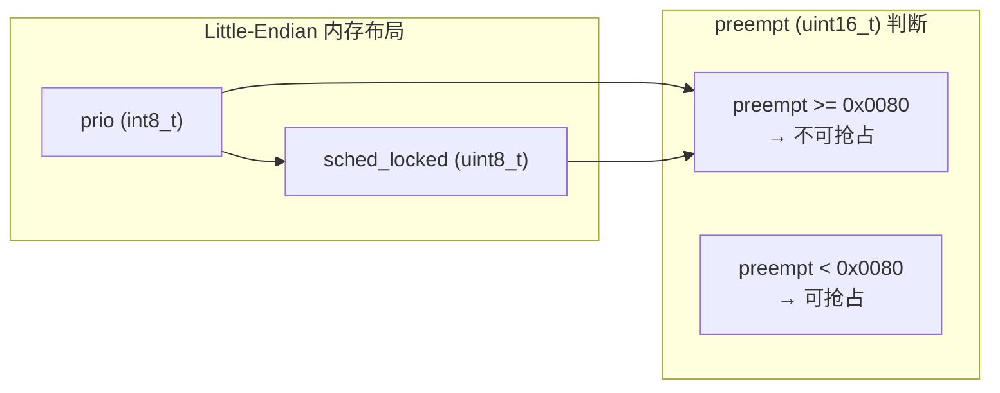

# Zephyr RTOS 核心数据结构设计详解

> 返回：[入门概览](./00_入门概览.md) | [文档导航](../README.md)

---

## 总论：内核数据结构设计概览

### 1. 设计背景

Zephyr RTOS 是一款面向资源受限嵌入式设备的实时操作系统，其内核数据结构的设计需要满足以下核心需求：

| 需求维度 | 具体要求 | 设计考量 |
|---------|---------|---------|
| **资源约束** | 最小 8KB RAM 可运行 | 数据结构紧凑，避免冗余字段 |
| **实时性** | 确定性的响应时间 | O(1) 或 O(log n) 时间复杂度的操作 |
| **可移植性** | 支持多种 CPU 架构 | 架构相关部分抽象隔离 |
| **可配置性** | 按需裁剪功能 | 编译时配置，条件编译 |
| **安全性** | 内存保护、隔离 | 用户空间、内存域支持 |

### 2. 核心设计目标

```
┌─────────────────────────────────────────────────────────────────────┐
│                        Zephyr 内核数据结构设计目标                    │
├─────────────────────────────────────────────────────────────────────┤
│                                                                     │
│  ┌─────────────┐   ┌─────────────┐   ┌─────────────┐              │
│  │   高效性    │   │   可扩展性  │   │   安全性    │              │
│  │             │   │             │   │             │              │
│  │ • 位标志    │   │ • 条件编译  │   │ • 内存保护  │              │
│  │ • 联合体    │   │ • 模块化    │   │ • 用户空间  │              │
│  │ • 内联函数  │   │ • 插件式    │   │ • 对象权限  │              │
│  └─────────────┘   └─────────────┘   └─────────────┘              │
│                                                                     │
│  ┌─────────────┐   ┌─────────────┐   ┌─────────────┐              │
│  │   实时性    │   │   可移植性  │   │   类型安全  │              │
│  │             │   │             │   │             │              │
│  │ • 优先级    │   │ • HAL 抽象  │   │ • 强类型    │              │
│  │ • 抢占式    │   │ • 架构隔离  │   │ • 编译检查  │              │
│  │ • 确定性    │   │ • 跨平台    │   │ • API 规范  │              │
│  └─────────────┘   └─────────────┘   └─────────────┘              │
│                                                                     │
└─────────────────────────────────────────────────────────────────────┘
```

### 3. 整体架构框架

Zephyr 内核数据结构按功能层次划分为以下模块：

```
┌─────────────────────────────────────────────────────────────────────────────┐
│                              应用层 (Application)                            │
│                    用户线程、应用逻辑、业务代码                               │
├─────────────────────────────────────────────────────────────────────────────┤
│                            内核服务层 (Kernel Services)                      │
│  ┌─────────────────────────────────────────────────────────────────────┐   │
│  │                        线程管理 (Thread Management)                  │   │
│  │   ┌─────────────┐  ┌─────────────┐  ┌─────────────┐               │   │
│  │   │  k_thread   │  │ _thread_base│  │ _callee_saved│              │   │
│  │   │  线程控制块  │  │  线程基础   │  │  寄存器保存  │               │   │
│  │   └─────────────┘  └─────────────┘  └─────────────┘               │   │
│  └─────────────────────────────────────────────────────────────────────┘   │
│  ┌─────────────────────────────────────────────────────────────────────┐   │
│  │                        同步机制 (Synchronization)                    │   │
│  │   ┌─────────────┐  ┌─────────────┐  ┌─────────────┐               │   │
│  │   │   k_mutex   │  │    k_sem    │  │  k_condvar  │               │   │
│  │   │   互斥锁    │  │   信号量    │  │  条件变量   │               │   │
│  │   └─────────────┘  └─────────────┘  └─────────────┘               │   │
│  └─────────────────────────────────────────────────────────────────────┘   │
│  ┌─────────────────────────────────────────────────────────────────────┐   │
│  │                        数据传递 (Data Passing)                       │   │
│  │   ┌─────────────┐  ┌─────────────┐  ┌─────────────┐               │   │
│  │   │   k_queue   │  │   k_pipe    │  │  k_msgq     │               │   │
│  │   │    队列     │  │    管道     │  │  消息队列   │               │   │
│  │   └─────────────┘  └─────────────┘  └─────────────┘               │   │
│  └─────────────────────────────────────────────────────────────────────┘   │
│  ┌─────────────────────────────────────────────────────────────────────┐   │
│  │                        定时服务 (Timing Services)                    │   │
│  │   ┌─────────────┐  ┌─────────────┐  ┌─────────────┐               │   │
│  │   │   k_timer   │  │  _timeout   │  │   k_work    │               │   │
│  │   │   定时器    │  │   超时结构  │  │   工作项    │               │   │
│  │   └─────────────┘  └─────────────┘  └─────────────┘               │   │
│  └─────────────────────────────────────────────────────────────────────┘   │
├─────────────────────────────────────────────────────────────────────────────┤
│                          设备驱动层 (Device Drivers)                         │
│  ┌─────────────────────────────────────────────────────────────────────┐   │
│  │                        设备模型 (Device Model)                       │   │
│  │   ┌─────────────┐  ┌─────────────┐  ┌─────────────┐               │   │
│  │   │   device    │  │ device_state│  │  device_ops │               │   │
│  │   │   设备结构  │  │  设备状态   │  │  设备操作   │               │   │
│  │   └─────────────┘  └─────────────┘  └─────────────┘               │   │
│  └─────────────────────────────────────────────────────────────────────┘   │
├─────────────────────────────────────────────────────────────────────────────┤
│                          基础数据结构层 (Foundation)                          │
│  ┌─────────────┐  ┌─────────────┐  ┌─────────────┐  ┌─────────────┐      │
│  │  _wait_q_t  │  │ k_timeout_t │  │ sys_dlist_t │  │ sys_slist_t │      │
│  │   等待队列  │  │   超时类型  │  │   双向链表  │  │   单向链表  │      │
│  └─────────────┘  └─────────────┘  └─────────────┘  └─────────────┘      │
├─────────────────────────────────────────────────────────────────────────────┤
│                          硬件抽象层 (Hardware Abstraction)                   │
│                    架构相关代码、寄存器操作、中断处理                          │
└─────────────────────────────────────────────────────────────────────────────┘
```

### 4. 数据结构关系总览

```
                              ┌──────────────────┐
                              │    k_thread      │
                              │   (线程控制块)    │
                              └────────┬─────────┘
                                       │
           ┌───────────────────────────┼───────────────────────────┐
           │                           │                           │
           ▼                           ▼                           ▼
    ┌─────────────┐            ┌─────────────┐            ┌─────────────┐
    │ _thread_base│            │_callee_saved│            │ stack_info  │
    │  (基础信息) │            │ (寄存器保存)│            │  (栈信息)   │
    └──────┬──────┘            └─────────────┘            └─────────────┘
           │
           │ 包含
           ▼
    ┌─────────────┐
    │  _timeout   │◄─────────────────────────────────────────┐
    │  (超时结构) │                                          │
    └─────────────┘                                          │
           │                                                 │
           │ 被使用于                                        │
           ▼                                                 │
    ┌─────────────┐    ┌─────────────┐    ┌─────────────┐    │
    │   k_timer   │    │   k_work    │    │  k_sem      │    │
    │   (定时器)  │    │  (工作项)   │    │ (信号量)    │    │
    └─────────────┘    └─────────────┘    └──────┬──────┘    │
                                              │           │
                                              │ 包含      │ 包含
                                              ▼           │
                                       ┌─────────────┐    │
                                       │  _wait_q_t  │────┘
                                       │  (等待队列) │
                                       └─────────────┘
                                              │
                                              │ 被使用于
                                              ▼
                    ┌─────────────────────────────────────────────┐
                    │                                             │
             ┌──────┴──────┐  ┌─────────────┐  ┌─────────────┐   │
             │   k_mutex   │  │   k_queue   │  │   k_pipe    │   │
             │   (互斥锁)  │  │   (队列)    │  │   (管道)    │   │
             └─────────────┘  └─────────────┘  └─────────────┘   │
                    │                                             │
                    └─────────────────────────────────────────────┘
```

### 5. 应用场景映射

| 应用场景 | 核心数据结构 | 典型用途 |
|---------|-------------|---------|
| **多任务调度** | `k_thread`, `_thread_base` | 创建、调度、切换线程 |
| **资源互斥** | `k_mutex`, `k_sem` | 保护临界区、共享资源 |
| **线程同步** | `k_sem`, `k_condvar`, `k_event` | 线程间协调、事件通知 |
| **数据传输** | `k_queue`, `k_pipe`, `k_msgq` | 线程间数据传递 |
| **定时任务** | `k_timer`, `k_work` | 延迟执行、周期性任务 |
| **设备驱动** | `device`, `device_state` | 硬件抽象、驱动管理 |

---

## 分论：核心数据结构详解

---

## 第一部分：线程管理数据结构

### 1.1 `struct k_thread` - 线程控制块

#### 1.1.1 设计背景与目的

线程控制块（Thread Control Block, TCB）是操作系统中最核心的数据结构之一。在 Zephyr 中，`struct k_thread` 封装了线程的所有状态信息，是调度器进行线程管理的基础单元。

**设计目标**：
- 存储线程的完整执行上下文
- 支持多种调度策略（协作式、抢占式、EDF）
- 支持多核 SMP 系统
- 支持内存保护和用户空间隔离

#### 1.1.2 数据结构定义

源码位置：[include/zephyr/kernel/thread.h](file:///home/pbw/cs-learning-notes/zephyr-src/include/zephyr/kernel/thread.h)

```c
struct k_thread {
    struct _thread_base base;
    struct _callee_saved callee_saved;
    void *init_data;
#if defined(CONFIG_THREAD_NAME)
    char name[CONFIG_THREAD_MAX_NAME_LEN];
#endif
#ifdef CONFIG_THREAD_CUSTOM_DATA
    void *custom_data;
#endif
    _wait_q_t join_queue;
#if defined(CONFIG_POLL)
    struct z_poller poller;
#endif
#if defined(CONFIG_EVENTS)
    struct k_thread *next_event_link;
    uint32_t events;
    uint32_t event_options;
#endif
#if defined(CONFIG_THREAD_STACK_INFO)
    struct _thread_stack_info stack_info;
#endif
#if defined(CONFIG_USERSPACE)
    struct _mem_domain_info mem_domain_info;
    k_thread_stack_t *stack_obj;
#endif
#if defined(CONFIG_THREAD_MONITOR)
    struct __thread_entry entry;
    struct k_thread *next_thread;
#endif
#if defined(CONFIG_ERRNO) && !defined(CONFIG_ERRNO_IN_TLS)
    int errno_var;
#endif
};
```

#### 1.1.3 `_thread_base` 详解（核心调度信息）

> ⚠️ `_thread_base` 是调度器直接操作的核心结构，理解它对理解调度机制至关重要。源码位于 [include/zephyr/kernel/thread.h:46](file:///home/pbw/cs-learning-notes/zephyr-src/include/zephyr/kernel/thread.h#L46)。

```c
struct _thread_base {
    union {
        sys_dnode_t qnode_dlist;    // 就绪/等待队列节点（双向链表）
        struct rbnode qnode_rb;     // 红黑树节点（可伸缩等待队列）
    };

    _wait_q_t *pended_on;           // 当前挂起的等待队列指针

    uint16_t user_options;          // 用户选项（K_ESSENTIAL, K_SSE_REGS 等）

    union {
        struct {
#ifdef CONFIG_BIG_ENDIAN
            uint8_t sched_locked;   // 调度器锁计数（0xFF~0x01 表示锁定）
            int8_t prio;            // 线程优先级（负值=协作式）
#else
            int8_t prio;            // 线程优先级
            uint8_t sched_locked;   // 调度器锁计数
#endif
        };
        uint16_t preempt;           // 整体抢占判断：>= 0x0080 则不可抢占
    };

#ifdef CONFIG_SCHED_DEADLINE
    int prio_deadline;              // EDF 调度截止时间
#endif

#if defined(CONFIG_SCHED_SCALABLE) || defined(CONFIG_WAITQ_SCALABLE)
    uint32_t order_key;             // 红黑树排序键
#endif

    uint8_t thread_state;           // 线程状态（_THREAD_PENDING 等）

#ifdef CONFIG_SMP
    uint8_t is_idle;                // 是否为空闲线程
    uint8_t cpu;                    // 最后执行的 CPU ID
    uint8_t global_lock_count;      // 全局 irq_lock 递归计数
#endif

#ifdef CONFIG_SCHED_CPU_MASK
    uint16_t cpu_mask;              // CPU 亲和性掩码
#endif

    void *swap_data;                // 上下文切换时传递的数据

#ifdef CONFIG_SYS_CLOCK_EXISTS
    struct _timeout timeout;        // 超时队列节点
#endif

#ifdef CONFIG_TIMESLICE_PER_THREAD
    int32_t slice_ticks;            // 每线程时间片
    k_thread_timeslice_fn_t slice_expired;
    void *slice_data;
#endif

#ifdef CONFIG_SCHED_THREAD_USAGE
    struct k_cycle_stats usage;     // CPU 使用率统计
#endif
};
```

**`prio` + `sched_locked` 的巧妙联合**：



| prio 值 | 含义 | sched_locked | preempt 值 | 可抢占？ |
|---------|------|-------------|-----------|---------|
| -1 (0xFF) | 协作式 | 0 | 0xFF00 | ❌ 不可抢占 |
| 5 | 抢占式 | 0 | 0x0005 | ✅ 可抢占 |
| 5 | 抢占式 | 1 | 0x0105 | ✅ 可抢占 |
| 5 | 抢占式 | 0x80 | 0x8005 | ❌ 不可抢占 |

**关键设计**：通过一个 16 位比较即可判断线程是否可抢占，无需分别检查优先级和锁计数。

#### 1.1.4 字段详解

| 字段名 | 类型 | 功能作用 | 关键算法/机制 |
|-------|------|---------|--------------|
| `base` | `struct _thread_base` | 存储调度所需的核心信息 | 包含优先级、状态、队列节点、超时结构 |
| `callee_saved` | `struct _callee_saved` | 保存上下文切换时的寄存器 | 架构相关，用于恢复执行现场 |
| `init_data` | `void *` | 静态线程的初始化配置 | 用于延迟启动和重启 |
| `name` | `char[]` | 线程可读名称 | 调试、日志、Shell 显示 |
| `custom_data` | `void *` | 用户自定义数据 | 实现简单的线程本地存储 |
| `join_queue` | `_wait_q_t` | 等待该线程结束的线程 | 实现 `k_thread_join()` |
| `stack_info` | `struct _thread_stack_info` | 栈的地址和大小 | 栈溢出检测、内存保护 |
| `mem_domain_info` | `struct _mem_domain_info` | 内存域归属 | 实现内存隔离 |

#### 1.1.5 与其他结构的交互

```
                    ┌─────────────────────────────────────┐
                    │           调度器 (Scheduler)         │
                    │                                     │
                    │  • 读取 base.prio 决定调度顺序       │
                    │  • 读取 base.thread_state 判断状态   │
                    │  • 通过 base.qnode_dlist 管理队列    │
                    └──────────────────┬──────────────────┘
                                       │
                                       ▼
┌─────────────────────────────────────────────────────────────────────────┐
│                           struct k_thread                                │
├─────────────────────────────────────────────────────────────────────────┤
│  base.prio ──────────────────► 决定调度优先级                            │
│  base.thread_state ──────────► 决定是否可运行                            │
│  base.qnode_dlist ───────────► 就绪队列链接                              │
│  base.timeout ───────────────► 睡眠/延迟超时                             │
│  callee_saved ───────────────► 上下文保存/恢复                           │
│  stack_info ─────────────────► 栈边界检查                                │
└─────────────────────────────────────────────────────────────────────────┘
                                       │
           ┌───────────────────────────┼───────────────────────────┐
           │                           │                           │
           ▼                           ▼                           ▼
    ┌─────────────┐            ┌─────────────┐            ┌─────────────┐
    │  同步对象   │            │  定时器     │            │  工作队列   │
    │ (mutex/sem) │            │ (k_timer)   │            │ (k_work_q)  │
    └─────────────┘            └─────────────┘            └─────────────┘
```

#### 1.1.6 关键操作流程

**线程创建流程**：
```
k_thread_create()
       │
       ▼
┌─────────────────┐
│ 分配栈空间       │
│ k_thread_stack  │
└────────┬────────┘
         │
         ▼
┌─────────────────┐
│ 初始化 k_thread │
│ • 设置优先级    │
│ • 设置入口函数  │
│ • 初始化栈帧    │
└────────┬────────┘
         │
         ▼
┌─────────────────┐
│ 加入就绪队列    │
│ (如果无延迟)    │
└─────────────────┘
```

---

### 1.2 `struct _thread_base` - 线程基础结构

#### 1.2.1 设计背景与目的

`_thread_base` 将线程调度所需的核心信息抽取出来，实现调度逻辑与线程完整信息的分离。这种设计有以下优势：

- **代码复用**：调度器只需操作 `_thread_base`，无需了解完整的 `k_thread`
- **内存优化**：使用联合体压缩 `prio` 和 `sched_locked` 字段
- **多队列支持**：通过联合体支持链表和红黑树两种队列实现

#### 1.2.2 数据结构定义

源码位置：[include/zephyr/kernel/thread.h](file:///home/pbw/cs-learning-notes/zephyr-src/include/zephyr/kernel/thread.h#L46)

```c
struct _thread_base {
    /* ======== 队列节点（支持多种队列实现） ======== */
    union {
        sys_dnode_t qnode_dlist;    /* 双向链表节点（简单调度器） */
        struct rbnode qnode_rb;      /* 红黑树节点（可扩展调度器） */
    };
    
    /* ======== 等待信息 ======== */
    _wait_q_t *pended_on;            /* 线程挂起的等待队列 */
    
    /* ======== 线程选项 ======== */
    uint16_t user_options;           /* 用户可见的线程选项 */
    
    /* ======== 抢占控制（紧凑存储） ======== */
    union {
        struct {
#ifdef CONFIG_BIG_ENDIAN
            uint8_t sched_locked;     /* 调度器锁计数 */
            int8_t prio;             /* 线程优先级 */
#else
            int8_t prio;             /* 线程优先级 */
            uint8_t sched_locked;     /* 调度器锁计数 */
#endif
        };
        uint16_t preempt;           /* 打包值：用于快速判断是否可抢占 */
    };
    
    /* ======== EDF 调度支持 ======== */
#ifdef CONFIG_SCHED_DEADLINE
    int prio_deadline;              /* 截止时间优先级 */
#endif
    
    /* ======== 可扩展调度器支持 ======== */
#if defined(CONFIG_SCHED_SCALABLE) || defined(CONFIG_WAITQ_SCALABLE)
    uint32_t order_key;             /* 排序键 */
#endif
    
    /* ======== 线程状态 ======== */
    uint8_t thread_state;           /* 线程状态（位标志） */
    
    /* ======== SMP 支持 ======== */
#ifdef CONFIG_SMP
    uint8_t is_idle;                /* 是否为空闲线程 */
    uint8_t cpu;                    /* 当前执行的 CPU */
    uint8_t global_lock_count;      /* 全局锁计数 */
#endif
    
    /* ======== CPU 亲和性 ======== */
#ifdef CONFIG_SCHED_CPU_MASK
    uint16_t cpu_mask;              /* CPU 亲和性掩码 */
#endif
    
    /* ======== 上下文切换数据 ======== */
    void *swap_data;                /* 上下文切换时传递的数据 */
    
    /* ======== 超时管理 ======== */
#ifdef CONFIG_SYS_CLOCK_EXISTS
    struct _timeout timeout;        /* 超时结构 */
#endif
    
    /* ======== 时间片支持 ======== */
#ifdef CONFIG_TIMESLICE_PER_THREAD
    int32_t slice_ticks;            /* 时间片 tick 数 */
    k_thread_timeslice_fn_t slice_expired;  /* 时间片到期回调 */
    void *slice_data;               /* 时间片回调数据 */
#endif
    
    /* ======== 使用统计 ======== */
#ifdef CONFIG_SCHED_THREAD_USAGE
    struct k_cycle_stats usage;     /* CPU 使用统计 */
#endif
};
```

#### 1.2.3 状态标志详解

Zephyr 使用**位标志**表示线程状态，允许线程同时处于多个状态：

```c
#define _THREAD_DUMMY     (BIT(0))   /* 虚拟线程（非真实线程） */
#define _THREAD_PENDING   (BIT(1))   /* 线程正在等待对象 */
#define _THREAD_SLEEPING  (BIT(2))   /* 线程正在睡眠 */
#define _THREAD_DEAD      (BIT(3))   /* 线程已终止 */
#define _THREAD_SUSPENDED (BIT(4))   /* 线程被挂起 */
#define _THREAD_ABORTING  (BIT(5))   /* 线程正在中止过程中 */
#define _THREAD_SUSPENDING (BIT(6))  /* 线程正在挂起过程中 */
#define _THREAD_QUEUED    (BIT(7))   /* 线程在就绪队列中 */
```

**状态判断逻辑**：

```c
static inline bool z_is_thread_prevented_from_running(const struct k_thread *thread)
{
    uint8_t state = thread->base.thread_state;
    return (state & (_THREAD_PENDING | _THREAD_SLEEPING | _THREAD_DEAD |
                     _THREAD_DUMMY | _THREAD_SUSPENDED)) != 0U;
}

static inline bool z_is_thread_ready(const struct k_thread *thread)
{
    return !z_is_thread_prevented_from_running(thread);
}
```

#### 1.2.4 抢占性判断机制

```c
#define _NON_PREEMPT_THRESHOLD 0x0080U
#define _PREEMPT_THRESHOLD     (_NON_PREEMPT_THRESHOLD - 1U)

static inline int thread_is_preemptible(const struct k_thread *thread)
{
    return thread->base.preempt <= _PREEMPT_THRESHOLD;
}
```

**原理说明**：
- `prio` 为 `int8_t`，协作式线程优先级为负数（0x80~0xFF）
- `sched_locked` 为 `uint8_t`，锁计数
- 打包后的 `preempt` 值 >= 0x0080 表示线程不可抢占

---

### 1.3 `struct _timeout` - 超时结构

#### 1.3.1 设计背景与目的

超时结构是 Zephyr 时间管理的基础，用于实现：
- 线程睡眠（`k_sleep()`）
- 定时器（`k_timer`）
- 超时等待（`k_sem_take(&sem, K_MSEC(100))`）

#### 1.3.2 数据结构定义

源码位置：[include/zephyr/kernel_structs.h](file:///home/pbw/cs-learning-notes/zephyr-src/include/zephyr/kernel_structs.h#L302)

```c
typedef void (*_timeout_func_t)(struct _timeout *t);

struct _timeout {
    sys_dnode_t node;          /* 链表节点（用于超时队列） */
    _timeout_func_t fn;        /* 超时回调函数 */
#ifdef CONFIG_TIMEOUT_64BIT
    int64_t dticks;            /* 距离超时的 tick 数（64位） */
#else
    int32_t dticks;            /* 距离超时的 tick 数（32位） */
#endif
};
```

#### 1.3.3 超时队列工作原理

```
系统时钟中断 (sys_clock_announce)
           │
           ▼
┌─────────────────────────────────────────────────────────┐
│                    超时队列 (timeout_list)               │
│                                                         │
│   head ──► [timeout1] ──► [timeout2] ──► [timeout3]     │
│             dticks=5      dticks=10     dticks=20       │
│                                                         │
│   注：dticks 是相对于前一节点的增量                      │
└─────────────────────────────────────────────────────────┘
           │
           │ 每个 tick 递减第一个节点的 dticks
           │ 当 dticks == 0 时触发回调
           ▼
┌─────────────────────────────────────────────────────────┐
│                     超时回调执行                         │
│                                                         │
│   • 唤醒睡眠的线程                                       │
│   • 触发定时器到期函数                                   │
│   • 重新调度                                             │
└─────────────────────────────────────────────────────────┘
```

---

## 第二部分：同步机制数据结构

### 2.1 `struct k_mutex` - 互斥锁

#### 2.1.1 设计背景与目的

互斥锁用于保护临界区，确保同一时刻只有一个线程访问共享资源。Zephyr 的互斥锁实现了**优先级继承**协议，解决优先级反转问题。

**优先级反转问题**：
```
低优先级线程 L 持有互斥锁
        ↓
中优先级线程 M 抢占 L（与锁无关）
        ↓
高优先级线程 H 等待锁，被 M 阻塞
        ↓
问题：H 被 M 间接阻塞（优先级反转）
```

**优先级继承解决方案**：
```
低优先级线程 L 持有互斥锁
        ↓
高优先级线程 H 等待锁
        ↓
L 的优先级临时提升到 H 的优先级
        ↓
L 尽快执行并释放锁
        ↓
L 恢复原始优先级
        ↓
H 获得锁并执行
```

#### 2.1.2 数据结构定义

源码位置：[include/zephyr/kernel.h](file:///home/pbw/cs-learning-notes/zephyr-src/include/zephyr/kernel.h#L3437)

```c
struct k_mutex {
    _wait_q_t wait_q;           /* 等待获取锁的线程队列 */
    struct k_thread *owner;     /* 当前持有锁的线程 */
    uint32_t lock_count;        /* 递归锁计数 */
    int owner_orig_prio;        /* 拥有者的原始优先级 */
};
```

#### 2.1.3 关键算法

**优先级继承算法**（简化版）：

```c
static bool adjust_owner_prio(struct k_mutex *mutex, int32_t new_prio)
{
    if (mutex->owner->base.prio != new_prio) {
        // 临时提升持有者的优先级
        mutex->owner->base.prio = new_prio;
        // 如果线程在就绪队列中，需要重新排序
        if (z_is_thread_ready(mutex->owner)) {
            // 重新插入就绪队列
        }
        return true;
    }
    return false;
}

// 锁定时
int k_mutex_lock(struct k_mutex *mutex, k_timeout_t timeout)
{
    if (mutex->owner == NULL) {
        // 锁空闲，直接获取
        mutex->owner = _current;
        mutex->lock_count = 1;
        return 0;
    }
    
    if (mutex->owner == _current) {
        // 递归锁
        mutex->lock_count++;
        return 0;
    }
    
    // 优先级继承：提升持有者优先级
    if (_current->base.prio < mutex->owner->base.prio) {
        adjust_owner_prio(mutex, _current->base.prio);
    }
    
    // 等待锁
    return z_pend_curr(&mutex->lock, key, &mutex->wait_q, timeout);
}

// 解锁时
int k_mutex_unlock(struct k_mutex *mutex)
{
    mutex->lock_count--;
    
    if (mutex->lock_count == 0) {
        // 恢复原始优先级
        if (mutex->owner->base.prio != mutex->owner_orig_prio) {
            mutex->owner->base.prio = mutex->owner_orig_prio;
        }
        
        // 唤醒等待线程
        struct k_thread *new_owner = z_unpend_first_thread(&mutex->wait_q);
        if (new_owner) {
            mutex->owner = new_owner;
            mutex->lock_count = 1;
            // 再次应用优先级继承
        } else {
            mutex->owner = NULL;
        }
    }
    return 0;
}
```

---

### 2.2 `struct k_sem` - 信号量

#### 2.2.1 设计背景与目的

信号量是一种通用的同步机制，可用于：
- **互斥访问**：二进制信号量（计数 0/1）
- **资源计数**：计数信号量（管理有限资源池）
- **线程同步**：生产者-消费者模型

#### 2.2.2 数据结构定义

源码位置：[include/zephyr/kernel.h](file:///home/pbw/cs-learning-notes/zephyr-src/include/zephyr/kernel.h#L3663)

```c
struct k_sem {
    _wait_q_t wait_q;           /* 等待信号量的线程队列 */
    unsigned int count;         /* 当前计数值 */
    unsigned int limit;         /* 最大计数值 */
};
```

#### 2.2.3 操作语义

```
k_sem_give() - V 操作：
┌─────────────────────────────────────────────────┐
│  count < limit ?                                │
│     │                                           │
│     ├── YES ──► count++                         │
│     │              │                            │
│     │              └──► 有等待线程？            │
│     │                     │                     │
│     │                     ├── YES ──► 唤醒线程  │
│     │                     └── NO ──► 返回       │
│     │                                           │
│     └── NO ──► 不增加（已达上限）               │
└─────────────────────────────────────────────────┘

k_sem_take() - P 操作：
┌─────────────────────────────────────────────────┐
│  count > 0 ?                                    │
│     │                                           │
│     ├── YES ──► count--，返回成功               │
│     │                                           │
│     └── NO ──► timeout == K_NO_WAIT ?           │
│                     │                           │
│                     ├── YES ──► 返回 -EBUSY     │
│                     │                           │
│                     └── NO ──► 阻塞等待         │
└─────────────────────────────────────────────────┘
```

---

### 2.3 `struct k_event` - 事件

#### 2.3.1 设计背景与目的

事件对象允许线程等待一个或多个事件的组合，支持 ANY（任意一个）和 ALL（全部）两种等待模式。与信号量只表示"有/无"不同，事件使用 32 位位图，可同时表示最多 32 种独立事件。

#### 2.3.2 数据结构定义

源码位置：[include/zephyr/kernel.h](file:///home/pbw/cs-learning-notes/zephyr-src/include/zephyr/kernel.h)

```c
struct k_event {
    _wait_q_t wait_q;           /* 等待事件的线程队列 */
    struct k_spinlock lock;     /* 保护事件对象的自旋锁 */
    uint32_t events;            /* 当前事件位图（32位，每位一个事件） */
};
```

#### 2.3.3 等待模式

| 模式 | 宏 | 含义 |
|-----|-----|------|
| 任意 | `K_EVENT_WAIT_ANY` | 等待的任一事件发生即返回 |
| 全部 | `K_EVENT_WAIT_ALL` | 等待的所有事件都发生才返回 |

与线程的交互：线程的 `k_thread` 结构中有 `events`（等待的事件位图）和 `event_options`（等待模式）字段，用于在 `z_pend_curr()` 后记录等待条件。当 `k_event_post()` 被调用时，内核遍历等待队列，通过 `are_wait_conditions_met()` 检查每个线程的条件是否满足，一次性唤醒所有满足条件的线程。

---

## 第三部分：定时服务数据结构

### 3.1 `struct k_timer` - 定时器

#### 3.1.1 设计背景与目的

软件定时器允许用户在指定时间后执行回调函数，支持：
- **单次定时器**：到期后停止
- **周期性定时器**：到期后自动重启

#### 3.1.2 数据结构定义

源码位置：[include/zephyr/kernel.h](file:///home/pbw/cs-learning-notes/zephyr-src/include/zephyr/kernel.h#L1777)

```c
struct k_timer {
    struct _timeout timeout;    /* 超时结构（必须为第一个字段） */
    _wait_q_t wait_q;           /* 等待定时器的线程队列 */
    void (*expiry_fn)(struct k_timer *timer);  /* 到期回调（ISR 上下文） */
    void (*stop_fn)(struct k_timer *timer);    /* 停止回调（线程上下文） */
    k_timeout_t period;         /* 周期（K_NO_WAIT 表示单次） */
    uint32_t status;            /* 状态标志 */
    void *user_data;            /* 用户数据 */
};
```

#### 3.1.3 工作流程

```
k_timer_start(timer, duration, period)
           │
           ▼
┌─────────────────────────────────────┐
│ 设置 timeout.dticks = duration      │
│ 设置 timer.period = period          │
│ 将 timeout 加入超时队列             │
└──────────────────┬──────────────────┘
                   │
                   │ 等待 duration 时间
                   ▼
┌─────────────────────────────────────┐
│ 系统时钟中断触发                     │
│ timeout.dticks 递减到 0             │
└──────────────────┬──────────────────┘
                   │
                   ▼
┌─────────────────────────────────────┐
│ 执行 expiry_fn()（ISR 上下文）      │
│                                     │
│ 如果 period != K_NO_WAIT：          │
│   重新设置 timeout.dticks = period  │
│   再次加入超时队列                   │
└─────────────────────────────────────┘
```

---

### 3.2 `struct k_work` - 工作项

#### 3.2.1 设计背景与目的

工作队列是一种延迟执行机制，允许将工作从 ISR 或高优先级线程推迟到专用的工作线程执行。这有以下优势：
- ISR 中不能执行阻塞操作，工作队列可以
- 避免在 ISR 中执行耗时操作
- 实现任务的延迟执行

#### 3.2.2 数据结构定义

```c
struct k_work {
    sys_snode_t node;           /* 链表节点 */
    k_work_handler_t handler;   /* 工作处理函数 */
    struct k_work_q *queue;     /* 所属工作队列 */
    uint32_t flags;             /* 状态标志 */
};

struct k_work_delayable {
    struct k_work work;         /* 工作项 */
    struct _timeout timeout;    /* 延迟超时 */
    struct k_work_q *queue;     /* 目标队列 */
};

struct k_work_q {
    struct k_thread thread;     /* 工作线程 */
    k_tid_t thread_id;          /* 线程 ID */
    sys_slist_t pending;        /* 待处理工作列表 */
    _wait_q_t notifyq;          /* 空闲通知队列 */
    _wait_q_t drainq;           /* 排空等待队列 */
    uint32_t flags;             /* 队列状态 */
};
```

#### 3.2.3 工作流程

```
k_work_submit(work)
           │
           ▼
┌─────────────────────────────────────┐
│ 将 work 加入 pending 队列           │
│ 唤醒工作队列线程                     │
└──────────────────┬──────────────────┘
                   │
                   ▼
┌─────────────────────────────────────┐
│ 工作队列线程被唤醒                   │
│ 从 pending 队列取出 work            │
└──────────────────┬──────────────────┘
                   │
                   ▼
┌─────────────────────────────────────┐
│ 执行 work->handler(work)            │
│ （在线程上下文中，可以阻塞）         │
└─────────────────────────────────────┘
```

---

### 3.3 `struct k_work_poll` - 可轮询的工作项

#### 3.3.1 设计背景与目的

普通 `k_work` 需要显式提交才能执行。`k_work_poll` 扩展了工作项的能力：它可以**自动等待**一组事件（信号量、FIFO、socket 等），当任意事件触发时自动调度 handler 执行。这本质上是将事件等待和回调执行绑定在一起，避免单独创建线程去轮询。

#### 3.3.2 数据结构定义

源码位置：[include/zephyr/kernel.h](file:///home/pbw/cs-learning-notes/zephyr-src/include/zephyr/kernel.h)

```c
struct k_work_poll {
    struct k_work work;                /* 内嵌的普通工作项 */
    struct _poller poller;             /* 内部轮询器（等待的事件集合） */
    k_work_poll_handler_t handler;     /* 事件触发时的回调函数 */
    int poll_event_idx;                /* 记录哪个事件触发了回调 */
};
```

`_poller` 内部维护一个 `struct z_poller_event[]` 数组，每个元素记录要等待的事件对象和触发条件。当提交 `k_work_poll` 后，内核将这些事件注册到各自的等待队列中。

#### 3.3.3 执行流程

```
k_work_poll_submit(poll, events, timeout)
    │
    ├── 将 events[] 中的每个事件对象注册到等待队列
    │
    ├── 任一事件触发 → 唤醒 workqueue 线程
    │
    └── 线程执行 poll->handler(poll)
        └── handler 通过 poll_event_idx 判断哪个事件触发了
```

---

## 第四部分：数据传递数据结构

### 4.1 `struct k_queue` - 队列

#### 4.1.1 设计背景与目的

队列实现线程间的数据传递，支持：
- 先进先出（FIFO）顺序
- 紧急插入（插入到队列头部）
- 阻塞等待数据

#### 4.1.2 数据结构定义

```c
struct k_queue {
    sys_sflist_t data_q;        /* 数据队列（单链表） */
    struct k_spinlock lock;     /* 保护队列的自旋锁 */
    _wait_q_t wait_q;           /* 等待数据的线程队列 */
};
```

#### 4.1.3 使用模式

```c
// 生产者
void producer(void) {
    struct my_data *data = allocate_data();
    k_queue_append(&my_queue, data);  // 加入队列尾部
    // 或 k_queue_prepend(&my_queue, data);  // 加入队列头部
}

// 消费者
void consumer(void) {
    struct my_data *data = k_queue_get(&my_queue, K_FOREVER);
    process_data(data);
    free(data);
}
```

---

### 4.2 `struct k_pipe` - 管道

#### 4.2.1 设计背景与目的

管道提供字节流传输机制，适合：
- 大量数据传输
- 流式数据处理
- 固定大小缓冲区场景

#### 4.2.2 数据结构定义

```c
struct k_pipe {
    size_t waiting;             /* 等待的线程数 */
    struct ring_buf buf;        /* 环形缓冲区 */
    struct k_spinlock lock;     /* 保护管道的自旋锁 */
    _wait_q_t data;             /* 等待数据的线程队列 */
    _wait_q_t space;            /* 等待空间的线程队列 */
    uint8_t flags;              /* 管道状态标志 */
};
```

---

## 第五部分：设备驱动数据结构

### 5.1 `struct device` - 设备结构

#### 5.1.1 设计背景与目的

Zephyr 采用统一的设备模型，所有设备驱动遵循相同的接口规范。`struct device` 是设备模型的核心，实现：
- 设备的统一管理
- 驱动与硬件的解耦
- 设备依赖管理
- 电源管理集成

#### 5.1.2 数据结构定义

源码位置：[include/zephyr/device.h](file:///home/pbw/cs-learning-notes/zephyr-src/include/zephyr/device.h)

```c
struct device {
    const char *name;             // 设备名称
    const void *config;           // 配置信息（ROM 中，编译时确定）
    const void *api;              // API 函数指针表
    void *data;                   // 设备私有数据（RAM 中，运行时）
#ifdef CONFIG_PM_DEVICE
    struct pm_device *pm;         // 电源管理上下文
#endif
#ifdef CONFIG_DEVICE_DT_METADATA
    struct device_dt_metadata *dtm; // 设备树元数据
#endif
};
```

> ⚠️ 注意：与旧版本不同，当前 Zephyr 的 `struct device` 不再内嵌 `device_state` 和 `device_ops`，而是通过外部机制管理。设备状态通过 linker section 中的 `struct device_state` 数组管理，设备依赖通过 `CONFIG_DEVICE_DEPS` 配置。

#### 5.1.3 设备模型架构

```
┌─────────────────────────────────────────────────────────────────────┐
│                          应用层                                      │
│                  device_get_binding("uart0")                        │
└───────────────────────────────┬─────────────────────────────────────┘
                                │
                                ▼
┌─────────────────────────────────────────────────────────────────────┐
│                        struct device                                 │
│  ┌─────────────────────────────────────────────────────────────┐   │
│  │ name = "UART_0"                                              │   │
│  │ config ──► struct uart_config { baud_rate, parity, ... }    │   │
│  │ api ──► struct uart_driver_api { poll_in, poll_out, ... }   │   │
│  │ data ──► struct uart_dev_data { rx_buffer, tx_buffer, ... } │   │
│  │                                                              │   │
│  │ 注：init 状态由外部 `struct device_state` 管理              │   │
│  └─────────────────────────────────────────────────────────────┘   │
└───────────────────────────────┬─────────────────────────────────────┘
                                │
                                ▼
┌─────────────────────────────────────────────────────────────────────┐
│                          驱动层                                      │
│               uart_ns16550.c / uart_stm32.c / ...                   │
└───────────────────────────────┬─────────────────────────────────────┘
                                │
                                ▼
┌─────────────────────────────────────────────────────────────────────┐
│                          硬件层                                      │
│                    UART 寄存器 / GPIO / ...                          │
└─────────────────────────────────────────────────────────────────────┘
```

---

## 第六部分：基础数据结构

### 6.1 `_wait_q_t` - 等待队列

#### 6.1.1 设计背景与目的

等待队列是线程同步的基础设施，用于管理等待某个条件的线程集合。Zephyr 提供两种实现，通过 Kconfig 选择。

#### 6.1.2 数据结构定义

源码位置：[include/zephyr/kernel_structs.h](file:///home/pbw/cs-learning-notes/zephyr-src/include/zephyr/kernel_structs.h)

```c
typedef struct _wait_q {
#if defined(CONFIG_WAITQ_DUMB)
    sys_dlist_t waitq;          // 简单双向链表
#elif defined(CONFIG_WAITQ_SCALABLE)
    struct rbtree waitq;        // 红黑树
#endif
} _wait_q_t;
```

#### 6.1.3 两种实现对比

| 特性 | DUMB (双向链表) | SCALABLE (红黑树) |
|-----|----------------|------------------|
| Kconfig | `CONFIG_WAITQ_DUMB` | `CONFIG_WAITQ_SCALABLE` |
| 插入 | O(n) | O(log n) |
| 删除 | O(1) | O(log n) |
| 查找最高优先级 | O(n) | O(log n) |
| 内存开销 | 小（2 指针） | 大（3 指针 + color） |
| 适用场景 | 线程数少（< 32） | 线程数多（> 32） |
| 优先级排序 | 按插入顺序 | 按 `order_key` 排序 |

**为什么需要红黑树**：当系统有大量高优先级线程时，链表遍历查找最高优先级线程的开销变大。红黑树保证 O(log n) 的操作时间，适合大规模系统。

#### 6.1.4 使用场景

| 内核对象 | 等待队列用途 |
|---------|-------------|
| `k_mutex` | 等待获取互斥锁 |
| `k_sem` | 等待获取信号量 |
| `k_timer` | 等待定时器到期 |
| `k_queue` | 等待队列数据 |
| `k_pipe` | 等待读取/写入 |
| `k_condvar` | 等待条件变量 |
| `k_event` | 等待事件 |

---

### 6.2 `sys_dlist_t` / `sys_slist_t` - 链表

#### 6.2.1 设计背景

Zephyr 内核大量使用双向链表和单向链表作为基础数据结构。源码位于 [include/zephyr/sys/dlist.h](file:///home/pbw/cs-learning-notes/zephyr-src/include/zephyr/sys/dlist.h) 和 [include/zephyr/sys/slist.h](file:///home/pbw/cs-learning-notes/zephyr-src/include/zephyr/sys/slist.h)。

#### 6.2.2 双向链表

```c
struct _dnode {
    union {
        struct _dnode *head;
        sys_dnode_t *next;
    };
    union {
        struct _dnode *tail;
        sys_dnode_t *prev;
    };
};

typedef struct _dlist {
    union {
        sys_dnode_t *head;
        sys_dnode_t *tail;
    };
} sys_dlist_t;
```

**关键设计**：
- 使用 union 实现链表头尾共享存储（空链表时 head == tail）
- 节点包含 next/prev 指针，支持 O(1) 插入/删除
- 哨兵节点设计简化边界处理

#### 6.2.3 单向链表

```c
struct _snode {
    struct _snode *next;
};

struct _slist {
    struct _snode *head;
    struct _snode *tail;
};
```

#### 6.2.4 链表在内核中的使用

| 链表类型 | 使用位置 | 用途 |
|---------|---------|------|
| `sys_dlist_t` | 就绪队列 | 管理同优先级就绪线程 |
| `sys_dlist_t` | `_wait_q_t` | 等待队列（DUMB 模式） |
| `sys_dlist_t` | 超时队列 | 管理定时器超时 |
| `sys_slist_t` | `k_queue` | 数据队列 |
| `sys_slist_t` | `k_work_q` | 工作项队列 |
| `sys_sflist_t` | poll 事件 | 轮询事件列表 |

---

### 6.3 `k_timeout_t` - 超时类型

#### 6.3.1 设计背景与目的

`k_timeout_t` 提供类型安全的超时表示，支持多种时间单位。

#### 6.3.2 数据结构定义

```c
typedef struct k_timeout {
    int64_t ticks;              /* tick 数 */
} k_timeout_t;

/* 常用超时常量 */
#define K_NO_WAIT    ((k_timeout_t){ .ticks = 0 })      /* 不等待 */
#define K_FOREVER    ((k_timeout_t){ .ticks = -1 })     /* 永久等待 */
#define K_SECONDS(n) ((k_timeout_t){ .ticks = (n) * CONFIG_SYS_CLOCK_TICKS_PER_SEC })
#define K_MSEC(n)    ((k_timeout_t){ .ticks = (n) * CONFIG_SYS_CLOCK_TICKS_PER_SEC / 1000 })
#define K_USEC(n)    ((k_timeout_t){ .ticks = (n) * CONFIG_SYS_CLOCK_TICKS_PER_SEC / 1000000 })
```

---

## 总结

Zephyr RTOS 的内核数据结构设计体现了嵌入式实时操作系统的核心原则：

1. **高效紧凑**：使用位标志、联合体等技术优化内存使用
2. **模块化设计**：数据结构职责单一，接口清晰
3. **可配置可扩展**：通过编译选项裁剪功能，支持多种实现
4. **类型安全**：使用强类型和编译时检查减少错误
5. **跨平台可移植**：架构相关部分抽象隔离

理解这些核心数据结构是深入学习 Zephyr RTOS 的基础，建议结合源码和实际应用场景进行学习。

---

*本文档基于 Zephyr 源码分析，源码位置均标注了可点击的链接。*

---

*最后更新：2026-04-22*
