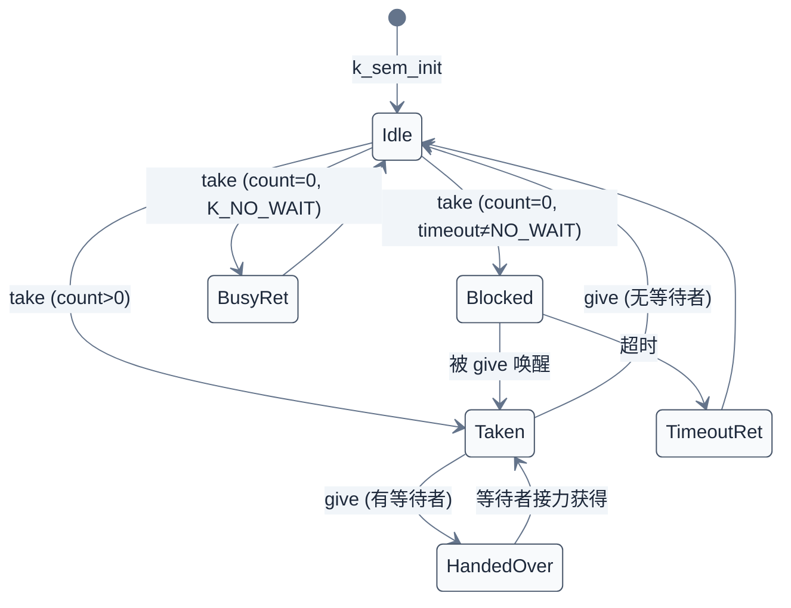
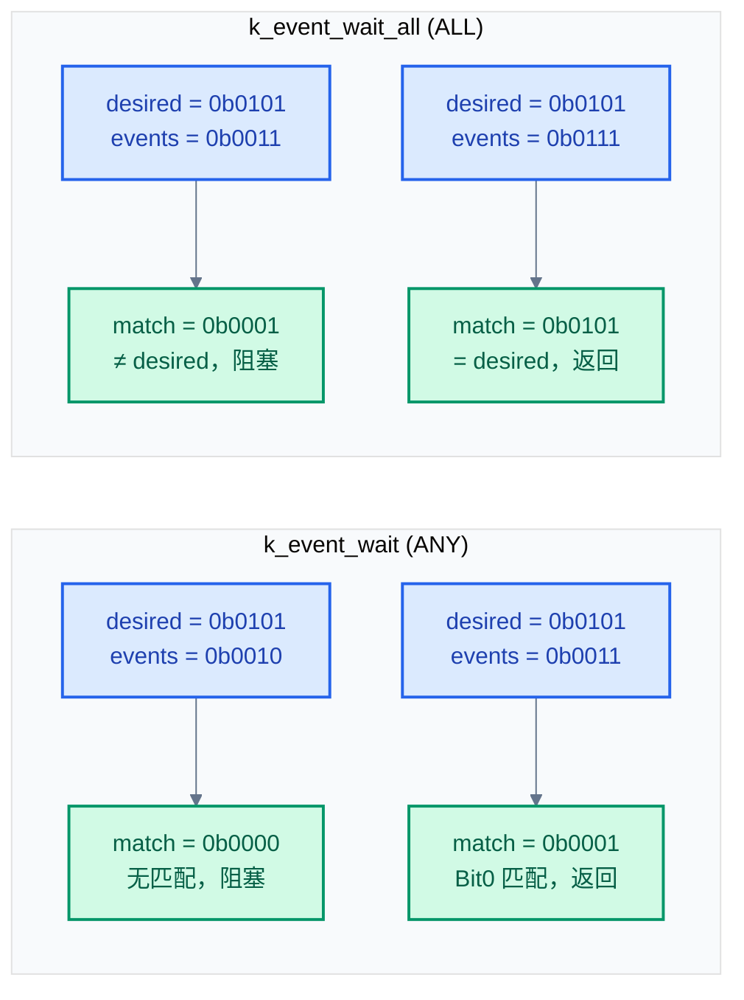
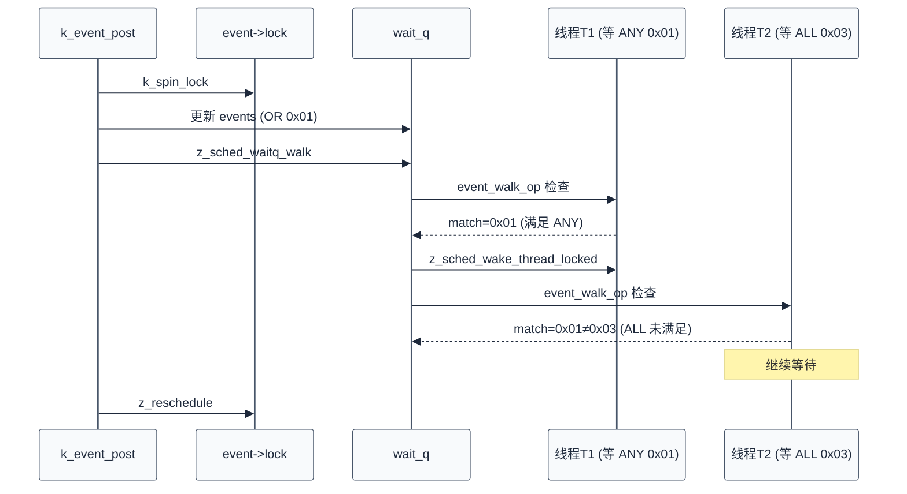
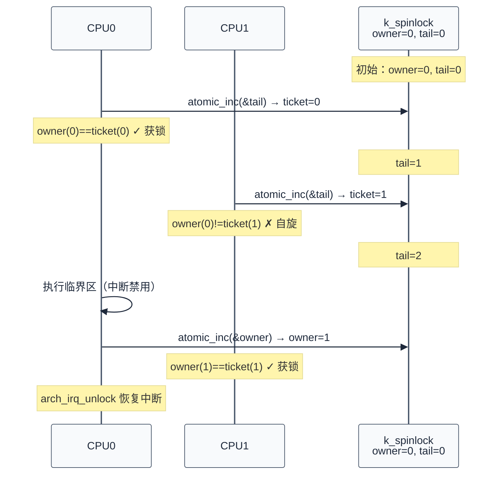
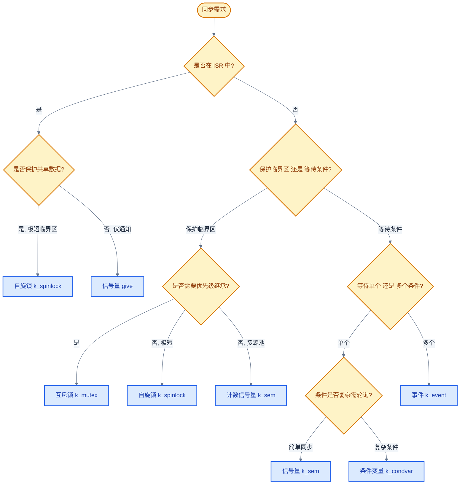

# 07. Zephyr RTOS 同步机制详解

> 一句话概括：本文从一个 `counter++` 竞态小例子出发，剖析 Zephyr 五种同步原语（信号量、互斥锁、条件变量、事件、自旋锁）的本质、源码实现与选型依据。
> **工程师视角**：读完后你应当能回答"为什么互斥锁不能在 ISR 中使用"、"为什么条件变量必须配互斥锁"、"为什么自旋锁持锁时间必须极短"这三个问题，并能为每种并发场景选择合适的同步原语。

### 关键术语

| 缩写 | 全称 | 含义 |
|------|------|------|
| RTOS | Real-Time Operating System | 实时操作系统 |
| ISR | Interrupt Service Routine | 中断服务例程，硬件异步事件的入口函数 |
| SMP | Symmetric Multi-Processing | 对称多处理，多核平等运行同一内核镜像 |
| CAS | Compare-And-Swap | 比较并交换，原子操作原语 |
| FIFO | First In First Out | 先进先出队列 |
| PI | Priority Inheritance | 优先级继承，临时提升持锁线程优先级以缓解优先级反转 |
| PC | Priority Ceiling | 优先级天花板，对继承提升设置上限 |
| Race Condition | — | 竞态条件，多线程交错访问共享资源导致结果不可预测 |
| Critical Section | — | 临界区，访问共享资源的代码段，需要互斥保护 |
| Priority Inversion | — | 优先级反转，高优先级线程被低优先级线程间接阻塞 |
| Ticket Lock | — | 票据锁，FIFO 公平自旋锁算法 |
| Reentrant | — | 可重入，同一线程可多次获取同一锁 |

---

### 前置阅读

| 需要了解 | 参考文档 |
|----------|----------|
| 线程生命周期与上下文切换 | [05-线程与状态迁移](./05-线程与状态迁移.md) |
| 调度器与优先级机制 | [06-调度策略详解](./06-调度策略详解.md) |

---

## 1. 概述：同步在做什么

> 本章是全文的起点。一个核心问题驱动全文：**多个线程共享一个变量，会发生什么？** 先用一个具体的 `counter++` 指令级交错例子讲清楚"同步在做什么"，再引入 Zephyr 五种同步原语的分类与选型，为后续源码剖析建立心智模型。

### 1.1 一个具体竞态：counter++ 的指令级交错

想象两个线程同时对一个共享计数器 `counter` 执行 `counter++`。看起来只是一条 C 语句，但 CPU 实际要执行三条指令：

```
1. load  reg, counter      ; 从内存读取 counter 到寄存器
2. add   reg, reg, 1       ; 寄存器值 +1
3. store counter, reg      ; 把寄存器值写回内存
```

假设 `counter` 初始为 0，两个线程各执行一次 `counter++`，期望结果是 2。但如果指令按下面的顺序交错，结果是 1（错误）：

| 时刻 | CPU 上执行 | counter 内存值 |
|------|-----------|---------------|
| t1 | 线程A: load r1, 0 | counter = 0 |
| t2 | 线程B: load r2, 0 | counter = 0（B 读到的还是旧值） |
| t3 | 线程A: add r1, 1 | r1 = 1 |
| t4 | 线程B: add r2, 1 | r2 = 1 |
| t5 | 线程A: store counter, 1 | counter = 1 |
| t6 | 线程B: store counter, 1 | counter = 1（覆盖 A 的写入） |

最终 `counter = 1`，丢失了一次自增。这就是**竞态条件（Race Condition）**：结果取决于线程执行的相对时序，而时序由调度器与硬件决定，应用无法预测。

> **核心要点**：竞态的本质是"读-改-写"非原子。`counter++`、`counter--`、`flag = true`（如果 flag 是非原子写）都可能出问题。解决思路是把这个三步操作变成**不可分割的原子操作**——要么用锁保护临界区，要么用硬件原子指令。

### 1.2 同步的本质：协调与互斥

同步原语解决两类问题：

- **互斥（Mutual Exclusion）**：保护临界区，确保同一时刻只有一个线程访问共享资源。典型代表是互斥锁与自旋锁。
- **条件同步（Condition Synchronization）**：协调线程执行顺序，让线程等待特定条件成立后再继续。典型代表是信号量、条件变量、事件。

这两类问题并不互斥——互斥锁既保护临界区，又通过 `lock/unlock` 协调线程顺序；信号量既能做互斥（二进制信号量），又能做同步（初始值为 0）。

### 1.3 Zephyr 同步原语分类

| 类别 | 原语 | 本质 | 适用场景 |
|------|------|------|---------|
| **互斥** | 互斥锁 `k_mutex` | 带所有权与优先级继承的锁 | 保护临界区（线程上下文） |
| **互斥** | 自旋锁 `k_spinlock` | 忙等锁 + 禁用本核中断 | ISR、SMP、极短临界区 |
| **同步** | 信号量 `k_sem` | 计数器，take 减 1 give 加 1 | 资源池、ISR-线程同步 |
| **同步** | 条件变量 `k_condvar` | 等待条件的通知队列 | 生产者-消费者、复杂条件 |
| **同步** | 事件 `k_event` | 32 位事件集合，ANY/ALL 等待 | 多事件并发等待 |

> **如何读这张表**：第一列是分类——前两个用于"保护"，后三个用于"通知"。第二列是 Zephyr 内核对象名。第四列给出典型场景，但实际选型要看 §7.2 的决策树。

> **核心要点**：Zephyr 的所有上层同步原语（信号量/互斥锁/条件变量/事件）内部都用自旋锁保护自己的状态——自旋锁是同步原语之原语。理解自旋锁是理解其他原语的前提。

### 1.4 历史脉络：从 Dijkstra 到现代 RTOS

同步问题不是新问题。1965 年，荷兰计算机科学家 Edsger Dijkstra 在论文 *Cooperating Sequential Processes* 中提出信号量，用 P（Proberen，尝试）和 V（Verhogen，增加）两个原子操作实现互斥与同步。这套思想被 UNIX、POSIX、各类 RTOS 继承。

Zephyr 在此基础上做了两件事：

1. **保留经典模型**：信号量、互斥锁、条件变量对应 POSIX 同名概念，API 形似 `k_sem_take`/`k_sem_give` 即 Dijkstra 的 P/V。
2. **加入 RTOS 特色**：互斥锁内置优先级继承（避免优先级反转）、事件用 32 位集合（一次等待多事件）、自旋锁支持 SMP 与 Ticket Lock 公平算法。

后续章节按"互斥 → 同步"顺序展开，自旋锁虽然最底层但放最后——因为它服务于前四者，理解前四者的需求后再看自旋锁的实现会更清楚。

---

## 2. 信号量

> 上一章用 `counter++` 引出竞态问题，并预告了五类同步原语。最经典的一类是信号量——它是 Dijkstra 1965 年原设计的直接后裔，也是 Zephyr 中最常用的同步原语。本章先讲信号量的本质与历史，再剖析其源码实现，最后解释"为什么信号量无所有权"。

### 2.1 本质与历史：Dijkstra 的 P/V 操作

信号量的本质是一个**非负整数计数器**加一个**等待队列**。两个原子操作：

- **P 操作（take/等待）**：若计数 > 0，计数减 1 并返回；否则当前线程加入等待队列，阻塞。
- **V 操作（give/释放）**：若等待队列有线程，唤醒一个；否则计数加 1（不超过上限）。

Zephyr 中对应 `k_sem_take()` 与 `k_sem_give()`。

> **官方文档**：[semaphores.rst](../zephyr-project/zephyr/doc/kernel/services/synchronization/semaphores.rst) 描述了信号量的概念与 API。本文在官方描述基础上补充源码实现细节。

信号量分两种用法：

| 类型 | 初始值 | 上限 | 典型用途 |
|------|--------|------|---------|
| **二进制信号量** | 0 或 1 | 1 | 线程同步（初始 0）、轻量互斥（初始 1） |
| **计数信号量** | N | N | 资源池管理（N 个资源） |

### 2.2 数据结构

信号量结构定义在 [`include/zephyr/kernel.h`](file:///home/pbw/rtos/cs-learning-notes/zephyr-project/zephyr/include/zephyr/kernel.h)（API 与结构声明集中处），核心字段如下：

```c
struct k_sem {
    uint32_t count;          /* 当前计数 */
    uint32_t limit;          /* 最大计数上限 */
    _wait_q_t wait_q;        /* 等待队列，存放阻塞在 take 上的线程 */

#ifdef CONFIG_POLL
    sys_dlist_t poll_events; /* k_poll 轮询事件链表 */
#endif

#ifdef CONFIG_OBJ_CORE_SEM
    struct k_obj_core obj_core; /* 对象调试信息 */
#endif
};
```

- `count`：当前可用资源数。`take` 时减 1，`give` 时加 1。
- `limit`：`count` 的上限。`give` 在 `count == limit` 时不再增加，防止溢出。
- `wait_q`：阻塞在 `take` 上的线程队列，按优先级排序，`give` 时唤醒队首（最高优先级且等待最久的线程）。

### 2.3 源码实现分析

源码位于 [`kernel/sem.c`](file:///home/pbw/rtos/cs-learning-notes/zephyr-project/zephyr/kernel/sem.c)。整个文件用一个全局自旋锁 `lock` 保护所有信号量的状态——这是性能与 RAM 占用的折中（注释说明每对象一锁会浪费 RAM）。

#### 2.3.1 初始化

[`kernel/sem.c:45-73`](file:///home/pbw/rtos/cs-learning-notes/zephyr-project/zephyr/kernel/sem.c) — 设置初始计数与上限，初始化等待队列：

```c
int z_impl_k_sem_init(struct k_sem *sem, unsigned int initial_count,
                      unsigned int limit)
{
    CHECKIF(limit == 0U || initial_count > limit) {
        return -EINVAL;
    }

    sem->count = initial_count;
    sem->limit = limit;

    z_waitq_init(&sem->wait_q);
#if defined(CONFIG_POLL)
    sys_dlist_init(&sem->poll_events);
#endif
    k_object_init(sem);

    return 0;
}
```

`CHECKIF` 是带追踪的参数校验宏。`limit == 0` 无意义（永远拿不到资源）；`initial_count > limit` 违反不变量。

#### 2.3.2 获取信号量（take）

[`kernel/sem.c:132-164`](file:///home/pbw/rtos/cs-learning-notes/zephyr-project/zephyr/kernel/sem.c) — 三条路径：直接获取、不等待返回、阻塞：

```c
int z_impl_k_sem_take(struct k_sem *sem, k_timeout_t timeout)
{
    int ret;

    __ASSERT(((arch_is_in_isr() == false) ||
              K_TIMEOUT_EQ(timeout, K_NO_WAIT)), "");

    k_spinlock_key_t key = k_spin_lock(&lock);

    if (likely(sem->count > 0U)) {
        sem->count--;
        k_spin_unlock(&lock, key);
        ret = 0;
        goto out;
    }

    if (K_TIMEOUT_EQ(timeout, K_NO_WAIT)) {
        k_spin_unlock(&lock, key);
        ret = -EBUSY;
        goto out;
    }

    ret = z_pend_curr(&lock, key, &sem->wait_q, timeout);

out:
    return ret;
}
```

三条路径的语义：

1. **计数 > 0**（`likely` 提示这是热路径）：减 1 返回 0。
2. **计数 = 0 且 `K_NO_WAIT`**：返回 `-EBUSY`，ISR 中必须走这条路径（`__ASSERT` 强制）。
3. **计数 = 0 且带超时**：调用 `z_pend_curr()` 把当前线程挂到 `wait_q`，`z_pend_curr` 内部会释放自旋锁并触发调度。超时返回 `-EAGAIN`，被 `give` 唤醒返回 0。

#### 2.3.3 释放信号量（give）

[`kernel/sem.c:95-121`](file:///home/pbw/rtos/cs-learning-notes/zephyr-project/zephyr/kernel/sem.c) — 优先唤醒等待者，否则增加计数：

```c
void z_impl_k_sem_give(struct k_sem *sem)
{
    k_spinlock_key_t key = k_spin_lock(&lock);
    struct k_thread *thread;
    bool resched;

    thread = z_unpend_first_thread(&sem->wait_q);

    if (unlikely(thread != NULL)) {
        arch_thread_return_value_set(thread, 0);
        z_ready_thread(thread);
        resched = true;
    } else {
        sem->count += (sem->count != sem->limit) ? 1U : 0U;
        resched = handle_poll_events(sem);
    }

    if (unlikely(resched)) {
        z_reschedule(&lock, key);
    } else {
        k_spin_unlock(&lock, key);
    }
}
```

关键设计：**优先唤醒等待者，而不是先增加计数**。如果 `give` 时已有线程在 `wait_q` 中阻塞，计数不加 1，直接把"虚空的资源"交给等待线程——这避免了"give 后 take 立刻成功"的两次状态切换。

> **核心要点**：信号量的 `give` 不增加 `count` 而是直接唤醒等待者，这是一个微小但重要的优化。它把"生产-消费"的接力做得更直接——生产者 `give` 的瞬间，消费者就被唤醒，无须再次竞争锁去读 `count`。

### 2.4 状态图

`k_sem_take` 与 `k_sem_give` 的状态转换用 Mermaid 描述：



> **如何读这张图**：`Idle` 是计数 > 0 的可获取状态，`Taken` 是计数已减 1 后的状态（不一定是 0，因为可能多次 take）。`Blocked` 表示线程在 `wait_q` 中睡眠。`HandedOver` 是 `give` 直接送资源的特殊路径——`count` 不变，资源从生产者直接转给等待者。

### 2.5 API 与示例

```c
#include <zephyr/kernel.h>

/* 静态定义：name, initial_count, limit */
K_SEM_DEFINE(sync_sem, 0, 1);          /* 二进制，初始 0，用于同步 */
K_SEM_DEFINE(pool_sem, 5, 5);          /* 计数，初始 5，5 个资源 */

/* 动态初始化 */
int  k_sem_init(struct k_sem *sem, unsigned int initial_count, unsigned int limit);

/* P/V 操作 */
int  k_sem_take(struct k_sem *sem, k_timeout_t timeout);  /* 返回 0 成功，-EBUSY/-EAGAIN 失败 */
void k_sem_give(struct k_sem *sem);

/* 辅助 */
void          k_sem_reset(struct k_sem *sem);             /* 清零计数，唤醒所有等待者返回 -EAGAIN */
unsigned int  k_sem_count_get(struct k_sem *sem);
```

ISR 与线程协作的典型场景：ISR 中 `give`，线程中 `take`：

```c
K_SEM_DEFINE(uart_sem, 0, 1);

void uart_isr(const void *arg)            /* ISR 上下文 */
{
    ARG_UNUSED(arg);
    k_sem_give(&uart_sem);                /* ISR 中只能 give，不能 take */
}

void consumer_thread(void *p1, void *p2, void *p3)
{
    while (1) {
        k_sem_take(&uart_sem, K_FOREVER); /* 阻塞等待 ISR 唤醒 */
        process_uart_data();
    }
}
```

### 2.6 为什么信号量无所有权

信号量没有"持有者"概念——`give` 的线程不一定是之前 `take` 的线程。这是设计目标决定的：

- **信号量用于同步**：典型场景是 ISR `give`、线程 `take`，两者本就不是同一个执行流。强制所有权会让 ISR 无法唤醒线程。
- **互斥只是次要用途**：二进制信号量可以当互斥锁用，但因为没有所有权，无法实现优先级继承（继承需要知道"提升谁的优先级"），也无法防止"线程 A 锁、线程 B 解"的误用。

如果场景是"保护临界区"，应该用互斥锁（见下一章），它有所有权和优先级继承。如果场景是"线程间通知"，应该用信号量。

> **核心要点**：信号量与互斥锁不是"轻量 vs 重量"的关系，而是"同步 vs 互斥"的关系。用信号量保护临界区是常见误用——它没有优先级继承，会导致优先级反转（见 §3.2）。

---

## 3. 互斥锁

> 上一章讲到信号量因无所有权而不适合保护临界区。互斥锁（Mutex，Mutual Exclusion 的缩写）就是为保护临界区而生——它有所有权、支持递归锁定、内置优先级继承。本章先讲优先级反转问题与 PI/PC 两种缓解方案，再用具体数值演算 `CONFIG_PRIORITY_CEILING` 的影响，最后剖析源码。

### 3.1 本质：带所有权与优先级继承的信号量

互斥锁可以理解为"加强版二进制信号量"，增加了三个关键特性：

| 特性 | 信号量 | 互斥锁 |
|------|--------|--------|
| **所有权** | 无（任何线程可 give） | 有（只有 lock 的线程能 unlock） |
| **优先级继承** | 不支持 | 支持 |
| **递归锁定** | 不支持（重复 take 会阻塞） | 支持（同一线程可多次 lock，count 记录） |
| **ISR 中使用** | give 可用 | 完全禁止 |

> **官方文档**：[mutexes.rst](../zephyr-project/zephyr/doc/kernel/services/synchronization/mutexes.rst) 强调互斥锁"不设计用于 ISR"。

### 3.2 优先级反转与继承

#### 3.2.1 优先级反转问题

假设三个线程优先级 L（低，prio=10）< M（中，prio=5）< H（高，prio=1）。L 持有互斥锁，H 想获取：

1. L 获取锁，开始执行临界区。
2. M 就绪，抢占 L（M 优先级更高）。
3. M 长时间运行。
4. H 就绪，尝试获取锁——但锁在 L 手上，H 阻塞。
5. H 必须等 M 跑完 → L 恢复 → L 释放锁 → H 才能继续。

**问题**：H 的实际等待时间 = M 的执行时间 + L 的临界区时间。M 与 H 毫无关系，却间接阻塞了 H——这就是优先级反转。

#### 3.2.2 优先级继承解决方案

PI（Priority Inheritance）的核心思路：**当高优先级线程等待低优先级线程持有的锁时，临时把持有者的优先级提升到等待者的水平**，让 L 以 H 的优先级运行，尽快释放锁。

```mermaid
%%{init: {"theme": "base", "themeVariables": {"primaryColor": "#f8fafc", "primaryTextColor": "#1e293b", "primaryBorderColor": "#475569", "lineColor": "#64748b", "secondaryColor": "#f1f5f9", "secondaryBorderColor": "#94a3b8", "tertiaryColor": "#f8fafc", "fontFamily": "\"trebuchet ms\", verdana, arial, sans-serif"}}}%%
gantt
    title 优先级反转与继承（L=10, M=5, H=1）
    dateFormat X
    axisFormat %s s

    section 无保护（用信号量）
    L 持锁运行            :l1, 0, 3
    M 抢占 L 运行         :crit, m1, 3, 13
    H 阻塞等锁            :crit, h1, 5, 13
    L 恢复并释锁          :l2, 13, 15
    H 获锁运行            :h2, 15, 17

    section 优先级继承（用互斥锁）
    L 持锁运行            :l3, 0, 3
    M 抢占 L 运行         :m2, 3, 5
    H 阻塞触发 PI         :crit, h3, 5, 5
    L 继承 H 优先级运行   :l4, 5, 8
    L 释锁恢复原优先级    :l5, 8, 8
    H 获锁运行            :h4, 8, 10
    M 恢复运行            :m3, 10, 18
```



> **如何读这张图**：上半部分是无保护场景——M 在 3-13s 期间运行，H 从 5s 起阻塞直到 13s M 结束，总共多等了 8s。下半部分是 PI 场景——H 在 5s 阻塞时立即触发继承，L 以 H 的优先级（prio=1）抢占 M，3s 内完成临界区并释锁，H 在 8s 获锁运行。M 被推迟到 10s 才继续，但这是合理的——M 优先级本就低于 H。

### 3.3 CONFIG_PRIORITY_CEILING 数值演算

Zephyr 的优先级继承受 `CONFIG_PRIORITY_CEILING` 限制。**这是一个上限值**——它限制继承能把线程优先级提升到多高（数值越小优先级越高，ceiling 越小表示允许提到越高）。

- 默认值 `-128`：不限制（提到等待者的优先级）。
- 设为 `K_LOWEST_THREAD_PRIO`（如 15）：等于禁用继承（提到 idle 优先级无意义）。
- 中间值（如 `3`）：限制继承后的优先级不超过 `3`。

源码 [`kernel/mutex.c:82-90`](file:///home/pbw/rtos/cs-learning-notes/zephyr-project/zephyr/kernel/mutex.c) 中的关键函数：

```c
static int32_t new_prio_for_inheritance(int32_t target, int32_t limit)
{
    int new_prio = z_is_prio_higher(target, limit) ? target : limit;
    new_prio = z_get_new_prio_with_ceiling(new_prio);
    return new_prio;
}
```

- `target`：请求锁的等待线程优先级。
- `limit`：当前持有者的优先级。
- 取两者中"更高优先级"（数值更小）者，再用 ceiling 取下界。

数学表达（注意数值越小优先级越高，"提升"指数值变小）：

$$
\text{new\_prio} = \max\bigl(\min(\text{target}, \text{limit}),\ \text{ceiling}\bigr)
$$

- $\min(\text{target}, \text{limit})$：取等待者与持有者中较高优先级（数值较小者）。
- $\max(\cdot, \text{ceiling})$：用 ceiling 限制，确保结果数值不小于 ceiling（即优先级不高于 ceiling）。
- $\text{ceiling} = -128$ 时 $\max(\cdot, -128)$ 无约束（结果不会小于 -128）。
- $\text{ceiling} = \text{K\_LOWEST\_THREAD\_PRIO}$ 时结果被压到 idle 优先级，等价于禁用。

**数值演算**：设 L=10、M=5、H=1，比较两种 ceiling 配置：

| 时刻 | 事件 | ceiling=-128（默认） | ceiling=3（限制） |
|------|------|---------------------|------------------|
| t1 | L 持锁运行 | L prio=10 | L prio=10 |
| t2 | M 抢占 L | L 让出，M 运行 (prio=5) | L 让出，M 运行 (prio=5) |
| t3 | H 请求锁阻塞 | new_prio = $\max(\min(1,10),-128) = 1$ | new_prio = $\max(\min(1,10),3) = 3$ |
| t3+ | L 临时优先级 | L 提升到 prio=1（与 H 相同） | L 提升到 prio=3（被 ceiling 压住） |
| t4 | M 是否能抢占 L？ | 否（M=5 > L=1） | 否（M=5 > L=3） |
| t5 | L 释锁 | L 恢复 prio=10，H 获锁 prio=1 | L 恢复 prio=10，H 获锁 prio=1 |
| t6 | H 完成 | M 运行 | M 运行 |

本例中两种 ceiling 结果相同——因为 ceiling=3 把 L 提到 3，仍高于 M=5，M 仍无法抢占。但如果引入一个 prio=2 的额外线程 X（与互斥锁无关）：

| 时刻 | ceiling=-128 | ceiling=3 |
|------|--------------|-----------|
| H 阻塞，L 提升到 | prio=1 | prio=3 |
| X 就绪（prio=2）能否抢占 L？ | 否（X=2 > L=1） | 是（X=2 < L=3） |

ceiling=3 时 X 会抢占 L——这看似不利，但好处是**为系统其他更高优先级线程（如 prio=0 的内核线程）保留了响应能力**，防止 L 的继承优先级过度膨胀。

> **核心要点**：Zephyr 的 `CONFIG_PRIORITY_CEILING` 不是经典 PC 协议（经典 PC 在加锁时立即提升，不等高优先级等待），而是"PI + 上限"——仍按 PI 机制在等待时才提升，只是提升幅度被 ceiling 封顶。它的意义是限制继承的副作用，而非改变继承的触发时机。

### 3.4 数据结构

互斥锁结构定义核心字段：

```c
struct k_mutex {
    struct k_thread *owner;       /* 当前持有者线程 */
    uint32_t lock_count;          /* 递归锁定计数 */

#if (CONFIG_PRIORITY_CEILING < K_LOWEST_THREAD_PRIO)
    int owner_orig_prio;          /* 持有者原始优先级，释锁时恢复 */
#endif

    _wait_q_t wait_q;             /* 等待队列 */

#ifdef CONFIG_OBJ_CORE_MUTEX
    struct k_obj_core obj_core;
#endif
};
```

`owner_orig_prio` 只在 PI 启用时存在——编译时裁剪。`lock_count` 支持递归锁定：同一线程多次 `lock` 时只增加计数，`unlock` 减 1，到 0 才真正释放。

### 3.5 源码实现分析

源码位于 [`kernel/mutex.c`](file:///home/pbw/rtos/cs-learning-notes/zephyr-project/zephyr/kernel/mutex.c)。注释明确指出 PI 算法及嵌套锁定规则（必须逆序释放）。

#### 3.5.1 锁定互斥锁

[`kernel/mutex.c:107-218`](file:///home/pbw/rtos/cs-learning-notes/zephyr-project/zephyr/kernel/mutex.c) 简化版（聚焦 PI 路径）：

```c
int z_impl_k_mutex_lock(struct k_mutex *mutex, k_timeout_t timeout)
{
    __ASSERT(!arch_is_in_isr(), "mutexes cannot be used inside ISRs");

    k_spinlock_key_t key = k_spin_lock(&lock);

    /* 路径1: 锁空闲或当前线程已持有（递归锁定） */
    if (likely((mutex->lock_count == 0U) || (mutex->owner == _current))) {
#if (CONFIG_PRIORITY_CEILING < K_LOWEST_THREAD_PRIO)
        mutex->owner_orig_prio = (mutex->lock_count == 0U) ?
                                 _current->base.prio : mutex->owner_orig_prio;
#endif
        mutex->lock_count++;
        mutex->owner = _current;
        k_spin_unlock(&lock, key);
        return 0;
    }

    /* 路径2: K_NO_WAIT 直接返回忙 */
    if (unlikely(K_TIMEOUT_EQ(timeout, K_NO_WAIT))) {
        k_spin_unlock(&lock, key);
        return -EBUSY;
    }

    /* 路径3: 阻塞等待，触发优先级继承 */
#if (CONFIG_PRIORITY_CEILING < K_LOWEST_THREAD_PRIO)
    int new_prio = new_prio_for_inheritance(_current->base.prio,
                                            mutex->owner->base.prio);
    if (z_is_prio_higher(new_prio, mutex->owner->base.prio)) {
        adjust_owner_prio(mutex, new_prio);  /* 提升 holder */
    }
#endif

    int got_mutex = z_pend_curr(&lock, key, &mutex->wait_q, timeout);

    /* 超时处理：恢复 holder 优先级（略） */
    return got_mutex;
}
```

三条路径与信号量类似，差异在路径 3——阻塞前先提升 `owner` 的优先级。这就是 PI 的实现：在当前线程进入 `wait_q` 之前，把持有者"拉上来"。

#### 3.5.2 解锁互斥锁

[`kernel/mutex.c:230-307`](file:///home/pbw/rtos/cs-learning-notes/zephyr-project/zephyr/kernel/mutex.c) 简化版：

```c
int z_impl_k_mutex_unlock(struct k_mutex *mutex)
{
    __ASSERT(!arch_is_in_isr(), "mutexes cannot be used inside ISRs");

    CHECKIF(mutex->owner == NULL)      { return -EINVAL; }
    CHECKIF(mutex->owner != _current) { return -EPERM; }  /* 所有权检查 */

    /* 递归锁定：减计数，不释放 */
    if (mutex->lock_count > 1U) {
        mutex->lock_count--;
        return 0;
    }

    k_spinlock_key_t key = k_spin_lock(&lock);

#if (CONFIG_PRIORITY_CEILING < K_LOWEST_THREAD_PRIO)
    adjust_owner_prio(mutex, mutex->owner_orig_prio);  /* 恢复原优先级 */
#endif

    struct k_thread *new_owner = z_unpend_first_thread(&mutex->wait_q);
    mutex->owner = new_owner;

    if (unlikely(new_owner != NULL)) {
        /* 转交所有权给队首等待者 */
#if (CONFIG_PRIORITY_CEILING < K_LOWEST_THREAD_PRIO)
        mutex->owner_orig_prio = new_owner->base.prio;
#endif
        arch_thread_return_value_set(new_owner, 0);
        z_ready_thread(new_owner);
        z_reschedule(&lock, key);
    } else {
        mutex->lock_count = 0U;
        k_spin_unlock(&lock, key);
    }

    return 0;
}
```

关键点：

1. **所有权检查**：`mutex->owner != _current` 返回 `-EPERM`，防止误用。
2. **递归释放**：`lock_count > 1` 时只减计数，不释放锁。
3. **优先级恢复**：释锁时把 `owner` 优先级恢复到 `owner_orig_prio`。
4. **所有权转交**：若有等待者，直接把锁交给队首线程（无须重新竞争），并记录其原始优先级。

### 3.6 为什么互斥锁不能在 ISR 中使用

源码中两处 `__ASSERT(!arch_is_in_isr(), ...)` 强制约束。原因有三：

1. **优先级继承需要线程上下文**：PI 提升的是 `mutex->owner` 这个线程的优先级。ISR 不是线程，没有 `base.prio`，无法被提升或恢复。
2. **所有权转交需要线程身份**：`mutex->owner = _current` 依赖当前线程指针。ISR 中 `_current` 仍指向被中断的线程，但 ISR 本身不是该线程——若允许 ISR lock，会让"被中断的线程"莫名持有一把锁。
3. **阻塞会死锁**：`k_mutex_lock(timeout)` 在锁被占时会调用 `z_pend_curr` 阻塞当前线程。ISR 不能阻塞（详见 [00-入门概览 §5.1](./00-入门概览.md)）。

如果需要在 ISR 中保护临界区，用自旋锁（见 §6）。

### 3.7 API 与示例

```c
#include <zephyr/kernel.h>

K_MUTEX_DEFINE(my_mutex);

int  k_mutex_init(struct k_mutex *mutex);
int  k_mutex_lock(struct k_mutex *mutex, k_timeout_t timeout);  /* 0 成功，-EBUSY/-EAGAIN/-EACCES 失败 */
int  k_mutex_unlock(struct k_mutex *mutex);                      /* 0 成功，-EINVAL/-EPERM 失败 */
```

保护临界区的标准用法：

```c
K_MUTEX_DEFINE(counter_mutex);
int shared_counter = 0;

void increment_counter(void)
{
    k_mutex_lock(&counter_mutex, K_FOREVER);
    shared_counter++;                /* 临界区：原子执行 */
    k_mutex_unlock(&counter_mutex);
}
```

**避免死锁的两种模式**：

```c
K_MUTEX_DEFINE(mutex_a);
K_MUTEX_DEFINE(mutex_b);

/* 模式1：固定顺序获取（推荐） */
void safe_nested(void)
{
    k_mutex_lock(&mutex_a, K_FOREVER);
    k_mutex_lock(&mutex_b, K_FOREVER);
    /* ... 临界区 ... */
    k_mutex_unlock(&mutex_b);
    k_mutex_unlock(&mutex_a);
}

/* 模式2：带超时回退（适合不可控顺序） */
void timeout_rollback(void)
{
    if (k_mutex_lock(&mutex_a, K_MSEC(100)) != 0) return;
    if (k_mutex_lock(&mutex_b, K_MSEC(100)) != 0) {
        k_mutex_unlock(&mutex_a);
        return;
    }
    /* ... 临界区 ... */
    k_mutex_unlock(&mutex_b);
    k_mutex_unlock(&mutex_a);
}
```

> **核心要点**：互斥锁是保护临界区的首选——所有权防止误用、优先级继承防止反转、递归锁定简化调用链。但它不能在 ISR 中使用，且持锁期间不应调用可能阻塞的 API（会延长临界区，增加其他线程等待）。

---

## 4. 条件变量

> 上一章解决了"互斥访问"问题。但有一类场景互斥锁处理不好：**线程需要等待某个条件成立**，而不是等待锁。如果用互斥锁 + 轮询，CPU 会在反复 lock-check-sleep 中浪费。条件变量就是为"等待条件"而生——它让线程在条件不满足时真正阻塞，条件满足时被唤醒。本章解释它为什么必须配互斥锁，再剖析源码。

### 4.1 本质：等待条件的通知队列

条件变量的本质是**一个等待队列**——线程把自己挂上去睡眠，其他线程改变条件后发通知唤醒。它本身不存"条件"，条件由应用代码用普通变量维护。

为什么不用"互斥锁 + 轮询"？对比下面两段代码：

```c
/* 方案A：轮询（错误，浪费 CPU） */
while (1) {
    k_mutex_lock(&m, K_FOREVER);
    if (data_ready) {
        consume();
        data_ready = false;
    }
    k_mutex_unlock(&m);
    k_msleep(1);            /* 1ms 轮询，CPU 空转 */
}

/* 方案B：条件变量（高效） */
k_mutex_lock(&m, K_FOREVER);
while (!data_ready) {
    k_condvar_wait(&cv, &m, K_FOREVER);  /* 阻塞，不消耗 CPU */
}
consume();
data_ready = false;
k_mutex_unlock(&m);
```

方案 A 的问题：轮询间隔太长则响应慢，太短则 CPU 浪费——且每次 lock/unlock 都有上下文切换开销。方案 B 让线程在条件不满足时真正睡眠，被 `signal`/`broadcast` 唤醒时立即响应。

> **官方文档**：[condvar.rst](../zephyr-project/zephyr/doc/kernel/services/synchronization/condvar.rst) 强调"条件变量本身不是条件，也不是事件——条件由应用代码维护"。

### 4.2 为什么条件变量必须配互斥锁

`k_condvar_wait(&cv, &m, timeout)` 必须传入一个互斥锁。这不是 API 设计的随意选择，而是**避免 check-wait 之间的竞态**。考虑下面的伪代码：

```c
/* 错误：不配互斥锁 */
while (!data_ready) {
    k_condvar_wait(&cv, /* no mutex */, K_FOREVER);
}
```

问题在于"检查 `data_ready`"与"调用 `wait`"是两步——中间可能被生产者打断：

1. 消费者检查 `data_ready` → false。
2. 消费者准备调用 `wait`...
3. 生产者设置 `data_ready = true`，调用 `k_condvar_signal()`（此时还没人等）。
4. 消费者调用 `wait`——错过这次信号，永久阻塞。

互斥锁把"检查"与"等待"变成原子操作：

1. 消费者 `lock(m)`。
2. 检查 `data_ready` → false。
3. 调用 `k_condvar_wait(&cv, &m, ...)`——`wait` 内部**原子地释放 `m` 并阻塞**。
4. 生产者 `lock(m)`（现在能拿到了），设置 `data_ready = true`，`signal(cv)`，`unlock(m)`。
5. 消费者被唤醒，`wait` 内部**自动重新获取 `m`** 后返回。
6. 消费者重新检查 `data_ready` → true，退出循环。

> **核心要点**：条件变量配互斥锁不是为了"保护条件变量"，而是为了"保护条件检查的原子性"。`k_condvar_wait` 的"释放锁-阻塞-重新获取锁"原子序列，确保消费者不会错过生产者的通知。

### 4.3 数据结构与源码分析

#### 4.3.1 数据结构

条件变量结构极简——只有一个等待队列：

```c
struct k_condvar {
    _wait_q_t wait_q;       /* 阻塞在 wait 上的线程队列 */

#ifdef CONFIG_OBJ_CORE_CONDVAR
    struct k_obj_core obj_core;
#endif
};
```

#### 4.3.2 wait 的原子序列

源码位于 [`kernel/condvar.c:114-139`](file:///home/pbw/rtos/cs-learning-notes/zephyr-project/zephyr/kernel/condvar.c)：

```c
int z_impl_k_condvar_wait(struct k_condvar *condvar, struct k_mutex *mutex,
                          k_timeout_t timeout)
{
    k_spinlock_key_t key;
    int ret = -EAGAIN;

    if (unlikely(K_TIMEOUT_EQ(timeout, K_NO_WAIT))) {
        k_mutex_unlock(mutex);
        return ret;
    }

    key = k_spin_lock(&lock);
    k_mutex_unlock(mutex);                              /* 1. 释放互斥锁 */

    ret = z_pend_curr(&lock, key, &condvar->wait_q, timeout);  /* 2. 阻塞 */
    if (ret == 0) {
        k_mutex_lock(mutex, K_FOREVER);                 /* 3. 重新获取 */
    }

    return ret;
}
```

三步序列：

1. `k_mutex_unlock(mutex)`：在自旋锁保护下释放互斥锁，让生产者能进入临界区修改条件。
2. `z_pend_curr`：把当前线程挂到 `condvar->wait_q` 并阻塞，自旋锁在此函数内释放。
3. 被唤醒后 `k_mutex_lock(mutex, K_FOREVER)`：重新获取互斥锁，保证调用者检查条件时仍持锁。

注意第 1 步是在 `k_spin_lock(&lock)` 持有期间调用 `k_mutex_unlock`——这是用全局自旋锁串行化"释放互斥锁"与"加入等待队列"两步，确保原子性。

#### 4.3.3 signal 与 broadcast

[`kernel/condvar.c:44-65`](file:///home/pbw/rtos/cs-learning-notes/zephyr-project/zephyr/kernel/condvar.c) — `signal` 唤醒一个等待者：

```c
int z_impl_k_condvar_signal(struct k_condvar *condvar)
{
    k_spinlock_key_t key = k_spin_lock(&lock);
    struct k_thread *thread = z_unpend_first_thread(&condvar->wait_q);

    if (unlikely(thread != NULL)) {
        arch_thread_return_value_set(thread, 0);
        z_ready_thread(thread);
        z_reschedule(&lock, key);
    } else {
        k_spin_unlock(&lock, key);
    }
    return 0;
}
```

`broadcast` 类似但循环唤醒所有等待者（[`kernel/condvar.c:76-104`](file:///home/pbw/rtos/cs-learning-notes/zephyr-project/zephyr/kernel/condvar.c)）。

> **如何选择 signal vs broadcast**：
> - **signal**：所有等待者等同一条件，每次只让一个继续。效率高，避免"惊群"。
> - **broadcast**：等待者可能等不同条件，状态变化可能满足多个线程。安全但开销大。
>
> 默认选 `signal`，只有当条件可能同时满足多个等待者时才用 `broadcast`。

### 4.4 API 与示例

```c
#include <zephyr/kernel.h>

K_CONDVAR_DEFINE(my_cv);

int k_condvar_init(struct k_condvar *condvar);
int k_condvar_wait(struct k_condvar *condvar, struct k_mutex *mutex, k_timeout_t timeout);
int k_condvar_signal(struct k_condvar *condvar);     /* 唤醒一个 */
int k_condvar_broadcast(struct k_condvar *condvar);  /* 唤醒所有，返回唤醒数 */
```

经典生产者-消费者（带界缓冲区）：

```c
#include <zephyr/kernel.h>

#define BUF_SIZE 8

K_MUTEX_DEFINE(buf_lock);
K_CONDVAR_DEFINE(not_full);
K_CONDVAR_DEFINE(not_empty);

int buffer[BUF_SIZE];
int count = 0, head = 0, tail = 0;

void producer(void *p1, void *p2, void *p3)
{
    int data = 0;
    while (1) {
        k_mutex_lock(&buf_lock, K_FOREVER);
        while (count == BUF_SIZE) {                    /* 必须用 while */
            k_condvar_wait(&not_full, &buf_lock, K_FOREVER);
        }
        buffer[head] = data++;
        head = (head + 1) % BUF_SIZE;
        count++;
        k_condvar_signal(&not_empty);                  /* 通知消费者 */
        k_mutex_unlock(&buf_lock);
        k_msleep(100);
    }
}

void consumer(void *p1, void *p2, void *p3)
{
    while (1) {
        k_mutex_lock(&buf_lock, K_FOREVER);
        while (count == 0) {                           /* 必须用 while */
            k_condvar_wait(&not_empty, &buf_lock, K_FOREVER);
        }
        int d = buffer[tail];
        tail = (tail + 1) % BUF_SIZE;
        count--;
        k_condvar_signal(&not_full);                   /* 通知生产者 */
        k_mutex_unlock(&buf_lock);
        process(d);
    }
}
```

**为什么 `wait` 必须放在 `while` 循环里**：

1. **虚假唤醒**：POSIX 标准允许线程在没有 `signal` 的情况下被唤醒。虽然 Zephyr 实现上不主动制造虚假唤醒，但 `while` 是防御性编程。
2. **条件可能被其他消费者抢先**：broadcast 唤醒多个消费者后，第一个抢到锁的把数据消费掉，其余消费者获得锁时条件已不满足——必须重新检查。

> **核心要点**：条件变量的正确使用模式是 `lock → while (!cond) wait → 临界区 → unlock`。`while` 不是 `if`，互斥锁不是可选的——这两条规则违反任何一条都会引入难以调试的并发 bug。

---

## 5. 事件

> 上一章的条件变量一次只能等一个条件。如果线程需要同时等待多个条件（如"网络就绪 OR 数据到达 OR 出错"），用条件变量需要为每个条件建一个 cv，繁琐且易错。事件（Event）就是为"多事件并发等待"设计——用一个 32 位整数表示 32 个独立事件，支持 ANY/ALL 两种等待模式。本章先讲位运算机制，再剖析其"遍历唤醒"的核心实现。

### 5.1 本质：32 位事件集合

事件的本质是一个 32 位无符号整数 `events`，每一位代表一个独立事件。线程可以：

- **post**：按位 OR 添加事件（保留已有事件）。
- **set**：覆盖整个事件集合。
- **clear**：清除指定位。
- **wait**：等待指定事件集合，返回满足条件的位。

事件编号约定：用 `BIT(n)` 宏定义，`n` 取 0~31。

### 5.2 位运算示意与等待模式

`wait` 接受一个"期望事件掩码"`desired`，与当前 `events` 做按位与得到 `match = events & desired`。两种等待模式：



> **如何读这张图**：上半部分是 ANY 模式——只要 `match` 非零就返回，返回值是实际匹配的位。下半部分是 ALL 模式——必须 `match == desired`（所有期望位都为 1）才返回。两种模式都用 `match = events & desired` 计算，区别仅在判断条件。

源码 [`kernel/events.c:95-107`](file:///home/pbw/rtos/cs-learning-notes/zephyr-project/zephyr/kernel/events.c) 中的判断函数：

```c
static uint32_t are_wait_conditions_met(uint32_t desired, uint32_t current,
                                        unsigned int wait_condition)
{
    uint32_t match = current & desired;

    if ((wait_condition == K_EVENT_WAIT_ALL) && (match != desired)) {
        return 0;  /* ALL 模式但未全部满足 */
    }

    return match;  /* ANY 模式或 ALL 已满足 */
}
```

### 5.3 数据结构与"遍历唤醒"机制

#### 5.3.1 数据结构

```c
struct k_event {
    uint32_t events;            /* 当前事件集合 */
    struct k_spinlock lock;     /* 每对象自旋锁（与 sem/mutex 的全局锁不同） */
    _wait_q_t wait_q;           /* 等待队列 */

#ifdef CONFIG_OBJ_CORE_EVENT
    struct k_obj_core obj_core;
#endif
};
```

线程结构中也有事件相关字段（用于 `post` 时检查每个等待者的条件）：

```c
struct k_thread {
    /* ... */
    struct k_thread *next_event_link;   /* 唤醒链表，用于批量 ready */
    uint32_t events;                    /* 该线程等待的事件掩码 */
    uint32_t event_options;             /* 等待选项：ANY/ALL/CLEAR/RESET */
    /* ... */
};
```

#### 5.3.2 遍历唤醒：一次 post 唤醒多个线程

事件机制的核心是 `k_event_post` 时**遍历整个等待队列，唤醒所有满足条件的线程**——而不是只唤醒队首。这与 sem/mutex 的"只唤醒一个"截然不同。

源码 [`kernel/events.c:178-222`](file:///home/pbw/rtos/cs-learning-notes/zephyr-project/zephyr/kernel/events.c)：

```c
static uint32_t k_event_post_internal(struct k_event *event, uint32_t events,
                                      uint32_t events_mask)
{
    k_spinlock_key_t key = k_spin_lock(&event->lock);
    struct event_walk_data data;
    uint32_t previous_events;

    previous_events = event->events & events_mask;
    events = (event->events & ~events_mask) | (events & events_mask);

    data.events = events;
    data.clear_events = 0;
    z_sched_waitq_walk(&event->wait_q, event_walk_op, EVENT_POST_WALK_OP_FN, &data);

    /* 保留未被消费的事件，清除已被 CLEAR 选项消费的 */
    event->events = data.events & ~data.clear_events;

    z_reschedule(&event->lock, key);
    return previous_events;
}
```

`z_sched_waitq_walk` 遍历 `wait_q`，对每个线程调用 `event_walk_op` 回调（[`kernel/events.c:137-176`](file:///home/pbw/rtos/cs-learning-notes/zephyr-project/zephyr/kernel/events.c)）：

```c
static int event_walk_op(struct k_thread *thread, void *data)
{
    uint32_t match;
    unsigned int wait_condition;
    struct event_walk_data *event_data = data;

    wait_condition = thread->event_options & K_EVENT_WAIT_MASK;
    match = are_wait_conditions_met(thread->events, event_data->events, wait_condition);

    if (match != 0) {
        thread->events = match;                       /* 记录实际匹配的位 */
        if (thread->event_options & K_EVENT_OPTION_CLEAR) {
            event_data->clear_events |= match;        /* 标记需清除的位 */
        }
        z_abort_thread_timeout(thread);
        arch_thread_return_value_set(thread, 0);
        z_sched_wake_thread_locked(thread);           /* 唤醒 */
    }
    return 0;
}
```

`K_EVENT_OPTION_CLEAR` 是 `_safe` 系列 API 的关键：等待成功的瞬间原子地从 `events` 中清除匹配位，避免其他线程重复消费同一事件。



> **如何读这张图**：`post(0x01)` 后，T1 等待 `ANY(0x01)`，匹配立即唤醒；T2 等待 `ALL(0x03)`，只有 0x01 而无 0x02，继续等待。一次 `post` 调用同时处理了多个等待者，这是事件机制相对条件变量的核心优势。

### 5.4 API 与示例

```c
#include <zephyr/kernel.h>

K_EVENT_DEFINE(my_event);

#define EVT_DATA_READY   BIT(0)
#define EVT_NET_UP       BIT(1)
#define EVT_ERROR        BIT(2)

void k_event_init(struct k_event *event);

/* 发送（OR 添加） */
uint32_t k_event_post(struct k_event *event, uint32_t events);

/* 覆盖整个集合 */
uint32_t k_event_set(struct k_event *event, uint32_t events);
uint32_t k_event_set_masked(struct k_event *event, uint32_t events, uint32_t mask);

/* 清除 */
uint32_t k_event_clear(struct k_event *event, uint32_t events);

/* 等待：reset=true 表示等待前清零 events */
uint32_t k_event_wait(struct k_event *event, uint32_t events, bool reset, k_timeout_t timeout);
uint32_t k_event_wait_all(struct k_event *event, uint32_t events, bool reset, k_timeout_t timeout);

/* _safe 系列：等待成功后原子清除匹配位 */
uint32_t k_event_wait_safe(struct k_event *event, uint32_t events, bool reset, k_timeout_t timeout);
uint32_t k_event_wait_all_safe(struct k_event *event, uint32_t events, bool reset, k_timeout_t timeout);
```

**多传感器聚合示例**：等待 3 个传感器全部就绪才处理：

```c
K_EVENT_DEFINE(sensor_evt);
#define EVT_S1 BIT(0)
#define EVT_S2 BIT(1)
#define EVT_S3 BIT(2)
#define EVT_ALL (EVT_S1 | EVT_S2 | EVT_S3)

void sensor1_thread(void *p1, void *p2, void *p3)
{
    while (1) {
        read_sensor1();
        k_event_post(&sensor_evt, EVT_S1);
        k_msleep(100);
    }
}
/* sensor2_thread、sensor3_thread 类似 */

void aggregator_thread(void *p1, void *p2, void *p3)
{
    while (1) {
        /* 等所有传感器就绪，reset=true 清零避免残留 */
        uint32_t got = k_event_wait_all(&sensor_evt, EVT_ALL, true, K_FOREVER);
        if (got == EVT_ALL) {
            process_all_sensors();
        }
    }
}
```

> **核心要点**：事件机制用 32 位整数表达 32 个独立事件，一次 `post` 同时检查所有等待者——这是它相对条件变量（每次只能通知一个条件）的核心优势。但事件不适合传递数据（只有 32 位），需要传数据时用 [10-数据传递机制](./10-数据传递机制.md) 中的 FIFO/消息队列。

---

## 6. 自旋锁

> 前四章的同步原语（sem/mutex/condvar/event）都基于"阻塞睡眠"——线程等不到就挂起，让出 CPU。但有两类场景不能用阻塞：**ISR 中没有线程上下文可挂起**，**SMP 多核间没有"挂起其他核"的概念**。自旋锁就是为这两类场景而生——它不阻塞，而是忙等。本章讲它的实现、Ticket Lock 公平算法、单核退化，以及"为什么持锁时间必须极短"。

### 6.1 本质：忙等锁与中断禁用

自旋锁获取失败时不挂起线程，而是在一个紧密循环里反复检查锁状态（"自旋"）。这看似浪费 CPU，但在两类场景下不可替代：

1. **ISR 上下文**：ISR 不是线程，无法 `z_pend_curr`。要保护 ISR 与线程共享的数据，只能用自旋锁。
2. **SMP 多核**：核 A 持锁时，核 B 想要锁——核 B 不能"挂起核 A"，只能让核 B 自旋等核 A 释放。

自旋锁与互斥锁的关键差异在于**获取时禁用本核中断**。这是为了防止"持锁期间被本核 ISR 抢占，而 ISR 又试图获取同一把锁"的死锁。

> **官方文档**：[`doc/hardware/barriers/index.rst`](../zephyr-project/zephyr/doc/hardware/barriers/index.rst) 讨论了内存屏障——自旋锁在 SMP 下隐含屏障语义，保证临界区内的读写不会被重排到锁外。

### 6.2 数据结构

源码位于 [`include/zephyr/spinlock.h`](file:///home/pbw/rtos/cs-learning-notes/zephyr-project/zephyr/include/zephyr/spinlock.h)。结构定义见 [`spinlock.h:45-97`](file:///home/pbw/rtos/cs-learning-notes/zephyr-project/zephyr/include/zephyr/spinlock.h)：

```c
struct k_spinlock {
#ifdef CONFIG_SMP
#ifdef CONFIG_TICKET_SPINLOCKS
    atomic_t owner;    /* 当前持有者的 ticket 号 */
    atomic_t tail;     /* 下一个可用 ticket 号 */
#else
    atomic_t locked;   /* 0=未锁定, 1=已锁定 */
#endif
#endif

#ifdef CONFIG_SPIN_VALIDATE
    uintptr_t thread_cpu;   /* 持有锁的线程 + CPU ID（低 2 位） */
#ifdef CONFIG_SPIN_LOCK_TIME_LIMIT
    uint32_t lock_time;     /* 获取锁的时间戳，用于检测持锁过长 */
#endif
#endif
};
```

关键观察：

- **单核（!CONFIG_SMP）时结构为空**——自旋锁退化为纯中断禁用，不需要原子变量。
- **SMP + TICKET_SPINLOCKS**：用 `owner`/`tail` 两个原子变量实现 FIFO 公平锁。
- **SMP 无 TICKET**：用单个 `locked` 变量 + CAS。
- **CONFIG_SPIN_VALIDATE**：调试模式，记录持有者，检测持锁过长、非法解锁。

`k_spinlock_key_t` 不是锁本身，而是保存加锁时的中断状态，供 `unlock` 时恢复：

```c
struct z_spinlock_key { int key; };
typedef struct z_spinlock_key k_spinlock_key_t;
```

### 6.3 源码实现分析

#### 6.3.1 加锁

[`spinlock.h:181-213`](file:///home/pbw/rtos/cs-learning-notes/zephyr-project/zephyr/include/zephyr/spinlock.h)（简化）：

```c
static ALWAYS_INLINE k_spinlock_key_t k_spin_lock(struct k_spinlock *l)
{
    k_spinlock_key_t k;
    k.key = arch_irq_lock();           /* 1. 关闭本核中断 */

    z_spinlock_validate_pre(l);        /* 2. 调试校验 */

#ifdef CONFIG_SMP
#ifdef CONFIG_TICKET_SPINLOCKS
    atomic_val_t ticket = atomic_inc(&l->tail);          /* 3a. 取号 */
    while (atomic_get(&l->owner) != ticket) {            /*     等叫号 */
        arch_spin_relax();                                /*     CPU hint（WFE/PAUSE） */
    }
#else
    while (!atomic_cas(&l->locked, 0, 1)) {              /* 3b. CAS 0→1 */
        arch_spin_relax();
    }
#endif
#endif

    z_spinlock_validate_post(l);       /* 4. 记录持有者 */
    return k;
}
```

四步：

1. `arch_irq_lock()` 关闭本核中断——单核下这一步就够了，无后续 CAS。
2. `z_spinlock_validate_pre` 在 `CONFIG_SPIN_VALIDATE` 启用时检查锁合法性（如不能在持锁时再加同一把锁）。
3. SMP 下用 Ticket Lock 或 CAS 算法竞争锁。
4. `z_spinlock_validate_post` 记录当前线程 + CPU ID。

#### 6.3.2 解锁

[`spinlock.h:299-331`](file:///home/pbw/rtos/cs-learning-notes/zephyr-project/zephyr/include/zephyr/spinlock.h)：

```c
static ALWAYS_INLINE void k_spin_unlock(struct k_spinlock *l, k_spinlock_key_t key)
{
#ifdef CONFIG_SPIN_VALIDATE
    __ASSERT(z_spin_unlock_valid(l), "Not my spinlock %p", l);
    /* 检查持锁时间是否超限 */
#endif

#ifdef CONFIG_SMP
#ifdef CONFIG_TICKET_SPINLOCKS
    (void)atomic_inc(&l->owner);       /* 递增 owner，下一个等待者获锁 */
#else
    (void)atomic_clear(&l->locked);    /* 清零 locked */
#endif
#endif
    arch_irq_unlock(key.key);          /* 恢复中断状态 */
}
```

注意 `unlock` 必须传入 `lock` 返回的 `key`——`key` 保存了加锁前的中断状态，恢复时如果加锁前中断是开的，解锁后也开；加锁前是关的，解锁后仍关（支持嵌套）。

### 6.4 Ticket Lock 时序图

Ticket Lock 是 Zephyr 在 SMP 下的默认算法（`CONFIG_TICKET_SPINLOCKS`）。思路像银行取号：每个申请者原子地取一个号，等待"叫号"到自己的号时获得锁。



> **如何读这张图**：`tail` 是"取号机"，每次 `atomic_inc` 返回旧值作为本次 ticket。`owner` 是"当前服务号"，获锁时 `owner == ticket`，释放时 `atomic_inc(&owner)` 让下一个等待者的号被叫到。整个过程严格 FIFO，先到先得。

**Ticket Lock 相比简单 CAS 的优势**：

| 维度 | 简单 CAS | Ticket Lock |
|------|----------|-------------|
| **公平性** | 无（可能饥饿） | FIFO 公平 |
| **缓存弹跳** | 严重（所有核竞争同一 `locked` 变量） | 轻（每个核只读自己的 ticket 与 owner） |
| **惊群效应** | 有（释放时所有等待者同时 CAS） | 无（只有下一个 ticket 被叫到） |
| **内存开销** | 1 个 atomic | 2 个 atomic |

### 6.5 单核退化场景

单核（`!CONFIG_SMP`）时自旋锁结构退化为空，加锁只剩 `arch_irq_lock()`，解锁只剩 `arch_irq_unlock()`。为什么这是安全的？

- **单核无并发**：同一时刻只有一个执行流在跑。线程 A 持锁时不会被另一线程 B 抢占——除非中断。
- **禁用中断即可**：只要持锁期间禁用中断，就没有任何执行流能干扰临界区。

所以单核下"自旋锁 = 中断禁用"，没有真正的"自旋"。`CONFIG_SPIN_VALIDATE` 仍可启用用于调试（检测嵌套错误、持锁过长）。

**关键约束**：单核下持锁期间禁用中断意味着**无法响应硬件事件**。这正是"持锁时间必须极短"的根本原因——见下节。

### 6.6 为什么自旋锁持锁时间必须极短

这条规则的根因有四层：

1. **本核中断被禁用**：持锁期间本核无法响应任何硬件中断——UART 数据丢失、定时器不准、按键无响应。持锁几微秒可能就让实时性承诺失效。
2. **SMP 下其他核忙等**：核 A 持锁时，核 B 在 `arch_spin_relax()` 循环里空转，100% 浪费那个核的 CPU。
3. **不能调用任何阻塞 API**：`k_sleep`、`k_sem_take(timeout)`、`k_mutex_lock(timeout)` 都会触发调度——而调度器本身持锁时切换是非法的（`k_spin_lock` 文档明确警告）。
4. **不能调用可能触发调度的 API**：甚至 `k_yield()`、`printk()`（某些配置下）都可能触发调度。

| 规则 | 原因 |
|------|------|
| 持锁时间必须极短 | 自旋锁忙等浪费 CPU + 禁用本核中断 |
| 不能在持锁时调用阻塞 API | 触发调度会死锁（调度器持锁时切换非法） |
| 不能递归加锁 | 同一 CPU 对同一自旋锁递归会死锁（ticket 永远等不到） |
| 必须 lock/unlock 配对 | 不配对会导致中断永久禁用 |
| 避免持锁时 k_yield() | 上下文切换时持锁是非法的 |

> **核心要点**：自旋锁的"自旋"只是 SMP 下的行为，单核下退化为中断禁用。无论单核还是 SMP，持锁期间本核中断都被禁用——这是自旋锁能保护 ISR 与线程共享数据的根本机制，也是持锁时间必须极短的根本约束。所有上层同步原语（sem/mutex/condvar/event）内部都用自旋锁，但持锁都只覆盖几条指令的临界区。

### 6.7 使用示例

**内核内部典型用法**（保护全局数据）：

```c
static struct k_spinlock lock;
static int shared_state;

int read_state(void)
{
    k_spinlock_key_t key = k_spin_lock(&lock);
    int v = shared_state;
    k_spin_unlock(&lock, key);
    return v;
}
```

**ISR 与线程共享数据**：

```c
struct k_spinlock my_lock;
volatile uint32_t isr_counter;

void my_isr(const void *arg)
{
    ARG_UNUSED(arg);
    k_spinlock_key_t key = k_spin_lock(&my_lock);
    isr_counter++;                    /* ISR 中可用，因为不阻塞 */
    k_spin_unlock(&my_lock, key);
}

void worker_thread(void *p1, void *p2, void *p3)
{
    while (1) {
        k_spinlock_key_t key = k_spin_lock(&my_lock);
        uint32_t local = isr_counter; /* 持锁时间：一条赋值 */
        k_spin_unlock(&my_lock, key);

        process(local);
        k_msleep(100);                /* 耗时操作必须在锁外 */
    }
}
```

**K_SPINLOCK 宏**（自动管理 lock/unlock，C99 for 循环技巧）：

```c
K_SPINLOCK(&my_lock) {
    /* 临界区，结束时自动 unlock */
    shared_state++;

    if (error) {
        K_SPINLOCK_BREAK;             /* 提前退出（不能用 break/return） */
    }
}
```

---

## 7. 同步机制对比

> 前五章分别讲了五种同步原语的本质与实现。本章把它们放在一起对比，给出选型决策树。一个常见困惑是"信号量 vs 互斥锁"、"事件 vs 条件变量"——理解差异的关键在于"用途"而非"性能"。

### 7.1 功能对比矩阵

| 特性 | 信号量 | 互斥锁 | 条件变量 | 事件 | 自旋锁 |
|------|--------|--------|---------|------|--------|
| **主要用途** | 同步/资源池 | 互斥保护 | 等待条件 | 多事件等待 | ISR/SMP 保护 |
| **所有权** | 无 | 有 | 无 | 无 | 无（CPU 级） |
| **优先级继承** | 不支持 | 支持 | 不支持 | 不支持 | 不支持 |
| **递归锁定** | 不支持 | 支持 | 不适用 | 不适用 | 死锁 |
| **计数功能** | 支持 | 不支持 | 不支持 | 不支持 | 不支持 |
| **多条件等待** | 不支持 | 不支持 | 不支持 | 支持（32 位） | 不支持 |
| **广播唤醒** | 不支持 | 不支持 | 支持 | 支持（自动） | 不适用 |
| **ISR 中使用** | give 可用 | 禁止 | 禁止 | post 可用 | 核心用途 |
| **等待方式** | 阻塞 | 阻塞 | 阻塞 | 阻塞 | 忙等 |
| **持锁时间** | 无限制 | 无限制 | 无限制 | 无限制 | 必须极短 |
| **SMP 安全** | 自旋锁保护 | 自旋锁保护 | 自旋锁保护 | 自旋锁保护 | 本身即锁 |

> **如何读这张表**：第一行"主要用途"是选型的第一过滤——保护用互斥/自旋，同步用 sem/condvar/event。第二行"所有权"区分了 sem 与 mutex 的本质。倒数第三行"ISR 中使用"决定了是否能与 ISR 协作。最后一行"持锁时间"是自旋锁独有的硬约束。

### 7.2 选型决策树



> **如何读这张图**：从顶部"同步需求"开始，按"ISR? → 用途? → 细节?"逐层判断。黄色菱形是决策点，蓝色矩形是推荐原语。最常见的两条路径：① 线程保护临界区 → 需要优先级继承 → 互斥锁；② ISR 通知线程 → 信号量 give。

### 7.3 死锁的四种必要条件与规避

死锁发生需同时满足四个条件（Coffman 条件）：

1. **互斥**：资源独占。
2. **持有并等待**：持锁时再申请其他锁。
3. **不可剥夺**：锁不能强制剥夺。
4. **循环等待**：存在锁的等待环。

Zephyr 同步原语都满足前两条（这是设计本意），因此规避死锁要从后两条入手：

| 规避策略 | 适用场景 | 实现方式 |
|---------|---------|---------|
| **固定顺序获取** | 多锁嵌套 | 全局约定锁的获取顺序，如总是先 A 后 B |
| **带超时回退** | 不可控顺序 | `k_mutex_lock(&B, K_MSEC(100))` 失败则释放 A |
| **避免持锁调用可能阻塞的 API** | 防止意外等待 | 持锁期间不调用 `k_sleep`、`k_sem_take(timeout)` |
| **使用单一锁聚合状态** | 简单系统 | 用一把大锁保护多个相关资源，避免嵌套 |

> **核心要点**：选型的核心不是"哪个性能好"，而是"哪个语义匹配"。信号量做同步，互斥锁做互斥，条件变量做条件等待，事件做多事件等待，自旋锁做 ISR/SMP 保护——用错语义会引入难调试的并发 bug，远比性能损失严重。

---

## 8. 与其他 RTOS 对比

> 上一章给出了 Zephyr 内部的选型决策。本章把视角放大，对比 Zephyr 与 FreeRTOS、μC/OS-II、RT-Thread 的同步原语。这有助于从其他 RTOS 迁移过来的工程师快速建立映射，也通过差异看清 Zephyr 的设计取舍。

### 8.1 同步原语映射

| 机制 | Zephyr | FreeRTOS | μC/OS-II | RT-Thread |
|------|--------|----------|----------|-----------|
| 信号量 | `k_sem` | `SemaphoreHandle_t` | `OS_SEM` | `rt_semaphore` |
| 互斥锁 | `k_mutex` | `SemaphoreHandle_t`(Mutex) | `OS_MUTEX` | `rt_mutex` |
| 条件变量 | `k_condvar` | 无原生 | 无原生 | 无原生 |
| 事件 | `k_event` | `EventGroupHandle_t` | `OS_FLAG` | `rt_event` |
| 消息队列 | `k_msgq` | `QueueHandle_t` | `OS_Q` | `rt_mq` |
| 管道 | `k_pipe` | `StreamBufferHandle_t` | 无 | `rt_pipe` |
| 自旋锁 | `k_spinlock` | 无（单核为主） | 无（单核为主） | `rt_spinlock`（SMP 扩展） |

> **如何读这张表**：Zephyr 与 RT-Thread 的同步原语最全（含条件变量与自旋锁）。FreeRTOS 与 μC/OS-II 主要面向单核 MCU，没有原生的条件变量与 SMP 自旋锁——FreeRTOS 用 `EventGroup` 兼顾事件与简单同步，μC/OS-II 用 `OS_FLAG` 类似角色。

### 8.2 互斥锁设计差异

| 特性 | Zephyr | FreeRTOS | μC/OS-II | RT-Thread |
|------|--------|----------|----------|-----------|
| **优先级继承** | 自动 | 可选（创建时指定） | 自动 | 自动 |
| **优先级天花板** | PI + ceiling 上限 | 不支持 | 经典 PC 协议 | 不支持 |
| **递归锁定** | 支持 | 支持 | 支持 | 支持 |
| **所有权检查** | 严格 | 严格 | 严格 | 严格 |
| **ISR 中使用** | 禁止 | 禁止 | 禁止 | 禁止 |

Zephyr 与 μC/OS-II 的差异最能体现设计取舍：

- **μC/OS-II 用经典 PC**：加锁瞬间立即提升到 ceiling，不需要等待高优先级线程触发。优点是阻塞时间上界确定，缺点是 ceiling 必须每锁单独配置。
- **Zephyr 用 PI + 全局 ceiling 上限**：等待时才提升，ceiling 是全局上限而非每锁配置。优点是配置简单（一个 Kconfig 选项），缺点是阻塞时间上界不确定。

### 8.3 事件机制差异

| 特性 | Zephyr | FreeRTOS | μC/OS-II | RT-Thread |
|------|--------|----------|----------|-----------|
| **事件位数** | 32 位 | 24 位（8 位保留） | 8/16/32 位可配置 | 32 位 |
| **ANY/ALL 等待** | 支持 | 支持 | 支持 | 支持 |
| **原子清除匹配位** | `_safe` 系列 API | `xClearOnExit` 参数 | 消费模式 | `RT_EVENT_FLAG_CLEAR` |
| **一次唤醒多线程** | 支持（`z_sched_waitq_walk`） | 支持 | 支持 | 支持 |
| **ISR 中使用** | post 可用 | set 可用 | post 可用 | send 可用 |

> **核心要点**：Zephyr 在同步原语上的最大特色是①条件变量原生支持（多数 RTOS 没有）、②自旋锁 + Ticket Lock 公平算法（SMP 友好）、③事件的 `_safe` API 原子清除匹配位（避免竞态）。这些来自 Linux 工程实践的影响——Zephyr 的设计目标不只是"跑在 MCU 上"，还要"支持 SMP 与复杂并发场景"。

---

## 参考资料

- [Zephyr 官方文档 - Synchronization](https://docs.zephyrproject.org/latest/kernel/services/synchronization/index.html) — 同步原语总览
- [Semaphores](../zephyr-project/zephyr/doc/kernel/services/synchronization/semaphores.rst) — 信号量概念与 API
- [Mutexes](../zephyr-project/zephyr/doc/kernel/services/synchronization/mutexes.rst) — 互斥锁与优先级继承
- [Condition Variables](../zephyr-project/zephyr/doc/kernel/services/synchronization/condvar.rst) — 条件变量
- [Events](../zephyr-project/zephyr/doc/kernel/services/synchronization/events.rst) — 事件对象
- [Barriers](../zephyr-project/zephyr/doc/hardware/barriers/index.rst) — 内存屏障（自旋锁关联）
- [kernel/sem.c](file:///home/pbw/rtos/cs-learning-notes/zephyr-project/zephyr/kernel/sem.c) — 信号量实现
- [kernel/mutex.c](file:///home/pbw/rtos/cs-learning-notes/zephyr-project/zephyr/kernel/mutex.c) — 互斥锁与优先级继承实现
- [kernel/condvar.c](file:///home/pbw/rtos/cs-learning-notes/zephyr-project/zephyr/kernel/condvar.c) — 条件变量实现
- [kernel/events.c](file:///home/pbw/rtos/cs-learning-notes/zephyr-project/zephyr/kernel/events.c) — 事件与遍历唤醒实现
- [include/zephyr/spinlock.h](file:///home/pbw/rtos/cs-learning-notes/zephyr-project/zephyr/include/zephyr/spinlock.h) — 自旋锁与 Ticket Lock 实现

## 下一篇

[08-中断与时序](./08-中断与时序.md) — 中断管理、ISR 约束、poll 机制、内核时钟与定时器。本文多次提到"ISR 中不能阻塞"——下一篇系统讲解为什么，以及如何用工作队列把 ISR 的耗时操作推迟到线程上下文。
