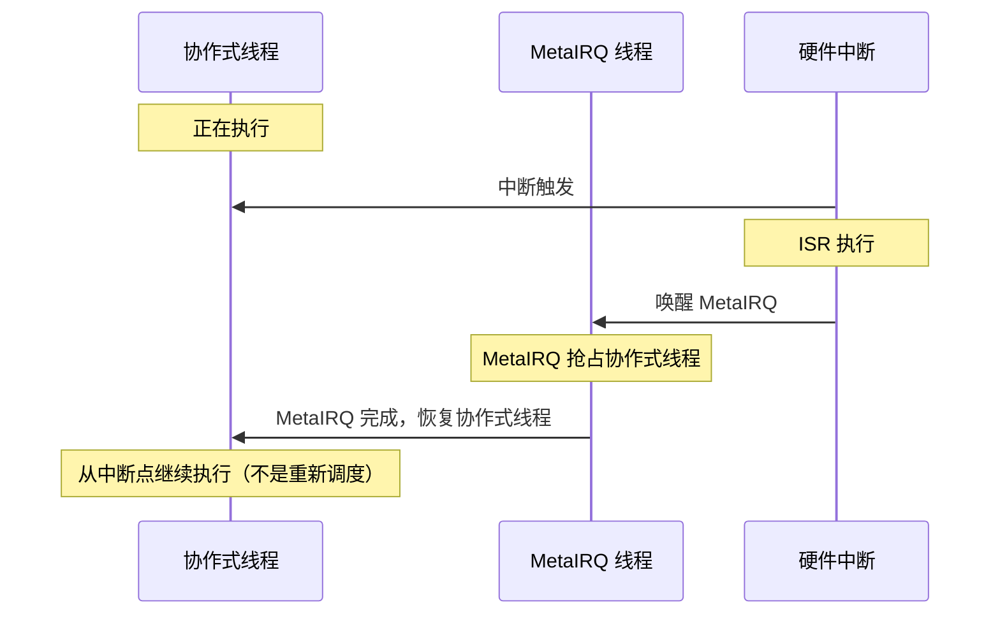
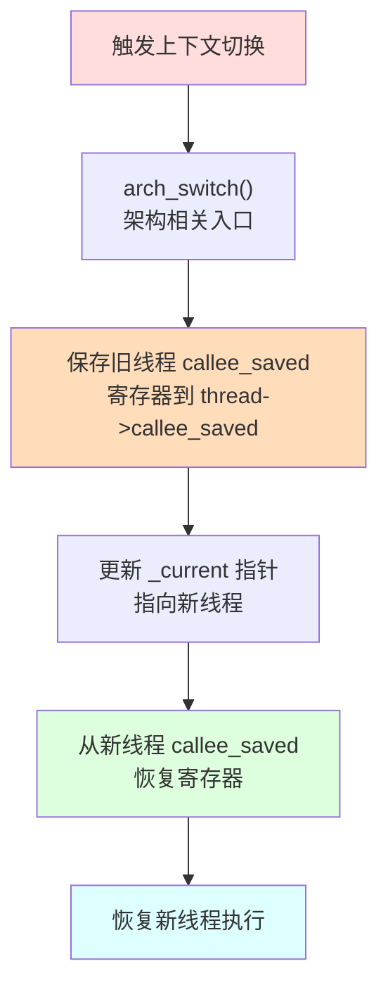
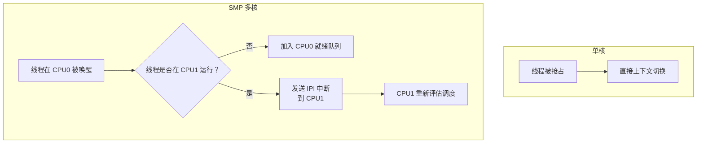

# Zephyr RTOS 线程状态与迁移详解

> 返回：[入门概览](./00_入门概览.md) | [文档导航](../README.md)

---

## 一、线程状态定义

### 1.1 状态标志（Bit Flags）

Zephyr 使用**位标志**表示线程状态，定义于 [include/zephyr/kernel_structs.h](file:///home/pbw/cs-learning-notes/zephyr-src/include/zephyr/kernel_structs.h#L52)：

```c
/* 状态标志定义 */
#define _THREAD_DUMMY     (BIT(0))   /* 虚拟线程（非真实线程，用于特殊场景） */
#define _THREAD_PENDING   (BIT(1))   /* 线程正在等待内核对象（信号量、互斥锁等） */
#define _THREAD_SLEEPING  (BIT(2))   /* 线程正在睡眠（k_sleep/k_msleep） */
#define _THREAD_DEAD      (BIT(3))   /* 线程已终止 */
#define _THREAD_SUSPENDED (BIT(4))   /* 线程被显式挂起（k_thread_suspend） */
#define _THREAD_ABORTING  (BIT(5))   /* 线程正在中止过程中 */
#define _THREAD_SUSPENDING (BIT(6))  /* 线程正在挂起过程中 */
#define _THREAD_QUEUED    (BIT(7))   /* 线程在就绪队列中 */
```

### 1.2 状态分类体系

```
┌─────────────────────────────────────────────────────────────────────────────┐
│                           Zephyr 线程状态分类体系                            │
├─────────────────────────────────────────────────────────────────────────────┤
│                                                                             │
│  ┌─────────────────────────────────────────────────────────────────────┐   │
│  │                     可运行状态 (Runnable)                            │   │
│  │                                                                     │   │
│  │   条件：thread_state 中无阻止运行的标志                              │   │
│  │   判断：z_is_thread_ready() == true                                 │   │
│  │                                                                     │   │
│  │   ┌───────────────┐         ┌───────────────┐                      │   │
│  │   │     就绪      │         │     运行      │                      │   │
│  │   │   _QUEUED     │ ──────► │   RUNNING     │                      │   │
│  │   │  (在就绪队列) │         │  (CPU执行中)  │                      │   │
│  │   └───────────────┘         └───────────────┘                      │   │
│  └─────────────────────────────────────────────────────────────────────┘   │
│                                                                             │
│  ┌─────────────────────────────────────────────────────────────────────┐   │
│  │                     阻塞状态 (Blocked)                               │   │
│  │                                                                     │   │
│  │   条件：thread_state 中有阻止运行的标志                              │   │
│  │   判断：z_is_thread_prevented_from_running() == true                │   │
│  │                                                                     │   │
│  │   ┌───────────────┐  ┌───────────────┐  ┌───────────────┐          │   │
│  │   │    等待       │  │    睡眠       │  │    挂起       │          │   │
│  │   │  _PENDING     │  │  _SLEEPING    │  │  _SUSPENDED   │          │   │
│  │   │ (等待同步对象)│  │ (主动睡眠)    │  │ (显式挂起)    │          │   │
│  │   └───────────────┘  └───────────────┘  └───────────────┘          │   │
│  └─────────────────────────────────────────────────────────────────────┘   │
│                                                                             │
│  ┌─────────────────────────────────────────────────────────────────────┐   │
│  │                     终止状态 (Terminated)                            │   │
│  │                                                                     │   │
│  │   ┌───────────────┐                                                 │   │
│  │   │    已终止     │                                                 │   │
│  │   │    _DEAD      │                                                 │   │
│  │   │  (线程结束)   │                                                 │   │
│  │   └───────────────┘                                                 │   │
│  └─────────────────────────────────────────────────────────────────────┘   │
│                                                                             │
│  ┌─────────────────────────────────────────────────────────────────────┐   │
│  │                     过渡状态 (Transition)                            │   │
│  │                                                                     │   │
│  │   ┌───────────────┐  ┌───────────────┐                              │   │
│  │   │   正在中止    │  │   正在挂起    │                              │   │
│  │   │  _ABORTING    │  │  _SUSPENDING  │                              │   │
│  │   └───────────────┘  └───────────────┘                              │   │
│  └─────────────────────────────────────────────────────────────────────┘   │
│                                                                             │
└─────────────────────────────────────────────────────────────────────────────┘
```

### 1.3 状态判断函数

```c
/* 判断线程是否被阻止运行 */
static inline bool z_is_thread_prevented_from_running(const struct k_thread *thread)
{
    uint8_t state = thread->base.thread_state;
    return (state & (_THREAD_PENDING | _THREAD_SLEEPING | _THREAD_DEAD |
                     _THREAD_DUMMY | _THREAD_SUSPENDED)) != 0U;
}

/* 判断线程是否就绪（可被调度执行） */
static inline bool z_is_thread_ready(const struct k_thread *thread)
{
    return !z_is_thread_prevented_from_running(thread);
}

/* 判断线程是否在就绪队列中 */
static inline bool z_is_thread_queued(const struct k_thread *thread)
{
    return (thread->base.thread_state & _THREAD_QUEUED) != 0U;
}

/* 判断线程是否正在等待对象 */
static inline bool z_is_thread_pending(const struct k_thread *thread)
{
    return (thread->base.thread_state & _THREAD_PENDING) != 0U;
}

/* 判断线程是否正在睡眠 */
static inline bool z_is_thread_sleeping(struct k_thread *thread)
{
    return (thread->base.thread_state & _THREAD_SLEEPING) != 0U;
}

/* 判断线程是否被挂起 */
static inline bool z_is_thread_suspended(const struct k_thread *thread)
{
    return (thread->base.thread_state & _THREAD_SUSPENDED) != 0U;
}

/* 判断线程是否已终止 */
static inline bool z_is_thread_dead(const struct k_thread *thread)
{
    return (thread->base.thread_state & _THREAD_DEAD) != 0U;
}
```

---

## 二、线程状态迁移图

### 2.1 完整状态迁移图

```
┌─────────────────────────────────────────────────────────────────────────────────┐
│                           Zephyr 线程状态迁移图                                   │
└─────────────────────────────────────────────────────────────────────────────────┘

                                    ┌─────────────┐
                                    │   线程创建   │
                                    │ k_thread_   │
                                    │   create()  │
                                    └──────┬──────┘
                                           │
                                           │ z_init_thread_base()
                                           │ 设置 _THREAD_SLEEPING
                                           ▼
┌──────────────────────────────────────────────────────────────────────────────────┐
│                                  初始状态                                         │
│  ┌─────────────────────────────────────────────────────────────────────────────┐ │
│  │                           _SLEEPING                                          │ │
│  │                          (初始睡眠)                                          │ │
│  │                                                                              │ │
│  │   说明：线程创建后的初始状态，等待 k_thread_start() 启动                      │ │
│  └─────────────────────────────────────────────────────────────────────────────┘ │
└──────────────────────────────────────────────────────────────────────────────────┘
                                           │
                                           │ k_thread_start()
                                           │ ready_thread()
                                           │ 设置 _THREAD_QUEUED
                                           ▼
┌──────────────────────────────────────────────────────────────────────────────────┐
│                              就绪状态 (READY)                                     │
│  ┌─────────────────────────────────────────────────────────────────────────────┐ │
│  │                           _QUEUED                                            │ │
│  │                         (在就绪队列中)                                        │ │
│  │                                                                              │ │
│  │   条件：z_is_thread_ready() == true && z_is_thread_queued() == true         │ │
│  │   说明：线程已准备好执行，等待调度器选中                                       │ │
│  └─────────────────────────────────────────────────────────────────────────────┘ │
└──────────────────────────────────────────────────────────────────────────────────┘
                                           │
                                           │ 调度器选中
                                           │ arch_switch()
                                           │ 清除 _THREAD_QUEUED
                                           ▼
┌──────────────────────────────────────────────────────────────────────────────────┐
│                              运行状态 (RUNNING)                                   │
│  ┌─────────────────────────────────────────────────────────────────────────────┐ │
│  │                            RUNNING                                           │ │
│  │                           (CPU 正在执行)                                      │ │
│  │                                                                              │ │
│  │   条件：thread == _current && z_is_thread_ready() == true                   │ │
│  │   说明：线程正在 CPU 上执行                                                   │ │
│  └─────────────────────────────────────────────────────────────────────────────┘ │
└──────────────────────────────────────────────────────────────────────────────────┘
           │                    │                    │                    │
           │                    │                    │                    │
           │ k_sem_take()       │ k_sleep()          │ 被抢占/            │ k_thread_   │ k_thread_  │ k_thread_exit()
           │ k_mutex_lock()     │ k_msleep()         │ 时间片用完          │ suspend()   │ abort()
           │ k_queue_get()      │ k_yield()          │                    │             │
           │ 等待同步对象        │ 主动让出           │                    │             │
           │                    │                    │                    │             │
           ▼                    ▼                    ▼                    ▼             ▼
┌─────────────────┐  ┌─────────────────┐  ┌─────────────────┐  ┌─────────────────┐  ┌─────────────────┐
│                 │  │                 │  │                 │  │                 │  │                 │
│    _PENDING     │  │   _SLEEPING     │  │    _QUEUED      │  │   _SUSPENDED    │  │     _DEAD       │
│   (等待对象)    │  │    (睡眠中)     │  │   (重新入队)    │  │    (被挂起)     │  │    (已终止)     │
│                 │  │                 │  │                 │  │                 │  │                 │
│ 设置:           │  │ 设置:           │  │ 保持:           │  │ 设置:           │  │ 设置:           │
│ _PENDING        │  │ _SLEEPING       │  │ _QUEUED         │  │ _SUSPENDED      │  │ _DEAD           │
│ 清除: _QUEUED   │  │ 清除: _QUEUED   │  │                 │  │ 清除: _QUEUED   │  │ 清除: 其他标志  │
│                 │  │                 │  │                 │  │                 │  │                 │
└────────┬────────┘  └────────┬────────┘  └────────┬────────┘  └────────┬────────┘  └─────────────────┘
         │                    │                    │                    │
         │                    │                    │                    │
         │ 资源可用           │ 超时到期           │ 调度器选中          │ k_thread_resume()
         │ k_sem_give()       │ 超时回调           │                    │
         │ k_mutex_unlock()   │ z_thread_timeout() │                    │
         │                    │                    │                    │
         │ z_sched_wake_      │ z_sched_wake_      │                    │
         │ thread_locked()    │ thread_locked()    │                    │
         │                    │                    │                    │
         └────────────────────┴────────────────────┘                    │
                              │                                         │
                              │ ready_thread()                          │ ready_thread()
                              │ 设置 _THREAD_QUEUED                     │ 清除 _SUSPENDED
                              │ 清除 _PENDING/_SLEEPING                 │ 设置 _THREAD_QUEUED
                              │                                         │
                              ▼                                         ▼
                    ┌─────────────────┐                       ┌─────────────────┐
                    │                 │                       │                 │
                    │    _QUEUED      │◄──────────────────────│    _QUEUED      │
                    │   (重新就绪)    │                       │   (恢复就绪)    │
                    │                 │                       │                 │
                    └─────────────────┘                       └─────────────────┘
                              │
                              │
                              └──────────────────────────────────────────────────────►
                                                        循环
```

### 2.2 简化状态迁移图

```
                    ┌─────────────────────────────────────────────────────────────┐
                    │                                                             │
                    │                      线程生命周期                            │
                    │                                                             │
                    └─────────────────────────────────────────────────────────────┘
                                               │
                                               ▼
                                        ┌─────────────┐
                                        │   CREATED   │
                                        │   (已创建)  │
                                        └──────┬──────┘
                                               │ k_thread_start()
                                               ▼
┌─────────────────────────────────────────────────────────────────────────────────┐
│                                                                                 │
│     ┌─────────────┐                      ┌─────────────┐                       │
│     │             │     调度器选中       │             │                       │
│     │    READY    │ ──────────────────► │   RUNNING   │                       │
│     │   (就绪)    │                      │   (运行)    │                       │
│     │             │ ◄────────────────── │             │                       │
│     └──────┬──────┘     被抢占/让出      └──────┬──────┘                       │
│            │                                    │                              │
│            │                                    │                              │
│            │         ┌──────────────────────────┼──────────────────────────┐   │
│            │         │                          │                          │   │
│            │         ▼                          ▼                          ▼   │
│            │  ┌─────────────┐           ┌─────────────┐           ┌──────────┐│
│            │  │   PENDING   │           │  SLEEPING   │           │SUSPENDED ││
│            │  │   (等待)    │           │   (睡眠)    │           │ (挂起)   ││
│            │  └──────┬──────┘           └──────┬──────┘           └────┬─────┘│
│            │         │                         │                       │      │
│            │         │ 资源可用                │ 超时到期              │      │
│            │         │                         │                       │      │
│            │         └───────────┬─────────────┘                       │      │
│            │                     │                                     │      │
│            │                     │ k_thread_resume()                   │      │
│            │                     ▼                                     │      │
│            └────────────────────►│◄────────────────────────────────────┘      │
│                                  │                                            │
│                                  ▼                                            │
│                           ┌─────────────┐                                     │
│                           │    READY    │                                     │
│                           │   (就绪)    │                                     │
│                           └─────────────┘                                     │
│                                                                                 │
└─────────────────────────────────────────────────────────────────────────────────┘
                                               │
                                               │ k_thread_abort() / 线程退出
                                               ▼
                                        ┌─────────────┐
                                        │    DEAD     │
                                        │   (终止)    │
                                        └─────────────┘
```

---

## 三、状态迁移详解

### 3.1 创建 → 初始睡眠

**触发条件**：`k_thread_create()`

**执行流程**：

```c
// 源码位置：kernel/thread.c
k_tid_t k_thread_create(struct k_thread *new_thread, ...)
{
    // ...
    
    // 初始化线程基础结构，设置初始状态为 _THREAD_SLEEPING
    z_init_thread_base(&new_thread->base, prio, _THREAD_SLEEPING, options);
    
    // ...
}
```

**状态变化**：
- 设置 `_THREAD_SLEEPING`
- 线程尚未加入就绪队列

---

### 3.2 初始睡眠 → 就绪

**触发条件**：`k_thread_start()`

**执行流程**：

```c
// 源码位置：kernel/thread.c
void k_thread_start(k_tid_t thread)
{
    k_spinlock_key_t key = k_spin_lock(&_sched_spinlock);
    
    // 标记线程为非睡眠状态
    z_mark_thread_as_not_sleeping(thread);
    
    // 将线程加入就绪队列
    ready_thread(thread);
    
    // 可能触发调度
    reschedule(&_sched_spinlock, key);
}

// 源码位置：kernel/sched.c
static inline void ready_thread(struct k_thread *thread)
{
    // 如果线程未被阻止运行
    if (z_is_thread_ready(thread)) {
        // 加入就绪队列
        queue_thread(thread);
    }
}

static inline void queue_thread(struct k_thread *thread)
{
    // 标记线程在队列中
    z_mark_thread_as_queued(thread);
    // 加入运行队列
    runq_add(thread);
}
```

**状态变化**：
- 清除 `_THREAD_SLEEPING`
- 设置 `_THREAD_QUEUED`

---

### 3.3 就绪 → 运行

**触发条件**：调度器选中

**执行流程**：

```c
// 源码位置：kernel/sched.c
// 上下文切换时发生
void z_swap(struct k_spinlock *lock, k_spinlock_key_t key)
{
    // 获取下一个要运行的线程
    struct k_thread *new_thread = z_swap_next_thread();
    
    // 执行上下文切换
    arch_switch(new_thread->switch_handle, _current->switch_handle);
}
```

**状态变化**：
- 清除 `_THREAD_QUEUED`（从就绪队列移除）
- 线程开始执行

---

### 3.4 运行 → 等待（PENDING）

**触发条件**：等待同步对象（`k_sem_take()`, `k_mutex_lock()`, `k_queue_get()` 等）

**执行流程**：

```c
// 源码位置：kernel/sched.c
int z_pend_curr(struct k_spinlock *lock, k_spinlock_key_t key,
               _wait_q_t *wait_q, k_timeout_t timeout)
{
    // 将当前线程加入等待队列
    pend_locked(_current, wait_q, timeout);
    
    // 执行上下文切换
    return z_swap(&_sched_spinlock, key);
}

static void pend_locked(struct k_thread *thread, _wait_q_t *wait_q,
                        k_timeout_t timeout)
{
    // 从就绪队列移除
    add_to_waitq_locked(thread, wait_q);
    
    // 设置超时（如果不是永久等待）
    add_thread_timeout(thread, timeout);
}

static void add_to_waitq_locked(struct k_thread *thread, _wait_q_t *wait_q)
{
    // 从就绪队列移除
    unready_thread(thread);
    
    // 标记为等待状态
    z_mark_thread_as_pending(thread);
    
    // 加入等待队列
    if (wait_q != NULL) {
        thread->base.pended_on = wait_q;
        _priq_wait_add(&wait_q->waitq, thread);
    }
}
```

**状态变化**：
- 清除 `_THREAD_QUEUED`
- 设置 `_THREAD_PENDING`

---

### 3.5 等待 → 就绪

**触发条件**：资源可用（`k_sem_give()`, `k_mutex_unlock()` 等）

**执行流程**：

```c
// 源码位置：kernel/sched.c
void z_sched_wake_thread_locked(struct k_thread *thread)
{
    bool killed = (thread->base.thread_state & (_THREAD_DEAD | _THREAD_ABORTING));
    
    if (!killed) {
        // 从等待队列移除
        if (thread->base.pended_on != NULL) {
            unpend_thread_no_timeout(thread);
        }
        
        // 清除睡眠标志
        z_mark_thread_as_not_sleeping(thread);
        
        // 加入就绪队列
        ready_thread(thread);
    }
}
```

**状态变化**：
- 清除 `_THREAD_PENDING`
- 设置 `_THREAD_QUEUED`

---

### 3.6 运行 → 睡眠（SLEEPING）

**触发条件**：`k_sleep()`, `k_msleep()`, `k_usleep()`

**执行流程**：

```c
// 源码位置：kernel/sched.c
void z_impl_k_sleep(k_timeout_t timeout)
{
    k_spinlock_key_t key = k_spin_lock(&_sched_spinlock);
    
    // 标记为睡眠状态
    z_mark_thread_as_sleeping(_current);
    
    // 添加超时
    z_add_thread_timeout(_current, timeout);
    
    // 从就绪队列移除
    unready_thread(_current);
    
    // 执行上下文切换
    z_swap(&_sched_spinlock, key);
}
```

**状态变化**：
- 清除 `_THREAD_QUEUED`
- 设置 `_THREAD_SLEEPING`

---

### 3.7 睡眠 → 就绪

**触发条件**：超时到期

**执行流程**：

```c
// 源码位置：kernel/sched.c
void z_thread_timeout(struct _timeout *timeout)
{
    struct k_thread *thread = CONTAINER_OF(timeout, struct k_thread, base.timeout);
    
    K_SPINLOCK(&_sched_spinlock) {
        z_sched_wake_thread_locked(thread);
    }
}

void z_sched_wake_thread_locked(struct k_thread *thread)
{
    // 清除睡眠标志
    z_mark_thread_as_not_sleeping(thread);
    
    // 加入就绪队列
    ready_thread(thread);
}
```

**状态变化**：
- 清除 `_THREAD_SLEEPING`
- 设置 `_THREAD_QUEUED`

---

### 3.8 运行 → 挂起（SUSPENDED）

**触发条件**：`k_thread_suspend()`

**执行流程**：

```c
// 源码位置：kernel/sched.c
void z_impl_k_thread_suspend(k_tid_t thread)
{
    k_spinlock_key_t key = k_spin_lock(&_sched_spinlock);
    
    // 标记为挂起状态
    z_mark_thread_as_suspended(thread);
    
    // 从就绪队列移除
    dequeue_thread(thread);
    
    // 更新调度缓存
    update_cache(1);
    
    // 如果是当前线程，执行上下文切换
    z_swap(&_sched_spinlock, key);
}
```

**状态变化**：
- 清除 `_THREAD_QUEUED`
- 设置 `_THREAD_SUSPENDED`

---

### 3.9 挂起 → 就绪

**触发条件**：`k_thread_resume()`

**执行流程**：

```c
// 源码位置：kernel/sched.c
void z_impl_k_thread_resume(k_tid_t thread)
{
    k_spinlock_key_t key = k_spin_lock(&_sched_spinlock);
    
    // 清除挂起状态
    z_mark_thread_as_not_suspended(thread);
    
    // 加入就绪队列
    ready_thread(thread);
    
    // 可能触发调度
    reschedule(&_sched_spinlock, key);
}
```

**状态变化**：
- 清除 `_THREAD_SUSPENDED`
- 设置 `_THREAD_QUEUED`

---

### 3.10 运行 → 终止（DEAD）

**触发条件**：`k_thread_abort()` 或线程函数返回

**执行流程**：

```c
// 源码位置：kernel/thread.c
void z_impl_k_thread_abort(k_tid_t thread)
{
    k_spinlock_key_t key = k_spin_lock(&_sched_spinlock);
    
    // 标记为终止状态
    z_mark_thread_as_dead(thread);
    
    // 从任何队列中移除
    if (z_is_thread_queued(thread)) {
        dequeue_thread(thread);
    }
    
    // 唤醒等待该线程的线程（join）
    z_thread_wake_joiners(thread);
    
    // 更新调度缓存
    update_cache(1);
    
    // 如果是当前线程，执行上下文切换
    z_swap(&_sched_spinlock, key);
}
```

**状态变化**：
- 设置 `_THREAD_DEAD`
- 清除其他所有状态标志

---

## 四、状态迁移总结表

| 当前状态 | 目标状态 | 触发 API | 内部函数 | 状态变化 |
|---------|---------|---------|---------|---------|
| 创建 | SLEEPING | `k_thread_create()` | `z_init_thread_base()` | 设置 `_SLEEPING` |
| SLEEPING | QUEUED | `k_thread_start()` | `ready_thread()` | 清除 `_SLEEPING`，设置 `_QUEUED` |
| QUEUED | RUNNING | 调度器选中 | `arch_switch()` | 清除 `_QUEUED` |
| RUNNING | PENDING | `k_sem_take()` 等 | `z_pend_curr()` | 清除 `_QUEUED`，设置 `_PENDING` |
| RUNNING | SLEEPING | `k_sleep()` | `z_impl_k_sleep()` | 清除 `_QUEUED`，设置 `_SLEEPING` |
| RUNNING | SUSPENDED | `k_thread_suspend()` | `z_impl_k_thread_suspend()` | 清除 `_QUEUED`，设置 `_SUSPENDED` |
| RUNNING | DEAD | `k_thread_abort()` | `z_impl_k_thread_abort()` | 设置 `_DEAD` |
| RUNNING | QUEUED | 被抢占/`k_yield()` | `queue_thread()` | 设置 `_QUEUED` |
| PENDING | QUEUED | 资源可用 | `z_sched_wake_thread_locked()` | 清除 `_PENDING`，设置 `_QUEUED` |
| SLEEPING | QUEUED | 超时到期 | `z_thread_timeout()` | 清除 `_SLEEPING`，设置 `_QUEUED` |
| SUSPENDED | QUEUED | `k_thread_resume()` | `z_impl_k_thread_resume()` | 清除 `_SUSPENDED`，设置 `_QUEUED` |

---

## 五、状态标志组合

由于状态是位标志，线程可以同时处于多个状态：

### 5.1 常见组合

| 组合 | 含义 | 场景 |
|-----|------|------|
| `_PENDING \| _QUEUED` | 等待中但在就绪队列 | 超时等待时，同时设置了超时和在等待队列 |
| `_SLEEPING \| _QUEUED` | 睡眠中但在就绪队列 | 带超时的睡眠，超时后会自动唤醒 |
| `_SUSPENDED \| _PENDING` | 挂起且等待 | 线程在等待资源时被挂起 |
| `_ABORTING \| _PENDING` | 正在中止且等待 | 中止正在等待的线程 |

### 5.2 状态互斥

以下状态不能同时存在：
- `_DEAD` 与其他运行状态（线程终止后不再参与调度）
- `_DUMMY` 与其他状态（虚拟线程仅用于特殊场景）

---

## 六、API 与状态迁移对照表

```
┌─────────────────────────────────────────────────────────────────────────────┐
│                        API 与状态迁移对照表                                   │
├─────────────────────────────────────────────────────────────────────────────┤
│                                                                             │
│  线程控制 API                                                               │
│  ─────────────────────────────────────────────────────────────────────────  │
│  k_thread_create()    创建线程         → SLEEPING                          │
│  k_thread_start()     启动线程         SLEEPING → QUEUED                    │
│  k_thread_suspend()   挂起线程         RUNNING/QUEUED → SUSPENDED           │
│  k_thread_resume()    恢复线程         SUSPENDED → QUEUED                   │
│  k_thread_abort()     终止线程         * → DEAD                             │
│  k_thread_join()      等待线程结束     当前线程 → PENDING                    │
│                                                                             │
│  睡眠 API                                                                   │
│  ─────────────────────────────────────────────────────────────────────────  │
│  k_sleep()            睡眠             RUNNING → SLEEPING                   │
│  k_msleep()           毫秒睡眠         RUNNING → SLEEPING                   │
│  k_usleep()           微秒睡眠         RUNNING → SLEEPING                   │
│  k_yield()            让出 CPU         RUNNING → QUEUED                     │
│                                                                             │
│  同步对象等待 API                                                           │
│  ─────────────────────────────────────────────────────────────────────────  │
│  k_sem_take()         获取信号量       RUNNING → PENDING                    │
│  k_mutex_lock()       锁定互斥锁       RUNNING → PENDING                    │
│  k_queue_get()        获取队列数据     RUNNING → PENDING                    │
│  k_pipe_read()        读取管道         RUNNING → PENDING                    │
│  k_event_wait()       等待事件         RUNNING → PENDING                    │
│                                                                             │
│  同步对象释放 API（唤醒等待线程）                                            │
│  ─────────────────────────────────────────────────────────────────────────  │
│  k_sem_give()         释放信号量       PENDING → QUEUED (等待线程)          │
│  k_mutex_unlock()     解锁互斥锁       PENDING → QUEUED (等待线程)          │
│  k_queue_append()     追加队列数据     PENDING → QUEUED (等待线程)          │
│  k_pipe_write()       写入管道         PENDING → QUEUED (等待线程)          │
│  k_event_post()       发送事件         PENDING → QUEUED (等待线程)          │
│                                                                             │
└─────────────────────────────────────────────────────────────────────────────┘
```

---

## 七、MetaIRQ 与上下文切换

### 7.1 MetaIRQ 线程

> ⚠️ MetaIRQ 是 Zephyr 特有的线程类型，优先级高于所有协作式线程，用于中断下半部处理。源码参考 [kernel/sched.c](file:///home/pbw/cs-learning-notes/zephyr-src/kernel/sched.c)。

**MetaIRQ 的本质**：
- 优先级为 0（最高协作式优先级），但行为类似中断
- 可以抢占协作式线程（普通协作式线程之间不能抢占）
- 被抢占的协作式线程恢复后**从中断点继续执行**，而不是重新调度



**关键源码**：

```c
// kernel_structs.h - 调度器上下文
struct _cpu {
    // ...
    struct k_thread *metairq_preempted;  // 被 MetaIRQ 抢占的协作式线程
    // ...
};
```

**MetaIRQ vs 普通协作式线程**：

| 特性 | 协作式线程 | MetaIRQ 线程 |
|-----|----------|-------------|
| 优先级 | -1 ~ -CONFIG_NUM_COOP_PRIORITIES | 0（MetaIRQ 标志） |
| 抢占协作式 | ❌ 不能 | ✅ 可以 |
| 被抢占后恢复 | 重新进入就绪队列 | 从中断点继续 |
| 典型用途 | 设备驱动、协议栈 | 中断下半部、延迟处理 |
| 调度选项 | `K_PRIO_COOP(i)` | `K_PRIO_COOP(0)` + `K_ESSENTIAL` |

### 7.2 上下文切换机制

上下文切换是线程状态迁移的核心操作，涉及保存旧线程上下文和恢复新线程上下文。



**`_callee_saved` 结构**（ARM Cortex-M 示例）：

```c
// arch/arm/core/thread.c
struct _callee_saved {
    uint32_t v1;    // R4
    uint32_t v2;    // R5
    uint32_t v3;    // R6
    uint32_t v4;    // R7
    uint32_t v5;    // R8
    uint32_t v6;    // R9
    uint32_t v7;    // R10
    uint32_t v8;    // R11
    uint32_t psp;   // 进程栈指针 R13
};
```

**上下文切换的触发路径**：

| 触发场景 | 调用链 | 说明 |
|---------|--------|------|
| 主动让出 | `k_yield()` → `z_swap()` → `arch_switch()` | 线程主动触发 |
| 阻塞等待 | `k_sem_take()` → `z_pend_curr()` → `z_swap()` | 等待同步对象 |
| 睡眠 | `k_sleep()` → `z_swap()` | 主动睡眠 |
| 被抢占 | PendSV ISR → `z_check_stack_sentinel()` → `arch_switch()` | 时钟中断/高优先级就绪 |
| ISR 唤醒 | ISR → `z_reschedule()` → `arch_switch()` | 中断中唤醒高优先级线程 |

### 7.3 SMP 下的状态迁移

> ⚠️ SMP（对称多处理）环境下，线程状态迁移需要考虑多 CPU 并发问题。

**SMP 特有状态字段**：

```c
// _thread_base 中的 SMP 相关字段
#ifdef CONFIG_SMP
    uint8_t is_idle;            // 是否为空闲线程
    uint8_t cpu;                // 最后执行的 CPU ID
    uint8_t global_lock_count;  // 全局 irq_lock 递归计数
#endif
```

**SMP 状态迁移的关键差异**：



| 特性 | 单核 | SMP |
|-----|------|------|
| 调度锁 | `irq_lock()` 即可 | 需要自旋锁 `_sched_spinlock` |
| 就绪队列 | 全局一个 | 每个 CPU 一个 + 全局 |
| 线程迁移 | 不适用 | 线程可在 CPU 间迁移 |
| IPI | 不需要 | 需要处理器间中断 |
| 空闲线程 | 一个 | 每个 CPU 一个 |
| `cpu` 字段 | 不存在 | 记录线程最后运行的 CPU |

**SMP 下的 `ready_thread()`**：

```c
// kernel/sched.c（简化）
void ready_thread(struct k_thread *thread)
{
    if (z_is_thread_ready(thread)) {
        sys_trace_thread_ready(thread);
        
        // SMP: 将线程加入当前 CPU 的就绪队列
        // 如果线程有 CPU 亲和性，加入指定 CPU 的队列
        // 否则加入当前 CPU 的队列
        queue_thread(thread);
        
        update_cache(0);
    }
}
```

---

## 八、调试与监控

### 8.1 获取线程状态

```c
// 通过 Shell 查看线程状态
// 命令：kernel threads

// 通过 API 获取线程信息
const char *k_thread_name_get(k_tid_t thread);

// 检查线程状态
bool k_thread_is_ready(k_tid_t thread);  // 需要自己实现
```

### 8.2 状态字符串表示

```c
// 源码位置：kernel/include/kthread.h
#define Z_STATE_STR_DUMMY       "dummy"      // 虚拟
#define Z_STATE_STR_PENDING     "pending"    // 等待中
#define Z_STATE_STR_SLEEPING    "sleeping"   // 睡眠中
#define Z_STATE_STR_DEAD        "dead"       // 已终止
#define Z_STATE_STR_SUSPENDED   "suspended"  // 已挂起
#define Z_STATE_STR_ABORTING    "aborting"   // 正在中止
#define Z_STATE_STR_SUSPENDING  "suspending" // 正在挂起
#define Z_STATE_STR_QUEUED      "queued"     // 在队列中
```

---

## 总结

Zephyr RTOS 的线程状态管理具有以下特点：

1. **位标志设计**：允许线程同时处于多个状态，灵活高效
2. **清晰的分类**：可运行、阻塞、终止、过渡四大类
3. **明确的状态判断**：`z_is_thread_ready()` 和 `z_is_thread_prevented_from_running()`
4. **完整的状态迁移**：每个迁移都有明确的触发条件和执行流程

理解线程状态及其迁移对于调试多线程程序、分析系统行为至关重要。

---

*本文档基于 Zephyr 源码分析，源码位置均标注了可点击的链接。*

---

*最后更新：2026-04-22*
