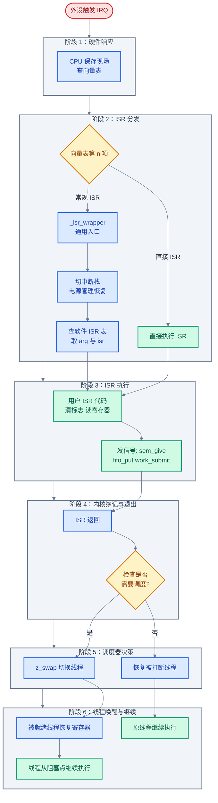
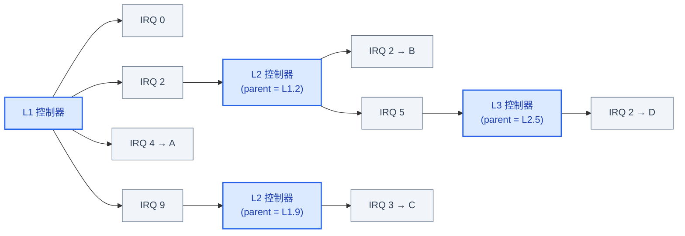
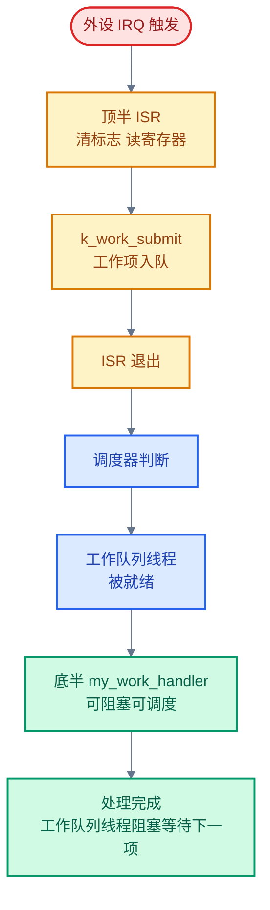
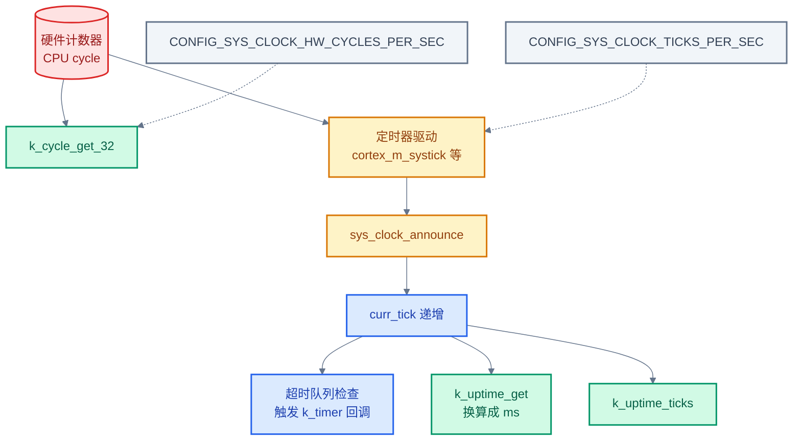

# 08. Zephyr 中断与时序

> 一句话概括：本文以「硬件中断 → ISR 注册 → 内核中断管理 → 调度器通知 → 线程唤醒」完整调用链为主线，剖析 Zephyr 中断管理、ISR 约束、下半部机制、poll 多对象等待、内核时钟与定时器的本质与源码实现，最后用"定时器 + 工作队列"实现周期性传感器采样。
> **工程师视角**：读完后应当能在脑中画出一条完整调用链——从外设拉低电平到被唤醒线程继续执行，并回答"为什么 ISR 不能调用 k_sleep"、"为什么内核定时器回调在 ISR 上下文执行"、"为什么 k_timer 与 k_sleep 都基于 sys_clock"、"k_poll 与信号量等待多对象时的差异在哪"四个问题，最终能为周期性任务选择合适的时序机制。

### 关键术语

| 缩写 | 全称 | 含义 |
|------|------|------|
| ISR | Interrupt Service Routine | 中断服务例程，硬件异步事件的入口函数 |
| IRQ | Interrupt Request | 中断请求，硬件向 CPU 发出的中断信号 |
| NVIC | Nested Vectored Interrupt Controller | 嵌套向量中断控制器，ARM Cortex-M 的中断控制器 |
| IDT | Interrupt Descriptor Table | 中断描述符表，x86 用的中断向量表变体 |
| IPI | Inter-Processor Interrupt | 处理器间中断，SMP 跨核通知 |
| Poll | Polling | 轮询，本文指 `k_poll` 多对象等待机制 |
| Timer | Kernel Timer | 内核定时器，基于 sys_clock 的内核对象 `k_timer` |
| Cycle | Hardware Cycle | 硬件周期计数，CPU 计数器读数 |
| Uptime | System Uptime | 系统启动以来的累计时间 |
| Hz | Hertz | 赫兹，频率单位，每秒次数 |
| KHz | Kilohertz | 千赫兹，$10^3$ Hz |
| MHz | Megahertz | 兆赫兹，$10^6$ Hz |
| Tick | System Tick | 系统滴答，内核内部计时的最小单位 |
| RTOS | Real-Time Operating System | 实时操作系统 |
| SMP | Symmetric Multi-Processing | 对称多处理，多核平等运行同一内核镜像 |
| TCB | Thread Control Block | 线程控制块，`struct k_thread` |

---

### 前置阅读

| 需要了解 | 参考文档 |
|----------|----------|
| 线程生命周期与上下文切换（ISR 抢占线程的基础） | [05-线程与状态迁移](./05-线程与状态迁移.md) |
| 同步原语与 `K_NO_WAIT` 的含义（ISR 中只能用非阻塞） | [07-同步机制详解](./07-同步机制详解.md) |

---

## 1. 概述：中断全链路与三层时序基础设施

> 本章是全文起点。一个核心问题驱动全文：**CPU 正在跑线程，外设来了一个事件，怎么让 CPU 立刻响应？被唤醒的线程又怎么继续执行？** 先用一个 GPIO 按键中断的具体场景讲清"中断在做什么"，再给出贯穿全文的"中断全链路调用链全貌图"作为导航地图——后续每章都对应调用链上的某个阶段。最后对比 RTOS 中断与裸机中断的本质差异，并预告两条特殊链路（定时器链路与 poll 链路）。

### 1.1 一个具体场景：按键中断唤醒线程

想象一个最简单的需求——板卡上的用户按键被按下时，打印一条日志。轮询做法是线程死循环读 GPIO 状态，浪费 CPU；中断做法是配置 GPIO 引脚为中断模式，按下时硬件主动通知 CPU。

整个流程分四步：

1. **硬件触发**：按键按下，GPIO 控制器拉低电平，检测到下降沿，向中断控制器发出 IRQ 信号
2. **CPU 响应**：CPU 在当前指令执行完毕后，保存当前线程的 PC、寄存器到栈，跳转到中断向量表对应入口
3. **ISR 执行**：内核通用中断入口做少量簿记（如切换到中断栈），调用驱动注册的 ISR——ISR 读 GPIO 状态寄存器清中断标志，然后通过信号量或 FIFO 通知处理线程
4. **退出与调度**：ISR 返回后，内核检查是否有更高优先级线程被就绪，若有则切换；否则恢复原线程现场继续执行

这个流程的关键特征是：**中断是硬件异步事件的入口**，它打断了"线程按调度顺序执行"的常规节奏。线程不知道何时会被中断打断，ISR 也不知道自己会打断哪个线程——这就是"异步"的含义。

### 1.2 RTOS 中断与裸机中断的本质差异

裸机程序中，中断与主循环共享同一地址空间、同一栈，ISR 直接操作全局变量即可。RTOS 中，中断必须与"多线程调度"协作，差异如下：

| 维度 | 裸机中断 | RTOS 中断 |
|------|---------|----------|
| **被打断对象** | 主循环（单一执行流） | 任意线程（多执行流之一） |
| **栈** | 通常共用主栈 | 中断有自己的中断栈（`CONFIG_ISR_STACK_SIZE`） |
| **能否调用阻塞 API** | 无阻塞 API 概念 | 不能，ISR 无线程上下文无法挂起 |
| **退出时是否调度** | 直接返回主循环 | 可能触发调度，切换到更高优先级线程 |
| **与同步原语协作** | 无 | 可通过信号量/FIFO 唤醒线程 |

> **如何读这张表**：第二列"裸机中断"是读者熟悉的旧场景，第三列"RTOS 中断"是新场景。每一行的差异都源于同一个根本变化——**RTOS 有调度器**。调度器在 ISR 退出时获得机会重新决定下一个运行的线程，因此 ISR 不能直接"返回到被打断处"，而要先经过调度判断。

### 1.3 中断全链路调用链全貌

按键场景的四步只是粗粒度描述。从源码视角看，从硬件触发到被唤醒线程继续执行，要经过**六个阶段**。下图是贯穿全文的导航地图，后续每章都对应其中一个或几个阶段：



> **如何读这张图**：红色是硬件事件，蓝色是内核簿记，绿色是用户代码（ISR 与线程），黄色是判断节点。六个阶段是后文章节的导航地图：
> - **阶段 1-2** 对应 [§2 中断管理](#2-中断管理isr-注册向量表优先级嵌套)：讲 IRQ_CONNECT/IRQ_DIRECT_CONNECT、向量表与软件 ISR 表
> - **阶段 3** 对应 [§3 ISR 约束](#3-isr-约束调用链在-z_swap-处中断) 与 [§4 中断下半部](#4-中断下半部从-isr-上下文回到线程上下文)：讲 ISR 能做什么、不能做什么，以及如何卸载耗时工作
> - **阶段 4-5** 对应 [§5 poll 机制](#5-poll-机制线程同时等待多个中断事件) 与 [§7 内核定时器](#7-内核定时器k-timer)：讲 ISR 退出后内核如何唤醒线程
> - **阶段 6** 隐含在线程调度中，由 [05-线程与状态迁移](./05-线程与状态迁移.md) 详述

> **核心要点**：中断全链路本质是"硬件事件 → ISR 通知 → 调度器唤醒线程"的三段式。ISR 只做最紧迫的硬件操作（清标志、读数据、发信号），耗时处理交给线程。这种"顶半/底半"分工是 RTOS 中断设计的核心范式，后文 §4 详述。

### 1.4 各阶段综合视图表

把六个阶段浓缩为一张导航表，每行对应调用链上的一个阶段。后续章节在讲解细节时，可随时回到这张表定位"现在在调用链的哪一段"：

| 阶段 | 动作 | 关键数据结构 | 关键函数 | 执行上下文 | 核心约束 |
|------|------|-------------|---------|-----------|---------|
| **1. 硬件响应** | CPU 保存现场，查向量表 | 向量表（`_vector_table`） | 架构特定入口（`z_arm_irq` 等） | 中断上下文 | 不可屏蔽中断（NMI）除外 |
| **2. ISR 分发** | 切中断栈，查软件 ISR 表，取 `(arg, isr)` | `_isr_table[]`（软件 ISR 表）、`struct _isr_table_entry` | `_isr_wrapper`、`z_shared_isr`（共享中断） | 中断上下文 | 直接 ISR 跳过此阶段 |
| **3. ISR 执行** | 用户 ISR 代码：清标志、读寄存器、发信号 | 设备寄存器、`k_sem`/`k_fifo`/`k_work` | 用户 ISR 函数、`k_sem_give`、`k_work_submit` | 中断上下文 | 不能阻塞、不能调用 `z_swap()` |
| **4. 内核簿记与退出** | ISR 返回，内核检查是否需调度 | `kernel.current`（当前线程 TCB）、就绪队列 | `z_swap()`、`arch_irq_unlock` | 中断上下文 | 零延迟中断跳过调度检查 |
| **5. 调度器决策** | 若有更高优先级线程就绪，切换线程 | 就绪队列（`ready_q`）、`kernel.current` | `z_swap()`、`z_pick_next_thread()` | 调度器上下文 | 切换前需保存当前线程寄存器 |
| **6. 线程唤醒与继续** | 被就绪线程恢复寄存器，从阻塞点继续 | 线程栈、TCB | `z_thread_entry`、用户线程函数 | 线程上下文 | 可阻塞、可调用任何线程 API |

> **如何读这张表**：第三列"关键数据结构"是每个阶段操作的内核对象；第四列"关键函数"是调用链上的关键节点；第五列"执行上下文"决定了该阶段能做什么——前四阶段在中断上下文（不能阻塞），后两阶段在线程上下文（可阻塞）。**ISR 约束的根因就是阶段 3 处于中断上下文**，详见 §3。

### 1.5 两条特殊链路

§1.3 的全链路图描述的是"外设中断 → ISR → 唤醒线程"的标准路径。Zephyr 还有两条特殊链路，它们复用全链路的部分阶段，但起点和终点不同：

**定时器链路**（[§6 内核时钟](#6-内核时钟sys_clock-的-announce-模型) 与 [§7 内核定时器](#7-内核定时器k-timer) 详述）：


这条链路的特殊之处：起点是**硬件定时器**（不是外设），经过 `sys_clock_announce` 进入超时队列，最终调用 `k_timer` 的 `expiry_fn`——**整个链路都在 ISR 上下文**，直到 `k_work_submit` 才切换到线程上下文。这就是为什么 `k_timer` 回调不能阻塞（详见 §7.2）。

**poll 链路**（[§5 poll 机制](#5-poll-机制线程同时等待多个中断事件) 详述）：

标准链路中，一个线程阻塞在一个对象上（如 `k_sem_take`）。poll 链路让**一个线程同时阻塞在多个对象上**，任一对象被 ISR 触发即唤醒。这是阶段 6（线程唤醒）的变体——唤醒条件从"单一对象就绪"扩展到"多对象任一就绪"。

两条特殊链路与标准链路的关系：

| 链路类型 | 起点 | 经过阶段 | 终点 | 特殊约束 |
|---------|------|---------|------|---------|
| **标准外设中断** | 外设 IRQ | 1→2→3→4→5→6 | 被唤醒线程 | ISR 不能阻塞 |
| **定时器链路** | 硬件定时器 | 2→3（sys_clock_announce）→6 | `expiry_fn` + 被唤醒线程 | `expiry_fn` 在 ISR 上下文 |
| **poll 链路** | 任意外设 | 1→2→3→4→5→6（多对象任一就绪） | poll 线程 | 一个对象只宜一个线程 poll |

> **核心要点**：全文围绕一条主链路（§1.3 的六阶段图）展开，§2-§4 讲主链路的前半段（硬件→ISR→退出），§5 讲主链路的变体（poll 多对象等待），§6-§7 讲定时器特殊链路。掌握这张全链路图，后续每章都能定位"在调用链的哪一段"。

---

## 2. 中断管理：ISR 注册、向量表、优先级、嵌套

> 上一章建立了中断全链路的六阶段导航地图。本章覆盖**阶段 1-2**：CPU 怎么知道某个 IRQ 该调用哪个函数？多个中断同时来时谁先执行？先讲 ISR 注册的两种方式（常规与直接），再讲向量表与软件 ISR 表的协作，最后讲优先级与嵌套机制。

### 2.1 ISR 注册：IRQ_CONNECT 与 IRQ_DIRECT_CONNECT

Zephyr 提供两种 ISR 注册方式（见 [interrupts.rst](../zephyr-project/zephyr/doc/kernel/services/interrupts.rst) "Defining a regular ISR" 与 "Defining a 'direct' ISR" 节）。常规 ISR 通过 `IRQ_CONNECT` 注册，所有参数必须在编译时已知——它不是 C 函数，背后有内联汇编魔法：

```c
/* 官方示例：interrupts.rst "Defining a regular ISR" */
#define MY_DEV_IRQ   24       /* 设备使用 IRQ 24 */
#define MY_DEV_PRIO   2       /* 中断优先级 2 */
#define MY_ISR_ARG    DEVICE_GET(my_device)  /* 传给 my_isr 的参数 */
#define MY_IRQ_FLAGS  0       /* IRQ 标志 */

void my_isr(void *arg)
{
    /* ISR 代码 */
}

void my_isr_installer(void)
{
    IRQ_CONNECT(MY_DEV_IRQ, MY_DEV_PRIO, my_isr, MY_ISR_ARG, MY_IRQ_FLAGS);
    irq_enable(MY_DEV_IRQ);   /* 必须显式使能，否则 ISR 不会被调用 */
}
```

直接 ISR 通过 `IRQ_DIRECT_CONNECT` 注册，配合 `ISR_DIRECT_DECLARE` 声明处理器，跳过内核簿记以获得最低延迟：

```c
/* 官方示例：interrupts.rst "Defining a 'direct' ISR" */
ISR_DIRECT_DECLARE(my_isr)
{
    do_stuff();
    /* 电源管理恢复——不能用于零延迟 IRQ（会访问内核数据） */
    ISR_DIRECT_PM();
    /* 返回 1 请求调度器检查是否需要切换；零延迟 IRQ 必须返回 0 */
    return 1;
}

void my_isr_installer(void)
{
    IRQ_DIRECT_CONNECT(MY_DEV_IRQ, MY_DEV_PRIO, my_isr, MY_IRQ_FLAGS);
    irq_enable(MY_DEV_IRQ);
}
```

两种方式的关键差异（对应全链路图阶段 2 的两条路径）：

| 维度 | 常规 ISR（`IRQ_CONNECT`） | 直接 ISR（`IRQ_DIRECT_CONNECT`） |
|------|--------------------------|--------------------------------|
| **参数传递** | 自动从 SW ISR 表取 `arg` 传给 ISR | 无参数，ISR 签名为 `void f(void)` |
| **内核簿记** | 切换中断栈、电源管理恢复、调度判断 | 全部跳过，ISR 自己负责 |
| **延迟** | 较高（多一层入口开销） | 最低 |
| **可调用内核 API** | 可以 | 视为零延迟时禁止 |
| **适用场景** | 普通驱动 | 极低延迟硬件事件 |

> 官方文档 `doc/kernel/services/interrupts.rst` "Implementation" 节强调：`IRQ_CONNECT()` 不是 C 函数，所有参数必须编译时已知；多实例驱动需为每个实例定义独立的配置函数。

**静态 vs 动态注册**：若参数运行时才知道（如设备树解析后的中断号、运行时分配的设备），需启用 `CONFIG_DYNAMIC_INTERRUPTS`，改用 `irq_connect_dynamic`——用法与 `IRQ_CONNECT` 完全一致（见 [include/zephyr/irq.h](file:///home/pbw/rtos/cs-learning-notes/zephyr-project/zephyr/include/zephyr/irq.h) L65）：

```c
irq_connect_dynamic(MY_DEV_IRQ, MY_DEV_PRIO, my_isr, MY_ISR_ARG, MY_IRQ_FLAGS);
irq_enable(MY_DEV_IRQ);
```

> 官方文档指出：动态中断需 `CONFIG_DYNAMIC_INTERRUPTS`；目前不支持移除或重新配置动态中断（除非额外启用 `CONFIG_SHARED_INTERRUPTS` 配合 `irq_disconnect_dynamic`）。在 Arm Cortex-M 上，动态直接中断通过 `ARM_IRQ_DIRECT_DYNAMIC_CONNECT` 宏支持。

> **设计洞察**：`IRQ_CONNECT` 与 `IRQ_DIRECT_CONNECT` 的二分体现了系统设计中"快路径/慢路径分离"的经典范式——为常见情况提供低开销路径，为需要丰富语义的情况提供通用路径。Linux 内核的 fast path/slow path 处理、网络协议栈的 hot path 优化、数据库的快速查询路径都遵循同一思路。
>
> 这里的"通用路径"（常规 ISR）多花几条指令换来了三项能力：参数传递、电源管理恢复、调度判断。本质上是把"机制"（中断入口的簿记）与"策略"（ISR 具体做什么）解耦——内核控制机制，用户控制策略。这种分层让驱动开发者无需关心中断栈切换、电源状态恢复等架构细节，只需写一个 C 函数。零延迟中断则把机制也交还给用户，换取极端性能——这是"逃生舱"（escape hatch）设计，让专家在必要时绕过抽象直接操作硬件。
>
> `IRQ_CONNECT` 要求所有参数编译时已知的约束并非随意选择，而是源于嵌入式系统的 ROM 优化：编译时已知的参数允许 `gen_isr_tables.py` 在构建阶段生成静态向量表，避免运行时初始化开销与 flash 中的可写数据段。`CONFIG_DYNAMIC_INTERRUPTS` 才是运行时注册的"逃生舱"，代价是 RAM 中维护可变向量表。这是"静态优先、动态兜底"的资源编排哲学——在 ROM 充裕、RAM 稀缺的 MCU 上，把尽可能多的决策推到编译期。

### 2.2 向量表与软件 ISR 表

CPU 硬件通过**向量表**（Vector Table）找到 ISR 入口——向量表是函数指针数组，第 n 项对应 IRQ n 的处理入口。Zephyr 在此之上又加了一层**软件 ISR 表**（SW ISR Table），存储 `(arg, isr)` 对，让一个通用入口能分发到不同 ISR（见 [interrupts.rst](../zephyr-project/zephyr/doc/kernel/services/interrupts.rst) "Implementation Details" 节）：

```c
/* 软件 ISR 表条目：内核通用入口查这张表找到真实 ISR 与参数 */
struct _isr_table_entry {
    void *arg;            /* 传给 ISR 的参数 */
    void (*isr)(void *);  /* 真实 ISR 函数指针 */
};
```

向量表与软件 ISR 表的协作流程（对应全链路图阶段 2）：

1. 硬件触发 IRQ n，CPU 跳到向量表第 n 项
2. 若是直接 ISR，向量表项就是 ISR 本身，直接执行
3. 若是常规 ISR，向量表项指向内核通用入口 `_isr_wrapper`
4. `_isr_wrapper` 读中断控制器获知 IRQ 号 n，查软件 ISR 表第 n 项得到 `(arg, isr)`
5. 调用 `isr(arg)` 执行用户 ISR

构建时，`gen_isr_tables.py` 脚本扫描所有 `IRQ_CONNECT` 调用（收集在 `.intList` 段），生成向量表与软件 ISR 表的 C 数组。每次 `IRQ_CONNECT` 调用会声明一个 `struct _isr_list` 实例放入 `.intList` 段——该段仅用于构建阶段，最终镜像中已被移除：

```c
/* interrupts.rst "Implementation using C arrays" 节 */
struct _isr_list {
    int32_t irq;        /* IRQ 行号 */
    int32_t flags;      /* IRQ 标志，见 ISR_FLAG_* 定义 */
    void *func;         /* 待调用的 ISR */
    void *param;        /* 非 direct IRQ 的参数 */
};
```

> 官方文档说明：向量表由 `CONFIG_GEN_IRQ_VECTOR_TABLE` 控制是否生成；某些架构有统一中断入口、不使用向量表时应禁用此选项。中断优先级**不**编码在这些表里——`IRQ_CONNECT` 还有运行时组件，把优先级编程到中断控制器。某些架构不支持中断优先级概念，此时 priority 参数被忽略。

未配置的向量项填入"spurious IRQ handler"——它触发致命错误，避免未启用中断意外触发时静默丢失。当启用了 `CONFIG_SHARED_INTERRUPTS` 时，软件 ISR 表项会替换为 `z_shared_isr`，由它遍历该 IRQ 上所有已注册的 client（见 §2.5）。

### 2.3 中断优先级与嵌套

中断控制器（如 ARM Cortex-M 的 NVIC）为每个 IRQ 分配优先级——**数值越小优先级越高**。当多个 IRQ 同时到达，硬件按优先级依次响应；当 ISR 执行中更高优先级 IRQ 到达，**嵌套中断**发生：当前 ISR 被打断，高优先级 ISR 先执行，完成后返回低优先级 ISR 继续。

> 官方文档 `doc/kernel/services/interrupts.rst` "Concepts" 节指出：内核支持中断嵌套——ISR 执行中可被更高优先级中断抢占，低优先级 ISR 在高优先级 ISR 处理完成后恢复执行。中断上下文有独立的栈区，启用嵌套时该栈必须能容纳多级 ISR 的并发执行。

Zephyr 默认支持中断嵌套（见 [interrupts.rst](../zephyr-project/zephyr/doc/kernel/services/interrupts.rst) "Concepts" 节）。嵌套要求中断栈足够大，能容纳多级 ISR 的局部变量——`CONFIG_ISR_STACK_SIZE` 必须考虑最深嵌套层级。

**多级中断控制器**（Multi-level Interrupt Handling）：硬件平台通过级联中断控制器提供多于原生数量的中断线——子控制器的中断输出汇聚到父控制器的一条线上。此时需启用 `CONFIG_MULTI_LEVEL_INTERRUPTS`，并按架构配置 `CONFIG_2ND_LEVEL_INTERRUPTS` 与 `CONFIG_3RD_LEVEL_INTERRUPTS`（最多支持 4 级）。每个中断在 32 位编号中按级占用一个字节（默认 8 位/级，可通过 `CONFIG_1ST_LEVEL_INTERRUPT_BITS` 等覆盖）：

下图展示多级中断控制器的级联关系与编码（官方示例：interrupts.rst "Multi-level Interrupt Handling" 节）。L2/L3 的中断号在编码时**偏移 +1**（因为 0 表示该级无中断）：



编码结果（32 位编号，每级占 8 位，L2/L3 偏移 +1）：

| 设备 | 编码 | 路径 |
|------|------|------|
| A | `0x00000004` | L1 行 4 |
| B | `0x00000302` | L2 行 2（偏移后 3）→ L1 行 2 |
| C | `0x00000409` | L2 行 3（偏移后 4）→ L1 行 9 |
| D | `0x00030609` | L3 行 2（偏移后 3）→ L2 行 5（偏移后 6）→ L1 行 9 |

### 2.4 防止中断：IRQ 锁与禁用特定 IRQ

线程有时需要保护临界区不被中断打断。两种方式：

- **IRQ 锁**（`irq_lock()`/`irq_unlock()`）：屏蔽当前 CPU 的所有 IRQ。锁是可重入的——锁 N 次需解锁 N 次。**重要**：IRQ 锁是线程局部的，若线程 A 锁后睡眠，切换到线程 B 时锁不再生效（见 [interrupts.rst](../zephyr-project/zephyr/doc/kernel/services/interrupts.rst) "Preventing Interruptions" 节）。
- **禁用特定 IRQ**（`irq_disable()`/`irq_enable()`）：仅屏蔽某条 IRQ 线，对系统中所有线程生效。

> 官方文档 `doc/kernel/services/interrupts.rst` "Preventing Interruptions" 重要提示：IRQ 锁是线程局部的——线程 A 锁后睡眠，切换到线程 B 时锁不再生效，中断可在 B 运行期间被处理（除非 B 也加了锁）。线程 A 重新被调度时，内核会恢复它的 IRQ 锁状态。此外，IRQ 锁会抑制抢占——即便更高优先级线程就绪，也要等锁释放后的下一个调度点才能运行。

对延迟敏感的中断（如电机控制），可用**零延迟中断**（`CONFIG_ZERO_LATENCY_IRQS` + `IRQ_ZERO_LATENCY` 标志）——这类中断的优先级高于 IRQ 锁，无法被屏蔽，但代价是不能调用任何内核 API。零延迟中断必须声明为直接 ISR（`IRQ_DIRECT_CONNECT`），且不能在内部使用 `ISR_DIRECT_PM`（因为它会访问内核数据）。官方提示该特性架构相关，目前仅在 ARM Cortex-M 上实现；为降低 flash 访问延迟，可考虑把 ISR 与相关符号重定位到 RAM。

### 2.5 共享中断与 RAM-based ISR

**共享中断**（Sharing interrupt lines）：某些硬件平台同一条中断线被多个 IP 复用——例如中断 17 既可能是 DMA 传输完成，也可能是 DAI 控制器 FIFO 到水位。启用 `CONFIG_SHARED_INTERRUPTS` 后，对同一 IRQ 第二次调用 `IRQ_CONNECT` 或 `irq_connect_dynamic` 时，该中断线自动变为共享——每次触发都会依次调用所有已注册的 ISR/参数对。最大 client 数由 `CONFIG_SHARED_IRQ_MAX_NUM_CLIENTS` 控制。

```c
/* 官方示例：interrupts.rst "Sharing an interrupt line" 节 */
IRQ_CONNECT(MY_DEV_IRQ, MY_DEV_IRQ_PRIO, my_first_isr,  MY_FST_ISR_ARG, MY_IRQ_FLAGS);
IRQ_CONNECT(MY_DEV_IRQ, MY_DEV_IRQ_PRIO, my_second_isr, MY_SND_ISR_ARG, MY_IRQ_FLAGS);
/* 启用 CONFIG_SHARED_INTERRUPTS 后，中断 24 每次触发都会调用两个 ISR */
```

> 官方文档警告：启用 `CONFIG_SHARED_INTERRUPTS` 会带来不可忽略的镜像大小增长，需谨慎使用。同时启用 `CONFIG_SHARED_INTERRUPTS` 与 `CONFIG_DYNAMIC_INTERRUPTS` 后，可通过 `irq_disconnect_dynamic` 在运行时移除 ISR——移除后该中断线变为非共享，系统表现得像第一次 `IRQ_CONNECT` 调用从未发生过。

**RAM-based ISR 执行**：对超低延迟场景，可把 ISR 与向量表重定位到 RAM，消除 flash 访问延迟。启用 `CONFIG_SRAM_VECTOR_TABLE` 与 `CONFIG_SRAM_SW_ISR_TABLE` 把向量表放入 RAM，再借助 Zephyr 的代码/数据重定位机制把 ISR 代码与相关符号也搬到 RAM。

> **设计洞察**：RAM-based ISR 不是 Zephyr 的发明，而是嵌入式系统应对存储层级差异的通用手段。MCU 上 flash 与 RAM 的访问延迟差异巨大——典型 Cortex-M 在 64MHz 下 flash 访问需插入等待周期（wait state），而 RAM 通常是零等待。flash 还可能经过 cache 加速，首次访问 ISR 代码时会发生 cache miss，引入数十周期延迟。把 ISR 与向量表搬到 RAM 消除这两层延迟，代价是占用宝贵的 RAM（往往比 flash 稀缺得多）。
>
> 这与通用 CPU 的 cache 行（通常 32/64 字节）设计同理——指令预取与 cache 行对齐影响 ISR 首指令延迟。Linux 内核在 x86 上把热路径函数放入 `.text.hot` 段、对关键数据结构做 cache 行对齐（`____cacheline_aligned`），都是为了优化 cache 局部性。Zephyr 在 MCU 上的 RAM 重定位是同一思路在资源受限环境下的体现：当没有 L1/L2 cache 可用时，直接把热代码放最快的存储介质是最直接的优化。某些 Cortex-M7 带 L1 cache 与 TCM（Tightly Coupled Memory，紧耦合内存），把 ISR 放 TCM 既省 RAM 又获零等待访问，是最优解。
>
> 更深一层是内存架构差异——某些 MCU 启动后从 flash 执行代码但有 cache 加速，另一些允许把关键代码 mirror 到 RAM。理解目标 SoC 的存储层级（flash wait state、cache 配置、TCM 是否存在）是判断"是否需要 RAM-based ISR"的前提，盲目重定位反而浪费 RAM。这是"硬件特性决定软件优化策略"的典型——脱离具体架构谈延迟优化是空中楼阁。

> **核心要点**：ISR 注册的两种方式（`IRQ_CONNECT` / `IRQ_DIRECT_CONNECT`）对应"功能完整"与"最低延迟"两种取向，对应全链路图阶段 2 的两条路径。向量表 + 软件 ISR 表的两层结构让一个通用入口能分发到任意 ISR，并自动传递参数。中断嵌套是硬件特性，内核默认支持但要求中断栈足够大。

---

## 3. ISR 约束：调用链在 z_swap() 处中断

> 上一章讲了全链路图的阶段 1-2（硬件响应与 ISR 分发）。一个紧随其来的问题是：**阶段 3（ISR 执行）里能做什么、不能做什么？** 初学者最常踩的坑是在 ISR 中调用 `k_sleep` 或 `k_mutex_lock`——前者编译期报错，后者运行时死锁。本章从"上下文"与"栈"两个根本概念出发，解释这些约束的成因——本质是**调用链在 `z_swap()` 处被强制中断**。

### 3.1 执行上下文：线程上下文 vs 中断上下文

Zephyr 中代码运行在两种上下文之一（见 [05-线程与状态迁移](./05-线程与状态迁移.md)）：

- **线程上下文**：有自己的 TCB（`struct k_thread`）、自己的栈、可被调度器挂起与恢复。`k_sleep`、`k_mutex_lock`、`k_sem_take(timeout)` 等阻塞 API 都依赖"挂起当前线程、调度另一个线程"的能力。
- **中断上下文**：没有 TCB，使用独立的中断栈，不可被挂起——ISR 必须执行到底再返回。`k_is_in_isr()` 返回 `true` 时即为中断上下文。

> 官方文档 `doc/kernel/services/interrupts.rst` "Concepts" 重要提示：许多内核 API 只能由线程使用，不能由 ISR 使用。当某段代码可能同时被线程与 ISR 调用时，内核提供 `k_is_in_isr()` API 让该代码根据当前是线程还是 ISR 上下文调整自身行为。

阻塞 API 的实现机制是"把当前线程从就绪队列移出，挂到等待队列，调用调度器切换到下一个线程"。但中断上下文没有"当前线程"——被打断的线程在 ISR 执行期间只是"暂停"，不是"挂起"。若 ISR 调用 `k_sleep`，调度器无法把"中断本身"挂起（中断不是线程），切换出去后 ISR 永远无法恢复执行，被打断的线程也永远无法继续。

### 3.2 为什么 ISR 不能调用 k_sleep

`k_sleep` 的核心动作是"把当前线程挂到超时队列，调用 `z_swap()` 切换线程"。

`z_swap()` 是内核的上下文切换原语——名字里的"swap"指"把当前线程换下、把下一个线程换上"。它的核心动作是：保存当前线程的 CPU 寄存器到其 TCB，从就绪队列选出最高优先级线程，恢复该线程的寄存器，跳转执行。Zephyr 中所有"让当前线程阻塞"的 API（`k_sleep`、带超时的 `k_sem_take`、`k_mutex_lock`、`k_fifo_get` 等）最终都调用 `z_swap()` 实现阻塞——它们先把线程挂到某个等待队列，再调 `z_swap()` 让出 CPU。函数名以 `z_` 开头是 Zephyr 的命名约定，表示内核内部函数，不对外暴露，应用代码不应直接调用。理解了 `z_swap()` 是所有阻塞的统一入口，ISR 约束就归结为一句话：**ISR 不能进入 `z_swap()`**。

`z_swap()` 依赖 `kernel.current` 指针——它指向当前线程的 TCB。中断上下文中 `kernel.current` 仍指向被打断的线程（这是设计使然，让 ISR 能"代表"被打断的线程做少量工作），但若 ISR 调用 `z_swap()`，会把被打断的线程挂起，而 ISR 自己仍在执行——这破坏了"线程主动让出 CPU 才能切换"的不变量。

因此内核在 `k_sleep` 入口断言 `!k_is_in_isr()`，调用即触发致命错误。

> **调用链视角**：全链路图的阶段 3（ISR 执行）处于中断上下文，`z_swap()` 是阶段 5（调度器决策）的入口。ISR 调用 `k_sleep` 试图跳过阶段 4（内核簿记与退出）直接进入阶段 5，但阶段 5 要求"当前线程主动让出"——ISR 不是线程，这条跳跃路径被设计上禁止。

### 3.3 为什么 ISR 中只能用 K_NO_WAIT 的信号量

[07-同步机制详解](./07-同步机制详解.md) 讲过，`k_sem_take(sem, timeout)` 在计数为 0 时阻塞。阻塞的实现同 `k_sleep`——挂起当前线程，切换到下一个。ISR 调用 `k_sem_take(sem, K_FOREVER)` 同样会触发断言。

但 `K_NO_WAIT`（即 `timeout = 0`）不同：`k_sem_take` 在计数为 0 时**立即返回 `-EBUSY`**，不进入挂起逻辑。这条路径不调用 `z_swap()`，因此 ISR 安全。所有可在 ISR 中调用的内核 API（`k_sem_give`、`k_fifo_put`、`k_msgq_put`、`k_poll_signal_raise` 等）都遵循同一原则——**永不阻塞**。

ISR 中可用的常见 API（见 [interrupts.rst](../zephyr-project/zephyr/doc/kernel/services/interrupts.rst) "Offloading ISR Work" 节）：

| API | ISR 中行为 | 调用链位置 | 典型用途 |
|-----|-----------|-----------|---------|
| `k_sem_give()` | 增计数，唤醒等待线程 | 阶段 3 → 阶段 4 → 阶段 5 → 阶段 6 | ISR → 线程通知 |
| `k_fifo_put()` | 入队，唤醒等待线程 | 阶段 3 → 阶段 4 → 阶段 5 → 阶段 6 | ISR → 线程传数据 |
| `k_msgq_put()` | 入队，唤醒等待线程 | 阶段 3 → 阶段 4 → 阶段 5 → 阶段 6 | ISR → 线程传消息 |
| `k_poll_signal_raise()` | 置信号，唤醒 poll 线程 | 阶段 3 → 阶段 4 → 阶段 5 → 阶段 6（poll 变体） | ISR → poll 线程通知 |
| `k_sem_take(sem, K_NO_WAIT)` | 计数为 0 立即返回 `-EBUSY` | 阶段 3（不进入阶段 4-6） | ISR 抢占式取资源 |
| `k_work_submit()` | 提交工作项到工作队列 | 阶段 3 → 阶段 4 → 阶段 5 → 阶段 6（workqueue 变体） | ISR 卸载耗时处理 |

> **如何读这张表**：第三列"调用链位置"标明每个 API 在全链路图中的角色。前四个 API 走完整链路——ISR 发信号后，内核在阶段 4-5 唤醒等待线程。`k_sem_take(K_NO_WAIT)` 是唯一不进入后续阶段的——它只读不阻塞。`k_work_submit` 走 workqueue 变体链路，详见 §4。

### 3.4 栈的约束

中断栈大小固定（`CONFIG_ISR_STACK_SIZE`，见 [interrupts.rst](../zephyr-project/zephyr/doc/kernel/services/interrupts.rst) "Configuration Options" 节），且不增长。ISR 中不能调用栈消耗大的函数——深层递归、大型局部数组都会让中断栈溢出，破坏其他线程的栈（中断栈通常紧邻线程栈）。

> 官方文档强调：中断上下文有自己专用的栈区（某些架构有多个栈区），启用中断嵌套时该栈必须能处理多级 ISR 的并发执行。除 `CONFIG_ISR_STACK_SIZE` 外，还存在架构与设备特定的额外配置选项。

> 官方文档 `doc/kernel/services/interrupts.rst` "Suggested Uses" 节建议：耗时或涉及阻塞的中断处理应交给线程完成，参见 "Offloading ISR Work" 节描述的各种技术。

> **核心要点**：ISR 约束的根因是"中断上下文无线程身份，不可挂起"——调用链在 `z_swap()` 处被强制中断。所有依赖 `z_swap()` 的 API（`k_sleep`、阻塞的 `k_sem_take`、`k_mutex_lock`、`k_condvar_wait`）都禁止在 ISR 中调用。`K_NO_WAIT` 路径不进入 `z_swap()`，因此 ISR 安全。牢记一条规则：**ISR 中只做"清标志 + 发信号 + 提交工作"三件事**。

---

## 4. 中断下半部：从 ISR 上下文回到线程上下文

> 上一章解释了 ISR 不能阻塞、不能耗时过长——调用链在 `z_swap()` 处中断。但许多硬件事件的处理本身就耗时——比如按键要去抖、I2C 要读多字节传感器数据、网络包要解析协议。这些工作显然不能塞进 ISR。本章回答：**ISR 怎么把耗时工作"延迟"到线程上下文处理？** 这是从全链路图阶段 3（ISR 上下文）回到阶段 6（线程上下文）的关键衔接。

### 4.1 顶半 / 底半分工

中断处理分两段：

- **顶半（Top Half）**：ISR 本身，做最紧迫的工作——清中断标志、读硬件寄存器到缓冲区、发信号通知底半。必须极快，因为期间可能屏蔽了其他中断。
- **底半（Bottom Half）**：在线程上下文中执行的后续处理——解析数据、调用驱动、业务逻辑。可阻塞、可被打断、可调度。

这种分工的本质是"把不可阻塞的硬件交互与可阻塞的逻辑处理解耦"。ISR 只把"事件已发生"这个事实和最少的数据带出来，剩下的交给线程。

### 4.2 三种延迟处理模式对比

不同操作系统提供了不同的底半机制，下表对比 Zephyr 工作队列与 Linux 两种机制（见 [interrupts.rst](../zephyr-project/zephyr/doc/kernel/services/interrupts.rst) "Offloading ISR Work" 节）：

| 维度 | Zephyr workqueue | Linux tasklet | Linux 软中断（softirq） |
|------|-----------------|---------------|----------------------|
| **执行上下文** | 内核线程 | 软中断上下文（不可阻塞） | 软中断上下文（不可阻塞） |
| **能否阻塞** | 可以（线程上下文） | 不能 | 不能 |
| **优先级** | 普通线程优先级 | 高于普通线程 | 最高，紧随硬中断 |
| **延迟** | 一次调度切换 | 无调度，直接执行 | 无调度，直接执行 |
| **典型用途** | 驱动后处理、协议栈 | 网卡收包后处理 | 高频网络、块设备 |

> **如何读这张表**：第一列是 Zephyr 的方案，后两列是 Linux 的方案作参照。关键差异在"执行上下文"——Zephyr 的 workqueue 是真正的线程，能调用 `k_sleep`、`k_mutex_lock` 等阻塞 API；Linux 的 tasklet 与 softirq 在软中断上下文执行，不能阻塞。这是设计取向差异：Zephyr 优先简洁统一（一切皆线程），Linux 优先性能（软中断避免调度开销）。

> **设计洞察**：Zephyr 与 Linux 在底半机制上的取向差异，折射出两类系统的设计哲学。Linux 的 softirq/tasklet 在软中断上下文执行——不可阻塞、不可睡眠，但避免了调度切换开销，是为高吞吐网络/块设备优化的；Zephyr 的 workqueue 是真正的线程，可阻塞可睡眠，以一次调度延迟换 API 一致性。
>
> Linux 的选择有其历史与场景必然性：内核协议栈每秒处理十万级网络包，若每包都切换线程，调度开销会成为瓶颈。Zephyr 面向 MCU，中断频率与吞吐量低几个数量级，调度开销（通常几十到几百 cycle）相对 CPU 频率可忽略。这是"问题规模决定设计取向"的典型——KISS（Keep It Simple, Stupid）原则在小规模系统中往往是最优解，因为简洁性带来的可维护性收益远超微小的性能损失。
>
> "一切皆线程"还带来一个隐式收益：调度器成为唯一的并发仲裁者。Linux 需要分别处理硬中断、软中断、tasklet、workqueue、kthread 五种上下文，每种的锁规则、睡眠规则、抢占规则都不同；Zephyr 只有线程与中断两种上下文，规则统一。这种简化让驱动代码可移植性更高、心智负担更低——但代价是无法支撑 Linux 那种高频软中断场景。这是 RTOS 与通用 OS 的边界，Zephyr 选择了适合自己的那侧。

### 4.3 Zephyr workqueue 机制

Zephyr 的 workqueue（工作队列）是一个专门执行工作项的线程。核心数据结构是 `k_work`（工作项）与工作队列线程：

```c
/* 工作项：包含处理函数指针与链接节点 */
struct k_work;
typedef void (*k_work_handler_t)(struct k_work *work);

/* 静态定义工作项 */
K_WORK_DEFINE(my_work, my_work_handler);

/* ISR 中提交：把工作项加入系统工作队列，工作队列线程会执行 my_work_handler */
k_work_submit(&my_work);
```

工作队列线程在内核启动时自动创建（系统工作队列），优先级为 `CONFIG_SYSTEM_WORKQUEUE_PRIORITY`。ISR 调用 `k_work_submit` 只是入队（非阻塞），实际处理在工作队列线程上下文执行——因此 `my_work_handler` 可以调用任何线程可调用的 API。

下图展示顶半 ISR 与底半 workqueue 的协作（对应全链路图阶段 3→6 的衔接）：



> **如何读这张图**：黄色是顶半（ISR 上下文，不可阻塞），绿色是底半（线程上下文，可阻塞）。`k_work_submit` 是两者的桥梁——它本身在 ISR 中执行（黄色），但它入队的工作项在绿色的工作队列线程中执行。这种"上下文切换"是通过调度器完成的：ISR 退出时，调度器发现工作队列线程被就绪，切换到它。

### 4.4 延迟工作项：k_work_delayable

普通 `k_work` 一旦提交立即入队。若需要"延迟 N 毫秒后执行"，用 `k_work_delayable`——它基于 `k_timer` 实现，提交时设定超时，到时再入队对应的工作队列。`k_work_schedule` 与 `k_work_reschedule` 用于调度延迟工作项，详见 [09-工作队列与延迟处理](./09-工作队列与延迟处理.md)。

> **核心要点**：Zephyr 的下半部机制是 workqueue——一个专门执行工作项的内核线程。ISR 通过 `k_work_submit` 把耗时工作入队（非阻塞），工作队列线程在退出 ISR 后被调度，在线程上下文执行处理函数。这是从全链路图阶段 3（ISR 上下文）回到阶段 6（线程上下文）的标准衔接路径。与 Linux tasklet/softirq 不同，workqueue 是真正的线程，可调用任何阻塞 API——这种设计以一次调度切换的延迟换取了简洁性与 API 一致性。

---

## 5. poll 机制：线程同时等待多个中断事件

> 上一章讲了 ISR 通过信号量/FIFO 通知线程——这是全链路图阶段 3→6 的标准衔接。一个自然的问题是：**线程要同时等待多个事件——按键信号量、UART FIFO、网络消息队列——怎么办？** 为每个事件开一个线程等待太浪费栈。本章用 Zephyr 的 poll 机制回答这个问题——一个线程同时等待多个内核对象，任一就绪即返回。这是阶段 6（线程唤醒）的变体——唤醒条件从"单一对象就绪"扩展到"多对象任一就绪"。

### 5.1 poll 的本质：单线程多对象等待

`k_poll` 让一个线程同时等待多个条件（见 [polling.rst](../zephyr-project/zephyr/doc/kernel/services/polling.rst)）。它的语义类似 POSIX 的 `poll()`，但操作内核对象而非文件描述符。可等待的对象类型有限：

- 信号量可用（`K_POLL_TYPE_SEM_AVAILABLE`）
- FIFO 有数据（`K_POLL_TYPE_FIFO_DATA_AVAILABLE`）
- 消息队列有数据（`K_POLL_TYPE_MSGQ_DATA_AVAILABLE`）
- 管道有数据（`K_POLL_TYPE_PIPE_DATA_AVAILABLE`）
- poll 信号被触发（`K_POLL_TYPE_SIGNAL`）

poll 的核心数据结构是 `k_poll_event` 数组——每个元素描述一个等待条件。每个事件需指定四类信息（见 [polling.rst](../zephyr-project/zephyr/doc/kernel/services/polling.rst) "Concepts" 节）：

- **type**：等待的条件类型（上述五种之一）
- **kernel object**：等待的内核对象（信号量/FIFO/消息队列/管道/信号）
- **mode**：操作模式，目前**唯一**可用的是 `K_POLL_MODE_NOTIFY_ONLY`——只通知"可用"，不自动获取
- **tag**（可选）：用户自定义标签，对 API 完全透明，仅用于把多个事件分组

线程调用 `k_poll(events, n, timeout)` 后阻塞，任一条件满足时返回。调用者需遍历数组检查每个事件的 `state` 字段判断哪些已就绪。成功返回 0，超时返回 `-EAGAIN`；`K_NO_WAIT` 不等待，`K_FOREVER` 等到任一条件满足。

> 官方文档说明：`k_poll` 可能在调用前已有多个条件满足、或因抢占式多线程导致多个条件同时满足时一次返回多个就绪事件——调用者必须检查数组中所有事件的状态。

事件初始化有三种方式（见 [polling.rst](../zephyr-project/zephyr/doc/kernel/services/polling.rst) "Using k_poll" 节）：

- `K_POLL_EVENT_STATIC_INITIALIZER()`：静态初始化器，编译时填入事件数组（含 tag）
- `K_POLL_EVENT_INITIALIZER()`：运行时初始化器（不含 tag，需手动赋值）
- `k_poll_event_init()`：运行时初始化函数

若数组中某个事件需临时忽略，把它的 type 设为 `K_POLL_TYPE_IGNORE` 即可。

### 5.2 k_poll 使用示例

下面是一个线程同时等待信号量与 FIFO 的例子（见 [polling.rst](../zephyr-project/zephyr/doc/kernel/services/polling.rst) "Using k_poll" 节）：

```c
struct k_poll_event events[2] = {
    K_POLL_EVENT_STATIC_INITIALIZER(K_POLL_TYPE_SEM_AVAILABLE,
                                    K_POLL_MODE_NOTIFY_ONLY,
                                    &my_sem, 0),
    K_POLL_EVENT_STATIC_INITIALIZER(K_POLL_TYPE_FIFO_DATA_AVAILABLE,
                                    K_POLL_MODE_NOTIFY_ONLY,
                                    &my_fifo, 0),
};

void waiter(void)
{
    for (;;) {
        rc = k_poll(events, ARRAY_SIZE(events), K_FOREVER);
        if (rc != 0) {
            /* 超时，K_FOREVER 不会发生 */
            continue;
        }

        if (events[0].state == K_POLL_STATE_SEM_AVAILABLE) {
            k_sem_take(events[0].sem, K_NO_WAIT);
            /* 处理信号量事件 */
        }
        if (events[1].state == K_POLL_STATE_FIFO_DATA_AVAILABLE) {
            void *data = k_fifo_get(events[1].fifo, K_NO_WAIT);
            /* 处理 FIFO 数据 */
        }

        /* 重置状态，下一轮再 poll */
        events[0].state = K_POLL_STATE_NOT_READY;
        events[1].state = K_POLL_STATE_NOT_READY;
    }
}
```

**关键细节**：

- `K_POLL_MODE_NOTIFY_ONLY` 是目前唯一的模式——poll 只通知"可用"，不自动获取。调用者需手动调用 `k_sem_take`/`k_fifo_get` 取数据（用 `K_NO_WAIT`，因为 poll 已确认可用）。
- 循环中必须手动重置 `state` 为 `K_POLL_STATE_NOT_READY`，否则下一轮 poll 立即返回。
- poll 的等待队列是 FIFO（先来先服务），不是按线程优先级——这与信号量等待队列按优先级服务不同。

### 5.3 k_poll_signal：直接信号

`k_poll_signal` 是一种"伪对象"——不关联具体内核对象，可被直接触发。它类似一个轻量二进制信号量，但只能有一个线程 poll 它（见 [polling.rst](../zephyr-project/zephyr/doc/kernel/services/polling.rst) "Using k_poll_signal_raise" 节）。signal 必须先初始化（`K_POLL_SIGNAL_INITIALIZER()` 或 `k_poll_signal_init()`），再附加到 `k_poll_event` 上：

```c
/* 官方示例：polling.rst "Using k_poll_signal_raise" 节 */
struct k_poll_signal signal;

/* 线程 A：等待信号 */
void do_stuff(void)
{
    k_poll_signal_init(&signal);

    struct k_poll_event events[1] = {
        K_POLL_EVENT_INITIALIZER(K_POLL_TYPE_SIGNAL,
                                 K_POLL_MODE_NOTIFY_ONLY, &signal),
    };

    k_poll(events, 1, K_FOREVER);

    int signaled, result;
    k_poll_signal_check(&signal, &signaled, &result);
    if (signaled && (result == 0x1337)) {
        /* A-OK! */
    }
}

/* 线程 B 或 ISR：触发信号，第二参数是用户结果，对 API 透明 */
k_poll_signal_raise(&signal, 0x1337);
```

`k_poll_signal_raise` 可在 ISR 中调用——它只是设置信号状态并唤醒等待线程，不阻塞。这让 poll signal 成为 ISR → 单个线程通知的轻量方案。`k_poll_signal_check` 用于读取信号状态与结果；`k_poll_signal_reset` 用于重置信号。

> **注意**：poll signal 不内部同步。若一个线程 poll 信号、另一个线程在 poll 循环外用 `k_poll_signal_init` 重置它，可能丢失事件。最佳实践是只在 poll 循环内重置信号——既调用 `k_poll_signal_reset(&signal)`，又把 `events[0].state` 重置为 `K_POLL_STATE_NOT_READY`。需要事件计数语义时，用信号量或 FIFO 更稳妥（架构上不会"丢"事件）。

### 5.4 poll 与多信号量等待的对比

| 维度 | 多个线程各等一个信号量 | 一个线程用 k_poll 等多个对象 |
|------|---------------------|--------------------------|
| **栈开销** | N 个线程 N 份栈 | 1 份栈 |
| **响应延迟** | 各自独立，互不影响 | 任一就绪即返回，但需遍历检查 |
| **公平性** | 信号量按优先级服务 | poll 队列 FIFO 服务 |
| **对象竞争** | 多线程可争同一信号量 | 一个对象只宜一个线程 poll |
| **代码复杂度** | 简单，但线程多 | 集中处理，但需手动重置 state |

> **如何读这张表**：第一列是"传统多线程"方案，第二列是"poll 单线程"方案。栈开销是 poll 的主要优势——嵌入式系统栈是稀缺资源，N 个等待线程的栈开销可能上千字节。但 poll 有限制：一个对象只宜一个线程 poll（多线程 poll 同一对象时，对象只在"无其他线程等待"时才发信号，详见 [polling.rst](../zephyr-project/zephyr/doc/kernel/services/polling.rst) "Suggested Uses" 注释）。

> 官方文档建议（见 [polling.rst](../zephyr-project/zephyr/doc/kernel/services/polling.rst) "Suggested Uses" 节）：用 `k_poll` 合并本应为每个对象开一个等待线程的场景，可节省大量栈空间；用 poll signal 作为单线程等待的轻量二值信号量。poll 最适合"单线程作为多对象分发器/调度器、且是这些对象的唯一获取者"的场景——对象若被多线程争抢，应直接用信号量/FIFO。

> **核心要点**：`k_poll` 让一个线程同时等待多个内核对象，省下多线程的栈开销——这是全链路图阶段 6（线程唤醒）的变体，唤醒条件从"单一对象就绪"扩展到"多对象任一就绪"。它适合"单线程作为多对象分发器"的场景——如主线程集中处理多个事件源。`k_poll_signal` 是 poll 体系中的"伪对象"，可被 ISR 直接触发，是 ISR → 单线程通知的轻量方案。但 poll 不适合多线程争抢同一对象的场景——那应回归信号量/FIFO。

---

## 6. 内核时钟：sys_clock 的 announce 模型

> 前五章讲了外设中断的全链路。但中断与"时间"紧密相关——定时器中断驱动调度器滴答、超时依赖时间基准、性能测量需要高精度计数器。本章覆盖**定时器链路**（§1.5 介绍的两条特殊链路之一）：硬件定时器中断 → `sys_clock_announce` → 超时队列 → 线程唤醒。从时间单位层级出发，讲清 sys_clock 的 announce 模型，再深入超时队列的调用链源码，最后讲应用侧的 uptime 与 cycle API。

### 6.1 时间单位层级

Zephyr 内部用三层时间单位（见 [clocks.rst](../zephyr-project/zephyr/doc/kernel/services/timing/clocks.rst) "Time Units" 节）：

| 单位 | 来源 | 精度 | 典型频率 | 用途 |
|------|------|------|---------|------|
| **cycle** | 硬件计数器（如 CPU 周期计数器） | 最高 | MHz ~ GHz 级 | 性能测量、精确时序 |
| **tick** | 内核计时单位 | 中 | `CONFIG_SYS_CLOCK_TICKS_PER_SEC`（默认 100 Hz，tickless 可达 10 kHz） | 内部超时、调度 |
| **ms / us** | 应用接口 | 低 | 由 tick 换算 | 应用层时间表示 |

> 官方文档 `doc/kernel/services/timing/clocks.rst` "Time Units" 节定义：cycle 通过 `k_cycle_get_32` / `k_cycle_get_64` 暴露——它代表操作系统能向用户呈现的最快 cycle 计数器（通常是 CPU cycle counter），读取操作非常快，期望用于对时序极敏感的轮询场景。其频率由 `sys_clock_hw_cycles_per_sec()` 返回——多数平台是编译时常量 `CONFIG_SYS_CLOCK_HW_CYCLES_PER_SEC`，少数可变频平台返回运行时值。

**tick** 是内核所有超时簿记的内部单位——`k_timeout_t` 最终都被转成 tick 存入超时队列。**cycle** 是最快的硬件计数器，`k_cycle_get_32` / `k_cycle_get_64` 提供给需要纳秒级精度的代码。**ms/us** 是面向应用的便利单位，由 `K_MSEC`/`K_USEC` 宏转成 `k_timeout_t`。

> 官方文档指出：tick 是内核做所有 uptime 与超时簿记的内部计数；中断应尽量在 tick 边界交付，不跟踪分数 tick。tick 速率通过 `CONFIG_SYS_CLOCK_TICKS_PER_SEC` 配置；多数支持任意中断超时的硬件平台默认约 10 kHz，软件仿真平台与旧驱动用传统的 100 Hz。

**运行时频率更新**：某些平台需要运行时获取系统定时器频率——可能因为驱动从硬件发现时钟速率，或启动后时钟速率会变化。这类平台必须启用 `CONFIG_SYSTEM_CLOCK_HW_CYCLES_PER_SEC_RUNTIME_UPDATE`，并在时钟变更后调用 `z_sys_clock_hw_cycles_per_sec_update`。注意该选项把频率作为**全局**单一值跟踪，与不同 CPU 观察到不同频率的"每核变频"配置不兼容。

**单位换算库**：Zephyr 提供丰富的换算函数，覆盖 ms/us/tick/cyc 任意方向转换，并提供三种取整方式与 32/64 位精度选项（见 [clocks.rst](../zephyr-project/zephyr/doc/kernel/services/timing/clocks.rst) "Conversion" 节）：

- `k_ms_to_ticks_floor32` / `k_ms_to_ticks_ceil32` / `k_ms_to_ticks_near64`：ms → tick，分别向下取整、向上取整、就近取整
- `k_cyc_to_us_floor64`：cycle → 微秒，64 位精度
- `k_ticks_to_ms_floor32` 等多种组合

> 官方文档说明：在多数平台上，各计数器频率互为整数倍且输出可装入单字时，这些转换展开为 2-4 条指令序列——只在真正需要时付出全精度代价。

### 6.2 sys_clock 的 announce 模型

内核计时的核心是 **sys_clock** 子系统。它不直接读硬件计数器，而是由**定时器驱动**通过三个回调通知内核（见 [clocks.rst](../zephyr-project/zephyr/doc/kernel/services/timing/clocks.rst) "Timer Drivers" 节）：

- `sys_clock_announce(ticks)`：通知内核"自上次 announce 以来又过了 `ticks` 个 tick"。内核据此推进 `curr_tick`，检查超时队列。
- `sys_clock_set_timeout(ticks)`：内核告诉驱动"下一个超时在 `ticks` 个 tick 后"，驱动据此编程硬件定时器。
- `sys_clock_elapsed()`：内核查询"自上次 announce 以来已过了多少 tick"，用于检查新插入的超时是否已到期。

这个模型天然支持 **tickless** 内核（`CONFIG_TICKLESS_KERNEL`）：驱动不必每 tick 都中断，只在有超时到期时才中断。例如 `CONFIG_SYS_CLOCK_TICKS_PER_SEC=10000` 但系统大部分时间空闲时，tickless 驱动可以让硬件定时器睡眠几秒才中断一次，省电。传统"滴答式"驱动则每 tick 中断一次，调用 `sys_clock_announce(1)`。

### 6.3 超时队列调用链：z_add_timeout 与 sys_clock_announce

定时器链路的核心是 [timeout.c](file:///home/pbw/rtos/cs-learning-notes/zephyr-project/zephyr/kernel/timeout.c) 维护的超时队列。理解它的关键数据结构与两个核心函数——`z_add_timeout`（插入超时）与 `sys_clock_announce`（推进 tick 并触发到期）——就理解了定时器链路的内核侧。

**关键数据结构**（[kernel/timeout.c](file:///home/pbw/rtos/cs-learning-notes/zephyr-project/zephyr/kernel/timeout.c#L16-L27)）：

```c
/* kernel/timeout.c */
static uint64_t curr_tick;                              /* 全局 tick 计数 */
static sys_dlist_t timeout_list = ...;                  /* 超时双向链表 */
static int announce_remaining;                          /* announce 进行中标记 */
```

- `curr_tick`：系统启动以来的累计 tick 数，64 位避免溢出
- `timeout_list`：按到期时间排序的双向链表，每个节点存**相对前一个节点的 delta tick**（`dticks`）——这种"delta 链表"让插入复杂度与链表长度相关，但对典型嵌入式系统（几十个超时）足够
- `announce_remaining`：`sys_clock_announce` 执行中标记，非零时表示正在遍历超时队列

**插入超时：`z_add_timeout`**（[kernel/timeout.c](file:///home/pbw/rtos/cs-learning-notes/zephyr-project/zephyr/kernel/timeout.c#L88-L145)）：

```c
/* kernel/timeout.c （节选） */
k_ticks_t z_add_timeout(struct _timeout *to, _timeout_func_t fn, k_timeout_t timeout)
{
    /* ... 跳过 K_FOREVER 与 coherence 检查 ... */
    to->fn = fn;

    K_SPINLOCK(&timeout_lock) {
        struct _timeout *t;
        int32_t ticks_elapsed;

        if (Z_IS_TIMEOUT_RELATIVE(timeout)) {
            ticks_elapsed = elapsed();                 /* 自上次 announce 以来已过的 tick */
            to->dticks = timeout.ticks + 1 + ticks_elapsed;  /* +1 做向上取整 */
            ticks = curr_tick + to->dticks;
        } else {
            /* 绝对超时：直接算 delta */
            k_ticks_t dticks = Z_TICK_ABS(timeout.ticks) - curr_tick;
            to->dticks = max(1, dticks);
            ticks = timeout.ticks;
        }

        /* 遍历 delta 链表，找到插入位置 */
        for (t = first(); t != NULL; t = next(t)) {
            if (t->dticks > to->dticks) {
                t->dticks -= to->dticks;               /* 后续节点减去新节点 delta */
                sys_dlist_insert(&t->node, &to->node);
                break;
            }
            to->dticks -= t->dticks;                   /* 新节点 delta 减去已遍历节点 */
        }

        if (t == NULL) {
            sys_dlist_append(&timeout_list, &to->node);  /* 插入末尾 */
        }

        /* 若新节点是新的队首，通知驱动调整下次中断 */
        if (to == first() && announce_remaining == 0) {
            sys_clock_set_timeout(next_timeout(ticks_elapsed), false);
        }
    }

    return ticks;
}
```

**逐符号解释**：

- `to`：待插入的超时节点（`struct _timeout *`），内含 `dticks`（delta tick）与 `fn`（到期回调）
- `fn`：到期时调用的函数指针，如 `z_timer_expiration_handler`
- `timeout`：用户传入的超时值（`k_timeout_t`），可能是相对的（`K_MSEC(100)`）或绝对的
- `ticks_elapsed`：自上次 `sys_clock_announce` 以来已过的 tick——通过 `elapsed()` 函数获取，在 announce 进行中返回 0
- `dticks`：节点在 delta 链表中的相对 tick 数
- `curr_tick`：全局 tick 计数

**关键设计**：`+1` 做向上取整——保证"至少等指定的 tick 数"。delta 链表的插入是 O(n)，但 n 通常是几十个超时，比优先队列更简单且 cache 友好。

**推进 tick 并触发到期：`sys_clock_announce`**（[kernel/timeout.c](file:///home/pbw/rtos/cs-learning-notes/zephyr-project/zephyr/kernel/timeout.c#L221-L270)）：

```c
/* kernel/timeout.c （节选） */
void sys_clock_announce(int32_t ticks)
{
    k_spinlock_key_t key = k_spin_lock(&timeout_lock);

    /* SMP 防重入：若已有 announce 在跑，只累加 tick */
    if (IS_ENABLED(CONFIG_SMP) && (announce_remaining != 0)) {
        announce_remaining += ticks;
        k_spin_unlock(&timeout_lock, key);
        return;
    }

    announce_remaining = ticks;
    struct _timeout *t;

    /* 遍历所有已到期的超时节点 */
    for (t = first();
         (t != NULL) && (t->dticks <= announce_remaining);
         t = first()) {
        int dt = t->dticks;

        curr_tick += dt;                                /* 推进全局 tick */
        t->dticks = 0;
        remove_timeout(t);                              /* 从链表移除 */

        k_spin_unlock(&timeout_lock, key);              /* 解锁后调回调 */
        t->fn(t);                                       /* 触发到期回调 */
        key = k_spin_lock(&timeout_lock);
        announce_remaining -= dt;
    }

    if (t != NULL) {
        t->dticks -= announce_remaining;                /* 调整剩余节点的 delta */
    }

    curr_tick += announce_remaining;
    announce_remaining = 0;

    sys_clock_set_timeout(next_timeout(0), false);      /* 通知驱动下次中断时刻 */

    k_spin_unlock(&timeout_lock, key);

#ifdef CONFIG_TIMESLICING
    z_time_slice();                                     /* 时间片调度 */
#endif
}
```

**调用链视角**：`sys_clock_announce` 是定时器链路的枢纽——定时器驱动 ISR 调用它，它遍历超时队列调用各节点的 `fn` 回调（如 `z_timer_expiration_handler`），最后调用 `z_time_slice()` 处理时间片调度。整个函数在 ISR 上下文执行（因为它由定时器驱动 ISR 调用），因此所有 `fn` 回调都在 ISR 上下文——这是 `k_timer` 回调在 ISR 上下文的根因（详见 §7.2）。

**关键设计**：

1. **解锁后调回调**：`t->fn(t)` 在解锁后调用，避免回调中再次加锁导致死锁。但这也意味着回调可能与并发的 `z_add_timeout` 交错——`announce_remaining` 标记让 `elapsed()` 在 announce 期间返回 0，保证回调中新插入的超时以"当前正在触发的超时时刻"为基准，不会漂移。
2. **`z_time_slice()` 在 announce 末尾**：时间片调度复用定时器中断，不需要单独的时钟——这是 Zephyr 把所有时序机制统一到 sys_clock 的体现。

下图展示 cycle、tick、uptime 三层时间单位与 sys_clock 的关系：



> **如何读这张图**：红色是硬件计数器（最快、最精确），黄色是定时器驱动（硬件相关，如 Cortex-M SysTick），蓝色是内核 sys_clock 核心（维护 `curr_tick` 与超时队列），绿色是应用 API。虚线表示 Kconfig 配置在编译时影响驱动与 API 行为。注意 cycle 路径（`k_cycle_get_32`）绕过了 sys_clock 直接读硬件——这让它精度最高但与 tick 体系无关。

### 6.4 uptime：系统启动以来的时间

应用层最常用的是 `k_uptime_get()`——返回系统启动以来的毫秒数（64 位）。它内部读 `curr_tick` 并换算成 ms。需要 tick 精度时用 `k_uptime_ticks()`，需要更高精度时用 `k_cycle_get_32()` / `k_cycle_get_64()`（见 [clocks.rst](../zephyr-project/zephyr/doc/kernel/services/timing/clocks.rst) "Uptime" 节）。完整 API 矩阵（见 [include/zephyr/kernel.h](file:///home/pbw/rtos/cs-learning-notes/zephyr-project/zephyr/include/zephyr/kernel.h) L2132-L2243）：

| API | 返回类型 | 单位 | 调用链位置 | 说明 |
|-----|---------|------|-----------|------|
| `k_uptime_ticks()` | `int64_t` | tick | 读 `curr_tick` + `elapsed()` | 内部跟踪为 64 位 tick 计数 |
| `k_uptime_get()` | `int64_t` | ms | `k_uptime_ticks` 换算 | 多数应用使用 |
| `k_uptime_get_32()` | `uint32_t` | ms | `k_uptime_get` 截断 | 32 位截断版本，省去 64 位除法开销 |
| `k_uptime_delta(reftime)` | `int64_t` | ms | `k_uptime_get` 差值 | 计算距参考点的经过时间，并把 `*reftime` 更新为当前 uptime |
| `k_cycle_get_32()` | `uint32_t` | cycle | 直接读硬件计数器 | 读硬件 cycle 计数器（最快、精度最高） |
| `k_cycle_get_64()` | `uint64_t` | cycle | 直接读硬件计数器 | 64 位版本，需 `CONFIG_TIMER_HAS_64BIT_CYCLE_COUNTER` |

> 官方文档说明：`k_uptime_delta` 适合"测量某段代码耗时"——传入一个引用时间，返回当前 uptime 与它的差值，同时把引用时间更新为当前 uptime，便于连续测量多段间隔。

cycle 频率通过 `sys_clock_hw_cycles_per_sec()` 获取——多数平台是编译时常量 `CONFIG_SYS_CLOCK_HW_CYCLES_PER_SEC`，少数平台（如运行时变频的 SoC）通过 [sys_clock_hw_cycles.c](file:///home/pbw/rtos/cs-learning-notes/zephyr-project/zephyr/kernel/sys_clock_hw_cycles.c#L23) 的 `z_sys_clock_hw_cycles_per_sec_update` 在运行时更新。

### 6.5 超时与 k_timeout_t

所有阻塞 API（`k_sem_take`、`k_fifo_get` 等）接受 `k_timeout_t` 参数。它是 opaque 结构体，必须用宏初始化（见 [clocks.rst](../zephyr-project/zephyr/doc/kernel/services/timing/clocks.rst) "Timeouts" 节）：

- `K_MSEC(ms)`、`K_USEC(us)`、`K_NSEC(ns)`：相对超时
- `K_TICKS(ticks)`、`K_CYC(cycles)`：相对超时（按 tick/cycle 计）
- `K_TIMEOUT_ABS_MS(ms)` 等：绝对超时（自启动到指定时刻），有 ns/us/cycles/ticks 变体
- `K_NO_WAIT`（0）、`K_FOREVER`（-1）：特殊值

> 官方文档指出：相对超时的"当前时间"取决于上下文——在超时回调（如 `k_timer_init` 的 expiry 函数）内调度新超时，"当前时间"取当前正在触发的超时原本的调度时刻（即使实际时间已推进），保证从定时器回调内调度的新定时器与原定时器有精确偏移、不会随时间漂移；从应用上下文调度时，"当前时间"取内核接收超时值时的 `k_uptime_ticks` 返回值。

`k_timeout_t` 在插入超时队列时一次性转成 tick，之后内核只操作 tick——这保证了精度不会因多次换算而损失。`k_timeout_t` 默认 32 位精度，可配置为 64 位以支持长 uptime；测试是否为特殊值用 `K_TIMEOUT_EQ(a, b)` 宏。

**子系统使用 timeout 的工具——timepoint**：当子系统需要"取一个 timeout 后在循环中边等边处理"时，`k_timeout_t` 是 opaque 无法直接检查。Zephyr 提供 `sys_timepoint_calc(timeout)` 把任意 timeout 转成绝对到期时间点（`k_timepoint_t`），再用 `sys_timepoint_timeout(end)` 反向算出剩余 timeout（[kernel/timeout.c](file:///home/pbw/rtos/cs-learning-notes/zephyr-project/zephyr/kernel/timeout.c#L304-L339)）：

```c
/* 官方示例：clocks.rst "Subsystems using k_timeout_t" 节 */
void my_wait_for_event(struct my_subsys *obj, k_timeout_t timeout)
{
    k_timepoint_t end = sys_timepoint_calc(timeout);

    do {
        if (is_event_complete(obj)) {
            return;
        }
        timeout = sys_timepoint_timeout(end);
        k_sem_take(obj->sem, timeout);
    } while (!K_TIMEOUT_EQ(timeout, K_NO_WAIT));
}
```

> 官方文档警告：`sys_timepoint_calc` 接受 `K_FOREVER`/`K_NO_WAIT` 与绝对超时；`sys_timepoint_timeout` 在 timepoint 已过去时返回 `K_NO_WAIT`。但 delta timeout 必须相对"当前时间"解释——调用 `sys_timepoint_calc` 必须只调一次，且尽量贴近用户传入 timeout 的时刻，不能在循环里反复调用，也不能用于"存储"的 timeout。简单判定是否已过期用 `sys_timepoint_expired`。

> **核心要点**：Zephyr 时间体系分三层——cycle（硬件最快）、tick（内核内部）、ms/us（应用便利）。sys_clock 的 announce 模型让定时器驱动与内核解耦：驱动只管"按需 announce 已过的 tick"，内核管"维护 `curr_tick` 与超时队列"。定时器链路的调用链是：**硬件定时器中断 → 定时器驱动 ISR → `sys_clock_announce` → 遍历超时队列 → 调用各节点的 `fn` 回调**——整个链路在 ISR 上下文，因此所有基于超时队列的回调（如 `k_timer` 的 `expiry_fn`）都在 ISR 上下文执行。tickless 内核让驱动只在超时到期时中断，省电。所有 `k_timeout_t` 最终都转成 tick，精度在 tick 级保证。

---

## 7. 内核定时器：k_timer

> 上一章建立了定时器链路的内核侧——`sys_clock_announce` 遍历超时队列调用 `fn` 回调。一个自然的问题是：**应用怎么"在 N 毫秒后做某事"或"每 N 毫秒做一次"？** `k_sleep` 只能让线程自己睡眠，不能"到时通知别人"。本章用 `k_timer` 回答这个问题——它把用户回调接入定时器链路，到期时在 ISR 上下文执行，可周期性触发。本章从调用链视角讲清 `k_timer` 如何接入 §6 的超时队列，再解释为什么回调必须在 ISR 上下文执行。

### 7.1 k_timer 的本质与结构

`k_timer` 是基于 sys_clock 的内核对象，到期时执行用户回调。它的核心属性（见 [timers.rst](../zephyr-project/zephyr/doc/kernel/services/timing/timers.rst) "Concepts" 节）：

- **duration**：首次到期的延迟（`k_timeout_t`）。例如 duration=200、period=75 表示首次 200ms 后到期，之后每 75ms 一次
- **period**：之后每次到期的间隔（`k_timeout_t`），`K_NO_WAIT`（即 0）或 `K_FOREVER` 表示单次定时器
- **expiry_fn**：到期回调，每次到期时由系统时钟中断处理函数调用（即 ISR 上下文）；不需要时填 `NULL`
- **stop_fn**：被 `k_timer_stop` 提前停止时调用，由停止定时器的线程执行；不需要时填 `NULL`
- **status**：自上次读取以来到期的次数

> 官方文档 `doc/kernel/services/timing/timers.rst` "Concepts" 节提示：duration 是相对启动时刻的**最小**延迟，period 是相对"应到期时刻"的最小延迟——这意味着周期性定时器不会相对系统时钟漂移，但实际单次延迟可能比指定值略长（受中断延迟与前一处理器执行时间影响）。要保证最小延迟可在 expiry 函数内或到期后重启定时器。

`k_timer` 结构定义在 [include/zephyr/kernel.h](file:///home/pbw/rtos/cs-learning-notes/zephyr-project/zephyr/include/zephyr/kernel.h) L1777：

```c
/* include/zephyr/kernel.h （节选） */
struct k_timer {
    struct _timeout timeout;       /* 嵌入超时节点，挂到 timeout_list */
    _wait_q_t wait_q;              /* k_timer_status_sync 的等待队列 */
    void (*expiry_fn)(struct k_timer *timer);  /* 到期回调，ISR 上下文 */
    void (*stop_fn)(struct k_timer *timer);    /* 停止回调，调用者上下文 */
    k_timeout_t period;            /* 周期 */
    uint32_t status;               /* 到期次数计数 */
    void *user_data;
    /* ... */
};
```

`_timeout` 字段让 `k_timer` 复用通用的超时队列机制——`k_timer_start` 调用 `z_add_timeout` 把自己挂到 `timeout_list`，到期时 `z_timer_expiration_handler` 被调用（见 [kernel/timer.c](file:///home/pbw/rtos/cs-learning-notes/zephyr-project/zephyr/kernel/timer.c) L71）。

### 7.2 启动调用链：k_timer_start → z_add_timeout

`k_timer_start` 的调用链很短——把 duration 转成 tick 后调用 `z_add_timeout` 插入超时队列。[kernel/timer.c](file:///home/pbw/rtos/cs-learning-notes/zephyr-project/zephyr/kernel/timer.c#L193-L242) 的 `z_impl_k_timer_start` 实现：

```c
/* kernel/timer.c （节选） */
void z_impl_k_timer_start(struct k_timer *timer, k_timeout_t duration,
                          k_timeout_t period)
{
    k_spinlock_key_t key = k_spin_lock(&lock);

    if (K_TIMEOUT_EQ(duration, K_FOREVER)) {
        k_spin_unlock(&lock, key);
        return;
    }

    /* z_add_timeout() 总是给 tick 数 +1 做向上取整，
     * 但周期性定时器在 ISR 中重新挂入时会 -1 抵消，
     * 保证周期不漂移。duration 也做同样处理（历史兼容）。
     */
    if (Z_IS_TIMEOUT_RELATIVE(duration)) {
        duration.ticks = max(1, duration.ticks);
        duration.ticks = duration.ticks - 1;
    }

    (void)z_abort_timeout(&timer->timeout);   /* 取消已有超时 */
    timer->period = period;
    timer->status = 0U;

    z_add_timeout(&timer->timeout, z_timer_expiration_handler, duration);

    k_spin_unlock(&lock, key);
}
```

**调用链视角**：`k_timer_start` 把 `k_timer` 接入 §6.3 的超时队列——`z_add_timeout` 把 `timer->timeout` 节点插入 `timeout_list`，到期回调设为 `z_timer_expiration_handler`。从这一刻起，`k_timer` 就由定时器链路驱动：硬件定时器中断 → `sys_clock_announce` → 遍历超时队列 → `z_timer_expiration_handler`。

**关键设计——周期不漂移**：`z_add_timeout` 内部 `+1` 做向上取整（见 §6.3）。`k_timer_start` 在启动时 `-1` 抵消，让 duration 精确。周期性定时器在 ISR 中重新挂入时也 `-1`（见 §7.3），保证周期不漂移。

### 7.3 到期调用链：sys_clock_announce → z_timer_expiration_handler → expiry_fn

`k_timer` 到期时的调用链是定时器链路的核心。看 [kernel/timer.c](file:///home/pbw/rtos/cs-learning-notes/zephyr-project/zephyr/kernel/timer.c#L71-L162) 的 `z_timer_expiration_handler`：

```c
/* kernel/timer.c （节选） */
void z_timer_expiration_handler(struct _timeout *t)
{
    struct k_timer *timer = CONTAINER_OF(t, struct k_timer, timeout);
    struct k_thread *thread;
    k_spinlock_key_t key = k_spin_lock(&lock);

    /* 防御：若定时器在 announce 解锁窗口被重启，跳过本次回调 */
    if (sys_dnode_is_linked(&t->node)) {
        k_spin_unlock(&lock, key);
        return;
    }

    /* 周期性定时器：重新挂到超时队列（-1 抵消 z_add_timeout 的 +1） */
    if (!K_TIMEOUT_EQ(timer->period, K_NO_WAIT) &&
        !K_TIMEOUT_EQ(timer->period, K_FOREVER)) {
        k_timeout_t next = timer->period;
        next.ticks = max(next.ticks - 1, 0);
        z_add_timeout(&timer->timeout, z_timer_expiration_handler, next);
    }

    timer->status += 1U;           /* 增加到期计数 */

    /* 调用用户回调——在 ISR 上下文！ */
    if (timer->expiry_fn != NULL) {
        k_spin_unlock(&lock, key);              /* 解锁后调回调 */
        timer->expiry_fn(timer);                /* <-- 这里在 ISR 上下文 */
        key = k_spin_lock(&lock);
    }

    /* 唤醒 k_timer_status_sync 等待的线程 */
    thread = z_waitq_head(&timer->wait_q);
    if (thread == NULL) {
        k_spin_unlock(&lock, key);
        return;
    }

    z_unpend_thread_no_timeout(thread);
    arch_thread_return_value_set(thread, 0);
    k_spin_unlock(&lock, key);
    z_ready_thread(thread);                     /* 就绪等待线程 */
}
```

**完整调用链**：

```
硬件定时器中断
  → 定时器驱动 ISR（如 cortex_m_systick）
    → sys_clock_announce(ticks)                    [kernel/timeout.c]
      → 遍历 timeout_list
        → z_timer_expiration_handler(&timer->timeout)   [kernel/timer.c]
          → 周期性定时器: z_add_timeout 重新挂入
          → timer->status += 1
          → timer->expiry_fn(timer)                ← 用户回调，ISR 上下文
          → z_unpend_thread_no_timeout + z_ready_thread  ← 唤醒 status_sync 等待的线程
```

**逐段分析**：

1. **防御性检查**（L90-93）：若 `t->node` 仍链接在链表中，说明在 `sys_clock_announce` 解锁窗口中（L250 `k_spin_unlock` 后、`t->fn(t)` 前），有更高优先级 ISR 重启了该定时器。此时跳过本次回调，避免对已重启的定时器执行过期逻辑。
2. **周期性重挂**（L99-122）：周期性定时器（`period != K_NO_WAIT && period != K_FOREVER`）重新调用 `z_add_timeout` 挂入超时队列。`next.ticks - 1` 抵消 `z_add_timeout` 内部的 `+1`，保证周期不漂移。`CONFIG_TIMEOUT_64BIT` 下用绝对超时 `K_TIMEOUT_ABS_TICKS(k_uptime_ticks() + 1 + next.ticks)`，提供"迟到中断"保护——即使某次中断延迟，下一次到期仍按原周期步进。
3. **调用用户回调**（L130-141）：`timer->expiry_fn(timer)` 在解锁后调用——这是整个调用链中用户代码的入口。**由于整个调用链在 ISR 上下文，`expiry_fn` 也在 ISR 上下文执行**，必须遵守 ISR 约束（不能阻塞、不能调用 `z_swap()`）。
4. **唤醒等待线程**（L148-161）：若有线程在 `k_timer_status_sync` 阻塞，调用 `z_unpend_thread_no_timeout` + `z_ready_thread` 唤醒它。这是全链路图阶段 5→6 的衔接——但注意，`z_ready_thread` 只是把线程加入就绪队列，实际切换在 `sys_clock_announce` 返回后的调度点发生。

### 7.4 为什么内核定时器回调在 ISR 上下文执行

这是 `k_timer` 最关键的设计决策。从调用链视角看，根因很清晰：**`expiry_fn` 由 `z_timer_expiration_handler` 调用，后者由 `sys_clock_announce` 调用，`sys_clock_announce` 由定时器驱动 ISR 调用——整条调用链都在 ISR 上下文**。

**为什么这么设计？** 两个原因：

1. **确定性**：定时器到期时刻是确定的（基于 tick），在 ISR 上下文执行避免了"等调度器选到目标线程"的不确定延迟。这对周期性硬实时任务（如电机控制、传感器采样）至关重要——回调到执行的延迟只取决于中断延迟，不取决于线程优先级与就绪队列状态。
2. **不引入调度延迟**：若回调在线程上下文执行，内核需要先调度到该线程才能执行回调——这要求"回调线程"始终就绪，且引入一次调度切换。ISR 上下文执行让回调即时触发，结束后调度器才决定下一个线程。

**代价**是 `expiry_fn` 必须遵守 ISR 约束——不能调用 `k_sleep`、不能阻塞。耗时工作应在 `expiry_fn` 中调用 `k_work_submit` 卸载到工作队列（见 §4）。

> **设计洞察**：定时器回调在 ISR 上下文执行，是 Zephyr 作为 RTOS 的核心立场——**确定性优先于便利性**。通用 OS（如 Linux）的普通定时器回调在软中断上下文执行，但 `hrtimer`（高精度定时器）同样在硬中断执行回调，原因是 hrtimer 常用于实时任务（音频、视频、工业控制），确定性不可妥协。Zephyr 把所有定时器都按"硬实时"标准对待，是其 RTOS 定位的体现。
>
> 这种选择呼应了实时系统理论的根本原则——可预测性比吞吐量重要。实时性不要求"最快响应"，而要求"响应时间有上界"。若回调在线程上下文执行，其延迟取决于调度器状态、就绪队列、线程优先级——这些是动态的、难以预测的。ISR 上下文执行则把延迟简化为单一变量：中断延迟（硬件特性，可从数据手册查到上界）。这是把"不确定性"从多个维度压缩到一个维度的设计手法。代价是回调不能阻塞，迫使开发者把"到时该做的事"拆成"立即记录+延迟处理"两段——但这个代价换来了周期性定时器间隔精确、不受线程调度抖动影响的关键属性。
>
> 对比 FreeRTOS：其软件定时器回调在定时器服务任务（daemon task，一个线程）中执行，更适合非实时场景，代码更简洁但延迟不确定。电机控制、传感器采样这类硬实时场景依赖 Zephyr 的"ISR 回调"保证——它们宁可写两段代码（定时器回调 + workqueue handler），也不接受周期漂移。这是 RTOS 与通用嵌入式 OS 的分水岭：实时性是设计时承诺的，不是事后调优能补回来的。

### 7.5 定义、初始化与完整 API

**两种定义方式**（见 [timers.rst](../zephyr-project/zephyr/doc/kernel/services/timing/timers.rst) "Defining a Timer" 节）：

```c
/* 方式一：运行时初始化 */
struct k_timer my_timer;
void my_expiry_function(struct k_timer *timer_id);
k_timer_init(&my_timer, my_expiry_function, NULL);

/* 方式二：编译时静态定义并初始化（等价于上面的运行时初始化） */
K_TIMER_DEFINE(my_timer, my_expiry_fn, my_stop_fn);
```

**完整 API 矩阵**（见 [include/zephyr/kernel.h](file:///home/pbw/rtos/cs-learning-notes/zephyr-project/zephyr/include/zephyr/kernel.h) L1940-L2110）：

```c
/* 启动：首次 200ms 后到期，之后每 75ms 一次 */
k_timer_start(&my_timer, K_MSEC(200), K_MSEC(75));

/* 停止（可在 ISR 中调用，前提是 stop_fn 也可在 ISR 中调用） */
k_timer_stop(&my_timer);

/* 读取到期次数（读后清零） */
uint32_t count = k_timer_status_get(&my_timer);

/* 阻塞等待下一次到期（不可在 ISR 中调用——会阻塞） */
uint32_t count = k_timer_status_sync(&my_timer);

/* 读取下一次到期的绝对 tick 时刻（timer 未运行时返回当前时间） */
k_ticks_t expires = k_timer_expires_ticks(&my_timer);

/* 读取剩余 tick（timer 未运行时返回 0） */
k_ticks_t remaining_ticks = k_timer_remaining_ticks(&my_timer);

/* 读取剩余毫秒数（k_timer_remaining_ticks 的 ms 截断版本） */
uint32_t remaining_ms = k_timer_remaining_get(&my_timer);

/* 用户数据指针：可与任意外部数据关联 */
k_timer_user_data_set(&my_timer, my_ctx);
void *ctx = k_timer_user_data_get(&my_timer);
```

> 官方文档 `doc/kernel/services/timing/timers.rst` "Concepts" 注释强调：只有**单个使用者**应检查任何给定定时器的 status——直接读取（`k_timer_status_get`）或间接读取（`k_timer_status_sync`）都会改变其值。同样，给定时刻最多只能有一个线程与某个定时器同步。**ISR 不允许与定时器同步**，因为 ISR 不能阻塞。

### 7.6 k_timer 与 k_sleep 的区别

两者都基于 sys_clock，但用途与机制不同：

| 维度 | `k_sleep(timeout)` | `k_timer` |
|------|-------------------|-----------|
| **本质** | 当前线程挂起指定时长 | 内核对象，到期触发回调 |
| **执行上下文** | 线程恢复后继续执行 | 回调在 ISR 上下文 |
| **能否周期性** | 否（一次睡眠一次唤醒） | 是（period 自动重挂） |
| **通知他人** | 否（只让自己醒） | 是（回调可发信号、提交工作） |
| **能否在 ISR 中调用** | 不能 | `k_timer_start`/`stop` 可以，`status_sync` 不行 |
| **状态查询** | 无 | `status_get`/`remaining_get` |
| **基于 sys_clock** | 是 | 是 |
| **调用链入口** | `z_swap()`（线程上下文） | `sys_clock_announce`（ISR 上下文） |

> **如何读这张表**：第一列是"线程自己等"，第二列是"到时通知别人"。`k_sleep` 是主动等待——线程让自己睡，醒来后自己继续；`k_timer` 是被动触发——线程启动定时器后继续干别的，到期时回调在 ISR 上下文执行，可通知其他线程或卸载工作。两者共享 sys_clock 基础设施，但面向不同场景。最后一列"调用链入口"是关键差异——`k_sleep` 通过 `z_swap()` 让线程进入超时队列，`k_timer` 通过 `z_add_timeout` 把回调挂入超时队列。

> **核心要点**：`k_timer` 的核心设计是"回调在 ISR 上下文执行"——根因是 `expiry_fn` 由 `z_timer_expiration_handler` 调用，后者由 `sys_clock_announce` 调用，整条调用链在 ISR 上下文。这换来了确定性（到期即执行，无调度延迟）与周期性（ISR 中自动重挂），代价是回调必须遵守 ISR 约束。`k_timer` 与 `k_sleep` 都基于 sys_clock 的超时队列，但前者是"到时通知别人"的内核对象（调用链入口 `sys_clock_announce`），后者是"自己等"的线程操作（调用链入口 `z_swap()`）。周期性硬实时任务用 `k_timer`，线程内单纯等待用 `k_sleep`。

---

## 8. 时序工具：timing_functions

> 前两章讲了 sys_clock 与 k_timer——它们是"功能性"时序机制（驱动调度与超时）。但工程师还有一个需求：**测量一段代码执行多久**——优化性能、验证实时性、对比算法。`k_uptime_get` 精度受 tick 限制，`k_cycle_get_32` 精度高但跨平台频率不一。本章用 Zephyr 的 timing_functions 子系统回答这个问题。它独立于全链路图——是测量工具而非调用链的一部分。

### 8.1 timing_functions 的定位

timing_functions 是独立的性能测量 API（见 [timing_functions/index.rst](../zephyr-project/zephyr/doc/kernel/timing_functions/index.rst)），与 sys_clock 解耦——它可能用不同的硬件定时器，由架构/SoC/板卡配置决定。启用需开 `CONFIG_TIMING_FUNCTIONS`。

它的设计目标是"测量代码执行时间"，因此 API 围绕"开始计数 → 结束计数 → 算差值 → 转纳秒"展开。完整 API 矩阵（见 [include/zephyr/timing/timing.h](file:///home/pbw/rtos/cs-learning-notes/zephyr-project/zephyr/include/zephyr/timing/timing.h) L264-L393）：

| API | 作用 |
|-----|------|
| `timing_init()` | 初始化 timing 定时器 |
| `timing_start()` | 开始计时（通常启动硬件定时器） |
| `timing_stop()` | 停止计时 |
| `timing_counter_get()` | 读取当前计数（返回 `timing_t`） |
| `timing_cycles_get(start, end)` | 算两次计数之间的 cycle 数 |
| `timing_cycles_to_ns(cycles)` | cycle 转纳秒（向上取整） |
| `timing_cycles_to_ns_avg(cycles, count)` | 多次取平均的 ns 转换 |
| `timing_freq_get()` | 返回 timing 定时器频率（Hz） |
| `timing_freq_get_mhz()` | 返回频率的 MHz 表示 |

> 官方文档说明：timing 函数有三层后端——架构层（`arch_timing_*`）、SoC 层（`soc_timing_*`）、板卡层（`board_timing_*`）。`timing_*` 内联函数会按板卡 → SoC → 架构的优先级选择后端实现，让最了解硬件的层提供最精确的计时。`timing_counter_get` 返回的 `timing_t` 类型由后端定义，可能是 32 位或 64 位计数器值。

### 8.2 测量代码执行时间的编号步骤

按 [timing_functions/index.rst](../zephyr-project/zephyr/doc/kernel/timing_functions/index.rst) "Usage" 节，测量一段代码执行时间的标准流程：

1. 调用 `timing_init()` 初始化 timing 定时器
2. 调用 `timing_start()` 标志开始收集时序信息（通常启动定时器）
3. 调用 `timing_counter_get()` 标记代码执行的起点，存入 `start_time`
4. 执行待测代码
5. 调用 `timing_counter_get()` 标记代码执行的终点，存入 `end_time`
6. 调用 `timing_cycles_get(&start_time, &end_time)` 得到总 cycle 数
7. 调用 `timing_cycles_to_ns(total_cycles)` 把 cycle 转成纳秒
8. 对其他代码块重复步骤 3-7
9. 调用 `timing_stop()` 结束测量

完整示例（见 [timing_functions/index.rst](../zephyr-project/zephyr/doc/kernel/timing_functions/index.rst) "Example" 节）：

```c
#include <zephyr/timing/timing.h>

void gather_timing(void)
{
    timing_t start_time, end_time;
    uint64_t total_cycles;
    uint64_t total_ns;

    timing_init();
    timing_start();

    start_time = timing_counter_get();

    code_execution_to_be_measured();   /* 待测代码 */

    end_time = timing_counter_get();

    total_cycles = timing_cycles_get(&start_time, &end_time);
    total_ns = timing_cycles_to_ns(total_cycles);

    timing_stop();
}
```

`timing_cycles_to_ns` 内部用 `timing_freq` 把 cycle 换算成纳秒——这个频率由架构/SoC/板卡层提供，可能比 `sys_clock_hw_cycles_per_sec` 更精确（如使用专用的高频计数器）。

> **核心要点**：timing_functions 是与 sys_clock 解耦的性能测量 API，可能用独立的硬件定时器获得更高精度。它面向"测量代码执行时间"这一场景，API 围绕"counter 差值 → cycle → ns"设计。需要测量算法耗时、验证实时性约束时优先用 timing_functions；需要业务超时与调度时用 sys_clock 体系（`k_uptime_get`/`k_timer`）。

---

## 9. 实战：用定时器 + 工作队列实现周期性传感器采样

> 前八章讲了概念与调用链。本章给"照着做"的实战——一个最常见的 RTOS 模式：**每 100ms 从 I2C 传感器读一次数据，处理后写入 FIFO**。这个例子综合了全链路图的所有阶段：定时器链路（§6-§7）触发 ISR 回调（阶段 3），回调中 `k_work_submit` 卸载到工作队列（§4 的顶半/底半分工），工作队列线程读 I2C（阶段 6 的线程上下文），主线程从 FIFO 消费。

### 9.1 设计思路

这是一个典型的"顶半/底半"分工（见 §4），也是定时器链路（见 §1.5）的标准应用：

- **顶半**：`k_timer` 的 `expiry_fn`，在 ISR 上下文执行，只做一件事——`k_work_submit(&sample_work)` 把工作项入队
- **底半**：工作项的 handler，在工作队列线程上下文执行，调用 I2C API 读传感器、处理数据、写入 FIFO

这种分工让 I2C 读取（可能耗时几毫秒）不占用 ISR 时间，又保证了采样周期的确定性（定时器到期间隔由 sys_clock 保证，不受工作队列线程调度抖动影响——见 §7.2 关于"周期不漂移"的解释）。

### 9.2 完整调用链

把本例的所有部件对应到全链路图上：

```
硬件定时器中断（SysTick）
  → 定时器驱动 ISR
    → sys_clock_announce                    [阶段 4: 内核簿记]
      → z_timer_expiration_handler
        → sample_timer_handler (expiry_fn)  [阶段 3: ISR 执行]
          → k_work_submit(&sample_work)
        → z_ready_thread (若有 status_sync 等待者)
  → 调度器判断                               [阶段 5: 调度器决策]
    → 工作队列线程被就绪
      → sample_work_handler 执行            [阶段 6: 线程上下文]
        → i2c_read (可阻塞)
        → k_fifo_put(&sample_fifo)
  → 主线程从 FIFO 取数据
    → k_fifo_get(&sample_fifo, K_FOREVER)
```

> **如何读这条调用链**：定时器链路（§1.5）从硬件定时器中断开始，经 `sys_clock_announce` 触发 `expiry_fn`，在 ISR 上下文调用 `k_work_submit`——这是全链路图阶段 3→4 的衔接。然后调度器（阶段 5）切换到工作队列线程，在阶段 6（线程上下文）执行 `sample_work_handler`，可阻塞地读 I2C。主线程通过 FIFO 消费数据，与工作队列线程解耦。

### 9.3 实现步骤

1. 定义 `k_timer` 与 `k_work`，分别指定回调与处理函数
2. 用 `K_TIMER_DEFINE` 静态注册定时器，回调中调用 `k_work_submit` 提交工作项
3. 工作队列线程中执行 I2C 读取——通过 `device_get_binding` 获取 I2C 设备，调用 `i2c_read` 读取数据
4. 主线程初始化 I2C 设备并启动定时器，定时器开始周期性触发
5. 处理采样数据——写入 FIFO 供其他线程消费，或直接调用业务逻辑

### 9.4 完整代码

```c
#include <zephyr/kernel.h>
#include <zephyr/drivers/i2c.h>
#include <zephyr/logging/log.h>

LOG_MODULE_REGISTER(sensor_sampler, LOG_LEVEL_INF);

#define SAMPLE_INTERVAL_MS  100
#define I2C_DEV_NODE        DT_NODELABEL(i2c0)
#define SENSOR_ADDR         0x40

/* 步骤 1：定义工作项与 FIFO（工作项持有采样缓冲区） */
struct sensor_sample {
    uint8_t raw[4];
    int64_t timestamp;
};

K_FIFO_DEFINE(sample_fifo);
K_WORK_DEFINE(sample_work, sample_work_handler);

/* I2C 设备指针，主线程初始化时填充 */
static const struct device *i2c_dev;

/* 步骤 3：工作队列线程中执行 I2C 读取（线程上下文，可阻塞） */
static void sample_work_handler(struct k_work *work)
{
    struct sensor_sample *sample = k_malloc(sizeof(*sample));
    if (sample == NULL) {
        LOG_WRN("sample buffer alloc failed");
        return;
    }

    /* I2C 读取：在工作队列线程上下文，可阻塞 */
    int ret = i2c_read(i2c_dev, sample->raw, sizeof(sample->raw),
                       SENSOR_ADDR);
    if (ret < 0) {
        LOG_WRN("i2c_read failed: %d", ret);
        k_free(sample);
        return;
    }

    sample->timestamp = k_uptime_get();
    k_fifo_put(&sample_fifo, sample);
}

/* 步骤 2：定时器回调，ISR 上下文，只提交工作项 */
static void sample_timer_handler(struct k_timer *timer)
{
    /* ISR 上下文：不能调用 i2c_read，只做非阻塞的 k_work_submit */
    k_work_submit(&sample_work);
}

K_TIMER_DEFINE(sample_timer, sample_timer_handler, NULL);

/* 步骤 4：主线程初始化并启动定时器 */
int main(void)
{
    /* 获取 I2C 设备，检查就绪状态 */
    i2c_dev = DEVICE_DT_GET(I2C_DEV_NODE);
    if (!device_is_ready(i2c_dev)) {
        LOG_ERR("I2C device not ready");
        return -ENODEV;
    }

    /* 启动周期性定时器：首次 100ms 后，之后每 100ms 一次 */
    k_timer_start(&sample_timer,
                  K_MSEC(SAMPLE_INTERVAL_MS),
                  K_MSEC(SAMPLE_INTERVAL_MS));

    /* 步骤 5：主线程消费 FIFO 中的采样数据 */
    while (1) {
        struct sensor_sample *sample =
            k_fifo_get(&sample_fifo, K_FOREVER);
        LOG_INF("sample at %lld ms: %02x %02x %02x %02x",
                sample->timestamp,
                sample->raw[0], sample->raw[1],
                sample->raw[2], sample->raw[3]);
        k_free(sample);
    }

    return 0;
}
```

### 9.5 关键设计点

- **回调不读 I2C**：`sample_timer_handler` 在 ISR 上下文（见 §7.3 调用链），若调用 `i2c_read` 会触发断言（I2C 读取内部可能用互斥锁，ISR 中禁止）。它只做 `k_work_submit`——非阻塞，ISR 安全。
- **周期不漂移**：`k_timer_start` 的 period 参数保证周期性定时器的间隔基于"应到期时刻"而非"实际执行时刻"——见 [kernel/timer.c](file:///home/pbw/rtos/cs-learning-notes/zephyr-project/zephyr/kernel/timer.c) L99-L122，ISR 中重新挂入超时队列时用 `K_TIMEOUT_ABS_TICKS` 抵消延迟。即使某次工作队列线程被高优先级线程抢占导致 I2C 读取延后，下一次定时器触发时刻仍按原周期。
- **FIFO 解耦生产与消费**：工作队列线程生产样本，主线程消费。FIFO 让两者解耦——即使主线程某次处理慢，样本也不会丢失（FIFO 缓冲），只会堆积。
- **`k_malloc` 在工作队列线程**：工作队列线程是普通线程上下文，可调用 `k_malloc`。若在 ISR 中调用 `k_malloc` 则可能出问题（取决于堆实现是否 ISR 安全）。

> **核心要点**：周期性传感器采样的标准模式是"`k_timer` 回调（ISR 上下文）+ `k_work` 处理（线程上下文）"。定时器回调只做 `k_work_submit`（非阻塞），实际硬件交互在工作队列线程执行（可阻塞）。这种分工既保证了采样周期的确定性（定时器基于 sys_clock），又遵守了 ISR 约束（不阻塞）。FIFO 进一步解耦生产与消费，让工作队列线程与消费线程互不阻塞。这是全链路图与定时器链路综合应用的标准范式。

---

## 参考资料

- [Interrupts](../zephyr-project/zephyr/doc/kernel/services/interrupts.rst) — 中断概念、ISR 注册、向量表、嵌套、零延迟中断
- [Polling API](../zephyr-project/zephyr/doc/kernel/services/polling.rst) — `k_poll` 与 `k_poll_signal` 多对象等待
- [Kernel Timing - Clocks](../zephyr-project/zephyr/doc/kernel/services/timing/clocks.rst) — 时间单位、sys_clock、uptime、超时
- [Kernel Timing - Timers](../zephyr-project/zephyr/doc/kernel/services/timing/timers.rst) — `k_timer` 概念与 API
- [Executing Time Functions](../zephyr-project/zephyr/doc/kernel/timing_functions/index.rst) — timing_functions 性能测量 API
- [Time Utilities](../zephyr-project/zephyr/doc/kernel/timeutil.rst) — 时间表示转换与时间尺度同步
- [kernel/timer.c 源码](file:///home/pbw/rtos/cs-learning-notes/zephyr-project/zephyr/kernel/timer.c) — `k_timer` 实现，含 `z_timer_expiration_handler`、`z_impl_k_timer_start`
- [kernel/timeout.c 源码](file:///home/pbw/rtos/cs-learning-notes/zephyr-project/zephyr/kernel/timeout.c) — 超时队列实现，含 `z_add_timeout`、`sys_clock_announce`、`curr_tick`、`sys_timepoint_calc`
- [kernel/sys_clock_hw_cycles.c 源码](file:///home/pbw/rtos/cs-learning-notes/zephyr-project/zephyr/kernel/sys_clock_hw_cycles.c) — cycle 频率运行时更新
- [include/zephyr/kernel.h](file:///home/pbw/rtos/cs-learning-notes/zephyr-project/zephyr/include/zephyr/kernel.h) — `struct k_timer`（L1777）、`K_TIMER_DEFINE`（L1899）、`k_poll_event`（L6596）、`k_is_in_isr`（L1396）
- [include/zephyr/irq.h](file:///home/pbw/rtos/cs-learning-notes/zephyr-project/zephyr/include/zephyr/irq.h) — `IRQ_CONNECT`（L48）、`IRQ_DIRECT_CONNECT`（L140）
- [include/zephyr/drivers/timer/system_timer.h](file:///home/pbw/rtos/cs-learning-notes/zephyr-project/zephyr/include/zephyr/drivers/timer/system_timer.h) — `sys_clock_hw_cycles_per_sec` 与定时器驱动接口

## 下一篇

[09-工作队列与延迟处理](./09-工作队列与延迟处理.md) — 深入工作队列的实现细节，含系统工作队列、自定义工作队列、延迟工作项 `k_work_delayable` 与工作项生命周期管理。
