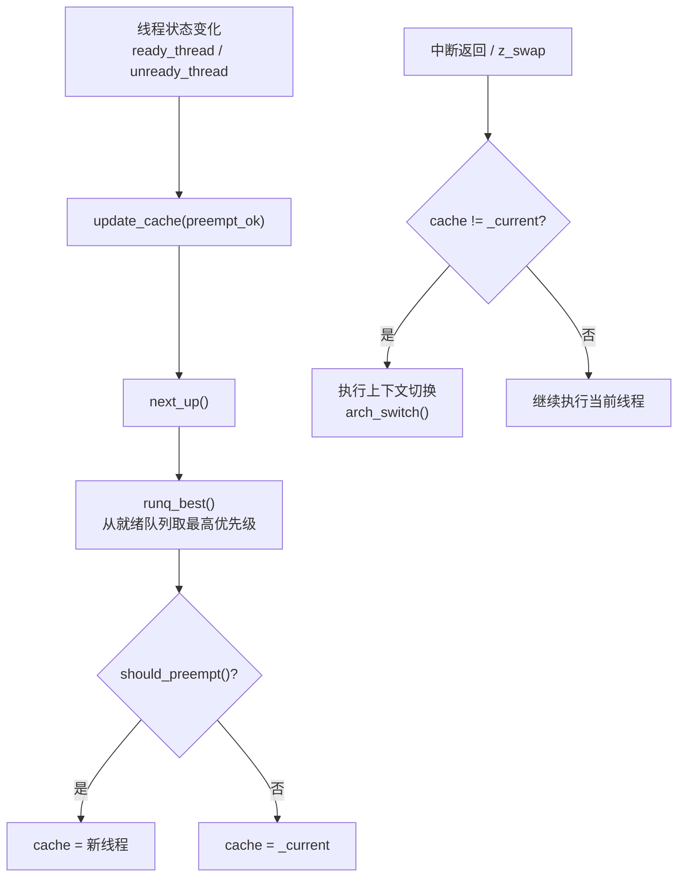
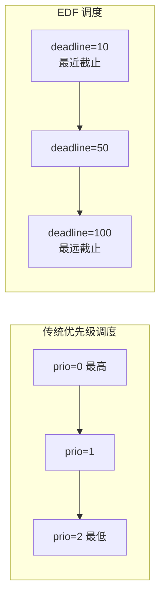
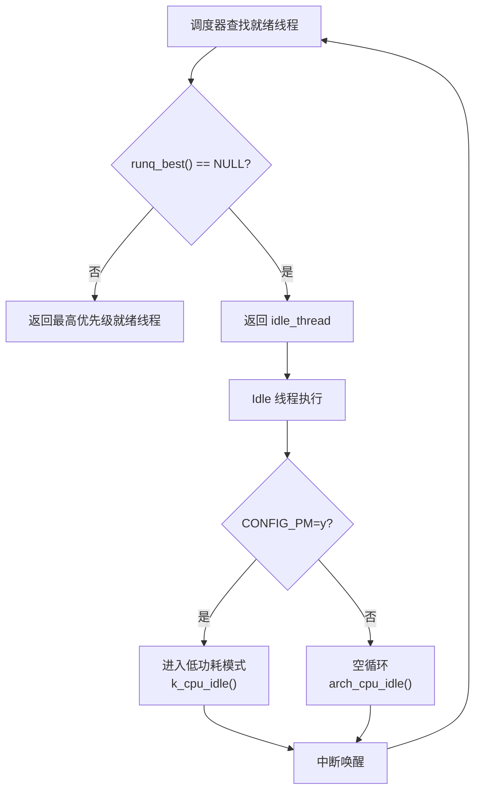

# Zephyr RTOS 调度策略深度解析

> 返回：[入门概览](./00_入门概览.md) | [文档导航](../README.md)

---

## 目录
1. [调度器概述](#1-调度器概述)
2. [调度算法原理](#2-调度算法原理)
3. [优先级机制](#3-优先级机制)
4. [时间片管理](#4-时间片管理)
5. [抢占规则](#5-抢占规则)
6. [调度器数据结构](#6-调度器数据结构)
7. [调度器核心实现](#7-调度器核心实现)
8. [SMP多核调度](#8-smp多核调度)
9. [与其他RTOS对比](#9-与其他rtos对比)

---

## 1. 调度器概述

### 1.1 调度器的角色

调度器是RTOS的核心组件，负责决定哪个线程在何时获得CPU使用权。Zephyr的调度器代码位于 [kernel/sched.c](file:///home/pbw/cs-learning-notes/zephyr-src/kernel/sched.c)。

```
┌─────────────────────────────────────────────────────────────────────────────┐
│                           调度器在内核中的位置                               │
├─────────────────────────────────────────────────────────────────────────────┤
│                                                                             │
│   ┌─────────────────────────────────────────────────────────────────────┐   │
│   │                        应用层线程                                    │   │
│   │   Thread A (prio=0)  Thread B (prio=5)  Thread C (prio=10)         │   │
│   └───────────────────────────────┬─────────────────────────────────────┘   │
│                                   │                                         │
│                                   │ 线程就绪/阻塞                           │
│                                   ▼                                         │
│   ┌─────────────────────────────────────────────────────────────────────┐   │
│   │                          调度器 (Scheduler)                          │   │
│   │                                                                     │   │
│   │   ┌─────────────┐  ┌─────────────┐  ┌─────────────┐               │   │
│   │   │ 优先级比较  │  │ 线程选择    │  │ 上下文切换  │               │   │
│   │   └─────────────┘  └─────────────┘  └─────────────┘               │   │
│   │                                                                     │   │
│   │   输入：就绪队列、当前线程、调度策略                                │   │
│   │   输出：下一个要运行的线程                                          │   │
│   └───────────────────────────────┬─────────────────────────────────────┘   │
│                                   │                                         │
│                                   │ 上下文切换                              │
│                                   ▼                                         │
│   ┌─────────────────────────────────────────────────────────────────────┐   │
│   │                          CPU 执行                                   │   │
│   └─────────────────────────────────────────────────────────────────────┘   │
│                                                                             │
└─────────────────────────────────────────────────────────────────────────────┘
```

### 1.2 调度器设计目标

| 设计目标 | 实现方式 | 源码体现 |
|---------|---------|---------|
| **确定性** | O(1) 或 O(log n) 操作 | 多种就绪队列算法可选 |
| **低延迟** | 快速上下文切换 | 架构优化的 `arch_switch()` |
| **可配置** | 编译时选择调度算法 | Kconfig 配置选项 |
| **可扩展** | 支持多核 SMP | `CONFIG_SMP` 配置 |

### 1.3 调度器配置选项

```kconfig
# 协作式优先级数量
config NUM_COOP_PRIORITIES
    int "Number of coop priorities"
    default 16
    range 0 128

# 抢占式优先级数量
config NUM_PREEMPT_PRIORITIES
    int "Number of preemptible priorities"
    default 15
    range 0 127

# 调度算法选择
choice SCHED_ALGORITHM
    prompt "Scheduler priority queue algorithm"
    default SCHED_SIMPLE

config SCHED_SIMPLE
    bool "Simple linked-list ready queue"

config SCHED_SCALABLE
    bool "Red/black tree ready queue"

config SCHED_MULTIQ
    bool "Traditional multi-queue ready queue"
```

---

## 2. 调度算法原理

### 2.1 调度策略分类

Zephyr 支持四种主要的调度策略：

```
┌─────────────────────────────────────────────────────────────────────────────┐
│                           Zephyr 调度策略分类                                │
├─────────────────────────────────────────────────────────────────────────────┤
│                                                                             │
│  ┌───────────────────────────────────────────────────────────────────────┐ │
│  │                     协作式调度 (Cooperative)                          │ │
│  │                                                                       │ │
│  │   特点：线程主动让出 CPU，不会被抢占                                   │ │
│  │   优先级：负数 (K_PRIO_COOP(n))                                       │ │
│  │   适用：实时性要求高、执行时间可预测的任务                             │ │
│  │   让出方式：k_yield(), k_sleep(), 等待同步对象                        │ │
│  └───────────────────────────────────────────────────────────────────────┘ │
│                                                                             │
│  ┌───────────────────────────────────────────────────────────────────────┐ │
│  │                     抢占式调度 (Preemptive)                           │ │
│  │                                                                       │ │
│  │   特点：高优先级线程可抢占低优先级线程                                 │ │
│  │   优先级：非负数 (K_PRIO_PREEMPT(n))                                  │ │
│  │   适用：响应速度要求高的场景                                          │ │
│  │   注意：需要保护共享资源                                              │ │
│  └───────────────────────────────────────────────────────────────────────┘ │
│                                                                             │
│  ┌───────────────────────────────────────────────────────────────────────┐ │
│  │                     时间片轮转 (Time Slicing)                         │ │
│  │                                                                       │ │
│  │   特点：同优先级线程轮流执行                                          │ │
│  │   配置：CONFIG_TIMESLICING=y                                          │ │
│  │   适用：需要公平调度的场景                                            │ │
│  │   注意：仅影响同优先级的抢占式线程                                    │ │
│  └───────────────────────────────────────────────────────────────────────┘ │
│                                                                             │
│  ┌───────────────────────────────────────────────────────────────────────┐ │
│  │                  最早截止时间优先 (EDF)                               │ │
│  │                                                                       │ │
│  │   特点：根据截止时间调度，截止时间最近的任务优先                      │ │
│  │   配置：CONFIG_SCHED_DEADLINE=y                                       │ │
│  │   适用：周期性实时任务                                                │ │
│  │   API：k_thread_deadline_set()                                        │ │
│  └───────────────────────────────────────────────────────────────────────┘ │
│                                                                             │
└─────────────────────────────────────────────────────────────────────────────┘
```

### 2.2 协作式调度详解

#### 2.2.1 工作原理

协作式线程一旦获得CPU，将一直运行直到：
1. 主动调用 `k_yield()` 让出CPU
2. 调用 `k_sleep()` 进入睡眠
3. 等待同步对象（信号量、互斥锁等）
4. 线程终止

#### 2.2.2 源码分析

```c
// 判断线程是否为协作式
static inline bool thread_is_preemptible(struct k_thread *thread)
{
    // 协作式线程优先级为负数
    return thread->base.prio >= 0;
}

// 协作式线程让出CPU
void k_yield(void)
{
    __ASSERT(!arch_is_in_isr(), "");
    
    K_SPINLOCK(&_sched_spinlock) {
        // 将当前线程移到同优先级队列末尾
        move_current_to_end_of_prio_q();
    }
}
```

#### 2.2.3 使用示例

```c
#include <zephyr/kernel.h>

#define STACK_SIZE 1024
K_THREAD_STACK_DEFINE(coop_stack, STACK_SIZE);
struct k_thread coop_thread_data;

void cooperative_thread(void *p1, void *p2, void *p3)
{
    while (1) {
        process_critical_section();
        
        k_yield();
    }
}

K_THREAD_DEFINE(coop_tid, STACK_SIZE,
                cooperative_thread, NULL, NULL, NULL,
                K_PRIO_COOP(0),  // 协作式优先级
                0, 0);
```

### 2.3 抢占式调度详解

#### 2.3.1 工作原理

抢占式调度遵循以下规则：
1. 高优先级线程就绪时，立即抢占低优先级线程
2. 被抢占的线程保存上下文，进入就绪队列
3. 当高优先级线程阻塞后，恢复执行被抢占的线程

#### 2.3.2 抢占判断源码

```c
// sched.c 中的抢占判断
static inline bool should_preempt(struct k_thread *thread, int preempt_ok)
{
    // ISR 中不允许抢占
    if (arch_is_in_isr()) {
        return false;
    }

    // 当前线程是协作式且未主动让出
    if (!thread_is_preemptible(_current) && !preempt_ok) {
        return false;
    }

    // 新线程优先级更高
    if (z_sched_prio_cmp(thread, _current) < 0) {
        return true;
    }

    // 同优先级且当前线程已让出
    if (z_sched_prio_cmp(thread, _current) == 0 && preempt_ok) {
        return true;
    }

    return false;
}
```

#### 2.3.3 抢占时机

```
┌─────────────────────────────────────────────────────────────────────────────┐
│                           抢占式调度抢占时机                                 │
├─────────────────────────────────────────────────────────────────────────────┤
│                                                                             │
│   时间轴                                                                    │
│   ─────────────────────────────────────────────────────────────────────►   │
│                                                                             │
│   Thread A (prio=5) 运行中                                                 │
│   ├─────────────────────────────┤                                          │
│   │                             │                                          │
│   │         被抢占              │                                          │
│   │                             ▼                                          │
│   │                    Thread B (prio=0) 就绪                              │
│   │                    ├───────────────────┤                               │
│   │                    │                   │                               │
│   │                    │    高优先级执行   │                               │
│   │                    │                   │                               │
│   │                    └───────────────────┘                               │
│   │                             │                                          │
│   │                    Thread B 阻塞                                        │
│   │                             ▼                                          │
│   ├─────────────────────────────────────────┤                              │
│   │                                         │                              │
│   │              Thread A 恢复执行           │                              │
│   │                                         │                              │
│   └─────────────────────────────────────────┘                              │
│                                                                             │
│   抢占触发条件：                                                            │
│   1. 高优先级线程被创建并启动                                               │
│   2. 高优先级线程从阻塞状态恢复                                             │
│   3. 中断处理程序唤醒高优先级线程                                           │
│   4. 信号量/互斥锁释放唤醒高优先级线程                                      │
│                                                                             │
└─────────────────────────────────────────────────────────────────────────────┘
```

### 2.4 时间片轮转详解

#### 2.4.1 配置选项

```kconfig
config TIMESLICING
    bool "Enable time slicing"
    default y

config TIMESLICE_SIZE
    int "Time slice size (in milliseconds)"
    default 0
    depends on TIMESLICING
    help
        Length of time slice in milliseconds. A value of 0 means
        no time slicing.

config TIMESLICE_PRIORITY
    int "Time slicing priority threshold"
    default 0
    depends on TIMESLICING
    help
        Threads with priority equal to or greater than this value
        participate in time slicing.
```

#### 2.4.2 时间片实现原理

```c
// 时间片重置（sched.c）
void z_reset_time_slice(struct k_thread *thread)
{
#ifdef CONFIG_TIMESLICING
    int32_t slice = CONFIG_TIMESLICE_SIZE;
    
    if (slice <= 0 || thread->base.prio < CONFIG_TIMESLICE_PRIORITY) {
        return;
    }
    
    // 设置时间片超时
    sys_clock_timeout_end_calc(slice);
#endif
}

// 时间片到期处理
void z_time_slice(void)
{
#ifdef CONFIG_TIMESLICING
    K_SPINLOCK(&_sched_spinlock) {
        // 将当前线程移到队列末尾
        move_current_to_end_of_prio_q();
    }
#endif
}
```

#### 2.4.3 时间片调度示意

```
┌─────────────────────────────────────────────────────────────────────────────┐
│                           时间片轮转调度示意                                 │
├─────────────────────────────────────────────────────────────────────────────┤
│                                                                             │
│   同优先级线程队列 (prio=5):                                                │
│   ┌─────────┐    ┌─────────┐    ┌─────────┐                               │
│   │ Thread A│───►│ Thread B│───►│ Thread C│                               │
│   └─────────┘    └─────────┘    └─────────┘                               │
│                                                                             │
│   时间片大小: 10ms                                                          │
│                                                                             │
│   时间轴:                                                                   │
│   ─────────────────────────────────────────────────────────────────────►   │
│                                                                             │
│   │◄─ 10ms ─►│◄─ 10ms ─►│◄─ 10ms ─►│◄─ 10ms ─►│◄─ 10ms ─►│               │
│   ├──────────┼──────────┼──────────┼──────────┼──────────┤               │
│   │ Thread A │ Thread B │ Thread C │ Thread A │ Thread B │               │
│   ├──────────┼──────────┼──────────┼──────────┼──────────┤               │
│   │ 执行中   │ 执行中   │ 执行中   │ 执行中   │ 执行中   │               │
│                                                                             │
│   注意事项：                                                                │
│   1. 仅影响同优先级的抢占式线程                                             │
│   2. 协作式线程不参与时间片轮转                                             │
│   3. 线程阻塞后重新排队到队尾                                               │
│                                                                             │
└─────────────────────────────────────────────────────────────────────────────┘
```

### 2.5 EDF调度详解

#### 2.5.1 原理说明

最早截止时间优先（Earliest Deadline First, EDF）是一种动态优先级调度算法：
- 每个线程设置一个截止时间（deadline）
- 调度器选择截止时间最近的线程执行
- 截止时间可以动态更新

#### 2.5.2 API 接口

```c
// 设置线程截止时间
void k_thread_deadline_set(k_tid_t thread, int deadline);

// 示例：设置周期性任务的截止时间
void periodic_task(void *p1, void *p2, void *p3)
{
    int period = *(int *)p1;
    int next_deadline = k_cycle_get_32() + period;
    
    while (1) {
        k_thread_deadline_set(k_current_get(), next_deadline);
        
        do_periodic_work();
        
        next_deadline += period;
        k_sleep(K_MSEC(period));
    }
}
```

---

## 3. 优先级机制

### 3.1 优先级定义

Zephyr 使用**数值越小优先级越高**的规则：

```c
// 优先级宏定义
#define K_PRIO_COOP(x)   (-(x) - 1)    // 协作式优先级（负数）
#define K_PRIO_PREEMPT(x) (x)          // 抢占式优先级（非负数）

// 优先级范围
// 协作式: -CONFIG_NUM_COOP_PRIORITIES 到 -1
// 抢占式: 0 到 CONFIG_NUM_PREEMPT_PRIORITIES - 1
// 空闲线程: K_LOWEST_THREAD_PRIO (最低优先级)
```

### 3.2 优先级分布图

```
┌─────────────────────────────────────────────────────────────────────────────┐
│                           Zephyr 优先级分布                                  │
├─────────────────────────────────────────────────────────────────────────────┤
│                                                                             │
│   优先级数值        线程类型              特性                              │
│                                                                             │
│   ─────────────────────────────────────────────────────────────────────    │
│                                                                             │
│   -16 ~ -1         协作式线程            不会被抢占，必须主动让出          │
│   (K_PRIO_COOP)    (Cooperative)                                              │
│                                                                             │
│   ─────────────────────────────────────────────────────────────────────    │
│                                                                             │
│   0                最高抢占优先级        可被协作式线程抢占                │
│   │                                                                          │
│   │                抢占式线程            可被更高优先级抢占                │
│   │                (Preemptive)          参与时间片轮转                    │
│   ▼                                                                          │
│   14                                                                     │
│                                                                             │
│   ─────────────────────────────────────────────────────────────────────    │
│                                                                             │
│   15               空闲线程              系统空闲时运行                    │
│   (K_LOWEST_       (Idle Thread)        优先级最低                        │
│    THREAD_PRIO)                                                             │
│                                                                             │
│   ─────────────────────────────────────────────────────────────────────    │
│                                                                             │
│   数值越小 ─────────────────────────────────────────────► 数值越大         │
│   优先级越高                                           优先级越低           │
│                                                                             │
└─────────────────────────────────────────────────────────────────────────────┘
```

### 3.3 MetaIRQ 优先级

MetaIRQ 是一种特殊的协作式线程，具有"中断下半部"的特性：

```kconfig
config NUM_METAIRQ_PRIORITIES
    int "Number of very-high priority 'preemptor' threads"
    default 0
    help
        MetaIRQ 线程可以抢占任何线程，包括协作式线程。
        用于实现中断下半部（bottom half）处理。
```

#### MetaIRQ 特性

```c
// MetaIRQ 判断
static inline bool thread_is_metairq(struct k_thread *thread)
{
#if (CONFIG_NUM_METAIRQ_PRIORITIES > 0)
    return thread->base.prio < -CONFIG_NUM_COOP_PRIORITIES;
#else
    return false;
#endif
}

// MetaIRQ 抢占处理
static void update_metairq_preempt(struct k_thread *thread)
{
#if (CONFIG_NUM_METAIRQ_PRIORITIES > 0)
    if (thread_is_metairq(thread) && !thread_is_metairq(_current) &&
        !thread_is_preemptible(_current)) {
        // 记录被 MetaIRQ 抢占的协作式线程
        _current_cpu->metairq_preempted = _current;
    }
#endif
}
```

### 3.4 优先级操作 API

```c
// 获取线程优先级
int k_thread_priority_get(k_tid_t thread);

// 设置线程优先级
void k_thread_priority_set(k_tid_t thread, int prio);

// 使用示例
void adjust_thread_priority(void)
{
    k_tid_t tid = k_current_get();
    int current_prio = k_thread_priority_get(tid);
    
    // 提升优先级
    if (current_prio > 0) {
        k_thread_priority_set(tid, current_prio - 1);
    }
}
```

---

## 4. 时间片管理

### 4.1 时间片配置

```c
// prj.conf 配置
CONFIG_TIMESLICING=y
CONFIG_TIMESLICE_SIZE=5000      // 5ms 时间片
CONFIG_TIMESLICE_PRIORITY=0     // 所有抢占式线程参与时间片
```

### 4.2 时间片实现机制

```c
// 时间片数据结构
struct _cpu {
    // ...
    #ifdef CONFIG_TIMESLICING
    int32_t time_slice_remaining;  // 剩余时间片
    #endif
    // ...
};

// 时间片到期检查（在时钟中断中调用）
void z_check_time_slice(void)
{
#ifdef CONFIG_TIMESLICING
    if (_current_cpu->time_slice_remaining <= 0) {
        // 时间片用完，触发调度
        z_time_slice();
    }
#endif
}
```

### 4.3 时间片与调度器交互

```
┌─────────────────────────────────────────────────────────────────────────────┐
│                           时间片管理流程                                     │
├─────────────────────────────────────────────────────────────────────────────┤
│                                                                             │
│   ┌─────────────────┐                                                       │
│   │  时钟中断发生    │                                                       │
│   └────────┬────────┘                                                       │
│            │                                                                │
│            ▼                                                                │
│   ┌─────────────────┐                                                       │
│   │ 减少时间片计数   │                                                       │
│   │ time_slice--    │                                                       │
│   └────────┬────────┘                                                       │
│            │                                                                │
│            ▼                                                                │
│   ┌─────────────────┐     否     ┌─────────────────┐                       │
│   │ 时间片用完？     │──────────►│ 继续执行当前线程 │                       │
│   └────────┬────────┘            └─────────────────┘                       │
│            │ 是                                                             │
│            ▼                                                                │
│   ┌─────────────────┐                                                       │
│   │ 重置时间片计数   │                                                       │
│   └────────┬────────┘                                                       │
│            │                                                                │
│            ▼                                                                │
│   ┌─────────────────┐                                                       │
│   │ 当前线程移到     │                                                       │
│   │ 队列末尾        │                                                       │
│   └────────┬────────┘                                                       │
│            │                                                                │
│            ▼                                                                │
│   ┌─────────────────┐                                                       │
│   │ 触发调度        │                                                       │
│   │ z_reschedule()  │                                                       │
│   └─────────────────┘                                                       │
│                                                                             │
└─────────────────────────────────────────────────────────────────────────────┘
```

---

## 5. 抢占规则

### 5.1 抢占条件判断

```c
// 完整的抢占判断逻辑
static inline bool should_preempt(struct k_thread *thread, int preempt_ok)
{
    // 1. ISR 中不允许抢占式调度决策
    if (arch_is_in_isr()) {
        return false;
    }

    // 2. 协作式线程只能被 MetaIRQ 抢占
    if (!thread_is_preemptible(_current)) {
        #if (CONFIG_NUM_METAIRQ_PRIORITIES > 0)
        return thread_is_metairq(thread);
        #else
        return preempt_ok;  // 仅当协作式线程主动让出时
        #endif
    }

    // 3. 调度器被锁定时不抢占
    if (_current_cpu->sched_lock > 0) {
        return false;
    }

    // 4. 比较优先级
    int cmp = z_sched_prio_cmp(thread, _current);
    
    if (cmp < 0) {
        // 新线程优先级更高，需要抢占
        return true;
    }
    
    if (cmp == 0 && preempt_ok) {
        // 同优先级但当前线程已让出
        return true;
    }

    return false;
}
```

### 5.2 抢占规则矩阵

```
┌─────────────────────────────────────────────────────────────────────────────┐
│                           抢占规则矩阵                                       │
├─────────────────────────────────────────────────────────────────────────────┤
│                                                                             │
│   当前线程类型     新线程类型        是否抢占           条件                 │
│   ─────────────────────────────────────────────────────────────────────    │
│   协作式           协作式            否                 协作式不能被抢占     │
│   协作式           抢占式            否                 协作式不能被抢占     │
│   协作式           MetaIRQ           是                 MetaIRQ 可抢占所有  │
│   协作式           (主动让出)        是                 k_yield() 后       │
│                                                                             │
│   抢占式           协作式            是                 协作式优先级更高    │
│   抢占式           抢占式(高优先级)  是                 高优先级抢占       │
│   抢占式           抢占式(同优先级)  否                 需要时间片或让出   │
│   抢占式           抢占式(低优先级)  否                 低优先级不能抢占   │
│   抢占式           MetaIRQ           是                 MetaIRQ 可抢占所有  │
│                                                                             │
│   MetaIRQ          协作式            否                 MetaIRQ 优先级最高  │
│   MetaIRQ          抢占式            否                 MetaIRQ 优先级最高  │
│   MetaIRQ          MetaIRQ(更高)     是                 更高优先级 MetaIRQ │
│                                                                             │
└─────────────────────────────────────────────────────────────────────────────┘
```

### 5.3 调度器锁定

```c
// 锁定调度器，禁止抢占
void k_sched_lock(void)
{
    _current_cpu->sched_lock++;
}

// 解锁调度器
void k_sched_unlock(void)
{
    _current_cpu->sched_lock--;
    
    // 解锁后检查是否需要调度
    if (_current_cpu->sched_lock == 0) {
        z_reschedule_unlocked();
    }
}

// 使用示例
void critical_section(void)
{
    k_sched_lock();
    
    // 临界区代码，不会被抢占
    access_shared_resource();
    
    k_sched_unlock();
}
```

---

## 6. 调度器数据结构

### 6.1 就绪队列结构

```c
// 就绪队列定义
struct _ready_q {
    struct k_thread *cache;     // 缓存最高优先级线程
    
#if defined(CONFIG_SCHED_DUMB)
    sys_dlist_t runq;           // 简单双向链表
#elif defined(CONFIG_SCHED_SCALABLE)
    struct _priq_rb runq;       // 红黑树
#elif defined(CONFIG_SCHED_MULTIQ)
    struct _priq_mq runq;       // 多队列
#endif
};
```

### 6.2 三种就绪队列实现对比

```
┌─────────────────────────────────────────────────────────────────────────────┐
│                        就绪队列实现对比                                      │
├─────────────────────────────────────────────────────────────────────────────┤
│                                                                             │
│   ┌─────────────────────────────────────────────────────────────────────┐ │
│   │                    SCHED_SIMPLE (简单链表)                          │ │
│   │                                                                     │ │
│   │   结构：单个双向链表                                                │ │
│   │   插入：O(n)                                                        │ │
│   │   删除：O(1)                                                        │ │
│   │   查找最高优先级：O(n)                                              │ │
│   │   内存占用：最小                                                    │ │
│   │   适用场景：线程数量少（< 10）                                      │ │
│   │                                                                     │ │
│   │   ┌─────┐   ┌─────┐   ┌─────┐   ┌─────┐                           │ │
│   │   │ T1  │──►│ T2  │──►│ T3  │──►│ T4  │                           │ │
│   │   └─────┘   └─────┘   └─────┘   └─────┘                           │ │
│   └─────────────────────────────────────────────────────────────────────┘ │
│                                                                             │
│   ┌─────────────────────────────────────────────────────────────────────┐ │
│   │                    SCHED_SCALABLE (红黑树)                          │ │
│   │                                                                     │ │
│   │   结构：红黑树                                                      │ │
│   │   插入：O(log n)                                                    │ │
│   │   删除：O(log n)                                                    │ │
│   │   查找最高优先级：O(1)                                              │ │
│   │   内存占用：较大（~2KB 额外代码）                                   │ │
│   │   适用场景：线程数量多（> 20）                                      │ │
│   │                                                                     │ │
│   │           ┌─────┐                                                   │ │
│   │           │ T3  │                                                   │ │
│   │           └──┬──┘                                                   │ │
│   │         ┌────┴────┐                                                 │ │
│   │      ┌──┴──┐   ┌──┴──┐                                              │ │
│   │      │ T1  │   │ T5  │                                              │ │
│   │      └──┬──┘   └──┬──┘                                              │ │
│   │         │      ┌──┴──┐                                              │ │
│   │      ┌──┴──┐   │ T6  │                                              │ │
│   │      │ T2  │   └─────┘                                              │ │
│   │      └─────┘                                                        │ │
│   └─────────────────────────────────────────────────────────────────────┘ │
│                                                                             │
│   ┌─────────────────────────────────────────────────────────────────────┐ │
│   │                    SCHED_MULTIQ (多队列)                            │ │
│   │                                                                     │ │
│   │   结构：每个优先级一个链表                                          │ │
│   │   插入：O(1)                                                        │ │
│   │   删除：O(1)                                                        │ │
│   │   查找最高优先级：O(1)                                              │ │
│   │   内存占用：中等（需要 N 个链表头）                                 │ │
│   │   适用场景：传统 RTOS 应用                                          │ │
│   │                                                                     │ │
│   │   prio 0:  ┌─────┐                                                  │ │
│   │            │ T1  │                                                  │ │
│   │            └─────┘                                                  │ │
│   │   prio 1:  ┌─────┐   ┌─────┐                                        │ │
│   │            │ T2  │──►│ T3  │                                        │ │
│   │            └─────┘   └─────┘                                        │ │
│   │   prio 2:  (空)                                                     │ │
│   │   prio 3:  ┌─────┐                                                  │ │
│   │            │ T4  │                                                  │ │
│   │            └─────┘                                                  │ │
│   └─────────────────────────────────────────────────────────────────────┘ │
│                                                                             │
└─────────────────────────────────────────────────────────────────────────────┘
```

### 6.3 优先级队列操作

```c
// 添加线程到就绪队列
static ALWAYS_INLINE void runq_add(struct k_thread *thread)
{
    _priq_run_add(thread_runq(thread), thread);
}

// 从就绪队列移除线程
static ALWAYS_INLINE void runq_remove(struct k_thread *thread)
{
    _priq_run_remove(thread_runq(thread), thread);
}

// 获取最高优先级线程
static ALWAYS_INLINE struct k_thread *runq_best(void)
{
    return _priq_run_best(curr_cpu_runq());
}

// 让出（移到同优先级末尾）
static ALWAYS_INLINE void runq_yield(void)
{
    _priq_run_yield(curr_cpu_runq());
}
```

---

## 7. 调度器核心实现

### 7.0 调度缓存（Cache）机制

> ⚠️ `update_cache()` 和 `next_up()` 是调度器最核心的函数，理解它们对理解调度行为至关重要。源码位于 [kernel/sched.c](file:///home/pbw/cs-learning-notes/zephyr-src/kernel/sched.c)。

**调度缓存的设计目的**：避免每次中断返回时都遍历就绪队列查找最高优先级线程，通过缓存机制将调度决策延迟到真正需要时。



**`next_up()` 源码分析**：

```c
// kernel/sched.c（简化）
static ALWAYS_INLINE struct k_thread *next_up(void)
{
    struct k_thread *thread = runq_best();

#if (CONFIG_NUM_METAIRQ_PRIORITIES > 0)
    // MetaIRQ 优先返回被抢占的协作式线程
    struct k_thread *mirqp = _current_cpu->metairq_preempted;
    if (mirqp != NULL && (thread == NULL || !thread_is_metairq(thread))) {
        if (z_is_thread_ready(mirqp)) {
            thread = mirqp;
        } else {
            _current_cpu->metairq_preempted = NULL;
        }
    }
#endif

#ifndef CONFIG_SMP
    // 单核：当前线程仍在队列中，直接返回最佳线程或 idle
    return (thread != NULL) ? thread : _current_cpu->idle_thread;
#else
    // SMP：需要比较当前线程和新线程的优先级
    bool queued = z_is_thread_queued(_current);
    bool active = z_is_thread_ready(_current);

    if (thread == NULL) {
        thread = _current_cpu->idle_thread;
    }

    if (active) {
        int32_t cmp = z_sched_prio_cmp(_current, thread);
        if ((cmp > 0) || ((cmp == 0) && !_current_cpu->swap_ok)) {
            thread = _current;
        }
        if (!should_preempt(thread, _current_cpu->swap_ok)) {
            thread = _current;
        }
    }
    // ...
    return thread;
#endif
}
```

**`update_cache()` 源码分析**：

```c
static ALWAYS_INLINE void update_cache(int preempt_ok)
{
#ifndef CONFIG_SMP
    struct k_thread *thread = next_up();

    if (should_preempt(thread, preempt_ok)) {
        _kernel.ready_q.cache = thread;
    } else {
        _kernel.ready_q.cache = _current;
    }
#else
    _current_cpu->swap_ok = preempt_ok;
#endif
}
```

| 模式 | 缓存位置 | 更新时机 | 说明 |
|-----|---------|---------|------|
| 单核 | `_kernel.ready_q.cache` | 每次 `update_cache()` | 直接缓存下一个要运行的线程 |
| SMP | `_current_cpu->swap_ok` | 每次 `update_cache()` | 不缓存线程，只记录是否可抢占 |

### 7.0.1 EDF（最早截止时间优先）调度

> ⚠️ EDF 是 Zephyr 可选的调度策略，通过 `CONFIG_SCHED_DEADLINE` 启用。

**EDF 原理**：每个线程设置一个截止时间（deadline），调度器优先选择截止时间最近的线程执行。

```c
// 设置线程截止时间
int k_thread_deadline_set(k_tid_t thread, int deadline);

// _thread_base 中的 EDF 字段
#ifdef CONFIG_SCHED_DEADLINE
    int prio_deadline;  // 截止时间（相对值，tick 数）
#endif
```

**EDF 与优先级的关系**：



| 特性 | 优先级调度 | EDF 调度 |
|-----|----------|---------|
| 调度依据 | 静态优先级 | 动态截止时间 |
| 最优性 | 次优（速率单调） | 最优（CPU 利用率 100%） |
| 实现复杂度 | 低 | 中 |
| 适用场景 | 固定优先级任务 | 周期性实时任务 |
| 饥饿问题 | 低优先级可能饥饿 | 不会（截止时间动态变化） |

**EDF 在 Zephyr 中的实现**：

> ⚠️ **重要**：Zephyr 的 EDF 与传统 EDF 不同。传统 EDF 是完全动态优先级——截止时间就是调度的唯一依据，不设静态优先级。但 Zephyr 的 EDF **不替代优先级**，而是在**同优先级线程之间**用 deadline 排序。即：优先级高的线程永远先于优先级低的线程运行，deadline 只在多个同优先级线程之间起作用。`prio_deadline` 越小越优先执行。

### 7.0.2 Idle 线程

> ⚠️ Idle 线程是系统中优先级最低的线程，当没有其他线程就绪时运行。

**Idle 线程的特性**：

```c
// kernel/sched.c - Idle 线程相关
// 每个 CPU 一个 Idle 线程（SMP 时）
// _cpu 结构中的 idle_thread 指针

// Idle 线程的优先级 = K_LOWEST_THREAD_PRIO（最低）
// Idle 线程标志 = K_ESSENTIAL（不可中止）+ K_IDLE
```



| 特性 | 说明 |
|-----|------|
| 优先级 | `K_LOWEST_THREAD_PRIO`（数值最大） |
| 数量 | 单核 1 个，SMP 每个 CPU 1 个 |
| 栈大小 | `CONFIG_IDLE_STACK_SIZE`（通常很小） |
| 不可中止 | 标记为 `K_ESSENTIAL` |
| PM 集成 | 可进入低功耗模式 |
| 不入就绪队列 | `is_idle = true`，特殊处理 |

### 7.1 线程就绪处理

```c
// 将线程标记为就绪
static void ready_thread(struct k_thread *thread)
{
    // 检查线程是否已在队列中
    if (!z_is_thread_queued(thread) && z_is_thread_ready(thread)) {
        // 加入就绪队列
        queue_thread(thread);
        
        // 更新调度缓存
        update_cache(0);
        
        // SMP: 发送 IPI 通知其他 CPU
        flag_ipi(ipi_mask_create(thread));
    }
}

// 公共 API
void z_ready_thread(struct k_thread *thread)
{
    K_SPINLOCK(&_sched_spinlock) {
        if (thread_active_elsewhere(thread) == NULL) {
            ready_thread(thread);
        }
    }
}
```

### 7.2 线程阻塞处理

```c
// 将当前线程阻塞
int z_pend_curr(struct k_spinlock *lock, k_spinlock_key_t key,
               _wait_q_t *wait_q, k_timeout_t timeout)
{
    // 将当前线程加入等待队列
    pend_locked(_current, wait_q, timeout);
    
    // 释放锁并触发上下文切换
    k_spin_release(lock);
    return z_swap(&_sched_spinlock, key);
}

// 添加到等待队列
static void add_to_waitq_locked(struct k_thread *thread, _wait_q_t *wait_q)
{
    // 从就绪队列移除
    unready_thread(thread);
    
    // 标记为等待状态
    z_mark_thread_as_pending(thread);
    
    // 加入等待队列
    if (wait_q != NULL) {
        thread->base.pended_on = wait_q;
        _priq_wait_add(&wait_q->waitq, thread);
    }
}
```

### 7.3 线程唤醒处理

```c
// 唤醒线程
void z_sched_wake_thread_locked(struct k_thread *thread)
{
    bool killed = (thread->base.thread_state &
            (_THREAD_DEAD | _THREAD_ABORTING));

    if (!killed) {
        // 从等待队列移除
        if (thread->base.pended_on != NULL) {
            unpend_thread_no_timeout(thread);
        }
        
        // 清除睡眠状态
        z_mark_thread_as_not_sleeping(thread);
        
        // 加入就绪队列
        ready_thread(thread);
    }
}
```

### 7.4 调度点

```
┌─────────────────────────────────────────────────────────────────────────────┐
│                           调度点（Scheduling Points）                        │
├─────────────────────────────────────────────────────────────────────────────┤
│                                                                             │
│   调度点是指可能触发调度器运行的时机：                                       │
│                                                                             │
│   1. 线程创建/启动                                                          │
│      └── k_thread_create() / k_thread_start()                              │
│                                                                             │
│   2. 线程主动让出                                                           │
│      └── k_yield() / k_sleep() / k_msleep()                                │
│                                                                             │
│   3. 同步对象操作                                                           │
│      ├── k_sem_take() - 获取信号量失败时阻塞                                │
│      ├── k_mutex_lock() - 获取互斥锁失败时阻塞                              │
│      ├── k_queue_get() - 从空队列获取时阻塞                                 │
│      └── k_condvar_wait() - 等待条件变量                                    │
│                                                                             │
│   4. 同步对象释放                                                           │
│      ├── k_sem_give() - 可能唤醒高优先级线程                                │
│      ├── k_mutex_unlock() - 可能唤醒高优先级线程                            │
│      └── k_queue_put() - 唤醒等待线程                                       │
│                                                                             │
│   5. 中断处理结束                                                           │
│      └── 中断返回时检查是否需要调度                                         │
│                                                                             │
│   6. 时间片到期                                                             │
│      └── 时钟中断处理中触发                                                 │
│                                                                             │
│   7. 线程终止/挂起                                                          │
│      └── k_thread_abort() / k_thread_suspend()                             │
│                                                                             │
│   8. 优先级变更                                                             │
│      └── k_thread_priority_set()                                           │
│                                                                             │
│   9. 调度器解锁                                                             │
│      └── k_sched_unlock()                                                  │
│                                                                             │
└─────────────────────────────────────────────────────────────────────────────┘
```

---

## 8. SMP多核调度

### 8.1 SMP 配置

```kconfig
config SMP
    bool "Enable SMP"
    help
        Enable symmetric multiprocessing support.

config MP_MAX_NUM_CPUS
    int "Maximum number of CPUs"
    default 1
    depends on SMP
    help
        Maximum number of CPUs that can be used.
```

### 8.2 SMP 调度特点

```c
// SMP 模式下的调度决策
static ALWAYS_INLINE struct k_thread *next_up(void)
{
#ifdef CONFIG_SMP
    // 处理正在中止的线程
    if (z_is_thread_halting(_current)) {
        halt_thread(_current, z_is_thread_aborting(_current) ?
                              _THREAD_DEAD : _THREAD_SUSPENDED);
    }
#endif

    struct k_thread *thread = runq_best();

#ifdef CONFIG_SMP
    bool queued = z_is_thread_queued(_current);
    bool active = z_is_thread_ready(_current);

    if (thread == NULL) {
        thread = _current_cpu->idle_thread;
    }

    if (active) {
        int32_t cmp = z_sched_prio_cmp(_current, thread);

        // 优先级相同时，只有当前线程让出才切换
        if ((cmp > 0) || ((cmp == 0) && !_current_cpu->swap_ok)) {
            thread = _current;
        }

        if (!should_preempt(thread, _current_cpu->swap_ok)) {
            thread = _current;
        }
    }

    // 将当前线程放回队列
    if (thread != _current && active && !queued) {
        queue_thread(_current);
    }

    // 从队列中移除新线程
    if (z_is_thread_queued(thread)) {
        dequeue_thread(thread);
    }

    _current_cpu->swap_ok = false;
    return thread;
#else
    return (thread != NULL) ? thread : _current_cpu->idle_thread;
#endif
}
```

### 8.3 CPU 亲和性

```c
// 设置线程绑定到指定 CPU
void k_thread_cpu_pin(k_tid_t thread, int cpu);

// 清除线程的 CPU 掩码
int k_thread_cpu_mask_clear(k_tid_t thread);

// 允许线程在所有 CPU 上运行
int k_thread_cpu_mask_enable_all(k_tid_t thread);

// 允许线程在指定 CPU 上运行
int k_thread_cpu_mask_enable(k_tid_t thread, int cpu);

// 禁止线程在指定 CPU 上运行
int k_thread_cpu_mask_disable(k_tid_t thread, int cpu);

// 使用示例
void setup_cpu_affinity(void)
{
    k_tid_t tid = k_thread_create(...);
    
    // 将线程绑定到 CPU 0
    k_thread_cpu_pin(tid, 0);
}
```

### 8.4 IPI（处理器间中断）

```c
// 发送 IPI 通知其他 CPU 进行调度
void signal_pending_ipi(void)
{
#ifdef CONFIG_SMP
    if (arch_is_in_isr()) {
        // 在 ISR 中设置延迟 IPI
        _current_cpu->pending_ipi = true;
    } else {
        // 直接发送 IPI
        arch_sched_broadcast_ipi();
    }
#endif
}
```

---

## 9. 与其他RTOS对比

### 9.1 调度策略对比

```
┌─────────────────────────────────────────────────────────────────────────────┐
│                        RTOS 调度策略对比                                     │
├─────────────────────────────────────────────────────────────────────────────┤
│                                                                             │
│   特性              Zephyr         FreeRTOS      μC/OS-II      RT-Thread   │
│   ─────────────────────────────────────────────────────────────────────    │
│   协作式调度        支持            不支持        支持          不支持      │
│   抢占式调度        支持            支持          支持          支持        │
│   时间片轮转        支持            支持          支持          支持        │
│   EDF调度           支持            不支持        不支持        不支持      │
│   优先级数量        可配置(256)     可配置        64           256         │
│   优先级规则        数值小=高       数值大=高     数值小=高     数值小=高   │
│   SMP支持           支持            有限支持      不支持        支持        │
│   MetaIRQ           支持            不支持        不支持        不支持      │
│   调度器锁定         支持            支持          支持          支持        │
│   就绪队列算法       可选            固定          固定          固定        │
│                                                                             │
└─────────────────────────────────────────────────────────────────────────────┘
```

### 9.2 设计差异分析

#### 9.2.1 优先级规则差异

| RTOS | 优先级规则 | 说明 |
|------|-----------|------|
| Zephyr | 数值小 = 高优先级 | 与传统 RTOS 一致 |
| FreeRTOS | 数值大 = 高优先级 | 与 POSIX 相反 |
| μC/OS-II | 数值小 = 高优先级 | 与 Zephyr 相同 |
| RT-Thread | 数值小 = 高优先级 | 与 Zephyr 相同 |

#### 9.2.2 调度器架构差异

```
┌─────────────────────────────────────────────────────────────────────────────┐
│                        调度器架构差异                                        │
├─────────────────────────────────────────────────────────────────────────────┤
│                                                                             │
│   Zephyr:                                                                   │
│   ├── 可选的就绪队列算法（链表/红黑树/多队列）                               │
│   ├── 统一的协作式和抢占式调度                                              │
│   ├── 原生 SMP 支持                                                        │
│   └── MetaIRQ 特殊机制                                                     │
│                                                                             │
│   FreeRTOS:                                                                 │
│   ├── 固定的多队列就绪队列                                                  │
│   ├── 仅抢占式调度（协作式通过 vTaskDelay 模拟）                            │
│   ├── SMP 支持有限                                                         │
│   └── 简单的调度器锁定                                                      │
│                                                                             │
│   μC/OS-II:                                                                 │
│   ├── 固定的位图就绪队列                                                    │
│   ├── 支持协作式和抢占式                                                    │
│   ├── 不支持 SMP                                                           │
│   └── 确定性的调度延迟                                                      │
│                                                                             │
│   RT-Thread:                                                                │
│   ├── 固定的多队列就绪队列                                                  │
│   ├── 仅抢占式调度                                                          │
│   ├── 支持 SMP                                                             │
│   └── 丰富的调度器钩子                                                      │
│                                                                             │
└─────────────────────────────────────────────────────────────────────────────┘
```

### 9.3 性能考量

| 指标 | Zephyr | FreeRTOS | 说明 |
|-----|--------|----------|------|
| 上下文切换时间 | 低 | 低 | 架构相关 |
| 调度决策时间 | 可配置 | O(1) | Zephyr 可选择算法 |
| 内存占用 | 可配置 | 固定 | Zephyr 更灵活 |
| 实时性保证 | 确定性 | 确定性 | 两者都适合实时应用 |

---

## 附录：常用API速查

### 调度控制

```c
void k_yield(void);                    // 让出 CPU
void k_sleep(k_timeout_t timeout);     // 线程睡眠
void k_msleep(int32_t ms);             // 毫秒睡眠
void k_usleep(int32_t us);             // 微秒睡眠

void k_sched_lock(void);               // 锁定调度器
void k_sched_unlock(void);             // 解锁调度器

k_tid_t k_current_get(void);           // 获取当前线程
bool k_is_in_isr(void);                // 是否在 ISR 中
int k_is_preempt_thread(void);         // 当前线程是否可抢占
```

### 优先级操作

```c
int k_thread_priority_get(k_tid_t thread);
void k_thread_priority_set(k_tid_t thread, int prio);
```

### CPU 亲和性（SMP）

```c
void k_thread_cpu_pin(k_tid_t thread, int cpu);
int k_thread_cpu_mask_clear(k_tid_t thread);
int k_thread_cpu_mask_enable_all(k_tid_t thread);
int k_thread_cpu_mask_enable(k_tid_t thread, int cpu);
int k_thread_cpu_mask_disable(k_tid_t thread, int cpu);
```

---

## 参考资料

- [Zephyr 官方文档 - Scheduling](https://docs.zephyrproject.org/latest/kernel/services/scheduling/index.html)
- [kernel/sched.c](file:///home/pbw/cs-learning-notes/zephyr-src/kernel/sched.c) - 调度器实现
- [kernel/thread.c](file:///home/pbw/cs-learning-notes/zephyr-src/kernel/thread.c) - 线程管理
- [include/zephyr/kernel/thread.h](file:///home/pbw/cs-learning-notes/zephyr-src/include/zephyr/kernel/thread.h) - 线程 API 定义

---

*最后更新：2026-04-22*
