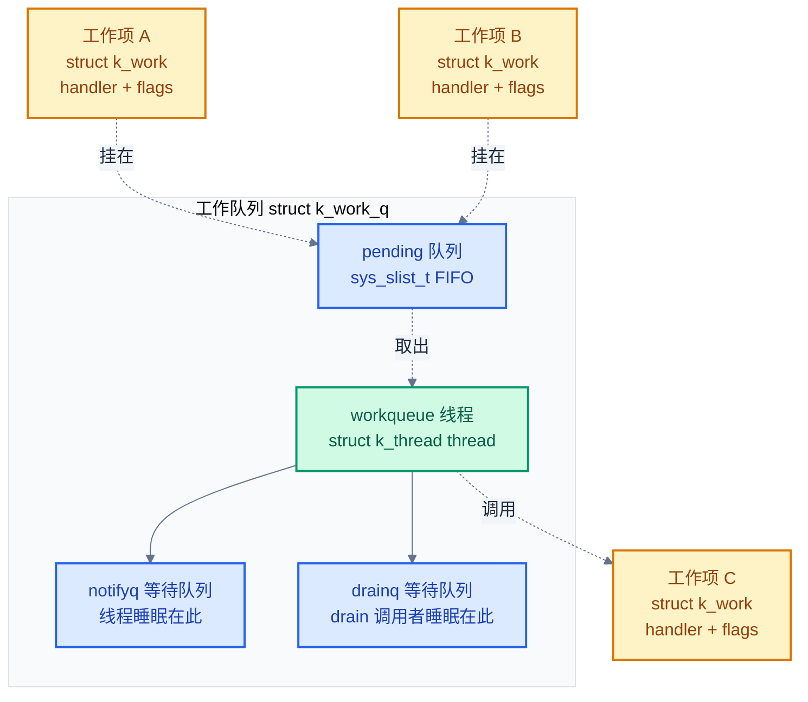
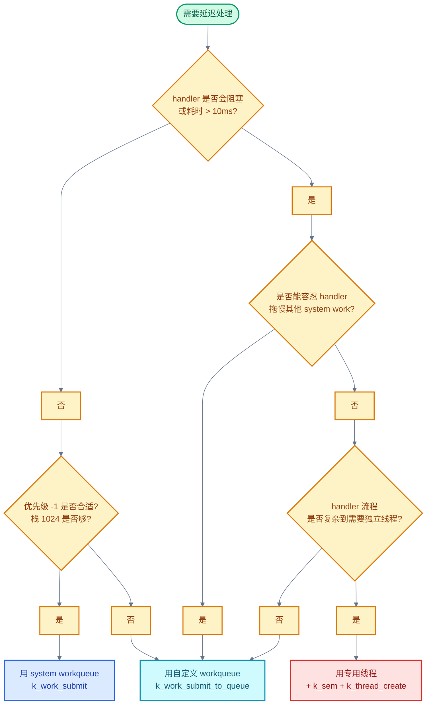
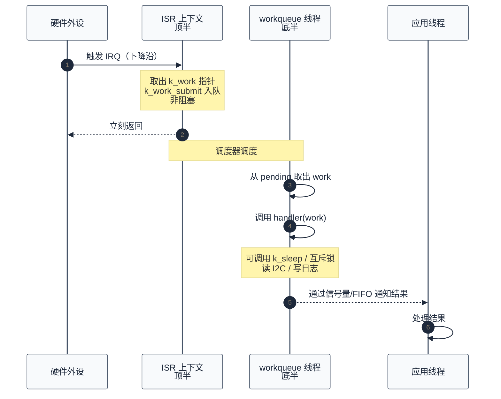

# 09. Zephyr 工作队列与延迟处理

> 一句话概括：本文从一个 GPIO 中断"只想读一次 I2C 寄存器"的小场景出发，剖析 Zephyr 工作队列的三要素（内核线程 + 队列 + 工作项）、`k_work` 与 `k_work_delayable` 的状态机、system workqueue 与自定义 workqueue 的选型，最后用"GPIO 中断 → workqueue → I2C 读取"完整走读顶半/底半模式。
> **工程师视角**：读完后你应当能回答"为什么 workqueue 是 ISR 延迟处理的首选"、"为什么 system workqueue 优先级不能太高"、"为什么用 `k_work_delayable` 而非 `k_timer` + `k_work_submit`"、"为什么 workqueue 适合 I2C/SPI 等可阻塞操作"这四个问题，并能为 GPIO 中断场景写出一套完整的顶半/底半代码。

### 关键术语

| 缩写 | 全称 | 含义 |
|------|------|------|
| WQ | Workqueue | 工作队列，内核对象 `struct k_work_q` |
| Work | Work Item | 工作项，内核对象 `struct k_work`，携带一个回调函数 |
| ISR | Interrupt Service Routine | 中断服务例程，硬件异步事件的入口函数 |
| IRQ | Interrupt Request | 中断请求，硬件向 CPU 发出的中断信号 |
| Top Half | — | 顶半，ISR 中执行的部分，必须非阻塞且尽量短 |
| Bottom Half | — | 底半，被推迟到线程上下文执行的部分，可阻塞 |
| DWork | Delayable Work | 延迟工作项，`struct k_work_delayable`，可定时提交 |
| I2C | Inter-Integrated Circuit | 两线串行总线，常用于连接传感器 |
| SPI | Serial Peripheral Interface | 串行外设接口，常见主从同步总线 |
| GPIO | General-Purpose Input/Output | 通用输入输出引脚 |
| FIFO | First In First Out | 先进先出队列 |
| TCB | Thread Control Block | 线程控制块，内核为每个线程维护的元数据 `struct k_thread` |
| RAM | Random Access Memory | 随机存取存储器 |
| ROM | Read-Only Memory | 只读存储器 |
| RTOS | Real-Time Operating System | 实时操作系统 |
| SMP | Symmetric Multi-Processing | 对称多处理，多核平等运行同一内核镜像 |

---

### 前置阅读

| 需要了解 | 参考文档 |
|----------|----------|
| 线程模型、状态迁移与优先级（workqueue 本质是一个内核线程） | [05-线程与状态迁移](./05-线程与状态迁移.md) |
| ISR 中只能用非阻塞 API 的约束（顶半/底半拆分的动因） | [07-同步机制详解](./07-同步机制详解.md) |
| 中断管理、ISR 约束、内核定时器（dwork 用 `k_timer` 同源的 timeout 机制） | [08-中断与时序](./08-中断与时序.md) |

---

## 1. 概述：为什么需要延迟处理

> 本文是 [08-中断与时序](./08-中断与时序.md) 的姊妹篇。上一篇讲了"为什么 ISR 必须短"——ISR 中不能调用 `k_sleep`、不能持互斥锁、不能做任何可能阻塞的操作。但一个自然的问题是：**ISR 检测到事件后，如果需要做的处理本身就很耗时（读 I2C、写日志、计算），怎么办？** 本章先用一个 GPIO + I2C 的小场景讲清"延迟处理在做什么"，再抽象出顶半/底半模式的本质，为后续章节建立心智模型。

### 1.1 一个具体场景：GPIO 中断后要读 I2C 传感器

设想一款环境监测板：一颗温湿度传感器挂在 I2C 总线上，型号是常见的 SHT3x。板卡上一根 GPIO 接到传感器的"数据就绪"引脚，传感器每 100ms 拉低一次该引脚，提示"新数据已就绪，请读取"。期望的 CPU 行为是：

- 传感器拉低 ALERT 引脚 → GPIO 控制器检测到下降沿 → 触发 IRQ → CPU 进入 ISR
- ISR 应当尽快返回，但 CPU 又必须**在读 I2C 之后**才能拿到温度数据

矛盾在于：**I2C 读取本身就是一次完整的总线事务**——地址 + 寄存器号 + 数据字节，每一步都要等 SCL 周期，一次读取可能耗时 200μs~2ms。这段等待在 ISR 里是绝对禁止的——它会拖慢所有其他中断响应、可能丢掉下一次采样、甚至让内核时钟漂移。

正确的做法是把"读 I2C"这件事**推迟到一个线程上下文去做**，ISR 只做"记录事件"这一极轻量的动作。这就是延迟处理（deferred processing）的核心场景。最小化的代码骨架如下（完整版见 [§9](#9-实战gpio-中断--workqueue--i2c-读取传感器)）：

```c
#include <zephyr/kernel.h>
#include <zephyr/drivers/gpio.h>
#include <zephyr/drivers/i2c.h>

/* 工作项：把"读 I2C"封装成一个可被提交的工作 */
static struct k_work sensor_work;

/* ISR 回调：只做一件事情——把工作项提交到 system workqueue */
static void gpio_callback(const struct device *port,
                          struct gpio_callback *cb,
                          gpio_port_pins_t pins)
{
    k_work_submit(&sensor_work);  /* 非阻塞，把 work 挂到队列就返回 */
}

/* 工作项的 handler：在 workqueue 线程上下文执行，可阻塞 */
static void sensor_work_handler(struct k_work *work)
{
    /* 这里可以安全地调用 i2c_read、k_sleep、k_mutex_lock 等阻塞 API */
    uint8_t buf[6];
    /* i2c_read(...) 省略，见 §9 完整示例 */
    ARG_UNUSED(buf);
}

int main(void)
{
    k_work_init(&sensor_work, sensor_work_handler);
    /* 配置 GPIO 中断并注册 gpio_callback（省略，见 §9） */
    while (1) {
        k_msleep(1000);
    }
    return 0;
}
```

读这段代码时关注三件事：

- `gpio_callback` 是 **ISR 上下文**——它只调用 `k_work_submit`，没有读 I2C、没有打印、没有 `k_sleep`。耗时压到纳秒级。
- `sensor_work_handler` 是 **线程上下文**——它在 workqueue 线程中执行，可以调用任何"线程可调用"的 API，包括会阻塞的 I2C 读取。
- `k_work_submit` 把 `sensor_work` 挂到一个内核队列上就立刻返回，handler 何时执行由 workqueue 线程的优先级与队列中已有工作决定。

> **核心要点**：延迟处理的本质是"ISR 只记事件，线程再干活"。把不可阻塞的硬件响应与可阻塞的业务处理切到两个上下文中，ISR 保持极短，耗时的"读 I2C / 写日志 / 计算"放到 workqueue 线程里做。

### 1.2 顶半/底半模式的本质

延迟处理在嵌入式与内核领域有一个通用名字——**顶半/底半（Top Half / Bottom Half）**模式。它把中断处理切成两段：

| 段 | 执行上下文 | 可用 API | 典型耗时 |
|------|----------|---------|---------|
| **顶半**（Top Half） | ISR | 仅非阻塞 API（`k_work_submit`、`k_sem_give`、`k_fifo_put` 等） | 微秒级 |
| **底半**（Bottom Half） | 线程 | 全部线程 API（可阻塞，可持锁，可睡眠） | 毫秒~秒级 |

顶半/底半是 Linux 内核的叫法（Linux 称为 top half / bottom half，早期有 tasklet、softirq，现代用 workqueue）。Zephyr 直接继承了这套思想，但实现更精简——只有一个机制：workqueue。

下表对比 Zephyr 三种"把工作推到线程做"的机制：

| 机制 | 触发方式 | 适合场景 | 与本文关系 |
|------|---------|---------|-----------|
| **workqueue** | `k_work_submit` | 一次性延迟处理，最常用 | 本文主题 |
| **软件中断 / irq_offload** | `irq_offload(fn, arg)` | 在测试场景中临时把函数放到 ISR 上下文跑 | 不属于延迟处理 |
| **专用线程 + 信号量** | `k_sem_give` 唤醒线程 | 处理流程复杂、需要独立优先级控制时 | workqueue 是它的"轻量化替代" |

> **核心要点**：workqueue 之所以成为 ISR 延迟处理的首选，是因为它兼具"线程上下文（可阻塞）"和"内核对象（无需手写线程）"两个特性。专用线程 + 信号量也能做同样的事，但要自己分配栈、自己写线程函数、自己处理优先级——workqueue 把这一切打包成了 `k_work_submit` 一个调用。

---

## 2. workqueue 本质：内核线程 + 队列 + 工作项

> 上一章用 GPIO + I2C 的场景讲清了"延迟处理在做什么"。本章把这个直觉形式化——一个 workqueue 实际上由三部分组成：一个内核线程、一个 FIFO 队列、若干个工作项。理解这三者如何协作是看懂后续 API 的前提。

> 官方文档 `doc/kernel/services/threads/workqueue.rst` 对 workqueue 的定义：*"A workqueue is a kernel object that uses a dedicated thread to process work items in a first in, first out manner. Each work item is processed by calling the function specified by the work item. A workqueue is typically used by an ISR or a high-priority thread to offload non-urgent processing to a lower-priority thread so it does not impact time-sensitive processing."* 官方还强调两点：workqueue 数量不受限（仅受 RAM 限制）；不论线程优先级是协作式还是抢占式，workqueue 线程**在每两个工作项之间都会 yield**，避免饿死其他线程。

### 2.1 三要素关系

一个 workqueue 的内部结构如下（来自 [kernel/work.c](file:///home/pbw/rtos/cs-learning-notes/zephyr-project/zephyr/kernel/work.c) 与 [include/zephyr/kernel.h](file:///home/pbw/rtos/cs-learning-notes/zephyr-project/zephyr/include/zephyr/kernel.h) 的 `struct k_work_q` 定义）：



> **如何读这张图**：workqueue 线程是一个普通的内核线程（绿色），它在 `pending` 队列（蓝色）上循环取工作项（黄色）。队列空时线程睡眠在 `notifyq` 上；ISR 或其他线程通过 `k_work_submit` 把工作项挂到 `pending` 尾部并唤醒线程。线程取出工作项后调用其 `handler`，处理完再取下一个——这就是 workqueue 的全部工作流程。

### 2.2 workqueue 线程的主循环

workqueue 线程的入口函数是 [kernel/work.c](file:///home/pbw/rtos/cs-learning-notes/zephyr-project/zephyr/kernel/work.c) 中的 `work_queue_main`（约 655 行起）。它是一个永不退出的循环（除非显式调用 `k_work_queue_stop`）：

```c
/* kernel/work.c L655-L740（节选） */
static void work_queue_main(void *workq_ptr, void *p2, void *p3)
{
    struct k_work_q *queue = (struct k_work_q *)workq_ptr;

    while (true) {
        sys_snode_t *node;
        struct k_work *work = NULL;
        k_work_handler_t handler = NULL;
        k_spinlock_key_t key = k_spin_lock(&lock);
        bool yield;

        /* 1. 从 pending 队列头部取出一个工作项 */
        node = sys_slist_get(&queue->pending);
        if (node != NULL) {
            flag_set(&queue->flags, K_WORK_QUEUE_BUSY_BIT);
            work = CONTAINER_OF(node, struct k_work, node);
            flag_set(&work->flags, K_WORK_RUNNING_BIT);     /* 标记 RUNNING */
            flag_clear(&work->flags, K_WORK_QUEUED_BIT);    /* 清掉 QUEUED */
            handler = work->handler;
        }

        if (work == NULL) {
            /* 2. 队列空：在 notifyq 上永久睡眠，等待新工作项唤醒 */
            (void)z_sched_wait(&lock, key, &queue->notifyq, K_FOREVER, NULL);
            continue;
        }

        k_spin_unlock(&lock, key);

        /* 3. 释放锁后调用 handler —— 这里是工作项真正"干活"的地方 */
        handler(work);

        /* 4. handler 返回后清理状态 */
        key = k_spin_lock(&lock);
        flag_clear(&work->flags, K_WORK_RUNNING_BIT);
        if (flag_test(&work->flags, K_WORK_FLUSHING_BIT)) {
            finalize_flush_locked(work);   /* 唤醒 k_work_flush 调用者 */
        }
        if (flag_test(&work->flags, K_WORK_CANCELING_BIT)) {
            finalize_cancel_locked(work);  /* 唤醒 k_work_cancel_sync 调用者 */
        }
        flag_clear(&queue->flags, K_WORK_QUEUE_BUSY_BIT);
        yield = !flag_test(&queue->flags, K_WORK_QUEUE_NO_YIELD_BIT);
        k_spin_unlock(&lock, key);

        /* 5. 默认在两项之间 yield，避免合作式 workqueue 饿死其他线程 */
        if (yield) {
            k_yield();
        }
    }
}
```

读这段源码时关注三个关键设计：

- **FIFO 顺序**：`sys_slist_get` 从头部取，`queue_submit_locked` 从尾部插——后提交的工作项排在后面，先到先处理。
- **handler 在锁外执行**：`k_spin_unlock` 之后才调 `handler`，意味着 handler 内部可以调用任何会阻塞或重新加锁的 API，不会死锁。
- **默认 yield**：每处理完一个工作项就 `k_yield()`，把 CPU 让给同优先级或其他更高优先级的线程。`K_WORK_QUEUE_NO_YIELD_BIT` 可以关掉这个行为。

> **核心要点**：workqueue 线程的循环只做四件事——取工作项、调 handler、清理状态、yield。所有"魔法"都在 `k_work_submit`（入队）与 `handler(work)`（出队执行）这两个动作里。

### 2.3 workqueue 是线程，不是魔法

强调一个易被忽略的事实：**workqueue 线程就是普通的 `struct k_thread`**。在 [kernel/work.c L832](file:///home/pbw/rtos/cs-learning-notes/zephyr-project/zephyr/kernel/work.c) 的 `k_work_queue_start` 中可以看到，它就是用 `k_thread_create` 创建的：

```c
/* kernel/work.c L832-L839 */
(void)k_thread_create(&queue->thread, stack, stack_size,
                      work_queue_main, queue, NULL, NULL,
                      prio, 0, K_FOREVER);
```

这意味着 workqueue 线程享受所有线程的特性：

- 受调度器调度，按优先级抢占
- 有自己的栈（创建时传入）
- 可以被 `k_thread_suspend` / `k_thread_abort`
- 可以通过 `k_thread_name_set` 命名

也受线程的所有约束：

- 优先级数值越小优先级越高
- 协作优先级（负值）的线程不会被同优先级或更低优先级线程抢占
- 栈大小要够装下 handler 调用链

> **核心要点**：workqueue 不是一种特殊机制，它就是一个"被内核预先包好的线程 + 队列"。把它当线程来推理行为就不会错——线程能做的事它都能做，线程的约束它也都受。

---

## 3. 工作项：k_work、K_WORK_DEFINE、k_work_init、k_work_submit

> 上一章讲了 workqueue 的三要素。本章深入其中一员——工作项 `struct k_work`。一个常见困惑是：**`k_work` 内部到底存了什么？为什么 `k_work_submit` 不会重复入队？为什么 handler 只有一个 `struct k_work *` 参数？** 本章对齐 [doc/kernel/services/threads/workqueue.rst](../zephyr-project/zephyr/doc/kernel/services/threads/workqueue.rst) 与 [include/zephyr/kernel.h](file:///home/pbw/rtos/cs-learning-notes/zephyr-project/zephyr/include/zephyr/kernel.h) 的源码。

### 3.1 struct k_work 的内部结构

`struct k_work` 的定义在 [include/zephyr/kernel.h L4561-L4593](file:///home/pbw/rtos/cs-learning-notes/zephyr-project/zephyr/include/zephyr/kernel.h)：

```c
/* include/zephyr/kernel.h L4561-L4579 */
struct k_work {
    /* 节点：用于挂到 k_work_q.pending 链表上 */
    sys_snode_t node;

    /* 工作项被处理时调用的函数 */
    k_work_handler_t handler;

    /* 上次提交到的队列指针（用于"无队列参数的 resubmit"） */
    struct k_work_q *queue;

    /* 状态标志位：DELAYED / QUEUED / RUNNING / CANCELING / FLUSHING */
    uint32_t flags;
};
```

四个字段各司其职：

- `node`：链表节点，让 `k_work` 能挂在 `pending` 队列上。FIFO 顺序就是靠这个链表维护。
- `handler`：函数指针，签名为 `void (*)(struct k_work *work)`。这是"工作"本身。
- `queue`：上次被提交到哪个 workqueue。`k_work_submit` 不带队列参数时就是提交到这里。
- `flags`：5 个状态位（见 [§3.2](#32-状态标志位)），用原子操作维护，可在多核 SMP 下安全访问。

handler 的函数签名定义在同文件 L3924：

```c
/* include/zephyr/kernel.h L3924-L3930 */
typedef void (*k_work_handler_t)(struct k_work *work);
```

为什么 handler 只有一个参数（指向自己的 `struct k_work *`）？因为 Zephyr 的惯例是**把 `k_work` 嵌到更大的结构体里**，handler 内部用 `CONTAINER_OF` 反推外层结构体指针，从而访问业务上下文。这是一个零开销的设计——不传多余参数，需要多少上下文自己用 `CONTAINER_OF` 取。

### 3.2 状态标志位

`flags` 字段是 5 个独立位（[include/zephyr/kernel.h L4483-L4556](file:///home/pbw/rtos/cs-learning-notes/zephyr-project/zephyr/include/zephyr/kernel.h)）：

| 标志 | 含义 | 设置时机 | 清除时机 |
|------|------|---------|---------|
| `K_WORK_QUEUED` | 已入队待处理 | `k_work_submit` 成功入队 | workqueue 线程取出该工作项 |
| `K_WORK_RUNNING` | 正在执行 handler | workqueue 线程开始调 handler | workqueue 线程 handler 返回 |
| `K_WORK_CANCELING` | 正在被取消 | `k_work_cancel` 调用 | 取消完成（finalize_cancel_locked） |
| `K_WORK_DELAYED` | 延迟工作项已定时 | `k_work_schedule` 设置 timeout | timeout 触发后提交到队列 |
| `K_WORK_FLUSHING` | 正在被 flush | `k_work_flush` 调用 | flush 完成（finalize_flush_locked） |

> **如何读这张表**：这些标志**可以同时置位**——一个工作项可能既在 `RUNNING` 又在 `QUEUED`（handler 执行期间又被提交了），也可能同时是 `RUNNING` + `CANCELING` + `QUEUED`（handler 跑着、被取消了、又被提交了）。这是位标志（bit flags）相比枚举的核心优势：状态可叠加。

`k_work_busy_get(work)` 返回 `flags & K_WORK_MASK`（前 5 位），调用方判断 `!= 0` 即"忙"。`k_work_is_pending(work)` 是它的内联封装，等价于 `k_work_busy_get(work) != 0`。

### 3.3 初始化：K_WORK_DEFINE 与 k_work_init

工作项必须先初始化才能提交。Zephyr 提供两种方式：

**编译时初始化**（推荐）——用宏 `K_WORK_DEFINE`：

```c
/* include/zephyr/kernel.h L5048-L5049 */
#define K_WORK_DEFINE(work, work_handler) \
    struct k_work work = Z_WORK_INITIALIZER(work_handler)
```

宏展开后就是 `struct k_work work = { .handler = work_handler }`，`node`/`queue`/`flags` 默认零初始化。用法：

```c
static K_WORK_DEFINE(sensor_work, sensor_work_handler);
```

**运行时初始化**——用 `k_work_init`（[kernel/work.c L153](file:///home/pbw/rtos/cs-learning-notes/zephyr-project/zephyr/kernel/work.c)）：

```c
/* kernel/work.c L153-L162 */
void k_work_init(struct k_work *work, k_work_handler_t handler)
{
    __ASSERT_NO_MSG(work != NULL);
    __ASSERT_NO_MSG(handler != NULL);
    *work = (struct k_work)Z_WORK_INITIALIZER(handler);
    SYS_PORT_TRACING_OBJ_INIT(k_work, work);
}
```

注意 `k_work_init` 直接覆盖整个结构体——所以**只能在空闲状态下调用**，对正在队列中或正在执行的工作项调 `k_work_init` 是未定义行为。

### 3.4 提交：k_work_submit 与 k_work_submit_to_queue

`k_work_submit` 是最常用的提交 API，它把工作项提交到 **system workqueue**（详见 [§5](#5-system-workqueuek_work_submit-默认目标为什么大多数场景用它)）。`k_work_submit_to_queue` 接受额外的 `queue` 参数，提交到指定 workqueue。

`k_work_submit` 的实现非常薄（[kernel/work.c L414](file:///home/pbw/rtos/cs-learning-notes/zephyr-project/zephyr/kernel/work.c)）：

```c
/* kernel/work.c L414-L422 */
int k_work_submit(struct k_work *work)
{
    int ret = k_work_submit_to_queue(&k_sys_work_q, work);
    return ret;
}
```

`k_work_submit_to_queue` 进一步调用 `z_work_submit_to_queue`（持锁）+ `z_reschedule_unlocked`（让调度器重新调度），核心入队逻辑在 `submit_to_queue_locked`（[kernel/work.c L320-L373](file:///home/pbw/rtos/cs-learning-notes/zephyr-project/zephyr/kernel/work.c)）：

```c
/* kernel/work.c L320-L373（节选） */
static int submit_to_queue_locked(struct k_work *work, struct k_work_q **queuep)
{
    int ret = 0;

    if (flag_test(&work->flags, K_WORK_CANCELING_BIT)) {
        ret = -EBUSY;                          /* 正在取消，拒绝 */
    } else if (!flag_test(&work->flags, K_WORK_QUEUED_BIT)) {
        /* 未入队：实际入队 */
        ret = 1;
        if (*queuep == NULL) {
            *queuep = work->queue;             /* 用上次提交的队列 */
        }
        if (flag_test(&work->flags, K_WORK_RUNNING_BIT)) {
            *queuep = work->queue;             /* 正在跑则用正在跑的队列，避免重入 */
            ret = 2;
        }
        int rc = queue_submit_locked(*queuep, work);
        if (rc >= 0) {
            flag_set(&work->flags, K_WORK_QUEUED_BIT);
            work->queue = *queuep;
        } else {
            ret = rc;
        }
    }
    /* 已入队：什么都不做（这是"幂等"的关键） */

    return ret;
}
```

返回值有三种：

- `1`：工作项被新加入队列
- `2`：工作项正在执行时被重新提交，已挂到正在执行的队列末尾
- `0`：工作项已在队列中，本次提交是 no-op（幂等）
- 负数：错误（`-EBUSY` 表示正在被取消）

> **核心要点**：`k_work_submit` 是**幂等**的——对已经在队列里的工作项再次提交是 no-op，工作项不会被复制、不会执行两次。这一点让 ISR 代码非常简洁：检测到事件就 `k_work_submit`，不需要先检查"是否已经提交过"。

### 3.5 状态查询、同步与取消

> 官方文档 `doc/kernel/services/threads/workqueue.rst` 在 "Submitting a Work Item" 末尾列出了工作项的状态查询与同步 API。这些 API 解决的问题是：**提交工作项后，调用方如何知道它是否处理完？如何等待它完成？如何在它执行前取消？**

工作项有四个核心 API 配套使用，对应"查、等、取消、取消并等"四种语义：

| API | 上下文约束 | 阻塞 | 用途 |
|------|----------|------|------|
| `k_work_busy_get(work)` | ISR / 线程 | 否 | 返回状态标志快照（`K_WORK_QUEUED` / `K_WORK_RUNNING` / `K_WORK_DELAYED` / `K_WORK_CANCELING` 的位或），`0` 表示空闲 |
| `k_work_is_pending(work)` | ISR / 线程 | 否 | `k_work_busy_get(work) != 0` 的内联封装，返回 `bool` |
| `k_work_flush(work, &sync)` | **仅线程** | 是 | 阻塞直到工作项完成；若工作项未 pending 则立即返回。返回 `true` 表示确实等到了完成 |
| `k_work_cancel(work)` | ISR / 线程 | 否 | 异步取消：尝试阻止工作项执行，可能成功也可能失败。ISR 安全 |
| `k_work_cancel_sync(work, &sync)` | **仅线程** | 是 | 阻塞直到取消完成；若工作项本就空闲则立即返回 |

`k_work_flush` 与 `k_work_cancel_sync` 都需要传入一个 `struct k_work_sync *sync` 参数——这是内核为同步提供的辅助对象，内部封装了信号量。`struct k_work_sync` 定义在 [include/zephyr/kernel.h L4698](file:///home/pbw/rtos/cs-learning-notes/zephyr-project/zephyr/include/zephyr/kernel.h)：

```c
/* include/zephyr/kernel.h L4698-L4706 */
struct k_work_sync {
    /* 内部隐藏字段：用于 flush/cancel_sync 的同步信号量 */
};
```

> 官方文档特别提醒：在启用了 `CONFIG_KERNEL_COHERENCE` 的架构上，`k_work_sync` **不应分配在栈上**——因为 workqueue 线程可能跑在另一类内存域，栈上的 sync 对象无法被工作队列线程访问。建议用静态变量或堆分配。

一个典型的"提交后等完成"场景：

```c
static struct k_work_sync sync;     /* 不要放栈上 */

void process_and_wait(void)
{
    k_work_submit(&my_work);

    /* 主线程阻塞直到 handler 执行完毕 */
    k_work_flush(&my_work, &sync);
    printk("work done\n");
}
```

`k_work_cancel` 与 `k_work_cancel_sync` 的搭配用法——ISR 发起取消，线程侧等取消完成：

```c
/* ISR 中：发起异步取消，立刻返回 */
void cancel_from_isr(void)
{
    int ret = k_work_cancel(&my_work);
    /* ret 是 k_work_busy_get 的快照，可能为 0（已空闲）或非 0（仍忙） */
}

/* 线程中：等取消真正完成 */
void wait_cancel_done(void)
{
    static struct k_work_sync sync;
    bool cancelled = k_work_cancel_sync(&my_work, &sync);
    /* cancelled == true 表示确实取消了正在执行的工作项 */
}
```

> **核心要点**：状态查询 API（`k_work_busy_get` / `k_work_is_pending`）返回的是**快照**——在多核或并发场景下，调用方拿到返回值时状态可能已经变了。官方文档明确警告：**不要基于这些快照做"是否需要提交"的判断**（详见 [§8.5](#85-best-practices官方推荐的最佳实践)）。需要确定性语义时用 `k_work_flush` / `k_work_cancel_sync` 等阻塞 API。

### 3.6 完整的最小例子

把 §3.3 和 §3.4 串起来——一个最小的"周期触发工作项"例子：

```c
#include <zephyr/kernel.h>

static void my_handler(struct k_work *work)
{
    printk("work handler runs in thread context, prio = %d\n",
           k_thread_priority_get(k_current_get()));
}

static K_WORK_DEFINE(my_work, my_handler);

int main(void)
{
    while (1) {
        k_work_submit(&my_work);   /* 提交到 system workqueue */
        k_msleep(1000);
    }
    return 0;
}
```

运行后你会看到 `my_handler` 在另一个线程（system workqueue 线程，优先级默认 -1）中执行，而不是在 `main` 线程中——这是 workqueue 的核心承诺：**handler 永远在 workqueue 线程的上下文里跑**。

---

## 4. 延迟工作项：k_work_delayable、k_work_schedule、k_work_reschedule

> 上一章讲了普通工作项 `k_work`。但有些场景需要"延迟一段时间再处理"——比如中断去抖（debounce）：检测到 GPIO 下降沿后等 50ms 再读状态，避免抖动。本章回答：**为什么不直接用 `k_timer` + 在 timer 回调里 `k_work_submit`？为什么 Zephyr 专门设计了 `k_work_delayable`？** 答案的关键在原子性与内核优化。

### 4.1 k_work_delayable 的结构

`struct k_work_delayable` 在 [include/zephyr/kernel.h L4603-L4623](file:///home/pbw/rtos/cs-learning-notes/zephyr-project/zephyr/include/zephyr/kernel.h)：

```c
/* include/zephyr/kernel.h L4603-L4618 */
struct k_work_delayable {
    struct k_work work;          /* 内嵌一个普通工作项 */
    struct _timeout timeout;     /* 内核 timeout 节点，复用 k_timer 同源机制 */
    struct k_work_q *queue;      /* 延迟到期后提交到哪个队列 */
};
```

注意 `k_work_delayable` 不是 `k_work` 的替代，而是**包装**——它内嵌一个 `k_work`，额外加了 `timeout` 和 `queue` 字段。`k_work_schedule` 的本质就是：注册一个 timeout，到期后由 timeout 回调把内嵌的 `work` 提交到 `queue`。

timeout 触发的回调在 [kernel/work.c L966-L984](file:///home/pbw/rtos/cs-learning-notes/zephyr-project/zephyr/kernel/work.c)：

```c
/* kernel/work.c L966-L984 */
static void work_timeout(struct _timeout *to)
{
    struct k_work_delayable *dw
        = CONTAINER_OF(to, struct k_work_delayable, timeout);
    struct k_work *wp = &dw->work;
    k_spinlock_key_t key = k_spin_lock(&lock);
    struct k_work_q *queue = NULL;

    /* 清掉 DELAYED 标志，把内嵌 work 提交到 dw->queue */
    if (flag_test_and_clear(&wp->flags, K_WORK_DELAYED_BIT)) {
        queue = dw->queue;
        (void)submit_to_queue_locked(wp, &queue);
    }
    k_spin_unlock(&lock, key);
}
```

注意 `work_timeout` 是在**内核 timeout 中断上下文**中执行的（与 `k_timer` 回调同源，详见 [08-中断与时序](./08-中断与时序.md) 的内核定时器章节）——它不能阻塞。但它的全部工作就是调 `submit_to_queue_locked`，这正是 ISR 安全的操作。

### 4.2 k_work_schedule vs k_work_reschedule

延迟工作项有两个提交 API，区别仅在"已调度时的处理"：

| API | 已调度时的行为 | 适合场景 |
|------|--------------|---------|
| `k_work_schedule(dwork, delay)` | **no-op**，保持原 deadline | "首次事件后等 N ms 处理"——期间的事件被忽略，处理只发生一次 |
| `k_work_reschedule(dwork, delay)` | 取消原 timeout，重新开始计时 | "最后一次事件后等 N ms 处理"——每次事件都延后处理时机 |

源码对照（[kernel/work.c L1108-L1170](file:///home/pbw/rtos/cs-learning-notes/zephyr-project/zephyr/kernel/work.c)）：

```c
/* kernel/work.c L1108-L1131（k_work_schedule_for_queue） */
int k_work_schedule_for_queue(struct k_work_q *queue,
                              struct k_work_delayable *dwork,
                              k_timeout_t delay)
{
    struct k_work *work = &dwork->work;
    int ret = 0;
    k_spinlock_key_t key = k_spin_lock(&lock);

    /* 只在空闲或仅 RUNNING 时调度；DELAYED/QUEUED 时直接返回 0 */
    if ((work_busy_get_locked(work) & ~K_WORK_RUNNING) == 0U) {
        ret = schedule_for_queue_locked(&queue, dwork, delay);
    }
    k_spin_unlock(&lock, key);
    return ret;
}

/* kernel/work.c L1143-L1165（k_work_reschedule_for_queue） */
int k_work_reschedule_for_queue(struct k_work_q *queue,
                                struct k_work_delayable *dwork,
                                k_timeout_t delay)
{
    int ret;
    k_spinlock_key_t key = k_spin_lock(&lock);

    /* 无条件取消原 timeout，再重新调度 */
    (void)unschedule_locked(dwork);
    ret = schedule_for_queue_locked(&queue, dwork, delay);

    k_spin_unlock(&lock, key);
    return ret;
}
```

两个具体场景帮助记忆：

- **去抖（debounce）**：用户按键产生多次抖动，每次抖动都触发 GPIO 中断。我们希望"最后一次抖动后 50ms 再读键值"——用 `k_work_reschedule(&key_work, K_MSEC(50))`，每次中断都把 deadline 推迟 50ms，直到抖动结束才真正触发 handler。
- **首事件触发采样**：传感器数据就绪引脚拉低，我们希望"首次拉低后立刻读，期间的其他就绪信号忽略"——用 `k_work_schedule(&sensor_work, K_NO_WAIT)`，第一次调用立即调度，后续调用 no-op。

### 4.3 为什么用 k_work_delayable 而非 k_timer + k_work_submit

一个常见疑问：既然 `k_work_delayable` 内部就是 timeout + work，为什么不直接用 `k_timer` + 在 timer 回调里调 `k_work_submit`？

```c
/* 反例：手写 timer + work 组合 */
struct k_timer my_timer;
struct k_work my_work;

void timer_cb(struct k_timer *t) {
    k_work_submit(&my_work);   /* 在 timer ISR 上下文里提交 work */
}

void some_event(void) {
    k_timer_start(&my_timer, K_MSEC(50), K_NO_WAIT);
}
```

这种写法在简单场景下能工作，但有两个问题：

1. **原子性缺失**：在 `k_timer_start` 与 `k_work_submit` 之间，可能有其他线程/ISR 同时操作 `my_work`——比如另一个线程尝试 `k_work_cancel` 时，`my_work` 处于"timer 已注册但还没提交"的中间状态，`k_work_cancel` 看不到 `K_WORK_DELAYED` 标志，无法取消尚未到期的提交。`k_work_delayable` 的 `DELAYED` 标志位让取消操作能识别"已调度但未提交"状态。

2. **失去内核优化**：`k_work_schedule(dwork, K_NO_WAIT)` 是一个特殊情况——`schedule_for_queue_locked` 检测到 `K_NO_WAIT` 后**直接调用 `submit_to_queue_locked`**，不经过 timeout 子系统（[kernel/work.c L1053-L1071](file:///home/pbw/rtos/cs-learning-notes/zephyr-project/zephyr/kernel/work.c)）。这避免了"注册一个 0ms timeout 再立刻触发"的开销。手写 timer + work 做不到这种优化。

```c
/* kernel/work.c L1053-L1071 */
static int schedule_for_queue_locked(struct k_work_q **queuep,
                                     struct k_work_delayable *dwork,
                                     k_timeout_t delay)
{
    int ret = 1;
    struct k_work *work = &dwork->work;

    if (K_TIMEOUT_EQ(delay, K_NO_WAIT)) {
        return submit_to_queue_locked(work, queuep);   /* 零开销快速路径 */
    }

    flag_set(&work->flags, K_WORK_DELAYED_BIT);
    dwork->queue = *queuep;
    z_add_timeout(&dwork->timeout, work_timeout, delay);
    return ret;
}
```

> **核心要点**：`k_work_delayable` 不是 `k_timer` + `k_work` 的简单组合——它把"延迟"与"提交"封装成原子操作，让取消、重调度、状态查询都能正确处理"已调度未提交"的中间态。手写 timer + work 在并发场景下会出现取消失败、状态不一致等问题。

### 4.4 在 handler 中拿到 dwork 指针

`k_work_delayable` 内嵌的 `k_work` 是私有的，handler 收到的参数是 `struct k_work *`。要在 handler 中拿到外层的 `k_work_delayable *`，用 `k_work_delayable_from_work`（[include/zephyr/kernel.h L4805-L4808](file:///home/pbw/rtos/cs-learning-notes/zephyr-project/zephyr/include/zephyr/kernel.h)）：

```c
static inline struct k_work_delayable *
k_work_delayable_from_work(struct k_work *work)
{
    return CONTAINER_OF(work, struct k_work_delayable, work);
}
```

典型用法（来自 [workqueue.rst L154-L162](../zephyr-project/zephyr/doc/kernel/services/threads/workqueue.rst)）：

```c
struct work_context {
    struct k_work_delayable timed_work;
    int some_data;
};

static void work_handler(struct k_work *work)
{
    struct k_work_delayable *dwork = k_work_delayable_from_work(work);
    struct work_context *ctx = CONTAINER_OF(dwork, struct work_context, timed_work);

    printk("data = %d\n", ctx->some_data);
}
```

两层 `CONTAINER_OF` 是延迟工作项的标准模式：先从 `k_work` 反推 `k_work_delayable`，再从 `k_work_delayable` 反推业务上下文结构体。

### 4.5 初始化、状态查询与取消

> 官方文档 `doc/kernel/services/threads/workqueue.rst` 在 "Scheduling a Delayable Work Item" 中列出了延迟工作项的初始化与状态 API。它们与普通工作项的 API 一一对应，仅名字加 `_delayable` 后缀。

**初始化**与普通工作项一样有两种方式。编译时初始化用 `K_WORK_DELAYABLE_DEFINE`（[include/zephyr/kernel.h L4649-L4651](file:///home/pbw/rtos/cs-learning-notes/zephyr-project/zephyr/include/zephyr/kernel.h)）：

```c
/* include/zephyr/kernel.h L4649-L4651 */
#define K_WORK_DELAYABLE_DEFINE(work, work_handler) \
    struct k_work_delayable work \
      = Z_WORK_DELAYABLE_INITIALIZER(work_handler)
```

```c
static K_WORK_DELAYABLE_DEFINE(periodic_work, periodic_handler);
```

运行时初始化用 `k_work_init_delayable`（[include/zephyr/kernel.h L4216-L4217](file:///home/pbw/rtos/cs-learning-notes/zephyr-project/zephyr/include/zephyr/kernel.h)）：

```c
void k_work_init_delayable(struct k_work_delayable *dwork,
                           k_work_handler_t handler);
```

延迟工作项的状态查询与取消 API 与 [§3.5](#35-状态查询同步与取消) 普通工作项一一对应：

| API | 对应的普通工作项 API | 说明 |
|------|---------------------|------|
| `k_work_delayable_busy_get(dwork)` | `k_work_busy_get` | 返回 `K_WORK_DELAYED` / `QUEUED` / `RUNNING` / `CANCELING` 位或 |
| `k_work_delayable_is_pending(dwork)` | `k_work_is_pending` | `k_work_delayable_busy_get(dwork) != 0` 的内联封装 |
| `k_work_flush_delayable(dwork, &sync)` | `k_work_flush` | 阻塞直到延迟工作项完成；若未调度则立即返回 |
| `k_work_cancel_delayable(dwork)` | `k_work_cancel` | 异步取消，ISR 安全 |
| `k_work_cancel_delayable_sync(dwork, &sync)` | `k_work_cancel_sync` | 阻塞直到取消完成 |

官方文档特别指出：**取消延迟工作项不会阻止它被重新调度**——`k_work_cancel_delayable` 只取消当前已调度/已入队的实例，如果随后又调 `k_work_schedule`，工作项会再次被激活。要彻底停止一个周期性 dwork，必须在取消后确保 handler 不再 `k_work_reschedule` 自己（参见 [§7.1](#71-模式一自重调度self-rescheduling-dwork) 的自重调度模式）。

### 4.6 触发式工作项（Triggered Work）：k_work_poll_submit

> 官方文档 `doc/kernel/services/threads/workqueue.rst` 有一个独立小节 "Triggered Work"，介绍一种与延迟工作项并列的变体——**触发式工作项**。它解决的问题是：**当某个内核对象（信号量、FIFO、poll signal）状态变化时，自动提交一个工作项到 workqueue**，而无需专门起一个线程去 `k_poll` 等待。

触发式工作项基于 [polling_v2](../zephyr-project/zephyr/doc/kernel/services/polling.rst) 机制——它在普通 `k_work` 上额外挂了一组 `k_poll_event`，由内核代替应用去观察这些事件。一旦任一事件触发（或超时），内核就把工作项提交到指定 workqueue，handler 在线程上下文执行。

与 `k_poll` 的关键区别：**`k_poll` 需要一个线程主动阻塞等待**，而触发式工作项把"等待"这件事交给内核 timeout 子系统，调用方不需要专门起线程。API 入口是 `k_work_poll_submit`。

官方文档强调一个约束：触发式工作项及其引用的 `k_poll_event` 数组，从提交到 handler 执行或取消的整个生命周期内**必须保持有效且不能被修改**。

> **核心要点**：触发式工作项是延迟工作项的"事件驱动版"——延迟工作项按时间触发，触发式工作项按内核事件触发。日常 ISR 延迟处理场景用不到它（直接 `k_work_submit` 即可），它主要服务于"多个异步事件源聚合后处理"的复杂场景。本文不展开，详见官方 [polling 文档](../zephyr-project/zephyr/doc/kernel/services/polling.rst)。

---

## 5. system workqueue：k_work_submit 默认目标，为什么大多数场景用它

> 上一章讲了延迟工作项。本章回答一个工程选型问题：**Zephyr 提供了一个内核内置的 workqueue——system workqueue——为什么 `k_work_submit` 默认就提交到它？什么情况下够用？** 理解它的实现与默认配置是判断"是否需要自定义 workqueue"的前提。

> 官方文档 `doc/kernel/services/threads/workqueue.rst` 的 "System Workqueue" 一节指出：*"The kernel defines a workqueue known as the system workqueue, which is available to any application or kernel code that requires workqueue support. The system workqueue is optional, and only exists if the application makes use of it."* 官方还给出重要提醒：**只有在无法向 system workqueue 提交新工作项时才应定义额外的 workqueue**——每个新 workqueue 都有显著的内存开销。仅当新工作项与 system workqueue 已有工作项"无法共存"（如阻塞操作会延迟其他处理到不可接受的程度）时，新 workqueue 才是合理的。

### 5.1 system workqueue 的诞生

system workqueue 的全部源码在 [kernel/system_work_q.c](file:///home/pbw/rtos/cs-learning-notes/zephyr-project/zephyr/kernel/system_work_q.c)——只有 38 行，读一遍就懂了：

```c
/* kernel/system_work_q.c 全文（节选） */
static K_KERNEL_STACK_DEFINE(sys_work_q_stack,
                             CONFIG_SYSTEM_WORKQUEUE_STACK_SIZE);

struct k_work_q k_sys_work_q;       /* 全局可见的 system workqueue 实例 */

static int k_sys_work_q_init(void)
{
    static const struct k_work_queue_config cfg = {
        .name = "sysworkq",
        .no_yield = IS_ENABLED(CONFIG_SYSTEM_WORKQUEUE_NO_YIELD),
        .essential = true,                       /* 关键线程：退出会触发 fatal */
        .work_timeout_ms = CONFIG_SYSTEM_WORKQUEUE_WORK_TIMEOUT_MS,
    };

    k_work_queue_start(&k_sys_work_q,
                       sys_work_q_stack,
                       K_KERNEL_STACK_SIZEOF(sys_work_q_stack),
                       CONFIG_SYSTEM_WORKQUEUE_PRIORITY, &cfg);
    return 0;
}

SYS_INIT(k_sys_work_q_init, POST_KERNEL, CONFIG_KERNEL_INIT_PRIORITY_DEFAULT);
```

几个关键设计：

- **栈用 `K_KERNEL_STACK_DEFINE`**：内核栈（不是用户线程栈），不保存浮点上下文，更紧凑。这也是为什么 §6 的自定义 workqueue 推荐 `K_THREAD_STACK_DEFINE`（应用场景可能需要浮点）。
- **`essential = true`**：system workqueue 线程被标记为 essential，意外退出会触发 fatal error。这是为了防止某个 work handler 调用 `k_thread_abort` 把 system workqueue 弄崩溃。
- **`SYS_INIT(..., POST_KERNEL, ...)`**：在 POST_KERNEL 阶段、默认优先级初始化。这意味着 `main()` 开始执行时，system workqueue 已经就绪。

### 5.2 默认配置：优先级 -1，栈 1024 字节

> 官方文档 `doc/kernel/services/threads/workqueue.rst` 末尾的 "Configuration Options" 一节列出了 system workqueue 的三个配置项：`CONFIG_SYSTEM_WORKQUEUE_STACK_SIZE`、`CONFIG_SYSTEM_WORKQUEUE_PRIORITY`、`CONFIG_SYSTEM_WORKQUEUE_NO_YIELD`。

system workqueue 的关键 Kconfig（[kernel/Kconfig L603-L621](file:///home/pbw/rtos/cs-learning-notes/zephyr-project/zephyr/kernel/Kconfig)）：

| Kconfig | 默认值 | 含义 |
|---------|--------|------|
| `CONFIG_SYSTEM_WORKQUEUE_STACK_SIZE` | `1024`（特殊场景 2560/4096） | system workqueue 线程的栈大小（字节） |
| `CONFIG_SYSTEM_WORKQUEUE_PRIORITY` | `-1`（协作模式 + 抢占模式同时启用时） | system workqueue 线程优先级 |
| `CONFIG_SYSTEM_WORKQUEUE_NO_YIELD` | `n` | 是否禁用"工作项之间 yield" |
| `CONFIG_WORKQUEUE_WORK_TIMEOUT` | `n` | 是否启用 handler 超时监控 |

`CONFIG_SYSTEM_WORKQUEUE_PRIORITY` 默认 `-1`——这是**最低协作优先级**。意味着：

- 比所有抢占式线程（优先级 ≥ 0）都高
- 但比所有其他协作式线程（优先级 ≤ -2）都低
- 一旦 handler 开始执行，不会被同优先级或更低优先级线程抢占
- handler 之间默认 `k_yield()`，让出 CPU 给同优先级协作线程

> **为什么 system workqueue 优先级不能太高？** 优先级 `-1` 看起来已经很高了（比所有抢占式线程都高）。如果再往上调到 `-2`、`-3`，system workqueue 会比正常的应用协作线程还高。一旦某个 work handler 调用 `k_sleep` 或 `k_mutex_lock`（阻塞），整个 system workqueue 就卡在那里——所有其他提交到 system workqueue 的工作项（包括内核子系统的、其他驱动的工作项）都会被拖死。优先级 `-1` 是个权衡：高到不会被低优先级线程拖延，低到不会反过来拖死其他协作线程。

> **核心要点**：system workqueue 是"内核公共承运人"——优先级 `-1`、栈 1024 字节、essential 线程。它存在的意义是让任何代码都能 `k_work_submit` 而无需自己创建线程。代价是共享——所有人共用一个队列、一个栈、一个优先级。

### 5.3 何时够用：默认 workqueue 的甜蜜区

system workqueue 适合以下场景：

- **handler 短小**：执行时间在毫秒级以内，不会长时间占用队列
- **handler 不阻塞**：不调用 `k_sleep(K_SECONDS(1))` 这种长睡眠；不持锁等待
- **优先级合适**：`-1` 的优先级对业务可接受——既不需要更高，也不需要更低
- **栈足够**：1024 字节够装下 handler 调用链

最常见的甜蜜区是"ISR 把数据搬到线程上下文做轻量处理"——读一个 I2C 寄存器、写一条日志、更新一个全局状态。这种场景下 system workqueue 完全够用。

如果业务需求超出甜蜜区——handler 需要长睡眠、需要不同优先级、需要更大栈——就需要自定义 workqueue（见 [§6](#6-自定义-workqueuek_thread_stack_define--k_work_queue_start何时需要独立优先级--独立栈)）。

---

## 6. 自定义 workqueue：K_THREAD_STACK_DEFINE + k_work_queue_start，何时需要（独立优先级 / 独立栈）

> 上一章讲了 system workqueue 的甜蜜区。本章回答相反的问题：**什么时候必须自定义 workqueue？怎么定义？** 注意 Zephyr 并未提供 `K_WORK_QUEUE_DEFINE` 这样的"一键宏"——创建自定义 workqueue 需要三步：定义栈、初始化队列结构、启动队列线程。本章对齐 [workqueue.rst L219-L245](../zephyr-project/zephyr/doc/kernel/services/threads/workqueue.rst) 的官方模板。

### 6.1 创建自定义 workqueue 的三步模板

```c
#include <zephyr/kernel.h>

#define MY_STACK_SIZE 1024
#define MY_PRIORITY   5       /* 抢占式优先级，比 system workqueue 低 */

/* 步骤 1：定义栈。自定义 workqueue 通常用 K_THREAD_STACK_DEFINE
 * （而非 system workqueue 用的 K_KERNEL_STACK_DEFINE），因为业务
 * handler 可能用到浮点。
 */
K_THREAD_STACK_DEFINE(my_work_q_stack, MY_STACK_SIZE);

/* 步骤 2：声明队列结构体。可以零初始化（BSS）或显式调 k_work_queue_init */
struct k_work_q my_work_q;

void init_my_workqueue(void)
{
    /* 步骤 3：启动队列线程 */
    static const struct k_work_queue_config cfg = {
        .name = "my_workq",
    };

    k_work_queue_start(&my_work_q, my_work_q_stack,
                       K_THREAD_STACK_SIZEOF(my_work_q_stack),
                       MY_PRIORITY, &cfg);
}
```

> **为什么没有 `K_WORK_QUEUE_DEFINE` 一键宏？** 因为 workqueue 与工作项不同：工作项是数据（`struct k_work`），编译时初始化即可；而 workqueue 是一个**线程**，需要运行时分配栈、创建线程、启动。Zephyr 把这三步合到 `k_work_queue_start` 里，但栈与队列结构体仍需用户在编译时声明——这与 `k_thread_create` 的用法完全一致。

`k_work_queue_start` 内部就是 `k_thread_create` + `k_thread_start`（[kernel/work.c L812-L868](file:///home/pbw/rtos/cs-learning-notes/zephyr-project/zephyr/kernel/work.c)），创建一个跑 `work_queue_main` 的线程，线程参数 `p1` 指向 `struct k_work_q`。

### 6.2 何时需要自定义 workqueue

system workqueue 是共享资源——一旦某个 handler 阻塞，所有人都会被卡住。以下四种情况需要自定义 workqueue：

| 情况 | 例子 | 自定义 workqueue 怎么解决 |
|------|------|--------------------------|
| **handler 长时间阻塞** | 等 EEPROM 写完成需要 50ms | 独立队列，不影响其他 work |
| **需要不同优先级** | 让处理跑在最低优先级，避免抢业务 | 自定义 `MY_PRIORITY = 12` |
| **需要更大栈** | handler 调用栈深、用大数组 | 自定义 `MY_STACK_SIZE = 4096` |
| **需要独立隔离** | 测试代码不应污染系统队列 | 独立队列，方便 drain/stop |

具体决策流程见 [§7.3](#73-system-workqueue-vs-自定义-workqueue-决策流程)。

### 6.3 提交到自定义 workqueue

提交到自定义 workqueue 用 `k_work_submit_to_queue`（而非 `k_work_submit`）：

```c
k_work_submit_to_queue(&my_work_q, &my_work);
```

延迟工作项类似：

```c
k_work_schedule_for_queue(&my_work_q, &my_dwork, K_MSEC(100));
k_work_reschedule_for_queue(&my_work_q, &my_dwork, K_MSEC(100));
```

> **核心要点**：自定义 workqueue 的本质是"独立栈 + 独立优先级 + 独立队列"。Zephyr 没有提供 `K_WORK_QUEUE_DEFINE` 宏，因为 workqueue 是线程而非数据——必须运行时启动。但只要理解了"workqueue = 线程 + 队列结构体"，三步创建就只是 `K_THREAD_STACK_DEFINE` + `struct k_work_q` + `k_work_queue_start`。

### 6.4 队列排干与阻塞提交：k_work_queue_drain / k_work_queue_unplug

> 官方文档 `doc/kernel/services/threads/workqueue.rst` 在 "Defining and Controlling a Workqueue" 中给出了排干队列的两个 API。它们的用途是**等队列里所有已提交的工作项跑完，期间阻止新工作项入队**——典型场景是关闭设备前确保所有未完成处理跑完。

| API | 签名 | 行为 |
|------|------|------|
| `k_work_queue_drain` | `int k_work_queue_drain(struct k_work_q *queue, bool plug);` | 阻塞调用线程，直到 `queue->pending` 为空。`plug == true` 时，drain 完成后仍拒绝新提交，直到显式调 `k_work_queue_unplug`；`plug == false` 则 drain 完成即恢复接收 |
| `k_work_queue_unplug` | `int k_work_queue_unplug(struct k_work_q *queue);` | 解除 `plug == true` 留下的"拒绝新提交"状态 |

官方文档对 `k_work_queue_drain` 的两个细节值得记住：

- **drain 期间 workqueue 线程自己重新提交的工作项会被接受**——只拒绝来自其他线程或 ISR 的新提交。这保证 handler 内部的自重调度（[§7.1](#71-模式一自重调度self-rescheduling-dwork)）不会被 drain 误杀。
- **drain 对延迟工作项无效**——延迟工作项的 timeout 还没到期、尚未关联到队列。如果队列被 plug 且延迟工作项的 deadline 在此期间到期，该工作项会**静默提交失败**。

典型用法——关闭设备前确保所有 work 跑完：

```c
void shutdown_device(void)
{
    /* 1. 排干队列，并 plug 防止新提交 */
    (void)k_work_queue_drain(&my_work_q, true);

    /* 2. 此时可以安全地关闭硬件、释放资源 */
    disable_hardware();

    /* 3. 如果还要复用队列，unplug 恢复 */
    k_work_queue_unplug(&my_work_q);
}
```

> **核心要点**：`k_work_queue_drain` 是"等队列空"的阻塞 API，`plug` 参数让它能延伸出"排干后继续拒绝新提交"的语义，方便调用方在 drain 完成后做额外清理。它与 [§3.5](#35-状态查询同步与取消) 的 `k_work_flush`（等单个工作项完成）形成对照——drain 等整个队列，flush 等单个工作项。

### 6.5 验证：官方确实没有 K_WORK_QUEUE_DEFINE

笔记之前提到"Zephyr 并未提供 `K_WORK_QUEUE_DEFINE` 一键宏"，对照官方 [workqueue.rst L219-L251](../zephyr-project/zephyr/doc/kernel/services/threads/workqueue.rst) 确认无误。官方原文：

> *"A workqueue is defined using a variable of type `struct k_work_q`. The workqueue is initialized by defining the stack area used by its thread, initializing the `struct k_work_q`, either zeroing its memory or calling `k_work_queue_init`, and then calling `k_work_queue_start`."*

官方推荐的三步与 [§6.1](#61-创建自定义-workqueue-的三步模板) 完全一致：`K_THREAD_STACK_DEFINE` → `struct k_work_q`（零初始化或 `k_work_queue_init`）→ `k_work_queue_start`。官方示例代码（[workqueue.rst L234-L247](../zephyr-project/zephyr/doc/kernel/services/threads/workqueue.rst)）：

```c
/* workqueue.rst L234-L247 官方示例 */
#define MY_STACK_SIZE 512
#define MY_PRIORITY 5

K_THREAD_STACK_DEFINE(my_stack_area, MY_STACK_SIZE);

struct k_work_q my_work_q;

k_work_queue_init(&my_work_q);

k_work_queue_start(&my_work_q, my_stack_area,
                   K_THREAD_STACK_SIZEOF(my_stack_area), MY_PRIORITY,
                   NULL);
```

注意官方示例显式调了 `k_work_queue_init`——而 [§6.1](#61-创建自定义-workqueue-的三步模板) 用的是 BSS 零初始化（`struct k_work_q my_work_q;` 作为全局变量自动零初始化）。两种写法等价，官方文档原文也说 *"either zeroing its memory or calling `k_work_queue_init`"*。

---

## 7. 工作队列与定时器组合：周期性任务模式

> 上一章讲了自定义 workqueue。本章回答一个常见需求：**如何用 workqueue 实现周期性任务？** 比如"每 100ms 采样一次传感器"。看起来 `k_work_delayable` 就能搞定——但实际有两种模式，各有适用场景。

### 7.1 模式一：自重调度（self-rescheduling）dwork

最简洁的模式是 handler 内部重新调度自己：

```c
static void periodic_handler(struct k_work *work)
{
    struct k_work_delayable *dwork = k_work_delayable_from_work(work);

    /* 干活 */
    sample_sensor();

    /* 重新调度：从"现在"起 100ms 后再跑 */
    k_work_reschedule(dwork, K_MSEC(100));
}

static K_WORK_DELAYABLE_DEFINE(periodic_work, periodic_handler);

void start_periodic(void)
{
    k_work_schedule(&periodic_work, K_MSEC(100));   /* 首次启动 */
}
```

这个模式的优点：

- **周期由"上次完成时间 + 延迟"决定**——周期稳定，不受 handler 执行时间漂移影响
- **避免重入**：`k_work_reschedule` 在 handler 末尾调用时工作项是 `RUNNING`，`schedule_for_queue_locked` 的 `& ~K_WORK_RUNNING` 判断允许此时重新调度

缺点是首次启动需要外部触发（`start_periodic`），且周期会包含 handler 的执行时间——如果 handler 跑 30ms，实际周期是 130ms 而非 100ms。

### 7.2 模式二：k_timer + k_work_submit

另一种模式是用 `k_timer` 周期触发，在 timer 回调里 `k_work_submit`：

```c
static void periodic_handler(struct k_work *work)
{
    sample_sensor();
}

static K_WORK_DEFINE(periodic_work, periodic_handler);

static void timer_cb(struct k_timer *t)
{
    k_work_submit(&periodic_work);
}

static K_TIMER_DEFINE(periodic_timer, timer_cb, NULL);

void start_periodic(void)
{
    k_timer_start(&periodic_timer, K_MSEC(100), K_MSEC(100));
}
```

注意 `k_timer` 的回调在**内核 timeout ISR 上下文**执行（详见 [08-中断与时序](./08-中断与时序.md)），不能阻塞——但调 `k_work_submit` 是 ISR 安全的，所以这个组合合法。

两种模式对比：

| 维度 | 自重调度 dwork | k_timer + work |
|------|--------------|---------------|
| 周期稳定性 | 受 handler 执行时间影响 | 周期由 timer 保证，与 handler 无关 |
| 首次启动 | 需要外部 `k_work_schedule` | `k_timer_start` 自动启动 |
| 停止方式 | 不再 reschedule 即可 | `k_timer_stop` |
| API 复杂度 | 一个 dwork，2 个 API | 一个 timer + 一个 work，3 个 API |
| ISR 上下文压力 | 无（都在线程上下文） | 每 period 一次 timer ISR |

> **核心要点**：周期性任务选哪种？handler 短且周期允许漂移选自重调度 dwork（代码简洁）；handler 长且周期必须严格选 `k_timer` + work。两者底层都基于内核 timeout 子系统，性能差异可忽略——选型依据是语义清晰度，而非性能。

### 7.3 system workqueue vs 自定义 workqueue 决策流程

把 [§5.3](#53-何时够用默认-workqueue-的甜蜜区) 与 [§6.2](#62-何时需要自定义-workqueue) 的选型规则画成决策流程图：



> **如何读这张图**：从顶到底三道关卡——"是否会阻塞"、"优先级与栈是否合适"、"是否能容忍拖慢其他 system work"。三关都过用 system workqueue；任何一关不过用自定义 workqueue；流程极复杂时再考虑专用线程。绝大多数 ISR 延迟处理场景都能落在 system workqueue 上。

---

## 8. ISR 顶半/底半模式：ISR 中 k_work_submit → workqueue 线程执行回调

> 前面七章分别讲了 workqueue 的本质、工作项、延迟工作项、system workqueue、自定义 workqueue、定时器组合。本章把所有概念串成最常用的模式——**ISR 顶半 + workqueue 底半**。这是 [08-中断与时序](./08-中断与时序.md) 末尾"为什么 ISR 不能调用 k_sleep"问题的标准答案。

> 官方文档 `doc/kernel/services/threads/workqueue.rst` 的 "Suggested Uses" 一节明确推荐：*"Use the system workqueue to defer complex interrupt-related processing from an ISR to a shared thread."* —— 即用 system workqueue 把 ISR 中复杂的中断相关处理推迟到共享线程执行，既保证中断处理及时，又不需要应用自己创建和管理额外线程。本章正是这一官方建议的落地。

### 8.1 模式时序



> **如何读这张图**：注意时间轴上的两条平行线——ISR 与 workqueue 线程是两个独立的执行流。ISR 完成的时间点与 handler 开始执行的时间点之间有"调度延迟"（取决于 workqueue 线程的优先级与系统负载）。这正是"延迟处理"的"延迟"二字来源——它不是同步的函数调用，而是异步的提交-执行。

### 8.2 顶半能做什么、不能做什么

顶半（ISR 上下文）的约束来自 [07-同步机制详解](./07-同步机制详解.md) 与 [08-中断与时序](./08-中断与时序.md)：

| API 类别 | 能否在 ISR 中调用 | 原因 |
|---------|----------------|------|
| `k_work_submit` / `k_work_submit_to_queue` | **可以** | 内部仅持自旋锁，无睡眠 |
| `k_work_schedule` / `k_work_reschedule` | **可以** | 内部仅持自旋锁 + 注册 timeout |
| `k_sem_give` / `k_fifo_put` | **可以** | 内置 ISR-safe 路径 |
| `k_timer_start` | **可以** | 仅注册 timeout |
| `k_sleep` / `k_msleep` | **禁止** | ISR 不能睡眠 |
| `k_mutex_lock`（阻塞模式） | **禁止** | 互斥锁会睡眠 + 不能在 ISR 持有 |
| `i2c_read` / `i2c_write` | **禁止** | 总线事务会阻塞 |
| `printk` | 谨慎使用 | 多数实现可用但慢，长打印会拖慢 ISR |

### 8.3 底半能做什么、不能做什么

底半（workqueue 线程上下文）享受线程的全部权限，但有两个隐藏约束：

- **不能阻塞过久**：因为同一队列上的其他工作项在等。system workqueue 上一个 handler 睡 5 秒，所有其他提交到 system workqueue 的工作项都会等 5 秒。
- **不能在自己的 handler 里调 `k_work_flush` 自己**：会死锁——flush 等待 handler 完成，但 handler 又在等 flush。

> **核心要点**：顶半/底半模式的契约是"ISR 只 `k_work_submit`，handler 干所有重活"。判断一个 API 该在哪半执行的标准很简单：**会阻塞或会持锁 → 底半；不会阻塞 → 任意半**。

### 8.4 状态共享：原子标志与锁

顶半与底半之间通常需要共享状态——比如"是否已经有新数据未处理"标志。直接用普通 `bool` 是竞态。两种安全做法：

**用原子操作**（[include/zephyr/sys/atomic.h](file:///home/pbw/rtos/cs-learning-notes/zephyr-project/zephyr/include/zephyr/sys/atomic.h)）：

```c
#include <zephyr/sys/atomic.h>

static atomic_t pending_count;

static void gpio_callback(const struct device *port,
                          struct gpio_callback *cb,
                          gpio_port_pins_t pins)
{
    atomic_inc(&pending_count);     /* ISR 安全 */
    k_work_submit(&sensor_work);
}

static void sensor_work_handler(struct k_work *work)
{
    int count = atomic_get(&pending_count);
    atomic_set(&pending_count, 0);
    printk("processing %d events\n", count);
}
```

**用自旋锁**（[include/zephyr/spinlock.h](file:///home/pbw/rtos/cs-learning-notes/zephyr-project/zephyr/include/zephyr/spinlock.h)）——保护复杂共享状态：

```c
static struct k_spinlock state_lock;
static struct sensor_state shared_state;

static void gpio_callback(const struct device *port,
                          struct gpio_callback *cb,
                          gpio_port_pins_t pins)
{
    k_spinlock_key_t key = k_spin_lock(&state_lock);
    shared_state.event_count++;     /* 短临界区，ISR 安全 */
    k_spin_unlock(&state_lock, key);
    k_work_submit(&sensor_work);
}
```

[workqueue.rst L419-L440](../zephyr-project/zephyr/doc/kernel/services/threads/workqueue.rst) 的最佳实践建议：handler 内部需要持锁时优先用 `K_NO_WAIT` 路径——如果拿不到锁就重新提交自己，让出 workqueue 给其他工作项，避免阻塞队列。

```c
/* workqueue.rst L432-L448 推荐的 handler 锁模式 */
static void work_handler(struct k_work *work)
{
    struct work_context *parent = CONTAINER_OF(work, struct work_context, work_item);

    if (k_mutex_lock(&parent->lock, K_NO_WAIT) != 0) {
        /* 拿不到锁：重新提交自己，让出 workqueue */
        (void)k_work_submit(work);
        return;
    }

    /* 持锁干活 */
    k_mutex_unlock(&parent->lock);
}
```

### 8.5 Best Practices：官方推荐的最佳实践

> 官方文档 `doc/kernel/services/threads/workqueue.rst` 末尾有独立的 "Workqueue Best Practices" 章节，包含三条最佳实践。第一条"Avoid Race Conditions"已在 [§8.4](#84-状态共享原子标志与锁) 覆盖，下面补充另外两条。

**Check Return Values（检查返回值）**

官方文档强调：**所有 work API 都返回状态，许多场景下必须检查返回值**。两类典型失败：

- `k_work_submit_to_queue` 可能失败——工作项正在被取消，或队列 plug 后拒绝新提交。如果忽略返回值，工作项不会执行，依赖它驱动的子系统可能"卡死"。
- `k_work_cancel` 是异步的——返回时工作项可能仍在 handler 中执行。直接去操作 handler 共享的状态会触发数据竞争。

如果业务上确实可以忽略失败，官方推荐**显式 `(void)` 转换 + 注释**，让代码审查者知道这是有意为之：

```c
/* workqueue.rst L491-L496 官方示例 */
/* If this fails, the work handler will check pub->active and
 * exit without transmitting.
 */
(void)k_work_cancel_delayable(&pub->timer);
```

**Don't Optimize Prematurely（不要过早优化）**

官方文档明确反对一种"看似优化"的反模式——**提交前先用 `k_work_is_pending` / `k_work_busy_get` 检查是否已提交，避免重复提交**。理由是这些 API 返回的是快照，存在 TOCTOU（Time-of-Check-to-Time-of-Use）竞态：

- "busy" 返回值可能在你拿到时就已经过期（handler 已跑完）
- "not busy" 返回值也可能是错的——另一上下文在你检查后又提交了

官方的推荐做法：**新工作来了直接 `k_work_submit`**，因为提交是幂等的（[§3.4](#34-提交k_work_submit-与-k_work_submit_to_queue)）。需要"是否要做"的判断放到 handler 内部，通过共享状态条件控制——这样 handler 成为唯一的清理路径，避免在提交点分散处理取消与清理逻辑。

> **核心要点**：官方三条最佳实践可以浓缩为一句话——**"提交就提交，别查快照；返回值要查，必要时 `(void)`"**。这是 workqueue API 设计为"幂等 + 状态自包含"的体现：调用方只需要负责"提交"这一个动作，状态判断与清理都收敛到 handler 内部。

---

## 9. 实战：GPIO 中断 → workqueue → I2C 读取传感器

> 前八章讲了概念。本章给一份"照着做"的完整代码走读——把 [§1.1](#11-一个具体场景gpio-中断后要读-i2c-传感器) 的 GPIO + I2C 场景落地为可编译的代码。本章遵循 [§5.1](#51-算法流程的编号步骤) 的编号步骤呈现。

### 9.1 整体流程的编号步骤

1. 定义 `k_work` 与传感器数据结构，把 `k_work` 嵌到业务上下文里
2. 配置 GPIO 中断，注册 `gpio_callback`，回调中调用 `k_work_submit`
3. workqueue 线程中执行 I2C 读取与数据处理（即 handler 实现）
4. 主线程初始化 GPIO、I2C 设备，注册中断，进入空闲等待
5. 处理采样结果（通过 FIFO 或信号量传给其他线程）

下面逐步展开。

### 9.2 步骤 1：定义 k_work 与传感器数据结构

```c
#include <zephyr/kernel.h>
#include <zephyr/device.h>
#include <zephyr/drivers/gpio.h>
#include <zephyr/drivers/i2c.h>
#include <zephyr/sys/printk.h>

#define SHT3X_NODE       DT_ALIAS(sht3x)         /* 假设 DTS 有 sht3x 别名 */
#define ALERT_GPIO_NODE  DT_ALIAS(alert)         /* 假设 DTS 有 alert 别名 */
#define SHT3X_ADDR       0x44                    /* SHT3x 默认 I2C 地址 */

/* 传感器数据：把 k_work 嵌进业务上下文 */
struct sensor_ctx {
    struct k_work work;              /* 工作项，handler 入口 */
    const struct device *i2c_dev;    /* I2C 控制器设备 */
    uint8_t addr;                    /* 传感器从地址 */
    uint16_t temp_milliC;            /* 最近一次温度（毫摄氏度） */
    uint16_t rh_millicent;           /* 最近一次湿度（毫厘比） */
};

static struct sensor_ctx s_ctx;
```

注意 `struct k_work work` 是 `sensor_ctx` 的**第一个字段**——但这只是为了可读性，不是必需的。`k_work` 在结构体中的位置任意，handler 内用 `CONTAINER_OF` 反推 `sensor_ctx` 指针即可。

### 9.3 步骤 2：配置 GPIO 中断，回调中调用 k_work_submit

```c
static const struct gpio_dt_spec alert_gpio =
    GPIO_DT_SPEC_GET(ALERT_GPIO_NODE, gpios);

static struct gpio_callback alert_cb;

/* GPIO 中断回调 —— 顶半：ISR 上下文 */
static void alert_callback(const struct device *port,
                           struct gpio_callback *cb,
                           gpio_port_pins_t pins)
{
    /* ISR 中只做一件事：把工作项提交到 system workqueue */
    k_work_submit(&s_ctx.work);
}
```

这里 `alert_callback` 就是顶半——它由 GPIO 驱动的 ISR 调用，签名固定为 `gpio_callback_handler_t`。函数体只有一行 `k_work_submit`，不读 I2C、不打印、不睡眠。这正是顶半/底半模式对 ISR 的承诺。

### 9.4 步骤 3：workqueue 线程中执行 I2C 读取与数据处理

```c
/* 工作项 handler —— 底半：workqueue 线程上下文 */
static void sensor_work_handler(struct k_work *work)
{
    struct sensor_ctx *ctx = CONTAINER_OF(work, struct sensor_ctx, work);
    int ret;
    uint8_t cmd[2] = { 0x24, 0x00 };    /* SHT3x 单次测量命令 */
    uint8_t raw[6];                      /* 6 字节：T crc T crc RH crc */

    /* 1) 发送测量命令 —— I2C 写，会阻塞但这里在 workqueue 线程中合法 */
    ret = i2c_write(ctx->i2c_dev, cmd, sizeof(cmd), ctx->addr);
    if (ret != 0) {
        printk("I2C write failed: %d\n", ret);
        return;
    }

    /* 2) 等待测量完成 —— SHT3x 单次模式最多 15ms */
    k_msleep(15);

    /* 3) 读取 6 字节数据 */
    ret = i2c_read(ctx->i2c_dev, raw, sizeof(raw), ctx->addr);
    if (ret != 0) {
        printk("I2C read failed: %d\n", ret);
        return;
    }

    /* 4) 计算物理量（SHT3x 公式） */
    uint16_t t_raw = (raw[0] << 8) | raw[1];
    uint16_t rh_raw = (raw[3] << 8) | raw[4];
    ctx->temp_milliC = (uint16_t)(-4500 + 17500 * t_raw / 65535);
    ctx->rh_millicent = (uint16_t)(12000 + 10000 * rh_raw / 65535);

    printk("T=%u.%u C, RH=%u.%u%%\n",
           ctx->temp_milliC / 1000, (ctx->temp_milliC % 1000) / 100,
           ctx->rh_millicent / 1000, (ctx->rh_millicent % 1000) / 100);
}
```

注意三处体现了"线程上下文"特性：

- `i2c_write` / `i2c_read` 会阻塞等待 SCL 周期，但在 workqueue 线程中合法
- `k_msleep(15)` 显式睡眠 15ms 等测量完成——这是 ISR 完全做不到的
- `printk` 在线程中调用，不会拖慢 ISR

handler 通过 `CONTAINER_OF(work, struct sensor_ctx, work)` 反推 `sensor_ctx` 指针，访问业务字段（I2C 设备、地址、结果缓存）。这是 [§3.1](#31-struct-k_work-的内部结构) 提到的"零开销传上下文"模式。

### 9.5 步骤 4：主线程初始化 GPIO、I2C，注册中断

```c
int main(void)
{
    int ret;

    /* 1) 初始化工作项 */
    k_work_init(&s_ctx.work, sensor_work_handler);

    /* 2) 获取 I2C 设备 */
    s_ctx.i2c_dev = DEVICE_DT_GET(DT_BUS(SHT3X_NODE));
    if (!device_is_ready(s_ctx.i2c_dev)) {
        printk("I2C device not ready\n");
        return -ENODEV;
    }
    s_ctx.addr = SHT3X_ADDR;

    /* 3) 配置 ALERT 引脚为中断输入 */
    if (!device_is_ready(alert_gpio.port)) {
        printk("GPIO device not ready\n");
        return -ENODEV;
    }
    ret = gpio_pin_configure_dt(&alert_gpio, GPIO_INPUT);
    if (ret != 0) {
        return ret;
    }

    /* 4) 配置中断：下降沿触发 */
    ret = gpio_pin_interrupt_configure_dt(&alert_gpio, GPIO_INT_EDGE_FALLING);
    if (ret != 0) {
        return ret;
    }

    /* 5) 注册回调 */
    gpio_init_callback(&alert_cb, alert_callback, BIT(alert_gpio.pin));
    ret = gpio_add_callback(alert_gpio.port, &alert_cb);
    if (ret != 0) {
        return ret;
    }

    printk("Sensor ready, waiting for alert...\n");

    /* 6) 主线程空闲等待 */
    while (1) {
        k_msleep(60 * 1000);   /* 每分钟醒一次喂看门狗（省略） */
    }
    return 0;
}
```

注册 GPIO 中断的 API 顺序固定：`gpio_pin_configure_dt` → `gpio_pin_interrupt_configure_dt` → `gpio_init_callback` → `gpio_add_callback`。`gpio_callback` 结构体必须持久存在（不能放栈上），所以声明为文件静态变量。

### 9.6 步骤 5：处理采样结果

handler 拿到数据后通常需要传给其他线程（如显示线程、网络线程）。两种常见做法：

**用 `k_fifo` 传递**（推荐用于多采样累积）：

```c
#include <zephyr/kernel.h>

struct sensor_sample {
    void *fifo_reserved;            /* FIFO 用，必须为首字段 */
    uint16_t temp_milliC;
    uint16_t rh_millicent;
};

K_FIFO_DEFINE(sample_fifo);

/* 在 sensor_work_handler 末尾追加： */
struct sensor_sample *sample = k_malloc(sizeof(*sample));
if (sample != NULL) {
    sample->temp_milliC = ctx->temp_milliC;
    sample->rh_millicent = ctx->rh_millicent;
    k_fifo_put(&sample_fifo, sample);
}

/* 消费线程： */
void consumer_thread(void *p1, void *p2, void *p3)
{
    while (1) {
        struct sensor_sample *s = k_fifo_get(&sample_fifo, K_FOREVER);
        /* 处理 s */
        k_free(s);
    }
}
```

**用 `k_sem` 通知**（推荐用于"最新一次采样"语义）：

```c
K_SEM_DEFINE(sample_ready, 0, 1);

/* 在 sensor_work_handler 末尾追加： */
k_sem_give(&sample_ready);

/* 消费线程： */
void consumer_thread(void *p1, void *p2, void *p3)
{
    while (1) {
        k_sem_take(&sample_ready, K_FOREVER);
        /* 直接读 s_ctx.temp_milliC —— 但需要锁保护，见 §8.4 */
    }
}
```

### 9.7 走读回顾

把整个数据流梳理一遍：

1. 传感器拉低 ALERT 引脚 → GPIO 控制器触发 IRQ
2. CPU 进入 `alert_callback`（ISR 上下文）→ `k_work_submit(&s_ctx.work)` → 工作项挂到 system workqueue 的 `pending` 队列
3. ISR 返回，调度器评估：system workqueue 线程优先级 -1 高于 `main` 线程的 0，切换到 workqueue 线程
4. `work_queue_main` 从 `pending` 取出 `s_ctx.work`，调 `sensor_work_handler`
5. handler 内：`i2c_write` → `k_msleep(15)` → `i2c_read` → 计算 → `k_fifo_put` 或 `k_sem_give`
6. handler 返回，`work_queue_main` 清理 `K_WORK_RUNNING`，取下一个工作项（队列空则睡眠）

整个过程 ISR 仅占几微秒（一次 `k_work_submit`），重活全在毫秒级 handler 中。这就是顶半/底半模式在 Zephyr 中的标准落地——没有线程创建代码、没有信号量管理代码、没有调度器调用代码，全部由 workqueue 内核对象包办。

> **核心要点**：实战中 `k_work_submit` 是 ISR 与线程世界的"分界点"——一行代码把工作从"不可阻塞的硬件响应上下文"搬到"可阻塞的线程上下文"。理解这条分界线，就理解了 workqueue 设计的全部意图。

---

## 参考资料

- [Workqueue Threads](../zephyr-project/zephyr/doc/kernel/services/threads/workqueue.rst) — Zephyr 官方 workqueue 文档
- [System Workqueue Kconfig](file:///home/pbw/rtos/cs-learning-notes/zephyr-project/zephyr/kernel/Kconfig) — `CONFIG_SYSTEM_WORKQUEUE_*` 配置项
- [kernel/work.c](file:///home/pbw/rtos/cs-learning-notes/zephyr-project/zephyr/kernel/work.c) — workqueue 实现（`work_queue_main` 主循环、`k_work_submit`、`k_work_schedule`、`k_work_reschedule`）
- [kernel/system_work_q.c](file:///home/pbw/rtos/cs-learning-notes/zephyr-project/zephyr/kernel/system_work_q.c) — system workqueue 初始化
- [include/zephyr/kernel.h](file:///home/pbw/rtos/cs-learning-notes/zephyr-project/zephyr/include/zephyr/kernel.h) — `struct k_work`、`struct k_work_q`、`struct k_work_delayable`、`K_WORK_DEFINE`、`K_WORK_DELAYABLE_DEFINE` 定义
- [08-中断与时序](./08-中断与时序.md) — ISR 约束与内核 timeout 机制（dwork 底层）
- [07-同步机制详解](./07-同步机制详解.md) — 自旋锁、信号量、互斥锁（顶半/底半状态共享）
- [05-线程与状态迁移](./05-线程与状态迁移.md) — 线程优先级与状态迁移（workqueue 线程本质）

## 下一篇

[10-数据传递机制](./10-数据传递机制.md) — FIFO、Mailbox、消息队列、数据抽象，本文 §9.6 提到的 `k_fifo_put` 是其中之一——下一篇系统讲解内核对象间数据传递的完整图景。
