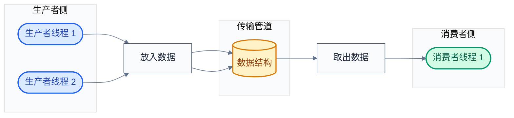
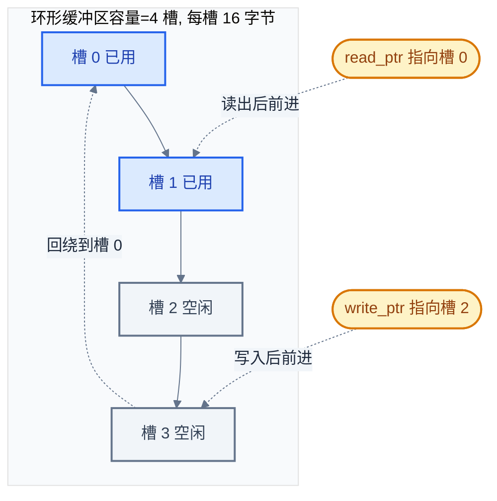
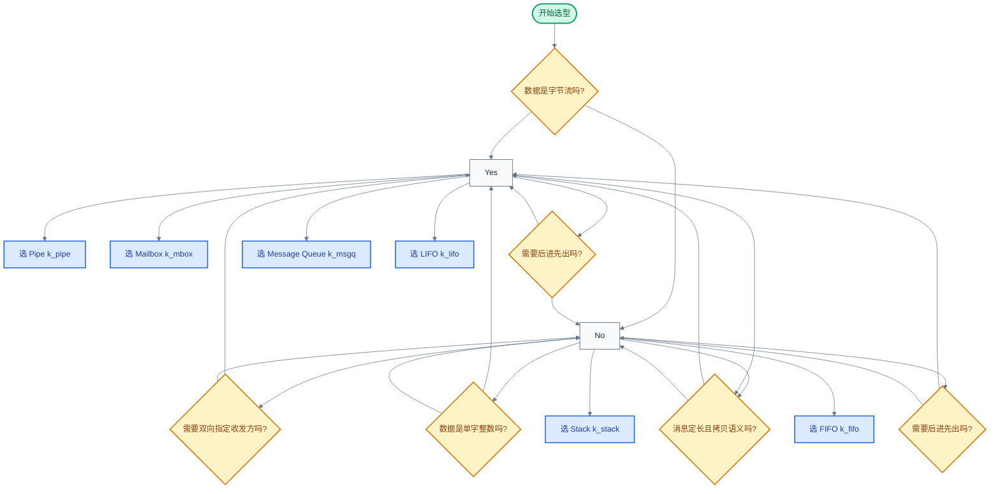

# 10. Zephyr 数据传递机制

> 一句话概括：本文从一个"传感器线程把数据交给处理线程"的场景出发，剖析 Zephyr 六种数据传递对象（FIFO、LIFO、Stack、消息队列、邮箱、管道）的本质、源码实现与选型依据。
> **工程师视角**：读完后你应当能回答"为什么 FIFO/LIFO 用侵入式链表而消息队列用环形缓冲区"、"为什么邮箱要支持异步发送"、"为什么管道适合字节流而不适合消息"这三个问题，并能为每种生产者-消费者场景选择合适的数据传递机制。

### 关键术语

| 缩写 | 全称 | 含义 |
|------|------|------|
| RTOS | Real-Time Operating System | 实时操作系统 |
| ISR | Interrupt Service Routine | 中断服务例程 |
| FIFO | First In First Out | 先进先出队列 |
| LIFO | Last In First Out | 后进先出队列 |
| MBox | Mailbox | 邮箱，支持双向、异步的消息传递对象 |
| Pipe | Pipe | 管道，字节流传递对象 |
| MSG | Message | 消息，消息队列/邮箱中传递的数据单元 |
| MB | Mailbox Buffer | 邮箱缓冲，邮箱内部消息描述符的载体 |
| MPSC | Multi-Producer Single-Consumer | 多生产者单消费者 |
| SPSC | Single-Producer Single-Consumer | 单生产者单消费者 |
| API | Application Programming Interface | 应用编程接口 |
| RAM | Random Access Memory | 随机存取存储器 |
| SMP | Symmetric Multi-Processing | 对称多处理 |
| TCB | Thread Control Block | 线程控制块，即 `struct k_thread` |
| DMA | Direct Memory Access | 直接内存访问 |

---

### 前置阅读

| 需要了解 | 参考文档 |
|----------|----------|
| 线程生命周期与上下文切换 | [05-线程与状态迁移](./05-线程与状态迁移.md) |
| 信号量、互斥锁、条件变量等同步原语 | [07-同步机制详解](./07-同步机制详解.md) |
| `sys_dlist`、`ring_buf` 等核心数据结构 | [11-核心数据结构](./11-核心数据结构.md) |

---

## 1. 概述：数据传递在做什么

> 同步机制（[07-同步机制详解](./07-同步机制详解.md)）解决的是"线程何时该等待、何时该被唤醒"的协调问题，但线程间除了协调，还需要**搬运数据**——一个线程产生数据，另一个线程消费数据。一个自然的问题是：数据怎么从生产者跑到消费者手里？本章用一个传感器场景讲清"数据传递在做什么"，再给出 Zephyr 六种机制的分类。

### 1.1 一个具体场景：传感器数据需要被处理

想象一个典型的嵌入式系统：一个 ADC 采样线程每 10ms 读取一次温度传感器，产生一个 12 位采样值；另一个处理线程负责把原始值滤波后通过串口输出。两个线程跑在不同的调度优先级上，**它们之间需要一条"传输管道"**——采样线程把数据放进去，处理线程从里面取出来。

这条"传输管道"需要回答四个问题：

1. **数据形态**：传的是指针（零拷贝）还是值（拷贝）？是定长消息还是变长字节流？
2. **顺序保证**：先放先进（FIFO）还是后放先出（LIFO）？
3. **阻塞行为**：管道满了，发送方阻塞还是返回错误？管道空了，接收方阻塞还是返回错误？
4. **中断安全**：ISR 能不能往管道里塞数据？能不能从管道里取数据？

Zephyr 提供了六种"传输管道"，每种对这四个问题的回答不同，对应不同的使用场景。

### 1.2 生产者-消费者模式的不同变体

所有数据传递机制本质上都是**生产者-消费者模式**（Producer-Consumer Pattern）的实现：一个或多个生产者往管道里放数据，一个或多个消费者从管道里取数据。差异在于管道的内部数据结构和接口语义。

下图展示最基本的生产者-消费者结构：



> **如何读这张图**：生产者侧（蓝色）可以有多个线程同时往管道塞数据；管道（黄色）是数据的中转存储，内部数据结构因机制而异（链表、数组、环形缓冲区）；消费者侧（绿色）从管道取数据。管道满时生产者阻塞，管道空时消费者阻塞——这正是 [07-同步机制详解](./07-同步机制详解.md) 中等待队列（`_wait_q_t`）的用武之地。

### 1.3 六种机制速览

Zephyr 提供六种数据传递内核对象，按数据形态和接口语义分类如下：

| 类别 | 对象 | 数据结构 | 数据形态 | 典型场景 |
|------|------|----------|----------|----------|
| **链表式** | `k_fifo` | 侵入式单链表 | 任意大小指针 | 零拷贝传递结构体 |
| **链表式** | `k_lifo` | 侵入式单链表 | 任意大小指针 | 后进先出（如最新数据优先） |
| **数组式** | `k_stack` | 定长数组 | 单字（`uintptr_t`） | 传递小整数、ID、令牌 |
| **环形缓冲式** | `k_msgq` | 环形缓冲区 | 定长消息（拷贝） | 定长传感器数据帧 |
| **描述符式** | `k_mbox` | 等待队列 + 描述符 | 任意大小（异步） | 双向通信、变长消息 |
| **字节流式** | `k_pipe` | 环形缓冲区 | 字节流（无边界） | 流式数据、串口转发 |

> **如何读这张表**：第一列是按内部数据结构的分类——前两个用链表（零拷贝、大小任意），第三个用数组（最快但只能传单字），第四个用环形缓冲区（定长、缓存友好），第五个用描述符匹配（双向、可异步），第六个用环形缓冲区但无消息边界（字节流）。选型依据是数据形态与场景需求，详见 §9。

> **核心要点**：同步机制解决"何时唤醒"，数据传递机制解决"如何搬数据"。两者底层共用 `_wait_q_t` 等待队列——当管道空/满时，线程挂到等待队列上；当数据到来/空间释放时，等待队列上的线程被唤醒。理解了 [07-同步机制详解](./07-同步机制详解.md) 的等待队列，数据传递机制的阻塞行为就一目了然。

---

## 2. 官方对比矩阵

> 第一章建立了"生产者-消费者需要传输管道"的直觉。但 Zephyr 提供了六种管道，它们之间到底有什么差异？本章直接引用 Zephyr 官方文档 `doc/kernel/services/index.rst` 对比矩阵，从六个维度横向比较，作为后续逐章剖析的导航。

### 2.1 官方对比表

下表翻译自 [index.rst](file:///home/pbw/rtos/cs-learning-notes/zephyr-project/zephyr/doc/kernel/services/index.rst#L56-L65)，是 Zephyr 官方对六种数据传递对象的高层特性对比：

| 对象 | 双向? | 数据结构 | 数据项大小 | 对齐要求 | ISR 可接收? | ISR 可发送? | 溢出处理 |
|------|-------|----------|-----------|----------|------------|------------|----------|
| **FIFO** | 否 | 队列（链表） | 任意 [^f1] | 4 字节 [^f2] | 是 [^f3] | 是 | 不适用 |
| **LIFO** | 否 | 队列（链表） | 任意 [^f1] | 4 字节 [^f2] | 是 [^f3] | 是 | 不适用 |
| **Stack** | 否 | 数组 | 单字 | 单字 | 是 [^f3] | 是 | 未定义行为 |
| **Message queue** | 否 | 环形缓冲区 | 任意 [^f6] | 2 的幂 | 是 [^f3] | 是 | 阻塞线程或返回 -errno |
| **Mailbox** | 是 | 队列（链表） | 任意 [^f1] | 任意 | 否 | 否 | 不适用 |
| **Pipe** | 否 | 环形缓冲区 [^f4] | 任意 | 任意 | 是 [^f5] | 是 [^f5] | 阻塞线程或返回 -errno |

[^f1]: 调用者在数据元素中分配队列开销——即数据项首字保留给内核作为链表 `next` 指针。
[^f2]: 通过 `k_fifo_alloc_put()` / `k_lifo_alloc_put()` 添加的数据项无对齐约束，但会临时使用调用线程资源池的内存。
[^f3]: ISR 仅在传入 `K_NO_WAIT` 作为超时参数时可接收。
[^f4]: 环形缓冲区可选——可传 `NULL` 和 0 创建无缓冲管道，此时数据必须直传给等待的读者。
[^f5]: ISR 仅在传入 `K_NO_WAIT` 作为超时参数时可发送和/或接收。
[^f6]: 数据项大小必须是对齐的整数倍。

> **如何读这张表**：**双向?** 列——只有 Mailbox 支持双向（接收方可指定发送方，反之亦然），其余都是单向"发送→接收"。**数据结构** 列决定了内部实现：链表式（FIFO/LIFO/Mailbox）零拷贝但每项需预留一个指针字 [^f1]；数组式（Stack）最快但只能传单字；环形缓冲式（Msgq/Pipe）定长缓存友好，且 Pipe 的环形缓冲可选 [^f4]。**ISR 可收发?** 列——Mailbox 完全不允许 ISR 使用，其余允许但 ISR 必须用 `K_NO_WAIT`（不能阻塞）[^f3][^f5]。**溢出处理** 列——Stack 满了再 push 是未定义行为（不检查），Msgq/Pipe 满了可阻塞或返回错误码，链表式理论无上限（仅受 RAM 限制）。**对齐要求** 列——FIFO/LIFO 默认要求 4 字节对齐（首字作链表指针），但 `alloc_put` 变体无此约束 [^f2]；Msgq 要求 2 的幂对齐且消息大小须为对齐整数倍 [^f6]。

### 2.2 六个维度的含义

- **双向性**：发送方能否指定接收方、接收方能否指定发送方。Mailbox 通过消息描述符里的 `tx_target_thread` 和 `rx_source_thread` 字段实现定向通信。
- **数据结构**：内核对象内部用什么存储数据。这决定了性能特征——链表 O(1) 入队出队且零拷贝，数组无分配开销，环形缓冲区缓存友好。
- **数据项大小**：能否传任意大小。链表式传指针（任意大小），Stack 只能传一个字（32/64 位），Msgq/Pipe 传字节序列。
- **对齐要求**：数据项地址的对齐约束。FIFO/LIFO 要求 4 字节对齐（因为首字被内核用作链表指针），Msgq 要求 2 的幂对齐。
- **ISR 收发**：ISR 能否调用收发 API。ISR 不能阻塞，所以只能用 `K_NO_WAIT` 超时。
- **溢出处理**：管道满时发送方的行为。Stack 是未定义行为（危险！），Msgq/Pipe 提供错误码或阻塞选项，链表式理论无上限。

> **核心要点**：选型的第一刀切在"数据形态"上——传指针用 FIFO/LIFO，传单字用 Stack，传定长消息用 Msgq，传变长消息用 Mailbox，传字节流用 Pipe。第二刀切在"中断安全"上——若 ISR 需要参与数据传递，排除 Mailbox。

---

## 3. FIFO：先进先出队列

> 第二章用官方对比矩阵给出了六种机制的宏观差异。从本章开始逐个剖析实现细节。先从最常用的 FIFO 讲起——它是侵入式链表式数据传递的代表，理解了 FIFO，LIFO 只是"换个方向插入"的变体。

> **官方文档**：`file:///home/pbw/rtos/cs-learning-notes/zephyr-project/zephyr/doc/kernel/services/data_passing/fifos.rst`。官方明确：FIFO 是传统先进先出队列，允许线程和 ISR 添加/移除任意大小数据项；底层由 Queue（侵入式单链表）实现；数据项首字必须对齐到字边界（内核用作 next 指针），但 `k_fifo_alloc_put` 变体无此约束。

### 3.1 一个具体小例子：传感器帧的零拷贝传递

考虑这样一个场景：ADC 线程采样后构造一个数据帧结构，要交给处理线程。如果用拷贝式传递，每帧都要 `memcpy`，数据量大时开销显著。FIFO 的做法是**把结构体地址（指针）挂进链表**，接收方拿到指针直接访问原内存——零拷贝。

最小示例：

```c
#include <zephyr/kernel.h>

/* 数据帧：首字必须预留给内核作为链表指针 */
struct sensor_frame {
    void *reserved;     /* FIFO 用，必须是对齐的首字，内核用作 next 指针 */
    uint16_t temperature;
    uint16_t humidity;
    uint64_t timestamp;
};

K_FIFO_DEFINE(sensor_fifo);   /* 静态定义并初始化一个 FIFO */

/* 生产者：ADC 采样线程 */
void adc_thread(void *a, void *b, void *c)
{
    struct sensor_frame frame = {
        .reserved = NULL,
        .temperature = 2510,   /* 25.10 ℃ */
        .humidity = 6020,      /* 60.20 % */
        .timestamp = k_uptime_get(),
    };
    /* 把局部变量的拷贝地址塞进 FIFO（实际应用中应从池分配，避免栈逃逸） */
    struct sensor_frame *p = k_malloc(sizeof(*p));
    *p = frame;
    k_fifo_put(&sensor_fifo, p);   /* 零拷贝：只挂指针 */
}

/* 消费者：处理线程 */
void proc_thread(void *a, void *b, void *c)
{
    struct sensor_frame *p = k_fifo_get(&sensor_fifo, K_FOREVER);
    printk("T=%d mC, H=%d m%%\n", p->temperature, p->humidity);
    k_free(p);   /* 消费者负责释放 */
}
```

这个例子展示了 FIFO 的三个关键特征：

1. **零拷贝**：`k_fifo_put` 只把指针挂进链表，不拷贝数据本身。
2. **首字保留**：`struct sensor_frame` 的第一个字段 `reserved` 被内核用作链表 `next` 指针，应用不能使用。
3. **任意大小**：只要结构体首字对齐到 4 字节（32 位系统）或 8 字节（64 位系统），大小不受限制。

### 3.2 数据结构与 API

`k_fifo` 实际上是 `k_queue` 的薄封装。`struct k_fifo` 的定义在 [kernel.h](file:///home/pbw/rtos/cs-learning-notes/zephyr-project/zephyr/include/zephyr/kernel.h#L2895-L2906)：

```c
struct k_fifo {
    struct k_queue _queue;
#ifdef CONFIG_OBJ_CORE_FIFO
    struct k_obj_core  obj_core;
#endif
};
```

而 `struct k_queue`（同文件）的内部数据结构是 `sys_sflist_t`（带标志位的单链表）：

```c
struct k_queue {
    sys_sflist_t data_q;        /* 实际存储数据的带标志单链表 */
    struct k_spinlock lock;      /* 保护并发访问的自旋锁 */
    _wait_q_t wait_q;           /* 等待接收的线程队列 */
    Z_DECL_POLL_EVENT
    SYS_PORT_TRACING_TRACKING_FIELD(k_queue)
};
```

FIFO 的所有 API 都是宏，转发到 `k_queue` 的函数：

| FIFO API | 转发到 | 作用 |
|----------|--------|------|
| `k_fifo_init(fifo)` | `k_queue_init` | 初始化 |
| `k_fifo_put(fifo, data)` | `k_queue_append` | 尾部追加（先进先出） |
| `k_fifo_alloc_put(fifo, data)` | `k_queue_alloc_append` | 尾部追加（自动分配节点） |
| `k_fifo_get(fifo, timeout)` | `k_queue_get` | 头部取出，可阻塞 |
| `k_fifo_put_list(fifo, head, tail)` | `k_queue_append_list` | 批量追加链表 |
| `k_fifo_put_slist(fifo, list)` | `k_queue_merge_slist` | 合并 slist |
| `k_fifo_peek_head(fifo)` | `k_queue_peek_head` | 查看头部（不移除） |
| `k_fifo_peek_tail(fifo)` | `k_queue_peek_tail` | 查看尾部（不移除） |

官方 `fifos.rst` 还提到两个批量入队 API：`k_fifo_put_list(fifo, head, tail)` 把已串成单链表的一组数据项一次性追加到 FIFO；`k_fifo_put_slist(fifo, list)` 把 `sys_slist_t` 链表合并进 FIFO。批量入队的优势是**保证一组相关数据不被其他生产者的数据穿插**，且比逐个 `put` 更高效。官方示例（`fifos.rst`）展示了生产者线程用 `k_fifo_put` 发送 `struct data_item_t`，其首字段 `void *fifo_reserved` 即链表节点保留字：

```c
/* 来源：zephyr/doc/kernel/services/data_passing/fifos.rst */
struct data_item_t {
    void *fifo_reserved;   /* 1st word reserved for use by FIFO */
    /* ... */
};

void producer_thread(int unused1, int unused2, int unused3)
{
    while (1) {
        /* create data item to send */
        tx_data = ...;
        /* send data to consumers */
        k_fifo_put(&my_fifo, &tx_data);
    }
}
```

### 3.3 为什么基于侵入式链表

`k_fifo` 内部用 `sys_sflist_t`（带标志单链表）而非容器式链表，这是 Zephyr 一贯的侵入式数据结构风格（详见 [11-核心数据结构](./11-核心数据结构.md) §1）。为什么这么设计？

- **零拷贝**：数据项自带链表节点（首字），内核只挂指针，不拷贝数据本身。对比 `k_msgq` 的 `memcpy` 拷贝，FIFO 传大结构体时优势明显。
- **O(1) 入队出队**：单链表 `append`（改尾指针）和 `get`（取头指针）都是常数时间，无遍历。
- **无内存分配**：节点字段内嵌在用户数据里，入队出队不调用 `k_malloc`/`k_free`，避免堆碎片。
- **任意大小**：链表不关心节点大小，只关心 `next` 指针，所以 FIFO 能传任意大小的结构体。

代价是：**用户数据的首字必须保留给内核**，且首字必须对齐到指针大小。这就是为什么 §3.1 的 `struct sensor_frame` 要有 `reserved` 字段。

如果用户数据无法预留首字（比如第三方库的结构体），可以用 `k_fifo_alloc_put`——内核会从调用线程的资源池分配一个 `struct alloc_node` 包装节点，把用户指针塞进去。源码见 [queue.c](file:///home/pbw/rtos/cs-learning-notes/zephyr-project/zephyr/kernel/queue.c#L25-L28)：

```c
struct alloc_node {
    sys_sfnode_t node;
    void *data;
};
```

### 3.4 源码剖析：入队与等待队列

`k_fifo_put` 转发到 `k_queue_append`，最终调用 `queue_insert`（[queue.c](file:///home/pbw/rtos/cs-learning-notes/zephyr-project/zephyr/kernel/queue.c#L132-L186)）。核心逻辑分三步：

1. **检查等待队列**：若有消费者线程正挂在 `wait_q` 上等数据，直接把数据交给它（`prepare_thread_to_run`），不入链表。
2. **挂入链表**：若无等待的消费者，把数据节点 `sys_sflist_insert` 到链表尾部。
3. **触发重调度**：若唤醒了更高优先级的消费者，调用 `z_reschedule` 切换。

入队操作的关键路径（简化）：

```c
static int32_t queue_insert(struct k_queue *queue, void *prev, void *data,
                            bool alloc, bool is_append)
{
    k_spinlock_key_t key = k_spin_lock(&queue->lock);

    /* 1. 先看有没有消费者在等 */
    first_pending_thread = z_unpend_first_thread(&queue->wait_q);
    if (unlikely(first_pending_thread != NULL)) {
        prepare_thread_to_run(first_pending_thread, data);  /* 直接交付 */
        z_reschedule(&queue->lock, key);
        return 0;
    }

    /* 2. 没人等，挂进链表 */
    sys_sfnode_init(data, 0x0);
    sys_sflist_insert(&queue->data_q, prev, data);

    /* 3. 释放锁（无重调度） */
    k_spin_unlock(&queue->lock, key);
    return 0;
}
```

`k_fifo_get`的对称逻辑：链表非空时取头节点返回；链表空且 `timeout != K_NO_WAIT` 时，调用 `z_pend_curr` 把当前线程挂到 `wait_q` 上阻塞。

> **核心要点**：FIFO 的"快速路径"是——当消费者已在等待时，生产者的 `put` 操作**绕过链表**，直接把数据交给消费者线程的 `swap_data` 字段并唤醒它。这意味着单生产者单消费者场景下，数据甚至从不真正进入链表，FIFO 退化为"线程间直接交付"。

---

## 4. LIFO：后进先出队列

> 上一章剖析了 FIFO 的侵入式链表实现。一个自然的疑问是：如果我想让"最新放入的数据最先被取出"（比如最新传感器值优先），该怎么改？答案是 LIFO——它和 FIFO 共用 `k_queue` 底层，只在插入位置上不同。

> **官方文档**：`file:///home/pbw/rtos/cs-learning-notes/zephyr-project/zephyr/doc/kernel/services/data_passing/lifos.rst`。官方明确：LIFO 是传统后进先出队列，允许线程和 ISR 添加/移除任意大小数据项；与 FIFO 共用 Queue 底层，仅插入位置不同（头插 vs 尾插）；同样支持 `k_lifo_alloc_put` 无对齐约束变体。

### 4.1 LIFO 与 FIFO 的唯一差异

`struct k_lifo` 的定义（[kernel.h](file:///home/pbw/rtos/cs-learning-notes/zephyr-project/zephyr/include/zephyr/kernel.h#L3146-L3157)）与 `k_fifo` 完全同构：

```c
struct k_lifo {
    struct k_queue _queue;
#ifdef CONFIG_OBJ_CORE_LIFO
    struct k_obj_core  obj_core;
#endif
};
```

差异在 API 宏的转发方向：

| LIFO API | 转发到 | 对应 FIFO API | 差异 |
|----------|--------|--------------|------|
| `k_lifo_put(lifo, data)` | `k_queue_prepend` | `k_fifo_put` → `k_queue_append` | 头部插入 vs 尾部插入 |
| `k_lifo_alloc_put(lifo, data)` | `k_queue_alloc_prepend` | `k_fifo_alloc_put` → `k_queue_alloc_append` | 头部插入 vs 尾部插入 |
| `k_lifo_get(lifo, timeout)` | `k_queue_get` | `k_fifo_get` → `k_queue_get` | 完全相同 |

FIFO 用 `append`（尾插），LIFO 用 `prepend`（头插）。因为 `k_queue_get` 始终从头部取，所以：

- FIFO：尾插 + 头取 = 先进先出
- LIFO：头插 + 头取 = 后进先出

### 4.2 LIFO 的适用场景

LIFO 适合"最新数据最重要"的场景：

- **状态覆盖**：传感器最新读数比旧读数重要，旧数据可丢弃。用 LIFO 让消费者总是拿到最新值。
- **对象池**：回收对象时放回 LIFO，下次分配时优先拿到刚释放的（缓存热度高）。
- **撤销栈**：记录操作历史，最近操作最先撤销。

> **核心要点**：LIFO 和 FIFO 共用 `k_queue` 实现，唯一差异是插入方向——FIFO 尾插、LIFO 头插。理解了 FIFO，LIFO 是免费的。需要"最新优先"语义时选 LIFO，需要"公平排队"语义时选 FIFO。

---

## 5. Stack：定长数值栈

> 前两章讲的是基于链表的 FIFO/LIFO，能传任意大小数据。但如果要传的就是一个简单的整数（比如线程 ID、资源编号、错误码），用链表太重——每个数据项都要预留一个指针字。Stack 用数组存储，专门传递单字（`uintptr_t`）数据，是最高效的轻量传递机制。

> **官方文档**：`file:///home/pbw/rtos/cs-learning-notes/zephyr-project/zephyr/doc/kernel/services/data_passing/stacks.rst`。官方明确：Stack 实现传统后进先出语义，传递 `stack_data_t`（即 `uintptr_t`，对应 CPU 原生字长 32/64 位）数据值；内部用数组存储且必须按字边界对齐；容量在初始化时固定。除 `k_stack_init` 外，还提供 `k_stack_alloc_init`——后者不传缓冲区，改为从调用线程资源池动态分配数组。

### 5.1 数据结构：数组而非链表

`struct k_stack` 的定义（[kernel.h](file:///home/pbw/rtos/cs-learning-notes/zephyr-project/zephyr/include/zephyr/kernel.h#L3284-L3296)）：

```c
typedef uintptr_t stack_data_t;   /* 单字类型，32 或 64 位 */

struct k_stack {
    _wait_q_t wait_q;
    struct k_spinlock lock;
    stack_data_t *base, *next, *top;   /* 数组基址、当前栈顶、数组上界 */
    uint8_t flags;
    SYS_PORT_TRACING_TRACKING_FIELD(k_stack)
#ifdef CONFIG_OBJ_CORE_STACK
    struct k_obj_core  obj_core;
#endif
};
```

三个指针 `base`、`next`、`top` 划定一个数组区间：`base` 是数组起始，`top` 是数组结束（`base + num_entries`），`next` 是当前栈顶位置（初始等于 `base`）。

### 5.2 为什么用数组而非链表

Stack 传递的是单字（`uintptr_t`），没有"用户结构体"可以内嵌链表节点——单字本身就是数据，无法再塞一个 `next` 指针。所以必须用数组存储，原因有二：

- **无节点开销**：单字数据无法内嵌链表节点（没有"首字可保留"的结构体），只能用外部数组存储。
- **缓存友好**：连续数组比链表节点（散落在堆上）对 CPU 缓存更友好，push/pop 是数组下标操作，极快。
- **固定容量**：数组大小在初始化时确定（`k_stack_init(stack, buffer, num_entries)`），无动态分配，适合资源受限的嵌入式场景。

### 5.3 push 与 pop 的源码

`k_stack_push`（[stack.c](file:///home/pbw/rtos/cs-learning-notes/zephyr-project/zephyr/kernel/stack.c#L101-L136)）：

```c
int z_impl_k_stack_push(struct k_stack *stack, stack_data_t data)
{
    k_spinlock_key_t key = k_spin_lock(&stack->lock);

    /* 满栈检查 */
    CHECKIF(stack->next == stack->top) {
        return -ENOMEM;   /* 注意：官方文档说"未定义行为"，但实现里返回 -ENOMEM */
    }

    /* 有消费者在等？直接交付 */
    first_pending_thread = z_unpend_first_thread(&stack->wait_q);
    if (unlikely(first_pending_thread != NULL)) {
        z_thread_return_value_set_with_data(first_pending_thread, 0, (void *)data);
        z_ready_thread(first_pending_thread);
        z_reschedule(&stack->lock, key);
        return 0;
    }

    /* 没人等，压栈 */
    *(stack->next) = data;
    stack->next++;
    k_spin_unlock(&stack->lock, key);
    return 0;
}
```

`k_stack_pop`是对称的退栈逻辑，栈空时按 `timeout` 阻塞或返回 `-EBUSY`。

> **关于 Stack 溢出行为**：官方对比矩阵（§2.1）将 Stack 溢出标记为"未定义行为"，官方 `stacks.rst` 明确解释——当 `CONFIG_NO_RUNTIME_CHECKS` 启用时，内核**不会**检测并阻止向已满栈 push 数据，会导致数组越界和不可预测行为。但默认配置下 `kernel/stack.c` 的 `k_stack_push` 实现通过 `CHECKIF(stack->next == stack->top)` 检查并返回 `-ENOMEM`（见上方源码）。因此："未定义行为"是 `CONFIG_NO_RUNTIME_CHECKS` 开启时的规范行为，默认配置下实测返回 `-ENOMEM`。工程实践应假设最坏情况：不要依赖返回值，自己确保不溢出。

> **核心要点**：Stack 是六种机制里最轻量的——数组存储、单字数据、O(1) push/pop、无节点开销。适合传递"小整数"场景：线程 ID、资源编号、错误码、邮箱异步消息描述符（见 §7.3）。

---

## 6. Message Queue：定长消息队列

> 前三章讲的 FIFO/LIFO/Stack 传递的都是"引用"（指针或单字），接收方拿到的是发送方构造的数据地址。但有时我们希望传递的是**值的拷贝**——发送方构造完消息就不管了，接收方拿到一份独立拷贝。Message Queue（`k_msgq`）就是为此设计：内部用环形缓冲区存储定长消息的拷贝。

> **官方文档**：`file:///home/pbw/rtos/cs-learning-notes/zephyr-project/zephyr/doc/kernel/services/data_passing/message_queues.rst`。官方明确：消息队列用环形缓冲区存储定长数据项，数据项大小须为对齐的整数倍；数据通过 `memcpy` 拷贝（与对齐无关，底层不暴露内部指针）；满时发送方可阻塞或返回 `-errno`，空时接收方可阻塞或返回 `-errno`。官方还提供 `k_msgq_peek`（查看队头不移除）、`k_msgq_purge`（清空）、`k_msgq_num_used_get` / `k_msgq_num_free_get`（查询已用/空闲槽位）等辅助 API。

### 6.1 一个具体小例子：定长传感器帧拷贝传递

回到 §3.1 的传感器场景，但这次我们希望发送方构造完帧后可以立即复用同一块内存（比如栈上变量），不希望接收方拿到栈指针。用 `k_msgq`：

```c
#include <zephyr/kernel.h>

struct sensor_frame {
    uint16_t temperature;
    uint16_t humidity;
    uint64_t timestamp;
};   /* 注意：无需 reserved 字段，因为 msgq 拷贝数据而非挂指针 */

K_MSGQ_DEFINE(sensor_msgq, sizeof(struct sensor_frame), 8, 4);
/* 参数：名称、单条消息大小、最大消息数、对齐 */

void adc_thread(void *a, void *b, void *c)
{
    struct sensor_frame frame = {   /* 栈上构造 */
        .temperature = 2510,
        .humidity = 6020,
        .timestamp = k_uptime_get(),
    };
    /* put 时 memcpy 拷贝整帧到环形缓冲区，put 返回后 frame 可立即复用 */
    k_msgq_put(&sensor_msgq, &frame, K_FOREVER);
}

void proc_thread(void *a, void *b, void *c)
{
    struct sensor_frame frame;
    k_msgq_get(&sensor_msgq, &frame, K_FOREVER);   /* 拷贝到本地 */
    printk("T=%d mC\n", frame.temperature);
}
```

与 FIFO 版本的差异：

| 维度 | FIFO 版本（§3.1） | Msgq 版本（本节） |
|------|------------------|------------------|
| **数据传递方式** | 指针（零拷贝） | 值拷贝（memcpy） |
| **结构体要求** | 首字保留 | 无需保留 |
| **发送方内存** | 必须存活到接收方用完 | put 后可立即复用 |
| **容量** | 理论无上限（受 RAM） | 固定（初始化时设定） |
| **溢出处理** | 无（链表无限长） | 阻塞或返回 -ENOMSG |

### 6.2 数据结构：环形缓冲区

`struct k_msgq` 的定义（[kernel.h](file:///home/pbw/rtos/cs-learning-notes/zephyr-project/zephyr/include/zephyr/kernel.h#L5168-L5204)）：

```c
struct k_msgq {
    _wait_q_t wait_q;
    struct k_spinlock lock;
    size_t msg_size;            /* 单条消息大小 */
    uint32_t max_msgs;          /* 最大消息数 */
    char *buffer_start;         /* 环形缓冲区起始 */
    char *buffer_end;           /* 环形缓冲区结束 */
    char *read_ptr;             /* 读指针（消费者位置） */
    char *write_ptr;            /* 写指针（生产者位置） */
    uint32_t used_msgs;         /* 已用消息数 */
    Z_DECL_POLL_EVENT
    uint8_t flags;
    SYS_PORT_TRACING_TRACKING_FIELD(k_msgq)
#ifdef CONFIG_OBJ_CORE_MSGQ
    struct k_obj_core  obj_core;
#endif
};
```

核心是 `buffer_start`、`buffer_end`、`read_ptr`、`write_ptr` 四个指针围成的环形缓冲区。`buffer_size = max_msgs * msg_size`，`read_ptr` 和 `write_ptr` 在这个范围内循环移动。

下图展示一个容量为 4 条消息、每条 16 字节的环形缓冲区，当前有 2 条消息（写指针在第 3 槽，读指针在第 1 槽）：



> **如何读这张图**：蓝色槽是已用（已写入待读），灰色槽是空闲。`read_ptr` 从槽 0 开始读，读一个前进一格；`write_ptr` 从槽 2 开始写，写一个前进一格。当任一指针走到槽 3 之后，回绕到槽 0——这就是"环形"。当前 `used_msgs = 2`，`read_ptr` 落后 `write_ptr` 两个槽。

### 6.3 为什么用环形缓冲区而非链表

`k_msgq` 选择环形缓冲区而非链表，是针对"定长消息"场景的优化：

- **缓存友好**：连续内存布局，CPU 预取生效；链表节点散落在堆上，每次跳转都可能 cache miss。
- **无内存碎片**：环形缓冲区是一次性分配的连续数组，put/get 只是移动指针，不调用 `k_malloc`/`k_free`。链表式若用 `alloc_put` 会频繁分配释放，碎片化堆。
- **定长高效**：消息大小固定（`msg_size`），`memcpy` 长度已知，编译器可优化；链表要处理变长，无法预测。
- **容量可预测**：`max_msgs` 在初始化时固定，内存占用可精确计算，适合资源受限的嵌入式系统。

代价是：**只能传定长消息**，且**容量固定**。若消息大小变化大或总量不可预测，应选 FIFO/Mailbox。

### 6.4 put 与 get 的源码

`k_msgq_put` 的核心是 `put_msg_in_queue`（[msg_q.c](file:///home/pbw/rtos/cs-learning-notes/zephyr-project/zephyr/kernel/msg_q.c#L130-L228)）。关键逻辑：

```c
static inline int put_msg_in_queue(struct k_msgq *msgq, const void *data,
                                   k_timeout_t timeout, bool put_at_back)
{
    k_spinlock_key_t key = k_spin_lock(&msgq->lock);

    if (msgq->used_msgs < msgq->max_msgs) {
        /* 有空间 */
        pending_thread = z_unpend_first_thread(&msgq->wait_q);
        if (unlikely(pending_thread != NULL)) {
            /* 有消费者在等：直接 memcpy 到它的接收缓冲 */
            memcpy(pending_thread->base.swap_data, data, msgq->msg_size);
            arch_thread_return_value_set(pending_thread, 0);
            z_ready_thread(pending_thread);
        } else {
            /* 没人等：memcpy 到环形缓冲区，write_ptr 前进 */
            memcpy(msgq->write_ptr, data, msgq->msg_size);
            msgq->write_ptr += msgq->msg_size;
            if (msgq->write_ptr == msgq->buffer_end) {
                msgq->write_ptr = msgq->buffer_start;   /* 回绕 */
            }
            msgq->used_msgs++;
        }
        return 0;
    } else if (K_TIMEOUT_EQ(timeout, K_NO_WAIT)) {
        return -ENOMSG;   /* 满且不等待 */
    } else {
        /* 满且等待：挂到 wait_q 上阻塞 */
        _current->base.swap_data = (void *) data;
        return z_pend_curr(&msgq->lock, key, &msgq->wait_q, timeout);
    }
}
```

注意"快速路径"：当消费者已在等待时，生产者的 `put` **绕过环形缓冲区**，直接 `memcpy` 到消费者的接收缓冲——这和 FIFO 的直接交付模式一致。区别只是 FIFO 传指针、Msgq 传拷贝。

### 6.5 辅助 API：peek / purge / 容量查询

官方 `message_queues.rst` 除了 `k_msgq_put` / `k_msgq_get` 外，还提供以下辅助 API（声明见 [kernel.h](file:///home/pbw/rtos/cs-learning-notes/zephyr-project/zephyr/include/zephyr/kernel.h#L5403-L5474)）：

| API | 作用 | 备注 |
|-----|------|------|
| `k_msgq_peek(msgq, data)` | 查看队头消息**但不移除** | 拷贝到 `data`，队头不动；返回 0 成功，`-ENOMSG` 队列空 |
| `k_msgq_peek_at(msgq, data, idx)` | 查看队列中第 `idx` 条消息 | 不移除；`k_msgq_peek(msgq, data)` 等价于 `k_msgq_peek_at(msgq, data, 0)` |
| `k_msgq_purge(msgq)` | 清空队列所有消息 | 唤醒所有阻塞的线程（发送方和接收方）返回 `-ENOMSG` |
| `k_msgq_num_used_get(msgq)` | 返回已用消息数 | 用于监控/水印检查 |
| `k_msgq_num_free_get(msgq)` | 返回空闲槽位数 | 用于背压判断 |

官方 `message_queues.rst` 示例展示了生产者用 `k_msgq_purge` 丢弃旧数据以保留新数据：

```c
/* 来源：zephyr/doc/kernel/services/data_passing/message_queues.rst */
void producer_thread(void)
{
    struct data_item_type data;
    while (1) {
        data = ...;
        /* send data to consumers */
        while (k_msgq_put(&my_msgq, &data, K_NO_WAIT) != 0) {
            /* message queue is full: purge old data & try again */
            k_msgq_purge(&my_msgq);
        }
    }
}
```

官方同时提醒：消息队列传大消息会增加中断延迟（写/读时关中断，耗时随消息大小线性增长），大消息应优先传指针而非数据本身；同步传递大消息应改用 Mailbox。

> **核心要点**：`k_msgq` 适合"定长、定容、拷贝语义"的场景——消息大小已知、容量可预测、发送方希望 put 后立即复用源内存。典型用途是传感器数据帧、命令包、状态快照。若消息变长或容量不可预测，改用 FIFO（链表式）或 Mailbox（描述符式）。

---

## 7. Mailbox：双向异步邮箱

> 前几章的机制都是单向的——生产者塞数据，消费者取数据，双方不"对话"。但有些场景需要双向通信：发送方指定接收方，接收方也能知道发送方是谁，甚至发送方不阻塞等待接收。Mailbox（`k_mbox`）是 Zephyr 唯一支持双向、异步、变长消息的数据传递机制。

> **官方文档**：`file:///home/pbw/rtos/cs-learning-notes/zephyr-project/zephyr/doc/kernel/services/data_passing/mailboxes.rst`。官方明确：Mailbox 提供超越消息队列的增强能力——支持任意大小消息的同步/异步收发；只允许线程使用（**不允许 ISR**）；每条消息只能被一个接收方接收（不支持广播）；通过消息描述符 `k_mbox_msg` 实现发送方与接收方的双向匹配；相关配置项为 `CONFIG_NUM_MBOX_ASYNC_MSGS`（控制异步消息描述符池大小）。

### 7.1 消息描述符：双向匹配的钥匙

Mailbox 的核心是**消息描述符** `struct k_mbox_msg`（[kernel.h](file:///home/pbw/rtos/cs-learning-notes/zephyr-project/zephyr/include/zephyr/kernel.h#L5491-L5514)）：

```c
struct k_mbox_msg {
    size_t size;                    /* 消息数据大小（字节） */
    uint32_t info;                  /* 应用自定义信息 */
    void *tx_data;                  /* 发送方的数据缓冲指针 */
    k_tid_t rx_source_thread;       /* 接收方填：期望的发送方（K_ANY 表示任意） */
    k_tid_t tx_target_thread;       /* 发送方填：期望的接收方（K_ANY 表示任意） */
    k_tid_t _syncing_thread;        /* 内部：等待同步的线程（发送方或 dummy） */
    struct k_sem *_async_sem;       /* 内部：异步发送完成时 give 的信号量 */
};
```

发送方和接收方各填一个描述符，Mailbox 用 `mbox_message_match`（[mailbox.c](file:///home/pbw/rtos/cs-learning-notes/zephyr-project/zephyr/kernel/mailbox.c#L113-L147)）匹配两者：

- 发送方用 `tx_target_thread` 指定目标接收方（或 `K_ANY` 广播）
- 接收方用 `rx_source_thread` 指定期望发送方（或 `K_ANY` 接受任意）
- 两者都满足时匹配成功，数据从 `tx_data` 拷贝到接收方缓冲

这种"双向指定"能力是 Mailbox 独有的——FIFO/LIFO/Msgq 都是无名广播，谁先取就给谁。

### 7.2 同步发送与异步发送

Mailbox 支持两种发送方式：

**同步发送**（`k_mbox_put`）：发送方阻塞，直到接收方收到**并处理完**消息（调用 `k_mbox_data_get` 取走数据后才返回）。

```c
struct k_mbox_msg tx_msg = {
    .size = sizeof(payload),
    .tx_data = &payload,
    .tx_target_thread = K_ANY,   /* 任意接收方 */
};
k_mbox_put(&mbox, &tx_msg, K_FOREVER);   /* 阻塞到接收方处理完 */
```

官方 `mailboxes.rst` 还展示了"空消息"用法——当 `info` 字段（32 位）已足够承载信息时，`size` 设为 0、`tx_data` 设为 `NULL`，省去数据缓冲：

```c
/* 来源：zephyr/doc/kernel/services/data_passing/mailboxes.rst */
void producer_thread(void)
{
    struct k_mbox_msg send_msg;
    while (1) {
        uint32_t random_value = sys_rand32_get();
        /* prepare to send empty message */
        send_msg.info = random_value;
        send_msg.size = 0;
        send_msg.tx_data = NULL;
        send_msg.tx_target_thread = K_ANY;
        /* send message and wait until a consumer receives it */
        k_mbox_put(&my_mailbox, &send_msg, K_FOREVER);
    }
}
```

**异步发送**（`k_mbox_async_put`）：发送方立即返回，不等接收方。内核用一个"dummy 线程"代理发送方挂在等待队列上。

```c
struct k_mbox_msg tx_msg = {
    .size = sizeof(payload),
    .tx_data = &payload,
    .tx_target_thread = K_ANY,
};
k_mbox_async_put(&mbox, &tx_msg, &async_sem);   /* 立即返回 */
/* 接收方处理完后，async_sem 被 give，发送方可据此知道完成 */
```

异步发送依赖 `CONFIG_NUM_MBOX_ASYNC_MSGS` 配置项——它决定了内核预分配的 `k_mbox_async` 描述符数量（即同时在途的异步消息上限）。该值默认为 10，可根据同时在途异步消息数量在 Kconfig 中调整。当配置为 0 时，`k_mbox_async_put` 不可用（编译时相关代码通过 `#if (CONFIG_NUM_MBOX_ASYNC_MSGS > 0)` 条件编译）。

### 7.3 为什么支持异步发送

异步发送解决的问题是：**发送线程不应被接收线程的处理速度拖住**。

考虑这样一个场景：高优先级控制线程要往日志邮箱发一条消息，但日志线程优先级低、处理慢。如果用同步发送，控制线程会被阻塞在 `k_mbox_put` 上，直到日志线程处理完——这违反了高优先级的实时性要求。

异步发送的机制（[mailbox.c](file:///home/pbw/rtos/cs-learning-notes/zephyr-project/zephyr/kernel/mailbox.c#L28-L49)）：

```c
#if (CONFIG_NUM_MBOX_ASYNC_MSGS > 0)
struct k_mbox_async {
    struct _thread_base thread;   /* dummy 线程对象 */
    struct k_mbox_msg tx_msg;     /* 发送消息描述符 */
};

K_STACK_DEFINE(async_msg_free, CONFIG_NUM_MBOX_ASYNC_MSGS);

static inline void mbox_async_alloc(struct k_mbox_async **async)
{
    /* 从空闲栈弹出一个 async 描述符 */
    (void)k_stack_pop(&async_msg_free, (stack_data_t *)async, K_FOREVER);
}
```

异步发送的流程：

1. `k_mbox_async_put` 从 `async_msg_free` 栈（§5 的 `k_stack`）弹出一个 `k_mbox_async` 结构。
2. 把发送消息描述符拷进去，用一个**dummy 线程**（带 `_THREAD_DUMMY` 标志）代理发送方挂在邮箱的 `tx_msg_queue` 上。
3. 发送方线程立即返回，继续干活。
4. 接收方 `k_mbox_get` 匹配到这个 dummy 线程，取走数据，处理完后 `mbox_message_dispose` 把 `async` 结构压回 `async_msg_free` 栈，并 `give` 信号量（若提供）。

这里有一个精妙的设计：**dummy 线程**让异步发送能复用同步发送的等待队列逻辑——内核不需要为异步单独写一套匹配代码，dummy 线程在 `tx_msg_queue` 里和真实线程一视同仁。

> **核心要点**：Mailbox 的异步发送用"dummy 线程 + 空闲描述符栈"实现——发送方立即返回，dummy 线程代理挂队，接收方处理完后回收描述符。这让高优先级线程能向低优先级线程发消息而不被阻塞，是实时系统中"非阻塞通知"的经典模式。

### 7.4 为什么 Mailbox 不允许 ISR 使用

官方对比矩阵（§2.1）明确标注 Mailbox 的 ISR 收发都是"否"。原因有二：

- **匹配逻辑复杂**：`mbox_message_match` 涉及描述符字段读写、线程身份比较，在自旋锁下执行时间较长，不适合 ISR 的"快进快出"约束。
- **同步发送会阻塞**：`k_mbox_put` 的同步模式要等待接收方处理完，这本质上涉及线程挂起/唤醒，ISR 不能挂起自己。

若 ISR 需要向线程发消息，应使用 FIFO/Msgq（配合 `K_NO_WAIT`）或信号量。

> **核心要点**：Mailbox 是六种机制里唯一支持"双向指定 + 异步发送 + 变长消息"的，代价是不能在 ISR 中使用、实现最复杂。适合需要"对话式"通信的场景：控制线程向工作线程下达变长命令、工作线程回报结果。

---

## 8. Pipe：字节流管道

> 前几章的机制都保留"消息边界"——每条消息独立，接收方一次拿到一条完整消息。但有些场景数据是**无边界流**——比如串口字节流、音频采样流，发送方持续写字节，接收方按需读取任意长度，不关心"一条消息"的概念。Pipe（`k_pipe`）是 Zephyr 唯一面向字节流的数据传递机制。

> **官方文档**：`file:///home/pbw/rtos/cs-learning-notes/zephyr-project/zephyr/doc/kernel/services/data_passing/pipes.rst`。官方明确：Pipe 允许线程向另一线程发送字节流，可同步整体或分片传输；核心属性是 `size`（环形缓冲容量，为 0 表示无环形缓冲）；写入时数据直接拷贝给等待的读者或落入环形缓冲，满则阻塞至有空间或超时；读取同理。官方 API 为 `k_pipe_init` / `k_pipe_write` / `k_pipe_read` / `k_pipe_reset`（注意：官方 `pipes.rst` 未提到 `k_pipe_close`，该 API 是 `kernel.h` 中额外声明的扩展接口，用于关闭管道使后续读写返回 `-EPIPE`）。

### 8.1 字节流 vs 消息

消息式（FIFO/Msgq/Mailbox）与字节流式（Pipe）的根本差异：

| 维度 | 消息式（FIFO/Msgq/Mailbox） | 字节流式（Pipe） |
|------|---------------------------|-----------------|
| **边界** | 保留消息边界 | 无边界，连续字节 |
| **写入** | 一次 put 一条完整消息 | 一次 write 任意字节 |
| **读取** | 一次 get 一条完整消息 | 一次 read 任意字节，可能读到半条 |
| **分段** | 不支持（消息原子） | 支持（写 100 字节可能分两次完成） |
| **典型场景** | 命令、数据帧、事件 | 串口流、音频流、文件流 |

### 8.2 数据结构与 API

`struct k_pipe` 的定义（[kernel.h](file:///home/pbw/rtos/cs-learning-notes/zephyr-project/zephyr/include/zephyr/kernel.h#L5676-L5695)）：

```c
struct k_pipe {
    size_t waiting;              /* 等待中的线程数（用于 reset 同步） */
    struct ring_buf buf;         /* 环形字节缓冲区 */
    struct k_spinlock lock;
    _wait_q_t data;              /* 等待读数据的线程队列 */
    _wait_q_t space;             /* 等待写空间的线程队列 */
    uint8_t flags;
    Z_DECL_POLL_EVENT
#ifdef CONFIG_OBJ_CORE_PIPE
    struct k_obj_core  obj_core;
#endif
};
```

注意 Pipe 有**两个等待队列**：`data`（读者等待数据到达）和 `space`（写者等待空间释放）。这是因为字节流场景下，写者可能因缓冲区满而阻塞，读者可能因缓冲区空而阻塞——两种阻塞方向需要分开管理。

API 很简洁：

| API | 作用 |
|-----|------|
| `k_pipe_init(pipe, buffer, size)` | 初始化，buffer 可为 NULL（无环形缓冲，纯直传） |
| `k_pipe_write(pipe, data, len, timeout)` | 写字节流，返回写入字节数（可能 < len） |
| `k_pipe_read(pipe, data, len, timeout)` | 读字节流，返回读出字节数（可能 < len） |
| `k_pipe_reset(pipe)` | 重置，丢弃所有数据，唤醒所有等待者返回 -ECANCELED |
| `k_pipe_close(pipe)` | 关闭，后续读写返回 -EPIPE |

### 8.3 为什么 Pipe 适合字节流

Pipe 的设计针对字节流场景做了三个优化：

**直传优化**：当读者已在等待时，写者的数据**绕过环形缓冲区**，直接 `memcpy` 到读者的缓冲区（`copy_to_pending_readers`，[pipe.c](file:///home/pbw/rtos/cs-learning-notes/zephyr-project/zephyr/kernel/pipe.c#L93-L145)）。这在无环形缓冲（`buffer_size = 0`）的纯直传模式下尤其高效——数据从不落盘到中间缓冲。

**分段读写**：`k_pipe_write` 返回实际写入字节数（可能小于请求长度）。若缓冲区只有 50 字节空间，写 100 字节会先写 50 字节返回，调用方可再次写入剩余部分。这适合流式数据——发送方不需要把数据切成"消息"。

**零缓冲模式**：`k_pipe_init(pipe, NULL, 0)` 创建无环形缓冲的管道。此时所有数据都必须直传给等待的读者——若没有读者，写者阻塞。这是最高效的"线程间直传"模式，类似 Unix 管道的语义。

### 8.4 写操作的源码

`k_pipe_write` 的核心循环（[pipe.c](file:///home/pbw/rtos/cs-learning-notes/zephyr-project/zephyr/kernel/pipe.c#L147-L218)）：

```c
int z_impl_k_pipe_write(struct k_pipe *pipe, const uint8_t *data,
                        size_t len, k_timeout_t timeout)
{
    k_timepoint_t end = sys_timepoint_calc(timeout);
    k_spinlock_key_t key = k_spin_lock(&pipe->lock);
    size_t written = 0;

    for (;;) {
        if (unlikely(pipe_closed(pipe))) {
            return -EPIPE;
        }

        /* 1. 缓冲区空且有读者等待：直传给读者 */
        if (pipe_empty(pipe)) {
            if (pipe->waiting != 0) {
                written += copy_to_pending_readers(pipe, &need_resched,
                                                    &data[written], len - written);
                if (written >= len) break;
            }
        }

        /* 2. 写入环形缓冲区 */
        written += ring_buf_put(&pipe->buf, &data[written], len - written);
        if (likely(written == len)) break;

        /* 3. 缓冲区满且未写完：阻塞等待空间 */
        int rc = wait_for(&pipe->space, pipe, &key, end, &need_resched);
        if (rc != 0) return rc;   /* 超时或被 reset */
    }

    if (need_resched) z_reschedule(&pipe->lock, key);
    else k_spin_unlock(&pipe->lock, key);
    return written;
}
```

> **说明**：上方简化代码中两处 `return` 直接返回，跳过了 `k_spin_unlock`。实际源码用 `break` 跳出循环后由末尾统一释放锁（`if (need_resched) z_reschedule(...); else k_spin_unlock(...);`），此处简化省略。

> **核心要点**：Pipe 的两个设计精髓是"直传"和"分段"——读者等待时写者数据绕过缓冲区直达读者（零中间拷贝）；写者写不完时返回实际写入量，调用方决定是否继续。这让它既适合有缓冲的流式传输，也适合无缓冲的线程间直传。

---

## 9. 选型决策树

> 前六章分别剖析了六种机制。一个自然的问题是：面对具体场景，该怎么选？本章用一个 Mermaid 决策树把选型逻辑可视化，覆盖数据形态、中断需求、通信方向三个关键维度。

### 9.1 决策流程图



> **如何读这张图**：从顶部"开始选型"出发，按黄色菱形判断框的提问逐层向下。第一刀切"字节流 vs 消息"——字节流直接选 Pipe。第二刀切"双向通信"——需要指定收发方选 Mailbox。第三刀切"数据形态"——单字整数选 Stack，定长消息选 Msgq，变长指针选 FIFO/LIFO。最后切"顺序"——需要后进先出选 LIFO，否则 FIFO。

### 9.2 选型考量维度

决策树覆盖三个主要维度，实际选型还要考虑：

| 维度 | 选项 | 影响 |
|------|------|------|
| **数据形态** | 指针 / 单字 / 定长消息 / 变长消息 / 字节流 | 决定可选机制子集 |
| **中断参与** | ISR 需要收发 / 仅线程间 | ISR 场景排除 Mailbox |
| **通信方向** | 单向广播 / 双向指定 | 双向选 Mailbox |
| **拷贝语义** | 零拷贝（指针）/ 值拷贝 | 零拷贝选 FIFO/LIFO，拷贝选 Msgq |
| **容量需求** | 固定容量 / 可扩展 | 固定选 Msgq/Pipe/Stack，可扩展选 FIFO/LIFO/Mailbox |
| **阻塞行为** | 满即阻塞 / 满即返回错误 | Msgq/Pipe 两者皆可，Stack 满即错误 |

> **核心要点**：选型不是"哪个更好"，而是"哪个匹配"。90% 的线程间数据传递场景用 FIFO（零拷贝指针传递）或 Msgq（定长拷贝传递）就够了。Mailbox 用于需要双向对话的高层协议，Pipe 用于字节流，Stack 用于轻量单字传递（如对象池令牌）。

---

## 10. 实战：五种机制对比实现

> 前九章分别讲了机制和选型。本章用一个统一的生产者-消费者场景，分别用 FIFO、LIFO、Stack、Msgq、Pipe 五种机制实现，横向对比代码形态与行为差异，巩固选型直觉。

### 10.1 场景定义

- **生产者**：1 个线程，每 100ms 产生一个"温度读数"（16 位整数）。
- **消费者**：1 个线程，阻塞等待读数，打印到串口。
- **缓冲深度**：4 条。

### 10.2 五种实现

**FIFO 实现**（零拷贝指针传递）：

```c
#include <zephyr/kernel.h>

struct reading {
    void *reserved;      /* FIFO 链表节点，内核用 */
    int16_t value;
};

K_FIFO_DEFINE(reading_fifo);

void producer(void *a, void *b, void *c)
{
    while (1) {
        struct reading *r = k_malloc(sizeof(*r));
        r->value = read_sensor();
        k_fifo_put(&reading_fifo, r);   /* 挂指针，零拷贝 */
        k_sleep(K_MSEC(100));
    }
}

void consumer(void *a, void *b, void *c)
{
    while (1) {
        struct reading *r = k_fifo_get(&reading_fifo, K_FOREVER);
        printk("T=%d\n", r->value);
        k_free(r);   /* 消费者释放 */
    }
}
```

**LIFO 实现**（最新优先，仅改 `k_fifo_put` 为 `k_lifo_put`）：

```c
K_LIFO_DEFINE(reading_lifo);

void producer(void *a, void *b, void *c)
{
    while (1) {
        struct reading *r = k_malloc(sizeof(*r));
        r->value = read_sensor();
        k_lifo_put(&reading_lifo, r);   /* 头插，消费者拿到最新 */
        k_sleep(K_MSEC(100));
    }
}
/* consumer 同 FIFO 版本，把 fifo 换成 lifo */
```

**Stack 实现**（单字传递，最轻量）：

```c
K_STACK_DEFINE(reading_stack, 4);   /* 容量 4 个 stack_data_t */

void producer(void *a, void *b, void *c)
{
    int16_t v;
    while (1) {
        v = read_sensor();
        /* Stack 存 uintptr_t，把 16 位值转成单字压栈 */
        k_stack_push(&reading_stack, (stack_data_t)v);
        k_sleep(K_MSEC(100));
    }
}

void consumer(void *a, void *b, void *c)
{
    stack_data_t v;
    while (1) {
        k_stack_pop(&reading_stack, &v, K_FOREVER);
        printk("T=%d\n", (int16_t)v);
    }
}
```

**Msgq 实现**（定长拷贝，容量固定）：

```c
K_MSGQ_DEFINE(reading_msgq, sizeof(int16_t), 4, 2);
/* 单条消息 2 字节，最多 4 条，2 字节对齐 */

void producer(void *a, void *b, void *c)
{
    int16_t v;
    while (1) {
        v = read_sensor();
        k_msgq_put(&reading_msgq, &v, K_FOREVER);   /* memcpy 拷贝 */
        k_sleep(K_MSEC(100));
    }
}

void consumer(void *a, void *b, void *c)
{
    int16_t v;
    while (1) {
        k_msgq_get(&reading_msgq, &v, K_FOREVER);
        printk("T=%d\n", v);
    }
}
```

**Pipe 实现**（字节流，无消息边界）：

```c
K_PIPE_DEFINE(reading_pipe, 8, 4);   /* 8 字节缓冲 = 4 个 int16_t */

void producer(void *a, void *b, void *c)
{
    int16_t v;
    while (1) {
        v = read_sensor();
        /* 写 2 字节，可能写不满（缓冲满时） */
        size_t written = 0;
        while (written < sizeof(v)) {
            int ret = k_pipe_write(&reading_pipe, (uint8_t *)&v + written,
                                    sizeof(v) - written, K_FOREVER);
            if (ret < 0) break;
            written += ret;
        }
        k_sleep(K_MSEC(100));
    }
}

void consumer(void *a, void *b, void *c)
{
    int16_t v;
    while (1) {
        size_t read = 0;
        while (read < sizeof(v)) {
            int ret = k_pipe_read(&reading_pipe, (uint8_t *)&v + read,
                                   sizeof(v) - read, K_FOREVER);
            if (ret < 0) break;
            read += ret;
        }
        printk("T=%d\n", v);
    }
}
```

### 10.3 横向对比

| 维度 | FIFO | LIFO | Stack | Msgq | Pipe |
|------|------|------|-------|------|------|
| **数据形态** | 指针 | 指针 | 单字 | 定长拷贝 | 字节流 |
| **结构体要求** | 首字保留 | 首字保留 | 无 | 无 | 无 |
| **内存分配** | 生产者 malloc | 生产者 malloc | 无 | 无 | 无 |
| **拷贝开销** | 零 | 零 | 零 | memcpy | memcpy |
| **容量** | 无限（RAM） | 无限（RAM） | 固定 4 | 固定 4 | 固定 4 |
| **顺序** | 先进先出 | 后进先出 | 后进先出 | 先进先出 | 字节流 |
| **代码量** | 中 | 中 | 少 | 中 | 多 |
| **本场景适用** | 好 | 差（旧数据丢失） | 好 | 好 | 差（边界处理繁琐） |

> **如何读这张表**：本场景传的是单个 16 位整数，Stack 最合适——零分配、零拷贝、代码最少。Msgq 也不错但 memcpy 有点浪费。FIFO 可行但要 malloc/free 开销。LIFO 不合适（会让旧读数堆在栈底永远读不到，缓冲满后新读数反而丢失）。Pipe 最差——字节流无边界，要手动循环写满 2 字节，代码最繁琐。

> **核心要点**：同一场景五种机制都能实现，但"合适度"差异巨大。选型的核心是**让数据形态匹配机制特性**——单字用 Stack，定长用 Msgq，指针用 FIFO/LIFO，字节流用 Pipe。错配会导致代码繁琐（如 Pipe 传定长消息）或语义错误（如 LIFO 传需保序的数据）。

---

## 参考资料

- [Zephyr Data Passing 官方文档](file:///home/pbw/rtos/cs-learning-notes/zephyr-project/zephyr/doc/kernel/services/index.rst) — 数据传递总览与对比矩阵
- [FIFOs](file:///home/pbw/rtos/cs-learning-notes/zephyr-project/zephyr/doc/kernel/services/data_passing/fifos.rst) — FIFO 概念与用法
- [LIFOs](file:///home/pbw/rtos/cs-learning-notes/zephyr-project/zephyr/doc/kernel/services/data_passing/lifos.rst) — LIFO 概念与用法
- [Stacks](file:///home/pbw/rtos/cs-learning-notes/zephyr-project/zephyr/doc/kernel/services/data_passing/stacks.rst) — Stack 概念与用法
- [Message Queues](file:///home/pbw/rtos/cs-learning-notes/zephyr-project/zephyr/doc/kernel/services/data_passing/message_queues.rst) — Msgq 概念与用法
- [Mailboxes](file:///home/pbw/rtos/cs-learning-notes/zephyr-project/zephyr/doc/kernel/services/data_passing/mailboxes.rst) — Mailbox 概念与用法
- [Pipes](file:///home/pbw/rtos/cs-learning-notes/zephyr-project/zephyr/doc/kernel/services/data_passing/pipes.rst) — Pipe 概念与用法
- [kernel/queue.c](file:///home/pbw/rtos/cs-learning-notes/zephyr-project/zephyr/kernel/queue.c) — FIFO/LIFO 底层实现
- [kernel/msg_q.c](file:///home/pbw/rtos/cs-learning-notes/zephyr-project/zephyr/kernel/msg_q.c) — Msgq 实现
- [kernel/stack.c](file:///home/pbw/rtos/cs-learning-notes/zephyr-project/zephyr/kernel/stack.c) — Stack 实现
- [kernel/mailbox.c](file:///home/pbw/rtos/cs-learning-notes/zephyr-project/zephyr/kernel/mailbox.c) — Mailbox 实现
- [kernel/pipe.c](file:///home/pbw/rtos/cs-learning-notes/zephyr-project/zephyr/kernel/pipe.c) — Pipe 实现
- [include/zephyr/kernel.h](file:///home/pbw/rtos/cs-learning-notes/zephyr-project/zephyr/include/zephyr/kernel.h) — 所有数据传递 API 声明

## 下一篇

[11-核心数据结构](./11-核心数据结构.md) — 本文反复提到的 `sys_sflist`（FIFO/LIFO 底层）、`ring_buf`（Msgq/Pipe 底层）、`_wait_q_t`（所有机制的阻塞支持）等数据结构，在下一篇有系统性剖析。
