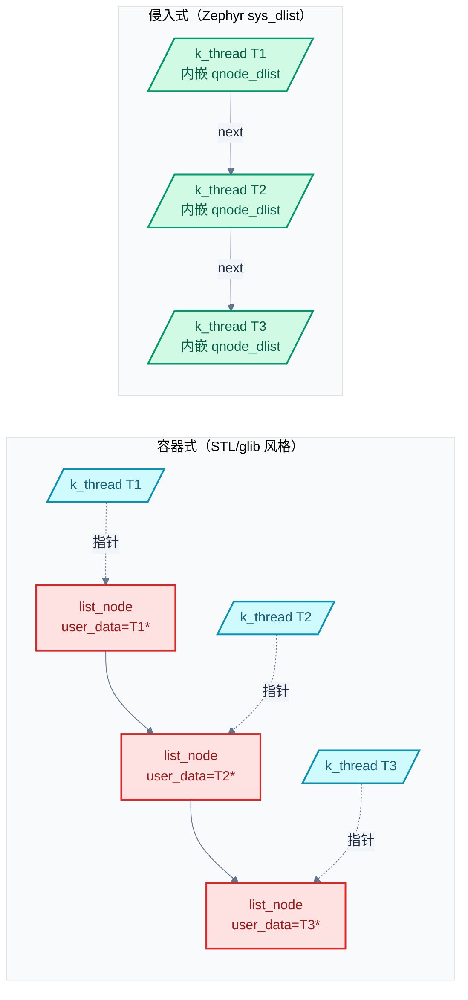
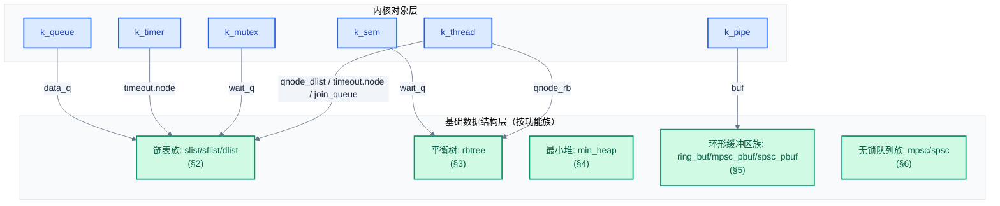

# 11. Zephyr 核心数据结构

> 一句话概括：本文从"侵入式数据结构"的本质切入，按功能族逐一剖析 Zephyr 内核 9 类基础数据结构（链表族 slist/sflist/dlist、平衡树 rbtree、最小堆 min_heap、环形缓冲区族 ring_buf/mpsc_pbuf/spsc_pbuf、无锁队列族 mpsc/spsc），并落到 `k_thread`/`k_mutex` 等内核对象的真实使用场景。
> **工程师视角**：读完后应能回答"为什么内核用侵入式而非容器式"、"为什么默认非线程安全"、"为什么无锁队列要区分 mpsc 与 spsc"这三个问题，并能在源码中定位每个内核对象使用了哪些数据结构。

### 关键术语

| 缩写 | 全称 | 含义 |
|------|------|------|
| RTOS | Real-Time Operating System | 实时操作系统 |
| API | Application Programming Interface | 应用编程接口 |
| RAM | Random Access Memory | 随机存取存储器 |
| FIFO | First-In First-Out | 先进先出 |
| ISR | Interrupt Service Routine | 中断服务例程 |
| SMP | Symmetric Multi-Processing | 对称多处理 |
| TCB | Thread Control Block | 线程控制块，即 `struct k_thread` |
| DMA | Direct Memory Access | 直接内存访问 |
| CAS | Compare-And-Swap | 比较并交换，原子操作原语 |
| MPSC | Multi-Producer Single-Consumer | 多生产者单消费者 |
| SPSC | Single-Producer Single-Consumer | 单生产者单消费者 |
| CPU | Central Processing Unit | 中央处理器 |
| EDF | Earliest Deadline First | 最早截止期优先（调度算法） |
| MESI | Modified Exclusive Shared Invalid | 多核 cache 一致性协议 |
| NCA | Non-Coherent Access | 非一致缓存访问 |

---

### 前置阅读

| 需要了解 | 参考文档 |
|----------|----------|
| Zephyr 分层架构与内核组件速查 | [00-入门概览](./00-入门概览.md) |
| 线程控制块 `k_thread` 的字段与生命周期 | [05-线程与状态迁移](./05-线程与状态迁移.md) |
| 调度策略对就绪队列的要求 | [06-调度策略详解](./06-调度策略详解.md) |
| 互斥锁/信号量/队列对等待队列的依赖 | [07-同步机制详解](./07-同步机制详解.md) |

---

## 1. 概述：侵入式数据结构的本质

> 前文讨论线程、调度、同步机制时反复出现 `sys_dlist_t`、`_wait_q_t`、`_timeout` 等结构——它们共同指向内核最底层的一组数据结构。本章先回答"为什么 Zephyr 不直接用 `glib`/STL 那种容器持有数据的链表"，再用一张全局映射表让你立刻看清"哪个内核对象用了哪些数据结构"，最后按"功能族"逐族展开。

### 1.1 一个具体小例子：3 个节点如何挂进链表

考虑一个最朴素的需求：内核里有 3 个线程 `T1/T2/T3`，要把它们按优先级挂进就绪队列。常见的两种写法对比如下。

**容器式写法**（C++ STL / glib 风格）：容器自己分配节点，节点里存指向用户数据的指针。

```c
/* 容器式：链表节点由容器分配，内部持有用户数据指针 */
struct list_node {
    void *user_data;        /* 指向 k_thread */
    struct list_node *next;
};
struct list_node *ready_q = NULL;
ready_q = list_append(ready_q, &thread1);  /* 内部分配节点 */
```

**侵入式写法**（Zephyr 实际采用）：用户数据自带链表节点字段，容器只持有头/尾指针。

```c
/* 侵入式：节点字段内嵌在用户结构里，容器不持有数据指针 */
struct k_thread {
    struct _thread_base base;          /* 其内嵌 sys_dnode_t qnode_dlist */
    /* ... 其它字段 ... */
};

sys_dlist_t ready_q;
sys_dlist_init(&ready_q);
sys_dlist_append(&ready_q, &thread1.base.qnode_dlist);  /* 不分配，直接挂入 */
```

下面用 3 个线程 `T1 → T2 → T3` 演示侵入式链表的挂入过程：

1. 初始：`ready_q.head = ready_q.tail = &ready_q`（哨兵自环）
2. 挂入 `T1`：`ready_q.head = &T1.qnode`，`T1.qnode.prev = T1.qnode.next = &ready_q`
3. 挂入 `T2`：`T1.qnode.next = &T2.qnode`，`T2.qnode.prev = &T1.qnode`，`ready_q.tail = &T2.qnode`
4. 挂入 `T3`：`T2.qnode.next = &T3.qnode`，`T3.qnode.prev = &T2.qnode`，`ready_q.tail = &T3.qnode`

整个过程**没有调用任何内存分配函数**——节点字段早就内嵌在 `k_thread` 里了。这是侵入式数据结构的核心收益。

### 1.2 侵入式 vs 容器式：四个维度对比

| 对比维度 | 容器式（如 STL list） | 侵入式（Zephyr sys_dlist） |
|----------|----------------------|---------------------------|
| **节点归属** | 容器分配并持有节点 | 用户结构内嵌节点字段 |
| **内存分配** | 每次 insert 需 malloc（或池分配） | 零分配，节点本就存在 |
| **多链表归属** | 同一对象需多份节点副本 | 同一对象可同时挂在多条链表（多个 node 字段） |
| **零拷贝** | 节点持有数据指针，多一跳间接 | `CONTAINER_OF` 宏直接反推宿主地址 |

> **如何读这张表**：第一行说明"节点是谁的"——容器式节点归容器所有，侵入式节点归用户对象所有。第二、三、四行都是第一行的直接推论：因为节点在用户对象里，所以无需分配、可同时多链表归属、可零拷贝反推宿主。这张表是理解 Zephyr 全部基础数据结构的钥匙。

下图直观对比两种写法在内存布局上的差异：



> **如何读这张图**：左图容器式有"链表节点"与"用户数据"两套对象，节点内部通过 `user_data` 指针跳到 `k_thread`——多一层间接、多一次分配。右图侵入式只有一套对象，`qnode_dlist` 直接内嵌在 `k_thread` 里，链表通过 `next/prev` 直接连起 `k_thread` 本身——零间接、零分配。

> **核心要点**：侵入式数据结构把"链表节点"字段内嵌到用户对象中，容器只持有头/尾指针。这种"数据自带节点"的设计让 Zephyr 在禁用动态分配的内核场景下仍能维护任意复杂的链表/树/堆结构——这是 RTOS 区别于通用 OS 的关键约束。

### 1.3 三个关键"为什么"

**为什么内核用侵入式而非容器式？** 三个理由叠加：

1. **多链表归属**——一个 `k_thread` 可能同时在就绪队列、超时队列、join 队列里。侵入式只需在 `k_thread` 里内嵌多个节点字段（`qnode_dlist`、`timeout.node`、`join_queue.waitq`），互不干扰。容器式则需为每条链表分配独立节点并维护数据指针同步。
2. **零拷贝**——通过 `CONTAINER_OF(node, struct k_thread, base.qnode_dlist)` 宏直接从节点地址反推宿主地址，无需拷贝、无需额外指针解引用。
3. **内存效率**——嵌入式设备 RAM 通常只有几 KB 到几 MB，禁用 `malloc` 是常态。侵入式让"数据结构"与"对象生命周期"解耦——对象在哪，节点就在哪。

**为什么默认非线程安全？** 性能与职责清晰。Zephyr 官方文档（[index.rst](file:///home/pbw/rtos/cs-learning-notes/zephyr-project/zephyr/doc/kernel/data_structures/index.rst)）明确写道："these libraries are generally unsynchronized; access to them is not threadsafe by default. These are data structures, not synchronization primitives."。

- **性能**——若内置锁，单生产者单消费者场景会被强制付出锁开销。Zephyr 选择把锁下放到调用者，由调用者按场景决定是否加锁。
- **职责清晰**——调用者最清楚自己的并发模型。例如内核就绪队列只在持有调度器锁时操作，再加一层锁纯属浪费；而 MPSC 队列则用无锁原子操作替代锁。把同步责任交给调用者，让"数据结构"和"同步原语"各司其职。

**为什么无锁队列要区分 mpsc 与 spsc？** 避免不必要的 CAS 失败重试与 cache-line 弹跳。

- **SPSC**（单生产者单消费者）场景下，生产者与消费者各只读写自己的索引，只需在共享索引上用 `atomic_t` 保证可见性，**完全无需 CAS**。这是性能最高的并发队列。
- **MPSC**（多生产者单消费者）场景下，多个生产者竞争同一 head 指针。Zephyr 采用 Dmitry Vyukov 的算法：每个生产者用一次原子 swap 把自己的节点链入队尾，无需 CAS 循环重试。如果错用 SPSC 实现承载多生产者，会发生丢节点；如果错用 MPSC 实现承载单生产者，会多付出原子操作开销。

> **核心要点**：Zephyr 的基础数据结构层（`sys/slist.h`、`sys/dlist.h`、`sys/rb.h` 等）都是"非同步、侵入式、零分配"的。同步责任下放给调用者：单生产者单消费者用 SPSC 无锁队列，多生产者单消费者用 MPSC 无锁队列，复杂并发场景则由内核对象自带的 `k_spinlock` 或 `_wait_q_t` 保护。

> **设计洞察**："默认非线程安全"是系统软件中"策略与机制分离"原则的典范应用。Linux 内核的 `list_head`、`hlist` 同样不内置锁——同步责任下放到调用者（如调度器持有 `tasklist_lock` 操作进程链表、网络栈用 RCU 读侧保护路由表）。这种设计让同一份数据结构能适配差异巨大的并发模型：单生产者单消费者场景零开销（如 SPSC 无锁队列），多核竞争场景由调用者按需加自旋锁或使用 RCU。若内置锁，单生产者场景被强制付出锁开销，多核场景又可能需要更精细的锁策略——一刀切的锁反而成为瓶颈。

### 1.4 内核对象 → 数据结构全局映射表

在深入每个数据结构之前，先建立"内核对象用了哪些数据结构"的全局视野。这张表是后续 7 章的导航图，每条线都会在 [§7](#7-综合应用内核对象如何使用数据结构) 落到具体字段。

| 内核对象 | 关键字段 | 数据结构 | 所在章节 | 用途 |
|----------|----------|----------|---------|------|
| `k_thread` | `base.qnode_dlist` / `base.qnode_rb` | `sys_dnode_t` / `struct rbnode` | [§2.3](#23-双链表-sys_dlist--哨兵设计) / [§3](#3-平衡树sys_rbtree) | 就绪/等待队列（DUMB/SCALABLE 二选一） |
| `k_thread` | `base.timeout.node` | `sys_dnode_t` | [§2.3](#23-双链表-sys_dlist--哨兵设计) | 挂入全局超时链 |
| `k_thread` | `join_queue` | `_wait_q_t` | [§3.5](#35-在内核中的关键用途_wait_q_t-的-kconfig-切换) | 等待 join 的线程队列 |
| `k_mutex` | `wait_q` | `_wait_q_t` | [§3.5](#35-在内核中的关键用途_wait_q_t-的-kconfig-切换) | 等待获取锁的线程 |
| `k_sem` | `wait_q` | `_wait_q_t` | [§3.5](#35-在内核中的关键用途_wait_q_t-的-kconfig-切换) | 等待信号量的线程 |
| `k_timer` | `timeout` | `struct _timeout`（含 `sys_dnode_t`） | [§2.3](#23-双链表-sys-dlist--哨兵设计) | 挂入超时链 |
| `k_queue`（FIFO/LIFO 底层） | `data_q` | `sys_sflist_t` | [§2.2](#22-带标志位单链表-sys_sflist) | 数据链（带 2 位标志） |
| `k_pipe` | `buf` | `struct ring_buf` | [§5.1](#51-基础环形缓冲区-ring_buf) | 字节流缓冲 |
| 日志后端 | — | `mpsc_pbuf_buffer` | [§5.2](#52-多生产者环形缓冲区-mpsc_pbuf) | 多 ISR 提交日志 |
| 跨核 IPC | — | `spsc_pbuf` | [§5.3](#53-单生产者单消费者环形缓冲区-spsc_pbuf) | 核间共享内存 |
| 系统调用入口 | — | `struct mpsc` | [§6.1](#61-mpsc-无锁队列vyukov-算法) | ISR→thread 提交 |

> **如何读这张表**：左侧是内核对象，中间是它内嵌的字段，右侧是该字段使用的基础数据结构。注意 `k_thread` 同时出现在前三行——它通过内嵌多个节点字段同时挂在就绪队列、超时队列、join 队列上，这正是侵入式"多链表归属"的体现。`_wait_q_t` 通过 Kconfig 在 dlist 与 rbtree 之间切换，所以 `k_mutex`/`k_sem` 等的等待队列底层可在 [§2.3](#23-双链表-sys_dlist--哨兵设计) 与 [§3](#3-平衡树sys_rbtree) 间切换。

### 1.5 全文导览

后续 6 章按"功能族"组织——同族数据结构放在一起便于横向对比演进：

| 章节 | 数据结构族 | 头文件 | 复杂度 | 典型内核用途 |
|------|-----------|--------|--------|--------------|
| [§2](#2-链表族slist--sflist--dlist) | 链表族（slist/sflist/dlist） | `sys/slist.h`、`sys/sflist.h`、`sys/dlist.h` | O(1) 头尾 / O(n) 中间 | `k_queue` 数据链、就绪队列（DUMB）、超时链 |
| [§3](#3-平衡树sys_rbtree) | 平衡树（rbtree） | `sys/rb.h` | O(log n) | 等待队列（SCALABLE）、`_wait_q_t` |
| [§4](#4-最小堆sys_minheap) | 最小堆（min_heap） | `sys/min_heap.h` | O(log n) 插入取出 / O(1) peek | 优先级调度、最早截止期 |
| [§5](#5-环形缓冲区族ring_buf--mpsc_pbuf--spsc_pbuf) | 环形缓冲区族（ring_buf/mpsc_pbuf/spsc_pbuf） | `sys/ring_buffer.h`、`sys/mpsc_pbuf.h`、`sys/spsc_pbuf.h` | O(1) | `k_pipe` 字节流、日志后端、跨核 IPC |
| [§6](#6-无锁队列族mpsc--spsc) | 无锁队列族（mpsc/spsc） | `sys/mpsc_lockfree.h`、`sys/spsc_lockfree.h` | O(1) 无锁 | 系统调用入口、ISR→thread 提交 |
| [§7](#7-综合应用内核对象如何使用数据结构) | 内核对象综合应用 | `kernel_structs.h`、`kernel.h` | — | 串联前 6 节到真实对象 |

> **如何读这张表**：第 3 列给出每个结构的官方头文件路径，第 4 列是关键操作的时间复杂度。"链表 → 树 → 堆 → 环形缓冲 → 无锁队列"的顺序遵循两条线：一是"操作复杂度递增"（O(1) → O(log n) → 无锁高并发）；二是"演进关系清晰"（链表族内 slist→sflist→dlist 递进，环形缓冲区族内 ring_buf→mpsc_pbuf→spsc_pbuf 演进，无锁队列族内 mpsc→spsc 算法对比）。

> **设计洞察**：把同族数据结构放在一章里讲，是为了让演进关系一目了然。例如 §5 把 `ring_buf`（无锁基础形态）、`mpsc_pbuf`（加自旋锁支持多生产者）、`spsc_pbuf`（去锁并加 cache 行隔离支持跨核）三者放一起，读者一眼看清"为什么有三种"、"各自解决什么场景"。原章节把环形缓冲区分散在多章、把无锁队列与 `*_pbuf` 分在两处，导致读者要反复跳转，难以建立全局对比——这是本重构的核心动机。

---

## 2. 链表族：slist / sflist / dlist

> 上一章建立了"侵入式 + 非同步"的总框架。最简单的侵入式结构是单链表——每个节点只存一个 `next` 指针，容器存 head/tail。本章把三种链表变体放一起讲：**slist**（最朴素单链表）→ **sflist**（在 next 指针低位复用 2 位标志位）→ **dlist**（双链表 + 哨兵设计消除边界分支）。三者的演进逻辑是"先做加法（加标志位）再做减法（消除分支）"，对应不同场景的取舍。

### 2.1 单链表 `sys_slist`

**在内核里干什么**：单向数据流场景。`k_queue` 的数据链、`k_work_q` 的待处理项列表、设备模型的同总线设备链——这些场景的共同点是"只在头尾操作、不需要中间删除"，单链表最省内存。

#### 数据结构与初始化

源码位于 [include/zephyr/sys/slist.h](file:///home/pbw/rtos/cs-learning-notes/zephyr-project/zephyr/include/zephyr/sys/slist.h#L33-L49)：

```c
struct _snode {
    struct _snode *next;
};
typedef struct _snode sys_snode_t;        /* 节点：仅一个 next 指针 */

struct _slist {
    sys_snode_t *head;
    sys_snode_t *tail;
};
typedef struct _slist sys_slist_t;        /* 容器：head + tail */
```

`sys_snode_t` 期望由用户内嵌在自己的结构里——这正是侵入式的体现。使用前必须初始化：

```c
sys_slist_t my_list = SYS_SLIST_STATIC_INIT(&my_list);  /* 静态初始化 */
/* 或运行时：sys_slist_init(&my_list); */
```

#### API 与复杂度

| 操作 | API | 时间复杂度 | 说明 |
|------|-----|-----------|------|
| 头部插入 | `sys_slist_prepend` | O(1) | 修改 head 与原 head 的 next |
| 尾部插入 | `sys_slist_append` | O(1) | 修改 tail 与原 tail 的 next |
| 中间插入 | `sys_slist_insert(list, prev, node)` | O(1) | 给定前驱节点后插入 |
| 头部删除 | `sys_slist_get` | O(1) | 仅修改 head |
| 任意删除 | `sys_slist_remove(list, prev, node)` | O(1) | 需提供前驱节点 |
| 查找并删 | `sys_slist_find_and_remove` | O(n) | 需线性扫描找前驱 |
| 遍历 | `SYS_SLIST_FOR_EACH_NODE` | O(n) | 不安全（迭代中删当前节点会断链） |
| 安全遍历 | `SYS_SLIST_FOR_EACH_NODE_SAFE` | O(n) | 预取下一节点，迭代中可删当前节点 |

> **如何读这张表**：注意"删除任意节点"为何需要 `prev`——单链表节点不存 `prev`，要修改前驱的 `next` 必须知道前驱地址。这正是单链表相对双链表的核心代价，也是 §2.3 引入 dlist 的动机。`SYS_SLIST_FOR_EACH_NODE_SAFE` 的"safe"指迭代安全性，并非线程安全。

官方文档 `doc/kernel/data_structures/slist.rst` 还提供了若干便捷例程：`sys_slist_merge_slist` 把整条链表追加到现有链表后；`sys_slist_append_list` 在常数时间内追加一条链表的有界子集；`sys_slist_find_and_remove` 线性搜索给定节点并在找到时移除。迭代宏方面，除 `SYS_SLIST_FOR_EACH_NODE` 与 `_SAFE` 变体之外，还有 `SYS_SLIST_ITERATE_FROM_NODE`——从已知节点开始枚举它及其后继，跳过链表前半段，适合"恢复上次中断的遍历"场景。所有"for each"宏均有对应的 `CONTAINER` 变体（如 `SYS_SLIST_FOR_EACH_CONTAINER`），直接返回用户容器结构指针而非裸节点。

#### `CONTAINER_OF` 反推宿主

由于节点内嵌在用户结构里，遍历得到的只是 `sys_snode_t *`，需要反推宿主。Zephyr 提供 `SYS_SLIST_CONTAINER` 宏（实质是 `CONTAINER_OF`）：

```c
struct my_item {
    sys_snode_t node;       /* 必须内嵌 */
    int value;
    char name[16];
};

sys_slist_t list;
struct my_item itemA = { .value = 1 };
sys_slist_append(&list, &itemA.node);

SYS_SLIST_FOR_EACH_NODE(&list, snp) {
    struct my_item *item = SYS_SLIST_CONTAINER(snp, struct my_item, node);
    printk("value=%d name=%s\n", item->value, item->name);
}
```

宏的内部实现是 `((type *)((char *)__ln - offsetof(type, field)))`——用节点地址减去字段偏移得到宿主首地址。零拷贝、零分配。


*来源：Zephyr 官方文档 `doc/kernel/data_structures/slist.png`，figure caption: "An slist containing three elements."*

> **如何读这张图**：图中三个节点通过 `next` 依次相连，链表头由 head/tail 双指针追踪。tail 指针让 `append` 操作保持 O(1)——否则每次追加都要遍历到末尾。


*来源：Zephyr 官方文档 `doc/kernel/data_structures/slist-empty.png`，figure caption: "An empty slist."*

> **核心要点**：`sys_slist` 用 `head + tail` 两个指针实现 O(1) 头尾操作。节点只存 `next`，所以"任意位置删除"必须先线性找前驱——这是单链表相对双链表的核心代价，也是 §2.3 引入 dlist 的动机。`CONTAINER_OF` 让"内嵌节点"与"宿主对象"无缝切换。

### 2.2 带标志位单链表 `sys_sflist`

**在内核里干什么**：当链表节点需要附带少量元数据（如"这是数据指针还是线程指针"、"消息优先级"等），但又不想在节点里多加字段浪费 RAM。`sys_sflist` 通过"借低位"实现零额外开销。

#### 数据结构与"借低位"原理

源码位于 [include/zephyr/sys/sflist.h](file:///home/pbw/rtos/cs-learning-notes/zephyr-project/zephyr/include/zephyr/sys/sflist.h#L38-L54)：

```c
struct _sfnode {
    uintptr_t next_and_flags;    /* 单字同时存 next 指针和 2 位标志 */
};
typedef struct _sfnode sys_sfnode_t;

struct _sflist {
    sys_sfnode_t *head;
    sys_sfnode_t *tail;
};
typedef struct _sflist sys_sflist_t;
```

**为什么能"借低位"？** 因为 `next` 是指针，而指针受对齐约束——32 位系统 4 字节对齐、64 位系统 8 字节对齐，意味着 `next` 指针的最低 2 位（32 位）或 3 位（64 位）**永远是 0**。Zephyr 把这空闲的 2 位借来存用户标志位（flags），通过 `sys_sfnode_flags_get` / `sys_sfnode_flags_set` 访问，存取时用位掩码分离。

官方文档 `doc/kernel/data_structures/slist.rst` 强调：flags "are stored unioned with the bottom bits of the next pointer and incur no SRAM storage overhead when compared with the simpler slist code"——这是因为对齐约束使得 `next` 指针的低位本就空闲，借来存 flags 是"无成本复用"。

`sys_sflist_t` 通过 Z_GENLIST 模板 API 派生自 `sys_slist`，所有 slist API 都有对应的 sflist 版本（`sys_sflist_append`、`sys_sflist_prepend`、`SYS_SFLIST_FOR_EACH_NODE` 等）。

#### 在内核中的实际用法：`k_queue` 的双标志

`k_queue` 内部用的就是 `sys_sflist_t`，2 位标志位区分 4 种节点类型：

```c
struct k_queue {
    sys_sflist_t data_q;     /* 数据队列（带 2 位标志的单链表） */
    struct k_spinlock lock;  /* 自旋锁保护并发 */
    _wait_q_t wait_q;        /* 等待数据的线程 */
    /* ... */
};
```

队列既能传数据（`k_queue_append` 接 `void *`），又能唤醒等待线程（线程阻塞时把 `k_thread *` 当数据挂入）。2 位标志位区分"直接放置的数据指针"与"通过 `alloc_node` 包装的节点"——用户模式或数据无法直接作为节点时需分配 `alloc_node` 包装，flag 标记这种情况，消费时释放包装节点。详见 [10-数据传递机制 §3](./10-数据传递机制.md#3-链表式fifo-与-lifo)。

> **核心要点**：`sys_sflist` 通过"借 next 指针低位"在零 SRAM 额外开销下提供 2 位用户标志位。这是嵌入式系统"对齐约束换内存"的经典复用——同一思想在 §5.2 `mpsc_pbuf` 的包头 2 位状态标志（占用首字高位）、§6.1 `mpsc` 的 stub 节点设计中反复出现。

### 2.3 双链表 `sys_dlist` + 哨兵设计

**在内核里干什么**：调度器最热的路径——每次上下文切换都操作就绪队列，需要 O(1) 任意位置插入删除。单链表的"必须先找前驱"在这里成为瓶颈。`sys_dlist` 通过给每个节点加 `prev` 指针解决，并用一个精妙的"哨兵节点"技巧消除所有边界分支。

#### 单链表的痛点

先回顾单链表删除任意节点 `X` 的标准实现：

```c
/* 单链表删除：必须先线性找到 X 的前驱 prev */
prev = NULL;
for (node = list->head; node != NULL; node = node->next) {
    if (node == X) break;
    prev = node;
}
if (prev == NULL) {
    list->head = X->next;        /* X 是头节点的特判 */
} else {
    prev->next = X->next;        /* 普通情况 */
}
if (X == list->tail) {
    list->tail = prev;            /* X 是尾节点的特判 */
}
```

四种特判（空链表、删头、删尾、删中间）让代码分支密集，每条分支都是潜在 bug 滋生点。在调度器最热路径上，这种分支开销累积显著——**不可预测分支**（取决于运行时数据）会让 CPU 流水线冲刷 10-20 周期。

#### 数据结构：链表头与节点共用同一结构

源码位于 [include/zephyr/sys/dlist.h](file:///home/pbw/rtos/cs-learning-notes/zephyr-project/zephyr/include/zephyr/sys/dlist.h#L36-L54)：

```c
struct _dnode {
    union {
        struct _dnode *head;    /* 当作 sys_dlist_t 时：指向头节点 */
        struct _dnode *next;    /* 当作 sys_dnode_t 时：指向下一节点 */
    };
    union {
        struct _dnode *tail;    /* 当作 sys_dlist_t 时：指向尾节点 */
        struct _dnode *prev;    /* 当作 sys_dnode_t 时：指向上一节点 */
    };
};
typedef struct _dnode sys_dlist_t;   /* 容器与节点共用同一结构 */
typedef struct _dnode sys_dnode_t;
```

**关键设计**：`sys_dlist_t` 与 `sys_dnode_t` 是**同一结构**——链表头本身就是一个"哨兵节点"。

#### 哨兵设计：消除所有分支

空链表初始化为 `head = tail = &self`，即指向自身。这样：

- 空链表可由 `head == &self` 一行判断
- 头尾节点可由 `node->prev == &list` / `node->next == &list` 判断
- 插入/删除无需特判头尾——永远没有 NULL 指针，所有分支消失

源码注释（[dlist.h](file:///home/pbw/rtos/cs-learning-notes/zephyr-project/zephyr/include/zephyr/sys/dlist.h#L18-L22)）写道："The lists are expected to be initialized such that both the head and tail pointers point to the list itself."。这一设计让插入/删除代码无需任何分支，效率最高。

官方文档 `doc/kernel/data_structures/dlist.rst` 把这一设计总结为"ring of N+1 nodes"——N 个用户节点加上 1 个代表链表 struct 的哨兵节点共同构成一个环。所有插入/删除操作走完全相同的代码路径：没有 NULL 检查、没有头尾特判、没有空链表分支。`sys_dnode_is_linked` 也依托于此——节点从链表移除时会被显式清空 prev/next，因此只需检查 `node->next != NULL` 即可零开销判定。

```c
sys_dlist_t my_list = SYS_DLIST_STATIC_INIT(&my_list);
/* 等价于：my_list.head = my_list.tail = &my_list; */

sys_dnode_t node;
sys_dnode_init(&node);          /* 仅在非 BSS 内存时需要 */

sys_dlist_append(&my_list, &node);     /* O(1) 尾插 */
sys_dlist_prepend(&my_list, &node);    /* O(1) 头插 */
sys_dlist_remove(&node);               /* O(1) 任意位置删除，无需 prev 参数 */
bool linked = sys_dnode_is_linked(&node);  /* 零开销判断是否在链表中 */
```

除常数时间操作外，官方文档还为 dlist 提供了 `sys_dlist_insert_at`——它接受一个用户提供的 C 回调函数作为比较谓词，**线性搜索**链表找到正确的插入点后挂入新节点。这把"按某排序键插入有序链表"的常见模式封装成单一 API，超时队列通过手动线性扫描找到插入点后调用 `sys_dlist_insert` 按到期顺序插入 `_timeout` 节点。

#### 与 slist 对比

| 对比维度 | `sys_slist_t` | `sys_dlist_t` |
|----------|---------------|---------------|
| 节点字段 | 1 个 `next` | 2 个 `next`/`prev` |
| 内存开销 | 小 | 大（每节点多 1 指针） |
| 头尾插入 | O(1) | O(1) |
| 任意删除 | O(n)（需找前驱） | O(1)（直接连前后） |
| 哨兵节点 | 无 | 有（链表头即哨兵） |
| 典型用途 | 单向数据流（k_queue） | 双向队列（就绪队列、超时链） |

> **如何读这张表**：第二行的"内存开销"是双链表的代价，第四行是双链表的收益。当数据结构需要在任意位置频繁插入删除时（如调度器把线程从就绪队列出队再入队），双链表的 O(1) 删除至关重要；当数据只是单向流动时（如 `k_queue` 的数据链），单链表足够且更省内存。

#### 在内核中的关键用途

| 内核用途 | 字段位置 | 说明 |
|----------|----------|------|
| 就绪队列（`CONFIG_WAITQ_DUMB`） | `_thread_base.qnode_dlist` | 同优先级线程挂成双向链表 |
| 超时队列 | `_timeout.node` | 按到期顺序排列的 `sys_dnode_t` |
| `k_queue` 等待线程链 | `k_thread.base.qnode_dlist` | 等待数据的线程排队 |


*来源：Zephyr 官方文档 `doc/kernel/data_structures/dlist.png`，figure caption: "A dlist containing three elements. Note that the list struct appears as a fourth 'element' in the list."*

> **如何读这张图**：图中链表头（list struct）作为"第四个节点"参与环状结构——它的 `head` 指向第一个真实节点，`tail` 指向最后一个。所有节点的 `prev/next` 都非 NULL，这就是"哨兵节点"的视觉效果。


*来源：Zephyr 官方文档 `doc/kernel/data_structures/dlist-single.png`，figure caption: "A dlist containing just one element."*


*来源：Zephyr 官方文档 `doc/kernel/data_structures/dlist-empty.png`，figure caption: "An empty dlist."*

> **如何读这张图**：空链表时 list 的 head 和 tail 都指向自己，形成"自环"。这就是空链表可由 `head == &self` 一行判断的原因——没有 NULL 需要特判。

> **设计洞察**：哨兵节点（sentinel）是计算机科学中"用空间换分支"的经典模式。Linux 内核 `list_head` 是同款设计——空链表头自环，所有插入/删除走同一代码路径无需 NULL 检查。这种设计在现代 CPU 上收益比表面更大：分支预测器虽强，但**不可预测分支**（如链表头尾判断，取决于运行时数据）仍是 10-20 周期的流水线冲刷代价；消除分支让代码走向完全确定，指令流水线全速运行。在调度器最热路径（每次上下文切换都操作就绪队列）上，这一优化累积效应显著。
>
> "ring of N+1"的数学优美还带来一个隐性收益：代码极简，几乎没有边界条件，审计与测试覆盖更容易。这是 KISS 原则的深层体现——简洁不仅是美学，更是正确性的保障。对比"无哨兵 + NULL 特判"的实现，代码分支数翻倍，每条分支都是潜在的 bug 滋生点（漏判 NULL、空链表删除、单节点链表头尾同步等）。Zephyr 在最热的调度路径（`_thread_base.qnode_dlist`）上选择哨兵设计，是把"正确性 + 性能 + 简洁"三者同时拿下的精妙取舍。

> **核心要点**：`sys_dlist` 用"哨兵节点"技巧把空链表、头尾插入/删除的边界分支全部消除——所有操作走同一段代码，无 NULL 检查。这让它在内核最热的调度路径上成为首选：就绪队列（DUMB 模式）和超时队列都用它。

---

## 3. 平衡树 `sys_rbtree`

> 双链表的 O(1) 操作在"按优先级查找最高者"上失守——遍历找最高优先级线程是 O(n)。当线程数膨胀到几十上百时，Zephyr 切换到红黑树实现 O(log n) 的就绪队列。本章剖析 Zephyr 红黑树的两个独特优化：**无 parent 指针**、**节点仅 2 指针**。

### 3.1 背景：链表在"按优先级查找最高者"上失守

考虑一个有 100 个线程的 SMP 系统，其中 30 个同时挂在某互斥锁的等待队列上。当持锁者释放锁时，调度器需要找出"等待队列中优先级最高的线程"唤醒。

- 用 `sys_dlist`：插入时按优先级排序插入（O(n) 找位置 + O(1) 链接），取最高优先级线程是 O(1)（头节点）。但插入 O(n) 在线程多时不可接受。
- 用红黑树：插入按优先级为键 O(log n)，取最高优先级线程 O(log n)（最左节点）。线程多时显著优于链表。

Zephyr 通过 `CONFIG_WAITQ_SCALABLE`（等待队列）和 `CONFIG_SCHED_SCALABLE`（就绪队列）两个 Kconfig 在链表与红黑树之间切换。

### 3.2 数据结构：无 parent 指针的关键设计

#### 标准红黑树的痛点

教科书红黑树节点通常有 3 个指针：

```c
/* 标准红黑树节点：3 指针 + 颜色位 */
struct std_rbnode {
    struct std_rbnode *left;
    struct std_rbnode *right;
    struct std_rbnode *parent;    /* 用于自底向上的再平衡 */
    bool color;
};
```

`parent` 指针的存在是为了支持"插入/删除后自底向上回溯做颜色翻转和旋转"。在 RAM 充足的桌面/服务器系统这无所谓，但在 RAM 只有几十 KB 的 MCU 上，每个节点多 4 字节（32 位）或 8 字节（64 位）会显著放大内核对象的体积——`k_thread` 内嵌红黑树节点，每线程多 8 字节就是几百线程时 8KB 的浪费。

#### Zephyr 的优化：动态节点栈

源码位于 [include/zephyr/sys/rb.h](file:///home/pbw/rtos/cs-learning-notes/zephyr-project/zephyr/include/zephyr/sys/rb.h#L58-L103)：

```c
struct rbnode {
    struct rbnode *children[2];    /* 仅左、右子节点，无 parent 指针 */
};

struct rbtree {
    struct rbnode *root;           /* 根节点 */
    rb_lessthan_t lessthan_fn;     /* 用户提供的比较函数 */
    int max_depth;
    /* ... */
};
```

**关键设计**：`struct rbnode` 只有 **2 个指针**（左右子节点），与 `sys_dnode_t` 完全相同的内存开销。Zephyr 在遍历时动态构建"节点栈"（用 `alloca` 或固定缓冲），从而省掉 parent 指针。源码注释（[rb.h](file:///home/pbw/rtos/cs-learning-notes/zephyr-project/zephyr/include/zephyr/sys/rb.h#L23-L32)）写道："there is no 'parent' pointer stored in the node, the upper structure of the tree being generated dynamically via a stack as the tree is recursed. So the overall memory overhead of a node is just two pointers, identical with a doubly-linked list."

官方文档 `doc/kernel/data_structures/rbtree.rst` 进一步强调这一设计的稀缺性："These properties, of a balanced tree data structure that works with only two pointers of data per node and that works without any need for a memory allocation API, are quite rare in the industry and are somewhat unique to Zephyr."——"仅 2 指针、零内存分配 API"的平衡树在业界相当罕见，某种程度上是 Zephyr 独有的。这让红黑树在 RAM 受限且禁用 `malloc` 的内核场景下成为可选项。

官方文档还区分了两种遍历机制：`rb_walk` 是回调式实现，API 类似 ISO C 的 `bsearch`，简单但**递归**——在不允许无界栈技术的环境中不可用；`RB_FOR_EACH` 迭代器用嵌套代码块替代回调，**非递归**，但默认仍需 O(log n) 栈空间（可配置为固定大小缓冲以避免动态分配）。两者均有 `RB_FOR_EACH_CONTAINER` 容器变体，自动通过 `CONTAINER_OF` 返回用户结构指针。

### 3.3 比较函数：用户定义顺序

红黑树不靠位置决定顺序，而是靠用户提供的 `lessthan_fn`：

```c
bool my_lessthan(struct rbnode *a, struct rbnode *b)
{
    struct my_item *ia = CONTAINER_OF(a, struct my_item, node);
    struct my_item *ib = CONTAINER_OF(b, struct my_item, node);
    return ia->priority < ib->priority;
}

struct rbtree tree = {
    .root = NULL,
    .lessthan_fn = my_lessthan,
};
```

**注意**：`lessthan_fn` 不允许返回"相等"——树中所有节点必须有全序。源码注释（[rbtree.rst](file:///home/pbw/rtos/cs-learning-notes/zephyr-project/zephyr/doc/kernel/data_structures/rbtree.rst#L24-L26)）提到："Note that 'equal' is not allowed, nodes within a tree must have a single fixed order for the algorithm to work correctly."。如果两个节点"逻辑相等"，必须用次要键（如插入顺序、地址）打破平局。

### 3.4 API 与复杂度

| 操作 | API | 时间复杂度 |
|------|-----|-----------|
| 插入 | `rb_insert` | O(log n) |
| 删除 | `rb_remove` | O(log n) |
| 取最小 | `rb_get_min` | O(log n) |
| 取最大 | `rb_get_max` | O(log n) |
| 包含判断 | `rb_contains` | O(log n) |
| 遍历（回调） | `rb_walk` | O(n)，递归 |
| 遍历（迭代） | `RB_FOR_EACH` | O(n)，非递归但需 O(log n) 栈空间 |
| 容器迭代 | `RB_FOR_EACH_CONTAINER` | O(n)，自动 `CONTAINER_OF` |

### 3.5 在内核中的关键用途（`_wait_q_t` 的 Kconfig 切换）

红黑树用于 `CONFIG_WAITQ_SCALABLE` 与 `CONFIG_SCHED_SCALABLE` 模式下的等待队列与就绪队列。源码 [include/zephyr/kernel_structs.h](file:///home/pbw/rtos/cs-learning-notes/zephyr-project/zephyr/include/zephyr/kernel_structs.h#L277-L296)：

```c
#ifdef CONFIG_WAITQ_SCALABLE
typedef struct {
    struct _priq_rb waitq;       /* 红黑树实现的等待队列 */
} _wait_q_t;
#else
typedef struct {
    sys_dlist_t waitq;           /* 双链表实现的等待队列 */
} _wait_q_t;
#endif
```

> **DUMB 与 SCALABLE 的含义**：本文反复出现的"DUMB 模式"与"SCALABLE 模式"指 `_wait_q_t` 的两种底层实现。`CONFIG_WAITQ_DUMB`（默认）用 `sys_dlist_t` 存储——最朴素的链表实现（"DUMB"直译即"笨"，指没有树的复杂度），等待者少时常数因子最小但按优先级插入需 O(n)；`CONFIG_WAITQ_SCALABLE` 改用红黑树，插入/删除 O(log n)，适合大量等待者。这与 [06-调度策略详解](./06-调度策略详解.md) 中就绪队列的 `SCHED_SIMPLE`/`SCHED_SCALABLE` 是同构设计——两套 Kconfig 分别为"等待队列"和"就绪队列"提供相同的链表 vs 树取舍，且可独立配置。下文凡提及"DUMB 模式"即指 dlist 实现，"SCALABLE 模式"即指 rbtree 实现。


*来源：Zephyr 官方文档 `doc/kernel/data_structures/rbtree.png`，figure caption: "A maximally unbalanced rbtree with a black height of two. No more nodes can be added underneath the rightmost node without rebalancing."*

> **如何读这张图**：这是一棵"最大不平衡"的红黑树——黑高为 2，右侧路径最长。图中黑节点（实心）保持每条路径黑节点数相同，红节点（空心）不能连续出现。Zephyr 通过颜色翻转与旋转维持这个不变量，保证最长路径不超过最短路径的 2 倍——这就是 O(log n) 复杂度的来源。

> **核心要点**：Zephyr 红黑树用"动态节点栈"替代 parent 指针，把每个节点的内存开销压到 2 个指针——与双链表相同。这是嵌入式 RTOS 中相当罕见的优化，让红黑树在 RAM 受限场景下也能用。`_wait_q_t` 通过 Kconfig 在 dlist 与 rbtree 之间切换，体现"可配置可扩展"的设计哲学。

---

## 4. 最小堆 `sys_minheap`

> §3 的红黑树是"有序结构"的一种，支持任意位置查找、全序遍历，但每个节点 2 指针开销不小。还有一类需求只关心"动态维护最小值"——比如优先级队列、最早截止期调度。这类需求用最小堆最自然：O(log n) 插入与取出，O(1) 查看堆顶。本章紧跟 §3 之后讲堆，让"何时用树、何时用堆"的对比一目了然。

### 4.1 背景：何时用堆而非红黑树

考虑 EDF（Earliest Deadline First，最早截止期优先）调度场景：内核维护一组待触发的定时事件，每次需要取出"截止期最早"的那个执行。

- 用红黑树：以截止期为键，`rb_get_min` 取最小，O(log n) 插入与取出。但每个事件节点要内嵌 `struct rbnode`（2 指针），且树的再平衡代码复杂、栈空间需求 O(log n)。
- 用最小堆：以截止期为键，`min_heap_pop` 取堆顶，O(log n) 插入与取出，O(1) peek。节点连续存储在数组里（无内嵌字段），代码极简。

**关键差异**：

| 对比维度 | 红黑树 `sys_rbtree` | 最小堆 `sys_minheap` |
|----------|---------------------|----------------------|
| 节点存储 | 侵入式（用户对象内嵌 `rbnode`） | 非侵入式（数组按值拷贝） |
| 节点开销 | 2 指针 | 0（元素直接存数组） |
| 全序遍历 | 支持（O(n)） | 不支持（堆序非全序） |
| 查找特定元素 | O(log n) | O(n) |
| 取最小 | O(log n) | O(1) peek / O(log n) pop |
| 实现复杂度 | 高（旋转、颜色翻转） | 低（上浮、下沉） |
| 适用场景 | 需要查找/遍历中间值 | 只关心堆顶最小值 |

> **如何读这张表**：第三、四行是红黑树的优势——支持全序遍历和快速查找中间元素；第五、六行是堆的优势——peek 极快且实现简单。如果场景只关心"取最小值"（如 EDF 调度、优先级队列），堆是更轻量的选择；如果还需要"删除任意元素"或"按序遍历"（如等待队列按优先级排序），红黑树更合适。

### 4.2 数据结构：完整字段定义

源码位于 [include/zephyr/sys/min_heap.h](file:///home/pbw/rtos/cs-learning-notes/zephyr-project/zephyr/include/zephyr/sys/min_heap.h#L55-L66)：

```c
struct min_heap {
    void *storage;          /* 连续内存数组 */
    size_t capacity;        /* 最大元素数 */
    size_t elem_size;       /* 每元素字节数 */
    size_t size;            /* 当前元素数 */
    min_heap_cmp_t cmp;     /* 比较函数 */
};
```

**关键设计**：

- **非侵入式**——与链表/树不同，堆用连续数组存储，元素按值拷贝。这是堆的天然形态：完全二叉树用数组表示，父 `i` 的子为 `2i+1`、`2i+2`
- **泛型**——通过 `elem_size` + `cmp` 函数支持任意类型，类似 C++ 模板
- **零分配**——`storage` 由用户提供（静态数组或池分配），堆本身不调 malloc

### 4.3 堆性质与索引关系

对于节点 `i`：

- 左子：`2*i + 1`
- 右子：`2*i + 2`
- 父：`(i - 1) / 2`

**最小堆性质**：每个节点的值 ≤ 其子节点的值。这保证 `storage[0]` 永远是最小值。

具体小例子（与官方文档 `doc/kernel/data_structures/min_heap.rst` 一致）：7 个元素 `[1, 3, 5, 8, 9, 10, 12]` 入堆后的数组与树形对应：

```
索引:    0   1   2   3   4   5   6
值:     [1,  3,  5,  8,  9, 10, 12]

             1
           /   \
         3       5
        / \     / \
       8   9  10  12
```

验证堆性质：节点 0（值 1）≤ 子节点 1（值 3）和 2（值 5）；节点 1（值 3）≤ 子节点 3（值 8）和 4（值 9）；节点 2（值 5）≤ 子节点 5（值 10）和 6（值 12）。成立。索引关系亦可用此例核对：节点 2 的左子 = `2*2+1 = 5`（值 10），右子 = `2*2+2 = 6`（值 12），父 = `(2-1)/2 = 0`（值 1）。

官方文档列出的典型用例覆盖：实现优先队列、增量排序数据、资源仲裁（如最低成本资源选择）、协作式多任务调度、管理超时队列与延迟队列、基于优先级的传感器或数据采样。在 Zephyr 这类 RTOS 中，min_heap 适合"内核级或应用级模块需要以最低延迟获取最高优先级资源"的场景。

### 4.4 API 与复杂度

| 操作 | API | 时间复杂度 |
|------|-----|-----------|
| 初始化 | `min_heap_init` | O(1) |
| 静态定义 | `MIN_HEAP_DEFINE` / `MIN_HEAP_DEFINE_STATIC` | 编译期 |
| 入堆 | `min_heap_push` | O(log n) |
| 查看堆顶 | `min_heap_peek` | O(1) |
| 弹出堆顶 | `min_heap_pop` | O(log n) |
| 按索引删除 | `min_heap_remove` | O(log n) |
| 查找 | `min_heap_find` | O(n) |
| 取指定索引 | `min_heap_get_element` | O(1) |
| 遍历 | `MIN_HEAP_FOREACH` | O(n) |

> **如何读这张表**：堆的核心 trade-off 是"插入/取出 O(log n) vs 查看堆顶 O(1)"。`min_heap_find` 是 O(n)——堆不是为了查找设计的。如果需要频繁查找特定元素，应配合哈希表或红黑树使用。

### 4.5 使用示例

```c
struct event {
    uint32_t deadline;
    void (*fn)(struct event *);
};

static int cmp_event(const void *a, const void *b)
{
    const struct event *ea = a, *eb = b;
    return (ea->deadline > eb->deadline) - (ea->deadline < eb->deadline);
}

MIN_HEAP_DEFINE(event_heap, 32, sizeof(struct event),
                __alignof__(struct event), cmp_event);

void schedule_event(struct event *e)
{
    min_heap_push(&event_heap, e);          /* O(log n) */
}

void run_next_event(void)
{
    struct event e;
    if (min_heap_pop(&event_heap, &e)) {    /* O(log n) */
        e.fn(&e);
    }
}
```

> **核心要点**：`min_heap` 是 Zephyr 中唯一的"非侵入式"基础数据结构——用连续数组表示完全二叉树，元素按值存储。它填补了红黑树"节点开销大"与排序数组"插入 O(n)"之间的空白，适合"频繁取最小值但不需查找中间值"的场景，如 EDF 调度的截止期队列。

---

## 5. 环形缓冲区族：ring_buf / mpsc_pbuf / spsc_pbuf

> 链表、树、堆都是"节点+指针"结构，需要节点内嵌字段。但有些场景下数据是无结构的字节流或定长包——比如 UART 收到的串口数据、日志后端的事件流、跨核 IPC 消息。这类场景用环形缓冲区最自然：一块固定大小的内存 + head/tail 索引循环复用。本章把 Zephyr 三种环形缓冲区放一起讲，让演进关系一目了然——**ring_buf**（基础形态）→ **mpsc_pbuf**（加内置自旋锁支持多生产者）→ **spsc_pbuf**（去锁并加 cache 行隔离支持跨核 SPSC）。

### 5.1 基础环形缓冲区 `ring_buf`

**在内核里干什么**：字节流场景。`k_pipe` 的字节流缓冲、UART 接收缓冲、音频采样流——这些场景的共同点是"数据无结构、按字节读写"，环形缓冲区是最自然的容器。

#### 数据结构：单调递增索引避免歧义

源码位于 [include/zephyr/sys/ring_buffer.h](file:///home/pbw/rtos/cs-learning-notes/zephyr-project/zephyr/include/zephyr/sys/ring_buffer.h#L50-L57)：

```c
struct ring_buf_index {
    ring_buf_idx_t head, tail, base;   /* 索引三元组：头、尾、基准 */
};

struct ring_buf {
    uint8_t *buffer;                   /* 数据缓冲区指针 */
    struct ring_buf_index put;         /* 写入侧索引 */
    struct ring_buf_index get;         /* 读取侧索引 */
    uint32_t size;                     /* 缓冲区字节数 */
};
```

`ring_buf_idx_t` 默认是 `uint16_t`，开启 `CONFIG_RING_BUFFER_LARGE` 后变为 `uint32_t`——支持超大缓冲区。

**关键设计：单调递增 + 取模而非循环回卷**。许多朴素环形缓冲区用"head/tail 在 [0, size) 内循环"的写法，导致"满 vs 空"无法区分（head == tail 既可能是空也可能是满）。Zephyr 用"单调递增 + 取模"——索引可以无限增大，访问时用 `idx % size` 取模定位。这样：

- 满状态由 `put.head - get.tail == size` 判定（`ring_buf_space_get`）
- 空状态由 `get.head == put.tail` 判定（`ring_buf_is_empty`）

`struct ring_buf` 内部有 put/get 两组索引（`put.head`、`put.tail`、`get.head`、`get.tail`），区分"生产者已写但未提交"与"消费者已读但未释放"的中间状态。

#### 两种使用模式

| 对比维度 | 字节模式（Bytes） | 数据项模式（Items） |
|----------|-------------------|---------------------|
| 单位 | 字节 | 32 位字 |
| 元数据 | 无 | type（16 位）+ value（8 位） |
| 最大单条 | — | 1020 字节 |
| 部分写入 | 支持（返回实际写入数） | 不支持（失败返回 `-EMSGSIZE`） |
| Claim/Finish | 支持（零拷贝） | 不支持 |
| 初始化宏 | `RING_BUF_DECLARE(name, size8)` | `RING_BUF_ITEM_DECLARE(name, size32)` |

> **如何读这张表**：字节模式适合流式数据（UART、音频），数据项模式适合结构化消息（带 type 标签的事件）。第三行"部分写入"差异是关键：字节模式允许"放不下就放多少"，数据项模式要求"放不下就失败"——后者保证消息原子性。

官方文档 `doc/kernel/data_structures/ring_buffers.rst` 特别强调数据项模式的原子性语义："unlike `ring_buf_put`, `ring_buf_item_put` will not do a partial transfer; it will return an error in the case where the provided data does not fit in its entirety."——这与字节模式的"放多少算多少"形成对照，因为数据项是带元数据的完整消息，半条消息对消费者毫无意义。两种模式共用同一底层 `struct ring_buf`，但**不允许在同一实例上混用**：以字节数初始化就必须只调 bytes API，以字数初始化就必须只调 items API。

#### Claim/Finish 零拷贝模式

字节模式提供 `claim/finish` 三阶段 API，避免双重拷贝：

```c
uint8_t *dst;
uint32_t granted = ring_buf_put_claim(&rb, &dst, REQUEST_SIZE);
/* 此时 dst 直接指向环形缓冲区内部内存 */
int rx = uart_rx(dst, granted);         /* DMA 直接写入环形缓冲区 */
ring_buf_put_finish(&rb, rx);           /* 提交实际收到的字节数 */
```

读取侧对称：

```c
uint8_t *src;
uint32_t avail = ring_buf_get_claim(&rb, &src, REQUEST_SIZE);
int processed = consume(src, avail);    /* 直接读取环形缓冲区内部内存 */
ring_buf_get_finish(&rb, processed);
```

**为什么需要 claim/finish？** 因为很多硬件外设（UART、SPI）可以直接 DMA 到环形缓冲区内部内存。如果用 `ring_buf_put` 拷贝，就要先 DMA 到临时缓冲区再拷贝到环形缓冲区——双倍开销。Claim/Finish 让 DMA 直接写入环形缓冲区，省掉一次拷贝。

#### 并发注意事项

官方文档（[ring_buffers.rst](file:///home/pbw/rtos/cs-learning-notes/zephyr-project/zephyr/doc/kernel/data_structures/ring_buffers.rst#L166-L174)）明确指出："The ring buffer APIs do not provide any concurrency control. ... For the trivial case of one producer and one consumer, concurrency control shouldn't be needed."。

- 单生产者 + 单消费者：无需任何锁
- 多生产者或多消费者：必须用 `k_mutex` 或信号量保护
- 跨核共享：考虑用 §5.3 的 `spsc_pbuf`（专为跨核设计）

> **核心要点**：`ring_buf` 用"单调递增索引"避免了"满 vs 空"的歧义，是字节流场景下的零分配首选。Claim/Finish 三阶段 API 让 DMA 直接写入环形缓冲区内部内存，省掉一次拷贝——这在高速 UART/SPI 场景下是关键优化。复杂并发场景需调用者自行加锁或改用 §5.2/§5.3 的 SPSC/MPSC 实现。

### 5.2 多生产者环形缓冲区 `mpsc_pbuf`

**在内核里干什么**：日志后端、事件收集——多个 ISR 或线程同时往同一缓冲区提交事件。`ring_buf` 在多生产者场景需外部锁保护，开销大且可能让生产者阻塞。`mpsc_pbuf` 用"两阶段提交（allocate → commit）+ 内置自旋锁"解决多生产者竞争。

官方文档 `doc/kernel/data_structures/mpsc_pbuf.rst` 把核心模式概括为四步："Packet is produced in two steps: first requested amount of data is allocated, producer fills the data and commits it. Consuming a packet is also performed in two steps: consumer claims the packet, gets pointer to it and length and later on packet is freed. This approach reduces memory copying."——生产侧 `alloc → commit`、消费侧 `claim → free`，四步走的目的是零拷贝与避免半填数据可见。

#### 数据结构：四索引分离生产/消费

源码位于 [include/zephyr/sys/mpsc_pbuf.h](file:///home/pbw/rtos/cs-learning-notes/zephyr-project/zephyr/include/zephyr/sys/mpsc_pbuf.h#L90-L119)：

```c
struct mpsc_pbuf_buffer {
    uint32_t tmp_wr_idx;              /* 临时写索引（分配时移动） */
    uint32_t wr_idx;                  /* 提交写索引（commit 时同步） */
    uint32_t tmp_rd_idx;              /* 临时读索引（claim 时移动） */
    uint32_t rd_idx;                  /* 提交读索引（free 时同步） */
    uint32_t flags;                   /* 模式标志 */
    struct k_spinlock lock;           /* 内置自旋锁（保护多生产者竞争） */
    mpsc_pbuf_notify_drop notify_drop;/* 丢包回调 */
    mpsc_pbuf_get_wlen get_wlen;      /* 包长查询回调 */
    uint32_t *buf;                    /* 32 位字缓冲区 */
    /* ... */
};
```

**关键设计**：

- **内置 `k_spinlock`**——多生产者可在 ISR 中安全调用 `mpsc_pbuf_alloc`，自旋锁保证分配原子性
- **tmp_wr_idx 与 wr_idx 分离**——生产者先用 `tmp_wr_idx` 预留空间，填完数据后才用 `mpsc_pbuf_commit` 把 `tmp_wr_idx` 推到 `wr_idx`；消费者只看 `wr_idx`，因此永远不会读到半填数据
- **tmp_rd_idx 与 rd_idx 对称**——消费者用 `claim` 取包、`free` 释放，避免生产者覆盖正在消费的包

#### 包头 2 位状态机

每个包首字包含 2 位内部标志（通过 `MPSC_PBUF_HDR` 宏嵌入用户包头）：

| valid | busy | 含义 |
|-------|------|------|
| 0 | 0 | 空闲空间 |
| 1 | 0 | 有效包（可消费） |
| 1 | 1 | 已 claim 但未 free 的包 |
| 0 | 1 | 内部 skip 包（缓冲区末尾填充） |

> **如何读这张表**：`valid` 表示"是否有用户数据"，`busy` 表示"是否正在被消费"。两者组合形成四态——这本质是一个简易状态机：空闲 → 写入(valid=1) → claim(busy=1) → free(归零)。`skip` 包用于缓冲区末尾的填充，让写索引回卷到头部。

官方文档 `doc/kernel/data_structures/mpsc_pbuf.rst` 对这 2 位 header 的设计做了说明："Header consists of 2 bit flags. In order to optimize memory usage, header can be added on top of the user header using `MPSC_PBUF_HDR` and remaining bits in the first word can be application specific."——即 `MPSC_PBUF_HDR` 占用首字的高 2 位，剩余 30 位可由用户 header 复用（如存 length 字段）。这是与 [§2.2](#22-带标志位单链表-sys_sflist) `sys_sflist_t` flags 复用 next 指针低位同构的"无成本复用"思路。官方同时说明 skip 包的语义："Internal skip packets indicates padding, e.g. at the end of the buffer"——当分配需要回卷写索引时，缓冲区末尾的剩余空间被标记为 skip 包，让消费者正确跳过。

#### 两阶段写入与读取

生产者两阶段：

```c
struct foo_packet *pkt = mpsc_pbuf_alloc(&buf, len, K_NO_WAIT);
fill_data(pkt);
mpsc_pbuf_commit(&buf, pkt);
```

消费者两阶段：

```c
struct foo_packet *pkt = mpsc_pbuf_claim(&buf);
process(pkt);
mpsc_pbuf_free(&buf, pkt);
```

**为什么用两阶段？** 两个原因：

1. **零拷贝**——`alloc` 返回的指针直接指向缓冲区内部内存，生产者原地填数据，无需"先在栈上组装再拷入"
2. **避免半填数据**——若用一步提交，生产者填数据时消费者可能读到半成品。两阶段让消费者只在 `commit` 后才看到包

#### 覆盖策略

`flags` 中的 `MPSC_PBUF_MODE_OVERWRITE` 决定缓冲区满时的行为：

- **不开启**：`alloc` 返回 NULL（或阻塞到有空间）
- **开启**：自动丢弃最旧的包直到能分配。丢弃前检查 `busy` 位——若被 claim 的包不能覆盖，会在它之前插入 skip 包并丢弃之后的包

覆盖模式适合日志等"宁可丢旧也不能阻塞新"的场景。

#### 性能优化：短包快路径

针对 32 位字短包，提供 `mpsc_pbuf_put_word` / `mpsc_pbuf_put_word_ext` 两条快路径 API——跳过 `alloc/commit` 两阶段，直接原子写入。这对"高频单字事件"场景（如中断计数、心跳）至关重要。

> **核心要点**：`mpsc_pbuf` 用"两阶段提交 + 内置自旋锁"支持多生产者单消费者场景，是日志后端与事件收集的标配。两阶段让消费者永远看不到半填数据，覆盖策略让生产者在缓冲区满时仍能不阻塞地推进——这是高频实时数据流场景的关键设计。

### 5.3 单生产者单消费者环形缓冲区 `spsc_pbuf`

**在内核里干什么**：跨核 IPC、共享内存传输——两个 CPU 核之间通过共享内存传递消息，严格"一核只写、一核只读"。`mpsc_pbuf` 在严格 SPSC 场景下内置自旋锁是纯开销，且不专门处理跨核 cache 一致性。`spsc_pbuf` 针对这一场景优化。

#### 数据结构：cache 行隔离的反伪共享设计

源码位于 [include/zephyr/sys/spsc_pbuf.h](file:///home/pbw/rtos/cs-learning-notes/zephyr-project/zephyr/include/zephyr/sys/spsc_pbuf.h#L66-L111)。完整结构分为两层——common（读者改的字段）与 ext（写者改的字段），中间用 padding 填充至 cache 行边界：

```c
struct spsc_pbuf_common {
    uint32_t len;        /* data[] 字节数 */
    uint32_t flags;      /* SPSC_PBUF_CACHE 等 */
    uint32_t rd_idx;     /* 读索引（仅消费者改） */
};

/* Padding to fill cache line. */
#define Z_SPSC_PBUF_PADDING \
    MAX(0, Z_SPSC_PBUF_DCACHE_LINE - (int)sizeof(struct spsc_pbuf_common))

struct spsc_pbuf_ext_cache {
    uint8_t reserved[Z_SPSC_PBUF_PADDING];   /* cache 行对齐填充 */
    uint32_t wr_idx;                          /* 写索引（仅生产者改） */
    uint8_t data[];                           /* 柔性数组缓冲区 */
};

struct spsc_pbuf {
    struct spsc_pbuf_common common;
    union {
        struct spsc_pbuf_ext_cache cache;
        struct spsc_pbuf_ext_nocache nocache;
    } ext;
};
```

**关键设计**：

- **读写索引分离到不同 cache 行**——`rd_idx` 在 `spsc_pbuf_common`（读者改），`wr_idx` 在 `spsc_pbuf_ext_cache`（写者改），中间用 `reserved` 填充至 cache 行边界。这避免了"伪共享"（false sharing）：若两个索引在同一 cache 行，写者改 `wr_idx` 会让读者的 `rd_idx` 所在 cache 行失效，反之亦然——每次读写都触发 cache 同步，性能急剧下降
- **可选 cache 维护**——`SPSC_PBUF_CACHE` 标志开启时，写入后刷新 cache、读取前失效 cache，确保跨核可见

> **设计洞察**：读写索引分置不同 cache 行是 SMP 系统中"反伪共享"（anti-false-sharing）的标准做法。Linux 内核用 `____cacheline_aligned_in_smp` 显式对齐共享变量，DPDK 的 `rte_ring` 把生产者索引与消费者索引分置不同 cache 行——Zephyr `spsc_pbuf` 的 `reserved` 填充是同一思想的实现。伪共享为何致命？因为 cache 一致性协议（如 MESI, Modified Exclusive Shared Invalid）以 cache 行（通常 64 字节）为最小单位：写者改 `wr_idx` 会让读者 `rd_idx` 所在 cache 行失效，读者下次读 `rd_idx` 必须从 L2/L3 重新加载——即便 `rd_idx` 本身从未被写者触碰。在核间高频通信场景下，伪共享可让性能下降一个数量级。
>
> 值得对比的是 [§5.2](#52-多生产者环形缓冲区-mpsc_pbuf) `mpsc_pbuf` 并不做 cache 行隔离——因为多生产者本就需要自旋锁串行化访问，cache 行弹跳由锁竞争主导，隔离索引收益有限。这种"按场景区分优化深度"的取舍体现工程智慧：SPSC 的核心卖点是"无锁"，所以必须把 cache 一致性开销压到最低；MPSC 已有锁开销，cache 优化边际收益小。`SPSC_PBUF_CACHE` 标志可选开关 cache 维护——在 cache 一致性硬件自维护的核间（如同 SoC 多核）可关闭，在非一致缓存（NCA, Non-Coherent Access）系统（如多 die 异构 SoC）必须开启，体现了"机制提供能力，策略由调用者选"的分层思想。

#### 简化 API

`spsc_pbuf` 提供 `write/read` 两条便捷 API（内部合并 alloc+commit 与 claim+free），也暴露底层 `alloc/commit/claim/free` 四阶段 API 供零拷贝场景使用：

```c
int spsc_pbuf_write(struct spsc_pbuf *pb, const char *buf, uint16_t len);
int spsc_pbuf_read(struct spsc_pbuf *pb, char *buf, uint16_t len);
```

**为什么这么简？** 因为"严格 SPSC"前提下，无需 alloc/commit 两阶段——生产者写、消费者读，索引天然不冲突。两条 API 直接拷贝，调用者无需理解状态机。

#### 与 mpsc_pbuf 对比

| 对比维度 | `mpsc_pbuf` | `spsc_pbuf` |
|----------|-------------|-------------|
| 生产者数 | 多 | 单 |
| 消费者数 | 单 | 单 |
| 锁 | 内置 `k_spinlock` | 无（依赖单生产者约束） |
| 两阶段 API | 有（alloc/commit、claim/free） | 无（直接 write/read） |
| 跨核 cache | 不专门处理 | 内置 cache 行隔离与维护 |
| 典型场景 | 日志后端（多 ISR 提交） | 跨核 IPC、共享内存 |

> **如何读这张表**：第二行决定了第一、二、三行的差异——多生产者需要锁和两阶段提交，单生产者则可以省掉。第五行是 `spsc_pbuf` 的核心增值：跨核共享时它专门处理 cache 一致性，这是 `mpsc_pbuf` 不具备的。选型本质是问"我能否保证严格单生产者？"——能则选 spsc，不能则选 mpsc。

> **核心要点**：`spsc_pbuf` 是跨核 IPC 与共享内存场景的优选——读写索引分置不同 cache 行避免伪共享，可选的 cache 维护让多核之间数据可见性正确。简化 API（仅 write/read）降低了使用门槛，但前提是严格保证单生产者单消费者约束。

---

## 6. 无锁队列族：mpsc / spsc

> §5 的 `mpsc_pbuf` 内置自旋锁，`spsc_pbuf` 用 cache 行隔离——两者都是"加锁或约束"的产物。本章转向另一条路：用**原子操作**（无锁）实现队列。Zephyr 提供两个无锁队列——**mpsc**（Vyukov 算法）和 **spsc**（环形 + 原子索引），分别对应多生产者与单生产者场景。

### 6.1 MPSC 无锁队列：Vyukov 算法

**在内核里干什么**：系统调用入口——多个用户态线程同时通过 syscall 提交请求到内核，内核作为单一消费者串行处理。`mpsc_pbuf` 的自旋锁在 ISR 中虽然可用但仍有关中断开销；`mpsc` 用一次原子 swap 完全避开锁。

#### 数据结构：stub 哨兵节点

源码位于 [include/zephyr/sys/mpsc_lockfree.h](file:///home/pbw/rtos/cs-learning-notes/zephyr-project/zephyr/include/zephyr/sys/mpsc_lockfree.h#L79-L90)：

```c
struct mpsc_node {
    mpsc_ptr_t next;        /* 原子指针（SMP）或普通指针（单核） */
};

struct mpsc {
    mpsc_ptr_t head;        /* 队列头（生产者竞争点） */
    struct mpsc_node *tail; /* 队列尾（消费者从此取） */
    struct mpsc_node stub;  /* 哨兵节点，避免空队列特判 */
};
```

#### Vyukov 算法的核心思想

考虑多个生产者并发 push 的场景，朴素做法是用 CAS（Compare-And-Swap）循环：读 head → 比较未被改 → 写新 head。但 CAS 在竞争激烈时会反复重试，且在 ISR 中若被自己抢占会死循环。

Dmitry Vyukov 提出的算法（[1024cores](https://www.1024cores.net/home/lock-free-algorithms/queues/intrusive-mpsc-node-based-queue)）的关键洞察是：**只需一次原子 swap，无需 CAS 循环**。

1. 生产者 `push(node)`：先把 `node->next = NULL`，然后用一次原子 swap 把 `head` 改成 `node`，得到旧 head `prev`，再设 `prev->next = node`。非 SMP 配置下用 `arch_irq_lock` 包裹普通指针赋值；SMP 配置下用 `atomic_ptr_set` 原子操作
2. 关键点：**原子交换保证每个生产者获得唯一的旧 head 作为 prev**，再各自设置 `prev->next = node`，链路自然串接。多个生产者同时 push 时，每个人 swap 一次拿到不同的 prev，链表自然连成一条
3. 消费者 `pop()`：从 tail 取节点。若 `tail` 是 stub 且 `next` 为 NULL，说明队列空；若 `tail` 是 stub 但 `next` 非 NULL，跳过 stub 取 next

源码注释（[mpsc_lockfree.h](file:///home/pbw/rtos/cs-learning-notes/zephyr-project/zephyr/include/zephyr/sys/mpsc_lockfree.h#L33-L41)）强调："Both consumer and producer are wait free. No CAS loop or lock is needed."。官方文档 `doc/kernel/data_structures/mpsc_lockfree.rst` 把它描述为 "lockfree intrusive queue based on atomic pointer swaps as described by Dmitry Vyukov at 1024cores"。

#### 单核 vs SMP 优化

源码 [mpsc_lockfree.h](file:///home/pbw/rtos/cs-learning-notes/zephyr-project/zephyr/include/zephyr/sys/mpsc_lockfree.h#L43-L74) 在 `!CONFIG_SMP` 时把 `mpsc_ptr_t` 退化为普通指针 + volatile——单核无需原子指令，避免不必要的 cache 失效：

```c
#if defined(CONFIG_SMP)
typedef atomic_ptr_t mpsc_ptr_t;
/* ... 用 atomic_ptr_* 操作 ... */
#else
typedef struct mpsc_node *mpsc_ptr_t;
/* ... 直接赋值（volatile 保证编译器不优化） ... */
#endif
```

> **设计洞察**：Vyukov 算法用一次 atomic swap 而非 CAS 循环，这是 **wait-free**（每步操作有限步内完成）而非 **lock-free**（系统整体有进展）——后者仍可能因线程调度抖动导致 CAS 重试多次。wait-free 对 ISR 上下文至关重要：ISR 不能被调度走也不能 spin 等锁，CAS 循环在 ISR 中若遇竞争则死循环（中断不能被自己抢占重试）。Vyukov 的 swap 一步完成，天然 ISR 安全——这是 Zephyr 选它做"ISR→thread 系统调用提交"队列的根本原因。
>
> 算法能避开 ABA 问题（CAS 经典陷阱）的关键是"单消费者"约束——只有消费者 pop，链表 tail 推进逻辑由单一线程执行，不会出现"消费者 A 看到 head=X，被消费者 B 推进两次后 head 又变 X"的 ABA 场景。这是 MPSC 比 MPMC（多生产者多消费者）简单得多的根本原因，也是 Linux 内核 `llist`（lockless list，同样基于 Vyukov 思路）只支持单消费者的原因。单核配置退化为 `volatile` + `arch_irq_lock` 则是 KISS 原则的体现——单核无需原子指令（关中断即互斥），用最简机制解决问题，避免不必要的 cache 失效开销。

### 6.2 SPSC 无锁队列：环形 + 原子索引

**在内核里干什么**：高频定点采样、核间消息——严格单生产者单消费者场景。`spsc_pbuf` 是环形缓冲区形态（适合变长包），`spsc` 无锁队列是更简形态——数组直接存值，用 2 的幂容量做位与优化。

#### 数据结构：私有变量 + 原子索引

源码位于 [include/zephyr/sys/spsc_lockfree.h](file:///home/pbw/rtos/cs-learning-notes/zephyr-project/zephyr/include/zephyr/sys/spsc_lockfree.h#L59-L74)：

```c
struct spsc {
    unsigned long acquire;   /* 生产者私有（无需原子） */
    unsigned long consume;   /* 消费者私有（无需原子） */
    atomic_t in;             /* 生产者写、消费者读 */
    atomic_t out;            /* 消费者写、生产者读 */
    const unsigned long mask;/* 大小掩码（要求容量为 2 的幂） */
};
```

**关键设计**：

- **`acquire`/`consume` 是私有变量**——单生产者单消费者约束下无需原子，避免 cache 弹跳
- **`in`/`out` 是原子变量**——跨线程可见性靠原子操作保证，但**无需 CAS**：生产者只写 `in`、消费者只写 `out`，单写者无需 CAS
- **容量必须为 2 的幂**——用 `idx & mask` 替代 `idx % size`，模运算变成位与

**容量为何必须是 2 的幂？** 因为 `idx & mask` 只有在 `mask = size - 1` 且 `size` 为 2 的幂时才等价于 `idx % size`。位与比模运算快得多——这是嵌入式实时场景下的常见优化。

### 6.3 mpsc 与 spsc 无锁队列对比

| 对比维度 | `mpsc`（Vyukov） | `spsc`（环形+原子） |
|----------|------------------|---------------------|
| 生产者数 | 多 | 单 |
| 消费者数 | 单 | 单 |
| 底层结构 | 单链表 + stub 哨兵 | 数组 + 原子索引 |
| 容量限制 | 无界（受内存） | 必须为 2 的幂 |
| 关键操作 | 1 次 atomic swap | 1 次 atomic store |
| CAS 循环 | 无 | 无 |
| 节点内嵌 | 是（侵入式） | 否（数组存储） |
| 典型场景 | ISR→thread 系统调用 | 高频定点采样、核间消息 |

> **如何读这张表**：第三行的"底层结构"差异决定了所有后续差异——链表天然无界但需节点内嵌，数组容量固定但无需节点字段。第七行的"节点内嵌"是侵入式 vs 非侵入式的分水岭：`mpsc` 是侵入式（节点内嵌在用户对象里），`spsc` 是非侵入式（数组直接存值）。

> **核心要点**：Zephyr 无锁队列区分 mpsc 与 spsc，本质是"为不同并发模型选最小代价的原子操作"。mpsc 用 Vyukov 的 atomic swap 算法支持多生产者；spsc 利用"单写者"约束把 CAS 都省掉，只用一次 atomic store。两者都是 wait-free（无 CAS 循环重试），适合 ISR 上下文——ISR 中不能 spin 等锁，也不能 CAS 重试。

---

## 7. 综合应用：内核对象如何使用数据结构

> 前 6 节分别讲了 9 类数据结构的"是什么"。本节回到真实内核对象——`k_thread`、`k_mutex`、`k_sem`、`k_timer`、`k_queue`、`device`、`_timeout`——逐一指明它们各自使用了哪些数据结构。这是"从结构到对象"的回归，也是验证前文理解的试金石。

### 7.1 `k_thread`：链表与树的双重归属

源码位于 [include/zephyr/kernel/thread.h](file:///home/pbw/rtos/cs-learning-notes/zephyr-project/zephyr/include/zephyr/kernel/thread.h#L259)。`k_thread` 通过 `_thread_base` 内嵌的联合体同时支持链表与红黑树：

```c
struct _thread_base {
    union {
        sys_dnode_t qnode_dlist;    /* DUMB 模式：双向链表节点 */
        struct rbnode qnode_rb;     /* SCALABLE 模式：红黑树节点 */
    };
    _wait_q_t *pended_on;           /* 当前挂起的等待队列 */
    /* ... prio、thread_state、timeout 等 ... */
#ifdef CONFIG_SYS_CLOCK_EXISTS
    struct _timeout timeout;        /* 超时队列节点（sys_dnode_t） */
#endif
};
```

> **核心要点**：`_thread_base.qnode_dlist` 与 `qnode_rb` 是联合体——同一块内存在不同 Kconfig 配置下用作链表节点或红黑树节点。这是侵入式数据结构"按需切换"的极致体现：RAM 不变，但底层队列算法可切换。`timeout.node` 是独立的 `sys_dnode_t` 字段——线程可同时挂在就绪队列与超时队列上，两个节点字段互不干扰。

### 7.2 `_timeout`：双链表承载超时链

源码位于 [include/zephyr/kernel_structs.h](file:///home/pbw/rtos/cs-learning-notes/zephyr-project/zephyr/include/zephyr/kernel_structs.h#L302-L311)：

```c
struct _timeout {
    sys_dnode_t node;       /* 挂入全局超时链 */
    _timeout_func_t fn;     /* 到期回调 */
#ifdef CONFIG_TIMEOUT_64BIT
    int64_t dticks;         /* 64 位 tick 计数 */
#else
    int32_t dticks;         /* 32 位 tick 计数 */
#endif
};
```

**为什么用双链表？** 超时链需要"按到期顺序插入"和"任意位置删除"——前者要求有序、后者要求 O(1) 删除。双链表用 `sys_dlist_insert_at` 线性找插入点 + O(1) 链接，删除时无需找前驱（O(1)），是综合最优。

`dticks` 存储相对前一节点的增量（而非绝对时间戳），这样每个 tick 只需递减队首一个节点——避免遍历整个链表。

### 7.3 `k_mutex`：等待队列 + 优先级继承

源码位于 [include/zephyr/kernel.h](file:///home/pbw/rtos/cs-learning-notes/zephyr-project/zephyr/include/zephyr/kernel.h#L3437)：

```c
struct k_mutex {
    _wait_q_t wait_q;           /* 等待获取锁的线程队列 */
    struct k_thread *owner;     /* 当前持有者 */
    uint32_t lock_count;        /* 递归锁计数 */
    int owner_orig_prio;        /* 持有者原始优先级（用于优先级继承恢复） */
};
```

`_wait_q_t` 按 `CONFIG_WAITQ_SCALABLE` 在 `sys_dlist_t` 与 `struct rbtree` 间切换（见 [§3.5](#35-在内核中的关键用途_wait_q_t-的-kconfig-切换)）。`owner_orig_prio` 是优先级继承协议的核心——锁住时持有者优先级被提升到等待者最高优先级，解锁时恢复原值。

### 7.4 `k_sem`：等待队列 + 计数

源码位于 [include/zephyr/kernel.h](file:///home/pbw/rtos/cs-learning-notes/zephyr-project/zephyr/include/zephyr/kernel.h#L3663)：

```c
struct k_sem {
    _wait_q_t wait_q;       /* 等待信号量的线程队列 */
    unsigned int count;     /* 当前计数值 */
    unsigned int limit;     /* 最大计数值 */
};
```

与 `k_mutex` 共用 `_wait_q_t` 抽象，但无需优先级继承——信号量不识别"持有者"，也就不存在优先级反转问题。

### 7.5 `k_timer`：内嵌 `_timeout` 必须是首字段

源码位于 [include/zephyr/kernel.h](file:///home/pbw/rtos/cs-learning-notes/zephyr-project/zephyr/include/zephyr/kernel.h#L1777)：

```c
struct k_timer {
    struct _timeout timeout;     /* 必须是第一个字段！ */
    _wait_q_t wait_q;            /* 等待定时器到期的线程 */
    void (*expiry_fn)(struct k_timer *timer);
    void (*stop_fn)(struct k_timer *timer);
    k_timeout_t period;
    uint32_t status;
    void *user_data;
};
```

源码注释（[kernel.h](file:///home/pbw/rtos/cs-learning-notes/zephyr-project/zephyr/include/zephyr/kernel.h#L1781-L1785)）解释了"必须首字段"的原因："`_timeout` structure must be first here if we want to use dynamic timer allocation. timeout.node is used in the double-linked list of free timers."——空闲定时器池用 `timeout.node` 挂成链表，首字段让 `&timer` 与 `&timer.timeout` 等价，无需偏移计算。

### 7.6 `k_queue`：`sys_sflist_t` 双标志位

源码位于 [include/zephyr/kernel.h](file:///home/pbw/rtos/cs-learning-notes/zephyr-project/zephyr/include/zephyr/kernel.h#L2255)：

```c
struct k_queue {
    sys_sflist_t data_q;     /* 数据队列（带 2 位标志的单链表） */
    struct k_spinlock lock;  /* 自旋锁保护并发 */
    _wait_q_t wait_q;        /* 等待数据的线程 */
};
```

**为什么用 `sys_sflist_t` 而非 `sys_slist_t`？** 因为队列既能传数据（`k_queue_append` 接 `void *`），又能唤醒等待线程（线程阻塞时把 `k_thread *` 当数据挂入）。2 位标志位区分"直接放置的数据指针"与"通过 `alloc_node` 包装的节点"——用户模式或数据无法直接作为节点时需分配 `alloc_node` 包装，flag=1 标记这种情况，消费时释放包装节点。

### 7.7 `device`：链表管理的设备模型

`struct device` 通过 linker section 在编译期静态分配，运行时用 `sys_slist_t` 组织同总线设备。设备依赖图也用链表维护。具体细节见 [13-设备驱动模型](./13-设备驱动模型.md)。

### 7.8 数据结构到内核对象的映射总表

| 内核对象 | 字段 | 数据结构 | 章节 | 用途 |
|----------|------|----------|------|------|
| `k_thread` | `base.qnode_dlist` | `sys_dnode_t` | [§2.3](#23-双链表-sys_dlist--哨兵设计) | 就绪/等待队列（DUMB 模式） |
| `k_thread` | `base.qnode_rb` | `struct rbnode` | [§3](#3-平衡树sys_rbtree) | 就绪/等待队列（SCALABLE 模式） |
| `k_thread` | `base.timeout.node` | `sys_dnode_t` | [§2.3](#23-双链表-sys-dlist--哨兵设计) | 挂入全局超时链 |
| `k_thread` | `join_queue` | `_wait_q_t` | [§3.5](#35-在内核中的关键用途_wait_q_t-的-kconfig-切换) | 等待 join 的线程队列 |
| `k_mutex` | `wait_q` | `_wait_q_t` | [§3.5](#35-在内核中的关键用途_wait_q_t-的-kconfig-切换) | 等待获取锁的线程 |
| `k_sem` | `wait_q` | `_wait_q_t` | [§3.5](#35-在内核中的关键用途_wait_q_t-的-kconfig-切换) | 等待信号量的线程 |
| `k_timer` | `timeout` | `struct _timeout`（含 `sys_dnode_t`） | [§2.3](#23-双链表-sys-dlist--哨兵设计) | 挂入超时链 |
| `k_queue` | `data_q` | `sys_sflist_t` | [§2.2](#22-带标志位单链表-sys_sflist) | 数据链（带标志位） |
| `k_pipe` | `buf` | `struct ring_buf` | [§5.1](#51-基础环形缓冲区-ring_buf) | 字节流缓冲 |
| 日志后端 | — | `mpsc_pbuf_buffer` | [§5.2](#52-多生产者环形缓冲区-mpsc_pbuf) | 多 ISR 提交日志 |
| 跨核 IPC | — | `spsc_pbuf` | [§5.3](#53-单生产者单消费者环形缓冲区-spsc_pbuf) | 核间共享内存 |
| 系统调用 | — | `struct mpsc` | [§6.1](#61-mpsc-无锁队列vyukov-算法) | ISR→thread 提交 |

> **如何读这张表**：第一列是内核对象，第二列是该对象内嵌的字段，第三列是对应的基础数据结构。注意 `k_thread` 同时使用了 [§2.3](#23-双链表-sys-dlist--哨兵设计) 的 dlist、[§3](#3-平衡树sys_rbtree) 的 rbtree、[§2.2](#22-带标志位单链表-sys_sflist) 的 sflist 的多种变体——这正是"侵入式让对象同时挂多条结构"的体现。最后一列是用途，可直接跳到对应章节复习。

下图汇总了内核对象与基础数据结构的关系：



> **如何读这张图**：上层是用户可见的内核对象（蓝色），下层是内部基础数据结构按功能族分组（绿色）。`k_thread` 用了三条向下的箭头指向链表族与平衡树族——这是因为线程可同时挂在就绪队列（dlist 或 rbtree，二选一）和超时队列（dlist）。`k_mutex` 和 `k_sem` 的 `wait_q` 在不同 Kconfig 下可指向 dlist 或 rbtree，图中只画了一种。`min_heap` 目前没有内核对象直接使用，主要面向应用层优先级队列场景。

> **核心要点**：Zephyr 内核对象的精妙在于"组合而非继承"——每个对象按需内嵌若干基础数据结构节点字段，通过 Kconfig 在不同实现间切换。理解这些数据结构后，再读 `k_mutex_lock`、`k_timer_start`、`z_unpend_first_thread` 等内核函数，会发现它们的本质都是"操作内嵌节点字段"。

---

## 参考资料

- [Zephyr Data Structures 官方文档索引](file:///home/pbw/rtos/cs-learning-notes/zephyr-project/zephyr/doc/kernel/data_structures/index.rst) — 9 篇 RST 文档总入口，明确"侵入式 + 非同步"两大原则
- [slist.rst](file:///home/pbw/rtos/cs-learning-notes/zephyr-project/zephyr/doc/kernel/data_structures/slist.rst) — 单链表与 flagged list 官方说明，参考了 §2.1-§2.2 flags 复用说明
- [dlist.rst](file:///home/pbw/rtos/cs-learning-notes/zephyr-project/zephyr/doc/kernel/data_structures/dlist.rst) — 双链表官方说明，参考了 §2.3 哨兵节点设计"ring of N+1"
- [rbtree.rst](file:///home/pbw/rtos/cs-learning-notes/zephyr-project/zephyr/doc/kernel/data_structures/rbtree.rst) — 红黑树官方说明，参考了 §3.2 "无 parent 指针"优化解释
- [ring_buffers.rst](file:///home/pbw/rtos/cs-learning-notes/zephyr-project/zephyr/doc/kernel/data_structures/ring_buffers.rst) — 环形缓冲区官方说明，参考了 §5.1 字节模式与数据项模式
- [mpsc_pbuf.rst](file:///home/pbw/rtos/cs-learning-notes/zephyr-project/zephyr/doc/kernel/data_structures/mpsc_pbuf.rst) — MPSC 包缓冲官方说明，参考了 §5.2 两阶段提交
- [spsc_pbuf.rst](file:///home/pbw/rtos/cs-learning-notes/zephyr-project/zephyr/doc/kernel/data_structures/spsc_pbuf.rst) — SPSC 包缓冲官方说明，参考了 §5.3 cache 行隔离
- [mpsc_lockfree.rst](file:///home/pbw/rtos/cs-learning-notes/zephyr-project/zephyr/doc/kernel/data_structures/mpsc_lockfree.rst) — MPSC 无锁队列官方说明（Vyukov 算法）
- [spsc_lockfree.rst](file:///home/pbw/rtos/cs-learning-notes/zephyr-project/zephyr/doc/kernel/data_structures/spsc_lockfree.rst) — SPSC 无锁队列官方说明
- [min_heap.rst](file:///home/pbw/rtos/cs-learning-notes/zephyr-project/zephyr/doc/kernel/data_structures/min_heap.rst) — 最小堆官方说明，参考了 §4.3 具体小例子
- [Vyukov MPSC 算法原文](https://www.1024cores.net/home/lock-free-algorithms/queues/intrusive-mpsc-node-based-queue) — Zephyr `mpsc_lockfree` 算法的原始来源，参考了 §6.1 wait-free 特性
- 源码 [include/zephyr/sys/slist.h](file:///home/pbw/rtos/cs-learning-notes/zephyr-project/zephyr/include/zephyr/sys/slist.h) — 单链表定义
- 源码 [include/zephyr/sys/sflist.h](file:///home/pbw/rtos/cs-learning-notes/zephyr-project/zephyr/include/zephyr/sys/sflist.h) — 带标志位单链表定义（§2.2）
- 源码 [include/zephyr/sys/dlist.h](file:///home/pbw/rtos/cs-learning-notes/zephyr-project/zephyr/include/zephyr/sys/dlist.h) — 双链表定义（§2.3）
- 源码 [include/zephyr/sys/rb.h](file:///home/pbw/rtos/cs-learning-notes/zephyr-project/zephyr/include/zephyr/sys/rb.h) — 红黑树定义（§3）
- 源码 [include/zephyr/sys/min_heap.h](file:///home/pbw/rtos/cs-learning-notes/zephyr-project/zephyr/include/zephyr/sys/min_heap.h) — 最小堆定义（§4）
- 源码 [include/zephyr/sys/ring_buffer.h](file:///home/pbw/rtos/cs-learning-notes/zephyr-project/zephyr/include/zephyr/sys/ring_buffer.h) — 基础环形缓冲区定义（§5.1）
- 源码 [include/zephyr/sys/mpsc_pbuf.h](file:///home/pbw/rtos/cs-learning-notes/zephyr-project/zephyr/include/zephyr/sys/mpsc_pbuf.h) — MPSC 环形缓冲区定义（§5.2）
- 源码 [include/zephyr/sys/spsc_pbuf.h](file:///home/pbw/rtos/cs-learning-notes/zephyr-project/zephyr/include/zephyr/sys/spsc_pbuf.h) — SPSC 环形缓冲区定义（§5.3）
- 源码 [include/zephyr/sys/mpsc_lockfree.h](file:///home/pbw/rtos/cs-learning-notes/zephyr-project/zephyr/include/zephyr/sys/mpsc_lockfree.h) — MPSC 无锁队列定义（§6.1）
- 源码 [include/zephyr/sys/spsc_lockfree.h](file:///home/pbw/rtos/cs-learning-notes/zephyr-project/zephyr/include/zephyr/sys/spsc_lockfree.h) — SPSC 无锁队列定义（§6.2）
- 源码 [include/zephyr/kernel_structs.h](file:///home/pbw/rtos/cs-learning-notes/zephyr-project/zephyr/include/zephyr/kernel_structs.h) — `_timeout`、`_wait_q_t`、`_thread_base` 定义
- 源码 [include/zephyr/kernel/thread.h](file:///home/pbw/rtos/cs-learning-notes/zephyr-project/zephyr/include/zephyr/kernel/thread.h) — `k_thread` 完整定义
- 源码 [include/zephyr/kernel.h](file:///home/pbw/rtos/cs-learning-notes/zephyr-project/zephyr/include/zephyr/kernel.h) — `k_mutex`、`k_sem`、`k_timer`、`k_queue` 定义

---

## 下一篇

[12-内存管理](./12-内存管理.md) — 从基础数据结构转向内存子系统：`k_heap`、`k_mem_slab`、分页、虚拟内存、内存域。
