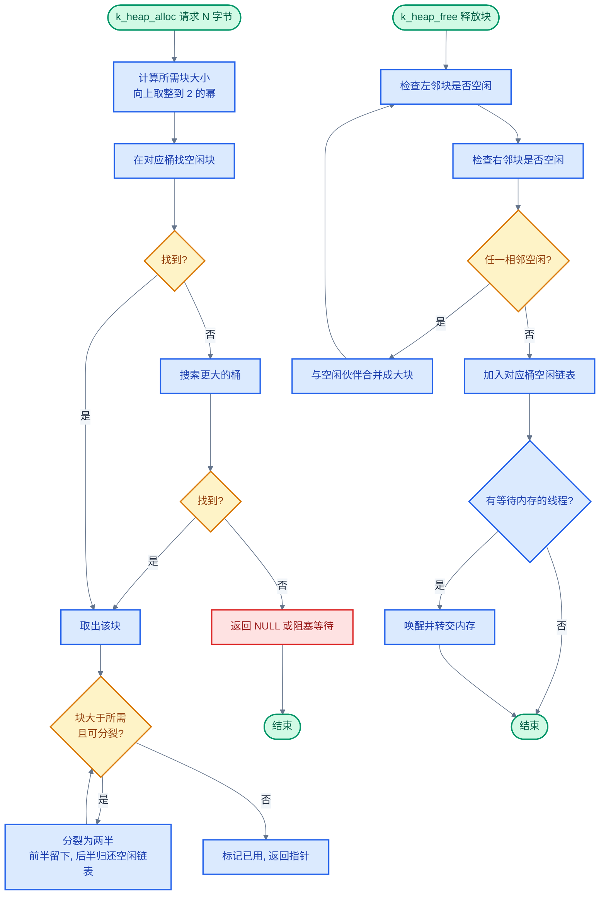
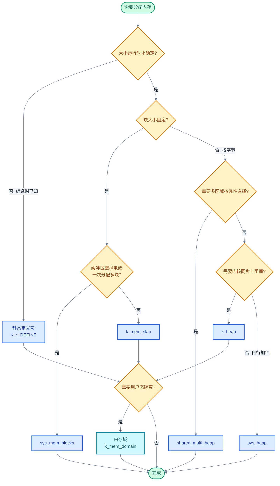

# 12. Zephyr 内存管理

> 一句话概括：Zephyr 内存管理围绕"静态优先、动态可控、硬件隔离"三个原则，提供从编译时数组到按需分页的多层级分配方案，本文从三种分配场景出发，逐层展开堆、Slab、内存块、虚拟内存、内存域与代码重定位的实现与选型。
> **工程师视角**：读完后你应当能回答"为什么 RTOS 优先静态分配"、"为什么 `k_mem_slab` 是 O(1)"、"为什么 `k_heap` 用 2 的幂次桶 + 自由列表"这三个问题，并能为给定场景在堆、Slab、内存块、内存域之间做出合理选型。

### 关键术语

| 缩写 | 全称 | 含义 |
|------|------|------|
| MMU | Memory Management Unit | 内存管理单元，提供虚拟地址翻译与页级保护 |
| MPU | Memory Protection Unit | 内存保护单元，按区域（Region）提供访问权限控制，无地址翻译 |
| Heap | Memory Heap | 堆，按字节请求的动态内存分配器 |
| Slab | Memory Slab | 内存块池，固定大小块的分配器，O(1) 分配 |
| Buddy | Buddy Allocator | 伙伴分配器，按 2 的幂次分裂/合并块 |
| Page | Memory Page | 内存页，MMU 管理的最小虚拟内存单位，常为 4KB |
| Page Frame | Page Frame | 页帧，RAM 中存放一页数据的物理容器 |
| Domain | Memory Domain | 内存域，一组线程共享的内存访问权限集合 |
| Partition | Memory Partition | 内存分区，内存域中一段带权限属性的内存区 |
| XIP | eXecute In Place | 片内执行，代码直接在 Flash/ROM 中运行不拷贝到 RAM |
| DMA | Direct Memory Access | 直接内存访问，外设不经 CPU 直接读写内存 |
| LRU | Least Recently Used | 最近最少使用，按访问时间淘汰的页面置换算法 |
| NRU | Not Recently Used | 最近未使用，按访问/修改位排名淘汰的简化算法 |
| SMH | Shared Multi Heap | 共享多堆，按属性（cacheable 等）管理多个不连续内存区域 |

---

### 前置阅读

| 需要了解 | 参考文档 |
|----------|----------|
| 线程结构与阻塞等待机制 | [05-线程与状态迁移](./05-线程与状态迁移.md) |
| 内核对象链表、等待队列等核心数据结构 | [11-核心数据结构](./11-核心数据结构.md) |

---

## 1. 概述：内存管理在做什么

> 本章是全文起点。先用三种具体分配场景建立"内存管理在做什么"的直觉，再回答一个核心问题：**为什么 RTOS 倾向静态分配，而桌面系统倾向动态分配？** 回答这个问题后，本文其余章节逐层展开 Zephyr 提供的具体分配器。

### 1.1 三种分配场景

考虑嵌入式开发中三段真实代码，它们各自代表一种内存管理范式。

**场景一：编译时数组（静态分配）**

```c
#include <zephyr/kernel.h>

#define STACK_SIZE 1024

/* 编译时就在 .bss 段中预留 1024 字节，链接器决定地址 */
K_THREAD_STACK_DEFINE(my_stack, STACK_SIZE);
struct k_thread my_thread;
```

这块内存的地址在链接时就固定了，生命周期等于整个程序。没有"分配"动作——链接器把符号绑到一个固定的 RAM 偏移上。

**场景二：运行时堆（动态分配）**

```c
#include <zephyr/kernel.h>

void process(void)
{
    /* 运行时才知道需要多少 */
    char *buf = k_malloc(256);
    if (buf == NULL) {
        return;  /* 内存不足 */
    }
    /* ... 使用 buf ... */
    k_free(buf);  /* 归还，可能与其他空闲块合并 */
}
```

这块内存的地址每次调用都不同，生命周期由调用者控制。分配器必须维护"哪些区域空闲"的元数据，并在释放时决定是否合并相邻空闲块。

**场景三：固定块池（Slab 分配）**

```c
#include <zephyr/kernel.h>

/* 编译时分配 8 个 64 字节块 */
K_MEM_SLAB_DEFINE(my_slab, 64, 8, 4);

void process(void)
{
    void *block;
    if (k_mem_slab_alloc(&my_slab, &block, K_NO_WAIT) == 0) {
        /* block 指向 64 字节中的某一个 */
        k_mem_slab_free(&my_slab, block);
    }
}
```

块的大小固定，缓冲区编译时就分配好，但"当前哪个块空闲"由运行时维护的单链表决定。分配就是把链表头摘下来——O(1) 操作。

> **核心要点**：三种场景对应三种本质不同的工作。静态分配是"链接器预先绑定地址"；堆分配是"在一片连续空闲区里按需切割并维护空闲元数据"；Slab 分配是"在预分配的等大块里维护一个空闲链表"。Zephyr 的多种分配器，本质都是这三种范式的组合与扩展。

### 1.2 静态 vs 动态的本质权衡

理解了三种场景，再来回答为什么 RTOS 偏好静态分配。

| 对比维度 | 静态分配 | 动态堆分配 |
|----------|----------|------------|
| **分配时间** | 0（编译时绑定） | 可变（需搜索空闲块、分裂/合并） |
| **时间确定性** | 完全确定 | 仅常数上界（`sys_heap` 约 1-200 周期） |
| **碎片风险** | 无 | 有（外部碎片） |
| **内存利用率** | 可能浪费（按最大值预留） | 高（按需取用） |
| **生命周期** | 整个程序 | 由调用者控制 |
| **失败处理** | 链接失败（编译期） | 返回 NULL（运行期） |

> **如何读这张表**：注意"分配时间"和"时间确定性"两行的区别——堆分配虽然是常数时间，但"常数"不等于"可预测"，因为缓存、分支预测都会让实际周期数波动。对硬实时系统，静态分配的"0 周期"是不可替代的优势。

**为什么 RTOS 优先静态分配？** 两个原因：

1. **实时性**。硬实时系统要求每个任务的最坏执行时间（WCET, Worst-Case Execution Time）可分析。堆分配虽然常数时间，但分配器内部的桶搜索、分裂操作指令数不固定，且会引入难以分析的缓存抖动。静态分配的"分配"动作在链接时就完成了，运行时零开销。

2. **无碎片**。长期运行的系统反复分配/释放不同大小的块，会产生外部碎片——总空闲内存足够，但找不到一块足够大的连续区域。静态分配的块地址永久固定，不存在碎片问题。这对长期运行、不便重启的嵌入式设备至关重要。

但静态分配并非万能：网络协议栈需要按包长动态分配缓冲区，运行时才知道需要多大。所以 Zephyr 同时提供堆、Slab 等动态机制，让开发者按场景权衡。

> **核心要点**：Zephyr 的设计哲学是"静态优先、动态可选"。编译时能确定的就用 `K_*_DEFINE` 宏静态分配；运行时才知道大小的，用堆（按字节）或 Slab（按固定块）；多任务隔离用内存域。所有动态分配器都被设计成有界时间，避免破坏实时性。

### 1.3 Zephyr 内存管理全景

| 分配器 | 单位 | 大小可变 | 同步 | 典型场景 |
|--------|------|----------|------|----------|
| 静态定义宏 | 编译时 | 否 | — | 栈、信号量、队列等内核对象 |
| `k_heap` | 字节 | 是 | 内置自旋锁 | 通用动态分配、`k_malloc` 后端 |
| `sys_heap` | 字节 | 是 | 调用者负责 | 用户空间、无内核同步的场合 |
| `shared_multi_heap` | 字节 | 是 | 调用者负责 | 多区域、按属性选内存 |
| `k_mem_slab` | 固定块 | 否 | 内置自旋锁 | 网络缓冲、消息传递 |
| `sys_mem_blocks` | 固定块 | 否（可一次多块） | 调用者负责 | scatter-gather DMA、可掉电缓冲 |
| `k_mem_map` | 页 | 是（页倍数） | 内置 | MMU 平台匿名内存映射 |
| 按需分页 | 页 | 是 | 内置 | 大地址空间 + 有限 RAM |

> **如何读这张表**："单位"列决定最小粒度——字节级灵活但开销大，页级粗粒度但适合大块。"同步"列决定能否直接多线程使用——`sys_heap`/`sys_mem_blocks` 不带锁，调用者必须自行加锁或单线程使用。

---

## 2. 同步堆 k_heap

> 上一章建立了三种分配范式的直觉，并指出动态分配在 RTOS 中不可或缺。本章讲 Zephyr 最常用的动态分配器——`k_heap`：它对外提供 `k_heap_alloc`/`k_heap_free`，内部包装了无锁的 `sys_heap` 并加上自旋锁与等待队列，使多线程能安全使用且可阻塞等待内存释放。

### 2.1 数据结构与初始化

`k_heap` 的定义在 `include/zephyr/kernel.h`：

```c
/* include/zephyr/kernel.h:6105 */
struct k_heap {
    struct sys_heap heap;   /* 底层无锁分配器 */
    _wait_q_t wait_q;       /* 等待内存的线程队列 */
    struct k_spinlock lock; /* 同步自旋锁 */
};
```

三个字段各司其职：`heap` 是真正干活的分配器，`wait_q` 让内存不足时线程可以睡眠等待，`lock` 保证多线程并发安全。

定义一个堆有两种方式。最常用的是编译时静态定义：

```c
#include <zephyr/kernel.h>

/* 编译时分配 4096 字节缓冲区并初始化 k_heap */
K_HEAP_DEFINE(my_heap, 4096);
```

也可以运行时把任意内存区域交给 `k_heap` 管理：

```c
#include <zephyr/kernel.h>

struct k_heap my_heap;
char __aligned(8) heap_buf[4096];

void init_heap(void)
{
    k_heap_init(&my_heap, heap_buf, sizeof(heap_buf));
}
```

`k_heap_init` 的实现见 `kernel/kheap.c:26`，它初始化等待队列、自旋锁，再调用 `sys_heap_init` 把底层分配器搭起来。

### 2.2 分配与释放 API

```c
/* 阻塞分配：超时返回 NULL，K_FOREVER 永久等待 */
void *k_heap_alloc(struct k_heap *heap, size_t bytes, k_timeout_t timeout);

/* 对齐分配：align 必须是 2 的幂（0 等价于无对齐要求） */
void *k_heap_aligned_alloc(struct k_heap *heap, size_t align,
                           size_t bytes, k_timeout_t timeout);

/* 释放 */
void k_heap_free(struct k_heap *heap, void *mem);
```

`k_heap_alloc` 的核心逻辑在 `kernel/kheap.c:79` 的 `z_heap_alloc_helper`：

1. 加自旋锁
2. 调用 `sys_heap_alloc` 尝试分配
3. 若失败且 `timeout != K_NO_WAIT`，把当前线程挂到 `wait_q` 上睡眠，超时唤醒后重试
4. 成功或超时耗尽后解锁返回

释放时（`kernel/kheap.c:206`）调用 `sys_heap_free` 归还内存，然后唤醒 `wait_q` 上所有等待线程并重调度。

> **核心要点**：`k_heap` 的"同步"二字体现在两处——自旋锁保护堆元数据不被并发破坏；等待队列让内存不足时线程可以阻塞而非立即失败。这两层让 `k_heap` 成为多线程环境下最易用的动态分配器。中断中调用必须传 `K_NO_WAIT`，因为中断上下文不能睡眠。

### 2.3 系统堆与 k_malloc

Zephyr 还有一个全局的"系统堆"，由 `CONFIG_HEAP_MEM_POOL_SIZE` 指定大小。`k_malloc`/`k_free`/`k_realloc`/`k_calloc` 都从系统堆分配。其实现见 `kernel/mempool.c`：

```c
/* kernel/mempool.c:75-77 */
K_HEAP_DEFINE(_system_heap, Z_HEAP_MIN_SIZE_FOR(K_HEAP_MEM_POOL_SIZE));
#define _SYSTEM_HEAP (&_system_heap)
```

> 官方文档 `doc/kernel/memory_management/heap.rst` 指出：系统堆是预定义的唯一分配器，**不能通过地址直接引用**——只能经 `k_malloc`/`k_free` 访问。`k_malloc` 返回的地址保证按指针大小对齐（32 位平台 4 字节、64 位平台 8 字节）。

**堆内存池大小的三层配置**：

| Kconfig | 默认值 | 含义 |
|---------|--------|------|
| `CONFIG_HEAP_MEM_POOL_SIZE` | 0 | 应用指定的系统堆大小；为 0 时内核不创建系统堆 |
| `HEAP_MEM_POOL_ADD_SIZE_*` | 各子系统自定 | 子系统（板级/驱动/库）声明所需最小堆大小，多子系统取和 |
| `CONFIG_HEAP_MEM_POOL_IGNORE_MIN` | n | 启用后强制使用应用设定值，忽略子系统最小要求和 |

> **如何读这张表**：`CONFIG_HEAP_MEM_POOL_SIZE` 默认 0 表示"不创建系统堆"——若任何子系统（如网络栈、shell）通过 `HEAP_MEM_POOL_ADD_SIZE_*` 声明了需求，构建系统会把所有需求求和作为最小值；若应用设定值小于该最小值，自动被最小值覆盖。链接阶段若可用 RAM 不足则构建失败。需要精确优化堆大小时，启用 `CONFIG_HEAP_MEM_POOL_IGNORE_MIN` 让应用设定值生效。

`k_malloc`（`kernel/mempool.c:91`）调用 `z_alloc_helper`，它在分配时多要一个指针大小的空间，用来存放"这块内存来自哪个堆"的指针。`k_free`（`kernel/mempool.c:58`）据此找到正确的堆再释放——这样 `k_free` 不需要知道指针来自哪个堆。

```c
/* kernel/mempool.c:58-73（简化） */
void k_free(void *ptr)
{
    if (ptr != NULL) {
        struct k_heap **heap_ref = ptr;
        --heap_ref;              /* 回退一个指针大小，找到堆引用 */
        k_heap_free(*heap_ref, heap_ref);
    }
}
```

官方 `doc/kernel/memory_management/heap.rst` 给出的典型用法（分配 200 字节并清零，失败时报警）：

```c
/* 来源：doc/kernel/memory_management/heap.rst */
char *mem_ptr;

mem_ptr = k_malloc(200);
if (mem_ptr != NULL) {
    memset(mem_ptr, 0, 200);
    /* ... */
} else {
    printf("Memory not allocated");
}
```

> **核心要点**：`k_malloc` 比 `k_heap_alloc` 多消耗一个指针（4 或 8 字节）用于记录来源堆。这是为了让 `k_free` 无需传入堆指针——代价是每块多 8 字节开销。在内存极度受限的场合，直接用 `k_heap_alloc`/`k_heap_free` 更省。

### 2.4 底层 sys_heap 的分裂与合并

`k_heap` 的分配能力来自底层 `sys_heap`。它的设计在 `include/zephyr/sys/sys_heap.h` 顶部注释中一句话概括：*"A more or less conventional segregated fit allocator with power-of-two buckets"*——分离适配分配器，按 2 的幂次分桶。源码位于 `lib/heap/heap.c`，数据结构定义在 `lib/heap/heap.h`。

> 官方文档 `doc/kernel/memory_management/heap.rst` 指出：`sys_heap` 的所有 API 函数保证在**常数时间**内完成，典型架构上 1-200 个周期内完成。它不提供内核同步——同一堆上的所有调用必须由调用者串行化，禁止多线程同时进入。

**chunk 与 bucket 的内部组织**：

- 内存被切分为 8 字节（`CHUNK_UNIT`）的 **chunk**，所有分配从连续 chunk 区中切割
- 每个 chunk 头部存元数据：当前 chunk 长度、左侧相邻 chunk 长度、占用位、自由列表前/后指针
- 空闲块按大小装入 **bucket**，每个 bucket 覆盖一个 2 的幂次区间：3-4 chunk 一个桶、5-8 一个桶、9-16 一个桶……以此类推
- 所有元数据（含变长 bucket 头数组）都存放在堆内存开头，外部仅需 `struct sys_heap` 结构体本身

**为什么 `k_heap` 用 2 的幂次桶 + 自由列表？** 三个原因：

1. **分配速度**。按 2 的幂次分桶后，分配 N 字节只需用 `fls(N)`（最高有效位位置）算出桶索引，从该桶摘一个空闲块即可——O(1) 上界。若用单一空闲链表，每次分配都要遍历链表找够大的块，最坏 O(N)。
2. **抗碎片**。释放时立即检查左右相邻块，若空闲则合并（见 `lib/heap/heap.c` 的 `free_list_remove`/`merge_chunks` 逻辑）。分配时优先从最小够用桶取块，剩余部分归还堆。这种"分裂-合并"哲学与经典 buddy 算法相通。
3. **空间效率**。chunk 按 8 字节（`CHUNK_UNIT`）任意分割，每个已分配 chunk 仅 4 字节元数据（大堆 8 字节）。对比传统 buddy 必须按 2 的幂次对齐块大小，sys_heap 在小分配上浪费更少。

**`CONFIG_SYS_HEAP_ALLOC_LOOPS` 的作用**：在最小够用桶中搜索可分配块时，编译期上界限制迭代次数——防止链表无界搜索，代价是牺牲部分抗碎片能力。默认值为 3，用户可在构建时调整。增大该值提高抗碎片性但增加最坏延迟；减小则反之。

> **核心要点**：`sys_heap` 不是纯 buddy 算法，而是"分离适配 + 2 的幂次桶"——chunk 按 8 字节任意分割（比 buddy 的 2 的幂次对齐更省空间），但分裂/合并思想与 buddy 相通。桶索引由 `bucket_idx()` 用 `31 - __builtin_clz(sz - min_chunk_size + 1)` 计算（见 `lib/heap/heap.h:303`），常数时间。所有 API 在 1-200 周期内完成，`CONFIG_SYS_HEAP_ALLOC_LOOPS`（默认 3）限制了桶内搜索的最坏迭代次数。

#### 4KB 堆的分裂与合并演算

下面用 buddy 思路在一个 4KB 堆上演算分裂与合并过程。为简化说明，这里按 2 的幂次块演算（经典 buddy）；实际 sys_heap 用 8 字节 chunk 粒度更细，但分裂/合并的逻辑完全一致。

**初始状态**：4KB 堆 = 1 个 4KB 空闲块。

```
空闲: [4KB]
已用: -
```

**步骤 1：分配 1KB**

1. 4KB > 1KB，把 4KB 分裂为 2KB + 2KB 两个伙伴
2. 前 2KB 仍 > 1KB，继续分裂为 1KB + 1KB 两个伙伴
3. 返回第一个 1KB（标记已用），第二个 1KB 留在空闲链表

```
空闲: [1KB, 2KB]
已用: [1KB@0]
```

**步骤 2：分配 256B**

1. 最小够用桶是 1KB（256B ≤ 1KB），取空闲的 1KB 块
2. 1KB > 256B，分裂为 512B + 512B 两个伙伴
3. 前 512B > 256B，继续分裂为 256B + 256B 两个伙伴
4. 返回第一个 256B（标记已用）

```
空闲: [256B, 512B, 2KB]
已用: [1KB@0, 256B@1024]
```

**步骤 3：释放 1KB（@0）**

1. 检查 @0 的 1KB 伙伴 = @1024 的 1KB，但 @1024 已被进一步分裂为 256B+512B+256B，不再是 1KB 空闲块，**无法合并**
2. @0 的 1KB 直接加入 1KB 空闲链表

```
空闲: [256B, 512B, 1KB@0, 2KB]
已用: [256B@1024]
```

**步骤 4：释放 256B（@1024）**

1. @1024 的 256B 伙伴 = @1280 的 256B，空闲，**合并为 512B**
2. 新 512B 的伙伴 = @1536 的 512B，空闲，**再合并为 1KB**
3. 新 1KB（@1024）的伙伴 = @0 的 1KB，空闲，**再合并为 2KB**
4. 新 2KB（@0）的伙伴 = @2048 的 2KB，空闲，**再合并为 4KB**
5. 4KB 是最大块，无需继续合并

```
空闲: [4KB]
已用: -
```

四次操作后堆回到初始的单一 4KB 空闲块——这就是"立即合并"的抗碎片效果。

> **核心要点**：buddy 的核心机制是"分裂成对、合并成双"。分配时从大到小逐级分裂到刚好够用；释放时检查伙伴，若也空闲则逐级合并回去。只要伙伴链完整，最终能还原成初始大块。Zephyr 的 `sys_heap` 把这套思想细化到 8 字节粒度，兼顾了 buddy 的抗碎片与按字节分配的灵活性。

#### 分裂与合并流程图



> **如何读这张图**：上半部分是分配流程——核心循环是"块太大就分裂，分裂出的后半归还空闲链表"，直到块刚好够用。下半部分是释放流程——核心循环是"检查相邻块，空闲就合并"，合并后继续检查新块的相邻块，直到无法继续合并。两个循环正是 buddy 抗碎片的关键。

### 2.5 多堆包装器 sys_multi_heap

`sys_heap` 要求管理的内存是**单个连续区**。但复杂 MCU 的内存常是不连续的——不同区域可能有不同的缓存属性、性能、功耗行为，或外设只能对某些区域做 DMA。`sys_multi_heap` 正是为这种场景提供的包装器。

> 官方文档 `doc/kernel/memory_management/heap.rst` 指出：`sys_multi_heap` 是一组 `sys_heap` 对象的简单包装。它通过回调让应用决定从哪个子堆分配，并把"配置"参数透明地传递给回调。

核心 API：

```c
/* 初始化多堆包装器，注册选择回调 */
void sys_multi_heap_init(struct sys_multi_heap *heap,
                         sys_multi_heap_fn_t choice_fn);

/* 添加一个子堆到管理集合 */
void sys_multi_heap_add_heap(struct sys_multi_heap *heap,
                             struct sys_heap *mem_heap, void *user_data);

/* 分配/对齐分配/重分配/对齐重分配/释放（cfg 透传给选择回调） */
void *sys_multi_heap_alloc(struct sys_multi_heap *heap, void *cfg, size_t bytes);
void *sys_multi_heap_aligned_alloc(struct sys_multi_heap *heap, void *cfg,
                                   size_t align, size_t bytes);
void *sys_multi_heap_realloc(struct sys_multi_heap *heap, void *cfg,
                             void *ptr, size_t bytes);
void *sys_multi_heap_aligned_realloc(struct sys_multi_heap *heap, void *cfg,
                                     void *ptr, size_t align, size_t bytes);
void sys_multi_heap_free(struct sys_multi_heap *mheap, void *block);
```

`sys_multi_heap_realloc`/`sys_multi_heap_aligned_realloc` 在原堆无法扩展时，可在配置参数指定的任一合格子堆中重新分配。`sys_multi_heap_free` 不需要配置参数——任何子堆分配出的内存都能用相同方式释放。无销毁 API：要"销毁"多堆，只需确保所有块已释放（或永不再用），把底层内存改作他用即可。

> **核心要点**：`sys_multi_heap` 把"从哪个子堆分配"的决策交给应用回调——回调接收不透明的 `cfg` 参数，可解释为属性、内存类型、CPU 亲和性等。下一章的 `shared_multi_heap` 正是这套机制的属性化封装。

### 2.6 堆监听器 heap listener

Zephyr 提供堆监听器 API（`heap_listener_apis`），允许注册回调在堆事件（如分配/释放）发生时被通知，用于内存使用追踪、泄漏检测、统计等。监听器可挂到任意 `sys_heap`/`k_heap` 上，由内核在堆操作路径中调用。详见官方 `doc/kernel/memory_management/heap.rst` 末尾的 *Heap listener* 小节及 `include/zephyr/sys/heap_listener.h`。

---

## 3. 共享多堆 shared_multi_heap

> 上一章的 `k_heap` 管理一片连续内存。但实际 SoC 常有不连续的内存区域——SRAM0 可缓存、SRAM1 不可缓存（DMA 友好）、SRAM2 掉电保留。本章讲 `shared_multi_heap` 如何把这些异构区域统一管理，让驱动按"属性"而非"地址"申请内存。

### 3.1 解决的问题

考虑一个真实场景：某 SoC 有三块 SRAM：

- SRAM0：256KB，可缓存，CPU 访问最快
- SRAM1：64KB，不可缓存，DMA 控制器只能访问这块
- SRAM2：8KB，掉电保留，用于保存唤醒数据

如果只用 `k_heap`，开发者得为每块建一个堆，然后手动决定"这次分配该走哪个堆"。`shared_multi_heap` 把这件事自动化——注册时给每块内存打一个"属性"标签，分配时按属性筛选。

### 3.2 使用流程

`shared_multi_heap` 的官方文档见 `../zephyr-project/zephyr/doc/kernel/memory_management/shared_multi_heap.rst`。典型用法分三步：

```c
#include <zephyr/mem_mgmt/mem_attr.h>
#include <zephyr/sys/shared_multi_heap.h>

/* 1. 启动时初始化池 */
shared_multi_heap_pool_init();

/* 2. 注册内存区域并打属性标签 */
struct shared_multi_heap_region cacheable_r0 = {
    .addr = addr_r0,
    .size = size_r0,
    .attr = SMH_REG_ATTR_CACHEABLE,
};
shared_multi_heap_add(&cacheable_r0, NULL);

struct shared_multi_heap_region non_cacheable_r1 = {
    .addr = addr_r1,
    .size = size_r1,
    .attr = SMH_REG_ATTR_NON_CACHEABLE,
};
shared_multi_heap_add(&non_cacheable_r1, NULL);

/* 3. 按属性分配——框架自动选择合适的堆 */
void *cpu_buf = shared_multi_heap_alloc(SMH_REG_ATTR_CACHEABLE, 0x1000);
void *dma_buf = shared_multi_heap_alloc(SMH_REG_ATTR_NON_CACHEABLE, 0x1000);
```

### 3.3 内部机制

`shared_multi_heap` 本质是 `sys_multi_heap` 的特化封装。每个注册的区域被包成一个 `sys_heap`，框架维护一张"区域→属性"表。分配时框架遍历属性匹配的区域，选第一个能容纳请求的堆。底层实现位于 `lib/heap/shared_multi_heap.c`。

> 官方文档 `doc/kernel/memory_management/shared_multi_heap.rst` 指出：API **不强制约束任何属性**，但预定义了最常用的两个——`SMH_REG_ATTR_CACHEABLE` 与 `SMH_REG_ATTR_NON_CACHEABLE`。实际头文件 `include/zephyr/multi_heap/shared_multi_heap.h` 还定义了第三个 `SMH_REG_ATTR_EXTERNAL`（外部内存）。属性是普通整数/枚举值，开发者可自行扩展。

| 属性常量 | 含义 | 典型用途 |
|----------|------|----------|
| `SMH_REG_ATTR_CACHEABLE` | 可缓存 | CPU 频繁访问的数据结构 |
| `SMH_REG_ATTR_NON_CACHEABLE` | 不可缓存 | DMA 缓冲、外设共享内存 |
| `SMH_REG_ATTR_EXTERNAL` | 外部内存 | 外部 RAM、QSPI Flash 映射区 |
| 自定义值 | 用户扩展 | 例如"低功耗区"、"高带宽区" |

> **如何读这张表**：属性值是普通整数，框架不做强制约束——开发者可定义任意属性枚举（如 `SMH_REG_ATTR_RETENTION=0x10`），只要注册和分配时使用同一套约定即可。这赋予框架极强的扩展性。

> **核心要点**：`shared_multi_heap` 把"选哪块内存"的决策从应用代码下沉到框架。驱动只需声明"我要可缓存的 4KB"，不必关心 SoC 上有几块 SRAM、各块属性如何。这让驱动代码在不同 SoC 间可移植。

---

## 4. 内存块 k_mem_slab

> 上一章讲按字节分配的堆。但很多场景分配大小固定——网络缓冲区永远是 128 字节、消息体永远是 64 字节。这种场合用堆会浪费元数据并产生外部碎片。本章讲 `k_mem_slab`：固定大小块、O(1) 分配、无碎片。

### 4.1 为什么需要 Slab

考虑网络协议栈：每收到一个包就分配一个缓冲区，处理后释放。如果用 `k_malloc`：

- 每次分配要搜索堆的桶，虽然常数时间但有几百周期开销
- 不同大小的分配混合会产生外部碎片
- 释放时要合并相邻块，又是指针操作

`k_mem_slab` 针对这种"固定大小、高频分配释放"场景做了极致优化：

- 块大小固定，编译时确定
- 空闲块用单链表串联，分配就是摘链表头
- 无需分裂/合并，无碎片
- 块缓冲区编译时分配，运行时零元数据写入

### 4.2 为什么 k_mem_slab 是 O(1)

看 `k_mem_slab_alloc` 的实现（`kernel/mem_slab.c:235`）：

```c
/* kernel/mem_slab.c:235-282（简化） */
int k_mem_slab_alloc(struct k_mem_slab *slab, void **mem, k_timeout_t timeout)
{
    k_spinlock_key_t key = k_spin_lock(&slab->lock);

    if (slab->free_list != NULL) {
        *mem = slab->free_list;                    /* 摘链表头 */
        slab->free_list = *(char **)(slab->free_list);
        slab->info.num_used++;
        k_spin_unlock(&slab->lock, key);
        return 0;
    } else if (K_TIMEOUT_EQ(timeout, K_NO_WAIT)) {
        k_spin_unlock(&slab->lock, key);
        *mem = NULL;
        return -ENOMEM;
    } else {
        /* 挂到等待队列睡眠 */
        return z_pend_curr(&slab->lock, key, &slab->wait_q, timeout);
    }
}
```

> **核心要点**：为什么 `k_mem_slab` 是 O(1)？因为块大小固定——所有块等大，无需搜索"哪块最合适"，直接摘空闲链表头即可。对比堆分配需要按字节计算桶索引、可能分裂块、维护自由列表，Slab 的指令数少一个数量级。这是用"灵活性"换"确定性"的典型权衡。

### 4.3 数据结构与初始化

`k_mem_slab` 定义在 `include/zephyr/kernel.h:5804`：

```c
/* include/zephyr/kernel.h:5804 */
struct k_mem_slab {
    _wait_q_t wait_q;
    struct k_spinlock lock;
    char *buffer;          /* 块缓冲区起点 */
    char *free_list;       /* 空闲块单链表头 */
    struct k_mem_slab_info info;  /* num_blocks/block_size/num_used */
};
```

**官方约束**（来自 `doc/kernel/memory_management/slabs.rst`）：

| 属性 | 约束 |
|------|------|
| **块大小** | 至少 4N 字节（32 位平台）或 8N 字节（64 位平台），N > 0 |
| **块数** | 大于 0 |
| **缓冲区大小** | 至少 `块大小 × 块数` 字节 |
| **缓冲区对齐** | N 字节边界，N 是 2 的幂；32 位平台 N ≥ 4，64 位平台 N ≥ 8 |
| **块大小与对齐关系** | 块大小必须是 N 的整数倍，确保每个块都对齐到同一边界 |

> **为什么块大小至少 4N/8N？** 因为空闲块复用块自身前 4（或 8）字节存 next 指针——块必须能容下一个指针。这也是"零额外开销"的代价：极小块不适用 Slab。

空闲链表巧妙地复用块自身的内存：每个空闲块的头 4（或 8）字节存放下一个空闲块的指针，分配出去后这块内存交给用户使用。所以 Slab 的元数据开销几乎为零——只有 `struct k_mem_slab` 本身那几十字节。

> 官方文档 `doc/kernel/memory_management/slabs.rst` 指出：32 位平台使用每个空闲块的前 4 字节提供链表链接，64 位平台使用前 8 字节——块之间无任何空隙浪费。

空闲链表的构造见 `create_free_list`（`kernel/mem_slab.c:104`）：从缓冲区末尾向前遍历，把每个块串成单链表。

官方示例（定义 6 个 400 字节块、8 字节对齐的 Slab）：

```c
/* 来源：doc/kernel/memory_management/slabs.rst */
K_MEM_SLAB_DEFINE(my_slab, 400, 6, 8);
```

四个参数：名字、块大小、块数、对齐。宏会同时定义 Slab 结构体和它的缓冲区。若需要**私有作用域**（文件内 static），使用 `K_MEM_SLAB_DEFINE_STATIC`：

```c
/* 来源：doc/kernel/memory_management/slabs.rst */
K_MEM_SLAB_DEFINE_STATIC(my_slab, 400, 6, 8);
```

也可运行时用 `k_mem_slab_init` 初始化一个外部缓冲区：

```c
/* 来源：doc/kernel/memory_management/slabs.rst */
struct k_mem_slab my_slab;
char __aligned(8) my_slab_buffer[6 * 400];

k_mem_slab_init(&my_slab, my_slab_buffer, 400, 6);
```

**跟踪最大利用率**：启用 `CONFIG_MEM_SLAB_TRACE_MAX_UTILIZATION` 后，每个 Slab 会记录运行期间 `num_used` 的历史最大值，便于评估块池容量是否合理——是否需要扩容、是否过度预留。

### 4.4 阻塞等待

与 `k_heap` 类似，`k_mem_slab_alloc` 也支持超时。当所有块都被占用时，调用线程挂到 `wait_q` 上睡眠。释放块时（`kernel/mem_slab.c:284`）优先唤醒等待队列中的线程，而非直接归还到空闲链表：

```c
/* kernel/mem_slab.c:295-305（简化） */
if (slab->free_list == NULL) {
    struct k_thread *pending = z_unpend_first_thread(&slab->wait_q);
    if (pending != NULL) {
        z_thread_return_value_set_with_data(pending, 0, mem);
        z_ready_thread(pending);
        z_reschedule(&slab->lock, key);
        return;
    }
}
/* 没有等待者，归还到空闲链表 */
*(char **)mem = slab->free_list;
slab->free_list = (char *)mem;
```

这种"释放即转交等待者"的设计避免了"先归还再分配"的双重开销。

> **核心要点**：`k_mem_slab` 适合"固定大小、高频分配、可能阻塞等待"的场景。官方 `doc/kernel/memory_management/slabs.rst` 特别推荐：**线程间传递大数据时用 Slab 块避免数据拷贝**——发送方把数据填入 Slab 块后传递指针，接收方处理后释放，省去 `memcpy`。当块大小可变时改用 `k_heap`，当缓冲区需要掉电或 DMA scatter-gather 时改用 `sys_mem_blocks`。

---

## 5. 系统内存块 sys_mem_blocks

> 上一章的 `k_mem_slab` 把空闲链表存在块自身内存里。但有些场合块缓冲区会被掉电或复位清零——链表指针也会丢失。本章讲 `sys_mem_blocks`：它把簿记信息移到缓冲区之外，用位图跟踪块状态，支持一次分配多块。

### 5.1 与 k_mem_slab 的差异

`sys_mem_blocks` 的官方文档见 `../zephyr-project/zephyr/doc/kernel/memory_management/sys_mem_blocks.rst`。它与 `k_mem_slab` 都管理固定大小块，但有关键区别：

| 对比维度 | `k_mem_slab` | `sys_mem_blocks` |
|----------|--------------|------------------|
| **簿记位置** | 块自身内存（复用） | 缓冲区之外（位图） |
| **一次分配多块** | 不支持 | 支持 |
| **多块是否连续** | — | 不保证（scatter-gather 友好） |
| **缓冲区可掉电** | 否（链表丢失） | 是（位图在外部） |
| **同步** | 内置自旋锁 | 调用者负责 |
| **运行时初始化** | 支持 | 必须编译时定义 |

> **如何读这张表**：注意"簿记位置"——这决定了缓冲区能否被掉电。`k_mem_slab` 的链表指针存在块里，掉电后链表结构破坏；`sys_mem_blocks` 用外部位图，缓冲区掉电不影响簿记。这是后者存在的根本理由。

**官方约束**（来自 `doc/kernel/memory_management/sys_mem_blocks.rst`）：

| 属性 | 约束 |
|------|------|
| **块大小** | 至少 4N 字节，N > 0 |
| **块数** | 大于 0 |
| **缓冲区大小** | 至少 `块大小 × 块数` 字节 |
| **缓冲区对齐** | N 字节边界，N 是大于 2 的 2 的幂（4, 8, 16, …） |
| **块大小与对齐关系** | 块大小必须是 N 的整数倍 |
| **簿记** | 额外的 **blocks bitmap** 跟踪每块是否已分配 |

> 官方文档指出：由于内部簿记结构的存在，每个 `sys_mem_blocks` 分配器**必须在编译时声明和定义**（无运行时初始化变体）。

### 5.2 使用方式

`sys_mem_blocks` 提供三个定义宏，对应不同作用域与缓冲区来源：

```c
#include <zephyr/sys/mem_blocks.h>

/* 1. 公开作用域，缓冲区由宏内部生成（4 个 64 字节块，4 字节对齐） */
SYS_MEM_BLOCKS_DEFINE(my_blks, 64, 4, 4);

/* 2. 私有作用域（文件内 static） */
SYS_MEM_BLOCKS_DEFINE_STATIC(static_blks, 64, 4, 4);

/* 3. 使用外部预定义缓冲区（缓冲区对齐需在定义处完成） */
uint8_t __aligned(4) backing_buffer[64 * 4];
SYS_MEM_BLOCKS_DEFINE_WITH_EXT_BUF(ext_blks, 64, 4, backing_buffer);
```

分配与释放（一次可分配/释放多块，地址数组由调用者提供）：

```c
void example(void)
{
    int ret;
    uintptr_t blocks[2];

    /* 一次分配 2 块（不保证连续） */
    ret = sys_mem_blocks_alloc(&my_blks, 2, blocks);
    if (ret == 0) {
        /* blocks[0]、blocks[1] 各指向一个 64 字节块 */
        /* ... 使用 ... */
        ret = sys_mem_blocks_free(&my_blks, 2, blocks);
    }
}
```

### 5.3 内部实现

`sys_mem_blocks` 内部用 `sys_bitarray` 维护一个位图——每个块对应一位，1 表示已分配，0 表示空闲。分配 N 块就是扫描位图找 N 个 0 位设为 1，返回对应的块地址。这种设计天然支持"一次多块且不连续"，正是 scatter-gather DMA 所需。

源码位于 `lib/mem_blocks/mem_blocks.c`。由于位图存在 `sys_mem_blocks` 结构体内部（而非缓冲区里），缓冲区可以整体掉电而不影响分配器状态——只要 `sys_mem_blocks` 结构体本身保留在常驻 RAM 中。

### 5.4 多分配器组 sys_multi_mem_blocks

`sys_mem_blocks` 还支持"多分配器组"（`sys_multi_mem_blocks`），用回调函数选择具体分配器，机制类似 `shared_multi_heap`：

```c
/* 选择回调：根据 cfg 选具体分配器 */
sys_mem_blocks_t *choice_fn(struct sys_multi_mem_blocks *group, void *cfg)
{
    /* ... 按 cfg 选 allocator ... */
}

SYS_MEM_BLOCKS_DEFINE(allocator0, 64, 4, 4);
SYS_MEM_BLOCKS_DEFINE(allocator1, 64, 4, 4);
static sys_multi_mem_blocks_t alloc_group;

/* 1. 初始化组并注册选择回调 */
sys_multi_mem_blocks_init(&alloc_group, choice_fn);
/* 2. 添加子分配器 */
sys_multi_mem_blocks_add_allocator(&alloc_group, &allocator0);
sys_multi_mem_blocks_add_allocator(&alloc_group, &allocator1);

/* 3. 分配：cfg 透传给 choice_fn；返回块大小通过 blk_size */
uintptr_t blocks[1];
size_t blk_size;
sys_multi_mem_blocks_alloc(&alloc_group, UINT_TO_POINTER(0), 1, blocks, &blk_size);

/* 4. 释放：无需 cfg，框架按地址匹配回正确分配器 */
sys_multi_mem_blocks_free(&alloc_group, 1, blocks);
```

> 官方文档指出：`sys_multi_mem_blocks_free` 不需要配置参数——分配器代码通过匹配传入的内存地址找到正确的子分配器，再调用 `sys_mem_blocks_free` 释放。`sys_multi_mem_blocks_alloc` 的 `cfg` 参数直接透传给选择函数。

> **核心要点**：`sys_mem_blocks` 用外部位图换来了两个能力——缓冲区可掉电、一次分配多块不连续。代价是必须编译时定义、调用者自行加锁。它填补了 `k_mem_slab` 无法胜任的场景。

---

## 6. 按需分页 demand_paging

> 前五章讲的都是"物理 RAM 内的分配"。但当应用地址空间大于物理 RAM 时，需要把暂时不用的页换出到 backing store（Flash、外部 RAM）。本章讲 Zephyr 的按需分页机制：它让有限 RAM 能运行大地址空间程序。

### 6.1 解决的问题

考虑一个物联网设备：应用代码 4MB，但 SRAM 只有 512KB。传统做法只能裁剪应用。按需分页允许：

- 把 4MB 代码/数据映射到虚拟地址空间
- 只把当前访问的页加载进 RAM
- 长时间不用的页换出到 backing store
- 访问不在 RAM 的页时触发缺页，由内核换入

这样 512KB RAM 也能运行 4MB 地址空间的程序。官方文档见 `../zephyr-project/zephyr/doc/kernel/memory_management/demand_paging.rst`。

### 6.2 核心概念

按需分页引入四个新概念：

- **数据页（Data Page）**：页大小的数据，可能在页帧中，也可能被换出到 backing store。其位置总能通过 CPU 页表中的虚拟地址查到。数据类型为 `void *`（或 `uint8_t *` 用于指针运算）
- **页帧（Page Frame）**：RAM 中存放一页的物理容器，由 `struct k_mem_page_frame` 描述，始终以物理地址引用（Zephyr 约定用 `uintptr_t`）
- **Backing Store**：存放被换出页的存储（Flash、外部 RAM 等）
- **K_MEM_SCRATCH_PAGE**：特殊虚拟页，作为换入/换出的**中间缓冲**——backing store 代码把数据页在 `K_MEM_SCRATCH_PAGE` 与目标位置之间拷贝。它需映射为可读写供 backing store 访问，而数据页本身在虚拟地址空间可能只映射为只读

> **为什么需要 K_MEM_SCRATCH_PAGE？** 官方文档解释：数据页在虚拟地址空间可能只映射为只读。若直接把它交给 backing store，就必须重新映射为读写——这会有安全影响（数据页对应用其他部分也不再是只读）。`K_MEM_SCRATCH_PAGE` 作为中转页，让 backing store 只在可读写的临时页上操作，数据页的只读属性得以保留。

页帧有若干标志位：

| 标志 | 含义 |
|------|------|
| `K_MEM_PAGE_FRAME_FREE` | 空闲，在空闲页帧链表上；置位时其他标志无意义且不得修改 |
| `K_MEM_PAGE_FRAME_PINNED` | 钉住，永不换出 |
| `K_MEM_PAGE_FRAME_RESERVED` | 硬件保留，不可用 |
| `K_MEM_PAGE_FRAME_MAPPED` | 已映射到虚拟地址 |
| `K_MEM_PAGE_FRAME_BUSY` | 正在执行换入/换出 |
| `K_MEM_PAGE_FRAME_BACKED` | backing store 中有干净副本 |

### 6.3 缺页处理流程

当 CPU 访问一个不在 RAM 的页时：

1. MMU 触发缺页异常
2. 内核从空闲页帧链表取一个页帧；若无空闲，调用淘汰算法选一个 victim
3. 若 victim 页被修改过（dirty），调用 backing store 把它换出
4. 调用 backing store 把目标页换入到该页帧
5. 更新页表，恢复执行

`k_mem_page_in`/`k_mem_page_out` 允许主动控制：预期即将访问的页可主动换入减少缺页延迟；长时间不用的页可主动换出腾出页帧。

### 6.4 淘汰算法与 backing store

淘汰算法决定换出哪一页，Zephyr 提供两种：

- **NRU（Not Recently Used）**：按访问位/修改位排名选 victim，简单但效率一般，作为示例实现
- **LRU（Least Recently Used）**：按访问时间排序的队列，复杂但效率高，**推荐生产使用**

淘汰算法需实现以下函数（由内核分页代码调用）：

| 函数 | 调用时机 |
|------|----------|
| `k_mem_paging_eviction_init()` | `POST_KERNEL` 阶段初始化淘汰算法 |
| `k_mem_paging_eviction_add()` | 某数据页变为可淘汰时调用 |
| `k_mem_paging_eviction_remove()` | 某数据页不再可淘汰时（被钉住、解除映射或即将被换出）调用 |
| `k_mem_paging_eviction_select()` | 选一页淘汰；通过 `dirty` 出参告知是否被修改过；返回对应页帧指针 |
| `k_mem_paging_eviction_accessed()` | 由架构内存管理代码在数据页触发访问异常时调用，LRU 据此重排"已使用"页 |

> 官方文档指出：实现新淘汰算法时，`k_mem_paging_eviction_init()` 与 `k_mem_paging_eviction_select()` 必须实现；若启用 `CONFIG_EVICTION_TRACKING`，还需实现 `add`/`remove`/`accessed` 三个跟踪函数。

**backing store** 负责实际的页换入/换出 I/O，需平台代码实现以下函数：

| 函数 | 作用 |
|------|------|
| `k_mem_paging_backing_store_init()` | `POST_KERNEL` 阶段初始化 backing store |
| `k_mem_paging_backing_store_location_get()` | 保留一个存储位置，准备换出某数据页；返回 `location` token |
| `k_mem_paging_backing_store_location_free()` | 释放一个 `location` token，供后续换出复用 |
| `k_mem_paging_backing_store_location_query()` | 查询某存储内容对应的 token，常配合 `CONFIG_DEMAND_MAPPING` 按需映射 |
| `k_mem_paging_backing_store_page_in()` | 把 `location` 对应的数据页拷贝到 `K_MEM_SCRATCH_PAGE` |
| `k_mem_paging_backing_store_page_out()` | 把 `K_MEM_SCRATCH_PAGE` 的数据页拷贝到 `location` |
| `k_mem_paging_backing_store_page_finalize()` | page-in 完成后的内部账目更新；可为空函数 |

**分页统计 API**（启用 `CONFIG_DEMAND_PAGING_TIMING_HISTOGRAM_NUM_BINS` 时可用）：

- `k_mem_paging_stats_get()`：获取整体换入/换出统计
- `k_mem_paging_thread_stats_get()`：获取每线程统计（需启用 `CONFIG_DEMAND_PAGING_THREAD_STATS`）
- `k_mem_paging_histogram_eviction_get()`：淘汰算法执行耗时直方图
- `k_mem_paging_histogram_backing_store_page_in_get()`：换入耗时直方图
- `k_mem_paging_histogram_backing_store_page_out_get()`：换出耗时直方图

直方图边界 `k_mem_paging_eviction_histogram_bounds[]` 与 `k_mem_paging_backing_store_histogram_bounds[]` 强烈建议针对具体应用定义，因为耗时高度依赖架构、SoC 与板级。

> **核心要点**：按需分页用"时间换空间"——用换页延迟换取运行大于 RAM 的地址空间。它只适合对延迟不敏感的场景，硬实时任务应使用 `K_MEM_PAGE_FRAME_PINNED` 钉住关键页。淘汰算法默认选 LRU，backing store 与淘汰算法的回调函数集必须由平台代码实现。

---

## 7. 虚拟内存 virtual_memory

> 上一章的按需分页依赖 MMU。本章讲 Zephyr 的虚拟内存基础——即使不开按需分页，MMU 也能提供地址翻译与页级保护。理解本章后才能理解下一章的内存域在 MMU 平台上如何实现。

### 7.1 Zephyr 虚拟内存的特点

Zephyr 主要面向嵌入式，其虚拟内存与桌面 OS 有两点关键差异（官方文档见 `../zephyr-project/zephyr/doc/kernel/memory_management/virtual_memory.rst`）：

1. **内核镜像默认 1:1 映射**：不开按需分页时，内核代码/数据的虚拟地址等于物理地址，避免翻译开销
2. **基础虚拟内存不扩展可用内存**：虚拟地址空间可大于物理内存，但所有映射必须有物理后援；只有开启按需分页才能让虚拟空间真正大于 RAM

### 7.2 关键 Kconfig

| Kconfig | 含义 | 默认 |
|---------|------|------|
| `CONFIG_MMU` | 启用 MMU 支持（虚拟内存必需） | n |
| `CONFIG_MMU_PAGE_SIZE` | 内存页大小 | 4KB |
| `CONFIG_KERNEL_VM_BASE` | 虚拟地址空间起点（即 `K_MEM_VIRT_RAM_START`） | SoC 相关 |
| `CONFIG_KERNEL_VM_SIZE` | 虚拟地址空间大小（即 `K_MEM_VIRT_RAM_SIZE`） | 8MB |
| `CONFIG_KERNEL_VM_OFFSET` | 内核镜像在虚拟空间的偏移 | 0 |
| `CONFIG_KERNEL_DIRECT_MAP` | 允许虚拟/物理 1:1 映射，便于精确控制设备 MMIO 区访问 | n |
| `CONFIG_ARCH_MAPS_ALL_RAM` | 是否把全部物理内存映射进虚拟空间 | n |

> 官方文档指出：`CONFIG_KERNEL_DIRECT_MAP` 允许虚拟/物理之间 1:1 映射，而不是由内核在虚拟地址空间内自由选址——这对映射设备 MMIO 区域、做更精确的访问控制有用。

### 7.3 虚拟地址空间布局

启用 MMU 后，虚拟地址空间从低到高大致为（来自官方 `doc/kernel/memory_management/virtual_memory.rst`）：

```
+--------------+ <- K_MEM_VIRT_RAM_START
| Undefined VM | <- architecture specific reserved area
+--------------+ <- K_MEM_KERNEL_VIRT_START
| Mapping for  |
| main kernel  |
| image        |
|              |
|              |
+--------------+ <- K_MEM_VM_FREE_START
|              |
| Unused,      |
| Available VM |
|              |
|..............| <- grows downward as more mappings are made
| Mapping      |
+--------------+
| Mapping      |
+--------------+
| ...          |
+--------------+
| Mapping      |
+--------------+ <- memory mappings start here
| Reserved     | <- special purpose virtual page(s) of size K_MEM_VM_RESERVED
+--------------+ <- K_MEM_VIRT_RAM_END
```

各 `K_MEM_*` 宏的含义：

| 宏 | 含义 |
|------|------|
| `K_MEM_VIRT_RAM_START` | 虚拟地址空间起点，需页对齐；当前等于 `CONFIG_KERNEL_VM_BASE` |
| `K_MEM_VIRT_RAM_SIZE` | 虚拟地址空间大小，需页对齐；当前等于 `CONFIG_KERNEL_VM_SIZE` |
| `K_MEM_VIRT_RAM_END` | 虚拟地址空间末尾 = `K_MEM_VIRT_RAM_START + K_MEM_VIRT_RAM_SIZE` |
| `K_MEM_KERNEL_VIRT_START` | 内核镜像起点（链接脚本中的 `z_mapped_start`） |
| `K_MEM_KERNEL_VIRT_END` | 内核镜像末尾（链接脚本中的 `z_mapped_end`） |
| `K_MEM_VM_FREE_START` | 可分配虚拟地址起点，取决于 `CONFIG_ARCH_MAPS_ALL_RAM` |
| `K_MEM_VM_RESERVED` | 末尾保留区，支持按需分页等内核功能 |

> **`K_MEM_VM_FREE_START` 的两种情况**：若启用 `CONFIG_ARCH_MAPS_ALL_RAM`（全部物理内存映射进虚拟空间），它等于 `CONFIG_SRAM_BASE_ADDRESS + CONFIG_SRAM_SIZE`；否则等于 `K_MEM_KERNEL_VIRT_END`（内核镜像末尾）。`k_mem_map` 在 `K_MEM_VM_FREE_START` 与 `K_MEM_VIRT_RAM_END` 之间分配虚拟地址。

### 7.4 匿名内存映射

`k_mem_map` 把未使用的物理内存映射到虚拟地址空间，类似 Linux 的 `mmap`：

```c
#include <zephyr/kernel.h>

void *pages;
/* 映射 2 页（8KB）可读写内存，自动加 guard page */
pages = k_mem_map(KB(8), K_MEM_PERM_RW);
if (pages != NULL) {
    /* 使用 pages，前后自动有 guard page 防越界 */
    k_mem_unmap(pages, KB(8));  /* 必须传相同大小 */
}
```

`k_mem_map` 的特点：

- 请求大小必须是页大小整数倍
- 返回地址在 `K_MEM_VM_FREE_START` 与 `K_MEM_VIRT_RAM_END` 之间
- 不保证物理连续
- 自动在映射前后加 guard page，捕获缓冲区越界

`k_mem_unmap` 释放映射时**必须传入与 `k_mem_map` 完全相同的区域大小**——函数不会检查传入区域是否为有效映射，传入错误大小会导致未定义行为。

**启动时的默认映射权限**（来自官方 `doc/kernel/memory_management/virtual_memory.rst`）：

| 内核段 | 权限 | 用户态访问 |
|--------|------|------------|
| `.text` | 只读、可执行 | 内核与用户态均可访问 |
| `.rodata` | 只读、不可执行 | 内核与用户态均可访问 |
| `.data`/`.bss`/`.noinit` | 读写、不可执行 | **仅内核态**可访问 |

> **如何读这张表**：用户线程默认**无法访问** `.data`/`.bss` 中的全局变量——这是用户态隔离的基础。例外是用户线程栈：线程创建时内核自动授予该线程对其栈的读写权限。全局变量若需在用户态访问，必须通过内存域分区显式授予（见第 8 章）。缓存模式（无缓存/写回/写通）由架构决定。

SoC 还有自己的附加映射（设备 MMIO 区等），定义在 SoC 配置中，用于启动时设置硬件。

> **核心要点**：Zephyr 虚拟内存的定位是"用 MMU 做保护而非扩展内存"——默认 1:1 映射避免翻译开销，`k_mem_map` 提供页粒度的匿名映射与 guard page 保护。只有配合按需分页才能真正突破物理 RAM 限制。

---

## 8. 用户态内存域

> 前七章讲的分配器都不涉及"谁能访问这块内存"。但在用户态/内核态隔离的系统中，必须控制用户线程能访问哪些内存。本章讲内存域（Memory Domain）——Zephyr 实现用户态内存隔离的核心机制。

### 8.1 内存域在做什么

内存域是一组线程共享的内存访问权限集合。每个域包含若干**内存分区（Partition）**，每个分区描述一段内存及其访问属性（读写/只读）。属于同一域的线程可以访问该域的所有分区；不同域的线程互相隔离。

官方文档见 `../zephyr-project/zephyr/doc/kernel/usermode/memory_domain.rst`，源码位于 `kernel/mem_domain.c`。

### 8.2 数据结构

```c
/* include/zephyr/kernel/mem_domain.h（简化） */
struct k_mem_partition {
    uintptr_t start;              /* 分区起始地址 */
    size_t size;                  /* 分区大小 */
    k_mem_partition_attr_t attr;  /* 访问属性 */
};

struct k_mem_domain {
#ifdef CONFIG_ARCH_MEM_DOMAIN_DATA
    struct arch_mem_domain arch;  /* 架构相关：页表或 MPU 配置 */
#endif
    struct k_mem_partition partitions[CONFIG_MAX_DOMAIN_PARTITIONS];
    sys_dlist_t thread_mem_domain_list;  /* 属于该域的线程链表 */
    uint8_t num_partitions;
};
```

**关键约束**：

- 每个域最多 `CONFIG_MAX_DOMAIN_PARTITIONS` 个分区（默认 16）
- 一个线程只能属于一个域，但一个域可有多个线程
- 分区在域内不能重叠
- 同一分区可被多个域引用（实现共享内存）

### 8.3 使用流程

```c
#include <zephyr/app_memory/app_memdomain.h>

/* 1. 定义分区 */
uint8_t __aligned(32) shared_buf[256];
K_MEM_PARTITION_DEFINE(shared_part, shared_buf, sizeof(shared_buf),
                       K_MEM_PARTITION_P_RW_U_RW);  /* 内核用户都可读写 */

uint8_t __aligned(32) ro_buf[128];
K_MEM_PARTITION_DEFINE(ro_part, ro_buf, sizeof(ro_buf),
                       K_MEM_PARTITION_P_RW_U_RO);  /* 用户只读 */

/* 2. 初始化域 */
struct k_mem_domain app_domain;
struct k_mem_partition *parts[] = { &shared_part, &ro_part };
k_mem_domain_init(&app_domain, ARRAY_SIZE(parts), parts);

/* 3. 把线程加入域 */
k_mem_domain_add_thread(&app_domain, thread_a);
k_mem_domain_add_thread(&app_domain, thread_b);

/* 4. 运行时动态增删分区 */
k_mem_domain_add_partition(&app_domain, &new_part);
k_mem_domain_remove_partition(&app_domain, &ro_part);
```

> **核心要点**：内存域 API 只提供 `k_mem_domain_add_thread` 加入域，没有对应的 `k_mem_domain_remove_thread`——线程加入新域时自动从原域移除，无需显式 remove。

### 8.4 自动内存分区

手动定义分区难以跨文件聚合变量。Zephyr 提供自动分区机制，由构建系统收集所有标记变量并合并成一个连续分区：

```c
#include <zephyr/app_memory/app_memdomain.h>

/* 声明一个名为 my_part 的分区（地址和大小由构建系统填充） */
K_APPMEM_PARTITION_DEFINE(my_part);

/* 把变量路由到该分区 */
K_APP_DMEM(my_part) int config_val = 42;   /* 已初始化数据 */
K_APP_BMEM(my_part) int counter;           /* BSS，启动时清零 */
```

构建脚本 `gen_app_partitions.py` 把所有 `K_APP_DMEM`/`K_APP_BMEM` 标记的变量聚拢到 `my_part` 对应的链接段，自动计算分区起止地址并保证对齐。

### 8.5 与 MPU/MMU 的协作

内存域是软件抽象，最终要落到硬件。线程切换时，内核调用 arch 定义的 `arch_mem_domain_*` 回调（如 `arch_mem_domain_thread_add`、`arch_mem_domain_partition_add`）把新线程所属域的分区配置到 MPU 区域或 MMU 页表。源码见 `kernel/mem_domain.c`。

| 硬件 | 分区粒度 | 分区数上限 | 地址翻译 |
|------|----------|------------|----------|
| MPU | 区域（需 2 的幂对齐） | 8-16 | 无 |
| MMU | 页（4KB） | 无实际限制 | 有 |

> **核心要点**：内存域是 Zephyr 用户态隔离的核心。它把"哪些线程能访问哪些内存"从代码里抽离成可配置的分区表，线程切换时由内核同步到 MPU/MMU 硬件。同一分区被多域引用即可实现受控共享内存。

---

## 9. 代码重定位

> 前八章讲的都是数据内存。但有时代码也需要移动——把关键中断处理函数放到最快 SRAM、把低功耗代码放到保留 RAM、把 XIP 代码放到外部 Flash。本章讲 Zephyr 的代码重定位机制。

### 9.1 解决的问题

默认情况下，链接器把所有 `.text` 放在一起、`.data` 放在一起。但实际工程常有特殊需求：

- 性能关键函数必须在 SRAM 执行（比 Flash 快 10 倍）
- 低功耗唤醒代码必须放在不掉电的 SRAM
- 部分代码放在外部 Flash 以节省内部 Flash

手写链接脚本可行但难维护。Zephyr 的代码重定位（官方文档见 `../zephyr-project/zephyr/doc/kernel/code-relocation.rst`）用 CMake 函数声明式地完成这件事。

### 9.2 使用方式

在 `CMakeLists.txt` 中调用 `zephyr_code_relocate`：

```cmake
# 把 main.c 的所有段放到 SRAM2
zephyr_code_relocate(FILES src/main.c LOCATION SRAM2)

# 只把 file1.c 的 .text 放到 SRAM2（数据仍放默认区）
zephyr_code_relocate(FILES src/file1.c LOCATION SRAM2_TEXT)

# 把 file2.c 的 .data 和 .bss 放到 SRAM1
zephyr_code_relocate(FILES src/file2.c LOCATION SRAM1_DATA_BSS)

# 按函数名过滤，只重定位特定符号
zephyr_code_relocate(FILES src/file1.c FILTER ".*\\.isr_fast|.*\\.hot_path" LOCATION SRAM2_TEXT)

# 重定位整个驱动库
zephyr_code_relocate(LIBRARY drivers__serial LOCATION SRAM2)
```

`LOCATION` 支持的内存类型由链接脚本定义，常见有 `SRAM`/`SRAM1`/`SRAM2`/`CCD`/`AON`/`EXTFLASH`。可附加段类型后缀 `_TEXT`/`_DATA`/`_RODATA`/`_BSS`/`_NOINIT`，并可组合如 `SRAM2_DATA_BSS`。

### 9.3 实现原理

构建系统调用 `gen_relocate_app.py` 生成两个文件：

- `linker_relocate.ld`：为每个目标内存区域生成专门的链接段，并用 `KEEP()` 防止 `--gc-sections` 丢弃重定位的符号
- `code_relocation.c`：启动时把 `.data` 从 ROM 拷贝到目标 RAM、清零 `.bss`、（XIP 场景）拷贝 `.text`

### 9.4 NOCOPY 与 NOKEEP 标志

- `NOCOPY`：跳过启动时的数据拷贝，用于代码在 XIP 区域直接执行的场景
- `NOKEEP`：不标记 `KEEP()`，允许链接器 `--gc-sections` 丢弃未使用的重定位符号

```cmake
# main.c 的代码放到外部 Flash 直接执行（XIP），数据放 SRAM
zephyr_code_relocate(FILES src/main.c LOCATION EXTFLASH_TEXT NOCOPY)
zephyr_code_relocate(FILES src/main.c LOCATION SRAM_DATA)
```

> **核心要点**：代码重定位用 CMake 声明代替手写链接脚本，把"代码/数据放到哪块内存"的决定从代码层下沉到构建层。注意重定位内核/架构文件时要小心——某些早期初始化代码在重定位生效前就执行了。目标内存若要执行代码，还需配合 MPU/MMU 配置可执行权限。

---

## 10. 选型决策树

> 前九章讲了九种内存机制。本章用一个决策流程图把它们串起来，帮助你在实际工程中快速选型。决策的核心维度是：分配单位、是否需要可变大小、是否需要同步、是否需要隔离。

### 10.1 决策流程



> **如何读这张图**：从顶部"需要分配内存"开始，按"大小是否运行时确定"→"块是否固定大小"→"是否需要掉电/多块"→"是否需要多区域"→"是否需要内核同步"逐层判断，落到具体分配器。如果涉及用户态隔离，最后追加内存域。黄色菱形是判断节点，蓝色矩形是分配器选择，绿色圆角是起止，青色是隔离机制。

### 10.2 选型速查表

| 场景 | 推荐方案 | 理由 |
|------|----------|------|
| 线程栈、信号量等内核对象 | `K_*_DEFINE` 静态宏 | 编译时确定，零运行时开销 |
| 通用动态分配（`malloc` 风格） | `k_heap` 或 `k_malloc` | 字节级灵活，内置同步与阻塞 |
| 网络缓冲区、消息体 | `k_mem_slab` | 固定块 O(1)，无碎片，可阻塞 |
| DMA scatter-gather 缓冲 | `sys_mem_blocks` | 一次多块不连续，簿记在外 |
| SoC 多块异构 SRAM | `shared_multi_heap` | 按属性自动选区域 |
| MMU 平台大块匿名映射 | `k_mem_map` | 页粒度，自带 guard page |
| 大地址空间 + 有限 RAM | 按需分页 | 用 backing store 扩展 |
| 用户态线程间隔离 | 内存域 + 分区 | MPU/MMU 硬件隔离 |
| 关键函数放快速 SRAM | 代码重定位 | 构建层声明，无需改代码 |

### 10.3 性能与确定性对比

| 机制 | 分配时间复杂度 | 是否可阻塞 | 碎片风险 | 元数据开销 |
|------|----------------|------------|----------|------------|
| 静态定义 | 0（编译时） | 否 | 无 | 0 |
| `k_mem_slab` | O(1) | 是 | 无 | ~0（复用块内） |
| `sys_mem_blocks` | O(N)（位图扫描） | 否 | 无 | 位图 |
| `k_heap`/`sys_heap` | O(1) 上界 | `k_heap` 是 | 有 | 4-8 字节/块 |
| `k_mem_map` | O(页数) | 否 | 无（页粒度） | 页表项 |
| 按需分页 | 不确定（可能缺页） | 是 | 无 | 页帧元数据 |

> **如何读这张表**："分配时间复杂度"列中，O(1) 不等于"最快"——`k_mem_slab` 的常数远小于 `k_heap`。按需分页的"不确定"指可能触发缺页中断，单次访问可达毫秒级，不适合硬实时路径。

> **核心要点**：选型的第一原则是"用最简单的够用方案"——能静态就别动态，能用 Slab 就别用堆，能单线程无锁就别用同步分配器。每多一层灵活性都带来额外的元数据开销与时间不确定性。只有当静态方案无法满足时才向更复杂的机制演进。

---

## 参考资料

- [Memory Heaps](../zephyr-project/zephyr/doc/kernel/memory_management/heap.rst) — `k_heap`/`sys_heap`/系统堆的官方说明，含 `K_HEAP_DEFINE`/`k_heap_alloc`/`k_heap_free` API 与底层实现说明
- [Shared Multi Heap](../zephyr-project/zephyr/doc/kernel/memory_management/shared_multi_heap.rst) — 共享多堆的属性化区域注册与分配 API
- [Memory Slabs](../zephyr-project/zephyr/doc/kernel/memory_management/slabs.rst) — `k_mem_slab` 的概念、约束与 API
- [Memory Blocks Allocator](../zephyr-project/zephyr/doc/kernel/memory_management/sys_mem_blocks.rst) — `sys_mem_blocks` 的位图簿记与多块分配
- [Demand Paging](../zephyr-project/zephyr/doc/kernel/memory_management/demand_paging.rst) — 按需分页的页帧、淘汰算法、backing store 接口
- [Virtual Memory](../zephyr-project/zephyr/doc/kernel/memory_management/virtual_memory.rst) — 虚拟内存布局、`k_mem_map`、Kconfig 选项
- [Memory Protection Design](../zephyr-project/zephyr/doc/kernel/usermode/memory_domain.rst) — 内存域、分区、用户态隔离设计
- [Code And Data Relocation](../zephyr-project/zephyr/doc/kernel/code-relocation.rst) — `zephyr_code_relocate` 用法与 `gen_relocate_app.py` 流程
- 源码 `kernel/kheap.c` — `k_heap` 同步层实现，`k_heap_init`/`k_heap_alloc`/`k_heap_free`，参见 `file:///home/pbw/rtos/cs-learning-notes/zephyr-project/zephyr/kernel/kheap.c`
- 源码 `kernel/mem_slab.c` — `k_mem_slab` 实现，`create_free_list`/`k_mem_slab_alloc`/`k_mem_slab_free`，参见 `file:///home/pbw/rtos/cs-learning-notes/zephyr-project/zephyr/kernel/mem_slab.c`
- 源码 `kernel/mempool.c` — 系统堆与 `k_malloc`/`k_free`/`k_realloc` 实现，参见 `file:///home/pbw/rtos/cs-learning-notes/zephyr-project/zephyr/kernel/mempool.c`
- 源码 `kernel/mem_domain.c` — 内存域初始化与分区管理，参见 `file:///home/pbw/rtos/cs-learning-notes/zephyr-project/zephyr/kernel/mem_domain.c`
- 源码 `lib/heap/heap.c` — `sys_heap` 底层分离适配分配器实现（含 canary、自由列表、分裂/合并），参见 `file:///home/pbw/rtos/cs-learning-notes/zephyr-project/zephyr/lib/heap/heap.c`
- 源码 `lib/heap/heap.h` — `z_heap`/`z_heap_bucket` 数据结构与 chunk 字段访问器，参见 `file:///home/pbw/rtos/cs-learning-notes/zephyr-project/zephyr/lib/heap/heap.h`
- 源码 `include/zephyr/sys/sys_heap.h` — `sys_heap` 公共 API 与设计注释，参见 `file:///home/pbw/rtos/cs-learning-notes/zephyr-project/zephyr/include/zephyr/sys/sys_heap.h`
- 源码 `include/zephyr/kernel.h` — `k_heap`/`k_mem_slab` 结构体定义，参见 `file:///home/pbw/rtos/cs-learning-notes/zephyr-project/zephyr/include/zephyr/kernel.h`

---

## 下一篇

[13-设备驱动模型](./13-设备驱动模型.md)
