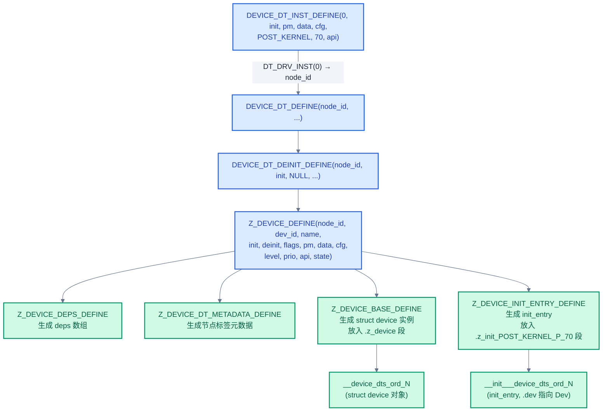
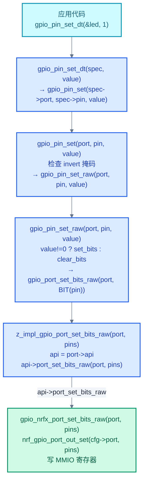
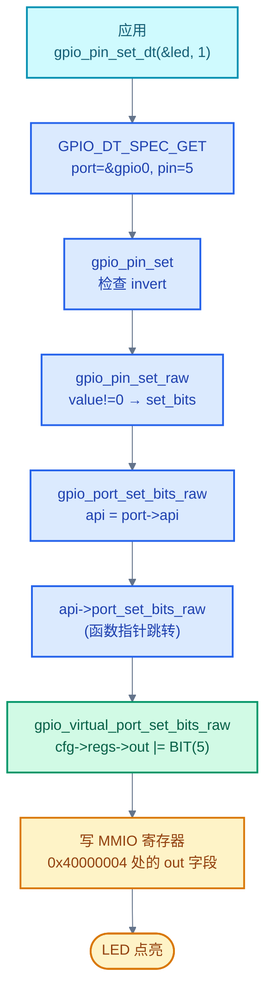

# 13. Zephyr 设备驱动模型

> 一句话概括：本文从"应用调用 `gpio_pin_set()` 到寄存器写入"这条完整调用链出发，剖析 Zephyr 设备驱动模型的核心数据结构 `struct device`、设备定义宏、子系统 API 模板、初始化机制与 MMIO 管理，并以一个 GPIO 驱动为例走完从 DTS binding 到驱动注册的全流程。
> **工程师视角**：读完后你应当能回答"`struct device` 为什么把 config 与 data 分离"、"为什么用函数指针表而非 switch-case 实现多态"、"为什么 `DEVICE_DT_DEFINE` 优于 `DEVICE_DEFINE`"、"为什么需要延迟初始化"四个问题，并能为一个新外设写一份完整的 binding + 驱动 + Kconfig + CMakeLists。

### 关键术语

| 缩写 | 全称 | 含义 |
|------|------|------|
| SoC | System on Chip | 片上系统，集成 CPU 与外设的单芯片 |
| DTS | Devicetree Source | 设备树源文件，描述硬件配置 |
| DT | Devicetree | 设备树，本文中常指 Zephyr 编译时处理的设备树数据 |
| MMIO | Memory-Mapped I/O | 内存映射 I/O，外设寄存器映射到地址空间 |
| PM | Power Management | 电源管理，控制设备低功耗状态 |
| IRQ | Interrupt Request | 中断请求 |
| ISR | Interrupt Service Routine | 中断服务例程 |
| API | Application Programming Interface | 应用程序接口 |
| HAL | Hardware Abstraction Layer | 硬件抽象层，SoC 厂商提供的底层寄存器操作 |
| BSP | Board Support Package | 板级支持包 |
| ROM | Read-Only Memory | 只读存储器，本文中泛指代码与常量所在镜像段 |
| RAM | Random Access Memory | 随机存取存储器，运行时可写 |
| MMU | Memory Management Unit | 内存管理单元，负责虚拟地址映射 |
| PCIe | Peripheral Component Interconnect Express | 高速外设互联总线，地址运行时探测 |
| GPIO | General Purpose Input/Output | 通用输入输出 |
| UART | Universal Asynchronous Receiver-Transmitter | 通用异步收发器 |

---

### 前置阅读

| 需要了解 | 参考文档 |
|----------|----------|
| 设备树节点、`compatible` 与 binding | [03-设备树详解](./03-设备树详解.md) |
| 初始化级别与启动序列 | [04-内核启动与初始化](./04-内核启动与初始化.md) |
| `DT_*` 宏与 `DT_INST_FOREACH_STATUS_OKAY` | [03-设备树详解](./03-设备树详解.md) §8 |

---

## 1. 概述：驱动模型的本质

> 上一篇 [04-内核启动与初始化](./04-内核启动与初始化.md) 解决了"内核如何被建立"的问题。但内核本身不直接操作硬件——点亮 LED、读传感器、发 UART 数据都要靠设备驱动。一个自然的问题是：上百个 SoC 厂商、上千种外设、几万个寄存器，Zephyr 怎么用一套机制让应用代码"无视硬件差异"地调用？本章用 GPIO 从定义到调用的完整调用链建立直觉，再讲标准化设计。

> 官方文档 `doc/kernel/drivers/index.rst` 的 Introduction 指出：Zephyr 设备模型为系统中所有配置的驱动提供一致的配置接口，并负责初始化所有驱动；"每种类型的驱动（如 UART、SPI、I2C）都由一组通用类型 API 支持"；"驱动在初始化期间填充指向其 API 函数指针表结构的指针"，"这些结构按初始化级别顺序放入 RAM 段"。

### 1.1 一个具体场景：从 DEVICE_DT_DEFINE 到 gpio_pin_set

考虑一个最常见的需求：应用代码点亮板卡上的 LED。Zephyr 的写法是：

```c
#include <zephyr/drivers/gpio.h>

static const struct gpio_dt_spec led =
    GPIO_DT_SPEC_GET(DT_ALIAS(led0), gpios);

gpio_pin_configure_dt(&led, GPIO_OUTPUT_ACTIVE);
gpio_pin_set_dt(&led, 1);
```

应用代码完全看不到寄存器、看不到 SoC、甚至看不到"这是 nRF52840 还是 STM32"。这条简单的调用背后，是一整套机制的协作。把它拆开看，从设备的"诞生"到"被调用"经过五步：

1. **DTS 描述硬件**：板卡 DTS 写明 LED 接在 `&gpio0` 的第 13 号引脚，`compatible = "nordic,nrf-gpio"`。构建系统生成 `devicetree_generated.h`，内含每个节点的宏
2. **驱动声明 `DT_DRV_COMPAT`**：`drivers/gpio/gpio_nrfx.c` 顶部 `#define DT_DRV_COMPAT nordic_nrf_gpio`，把自己与 DTS 节点关联起来
3. **`DEVICE_DT_INST_DEFINE` 实例化设备**：驱动用 `DT_INST_FOREACH_STATUS_OKAY(GPIO_NRF_DEVICE)` 为每个 `status = "okay"` 的节点生成一个 `struct device` 实例，把 `gpio_nrfx_drv_api_funcs`（API 函数指针表）填进 `dev->api`
4. **内核自动调用 init**：启动时 `z_cstart()` 按初始化级别遍历 `init_entry` 段，调用 `gpio_nrfx_init()` 完成 GPIO 控制器硬件初始化
5. **应用调用走函数指针表**：`gpio_pin_set_dt(&led, 1)` → `gpio_pin_set(port, pin, 1)` → `gpio_port_set_bits_raw(port, BIT(pin))` → `api->port_set_bits_raw(port, pins)`，最终落到 `gpio_nrfx_port_set_bits_raw()` 写 nRF GPIO 寄存器

整个链条的关键节点是第 3 步生成的 `struct device`——它把"硬件配置"（config）、"运行时数据"（data）、"操作接口"（api）三件事打包到一起，让上层代码用一个指针就能操作任意设备。

> **核心要点**：驱动模型的本质是"硬件操作接口的标准化"。`struct device` 把"硬件长什么样"（config，来自 DTS）、"运行时状态"（data）、"怎么操作"（api，函数指针表）三者绑定到一个对象上。应用代码通过统一的子系统 API（如 `gpio_pin_set`）调用，由 API 内部经 `dev->api` 跳到具体驱动实现——多态在 C 里就这么实现了。

### 1.2 驱动模型的分层

下图（来自 Zephyr 官方文档）展示了应用、子系统 API、驱动、硬件四层之间的关系：


*来源：Zephyr 官方文档 `doc/kernel/drivers/device_driver_model.svg`（原图设置：`width: 40%`、`align: center`、`alt: Device Driver Model`）*

> **如何读这张图**：应用层调用 `gpio_pin_set()`、`uart_poll_out()` 这种子系统 API；子系统 API 是一组内联包装函数，通过 `dev->api` 函数指针表跳转到具体驱动实现；驱动实现调用 SoC 厂商 HAL（如 nrfx、STM32 HAL）操作寄存器；HAL 直接读写 MMIO。这套分层让应用、子系统、驱动三者解耦——换 SoC 只需换驱动实现，应用代码不变。

### 1.3 标准驱动

Zephyr 在所有支持的板卡上都提供四类标准驱动，内核启动时自动初始化它们（见 [04-内核启动与初始化](./04-内核启动与初始化.md) §3）：

| 标准驱动 | 用途 |
|---------|------|
| 中断控制器 | 内核中断管理子系统使用 |
| 定时器 | 内核系统时钟与硬件时钟使用 |
| 串口 | 内核控制台子系统使用 |
| 熵源 | 随机数生成器子系统使用 |

> **如何读这张表**："标准"意味着这些驱动是内核正常工作的前提——没有中断控制器和定时器，调度器跑不起来；没有串口，控制台打印不出来。它们通常在 `PRE_KERNEL_1` 级别初始化，比普通设备早。

### 1.4 同步调用

> 官方文档 `doc/kernel/drivers/index.rst` 的 Synchronous Calls 章节指出：Zephyr 为多块板卡提供设备驱动，**每个驱动应优先支持基于中断的实现而非轮询**，除非具体硬件不提供任何中断。通过设备特定 API（如 `i2c.h`、`spi.h`）访问的高层调用**通常是同步的**，因此这些调用**应当是阻塞的**。

这意味着应用调用 `i2c_transfer()`、`spi_write()` 等函数时，调用线程会阻塞直到传输完成——驱动内部用信号量或中断等待硬件就绪，而不是让应用轮询状态位。这一约定让上层代码可以用顺序思维写 I/O，无需自己管理异步状态机。

---

## 2. `struct device` 结构剖析

> 上一章用调用链建立了"驱动模型在做什么"的直觉。本章把镜头对准链条的核心节点——`struct device`，逐字段剖析它的定义、存储位置与设计意图。理解了这个结构，后面所有宏与机制都是在围绕它做文章。

### 2.1 实际定义

源码位于 [include/zephyr/device.h](file:///home/pbw/rtos/cs-learning-notes/zephyr-project/zephyr/include/zephyr/device.h#L513-L553)：

```c
struct device {
    /** Name of the device instance */
    const char *name;
    /** Address of device instance config information */
    const void *config;
    /** Address of the API structure exposed by the device instance */
    const void *api;
    /** Address of the common device state */
    struct device_state *state;
    /** Address of the device instance private data */
    void *data;
    /** Device operations */
    struct device_ops ops;
    /** Device flags */
    device_flags_t flags;
#if defined(CONFIG_DEVICE_DEPS)
    Z_DEVICE_DEPS_CONST device_handle_t *deps;
#endif
#if defined(CONFIG_PM_DEVICE)
    union {
        struct pm_device_base *pm_base;
        struct pm_device *pm;
        struct pm_device_isr *pm_isr;
    };
#endif
#if defined(CONFIG_DEVICE_DT_METADATA)
    const struct device_dt_metadata *dt_meta;
#endif
};
```

注意官方文档的 [Driver Data Structures](../zephyr-project/zephyr/doc/kernel/drivers/index.rst) 章节给出了简化版本（只有 `name`/`config`/`api`/`data` 四个字段），实际定义要丰富得多——`state`、`ops`、`flags`、`deps`、`pm`、`dt_meta` 都是后来按需加上的，每个都由对应 Kconfig 开关控制。

> 官方文档 `doc/kernel/drivers/index.rst` 的 Driver Data Structures 章节对简化版四字段的说明：`config` 是**编译时设置的只读配置数据**（如内存映射 I/O 基地址、IRQ 线号或其他固定的硬件物理特性），即传给 `DEVICE_DEFINE()` 的 `config` 指针；`data` 保存在 **RAM** 中，用于驱动的**每实例运行时簿记**（如引用计数、信号量、scratch 缓冲区等）；`api` 将通用子系统 API 映射到驱动中的具体实现，**通常是只读的、编译期填充**。

### 2.2 字段详解

| 字段 | 存储位置 | 类型 | 用途 |
|------|---------|------|------|
| `name` | ROM | `const char *` | 设备名，用于 `device_get_binding()` 按名查找 |
| `config` | ROM | `const void *` | 指向驱动 `xxx_config` 结构体，含寄存器基地址、中断号、时钟等编译时常量 |
| `api` | ROM | `const void *` | 指向 `xxx_driver_api` 函数指针表，驱动实现的多态入口 |
| `state` | RAM | `struct device_state *` | 指向设备状态，记录 init 返回值与是否已初始化 |
| `data` | RAM | `void *` | 指向驱动 `xxx_data` 结构体，含运行时可变状态（缓冲区、锁、引用计数等） |
| `ops` | ROM | `struct device_ops` | 设备操作表，目前含 `init` 与可选 `deinit` 函数指针 |
| `flags` | ROM | `uint8_t` | 设备标志，如 `DEVICE_FLAG_INIT_DEFERRED` 标记延迟初始化 |
| `deps` | ROM | `device_handle_t *` | 设备依赖句柄数组，用于 `device_required_handles_get()` |
| `pm` | RAM | `union` | 电源管理上下文，`CONFIG_PM_DEVICE` 启用时存在 |
| `dt_meta` | ROM | `const struct device_dt_metadata *` | 设备树元数据（节点标签等），用于 `device_get_by_dt_nodelabel()` |

> **如何读这张表**：ROM/RAM 列是关键——`config`、`api`、`name` 在 ROM 中，多实例共享同一份代码不重复占用 RAM；`state`、`data` 在 RAM 中，每个实例独立。这种分离是 Zephyr 针对资源受限嵌入式场景的核心优化。

### 2.3 `device_state` 与 `device_ops`

`struct device_state` 源码位于 [include/zephyr/device.h](file:///home/pbw/rtos/cs-learning-notes/zephyr-project/zephyr/include/zephyr/device.h#L458-L472)：

```c
struct device_state {
    /** 设备初始化返回码（正 errno 值） */
    uint8_t init_res;
    /** 标记初始化函数是否已被调用 */
    bool initialized : 1;
};
```

`device_is_ready()` 的实现就检查这两个字段（[kernel/device.c](file:///home/pbw/rtos/cs-learning-notes/zephyr-project/zephyr/kernel/device.c#L186-L197)）：

```c
bool z_impl_device_is_ready(const struct device *dev)
{
    if (dev == NULL) {
        return false;
    }
    return dev->state->initialized && (dev->state->init_res == 0U);
}
```

`struct device_ops` 源码位于 [include/zephyr/device.h](file:///home/pbw/rtos/cs-learning-notes/zephyr-project/zephyr/include/zephyr/device.h#L500-L508)，目前包含 `init` 与可选 `deinit`：

```c
struct device_ops {
    int (*init)(const struct device *dev);
#ifdef CONFIG_DEVICE_DEINIT_SUPPORT
    int (*deinit)(const struct device *dev);
#endif
};
```

`do_device_init()`（[kernel/device.c](file:///home/pbw/rtos/cs-learning-notes/zephyr-project/zephyr/kernel/device.c#L18-L61)）通过 `dev->ops.init` 调用驱动初始化函数，把返回码记入 `state->init_res`。

### 2.4 `struct device` 与 config/data/state 的关系

下图展示一个 `struct device` 实例如何与它的 config、data、state、api 四个对象建立引用关系：

```mermaid
%%{init: {"theme": "base", "themeVariables": {"primaryColor": "#f8fafc", "primaryTextColor": "#1e293b", "primaryBorderColor": "#475569", "lineColor": "#64748b", "secondaryColor": "#f1f5f9", "secondaryBorderColor": "#94a3b8", "tertiaryColor": "#f8fafc", "fontFamily": "\"trebuchet ms\", verdana, arial, sans-serif"}}}%%
flowchart TD
    Dev["struct device<br/>(ROM 中)"]
    Dev -->|name| Name["\"GPIO_0\"<br/>(字符串常量)"]
    Dev -->|config| Cfg["gpio_nrfx_cfg<br/>port=0x50000000<br/>gpiote=&gpiote0<br/>(ROM)"]
    Dev -->|api| Api["gpio_nrfx_drv_api_funcs<br/>函数指针表<br/>(ROM)"]
    Dev -->|state| State["device_state<br/>init_res=0<br/>initialized=true<br/>(RAM)"]
    Dev -->|data| Data["gpio_nrfx_data<br/>callbacks 链表<br/>invert 掩码<br/>(RAM)"]
    Dev -->|ops| Ops["device_ops<br/>init=gpio_nrfx_init<br/>(ROM)"]

    classDef rom fill:#dbeafe, stroke:#2563eb, color:#1e40af, stroke-width:2px
    classDef ram fill:#d1fae5, stroke:#059669, color:#065f46, stroke-width:2px

    class Dev,Cfg,Api,Ops,Name rom
    class State,Data ram
```

> **如何读这张图**：蓝色块在 ROM 中，绿色块在 RAM 中。`struct device` 本身也在 ROM（编译期由 `DEVICE_DT_DEFINE` 静态生成），但它的 `state` 与 `data` 指针指向 RAM 中的对象。同一驱动若被实例化两次（如 `gpio0` 与 `gpio1`），会生成两个 `struct device`，共享同一份 `api`（代码不重复），但 `config`、`data`、`state` 各自独立。

### 2.5 为什么 config 与 data 分离

把配置信息和运行时数据塞到同一个结构体里看似更简单，Zephyr 却坚持分离，原因有三：

1. **节省 RAM**：`config` 含寄存器基地址、中断号、时钟配置等编译时常量，体积通常几十字节。若放到 RAM，每个实例都要占用——nRF52840 有 32 个 GPIO 端口实例，就要浪费 32×几十字节的宝贵 RAM。分离后 `config` 在 ROM，零 RAM 占用
2. **多实例共享代码**：同一驱动的多个实例共享同一份驱动函数（ROM 中），但每个实例有独立的 `config`（描述不同硬件参数）和独立的 `data`（保存不同运行时状态）。这是"一份代码支持多个设备"的基础
3. **保护只读数据**：`config` 用 `const` 修饰，编译器与硬件 MPU（Memory Protection Unit，内存保护单元）可防止驱动代码意外修改硬件配置——只读数据放 ROM 还能利用 XIP（eXecute In Place，片内执行）直接从 Flash 读取，无需拷贝到 RAM

> **核心要点**：`struct device` 把"硬件配置（config，ROM）"、"运行时数据（data，RAM）"、"操作接口（api，ROM）"、"设备状态（state，RAM）"四件事分离。这种分离让多实例共享代码、节省 RAM、保护只读数据成为可能——是 Zephyr 驱动模型针对嵌入式场景的关键优化。

---

## 3. 设备定义宏：`DEVICE_DEFINE` / `DEVICE_DT_DEFINE` / `DT_NODE_DEFINE`

> 上一章剖析了 `struct device` 的字段。但 `struct device` 是静态对象，怎么"造"出来？答案是设备定义宏。本章讲三个核心宏——`DEVICE_DEFINE`、`DEVICE_DT_DEFINE`、`DEVICE_DT_INST_DEFINE`——的参数、展开过程与选型理由。

官方 `device.h` 头文件提供了一组用于设备驱动定义的 API（仅限驱动内部使用，应用代码不应直接调用），来自 [官方文档 Driver APIs](../zephyr-project/zephyr/doc/kernel/drivers/index.rst)：

| 宏 | 官方说明 |
|----|---------|
| `DEVICE_DEFINE()` | 创建设备对象及相关数据结构，并设置其在启动时的初始化 |
| `DEVICE_NAME_GET()` | 将设备标识符转换为设备对象的全局标识符 |
| `DEVICE_GET()` | 按名称获取设备对象指针 |
| `DEVICE_DECLARE()` | 声明一个设备对象，用于需要对尚未定义的设备做前向引用 |
| `DEVICE_API()` | 包装驱动 API 声明，将其分配到对应的链接器段 |

> 官方文档明确：这些 API 仅用于设备驱动，不应在应用代码中使用。其中 `DEVICE_DECLARE()` 用于解决"前向引用"问题——当需要引用一个尚未定义的设备时（如中断处理函数参数引用设备本身），用它打破循环依赖，详见 §7.4。

### 3.1 三个宏的参数对比

下表对照三个核心宏的参数与用途（源码见 [include/zephyr/device.h](file:///home/pbw/rtos/cs-learning-notes/zephyr-project/zephyr/include/zephyr/device.h)）：

| 宏 | 第一参数 | 设备名来源 | 设备树关联 | 典型场景 |
|----|---------|----------|----------|---------|
| `DEVICE_DEFINE` | `dev_id`（C 标识符） | 显式传 `name` 字符串 | 无 | 软件设备、无 DTS 节点的设备 |
| `DEVICE_DT_DEFINE` | `node_id`（DT 节点标识符） | `DEVICE_DT_NAME(node_id)`，取 `label` 或 `node@addr` | 单一 DTS 节点 | 已知具体节点 label 的驱动 |
| `DEVICE_DT_INST_DEFINE` | `inst`（实例号整数） | 同上，由 `DT_DRV_INST(inst)` 推出 `node_id` | `DT_DRV_COMPAT` 匹配的所有节点 | 批量实例化同 compatible 设备 |

三个宏都接收相同的剩余参数：`init_fn`、`pm`、`data`、`config`、`level`、`prio`、`api`。差异仅在于"设备标识从哪里来"。

### 3.2 `DEVICE_DT_INST_DEFINE` 是 `DEVICE_DT_DEFINE` 的快捷方式

源码（[include/zephyr/device.h](file:///home/pbw/rtos/cs-learning-notes/zephyr-project/zephyr/include/zephyr/device.h#L283-L284)）：

```c
#define DEVICE_DT_INST_DEFINE(inst, ...) \
    DEVICE_DT_DEFINE(DT_DRV_INST(inst), __VA_ARGS__)
```

`DT_DRV_INST(inst)` 展开为 `DT_INST(inst, DT_DRV_COMPAT)`，即"第 `inst` 个匹配 `DT_DRV_COMPAT` 的节点"。所以驱动文件顶部必须先定义 `DT_DRV_COMPAT`：

```c
/* 把 compatible = "nordic,nrf-gpio" 转成 C 标识符 */
#define DT_DRV_COMPAT nordic_nrf_gpio
```

### 3.3 宏展开到设备实例化的流程

`DEVICE_DT_DEFINE` 内部调用 `Z_DEVICE_DEFINE`（[include/zephyr/device.h](file:///home/pbw/rtos/cs-learning-notes/zephyr-project/zephyr/include/zephyr/device.h#L1317-L1336)），后者做四件事：

1. 调用 `Z_DEVICE_DEPS_DEFINE` 生成设备依赖数组
2. 调用 `Z_DEVICE_DT_METADATA_DEFINE` 生成设备树元数据
3. 调用 `Z_DEVICE_BASE_DEFINE` 生成 `struct device` 实例，放入按级别/优先级排序的链接段
4. 调用 `Z_DEVICE_INIT_ENTRY_DEFINE` 生成 `struct init_entry`，放入初始化段

下图展示 `DEVICE_DT_INST_DEFINE(0, ...)` 的完整展开流程：



> **如何读这张图**：蓝色是宏调用层级，绿色是宏展开后生成的静态对象。`DEVICE_DT_INST_DEFINE` 不是函数调用，而是宏——编译期展开为一组静态变量定义。其中 `struct device` 对象 `__device_dts_ord_N`（N 是节点依赖序号）是核心产物，`init_entry` 是它进入自动初始化序列的"门票"。

### 3.4 `init_entry` 与链接脚本段

`struct init_entry` 源码（[include/zephyr/init.h](file:///home/pbw/rtos/cs-learning-notes/zephyr-project/zephyr/include/zephyr/init.h#L66-L77)）：

```c
struct init_entry {
    /* SYS_INIT 时存 init 函数；device 时为 NULL */
    int (*init_fn)(void);
    /* device 时存设备指针；SYS_INIT 时为 NULL */
    const struct device *dev;
};
```

`Z_INIT_ENTRY_SECTION(level, prio, sub_prio)` 把每个 `init_entry` 放入按级别、优先级、子优先级命名的链接段（[include/zephyr/init.h](file:///home/pbw/rtos/cs-learning-notes/zephyr-project/zephyr/include/zephyr/init.h#L111-L113)）：

```c
#define Z_INIT_ENTRY_SECTION(level, prio, sub_prio) \
    __attribute__((__section__( \
        ".z_init_" #level "_P_" STRINGIFY(prio) "_SUB_" STRINGIFY(sub_prio) "_")))
```

例如 `POST_KERNEL` 级别、优先级 70 的设备，其 `init_entry` 落在 `.z_init_POST_KERNEL_P_70_SUB_0_` 段。链接脚本按段名排序，启动代码 `z_cstart()` 顺序遍历各段、调用 `do_device_init()`（详见 [04-内核启动与初始化](./04-内核启动与初始化.md) §4-§5）。

### 3.5 为什么 `DEVICE_DT_DEFINE` 优于 `DEVICE_DEFINE`

`DEVICE_DEFINE` 接收手写的 `dev_id` 与 `name` 字符串，与设备树脱钩。看起来更灵活，实际有三个问题：

1. **硬件信息要重复写两遍**：寄存器地址、中断号、时钟等既要在 DTS 里写一遍（给构建系统），又要在 C 代码里 `#define` 一遍（给 `DEVICE_DEFINE`）——容易不一致
2. **多实例需要手写每个实例**：板卡有 4 个 GPIO 端口，就要写 4 份 `DEVICE_DEFINE`，每份都要手动填 `cfg0`、`cfg1`、`cfg2`、`cfg3`。加新型号 SoC 时所有实例都要重写
3. **`device_get_binding()` 依赖名字字符串**：`DEVICE_DEFINE` 用手写名字查找，`DEVICE_DT_DEFINE` 用节点 label 自动生成名字，并支持 `DEVICE_DT_GET()` 编译期获取指针——零运行时开销

`DEVICE_DT_DEFINE` 把这些自动化了：DTS 节点信息由 `DT_*` 宏编译期读取，`DEVICE_DT_GET(node_id)` 直接拿到 `struct device *` 指针，无需运行时按名查找。新加实例只要在 DTS 加节点，驱动代码完全不改。

> **核心要点**：`DEVICE_DT_DEFINE` 把"设备定义"与"设备树节点"绑定——硬件信息从 DTS 自动读、设备名从节点 label 自动生成、设备指针编译期可获取。`DEVICE_DEFINE` 仅用于无 DTS 节点的软件设备。新驱动应优先用 `DEVICE_DT_DEFINE` 或 `DEVICE_DT_INST_DEFINE`。

---

## 4. 子系统 API 模板：`xxx_driver_api` 接口表

> 上一章讲了如何创建 `struct device`。但 `dev->api` 指向的"函数指针表"到底是什么？本章讲子系统 API 模板——这是 Zephyr 实现"统一接口、多种实现"的关键。

### 4.1 `__subsystem` 与 `DEVICE_API`

定义一个子系统 API 分两步。第一步在头文件声明 API 结构体，用 `__subsystem` 修饰（[include/zephyr/drivers/gpio.h](file:///home/pbw/rtos/cs-learning-notes/zephyr-project/zephyr/include/zephyr/drivers/gpio.h#L810)）：

```c
__subsystem struct gpio_driver_api {
    int (*pin_configure)(const struct device *port, gpio_pin_t pin,
                         gpio_flags_t flags);
    int (*port_get_raw)(const struct device *port,
                        gpio_port_value_t *value);
    int (*port_set_masked_raw)(const struct device *port,
                               gpio_port_pins_t mask,
                               gpio_port_value_t value);
    int (*port_set_bits_raw)(const struct device *port,
                             gpio_port_pins_t pins);
    int (*port_clear_bits_raw)(const struct device *port,
                               gpio_port_pins_t pins);
    int (*port_toggle_bits)(const struct device *port,
                            gpio_port_pins_t pins);
    int (*pin_interrupt_configure)(const struct device *port,
                                   gpio_pin_t pin,
                                   enum gpio_int_mode mode,
                                   enum gpio_int_trig trig);
    int (*manage_callback)(const struct device *port,
                           struct gpio_callback *cb, bool set);
    uint32_t (*get_pending_int)(const struct device *dev);
};
```

第二步在驱动 C 文件中用 `DEVICE_API` 宏定义实例（[include/zephyr/device.h](file:///home/pbw/rtos/cs-learning-notes/zephyr-project/zephyr/include/zephyr/device.h#L1365)），如 [drivers/gpio/gpio_nrfx.c](file:///home/pbw/rtos/cs-learning-notes/zephyr-project/zephyr/drivers/gpio/gpio_nrfx.c#L650)：

```c
static DEVICE_API(gpio, gpio_nrfx_drv_api_funcs) = {
    .pin_configure = gpio_nrfx_pin_configure,
    .port_get_raw = gpio_nrfx_port_get_raw,
    .port_set_masked_raw = gpio_nrfx_port_set_masked_raw,
    .port_set_bits_raw = gpio_nrfx_port_set_bits_raw,
    .port_clear_bits_raw = gpio_nrfx_port_clear_bits_raw,
    .port_toggle_bits = gpio_nrfx_port_toggle_bits,
    .pin_interrupt_configure = gpio_nrfx_pin_interrupt_configure,
    .manage_callback = gpio_nrfx_manage_callback,
};
```

`DEVICE_API(gpio, name)` 展开为 `const struct gpio_driver_api name`，并把对象放入 iterable section，使 `DEVICE_API_IS(gpio, dev)` 能在运行时校验设备 API 类型。

> 官方文档 `doc/kernel/drivers/index.rst` 的 Subsystems and API Structures 章节给出子系统 API 的标准模板：用 `__subsystem` 注解标记 API 结构体类型；若所有驱动 API 实例都被分配到对应的 API 链接段，则可用 `DEVICE_API_IS()` **验证 API 类型**。子系统头文件中的内联包装函数通过 `DEVICE_API_GET(subsystem, dev)` 取到 API 指针再调用，官方示例：
> ```c
> static inline int subsystem_do_this(const struct device *dev, int foo, int bar)
> {
>     return DEVICE_API_GET(subsystem, dev)->do_this(dev, foo, bar);
> }
> ```

### 4.2 内联包装函数

子系统头文件提供一组 `static inline` 包装函数，把"`dev->api` 取指针再调用"封装起来。`gpio_port_set_bits_raw` 的实现（[include/zephyr/drivers/gpio.h](file:///home/pbw/rtos/cs-learning-notes/zephyr-project/zephyr/include/zephyr/drivers/gpio.h#L1410-L1422)）：

```c
static inline int z_impl_gpio_port_set_bits_raw(const struct device *port,
                                                gpio_port_pins_t pins)
{
    const struct gpio_driver_api *api =
        (const struct gpio_driver_api *)port->api;
    int ret;

    SYS_PORT_TRACING_FUNC_ENTER(gpio_port, set_bits_raw, port, pins);
    ret = api->port_set_bits_raw(port, pins);
    SYS_PORT_TRACING_FUNC_EXIT(gpio_port, set_bits_raw, port, ret);
    return ret;
}
```

应用代码调用的 `gpio_port_set_bits_raw()` 是个 `__syscall`，它会经系统调用层（用户态时）或直接调到 `z_impl_gpio_port_set_bits_raw()`，最终 `api->port_set_bits_raw(port, pins)` 跳到具体驱动实现。这就是多态在 C 里的实现。

### 4.3 GPIO 调用链：从 `gpio_pin_set_dt` 到驱动实现

应用调用 `gpio_pin_set_dt(&led, 1)` 时的完整跳转链（参见 [include/zephyr/drivers/gpio.h](file:///home/pbw/rtos/cs-learning-notes/zephyr-project/zephyr/include/zephyr/drivers/gpio.h)）：



> **如何读这张图**：蓝色是子系统层的内联包装函数（在 `gpio.h` 中），绿色是具体驱动实现（在 `gpio_nrfx.c` 中）。`api->port_set_bits_raw` 这一步是关键——`api` 是 `const struct gpio_driver_api *`，编译期不知道指向哪个驱动，运行期才通过函数指针跳转。换 SoC 只需换驱动实现（如换成 `gpio_stm32.c`），上层所有包装函数不变。

### 4.4 为什么用函数指针表而非 switch-case

实现"同一接口、多种实现"有两种朴素方案：

- **switch-case**：在 `gpio_port_set_bits_raw()` 里用 `switch (port->driver_type)` 判断是 nRF 还是 STM32，分别调用对应函数
- **函数指针表**：在 `port->api` 里直接存好函数指针，调用时 `api->port_set_bits_raw(port, pins)`

Zephyr 选函数指针表，原因有三：

1. **零分支开销**：switch-case 至少要一次比较与跳转，函数指针是一次间接调用——ARM Cortex-M 上 `blx reg` 单指令完成
2. **编译时裁剪**：未启用的驱动根本不编译进镜像，对应函数指针表也不存在；switch-case 即使分支被裁掉，还要保留类型枚举与判断逻辑
3. **驱动独立编译**：每个驱动 C 文件独立定义自己的 `xxx_driver_api` 实例，无需修改子系统头文件——加新驱动只加文件，不改公共代码。switch-case 要改公共函数加分支，违反开放封闭原则

代价是函数指针表本身占 ROM（每个驱动一份 `xxx_driver_api` 结构体，几十字节），但相比 switch-case 的散布逻辑与不可裁剪性，这点开销在嵌入式场景完全可接受。

> 官方文档 `doc/kernel/drivers/index.rst` 的 Subsystems and API Structures 章节提醒：由于 API 函数的指针被 `api` 结构体引用，即使未被使用也会**始终被包含进二进制**——`gc-sections` 链接器选项总能看到至少一处引用。因此要在驱动 API 层面做链接时大小优化，通常需要用 Kconfig 选项控制可选功能的编译，而非依赖 `gc-sections` 自动裁剪。

### 4.5 设备特定 API 扩展

有些设备除标准子系统 API 外还提供额外能力（如某 GPIO 控制器支持硬件去抖）。Zephyr 用"设备特定 API"扩展，详见 [官方文档 Device-Specific API Extensions](../zephyr-project/zephyr/doc/kernel/drivers/index.rst)。这类设备把子系统操作与设备特定 API 组合在一起，在设备专属头文件中描述扩展接口。

API 定义典型形式（来自官方文档）：

```c
#include <zephyr/drivers/subsystem.h>

/* 不需要从用户态线程调用的扩展 */
int specific_do_that(const struct device *dev, int foo);

/* 需要从用户态线程调用的扩展，用 __syscall 声明 */
__syscall int specific_from_user(const struct device *dev, int bar);

/* 仅当扩展包含 syscall 时需要此头 */
#include <zephyr/syscalls/specific.h>
```

驱动同时实现子系统 API 与设备特定 API；syscall 路径还需提供 `z_vrfy_*` 验证函数（来自官方文档）：

```c
static int generic_do_this(const struct device *dev, void *arg)
{
    /* ... */
}

static struct generic_api api {
    /* ... */
    .do_this = generic_do_this,
    /* ... */
};

/* supervisor-only API 全局可见 */
int specific_do_that(const struct device *dev, int foo)
{
    /* ... */
}

/* syscall API 经翻译层转入实现 */
int z_impl_specific_from_user(const struct device *dev, int bar)
{
    /* ... */
}

#ifdef CONFIG_USERSPACE

#include <zephyr/internal/syscall_handler.h>

int z_vrfy_specific_from_user(const struct device *dev, int bar)
{
    K_OOPS(K_SYSCALL_SPECIFIC_DRIVER(dev, K_OBJ_DRIVER_GENERIC, &api));
    return z_impl_specific_do_that(dev, bar);
}

#include <zephyr/syscalls/specific_from_user_mrsh.c>

#endif /* CONFIG_USERSPACE */
```

> **如何读这段代码**：`specific_do_that()` 是 supervisor 模式全局可见的扩展函数；`specific_from_user()` 用 `__syscall` 声明，用户态可调用，实际实现位于 `z_impl_specific_from_user()`，验证函数 `z_vrfy_specific_from_user()` 在 `CONFIG_USERSPACE` 启用时做权限与类型检查，再转调实现。应用通过子系统 API（如 `gpio_pin_set`）与设备特定 API（如 `specific_do_that`）共同操作设备。

> **核心要点**：子系统 API 模板 = `__subsystem struct xxx_driver_api` 函数指针表 + `static inline` 包装函数。驱动实现填一张表，应用调用包装函数，运行期经 `dev->api` 跳转。这种"表 + 包装"模式实现了 C 语言的多态，同时让驱动独立编译、按需裁剪成为可能。

---

## 5. 初始化级别与延迟初始化

> 上一章讲了 API 调用链。但驱动 init 函数什么时候被调用？为什么 GPIO 驱动总能在 I2C 传感器驱动之前初始化？本章回答这些问题，并解释为什么还需要"延迟初始化"机制。初始化级别的完整说明见 [04-内核启动与初始化](./04-内核启动与初始化.md) §4，本章聚焦驱动视角。

### 5.1 初始化级别回顾

Zephyr 把启动过程划分为 6 个有序级别（[include/zephyr/init.h](file:///home/pbw/rtos/cs-learning-notes/zephyr-project/zephyr/include/zephyr/init.h#L20-L46)）：

| 级别 | 序号 | 运行上下文 | 可用内核原语 | 典型驱动 |
|------|------|----------|------------|---------|
| `EARLY` | 0 | 中断栈 | 几乎无 | 极早期硬件、架构扩展 |
| `PRE_KERNEL_1` | 1 | 中断栈 | 中断已配置，调度器不可用 | 时钟、中断控制器、GPIO |
| `PRE_KERNEL_2` | 2 | 中断栈 | 同上 | 依赖 PRE_KERNEL_1 设备的驱动 |
| `POST_KERNEL` | 3 | main 线程 | 全部内核原语 | 大多数驱动（I2C、SPI、传感器） |
| `APPLICATION` | 4 | main 线程 | 全部 | 应用级初始化 |
| `SMP` | 5 | 次核 | 全部 | 多核场景的次核初始化 |

> **如何读这张表**：级别序号决定执行顺序——序号小的先跑。`PRE_KERNEL_1` 与 `PRE_KERNEL_2` 都跑在中断栈、调度器不可用，所以这两级不能调用 `k_mutex_lock`、`k_sem_take` 等阻塞原语；要用必须放到 `POST_KERNEL`。GPIO 驱动通常放 `PRE_KERNEL_1`，因为它没有依赖、且后续驱动可能用到它。

> 官方文档 `doc/kernel/drivers/index.rst` 的 Initialization Levels 章节对三个核心级别的说明：`PRE_KERNEL_1` 用于**无依赖**的设备（仅依赖处理器/SOC 中的硬件），内核服务尚不可用，但**中断子系统已配置**所以可以设置中断，init 函数运行在**中断栈**上；`PRE_KERNEL_2` 用于依赖 `PRE_KERNEL_1` 已初始化设备的设备，同样不能用内核服务、运行在中断栈；`POST_KERNEL` 用于**需要内核服务**的设备，init 函数运行在**内核主任务上下文**。

驱动或其他系统组件可用 `k_is_pre_kernel()` 检测启动是否仍处于 pre-kernel 阶段（来自官方文档）：

```c
#include <zephyr/kernel.h>

if (k_is_pre_kernel()) {
    /* 调度器不可用，只能用受限原语 */
} else {
    /* 可自由使用内核服务 */
}
```

### 5.2 优先级规则

同一级别内按 `prio` 数值升序执行（0 最先，最大 999）。`prio` 必须是十进制整数字面量或等价符号常量，**不能是表达式**（如 `CONFIG_FOO + 5` 非法）。常用优先级常量：

> 官方文档 `doc/kernel/drivers/index.rst` 的 Initialization Levels 章节规定：优先级是 0 到 999 的整数，**数值小者先初始化**；必须是**无前导零、无符号的十进制整数字面量**（如 `32`），或等价的符号名（如 `#define MY_INIT_PRIO 32`）；**不允许符号表达式**（如 `CONFIG_KERNEL_INIT_PRIORITY_DEFAULT + 5`）。

| 优先级常量 | 默认值 | 用途 |
|-----------|-------|------|
| `CONFIG_KERNEL_INIT_PRIORITY_DEFAULT` | 40 | 大多数驱动默认 |
| `CONFIG_KERNEL_INIT_PRIORITY_DEVICE` | 50 | 通用设备 |
| `CONFIG_GPIO_INIT_PRIORITY` | 40 | GPIO 驱动 |
| `CONFIG_SERIAL_INIT_PRIORITY` | 50 | UART/串口驱动 |
| `CONFIG_SENSOR_INIT_PRIORITY` | 90 | 传感器驱动 |

> **如何读这张表**：数值小者先跑。GPIO 优先级 40，传感器优先级 90——传感器驱动常依赖 GPIO（如中断引脚），所以 GPIO 先跑。但注意：跨级别依赖不靠优先级保证——`POST_KERNEL` 的传感器驱动永远在 `PRE_KERNEL_1` 的 GPIO 之后跑，无论优先级如何。

### 5.3 设备依赖检查

驱动 init 时应检查所依赖的设备是否就绪。nRF GPIO 驱动的 init 函数（[drivers/gpio/gpio_nrfx.c](file:///home/pbw/rtos/cs-learning-notes/zephyr-project/zephyr/drivers/gpio/gpio_nrfx.c#L623-L648)）：

```c
static int gpio_nrfx_init(const struct device *port)
{
    const struct gpio_nrfx_cfg *cfg = get_port_cfg(port);
    int err;

    if (!use_gpiote(cfg)) {
        goto pm_init;
    }

    if (nrfx_gpiote_init_check(cfg->gpiote)) {
        goto pm_init;
    }

    err = nrfx_gpiote_init(cfg->gpiote, 0);
    if (err != 0) {
        return -EIO;
    }
    /* ... */
pm_init:
    return pm_device_driver_init(port, gpio_nrfx_pm_hook);
}
```

依赖设备的就绪状态用 `device_is_ready()` 检查：

```c
if (!device_is_ready(cfg->i2c.bus)) {
    LOG_ERR("I2C bus not ready");
    return -ENODEV;
}
```

若依赖未就绪，返回 `-ENODEV` 让设备标记为未就绪；若想稍后重试，可在 DTS 节点加 `zephyr,deferred-init;` 属性启用延迟初始化。

### 5.4 检查初始化序列

构建后可用 `west build -t initlevels` 查看最终初始化序列（来自 [官方文档 Inspecting the initialization sequence](../zephyr-project/zephyr/doc/kernel/drivers/index.rst)）：

```bash
west build -t initlevels
```

输出按级别与优先级排列所有 `init_entry`，便于排查"为什么我的驱动没被调用"或"为什么 A 在 B 之前跑"。

### 5.5 为什么需要延迟初始化

正常情况下，设备在启动时按级别/优先级自动初始化。但有两类场景需要"延迟"：

1. **依赖运行时才出现的资源**：如 PCIe 设备的 MMIO 地址要运行时从总线探测；USB 设备要等主机枚举。这类设备的 init 必须推迟到资源可用
2. **节能**：某些设备很少使用（如调试用 UART），启动时初始化会一直耗电。延迟到真正使用时才 init，可降低静态功耗

启用方法是给 DTS 节点加 `zephyr,deferred-init` 属性（来自 [官方文档 Deferred initialization](../zephyr-project/zephyr/doc/kernel/drivers/index.rst)）：

```dts
/ {
    a-driver@40000000 {
        reg = <0x40000000 0x1000>;
        zephyr,deferred-init;
    };
};
```

加了此属性的设备启动时**不会**自动调 init，`device_is_ready()` 返回 false。应用在使用前需调用 `device_init(dev)` 手动初始化（[include/zephyr/device.h](file:///home/pbw/rtos/cs-learning-notes/zephyr-project/zephyr/include/zephyr/device.h#L906)）：

```c
__syscall int device_init(const struct device *dev);
```

`device_init()` 内部调 `do_device_init()`（[kernel/device.c](file:///home/pbw/rtos/cs-learning-notes/zephyr-project/zephyr/kernel/device.c#L63-L70)），后者调用 `dev->ops.init(dev)` 完成实际初始化，并把结果记入 `state->init_res`。

> **核心要点**：初始化级别解决"启动顺序"问题，优先级解决"同级别内顺序"问题，延迟初始化解决"依赖运行时资源或节能"问题。三者协作让 Zephyr 既能保证启动顺序正确，又能按需推迟设备初始化。

### 5.6 错误处理：`__ASSERT` 优于返回值

驱动开发中遇到错误时，Zephyr 推荐用 `__ASSERT()` 宏而非层层传播返回值（来自 [官方文档 Error handling](../zephyr-project/zephyr/doc/kernel/drivers/index.rst)）：

- **用 `__ASSERT()` 处理**：错误参数、编程错误、一致性检查、病态/不可恢复故障——这些本不应在正常运行中出现，用断言直接暴露问题
- **用返回值处理**：正常运行中预期会发生的失败（如存储设备满）——这类失败需要调用方决策如何处理

> 官方文档 `doc/kernel/drivers/index.rst` 的 Error handling 章节明确：除非失败是正常运行过程的一部分（如存储设备满），否则**最好用 `__ASSERT()` 宏而不是传播返回值**。当确实需要返回错误给调用方检查时，**成功返回 0，失败返回 POSIX `errno.h` 错误码**。

> **核心要点**：`__ASSERT()` 用于"不该发生"的编程错误与不可恢复故障——直接暴露问题胜过层层传错；返回值用于"预期会发生"的运行时失败——调用方根据 errno 决策。两者分工，避免驱动代码被错误传播逻辑淹没。

---

## 6. `DEVICE_MMIO` 内存映射

> 上一章讲了初始化机制。但驱动 init 时还要处理一件具体的事——把外设寄存器映射到 CPU 地址空间。大多数嵌入式 SoC 上 MMIO 地址编译期就确定，但 PCIe、MMU 等场景下地址运行时才知道。本章讲 `DEVICE_MMIO` 这套机制如何统一处理两类场景。

### 6.1 为什么需要 `DEVICE_MMIO`

外设寄存器访问的核心问题是"地址从哪里来、何时映射"。两种典型场景：

| 场景 | 地址来源 | 映射时机 | 是否需要 RAM 存储 |
|------|---------|---------|-----------------|
| 普通 SoC MMIO | DTS `reg` 属性，编译期常量 | 无需映射，直接用物理地址 | 否 |
| PCIe 设备 | 运行时从总线探测 BAR | init 时调 `device_map()` 映射 | 是 |
| 启用 MMU 的系统 | DTS 物理地址 | init 时映射到虚拟地址 | 是 |

`DEVICE_MMIO` 这套宏的目标是用同一份驱动代码兼顾两类场景——无 MMU/PCIe 时宏展开为空，有 MMU/PCIe 时宏展开为 RAM 存储与映射逻辑。

### 6.2 单区域 MMIO

最常见的情况——驱动只有一个 MMIO 区域。源码示例来自 [官方文档 Device Model Drivers with one MMIO region](../zephyr-project/zephyr/doc/kernel/drivers/index.rst)：

```c
struct my_driver_config {
    DEVICE_MMIO_ROM; /* 必须是第一个字段 */
    /* 其他配置... */
};

struct my_driver_dev_data {
    DEVICE_MMIO_RAM; /* 必须是第一个字段 */
    /* 其他数据... */
};

const static struct my_driver_config my_driver_config_0 = {
    DEVICE_MMIO_ROM_INIT(DT_DRV_INST(0)),
    /* 其他初始化... */
};

int my_driver_init(const struct device *dev)
{
    DEVICE_MMIO_MAP(dev, K_MEM_CACHE_NONE);
    /* ... */
}

int my_driver_some_function(const struct device *dev)
{
    /* 写 MMIO 寄存器 */
    sys_write32(0xDEADBEEF, DEVICE_MMIO_GET(dev));
    return 0;
}
```

四个宏的职责：

- `DEVICE_MMIO_ROM` —— 在 `config` 结构体中展开为 ROM 字段（无 MMU 时为空）
- `DEVICE_MMIO_RAM` —— 在 `data` 结构体中展开为 RAM 字段（无 MMU 时为空）
- `DEVICE_MMIO_ROM_INIT(node_id)` —— 从 DTS 节点初始化 ROM 字段
- `DEVICE_MMIO_MAP(dev, flags)` —— 在 init 中建立映射（无 MMU 时为空操作）
- `DEVICE_MMIO_GET(dev)` —— 返回当前可用的线性地址（无 MMU 时直接返回物理地址）

无 MMU/PCIe 的平台上，`DEVICE_MMIO_RAM` 与 `DEVICE_MMIO_MAP` 展开为空，`DEVICE_MMIO_GET` 直接返回 DTS 里的物理地址——零开销。有 MMU 时，`DEVICE_MMIO_RAM` 在 RAM 中存虚拟地址，`DEVICE_MMIO_MAP` 调 `device_map()` 建立页表映射。

### 6.3 多区域 MMIO 与命名 MMIO

有些驱动有多个 MMIO 区域（如一个 DMA 控制器有控制寄存器与描述符表两块）。此时用 `DEVICE_MMIO_NAMED` 系列（来自 [官方文档 Device Model Drivers with multiple MMIO regions](../zephyr-project/zephyr/doc/kernel/drivers/index.rst)）：

```c
struct my_driver_config {
    DEVICE_MMIO_NAMED_ROM(corge);
    DEVICE_MMIO_NAMED_ROM(grault);
    /* ... */
};

struct my_driver_dev_data {
    DEVICE_MMIO_NAMED_RAM(corge);
    DEVICE_MMIO_NAMED_RAM(grault);
    /* ... */
};

#define DEV_CFG(_dev) \
    ((const struct my_driver_config *)((_dev)->config))
#define DEV_DATA(_dev) \
    ((struct my_driver_dev_data *)((_dev)->data))

int my_driver_init(const struct device *dev)
{
    DEVICE_MMIO_NAMED_MAP(dev, corge, K_MEM_CACHE_NONE);
    DEVICE_MMIO_NAMED_MAP(dev, grault, K_MEM_CACHE_NONE);
    /* ... */
}

int my_driver_some_function(const struct device *dev)
{
    sys_write32(0xDEADBEEF, DEVICE_MMIO_GET(dev, grault));
    sys_write32(0xF0CCAC1A, DEVICE_MMIO_GET(dev, corge));
    return 0;
}
```

每个区域用名字（`corge`、`grault`）区分，对应的 `*_ROM`、`*_RAM`、`*_MAP`、`*_GET` 都加名字后缀。注意驱动需自定义 `DEV_CFG()` 与 `DEV_DATA()` 宏，因为 `DEVICE_MMIO_NAMED_*` 不假设 `config`/`data` 结构体类型。

若 DTS 节点用 `reg-names` 区分多块 `reg`，用 `DEVICE_MMIO_NAMED_ROM_INIT_BY_NAME(name, node_id)` 按名字取地址（来自 [官方文档 Device Model Drivers with multiple MMIO regions in the same DT node](../zephyr-project/zephyr/doc/kernel/drivers/index.rst)）：

```dts
a-driver@40000000 {
    reg = <0x40000000 0x1000>,
          <0x40001000 0x1000>;
    reg-names = "corge", "grault";
};
```

```c
const static struct my_driver_config my_driver_config_0 = {
    DEVICE_MMIO_NAMED_ROM_INIT_BY_NAME(corge, DT_DRV_INST(...)),
    DEVICE_MMIO_NAMED_ROM_INIT_BY_NAME(grault, DT_DRV_INST(...)),
    /* ... */
};
```

### 6.4 toplevel 与无 DTS 场景

有些"驱动式"代码不走设备模型（如内核定时器、中断控制器底层代码），但也要访问 MMIO。这种用 `DEVICE_MMIO_TOPLEVEL` 系列（来自 [官方文档 Drivers that do not use Zephyr Device Model](../zephyr-project/zephyr/doc/kernel/drivers/index.rst)）：

```c
DEVICE_MMIO_TOPLEVEL_STATIC(my_regs, DT_DRV_INST(0));

void some_init_code(void)
{
    DEVICE_MMIO_TOPLEVEL_MAP(my_regs, K_MEM_CACHE_NONE);
    /* ... */
}

void some_function(void)
{
    sys_write32(0xDEADBEEF, DEVICE_MMIO_TOPLEVEL_GET(my_regs));
}
```

`toplevel` 宏不依赖 `struct device`，直接生成一个全局静态变量。

PCIe 等运行时探测地址的场景，直接调底层 `device_map()` 函数（来自 [官方文档 Drivers that do not use DTS](../zephyr-project/zephyr/doc/kernel/drivers/index.rst)）：

```c
void some_init_code(const struct device *dev)
{
    struct pcie_bar mbar;
    bool bar_found = pcie_get_mbar(bdf, index, &mbar);

    device_map(DEVICE_MMIO_RAM_PTR(dev), mbar.phys_addr,
               mbar.size, K_MEM_CACHE_NONE);
}
```

此时 `DEVICE_MMIO_ROM` 可省略——地址不来自 DTS。`device_map()` 源码见 [include/zephyr/sys/device_mmio.h](file:///home/pbw/rtos/cs-learning-notes/zephyr-project/zephyr/include/zephyr/sys/device_mmio.h#L96-L100)。

> **核心要点**：`DEVICE_MMIO` 用同一套宏接口兼顾"编译期已知物理地址"与"运行时映射"两类场景。无 MMU/PCIe 时宏展开为空、零开销；有 MMU 时宏在 RAM 中存虚拟地址、init 时建立页表映射。多区域用 `*_NAMED`，无设备模型用 `*_TOPLEVEL`，无 DTS 用 `device_map()` 直接调。

---

## 7. 多实例驱动：同一驱动支持多个设备

> 上一章讲了 MMIO 管理。但 SoC 上往往有多个相同外设——nRF52840 有 2 个 GPIO 端口、STM32F4 有 5 个 UART。同一份驱动代码怎么支持多个设备实例？本章讲多实例机制。

### 7.1 多实例的核心思路

多实例的关键是"一份代码、多份数据"。驱动 C 文件里只写一份函数实现（如 `gpio_nrfx_port_set_bits_raw`），但为每个 DTS 实例生成独立的 `struct device`、独立的 `config`、独立的 `data`。`struct device` 的 `dev->data` 指针把"哪个实例"的信息带到函数内部——驱动函数通过 `dev->data` 取到当前实例的私有数据。

### 7.2 `DT_INST_FOREACH_STATUS_OKAY`

Zephyr 提供 `DT_INST_FOREACH_STATUS_OKAY(macro)` 宏，对每个 `status = "okay"` 且 compatible 匹配 `DT_DRV_COMPAT` 的节点调用一次 `macro`。`macro` 接收实例号 `inst` 作为参数。

这个宏在 **编译期** 完成展开——它依赖 `gen_defines.py` 生成的 `DT_FOREACH_OKAY_INST_*` 宏（见 [03-设备树详解](./03-设备树详解.md) §8.3），后者已把"有哪些启用实例"的信息固化在宏定义中。预处理器将其展开为 `macro(0) macro(1) ...`，没有运行时循环或查表。

nRF GPIO 驱动的多实例代码（[drivers/gpio/gpio_nrfx.c](file:///home/pbw/rtos/cs-learning-notes/zephyr-project/zephyr/drivers/gpio/gpio_nrfx.c#L690-L718)）：

```c
#define GPIO_NRF_DEVICE(id)                                                \
    GPIOTE_CHECK(id);                                                      \
    static struct gpio_nrfx_data gpio_nrfx_p##id##_data;                   \
    static const struct gpio_nrfx_cfg gpio_nrfx_p##id##_cfg = {            \
        .common = GPIO_COMMON_CONFIG_FROM_DT_INST(id),                     \
        .port = _CONCAT(NRF_P, DT_INST_PROP(id, port)),                    \
        .gpiote = GPIOTE_REF(id),                                          \
        .edge_sense = DT_INST_PROP_OR(id, sense_edge_mask, 0),             \
        .port_num = DT_INST_PROP(id, port),                                \
        /* ... */                                                          \
    };                                                                     \
                                                                           \
    PM_DEVICE_DT_INST_DEFINE(id, gpio_nrfx_pm_hook);                       \
                                                                           \
    DEVICE_DT_INST_DEFINE(id, gpio_nrfx_init,                              \
                          PM_DEVICE_DT_INST_GET(id),                       \
                          &gpio_nrfx_p##id##_data,                         \
                          &gpio_nrfx_p##id##_cfg,                          \
                          PRE_KERNEL_1,                                    \
                          CONFIG_GPIO_INIT_PRIORITY,                       \
                          &gpio_nrfx_drv_api_funcs);

DT_INST_FOREACH_STATUS_OKAY(GPIO_NRF_DEVICE)
```

`GPIO_NRF_DEVICE(0)` 展开后生成 `gpio_nrfx_p0_data`、`gpio_nrfx_p0_cfg` 两个静态变量与一个 `struct device` 实例；`GPIO_NRF_DEVICE(1)` 生成 `gpio_nrfx_p1_*`。所有实例共享同一份 `gpio_nrfx_drv_api_funcs`（API 表）与同一份驱动函数实现。

### 7.3 完整模板

多实例驱动的标准模板：

```c
#define DT_DRV_COMPAT vendor_device_name

/* 1. 私有数据结构（每实例一份，RAM） */
struct my_driver_data {
    /* 运行时状态：锁、缓冲区、引用计数等 */
};

/* 2. 私有配置结构（每实例一份，ROM） */
struct my_driver_config {
    /* 编译时常量：寄存器基地址、中断号等 */
};

/* 3. init 与 API 实现函数 */
static int my_driver_init(const struct device *dev) { /* ... */ return 0; }
static int my_driver_do_xxx(const struct device *dev, ...) { /* ... */ return 0; }

/* 4. API 表（所有实例共享，ROM） */
static DEVICE_API(my_subsystem, my_driver_api) = {
    .do_xxx = my_driver_do_xxx,
};

/* 5. 实例化宏：为实例 inst 生成 data、cfg、device */
#define MY_DRIVER_DEFINE(inst)                                              \
    static struct my_driver_data my_driver_data_##inst;                    \
    static const struct my_driver_config my_driver_config_##inst = {       \
        .base = DT_INST_REG_ADDR(inst),                                    \
        .irq = DT_INST_IRQN(inst),                                         \
    };                                                                     \
    DEVICE_DT_INST_DEFINE(inst,                                            \
                          my_driver_init,                                   \
                          NULL,                                             \
                          &my_driver_data_##inst,                          \
                          &my_driver_config_##inst,                        \
                          POST_KERNEL,                                      \
                          CONFIG_MY_DRIVER_INIT_PRIORITY,                  \
                          &my_driver_api);

/* 6. 对所有 status="okay" 的实例调用上面的宏 */
DT_INST_FOREACH_STATUS_OKAY(MY_DRIVER_DEFINE)
```

注意第 5 步用 `inst` 拼接变量名（`my_driver_data_##inst`），保证多实例时变量名不冲突。

> **核心要点**：多实例 = 一份代码 + 多份数据。`DT_INST_FOREACH_STATUS_OKAY` 为每个 DTS 启用节点调用一次实例化宏，每次生成独立的 `data`、`config`、`struct device`，共享同一份 API 表与驱动函数。`dev->data` 与 `dev->config` 把"哪个实例"的信息传到驱动函数内部。

### 7.4 中断配置与 `DEVICE_DECLARE` 避免循环依赖

多实例驱动配置中断是一个特殊场景：每个实例需要配置不同的中断线，而 `IRQ_CONNECT()` 的参数必须**编译时可解析**（来自 [官方文档 Single Driver, Multiple Instances](../zephyr-project/zephyr/doc/kernel/drivers/index.rst)）。官方的解法是用**每实例配置回调函数**（`config_func`）——把中断连接代码放进每个实例专属的回调里。

官方示例（在 `drivers/subsystem/subsystem_my_driver.h` 中定义配置回调类型）：

```c
typedef void (*my_driver_config_irq_t)(const struct device *dev);

struct my_driver_config {
    DEVICE_MMIO_ROM;
    my_driver_config_irq_t config_func;
};
```

公共 init 函数调用实例的 `config_func` 完成中断注册：

```c
void my_driver_isr(const struct device *dev)
{
    /* 处理中断 */
}

int my_driver_init(const struct device *dev)
{
    const struct my_driver_config *config = dev->config;

    DEVICE_MMIO_MAP(dev, K_MEM_CACHE_NONE);

    /* 其他初始化 */
    config->config_func(dev);

    return 0;
}
```

具体实例声明时，用 `DEVICE_DECLARE()` 前向声明设备，避免 `IRQ_CONNECT` 的设备参数与设备定义本身形成循环依赖：

```c
#if CONFIG_MY_DRIVER_0

DEVICE_DECLARE(my_driver_0);

static void my_driver_config_irq_0(const struct device *dev)
{
    IRQ_CONNECT(MY_DRIVER_0_IRQ, MY_DRIVER_0_PRI, my_driver_isr,
                DEVICE_GET(my_driver_0), MY_DRIVER_0_FLAGS);
}

const static struct my_driver_config my_driver_config_0 = {
    DEVICE_MMIO_ROM_INIT(DT_DRV_INST(0)),
    .config_func = my_driver_config_irq_0
};

static struct my_data_0;

DEVICE_DEFINE(my_driver_0, MY_DRIVER_0_NAME, my_driver_init,
              NULL, &my_data_0, &my_driver_config_0,
              POST_KERNEL, MY_DRIVER_0_PRIORITY, &my_api_funcs);

#endif /* CONFIG_MY_DRIVER_0 */
```

> 官方文档强调：注意此处用 `DEVICE_DECLARE()` 来**避免 IRQ 处理函数参数与设备定义本身之间的循环依赖**——`IRQ_CONNECT` 需要 `DEVICE_GET(my_driver_0)` 拿到设备指针作为 ISR 上下文，但此时 `my_driver_0` 还未通过 `DEVICE_DEFINE` 完整定义；`DEVICE_DECLARE` 提供前向声明让编译器知道该符号存在，`DEVICE_GET` 才能在编译期展开。

> **核心要点**：多实例中断配置 = 每实例 `config_func` 回调 + `DEVICE_DECLARE` 前向声明。`IRQ_CONNECT` 参数必须编译期可解析，所以中断线号、优先级、标志都用 `#define` 常量传入；设备指针通过 `DEVICE_DECLARE` + `DEVICE_GET` 在编译期获取，绕开"设备定义需要 ISR 参数、ISR 参数需要设备定义"的循环。

---

## 8. `SYS_INIT`：无设备初始化

> 上一章讲了多实例驱动。但有些初始化代码并不操作具体设备——比如注册一个 shell 命令、初始化一个全局数据结构。这种场景用 `SYS_INIT`，本章讲它。

### 8.1 `SYS_INIT` 用途

`SYS_INIT` 注册一个"无设备"的初始化函数，让它按级别/优先级在启动时被调用。源码（[include/zephyr/init.h](file:///home/pbw/rtos/cs-learning-notes/zephyr-project/zephyr/include/zephyr/init.h#L150-L151)）：

> 官方文档 `doc/kernel/drivers/index.rst` 的 System Drivers 章节说明：`SYS_INIT` 用于"只需在启动时跑一个函数"的场景，**不接收任何 config 或运行时数据结构，也无法在之后按名字获取设备指针**。初始化级别与优先级的设备策略同样适用。

```c
#define SYS_INIT(init_fn, level, prio) \
    SYS_INIT_NAMED(init_fn, init_fn, level, prio)
```

`SYS_INIT_NAMED` 展开（[include/zephyr/init.h](file:///home/pbw/rtos/cs-learning-notes/zephyr-project/zephyr/include/zephyr/init.h#L166-L169)）：

```c
#define SYS_INIT_NAMED(name, init_fn_, level, prio)                       \
    static const Z_DECL_ALIGN(struct init_entry)                          \
        Z_INIT_ENTRY_SECTION(level, prio, 0) __used __noasan              \
        Z_INIT_ENTRY_NAME(name) = {.init_fn = (init_fn_), .dev = NULL}
```

与设备 `init_entry` 的区别仅在两点：

- `.init_fn` 字段填入 init 函数（设备 `init_entry` 此字段为 `NULL`）
- `.dev` 字段为 `NULL`（设备 `init_entry` 此字段指向 `struct device`）

启动时 `z_cstart()` 遍历同一段，对 `init_fn != NULL` 的条目调 `init_fn()`，对 `dev != NULL` 的条目调 `do_device_init(dev)`——同一套机制兼容两类初始化。

### 8.2 典型用法

```c
static int my_subsystem_init(void)
{
    /* 注册 shell 命令、初始化全局链表等 */
    return 0;
}

SYS_INIT(my_subsystem_init, APPLICATION, CONFIG_APPLICATION_INIT_PRIORITY);
```

`SYS_INIT` 常用于：

- Shell 子系统注册命令（`APPLICATION` 级别，所有设备就绪后）
- 全局数据结构初始化（如 `k_work_q` 启动）
- 日志系统后端注册
- 自定义"系统服务"启动

### 8.3 `SYS_INIT` 与 `DEVICE_DEFINE` 的对比

| 维度 | `SYS_INIT` | `DEVICE_DEFINE` |
|------|-----------|----------------|
| 是否创建 `struct device` | 否 | 是 |
| 能否被 `DEVICE_GET` 获取 | 否 | 是 |
| init 函数签名 | `int (*init_fn)(void)` | `int (*init)(const struct device *dev)` |
| 用途 | 无设备的系统初始化 | 有硬件设备的初始化 |
| PM 支持 | 无 | 有 |

> **如何读这张表**：`SYS_INIT` 是"轻量"初始化——不创建设备对象、不支持 PM、无法被运行时按名查找。仅当初始化代码与具体硬件设备无关时才用。一旦初始化涉及具体外设，应改用 `DEVICE_DEFINE` 或 `DEVICE_DT_DEFINE`，这样设备可被运行时获取、可参与 PM、可声明依赖。

> **核心要点**：`SYS_INIT` 与 `DEVICE_DEFINE` 共用 `init_entry` 链接段机制，区别仅在 `init_entry` 中填哪个字段。`SYS_INIT` 用于无设备的系统初始化（shell、日志、全局数据结构），`DEVICE_*` 用于有硬件设备的初始化。

---

## 9. 实战：从零编写一个 GPIO 驱动

> 前八章讲了概念。本章给一份"照着写"的实战清单——为一个虚拟 SoC 上的 GPIO 控制器写完整驱动，含 DTS binding、驱动 C 代码、Kconfig、CMakeLists，并走读从应用到寄存器的完整调用链。本章对齐 [官方 GPIO 子系统文档](../zephyr-project/zephyr/doc/hardware/peripherals/gpio.rst) 与 nRFx GPIO 驱动实例。

### 9.1 DTS binding 文件

参考 [dts/bindings/gpio/nordic,nrf-gpio.yaml](file:///home/pbw/rtos/cs-learning-notes/zephyr-project/zephyr/dts/bindings/gpio/nordic,nrf-gpio.yaml) 的结构，为虚拟 SoC 写一份 binding。文件路径 `dts/bindings/gpio/vendor,virtual-gpio.yaml`：

```yaml
# 虚拟 SoC GPIO 控制器 binding
description: Virtual SoC GPIO controller

compatible: "vendor,virtual-gpio"

include: [gpio-controller.yaml, base.yaml]

properties:
  reg:
    required: true
    type: array
    description: GPIO 控制器寄存器基地址与大小

  interrupts:
    required: true
    type: array
    description: GPIO 中断配置

  ngpios:
    type: int
    default: 32
    description: 可用 GPIO 数量

  "#gpio-cells":
    const: 2

gpio-cells:
  - pin
  - flags
```

`include` 引入 `gpio-controller.yaml`（[dts/bindings/gpio/gpio-controller.yaml](file:///home/pbw/rtos/cs-learning-notes/zephyr-project/zephyr/dts/bindings/gpio/gpio-controller.yaml)）继承标准 GPIO 控制器属性（`gpio-controller`、`#gpio-cells`、`ngpios`、`gpio-reserved-ranges`、`gpio-line-names` 等）。

### 9.2 板卡 DTS 节点

板卡 DTS 添加节点：

```dts
/ {
    soc {
        gpio0: gpio@40000000 {
            compatible = "vendor,virtual-gpio";
            reg = <0x40000000 0x1000>;
            interrupts = <16 0>;
            gpio-controller;
            #gpio-cells = <2>;
            ngpios = <16>;
            status = "okay";
        };

        gpio1: gpio@40001000 {
            compatible = "vendor,virtual-gpio";
            reg = <0x40001000 0x1000>;
            interrupts = <17 0>;
            gpio-controller;
            #gpio-cells = <2>;
            ngpios = <16>;
            status = "okay";
        };
    };

    leds {
        compatible = "gpio-leds";
        led0: led_0 {
            gpios = <&gpio0 5 GPIO_ACTIVE_HIGH>;
            label = "Green LED 0";
        };
    };

    aliases {
        led0 = &led0;
    };
};
```

### 9.3 驱动 C 代码

文件 `drivers/gpio/gpio_virtual.c`：

```c
#define DT_DRV_COMPAT vendor_virtual_gpio

#include <zephyr/kernel.h>
#include <zephyr/device.h>
#include <zephyr/drivers/gpio.h>
#include <zephyr/drivers/gpio/gpio_utils.h>
#include <zephyr/irq.h>

/* 虚拟 GPIO 寄存器布局（假设） */
struct virtual_gpio_regs {
    volatile uint32_t out;       /* 输出数据寄存器 */
    volatile uint32_t in;        /* 输入数据寄存器 */
    volatile uint32_t dir;       /* 方向寄存器：1=输出 */
    volatile uint32_t inten;     /* 中断使能 */
    volatile uint32_t intpending;/* 中断挂起 */
};

/* 1. 私有数据结构（每实例一份，RAM） */
struct gpio_virtual_data {
    /* gpio_driver_data 必须是第一个字段 */
    struct gpio_driver_data common;
    sys_slist_t callbacks;
};

/* 2. 私有配置结构（每实例一份，ROM） */
struct gpio_virtual_config {
    /* gpio_driver_config 必须是第一个字段 */
    struct gpio_driver_config common;
    struct virtual_gpio_regs *regs;
    int irq_num;
};

/* 3. API 实现函数 */
static int gpio_virtual_pin_configure(const struct device *port,
                                      gpio_pin_t pin, gpio_flags_t flags)
{
    const struct gpio_virtual_config *cfg = port->config;
    struct virtual_gpio_regs *regs = cfg->regs;

    if (flags & GPIO_OUTPUT) {
        regs->dir |= BIT(pin);
        if (flags & GPIO_OUTPUT_INIT_HIGH) {
            regs->out |= BIT(pin);
        } else if (flags & GPIO_OUTPUT_INIT_LOW) {
            regs->out &= ~BIT(pin);
        }
    } else if (flags & GPIO_INPUT) {
        regs->dir &= ~BIT(pin);
    }
    return 0;
}

static int gpio_virtual_port_get_raw(const struct device *port,
                                     gpio_port_value_t *value)
{
    const struct gpio_virtual_config *cfg = port->config;
    *value = cfg->regs->in;
    return 0;
}

static int gpio_virtual_port_set_bits_raw(const struct device *port,
                                          gpio_port_pins_t pins)
{
    const struct gpio_virtual_config *cfg = port->config;
    cfg->regs->out |= pins;
    return 0;
}

static int gpio_virtual_port_clear_bits_raw(const struct device *port,
                                            gpio_port_pins_t pins)
{
    const struct gpio_virtual_config *cfg = port->config;
    cfg->regs->out &= ~pins;
    return 0;
}

static int gpio_virtual_port_set_masked_raw(const struct device *port,
                                            gpio_port_pins_t mask,
                                            gpio_port_value_t value)
{
    const struct gpio_virtual_config *cfg = port->config;
    cfg->regs->out = (cfg->regs->out & ~mask) | (value & mask);
    return 0;
}

static int gpio_virtual_port_toggle_bits(const struct device *port,
                                         gpio_port_pins_t pins)
{
    const struct gpio_virtual_config *cfg = port->config;
    cfg->regs->out ^= pins;
    return 0;
}

static int gpio_virtual_manage_callback(const struct device *port,
                                        struct gpio_callback *cb, bool set)
{
    struct gpio_virtual_data *data = port->data;
    return gpio_manage_callback(&data->callbacks, cb, set);
}

static int gpio_virtual_pin_interrupt_configure(const struct device *port,
                                                gpio_pin_t pin,
                                                enum gpio_int_mode mode,
                                                enum gpio_int_trig trig)
{
    const struct gpio_virtual_config *cfg = port->config;
    if (mode == GPIO_INT_MODE_DISABLED) {
        cfg->regs->inten &= ~BIT(pin);
    } else {
        cfg->regs->inten |= BIT(pin);
    }
    return 0;
}

/* 4. ISR */
static void gpio_virtual_isr(const struct device *port)
{
    const struct gpio_virtual_config *cfg = port->config;
    struct gpio_virtual_data *data = port->data;
    gpio_port_pins_t pending = cfg->regs->intpending;

    /* 清挂起位 */
    cfg->regs->intpending = pending;
    /* 触发回调 */
    gpio_fire_callbacks(&data->callbacks, port, pending);
}

/* 5. init 函数 */
static int gpio_virtual_init(const struct device *port)
{
    const struct gpio_virtual_config *cfg = port->config;

    /* 此处示例为简化写法，实际应按 §7.4 的 config_func 模式，
     * 用 DT_INST_IRQN 等 DT 宏在编译期解析参数 */
    IRQ_CONNECT(DT_INST_IRQN(0), 0, gpio_virtual_isr,
                DEVICE_DT_INST_GET(0), 0);
    irq_enable(cfg->irq_num);
    return 0;
}

/* 6. API 表（所有实例共享，ROM） */
static DEVICE_API(gpio, gpio_virtual_api) = {
    .pin_configure = gpio_virtual_pin_configure,
    .port_get_raw = gpio_virtual_port_get_raw,
    .port_set_masked_raw = gpio_virtual_port_set_masked_raw,
    .port_set_bits_raw = gpio_virtual_port_set_bits_raw,
    .port_clear_bits_raw = gpio_virtual_port_clear_bits_raw,
    .port_toggle_bits = gpio_virtual_port_toggle_bits,
    .manage_callback = gpio_virtual_manage_callback,
    .pin_interrupt_configure = gpio_virtual_pin_interrupt_configure,
};

/* 7. 实例化宏 */
#define GPIO_VIRTUAL_DEFINE(inst)                                          \
    static struct gpio_virtual_data gpio_virtual_##inst##_data;           \
    static const struct gpio_virtual_config gpio_virtual_##inst##_cfg = { \
        .common = GPIO_COMMON_CONFIG_FROM_DT_INST(inst),                  \
        .regs = (struct virtual_gpio_regs *)DT_INST_REG_ADDR(inst),       \
        .irq_num = DT_INST_IRQN(inst),                                    \
    };                                                                    \
    DEVICE_DT_INST_DEFINE(inst,                                           \
                          gpio_virtual_init,                              \
                          NULL,                                           \
                          &gpio_virtual_##inst##_data,                    \
                          &gpio_virtual_##inst##_cfg,                     \
                          POST_KERNEL,                                    \
                          CONFIG_GPIO_INIT_PRIORITY,                      \
                          &gpio_virtual_api);

/* 8. 对所有 status="okay" 的实例实例化 */
DT_INST_FOREACH_STATUS_OKAY(GPIO_VIRTUAL_DEFINE)
```

`GPIO_COMMON_CONFIG_FROM_DT_INST`（[include/zephyr/drivers/gpio/gpio_utils.h](file:///home/pbw/rtos/cs-learning-notes/zephyr-project/zephyr/include/zephyr/drivers/gpio/gpio_utils.h#L84-L85)）从 DTS 的 `ngpios` 与 `gpio-reserved-ranges` 生成 `port_pin_mask`，驱动无需手写。`gpio_manage_callback` 与 `gpio_fire_callbacks` 是 GPIO 子系统提供的辅助函数，统一管理回调链表。

### 9.4 Kconfig

文件 `drivers/gpio/Kconfig.virtual`：

```kconfig
config GPIO_VIRTUAL
    bool "Virtual SoC GPIO driver"
    default y
    depends on DT_HAS_VENDOR_VIRTUAL_GPIO_ENABLED
    help
      Enable driver for the virtual SoC GPIO controller.
```

`DT_HAS_VENDOR_VIRTUAL_GPIO_ENABLED` 是构建系统从 binding 自动生成的 Kconfig 符号（详见 [03-设备树详解](./03-设备树详解.md) §4.3），跟踪"DTS 中是否存在至少一个 `status = "okay"` 且 compatible 匹配的节点"。

### 9.5 CMakeLists

文件 `drivers/gpio/CMakeLists.txt` 中追加：

```cmake
zephyr_library_sources_ifdef(CONFIG_GPIO_VIRTUAL gpio_virtual.c)
```

`zephyr_library_sources_ifdef` 仅在 `CONFIG_GPIO_VIRTUAL=y` 时把源文件加入编译——Kconfig 与 CMake 协作完成裁剪。

### 9.6 调用链走读

应用代码点亮 LED：

```c
#include <zephyr/drivers/gpio.h>

static const struct gpio_dt_spec led =
    GPIO_DT_SPEC_GET(DT_ALIAS(led0), gpios);

void main(void)
{
    gpio_pin_configure_dt(&led, GPIO_OUTPUT_ACTIVE);
    gpio_pin_set_dt(&led, 1);
}
```

完整跳转链：

1. `DT_ALIAS(led0)` → `DT_INST(...)` 取 `gpio0` 节点
2. `GPIO_DT_SPEC_GET` 展开 `{ .port = DEVICE_DT_GET(DT_GPIO_CTLR(DT_ALIAS(led0), gpios)), .pin = 5, .dt_flags = GPIO_ACTIVE_HIGH }`
3. `gpio_pin_configure_dt(&led, GPIO_OUTPUT_ACTIVE)` → `gpio_pin_configure(led.port, 5, GPIO_OUTPUT_ACTIVE)` → `api->pin_configure(port, 5, flags)` → `gpio_virtual_pin_configure(port, 5, flags)`，写 `regs->dir` 与 `regs->out`
4. `gpio_pin_set_dt(&led, 1)` → `gpio_pin_set(port, 5, 1)` → `gpio_pin_set_raw(port, 5, 1)` → `gpio_port_set_bits_raw(port, BIT(5))` → `api->port_set_bits_raw(port, BIT(5))` → `gpio_virtual_port_set_bits_raw`，写 `regs->out |= BIT(5)`
5. 物理引脚输出高电平，LED 点亮



> **如何读这张图**：颜色从青→蓝→绿→黄表示从应用到硬件的层次。蓝色层是 GPIO 子系统包装函数（`gpio.h` 内联），绿色是驱动实现（`gpio_virtual.c`），黄色是物理硬件。`api->port_set_bits_raw` 这一步是关键的多态跳转——编译期 `api` 是 `const struct gpio_driver_api *`，运行期才决定指向 `gpio_virtual_api` 还是 `gpio_nrfx_drv_api_funcs`。

> **核心要点**：写一个 GPIO 驱动需要四份文件——DTS binding（描述节点规范）、驱动 C 代码（实现 API 表与 init）、Kconfig（编译开关）、CMakeLists（加入编译）。`DT_INST_FOREACH_STATUS_OKAY` 自动为每个启用节点实例化设备，`DEVICE_DT_INST_DEFINE` 把设备注册到自动初始化序列，`api->xxx` 函数指针表实现多态。整套机制让"加新 SoC"只需加四份文件、不改任何公共代码。

---

## 10. API 稳定级别

> 上一章实战完成。本章讲一个工程治理话题——驱动 API 不是写完就固定不变的，Zephyr 给每个 API 标注"稳定级别"，告诉应用开发者"这个 API 能用多久"。本章对齐 [官方 API 生命周期文档](../zephyr-project/zephyr/doc/develop/api/api_lifecycle.rst)。

### 10.1 API 生命周期的五个阶段

Zephyr 把 API 划分为五个生命周期阶段（来自 [官方文档](../zephyr-project/zephyr/doc/develop/api/api_lifecycle.rst)）：

| 阶段 | 版本号格式 | 含义 | 兼容性承诺 |
|------|----------|------|----------|
| **Experimental** | `0.1.z` | 新引入，验证概念 | 无保证，可能改或删 |
| **Unstable** | `0.y.z`（y>1） | 至少两种硬件实现 | 可能改但不主动通知 |
| **Stable** | `x.y.z`（x≥1） | 测试充分，文档完整 | 向后兼容，破坏需 RFC |
| **Deprecated** | — | 即将退役 | 仍可用但编译警告 |
| **Retired** | — | 已移除 | 不可用 |

> **如何读这张表**：版本号格式是判断 API 稳定性的关键。`0.1.z` 是实验性，谨慎使用；`0.y.z`（y>1）是不稳定，可用但要准备跟进改动；`x.y.z`（x≥1）是稳定，可以放心依赖。破坏稳定 API 必须走 RFC 流程，且要在两个版本前声明 deprecated。

### 10.2 生命周期图


*来源：Zephyr 官方文档 `doc/develop/api/api_lifecycle.png`*

> **如何读这张图**：API 从 Experimental 起步，至少有两种硬件实现后升 Unstable，经过两个开发周期与完整测试后升 Stable。Stable API 若需破坏性变更，先标记 Deprecated（持续 2 个版本），再 Retired。整个过程由架构工作组评审，确保破坏性变更有充分理由。

### 10.3 驱动 API 的版本标记

子系统 API 在头文件中用 `@since` 与 `@version` 标注版本（参见 [官方 API 设计指南](../zephyr-project/zephyr/doc/develop/api/design_guidelines.rst)）。例如 `device.h` 顶部（[include/zephyr/device.h](file:///home/pbw/rtos/cs-learning-notes/zephyr-project/zephyr/include/zephyr/device.h#L32-L34)）：

```c
/**
 * @brief Device Model
 * @defgroup device_model Device Model
 * @since 1.0
 * @version 1.1.0
 * @{
 */
```

`@since 1.0` 表示自 Zephyr 1.0 引入；`@version 1.1.0` 表示当前 API 版本——主版本 1 表示 Stable，次版本 1 表示有过向后兼容的更新，补丁版本 0。

写新子系统 API 时，应在头文件中标注 `@since` 与 `@version`，并在 [API Overview](../zephyr-project/zephyr/doc/develop/api/overview.rst) 表格中登记级别。

### 10.4 破坏性变更流程

破坏 Stable API 必须走 RFC 流程（来自 [官方文档 Introducing breaking API changes](../zephyr-project/zephyr/doc/develop/api/api_lifecycle.rst)）：

1. 在 GitHub 开 RFC issue，标题 `RFC: Breaking API Change: <subsystem>`，含问题背景、变更详情、对用户的影响
2. issue 打 `Breaking API Change` 标签
3. 提交到下次架构会议讨论
4. 向 `devel` 邮件列表发邮件通告
5. 开 PR 实施变更，含 API 头、所有实现、文档、DTS binding、Kconfig 的同步修改
6. 在下一个版本的 release notes "API Changes" 章节登记
7. 主版本号 +1（如 `1.2.0` → `2.0.0`）

这套流程保证破坏性变更有充分讨论、用户有迁移时间——是 Zephyr 作为生产级 RTOS 的工程治理保障。

> **核心要点**：Zephyr API 分 Experimental/Unstable/Stable/Deprecated/Retired 五级，用版本号 `x.y.z` 标识——`x≥1` 才是 Stable。应用开发应优先选用 Stable API；写新 API 时要在头文件标 `@since` 与 `@version`，并在 API Overview 登记。破坏 Stable API 必须走 RFC 流程并提前两个版本声明 deprecated。

---

## 参考资料

- [Device Driver Model](../zephyr-project/zephyr/doc/kernel/drivers/index.rst) — 驱动模型核心长文，本文主要对齐对象
- [Device Driver Model 架构图](../zephyr-project/zephyr/doc/kernel/drivers/device_driver_model.svg) — 官方架构图
- [API Lifecycle](../zephyr-project/zephyr/doc/develop/api/api_lifecycle.rst) — API 生命周期详解
- [API Lifecycle 图](../zephyr-project/zephyr/doc/develop/api/api_lifecycle.png) — 生命周期流程图
- [API Design Guidelines](../zephyr-project/zephyr/doc/develop/api/design_guidelines.rst) — API 设计指南
- [API Overview](../zephyr-project/zephyr/doc/develop/api/overview.rst) — API 稳定级别总览
- [GPIO Subsystem](../zephyr-project/zephyr/doc/hardware/peripherals/gpio.rst) — GPIO 子系统 API 文档
- [struct device 源码](file:///home/pbw/rtos/cs-learning-notes/zephyr-project/zephyr/include/zephyr/device.h) — `include/zephyr/device.h`
- [init_entry 源码](file:///home/pbw/rtos/cs-learning-notes/zephyr-project/zephyr/include/zephyr/init.h) — `include/zephyr/init.h`
- [device.c 源码](file:///home/pbw/rtos/cs-learning-notes/zephyr-project/zephyr/kernel/device.c) — `kernel/device.c`
- [device_mmio.h 源码](file:///home/pbw/rtos/cs-learning-notes/zephyr-project/zephyr/include/zephyr/sys/device_mmio.h) — `include/zephyr/sys/device_mmio.h`
- [gpio.h 源码](file:///home/pbw/rtos/cs-learning-notes/zephyr-project/zephyr/include/zephyr/drivers/gpio.h) — `include/zephyr/drivers/gpio.h`
- [gpio_utils.h 源码](file:///home/pbw/rtos/cs-learning-notes/zephyr-project/zephyr/include/zephyr/drivers/gpio/gpio_utils.h) — GPIO 驱动辅助宏
- [gpio_nrfx.c 驱动实例](file:///home/pbw/rtos/cs-learning-notes/zephyr-project/zephyr/drivers/gpio/gpio_nrfx.c) — nRF GPIO 驱动，本文实战参考
- [nordic,nrf-gpio.yaml binding](file:///home/pbw/rtos/cs-learning-notes/zephyr-project/zephyr/dts/bindings/gpio/nordic,nrf-gpio.yaml) — nRF GPIO binding 范本
- [gpio-controller.yaml binding](file:///home/pbw/rtos/cs-learning-notes/zephyr-project/zephyr/dts/bindings/gpio/gpio-controller.yaml) — GPIO 控制器公共 binding
- [GPIO Kconfig](file:///home/pbw/rtos/cs-learning-notes/zephyr-project/zephyr/drivers/gpio/Kconfig) — GPIO 子系统 Kconfig
- 返回：[00-入门概览](./00-入门概览.md) | [README](./README.md)
