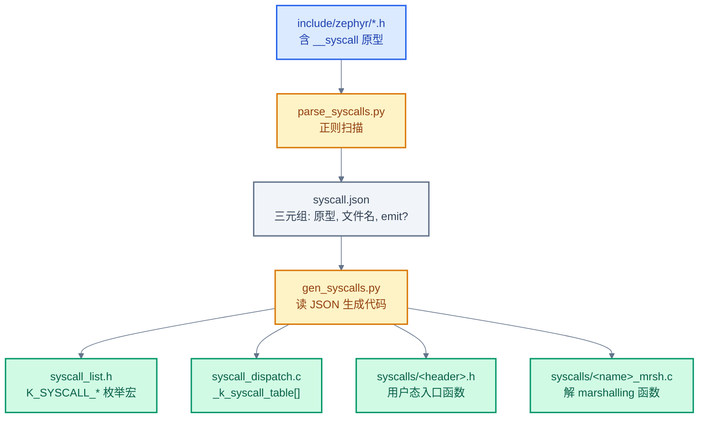
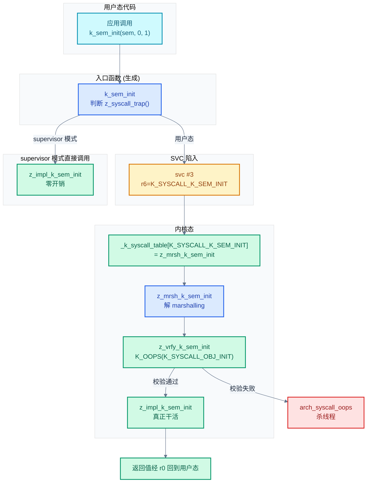
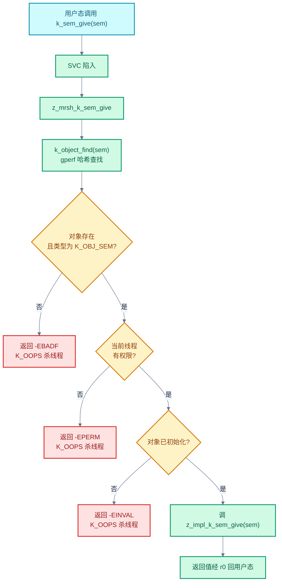

# 14. 用户态与 Syscall 机制

> 一句话概括：本文从"为什么 RTOS 也需要用户态"出发，剖析 Zephyr 通过 `__syscall` 注解 + 构建期 Python 脚本 + 派发表 + gperf 内核对象表四件套，把"用户线程调用 `k_sem_give()`"这条简单调用链拆成"入口函数 → SVC 陷入 → 解 marshalling → 验证 handler → 实现"五段流水线，最终在 ARM Cortex-M 上落到一行 `svc #3` 指令。
> **工程师视角**：读完后你应当能回答"`__syscall` 在 C 编译器眼里是什么、在 `parse_syscalls.py` 眼里又是什么"、"为什么 supervisor 模式调 syscall 是零开销"、"为什么内核对象必须 build-time 定义"、"用户态调用 `k_sem_give(sem)` 时 `sem` 指针是如何被校验的"四个问题，并能为一个新内核 API 写出 `__syscall` 声明 + `z_impl_` 实现 + `z_vrfy_` 验证三件套。

### 关键术语

| 缩写 | 全称 | 含义 |
|------|------|------|
| RTOS | Real-Time Operating System | 实时操作系统 |
| SVC | Supervisor Call | 特权调用指令，ARM 用于陷入内核的同步异常 |
| syscall | System Call | 系统调用，用户态请求内核服务的机制 |
| MPU | Memory Protection Unit | 内存保护单元，按区域提供访问权限控制 |
| MMU | Memory Management Unit | 内存管理单元，提供虚拟地址翻译与页级保护 |
| ISA | Instruction Set Architecture | 指令集架构 |
| API | Application Programming Interface | 应用程序接口 |
| Gperf | GNU Perfect Hash Function Generator | GNU 完美哈希函数生成器 |
| ELF | Executable and Linkable Format | 可执行与可链接格式，本文中指带 DWARF 调试信息的中间产物 |
| DWARF | Debugging With Attributed Record Formats | ELF 调试信息格式 |
| TOCTOU | Time Of Check to Time Of Use | 检查时序漏洞，校验与使用之间数据被篡改 |
| ISR | Interrupt Service Routine | 中断服务例程 |
| TLS | Thread Local Storage | 线程本地存储 |
| IPC | Inter-Process Communication | 进程间通信 |
| BSP | Board Support Package | 板级支持包 |

---

### 前置阅读

| 需要了解 | 参考文档 |
|----------|----------|
| 线程结构体 `struct k_thread` | [05-线程与状态迁移](./05-线程与状态迁移.md) |
| 内存域与分区概念 | [12-内存管理](./12-内存管理.md) §内存域 |
| `struct device` 与驱动 API | [13-设备驱动模型](./13-设备驱动模型.md) |
| 构建期脚本与生成文件 | [02-构建系统](./02-构建系统.md) |

---

> **上一篇** [13-设备驱动模型](./13-设备驱动模型.md) 解决了"应用如何通过统一的 `struct device` 调用上千种外设驱动"的问题。但至此为止，所有线程都跑在 supervisor 模式下——任意线程都能读写内核数据、踢飞硬件寄存器、改写另一线程的栈。一个自然的问题是：**RTOS 也需要用户态吗？嵌入式系统有这个开销值得吗？** 本篇进入**进阶 I：内核深潜**，深挖 Zephyr 的用户态隔离机制——先讲特权模式与用户模式的硬件基础，再用 `__syscall` 注解切入构建期代码生成流水线，剖析入口/handler/实现三类函数与派发表，最后落到内核对象权限表与动态对象池。

## 1. 概述：为什么 RTOS 需要用户态

### 1.1 一个具体场景：恶意第三方库

考虑一个真实场景：你的固件集成了一个开源 JSON 解析器，它从网络接收报文。如果整个系统跑在 supervisor 模式下，JSON 解析器的一个缓冲区溢出可以：

1. 改写邻居线程的栈，让它在 `k_sem_give()` 时把信号量计数改成 0xFFFF
2. 直接写 MMIO 寄存器，把 GPIO 配置成输出并拉高，烧坏外设
3. 修改内核调度器数据结构，让某个高优先级线程永远不运行
4. 读出 TLS 私钥所在的 RAM 区域，通过 UART 偷偷发送出去

传统 RTOS（FreeRTOS、RT-Thread、μC/OS）默认全部线程跑在 supervisor 模式——它们假设"所有代码都是可信的"。这在 8/16 位时代合理：RAM 几 KB、CPU 几 MHz，硬件连 MPU 都没有。但在 32 位 MCU 普遍带 MPU/MMU、固件动辄集成第三方协议栈与文件系统的今天，"全部可信"的假设不再成立。

Zephyr 的用户态机制就是回答"如何在不信任部分代码的前提下还能跑 RTOS"——把不可信代码放进用户线程，让它只能通过受控的 syscall 接口访问内核资源。

### 1.2 Zephyr 的设计选择

Zephyr 用户态的核心设计见 [overview.rst](file:///home/pbw/rtos/cs-learning-notes/zephyr-project/zephyr/doc/kernel/usermode/overview.rst) 第 6-95 行。整理为三条原则：

| 原则 | 含义 | 工程后果 |
|------|------|----------|
| **不信任用户线程** | 用户线程被视为恶意/有缺陷，内核必须防御 | syscall 入口必须做参数校验，不能假设"反正开发者不会乱传" |
| **硬件强制隔离** | 内存保护由 MPU/MMU 硬件强制，不靠软件约定 | 用户线程越界访问直接触发硬件 fault，不依赖内核检查 |
| **构建期已知对象** | 所有内核对象、栈、设备实例必须 build-time 定义 | 后加载代码（llext 扩展）不能创建新内核对象，只能从预分配池取 |

> **核心要点**：Zephyr 用户态不是"给 Linux 应用程序员用的进程隔离"，而是"给 RTOS 应用开发者提供的一道硬件强制防线"——它的目标是让一段不靠谱的代码（解析器、协议栈、第三方算法）即使出 bug 也不能把整个系统搞挂。这与传统 RTOS "all-or-nothing" 模型形成根本对比。

### 1.3 用户态能力对比

下表对照"无用户态 RTOS"、"Zephyr 用户态"、"Linux 进程"三者的能力差异：

| 对比维度 | 无用户态 RTOS（FreeRTOS/RT-Thread 默认） | Zephyr 用户态 | Linux 进程 |
|----------|------------------------------------------|---------------|------------|
| 内存隔离 | 无（任何线程可读写任何 RAM） | MPU/MMU 强制，按内存域隔离 | MMU 页表强制，按进程隔离 |
| 内核对象访问 | 直接指针解引用 | 必须经过 syscall + 权限校验 | 必须经过 syscall + fd 表 |
| 异常影响范围 | 整个系统挂掉 | 仅当前用户线程挂掉，内核与他人无恙 | 仅当前进程挂掉 |
| syscall 开销 | 无（直接函数调用） | 一次 SVC 陷入 + 参数校验 | 一次 syscall 陷入 + fd 查表 |
| 创建对象 | 任意堆栈/静态分配 | 必须 build-time 定义或走对象池 | 运行时 malloc + fd 表注册 |
| 适用场景 | 全可信固件、资源极紧 | 含第三方代码、安全认证场景 | 通用操作系统 |

> **如何读这张表**：第三列"Zephyr 用户态"的能力介于"无隔离"与"Linux 进程"之间——比无隔离多了硬件强制防线，但比 Linux 进程轻量得多（无 fd 表、无虚拟地址翻译、无 fork/exec）。这正是 RTOS 的"中等隔离"定位：在不引入 Linux 量级复杂度的前提下，给关键代码加上防护。

## 2. 特权模式与用户模式

### 2.1 硬件基础：MPU/MMU 提供什么

用户态隔离的物理基础是 MPU 或 MMU 硬件，二者对内存访问的检查粒度不同：

| 维度 | MPU | MMU |
|------|-----|-----|
| 地址翻译 | 无（物理地址直通） | 有（虚拟 → 物理） |
| 保护粒度 | 区域（Region），常 8-16 个，最小 32B 对齐 | 页（Page），常 4KB |
| 访问权限 | 读/写/执行 + 特权/用户 | 读/写/执行 + 特权/用户 |
| 典型架构 | ARM Cortex-M、RISC-V PMP | ARM Cortex-A、x86、RISC-V Sv39 |
| Zephyr 支持 | `CONFIG_ARM_MPU`、`CONFIG_RISCV_PMP` | `CONFIG_ARM_MMU`、`CONFIG_X86_MMU` |

不论 MPU 还是 MMU，硬件都提供两种 CPU 模式：**特权模式**（supervisor）能访问所有内存区域；**用户模式**（user）只能访问被显式授权的区域。模式切换的唯一硬件入口是同步异常——ARM 上是 `svc` 指令，RISC-V 上是 `ecall`，x86 上是 `syscall`。

### 2.2 Zephyr 的两类线程

Zephyr 在硬件模式之上抽象出两类线程，定义见 [overview.rst](file:///home/pbw/rtos/cs-learning-notes/zephyr-project/zephyr/doc/kernel/usermode/overview.rst) 第 30-50 行：

- **supervisor 线程**：跑在特权模式，能直接访问所有内核数据结构与外设寄存器，调用 `k_*` API 走直接函数调用，零开销
- **user 线程**：跑在用户模式，只能访问自己的栈、所属内存域的分区、程序文本；调用 `k_*` API 必须走 syscall 陷入

线程类型在创建时通过 `K_USER` 选项指定（[kernel.h](file:///home/pbw/rtos/cs-learning-notes/zephyr-project/zephyr/include/zephyr/kernel.h) 中 `k_thread_create()` 的 `options` 参数）。一个 user 线程想访问某内核对象，必须先被授予权限——详见 §6。

### 2.3 编译期标注：__ZEPHYR_SUPERVISOR__ / __ZEPHYR_USER__

Zephyr 在构建期通过宏标注每个 C 文件的运行模式，让编译器能选最优路径。判定逻辑见 [syscall.h](file:///home/pbw/rtos/cs-learning-notes/zephyr-project/zephyr/include/zephyr/syscall.h) 第 91-107 行：

```c
/* True if a syscall function must trap to the kernel, usually a
 * compile-time decision.
 */
static ALWAYS_INLINE bool z_syscall_trap(void)
{
	bool ret = false;
#ifdef CONFIG_USERSPACE
#if defined(__ZEPHYR_SUPERVISOR__)
	ret = false;
#elif defined(__ZEPHYR_USER__)
	ret = true;
#else
	ret = arch_is_user_context();
#endif
#endif
	return ret;
}
```

三种情形：

- **`__ZEPHYR_SUPERVISOR__` 已定义**：该文件所有代码跑在 supervisor 模式，`z_syscall_trap()` 恒返回 `false`，syscall 入口函数被编译成"直接调 `z_impl_*`"，零开销
- **`__ZEPHYR_USER__` 已定义**：该文件所有代码跑在用户模式，`z_syscall_trap()` 恒返回 `true`，syscall 入口函数被编译成"无条件走 SVC 陷入"
- **都没定义**：编译期无法决定，运行时调 `arch_is_user_context()` 检查当前 CPU 模式

`arch_is_user_context()` 的 ARM 实现见 [arch/arm/syscall.h](file:///home/pbw/rtos/cs-learning-notes/zephyr-project/zephyr/include/zephyr/arch/arm/syscall.h) 第 175-188 行：

```c
static inline bool arch_is_user_context(void)
{
#if defined(CONFIG_CPU_CORTEX_M)
	uint32_t value;

	/* check for handler mode */
	__asm__ volatile("mrs %0, IPSR\n\t" : "=r"(value));
	if (value) {
		return false;            /* 在中断处理中，不算用户态 */
	}
#endif

	return z_arm_thread_is_in_user_mode();   /* 读 CONTROL.nPRIV 位 */
}
```

> **核心要点**：`__ZEPHYR_SUPERVISOR__` / `__ZEPHYR_USER__` 的本质是**编译期消除运行时分支**——内核自身代码标注 supervisor，用户应用代码标注 user，混合代码（如驱动）不标注走运行时检查。这让 Zephyr 用户态在"已知模式"的代码中性能与无用户态 RTOS 持平。

## 3. __syscall 注解：编译期代码生成

### 3.1 __syscall 在 C 与构建脚本眼中的双重身份

`__syscall` 是 Zephyr 整套机制的入口。它的精妙之处在于**对 C 编译器和 Python 脚本呈现完全不同的含义**：

| 视角 | `__syscall` 的含义 |
|------|--------------------|
| C 编译器 | `static inline`（见 [toolchain/common.h](file:///home/pbw/rtos/cs-learning-notes/zephyr-project/zephyr/include/zephyr/toolchain/common.h) 第 182 行 `#define __syscall static inline`） |
| `parse_syscalls.py` | 一个标记："这个函数原型需要被生成 syscall 三件套" |

这意味着 `__syscall` 标注的函数原型在 C 编译器看来只是一个 `static inline` 声明——函数体由 `gen_syscalls.py` 生成的另一个 `static inline` 提供。而 `parse_syscalls.py` 用正则扫描所有头文件，找出 `__syscall` 开头的函数原型，把它们送进生成流水线。

正则定义见 [parse_syscalls.py](file:///home/pbw/rtos/cs-learning-notes/zephyr-project/zephyr/scripts/build/parse_syscalls.py) 第 36-45 行：

```python
syscall_regex = re.compile(
    r'''
    (?:__syscall|__syscall_always_inline)\s+   # __syscall 属性，必须首字母
    ([^(]+)                                    # 类型与函数名（稍后拆分）
    [(]                                        # 函数左括号
    ([^)]*)                                    # 参数列表（稍后拆分）
    [)]                                        # 函数右括号
    ''',
    regex_flags,
)
```

> **为什么不用 C 预处理器？** 因为预处理器会展开宏、去除条件编译块，丢失"原型在哪个头文件"的信息。`parse_syscalls.py` 故意**不预处理**，直接对原始文本做正则匹配，这样能精确知道每个 syscall 来自哪个头文件，从而生成对应的 `syscalls/<header>.h`。

### 3.2 三条限制

由于 `parse_syscalls.py` 用简陋的正则解析 C 原型，对开发者施加了三条限制（见 [syscalls.rst](file:///home/pbw/rtos/cs-learning-notes/zephyr-project/zephyr/doc/kernel/usermode/syscalls.rst) 第 60-72 行）：

1. `__syscall` 必须是原型第一个 token
2. 数组参数必须用指针表达：`int foo[]` 不行，要写 `int *foo`
3. 函数指针参数必须先 typedef 再用——简陋的正则搞不清 `int (*cb)(int)` 这种嵌套括号

### 3.3 构建期流水线

整个 syscall 代码生成在构建期分四步走，文件流向如下：



> **如何读这张图**：四个输出文件各司其职——`syscall_list.h` 给 syscall 编号（`K_SYSCALL_K_SEM_INIT = 42`），`syscall_dispatch.c` 把编号映射到 handler 函数指针，`syscalls/<header>.h` 提供用户态调用的 `static inline` 入口，`syscalls/<name>_mrsh.c` 在内核侧解包寄存器参数并调验证函数。注意 `_mrsh.c` 不是头文件而是 C 片段，必须被 `z_vrfy_*` 函数所在的 `.c` 文件 `#include`（详见 §4）。

## 4. 三类函数：入口、handler、实现

### 4.1 三类函数的关系

每个 syscall 在源码中表现为三个函数，命名约定见 [syscall.h](file:///home/pbw/rtos/cs-learning-notes/zephyr-project/zephyr/include/zephyr/syscall.h) 第 23-48 行注释。以 `k_sem_init` 为例：

| 函数 | 命名 | 位置 | 职责 |
|------|------|------|------|
| **入口（invocation）** | `k_sem_init` | 生成在 `syscalls/kernel.h` | 用户/supervisor 都调它；判断模式后选直接调实现或走 SVC |
| **实现（implementation）** | `z_impl_k_sem_init` | [kernel/sem.c](file:///home/pbw/rtos/cs-learning-notes/zephyr-project/zephyr/kernel/sem.c) 第 45 行 | 真正干活；假设参数已校验 |
| **验证（verifier）** | `z_vrfy_k_sem_init` | [kernel/sem.c](file:///home/pbw/rtos/cs-learning-notes/zephyr-project/zephyr/kernel/sem.c) 第 76 行 | 校验参数后调实现 |
| **解 marshalling** | `z_mrsh_k_sem_init` | 生成在 `syscalls/k_sem_init_mrsh.c` | 把 6 个 `uintptr_t` 寄存器参数还原为 C 类型，调 `z_vrfy_*` |

三类函数（入口/实现/验证）由开发者手写或半手写，第四类（解 marshalling）完全由 `gen_syscalls.py` 生成。下面分别看每类的源码形态。

### 4.2 入口函数：生成的 static inline

`gen_syscalls.py` 的 `wrapper_defs()` 函数（[gen_syscalls.py](file:///home/pbw/rtos/cs-learning-notes/zephyr-project/zephyr/scripts/build/gen_syscalls.py) 第 229-340 行）生成入口函数。以 `k_sem_init(struct k_sem *sem, unsigned int initial_count, unsigned int limit)` 为例，生成结果类似（简化版，实际还含 tracing 宏）：

```c
extern int z_impl_k_sem_init(struct k_sem *sem, unsigned int initial_count,
                             unsigned int limit);

__pinned_func
static inline int k_sem_init(struct k_sem *sem, unsigned int initial_count,
                             unsigned int limit)
{
#ifdef CONFIG_USERSPACE
    if (z_syscall_trap()) {
        union { uintptr_t x; struct k_sem *val; } parm0 = { .val = sem };
        union { uintptr_t x; unsigned int val; } parm1 = { .val = initial_count };
        union { uintptr_t x; unsigned int val; } parm2 = { .val = limit };
        return (int) arch_syscall_invoke3(parm0.x, parm1.x, parm2.x,
                                          K_SYSCALL_K_SEM_INIT);
    }
    compiler_barrier();
#endif
    return z_impl_k_sem_init(sem, initial_count, limit);
}
```

关键点：

1. **union 双视图**：每个参数包装在 `union { uintptr_t x; <type> val; }` 里——`x` 用于传给 `arch_syscall_invoke*`，`val` 用于读原始值。这是 C 标准允许的类型双关
2. **`compiler_barrier()`**：阻止编译器把 `z_impl_*` 调用中的内存访问重排到 `z_syscall_trap()` 检查之前——否则用户态代码可能"提前"读到内核数据
3. **`__pinned_func`**：标记此函数必须驻留在总是可执行的内存区域（不被换出），因为 syscall 入口可能在缺页中断路径上被调用
4. **`arch_syscall_invoke3`**：根据参数个数选 invoke0~invoke6，最终发出 `svc` 指令

`arch_syscall_invoke3` 的 ARM Cortex-M 实现见 [arch/arm/syscall.h](file:///home/pbw/rtos/cs-learning-notes/zephyr-project/zephyr/include/zephyr/arch/arm/syscall.h) 第 109-126 行：

```c
static inline uintptr_t arch_syscall_invoke3(uintptr_t arg1, uintptr_t arg2,
                                             uintptr_t arg3,
                                             uintptr_t call_id)
{
    register uint32_t ret __asm__("r0") = arg1;
    register uint32_t r1 __asm__("r1") = arg2;
    register uint32_t r2 __asm__("r2") = arg3;
    register uint32_t r6 __asm__("r6") = call_id;

    __asm__ volatile("svc %[svid]\n"
                     IF_ENABLED(CONFIG_ARM_BTI, ("bti\n"))
                     : "=r"(ret), "=r"(r1), "=r"(r2)
                     : [svid] "i" (_SVC_CALL_SYSTEM_CALL),
                       "r" (ret), "r" (r1), "r" (r2), "r" (r6)
                     : "r8", "memory", "r3", "ip");

    return ret;
}
```

调用约定：参数 1-4 进 `r0-r3`，参数 5-6 进 `r4-r5`，syscall ID 进 `r6`，SVC 编号 `3` 进指令立即数。`svc #3` 触发同步异常，进入 SVC 异常向量，由内核的 syscall 派发器接管。

### 4.3 实现函数：开发者手写

实现函数 `z_impl_k_sem_init` 是真正的业务代码，[kernel/sem.c](file:///home/pbw/rtos/cs-learning-notes/zephyr-project/zephyr/kernel/sem.c) 第 45-73 行：

```c
int z_impl_k_sem_init(struct k_sem *sem, unsigned int initial_count,
                      unsigned int limit)
{
    /* Limit cannot be zero and count cannot be greater than limit */
    CHECKIF(limit == 0U || initial_count > limit) {
        SYS_PORT_TRACING_OBJ_FUNC(k_sem, init, sem, -EINVAL);
        return -EINVAL;
    }

    sem->count = initial_count;
    sem->limit = limit;

    SYS_PORT_TRACING_OBJ_FUNC(k_sem, init, sem, 0);

    z_waitq_init(&sem->wait_q);
#if defined(CONFIG_POLL)
    sys_dlist_init(&sem->poll_events);
#endif /* CONFIG_POLL */
    k_object_init(sem);              /* 在内核对象表里标记为已初始化 */

    return 0;
}
```

注意它**不做用户态参数校验**——只做 `CHECKIF` 这种通用参数检查（不论 supervisor 还是 user 路径都要走）。`k_object_init(sem)` 把信号量在内核对象表里标记为 `K_OBJ_FLAG_INITIALIZED`，这是后续权限校验的关键状态位。

### 4.4 验证函数：开发者手写

验证函数 `z_vrfy_k_sem_init` 紧跟在实现后面，[kernel/sem.c](file:///home/pbw/rtos/cs-learning-notes/zephyr-project/zephyr/kernel/sem.c) 第 76-83 行：

```c
#ifdef CONFIG_USERSPACE
int z_vrfy_k_sem_init(struct k_sem *sem, unsigned int initial_count,
                      unsigned int limit)
{
    K_OOPS(K_SYSCALL_OBJ_INIT(sem, K_OBJ_SEM));
    return z_impl_k_sem_init(sem, initial_count, limit);
}
#include <zephyr/syscalls/k_sem_init_mrsh.c>
#endif /* CONFIG_USERSPACE */
```

三个关键点：

1. **`K_OOPS` 宏**：参数校验失败时调 `arch_syscall_oops(_current->syscall_frame)` 杀掉当前线程，**不返回错误码**——因为同一个 API 在 supervisor 模式下不校验，返回错误码会让 API 行为不一致
2. **`K_SYSCALL_OBJ_INIT(sem, K_OBJ_SEM)`**：校验 `sem` 指针指向的是合法的、类型为 `K_OBJ_SEM` 的内核对象，且允许"未初始化"状态（因为 init 函数本来就是要初始化它）
3. **`#include <zephyr/syscalls/k_sem_init_mrsh.c>`**：把生成的解 marshalling 函数 `z_mrsh_k_sem_init` 内联进来。`z_mrsh_*` 是 syscall 派发表的入口，它把 6 个 `uintptr_t` 还原为 C 类型后调 `z_vrfy_*`

> **核心要点**：三类函数的分工是"入口决定走哪条路、验证决定能否放行、实现真正干活"。验证函数是用户态与内核的**唯一信任边界**——任何忘记在 `z_vrfy_*` 里校验的参数都是安全漏洞，因为用户线程可以传任意值进来。

### 4.5 三类函数调用关系图



> **如何读这张图**：用户态调用 `k_sem_init` 后有两条路径——左侧 supervisor 模式直接调 `z_impl_*`，零开销；右侧用户态经 SVC 陷入、查派发表、解 marshalling、验证、实现五步。注意 `z_mrsh_*` 与 `z_vrfy_*` 是被 `#include` 内联到同一个 `.c` 文件里的，所以"调用"实际是 inline 调用，没有额外函数调用开销。

## 5. Syscall 派发表与参数校验

### 5.1 派发表的结构

syscall 派发表 `_k_syscall_table` 是一个函数指针数组，长度 `K_SYSCALL_LIMIT`，声明见 [internal/syscall_handler.h](file:///home/pbw/rtos/cs-learning-notes/zephyr-project/zephyr/include/zephyr/internal/syscall_handler.h) 第 25 行：

```c
extern const _k_syscall_handler_t _k_syscall_table[K_SYSCALL_LIMIT];
```

`_k_syscall_handler_t` 类型定义见 [syscall.h](file:///home/pbw/rtos/cs-learning-notes/zephyr-project/zephyr/include/zephyr/syscall.h) 第 86-89 行：

```c
typedef uintptr_t (*_k_syscall_handler_t)(uintptr_t arg1, uintptr_t arg2,
                                          uintptr_t arg3, uintptr_t arg4,
                                          uintptr_t arg5, uintptr_t arg6,
                                          void *ssf);
```

每个 handler 接收 6 个 `uintptr_t` 参数（来自寄存器 `r0-r3, r4-r5`）和一个 `ssf`（syscall stack frame，用于出错时打印栈帧）。返回值是 `uintptr_t`，回到用户态后被 cast 回原返回类型。

派发表本身由 `gen_syscalls.py` 生成到 `syscall_dispatch.c`，模板见 [gen_syscalls.py](file:///home/pbw/rtos/cs-learning-notes/zephyr-project/zephyr/scripts/build/gen_syscalls.py) 第 50-62 行：

```c
/* auto-generated by gen_syscalls.py, don't edit */
const _k_syscall_handler_t _k_syscall_table[K_SYSCALL_LIMIT] = {
    [K_SYSCALL_K_SEM_INIT] = z_mrsh_k_sem_init,
    [K_SYSCALL_K_SEM_GIVE] = z_mrsh_k_sem_give,
    [K_SYSCALL_K_SEM_TAKE] = z_mrsh_k_sem_take,
    /* ... 几百项 ... */
    [K_SYSCALL_BAD] = handler_bad_syscall,
};
```

每个槽位指向对应的 `z_mrsh_*` 解 marshalling 函数。`K_SYSCALL_BAD` 槽位指向 `handler_bad_syscall`，处理"用户传了无效 syscall ID"的情形。

### 5.2 两个特殊 handler

未实现/非法 syscall 的兜底 handler 在 [kernel/userspace.c](file:///home/pbw/rtos/cs-learning-notes/zephyr-project/zephyr/kernel/userspace.c) 第 1012-1042 行：

```c
static uintptr_t handler_bad_syscall(uintptr_t bad_id, uintptr_t arg2,
                                     uintptr_t arg3, uintptr_t arg4,
                                     uintptr_t arg5, uintptr_t arg6,
                                     void *ssf)
{
    ARG_UNUSED(arg2); ARG_UNUSED(arg3); ARG_UNUSED(arg4);
    ARG_UNUSED(arg5); ARG_UNUSED(arg6);

    LOG_ERR("Bad system call id %" PRIuPTR " invoked", bad_id);
    arch_syscall_oops(ssf);
    CODE_UNREACHABLE;
}

static uintptr_t handler_no_syscall(uintptr_t arg1, uintptr_t arg2,
                                    uintptr_t arg3, uintptr_t arg4,
                                    uintptr_t arg5, uintptr_t arg6, void *ssf)
{
    /* ... 同样调 arch_syscall_oops(ssf) ... */
}
```

`handler_no_syscall` 通过 `__weak` 别名机制（[gen_syscalls.py](file:///home/pbw/rtos/cs-learning-notes/zephyr-project/zephyr/scripts/build/gen_syscalls.py) 第 116-120 行 `weak_template`）成为所有未实现 syscall 的默认指向——当 Kconfig 关掉了某子系统（如 `CONFIG_SENSOR=n`），其 `z_vrfy_*` 不会被编译，对应的 `z_mrsh_*` 也消失，弱别名让派发表槽位指向 `handler_no_syscall`，用户态一调用就杀线程。

### 5.3 解 marshalling 函数：从 uintptr_t 还原 C 类型

`z_mrsh_*` 函数把 6 个 `uintptr_t` 寄存器参数还原为原始 C 类型，然后调 `z_vrfy_*`。生成逻辑见 [gen_syscalls.py](file:///home/pbw/rtos/cs-learning-notes/zephyr-project/zephyr/scripts/build/gen_syscalls.py) 第 352-423 行 `marshall_defs()`。以 `k_sem_init` 为例，生成结果（简化）：

```c
extern int z_vrfy_k_sem_init(struct k_sem *sem, unsigned int initial_count,
                             unsigned int limit);

uintptr_t z_mrsh_k_sem_init(uintptr_t arg0, uintptr_t arg1, uintptr_t arg2,
                            uintptr_t arg3, uintptr_t arg4, uintptr_t arg5,
                            void *ssf)
{
    _current->syscall_frame = ssf;          /* 给 K_OOPS 用 */

    (void) arg3; (void) arg4; (void) arg5;  /* 未用参数 */

    union { uintptr_t x; struct k_sem *val; } parm0;
    union { uintptr_t x; unsigned int val; } parm1;
    union { uintptr_t x; unsigned int val; } parm2;
    parm0.x = arg0;
    parm1.x = arg1;
    parm2.x = arg2;

    int ret = z_vrfy_k_sem_init(parm0.val, parm1.val, parm2.val);

    _current->syscall_frame = NULL;         /* 清掉，防止泄露 */
    return (uintptr_t) ret;
}
```

注意三个细节：

1. **`_current->syscall_frame = ssf`**：把栈帧指针存到当前线程的 `syscall_frame` 字段（[include/zephyr/kernel/thread.h](file:///home/pbw/rtos/cs-learning-notes/zephyr-project/zephyr/include/zephyr/kernel/thread.h) 第 341 行）。后续 `K_OOPS` 宏调 `arch_syscall_oops(_current->syscall_frame)` 时要用——这就是为什么 `k_is_in_user_syscall()` 能通过 `syscall_frame != NULL` 判断"是否正在处理 syscall"
2. **`_current->syscall_frame = NULL`** 在返回前清空——防止下次进 syscall 之前的代码误判"还在 syscall 中"
3. **64 位返回值**：32 位系统上 `uintptr_t` 只有 32 位，64 位返回值（如 `int64_t`）会被拆成指针参数，由 `z_mrsh_*` 写入用户栈上的临时变量，入口函数再读回来（见 [syscalls.rst](file:///home/pbw/rtos/cs-learning-notes/zephyr-project/zephyr/doc/kernel/usermode/syscalls.rst) 第 217-233 行）

### 5.4 超过 6 个参数怎么办

硬件只能传 6 个寄存器参数。当 syscall 参数超过 6 个时，`gen_syscalls.py` 自动把第 6 个之后的参数打包成数组，入口函数在用户栈上分配 `more[]` 数组，把多出的参数放进去，把 `&more` 作为第 6 个参数传给 `arch_syscall_invoke6`。`z_mrsh_*` 收到后必须先用 `K_SYSCALL_MEMORY_READ(more, N * sizeof(uintptr_t))` 校验这个数组可读，再解包（[gen_syscalls.py](file:///home/pbw/rtos/cs-learning-notes/zephyr-project/zephyr/scripts/build/gen_syscalls.py) 第 271-275、380-383 行）。

> **核心要点**：派发表 + 解 marshalling 这两层让 syscall 派发对开发者完全透明——你只写 `__syscall` 声明 + `z_impl_*` + `z_vrfy_*`，剩下的寄存器搬运、类型还原、参数溢出处理全部由 `gen_syscalls.py` 生成。这是 Zephyr 把"易用性"与"安全性"兼顾的关键工程妥协。

## 6. 内核对象权限表

### 6.1 内核对象元数据 struct k_object

每个内核对象（信号量、互斥锁、线程、设备实例等）在内核中都有一份元数据 `struct k_object`，定义见 [sys/internal/kobject_internal.h](file:///home/pbw/rtos/cs-learning-notes/zephyr-project/zephyr/include/zephyr/sys/internal/kobject_internal.h) 第 61-67 行：

```c
struct k_object {
    void *name;                                  /* 内核对象的实际地址 */
    uint8_t perms[CONFIG_MAX_THREAD_BYTES];      /* 权限位图，每位对应一个线程 */
    uint8_t type;                                /* enum k_objects 类型 */
    uint8_t flags;                               /* K_OBJ_FLAG_* 状态位 */
    union k_object_data data;                    /* 类型相关附加数据 */
} __packed __aligned(4);
```

字段含义：

- `name`：内核对象的实际内存地址——`k_object_find()` 用它做查找键
- `perms[]`：权限位图，第 i 位为 1 表示"线程 i 有权限访问此对象"。`CONFIG_MAX_THREAD_BYTES` 默认 1（8 个线程），可配到 8（64 个线程）
- `type`：对象类型枚举（`K_OBJ_SEM`、`K_OBJ_MUTEX`、`K_OBJ_THREAD`...），定义见 [sys/kobject.h](file:///home/pbw/rtos/cs-learning-notes/zephyr-project/zephyr/include/zephyr/sys/kobject.h) 第 30-44 行
- `flags`：状态位——`K_OBJ_FLAG_INITIALIZED`（已初始化）、`K_OBJ_FLAG_PUBLIC`（公开）、`K_OBJ_FLAG_ALLOC`（动态分配）、`K_OBJ_FLAG_DRIVER`（驱动对象）

### 6.2 gperf 哈希表：从对象地址找元数据

`k_object_find()` 接收一个对象指针，返回它的 `struct k_object *` 元数据。实现见 [kernel/userspace.c](file:///home/pbw/rtos/cs-learning-notes/zephyr-project/zephyr/kernel/userspace.c) 第 486-506 行：

```c
struct k_object *k_object_find(const void *obj)
{
    struct k_object *ret;

    ret = z_object_gperf_find(obj);     /* 静态对象走 gperf 哈希 */

    if (ret == NULL) {
        struct dyn_obj *dyn;
        dyn = dyn_object_find(obj);     /* 动态对象走链表 */
        if (dyn != NULL) {
            ret = &dyn->kobj;
        }
    }

    return ret;
}
```

`z_object_gperf_find()` 由 gperf 工具从 `gen_kobject_list.py` 生成的脚本编译而来。`gen_kobject_list.py`（[scripts/build/gen_kobject_list.py](file:///home/pbw/rtos/cs-learning-notes/zephyr-project/zephyr/scripts/build/gen_kobject_list.py)）扫描 `zephyr_prebuilt.elf` 的 DWARF 调试信息，找出所有顶层定义的内核对象（信号量、互斥锁、线程栈、`struct device` 等），生成完美哈希函数把它们映射到 `struct k_object` 元数据。生成过程见该脚本第 7-52 行的文档字符串。

> **为什么用 gperf？** 因为内核对象数量在编译时已知（几十到几百个），完美哈希能做到 O(1) 查找且无冲突。这在 syscall 热路径上很关键——每次 `K_SYSCALL_OBJ` 校验都要查一次。

### 6.3 对象类型枚举

`enum k_objects` 定义见 [sys/kobject.h](file:///home/pbw/rtos/cs-learning-notes/zephyr-project/zephyr/include/zephyr/sys/kobject.h) 第 30-44 行：

```c
enum k_objects {
    K_OBJ_ANY,
#include <zephyr/kobj-types-enum.h>     /* 由 gen_kobject_list.py 生成 */
    K_OBJ_LAST
};
```

`kobj-types-enum.h` 是生成的，列出所有内核对象类型与驱动子系统类型。脚本中的内核对象白名单见 [gen_kobject_list.py](file:///home/pbw/rtos/cs-learning-notes/zephyr-project/zephyr/scripts/build/gen_kobject_list.py) 第 92-122 行：

```python
kobjects = OrderedDict([
    ("k_mem_slab",   (None, False, True)),
    ("k_msgq",       (None, False, True)),
    ("k_mutex",      (None, False, True)),
    ("k_pipe",       (None, False, True)),
    ("k_queue",      (None, False, True)),
    ("k_sem",        (None, False, True)),
    ("k_thread",     (None, False, True)),
    ("k_timer",      (None, False, True)),
    ("z_thread_stack_element", (None, False, False)),  # 栈对象
    ("device",       (None, False, False)),            # 设备驱动实例
    ("NET_SOCKET",   (None, False, False)),
    ("sys_mutex",    (None, True,  False)),            # 用户态可访问
    ("k_futex",      (None, True,  False)),
    # ... 还有 RTIO、ztest 等条件编译对象
])
```

每个条目三元组 `(Kconfig, user_accessible, dynamic_allocatable)`：

- **Kconfig**：`None` 表示始终存在；否则是该对象依赖的 Kconfig
- **user_accessible**：对象本身能否放在用户可访问内存中（`sys_mutex`/`k_futex` 可以，因为它们设计上就活在用户内存里）
- **dynamic_allocatable**：能否通过 `k_object_alloc()` 动态创建（栈、设备、socket 不行——它们需要特殊初始化）

### 6.4 权限校验三步

`K_SYSCALL_OBJ(ptr, type)` 宏（[internal/syscall_handler.h](file:///home/pbw/rtos/cs-learning-notes/zephyr-project/zephyr/include/zephyr/internal/syscall_handler.h) 第 542-546、613-614 行）展开后调用 `k_object_validate()`，校验逻辑见 [kernel/userspace.c](file:///home/pbw/rtos/cs-learning-notes/zephyr-project/zephyr/kernel/userspace.c) 第 754-785 行：

```c
int k_object_validate(struct k_object *ko, enum k_objects otype,
                      enum _obj_init_check init)
{
    /* 步骤 1：对象存在且类型匹配 */
    if (unlikely((ko == NULL) ||
        ((otype != K_OBJ_ANY) && (ko->type != otype)))) {
        return -EBADF;
    }

    /* 步骤 2：当前线程有权限 */
    if (unlikely(thread_perms_test(ko) == 0)) {
        return -EPERM;
    }

    /* 步骤 3：初始化状态符合预期 */
    if (likely(init == _OBJ_INIT_TRUE)) {
        if (unlikely((ko->flags & K_OBJ_FLAG_INITIALIZED) == 0U)) {
            return -EINVAL;
        }
    } else if (init == _OBJ_INIT_FALSE) {
        if (unlikely((ko->flags & K_OBJ_FLAG_INITIALIZED) != 0U)) {
            return -EADDRINUSE;
        }
    }
    /* _OBJ_INIT_ANY 不检查 */

    return 0;
}
```

三步校验：

| 步骤 | 失败返回码 | 含义 |
|------|-----------|------|
| 1. 对象存在 + 类型匹配 | `-EBADF` | 指针不指向合法内核对象，或类型不是预期的（如把信号量指针传给 `k_mutex_lock`） |
| 2. 当前线程有权限 | `-EPERM` | 对象合法但当前线程没被授权 |
| 3. 初始化状态正确 | `-EINVAL` / `-EADDRINUSE` | 对象未初始化但调用需要已初始化，或对象已初始化但调用要求未初始化（如 `k_thread_create`） |

`thread_perms_test()` 检查权限的逻辑见 [kernel/userspace.c](file:///home/pbw/rtos/cs-learning-notes/zephyr-project/zephyr/kernel/userspace.c) 第 670-683 行：

```c
static int thread_perms_test(struct k_object *ko)
{
    int index;

    /* 公开对象，所有线程都能访问 */
    if ((ko->flags & K_OBJ_FLAG_PUBLIC) != 0U) {
        return 1;
    }

    /* 否则查权限位图：当前线程的 bit 是否为 1 */
    index = thread_index_get(_current);
    if (index != -1) {
        return sys_bitfield_test_bit((mem_addr_t)&ko->perms, index);
    }
    return 0;
}
```

### 6.5 校验流程图



> **如何读这张图**：每次 `K_SYSCALL_OBJ` 校验都走"对象存在 → 类型匹配 → 权限通过 → 初始化状态"四步，任一步失败都 `K_OOPS` 杀线程。这正是用户态隔离的核心——**用户线程传进来的任何内核对象指针都不能信**，必须查表确认。

### 6.6 权限授予 API

权限默认全无，必须显式授予。相关 API 见 [sys/kobject.h](file:///home/pbw/rtos/cs-learning-notes/zephyr-project/zephyr/include/zephyr/sys/kobject.h) 第 65-135 行：

| API | 作用 | 谁能调 |
|-----|------|--------|
| `k_object_access_grant(obj, thread)` | 把 `obj` 的权限授予 `thread` | supervisor 线程，或对 obj 与 thread 都有权限的 user 线程 |
| `k_object_access_revoke(obj, thread)` | 撤销 `thread` 对 `obj` 的权限 | supervisor 线程 |
| `k_object_release(obj)` | 当前线程放弃自己对 `obj` 的权限 | user 线程，常用于"用完即弃" |
| `k_object_access_all_grant(obj)` | 把 `obj` 标记为公开（所有线程可访问） | supervisor 或有权限的 user |
| `K_THREAD_ACCESS_GRANT(name, ...)` | 编译期声明：线程 `name` 启动时自动获得对一批对象的权限 | 静态线程定义时用 |

`K_THREAD_ACCESS_GRANT` 的妙处在于它生成的 `struct k_object_assignment` 进了一个特殊链接段，内核启动时遍历这个段批量授权。宏展开见 [sys/kobject.h](file:///home/pbw/rtos/cs-learning-notes/zephyr-project/zephyr/include/zephyr/sys/kobject.h) 第 65-71 行。

权限继承：`k_thread_create()` 默认让子线程继承父线程的所有对象权限（除父线程自身），实现见 [kernel/userspace.c](file:///home/pbw/rtos/cs-learning-notes/zephyr-project/zephyr/kernel/userspace.c) 第 622-633 行的 `k_thread_perms_inherit()`——遍历所有内核对象，把父线程有权限的 also 给子线程。

## 7. 用户态线程的内存隔离

### 7.1 用户线程能访问什么

官方文档 [overview.rst](file:///home/pbw/rtos/cs-learning-notes/zephyr-project/zephyr/doc/kernel/usermode/overview.rst) 第 30-95 行列出用户线程的内存访问策略：

| 内存区域 | 默认权限 | 备注 |
|----------|----------|------|
| 自己的栈 | 读/写 | MPU 系统：仅自己；MMU 系统：同内存域的其他用户线程也可 |
| 程序文本（.text） | 只读 | 全内核共享 |
| 只读数据（.rodata） | 只读 | 全内核共享 |
| 所属内存域的分区 | 按分区配置 | 见 [12-内存管理](./12-内存管理.md) §内存域 |
| 其他用户线程的栈 | 无 | 同内存域的栈在 MMU 系统可能可访问，但不可移植 |
| 内核数据 | 无 | 必须经 syscall |
| 内核对象（即使地址已知） | 无 | 用户线程解引用内核对象地址触发 fault |
| MMIO 寄存器 | 无 | 必须经驱动 syscall |
| 其他线程的内核对象 | 无 | 必须先获权限 |

### 7.2 内存域与分区

内存域（memory domain）是用户态隔离的"组级"机制：一组线程共享一组内存分区（partition），同域线程可访问分区内存，跨域不可见。这用于"多应用隔离"——例如一个固件里跑 BLE 协议栈与 Wi-Fi 协议栈，分别放不同内存域，互不干扰。

内存域 API 与底层实现详见 [12-内存管理](./12-内存管理.md) §内存域，本篇不重复。下一篇文章 [15-内存域与 MPU 保护](./15-内存域与MPU保护.md) 会深入讲解分区属性、MPU 区域分配策略与运行时切换。

### 7.3 缓冲区校验：arch_buffer_validate

用户线程传给 syscall 的指针必须校验可访问性。`K_SYSCALL_MEMORY_READ/WRITE` 宏最终调 `arch_buffer_validate()`，见 [internal/syscall_handler.h](file:///home/pbw/rtos/cs-learning-notes/zephyr-project/zephyr/include/zephyr/internal/syscall_handler.h) 第 431-438 行：

```c
#define K_SYSCALL_MEMORY(ptr, size, write) \
    K_SYSCALL_VERIFY_MSG(K_SYSCALL_MEMORY_SIZE_CHECK(ptr, size) \
                         && !Z_DETECT_POINTER_OVERFLOW(ptr, size) \
                         && (arch_buffer_validate((void *)(ptr), (size), (write)) \
                         == 0), \
                         "Memory region %p (size %zu) %s access denied", \
                         (void *)(ptr), (size_t)(size), \
                         (write) ? "write" : "read")
```

校验三步：

1. **`K_SYSCALL_MEMORY_SIZE_CHECK`**：`ptr + size >= ptr`，防整数溢出导致的回绕
2. **`Z_DETECT_POINTER_OVERFLOW`**：检测指针加 size 是否越过地址空间边界
3. **`arch_buffer_validate`**：架构相关，遍历 `[ptr, ptr+size)` 范围内的所有 MPU/MMU 区域，确认每一字节都对当前线程有要求的读/写权限

### 7.4 TOCTOU 漏洞与拷贝防御

`K_SYSCALL_MEMORY_WRITE` 只校验"调用瞬间用户线程能否写这块内存"。但用户线程可以在校验通过后、内核使用前的那一瞬间改写指针指向的内容——这就是 TOCTOU（Time Of Check to Time Of Use）漏洞。

Zephyr 的防御策略见 [syscalls.rst](file:///home/pbw/rtos/cs-learning-notes/zephyr-project/zephyr/doc/kernel/usermode/syscalls.rst) 第 369-557 行：

- **小数据（int、size_t、固定大小结构）**：在 `z_vrfy_*` 里栈上分配副本，用 `k_usermode_from_copy()` 把用户数据拷到副本，校验并使用副本
- **大数据缓冲区**：允许直接传指针，但实现函数必须**只读不写或只写不读**，且不能根据缓冲区内容做控制流判断
- **输出参数**：实现函数写栈上副本，再用 `k_usermode_to_copy()` 拷回用户内存

`k_usermode_from_copy()` / `k_usermode_to_copy()` 实现在 [kernel/userspace.c](file:///home/pbw/rtos/cs-learning-notes/zephyr-project/zephyr/kernel/userspace.c) 中，每次拷贝前都重新校验可访问性，确保拷贝过程中用户线程没有偷偷改 MPU 配置。

> **核心要点**：用户态内存隔离的"最后一公里"是 `arch_buffer_validate` + 拷贝防御。前者保证"用户传的指针当前可访问"，后者保证"校验后到使用前用户改不了数据"。两者缺一不可——只校验不拷贝留 TOCTOU 漏洞，只拷贝不校验会让内核读用户不可访问的内存触发 fault。

## 8. 动态对象与对象池

### 8.1 为什么内核对象必须 build-time 定义

官方文档 [overview.rst](file:///home/pbw/rtos/cs-learning-notes/zephyr-project/zephyr/doc/kernel/usermode/overview.rst) 第 172-188 行明确说："All kernel objects, thread stacks, and device driver instances must be defined at build time if they are to be used from user mode."

原因有三：

1. **gperf 表是构建期生成的**：`gen_kobject_list.py` 扫描 `zephyr_prebuilt.elf` 的 DWARF 信息找内核对象，运行时分配的对象不在 ELF 符号表里
2. **后加载代码无法扩展内核对象表**：llext 等运行时扩展机制无法往 gperf 哈希表里添加条目
3. **安全审计需要**：安全认证场景要求"所有内核对象在审计过的镜像里"，运行时分配等于"任意代码都能创建内核对象"是不可接受的

### 8.2 动态对象的妥协：CONFIG_DYNAMIC_OBJECTS

对于"确实需要运行时创建对象"的场景（如网络栈根据连接数动态创建 socket），Zephyr 提供 `CONFIG_DYNAMIC_OBJECTS` 选项。开启后用 `k_object_alloc()` 创建动态对象，实现见 [kernel/userspace.c](file:///home/pbw/rtos/cs-learning-notes/zephyr-project/zephyr/kernel/userspace.c) 第 395-447 行的 `z_object_alloc()`：

```c
static void *z_object_alloc(enum k_objects otype, size_t size)
{
    struct k_object *zo;
    uintptr_t tidx = 0;

    if ((otype <= K_OBJ_ANY) || (otype >= K_OBJ_LAST)) {
        LOG_ERR("bad object type %d requested", otype);
        return NULL;
    }

    switch (otype) {
    case K_OBJ_THREAD:
        if (!thread_idx_alloc(&tidx)) {
            LOG_ERR("out of free thread indexes");
            return NULL;
        }
        break;
    /* 这几种不允许动态分配 */
    case K_OBJ_FUTEX:            /* 活在用户内存 */
    case K_OBJ_SYS_MUTEX:        /* 活在用户内存 */
    case K_OBJ_NET_SOCKET:       /* 大小不确定 */
        LOG_ERR("forbidden object type '%s' requested",
                otype_to_str(otype));
        return NULL;
    default:
        /* 其余允许 */
        break;
    }

    /* 从当前线程的资源池分配 */
    zo = dynamic_object_create(otype, obj_align_get(otype), size);
    if (zo == NULL) {
        if (otype == K_OBJ_THREAD) {
            thread_idx_free(tidx);
        }
        return NULL;
    }

    if (otype == K_OBJ_THREAD) {
        zo->data.thread_id = tidx;
    }

    /* 分配者自动获得权限 */
    k_thread_perms_set(zo, _current);

    /* 标记为动态分配，权限全清后自动释放 */
    zo->flags |= K_OBJ_FLAG_ALLOC;

    return zo->name;
}
```

动态对象的元数据 `struct dyn_obj`（[kernel/userspace.c](file:///home/pbw/rtos/cs-learning-notes/zephyr-project/zephyr/kernel/userspace.c) 第 169-175 行）包装了 `struct k_object`：

```c
struct dyn_obj {
    struct k_object kobj;       /* 元数据 */
    sys_dnode_t dobj_list;      /* 全局链表节点 */
    void *data;                 /* 对象本身 */
};
```

`k_object_find()` 查 gperf 表失败后会遍历 `obj_list` 链表查找动态对象（[kernel/userspace.c](file:///home/pbw/rtos/cs-learning-notes/zephyr-project/zephyr/kernel/userspace.c) 第 486-506 行）。这个链表查找是 O(n)，比 gperf 的 O(1) 慢，但动态对象数量通常远少于静态对象。

### 8.3 自动释放：引用计数

动态对象的一个关键设计是"权限即引用计数"——`K_OBJ_FLAG_ALLOC` 标记的对象在所有权限都被清空时自动释放，见 [kernel/userspace.c](file:///home/pbw/rtos/cs-learning-notes/zephyr-project/zephyr/kernel/userspace.c) 第 563-610 行的 `unref_check()`：

```c
static void unref_check(struct k_object *ko, uintptr_t index)
{
    k_spinlock_key_t key = k_spin_lock(&obj_lock);

    sys_bitfield_clear_bit((mem_addr_t)&ko->perms, index);

#ifdef CONFIG_DYNAMIC_OBJECTS
    if ((ko->flags & K_OBJ_FLAG_ALLOC) == 0U) {
        goto out;                          /* 静态对象不释放 */
    }

    /* 检查权限位图是否全 0 */
    for (int i = 0; i < CONFIG_MAX_THREAD_BYTES; i++) {
        if (ko->perms[i] != 0U) {
            goto out;                      /* 还有引用，不释放 */
        }
    }

    /* 引用全清，按类型调清理函数 */
    switch (ko->type) {
    case K_OBJ_MSGQ:
        k_msgq_cleanup((struct k_msgq *)ko->name);
        break;
    case K_OBJ_STACK:
        k_stack_cleanup((struct k_stack *)ko->name);
        break;
    default:
        break;
    }

    /* 释放动态对象内存 */
    struct dyn_obj *dyn = CONTAINER_OF(ko, struct dyn_obj, kobj);
    sys_dlist_remove(&dyn->dobj_list);
    k_free(dyn->data);
    k_free(dyn);
out:
#endif
    k_spin_unlock(&obj_lock, key);
}
```

### 8.4 推荐做法：预分配对象池

官方文档 [kernelobjects.rst](file:///home/pbw/rtos/cs-learning-notes/zephyr-project/zephyr/doc/kernel/usermode/kernelobjects.rst) 第 75-95 行指出，对于"不确定需要多少对象"的场景，推荐**预分配对象池**而非依赖 `k_object_alloc`：

```c
/* 编译期定义 4 个信号量组成的池 */
K_SEM_DEFINE(sem_pool, 0, 1);  /* 重复 4 次，或用 K_MEM_SLAB */

/* 应用代码从池里取一个 */
struct k_sem *sem_alloc(void)
{
    for (int i = 0; i < 4; i++) {
        if (!sem_pool_used[i]) {
            sem_pool_used[i] = true;
            return &sem_pool[i];
        }
    }
    return NULL;
}
```

对象池的优势：每个对象都在 gperf 表里有元数据，`K_SYSCALL_OBJ` 校验路径走 O(1) 哈希；动态对象则走 O(n) 链表。对实时性敏感的代码，对象池是更优选择。

> **核心要点**：Zephyr 的"内核对象必须 build-time 定义"原则是安全与性能的折中——gperf 表提供 O(1) 校验、构建期审计、不可扩展三重保证。`CONFIG_DYNAMIC_OBJECTS` 是为不可预测数量场景开的口子，代价是 O(n) 链表查找与运行时分配的不确定性。能预测对象数量就别用动态。

## 9. 实战：编写一个 syscall

### 9.1 需求

假设我们要给 Zephyr 加一个新内核 API `k_mydrv_get_status(int *status)`，它读取某驱动的状态字写入 `*status`。要支持用户态调用，需要三件套：声明、实现、验证。

### 9.2 第 1 步：在头文件声明 __syscall

新建 `include/zephyr/mydrv.h`：

```c
#ifndef ZEPHYR_INCLUDE_MYDRV_H_
#define ZEPHYR_INCLUDE_MYDRV_H_

#include <zephyr/kernel.h>
#include <zephyr/device.h>

/* 用户态可调用的 API：读取当前状态 */
__syscall int k_mydrv_get_status(const struct device *dev, int *status);

/* 用户态可调用的 API：设置阈值 */
__syscall int k_mydrv_set_threshold(const struct device *dev, int threshold);

/* 头文件末尾必须 include 生成的入口函数 */
#include <zephyr/syscalls/mydrv.h>

#endif /* ZEPHYR_INCLUDE_MYDRV_H_ */
```

要点：

1. `__syscall` 必须是原型第一个 token
2. 头文件末尾必须 `#include <zephyr/syscalls/mydrv.h>`——这个文件由 `gen_syscalls.py` 生成，包含 `k_mydrv_get_status` 与 `k_mydrv_set_threshold` 的入口 `static inline` 函数体
3. 设备指针 `const struct device *dev` 会被自动当作内核对象校验

### 9.3 第 2 步：实现 z_impl_*

在 `drivers/mydrv/mydrv.c` 写实现：

```c
#include <zephyr/mydrv.h>

/* 真正干活的实现函数，假设参数已校验 */
int z_impl_k_mydrv_get_status(const struct device *dev, int *status)
{
    const struct mydrv_config *cfg = dev->config;
    *status = sys_read32(cfg->base + STATUS_REG);
    return 0;
}

int z_impl_k_mydrv_set_threshold(const struct device *dev, int threshold)
{
    const struct mydrv_config *cfg = dev->config;
    if (threshold < 0 || threshold > 255) {
        return -EINVAL;
    }
    sys_write32(threshold, cfg->base + THRESHOLD_REG);
    return 0;
}
```

实现函数不做用户态校验——那些归 `z_vrfy_*`。`CHECKIF` 这种通用参数检查（如 threshold 范围）可以放这里，因为 supervisor 与 user 路径都需要它。

### 9.4 第 3 步：写 z_vrfy_* 并 include _mrsh.c

在同一文件继续：

```c
#ifdef CONFIG_USERSPACE

int z_vrfy_k_mydrv_get_status(const struct device *dev, int *status)
{
    /* 1. 校验 dev 是合法的、已初始化的设备对象 */
    K_OOPS(K_SYSCALL_OBJ(dev, K_OBJ_DEVICE));

    /* 2. 校验 status 指针用户可写 */
    K_OOPS(K_SYSCALL_MEMORY_WRITE(status, sizeof(*status)));

    /* 3. 调实现（输出写到栈副本，再拷回用户态）*/
    int local_status;
    int ret = z_impl_k_mydrv_get_status(dev, &local_status);

    /* 4. 拷回用户内存，防 TOCTOU */
    K_OOPS(k_usermode_to_copy(status, &local_status, sizeof(*status)));

    return ret;
}
#include <zephyr/syscalls/k_mydrv_get_status_mrsh.c>

int z_vrfy_k_mydrv_set_threshold(const struct device *dev, int threshold)
{
    K_OOPS(K_SYSCALL_OBJ(dev, K_OBJ_DEVICE));
    return z_impl_k_mydrv_set_threshold(dev, threshold);
}
#include <zephyr/syscalls/k_mydrv_set_threshold_mrsh.c>

#endif /* CONFIG_USERSPACE */
```

注意第 4 步的 `k_usermode_to_copy`：如果直接调 `z_impl_k_mydrv_get_status(dev, status)` 让实现函数写用户内存，用户线程可能在 `arch_buffer_validate` 通过后改写 status 指向的值——虽然这里只是输出参数，TOCTOU 风险低，但**遵循规范**总比"以为没事"安全。`threshold` 是值参数（不是指针），用户改不了已传入的寄存器值，无需特殊处理。

### 9.5 第 4 步：在 CMakeLists.txt 注册头文件

让构建系统知道 `mydrv.h` 含需要 emit 的 syscall：

```cmake
# 在 zephyr 的 CMakeLists.txt 或驱动的 CMakeLists.txt 里
zephyr_syscall_header(${ZEPHYR_BASE}/include/zephyr/mydrv.h)
```

这一步告诉 `gen_syscalls.py`：`mydrv.h` 里的 syscall 要进入最终二进制（生成 `z_mrsh_*`、加入 `_k_syscall_table`）。

### 9.6 第 5 步：构建并验证

构建后查看生成文件确认：

```bash
# syscall ID 是否分配
grep K_SYSCALL_K_MYDRV_GET_STATUS build/zephyr/include/generated/zephyr/syscall_list.h

# 派发表是否有条目
grep k_mydrv_get_status build/zephyr/include/generated/zephyr/syscall_dispatch.c

# 入口函数是否生成
cat build/zephyr/include/generated/zephyr/syscalls/mydrv.h

# 解 marshalling 函数是否生成
cat build/zephyr/include/generated/zephyr/syscalls/k_mydrv_get_status_mrsh.c
```

> **核心要点**：写一个新 syscall 的"开发工作量"是三件套——`__syscall` 声明 + `z_impl_*` 实现 + `z_vrfy_*` 验证。剩下所有样板代码（入口函数、解 marshalling、派发表条目、syscall ID 分配）全部由构建期脚本生成。这是 Zephyr 把"安全 syscall"门槛降到最低的关键工程投入。

## 10. 与其他 RTOS 对比

### 10.1 用户态支持对比

| 对比维度 | Zephyr | FreeRTOS | RT-Thread | μC/OS-III |
|----------|--------|----------|-----------|-----------|
| 用户态支持 | 原生（`CONFIG_USERSPACE=y`） | FreeRTOS-MPU（可选） | rt-thread  Cortex-M MPU 选项 | 无原生支持 |
| 内存隔离粒度 | 内存域 + 分区 + 内核对象权限 | MPU 区域，按任务 | MPU 区域，按线程 | 无 |
| syscall 机制 | `__syscall` 注解 + 构建期生成 | 手写双版本函数 | 手写双版本函数 | N/A |
| 内核对象权限 | 位图 + gperf 哈希表 | 无（任务级 MPU 区域） | 无 | 无 |
| 动态对象 | `k_object_alloc` + 资源池 | 受限（堆分配） | 受限 | 受限 |
| 设备驱动隔离 | `struct device` 是内核对象，自动校验 | 无 | 无 | N/A |
| TOCTOU 防御 | `k_usermode_from/to_copy` API | 无 | 无 | N/A |

### 10.2 设计哲学对比

**FreeRTOS-MPU** 是 FreeRTOS 的可选用户态扩展。每个任务可标为"特权"或"用户"，用户任务的 MPU 区域在创建时配置。它不区分"内核对象权限"——只要 MPU 区域允许，用户任务可访问任何对象。简单但粗糙。

**RT-Thread** 的 MPU 支持类似 FreeRTOS-MPU，按线程配置区域，无内核对象权限位图。

**Zephyr** 的设计明显更"重"——`__syscall` 注解 + 构建期代码生成 + gperf 表 + 权限位图四件套，工程量是 FreeRTOS-MPU 的几十倍。但收益是：

- **细粒度权限**：不是"线程能访问所有信号量"而是"线程能访问这 3 个信号量"
- **设备驱动隔离**：每个 `struct device` 都是内核对象，用户线程默认一个驱动都不能用，必须显式授权
- **API 透明**：用户态与 supervisor 态调同一套 `k_*` API，编译器自动选路径

这种"重"对于消费电子、安全认证（IEC 61508、Common Criteria）场景是值得的；对于资源极紧、全可信固件的场景反而是负担。Zephyr 通过 Kconfig 让用户选——`CONFIG_USERSPACE=n` 时所有这套机制都编译掉，Zephyr 退化成"传统 RTOS"。

> **核心要点**：Zephyr 用户态不是"嵌入式 Linux"，而是"带硬件强制的 RTOS"——它保留了 RTOS 的轻量（无虚拟地址翻译、无 fork/exec、对象 build-time 定义），同时引入了 Linux 级别的安全防御（syscall 派发、权限位图、TOCTOU 防御）。这种"RTOS 身体 + Linux 灵魂"的混合定位，是它在 IoT 与安全认证场景区别于 FreeRTOS/RT-Thread 的核心标签。

## 11. 总结

### 11.1 全文要点回顾

| 机制 | 解决的问题 | 关键源码 |
|------|------------|----------|
| `__ZEPHYR_SUPERVISOR__` / `__ZEPHYR_USER__` | 编译期消除运行时分支 | [syscall.h](file:///home/pbw/rtos/cs-learning-notes/zephyr-project/zephyr/include/zephyr/syscall.h) 第 91-107 行 |
| `__syscall` 注解 + `parse_syscalls.py` | 用简陋正则扫描声明，免手写入口 | [parse_syscalls.py](file:///home/pbw/rtos/cs-learning-notes/zephyr-project/zephyr/scripts/build/parse_syscalls.py) 第 36-45 行 |
| `gen_syscalls.py` 生成入口/handler/解 marshalling | 让开发者只写 `z_impl_*` 与 `z_vrfy_*` | [gen_syscalls.py](file:///home/pbw/rtos/cs-learning-notes/zephyr-project/zephyr/scripts/build/gen_syscalls.py) |
| `_k_syscall_table[]` 派发表 | syscall ID → handler 函数指针 O(1) 查找 | [internal/syscall_handler.h](file:///home/pbw/rtos/cs-learning-notes/zephyr-project/zephyr/include/zephyr/internal/syscall_handler.h) 第 25 行 |
| gperf 内核对象表 | 对象地址 → 元数据 O(1) 查找 | [gen_kobject_list.py](file:///home/pbw/rtos/cs-learning-notes/zephyr-project/zephyr/scripts/build/gen_kobject_list.py) |
| `perms[]` 位图 | 每线程 1 bit 权限，O(1) 校验 | [sys/internal/kobject_internal.h](file:///home/pbw/rtos/cs-learning-notes/zephyr-project/zephyr/include/zephyr/sys/internal/kobject_internal.h) 第 61-67 行 |
| `K_SYSCALL_OBJ/MEMORY` 宏 | 校验对象类型/权限/初始化 + 缓冲区可访问性 | [internal/syscall_handler.h](file:///home/pbw/rtos/cs-learning-notes/zephyr-project/zephyr/include/zephyr/internal/syscall_handler.h) 第 350-546 行 |
| `k_usermode_from/to_copy` | 防 TOCTOU | [kernel/userspace.c](file:///home/pbw/rtos/cs-learning-notes/zephyr-project/zephyr/kernel/userspace.c) |
| `CONFIG_DYNAMIC_OBJECTS` | 给不可预测数量场景开口子 | [kernel/userspace.c](file:///home/pbw/rtos/cs-learning-notes/zephyr-project/zephyr/kernel/userspace.c) 第 395-447 行 |

### 11.2 一句话总结

> **核心要点**：Zephyr 用户态的本质是"四层流水线 + 三类函数"——`__syscall` 注解标记入口、`gen_syscalls.py` 生成入口与解 marshalling、`z_vrfy_*` 验证参数、`z_impl_*` 真正干活。这四层让开发者写一份代码就能同时支持 supervisor 与 user 两种调用路径，supervisor 路径零开销，user 路径多一次 SVC 陷入与参数校验。内核对象权限位图 + gperf 哈希表把"用户线程能访问哪些对象"压到 O(1) 校验，TOCTOU 防御把"校验后被篡改"风险压到接近零。

### 11.3 仍未覆盖的话题

- **MPU 区域分配策略**：当内存域分区数超过 MPU 区域数时如何取舍——见下一篇 [15-内存域与 MPU 保护](./15-内存域与MPU保护.md)
- **特权栈**：用户线程陷入内核时需要一个独立的"特权栈"——见 [mpu_stack_objects.rst](file:///home/pbw/rtos/cs-learning-notes/zephyr-project/zephyr/doc/kernel/usermode/mpu_stack_objects.rst)
- **llext 扩展与 syscall**：动态加载的扩展如何调用 syscall——见后续 llext 专题
- **架构相关细节**：x86 `syscall` 指令、RISC-V `ecall`、ARM64 `hvc` 的差异——见各架构 `arch/<arch>/syscall.h`

---

## 参考资料

- [User Mode Overview](file:///home/pbw/rtos/cs-learning-notes/zephyr-project/zephyr/doc/kernel/usermode/overview.rst) — 用户态设计目标、威胁模型、策略总览
- [System Calls](file:///home/pbw/rtos/cs-learning-notes/zephyr-project/zephyr/doc/kernel/usermode/syscalls.rst) — syscall 声明、验证、返回值策略
- [Kernel Objects](file:///home/pbw/rtos/cs-learning-notes/zephyr-project/zephyr/doc/kernel/usermode/kernelobjects.rst) — 内核对象类型、放置规则、动态对象
- [Memory Domain](file:///home/pbw/rtos/cs-learning-notes/zephyr-project/zephyr/doc/kernel/usermode/memory_domain.rst) — 内存域与分区 API
- [MPU Stack Objects](file:///home/pbw/rtos/cs-learning-notes/zephyr-project/zephyr/doc/kernel/usermode/mpu_stack_objects.rst) — 特权栈与栈对象
- [syscall.h 源码](file:///home/pbw/rtos/cs-learning-notes/zephyr-project/zephyr/include/zephyr/syscall.h) — `__syscall` 入口与 `z_syscall_trap` 判定
- [internal/syscall_handler.h 源码](file:///home/pbw/rtos/cs-learning-notes/zephyr-project/zephyr/include/zephyr/internal/syscall_handler.h) — `K_SYSCALL_*` 校验宏与 `K_OOPS`
- [sys/kobject.h 源码](file:///home/pbw/rtos/cs-learning-notes/zephyr-project/zephyr/include/zephyr/sys/kobject.h) — `enum k_objects` 与权限 API
- [sys/internal/kobject_internal.h 源码](file:///home/pbw/rtos/cs-learning-notes/zephyr-project/zephyr/include/zephyr/sys/internal/kobject_internal.h) — `struct k_object` 元数据定义
- [arch/arm/syscall.h 源码](file:///home/pbw/rtos/cs-learning-notes/zephyr-project/zephyr/include/zephyr/arch/arm/syscall.h) — ARM Cortex-M `arch_syscall_invoke*` 与 `svc` 指令
- [arch/syscall.h 源码](file:///home/pbw/rtos/cs-learning-notes/zephyr-project/zephyr/include/zephyr/arch/syscall.h) — 架构选择头
- [kernel/userspace.c 源码](file:///home/pbw/rtos/cs-learning-notes/zephyr-project/zephyr/kernel/userspace.c) — `k_object_validate`、`k_object_find`、动态对象、handler_bad_syscall
- [kernel/userspace_handler.c 源码](file:///home/pbw/rtos/cs-learning-notes/zephyr-project/zephyr/kernel/userspace_handler.c) — `z_vrfy_k_object_*` 验证函数
- [kernel/sem.c 源码](file:///home/pbw/rtos/cs-learning-notes/zephyr-project/zephyr/kernel/sem.c) — `z_impl_k_sem_init` 与 `z_vrfy_k_sem_init` 范例
- [scripts/build/parse_syscalls.py 源码](file:///home/pbw/rtos/cs-learning-notes/zephyr-project/zephyr/scripts/build/parse_syscalls.py) — `__syscall` 正则扫描
- [scripts/build/gen_syscalls.py 源码](file:///home/pbw/rtos/cs-learning-notes/zephyr-project/zephyr/scripts/build/gen_syscalls.py) — 入口/handler/派发表生成
- [scripts/build/gen_kobject_list.py 源码](file:///home/pbw/rtos/cs-learning-notes/zephyr-project/zephyr/scripts/build/gen_kobject_list.py) — DWARF 扫描 + gperf 表生成
- [include/zephyr/toolchain/common.h 源码](file:///home/pbw/rtos/cs-learning-notes/zephyr-project/zephyr/include/zephyr/toolchain/common.h) — `__syscall` 宏定义
- [include/zephyr/kernel/thread.h 源码](file:///home/pbw/rtos/cs-learning-notes/zephyr-project/zephyr/include/zephyr/kernel/thread.h) — `struct k_thread` 的 `syscall_frame` 字段

---

**下一篇** [15-内存域与 MPU 保护](./15-内存域与MPU保护.md) 将深入用户态隔离的硬件基础——MPU 区域如何分配、内存域切换如何刷新 MPU、特权栈如何在用户线程陷入时被启用，以及当分区数超过 MPU 区域数时的取舍策略。
