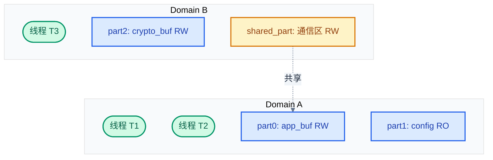
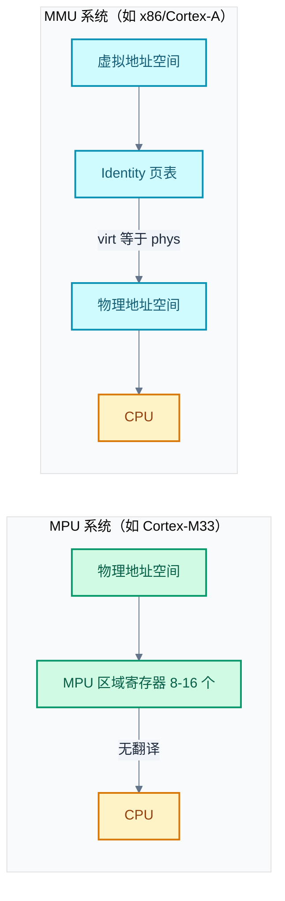
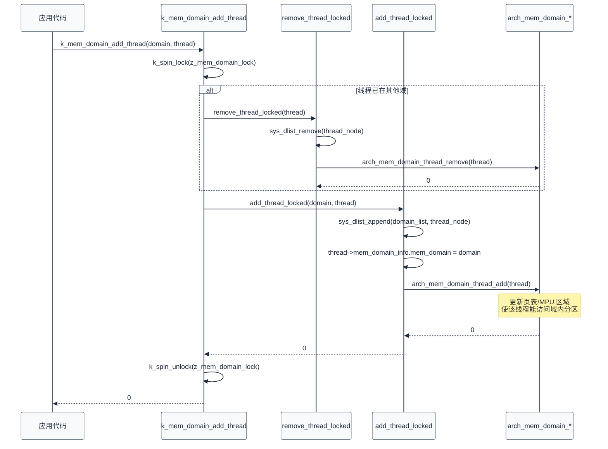

# 15. 内存域与 MPU/MMU 内存保护

> 一句话概括：本章从"用户线程能访问哪些内存"这一问题出发，剖析 Zephyr 内存域（Memory Domain）的核心数据结构 `k_mem_domain`/`k_mem_partition`、分区属性与 W^X 安全策略、MPU 与 MMU 两种保护机制的差异、`K_APPMEM_PARTITION_DEFINE` 链接器段分组机制，以及 `arch_mem_domain_*` 回调接口的完整流程。
> **工程师视角**：读完后你应当能回答"`k_mem_domain` 为什么限制分区数"、"为什么 MPU 系统线程只能访问自己的栈而 MMU 系统可以互访"、"为什么 Zephyr 把 MMU 当 MPU 用"、"`K_APPMEM_PARTITION_DEFINE` 如何把分散变量聚合成一个分区"四个问题，并能为一个应用线程设计完整的内存域配置。

### 关键术语

| 缩写 | 全称 | 含义 |
|------|------|------|
| MPU | Memory Protection Unit | 内存保护单元，按区域提供访问权限控制，无地址翻译 |
| MMU | Memory Management Unit | 内存管理单元，提供虚拟地址翻译与页级保护 |
| Domain | Memory Domain | 内存域，一组线程共享的内存访问权限集合 |
| Partition | Memory Partition | 内存分区，内存域中一段带权限属性的内存区 |
| W^X | Write XOR Execute | 写异或执行，同一内存不可同时可写与可执行 |
| RWX | Read Write Execute | 读、写、执行三种访问权限的组合 |
| XN | eXecute Never | 不可执行位，MPU/MMU 中标记区域不可执行 |
| MAIR | Memory Attribute Indirection Register | 内存属性间接寄存器，ARMv8-M 中缓存策略索引表 |
| AP | Access Permission | 访问权限字段，编码特权/用户态的读写权限 |
| BSS | Block Started by Symbol | 未初始化全局变量段，启动时清零 |
| ISR | Interrupt Service Routine | 中断服务例程 |
| API | Application Programming Interface | 应用程序接口 |

---

### 前置阅读

| 需要了解 | 参考文档 |
|----------|----------|
| 内存域概述、`k_mem_domain` 基本用法 | [12-内存管理](./12-内存管理.md) §8 |
| 用户态与系统调用、`CONFIG_USERSPACE` | [14-用户态与系统调用](./14-用户态与系统调用.md) |
| 内核数据结构与侵入式链表 | [11-核心数据结构](./11-核心数据结构.md) |

> 本文与 [12-内存管理](./12-内存管理.md) §8 的关系：第 12 章 §8 给出内存域的概述与使用流程，本章不再重复基本用法，而是深入源码实现——结构体字段、校验逻辑、W^X 策略、MPU/MMU 差异、链接器段分组与 arch 回调。

---

## 1. 概述：内存保护的必要性

> 上一篇 [14-用户态与系统调用](./14-用户态与系统调用.md) 建立了用户态/内核态隔离的基本模型：用户线程通过系统调用陷入内核，内核代表用户执行特权操作。但隔离不止于"谁能执行特权指令"——还必须回答"用户线程能访问哪些内存"。本章用内存域（Memory Domain）来回答这个问题：先讲数据结构与校验逻辑，再讲 MPU 与 MMU 两种硬件机制的差异，最后落到链接器段分组与 arch 回调接口。

### 1.1 没有内存保护会怎样

考虑一个典型 MCU 场景：一个固件里跑三个线程——网络协议栈、加密服务、用户应用。如果没有任何内存访问限制，用户应用中的一个越界写（比如缓冲区溢出）可以：

- 覆盖协议栈的重传队列指针，导致后续网络包错乱
- 改写加密服务的密钥缓冲区，泄漏或破坏密钥
- 修改内核的线程控制块 `k_thread`，让调度器跳到任意地址

后果是"一个 bug 拖垮整个系统"，而且故障现象与根因往往相距甚远——你看到的是网络异常，实际原因是应用越界写了协议栈内存。这正是 Linux 等通用 OS 引入虚拟内存与进程隔离的根本动机。

Zephyr 面向的资源受限 MCU 通常没有 MMU，只有简化的 MPU。Zephyr 的设计目标是：在仅有 MPU 的硬件上，也提供可用的内存隔离。

### 1.2 Zephyr 的两层保护

Zephyr 的内存保护分两层：

1. **启动时静态配置（Boot Time）**：内核启动后立即配置的 MPU 区域，包括代码段（只读可执行）、只读数据、设备 MMIO 区等。这些区域对所有线程生效，作为"背景"映射。
2. **运行时按域配置（Memory Domain）**：每个用户线程属于一个内存域，域内的分区在上下文切换时被写入 MPU。这是本章的主题。

> **核心要点**：Zephyr 内存域 API **只控制用户态的内存访问**。对内核态（supervisor mode）的访问没有约束——内核可以读任意内存。官方文档明确指出，用内存域 API 控制内核态访问是"未定义行为"。这意味着内存域保护的是"用户线程之间的隔离"与"用户线程对内核数据的隔离"，而非"内核自身的健壮性"。

Zephyr 官方文档（[file:///home/pbw/rtos/cs-learning-notes/zephyr-project/zephyr/doc/kernel/usermode/memory_domain.rst](file:///home/pbw/rtos/cs-learning-notes/zephyr-project/zephyr/doc/kernel/usermode/memory_domain.rst)）开篇即说明：Zephyr 的内存保护设计面向带 MPU 的 MCU；对于带分页 MMU 的架构（如 x86），MMU 被当作"分区数无限的 MPU"使用（identity page table）。

---

## 2. k_mem_domain 与 k_mem_partition 结构

> 上一节说明了内存保护要解决"谁能访问什么"的问题。那么这些权限信息存在哪里？Zephyr 用两个结构体回答：`k_mem_partition` 描述"一段内存的权限"，`k_mem_domain` 描述"一组线程共享的分区集合"。本节深入源码看它们的字段、约束与校验逻辑。

### 2.1 数据结构

两个核心结构体定义在 [file:///home/pbw/rtos/cs-learning-notes/zephyr-project/zephyr/include/zephyr/app_memory/mem_domain.h](file:///home/pbw/rtos/cs-learning-notes/zephyr-project/zephyr/include/zephyr/app_memory/mem_domain.h)（行 55-95）：

```c
/* include/zephyr/app_memory/mem_domain.h:55-62 */
struct k_mem_partition {
	uintptr_t start;              /* 分区起始地址 */
	size_t size;                  /* 分区大小（字节） */
	k_mem_partition_attr_t attr;  /* 访问属性，架构相关 */
};

struct k_mem_domain {
#ifdef CONFIG_ARCH_MEM_DOMAIN_DATA
	struct arch_mem_domain arch;  /* 架构相关数据：MMU 系统存放页表指针 */
#endif
	struct k_mem_partition partitions[CONFIG_MAX_DOMAIN_PARTITIONS];
#ifdef CONFIG_MEM_DOMAIN_HAS_THREAD_LIST
	sys_dlist_t thread_mem_domain_list;  /* 该域内线程的双向链表 */
#endif
	uint8_t num_partitions;       /* 当前活动分区数 */
};
```

逐字段说明：

- `k_mem_partition.start`：分区的起始**虚拟/线性地址**（在 identity-mapped 系统中等于物理地址）。对齐要求由架构决定，MPU 通常要求 `start` 对齐到 `size`。
- `k_mem_partition.size`：分区大小。**`size == 0` 是哨兵值**，表示该分区槽位空闲——`k_mem_domain_add_partition` 据此查找空槽（见 [mem_domain.c:228-233](file:///home/pbw/rtos/cs-learning-notes/zephyr-project/zephyr/kernel/mem_domain.c)）。
- `k_mem_partition.attr`：访问属性，类型 `k_mem_partition_attr_t` 由各架构自定义。ARMv8-M 中是包含 `rbar`（权限/XN 位）与 `mair_idx`（缓存策略索引）的小结构体。
- `k_mem_domain.arch`：仅当 `CONFIG_ARCH_MEM_DOMAIN_DATA` 打开时存在。MMU 架构用它存放该域的页表指针；纯 MPU 架构不需要此字段。
- `k_mem_domain.partitions[]`：定长数组，容量 `CONFIG_MAX_DOMAIN_PARTITIONS`（默认 16，见 [kernel/Kconfig.mem_domain:8-14](file:///home/pbw/rtos/cs-learning-notes/zephyr-project/zephyr/kernel/Kconfig.mem_domain)）。
- `k_mem_domain.thread_mem_domain_list`：仅当 `CONFIG_MEM_DOMAIN_HAS_THREAD_LIST` 打开时存在。用于枚举域内所有线程（例如 deinit 时检查是否还有线程）。

> **核心要点**：`k_mem_domain` 把"权限集合"与"成员线程"耦合在一起——一个域既包含若干分区，也关联若干线程。同域线程共享这些分区的访问权；跨域线程互相隔离。

### 2.2 max_partitions 的动态确定

`CONFIG_MAX_DOMAIN_PARTITIONS` 是**编译期上界**，但实际可用分区数 `max_partitions` 在运行时由架构层确定：

```c
/* kernel/mem_domain.c:397-423（节选） */
static uint8_t max_partitions;

static int init_mem_domain_module(void)
{
	max_partitions = arch_mem_domain_max_partitions_get();
	__ASSERT(max_partitions <= CONFIG_MAX_DOMAIN_PARTITIONS, "");
	ret = k_mem_domain_init(&k_mem_domain_default, 0, NULL);
	...
}
SYS_INIT(init_mem_domain_module, PRE_KERNEL_1, CONFIG_KERNEL_INIT_PRIORITY_DEFAULT);
```

`arch_mem_domain_max_partitions_get()` 的实现因架构而异。以 ARM Cortex-M 为例（[file:///home/pbw/rtos/cs-learning-notes/zephyr-project/zephyr/arch/arm/core/mpu/arm_core_mpu.c](file:///home/pbw/rtos/cs-learning-notes/zephyr-project/zephyr/arch/arm/core/mpu/arm_core_mpu.c) 行 352-365）：

```c
int arch_mem_domain_max_partitions_get(void)
{
	int available_regions = arm_core_mpu_get_max_available_dyn_regions();

	available_regions -= ARM_CORE_MPU_NUM_MPU_REGIONS_FOR_THREAD_STACK;

	if (IS_ENABLED(CONFIG_MPU_STACK_GUARD)) {
		available_regions -= ARM_CORE_MPU_NUM_MPU_REGIONS_FOR_MPU_STACK_GUARD;
	}

	return ARM_CORE_MPU_MAX_DOMAIN_PARTITIONS_GET(available_regions);
}
```

**为什么要在运行时算？** 因为 MPU 总区域数固定（如 ARMv8-M 的 8 或 16 个），但要预留若干区域给"必选项"：线程栈区（每个用户线程上下文切换时需要一个区域）、栈保护（`CONFIG_MPU_STACK_GUARD`）、特权栈保护等。剩下的才能给内存域分区用。

**具体数值演算**：假设某 Cortex-M33 有 8 个 MPU 区域，启用 `CONFIG_MPU_STACK_GUARD`，每个线程栈占 1 个区域、栈保护占 1 个区域：

- 总区域数 = 8
- 预留线程栈区域 = 1
- 预留栈保护区域 = 1
- 可用于内存域分区 = 8 - 1 - 1 = **6**

所以 `max_partitions = 6`，即使 `CONFIG_MAX_DOMAIN_PARTITIONS` 编译为 16，该域最多只能配 6 个分区。这就是 MPU 系统分区数紧张的根源——也是第 6 节"链接器段分组"要解决的工程问题。

### 2.3 check_add_partition 的五重校验

每次添加分区都经过 `check_add_partition`（[mem_domain.c:24-86](file:///home/pbw/rtos/cs-learning-notes/zephyr-project/zephyr/kernel/mem_domain.c)），它依次检查五类错误：

1. **NULL 检查**：分区指针非空
2. **W^X 检查**（若 `CONFIG_EXECUTE_XOR_WRITE` 启用）：分区不能同时可写与可执行
3. **零大小检查**：`size != 0`（因为 `size == 0` 是空闲槽哨兵）
4. **回绕检查**：`pend = start + size` 必须 `> pstart`，否则地址回绕
5. **重叠检查**：与域内已有分区不能重叠

重叠检查的核心是经典的区间相交判断：

```c
/* mem_domain.c:77-82 */
if (pend > dstart && dend > pstart) {
	LOG_ERR("partition ... overlaps existing ...");
	return false;
}
```

两个区间 $[p_{start}, p_{end})$ 与 $[d_{start}, d_{end})$ 相交当且仅当 `pend > dstart && dend > pstart`。这个条件比"端点比较"更直观——只要任一区间的起点落在另一区间内部，就相交。

> **核心要点**：`check_add_partition` 不检查对齐——对齐要求由架构层的 `K_MEM_PARTITION_DEFINE` 宏中的 `_ARCH_MEM_PARTITION_ALIGN_CHECK` 在编译期处理。运行时校验只负责"逻辑错误"（重叠、回绕、W^X 违反），编译期校验负责"硬件约束"（对齐、大小粒度）。

### 2.4 域与分区的关系图



> **如何读这张图**：绿色为线程，蓝色为分区，黄色为被多个域共享的分区。T1 与 T2 同属 Domain A，都能访问 part0/part1；T3 属于 Domain B，只能访问 part2 与 shared_part。同一分区（如 shared_part）可被多个域引用——这是 Zephyr 实现"域间通信区"的方式。注意图中虚线表示"分区被多个域引用"，并非从属关系。

---

## 3. 分区属性：RWX 与缓存策略

> 上一节定义了"分区是什么"，但没说"分区的权限怎么编码"。`k_mem_partition.attr` 字段承载权限，其取值由架构层决定。本节以 ARMv8-M 为例，看权限宏如何映射到 MPU 寄存器位。

### 3.1 权限宏的命名约定

Zephyr 定义了一套统一命名的权限宏，所有架构都遵循 `K_MEM_PARTITION_P_xx_U_xx` 的形式——`P` 表示特权态（Privileged）、`U` 表示用户态（Unprivileged）、`R/W/X/N` 表示读/写/执行/无权限。完整列表见各架构的 `arch.h` 或 `mpu/*.h`。

ARMv8-M 的权限宏定义在 [file:///home/pbw/rtos/cs-learning-notes/zephyr-project/zephyr/include/zephyr/arch/arm/mpu/arm_mpu_v8.h](file:///home/pbw/rtos/cs-learning-notes/zephyr-project/zephyr/include/zephyr/arch/arm/mpu/arm_mpu_v8.h)（行 382-399）：

```c
/* arm_mpu_v8.h:382-399 */
#define K_MEM_PARTITION_P_RW_U_RW \
	((k_mem_partition_attr_t){(P_RW_U_RW_Msk | NOT_EXEC), MPU_MAIR_INDEX_SRAM})
#define K_MEM_PARTITION_P_RW_U_NA \
	((k_mem_partition_attr_t){(P_RW_U_NA_Msk | NOT_EXEC), MPU_MAIR_INDEX_SRAM})
#define K_MEM_PARTITION_P_RO_U_RO \
	((k_mem_partition_attr_t){(P_RO_U_RO_Msk | NOT_EXEC), MPU_MAIR_INDEX_SRAM})
#define K_MEM_PARTITION_P_RO_U_NA \
	((k_mem_partition_attr_t){(P_RO_U_NA_Msk | NOT_EXEC), MPU_MAIR_INDEX_SRAM})

/* 允许执行的属性 */
#define K_MEM_PARTITION_P_RWX_U_RWX ((k_mem_partition_attr_t){(P_RW_U_RW_Msk), MPU_MAIR_INDEX_SRAM})
#define K_MEM_PARTITION_P_RX_U_RX   ((k_mem_partition_attr_t){(P_RO_U_RO_Msk), MPU_MAIR_INDEX_SRAM})
```

注意几乎所有"数据"权限宏都带 `NOT_EXEC`（XN 位置位），只有显式以 `X` 命名的宏（`P_RWX_U_RWX`、`P_RX_U_RX`）才允许执行。这是 W^X 思想的体现——默认不可执行，必须显式放开。

### 3.2 权限字段的两部分

ARMv8-M 的 `k_mem_partition_attr_t` 是一个结构体（[arm_mpu_v8.h:362-369](file:///home/pbw/rtos/cs-learning-notes/zephyr-project/zephyr/include/zephyr/arch/arm/mpu/arm_mpu_v8.h)）：

```c
typedef struct {
	uint16_t rbar;     /* 权限/XN/Shareable 位，对应 MPU RBAR */
	uint16_t mair_idx; /* 缓存策略索引，对应 RLAR 的 AttrIdx */
#ifdef CONFIG_ARM_MPU_PXN
	uint8_t pxn;       /* Privileged Execute Never，禁止特权模式执行 */
#endif
} k_mem_partition_attr_t;
```

权限被拆成两部分：

| 字段 | 控制内容 | 对应寄存器 |
|------|----------|------------|
| `rbar` | 读/写权限（AP 字段）、XN 位、Shareable | MPU RBAR |
| `mair_idx` | 缓存策略（Cacheable、Write-Through、Device 等） | 间接索引 MAIR 寄存器 |

**为什么缓存策略要单独索引？** ARMv8-M 的 MAIR（Memory Attribute Indirection Register）是 8 个槽位的"缓存策略表"，每个 MPU 区域只存一个 3 位索引（`mair_idx`）指向 MAIR 中的某个槽。这样多个区域可以共用同一种缓存策略而不必每个区域都重复编码——节省了 RBAR/RLAR 的位宽。常见索引如 `MPU_MAIR_INDEX_SRAM`（普通 SRAM，可缓存）、`MPU_MAIR_INDEX_FLASH`（Flash，可缓存）、`MPU_MAIR_INDEX_DEVICE`（设备区，不可缓存）。

### 3.3 缓存变体

对于 DMA 缓冲区或多核共享区，需要关闭缓存。Zephyr 提供 `_NOCACHE` 变体（[arm_mpu_v8.h:437-456](file:///home/pbw/rtos/cs-learning-notes/zephyr-project/zephyr/include/zephyr/arch/arm/mpu/arm_mpu_v8.h)）：

```c
#define K_MEM_PARTITION_P_RW_U_RW_NOCACHE \
	((k_mem_partition_attr_t){(P_RW_U_RW_Msk | NOT_EXEC | OUTER_SHAREABLE_Msk), \
				  MPU_MAIR_INDEX_SRAM_NOCACHE})
```

`_NOCACHE` 变体改用 `MPU_MAIR_INDEX_SRAM_NOCACHE` 索引并加上 `OUTER_SHAREABLE_Msk`——后者确保多核间缓存一致性，这对 DMA 与 SMP 场景至关重要。

> **核心要点**：选权限宏的实践经验——普通应用数据用 `K_MEM_PARTITION_P_RW_U_RW`；只读配置用 `K_MEM_PARTITION_P_RO_U_RO`；DMA 缓冲区用 `K_MEM_PARTITION_P_RW_U_RW_NOCACHE`；代码段用 `K_MEM_PARTITION_P_RX_U_RX`。绝大多数情况不需要 `RWX`（同时可写可执行），那会触发 W^X 违规。

---

## 4. CONFIG_EXECUTE_XOR_WRITE：W^X 安全策略

> 上一节看到几乎所有权限宏都默认带 `NOT_EXEC`。为什么不直接给数据区 RWX 权限省事？这一节回答这个问题——W^X 安全策略的本质与 Zephyr 的落地。

### 4.1 为什么需要 W^X

W^X（Write XOR Execute）要求：**同一内存区域不能同时可写与可执行**。这是针对代码注入攻击的核心防御。

攻击场景：一个有缓冲区溢出漏洞的用户线程，如果它的数据栈同时可写可执行（RWX），攻击者可以：

1. 把 shellcode（机器码）写入栈上的缓冲区
2. 通过溢出改写返回地址，跳到栈上的 shellcode
3. shellcode 以该线程权限执行，访问同域内存

如果强制 W^X，第 3 步失败——栈可写但不可执行，CPU 取指时触发异常。攻击者必须改用 ROP（Return-Oriented Programming）等更复杂技术，门槛大幅提高。

### 4.2 在 Zephyr 中的落地

W^X 由 [kernel/Kconfig:987-998](file:///home/pbw/rtos/cs-learning-notes/zephyr-project/zephyr/kernel/Kconfig) 定义：

```kconfig
config EXECUTE_XOR_WRITE
	bool "W^X for memory partitions"
	depends on USERSPACE
	depends on ARCH_HAS_EXECUTABLE_PAGE_BIT
	default y
	help
	  When enabled, will enforce that a writable page isn't executable
	  and vice versa.
```

两个关键依赖：

- `USERSPACE`：W^X 只对用户态有意义（内核态本身不受内存域约束）
- `ARCH_HAS_EXECUTABLE_PAGE_BIT`：架构必须有独立的"可执行"位。ARMv7-M 的 MPU 没有 XN 位时无法支持；ARMv8-M、x86、ARC 都有

启用后，`check_add_partition` 中加入检查（[mem_domain.c:36-46](file:///home/pbw/rtos/cs-learning-notes/zephyr-project/zephyr/kernel/mem_domain.c)）：

```c
#ifdef CONFIG_EXECUTE_XOR_WRITE
	if (K_MEM_PARTITION_IS_EXECUTABLE(part->attr) &&
	    K_MEM_PARTITION_IS_WRITABLE(part->attr)) {
		LOG_ERR("partition is writable and executable <start %lx>",
			part->start);
		return false;
	}
#endif
```

`K_MEM_PARTITION_IS_EXECUTABLE` 与 `K_MEM_PARTITION_IS_WRITABLE` 由各架构定义。ARMv8-M（[arm_mpu_v8.h:409-432](file:///home/pbw/rtos/cs-learning-notes/zephyr-project/zephyr/include/zephyr/arch/arm/mpu/arm_mpu_v8.h)）：

```c
#define K_MEM_PARTITION_IS_WRITABLE(attr) \
	({ int __w__; \
	   switch (attr.rbar & MPU_RBAR_AP_Msk) { \
	   case P_RW_U_RW_Msk: case P_RW_U_NA_Msk: __w__ = 1; break; \
	   default: __w__ = 0; } __w__; })

#define K_MEM_PARTITION_IS_EXECUTABLE(attr) (!((attr.rbar) & (NOT_EXEC)))
```

`IS_EXECUTABLE` 检查 XN 位是否清零；`IS_WRITABLE` 检查 AP 字段是否为可写组合（特权可写或特权+用户可写）。

> **核心要点**：W^X 在 MCU 上的落地依赖于硬件有独立的 XN 位。ARMv7-M 早期没有 XN，无法支持 W^X；ARMv8-M 引入 XN 后才成为可能。这也是 `ARCH_HAS_EXECUTABLE_PAGE_BIT` 作为 W^X 前置依赖的原因——软件策略最终要靠硬件位来强制。

### 4.3 与 Linux PaX/SELinux 的对比

| 对比维度 | Zephyr W^X | Linux PaX/SELinux |
|----------|-----------|-------------------|
| 粒度 | MPU 区域（KB 级） | MMU 页（4KB） |
| 强制方 | 内核 `check_add_partition` | 内核 mprotect 系统调用 |
| 可关闭 | 编译期 Kconfig | 运行时策略 |
| 适用场景 | MCU 用户态线程隔离 | 服务器进程硬化 |

> **如何读这张表**：W^X 的本质相同（不可同时 W 与 X），但粒度差异巨大——MPU 区域最小常为 32 字节对齐的几 KB，而 MMU 页固定 4KB。这意味着 Zephyr 的 W^X 粒度通常更粗，但开销更低（一个 MPU 区域 vs 一套页表项）。

---

## 5. MPU vs MMU：两种保护机制

> 上一节讲 W^X 时已隐约看到 XN 位的存在依赖架构。MPU 与 MMU 是两种不同的内存管理硬件，Zephyr 如何用同一套 API 同时支持两者？本节对比二者的本质差异，并解释"为什么 Zephyr 把 MMU 当 MPU 用"。

### 5.1 本质对比

| 对比维度 | MPU | MMU |
|----------|-----|-----|
| 地址翻译 | 无（虚拟=物理） | 有（页表翻译） |
| 保护粒度 | 区域（Region），常需对齐到大小 | 页（Page，常 4KB） |
| 区域数 | 硬件固定（8/16） | 页表项数（数千） |
| 缓存控制 | 每区域独立 | 每页独立 |
| 切换开销 | 重写若干区域寄存器 | 切换页表基址寄存器 |
| Zephyr 中 max_partitions | 有限（受区域数限制） | 实际无上限 |

### 5.2 Zephyr 的统一抽象

官方文档（[memory_domain.rst:6-13](file:///home/pbw/rtos/cs-learning-notes/zephyr-project/zephyr/doc/kernel/usermode/memory_domain.rst)）明确：

> Zephyr 的内存保护设计面向带 MPU 的 MCU。对于带分页 MMU 的架构（如 x86），MMU 被当作"分区数无限的 MPU"使用——通过 identity page table（恒等映射页表）实现。

**什么是 identity page table？** 普通的 MMU 用法是把虚拟地址翻译到不同的物理地址（例如进程 A 的 0x40000000 映射到物理 0x10000000，进程 B 的 0x40000000 映射到物理 0x20000000）。Zephyr 不需要这种翻译——它让虚拟地址等于物理地址（`virt == phys`），只利用 MMU 的"页级权限"功能。这样 MMU 退化为"每页一个权限位的 MPU"，但页表项数量远超 MPU 区域数，所以叫"分区数无限的 MPU"。



> **如何读这张图**：左侧 MPU 系统中，CPU 直接通过物理地址访问内存，MPU 在中间插入"按区域的权限检查"。右侧 MMU 系统中，CPU 发出虚拟地址，经 identity 页表翻译为相同数值的物理地址，翻译同时检查每页权限。两者对上层 API 呈现一致的"分区+权限"模型，差异仅在 `arch_mem_domain_*` 回调实现。

### 5.3 栈隔离的根本差异

MPU 与 MMU 在 Zephyr 中最显著的行为差异是**同域线程能否互访栈**。由 [kernel/Kconfig.mem_domain:57-84](file:///home/pbw/rtos/cs-learning-notes/zephyr-project/zephyr/kernel/Kconfig.mem_domain) 控制：

```kconfig
config ARCH_MEM_DOMAIN_SUPPORTS_ISOLATED_STACKS
	bool
	help
	  本架构是否支持隔离同域内不同线程的栈。

config MEM_DOMAIN_ISOLATED_STACKS
	bool
	default y
	depends on (MMU || MPU) && ARCH_MEM_DOMAIN_SUPPORTS_ISOLATED_STACKS
	help
	  启用后，同域内线程不能访问彼此的栈。
	  禁用后，同域内线程可以访问彼此的栈。
```

**为什么 MPU 默认隔离、MMU 默认不隔离？**

- **MPU 路径**：MPU 区域数有限，上下文切换时只配置"当前线程的栈"为一个区域。其他线程的栈不在任何 MPU 区域内，因此不可访问——隔离是"区域数限制的副产品"，且额外区域也加不进去。
- **MMU 路径**：MMU 页表项充足，一个域的所有线程栈都映射在页表中。同域线程共享同一套页表，自然能访问彼此的栈。要隔离需要额外的 per-thread 页表项，开销较大。

> **核心要点**：MPU 系统线程**只能访问自己的栈**（区域数不够覆盖所有同域线程栈）；MMU 系统同域线程**可以互访栈**（共享页表）。无论哪种，**跨域线程都不能访问彼此的栈**——这是内存域隔离的底线。

---

## 6. K_APPMEM_PARTITION_DEFINE：链接器段分组

> 上一节看到 MPU 区域数紧张，每个区域都很宝贵。如果应用数据分散在多个 C 文件里，怎么把它们聚合成一个分区？手动算地址不现实。本节讲 Zephyr 的解决方案——`K_APPMEM_PARTITION_DEFINE` 配合链接器段分组，把分散变量自动合并。

### 6.1 问题：手动分区的局限

第 12 章 §8.3 给出的手动分区方式：

```c
uint8_t __aligned(32) buf[256];
K_MEM_PARTITION_DEFINE(my_part, buf, sizeof(buf), K_MEM_PARTITION_P_RW_U_RW);
```

这只适合"一个数组 = 一个分区"。实际工程中，一个应用模块的数据分散在十几个 .c 文件里：

```c
/* file_a.c */
int counter_a;

/* file_b.c */
struct config cfg;

/* file_c.c */
uint8_t rx_buf[128];
```

要把这三处聚成一个分区，手动方式需要：算出总大小、自定义链接脚本、保证对齐。不可扩展。

### 6.2 自动分区的三步法

`K_APPMEM_PARTITION_DEFINE` 解决这个问题，定义在 [file:///home/pbw/rtos/cs-learning-notes/zephyr-project/zephyr/include/zephyr/app_memory/app_memdomain.h](file:///home/pbw/rtos/cs-learning-notes/zephyr-project/zephyr/include/zephyr/app_memory/app_memdomain.h)（行 127-142）：

```c
#define K_APPMEM_PARTITION_DEFINE(name) \
	extern char Z_APP_START(name)[]; \
	extern char Z_APP_SIZE(name)[]; \
	struct k_mem_partition name = { \
		.start = (uintptr_t) &Z_APP_START(name)[0], \
		.size = (size_t) &Z_APP_SIZE(name)[0], \
		.attr = K_MEM_PARTITION_P_RW_U_RW \
	}; \
	extern char Z_APP_BSS_START(name)[]; \
	extern char Z_APP_BSS_SIZE(name)[]; \
	Z_GENERIC_SECTION(.app_regions.name) \
	const struct z_app_region name##_region = { \
		.bss_start = &Z_APP_BSS_START(name)[0], \
		.bss_size = (size_t) &Z_APP_BSS_SIZE(name)[0] \
	}; \
	Z_APPMEM_PLACEHOLDER(name)
```

使用流程：

```c
#include <zephyr/app_memory/app_memdomain.h>

/* 1. 声明分区（地址与大小由构建系统填充） */
K_APPMEM_PARTITION_DEFINE(my_part);

/* 2. 把变量路由到该分区的 data 段 */
K_APP_DMEM(my_part) int counter_a = 0;

/* 3. 把变量路由到该分区的 bss 段（启动时清零） */
K_APP_BMEM(my_part) uint8_t rx_buf[128];
```

`K_APP_DMEM` 与 `K_APP_BMEM` 是段属性宏（[app_memdomain.h:51-61](file:///home/pbw/rtos/cs-learning-notes/zephyr-project/zephyr/include/zephyr/app_memory/app_memdomain.h)）：

```c
#define K_APP_DMEM_SECTION(id) data_smem_##id##_data
#define K_APP_BMEM_SECTION(id) data_smem_##id##_bss

#define K_APP_DMEM(id) Z_GENERIC_SECTION(K_APP_DMEM_SECTION(id))
#define K_APP_BMEM(id) Z_GENERIC_SECTION(K_APP_BMEM_SECTION(id))
```

变量被放入名为 `data_smem_my_part_data` 或 `data_smem_my_part_bss` 的链接器段。

### 6.3 构建流程：聚合与符号生成

链接器段分组的关键是构建脚本 `scripts/build/gen_app_partitions.py`，它在链接前扫描所有 `.app_regions.*` 段，为每个分区生成边界符号（`z_data_smem_<id>_part_start`、`z_data_smem_<id>_part_size` 等），并按架构对齐要求补齐 padding。

完整流程：

1. 编译期：`K_APP_DMEM`/`K_APP_BMEM` 把变量放入 `data_smem_<id>_*` 段
2. 链接前：`gen_app_partitions.py` 扫描段，生成边界符号
3. 链接期：链接器按对齐要求合并段，填充边界符号
4. 启动期：`K_APPMEM_PARTITION_DEFINE` 定义的 `k_mem_partition` 用这些符号初始化 `start`/`size`
5. 启动期：`z_app_region` 结构体记录 BSS 边界，供启动代码清零

> **核心要点**：`K_APPMEM_PARTITION_DEFINE` 把"分区定义"从手动算地址变为"声明 + 标注变量"。构建系统负责聚合、对齐、生成符号。代价是分区属性固定为 `K_MEM_PARTITION_P_RW_U_RW`（自动分区只支持读写，不支持只读或可执行——见 [memory_domain.rst:241-245](file:///home/pbw/rtos/cs-learning-notes/zephyr-project/zephyr/doc/kernel/usermode/memory_domain.rst)）。

### 6.4 预定义分区

Zephyr 预定义了若干分区（[memory_domain.rst:304-319](file:///home/pbw/rtos/cs-learning-notes/zephyr-project/zephyr/doc/kernel/usermode/memory_domain.rst)）：

| 分区名 | 用途 |
|--------|------|
| `z_malloc_partition` | libc `malloc()` 的全局堆池 |
| `z_libc_partition` | C 库与运行时全局变量，加入默认域 |
| `k_mbedtls_partition` | mbedTLS 库全局变量 |

`z_libc_partition` 在 `init_mem_domain_module` 中被加入 `k_mem_domain_default`（[mem_domain.c:414-418](file:///home/pbw/rtos/cs-learning-notes/zephyr-project/zephyr/kernel/mem_domain.c)），确保所有未指定域的线程都能用 C 库。

---

## 7. 线程加入内存域

> 上一节讲了"分区怎么来"。分区就位后，还要把线程加入域才能生效。本节讲加入流程、继承机制与默认域的角色。

### 7.1 加入流程

`k_mem_domain_add_thread`（[mem_domain.c:379-395](file:///home/pbw/rtos/cs-learning-notes/zephyr-project/zephyr/kernel/mem_domain.c)）的逻辑：

```c
int k_mem_domain_add_thread(struct k_mem_domain *domain, k_tid_t thread)
{
	k_spinlock_key_t key = k_spin_lock(&z_mem_domain_lock);
	if (thread->mem_domain_info.mem_domain != domain) {
		ret = remove_thread_locked(thread);       /* 先从原域移除 */
		if (ret == 0) {
			ret = add_thread_locked(domain, thread); /* 再加入新域 */
		}
	}
	k_spin_unlock(&z_mem_domain_lock, key);
	return ret;
}
```

注意第 12 章 §8.3 提到"没有 `k_mem_domain_remove_thread`"——线程加入新域时**自动从原域移除**。`remove_thread_locked` 与 `add_thread_locked` 的内部工作（[mem_domain.c:308-349](file:///home/pbw/rtos/cs-learning-notes/zephyr-project/zephyr/kernel/mem_domain.c)）：

```c
static int add_thread_locked(struct k_mem_domain *domain, k_tid_t thread)
{
#ifdef CONFIG_MEM_DOMAIN_HAS_THREAD_LIST
	sys_dlist_append(&domain->thread_mem_domain_list,
			 &thread->mem_domain_info.thread_mem_domain_node);
#endif
	thread->mem_domain_info.mem_domain = domain;  /* 更新线程的域指针 */

#ifdef CONFIG_ARCH_MEM_DOMAIN_SYNCHRONOUS_API
	ret = arch_mem_domain_thread_add(thread);     /* 通知架构层 */
#endif
	return ret;
}
```

线程的 `mem_domain_info.mem_domain` 字段指向当前所属域。这是"一个线程只能属于一个域"的体现——指针只有一份。

### 7.2 继承机制

新线程创建时**继承父线程的内存域**。这在 `z_mem_domain_init_thread`（[mem_domain.c:352-363](file:///home/pbw/rtos/cs-learning-notes/zephyr-project/zephyr/kernel/mem_domain.c)）实现：

```c
void z_mem_domain_init_thread(struct k_thread *thread)
{
	k_spinlock_key_t key = k_spin_lock(&z_mem_domain_lock);
	/* 新线程从 _current（父线程）继承域配置 */
	ret = add_thread_locked(_current->mem_domain_info.mem_domain, thread);
	...
}
```

`_current` 是当前正在运行的线程（即创建子线程的父线程）。子线程直接加入父线程所在的域，无需应用代码干预。

> **核心要点**：内存域是"线程创建时自动继承"的。这意味着：如果应用线程 A（属于域 D1）创建子线程 B，B 自动属于 D1。要让 B 属于别的域，必须在 B 创建后显式调用 `k_mem_domain_add_thread`。

### 7.3 默认域

所有线程都必须属于某个域。`k_mem_domain_default` 是默认域，在 `init_mem_domain_module` 中初始化（[mem_domain.c:411](file:///home/pbw/rtos/cs-learning-notes/zephyr-project/zephyr/kernel/mem_domain.c)）：

```c
ret = k_mem_domain_init(&k_mem_domain_default, 0, NULL);
```

主线程（main thread）启动时属于默认域。默认域包含 `z_libc_partition`（若存在），确保任何线程都能使用 C 库全局变量。默认域**不可销毁**——`k_mem_domain_deinit` 显式检查（[mem_domain.c:173-177](file:///home/pbw/rtos/cs-learning-notes/zephyr-project/zephyr/kernel/mem_domain.c)）：

```c
if (domain == &k_mem_domain_default) {
	/* Default memory domain must be there forever. */
	ret = -EINVAL;
}
```

---

## 8. arch_mem_domain_* 回调接口

> 上一节看到 `add_thread_locked` 调用了 `arch_mem_domain_thread_add`。这是架构相关回调之一。本节系统梳理这套回调接口，看 Zephyr 如何把"通用内存域逻辑"与"架构相关硬件操作"解耦。

### 8.1 回调列表

架构层必须或可选实现的回调定义在 [file:///home/pbw/rtos/cs-learning-notes/zephyr-project/zephyr/include/zephyr/arch/arch_interface.h](file:///home/pbw/rtos/cs-learning-notes/zephyr-project/zephyr/include/zephyr/arch/arch_interface.h)（行 697-812）：

| 回调 | 触发时机 | 必需条件 | 作用 |
|------|----------|----------|------|
| `arch_mem_domain_max_partitions_get` | 启动时 | `USERSPACE` | 返回该架构最大分区数 |
| `arch_mem_domain_init` | 域创建时 | `ARCH_MEM_DOMAIN_DATA` | 初始化架构数据（如分配页表） |
| `arch_mem_domain_deinit` | 域销毁时 | `ARCH_MEM_DOMAIN_SUPPORTS_DEINIT` | 释放架构数据 |
| `arch_mem_domain_thread_add` | 线程加入域 | `ARCH_MEM_DOMAIN_SYNCHRONOUS_API` | 配置该线程的硬件状态 |
| `arch_mem_domain_thread_remove` | 线程离开域 | `ARCH_MEM_DOMAIN_SYNCHRONOUS_API` | 清理该线程的硬件状态 |
| `arch_mem_domain_partition_add` | 分区加入域 | `ARCH_MEM_DOMAIN_SYNCHRONOUS_API` | 在硬件中添加该区域/页表项 |
| `arch_mem_domain_partition_remove` | 分区移除 | `ARCH_MEM_DOMAIN_SYNCHRONOUS_API` | 在硬件中移除该区域/页表项 |

### 8.2 同步 API 的取舍

`CONFIG_ARCH_MEM_DOMAIN_SYNCHRONOUS_API` 是一个隐藏 Kconfig（[kernel/Kconfig.mem_domain:29-55](file:///home/pbw/rtos/cs-learning-notes/zephyr-project/zephyr/kernel/Kconfig.mem_domain)）。它的含义是：**架构层要求在域/分区/线程变更时立即同步更新硬件**。

Kconfig 帮助文本给出了关键判断标准：

> 在单处理器系统上，除非内存访问策略由独立软件结构（如页表）管理，否则这些 API 不必实现——因为硬件会在上下文切换时被重新编程。

**为什么有的架构不需要同步 API？**

- **MPU 架构（如 ARM Cortex-M）**：上下文切换时本来就重写所有动态 MPU 区域寄存器，所以"添加分区"不需要立即写硬件——下次切换到该线程时自然会写。这类架构不选 `SYNCHRONOUS_API`，所有 arch 回调为空。
- **MMU 架构（如 x86）**：页表是持久的，添加分区必须立即更新页表项，否则同域其他线程访问不到。这类架构选 `SYNCHRONOUS_API`，回调真正干活。

### 8.3 线程加入域时的回调流程

下图展示 `k_mem_domain_add_thread` 在 `SYNCHRONOUS_API` 启用时（如 MMU 架构）的完整调用链：



> **如何读这张图**：核心是 `z_mem_domain_lock` 自旋锁保护整个"移除-加入"原子操作。`arch_mem_domain_thread_remove` 与 `arch_mem_domain_thread_add` 在锁内调用——这意味着架构层回调不能睡眠（不能分配内存）。这也是 `arch_mem_domain_init` 可能返回 `-ENOMEM` 的原因：页表分配必须在 `k_mem_domain_init` 阶段完成，不能等到 `thread_add`。

### 8.4 ARM Cortex-M 的"不作为"策略

ARM Cortex-M MPU 架构不选 `CONFIG_ARCH_MEM_DOMAIN_SYNCHRONOUS_API`，所以 `arch_mem_domain_thread_add` 等回调不存在。域变更只更新 `k_mem_domain` 结构体中的 `partitions[]` 数组与 `thread_mem_domain_list`。真正的硬件配置发生在上下文切换时——调度器调用 `arm_core_mpu_configure_thread`，把当前线程所属域的所有分区写入 MPU 区域寄存器。

这种"延迟到切换时配置"的策略是 MPU 区域数紧张下的合理选择：反正切换时必须重写所有动态区域，提前写也是浪费。

> **核心要点**：`SYNCHRONOUS_API` 是否启用，决定了"添加分区"是立即生效（MMU）还是延迟到下次切换（MPU）。这是同一套 API 适配两种硬件的关键设计——上层逻辑不变，下层时机不同。

---

## 9. 实战：为应用线程配置内存域

> 前八节讲了机制。本节把它们串起来，给出一个完整可运行的示例：两个应用线程分属不同域，共享一个通信分区。

### 9.1 场景

- 线程 `app_a`：需要访问 `crypto_buf`（私有）与 `shared_buf`（与 app_b 共享）
- 线程 `app_b`：需要访问 `log_buf`（私有）与 `shared_buf`
- 两者互访对方的私有缓冲区应触发内存访问异常

### 9.2 完整代码

```c
#include <zephyr/kernel.h>
#include <zephyr/app_memory/app_memdomain.h>
#include <zephyr/logging/log.h>
LOG_MODULE_REGISTER(demo);

/* 1. 定义三个缓冲区，对齐到 32 字节（ARMv8-M MPU 区域对齐要求） */
uint8_t __aligned(32) crypto_buf[256];
uint8_t __aligned(32) log_buf[256];
uint8_t __aligned(32) shared_buf[128];

/* 2. 定义三个分区 */
K_MEM_PARTITION_DEFINE(crypto_part, crypto_buf, sizeof(crypto_buf),
                       K_MEM_PARTITION_P_RW_U_RW);
K_MEM_PARTITION_DEFINE(log_part, log_buf, sizeof(log_buf),
                       K_MEM_PARTITION_P_RW_U_RW);
K_MEM_PARTITION_DEFINE(shared_part, shared_buf, sizeof(shared_buf),
                       K_MEM_PARTITION_P_RW_U_RW);

/* 3. 定义两个域 */
struct k_mem_domain domain_a;
struct k_mem_domain domain_b;

/* 4. 线程栈与线程对象 */
K_THREAD_STACK_DEFINE(stack_a, 1024);
K_THREAD_STACK_DEFINE(stack_b, 1024);
struct k_thread thread_a;
struct k_thread thread_b;

void app_a_entry(void *a, void *b, void *c)
{
	/* 可访问 crypto_buf 与 shared_buf，访问 log_buf 触发异常 */
	memset(crypto_buf, 0xAA, sizeof(crypto_buf));
	shared_buf[0] = 0x55;
}

void app_b_entry(void *a, void *b, void *c)
{
	memset(log_buf, 0xBB, sizeof(log_buf));
	shared_buf[1] = 0x66;
}

void main(void)
{
	/* 5. 初始化两个域，各自加入相应分区 */
	struct k_mem_partition *parts_a[] = { &crypto_part, &shared_part };
	struct k_mem_partition *parts_b[] = { &log_part, &shared_part };

	k_mem_domain_init(&domain_a, ARRAY_SIZE(parts_a), parts_a);
	k_mem_domain_init(&domain_b, ARRAY_SIZE(parts_b), parts_b);

	/* 6. 创建线程（默认继承 main 的默认域） */
	k_thread_create(&thread_a, stack_a, K_THREAD_STACK_SIZEOF(stack_a),
			app_a_entry, NULL, NULL, NULL,
			0, 0, K_NO_WAIT);
	k_thread_create(&thread_b, stack_b, K_THREAD_STACK_SIZEOF(stack_b),
			app_b_entry, NULL, NULL, NULL,
			0, 0, K_NO_WAIT);

	/* 7. 把线程加入各自域 */
	k_mem_domain_add_thread(&domain_a, &thread_a);
	k_mem_domain_add_thread(&domain_b, &thread_b);
}
```

### 9.3 调试要点

配置内存域后常见的故障模式：

1. **`-EINVAL` 来自 `k_mem_domain_init`**：通常是 `check_add_partition` 失败。检查：分区对齐（`__aligned(32)`）、W^X 违规（同时 RWX）、分区重叠。
2. **`-ENOSPC` 来自 `k_mem_domain_add_partition`**：分区数超过 `max_partitions`。`printk` 输出 `arch_mem_domain_max_partitions_get()` 的返回值确认实际可用数。
3. **运行时 Memory Management Fault**：用户线程访问了域外内存。检查 `CFSR` 寄存器（ARM Cortex-M）确定是读/写/取指违反。
4. **链接错误 `undefined reference to z_data_smem_*`**：使用 `K_APPMEM_PARTITION_DEFINE` 但分区没有任何 `K_APP_DMEM`/`K_APP_BMEM` 变量。宏内的 `Z_APPMEM_PLACEHOLDER` 就是为这种情况兜底——确保段非空。

> **核心要点**：内存域配置出错时，故障现象（异常、链接错误）与根因（对齐、W^X、区域数）之间需要回溯。先用 `check_add_partition` 的 `LOG_ERR` 输出定位是哪一类校验失败，再对照本节排查。

---

## 10. 与 Linux mmap/mprotect 对比

> 前九节讲清了 Zephyr 的内存域机制。作为对照，本节简要看 Linux 的等价机制，帮助有 Linux 经验的读者建立映射。

| 对比维度 | Zephyr 内存域 | Linux 进程地址空间 |
|----------|--------------|-------------------|
| 隔离单位 | 内存域（一组线程共享） | 进程（独立地址空间） |
| 创建 API | `k_mem_domain_init` | `fork()` + `execve()` |
| 添加区域 | `k_mem_domain_add_partition` | `mmap()` |
| 改权限 | 重新 `add_partition` | `mprotect()` |
| 成员变更 | `k_mem_domain_add_thread` | 不存在（进程=地址空间绑定） |
| 翻译机制 | identity（MPU 或 MMU） | 完整虚拟内存（MMU） |
| 共享内存 | 同分区加入多个域 | `mmap` 共享映射 |
| 切换开销 | 重写 MPU 区域 / 切页表 | 切换 CR3（页表基址） |

> **如何读这张表**：核心差异在"隔离单位"——Linux 把"地址空间"与"进程"绑定，每个进程一套独立页表；Zephyr 把"内存域"与"线程"解耦，多个线程可共享一个域，一个线程可在域间迁移。Zephyr 的设计更轻量（一个域就是几个分区+链表），适合 MCU 上多线程协作；Linux 的设计更彻底（每个进程独立地址空间），适合隔离不信任的程序。

**Linux `mprotect` 示例**：

```c
/* Linux: 把一段内存改为只读 */
mprotect(buf, size, PROT_READ);

/* Zephyr: 等价操作是重新定义分区属性并替换 */
K_MEM_PARTITION_DEFINE(ro_part, buf, size, K_MEM_PARTITION_P_RW_U_RO);
k_mem_domain_remove_partition(&domain, &old_rw_part);
k_mem_domain_add_partition(&domain, &ro_part);
```

Linux 的 `mprotect` 是单次系统调用，Zephyr 需要"移除+添加"两步——因为 Zephyr 分区是值语义（按 start+size 匹配），属性变更等价于替换。

---

## 11. 总结

> 上一节把 Zephyr 内存域与 Linux 做了对照。本章最后回顾全篇核心结论，并指向下一章。

### 11.1 核心结论

1. **内存域 = 分区集合 + 线程集合**。`k_mem_domain` 用定长数组存分区，用双向链表存线程。一个线程只能属于一个域，一个分区可被多个域引用。
2. **分区数受硬件限制**。`max_partitions` 在运行时由 `arch_mem_domain_max_partitions_get` 确定，MPU 系统通常只有 6-8 个，MMU 系统实际无上限。
3. **W^X 是 MCU 上的可选项**。依赖 `ARCH_HAS_EXECUTABLE_PAGE_BIT`，启用后 `check_add_partition` 拒绝同时可写可执行的分区。
4. **MPU 与 MMU 的关键差异在栈隔离**。MPU 区域数有限，同域线程只能访问自己的栈；MMU 页表充足，同域线程可互访栈。Zephyr 把 MMU 当"分区数无限的 MPU"用（identity page table）。
5. **`K_APPMEM_PARTITION_DEFINE` 用链接器段分组聚合分散变量**。构建系统扫描段、生成边界符号、对齐填充，把跨文件变量合并成一个分区。
6. **`arch_mem_domain_*` 回调解耦通用逻辑与硬件操作**。`SYNCHRONOUS_API` 启用与否决定了变更立即生效（MMU）还是延迟到上下文切换（MPU）。

### 11.2 设计哲学

Zephyr 内存域的设计体现了 RTOS 的典型取舍：在硬件资源有限（MPU 区域少、无虚拟内存）的前提下，提供"够用"的隔离。它不像 Linux 那样追求进程间完全隔离，而是面向"多个可信线程协作但有 bug 隔离需求"的场景。这与 Zephyr 面向 MCU 的定位一致——MCU 上通常跑一个固件、几个协作线程，而非多个不信任的程序。

> **核心要点**：理解 Zephyr 内存域的关键不是记住 API，而是理解"硬件约束如何塑造 API 设计"——MPU 区域数少 → 分区数有限 + 自动段分组；XN 位有无可选 → W^X 可配置；上下文切换重写 MPU → 同步 API 可选。每一项设计都能回溯到硬件特性。

---

## 参考资料

- [Memory Protection Design](file:///home/pbw/rtos/cs-learning-notes/zephyr-project/zephyr/doc/kernel/usermode/memory_domain.rst) — Zephyr 官方内存保护设计文档，本章主线参考
- [kernel/mem_domain.c](file:///home/pbw/rtos/cs-learning-notes/zephyr-project/zephyr/kernel/mem_domain.c) — 内存域核心实现，含 `check_add_partition`/`k_mem_domain_init`/`add_thread_locked`
- [include/zephyr/app_memory/mem_domain.h](file:///home/pbw/rtos/cs-learning-notes/zephyr-project/zephyr/include/zephyr/app_memory/mem_domain.h) — `k_mem_domain`/`k_mem_partition` 结构体与 `K_MEM_PARTITION_DEFINE` 宏
- [include/zephyr/app_memory/app_memdomain.h](file:///home/pbw/rtos/cs-learning-notes/zephyr-project/zephyr/include/zephyr/app_memory/app_memdomain.h) — `K_APPMEM_PARTITION_DEFINE`/`K_APP_DMEM`/`K_APP_BMEM` 宏
- [kernel/Kconfig.mem_domain](file:///home/pbw/rtos/cs-learning-notes/zephyr-project/zephyr/kernel/Kconfig.mem_domain) — 内存域相关 Kconfig（`MAX_DOMAIN_PARTITIONS`、`ARCH_MEM_DOMAIN_SYNCHRONOUS_API` 等）
- [kernel/Kconfig](file:///home/pbw/rtos/cs-learning-notes/zephyr-project/zephyr/kernel/Kconfig) — `CONFIG_EXECUTE_XOR_WRITE` 定义（行 987-998）
- [include/zephyr/arch/arch_interface.h](file:///home/pbw/rtos/cs-learning-notes/zephyr-project/zephyr/include/zephyr/arch/arch_interface.h) — `arch_mem_domain_*` 回调接口声明（行 697-812）
- [include/zephyr/arch/arm/mpu/arm_mpu_v8.h](file:///home/pbw/rtos/cs-learning-notes/zephyr-project/zephyr/include/zephyr/arch/arm/mpu/arm_mpu_v8.h) — ARMv8-M 权限宏与 `k_mem_partition_attr_t` 定义
- [arch/arm/core/mpu/arm_core_mpu.c](file:///home/pbw/rtos/cs-learning-notes/zephyr-project/zephyr/arch/arm/core/mpu/arm_core_mpu.c) — ARM Cortex-M 的 `arch_mem_domain_max_partitions_get` 实现
- [12-内存管理](./12-内存管理.md) §8 — 内存域概述与基本用法（本章前置）

---

## 下一篇

[16-SMP多核支持](./16-SMP多核支持.md)
