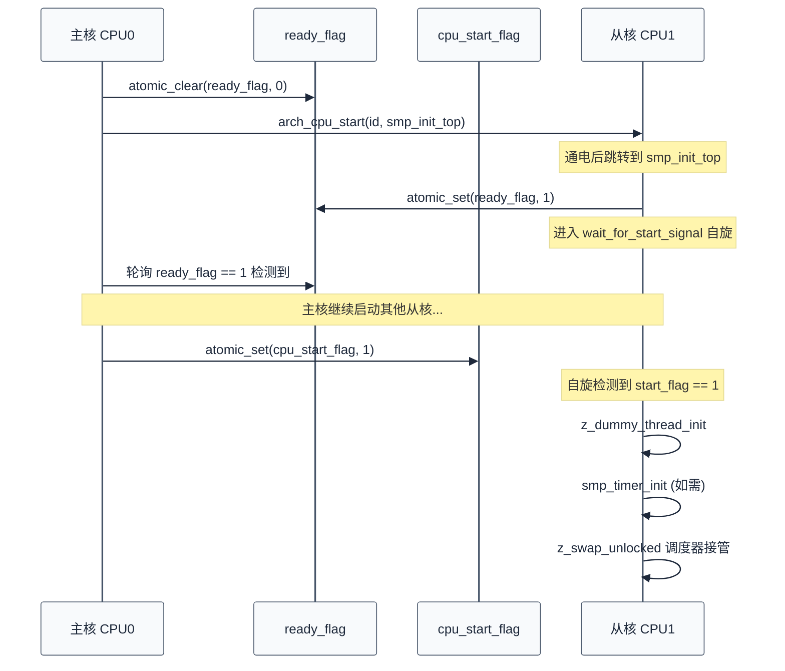
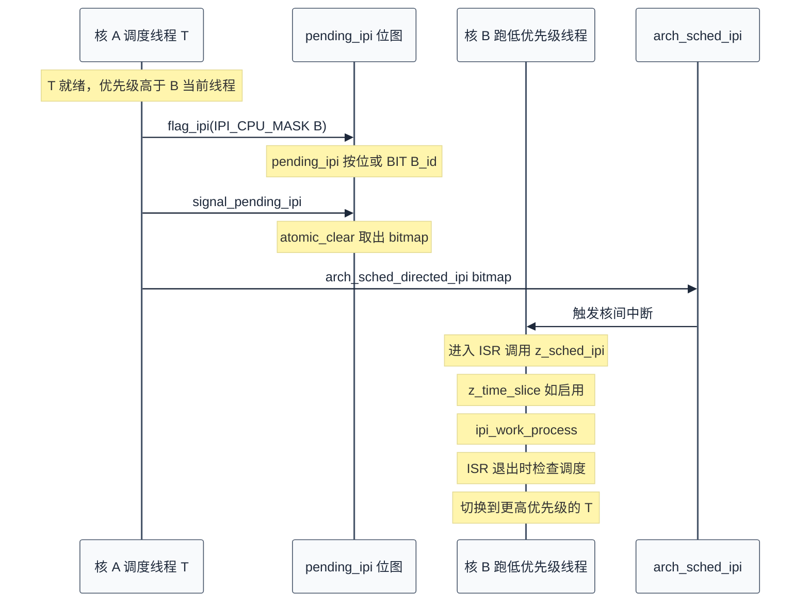

# 16. SMP 多核支持与全局锁仿真

> 一句话概括：本文从"两个核同时读写同一全局变量"的竞态出发，剖析 Zephyr SMP 的启动握手、`irq_lock()` 的 legacy emulation、`z_smp_global_lock()` 全局锁仿真、`k_spin_lock` 的正确互斥、IPI 核间中断，以及单核编译期消除机制。
> **工程师视角**：读完后你应当能回答"`irq_lock()` 在 SMP 下为什么不再是关中断"、"为什么 `z_smp_global_lock()` 要用 `atomic_cas` 自旋"、"单核下 `k_spin_lock` 与 `irq_lock` 为什么生成等价代码"这三个问题。

### 关键术语

| 缩写 | 全称 | 含义 |
|------|------|------|
| SMP | Symmetric Multi-Processing | 对称多处理，多核平等运行同一内核镜像 |
| IPI | Inter-Processor Interrupt | 处理器间中断，用于多核间通知 |
| CPU | Central Processing Unit | 中央处理器 |
| RTOS | Real-Time Operating System | 实时操作系统 |
| ISR | Interrupt Service Routine | 中断服务例程 |
| CAS | Compare-And-Swap | 比较并交换，原子操作 |
| API | Application Programming Interface | 应用编程接口 |
| FIFO | First In First Out | 先进先出 |
| AMP | Asymmetric Multi-Processing | 非对称多处理 |
| SoC | System on Chip | 片上系统 |
| MCU | Microcontroller Unit | 微控制器 |
| TLB | Translation Lookaside Buffer | 页表缓存 |

---

## 1. 概述：RTOS 中的多核

> 第 15 章讨论了电源管理与 CPU 热插拔的上层接口。一个自然的问题是：当多个 CPU 核心真正同时运行 Zephyr 内核时，原本"关中断即互斥"的单核假设还成立吗？本章用 SMP 子系统的源码来回答这个问题——先讲多核启动握手，再剖析 `irq_lock()` 在 SMP 下的 legacy emulation，最后落到 `k_spin_lock` 与 IPI 的正确性证明。

### 1.1 SMP 的本质

SMP 的核心特征是"对称"——所有 CPU 核心运行同一份内核镜像，共享同一份物理内存，享有平等的调度权。这与非对称多处理（AMP）形成对比：AMP 中不同核跑不同 OS（或一个跑 OS、一个跑裸机），核心间通过消息邮箱通信。

Zephyr 的 SMP 实现位于 [`kernel/smp.c`](file:///home/pbw/rtos/cs-learning-notes/zephyr-project/zephyr/kernel/smp.c) 与 [`include/zephyr/kernel/smp.h`](file:///home/pbw/rtos/cs-learning-notes/zephyr-project/zephyr/include/zephyr/kernel/smp.h)，由 [`kernel/Kconfig.smp`](file:///home/pbw/rtos/cs-learning-notes/zephyr-project/zephyr/kernel/Kconfig.smp) 控制。关键配置：

| Kconfig | 含义 | 默认 |
|---------|------|------|
| `CONFIG_SMP` | 启用 SMP 支持 | 平台依赖 |
| `CONFIG_MP_MAX_NUM_CPUS` | 最大 CPU 数（1-12） | 1 |
| `CONFIG_USE_SWITCH` | 使用 `_arch_switch` 上下文切换原语 | SMP 必选 |
| `CONFIG_SMP_BOOT_DELAY` | 延迟启动从核 | n |
| `CONFIG_SCHED_IPI_SUPPORTED` | 架构支持调度 IPI | 平台依赖 |
| `CONFIG_TICKET_SPINLOCKS` | 启用 Ticket Lock 公平算法 | n（实验性） |
| `CONFIG_IPI_OPTIMIZE` | 优化 IPI 目标选择 | n |

### 1.2 单核假设的崩塌

[第 7 章 §6](./07-同步机制详解.md) 已经讲过：单核下"自旋锁 = 中断禁用"，因为单核下"禁用本核中断 = 没有任何执行流能干扰临界区"。SMP 下这个等式不再成立——

```
核 A: irq_lock()        ← 关闭本核中断
核 A: counter++         ← 临界区
核 B:             counter++   ← 同时执行！irq_lock 管不到核 B
```

`irq_lock()` 仅关闭"本核中断"，对另一个核的执行流毫无影响。要让"关中断式"互斥在 SMP 下继续生效，必须额外加一把**全局自旋锁**——这正是 Zephyr 的 legacy emulation 策略。

> **核心要点**：SMP 不是"多了一倍 CPU 那么简单"——单核下"关中断即互斥"的等价关系在 SMP 下崩塌。Zephyr 通过两层方案应对：①为兼容老代码，用 `z_smp_global_lock()` 把 `irq_lock()` 仿真成全局锁；②新代码直接用 `k_spin_lock`，按数据对象加锁而非全局加锁。

---

## 2. SMP 启动流程：cpu_start_flag/ready_flag 握手

> 上一章揭示了 SMP 的核心矛盾：单核同步原语在多核下失效。但在解决同步问题之前，必须先回答一个更基础的问题——多核本身是怎么"开起来"的？本章用 `kernel/smp.c` 中的两个原子变量握手流程，讲清从核启动的同步机制。

### 2.1 启动的本质问题

SMP 启动看似简单（"让从核跑起来"），实际有两个同步问题：

1. **主核必须等从核真正通电**：在从核通电前给它发指令是无意义的。`arch_cpu_start()` 是异步的——它返回后从核可能还没真正跑起来。
2. **从核必须等主核完成初始化**：从核不能在内核数据结构（如就绪队列、调度锁）初始化完成前进入调度器，否则会读到半成品状态。

Zephyr 用两个原子变量 `cpu_start_flag` 和 `ready_flag` 完成这两个握手——见 [`kernel/smp.c`](file:///home/pbw/rtos/cs-learning-notes/zephyr-project/zephyr/kernel/smp.c#L21-L30)：

```c
/* 0 让通电的从核等待；1 让从核继续初始化 */
static atomic_t cpu_start_flag;

/* 0 表示目标核未就绪；1 表示目标核已通电可初始化 */
static atomic_t ready_flag;
```

### 2.2 启动时序

`z_smp_init()` 是主核侧入口，[`kernel/smp.c`](file:///home/pbw/rtos/cs-learning-notes/zephyr-project/zephyr/kernel/smp.c#L222-L241)：

```c
void z_smp_init(void)
{
    /* 清零 start_flag，让所有从核阻塞在 wait_for_start_signal */
    (void)atomic_clear(&cpu_start_flag);

    unsigned int num_cpus = arch_num_cpus();

    for (int i = 1; i < num_cpus; i++) {     /* 跳过主核 0 */
        z_init_cpu(i);                        /* 初始化 per-CPU 数据 */
        start_cpu(i, NULL);                   /* 通电 + 等就绪 */
    }

    /* 所有从核都就绪后，放行进入调度器 */
    (void)atomic_set(&cpu_start_flag, 1);
}
```

`start_cpu()` 完成单核握手，[`kernel/smp.c`](file:///home/pbw/rtos/cs-learning-notes/zephyr-project/zephyr/kernel/smp.c#L151-L168)：

```c
static void start_cpu(int id, struct cpu_start_cb *csc)
{
    (void)atomic_clear(&ready_flag);          /* 1. 清就绪标志 */

    arch_cpu_start(id, z_interrupt_stacks[id],/* 2. 异步通电 */
                   CONFIG_ISR_STACK_SIZE, smp_init_top, csc);

    while (!atomic_get(&ready_flag)) {        /* 3. 自旋等就绪 */
        local_delay();
    }
}
```

从核侧入口是 `smp_init_top()`，[`kernel/smp.c`](file:///home/pbw/rtos/cs-learning-notes/zephyr-project/zephyr/kernel/smp.c#L110-L149)：

```c
static inline void smp_init_top(void *arg)
{
    struct cpu_start_cb csc = arg ? *(struct cpu_start_cb *)arg
                                  : (struct cpu_start_cb){0};

    (void)atomic_set(&ready_flag, 1);         /* A. 通知主核：我通电了 */

    wait_for_start_signal(&cpu_start_flag);   /* B. 自旋等放行 */

    if ((arg == NULL) || csc.invoke_sched) {
        z_dummy_thread_init(&_thread_dummy);  /* C. 建立伪线程上下文 */
    }

#ifdef CONFIG_SYS_CLOCK_EXISTS
    if ((arg == NULL) || csc.reinit_timer) {
        smp_timer_init();                      /* D. 重新初始化定时器 */
    }
#endif

    if (csc.fn != NULL) {
        csc.fn(csc.arg);                       /* E. 平台回调 */
    }

    if ((arg != NULL) && !csc.invoke_sched) {
        return;                                /* F. 不进入调度器 */
    }

    z_swap_unlocked();                         /* G. 交给调度器 */
    CODE_UNREACHABLE;
}
```

启动握手的双 flag 时序如下：



> **如何读这张图**：横向是时间，纵向是参与方。两个原子变量分两层握手——`ready_flag` 保证主核知道从核"已通电"，`cpu_start_flag` 保证所有从核"同时"进入调度器（主核在所有从核都报就绪后才放行）。`wait_for_start_signal` 期间从核在 `local_delay()` 循环里空转，中断仍关闭。

### 2.3 cpu_start_cb 结构体：携带回调与定时器标志

`k_smp_cpu_start()` 与 `k_smp_cpu_resume()` 的差异在于一个 `struct cpu_start_cb` 结构体，[`kernel/smp.c`](file:///home/pbw/rtos/cs-learning-notes/zephyr-project/zephyr/kernel/smp.c#L36-L53)：

```c
static struct cpu_start_cb {
    smp_init_fn fn;                 /* 调度前回调，可为 NULL */
    void *arg;                      /* 回调参数 */
    bool invoke_sched;              /* 是否进入调度器 */

#ifdef CONFIG_SYS_CLOCK_EXISTS
    bool reinit_timer;              /* 是否重新初始化定时器 */
#endif
} cpu_start_fn;
```

两个 API 的区别就体现在对这些字段的填充：

| 字段 | `k_smp_cpu_start` | `k_smp_cpu_resume` |
|------|-------------------|---------------------|
| `invoke_sched` | 总是 `true` | 由调用者指定 |
| `reinit_timer` | 总是 `true` | 由调用者指定 |
| `z_init_cpu` 调用 | 是 | 否（保留 per-CPU 数据） |

> **核心要点**：`k_smp_cpu_resume` 用于电源管理场景——CPU 之前已经 `k_smp_cpu_start` 过、随后挂起，现在要恢复。此时不应重置中断栈与 per-CPU 数据（可能保留了待处理状态），只重新初始化必要的定时器与调度入口。

---

## 3. irq_lock() 的局限：legacy emulation

> 上一章解决了多核启动的握手问题，所有 CPU 已经能同时进入调度器。但"能跑"不等于"跑得对"——本章揭示 SMP 下 `irq_lock()` 这个老 API 的语义崩塌，以及 Zephyr 如何用 legacy emulation 让老代码继续工作。

### 3.1 单核下 irq_lock 的语义

`irq_lock()` / `irq_unlock()` 是 Zephyr 最早的同步原语，单核下语义清晰：

```c
unsigned int key = irq_lock();   /* 关闭本核中断 */
/* 临界区：不会被本核 ISR 抢占 */
irq_unlock(key);                 /* 恢复中断状态 */
```

`irq_lock()` 返回的 `key` 保存了加锁前的中断状态（"开"或"关"），`irq_unlock(key)` 据此恢复——支持嵌套调用。这是 RTOS 经典的"关中断保护临界区"模式。

### 3.2 SMP 下 irq_lock 不再互斥

`irq_lock()` 关闭的是"本核中断"，对其他核的执行流毫无影响。SMP 下，如果代码还按"`irq_lock` 即互斥"的旧思路写，就会发生：

```
核 A: irq_lock()           ← 关闭核 A 中断
核 A: list_insert(node)    ← 操作链表
核 B:             list_insert(node2)  ← 同时操作！没有任何阻止
```

Zephyr 官方文档 [`doc/kernel/services/smp/smp.rst`](file:///home/pbw/rtos/cs-learning-notes/zephyr-project/zephyr/doc/kernel/services/smp/smp.rst) 在 "Legacy irq_lock() emulation" 一节明确指出："`irq_lock` 和 `irq_unlock` 在 SMP 系统上以与 legacy 版本相同的语义继续工作——它们被实现为单个全局自旋锁，带嵌套计数，并在上下文切换时能被原子地重新获取。"

注意官方措辞——这就是 **legacy emulation**，不是"真正的" `irq_lock`。SMP 下 `irq_unlock` 实际上是个宏，[`include/zephyr/irq.h`](file:///home/pbw/rtos/cs-learning-notes/zephyr-project/zephyr/include/zephyr/irq.h#L284-L289)：

```c
#ifdef CONFIG_SMP
void z_smp_global_unlock(unsigned int key);
#define irq_unlock(key) z_smp_global_unlock(key)
#else
#define irq_unlock(key) arch_irq_unlock(key)
#endif
```

同样，`irq_lock()` 在 SMP 下被宏替换为 `z_smp_global_lock()`（定义在同文件）。表面上调用的是 `irq_lock()`，实际跑的是全局自旋锁。

> **核心要点**：SMP 下 `irq_lock()` 是个"假面"——宏把它替换成 `z_smp_global_lock()`。它仍然"能用"，但语义已经从"关本核中断"变成"获取一把全局自旋锁"，性能也远不如单核时的"一条指令关中断"。

---

## 4. z_smp_global_lock()：全局锁仿真

> 上一章指出 `irq_lock()` 在 SMP 下被宏替换为 `z_smp_global_lock()`，但没讲实现。本章剖析这把"仿真锁"的三个关键设计：CAS 自旋抢锁、嵌套计数、上下文切换时的锁流动——这是"用全局自旋锁仿真单核 irq_lock 语义"的完整工程方案。

### 4.1 实现剖析

`z_smp_global_lock()` 的全部实现仅 13 行，[`kernel/smp.c`](file:///home/pbw/rtos/cs-learning-notes/zephyr-project/zephyr/kernel/smp.c#L57-L70)：

```c
static atomic_t global_lock;       /* 全局锁状态：0=未锁，1=已锁 */

unsigned int z_smp_global_lock(void)
{
    unsigned int key = arch_irq_lock();             /* 1. 关本核中断 */

    if (!_current->base.global_lock_count) {        /* 2. 首次加锁？ */
        while (!atomic_cas(&global_lock, 0, 1)) {   /*    CAS 自旋 */
            arch_spin_relax();
        }
    }

    _current->base.global_lock_count++;             /* 3. 嵌套计数 +1 */

    return key;
}
```

三个关键设计：

1. **先关本核中断**（`arch_irq_lock`）：自旋期间本核 ISR 不会干扰 CAS 操作。这把"本核 ISR 与本核线程"的竞态先消掉。
2. **CAS 自旋抢全局锁**（`atomic_cas(&global_lock, 0, 1)`）：跨核互斥靠这把原子变量。`atomic_cas` 语义是"若 `global_lock` 当前为 0，则写入 1 并返回 true；否则返回 false"。多个核同时调用，只有一个核能成功，其他核在 `arch_spin_relax()` 上自旋。
3. **嵌套计数**（`global_lock_count`）：支持同一线程多次调用 `irq_lock()`。只有"首次"调用才真正抢锁，后续只递增计数；`irq_unlock` 时只递减计数，归零才释放全局锁。

`global_lock_count` 字段定义在 thread 结构里，[`include/zephyr/kernel/thread.h`](file:///home/pbw/rtos/cs-learning-notes/zephyr-project/zephyr/include/zephyr/kernel/thread.h#L107-L108)：

```c
/* Recursive count of irq_lock() calls */
uint8_t global_lock_count;
```

注意是 `uint8_t`——理论上嵌套深度上限 255，实际不会接近。

### 4.2 解锁与上下文切换

`z_smp_global_unlock()` 与一个特殊函数 `z_smp_release_global_lock()` 配合，[`kernel/smp.c`](file:///home/pbw/rtos/cs-learning-notes/zephyr-project/zephyr/kernel/smp.c#L72-L91)：

```c
void z_smp_global_unlock(unsigned int key)
{
    if (_current->base.global_lock_count != 0U) {
        _current->base.global_lock_count--;

        if (!_current->base.global_lock_count) {
            (void)atomic_clear(&global_lock);       /* 计数归零才释放 */
        }
    }

    arch_irq_unlock(key);
}

/* 在 z_swap() 内部调用，假设调度锁已持有 */
void z_smp_release_global_lock(struct k_thread *thread)
{
    if (!thread->base.global_lock_count) {
        (void)atomic_clear(&global_lock);
    }
}
```

为什么需要 `z_smp_release_global_lock`？考虑这个场景：

```
线程 T1 在核 A 上：irq_lock() → global_lock_count=1，持锁
                                  ↓
                                被抢占（更高优先级线程就绪）
                                  ↓
                              z_swap() 切换出去
                                  ↓
   核 B 上线程 T2 想 irq_lock() → 卡在 atomic_cas 自旋！
```

如果 `z_swap()` 切换 T1 出去时不释放 `global_lock`，T2 会自旋到天荒地老。`z_swap()` 在 SMP 下会调用 `z_smp_release_global_lock(new_thread)`——但**仅当 `new_thread->base.global_lock_count == 0`** 时才释放。这有个微妙设计：如果切到的目标线程自己也持有了 `irq_lock`（计数非零），它就接手这把全局锁，不需要释放。

`z_swap()` 中的相关逻辑见 [`kernel/include/kswap.h`](file:///home/pbw/rtos/cs-learning-notes/zephyr-project/zephyr/kernel/include/kswap.h#L124-L139)：

```c
#ifdef CONFIG_SMP
    new_thread->base.cpu = arch_curr_cpu()->id;

    if (!is_spinlock) {
        z_smp_release_global_lock(new_thread);   /* irq_lock 路径才调用 */
    }
#endif
```

`!is_spinlock` 表示这是 `irq_lock` 路径（不是 `k_spin_lock` 路径）。被切换进来的线程若不持 `irq_lock`，就释放全局锁；若它也持 `irq_lock`，则全局锁"传递"给它继续持有。

### 4.3 嵌套计数的小例子

考虑线程 T1 调用 `irq_lock()` 两次、`irq_unlock()` 两次的全过程（双核系统，T1 跑在核 A，核 B 闲置）：

| 步骤 | 操作 | `global_lock_count` | `global_lock` | 备注 |
|------|------|---------------------|---------------|------|
| 0 | 初始 | 0 | 0 | 未持锁 |
| 1 | `irq_lock()` | 0→1 | 0→1 | CAS 成功，持锁 |
| 2 | `irq_lock()` | 1→2 | 1 | 计数 +1，不再 CAS |
| 3 | `irq_unlock(key2)` | 2→1 | 1 | 计数 -1，不释放 |
| 4 | `irq_unlock(key1)` | 1→0 | 1→0 | 计数归零，释放 |

若步骤 2 与步骤 3 之间 T1 被抢占（切到不持锁的 T2），`z_smp_release_global_lock(T2)` 检测到 T2 的 `global_lock_count == 0`，会先释放全局锁；T1 切回来时再用 CAS 重新获取——这就是官方文档所说"上下文切换时能被原子地重新获取"的真正含义。

> **核心要点**：`z_smp_global_lock()` 用 `atomic_cas(&global_lock, 0, 1)` 自旋实现跨核互斥，用 `global_lock_count` 支持嵌套，用 `z_smp_release_global_lock` 在上下文切换时让锁跟随线程流动。这是"用全局自旋锁仿真单核 irq_lock 语义"的完整工程方案。

---

## 5. k_spin_lock：SMP 下的正确互斥

> 上一章的 `z_smp_global_lock()` 解决了兼容性问题，但全局锁性能差——所有 CPU 抢同一把锁，并行机会被浪费。本章介绍 Zephyr 推荐的 SMP 互斥方案 `k_spin_lock`：按数据对象加锁，每对象一锁，让无关资源真正并行。

### 5.1 irq_lock 到 k_spin_lock 的语义迁移

`irq_lock()` 的 legacy emulation 有两个硬伤：

1. **全局锁竞争**：所有 CPU 想用 `irq_lock` 都得抢同一把 `global_lock`。哪怕保护的资源毫无关系，也会互斥——把并行机会浪费掉。
2. **性能开销**：单核下 `irq_lock` 是一条指令（如 x86 的 `cli`）；SMP 下变成 CAS 自旋，可能等很久。

`k_spin_lock` 的设计哲学是**按数据对象加锁**——每个共享数据结构配自己的自旋锁，多个无关资源可以并行访问。两种 API 的语义差异：

| 对比维度 | `irq_lock` (legacy) | `k_spin_lock` (SMP-correct) |
|----------|---------------------|------------------------------|
| **锁粒度** | 全局单锁 | 每对象一锁 |
| **可递归** | 是（嵌套计数） | 否（递归会死锁） |
| **可跨对象嵌套** | 是（计数递增） | 是（不同锁可嵌套，同锁不行） |
| **SMP 行为** | 全局 CAS 自旋 | 每锁独立 CAS/Ticket 自旋 |
| **单核退化** | 关中断（一条指令） | 关中断（结构为空） |
| **上下文切换** | 自动随线程流动 | 持锁切换是非法的 |
| **典型场景** | 老代码兼容 | 新代码、ISR 共享数据、SMP 临界区 |

> **核心要点**：`irq_lock` 是"递归 + 全局"，`k_spin_lock` 是"不可递归 + 多锁"。语义迁移的核心代价是失去递归——但这正是工程上想要的，递归锁往往掩盖设计问题。Zephyr 内核核心代码已全部迁移到 `k_spin_lock`，`irq_lock` 仅保留兼容性。

### 5.2 irq_lock vs k_spin_lock 语义对比图

```mermaid
%%{init: {"theme": "base", "themeVariables": {"primaryColor": "#f8fafc", "primaryTextColor": "#1e293b", "primaryBorderColor": "#475569", "lineColor": "#64748b", "secondaryColor": "#f1f5f9", "secondaryBorderColor": "#94a3b8", "tertiaryColor": "#f8fafc", "fontFamily": "\"trebuchet ms\", verdana, arial, sans-serif"}}}%%
flowchart TD
    subgraph "irq_lock 路径 (legacy emulation)"
        ILock[irq_lock 调用] --> GLock[全局 global_lock<br/>atomic_cas 自旋]
        GLock --> GCount[global_lock_count++<br/>支持嵌套]
        GCount --> IUnlock[irq_unlock 调用]
        IUnlock --> GDec[global_lock_count--]
        GDec --> GZero{count 是否归零}
        GZero -->|是| GClear[atomic_clear global_lock]
        GZero -->|否| IEnd[结束]
        GClear --> IEnd
    end

    subgraph "k_spin_lock 路径 (SMP correct)"
        SLock[k_spin_lock 调用] --> IrqLock[arch_irq_lock<br/>关本核中断]
        IrqLock --> Ticket{是否 TICKET 锁}
        Ticket -->|是| TInc[atomic_inc tail<br/>取号]
        TInc --> TWait[spin until owner==ticket]
        Ticket -->|否| Cas[atomic_cas locked 0 到 1]
        TWait --> SUnlock[k_spin_unlock 调用]
        Cas --> SUnlock
        SUnlock --> TOwn[atomic_inc owner<br/>或 atomic_clear locked]
        TOwn --> IrqUnlock[arch_irq_unlock<br/>恢复中断]
    end

    classDef lockNode fill:#dbeafe, stroke:#2563eb, color:#1e40af, stroke-width:2px
    classDef unlockNode fill:#d1fae5, stroke:#059669, color:#065f46, stroke-width:2px
    classDef decisionNode fill:#fef3c7, stroke:#d97706, color:#92400e, stroke-width:2px

    class ILock,GLock,GCount,IUnlock,GDec,GClear,IEnd,SLock,IrqLock,TInc,TWait,Cas,SUnlock,TOwn,IrqUnlock lockNode
    class GClear,TOwn,IrqUnlock unlockNode
    class GZero,Ticket decisionNode
```



> **如何读这张图**：左路是 `irq_lock` 路径——所有调用竞争同一把 `global_lock`，靠 `global_lock_count` 实现递归。右路是 `k_spin_lock` 路径——每个锁对象有自己的原子变量，互不干扰；中断禁用是"本核保护"，CAS/Ticket 是"跨核保护"，二者缺一不可。

### 5.3 持锁切换为何非法

`k_spin_lock` 的官方文档警告："Holding a spinlock when a context switch occurs is illegal."（持锁时上下文切换是非法的），见 [`include/zephyr/spinlock.h`](file:///home/pbw/rtos/cs-learning-notes/zephyr-project/zephyr/include/zephyr/spinlock.h#L174-L176)。原因有二：

1. **死锁风险**：如果线程 T1 持锁 L 时被切换出去，而切进来的线程 T2 也想获取 L，T2 会自旋等一个永远不会被释放的锁（T1 没机会运行到 `k_spin_unlock`）。
2. **中断禁用泄漏**：`k_spin_lock` 关闭了本核中断，`k_spin_unlock` 才恢复。如果切换发生在持锁期间，新切进来的线程会在"中断关闭"状态下运行——任何 ISR 都无法响应。

`irq_lock` 的 legacy emulation 通过 `z_smp_release_global_lock` 主动释放全局锁规避了这个问题，代价是"全局锁的语义被弱化"。`k_spin_lock` 不做这种妥协——它要求开发者保证持锁期间不触发调度（不调用 `k_sleep`、`k_sem_take(timeout)`、`k_mutex_lock(timeout)`、`k_yield`，甚至某些配置下的 `printk`）。

[第 7 章 §6.6](./07-同步机制详解.md) 已详细列举了持锁时的约束规则，这里不重复——核心结论是"持锁时间必须极短"，根因正是上述两点。

---

## 6. IPI 核间中断

> 上一章解决了"如何让多个核互斥访问共享数据"，但还有一个问题没解决——如何让一个核"主动通知"另一个核？比如核 A 让一个高优先级线程就绪，怎么让正在跑低优先级线程的核 B 立刻知道并重新调度？本章讲 IPI（Inter-Processor Interrupt）机制——SMP 跨核通信的硬件基础。

### 6.1 IPI 的本质：跨核"敲敲门"

考虑 `k_thread_abort(T)` 这个 API——它要求返回时 T 不再可运行。如果 T 此刻正在另一核 B 上执行，核 A 怎么让核 B "立刻"停下来处理这个 abort？轮询？太慢；等下次时钟中断？延迟可能毫秒级。

IPI（Inter-Processor Interrupt）就是答案——它是一种硬件机制，让一个核能给另一个核发"软件中断"，强制目标核进入 ISR 处理。在 SMP Zephyr 中，IPI 主要用于两类场景：

1. **跨核调度通知**：核 A 让线程 T 就绪，但 T 的优先级可能高于核 B 上正在跑的线程——核 A 通过 IPI 把核 B 从执行中"敲"出来，让它重新调度。
2. **跨核同步操作**：`k_thread_abort` 必须等目标核确认 T 不再运行——IPI 让目标核立刻进入 ISR 检查 abort 标志。

### 6.2 IPI 的两阶段提交

Zephyr 把 IPI 拆成"标记"和"发送"两阶段，[`kernel/ipi.c`](file:///home/pbw/rtos/cs-learning-notes/zephyr-project/zephyr/kernel/ipi.c#L19-L26)：

```c
void flag_ipi(uint32_t ipi_mask)
{
#if defined(CONFIG_SCHED_IPI_SUPPORTED)
    if (arch_num_cpus() > 1) {
        atomic_or(&_kernel.pending_ipi, (atomic_val_t)ipi_mask);  /* 标记 */
    }
#endif
}
```

`flag_ipi()` 只是把"哪些核需要 IPI"或进 `_kernel.pending_ipi` 位图，**不真正发中断**。真正的发送在 `signal_pending_ipi()`，[`kernel/ipi.c`](file:///home/pbw/rtos/cs-learning-notes/zephyr-project/zephyr/kernel/ipi.c#L72-L96)：

```c
void signal_pending_ipi(void)
{
#if defined(CONFIG_SCHED_IPI_SUPPORTED)
    if (arch_num_cpus() > 1) {
        uint32_t cpu_bitmap;

        cpu_bitmap = (uint32_t)atomic_clear(&_kernel.pending_ipi);  /* 取出并清零 */
        if (cpu_bitmap != 0) {
#ifdef CONFIG_ARCH_HAS_DIRECTED_IPIS
            arch_sched_directed_ipi(cpu_bitmap);   /* 定向 IPI */
#else
            arch_sched_broadcast_ipi();             /* 广播 IPI */
#endif
        }
    }
#endif
}
```

为什么两阶段？看 `signal_pending_ipi` 的注释——"IPI 是幂等的，发两次没问题"。多个调度路径可能并发 `flag_ipi()`，但 `signal_pending_ipi()` 只需在合适的时机调用一次，所有待发的 IPI 一起发出去，避免重复中断。典型调用链：

- `k_thread_resume` → `z_ready_thread` → `flag_ipi(ipi_mask_create(thread))` → 在 `resched` 末尾 `signal_pending_ipi()` 真正发送。
- `k_thread_abort` 检测到目标在另一核 → 直接 `arch_sched_directed_ipi()` 同步发送（不等延迟）。

### 6.3 IPI 跨核唤醒流程



> **如何读这张图**：核 A 修改调度状态后并不直接"叫醒"核 B，而是先在 `pending_ipi` 位图里登记，再由 `signal_pending_ipi()` 集中触发。核 B 收到 IPI 后进入 `z_sched_ipi()` 处理——这个函数处理时间片、IPI work 队列，最重要的是 ISR 退出时会重新调度，从而把更高优先级的 T 切上来。

### 6.4 IPI Work：在别的核上跑函数

除了调度通知，[`kernel/ipi.c`](file:///home/pbw/rtos/cs-learning-notes/zephyr-project/zephyr/kernel/ipi.c) 还提供了 `k_ipi_work` 机制——让一个核的 ISR 在其他核上同步执行一个函数。数据结构见 [`include/zephyr/kernel.h`](file:///home/pbw/rtos/cs-learning-notes/zephyr-project/zephyr/include/zephyr/kernel.h#L3819-L3826)：

```c
struct k_ipi_work {
    sys_dnode_t    node[CONFIG_MP_MAX_NUM_CPUS];   /* 每个 CPU 一个队列节点 */
    k_ipi_func_t   func;                           /* 在目标核上执行的函数 */
    struct k_event event;                          /* 完成事件 */
    uint32_t       bitmask;                        /* 目标 CPU 位图 */
};
```

API 三件套：

1. `k_ipi_work_add(work, cpu_bitmask, func)`：把 work 加入目标 CPU 的 `ipi_workq` 队列，并 `flag_ipi()`。
2. `k_ipi_work_signal()`：触发 `signal_pending_ipi()`，真正发送 IPI。
3. `k_ipi_work_wait(work, timeout)`：等待所有目标 CPU 处理完毕（通过 `k_event` 同步）。

目标核在 `z_sched_ipi()` 中调用 `ipi_work_process(&_kernel.cpus[id].ipi_workq)`，[`kernel/ipi.c`](file:///home/pbw/rtos/cs-learning-notes/zephyr-project/zephyr/kernel/ipi.c#L163-L181)：

```c
static void ipi_work_process(sys_dlist_t *list)
{
    unsigned int cpu_id = _current_cpu->id;
    k_spinlock_key_t key = k_spin_lock(&ipi_lock);

    for (struct k_ipi_work *work = first_ipi_work(list);
         work != NULL; work = first_ipi_work(list)) {
        sys_dlist_remove(&work->node[cpu_id]);     /* 摘下节点 */
        k_spin_unlock(&ipi_lock, key);

        work->func(work);                          /* 执行用户函数（持锁外） */

        key = k_spin_lock(&ipi_lock);
        k_event_post(&work->event, BIT(cpu_id));   /* 通知"我这搞定了" */
    }

    k_spin_unlock(&ipi_lock, key);
}
```

注意"持锁外执行 `work->func`"——这是为了让用户函数可以长时间运行而不阻塞其他核的 IPI 处理队列。

### 6.5 IPI 不可用时的回退

不是所有 SMP 架构都实现 IPI（[`kernel/Kconfig.smp`](file:///home/pbw/rtos/cs-learning-notes/zephyr-project/zephyr/kernel/Kconfig.smp#L49-L58)）。无 IPI 时 Zephyr 退化为：

- **`k_thread_abort` 跨核**：自旋等待目标核收到任一中断后处理 abort 标志——延迟不可控。
- **空闲唤醒**：不进入低功耗空闲，而是在 idle 循环里高频轮询调度器状态——功耗显著上升。

官方文档明确说："power constrained SMP applications are always going to provide an IPI"——有功耗要求的 SMP 系统必须实现 IPI。

---

## 7. SMP 调度策略

> 上一章讲了 IPI 这个"通知机制"，但通知之后调度器具体怎么决策？本章从源码视角讲清 SMP 调度的关键差异点——当前线程也进就绪队列、IPI 触发时机、`arch_switch` 上下文切换。这些机制是 [第 6 章](./06-调度策略详解.md) SMP 调度策略的底层支撑。

### 7.1 与第 6 章的关系

[第 6 章](./06-调度策略详解.md) 从调度算法视角讲过 SMP 下的就绪队列、IPI 触发、CPU 掩码。本节聚焦底层机制——这些策略在源码中如何落地。两者关系：

| 视角 | 第 6 章 | 本节 |
|------|---------|------|
| 就绪队列 | "SMP 下当前线程也要进队列" | `queue_thread` 中 `should_queue_thread` 判定 |
| IPI 触发 | "新就绪线程可能要抢占别的核" | `flag_ipi(ipi_mask_create(thread))` |
| 上下文切换 | "SMP 必须用 `arch_switch`" | `z_swap` 中 `z_swap_next_thread()` |
| CPU 掩码 | "线程可绑定到特定核" | `ipi_mask_create` 中 `cpu_mask` 过滤 |

### 7.2 SMP 下的关键调度差异

SMP 调度的核心差异在于"当前线程也要进就绪队列"，[`kernel/sched.c`](file:///home/pbw/rtos/cs-learning-notes/zephyr-project/zephyr/kernel/sched.c#L108-L112)：

```c
static inline bool should_queue_thread(struct k_thread *thread)
{
    return !IS_ENABLED(CONFIG_SMP) || (thread != _current);
}
```

单核下当前线程永不进队列（缓存为 `_kernel.ready_q.cache`）；SMP 下当前线程也要进队列，因为别的核可能把它选走。

`next_up()` 是 SMP 调度核心，[`kernel/sched.c`](file:///home/pbw/rtos/cs-learning-notes/zephyr-project/zephyr/kernel/sched.c#L184-L279)（关键分支）：

```c
static ALWAYS_INLINE struct k_thread *next_up(void)
{
#ifdef CONFIG_SMP
    if (z_is_thread_halting(_current)) {           /* abort/suspend 中 */
        halt_thread(_current, ...);
    }
#endif

    struct k_thread *thread = runq_best();         /* 选最高优先级 */

    /* MetaIRQ 抢占处理（略） */

#ifndef CONFIG_SMP
    /* 单核：可让当前线程留在队列外 */
    ...
#else
    /* SMP：当前线程必须进队列，否则其他核选不到它 */
#endif

    return thread;
}
```

### 7.3 抢占时机的 IPI 触发

何时触发 IPI？答案是"任何让一个线程变得可运行、且其优先级可能高于其他核上当前线程的时刻"。源码中三处典型调用：

1. `z_ready_thread` → `ready_thread` → `flag_ipi(ipi_mask_create(thread))`：线程就绪（如 `k_thread_resume`、`k_sem_give` 唤醒），见 [`kernel/sched.c`](file:///home/pbw/rtos/cs-learning-notes/zephyr-project/zephyr/kernel/sched.c#L363)。
2. `z_thread_prio_set` 中优先级提升：`flag_ipi(IPI_CPU_MASK(cpu->id))`（定向通知该核），见 [`kernel/sched.c`](file:///home/pbw/rtos/cs-learning-notes/zephyr-project/zephyr/kernel/sched.c#L755-L771)。
3. `k_thread_abort` 检测到目标在另一核：`arch_sched_directed_ipi(IPI_CPU_MASK(cpu->id))`（同步等待），见 [`kernel/sched.c`](file:///home/pbw/rtos/cs-learning-notes/zephyr-project/zephyr/kernel/sched.c#L449-L460)。

`ipi_mask_create()` 决定哪些核需要 IPI，[`kernel/ipi.c`](file:///home/pbw/rtos/cs-learning-notes/zephyr-project/zephyr/kernel/ipi.c#L29-L70)。在 `CONFIG_IPI_OPTIMIZE` 关闭时，简单粗暴返回 `IPI_ALL_CPUS_MASK`（广播）；启用时逐核判断"目标核当前线程是否可被新线程抢占"，构造最小 IPI 集合。

`IPI_CPU_MASK` 的定义见 [`kernel/include/ipi.h`](file:///home/pbw/rtos/cs-learning-notes/zephyr-project/zephyr/kernel/include/ipi.h#L14-L17)：

```c
#define IPI_ALL_CPUS_MASK  ((1 << CONFIG_MP_MAX_NUM_CPUS) - 1)

#define IPI_CPU_MASK(cpu_id)   \
    (IS_ENABLED(CONFIG_IPI_OPTIMIZE) ? BIT(cpu_id) : IPI_ALL_CPUS_MASK)
```

> **核心要点**：SMP 调度的"当前线程也进队列"+"任何就绪都触发 IPI"两个机制，保证了任意核的调度状态变化都能被其他核及时感知。代价是 SMP 调度路径的常数开销显著高于单核——这就是 `CONFIG_SMP` 即使在单核场景下也会带来微小性能损失的原因。

---

## 8. 单核编译期消除：k_spin_lock 的零开销

> 上一章讲了 SMP 调度的复杂性与开销。一个自然的问题是：单核系统如果也用 `k_spin_lock`，会不会比 `irq_lock` 慢？本章回答这个问题——通过 `#ifdef` + 内联 + 死代码消除，单核下 `k_spin_lock` 生成的代码与 `irq_lock` 几乎等价。这是"用更安全的 API 不付代价"的关键工程保证。

### 8.1 编译期消除的原理

[`include/zephyr/spinlock.h`](file:///home/pbw/rtos/cs-learning-notes/zephyr-project/zephyr/include/zephyr/spinlock.h) 的精妙之处在于：`struct k_spinlock` 在单核（`!CONFIG_SMP`）且无 `CONFIG_SPIN_VALIDATE` 时**结构为空**——`sizeof(struct k_spinlock)` 为 0。

```c
struct k_spinlock {
#ifdef CONFIG_SMP
    /* SMP 原子变量 */
#endif
#ifdef CONFIG_SPIN_VALIDATE
    /* 调试字段 */
#endif
    /* 单核 + 无验证：完全空 */
};
```

加锁函数 `k_spin_lock` 也用 `#ifdef CONFIG_SMP` 把 CAS/Ticket 逻辑包起来，[`include/zephyr/spinlock.h`](file:///home/pbw/rtos/cs-learning-notes/zephyr-project/zephyr/include/zephyr/spinlock.h#L181-L213)：

```c
static ALWAYS_INLINE k_spinlock_key_t k_spin_lock(struct k_spinlock *l)
{
    k_spinlock_key_t k;
    k.key = arch_irq_lock();           /* 关本核中断 —— 单核下这就够了 */

    z_spinlock_validate_pre(l);        /* CONFIG_SPIN_VALIDATE 时校验 */

#ifdef CONFIG_SMP
    /* SMP 自旋逻辑被 #ifdef 消除 */
#endif

    z_spinlock_validate_post(l);
    return k;
}
```

`ALWAYS_INLINE` 强制内联 + `#ifdef` 编译期裁剪 + 编译器死代码消除——单核下 `k_spin_lock(&l)` 最终生成的指令与 `irq_lock()` 几乎等价：都是一条 `arch_irq_lock()`（如 x86 的 `cli`、ARM 的 `cpsid i`）。

### 8.2 等价性的精确含义

官方文档原话："Except for the recursive semantics above, spinlocks in single-CPU contexts produce identical code to legacy IRQ locks."（除递归语义外，单核下自旋锁与 legacy IRQ 锁生成等价代码），见 [`doc/kernel/services/smp/smp.rst`](file:///home/pbw/rtos/cs-learning-notes/zephyr-project/zephyr/doc/kernel/services/smp/smp.rst)。

精确对比如下：

| 对比维度 | 单核 `irq_lock()` | 单核 `k_spin_lock()` |
|----------|-------------------|------------------------|
| 关中断指令 | `arch_irq_lock()` | `arch_irq_lock()` |
| 自旋 CAS | 无 | 无（被 `#ifdef` 消除） |
| 数据结构 | 无 | 空（0 字节） |
| 递归支持 | 是（语义允许） | 否（语义禁止，但单核无运行时检测） |
| 持锁切换 | 自动释放（legacy emulation） | 非法（但单核无运行时检测） |
| 生成代码 | 1 条关中断指令 | 1 条关中断指令 |

**注意"除递归语义外"**——单核下 `k_spin_lock` 没有 `global_lock_count` 那样的嵌套计数，递归同把锁在语义上是死锁（虽然单核无原子变量，不会真的卡住，但 `CONFIG_SPIN_VALIDATE` 启用时会报警告）。`irq_lock` 的递归是合法的。

### 8.3 为什么内核核心已全部迁移

[`doc/kernel/services/smp/smp.rst`](file:///home/pbw/rtos/cs-learning-notes/zephyr-project/zephyr/doc/kernel/services/smp/smp.rst) 提到："the entirety of the Zephyr core kernel has now been ported to use spinlocks exclusively"（整个 Zephyr 内核核心已迁移为独占使用自旋锁）。原因：

1. **零开销**：单核下与 `irq_lock` 等价，无性能损失。
2. **SMP-ready**：同一份代码在 SMP 下自动获得正确互斥，无需 `#ifdef` 分叉。
3. **粒度优化**：每个内核对象配自己的锁（如 `k_sem` 用全局锁、`k_event` 用对象内锁），减少不必要的互斥。
4. **可调试性**：`CONFIG_SPIN_VALIDATE` 提供持锁者追踪、持锁时长检测、嵌套错误检查——`irq_lock` 没有这些。

> **核心要点**：单核下 `k_spin_lock` 的"数据分量"（原子变量）被 `#ifdef` 编译期消除，生成代码与 `irq_lock` 等价。这意味着"用 `k_spin_lock` 写新代码"是零成本选择——单核不付代价，SMP 自动正确。这是 Zephyr 内核核心已全部迁移的根本原因。

---

## 9. 实战：SMP 配置与调试

> 前面八章讲清了 SMP 的原理与机制。本章落到工程实践——如何配置 SMP、如何验证生效、如何调试常见问题。这些是把理论变成可运行代码的"最后一公里"。

### 9.1 最小 SMP 配置

启用 SMP 的最小 overlay：

```yaml
# app.overlay（设备树必须声明多个 CPU）
cpus {
    cpu@0 { device_type = "cpu"; reg = <0>; ... };
    cpu@1 { device_type = "cpu"; reg = <1>; ... };
};
```

```kconfig
# prj.conf
CONFIG_SMP=y                  # 启用 SMP
CONFIG_MP_MAX_NUM_CPUS=2      # CPU 数
CONFIG_USE_SWITCH=y           # 必选（SMP 依赖）
```

设备树中 CPU 节点必须正确声明 `device_type = "cpu"` 与 `reg = <id>`，架构层的 `arch_cpu_start` 才能逐个通电。

### 9.2 验证 SMP 已生效

启动日志中应看到所有 CPU 上线。可在应用代码里检查：

```c
#include <zephyr/kernel.h>
#include <zephyr/kernel/smp.h>

void main(void)
{
    printk("CPU count: %u\n", arch_num_cpus());
    /* 期望输出与 CONFIG_MP_MAX_NUM_CPUS 一致 */
}
```

### 9.3 调试选项

| Kconfig | 作用 | 开启代价 |
|---------|------|----------|
| `CONFIG_SPIN_VALIDATE` | 检测嵌套错误、持锁过长、解锁者不匹配 | 内核代码 +3KB |
| `CONFIG_SPIN_LOCK_TIME_LIMIT` | 持锁超过 N 周期触发 assert | 仅 `SPIN_VALIDATE` 启用时 |
| `CONFIG_TRACE_SCHED_IPI` | 在 `z_sched_ipi` 加 hook 用于测试 | 极小 |
| `CONFIG_KERNEL_COHERENCE` | 检查共享数据是否在一致性内存区 | 仅缓存非一致架构有意义 |
| `CONFIG_TICKET_SPINLOCKS` | 启用 FIFO 公平自旋锁 | 多 1 个 atomic/锁 |

### 9.4 常见陷阱

| 陷阱 | 现象 | 解决 |
|------|------|------|
| 在持 `k_spin_lock` 时调用 `k_sleep` | 死锁或 assert | 持锁期间不调用任何阻塞 API |
| 递归 `k_spin_lock` 同把锁 | 死锁（SMP）/ 警告（SPIN_VALIDATE） | 改用 `irq_lock` 的递归语义，或重构代码 |
| 在 ISR 中 `k_mutex_lock` | assert 失败 | ISR 用 `k_sem` 或 `k_spin_lock` |
| 共享数据未加任何锁 | 偶发数据损坏 | 用 `k_spin_lock` 或原子操作 |
| 缓存非一致架构未启用 `KERNEL_COHERENCE` | 偶发数据损坏 | 启用 `KERNEL_COHERENCE` |

`CONFIG_SPIN_VALIDATE` 应在开发期默认开启——它能捕获大部分锁误用。生产构建可关闭以省 3KB。

---

## 10. 与 Linux SMP 对比

> 前九章聚焦 Zephyr 自身。本章把视角拉远，与 Linux SMP 对比——理解 Zephyr 在哪些地方"够用即可"，在哪些地方"刻意简化"，能更清楚地看到 RTOS SMP 的设计取舍。

### 10.1 设计目标差异

| 对比维度 | Zephyr SMP | Linux SMP |
|----------|------------|-----------|
| **目标场景** | MCU/嵌入式 RTOS | 通用服务器/桌面 |
| **CPU 数** | 1-12（`MP_MAX_NUM_CPUS`） | 数十至数百 |
| **调度器** | 单一优先级调度器 | CFS/EEVDF + 实时调度类 |
| **IPI 用途** | 调度通知 + abort + work | 调度 + TLB shootdown + 函数调用 |
| **内存模型** | 可选缓存一致性 | 假设缓存一致 |
| **CPU 热插拔** | `k_smp_cpu_start`/`resume` | 完整 CPU 状态机 |
| **per-CPU 数据** | `_kernel.cpus[]` 数组 | `per_cpu` 宏 + 段链接 |
| **自旋锁** | Ticket/CAS + 中断禁用 | qspinlock + `local_irq_disable` |

### 10.2 irq_lock 对比

Linux 没有与 `irq_lock` 直接对应的全局关中断 API——`local_irq_disable()` 是 per-CPU 的，等价于 Zephyr 单核的 `irq_lock`。Linux 强制要求 SMP 代码用 `spinlock_t`，没有"全局锁仿真"这种 legacy 路径。

Zephyr 保留 `irq_lock` 仿真是因为大量老驱动与应用代码依赖它——这是 RTOS 生态的现实考量（兼容性优先）。Linux 内核内部早已完成 `spinlock_t` 迁移，无此包袱。

### 10.3 IPI 对比

| 对比维度 | Zephyr IPI | Linux IPI |
|----------|------------|-----------|
| **API** | `arch_sched_broadcast_ipi` + `k_ipi_work` | `smp_call_function` + 完整 IPI 框架 |
| **目标选择** | `IPI_OPTIMIZE` 可选优化 | 默认精确指向 |
| **work 机制** | `k_ipi_work`（每对象一节点） | `call_function_data` per-CPU |
| **跨核函数调用** | `k_ipi_work_add` + wait | `smp_call_function_single` |

Linux 的 `smp_call_function` 是 Zephyr `k_ipi_work` 的"大号版本"——前者面向通用跨核调用，后者主要服务于调度需求。Zephyr 官方文档承认 IPI 框架"会演化成更通用的框架"。

> **核心要点**：Zephyr SMP 是"够用即可"的轻量化实现——CPU 数小、API 简洁、legacy 兼容。Linux SMP 是"通用强大"的完整框架——CPU 数大、IPI 多用途、无 legacy 路径。两者没有优劣之分，是不同场景的工程取舍。

---

## 11. 总结

> 上一章把 Zephyr SMP 与 Linux 对比，看到 RTOS SMP 的设计取舍。本章把全文串起来——五层机制、三层哲学、一条源码阅读路径，作为 SMP 章节的收尾。

### 11.1 核心结论

本文从"两个核同时操作同一变量"的竞态出发，剖析了 Zephyr SMP 的五层机制：

1. **启动握手**：`cpu_start_flag` / `ready_flag` 两个原子变量完成主从核同步，保证所有核在内核数据就绪后才进入调度。
2. **irq_lock 的 legacy emulation**：`irq_unlock` 被宏替换为 `z_smp_global_unlock()`，把单核"关中断即互斥"语义仿真为"全局自旋锁"。
3. **z_smp_global_lock**：`atomic_cas(&global_lock, 0, 1)` 自旋抢锁 + `global_lock_count` 嵌套 + `z_smp_release_global_lock` 上下文切换时随线程流动。
4. **k_spin_lock 的正确互斥**：每对象一锁 + 关本核中断 + SMP 原子竞争，单核下编译期消除原子变量与 `irq_lock` 等价。
5. **IPI 跨核通知**：两阶段提交（`flag_ipi` + `signal_pending_ipi`），调度路径用幂等性避免重复中断，`k_thread_abort` 用同步 IPI 等待目标核确认。

### 11.2 设计哲学

Zephyr SMP 的设计哲学可总结为三层：

> **核心要点**：
> 1. **兼容优先**：`irq_lock` 的 legacy emulation 让老代码零改动即可在 SMP 上正确运行，代价是性能。
> 2. **正确性优先**：`k_spin_lock` 不做"`irq_lock` 式"的上下文切换妥协——持锁切换直接判非法，强制开发者写正确的并发代码。
> 3. **零开销抽象**：单核下 `k_spin_lock` 通过 `#ifdef` + 内联 + 死代码消除，生成与 `irq_lock` 等价的代码——"用更安全的 API 不付代价"。

### 11.3 阅读源码的建议路径

| 顺序 | 文件 | 重点 |
|------|------|------|
| 1 | [`kernel/Kconfig.smp`](file:///home/pbw/rtos/cs-learning-notes/zephyr-project/zephyr/kernel/Kconfig.smp) | 先看配置选项，理解可调参数 |
| 2 | [`kernel/smp.c`](file:///home/pbw/rtos/cs-learning-notes/zephyr-project/zephyr/kernel/smp.c) | 启动握手 + 全局锁仿真，仅 264 行 |
| 3 | [`include/zephyr/spinlock.h`](file:///home/pbw/rtos/cs-learning-notes/zephyr-project/zephyr/include/zephyr/spinlock.h) | `k_spin_lock` 的 `#ifdef` 编译期消除 |
| 4 | [`kernel/ipi.c`](file:///home/pbw/rtos/cs-learning-notes/zephyr-project/zephyr/kernel/ipi.c) | IPI 两阶段提交 + work 机制 |
| 5 | [`kernel/sched.c`](file:///home/pbw/rtos/cs-learning-notes/zephyr-project/zephyr/kernel/sched.c) | 搜索 `CONFIG_SMP`，看调度差异点 |
| 6 | [`kernel/spinlock_validate.c`](file:///home/pbw/rtos/cs-learning-notes/zephyr-project/zephyr/kernel/spinlock_validate.c) | 调试钩子，理解 `SPIN_VALIDATE` |

---

## 参考资料

- [Zephyr 官方文档：Symmetric Multiprocessing](file:///home/pbw/rtos/cs-learning-notes/zephyr-project/zephyr/doc/kernel/services/smp/smp.rst) — 本文主要参考，legacy emulation 与 IPI 章节直接引用其措辞
- [`kernel/smp.c`](file:///home/pbw/rtos/cs-learning-notes/zephyr-project/zephyr/kernel/smp.c) — SMP 核心实现，启动握手与全局锁仿真
- [`kernel/ipi.c`](file:///home/pbw/rtos/cs-learning-notes/zephyr-project/zephyr/kernel/ipi.c) — IPI 两阶段提交与 work 机制
- [`include/zephyr/spinlock.h`](file:///home/pbw/rtos/cs-learning-notes/zephyr-project/zephyr/include/zephyr/spinlock.h) — `k_spin_lock` 实现与编译期消除
- [`include/zephyr/irq.h`](file:///home/pbw/rtos/cs-learning-notes/zephyr-project/zephyr/include/zephyr/irq.h) — `irq_unlock` 在 SMP 下的宏替换
- [`kernel/Kconfig.smp`](file:///home/pbw/rtos/cs-learning-notes/zephyr-project/zephyr/kernel/Kconfig.smp) — SMP 配置选项
- [`include/zephyr/kernel/thread.h`](file:///home/pbw/rtos/cs-learning-notes/zephyr-project/zephyr/include/zephyr/kernel/thread.h) — `global_lock_count` 字段
- [`kernel/include/kswap.h`](file:///home/pbw/rtos/cs-learning-notes/zephyr-project/zephyr/kernel/include/kswap.h) — `z_swap` 中 `z_smp_release_global_lock` 调用点
- [`kernel/include/ipi.h`](file:///home/pbw/rtos/cs-learning-notes/zephyr-project/zephyr/kernel/include/ipi.h) — IPI 掩码宏定义
- [第 6 章 调度策略详解](./06-调度策略详解.md) — SMP 调度策略视角
- [第 7 章 同步机制详解 §6 自旋锁](./07-同步机制详解.md) — 自旋锁实现与 Ticket Lock
- [第 8 章 中断与时序](./08-中断与时序.md) — ISR 与中断管理基础

---

> 上一篇：[15. 内存域与MPU保护](./15-内存域与MPU保护.md) ｜ 下一篇：[17. Demand Paging按需分页](./17-Demand Paging按需分页.md)
