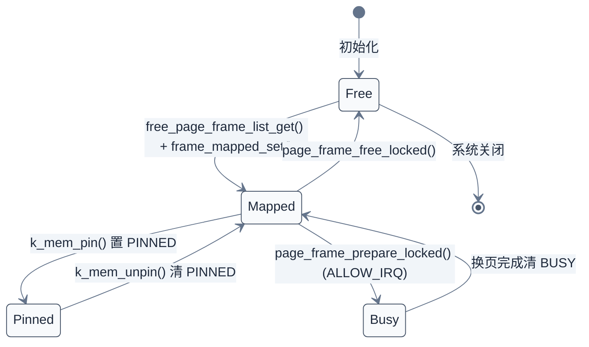
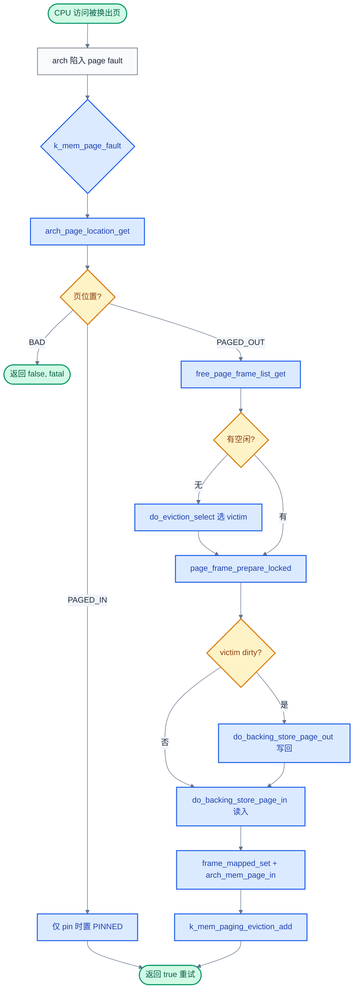
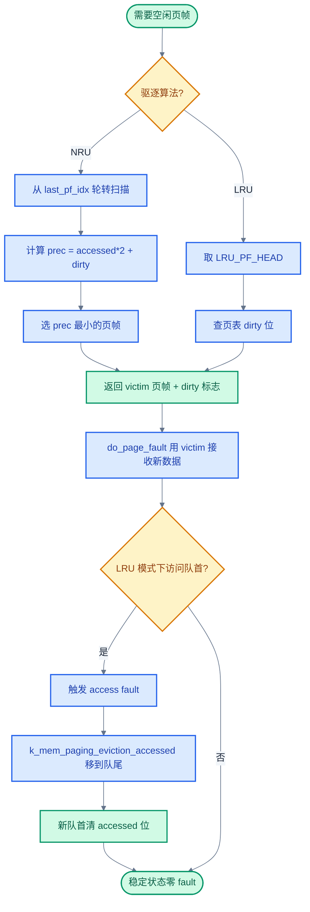

# 17. Demand Paging 按需分页

> 一句话概括：本文从"应用代码 4MB、SRAM 仅 512KB"这一典型嵌入式困境出发，剖析 Zephyr 按需分页子系统的 page frame 元数据、缺页中断处理流程、驱逐算法、`K_MEM_SCRATCH_PAGE` 中转页的安全考量、主动换页 API、backing store 接口与时序直方图，并对比 Linux swap。
> **工程师视角**：读完后你应当能回答"`K_MEM_SCRATCH_PAGE` 为什么不能省"、"为什么 RTOS 几乎不做 demand paging 而 Zephyr 偏要做"、"NRU 与 LRU 在 Zephyr 里的实现复杂度差几倍"这三个问题，并能为给定板级场景选择驱逐算法与 backing store 实现。

### 关键术语

| 缩写 | 全称 | 含义 |
|------|------|------|
| RTOS | Real-Time Operating System | 实时操作系统 |
| MMU | Memory Management Unit | 内存管理单元，提供虚拟地址翻译与页级保护 |
| RAM | Random Access Memory | 随机存取存储器，本文指主存 SRAM |
| TLB | Translation Lookaside Buffer | 页表缓存，加速虚拟地址翻译 |
| ISR | Interrupt Service Routine | 中断服务例程 |
| IRQ | Interrupt Request | 中断请求 |
| API | Application Programming Interface | 应用编程接口 |
| SMP | Symmetric Multi-Processing | 对称多处理 |
| SoC | System on Chip | 片上系统 |
| DMA | Direct Memory Access | 直接内存访问，外设不经 CPU 直接读写内存 |
| LRU | Least Recently Used | 最近最少使用，按访问时间淘汰的页面置换算法 |
| NRU | Not Recently Used | 最近未使用，按访问/修改位排名淘汰的简化算法 |
| W^X | Write XOR Execute | 写互斥执行，页表不能同时具备写与执行权限的安全策略 |
| MCU | Microcontroller Unit | 微控制器 |

---

### 前置阅读

| 需要了解 | 参考文档 |
|----------|----------|
| Zephyr 内存管理全貌，特别是 §6 按需分页概述 | [12. 内存管理](./12-内存管理.md) |
| SMP 下的锁与中断语义（按需分页在 SMP 下用 `z_mm_paging_lock` 串行化） | [16. SMP 多核支持](./16-SMP多核支持.md) |

---

## 1. 概述：RTOS 中的按需分页

> 上一章讨论了 SMP 多核下的并发与全局锁仿真。一个自然的问题是：当系统规模进一步扩大、应用代码量远超物理 RAM 时，Zephyr 如何在保持 RTOS 实时性的前提下运行大地址空间程序？本章用按需分页（Demand Paging）子系统来回答这个问题——先讲 page frame 元数据与缺页中断处理流程，再讲驱逐算法、中转页安全考量、主动换页 API、backing store 接口与时序直方图，最后对比 Linux swap。

### 1.1 RTOS 几乎不做 demand paging

桌面/移动 OS（Linux、Windows、macOS）的 demand paging 是标配：物理 RAM 不够时把不常用页换出到磁盘，靠"访问时缺页→换入"维持大地址空间幻觉。但绝大多数 RTOS（FreeRTOS、ThreadX、裸机）完全不做这件事，原因有三：

1. **MCU 通常无 MMU**：Cortex-M 系列（除 M33/M55 等带 MPU 的型号外）根本没有地址翻译硬件，demand paging 无从谈起
2. **实时性不可妥协**：一次缺页可能引入毫秒级延迟（外存 I/O），与硬实时的确定性目标直接冲突
3. **代码量小**：嵌入式应用常以 KB 计，地址空间不会超 RAM，没有换页的工程必要性

### 1.2 Zephyr 为何破例

Zephyr 的定位是"从 MCU 到带 MMU 的较大系统"的统一 RTOS。在 qemu_x86_tiny、intel64、arm64 这类目标上，应用可能携带大型模型、网络栈、文件系统缓存，物理 RAM 装不下。`CONFIG_DEMAND_PAGING` 就是面向这类场景的可选子系统。它的存在是 Zephyr 进军"带 MMU 较大系统"的标志——保留 RTOS 静态优先风格的同时，提供桌面 OS 才有的换页能力。

> **核心要点**：demand paging 是"时间换空间"——用换页延迟换取运行大于 RAM 的地址空间。Zephyr 把它做成可选项，硬实时任务用 `K_MEM_PAGE_FRAME_PINNED` 钉住关键页，避免缺页抖动。

### 1.3 与第 12 章 §6 的关系

[第 12 章 §6](./12-内存管理.md) 给出了按需分页的概念性介绍：四个核心概念（数据页、页帧、backing store、`K_MEM_SCRATCH_PAGE`）、缺页处理流程的 5 步概述、淘汰算法与 backing store 的回调清单。本章不再重复这些定义，而是深入源码：剖析 `struct k_mem_page_frame` 的位压缩技巧、`do_page_fault()` 的完整调用链、NRU/LRU 的实现差异、直方图的桶边界设计。两者关系是"第 12 章是概述，本篇是源码深挖"。

---

## 2. Page Frame 元数据：k_mem_page_frame

### 2.1 设计约束：每个 RAM 页都要一个

按需分页的第一步是把物理 RAM 切成页大小的"页帧"（page frame），每个页帧都需要一份元数据记录"它是谁的、能否换出、是否在换页中"。Zephyr 用一个静态数组 `k_mem_page_frames[K_MEM_NUM_PAGE_FRAMES]` 存放所有页帧的元数据，定义见 [`kernel/include/mmu.h`](file:///home/pbw/rtos/cs-learning-notes/zephyr-project/zephyr/kernel/include/mmu.h)：

```c
/* kernel/include/mmu.h:124 */
#define K_MEM_NUM_PAGE_FRAMES	(K_MEM_PHYS_RAM_SIZE / (size_t)CONFIG_MMU_PAGE_SIZE)

/* kernel/include/mmu.h:167 */
struct k_mem_page_frame {
	union {
		/*
		 * If mapped, K_MEM_PAGE_FRAME_* flags and virtual address
		 * this page is mapped to.
		 */
		uintptr_t va_and_flags;

		/*
		 * If unmapped and available, free pages list membership
		 * with the K_MEM_PAGE_FRAME_FREE flag.
		 */
		sys_sfnode_t node;
	};
};

extern struct k_mem_page_frame k_mem_page_frames[K_MEM_NUM_PAGE_FRAMES];
```

> **为什么用 union？** 页帧要么"在空闲链表上等待分配"，要么"已映射到某虚拟地址"。两种状态互斥，复用同一块存储能省一半内存。`va_and_flags` 把标志位压在低位（页大小内的 bit 用作 flag），把虚拟地址放在高位——`CONFIG_MMU_PAGE_SIZE` 必须是 2 的幂，低位 flag 数量不超过 `log2(page_size)`。

### 2.2 六个标志位

标志位定义见 [`kernel/include/mmu.h`](file:///home/pbw/rtos/cs-learning-notes/zephyr-project/zephyr/kernel/include/mmu.h#L135-L159)：

| 标志 | 值 | 含义 |
|------|------|------|
| `K_MEM_PAGE_FRAME_FREE` | `BIT(0)` | 空闲且在空闲链表上；置位时其他标志无意义 |
| `K_MEM_PAGE_FRAME_RESERVED` | `BIT(1)` | 硬件保留，永不使用 |
| `K_MEM_PAGE_FRAME_PINNED` | `BIT(2)` | 钉住，永不换出（关键代码/数据用） |
| `K_MEM_PAGE_FRAME_MAPPED` | `BIT(3)` | 已映射到虚拟地址 |
| `K_MEM_PAGE_FRAME_BUSY` | `BIT(4)` | 正在换入/换出（仅 `CONFIG_DEMAND_PAGING_ALLOW_IRQ` 时使用） |
| `K_MEM_PAGE_FRAME_BACKED` | `BIT(5)` | backing store 中有干净副本，换出时无需写回 |

### 2.3 is_evictable() 的合取条件

[`kernel/include/mmu.h`](file:///home/pbw/rtos/cs-learning-notes/zephyr-project/zephyr/kernel/include/mmu.h#L223) 给出"可淘汰"判定：

```c
static inline bool k_mem_page_frame_is_evictable(struct k_mem_page_frame *pf)
{
	return (!k_mem_page_frame_is_free(pf) &&
		!k_mem_page_frame_is_reserved(pf) &&
		k_mem_page_frame_is_mapped(pf) &&
		!k_mem_page_frame_is_pinned(pf) &&
		!k_mem_page_frame_is_busy(pf));
}
```

五个条件必须同时满足：非空闲、非保留、已映射、未钉住、未在换页。驱逐算法在 `select()` 中调用此函数跳过不可淘汰的页帧。

> **核心要点**：`va_and_flags` 用 union + 位压缩把"标志 + 虚拟地址"塞进一个 `uintptr_t`，是为了在百万页帧级别也能把元数据放进 cache。这是嵌入式内核特有的节俭——Linux 的 `struct page` 远比这复杂。

> **设计洞察**：`va_and_flags` 的位压缩不仅是"省内存"，更是对 cache 行为的精心优化。页帧元数据是缺页处理的热路径——每次 `do_page_fault` 都要遍历 `k_mem_page_frames[]`。若每条元数据膨胀到 16 或 32 字节，扫描时跨越的 cache line 数翻倍，缺页延迟随之上升。压到 8 字节（一个 `uintptr_t`）让相邻元数据共享 cache line，扫描时预取命中率最高。
>
> 对比 Linux 的 `struct page`——历史上长期是 56-64 字节，刻意对齐到 L1 cache line 边界。Linux 的考量不同：`struct page` 要承载匿名页/文件页/SLAB/分页/迁移等十几种状态，字段必然多；Zephyr 的页帧元数据只服务 demand paging，字段少，所以能压到 8 字节。这是"职责单一才能极致紧凑"的体现——一个数据结构承担的职责越多，越难优化其内存占用。Linux 内核社区多年来数次试图"瘦身"`struct page`（如 `struct ptdesc`、`struct folio` 重构），都因职责过重而困难重重。
>
> 位压缩利用了一个体系结构不变量：页大小是 2 的幂，低位 `log2(page_size)` 个 bit 永远是虚拟地址的零位，可挪用为 flag。这是 MMU 设计留下的"免费比特"，Linux 的页表项 PTE 也用同样手法存 accessed/dirty/PAT 等位。理解这个底层不变量，才能写出正确的位压缩代码——它隐含了一个约束：`CONFIG_MMU_PAGE_SIZE` 必须是 2 的幂，否则 flag 位会与有效地址位重叠。

### 2.4 page frame 状态机



> **如何读这张图**：`Free` 是空闲链表上的页帧，`Mapped` 是已映射到虚拟地址的活跃页帧，`Pinned` 是钉住永不换出的子状态，`Busy` 仅在允许中断的换页路径中出现。驱逐算法只能选 `Mapped` 状态的页帧。

---

## 3. 缺页中断处理流程

### 3.1 入口：do_page_fault()

当 CPU 访问一个被换出的页时，架构相关的异常处理最终调用 [`kernel/mmu.c`](file:///home/pbw/rtos/cs-learning-notes/zephyr-project/zephyr/kernel/mmu.c#L1802) 的 `k_mem_page_fault()`，它转发到 `do_page_fault(addr, false)`（pin=false 表示不钉住）。完整调用链见 [`kernel/mmu.c`](file:///home/pbw/rtos/cs-learning-notes/zephyr-project/zephyr/kernel/mmu.c#L1614-L1766)。

### 3.2 编号步骤

1. **可选加锁**：若启用 `CONFIG_DEMAND_PAGING_ALLOW_IRQ`，UP 下 `k_sched_lock()`，SMP 下 `k_mutex_lock(&z_mm_paging_lock, K_FOREVER)`。架构保证：若中断在异常时是关的，进入 `do_page_fault` 时仍是关的
2. **`k_spin_lock(&z_mm_lock)`**：取内核内存自旋锁
3. **`arch_page_location_get(addr, &page_in_location)`**：查页表，返回 `PAGED_OUT` / `PAGED_IN` / `BAD`
   - `BAD`：未映射，返回 false 让架构层报 fatal
   - `PAGED_IN`：页已在 RAM，仅当 `pin=true` 时设 PINNED，然后返回
   - `PAGED_OUT`：继续走换入路径
4. **`paging_stats_faults_inc()`**：累计缺页计数（含 IRQ locked/unlocked、ISR 三类）
5. **`free_page_frame_list_get()`**：从空闲链表取一个页帧
   - 若返回 NULL：调用 `do_eviction_select(&dirty)` 让驱逐算法选一个 victim
6. **`page_frame_prepare_locked(pf, &dirty, true, &page_out_location)`**：
   - 若 victim 是脏页或未被 backing 备份过，调用 `arch_mem_scratch(phys)` 把 victim 物理页临时映射到 `K_MEM_SCRATCH_PAGE`
   - 调用 `k_mem_paging_backing_store_location_get()` 在 backing store 中分配一个 location token
   - 调用 `arch_mem_page_out()` 更新页表，记录 location
   - 标记 `BUSY`（ALLOW_IRQ 模式下）
7. **可选 unlock**：`ALLOW_IRQ` 下 `k_spin_unlock(&z_mm_lock)` 让中断能进来
8. **若 dirty**：`do_backing_store_page_out(page_out_location)` 把 victim 内容从 scratch 页写回 backing store
9. **`do_backing_store_page_in(page_in_location)`**：把目标页从 backing store 读到 scratch 页
10. **重新加锁** + 清 `BUSY` + 清旧 `MAPPED` + `frame_mapped_set(pf, addr)` 设新映射
11. **`arch_mem_page_in(addr, phys)`**：架构层把页表项指向新物理页
12. **`k_mem_paging_backing_store_page_finalize(pf, location)`**：backing store 后处理（可空）
13. **`k_mem_paging_eviction_add(pf)`**：把新页帧加入驱逐候选集（仅 `EVICTION_TRACKING` 启用时）
14. **`k_spin_unlock(&z_mm_lock)`** + 可选 `k_sched_unlock()` / `k_mutex_unlock()`

### 3.3 流程图



> **如何读这张图**：菱形是分支判断，矩形是动作。绿色圆角是入口/出口。核心路径是 `PAGED_OUT → 取空闲页帧（不够则驱逐）→ 准备 victim → 写回脏页 → 读入新页 → 更新映射`，与桌面 OS 的缺页处理结构相同，差异在步骤 6 的 `arch_mem_scratch` 中转页机制（第 5 节详解）。

---

## 4. 驱逐算法

### 4.1 接口函数集

驱逐算法必须实现的函数集见 [`include/zephyr/kernel/mm/demand_paging.h`](file:///home/pbw/rtos/cs-learning-notes/zephyr-project/zephyr/include/zephyr/kernel/mm/demand_paging.h)，调用时机如下：

| 函数 | 调用时机 | NRU 是否实现 | LRU 是否实现 |
|------|----------|--------------|--------------|
| `k_mem_paging_eviction_init()` | `POST_KERNEL` 阶段 | 是（启动定时器） | 是（空函数） |
| `k_mem_paging_eviction_select()` | 缺页且无空闲页帧时 | 是 | 是 |
| `k_mem_paging_eviction_add()` | 页帧变为可淘汰时 | 空（不跟踪） | 是（追加到队尾） |
| `k_mem_paging_eviction_remove()` | 页帧被钉住/解除映射/即将换出时 | 空 | 是（从队列摘除） |
| `k_mem_paging_eviction_accessed()` | 数据页触发访问异常时 | 空 | 是（移到队尾） |

`init` 与 `select` 是必选；`add`/`remove`/`accessed` 仅在 `CONFIG_EVICTION_TRACKING` 启用时要求实现。LRU 强制 `select EVICTION_TRACKING`，NRU 不强制。

### 4.2 NRU 实现：定时清 accessed + 排名

NRU 算法见 [`subsys/demand_paging/eviction/nru.c`](file:///home/pbw/rtos/cs-learning-notes/zephyr-project/zephyr/subsys/demand_paging/eviction/nru.c)。核心思路：用周期定时器（默认 100ms）清掉所有可淘汰页的 accessed 位；选 victim 时按 `(accessed, dirty)` 排名，优先淘汰"未访问且干净"的页。

排名优先级（值越小越先被淘汰）：

| prec | accessed | dirty | 含义 |
|------|----------|-------|------|
| 0 | 否 | 否 | 最佳候选：长时间未访问，无修改 |
| 1 | 否 | 是 | 未访问但有修改，需写回 backing |
| 2 | 是 | 否 | 最近访问过且干净 |
| 3 | 是 | 是 | 最差候选：刚访问且有修改 |

`select()` 实现见 [`nru.c`](file:///home/pbw/rtos/cs-learning-notes/zephyr-project/zephyr/subsys/demand_paging/eviction/nru.c#L46-L104)。它用 `static uint32_t last_pf_idx` 做轮转起点，避免每次都从 0 开始扫描；找到 `prec==0` 的页立即返回，否则记录最低 prec 的页。

NRU 的 `add`/`remove`/`accessed` 是空函数——它靠周期扫描页表获取 accessed 信息，不需要每次访问都更新队列。

### 4.3 LRU 实现：双向链表 + 访问时重排

LRU 算法见 [`subsys/demand_paging/eviction/lru.c`](file:///home/pbw/rtos/cs-learning-notes/zephyr-project/zephyr/subsys/demand_paging/eviction/lru.c)。它维护一个按"最近使用顺序"排列的双向链表，所有操作都是 O(1)。

为节省内存，LRU 不用指针链表，而是用紧凑位数组：

```c
/* lru.c:55-63 */
#define PF_IDX_BITS ROUND_UP(LOG2CEIL(K_MEM_NUM_PAGE_FRAMES + 1), BITS_PER_BYTE)

struct lru_pf_idx {
	uint32_t next : PF_IDX_BITS;
	uint32_t prev : PF_IDX_BITS;
} __packed;

static struct lru_pf_idx lru_pf_queue[K_MEM_NUM_PAGE_FRAMES + 1];
```

槽位 0 存 head/tail 索引（实际索引偏移 1），其余槽位对应页帧。`PF_IDX_BITS` 按页帧数对数向上取整到字节边界，比如 1024 个页帧只需 11 bit 存一个索引。

LRU 的工作流（[`lru.c`](file:///home/pbw/rtos/cs-learning-notes/zephyr-project/zephyr/subsys/demand_paging/eviction/lru.c#L8-L33) 注释）：

1. 页帧变可淘汰时，`add()` 把它追加到队尾
2. 队首页被标记为不可访问（清 accessed 位）
3. 访问队首页时触发 fault，架构层调用 `accessed()` 把它移到队尾
4. `select()` 直接返回队首——队首就是最久未用的页

> **为什么 LRU 把队首设为不可访问？** 这是一种"懒清理"策略：不主动扫描所有页的 accessed 位（NRU 那样），而是在淘汰时只清一个页。若队首被访问，立刻 fault 把它移到队尾，新队首再被清。这样无访问开销就能维护顺序——除非队列稳定，否则 fault 几乎为零。

### 4.4 NRU vs LRU 对比

| 维度 | NRU | LRU |
|------|-----|-----|
| 数据结构 | 无（遍历页帧数组） | 紧凑位数组双向链表 |
| `select()` 复杂度 | O(N)，N 为页帧数 | O(1) |
| 跟踪函数 | 空 | 实现 add/remove/accessed |
| accessed 维护 | 周期定时器清所有页 | 淘汰时只清队首一个 |
| 周期定时器 | 需要（默认 100ms） | 不需要 |
| 精度 | 近似（100ms 粒度） | 精确（每次访问都重排） |
| 适用场景 | 简单示例、页帧数少 | 生产推荐 |
| `EVICTION_TRACKING` | 可选 | 强制 |

> **核心要点**：NRU 简单但不精确（周期清位导致粒度损失），LRU 精确且 O(1) 但要求架构支持访问异常时回调 `accessed()`。Kconfig 默认在 arm64 选 LRU、其他架构选 NRU——arm64 的页表支持细粒度访问位管理，LRU 才能发挥威力。

> **设计洞察**：LRU 用紧凑位数组（`PF_IDX_BITS` 位）而非指针实现双向链表，是 cache-friendly 数据结构的精彩案例。指针链表每节点 16 字节（next+prev），且节点散落在 `struct k_mem_page_frame` 中，遍历时 cache 命中差；位数组链表把所有节点连续存放，扫描驱逐候选时 cache 利用率高得多。这是把"算法复杂度"和"内存访问模式"都纳入考量的真正工程权衡——教科书上的 LRU 用指针链表，工程上的 LRU 必须考虑 cache。
>
> LRU 的"队首清 accessed 位"是个反直觉但精妙的设计——它把"维护 LRU 顺序"的开销摊到了"自然发生的缺页"上。队首一旦被访问就触发 fault（因为 accessed 位被清），fault 处理中把它移到队尾。若队首长期不被访问，它就是理想的 victim，零开销地被淘汰。这种"惰性一致性"（lazy consistency）思想在 Linux 的 active/inactive 链表中也有体现——不追求每一刻都精确，而是在淘汰时刻有足够信息做决策。
>
> NRU 与 LRU 的选择反映了一个普遍的 OS 设计原则：**算法精度依赖硬件支持**。LRU 要求架构在"页被访问但 accessed 位已清"时触发异常——这需要页表支持"清 accessed 位后下次访问 trap"的语义，arm64 有，许多早期 MMU 没有。Linux 早期也用类似 NRU 的近似算法（clock algorithm），直到主流架构稳定提供 accessed 位支持才转向更精确的 LRU 变体。算法选择从来不是"哪个更好"，而是"硬件给了什么筹码"。

### 4.5 驱逐算法流程图



> **如何读这张图**：左路是 NRU 的"扫描-排名"模式，右路是 LRU 的"取队首"模式。LRU 下方的"访问队首触发 fault → 移到队尾"分支是它的精确性来源——只有真正被访问的页才会重排，无访问就零 fault。

---

## 5. K_MEM_SCRATCH_PAGE：中转页的安全考量

### 5.1 问题：直接换页的安全风险

按需分页要把 RAM 中的脏页写到 backing store，再从 backing store 读出新页。看似简单的"内存拷贝"，遇到只读映射就麻烦：

考虑一段代码段被映射为只读执行（W^X 策略下的典型情况）。若直接把这个数据页的虚拟地址交给 backing store 驱动去读写，必须先把页表项改成可读写——但这一改，应用其他部分看到的也是可读写页，W^X 失效，潜在漏洞：攻击者可写代码段注入指令。

### 5.2 解法：专用中转页

Zephyr 在虚拟地址空间末尾预留一页作为中转页，定义见 [`kernel/include/mmu.h`](file:///home/pbw/rtos/cs-learning-notes/zephyr-project/zephyr/kernel/include/mmu.h#L339)：

```c
/* kernel/include/mmu.h:330-341 */
#ifdef CONFIG_DEMAND_PAGING
/* We reserve a virtual page as a scratch area for page-ins/outs at the end
 * of the address space
 */
#define K_MEM_VM_RESERVED	CONFIG_MMU_PAGE_SIZE

/**
 * @brief Location of the scratch page used for demand paging.
 */
#define K_MEM_SCRATCH_PAGE	((void *)((uintptr_t)CONFIG_KERNEL_VM_BASE + \
					  (uintptr_t)CONFIG_KERNEL_VM_SIZE - \
					  CONFIG_MMU_PAGE_SIZE))
#endif
```

换页流程变成两步：

1. **`arch_mem_scratch(phys)`**：把目标物理页帧**临时**映射到 `K_MEM_SCRATCH_PAGE`，权限设为 supervisor 可读写
2. **backing store 驱动**：在 `K_MEM_SCRATCH_PAGE` 与存储位置之间拷贝数据

数据页本身的虚拟地址映射**不变**——它的只读/执行权限得以保留。换页完成后 scratch 映射可保留为最后映射的物理页（下一次换页时再 `arch_mem_scratch` 重映射），不影响数据页的页表项。

### 5.3 架构实现：arm64 与 x86

`arch_mem_scratch()` 是架构相关函数，接口见 [`kernel/include/kernel_arch_interface.h`](file:///home/pbw/rtos/cs-learning-notes/zephyr-project/zephyr/kernel/include/kernel_arch_interface.h#L452)。两个实现示例：

```c
/* arch/arm64/core/mmu.c:1596 */
void arch_mem_scratch(uintptr_t phys)
{
	uintptr_t virt = (uintptr_t)K_MEM_SCRATCH_PAGE;
	size_t size = CONFIG_MMU_PAGE_SIZE;
	int ret = add_map(&kernel_ptables, "scratch", phys, virt, size, MT_SCRATCH);
	/* MT_SCRATCH = MT_NORMAL | MT_P_RW_U_NA | MT_DEFAULT_SECURE_STATE */
	if (ret) {
		LOG_ERR("add_map() returned %d", ret);
	} else {
		sync_domains(virt, size, "scratch");
		invalidate_tlb_page(virt);
	}
}

/* arch/x86/core/x86_mmu.c:2120 */
__pinned_func
void arch_mem_scratch(uintptr_t phys)
{
	page_map_set(z_x86_page_tables_get(), K_MEM_SCRATCH_PAGE,
		     phys | MMU_P | MMU_RW | MMU_XD, NULL, MASK_ALL,
		     OPTION_FLUSH);
}
```

注意 x86 版本带 `__pinned_func`——scratch 映射函数本身绝不能被换出（否则换页过程中缺页会死锁）。arm64 用 `MT_P_RW_U_NA`（特权读写、用户不可访问），x86 用 `MMU_RW | MMU_XD`（读写、不可执行），两者都遵循 W^X：scratch 页可写但不可执行。

### 5.4 backing store 的视角

backing store 驱动看到的接口（[`include/zephyr/kernel/mm/demand_paging.h`](file:///home/pbw/rtos/cs-learning-notes/zephyr-project/zephyr/include/zephyr/kernel/mm/demand_paging.h#L389-L413)）：

```c
/* 把 K_MEM_SCRATCH_PAGE 的内容拷到 location */
void k_mem_paging_backing_store_page_out(uintptr_t location);

/* 把 location 的内容拷到 K_MEM_SCRATCH_PAGE */
void k_mem_paging_backing_store_page_in(uintptr_t location);
```

驱动只需与 `K_MEM_SCRATCH_PAGE` 交互，无需关心数据页的真实虚拟地址。RAM backing store 示例（[`subsys/demand_paging/backing_store/ram.c`](file:///home/pbw/rtos/cs-learning-notes/zephyr-project/zephyr/subsys/demand_paging/backing_store/ram.c#L115-L125)）：

```c
void k_mem_paging_backing_store_page_out(uintptr_t location)
{
	(void)memcpy(location_to_slab(location), K_MEM_SCRATCH_PAGE,
		     CONFIG_MMU_PAGE_SIZE);
}

void k_mem_paging_backing_store_page_in(uintptr_t location)
{
	(void)memcpy(K_MEM_SCRATCH_PAGE, location_to_slab(location),
		     CONFIG_MMU_PAGE_SIZE);
}
```

> **核心要点**：`K_MEM_SCRATCH_PAGE` 不是性能优化，而是安全机制——它把"对数据页的临时可写访问"隔离在专用地址上，避免污染数据页的真实映射权限。省掉它会让所有只读映射在换页时短暂变为可写，破坏 W^X 与代码段完整性保护。

> **设计洞察**：`K_MEM_SCRATCH_PAGE` 体现了"机制与策略分离"的 OS 设计原则——换页这一动作（机制）与数据页的权限策略（只读/可执行/W^X）解耦。backing store 驱动只与 scratch 页打交道，无需知道也不影响数据页的真实权限。这种隔离让换页逻辑可以被独立实现、独立测试、独立演进，不与权限模型纠缠。这也是分层抽象在内核内部的一次微观应用——`arch_mem_scratch` 提供机制，调用者提供策略。
>
> W^X（Write XOR Execute）是现代系统对抗代码注入的核心防线——攻击者即便能写内存，也无法让那段内存被执行。Linux 在内核代码段、JIT 引擎（如 eBPF、V8）中强制 W^X，代价是修改代码段需要 mmap+prot 复杂序列。Zephyr 在嵌入式场景下同样面对这个威胁——若有动态加载模块或解释器，W^X 不可或缺。直接改数据页权限来做换页会瞬间击穿这条防线，scratch 页正是为守住它而存在。OpenBSD 与 PaX/SELinux 等加固系统更进一步，对整个用户态也强制 W^X。
>
> 这种"用专用地址做临时映射"的手法在系统软件中反复出现。Linux 内核的 `kmap_atomic`/`kmap_local` 在 32 位系统上为高端内存做临时映射，思路如出一辙：给一段物理页一个可写的虚拟地址窗口，用完即弃，不影响它在用户空间的映射权限。模式识别能力强的工程师会注意到：凡是"需要临时改变一块内存的访问属性"的场景，都应该考虑独立映射而非就地修改——这是避免权限污染与并发竞态的通用解法。

---

## 6. 主动预取与换出：k_mem_page_in/k_mem_page_out

### 6.1 三个 API

[`include/zephyr/kernel/mm/demand_paging.h`](file:///home/pbw/rtos/cs-learning-notes/zephyr-project/zephyr/include/zephyr/kernel/mm/demand_paging.h#L84-L149) 提供四个面向应用的换页 API：

| 函数 | 作用 | 实现位置 |
|------|------|----------|
| `k_mem_page_in(addr, size)` | 主动换入：确保区域已在 RAM | `kernel/mmu.c:1777` |
| `k_mem_page_out(addr, size)` | 主动换出：把区域写回 backing 腾出页帧 | `kernel/mmu.c:1438` |
| `k_mem_pin(addr, size)` | 换入并钉住，永不淘汰 | `kernel/mmu.c:1794` |
| `k_mem_unpin(addr, size)` | 解除钉住，允许淘汰 | `kernel/mmu.c:1830` |

### 6.2 k_mem_page_in：触发缺页换入

`k_mem_page_in` 的实现很简单（[`mmu.c`](file:///home/pbw/rtos/cs-learning-notes/zephyr-project/zephyr/kernel/mmu.c#L1777-L1783)）：

```c
void k_mem_page_in(void *addr, size_t size)
{
	__ASSERT(!IS_ENABLED(CONFIG_DEMAND_PAGING_ALLOW_IRQ) || !k_is_in_isr(),
		 "%s may not be called in ISRs if CONFIG_DEMAND_PAGING_ALLOW_IRQ is enabled",
		 __func__);
	virt_region_foreach(addr, size, do_page_in);
}
```

`do_page_in` 实际调用 `do_page_fault(addr, false)`——主动换入就是"模拟一次缺页"。区别在于：缺页是异常上下文，主动换入是线程上下文。

### 6.3 k_mem_page_out：写回 backing 腾出页帧

`k_mem_page_out` 调用 `do_mem_evict(addr)`（[`mmu.c`](file:///home/pbw/rtos/cs-learning-notes/zephyr-project/zephyr/kernel/mmu.c#L1378)），它的逻辑与 `do_page_fault` 的驱逐分支类似，但**不读入新页**——只是把指定页换出到 backing store，然后把页帧放回空闲链表。

典型用法：知道某区域长时间不用（如图形缓冲区在屏幕关闭后），主动 `k_mem_page_out` 腾出页帧，避免下次缺页时还要先驱逐别人。

### 6.4 k_mem_pin / k_mem_unpin：硬实时保护

`k_mem_pin` 是 `k_mem_page_in` 的"加强版"——换入后还置 `PINNED` 标志，让驱逐算法永远跳过它。硬实时任务的代码段、关键数据必须在执行前 pin，否则可能在最坏时机被换出导致毫秒级延迟。

`k_mem_unpin` 解除 pin，让页帧重新进入淘汰候选集（`k_mem_paging_eviction_add`）。

> **为什么 ISR 不能调用这些 API？** 当 `CONFIG_DEMAND_PAGING_ALLOW_IRQ` 启用时，backing store 驱动可能睡眠（如等待 DMA），ISR 中睡眠是非法的；当该选项关闭时，ISR 可以缺页但代价是整个换页路径关中断，严重影响中断延迟。两种情况下 ISR 都应只访问已 pin 的页。

> **设计洞察**：`k_mem_pin` 对应 Linux 的 `mlock(2)`，但两者的设计动机截然不同。Linux 的 `mlock` 主要服务于安全敏感应用（密码学密钥不落盘）和延迟敏感应用（避免 swap 抖动），是"锦上添花"；Zephyr 的 `k_mem_pin` 是硬实时任务的"生死线"——一次意外的换页延迟足以让控制环超时，导致物理系统失稳。这种从"优化"到"正确性"的角色转换，是 RTOS 与通用 OS 的根本分野。
>
> 这背后是实时系统的一个核心公理：**确定性优于平均性能**。通用 OS 追求吞吐与平均延迟，可以接受偶发毫秒级 page fault；RTOS 追求最坏情况延迟的可预测，宁愿整体慢一点也不接受不可控尖峰。`PINNED` 标志把"换页"这个本质上不可预测的机制（依赖 backing store I/O 时间）从实时关键路径中剔除，让开发者能对最坏情况做出硬性保证。这也是为什么 RTOS 几乎不做 demand paging——一旦做了，就必须给开发者一个"退出开关"，`PINNED` 就是这个开关。
>
> `__pinned_func` 注解（如 `arch_mem_scratch` 上的）把这个思想推广到代码段——换页机制本身的代码绝不能被换出，否则会递归触发缺页死锁。这是系统软件"自举安全"（bootstrapping safety）的典型模式：机制的实现必须独立于该机制提供的便利。Linux 的 swap 代码也类似——`__swapper_pg_dir`、内核核心页不能被换出，否则系统立刻崩溃。识别"哪些代码绝不能依赖待提供机制"是系统程序员的关键能力。

---

## 7. Backing Store 接口

### 7.1 七个必须实现的函数

backing store 负责实际的页换入/换出 I/O，平台代码必须实现以下函数（[`demand_paging.rst`](file:///home/pbw/rtos/cs-learning-notes/zephyr-project/zephyr/doc/kernel/memory_management/demand_paging.rst) 与 [`demand_paging.h`](file:///home/pbw/rtos/cs-learning-notes/zephyr-project/zephyr/include/zephyr/kernel/mm/demand_paging.h)）：

| 函数 | 作用 | 调用时机 |
|------|------|----------|
| `k_mem_paging_backing_store_init()` | 初始化 backing store | `POST_KERNEL` |
| `k_mem_paging_backing_store_location_get()` | 分配 location token | 准备换出时 |
| `k_mem_paging_backing_store_location_free()` | 释放 location token | 不再需要副本时 |
| `k_mem_paging_backing_store_location_query()` | 查询某虚拟地址对应的 token | 配合 `CONFIG_DEMAND_MAPPING` |
| `k_mem_paging_backing_store_page_in(location)` | 从 location 拷到 `K_MEM_SCRATCH_PAGE` | 换入 |
| `k_mem_paging_backing_store_page_out(location)` | 从 `K_MEM_SCRATCH_PAGE` 拷到 location | 换出脏页 |
| `k_mem_paging_backing_store_page_finalize(pf, location)` | 换入后内部账目更新 | 换入完成后 |

`page_finalize` 可为空函数。其余函数都必须实现。

### 7.2 两类 backing store

[`subsys/demand_paging/backing_store/ram.c`](file:///home/pbw/rtos/cs-learning-notes/zephyr-project/zephyr/subsys/demand_paging/backing_store/ram.c#L13-L53) 注释把 backing store 分为两类：

| 类型 | 特点 | location token 设计 |
|------|------|---------------------|
| 大稀疏存储 | 容量足以容纳整个地址空间 | token 是虚拟地址的函数，无需空间管理 |
| 有限存储 | 容量不足以容纳所有映射 | token 需分配/释放，需管理空闲位置 |

第一类典型例子是 Flash：代码段在 Flash 中已有固定位置，token 就是 Flash 偏移。第二类典型例子是 RAM backing store（演示用）或外部 SPI Flash 分区。

### 7.3 RAM backing store 示例

[`subsys/demand_paging/backing_store/ram.c`](file:///home/pbw/rtos/cs-learning-notes/zephyr-project/zephyr/subsys/demand_paging/backing_store/ram.c) 是演示用实现：用 `k_mem_slab` 管理一组页大小的槽位，location token 就是槽位在数组中的偏移。

```c
/* ram.c:54-56 */
#define BACKING_STORE_SIZE (CONFIG_BACKING_STORE_RAM_PAGES * CONFIG_MMU_PAGE_SIZE)
static char backing_store[BACKING_STORE_SIZE] __aligned(sizeof(void *));
static struct k_mem_slab backing_slabs;
```

`location_get` 用 `k_mem_slab_alloc` 分配槽位，`location_free` 用 `k_mem_slab_free` 释放。`page_in`/`page_out` 都是 `memcpy` 与 `K_MEM_SCRATCH_PAGE` 之间。

注释明确指出此实现的局限：`page_finalize` 立即释放 location，所以从不设置 `K_MEM_PAGE_FRAME_BACKED`——所有页都按脏页处理，无法利用干净副本优化。生产实现应在 `page_finalize` 中保留 location 并设 BACKED 位，下次换出时若页未脏就直接复用 location，省一次写回。

### 7.4 BACKED 位的优化逻辑

[`mmu.c`](file:///home/pbw/rtos/cs-learning-notes/zephyr-project/zephyr/kernel/mmu.c#L1340-L1342) 体现了 BACKED 优化：

```c
if (k_mem_page_frame_is_mapped(pf)) {
	dirty = dirty || !k_mem_page_frame_is_backed(pf);
}
```

页帧"未脏但未 BACKED"也按脏处理——因为 backing store 中没有它的副本，必须写回。只有"未脏且 BACKED"才能跳过写回，这是 backing store 实现优化的关键。

---

## 8. 时序直方图与性能分析

### 8.1 三类直方图

按需分页的延迟高度依赖架构、SoC、板级——同样的代码在 qemu_x86 与真实 arm64 SoC 上延迟差几个数量级。Zephyr 提供三个直方图量化延迟，定义见 [`kernel/paging/statistics.c`](file:///home/pbw/rtos/cs-learning-notes/zephyr-project/zephyr/kernel/paging/statistics.c#L15-L18)：

| 直方图 | 测量对象 | 获取 API |
|--------|----------|----------|
| `z_paging_histogram_eviction` | 驱逐算法 `select()` 耗时 | `k_mem_paging_histogram_eviction_get()` |
| `z_paging_histogram_backing_store_page_in` | backing store 换入耗时 | `k_mem_paging_histogram_backing_store_page_in_get()` |
| `z_paging_histogram_backing_store_page_out` | backing store 换出耗时 | `k_mem_paging_histogram_backing_store_page_out_get()` |

启用条件：`CONFIG_DEMAND_PAGING_STATS` + `CONFIG_DEMAND_PAGING_TIMING_HISTOGRAM` + `CONFIG_DEMAND_PAGING_TIMING_HISTOGRAM_NUM_BINS`（默认 10 桶）。

### 8.2 桶边界：weak 默认值

[`statistics.c`](file:///home/pbw/rtos/cs-learning-notes/zephyr-project/zephyr/kernel/paging/statistics.c#L44-L75) 提供两套 `__weak` 默认桶边界（按 ns 转换为 cycle）：

| 桶编号 | eviction 上界 | backing store 上界 |
|--------|---------------|---------------------|
| 0 | 1 ns | 10 ns |
| 1 | 5 ns | 100 ns |
| 2 | 10 ns | 125 ns |
| 3 | 50 ns | 250 ns |
| 4 | 100 ns | 500 ns |
| 5 | 200 ns | 1 µs |
| 6 | 500 ns | 2 µs |
| 7 | 1 µs | 5 µs |
| 8 | 2 µs | 10 µs |
| 9 | ULONG_MAX | ULONG_MAX |

> **如何读这张表**：eviction（纯内存操作）的桶集中在 ns~µs，backing store（涉及 I/O）的桶扩展到 10 µs。最后一桶是 `ULONG_MAX` 兜底，超长延迟也会被计入。这些默认值是为通用情况设计的，**强烈建议生产应用覆盖 `k_mem_paging_eviction_histogram_bounds[]` 与 `k_mem_paging_backing_store_histogram_bounds[]`**——真实 SoC 的频率、Cache 行为、Flash 延迟差异巨大，默认边界可能让所有样本都落在同一桶，失去统计意义。

### 8.3 直方图更新逻辑

`z_paging_histogram_inc()` 实现（[`statistics.c`](file:///home/pbw/rtos/cs-learning-notes/zephyr-project/zephyr/kernel/paging/statistics.c#L171-L184)）：

```c
void z_paging_histogram_inc(struct k_mem_paging_histogram_t *hist,
			    uint32_t cycles)
{
	int idx;

	for (idx = 0;
	     idx < CONFIG_DEMAND_PAGING_TIMING_HISTOGRAM_NUM_BINS;
	     idx++) {
		if (cycles <= hist->bounds[idx]) {
			hist->counts[idx]++;
			break;
		}
	}
}
```

线性扫描桶上界，找到第一个 `cycles <= bound` 的桶就计数并退出。桶数默认 10，扫描代价可忽略。

### 8.4 计时方式

计时源有两种（[`mmu.c`](file:///home/pbw/rtos/cs-learning-notes/zephyr-project/zephyr/kernel/mmu.c#L1587-L1606)）：

- `CONFIG_DEMAND_PAGING_STATS_USING_TIMING_FUNCTIONS`：用 `timing_counter_get()` + `timing_cycles_get()`，精度高但需 `select TIMING_FUNCTIONS_NEED_AT_BOOT`
- 否则：用 `k_cycle_get_32()`，依赖 `CONFIG_SYS_CLOCK_HW_CYCLES_PER_SEC`

直方图结构在初始化时被 pin 在内存中（[`statistics.c`](file:///home/pbw/rtos/cs-learning-notes/zephyr-project/zephyr/kernel/paging/statistics.c#L138-L163) 注释明确），保证统计代码本身不会被换出导致死锁。

> **核心要点**：直方图是 demand paging 调优的核心工具——通过它能看到驱逐算法耗时分布与 backing store I/O 分布，判断瓶颈在算法（优化 `select`）还是在存储（换更快的 backing store）。但默认桶边界对真实硬件可能不合适，必须自定义。

---

## 9. 实战：配置 Demand Paging

### 9.1 关键 Kconfig

按需分页相关 Kconfig 集中在 [`kernel/Kconfig.vm`](file:///home/pbw/rtos/cs-learning-notes/zephyr-project/zephyr/kernel/Kconfig.vm#L119-L209) 与 [`subsys/demand_paging/`](file:///home/pbw/rtos/cs-learning-notes/zephyr-project/zephyr/subsys/demand_paging/)：

| Kconfig | 含义 | 默认 |
|---------|------|------|
| `CONFIG_DEMAND_PAGING` | 启用按需分页（实验性） | n |
| `CONFIG_DEMAND_MAPPING` | 允许按需映射（RAM 映射延迟到访问时） | y（若架构支持） |
| `CONFIG_DEMAND_PAGING_ALLOW_IRQ` | 换页时允许中断（系统延迟好，但 ISR 不能缺页） | n |
| `CONFIG_DEMAND_PAGING_PAGE_FRAMES_RESERVE` | 为分页预留的页帧数（不计入空闲） | 32（若链接段不在 boot 时全部加载） |
| `CONFIG_DEMAND_PAGING_STATS` | 启用统计 | n |
| `CONFIG_DEMAND_PAGING_STATS_USING_TIMING_FUNCTIONS` | 用 timing 函数而非 cycle 计数 | n |
| `CONFIG_DEMAND_PAGING_THREAD_STATS` | 每线程统计（依赖 STATS） | n |
| `CONFIG_DEMAND_PAGING_TIMING_HISTOGRAM` | 启用直方图（依赖 STATS） | n |
| `CONFIG_DEMAND_PAGING_TIMING_HISTOGRAM_NUM_BINS` | 直方图桶数 | 10 |
| `CONFIG_EVICTION_NRU` / `CONFIG_EVICTION_LRU` | 驱逐算法选择 | arm64 选 LRU，其余 NRU |
| `CONFIG_EVICTION_NRU_PERIOD` | NRU 周期定时器间隔（ms） | 100 |
| `CONFIG_EVICTION_TRACKING` | 启用 add/remove/accessed 跟踪 | LRU 自动 select |

### 9.2 最小配置示例

以 qemu_x86_tiny 为例（参考板，自带 backing store 驱动）：

```kconfig
# prj.conf 最小按需分页配置
CONFIG_MMU=y
CONFIG_DEMAND_PAGING=y
CONFIG_BACKING_STORE_RAM_PAGES=64
CONFIG_EVICTION_NRU=y
CONFIG_DEMAND_PAGING_STATS=y
CONFIG_DEMAND_PAGING_TIMING_HISTOGRAM=y
```

`CONFIG_BACKING_STORE_RAM_PAGES` 是 RAM backing store 的页数，根据可用 SRAM 调整。

### 9.3 验证已生效

启用 `CONFIG_DEMAND_PAGING_STATS` 后，应用代码可调用 `k_mem_paging_stats_get()` 获取缺页计数：

```c
#include <zephyr/kernel/mm/demand_paging.h>

struct k_mem_paging_stats_t stats;
k_mem_paging_stats_get(&stats);
printk("page faults: %lu (irq_locked=%lu, irq_unlocked=%lu)\n",
       stats.pagefaults.cnt,
       stats.pagefaults.irq_locked,
       stats.pagefaults.irq_unlocked);
printk("eviction: clean=%lu, dirty=%lu\n",
       stats.eviction.clean, stats.eviction.dirty);
```

若 `pagefaults.cnt` 随应用运行增长，说明 demand paging 已生效。

### 9.4 常见陷阱

| 陷阱 | 表现 | 解决 |
|------|------|------|
| 关键代码段被换出 | 偶发毫秒级延迟、实时任务超时 | 启动时 `k_mem_pin` 关键代码与数据 |
| ISR 中缺页 | `CONFIG_DEMAND_PAGING_ALLOW_IRQ` 下 fatal panic | ISR 只访问 pinned 页 |
| 默认直方图桶不合适 | 所有样本挤在一个桶 | 自定义 `k_mem_paging_eviction_histogram_bounds[]` |
| backing store 满 | `k_mem_page_out` 返回 `-ENOMEM` | 增大 backing store 或减少映射 |
| 忘记实现 backing store 函数 | 链接错误 | 至少实现 7 个必需函数 |

---

## 10. 与 Linux swap 对比

### 10.1 设计目标差异

| 维度 | Zephyr demand paging | Linux swap |
|------|----------------------|------------|
| 目标平台 | 带 MMU 的中大型嵌入式 | 桌面/服务器/移动 |
| 默认启用 | 否（实验性，需显式开） | 是（几乎所有发行版） |
| swap 设备 | Flash、外部 RAM、半主机 | 磁盘分区、swapfile、zram |
| 换页粒度 | 单页（4KB） | 单页（4KB）或大页（THP） |
| 驱逐算法 | NRU / LRU（二选一） | active/inactive 双向链表 + LRU 变体 |
| backing store 抽象 | 平台代码实现 7 个回调 | 块设备或 frontswap 后端 |
| 用户态 swap | 不支持 | 支持（userfaultfd、zram） |
| kswapd 守护进程 | 无（仅按需换页） | 有（周期性回收） |
| 多页预读 | 无（单页换入） | 有（readahead） |
| 内存 cgroup | 不支持 | 支持（按 cgroup 限制换页） |

### 10.2 kswapd 的差异

Linux 有 `kswapd` 内核线程周期性扫描页表、预换出冷页，避免应用直接承受缺页延迟。Zephyr 没有等价物——换页完全被动（缺页时才驱逐）加应用主动调用 `k_mem_page_out`。这是 RTOS 风格的体现：不引入后台线程干扰实时任务调度。

### 10.3 复杂度对比

| 维度 | Zephyr 实现代码量 | Linux 实现代码量 |
|------|-------------------|-------------------|
| 核心 paging 逻辑 | ~800 行（`kernel/mmu.c` 中 `#ifdef DEMAND_PAGING` 段） | 数万行（`mm/vmscan.c`、`mm/swap_state.c`、`mm/page_io.c` 等） |
| 驱逐算法 | NRU ~110 行，LRU ~180 行 | active/inactive 链表 + 多种 LRU 变体 |
| backing store | 平台实现，演示版 ~140 行 | 块设备层 + swap I/O 路径 |

> **核心要点**：Zephyr 的 demand paging 是 Linux swap 的"极简版"——去掉了 kswapd、预读、cgroup、frontswap 等复杂特性，只保留缺页处理、驱逐算法、backing store 抽象三个核心。这符合 RTOS"够用即可"的哲学，也意味着生产部署时需要应用代码主动管理换页（用 `k_mem_page_in`/`k_mem_page_out` 补足 kswapd 缺失的预换出能力）。

---

## 11. 总结

### 11.1 核心结论

1. **`K_MEM_SCRATCH_PAGE` 不可省**：它是安全机制而非性能优化，隔离对数据页的临时可写访问，保留 W^X 与只读映射的完整性
2. **page frame 元数据极简**：用 union + 位压缩把标志与虚拟地址塞进一个 `uintptr_t`，是嵌入式内核特有的节俭
3. **驱逐算法二选一**：NRU 简单不精确（周期清位粒度损失），LRU 精确 O(1)（要求架构支持访问异常回调），生产推荐 LRU
4. **直方图必须自定义桶边界**：默认 `__weak` 边界对真实硬件可能不合适，否则所有样本挤一桶失去统计意义
5. **demand paging 是 Zephyr 的"破圈"特性**：保留 RTOS 静态优先风格的同时提供桌面 OS 才有的换页能力，是进军带 MMU 较大系统的标志

### 11.2 设计哲学

Zephyr demand paging 的设计贯穿三个权衡：

- **时间换空间**：用换页延迟换取运行大于 RAM 的地址空间——硬实时任务用 `PINNED` 规避
- **简单换可维护**：去掉 kswapd、预读、cgroup，只保留三个核心抽象——应用代码补足主动换页能力
- **安全换便利**：`K_MEM_SCRATCH_PAGE` 增加一次拷贝但保留只读映射——安全在 RTOS 中不可妥协

### 11.3 阅读源码的建议路径

| 顺序 | 文件 | 重点 |
|------|------|------|
| 1 | [`kernel/Kconfig.vm`](file:///home/pbw/rtos/cs-learning-notes/zephyr-project/zephyr/kernel/Kconfig.vm) | 先看配置选项，理解可调参数 |
| 2 | [`kernel/include/mmu.h`](file:///home/pbw/rtos/cs-learning-notes/zephyr-project/zephyr/kernel/include/mmu.h) | `struct k_mem_page_frame` 与 6 个标志位、`K_MEM_SCRATCH_PAGE` 定义 |
| 3 | [`kernel/mmu.c`](file:///home/pbw/rtos/cs-learning-notes/zephyr-project/zephyr/kernel/mmu.c) | `do_page_fault`（行 1614）、`do_mem_evict`（行 1378）、`page_frame_prepare_locked`（行 1318） |
| 4 | [`subsys/demand_paging/eviction/nru.c`](file:///home/pbw/rtos/cs-learning-notes/zephyr-project/zephyr/subsys/demand_paging/eviction/nru.c) | NRU 简单实现，理解排名逻辑 |
| 5 | [`subsys/demand_paging/eviction/lru.c`](file:///home/pbw/rtos/cs-learning-notes/zephyr-project/zephyr/subsys/demand_paging/eviction/lru.c) | LRU 紧凑位数组链表，理解 O(1) 操作 |
| 6 | [`subsys/demand_paging/backing_store/ram.c`](file:///home/pbw/rtos/cs-learning-notes/zephyr-project/zephyr/subsys/demand_paging/backing_store/ram.c) | RAM backing store 演示，理解 7 个回调 |
| 7 | [`kernel/paging/statistics.c`](file:///home/pbw/rtos/cs-learning-notes/zephyr-project/zephyr/kernel/paging/statistics.c) | 直方图实现与默认桶边界 |
| 8 | [`arch/arm64/core/mmu.c`](file:///home/pbw/rtos/cs-learning-notes/zephyr-project/zephyr/arch/arm64/core/mmu.c) 行 1596 | `arch_mem_scratch` 实现，理解中转页映射 |

---

## 参考资料

- [Zephyr 官方文档：Demand Paging](file:///home/pbw/rtos/cs-learning-notes/zephyr-project/zephyr/doc/kernel/memory_management/demand_paging.rst) — 本文主要参考，术语定义与函数接口直接引用
- [Zephyr 官方文档：Virtual Memory](file:///home/pbw/rtos/cs-learning-notes/zephyr-project/zephyr/doc/kernel/memory_management/virtual_memory.rst) — 虚拟内存基础与 `K_MEM_SCRATCH_PAGE` 上下文
- [`kernel/mmu.c`](file:///home/pbw/rtos/cs-learning-notes/zephyr-project/zephyr/kernel/mmu.c) — MMU 核心与按需分页主流程（`do_page_fault`、`do_mem_evict`、`page_frame_prepare_locked`）
- [`kernel/paging/statistics.c`](file:///home/pbw/rtos/cs-learning-notes/zephyr-project/zephyr/kernel/paging/statistics.c) — 分页统计与直方图实现
- [`kernel/include/mmu.h`](file:///home/pbw/rtos/cs-learning-notes/zephyr-project/zephyr/kernel/include/mmu.h) — `struct k_mem_page_frame`、6 个标志位、`K_MEM_SCRATCH_PAGE` 定义
- [`include/zephyr/kernel/mm/demand_paging.h`](file:///home/pbw/rtos/cs-learning-notes/zephyr-project/zephyr/include/zephyr/kernel/mm/demand_paging.h) — 公共 API 与 backing store 接口
- [`include/zephyr/kernel/internal/mm.h`](file:///home/pbw/rtos/cs-learning-notes/zephyr-project/zephyr/include/zephyr/kernel/internal/mm.h) — 内部 MM 头文件，`k_mem_phys_addr`/`k_mem_virt_addr`
- [`kernel/include/kernel_arch_interface.h`](file:///home/pbw/rtos/cs-learning-notes/zephyr-project/zephyr/kernel/include/kernel_arch_interface.h) — `arch_mem_scratch`、`arch_mem_page_in` 等架构接口
- [`kernel/Kconfig.vm`](file:///home/pbw/rtos/cs-learning-notes/zephyr-project/zephyr/kernel/Kconfig.vm) — `CONFIG_DEMAND_PAGING*` 配置选项
- [`subsys/demand_paging/eviction/nru.c`](file:///home/pbw/rtos/cs-learning-notes/zephyr-project/zephyr/subsys/demand_paging/eviction/nru.c) — NRU 驱逐算法实现
- [`subsys/demand_paging/eviction/lru.c`](file:///home/pbw/rtos/cs-learning-notes/zephyr-project/zephyr/subsys/demand_paging/eviction/lru.c) — LRU 驱逐算法实现
- [`subsys/demand_paging/eviction/Kconfig`](file:///home/pbw/rtos/cs-learning-notes/zephyr-project/zephyr/subsys/demand_paging/eviction/Kconfig) — 驱逐算法选择与 `EVICTION_TRACKING`
- [`subsys/demand_paging/backing_store/ram.c`](file:///home/pbw/rtos/cs-learning-notes/zephyr-project/zephyr/subsys/demand_paging/backing_store/ram.c) — RAM backing store 演示实现
- [`arch/arm64/core/mmu.c`](file:///home/pbw/rtos/cs-learning-notes/zephyr-project/zephyr/arch/arm64/core/mmu.c) — arm64 的 `arch_mem_scratch` 实现（行 1596）
- [`arch/x86/core/x86_mmu.c`](file:///home/pbw/rtos/cs-learning-notes/zephyr-project/zephyr/arch/x86/core/x86_mmu.c) — x86 的 `arch_mem_scratch` 实现（行 2120）
- [第 12 章 内存管理 §6 按需分页](./12-内存管理.md) — 概念性介绍，本文是其源码深挖
- [第 16 章 SMP 多核支持](./16-SMP多核支持.md) — SMP 下的锁语义，按需分页在 SMP 下用 `z_mm_paging_lock` 串行化

---

> 上一篇：[16. SMP 多核支持](./16-SMP多核支持.md) ｜ 下一篇：[18. Poll 事件多路复用](./18-Poll事件多路复用.md)
