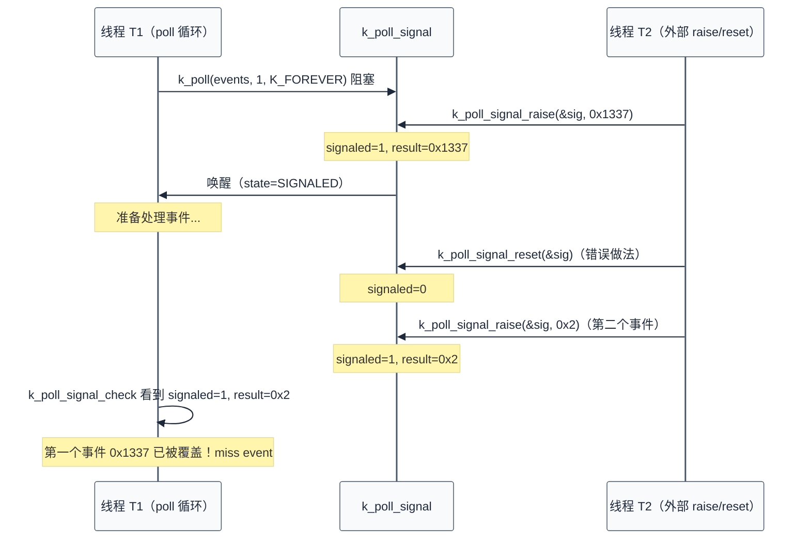
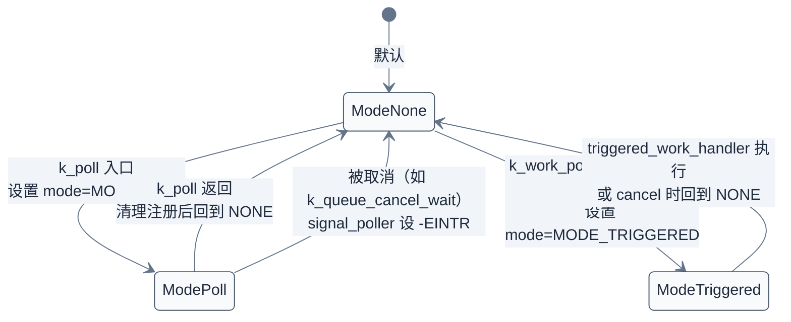
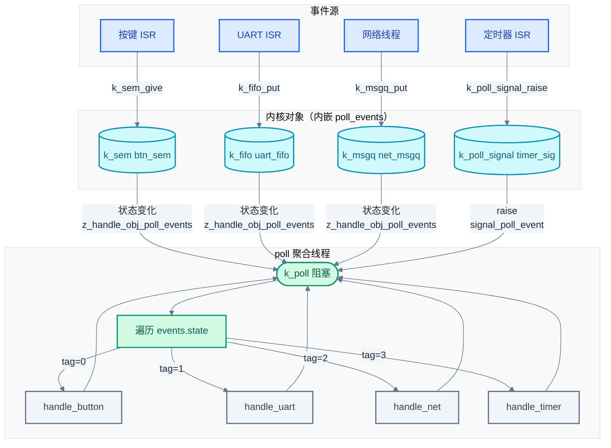

# 18. Poll 事件多路复用

> 一句话概括：本文从一个"单线程同时等待按键、UART、网络消息"的场景出发，剖析 Zephyr `k_poll` 的源码实现、可 poll 对象的统一注册接口、`k_poll_signal` 的"miss event"陷阱、`k_work_poll` 的三态机，以及 `poll.c` 单锁设计的 SMP 工程权衡。
> **工程师视角**：读完后你应当能回答"`k_poll` 与 `k_sem_take` 等阻塞 API 的关键差异在哪"、"`K_POLL_MODE_NOTIFY_ONLY` 为什么是当前唯一模式"、"`k_poll_signal` 何时会丢事件"、"`poll.c` 的单锁设计在 SMP 下为何不是最优"这四个问题，并能为多源事件聚合场景选择合适的同步模式。

> 上一篇 [17-Demand Paging按需分页](./17-Demand Paging按需分页.md) 讲了用户态缺页与按需分页的内存策略。本章把视角从内存管理切回内核同步：当单个线程需要同时等待多个内核对象时，逐个 `k_sem_take`/`k_fifo_get` 阻塞会浪费栈与调度延迟——Zephyr 用 `k_poll` 提供"一线程多对象"的事件多路复用。本文深入 [poll.c](file:///home/pbw/rtos/cs-learning-notes/zephyr-project/zephyr/kernel/poll.c) 源码，澄清 [08-中断与时序](./08-中断与时序.md) §5 中只能概述的细节，并修正一个流传的误解。

### 关键术语

| 缩写 | 全称 | 含义 |
|------|------|------|
| RTOS | Real-Time Operating System | 实时操作系统 |
| ISR | Interrupt Service Routine | 中断服务例程 |
| FIFO | First In First Out | 先进先出队列 |
| API | Application Programming Interface | 应用编程接口 |
| Poll | Polling | 多对象事件等待机制（Zephyr 中实为反向通知） |
| SMP | Symmetric Multi-Processing | 对称多处理 |
| POSIX | Portable Operating System Interface | 可移植操作系统接口 |
| FD | File Descriptor | 文件描述符，POSIX I/O 抽象 |
| epoll | Event Poll | Linux 高效 I/O 多路复用机制 |
| DList | Doubly Linked List | 双向链表（`sys_dlist_t`） |
| RBTree | Red-Black Tree | 红黑树，调度器优先级队列底层 |
| MPSC | Multi-Producer Single-Consumer | 多生产者单消费者 |

---

## 1. 概述：为什么需要 poll

> [08-中断与时序](./08-中断与时序.md) §5 已经从 ISR 通知线程的角度引入了 `k_poll`——一个线程同时等待多个内核对象。本节回答更本质的问题：为什么不直接用多个线程分别等待？为什么不轮询？`k_poll` 的"多路复用"到底复用了什么？

### 1.1 单线程多对象等待的本质

考虑一个嵌入式网关：它要同时监听按键信号量、UART 接收 FIFO、网络消息队列。最直观的写法是开三个线程，每个线程阻塞在一个对象上：

```c
/* 线程 A：等按键 */
while (1) { k_sem_take(&btn_sem, K_FOREVER); handle_btn(); }
/* 线程 B：等 UART */
while (1) { data = k_fifo_get(&uart_fifo, K_FOREVER); handle_uart(data); }
/* 线程 C：等网络 */
while (1) { k_msgq_get(&net_msgq, &msg, K_FOREVER); handle_net(msg); }
```

这种写法可行，但代价是每个线程都需要独立栈（默认 1-2 KB），三个线程就是 3-6 KB——对 RAM 紧张的 MCU 不可忽略。

`k_poll` 提供另一种选择：单线程同时挂到多个对象的等待链上，任一对象就绪即唤醒。这就是"多路复用"——**复用的是线程（栈 + 调度实体）**，把 N 个阻塞点合并到 1 个线程里。

### 1.2 poll 的内部机制：每个对象内嵌 poller 链表

Zephyr 的同步对象（`k_sem`、`k_fifo`、`k_msgq`、`k_pipe`、`k_poll_signal`）内部都嵌入了 `poll_events` 字段——一个 `sys_dlist_t`，记录"正在 poll 这个对象的 poller"。当对象状态变化（如 `k_sem_give`、`k_fifo_put`）时，内核会调用 `z_handle_obj_poll_events(&obj->poll_events, state)` 通知链上 poller。

> **核心要点**：poll 的实现不是"线程定时查询对象状态"，而是"对象状态变化时主动通知 poller"——基于反向通知，而非轮询。这也是它叫 `poll` 但实际语义是 `wait` 的原因。

### 1.3 与 08 章 §5 的关系

[08-中断与时序](./08-中断与时序.md) §5 给出了 `k_poll` 的使用示例和"poll 等待队列是 FIFO"的结论。本章会在第 8 节用源码证明：**poll 等待队列实际是按线程优先级排序的**——这是 08 章的概述与官方文档 [polling.rst](file:///home/pbw/rtos/cs-learning-notes/zephyr-project/zephyr/doc/kernel/services/polling.rst) 都未澄清的细节，本文深入源码后会修正这个误解。

---

## 2. k_poll_event 结构体

> 上一节说明了 poll 的本质是"对象主动通知 poller"。本节剖析承载 poll 请求的核心数据结构 `k_poll_event`——它的字段布局、位域压缩、初始化方式。

### 2.1 字段布局

`k_poll_event` 定义在 [include/zephyr/kernel.h](file:///home/pbw/rtos/cs-learning-notes/zephyr-project/zephyr/include/zephyr/kernel.h#L6596-L6637) 第 6596-6637 行：

```c
struct k_poll_event {
    sys_dnode_t _node;                    /* 链入对象的 poll_events 链表 */
    struct z_poller *poller;              /* 指向发起 poll 的线程内嵌 poller */

    uint32_t tag:8;                       /* 用户自定义标签（API 透明） */
    uint32_t type:_POLL_NUM_TYPES;        /* 事件类型位图（K_POLL_TYPE_xxx） */
    uint32_t state:_POLL_NUM_STATES;      /* 事件状态位图（K_POLL_STATE_xxx） */
    uint32_t mode:1;                      /* 模式（目前仅 NOTIFY_ONLY） */
    uint32_t unused:_POLL_EVENT_NUM_UNUSED_BITS;

    union {
        void *obj;
        struct k_poll_signal *signal;
        struct k_sem *sem;
        struct k_fifo *fifo;
        struct k_queue *queue;
        struct k_msgq *msgq;
        struct k_pipe *pipe;
    };
};
```

字段分两组：
- **公共字段**：`tag`、`type`、`state`、`mode`、`obj`——用户代码读写
- **私有字段**：`_node`、`poller`——内核使用，用户不得触碰

`poller` 指向 [struct z_poller](file:///home/pbw/rtos/cs-learning-notes/zephyr-project/zephyr/include/zephyr/kernel/thread.h#L250-L253)（第 250-253 行）：

```c
struct z_poller {
    bool is_polling;   /* 是否在 poll 等待中 */
    uint8_t mode;      /* POLL_MODE 三态（详见第 7 节） */
};
```

每个 `k_thread` 内嵌一个 `z_poller`，每个 `k_work_poll` 也内嵌一个——这让线程和触发式工作项能复用同一套 poll 基础设施。

### 2.2 位域压缩的工程考量

`type`/`state`/`mode` 用位域而非 `enum`，是为了让整个 `k_poll_event` 在 64 位系统上仍是 16 字节（两个 64 位字：一个 `_node`+`poller`，一个位域字+`obj` 指针）。这在事件数组场景下能减少 cache 占用——4 个事件的数组只占 64 字节，能塞进一条 cache line。

### 2.3 三种初始化方式

| 方式 | 宏/函数 | 编译期/运行期 | 是否设置 tag |
|------|---------|---------------|--------------|
| 静态初始化器 | `K_POLL_EVENT_STATIC_INITIALIZER()` | 编译期 | 是 |
| 运行期初始化器 | `K_POLL_EVENT_INITIALIZER()` | 运行期（C99 复合字面量） | 否（需手动） |
| 运行期初始化函数 | `k_poll_event_init()` | 运行期 | 否（需手动） |

```c
/* 静态初始化：编译期填入事件数组 */
struct k_poll_event events[2] = {
    K_POLL_EVENT_STATIC_INITIALIZER(K_POLL_TYPE_SEM_AVAILABLE,
                                    K_POLL_MODE_NOTIFY_ONLY,
                                    &my_sem, 0),
    K_POLL_EVENT_STATIC_INITIALIZER(K_POLL_TYPE_FIFO_DATA_AVAILABLE,
                                    K_POLL_MODE_NOTIFY_ONLY,
                                    &my_fifo, 0),
};

/* 运行期初始化：tag 需手动赋值 */
k_poll_event_init(&events[0], K_POLL_TYPE_SEM_AVAILABLE,
                  K_POLL_MODE_NOTIFY_ONLY, &my_sem);
events[0].tag = 1;
```

> **核心要点**：`K_POLL_EVENT_STATIC_INITIALIZER` 是唯一能在编译期设置 `tag` 的方式；运行期初始化器为性能选择不显式清零 `tag`，留给用户决定。

---

## 3. 可 poll 的内核对象

> 上一节剖析了 `k_poll_event` 的字段。本节回答：哪些内核对象可以 poll？它们如何统一接入 poll 机制？答案藏在 `is_condition_met()` 这个 switch 分发器里。

### 3.1 五种事件类型

[poll.c](file:///home/pbw/rtos/cs-learning-notes/zephyr-project/zephyr/kernel/poll.c#L63-L104) 第 63-104 行的 `is_condition_met()` 列出了所有可 poll 的对象类型：

| 类型宏 | 等待的对象 | 就绪条件 | state 标志 |
|--------|------------|----------|------------|
| `K_POLL_TYPE_SEM_AVAILABLE` | `k_sem` | `k_sem_count_get() > 0` | `K_POLL_STATE_SEM_AVAILABLE` |
| `K_POLL_TYPE_DATA_AVAILABLE` | `k_queue`/`k_fifo`/`k_lifo` | `!k_queue_is_empty()` | `K_POLL_STATE_FIFO_DATA_AVAILABLE` |
| `K_POLL_TYPE_MSGQ_DATA_AVAILABLE` | `k_msgq` | `used_msgs > 0` | `K_POLL_STATE_MSGQ_DATA_AVAILABLE` |
| `K_POLL_TYPE_PIPE_DATA_AVAILABLE` | `k_pipe` | `!ring_buf_is_empty()` | `K_POLL_STATE_PIPE_DATA_AVAILABLE` |
| `K_POLL_TYPE_SIGNAL` | `k_poll_signal` | `signal->signaled != 0` | `K_POLL_STATE_SIGNALED` |
| `K_POLL_TYPE_IGNORE` | — | 永不就绪（占位） | — |

> **如何读这张表**：前四类是"内核对象有数据/有资源"——poll 仅通知；第五类 `K_POLL_TYPE_SIGNAL` 是"伪对象"——不关联任何数据，仅作为直接信号。`IGNORE` 用于临时跳过某事件，无需重建数组。

### 3.2 统一的注册接口：register_event()

每种可 poll 对象内部都嵌入了 `poll_events` 字段（`sys_dlist_t`）。[register_event](file:///home/pbw/rtos/cs-learning-notes/zephyr-project/zephyr/kernel/poll.c#L136-L169)（第 136-169 行）按 type 分发，把 `k_poll_event` 链入对应对象的 `poll_events` 链表：

```c
switch (event->type) {
case K_POLL_TYPE_SEM_AVAILABLE:
    add_event(&event->sem->poll_events, event, poller);
    break;
case K_POLL_TYPE_DATA_AVAILABLE:
    add_event(&event->queue->poll_events, event, poller);
    break;
/* ... 其他类型同理 ... */
}
event->poller = poller;
```

### 3.3 反向通知：z_handle_obj_poll_events()

当 `k_sem_give`、`k_fifo_put`、`k_msgq_put`、`k_pipe_write` 等修改对象状态时，它们会调用 [z_handle_obj_poll_events](file:///home/pbw/rtos/cs-learning-notes/zephyr-project/zephyr/kernel/poll.c#L460-L473)（第 460-473 行）：

```c
bool z_handle_obj_poll_events(sys_dlist_t *events, uint32_t state)
{
    k_spinlock_key_t key = k_spin_lock(&lock);
    poll_event = (struct k_poll_event *)sys_dlist_get(events);  /* 取链表头 */
    if (poll_event != NULL) {
        (void) signal_poll_event(poll_event, state);  /* 唤醒对应 poller */
    }
    k_spin_unlock(&lock, key);
    return (poll_event != NULL);
}
```

注意：每次只唤醒**一个** poller（链表头）。这是 poll 与信号量广播的关键差异——poll 是单消费通知，不会同时唤醒所有等待者。

> **核心要点**：所有可 poll 对象通过相同的"内嵌 `poll_events` 链表 + `z_handle_obj_poll_events()` 通知"接入 poll 机制。要为新内核对象添加 poll 支持，只需在该对象结构体里嵌入 `poll_events` 字段，并在状态变化处调用 `z_handle_obj_poll_events()`。

---

## 4. k_poll 的使用流程

> 前两节讲了数据结构和注册接口。本节把这些零件串起来，看一次完整的 `k_poll` 调用从入口到唤醒的全过程。

### 4.1 调用流程的编号步骤

1. 应用初始化事件数组（静态或运行期）
2. 调用 `k_poll(events, n, timeout)` 进入 [z_impl_k_poll](file:///home/pbw/rtos/cs-learning-notes/zephyr-project/zephyr/kernel/poll.c#L283-L348)（第 283-348 行）
3. 内核设置 `poller->is_polling = true`、`poller->mode = MODE_POLL`
4. 调用 `register_events()`：对每个事件先 `is_condition_met()` 检查当前是否已就绪
   - 已就绪：`set_event_ready()` 标记 state，并 `poller->is_polling = false`
   - 未就绪：`register_event()` 把事件链入对象的 `poll_events`
5. 检查 `poller->is_polling`：若为 false，说明至少一个事件已就绪，清注册、返回 0
6. 若 `timeout = K_NO_WAIT`：直接返回 `-EAGAIN`
7. 否则调用 `z_pend_curr(&lock, key, &wait_q, timeout)` 挂起当前线程
8. 对象状态变化时调用 `z_handle_obj_poll_events()`，进而 `signal_poller()` 调用 `z_unpend_thread()` + `z_ready_thread()` 唤醒 poller
9. 唤醒后，`z_impl_k_poll` 调用 `clear_event_registrations()` 清理所有注册（已就绪和未就绪都要清）
10. 返回 `swap_rc`（0 表示有事件就绪，`-EAGAIN` 表示超时，`-EINTR` 表示被取消）

### 4.2 简单示例：等待信号量或 FIFO

```c
struct k_sem btn_sem;
struct k_fifo uart_fifo;

/* 编译期初始化事件数组 */
struct k_poll_event events[2] = {
    K_POLL_EVENT_STATIC_INITIALIZER(K_POLL_TYPE_SEM_AVAILABLE,
                                    K_POLL_MODE_NOTIFY_ONLY,
                                    &btn_sem, 0),
    K_POLL_EVENT_STATIC_INITIALIZER(K_POLL_TYPE_FIFO_DATA_AVAILABLE,
                                    K_POLL_MODE_NOTIFY_ONLY,
                                    &uart_fifo, 0),
};

void event_loop(void)
{
    for (;;) {
        int rc = k_poll(events, ARRAY_SIZE(events), K_FOREVER);
        if (rc != 0) {
            continue;  /* K_FOREVER 不会超时 */
        }

        if (events[0].state == K_POLL_STATE_SEM_AVAILABLE) {
            k_sem_take(events[0].sem, K_NO_WAIT);  /* poll 仅通知，需手动取 */
            handle_button();
        }
        if (events[1].state == K_POLL_STATE_FIFO_DATA_AVAILABLE) {
            void *data = k_fifo_get(events[1].fifo, K_NO_WAIT);
            handle_uart(data);
        }

        /* 必须手动重置 state，否则下一轮 poll 立即返回 */
        events[0].state = K_POLL_STATE_NOT_READY;
        events[1].state = K_POLL_STATE_NOT_READY;
    }
}
```

### 4.3 三个易踩的坑

1. **state 必须手动重置**：`k_poll` 返回后，已就绪事件的 `state` 仍是非零。下一轮 poll 前必须清零，否则 `register_events()` 会立即发现"已就绪"并直接返回。

2. **poll 仅通知，不获取**：`events[0].state == K_POLL_STATE_SEM_AVAILABLE` 只代表"调用 `k_poll` 时信号量非空"。等到调用 `k_sem_take()` 时，可能已被其他线程取走——这是 `K_POLL_MODE_NOTIFY_ONLY` 的语义代价（详见第 5 节）。

3. **多个事件可能同时就绪**：`k_poll` 可能在一次返回中报告多个事件就绪。代码必须用 `if` 而非 `else if` 检查每个事件——漏检等于丢事件。

> **核心要点**：`k_poll` 的正确用法是"循环 + 检查所有事件 state + 手动重置"。它不是"事件回调"，而是"事件快照"——调用者必须接受"快照可能已过期"的事实。

---

## 5. K_POLL_MODE_NOTIFY_ONLY：仅通知不获取

> 第 4 节的示例中，`k_poll` 返回后还要手动 `k_sem_take()`。为什么不直接在 poll 内部完成获取？本节回答这个设计选择的动机。

### 5.1 NOTIFY_ONLY 的语义

[include/zephyr/kernel.h](file:///home/pbw/rtos/cs-learning-notes/zephyr-project/zephyr/include/zephyr/kernel.h#L6547-L6553) 第 6547-6553 行 `enum k_poll_modes` 定义：

```c
enum k_poll_modes {
    K_POLL_MODE_NOTIFY_ONLY = 0,  /* 当前唯一公开模式 */
    K_POLL_NUM_MODES,
};
```

[k_poll_event_init](file:///home/pbw/rtos/cs-learning-notes/zephyr-project/zephyr/kernel/poll.c#L43-L60)（第 43-60 行）用断言强制只接受这个模式：

```c
__ASSERT(mode == K_POLL_MODE_NOTIFY_ONLY,
         "only NOTIFY_ONLY mode is supported\n");
```

`NOTIFY_ONLY` 的语义是：**poll 只负责通知"对象状态满足条件"，不修改对象状态**。具体到信号量：poll 返回后，信号量的计数值不变；调用者必须再调一次 `k_sem_take()` 才真正获取。

### 5.2 为什么不自动获取？

考虑两种语义的对比：

| 对比维度 | 自动获取语义 | 仅通知语义（NOTIFY_ONLY） |
|----------|-------------|--------------------------|
| poll 返回时对象状态 | 已被消费（sem 计数减 1） | 不变（仅 state 标记） |
| 多事件同时就绪 | 必须决定获取哪些——内核决策 | 调用者按需选择——应用决策 |
| 调用者代码 | 简单（poll 后直接处理） | 需手动 take/get + 检查返回值 |
| 灵活性 | 低（内核替应用做决定） | 高（应用按业务逻辑响应） |
| 错误恢复 | 难（已获取的对象难"放回"） | 易（未获取，放弃即可） |

`NOTIFY_ONLY` 的设计哲学是"**把并发决策推给应用层**"。内核只提供"最少惊讶"的通知机制，让应用根据业务逻辑决定如何处理——是 `k_sem_take()` 还是放弃、是处理所有事件还是只处理一个。

> **核心要点**：`K_POLL_MODE_NOTIFY_ONLY` 不是"暂未实现的占位符"，而是经过权衡的设计选择。Zephyr 把"事件就绪后如何响应"的语义责任留给应用——这是 RTOS "最少内核、最多应用控制"哲学的体现。

### 5.3 实际后果：竞争窗口

`NOTIFY_ONLY` 的代价是引入竞争窗口：

```c
k_poll(events, n, K_FOREVER);  /* T1: 信号量非空，state 被标记 */
                               /* T2: 另一个线程 k_sem_take 把它取走 */
k_sem_take(&sem, K_NO_WAIT);   /* T3: 返回 -EBUSY！*/
```

应用代码必须处理这种"通知已到但对象已空"的情况——通常用 `if (k_sem_take(...) == 0) { ... }` 而非 `assert(k_sem_take(...) == 0)`。

---

## 6. k_poll_signal：轻量信号与 "miss event" 陷阱

> 第 5 节讲了 `NOTIFY_ONLY` 把并发决策推给应用。本节聚焦一个特殊的"伪对象"——`k_poll_signal`，它没有计数能力，且在使用错误时会**丢事件**。这是 `k_poll` 体系里最易踩坑的地方。

### 6.1 signal 的本质：轻量二元信号量

`k_poll_signal` 定义在 [include/zephyr/kernel.h](file:///home/pbw/rtos/cs-learning-notes/zephyr-project/zephyr/include/zephyr/kernel.h#L6566-L6584) 第 6566-6584 行：

```c
struct k_poll_signal {
    sys_dlist_t poll_events;  /* 内嵌的 poller 链表 */
    unsigned int signaled;    /* 0 或 1——二元，不计数 */
    int result;               /* 用户传入的结果值，poll_signal_raise 设置 */
};
```

它与 `k_sem` 的关键差异：

| 对比维度 | `k_sem` | `k_poll_signal` |
|----------|---------|-----------------|
| 状态 | 计数（≥0 整数） | 二元（0/1） |
| 多次 give/raise | 计数累加 | 后一次覆盖前一次（不累加） |
| 多线程 poll | 支持 | 支持，但单消费通知 |
| 自动获取 | `k_sem_take` 减计数 | 无对应 API，靠 `k_poll_signal_reset` 手动清零 |
| miss event | 不会（计数保留） | 会（外部 reset 会清状态） |

### 6.2 raise 与 reset 的非对称性

[k_poll_signal_raise](file:///home/pbw/rtos/cs-learning-notes/zephyr-project/zephyr/kernel/poll.c#L522-L545)（第 522-545 行）的实现：

```c
int z_impl_k_poll_signal_raise(struct k_poll_signal *sig, int result)
{
    k_spinlock_key_t key = k_spin_lock(&lock);

    sig->result = result;       /* 覆盖式写入 */
    sig->signaled = 1U;         /* 置位，不计数 */

    poll_event = (struct k_poll_event *)sys_dlist_get(&sig->poll_events);
    if (poll_event == NULL) {
        k_spin_unlock(&lock, key);
        return 0;  /* 没 poller，仅置状态——下次 poll 会看到 */
    }

    int rc = signal_poll_event(poll_event, K_POLL_STATE_SIGNALED);
    z_reschedule(&lock, key);
    return rc;
}
```

注意两个细节：
1. `sig->signaled = 1U` 是覆盖式：连续 raise 五次，`signaled` 仍是 1。
2. 只取**一个** poll_event 通知——单消费模式。

[k_poll_signal_reset](file:///home/pbw/rtos/cs-learning-notes/zephyr-project/zephyr/kernel/poll.c#L494-L499)（第 494-499 行）仅把 `signaled` 清零：

```c
void z_impl_k_poll_signal_reset(struct k_poll_signal *sig)
{
    sig->signaled = 0U;
}
```

### 6.3 miss event 的产生场景

[官方文档 polling.rst](file:///home/pbw/rtos/cs-learning-notes/zephyr-project/zephyr/doc/kernel/services/polling.rst#L304-L314) 第 304-314 行明确警告：signal 不是内部同步的，外部 reset 会丢事件。下面的时序图展示了一个典型的 miss event 场景：



> **如何读这张图**：T1 在 poll 中阻塞时收到第一个 raise（result=0x1337）；T2 在 T1 还没读取 result 时调用 reset+raise，导致 0x1337 被 0x2 覆盖。T1 醒来后看到的 result 是 0x2，第一个事件被"miss"了。

### 6.4 正确用法：reset 只在 poll 线程内

[官方推荐](file:///home/pbw/rtos/cs-learning-notes/zephyr-project/zephyr/doc/kernel/services/polling.rst#L310-L314) 的最佳实践是：

```c
/* 正确：reset 只在 poll 循环线程内做 */
for (;;) {
    k_poll(events, 1, K_FOREVER);

    int signaled, result;
    k_poll_signal_check(&signal, &signaled, &result);
    if (signaled) {
        handle_signal(result);
    }

    /* 关键：reset 在 poll 线程内，外部 raise 永不丢已读结果 */
    k_poll_signal_reset(&signal);
    events[0].state = K_POLL_STATE_NOT_READY;
}
```

如果业务确实需要"多生产者都能 raise 且不丢事件"，应改用 `k_sem`（计数）或 `k_fifo`（带数据）——它们天然不丢事件。

> **核心要点**：`k_poll_signal` 适合"单生产者 → 单 poller"的轻量通知场景。多生产者或要求不丢事件的场景，应改用 `k_sem` 或 `k_fifo`——signal 的"miss event"是设计代价，不是 bug。

---

## 7. 三态机：MODE_NONE/MODE_POLL/MODE_TRIGGERED

> 第 6 节讲了 signal 的陷阱。本节转向另一个内部状态机——`z_poller` 的三种 mode。它解释了 `k_poll` 与 `k_work_poll`（触发式工作项）为何能共用同一套 poll 基础设施。

### 7.1 三态机的来源

[poll.c](file:///home/pbw/rtos/cs-learning-notes/zephyr-project/zephyr/kernel/poll.c#L38) 第 38 行定义了一个**内部**枚举（不在公共 API 中）：

```c
enum POLL_MODE { MODE_NONE, MODE_POLL, MODE_TRIGGERED };
```

它属于 `struct z_poller`（每个线程内嵌一个，每个 `k_work_poll` 也内嵌一个）。这个 mode 决定了"事件就绪时该如何唤醒 poller"。



> **如何读这张图**：mode 决定 poller 当前角色——`MODE_POLL` 是"线程自己阻塞等"（同步 poll），`MODE_TRIGGERED` 是"工作项被提交到工作队列"（异步触发）。两者复用同一套事件注册机制。

### 7.2 三种 mode 的语义

| Mode | 设置者 | 含义 | 事件就绪时的动作 |
|------|--------|------|------------------|
| `MODE_NONE` | 初始态/清理后 | 空闲，不在 poll | 无动作 |
| `MODE_POLL` | `z_impl_k_poll` | 同步 poll 中 | `signal_poller()`：`z_unpend_thread` + `z_ready_thread` |
| `MODE_TRIGGERED` | `k_work_poll_submit_to_queue` | 异步触发式工作项 | `signal_triggered_work()`：提交 `k_work_poll` 到工作队列 |

[signal_poll_event](file:///home/pbw/rtos/cs-learning-notes/zephyr-project/zephyr/kernel/poll.c#L433-L458)（第 433-458 行）根据 mode 分发：

```c
if (poller->mode == MODE_POLL) {
    retcode = signal_poller(event, state);          /* 同步唤醒 */
} else if (poller->mode == MODE_TRIGGERED) {
    retcode = signal_triggered_work(event, state);  /* 异步提交 */
}
```

### 7.3 为什么需要 MODE_TRIGGERED？

考虑这个场景：ISR 中收到一个事件，想"延迟到工作队列处理"，但事件源是 `k_poll` 监听的对象（如 FIFO）。两种方案：

- **方案 A**：ISR 触发线程，线程 `k_poll` 后 `k_work_submit`——两跳，延迟高
- **方案 B**：直接让 `k_work_poll` 在事件就绪时被自动提交——一跳，延迟低

`MODE_TRIGGERED` 实现了方案 B。[k_work_poll_submit_to_queue](file:///home/pbw/rtos/cs-learning-notes/zephyr-project/zephyr/kernel/poll.c#L661-L772)（第 661-772 行）注册事件后，把 mode 设为 `MODE_TRIGGERED`；事件就绪时，[signal_triggered_work](file:///home/pbw/rtos/cs-learning-notes/zephyr-project/zephyr/kernel/poll.c#L601-L616)（第 601-616 行）直接 `z_work_submit_to_queue(work_q, &twork->work)`，跳过"先唤醒线程再提交"的中间步骤。

> **核心要点**：`MODE_POLL` 与 `MODE_TRIGGERED` 共用事件注册/通知基础设施，区别仅在"就绪时如何唤醒"。前者同步唤醒线程，后者异步提交工作项——这是 Zephyr 把 poll 机制从"线程模型"扩展到"工作队列模型"的关键设计。

---

## 8. 源码剖析：单锁 vs per-event 锁的工程权衡

> 第 7 节展示了 poll 机制的精巧状态机。本节聚焦一个看似平淡但极具工程教育意义的细节——`poll.c` 用一把全局 `static k_spinlock lock` 保护所有 poll 相关数据。源码注释自承这是"SMP 下的次优选择"，但为简化放弃了 per-event 锁。本节还会在第 8.5 节用源码证据修正"poll 等待队列是 FIFO"的流传说法。

### 8.1 单锁的事实

[poll.c](file:///home/pbw/rtos/cs-learning-notes/zephyr-project/zephyr/kernel/poll.c#L29-L36) 第 29-36 行的开篇注释：

```c
/* Single subsystem lock.  Locking per-event would be better on highly
 * contended SMP systems, but the original locking scheme here is
 * subtle (it relies on releasing/reacquiring the lock in areas for
 * latency control and it's sometimes hard to see exactly what data is
 * "inside" a given critical section).  Do the synchronization port
 * later as an optimization.
 */
static struct k_spinlock lock;
```

这把锁保护的范围：
- 所有 `k_poll_signal` 的 `poll_events` 链表
- 所有 `k_sem`/`k_fifo`/`k_msgq`/`k_pipe` 的 `poll_events` 链表
- 所有 `k_poll_event` 的 `state`/`poller` 字段
- poller 的 `is_polling`/`mode` 字段
- poll 的全局 `wait_q`

### 8.2 为什么单锁"次优"？

在 SMP 系统上，假设核心 0 的线程在 poll 一个信号量，核心 1 的线程在 poll 另一个 FIFO。两个对象的 `poll_events` 完全独立，理论上可以并行操作。但单锁强制它们串行——任一核心进入 `k_poll_signal_raise` 或 `z_handle_obj_poll_events`，另一核心必须自旋等待。

per-event 锁的好处是每个对象用自己的 spinlock，不同对象的 poll 操作可并行。但代价是：

| 维度 | 单锁 | per-event 锁 |
|------|------|--------------|
| 并行度 | 低（所有 poll 操作串行） | 高（不同对象可并行） |
| 临界区数量 | 1 个全局 | 每对象 1 个 |
| 死锁风险 | 无（只有一把锁） | 高（多事件 poll 时需排序加锁） |
| 代码复杂度 | 低 | 高（跨对象操作需小心） |
| 内存开销 | 1 个 spinlock | 每对象 1 个 spinlock |

### 8.3 注释里的工程智慧

注释中的"the original locking scheme here is subtle"道出了核心困难：`k_poll` 的临界区不是连续的——它会在循环里**释放再重新获取**锁：

```c
/* register_events 里的释放/重获模式（poll.c 第 236-255 行） */
for (int ii = 0; ii < num_events; ii++) {
    key = k_spin_lock(&lock);
    /* 注册或检查 events[ii] */
    k_spin_unlock(&lock, key);  /* 释放，允许 ISR/其他核介入 */
}
```

[clear_event_registrations](file:///home/pbw/rtos/cs-learning-notes/zephyr-project/zephyr/kernel/poll.c#L211-L221)（第 211-221 行）也有类似模式：

```c
while (num_events--) {
    clear_event_registration(&events[num_events]);
    k_spin_unlock(&lock, key);   /* 每个事件后释放 */
    key = k_spin_lock(&lock);    /* 重新获取 */
}
```

为什么释放-重获？为了**降低中断延迟**——长时间持锁会阻止 ISR 处理。这是 RTOS 的硬约束：宁可多花点锁开销，也不能让 ISR 等太久。

如果把单锁改为 per-event 锁，这种"释放-重获"模式的语义会变得极其复杂——每个事件对应不同锁，跨事件的释放顺序需要谨慎设计，否则可能死锁。注释说"it's sometimes hard to see exactly what data is inside a given critical section"，正是这个意思。

### 8.4 真实工程的取舍

`poll.c` 的注释是真实工程权衡的范本：

1. **承认不完美**：注释直说"per-event would be better on highly contended SMP"
2. **解释为何不修**：原始加锁方案"subtle"，重写有风险
3. **标记为优化项**：`Do the synchronization port later as an optimization`

这种"先正确、后优化"的工程哲学与 [12-内存管理](./12-内存管理.md)、[16-SMP多核支持](./16-SMP多核支持.md) 中讨论的"粗粒度锁先行"一致。在 SMP 紧迫性不高的早期 RTOS 阶段，单锁的正确性远比 per-event 锁的并行性重要。

> **核心要点**：`poll.c` 的单锁不是疏忽，而是"正确性优先、并行性其次"的工程权衡。注释坦诚承认 SMP 下的次优性，但指出"重写风险"高于"性能收益"。这是 RTOS 内核代码的典型权衡——可读性、可维护性、低延迟、SMP 并行性四者权衡中，SMP 并行性常被牺牲。

### 8.5 顺带修正：poll 等待队列是优先级排序，不是 FIFO

[08-中断与时序](./08-中断与时序.md) §5.2 末尾称"poll 的等待队列是 FIFO（先来先服务），不是按线程优先级"——这其实是个流传的误解。[polling.rst](file:///home/pbw/rtos/cs-learning-notes/zephyr-project/zephyr/doc/kernel/services/polling.rst#L145-L148) 第 145-148 行也这样说，但源码不是这样。

[add_event](file:///home/pbw/rtos/cs-learning-notes/zephyr-project/zephyr/kernel/poll.c#L111-L133)（第 111-133 行）明确按优先级插入：

```c
static inline void add_event(sys_dlist_t *events, struct k_poll_event *event,
                             struct z_poller *poller)
{
    struct k_poll_event *pending;

    pending = (struct k_poll_event *)sys_dlist_peek_tail(events);
    /* 若 tail 优先级高于新 poller，或链表空，则追加到尾 */
    if ((pending == NULL) ||
        (z_sched_prio_cmp(poller_thread(pending->poller),
                          poller_thread(poller)) > 0)) {
        sys_dlist_append(events, &event->_node);
        return;
    }

    /* 否则从头遍历，找到第一个优先级低于新 poller 的，插入其前 */
    SYS_DLIST_FOR_EACH_CONTAINER(events, pending, _node) {
        if (z_sched_prio_cmp(poller_thread(poller),
                             poller_thread(pending->poller)) > 0) {
            sys_dlist_insert(&pending->_node, &event->_node);
            return;
        }
    }

    sys_dlist_append(events, &event->_node);
}
```

[z_sched_prio_cmp](file:///home/pbw/rtos/cs-learning-notes/zephyr-project/zephyr/kernel/include/priority_q.h#L68-L107)（第 68-107 行）的语义在注释中明确：

```c
/*
 * Return value same as e.g. memcmp
 * > 0 -> thread 1 priority  > thread 2 priority
 * = 0 -> thread 1 priority == thread 2 priority
 * < 0 -> thread 1 priority  < thread 2 priority
 */
static ALWAYS_INLINE int32_t z_sched_prio_cmp(struct k_thread *thread_1,
                                              struct k_thread *thread_2)
{
    int32_t b1 = thread_1->base.prio;
    int32_t b2 = thread_2->base.prio;
    if (b1 != b2) {
        return b2 - b1;  /* Zephyr 中 prio 数值越小优先级越高 */
    }
    /* ... deadline 比较 ... */
}
```

`z_sched_prio_cmp(a, b) > 0` 表示 a 的优先级**高于** b（a 的 prio 数值更小）。代入 `add_event` 的逻辑：

- 第一次 if：若 tail 的优先级高于新 poller（或链表空），追加到尾——新 poller 是当前最低优先级
- 遍历：找到第一个优先级**低于**新 poller 的 pending，插入其前——保持 head=最高优先级
- 兜底：若所有 pending 优先级都更高，追加到尾

链表始终按**线程优先级降序**排列，head 是最高优先级 poller。

[z_handle_obj_poll_events](file:///home/pbw/rtos/cs-learning-notes/zephyr-project/zephyr/kernel/poll.c#L460-L473)（第 460-473 行）取链表头：

```c
poll_event = (struct k_poll_event *)sys_dlist_get(events);  /* 取 head = 最高优先级 */
```

因此 poller 的唤醒顺序是**优先级排序**，不是 FIFO。这与 `k_sem`/`k_fifo` 等待队列的优先级排序行为一致——poll 没有特殊化。

> **待确认**：官方文档 [polling.rst](file:///home/pbw/rtos/cs-learning-notes/zephyr-project/zephyr/doc/kernel/services/polling.rst#L145-L148) 第 145-148 行称"waiters will be served in first-come-first-serve order, not in priority order"，但源码 `add_event` 明确按优先级插入。08 章 §5 沿用了文档说法。本文以源码为准——这是深入源码而非仅读文档的价值所在。

> **核心要点**：`k_poll` 的等待队列按线程优先级排序（与 `k_sem`/`k_fifo` 的等待队列一致），不是 FIFO。polling.rst 与 08 章的 FIFO 说法是文档与代码不同步的产物。

---

## 9. 实战：多源事件聚合

> 第 8 节澄清了源码细节。本节把前面所有知识综合到一个真实场景——嵌入式网关的事件聚合线程，看如何用 `k_poll` 把多个数据源合并到一个线程里。

### 9.1 场景描述

设计一个网关线程，需要处理：
- 按键中断（ISR 把信号量 give）
- UART 接收（ISR 把数据 put 到 FIFO）
- 网络消息（其他线程把消息 put 到 msgq）
- 周期采样定时器（ISR raise signal）

### 9.2 完整实现

```c
#include <zephyr/kernel.h>

/* 四个事件源 */
struct k_sem       btn_sem;
struct k_fifo      uart_fifo;
struct k_msgq      net_msgq;
struct k_poll_signal timer_sig;

/* 事件数组（编译期初始化，用 tag 区分事件源） */
struct k_poll_event events[4] = {
    K_POLL_EVENT_STATIC_INITIALIZER(K_POLL_TYPE_SEM_AVAILABLE,
                                    K_POLL_MODE_NOTIFY_ONLY,
                                    &btn_sem, 0),
    K_POLL_EVENT_STATIC_INITIALIZER(K_POLL_TYPE_FIFO_DATA_AVAILABLE,
                                    K_POLL_MODE_NOTIFY_ONLY,
                                    &uart_fifo, 1),
    K_POLL_EVENT_STATIC_INITIALIZER(K_POLL_TYPE_MSGQ_DATA_AVAILABLE,
                                    K_POLL_MODE_NOTIFY_ONLY,
                                    &net_msgq, 2),
    K_POLL_EVENT_STATIC_INITIALIZER(K_POLL_TYPE_SIGNAL,
                                    K_POLL_MODE_NOTIFY_ONLY,
                                    &timer_sig, 3),
};

void gateway_loop(void *p1, void *p2, void *p3)
{
    struct net_msg msg;

    for (;;) {
        int rc = k_poll(events, ARRAY_SIZE(events), K_FOREVER);
        if (rc != 0) {
            continue;
        }

        /* 用 tag 区分事件源，便于扩展 */
        for (int i = 0; i < ARRAY_SIZE(events); i++) {
            if (events[i].state == K_POLL_STATE_NOT_READY) {
                continue;
            }

            switch (events[i].tag) {
            case 0:  /* 按键 */
                if (k_sem_take(events[i].sem, K_NO_WAIT) == 0) {
                    handle_button();
                }
                break;
            case 1:  /* UART：一次取空，减少 poll 调用 */
                while (true) {
                    void *data = k_fifo_get(events[i].fifo, K_NO_WAIT);
                    if (data == NULL) break;
                    handle_uart(data);
                }
                break;
            case 2:  /* 网络：同样取空 */
                while (k_msgq_get(events[i].msgq, &msg, K_NO_WAIT) == 0) {
                    handle_net(&msg);
                }
                break;
            case 3:  /* 定时器：signal 必须手动 reset */
                handle_timer(events[i].signal->result);
                k_poll_signal_reset(events[i].signal);
                break;
            }

            events[i].state = K_POLL_STATE_NOT_READY;  /* 必须手动重置 */
        }
    }
}
```

### 9.3 关键设计决策

1. **用 `tag` 区分事件源**：避免依赖事件在数组中的位置，便于将来插入新事件。

2. **FIFO/msgq 用 while 循环取空**：`k_poll` 只通知"有数据"，可能多条。一次性取空，减少 poll 调用次数。

3. **signal 单独 reset**：第 6 节强调过——signal 的 reset 必须在 poll 线程内做，否则丢事件。

4. **`k_sem_take` 检查返回值**：第 5 节强调过——`NOTIFY_ONLY` 语义下，信号量可能已被其他线程取走，不能假设 take 成功。

### 9.4 多源事件流的整体视图



> **如何读这张图**：四个事件源各自修改对应的内核对象；对象状态变化触发 `z_handle_obj_poll_events`，唤醒 poll 线程；poll 线程按 tag 分发到不同 handler。所有事件源共用一个线程栈，节省 3 个线程的栈空间。

---

## 10. 与 POSIX poll/epoll 对比

> 第 9 节展示了 Zephyr `k_poll` 的实战用法。本节把它与读者可能更熟悉的 POSIX `poll()`/`epoll` 对比——理解差异能帮助从 Linux 背景转到 RTOS 的工程师避免误用。

### 10.1 对比表

| 对比维度 | Zephyr `k_poll` | POSIX `poll()` | Linux `epoll` |
|----------|----------------|----------------|---------------|
| 等待对象 | 内核对象（sem/FIFO/msgq/pipe/signal） | 文件描述符（FD） | FD |
| 事件源数量 | 数组传入，无内置上限 | 数组传入，无内置上限 | 内部红黑树，支持海量 FD |
| 触发方式 | 边沿（仅通知一次，需手动 reset state） | 水平（持续返回就绪） | 支持边沿（ET）和水平（LT） |
| 自动获取 | 否（NOTIFY_ONLY） | 否（仅返回 revents） | 否（仅返回就绪事件） |
| 跨线程共享 | 一个对象通常被一个 poller poll | FD 可被多进程共享 | FD 可被多进程共享 |
| 内部数据结构 | 每对象 `sys_dlist_t`（按优先级排序） | 内核遍历 FD 表 | 红黑树 + 就绪链表 |
| 唤醒顺序 | 优先级排序 | FD 数组顺序 | 就绪链表顺序 |
| API 复杂度 | 简单（一个函数） | 简单（一个函数） | 复杂（create/ctl/wait 三件套） |

### 10.2 关键差异

1. **作用域**：`poll()` 操作 FD（统一 I/O 抽象），`k_poll` 操作内核对象（sem/FIFO 等）。这是 RTOS 与通用 OS 抽象层级的差异——RTOS 没有"一切皆文件"的传统。

2. **触发模型**：`k_poll` 是边沿触发——state 必须手动重置，否则下一次 poll 仍会报告就绪。POSIX `poll()` 是水平触发——只要 FD 仍有数据可读，每次调用都返回就绪。`epoll` 两种都支持。

3. **单消费限制**：[polling.rst](file:///home/pbw/rtos/cs-learning-notes/zephyr-project/zephyr/doc/kernel/services/polling.rst#L325-L331) 第 325-331 行明确：`k_poll` 设计假设"单线程作为多个对象的服务器/调度器"。如果一个对象被多个线程 poll，`z_handle_obj_poll_events` 只唤醒一个 poller（按优先级），其他 poller 不会被通知。POSIX `poll()` 没这个限制。

4. **返回值含义**：
   - `k_poll` 返回 0：至少一个事件就绪（哪些需遍历数组检查 state）
   - `poll()` 返回就绪 FD 数（具体哪些需检查 revents）
   - `epoll_wait` 返回就绪事件数（直接给出事件数组）

> **核心要点**：`k_poll` 借鉴了 `poll()` 的"多路复用等待"思想，但语义完全不同——它是 RTOS 内核对象的通知机制，不是 I/O 多路复用。把它当成"轻量版 epoll"会误用其语义（特别是边沿触发和单消费限制）。

---

## 11. 总结

> **核心要点**：
> 1. `k_poll` 是单线程多对象等待机制，复用的是线程（栈 + 调度实体），不是 CPU。
> 2. 实现基于反向通知——对象状态变化时主动唤醒 poller，而非线程轮询。
> 3. `K_POLL_MODE_NOTIFY_ONLY` 是经过权衡的设计，把"事件如何响应"的决策权留给应用层。
> 4. `k_poll_signal` 是轻量二元信号，外部 reset 会丢事件；多生产者场景应改用 `k_sem` 或 `k_fifo`。
> 5. 三态机 `MODE_NONE/MODE_POLL/MODE_TRIGGERED` 让 poll 基础设施同时服务同步线程和异步工作项。
> 6. `poll.c` 的单锁是"正确性优先"的工程权衡，源码注释自承 SMP 下次优。
> 7. **poll 等待队列按线程优先级排序**，不是 FIFO——这是 08 章与官方文档的说法与源码不符之处。

---

## 参考资料

- [Polling API 官方文档](file:///home/pbw/rtos/cs-learning-notes/zephyr-project/zephyr/doc/kernel/services/polling.rst) — Concepts / Implementation / Suggested Uses
- [kernel/poll.c](file:///home/pbw/rtos/cs-learning-notes/zephyr-project/zephyr/kernel/poll.c) — poll 核心实现（810 行）
- [include/zephyr/kernel.h](file:///home/pbw/rtos/cs-learning-notes/zephyr-project/zephyr/include/zephyr/kernel.h) — `k_poll_event`/`k_poll_signal` 结构体与 API 声明（第 6464-6800 行）
- [include/zephyr/kernel/thread.h](file:///home/pbw/rtos/cs-learning-notes/zephyr-project/zephyr/include/zephyr/kernel/thread.h) — `struct z_poller` 定义（第 250-253 行）
- [kernel/include/priority_q.h](file:///home/pbw/rtos/cs-learning-notes/zephyr-project/zephyr/kernel/include/priority_q.h) — `z_sched_prio_cmp` 优先级比较函数（第 68-107 行）
- [08-中断与时序 §5](./08-中断与时序.md) — poll 机制概述（本文是其源码深入版）
- [07-同步机制详解](./07-同步机制详解.md) — `k_sem`/`k_mutex` 等同步原语，poll 与之的对比基础
- [09-工作队列与延迟处理](./09-工作队列与延迟处理.md) — `k_work_poll` 触发式工作项基于本文的 `MODE_TRIGGERED`
- [10-数据传递机制](./10-数据传递机制.md) — FIFO/msgq/pipe 的实现，本文是其 poll 接入视角

## 下一篇

[19-无锁数据结构深入](./19-无锁数据结构深入.md) — 本文反复提到 `poll.c` 的单锁设计在 SMP 下是次优选择，注释自承"per-event 锁会更利于并行"。下一篇剖析 Zephyr 内核中已有的无锁数据结构——`sys_sflist` 的 MPSC 变体、原子操作的内存序、`ring_buf` 的 SPSC 无锁实现——看它们如何在没有锁的前提下保证并发安全，以及为什么 `poll.c` 暂未采用这些技术。
