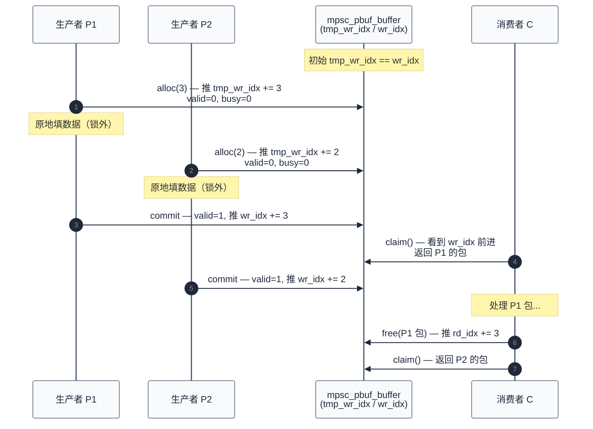
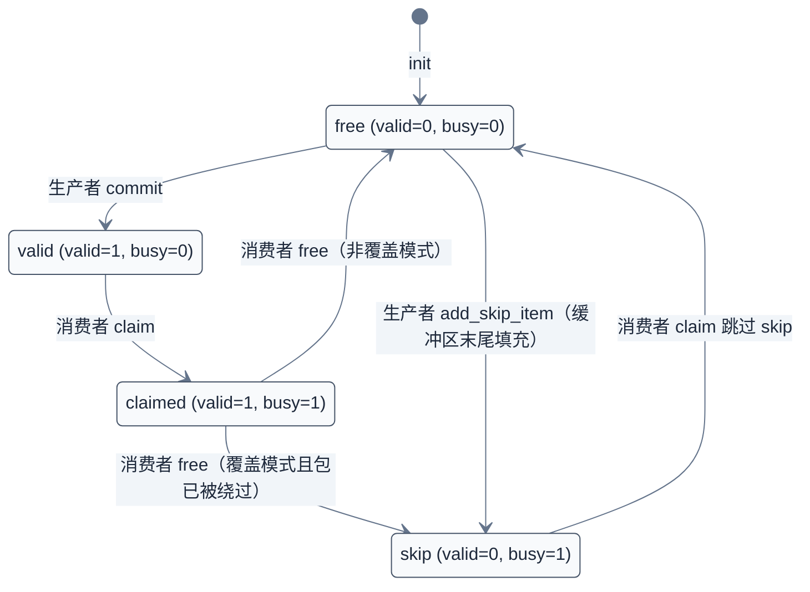
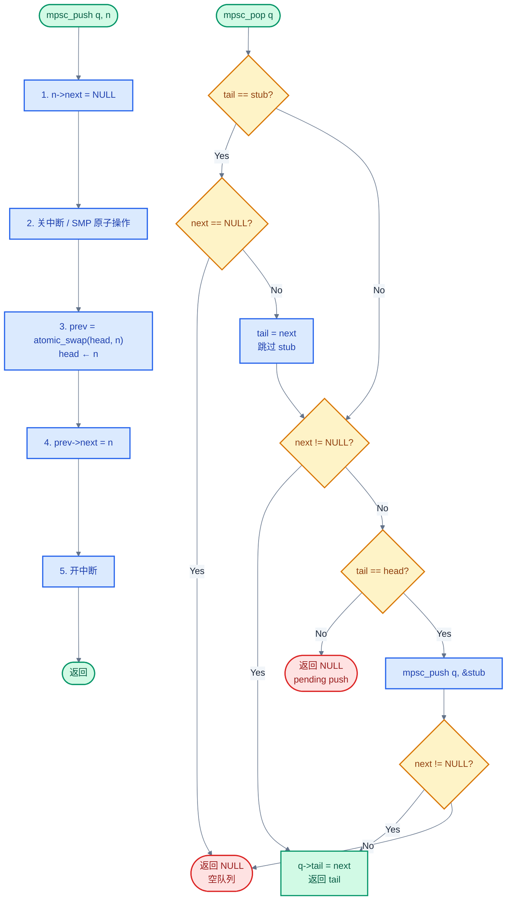

# 19. 无锁数据结构深入

> 一句话概括：本文从 [11 章核心数据结构](./11-核心数据结构.md) 介绍过的 MPSC/SPSC 包缓冲与无锁队列切入，深入到 Zephyr 源码实现细节——2 bit 包头状态机、两步生产/消费的零拷贝语义、busy 位与 overwrite 策略的边界处理、跨核 cache 一致性、Vyukov 算法的 atomic swap 路径——让你能直接读懂 `lib/os/mpsc_pbuf.c`、`lib/os/spsc_pbuf.c`、`include/zephyr/sys/mpsc_lockfree.h`。
> **工程师视角**：读完后应能回答"为什么 mpsc_pbuf 要用 4 个索引而非 2 个"、"busy 位在覆盖路径上如何防止正在消费的包被改写"、"Vyukov 算法为何只用一次 atomic swap 就能把多生产者竞争串成链"、"spsc_pbuf 跨核时为何要把读写索引分到不同 cache 行"这四个问题。

### 关键术语

| 缩写 | 全称 | 含义 |
|------|------|------|
| RTOS | Real-Time Operating System | 实时操作系统 |
| MPSC | Multi-Producer Single-Consumer | 多生产者单消费者 |
| SPSC | Single-Producer Single-Consumer | 单生产者单消费者 |
| ISR | Interrupt Service Routine | 中断服务例程 |
| SMP | Symmetric Multi-Processing | 对称多处理 |
| CAS | Compare-And-Swap | 比较并交换，原子操作原语 |
| IPC | Inter-Process Communication | 进程间/核间通信 |
| IPI | Inter-Processor Interrupt | 核间中断 |
| RTIO | Real-Time I/O | Zephyr 实时 I/O 子系统 |
| DMA | Direct Memory Access | 直接内存访问 |
| RAM | Random Access Memory | 随机存取存储器 |
| FIFO | First-In First-Out | 先进先出 |
| CPU | Central Processing Unit | 中央处理器 |

---

### 前置阅读

| 需要了解 | 参考文档 |
|----------|----------|
| 侵入式数据结构与无锁队列基本概念 | [11-核心数据结构](./11-核心数据结构.md) |
| 自旋锁与原子操作底层 | [07-同步机制详解](./07-同步机制详解.md) |
| 中断上下文约束 | [08-中断与时序](./08-中断与时序.md) |
| SMP 内存序问题 | [16-SMP多核支持](./16-SMP多核支持.md) |

---

## 1. 概述：无锁编程的挑战与 Zephyr 的选择

> 上一篇 [18-Poll事件多路复用](./18-Poll事件多路复用.md) 解决了"一个线程如何同时等待多路 I/O 就绪"的问题，核心是 `k_poll` 把等待方从"轮询"转向"被通知"。但被通知之后，数据如何从多个 ISR/核/线程安全、零拷贝地汇聚到一个消费者？这正是无锁数据结构要回答的问题。本章先讲清无锁编程的难点与 Zephyr 的两条技术路线——包缓冲（pbuf）与无锁链表（lockfree）——再逐节深入源码。

### 1.1 无锁编程的三个难点

无锁（lock-free）数据结构不是"不加锁"，而是"用原子操作 + 内存序让多线程在不互斥阻塞的前提下安全推进"。在 RTOS 内核里它要解决三个具体难点：

1. **ISR 上下文不能用锁**——ISR 中不能 spin 等锁，也不能 sleep。多 ISR 向同一队列提交数据时，必须用原子操作或一次性关闭中断的临界区，而不是 `k_mutex`。
2. **多核 cache 一致性**——跨核共享数据时，写者改了变量后必须刷 cache 让另一核可见；读者读前必须失效 cache 拿最新值。否则会读到旧 cache 行的脏数据。
3. **ABA 与半填可见**——多个生产者竞争同一写索引时，可能出现"读到半填数据"、"同一地址被两次分配"等问题。Zephyr 用"两阶段提交（alloc/commit）"让消费者永远只看到完整包。

### 1.2 Zephyr 的两条路线

[11 章核心数据结构](./11-核心数据结构.md) §5-§6 已经介绍了 4 个并发队列的基本概念。本篇深入源码，把它们分成两条技术路线对照：

| 对比维度 | 包缓冲（pbuf）路线 | 无锁链表（lockfree）路线 |
|----------|--------------------|--------------------------|
| 代表实现 | `mpsc_pbuf`、`spsc_pbuf` | `struct mpsc`、`struct spsc` |
| 存储介质 | 用户提供的一段连续 32 位字数组 | 用户对象内嵌的链表节点 |
| 同步方式 | `mpsc` 用 `k_spinlock`；`spsc` 用 cache 行隔离 + 屏障 | `mpsc` 用 atomic swap；`spsc` 用原子索引 |
| 包长度 | 变长（用户 header + 数据） | 定长（按节点） |
| 零拷贝 | 是（alloc 返回缓冲区内指针） | 是（节点内嵌在用户对象） |
| 典型用途 | 日志、事件收集、跨核 IPC | RTIO 提交/完成队列、ISR→thread 系统调用 |

> **如何读这张表**：第一行的"存储介质"决定了所有后续差异。pbuf 路线用一段连续数组，所以能用 `memcpy` 批量搬运、能装变长包，但需要包头标志位来管理状态。lockfree 路线用链表节点，所以天然变长无界，但每个对象必须内嵌节点字段。两条路线在 Zephyr 里并存，是因为它们服务的场景不同——日志需要变长包，RTIO 需要无界提交。

> **核心要点**：本篇与 [11 章核心数据结构](./11-核心数据结构.md) §5-§6 不重复——11 章只讲基本概念与 API 表，本篇深入到 4 索引状态机、busy 位覆盖路径、Vyukov 算法的 atomic swap 串链细节、跨核 cache 维护时序。

---

## 2. MPSC_PBUF：变长包环形缓冲

> 上一章概述了 Zephyr 的两条无锁路线。本章先聚焦包缓冲路线里最复杂的一个——`mpsc_pbuf`，它要在"多 ISR 同时提交变长包 + 单消费者异步处理 + 缓冲区满时按策略丢弃"三个约束下做到正确且零拷贝。源码在 [lib/os/mpsc_pbuf.c](file:///home/pbw/rtos/cs-learning-notes/zephyr-project/zephyr/lib/os/mpsc_pbuf.c) 与 [include/zephyr/sys/mpsc_pbuf.h](file:///home/pbw/rtos/cs-learning-notes/zephyr-project/zephyr/include/zephyr/sys/mpsc_pbuf.h)。

### 2.1 数据结构：4 个索引 + 内置自旋锁

源码 [include/zephyr/sys/mpsc_pbuf.h](file:///home/pbw/rtos/cs-learning-notes/zephyr-project/zephyr/include/zephyr/sys/mpsc_pbuf.h#L90-L128) 定义：

```c
struct mpsc_pbuf_buffer {
    uint32_t tmp_wr_idx;             /* 临时写索引：alloc 时推进，commit 前消费者不可见 */
    uint32_t wr_idx;                 /* 提交写索引：commit 时同步自 tmp_wr_idx，消费者据此判断可读 */
    uint32_t tmp_rd_idx;             /* 临时读索引：claim 时推进，free 前生产者不可复用 */
    uint32_t rd_idx;                 /* 提交读索引：free 时同步自 tmp_rd_idx，生产者据此判断可写 */
    uint32_t flags;                  /* MPSC_PBUF_MODE_OVERWRITE / MPSC_PBUF_FULL 等 */
    struct k_spinlock lock;          /* 保护多生产者竞争（ISR 安全） */
    mpsc_pbuf_notify_drop notify_drop;
    mpsc_pbuf_get_wlen get_wlen;     /* 用户回调：根据包头算字长 */
    uint32_t *buf;                   /* 32 位字缓冲区，由用户提供 */
    uint32_t size;                   /* 缓冲区字数 */
    uint32_t max_usage;
    struct k_sem sem;                /* alloc 阻塞唤醒用 */
};
```

**关键设计**：4 个索引而非教科书的 2 个。`tmp_*` 是"工作索引"，`*_idx` 是"提交索引"。两者分离让生产者与消费者在"未完成"状态下不互相干扰：

- 生产者 `alloc` 推 `tmp_wr_idx`，但 `wr_idx` 不动——消费者只看 `wr_idx`，因此永远看不到半填数据
- 消费者 `claim` 推 `tmp_rd_idx`，但 `rd_idx` 不动——生产者只看 `rd_idx`，因此不会复用正在消费的包

**为什么 4 个而不是 2 个？** 因为"分配"和"提交"是两个独立的临界区退出点。如果只有 2 个索引，生产者在 `alloc` 时就得推进 `wr_idx`，但此时数据还没填——消费者立刻能看到这个包并读到未初始化内容。4 索引让"预留空间"和"数据就绪"两个事件分两次发布，消费者只在第二次（`commit`）后才看到包。

### 2.2 与 11 章 §5.2 的关系

[11 章核心数据结构](./11-核心数据结构.md) §5.2 只列了 4 个索引的字段名与"两阶段提交"的一句话说明，本篇深入到 4 索引如何配合 `k_spinlock` 与 `k_sem` 完成正确的并发推进——这是日志后端在多 ISR 高频提交下不丢半填数据的根基。

> **核心要点**：`mpsc_pbuf` 用 4 个索引把"预留空间"与"数据就绪"解耦——`tmp_wr_idx/wr_idx` 之间是生产者的"草稿区"，`tmp_rd_idx/rd_idx` 之间是消费者的"消费区"。这个设计让多生产者可以并发 `alloc` 而不互相看见半填数据，是 Zephyr 日志后端能在 ISR 中安全提交变长日志的根本原因。

> **设计洞察**：4 索引的"两阶段提交"是分布式系统 Two-Phase Commit (2PC) 在单机数据结构的微缩投影——`tmp_wr_idx` 是 "prepare" 阶段（预留资源），`wr_idx` 是 "commit" 阶段（对外可见）。数据库用 2PC 解决跨节点原子提交，`mpsc_pbuf` 用同样的模式解决跨上下文（ISR vs thread）的"半填可见"问题。
>
> 这个设计的体系结构根源是：内存写操作对其他核/上下文不是瞬时可见的。如果在 `alloc` 时就推 `wr_idx`，写入数据与推进索引之间会出现"窗口"——消费者看到索引前进，立刻读数据，但写入还没生效。这等价于数据库的"读到未提交数据"（dirty read）。4 索引让"索引推进"和"数据可见"成为原子事件——这正是 RCU（Read-Copy-Update）的 grace period 思想：发布者完成所有准备后才让读者看到引用。
>
> Linux 内核的 `kfifo` 没有这层设计，因为 `kfifo` 用 `smp_wmb()` 内存屏障 + 单索引推进即可——单生产者无竞争。`mpsc_pbuf` 必须用 4 索引，是因为多生产者在 `alloc` 阶段就要竞争 `tmp_wr_idx`，但又不希望竞争结果对消费者可见。把"竞争"和"可见性"解耦到不同索引，是无锁数据结构设计的核心智慧。

---

## 3. 两步生产（alloc/commit）与两步消费（claim/free）

> 上一章给出了 4 索引的"是什么"。本章用编号步骤 + 时序图讲清 4 索引如何在两步生产/消费中协同推进，并落到 `lib/os/mpsc_pbuf.c` 的具体函数。

### 3.1 两步生产

源码 [lib/os/mpsc_pbuf.c](file:///home/pbw/rtos/cs-learning-notes/zephyr-project/zephyr/lib/os/mpsc_pbuf.c#L341-L413) 的 `mpsc_pbuf_alloc` 与 [lib/os/mpsc_pbuf.c](file:///home/pbw/rtos/cs-learning-notes/zephyr-project/zephyr/lib/os/mpsc_pbuf.c#L415-L427) 的 `mpsc_pbuf_commit`。生产者的两步：

1. **`mpsc_pbuf_alloc(buf, wlen, timeout)`**：在自旋锁内查 `free_space()`，若够则把 `tmp_wr_idx` 推进 `wlen` 字，返回 `&buf[tmp_wr_idx]` 指针。同时把首字 `valid=0, busy=0`（标记为"分配中"）。**注意 `wr_idx` 没动**——消费者看不到这个包。
2. **生产者原地填数据**（在锁外）。
3. **`mpsc_pbuf_commit(buf, item)`**：再次取锁，置 `item->hdr.valid = 1`，把 `wr_idx` 推进 `wlen` 字。这一刻消费者才能 `claim` 到这个包。



> **如何读这张图**：关注 `tmp_wr_idx` 与 `wr_idx` 的距离——这段距离是"生产者已分配但未提交"的草稿区。消费者只看 `wr_idx`，所以 P1 在 alloc 后但未 commit 前，消费者 `claim` 不会拿到 P1 的半填包。两个生产者可以并发 alloc，因为 `k_spinlock` 保证 `tmp_wr_idx` 推进原子。

### 3.2 两步消费

源码 [lib/os/mpsc_pbuf.c](file:///home/pbw/rtos/cs-learning-notes/zephyr-project/zephyr/lib/os/mpsc_pbuf.c#L536-L586) 的 `mpsc_pbuf_claim` 与 [lib/os/mpsc_pbuf.c](file:///home/pbw/rtos/cs-learning-notes/zephyr-project/zephyr/lib/os/mpsc_pbuf.c#L588-L620) 的 `mpsc_pbuf_free`。消费者的两步：

1. **`mpsc_pbuf_claim(buf)`**：取锁，查 `available()`。若 `tmp_rd_idx` 处是 `skip` 包则跳过；若是有效包则置 `busy=1`，推进 `tmp_rd_idx`，返回包指针。**注意 `rd_idx` 没动**——生产者不会复用这个包。
2. **消费者在锁外处理包**。
3. **`mpsc_pbuf_free(buf, item)`**：取锁，置 `valid=0`。若非覆盖模式或包正好在 `rd_idx` 处，则 `busy=0` 并推进 `rd_idx`；若是覆盖模式且包已被覆盖路径绕过，则把包转成 `skip` 包（让后续 claim 正确跳过）。最后 `k_sem_give(&sem)` 唤醒阻塞的 `alloc`。

**为什么 claim 也要两步？** 因为消费者处理包可能耗时（如格式化日志输出），如果在 claim 时就推进 `rd_idx`，生产者在 overwrite 模式下会立刻覆盖这个包——而消费者还在读它。两步让 `rd_idx` 只在 `free` 时推进，期间生产者看到这个包是 `busy=1`，必须绕过。

### 3.3 短包快路径

针对 32 位字短包（高频单字事件如中断计数、心跳），`mpsc_pbuf` 提供两条快路径 API，跳过 alloc/commit 两阶段：

- **`mpsc_pbuf_put_word(buf, item)`**——源码 [lib/os/mpsc_pbuf.c](file:///home/pbw/rtos/cs-learning-notes/zephyr-project/zephyr/lib/os/mpsc_pbuf.c#L295-L339)：单次取锁，原子地写一个字并推进 `tmp_wr_idx` 与 `wr_idx`
- **`mpsc_pbuf_put_word_ext(buf, item, data)`**——源码 [lib/os/mpsc_pbuf.c](file:///home/pbw/rtos/cs-learning-notes/zephyr-project/zephyr/lib/os/mpsc_pbuf.c#L429-L483)：写一个字 + 一个指针（共 2 字），同样原子提交

**为什么需要快路径？** 因为 `alloc/commit` 两次取锁对单字包来说锁开销比数据开销还大。快路径用一次锁完成"分配 + 提交"，把高频小包的代价压到最低。日志后端的高频 `LOG_DBG` 等就依赖这条快路径。

> **核心要点**：两步生产/消费的本质是用 4 索引让"预留空间"和"数据就绪"成为两个独立事件。生产者 `alloc` 推 `tmp_wr_idx`（消费者不可见），`commit` 推 `wr_idx`（消费者可见）；消费者 `claim` 推 `tmp_rd_idx`（生产者不可复用），`free` 推 `rd_idx`（生产者可复用）。这个对称设计让多生产者与单消费者在不互斥阻塞的前提下安全推进。

---

## 4. 包头 2 bit 状态机：free/valid/claimed/skip

> 上一章讲了两步生产/消费的索引推进，但还没回答"消费者怎么知道 `tmp_rd_idx` 处是有效包还是 skip 包？生产者怎么知道 `rd_idx` 处的包能不能覆盖？"。答案在包头 2 bit 状态机里。本章剖析 [include/zephyr/sys/mpsc_packet.h](file:///home/pbw/rtos/cs-learning-notes/zephyr-project/zephyr/include/zephyr/sys/mpsc_packet.h) 与 [lib/os/mpsc_pbuf.c](file:///home/pbw/rtos/cs-learning-notes/zephyr-project/zephyr/lib/os/mpsc_pbuf.c) 的状态机实现。

### 4.1 包头格式

源码 [include/zephyr/sys/mpsc_packet.h](file:///home/pbw/rtos/cs-learning-notes/zephyr-project/zephyr/include/zephyr/sys/mpsc_packet.h#L32-L53)：

```c
/* 占用首字高 2 bit，剩余 30 bit 由用户复用 */
#define MPSC_PBUF_HDR \
    uint32_t valid: 1; \
    uint32_t busy: 1

#define MPSC_PBUF_HDR_BITS 2

struct mpsc_pbuf_hdr {
    MPSC_PBUF_HDR;
    uint32_t data: 32 - MPSC_PBUF_HDR_BITS;   /* 用户数据 */
};

struct mpsc_pbuf_skip {
    MPSC_PBUF_HDR;
    uint32_t len: 32 - MPSC_PBUF_HDR_BITS;    /* skip 包长度（字数） */
};

union mpsc_pbuf_generic {
    struct mpsc_pbuf_hdr hdr;
    struct mpsc_pbuf_skip skip;
    uint32_t raw;
};
```

**关键设计**：2 bit 内部 header 占用首字最高位，剩余 30 bit 由用户复用。这是与 [11 章](./11-核心数据结构.md) §2.2 `sys_sflist_t` 复用 next 指针低位同构的"无成本复用"思路——对齐约束让首字的高位本就空闲，借来存状态是零开销。

> **设计洞察**：借高位存状态是"stolen bits"技术，在系统软件里有悠久传统——Lisp 自 1960 年代就用指针低位存类型标签（tagged pointer），V8 JavaScript 引擎用指针低位存 JSValue 类型，Linux 内核的 `struct page` 把 flags 与引用计数压进同一字。其物理基础是：现代 CPU 要求堆/栈分配的指针对齐到 4 或 8 字节，让出低 2-3 bit 是"硬件赠送的免费存储"。
>
> `mpsc_pbuf` 选高 2 bit 而非低 2 bit，是因为低位要用于用户 30 bit 数据字段（按字寻址的偏移）。这反映了一个常被忽略的工程细节："借哪几位"不是任意的——必须看用户字段的语义。`sys_sflist` 复用 next 指针低位存"用户标志位"，是因为链表节点地址天然对齐；`mpsc_pbuf` 复用首字高位，是因为首字本身就是数据载体。
>
> 这种"零开销元数据"思路的极致是 Linux x86 页表项（PTE）——52 位物理地址只用低 12 位存权限位（Present/Dirty/Accessed 等），剩余 40 位存物理页号。硬件-software 契约明确：对齐是承诺，借位是权利。RTOS 工程师设计内核数据结构时，应把"对齐承诺"作为第一性原则——它决定了哪些位可以"免费"借用。

用户 header 必须以 `MPSC_PBUF_HDR` 开头：

```c
struct foo_header {
    MPSC_PBUF_HDR;                          /* 必须首字段 */
    uint32_t length: 32 - MPSC_PBUF_HDR_BITS; /* 用户自定义 length 字段 */
    /* ... 其它字段 ... */
};
```

### 4.2 4 状态机

| valid | busy | 状态名 | 含义 | 谁能改 |
|-------|------|--------|------|--------|
| 0 | 0 | **free** | 空闲空间，可被生产者 alloc | 生产者 alloc 时改为 0/0（覆盖） |
| 1 | 0 | **valid** | 有效包，可被消费者 claim | 生产者 commit 时改为 1/0；消费者 claim 时改为 1/1 |
| 1 | 1 | **claimed** | 已 claim 未 free，生产者不可覆盖 | 消费者 free 时改为 0/0 或 0/1（skip） |
| 0 | 1 | **skip** | 内部 skip 包，消费者跳过 | 生产者添加在缓冲区末尾或绕过 busy 包时 |

> **如何读这张表**：`valid` 表示"是否有用户数据"，`busy` 表示"是否正在被消费"。状态机本质是"空闲 → 写入 → 消费 → 释放"的循环，外加 skip 包这一边界状态。第四列指出每个状态的合法修改者——这是并发正确性的关键：生产者只能改 free 与 valid 状态，消费者只能改 valid 与 claimed 状态，skip 是双方协作产生。

状态迁移图：



> **如何读这张图**：主循环是 `Free → Valid → Claimed → Free`，这是正常包的生命周期。两条副路径处理边界：`Free → Skip` 是生产者在缓冲区末尾放不下时插入的填充包；`Claimed → Skip` 是覆盖模式下消费者 free 一个已被生产者绕过的 busy 包时，把它转成 skip 让后续 claim 正确跳过。

### 4.3 状态判定函数

源码 [lib/os/mpsc_pbuf.c](file:///home/pbw/rtos/cs-learning-notes/zephyr-project/zephyr/lib/os/mpsc_pbuf.c#L118-L147)：

```c
static inline bool is_valid(union mpsc_pbuf_generic *item)
{
    return item->hdr.valid;                  /* valid==1 即有效包或 claimed 包 */
}

static inline bool is_invalid(union mpsc_pbuf_generic *item)
{
    return !item->hdr.valid && !item->hdr.busy;  /* 仅 free 状态 */
}

static inline uint32_t get_skip(union mpsc_pbuf_generic *item)
{
    if (item->hdr.busy && !item->hdr.valid) {
        return item->skip.len;               /* skip 包：返回长度 */
    }
    return 0;
}
```

这三个 helper 把 4 状态机的判定封装成"是否有效 / 是否空闲 / 是否 skip"三个语义查询，让 `claim` 与覆盖路径的代码读起来直接对应业务逻辑。

> **核心要点**：`mpsc_pbuf` 用首字 2 bit 把 4 个状态编码进包本身——状态查询无需查表、无需额外元数据。`valid` 位是消费者判断"能否 claim"的依据，`busy` 位是生产者判断"能否覆盖"的依据。两者正交组合形成 free/valid/claimed/skip 四态，覆盖了环形缓冲在多生产者单消费者场景下的所有边界条件。

---

## 5. busy 位与 overwrite 策略

> 上一章定义了 4 状态机，但还没回答一个最棘手的问题：缓冲区满时，生产者要覆盖最旧的包，但这个包恰好被消费者 claim 了（`busy=1`），怎么办？本章剖析 [lib/os/mpsc_pbuf.c](file:///home/pbw/rtos/cs-learning-notes/zephyr-project/zephyr/lib/os/mpsc_pbuf.c) 的 `drop_item_locked` 函数如何处理这个边界。

### 5.1 两种满策略

`flags` 中的 `MPSC_PBUF_MODE_OVERWRITE`（源码 [include/zephyr/sys/mpsc_pbuf.h](file:///home/pbw/rtos/cs-learning-notes/zephyr-project/zephyr/include/zephyr/sys/mpsc_pbuf.h#L59)）决定缓冲区满时的行为：

| 对比维度 | 不开 OVERWRITE | 开 OVERWRITE |
|----------|----------------|--------------|
| `alloc` 满时 | 返回 NULL（或阻塞在 `k_sem` 等待） | 自动丢弃最旧的包直到能分配 |
| 适用场景 | 不允许丢数据的关键事件 | 日志等"宁可丢旧也不能阻塞新"的场景 |
| 丢包通知 | 不丢包，不调 `notify_drop` | 每丢一个包调一次 `notify_drop` 回调 |
| busy 包处理 | 不会遇到（不丢包） | 不能覆盖 busy 包，必须绕过 |

### 5.2 覆盖路径：drop_item_locked

源码 [lib/os/mpsc_pbuf.c](file:///home/pbw/rtos/cs-learning-notes/zephyr-project/zephyr/lib/os/mpsc_pbuf.c#L175-L264) 是覆盖路径的核心。遇到 `rd_idx` 处的包时，按以下顺序处理：

1. **若是 skip 包**（`busy=1, valid=0`）：直接 `rd_idx_inc(skip_wlen)` 跳过它，回收空间。这是最简单的情况——skip 包本就是无用的填充。
2. **若不开启 OVERWRITE**：返回 false，让 `alloc` 走阻塞或返回 NULL 路径。
3. **若是 valid 且非 busy 的包**（`valid=1, busy=0`）：可以丢弃。`rd_idx_inc(rd_wlen)` 推 `rd_idx`，把 `tmp_wr_idx` 处标记为 invalid（防止读到不完整数据），调用 `notify_drop` 通知用户。
4. **若是 busy 包**（`valid=1, busy=1`）：**不能覆盖**。在 `tmp_wr_idx` 处插入一个 skip 包（长度 = 当前 free_wlen），然后把 `wr_idx`、`tmp_wr_idx`、`rd_idx` 都跳过这个 busy 包，让后续生产者从 busy 包之后开始写。返回 true 表示需要重试 alloc。

busy 包分支的核心源码 [lib/os/mpsc_pbuf.c](file:///home/pbw/rtos/cs-learning-notes/zephyr-project/zephyr/lib/os/mpsc_pbuf.c#L207-L231)：

```c
} else if (item->hdr.busy) {
    bool ret = true;
    /* 在 tmp_wr_idx 处插入 skip 包，长度 = free_wlen */
    if (free_wlen) {
        add_skip_item(buffer, free_wlen);
    }
    /* 把 wr_idx 跳过 busy 包 */
    buffer->wr_idx = idx_inc(buffer, buffer->wr_idx, rd_wlen);

    /* 若 rd_idx 已绕回 tmp_rd_idx，说明 busy 包已被覆盖路径标记过，
     * 跳过它但不报丢弃 */
    if (buffer->rd_idx == buffer->tmp_rd_idx) {
        buffer->tmp_rd_idx = idx_inc(buffer, buffer->tmp_rd_idx, rd_wlen);
        ret = false;
    }

    /* 把 tmp_wr_idx、rd_idx 都跳过 busy 包，置 FULL 标志 */
    buffer->tmp_wr_idx = buffer->tmp_rd_idx;
    buffer->rd_idx = buffer->tmp_rd_idx;
    buffer->flags |= MPSC_PBUF_FULL;
    return ret;
}
```

### 5.3 busy 包的善后：claim→free 转 skip

源码 [lib/os/mpsc_pbuf.c](file:///home/pbw/rtos/cs-learning-notes/zephyr-project/zephyr/lib/os/mpsc_pbuf.c#L588-L620) 的 `mpsc_pbuf_free`。消费者 free 一个 busy 包时，要检查它是否已被覆盖路径绕过：

```c
void mpsc_pbuf_free(struct mpsc_pbuf_buffer *buffer,
                     const union mpsc_pbuf_generic *item)
{
    /* ... 取锁 ... */
    witem->hdr.valid = 0;
    if (!(buffer->flags & MPSC_PBUF_MODE_OVERWRITE) ||
         ((uint32_t *)item == &buffer->buf[buffer->rd_idx])) {
        /* 正常路径：包还在 rd_idx 处，直接推进 rd_idx */
        witem->hdr.busy = 0;
        /* ... rd_idx_inc ... */
    } else {
        /* 覆盖路径：包已被绕过，转成 skip 包让后续 claim 跳过 */
        witem->skip.len = wlen;
    }
    k_spin_unlock(&buffer->lock, key);
    k_sem_give(&buffer->sem);   /* 唤醒阻塞的 alloc */
}
```

**为什么 free 要把"被绕过的包"转成 skip？** 因为覆盖路径已经把 `rd_idx` 跳过了这个包，但这个包的内容还在缓冲区里。如果不标记成 skip，下次消费者 `claim` 走到这个位置会读到 stale 数据。把它转成 skip 包（`busy=1, valid=0`，长度 = 包长）让 `claim` 的 `get_skip()` 路径正确跳过。

### 5.4 具体小例子：3 个包 + 1 个 busy

设缓冲区 8 字，已有 3 个包 P1(2字)、P2(2字)、P3(2字)，消费者正 claim 了 P2（busy=1）。生产者要 alloc 2 字写 P4，但缓冲区已满：

1. `drop_item_locked` 看 `rd_idx` 处的 P1（valid=1, busy=0）→ 直接丢弃，`rd_idx` 推进 2 字
2. 现在 `rd_idx` 指向 P2（valid=1, busy=1）→ **不能覆盖**
3. 在 `tmp_wr_idx` 处插入 skip 包（长度 = free_wlen），把 `wr_idx`、`tmp_wr_idx`、`rd_idx` 都跳过 P2
4. 重试 alloc，现在有空间了，写 P4

之后消费者 free P2 时，发现 P2 不在 `rd_idx` 处（已被绕过），把 P2 转成 skip 包。下次 `claim` 走到 P2 位置时 `get_skip()` 返回 2，直接跳过——不会误读 P2 的 stale 内容。

> **核心要点**：busy 位是 `mpsc_pbuf` 覆盖策略的关键护栏——遇到 busy 包不能覆盖，必须在它之前插入 skip 包并把所有索引跳过它。消费者 free 时若发现包已被绕过，把它转成 skip 包让后续 claim 正确跳过。这套机制保证了"正在被消费的包"在覆盖模式下也不会被生产者改写。

---

## 6. SPSC_PBUF：定长单生产单消费

> 上一章的 `mpsc_pbuf` 用自旋锁处理多生产者竞争。但如果应用能保证"严格单生产者单消费者"，自旋锁就是纯开销。本章的 `spsc_pbuf` 针对这一场景优化，重点解决跨核共享时的 cache 一致性。源码在 [lib/os/spsc_pbuf.c](file:///home/pbw/rtos/cs-learning-notes/zephyr-project/zephyr/lib/os/spsc_pbuf.c) 与 [include/zephyr/sys/spsc_pbuf.h](file:///home/pbw/rtos/cs-learning-notes/zephyr-project/zephyr/include/zephyr/sys/spsc_pbuf.h)。

### 6.1 数据结构：读写索引分置不同 cache 行

源码 [include/zephyr/sys/spsc_pbuf.h](file:///home/pbw/rtos/cs-learning-notes/zephyr-project/zephyr/include/zephyr/sys/spsc_pbuf.h#L66-L91)：

```c
struct spsc_pbuf_common {
    uint32_t len;        /* data[] 字节数 */
    uint32_t flags;      /* SPSC_PBUF_CACHE 等 */
    uint32_t rd_idx;     /* 读索引：仅消费者改 */
};

/* 填充至 cache 行边界，避免伪共享 */
#define Z_SPSC_PBUF_PADDING \
    MAX(0, Z_SPSC_PBUF_DCACHE_LINE - (int)sizeof(struct spsc_pbuf_common))

struct spsc_pbuf_ext_cache {
    uint8_t reserved[Z_SPSC_PBUF_PADDING];  /* cache 行对齐填充 */
    uint32_t wr_idx;                         /* 写索引：仅生产者改 */
    uint8_t data[];                          /* 柔性数组缓冲区 */
};
```

**关键设计**：`rd_idx` 在 `spsc_pbuf_common`（读者改），`wr_idx` 在 `spsc_pbuf_ext_cache`（写者改），中间用 `reserved` 填充至 cache 行边界。

**为什么要把两个索引分到不同 cache 行？** 因为伪共享（false sharing）。若两个索引在同一 cache 行（典型 32 或 64 字节），写者改 `wr_idx` 会让读者持有的 `rd_idx` 所在 cache 行失效，反之亦然——每次读写都触发跨核 cache 同步，性能急剧下降。把两个索引分到不同 cache 行后，写者改 `wr_idx` 只让写者自己的 cache 行失效，读者的 cache 行不受影响。

> **设计洞察**：读写索引分置不同 cache 行是"反伪共享"（anti-false-sharing）的标准范例。在 MESI 协议下，同一 cache 行的任一核写操作会让其他核持有的该行副本进入 Invalid 状态，下次读触发 cache-to-cache transfer（典型 40-100 cycle）。SPSC 场景下生产者每写一个包就推 `wr_idx`，消费者每读一个包就推 `rd_idx`——若两者同 cache 行，每个包的收发都触发两次跨核同步，性能可能下降 5-10 倍。
>
> 这个工程智慧在 Linux 内核里以 `____cacheline_aligned_in_smp` 宏的形式标准化——`struct list_head` 的 next/prev、自旋锁本身、per-CPU 计数器都用这个宏对齐到 cache 行。Zephyr 的 `Z_SPSC_PBUF_PADDING` 是同一思路的嵌入式版本。值得注意的是，Cortex-M 系列 MCU（M0/M3/M4/M7）多数没有 D-cache，这段 padding 在那里是纯浪费——`spsc_pbuf` 通过 `CONFIG_SPSC_PBUF_CACHE` 配置让用户根据目标平台决定是否启用。
>
> 这反映了一个深层的体系结构差异：Cortex-A 系列按 ARMv7/v8-A 规范实现完整 MESI 一致性协议，跨核同步代价高；Cortex-M 系列按 ARMv7-M 规范多数实现简化一致性（甚至单核无一致性问题）。同一份 RTOS 代码要在两类架构上都高效，必须把 cache 维护做成"按需付费"——这正是 `spsc_pbuf` 把屏障与 cache 操作封装在宏与 Kconfig 后面的设计动机。

### 6.2 包格式：2 字节大端长度 + 数据

源码 [lib/os/spsc_pbuf.c](file:///home/pbw/rtos/cs-learning-notes/zephyr-project/zephyr/lib/os/spsc_pbuf.c#L29-L38) 注释解释了包格式设计：

```
+----+----+----+----+----+----+ ...
| len_hi | len_lo | data[0] | data[1] | ...
+----+----+----+----+----+----+ ...
```

- **2 字节大端存长度**——大端序让首字节是 MSB，长度必须严格小于 `SPSC_PBUF_MAX_LEN`（定义为 `0xFF00`，[include/zephyr/sys/spsc_pbuf.h](file:///home/pbw/rtos/cs-learning-notes/zephyr-project/zephyr/include/zephyr/sys/spsc_pbuf.h#L57)），即实际最大长度为 `0xFEFF`，让长度首字节永远 < `0xFF`
- **`0xFF` 字节作为 padding 标记**——缓冲区末尾放不下时插入 1 字节 padding，消费者读到 `0xFF` 就知道要回卷到缓冲区头部
- **为什么 padding 必须是 1 字节？** 因为可能只剩 1 字节空间放不下 2 字节长度字段，所以 padding 标记必须比长度字段短

`SPSC_PBUF_MAX_LEN = 0xFF00` 而非 `0xFFFF`——因为长度必须严格小于该值（见 `spsc_pbuf_write` 中的 `len >= SPSC_PBUF_MAX_LEN` 拒绝判断），所以长度字段最大为 `0xFEFF`，首字节最大 `0xFE`，永远 < `0xFF`。这样 padding 标记字节 `0xFF` 就成为"逃逸值"，让消费者用首字节是否等于 `0xFF` 一眼区分 padding 与长度字段。

### 6.3 alloc/commit 路径

源码 [lib/os/spsc_pbuf.c](file:///home/pbw/rtos/cs-learning-notes/zephyr-project/zephyr/lib/os/spsc_pbuf.c#L137-L200) 的 `spsc_pbuf_alloc` 与 [lib/os/spsc_pbuf.c](file:///home/pbw/rtos/cs-learning-notes/zephyr-project/zephyr/lib/os/spsc_pbuf.c#L202-L227) 的 `spsc_pbuf_commit`。生产者两步：

1. **`spsc_pbuf_alloc(pb, len, &buf)`**：
   - 先 `cache_inv(rd_idx_loc)` 失效 cache 拿最新 `rd_idx`
   - `barrier_sync_synchronize()` 内存屏障保证读到的是最新值
   - 计算 free space。若末尾放不下且头部有空间，在末尾写 `0xFF` padding 标记，`wr_idx` 回卷到 0
   - 返回 `&data[wr_idx + LEN_SZ]` 指针
2. **生产者原地填数据**
3. **`spsc_pbuf_commit(pb, len)`**：
   - `sys_put_be16(len, &data[wr_idx])` 写 2 字节大端长度
   - `barrier_sync_synchronize()` 屏障保证数据先于索引可见
   - `cache_wb(&data[wr_idx], len + LEN_SZ)` 刷 cache 让消费者可见
   - 推进 `wr_idx`，再 `cache_wb(wr_idx_loc)` 刷索引 cache

### 6.4 claim/free 路径

源码 [lib/os/spsc_pbuf.c](file:///home/pbw/rtos/cs-learning-notes/zephyr-project/zephyr/lib/os/spsc_pbuf.c#L250-L318) 的 `spsc_pbuf_claim`。消费者两步：

1. **`spsc_pbuf_claim(pb, &buf)`**：
   - `cache_inv(wr_idx_loc)` 拿最新 `wr_idx`
   - `barrier_sync_synchronize()` 屏障
   - 若 `rd_idx == wr_idx` 返回 0（空）
   - 若 `data[rd_idx] == 0xFF` 是 padding，把 `rd_idx` 回卷到 0
   - 读 2 字节长度，`cache_inv` 数据区，返回 `&data[rd_idx + LEN_SZ]`
2. **消费者处理数据**
3. **`spsc_pbuf_free(pb, len)`**：推进 `rd_idx`，处理可能的 padding，`cache_wb(rd_idx_loc)` 刷 cache

**为什么 barrier 如此频繁？** 因为跨核时 CPU 与 cache 之间是异步的——写者写完数据后，数据可能还在写者的 L1 cache 里没同步到共享 L2/LLC，读者读到的就是旧值。`barrier_sync_synchronize` 强制全屏障，保证屏障前的写操作对屏障后的读操作可见。`cache_wb` 把脏 cache 行写回，`cache_inv` 让本地 cache 行失效强制从内存重读——两者配合保证跨核可见性。

### 6.5 与 mpsc_pbuf 的简化对比

| 对比维度 | `mpsc_pbuf` | `spsc_pbuf` |
|----------|-------------|-------------|
| 生产者数 | 多（自旋锁保护） | 单（无锁） |
| 包头 | 2 bit 状态机 | 2 字节大端长度 + 0xFF padding |
| 长度单位 | 32 位字 | 字节 |
| 索引数 | 4（tmp/commit × wr/rd） | 2（wr/rd） |
| 跨核 cache | 不专门处理 | 内置 cache 行隔离 + wb/inv |
| 覆盖策略 | 有 OVERWRITE 模式 | 无（满则返错） |
| 典型场景 | 日志后端（多 ISR 提交） | 跨核 IPC、共享内存 |

> **如何读这张表**：第二行"包头"差异是核心——`mpsc_pbuf` 需要状态机是因为多生产者要协作（valid/busy 标志），`spsc_pbuf` 只需长度字段是因为单生产者无需协作。第五行是 `spsc_pbuf` 的核心增值：跨核共享时它专门处理 cache 一致性，这是 `mpsc_pbuf` 不具备的。

> **核心要点**：`spsc_pbuf` 是跨核 IPC 与共享内存场景的优选——读写索引分置不同 cache 行避免伪共享，每次读写都成对调用 `cache_inv`/`cache_wb` + `barrier_sync_synchronize` 保证跨核可见性。包格式用 2 字节大端长度 + `0xFF` padding 标记处理回卷边界，让单生产者单消费者在零锁前提下安全推进。

---

## 7. MPSC lockfree：无锁链表队列

> 前两章的 pbuf 路线用一段连续数组装包。本章转向另一条路线——无锁链表队列 `struct mpsc`，它用 Vyukov 算法在多生产者场景下做到 wait-free（无 CAS 循环重试）。源码在 [include/zephyr/sys/mpsc_lockfree.h](file:///home/pbw/rtos/cs-learning-notes/zephyr-project/zephyr/include/zephyr/sys/mpsc_lockfree.h)——整个实现是头文件内联函数，无 `.c` 文件。

### 7.1 数据结构：head + tail + stub 哨兵

源码 [include/zephyr/sys/mpsc_lockfree.h](file:///home/pbw/rtos/cs-learning-notes/zephyr-project/zephyr/include/zephyr/sys/mpsc_lockfree.h#L79-L90)：

```c
struct mpsc_node {
    mpsc_ptr_t next;        /* 原子指针（SMP）或普通指针（单核） */
};

struct mpsc {
    mpsc_ptr_t head;        /* 队列头：生产者竞争点 */
    struct mpsc_node *tail; /* 队列尾：消费者从此取 */
    struct mpsc_node stub;  /* 哨兵节点，避免空队列特判 */
};
```

**关键设计**：`stub` 是哨兵节点，初始化时 `head = tail = &stub`。这让"空队列"和"非空队列"走同一段代码——永远没有 NULL 检查。这与 [11 章](./11-核心数据结构.md) §2.3 `sys_dlist` 用链表头本身当哨兵的思路同构。

### 7.2 单核 vs SMP 的指针抽象

源码 [include/zephyr/sys/mpsc_lockfree.h](file:///home/pbw/rtos/cs-learning-notes/zephyr-project/zephyr/include/zephyr/sys/mpsc_lockfree.h#L43-L74) 在 `!CONFIG_SMP` 时把 `mpsc_ptr_t` 退化为普通指针 + volatile，SMP 时退化为 `atomic_ptr_t`：

```c
#if defined(CONFIG_SMP)
typedef atomic_ptr_t mpsc_ptr_t;
#define mpsc_ptr_set_get(ptr, val) atomic_ptr_set(&(ptr), val)
#else
typedef struct mpsc_node *mpsc_ptr_t;
#define mpsc_ptr_set_get(ptr, val) \
    ({ mpsc_ptr_t tmp = ptr; ptr = val; tmp; })
#endif
```

**为什么单核不用原子指令？** 源码注释 [include/zephyr/sys/mpsc_lockfree.h](file:///home/pbw/rtos/cs-learning-notes/zephyr-project/zephyr/include/zephyr/sys/mpsc_lockfree.h#L43-L52) 解释："On single core systems atomics are unnecessary and cause a lot of unnecessary cache invalidation. Using volatile to at least ensure memory is read/written by the compiler generated op codes is enough."——单核上原子指令的 cache 同步开销是纯浪费，volatile + 关中断就够了。

### 7.3 push：一次 atomic swap 串链

源码 [include/zephyr/sys/mpsc_lockfree.h](file:///home/pbw/rtos/cs-learning-notes/zephyr-project/zephyr/include/zephyr/sys/mpsc_lockfree.h#L126-L137)：

```c
static ALWAYS_INLINE void mpsc_push(struct mpsc *q, struct mpsc_node *n)
{
    struct mpsc_node *prev;
    int key;

    mpsc_ptr_set(n->next, NULL);                /* 1. 新节点 next 置 NULL */
    key = arch_irq_lock();                       /* 2. 单核关中断，SMP 下原子操作天然安全 */
    prev = (struct mpsc_node *)mpsc_ptr_set_get(q->head, n);  /* 3. 原子 swap：head←n，返回旧 head */
    mpsc_ptr_set(prev->next, n);                 /* 4. 旧 head 的 next 指向 n */
    arch_irq_unlock(key);
}
```

**Vyukov 算法的核心思想**：多个生产者竞争同一 `head`，但每个生产者只需**一次原子 swap** 就能拿到唯一的旧 head 作为自己的 prev。无需 CAS 循环重试。具体步骤：

1. `n->next = NULL`——新节点先置空 next
2. `arch_irq_lock()`——单核关中断（SMP 下原子操作天然安全，关中断是冗余但无害）
3. `prev = swap(head, n)`——原子把 `head` 改成 `n`，拿到旧 head `prev`
4. `prev->next = n`——把旧 head 的 next 指向 n，完成串链

**为什么不会丢节点？** 因为 step 3 是原子 swap，多个生产者并发时，每个生产者拿到的 `prev` 都是唯一的——A 拿到 head_old，B 拿到 n_A（A 刚 swap 进去的），C 拿到 n_B。然后各自把自己的 prev->next 设为自己。最终链路是 `head → C → B → A → head_old`，按 push 逆序排列。消费者从 tail 取，按 push 顺序出队。

> **设计洞察**：Vyukov 算法是"wait-free"而非仅"lock-free"——按 Herlihy 的定义，wait-free 要求每个线程在有限步内完成（无饥饿），lock-free 只要求系统整体前进。Vyukov 的 push 用单次 atomic swap，无 CAS 循环重试，因此是 wait-free。这在 ISR 上下文是硬需求——ISR 不能 spin 等待，必须确定步数完成。
>
> 这个设计的妙处在于"用 swap 替代 CAS"。CAS-based MPSC 队列（如 Michael-Scott 队列）需要循环 CAS：生产者读 head，准备 CAS(head, old, new)，若被抢占则重试。多核竞争激烈时重试次数不可控。Vyukov 用 swap 一次性完成"读旧值 + 写新值"——硬件层面，x86 的 `XCHG`、ARM 的 `SWP`（已废弃）或 `LDREX/STREX` 对封装都是单条原子指令，无失败路径。
>
> Linux 内核的 `llist`（lockless list, `include/linux/llist.h`）走完全相同的路子——`llist_add` 用 `cmpxchg` 实现 push，本质等价于 Vyukov 的 swap。两者都源于 1990 年代 Valois 与 Michael-Scott 对无锁链表的研究。Zephyr 的贡献不是发明算法，而是在 RTOS 约束下做对了选择：ISR 上下文必须 wait-free，所以选 swap 而非 CAS；单核关中断足够，所以 `!CONFIG_SMP` 时退化为 volatile 而非原子指令——按需付费的工程智慧贯穿其中。

### 7.4 pop：处理 stub 哨兵

源码 [include/zephyr/sys/mpsc_lockfree.h](file:///home/pbw/rtos/cs-learning-notes/zephyr-project/zephyr/include/zephyr/sys/mpsc_lockfree.h#L145-L187)：

```c
static inline struct mpsc_node *mpsc_pop(struct mpsc *q)
{
    struct mpsc_node *head;
    struct mpsc_node *tail = q->tail;
    struct mpsc_node *next = mpsc_ptr_get(tail->next);

    /* 1. 若 tail 是 stub，跳到 next */
    if (tail == &q->stub) {
        if (next == NULL) {
            return NULL;            /* 空队列 */
        }
        q->tail = next;
        tail = next;
        next = mpsc_ptr_get(next->next);
    }

    /* 2. 若 next 非 NULL，直接返回 tail */
    if (next != NULL) {
        q->tail = next;
        return tail;
    }

    /* 3. next 为 NULL，可能队列空，也可能 push 还没完成 prev->next=n */
    head = mpsc_ptr_get(q->head);
    if (tail != head) {
        return NULL;                /* tail != head 说明有 pending push，但 next 还没更新 */
    }

    /* 4. tail == head，队列空。push 一个 stub 让 next 非 NULL */
    mpsc_push(q, &q->stub);
    next = mpsc_ptr_get(tail->next);
    if (next != NULL) {
        q->tail = next;
        return tail;
    }

    return NULL;
}
```

**pop 的 4 个分支**：

1. **tail 是 stub 且 next 是 NULL** → 空队列，返回 NULL
2. **tail 是 stub 且 next 非 NULL** → 跳过 stub，把 tail 移到 next
3. **next 非 NULL** → 返回 tail，tail 移到 next
4. **next 为 NULL 但 tail != head** → 有生产者刚 swap 了 head 但还没设 prev->next，返回 NULL（pending push）
5. **next 为 NULL 且 tail == head** → 队列真空。push 一个 stub 进去，让 next 非 NULL，再尝试取

**为什么 step 5 要 push stub？** 因为如果直接返回 NULL，下次 pop 还得判断"tail 是 stub 且 next 是 NULL"。push 一个 stub 后，tail 变成非 stub 节点，next 是 stub。下次 pop 走 step 3 直接返回，少一次 stub 判断。这是用一次 push 换后续多次 pop 的简化。

### 7.5 push/pop 流程图



> **如何读这张图**：上半部分是 push 路径——核心是 step 3 的 `atomic_swap`，让多生产者竞争 head 时每个生产者都拿到唯一 prev。下半部分是 pop 路径——4 个分支覆盖了"空队列 / pending push / stub 跳过 / 正常取"四种情况。step 5 的 push stub 是为了让下次 pop 少一次 stub 判断。

> **核心要点**：Vyukov 算法的精髓是"一次 atomic swap 串链"——多个生产者竞争同一 head，但 swap 让每个生产者拿到唯一 prev，无需 CAS 循环重试。stub 哨兵让空队列与非空队列走同一段代码，无 NULL 特判。整个实现是 wait-free（每个生产者最多一次原子操作即完成 push），适合 ISR 上下文——ISR 中不能 spin 等锁，也不能 CAS 重试。

---

## 8. 内存序与屏障

> 前几章多次出现 `barrier_sync_synchronize`、`arch_irq_lock`、`atomic_ptr_set` 等原语，但没系统讲清它们在不同配置下的差异。本章把 Zephyr 无锁数据结构用到的内存序机制汇总对比，落到 [include/zephyr/sys/barrier.h](file:///home/pbw/rtos/cs-learning-notes/zephyr-project/zephyr/include/zephyr/sys/barrier.h) 与 [include/zephyr/sys/atomic.h](file:///home/pbw/rtos/cs-learning-notes/zephyr-project/zephyr/include/zephyr/sys/atomic.h)。

### 8.1 三层屏障

Zephyr 在不同并发层级用不同屏障：

| 层级 | 屏障原语 | 作用域 | 典型用途 |
|------|----------|--------|----------|
| 编译器 | `barrier_dmem_fence_full` 等 builtin | 单核内 | 阻止编译器重排 |
| CPU 内存序 | `atomic_ptr_set`/`atomic_get` 等 | 单核内 + 跨核 | 保证 load/store 顺序 |
| 跨核 cache | `cache_wb`/`cache_inv` + `barrier_sync_synchronize` | 跨核 | 让脏 cache 行对另一核可见 |

源码 [include/zephyr/sys/barrier.h](file:///home/pbw/rtos/cs-learning-notes/zephyr-project/zephyr/include/zephyr/sys/barrier.h#L34-L46)：

```c
/* 全/顺序一致的数据内存屏障（跨核） */
static ALWAYS_INLINE void barrier_sync_synchronize(void)
{
#if defined(CONFIG_BARRIER_OPERATIONS_ARCH) || defined(CONFIG_BARRIER_OPERATIONS_BUILTIN)
    z_barrier_sync_synchronize();
#endif
}
```

### 8.2 各数据结构的屏障使用

| 数据结构 | 主要屏障 | 原因 |
|----------|----------|------|
| `mpsc_pbuf` | `k_spinlock`（内部含屏障） | 多生产者用自旋锁串行化，屏障由锁保证 |
| `spsc_pbuf`（跨核） | `barrier_sync_synchronize` + `cache_wb/inv` | 单生产者无锁，但跨核需手动维护 cache 一致性 |
| `mpsc` lockfree（SMP） | `atomic_ptr_set`（含内存序） | atomic 操作自带 acquire/release 语义 |
| `mpsc` lockfree（单核） | `arch_irq_lock` + volatile | 关中断即可，无需原子指令 |
| `spsc` lockfree | `atomic_get`/`atomic_set` | 单写者无需 CAS，原子操作保证可见性 |

### 8.3 SPSC_PBUF 的屏障时序

源码 [lib/os/spsc_pbuf.c](file:///home/pbw/rtos/cs-learning-notes/zephyr-project/zephyr/lib/os/spsc_pbuf.c#L202-L227) 的 commit 路径，屏障顺序至关重要：

1. 写数据到 `data[wr_idx + LEN_SZ]`
2. 写 2 字节长度到 `data[wr_idx]`
3. `barrier_sync_synchronize()`——保证数据先于长度字段对另一核可见
4. `cache_wb(&data[wr_idx], len + LEN_SZ)`——把数据 + 长度一起刷回内存
5. 推进 `wr_idx`
6. `cache_wb(wr_idx_loc)`——把新 `wr_idx` 刷回

**为什么数据必须在长度字段之前对另一核可见？** 因为消费者先读长度字段判断包大小，再读数据。如果长度字段先于数据可见，消费者可能读到正确长度但 stale 数据——包长 100 字节但 data[] 还是旧的 0。屏障 + cache_wb 的顺序保证消费者看到长度字段时，数据一定已经可见。

### 8.4 单核 vs SMP 的取舍

源码 [include/zephyr/sys/mpsc_lockfree.h](file:///home/pbw/rtos/cs-learning-notes/zephyr-project/zephyr/include/zephyr/sys/mpsc_lockfree.h#L43-L52) 注释明确：

> "On single core systems atomics are unnecessary and cause a lot of unnecessary cache invalidation. Using volatile to at least ensure memory is read/written by the compiler generated op codes is enough. On SMP atomics *must* be used to ensure the pointers are updated in the correct order."

**为什么单核用 volatile + 关中断就够？** 单核上"并发"只能来自中断——主线程正在 push，ISR 抢进来 push。关中断就把这段代码变成临界区，临界区内不会被抢，所以普通赋值就够。volatile 防止编译器把 load/store 优化掉（比如把多次读合并成一次）。原子指令在单核上是纯浪费——它的 cache 同步开销没有受益方。

> **核心要点**：Zephyr 无锁数据结构的内存序策略是"按需付费"——单核用关中断 + volatile，SMP 用 atomic 操作，跨核共享用 cache_wb/inv + barrier。`spsc_pbuf` 的 commit 路径用"数据 → 屏障 → 长度字段 → cache_wb → 索引 → cache_wb"的严格顺序，保证消费者看到长度字段时数据一定已可见。这种精细的屏障使用是跨核 IPC 正确性的根基。

---

## 9. 实战：logging 后端的 MPSC_PBUF

> 前八章讲了"是什么"。本章回到真实内核场景——Zephyr 日志后端如何用 `mpsc_pbuf` 承载多 ISR 高频提交的变长日志。这是验证前文理解的最佳试金石。

### 9.1 日志为何选 mpsc_pbuf

源码 [subsys/logging/log_core.c](file:///home/pbw/rtos/cs-learning-notes/zephyr-project/zephyr/subsys/logging/log_core.c#L12) `#include <zephyr/sys/mpsc_pbuf.h>`，[subsys/logging/log_core.c](file:///home/pbw/rtos/cs-learning-notes/zephyr-project/zephyr/subsys/logging/log_core.c#L123) 用 `STRUCT_SECTION_ITERABLE_ALTERNATE` 静态分配 `mpsc_pbuf_buffer`。

日志子系统的并发模型：

- **生产者**：任意 ISR 与线程都可能调用 `LOG_DBG`/`LOG_INF`/`LOG_ERR`——多生产者
- **消费者**：单一日志处理线程（`log_thread`）按序格式化输出——单消费者
- **包长度**：变长（不同日志消息长度不同，带不同数量参数）——需要变长包
- **满策略**：`CONFIG_LOG_MODE_OVERFLOW` 开启时丢旧日志；不开启则阻塞或丢弃新日志——需要 OVERWRITE 模式

这四个需求恰好匹配 `mpsc_pbuf` 的设计——多生产者、单消费者、变长包、可配置丢弃策略。如果用 `spsc_pbuf`，多 ISR 提交会破坏单生产者约束；如果用 `struct mpsc` lockfree，无法承载变长包。

### 9.2 配置与初始化

源码 [subsys/logging/log_core.c](file:///home/pbw/rtos/cs-learning-notes/zephyr-project/zephyr/subsys/logging/log_core.c#L127-L138)：

```c
static uint32_t __aligned(Z_LOG_MSG_ALIGNMENT)
    buf32[CONFIG_LOG_BUFFER_SIZE / sizeof(int)];   /* 32 位字对齐的静态缓冲区 */

static void z_log_notify_drop(const struct mpsc_pbuf_buffer *buffer,
                              const union mpsc_pbuf_generic *item);

static const struct mpsc_pbuf_buffer_config mpsc_config = {
    .buf = (uint32_t *)buf32,
    .size = ARRAY_SIZE(buf32),
    .notify_drop = z_log_notify_drop,              /* 丢包回调：统计丢弃数 */
    .get_wlen = log_msg_generic_get_wlen,          /* 包长查询：根据 log_msg 头算字数 */
    .flags = (IS_ENABLED(CONFIG_LOG_MODE_OVERFLOW) ?
              MPSC_PBUF_MODE_OVERWRITE : 0) |      /* 模式由 Kconfig 决定 */
             (IS_ENABLED(CONFIG_LOG_MEM_UTILIZATION) ?
              MPSC_PBUF_MAX_UTILIZATION : 0),       /* 跟踪最大使用量，需开启 CONFIG_LOG_MEM_UTILIZATION */
};
```

**关键点**：

- `buf32` 必须 `__aligned(Z_LOG_MSG_ALIGNMENT)` 对齐——`mpsc_pbuf` 假设 32 位字对齐访问
- `notify_drop` 回调在每次丢包时调用，用于统计与告警
- `get_wlen` 回调让 `mpsc_pbuf` 能根据用户包头算出包字长——这是变长包的关键
- `MPSC_PBUF_MAX_UTILIZATION` 标志开启最大使用量跟踪，用于调优缓冲区大小

### 9.3 提交路径：log_msg_alloc + commit

日志提交的简化路径：

1. `LOG_INF("...")` 宏展开后调用 `z_log_msg_alloc(wlen)`
2. `z_log_msg_alloc` 内部调用 `mpsc_pbuf_alloc(&log_buffer, wlen, K_NO_WAIT)` 取得包指针
3. 调用者原地填 `log_msg` 头与数据
4. `z_log_msg_commit` 调用 `mpsc_pbuf_commit(&log_buffer, msg)` 提交

**为什么用 `K_NO_WAIT`？** 因为日志可能在 ISR 中提交，ISR 不能阻塞。缓冲区满时按 OVERWRITE 策略丢旧包或直接返回 NULL。

### 9.4 消费路径：log_thread 处理

日志处理线程的简化循环：

```c
while (true) {
    const union mpsc_pbuf_generic *packet = mpsc_pbuf_claim(&log_buffer);
    if (packet == NULL) {
        k_sleep(K_MSEC(100));   /* 无包时休眠 */
        continue;
    }
    log_process((struct log_msg *)packet);   /* 格式化输出到后端 */
    mpsc_pbuf_free(&log_buffer, packet);
}
```

**为什么 claim/free 两步？** 因为 `log_process` 可能耗时（如格式化时间戳、查找源信息、写 UART）。如果在 claim 时就推进 `rd_idx`，OVERWRITE 模式下新日志会立刻覆盖正在处理的包——读到半格式化数据。两步让 `rd_idx` 只在 `free` 时推进，期间新日志看到这个包是 `busy=1`，必须绕过。

### 9.5 RTIO 也用 mpsc lockfree

RTIO (Real-Time I/O) 是 Zephyr 的异步 I/O 子系统，借鉴 Linux io_uring 的提交/完成队列模型：调用方把 I/O 请求（`rtio_sqe`，提交队列项）push 到提交队列（sq），I/O 设备完成后把结果 push 到完成队列（cq）。提交队列和完成队列都是多生产者结构——多个线程可同时提交请求，多个 IODEV 可同时完成请求——因此用 `struct mpsc` 无锁链表实现。

源码 [include/zephyr/rtio/rtio.h](file:///home/pbw/rtos/cs-learning-notes/zephyr-project/zephyr/include/zephyr/rtio/rtio.h#L108-L112)：RTIO 用 `struct mpsc sq` 与 `struct mpsc cq` 分别承载提交队列与完成队列。

```c
struct rtio {
    /* ... */
    struct mpsc sq;     /* 提交队列：多生产者（任意线程提交 I/O 请求） */
    struct mpsc cq;     /* 完成队列：多生产者（多个 IODEV 完成时入队） */
};
```

源码 [include/zephyr/rtio/sqe.h](file:///home/pbw/rtos/cs-learning-notes/zephyr-project/zephyr/include/zephyr/rtio/sqe.h#L396) `struct rtio_iodev_sqe` 内嵌 `struct mpsc_node q`——这是侵入式无锁队列的体现。

**为什么 RTIO 选 mpsc lockfree 而非 mpsc_pbuf？** 因为 RTIO 提交的是定长 `rtio_sqe` 节点（非变长包），且节点已内嵌在 IODEV 的对象池里——无需 memcpy，直接 push 节点指针即可。`mpsc_pbuf` 的变长包与连续数组在此反而成了累赘。

> **核心要点**：Zephyr 日志后端与 RTIO 是 `mpsc_pbuf` 与 `mpsc` lockfree 的两个典型用户。日志选 `mpsc_pbuf` 是因为变长日志包需要连续内存；RTIO 选 `mpsc` lockfree 是因为定长节点已内嵌在对象池里，无需 memcpy。两者的共同点是"多生产者单消费者"——这正是 MPSC 数据结构的设计目标。

---

## 10. 与 Linux kfifo 对比

> 前九章讲了 Zephyr 内部的无锁数据结构。本章把它们与 Linux 内核的 `kfifo` 对比，帮助有 Linux 背景的读者建立参照系。

### 10.1 kfifo 简介

Linux `kfifo` 是定长元素的环形缓冲区，定义在 `include/linux/kfifo.h`。核心特征：

- 定长元素（每个元素固定字节数）
- 容量必须为 2 的幂
- 用 `in`/`out` 两个无符号长整型索引
- 单生产者单消费者场景下无锁

### 10.2 对比表

| 对比维度 | Zephyr `spsc` lockfree | Zephyr `spsc_pbuf` | Linux `kfifo` |
|----------|------------------------|---------------------|---------------|
| 元素长度 | 定长（按类型） | 变长（每包带长度字段） | 定长 |
| 容量约束 | 2 的幂 | 任意（受对齐约束） | 2 的幂 |
| 索引数 | 4（acquire/consume/in/out） | 2（wr_idx/rd_idx） | 2（in/out） |
| 索引语义 | `in`/`out` 是已提交；`acquire`/`consume` 是工作 | `wr`/`rd` 直接是工作索引 | `in`/`out` 直接是工作索引 |
| 跨核 cache | 不专门处理 | 内置 cache 行隔离 + wb/inv | 不专门处理 |
| 零拷贝 | 是（acquire 返回数组内指针） | 是（alloc 返回数组内指针） | 是（`kfifo_in` 内置 memcpy） |
| 多生产者支持 | 否 | 否（用 `mpsc_pbuf` 替代） | 否（需外层锁） |
| 典型场景 | RTIO 高频定点采样 | 跨核 IPC | Linux 内核字符设备缓冲 |

> **如何读这张表**：第一行"元素长度"决定了"是否需要长度字段"——`spsc_pbuf` 与 `kfifo` 的核心差异在这里。第四行"索引数"是 Zephyr `spsc` lockfree 的独特设计——4 索引让 acquire/consume 成为独立的工作索引，与已提交的 in/out 分离，支持批量 acquire 后一次性 produce。

### 10.3 Zephyr 的独特之处

Zephyr 相对 Linux `kfifo` 的两个独特设计：

1. **`spsc` lockfree 的 4 索引**——`acquire`/`consume` 是私有工作索引，`in`/`out` 是原子提交索引。这让生产者可以批量 `acquire` 多个元素后再 `spsc_produce_all` 一次性提交，减少原子操作次数。`kfifo` 的 `in`/`out` 直接是工作索引，每次 `kfifo_in` 都要更新 `in`，无批量优化。
2. **`spsc_pbuf` 的跨核 cache 维护**——`kfifo` 假设单核或 cache 一致性由硬件保证（x86 SMP），不处理手动 cache 维护。`spsc_pbuf` 针对嵌入式多核（如 Cortex-M + Cortex-A、DSP + MCU）设计，这些场景下 cache 一致性需软件维护。

> **核心要点**：Zephyr 的无锁数据结构相对 Linux `kfifo` 有两个针对性优化——`spsc` lockfree 的 4 索引支持批量 acquire/produce，`spsc_pbuf` 内置跨核 cache 维护。这反映了两者的目标场景差异：Linux 假设强一致性 SMP，Zephyr 要支持异构多核与缓存不一致的嵌入式平台。

---

## 11. 总结

> 本文从 [11 章核心数据结构](./11-核心数据结构.md) §5-§6 的基本概念深入到 Zephyr 源码实现细节。核心结论可以归纳为四点。

**第一，4 索引状态机是 `mpsc_pbuf` 的根基。** `tmp_wr_idx`/`wr_idx`/`tmp_rd_idx`/`rd_idx` 让"预留空间"与"数据就绪"成为两个独立事件，让多生产者与单消费者在不互斥阻塞的前提下安全推进。两步生产（alloc/commit）+ 两步消费（claim/free）的零拷贝语义依赖这个 4 索引设计。

**第二，2 bit 包头状态机处理环形缓冲的所有边界。** free/valid/claimed/skip 四态覆盖了正常包生命周期、缓冲区末尾填充、覆盖路径绕过 busy 包等所有边界。busy 位是覆盖策略的护栏——遇到 busy 包不能覆盖，必须插入 skip 包并跳过。

**第三，Vyukov 算法的 atomic swap 是 `mpsc` lockfree 的核心。** 多生产者竞争同一 head，但 swap 让每个生产者拿到唯一 prev，无需 CAS 循环重试。stub 哨兵让空队列与非空队列走同一段代码。整个实现是 wait-free，适合 ISR 上下文。

**第四，跨核场景需手动维护 cache 一致性。** `spsc_pbuf` 把读写索引分到不同 cache 行避免伪共享，每次读写都成对调用 `cache_inv`/`cache_wb` + `barrier_sync_synchronize`。commit 路径用"数据 → 屏障 → 长度字段 → cache_wb → 索引 → cache_wb"的严格顺序，保证消费者看到长度字段时数据一定已可见。

这四点合起来回答了开篇的四个问题：4 索引让多生产者并发 alloc 不互相看见半填数据；busy 位在覆盖路径上防止正在消费的包被改写；Vyukov 算法用一次 atomic swap 把多生产者竞争串成链；spsc_pbuf 跨核时把读写索引分到不同 cache 行避免伪共享。理解这四点后，再读 [lib/os/mpsc_pbuf.c](file:///home/pbw/rtos/cs-learning-notes/zephyr-project/zephyr/lib/os/mpsc_pbuf.c) 与 [lib/os/spsc_pbuf.c](file:///home/pbw/rtos/cs-learning-notes/zephyr-project/zephyr/lib/os/spsc_pbuf.c) 应该不再困难。

---

## 参考资料

- [mpsc_pbuf.rst](file:///home/pbw/rtos/cs-learning-notes/zephyr-project/zephyr/doc/kernel/data_structures/mpsc_pbuf.rst) — MPSC 包缓冲官方说明，含 2 bit header 状态表与覆盖策略
- [spsc_pbuf.rst](file:///home/pbw/rtos/cs-learning-notes/zephyr-project/zephyr/doc/kernel/data_structures/spsc_pbuf.rst) — SPSC 包缓冲官方说明
- [mpsc_lockfree.rst](file:///home/pbw/rtos/cs-learning-notes/zephyr-project/zephyr/doc/kernel/data_structures/mpsc_lockfree.rst) — MPSC 无锁队列官方说明（Vyukov 算法）
- [spsc_lockfree.rst](file:///home/pbw/rtos/cs-learning-notes/zephyr-project/zephyr/doc/kernel/data_structures/spsc_lockfree.rst) — SPSC 无锁队列官方说明
- 源码 [lib/os/mpsc_pbuf.c](file:///home/pbw/rtos/cs-learning-notes/zephyr-project/zephyr/lib/os/mpsc_pbuf.c) — MPSC pbuf 完整实现，含 `drop_item_locked`、`post_drop_action` 等覆盖路径
- 源码 [lib/os/spsc_pbuf.c](file:///home/pbw/rtos/cs-learning-notes/zephyr-project/zephyr/lib/os/spsc_pbuf.c) — SPSC pbuf 完整实现，含跨核 cache 维护时序
- 源码 [include/zephyr/sys/mpsc_pbuf.h](file:///home/pbw/rtos/cs-learning-notes/zephyr-project/zephyr/include/zephyr/sys/mpsc_pbuf.h) — MPSC pbuf 数据结构与 API
- 源码 [include/zephyr/sys/spsc_pbuf.h](file:///home/pbw/rtos/cs-learning-notes/zephyr-project/zephyr/include/zephyr/sys/spsc_pbuf.h) — SPSC pbuf 数据结构与 cache 行隔离设计
- 源码 [include/zephyr/sys/mpsc_lockfree.h](file:///home/pbw/rtos/cs-learning-notes/zephyr-project/zephyr/include/zephyr/sys/mpsc_lockfree.h) — Vyukov MPSC 算法实现，含单核 vs SMP 抽象
- 源码 [include/zephyr/sys/spsc_lockfree.h](file:///home/pbw/rtos/cs-learning-notes/zephyr-project/zephyr/include/zephyr/sys/spsc_lockfree.h) — SPSC 4 索 acquire/consume/in/out 设计
- 源码 [include/zephyr/sys/mpsc_packet.h](file:///home/pbw/rtos/cs-learning-notes/zephyr-project/zephyr/include/zephyr/sys/mpsc_packet.h) — 2 bit 包头格式定义
- 源码 [include/zephyr/sys/barrier.h](file:///home/pbw/rtos/cs-learning-notes/zephyr-project/zephyr/include/zephyr/sys/barrier.h) — 屏障原语
- 源码 [subsys/logging/log_core.c](file:///home/pbw/rtos/cs-learning-notes/zephyr-project/zephyr/subsys/logging/log_core.c) — 日志后端使用 `mpsc_pbuf` 的实战案例
- 源码 [include/zephyr/rtio/rtio.h](file:///home/pbw/rtos/cs-learning-notes/zephyr-project/zephyr/include/zephyr/rtio/rtio.h) 与 [include/zephyr/rtio/sqe.h](file:///home/pbw/rtos/cs-learning-notes/zephyr-project/zephyr/include/zephyr/rtio/sqe.h) — RTIO 使用 `struct mpsc` 的实战案例
- [Vyukov MPSC 算法原文](https://www.1024cores.net/home/lock-free-algorithms/queues/intrusive-mpsc-node-based-queue) — Zephyr `mpsc_lockfree` 算法的原始来源
- [11-核心数据结构](./11-核心数据结构.md) §5-§6 — 基本概念与本篇的衔接

---

## 下一篇

[20-Iterable Sections链接器魔法](./20-Iterable%20Sections链接器魔法.md) — 从运行时数据结构转向链接时数据结构：Zephyr 如何用 `STRUCT_SECTION_ITERABLE` 把内核对象、设备、日志源静态分配到独立 linker section，实现零运行时开销的枚举与遍历。
