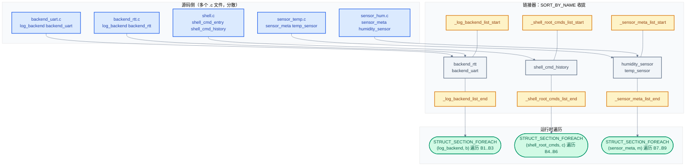
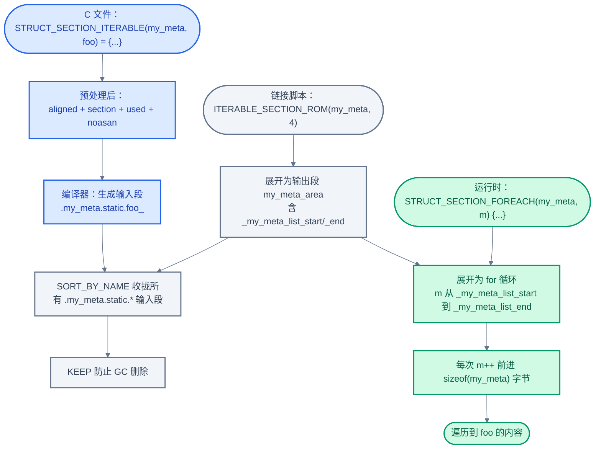

# 20. Iterable Sections：链接器驱动的自注册模式

> 一句话概括：本文从 [19 章无锁数据结构](./19-无锁数据结构深入.md) 退一步看 Zephyr 的另一类"运行时数据结构"——不是用原子操作串起多生产者，而是用**链接器段**把分散在各编译单元里的同型结构体收拢成一段连续内存，让内核像遍历数组一样枚举它们。核心是三件套：`ITERABLE_SECTION_ROM/RAM` 在链接脚本里圈地、`STRUCT_SECTION_ITERABLE` 把变量塞进圈好的地、`STRUCT_SECTION_FOREACH` 用起止指针当数组遍历。
> **工程师视角**：读完后应能回答四个问题——"为什么 `SHELL_CMD_REGISTER` 写在任意 .c 文件里就能被 shell 子系统自动枚举到"、"链接器如何保证遍历顺序与段收集顺序一致"、"ASan 开启时为什么必须用 `__noasan` 标注 iterable 元素"、"为什么 Zephyr 不用运行时注册函数而要走这套链接器魔法"。

### 关键术语

| 缩写 | 全称 | 含义 |
|------|------|------|
| RTOS | Real-Time Operating System | 实时操作系统 |
| ROM | Read-Only Memory | 只读存储器，本文中指 Flash 镜像里的只读段 |
| RAM | Random Access Memory | 随机存取存储器，可读写段 |
| ASan | AddressSanitizer | 地址消毒器，GCC/Clang 提供的内存错误检测工具 |
| GC | Garbage Collection | 链接器 `--gc-sections` 对未引用段的回收 |
| ISR | Interrupt Service Routine | 中断服务例程 |
| SMP | Symmetric Multi-Processing | 对称多处理 |
| IPC | Inter-Process Communication | 进程间/核间通信 |
| ld | GNU Linker | GNU 链接器，Zephyr 默认链接工具 |
| SORT_BY_NAME | — | ld 内置指令，按输入段名字典序收集段 |
| KEEP | — | ld 指令，防止 `--gc-sections` 丢弃段 |
| SUBALIGN | — | ld 指令，覆盖输出段的默认对齐 |

---

### 前置阅读

| 需要了解 | 参考文档 |
|----------|----------|
| 内核启动序列与 `SYS_INIT` 调用时机 | [04-内核启动与初始化](./04-内核启动与初始化.md) §5 |
| 设备模型与 `struct device` | [13-设备驱动模型](./13-设备驱动模型.md) |
| 链接脚本基础（`SECTION`、`GROUP`、`ALIGN`） | [02-构建系统](./02-构建系统.md) |

---

## 1. 概述：为什么需要自注册

> 上一篇 [19-无锁数据结构深入](./19-无锁数据结构深入.md) 解决的是"多生产者如何把数据安全地汇聚到一个消费者"——核心是用原子操作和内存序在**运行时**串起并发写入。但 Zephyr 还有一类完全不同的"汇聚"需求：shell 子系统要找到所有 `SHELL_CMD_REGISTER` 注册的命令、logging 子系统要找到所有 `LOG_BACKEND_DEFINE` 注册的后端、内核启动要找到所有 `SYS_INIT` 注册的初始化函数。这些"注册"都发生在**编译时**——每个 .c 文件独立声明自己的命令/后端/init 函数，谁也不该知道其他 .c 文件的存在。如何在零运行时开销、零中心化注册表的前提下，让子系统在启动时枚举到所有这些条目？这就是 iterable sections 要解决的问题。

### 1.1 一个具体的小例子

先看 iterable sections 在做什么。假设我们要实现一个"自统计传感器"框架：每个传感器驱动在自己的 .c 文件里声明一段元数据（名称、采样函数、单位），框架启动时遍历所有元数据并打印。

不使用 iterable sections 时，惯用做法是中心化注册表：

```c
/* sensors_registry.c — 中心化方案，需要手动维护列表 */
#include "sensors_registry.h"

const struct sensor_meta *sensors[] = {
    &temp_sensor,
    &humidity_sensor,
    &pressure_sensor,
    /* 每加一个传感器都要改这里 */
};
size_t sensors_count = ARRAY_SIZE(sensors);
```

问题：每加一个传感器都要修改 `sensors_registry.c`，违反了"开闭原则"；多人协作时这文件会成为合并冲突热点；如果某个传感器源文件被 Kconfig 关闭，列表里残留的符号引用会让链接报错。

用 iterable sections 的方案：

```c
/* temp.c — 仅声明自己的元数据，不依赖任何中心列表 */
const STRUCT_SECTION_ITERABLE(sensor_meta, temp_sensor) = {
    .name = "temp",
    .sample = temp_sample,
    .unit = "mC",
};

/* framework.c — 框架侧用 foreach 枚举所有条目 */
STRUCT_SECTION_FOREACH(sensor_meta, meta) {
    printk("%s: %d %s\n", meta->name, meta->sample(), meta->unit);
}
```

`temp.c`、`humidity.c`、`pressure.c` 三个文件互不依赖，也无需修改任何中心列表。链接器在最终镜像里把三个 `struct sensor_meta` 收拢成一段连续内存，框架侧的 `STRUCT_SECTION_FOREACH` 就能像遍历数组一样遍历它们。这就是"链接器驱动的自注册"。

> **核心要点**：iterable sections 的本质是"用链接器段替代中心化注册表"。注册侧（`STRUCT_SECTION_ITERABLE`）和遍历侧（`STRUCT_SECTION_FOREACH`）通过链接脚本约定的段名耦合，二者不需要在源码层相互可见。

### 1.2 设计目标与代价

| 维度 | iterable sections 方案 | 运行时注册函数方案 | GCC `__attribute__((constructor))` |
|------|----------------------|------------------|-----------------------------------|
| **顺序确定时机** | 链接时（`SORT_BY_NAME`） | 运行时（需先跑注册器） | 链接时但跨编译单元顺序未指定 |
| **运行时开销** | 零额外 RAM、零额外调用 | 需要注册表 RAM、注册函数调用 | 零额外 RAM |
| **可裁剪** | 未引用段被 `--gc-sections` 移除；引用段被 `KEEP` 保留 | 注册代码必须条件编译 | 同 iterable |
| **依赖排序** | 链接器按段名字典序 | 注册器需自己排序 | 不可控 |
| **可观测性** | `west build -t initlevels`、`readelf -S` 直接看 | 需运行时打印 | 难以观察 |
| **顺序约束** | 注册顺序由变量名决定，是"软契约" | 任意，由注册器决定 | 不可控 |
| **跨编译单元** | 天然支持 | 支持 | 支持但顺序乱 |

> **如何读这张表**：iterable sections 在"顺序确定性"和"零运行时开销"两列最强，但代价是注册顺序与变量名绑定——这是"软契约"：开发者改名时不会得到任何警告，运行时行为却会变。这正是 §8 要专门讨论的问题。

### 1.3 与 04 章 §5 的关系

[04 章内核启动与初始化](./04-内核启动与初始化.md) §5 已经使用过这套机制剖析 `SYS_INIT` 与 `DEVICE_DEFINE`：`SYS_INIT` 把每个 `struct init_entry` 放到 `.z_init_<level>_P_<prio>_SUB_<sub>_` 段，链接脚本用 `CREATE_OBJ_LEVEL` 按级别+优先级收集，`z_sys_init_run_level` 用 `__init_<level>_start`/`__init_end` 当数组边界遍历。那是一套**定制化的** iterable section——段名编码了优先级信息，链接器 `SORT` 替代了运行时排序算法。本篇把这条思路抽出来讲透：什么是"标准"的 iterable section、Zephyr 还在哪些地方用了它、如何在自己的代码里使用它。

---

## 2. 链接器段声明：ITERABLE_SECTION_ROM/RAM

> 第 1 节解释了"为什么"需要 iterable sections。这一节回答"链接器如何把分散的同型结构体收拢成连续内存"——核心是链接脚本里的 `ITERABLE_SECTION_ROM` / `ITERABLE_SECTION_RAM` 宏，它们圈定输出段、定义起止符号、按段名排序收集输入段。

### 2.1 链接器侧宏的全貌

链接器侧的宏定义在 [include/zephyr/linker/iterable_sections.h](file:///home/pbw/rtos/cs-learning-notes/zephyr-project/zephyr/include/zephyr/linker/iterable_sections.h)：

```ld
/* 核心原语，所有 ITERABLE_SECTION_* 都基于它 */
#define Z_LINK_ITERABLE(struct_type) \
	PLACE_SYMBOL_HERE(_CONCAT(_##struct_type, _list_start)); \
	KEEP(*(SORT_BY_NAME(._##struct_type.static.*))); \
	PLACE_SYMBOL_HERE(_CONCAT(_##struct_type, _list_end));

/* 只读段版本 */
#define ITERABLE_SECTION_ROM(struct_type, subalign) \
	SECTION_PROLOGUE(struct_type##_area, ,) \
	{ \
		Z_LINK_ITERABLE(struct_type); \
	} GROUP_ROM_LINK_IN(RAMABLE_REGION, ROMABLE_REGION)

/* 可读写段版本 */
#define ITERABLE_SECTION_RAM(struct_type, subalign) \
	SECTION_DATA_PROLOGUE(struct_type##_area, ,) \
	{ \
		Z_LINK_ITERABLE(struct_type); \
	} GROUP_DATA_LINK_IN(RAMABLE_REGION, ROMABLE_REGION)
```

逐行解析 `Z_LINK_ITERABLE(sensor_meta)` 展开后的内容：

1. **`PLACE_SYMBOL_HERE(_sensor_meta_list_start)`** — 在当前位置定义符号 `_sensor_meta_list_start = .`。这是数组起点，C 代码用 `extern const struct sensor_meta _sensor_meta_list_start[];` 引用它。`PLACE_SYMBOL_HERE` 在 [include/zephyr/linker/linker-defs.h](file:///home/pbw/rtos/cs-learning-notes/zephyr-project/zephyr/include/zephyr/linker/linker-defs.h#L58)定义，对 RX 架构额外提供带前导下划线的别名。
2. **`KEEP(*(SORT_BY_NAME(._sensor_meta.static.*)))`** — 这是核心。`SORT_BY_NAME` 让 ld 按输入段名字典序收集，`.*` 通配符匹配所有 `._sensor_meta.static.<postfix>` 输入段；`KEEP` 防止 `--gc-sections` 因为"无直接引用"而丢弃这些段。
3. **`PLACE_SYMBOL_HERE(_sensor_meta_list_end)`** — 在收集完所有段后定义终点符号。

`SECTION_PROLOGUE(name, options, align)` 在 [include/zephyr/linker/linker-tool-gcc.h](file:///home/pbw/rtos/cs-learning-notes/zephyr-project/zephyr/include/zephyr/linker/linker-tool-gcc.h#L182)定义为 `name options : align`，所以 `ITERABLE_SECTION_ROM(sensor_meta, 4)` 展开成：

```ld
sensor_meta_area :
{
    _sensor_meta_list_start = .;
    KEEP(*(SORT_BY_NAME(._sensor_meta.static.*)))
    _sensor_meta_list_end = .;
} > ROMABLE_REGION AT > ROMABLE_REGION
```

`GROUP_ROM_LINK_IN(RAMABLE_REGION, ROMABLE_REGION)` 在 XIP 系统上让 LMA 与 VMA 都在 Flash，运行时只读；`GROUP_DATA_LINK_IN(RAMABLE_REGION, ROMABLE_REGION)` 则让 VMA 在 RAM、LMA 在 Flash，启动时由 `__data_copy` 拷贝到 RAM，运行时可改写。

### 2.2 ROM vs RAM 的选择

| 维度 | `ITERABLE_SECTION_ROM` | `ITERABLE_SECTION_RAM` |
|------|------------------------|------------------------|
| **LMA（加载地址）** | ROMABLE_REGION | ROMABLE_REGION |
| **VMA（运行地址）** | ROMABLE_REGION | RAMABLE_REGION |
| **启动时拷贝** | 否 | 是（与 `.data` 一起拷贝） |
| **可写性** | 只读 | 可读写 |
| **XIP 适配** | 直接在 Flash 运行 | 拷贝到 SRAM 后运行 |
| **典型用法** | 命令表、init_entry、log_backend | 含运行时状态的对象（如 `device_state`） |

> **核心要点**：选 ROM 还是 RAM 取决于"运行时是否要修改"。如果结构体只是元数据（函数指针、字符串、常量），用 ROM；如果结构体含运行时状态（计数器、忙位、缓存），用 RAM。错用 ROM 会导致 XIP 系统上写 Flash 触发硬错。

### 2.3 三种变体

[iterable_sections.h](file:///home/pbw/rtos/cs-learning-notes/zephyr-project/zephyr/include/zephyr/linker/iterable_sections.h) 还提供两种变体：

```ld
/* 数值排序版本，按段名末尾的数字大小排序 */
#define Z_LINK_ITERABLE_NUMERIC(struct_type) \
	PLACE_SYMBOL_HERE(_CONCAT(_##struct_type, _list_start)); \
	KEEP(*(SORT(._##struct_type.static.*_?_*)));   /* 1 位 */ \
	KEEP(*(SORT(._##struct_type.static.*_??_*)));  /* 2 位 */ \
	KEEP(*(SORT(._##struct_type.static.*_???_*))); /* 3 位 */ \
	KEEP(*(SORT(._##struct_type.static.*_????_*))); \
	KEEP(*(SORT(._##struct_type.static.*_?????_*))); \
	PLACE_SYMBOL_HERE(_CONCAT(_##struct_type, _list_end));

/* 允许 GC 版本，去掉 KEEP，未引用的段可被 gc 删除 */
#define Z_LINK_ITERABLE_GC_ALLOWED(struct_type) \
	PLACE_SYMBOL_HERE(_CONCAT(_##struct_type, _list_start)); \
	*(SORT_BY_NAME(._##struct_type.static.*)); \
	PLACE_SYMBOL_HERE(_CONCAT(_##struct_type, _list_end));
```

- **`ITERABLE_SECTION_ROM_NUMERIC` / `ITERABLE_SECTION_RAM_NUMERIC`**：按数值大小排序，0-99999 范围内正确。`SORT` 是 `SORT_BY_NAME` 的别名，但因为分别匹配 `?_`（1 位）、`??_`（2 位）……`?????_`（5 位）的段名后缀，1 位段一定先于 2 位段被收集，等位内字典序等于数值序。这正是 [04 章](./04-内核启动与初始化.md) §5.3 `CREATE_OBJ_LEVEL` 的同款技巧。`device` 段用 NUMERIC 版本，因为设备按设备树序号 `dts_ord_<N>` 命名，需要数值顺序。
- **`ITERABLE_SECTION_ROM_GC_ALLOWED` / `ITERABLE_SECTION_RAM_GC_ALLOWED`**：去掉 `KEEP`，允许 `--gc-sections` 回收未引用段。适用于"如果没人用就别占空间"的场景，例如某些可选的 zbus 通道。

### 2.4 链接器段布局示意

下图展示 ROM 镜像中三个 iterable 段（`log_backend`、`shell_root_cmds`、`sensor_meta`）的内存布局，以及它们如何被 `SORT_BY_NAME` 收拢成连续内存：



> **如何读这张图**：上半部分是源码侧——5 个变量散落在 5 个 .c 文件里，互不知道彼此。中间是链接器收集阶段：`SORT_BY_NAME(._log_backend.static.*)` 把所有 `._log_backend.static.*` 输入段按段名（等价于变量名）字典序合并到 `_log_backend_list_start` 与 `_log_backend_list_end` 之间，三个段各自独立。下半部分是运行时遍历：C 代码用 `STRUCT_SECTION_FOREACH` 把 `_xxx_list_start` 与 `_xxx_list_end` 当数组边界，逐元素访问。`backend_rtt` 排在 `backend_uart` 前是因为字典序里 `'r' < 'u'`——这就是 §8 要讨论的"字典序契约"。

---

## 3. STRUCT_SECTION_ITERABLE：放入段中

> 第 2 节在链接脚本里圈好了地。这一节讲 C 代码侧如何把一个变量塞进圈好的地——核心是 `STRUCT_SECTION_ITERABLE` 宏，它把"对齐"、"段属性"、"防 ASan"、"防 GC"四个属性一次性粘到一个变量声明上。

### 3.1 宏展开链

C 侧的宏定义在 [include/zephyr/sys/iterable_sections.h](file:///home/pbw/rtos/cs-learning-notes/zephyr-project/zephyr/include/zephyr/sys/iterable_sections.h)。从外到内的展开链：

```c
/* 用户常用入口 */
#define STRUCT_SECTION_ITERABLE(struct_type, varname) \
	STRUCT_SECTION_ITERABLE_ALTERNATE(struct_type, struct_type, varname)

/* 允许段名与类型名不同（shell 用这个） */
#define STRUCT_SECTION_ITERABLE_ALTERNATE(secname, struct_type, varname) \
	TYPE_SECTION_ITERABLE(struct struct_type, varname, secname, varname)

/* 底层实现 */
#define TYPE_SECTION_ITERABLE(type, varname, secname, section_postfix) \
	Z_DECL_ALIGN(type) varname \
	__in_section(_##secname, static, _CONCAT(section_postfix, _)) __used __noasan
```

以 `const STRUCT_SECTION_ITERABLE(sensor_meta, temp_sensor) = { ... };` 为例，逐层展开：

1. `STRUCT_SECTION_ITERABLE(sensor_meta, temp_sensor)` → `STRUCT_SECTION_ITERABLE_ALTERNATE(sensor_meta, sensor_meta, temp_sensor)`
2. → `TYPE_SECTION_ITERABLE(struct sensor_meta, temp_sensor, sensor_meta, temp_sensor)`
3. → `Z_DECL_ALIGN(struct sensor_meta) temp_sensor __in_section(_sensor_meta, static, temp_sensor_) __used __noasan`

四个属性各自的来源与作用：

- **`Z_DECL_ALIGN(type)`**：在 [include/zephyr/toolchain/common.h](file:///home/pbw/rtos/cs-learning-notes/zephyr-project/zephyr/include/zephyr/toolchain/common.h#L227)定义为 `__aligned(__alignof(type)) type`。强制按类型的自然对齐填充。注释解释了原因——汇编器和链接器可能在收集段时插入大于自然对齐的填充，破坏"连续数组"语义；显式对齐让每个元素边界确定。
- **`__in_section(_sensor_meta, static, temp_sensor_)`**：在 [include/zephyr/toolchain/gcc.h](file:///home/pbw/rtos/cs-learning-notes/zephyr-project/zephyr/include/zephyr/toolchain/gcc.h#L197-L201)展开为 `__attribute__((section("._sensor_meta.static.temp_sensor_")))`。注意三段式段名 `.<secname>.static.<postfix>_`——前缀 `.<secname>.static.` 与链接脚本 `SORT_BY_NAME(._<secname>.static.*)` 的通配符匹配；后缀 `<postfix>_` 是变量名加一个下划线，正是 §8 字典序排序的依据。
- **`__used`**：GCC 属性，告诉编译器"这个变量看起来没被引用也不要删除"。这是给编译器的指令，与链接器的 `KEEP` 双保险。
- **`__noasan`**：见 §6，防 ASan 在变量周围加 guard padding 破坏段对齐。

最终的展开结果是：

```c
const __attribute__((aligned(4))) struct sensor_meta temp_sensor
    __attribute__((section("._sensor_meta.static.temp_sensor_")))
    __attribute__((used))
    = { .name = "temp", .sample = temp_sample, .unit = "mC" };
```

### 3.2 三种常用变体

[iterable_sections.h](file:///home/pbw/rtos/cs-learning-notes/zephyr-project/zephyr/include/zephyr/sys/iterable_sections.h) 还提供几个变体：

| 宏 | 段名 | 用途 |
|----|------|------|
| `STRUCT_SECTION_ITERABLE(type, var)` | `.<type>.static.<var>_` | 标准用法，段名=类型名 |
| `STRUCT_SECTION_ITERABLE_ALTERNATE(sec, type, var)` | `.<sec>.static.<var>_` | 段名 ≠ 类型名（shell 用 `shell_root_cmds` 段放 `union shell_cmd_entry`） |
| `STRUCT_SECTION_ITERABLE_NAMED(type, name, var)` | `.<type>.static.<name>_` | 段名=类型名，但排序键 `name` ≠ 变量名（用于自定义排序） |
| `STRUCT_SECTION_ITERABLE_ARRAY(type, var, n)` | `.<type>.static.<var>_` | 在段里放数组而非单个元素 |

`STRUCT_SECTION_ITERABLE_ALTERNATE` 是最灵活的——它解耦了"段名"与"类型名"。shell 子系统就用它把 `union shell_cmd_entry` 放到 `shell_root_cmds` 段：

```c
/* include/zephyr/shell/shell.h */
static const TYPE_SECTION_ITERABLE(union shell_cmd_entry,
    UTIL_CAT(shell_cmd_, syntax), shell_root_cmds,
    UTIL_CAT(shell_cmd_, syntax)) = { ... };
```

这里 `secname=shell_root_cmds`、`type=union shell_cmd_entry`、`varname=shell_cmd_<syntax>`。链接脚本里 `ITERABLE_SECTION_ROM(shell_root_cmds, ...)` 圈的是 `shell_root_cmds` 段，但段里每个元素的实际类型是 `union shell_cmd_entry`。这种解耦让一个段可以容纳"语义相同、C 类型不同"的元素——只要大小与对齐一致。

### 3.3 自包含代码示例

下面是一个完整可编译的示例，演示"声明—链接—遍历"三步：

```c
/* my_meta.h — 公共头文件，所有 .c 都包含它 */
#include <zephyr/sys/iterable_sections.h>

struct my_meta {
    const char *name;
    int (*get)(void);
};

#define DEFINE_META(name, _get)                     \
    const STRUCT_SECTION_ITERABLE(my_meta, name) = { \
        .name = #name,                              \
        .get = _get,                                \
    }
```

```c
/* foo.c — 注册一个条目 */
#include "my_meta.h"
static int foo_get(void) { return 1; }
DEFINE_META(foo, foo_get);
```

```c
/* bar.c — 注册另一个条目，与 foo.c 互不知道 */
#include "my_meta.h"
static int bar_get(void) { return 2; }
DEFINE_META(bar, bar_get);
```

```c
/* main.c — 框架侧枚举所有条目 */
#include <zephyr/kernel.h>
#include "my_meta.h"

int main(void)
{
    STRUCT_SECTION_FOREACH(my_meta, m) {
        printk("%s = %d\n", m->name, m->get());
    }
    return 0;
}
```

链接脚本侧需要：

```ld
/* iterables.ld — 自定义链接片段 */
#include <zephyr/linker/iterable_sections.h>
ITERABLE_SECTION_ROM(my_meta, 4)
```

CMake 侧需要把这片片段挂进最终链接脚本（§5 详述）：

```cmake
# CMakeLists.txt
zephyr_linker_sources(SECTIONS iterables.ld)
```

运行时 `main.c` 会输出：

```
bar = 2
foo = 1
```

注意输出顺序是 `bar` 在前 `foo` 在后——尽管 `foo.c` 在 `bar.c` 之前编译。这正是 `SORT_BY_NAME` 的效果：按段名（等价于变量名）字典序排列，`'b' < 'f'` 所以 `bar` 排前。这是 §8 字典序契约的直接体现。

---

## 4. STRUCT_SECTION_FOREACH：运行时遍历

> 第 3 节把变量放进了段。这一节讲运行时如何遍历——核心是 `STRUCT_SECTION_FOREACH` 宏，它把"extern 起止符号 + for 循环 + 边界断言"打包成一行。

### 4.1 宏展开

[include/zephyr/sys/iterable_sections.h](file:///home/pbw/rtos/cs-learning-notes/zephyr-project/zephyr/include/zephyr/sys/iterable_sections.h#L105-L113)：

```c
#define TYPE_SECTION_FOREACH(type, secname, iterator)		\
	TYPE_SECTION_START_EXTERN(type, secname);		\
	TYPE_SECTION_END_EXTERN(type, secname);		\
	for (type * iterator = TYPE_SECTION_START(secname); ({	\
		__ASSERT(iterator <= TYPE_SECTION_END(secname),\
			      "unexpected list end location");	\
		     iterator < TYPE_SECTION_END(secname);	\
	     });						\
	     iterator++)
```

`STRUCT_SECTION_FOREACH` 是它的特化（`secname = struct_type`）。展开 `STRUCT_SECTION_FOREACH(my_meta, m)` 后等价于：

```c
extern struct my_meta _my_meta_list_start[];
extern struct my_meta _my_meta_list_end[];
for (struct my_meta *m = _my_meta_list_start;
     ({ __ASSERT(m <= _my_meta_list_end, "unexpected list end location");
        m < _my_meta_list_end; });
     m++) {
    /* 用户代码 */
    printk("%s = %d\n", m->name, m->get());
}
```

四个要点：

1. **`extern` 声明在宏里**——`TYPE_SECTION_START_EXTERN` 与 `TYPE_SECTION_END_EXTERN` 直接展开成 `extern` 语句，所以调用者无需在文件顶部手写 extern。重复声明在 C 中合法。
2. **`for` 的"条件"是一个 GNU 语句表达式 `({ ... })`**——里面先做 `__ASSERT`，再返回真正的循环条件 `iterator < end`。`__ASSERT` 在 release 构建里编译成空语句，零开销；在 debug 构建里若 `iterator > end`（说明段被破坏或类型大小不匹配）会触发断言。
3. **指针比较 `iterator < end`**——把起止符号当数组边界，`m++` 每次前进 `sizeof(struct my_meta)` 字节。这要求段内每个元素大小一致——iterable sections 的根本前提。
4. **没有锁**——`STRUCT_SECTION_FOREACH` 不加任何锁。如果遍历过程中段被修改（仅 RAM 段可能），需要调用方自己加锁。

### 4.2 辅助宏：GET 与 COUNT

除了 `FOREACH`，还有两个常用宏：

```c
/* 按下标取元素 */
#define TYPE_SECTION_GET(type, secname, i, dst) do { \
    TYPE_SECTION_START_EXTERN(type, secname); \
    *(dst) = &TYPE_SECTION_START(secname)[i]; \
} while (0)

/* 统计元素个数 */
#define TYPE_SECTION_COUNT(type, secname, dst) do { \
    TYPE_SECTION_START_EXTERN(type, secname); \
    TYPE_SECTION_END_EXTERN(type, secname); \
    *(dst) = ((uintptr_t)TYPE_SECTION_END(secname) - \
              (uintptr_t)TYPE_SECTION_START(secname)) / sizeof(type); \
} while (0)
```

实战案例：[include/zephyr/logging/log_backend.h](file:///home/pbw/rtos/cs-learning-notes/zephyr-project/zephyr/include/zephyr/logging/log_backend.h#L250-L269)用这两个宏实现"按下标取后端"和"统计后端数量"：

```c
static inline const struct log_backend *log_backend_get(uint32_t idx)
{
    const struct log_backend *backend;
    STRUCT_SECTION_GET(log_backend, idx, &backend);
    return backend;
}

static inline int log_backend_count_get(void)
{
    int cnt;
    STRUCT_SECTION_COUNT(log_backend, &cnt);
    return cnt;
}
```

注意 `STRUCT_SECTION_GET` 的注释明确说"There is no protection against reading beyond the section"——`i` 越界时不会检查，调用方必须先用 `COUNT` 拿到上界。

### 4.3 ALTERNATE 版本

[iterable_sections.h](file:///home/pbw/rtos/cs-learning-notes/zephyr-project/zephyr/include/zephyr/sys/iterable_sections.h#L257-L258)：

```c
#define STRUCT_SECTION_FOREACH_ALTERNATE(secname, struct_type, iterator) \
    TYPE_SECTION_FOREACH(struct struct_type, secname, iterator)
```

与 `STRUCT_SECTION_ITERABLE_ALTERNATE` 配对——注册侧用 ALTERNATE 把 `union shell_cmd_entry` 放到 `shell_root_cmds` 段，遍历侧也要用 `STRUCT_SECTION_FOREACH_ALTERNATE(shell_root_cmds, shell_cmd_entry, iterator)`。如果错用了 `STRUCT_SECTION_FOREACH(shell_cmd_entry, ...)`，会去找 `_shell_cmd_entry_list_start` 符号，而链接脚本定义的是 `_shell_root_cmds_list_start`——链接报"undefined symbol"。

### 4.4 完整流程图

下图是从 `STRUCT_SECTION_ITERABLE` 声明到 `STRUCT_SECTION_FOREACH` 遍历的完整流程：



> **如何读这张图**：蓝色是 C 源码侧——`STRUCT_SECTION_ITERABLE` 经预处理后变成带 `section` 属性的变量声明，编译器把它放进输入段 `.my_meta.static.foo_`。灰色是链接器侧——`ITERABLE_SECTION_ROM` 在链接脚本里展开为输出段 `my_meta_area`，`SORT_BY_NAME` 把所有匹配的输入段按字典序合并到起止符号之间，`KEEP` 防 GC。绿色是运行时侧——`STRUCT_SECTION_FOREACH` 展开为 for 循环，指针在起止符号间步进，每次前进一个元素的大小。三个阶段通过段名 `.my_meta.static.*` 与符号名 `_my_meta_list_*` 耦合，没有任何运行时注册调用。

---

## 5. CMake 接口：zephyr_linker_sources

> 第 2-4 节讲了链接器侧和 C 侧的宏。但链接器侧的宏必须被嵌入到最终的 `linker.ld` 才能生效——这一节讲 CMake 提供的 `zephyr_linker_sources` 函数，它把 .ld 片段插入到全局链接脚本的指定位置。

### 5.1 函数签名与位置参数

`zephyr_linker_sources` 在 [cmake/modules/extensions.cmake](file:///home/pbw/rtos/cs-learning-notes/zephyr-project/zephyr/cmake/modules/extensions.cmake#L1315)定义。签名：

```cmake
zephyr_linker_sources(<location> [SORT_KEY <sort_key>] <files>)
```

`<location>` 决定 .ld 片段插入到 `linker.ld` 的哪个位置，可选值列出。与 iterable sections 相关的是：

| location | 含义 | iterable section 典型用法 |
|----------|------|--------------------------|
| `SECTIONS` | 链接脚本末尾，需自定义 output section | `ITERABLE_SECTION_ROM`（最常用） |
| `ROM_SECTIONS` | ROMABLE_REGION group 内 | ROM 类型，但不想定义新 output section |
| `RAM_SECTIONS` | RAMABLE_REGION group 内 | RAM 类型，无初始化 |
| `DATA_SECTIONS` | RAMABLE_REGION group 内，已初始化 | RAM 类型，需启动时拷贝 |
| `RODATA` | rodata output section 内 | 不需要 `SECTION_PROLOGUE`，只放几个符号 |
| `NOINIT` | noinit output section 内 | RAM 但不初始化 |

注释说明：用 `SECTIONS` / `ROM_SECTIONS` / `RAM_SECTIONS` / `DATA_SECTIONS` 时，.ld 片段必须**自己定义 output section**（用 `SECTION_PROLOGUE`）；用 `NOINIT` / `RWDATA` / `RODATA` 时则不能定义 output section，只能放内容。

由于 `ITERABLE_SECTION_ROM` 内部已经包含了 `SECTION_PROLOGUE(...)`，所以用 `SECTIONS` 或 `ROM_SECTIONS` 都可以。官方文档 [doc/kernel/iterable_sections/index.rst](file:///home/pbw/rtos/cs-learning-notes/zephyr-project/zephyr/doc/kernel/iterable_sections/index.rst#L42-L46)的示例用 `DATA_SECTIONS`（针对 `ITERABLE_SECTION_RAM`）：

```cmake
# CMakeLists.txt
zephyr_linker_sources(DATA_SECTIONS iterables.ld)
```

```ld
# iterables.ld
#include <zephyr/linker/iterable_sections.h>
ITERABLE_SECTION_RAM(my_data, 4)
```

### 5.2 SORT_KEY 排序

`SORT_KEY` 是可选的，用于控制同一 `location` 内多个 .ld 片段的插入顺序。所有片段按 `SORT_KEY` 字典序写入 `snippets-<location>.ld` 文件。：

```cmake
cmake_parse_arguments(L "" "SORT_KEY" "" ${ARGN})
set(SORT_KEY default)
if(DEFINED L_SORT_KEY)
    set(SORT_KEY ${L_SORT_KEY})
endif()
```

未指定时默认 `default`。生成的 include 字符串是 `/* Sort key: "<key>" */#include "<relpath>"`，然后 `list(SORT lines)` 按整行字典序排序。这意味着 `SORT_KEY` 必须是字母数字（注释里要求 alphanumeric），且大小写敏感。

`SORT_KEY` 影响 .ld 片段在 `linker.ld` 里的物理顺序——这会影响段的内存地址，但**不影响** `SORT_BY_NAME` 对 iterable 段内部元素的排序（那个排序由 ld 自己做）。所以对 iterable sections 来说，`SORT_KEY` 主要影响多个 `ITERABLE_SECTION_*` 之间的相对位置，通常不重要。

### 5.3 内部实现：snippets 文件

`zephyr_linker_sources` 的实现思路：

1. 第一次调用时清空 14 个 `snippets-*.ld` 文件
2. 根据 `location` 选择目标 snippets 文件
3. 解析 `SORT_KEY`，拼接 `/* Sort key: "..." */#include "<relpath>"` 字符串
4. 如果该 .ld 文件之前在别的 location 用过，先从旧位置移除（支持"重新挂载"）
5. 把新行追加到 snippets 文件，按整行字典序排序后写回

最终 `linker.ld` 通过 `#include "snippets-sections.ld"` 把这些片段嵌入。生成的 snippets 文件位于 `build/zephyr/include/generated/snippets-*.ld`，调试链接脚本时可以直接查看。

### 5.4 Zephyr 自带的 .ld 片段

Zephyr 内核自己用 `zephyr_linker_sources` 注册了大量 .ld 片段，下面是几个例子：

| .ld 文件 | location | 内容 |
|---------|----------|------|
| [common-rom/common-rom-kernel-devices.ld](file:///home/pbw/rtos/cs-learning-notes/zephyr-project/zephyr/include/zephyr/linker/common-rom/common-rom-kernel-devices.ld) | SECTIONS | `initlevel`、`device`、`_static_thread_data` 等 |
| [common-rom/common-rom-logging.ld](file:///home/pbw/rtos/cs-learning-notes/zephyr-project/zephyr/include/zephyr/linker/common-rom/common-rom-logging.ld) | SECTIONS | `log_strings`、`log_const`、`log_backend`、`log_link` |
| [common-rom/common-rom-misc.ld](file:///home/pbw/rtos/cs-learning-notes/zephyr-project/zephyr/include/zephyr/linker/common-rom/common-rom-misc.ld) | SECTIONS | `shell`、`shell_root_cmds`、`settings_handler_static`、`zbus_*` 等 |
| [common-rom/common-rom-debug.ld](file:///home/pbw/rtos/cs-learning-notes/zephyr-project/zephyr/include/zephyr/linker/common-rom/common-rom-debug.ld) | SECTIONS | 调试相关 iterable 段 |

`zephyr_linker_sources` 的注册分散在各子系统的 CMakeLists 里。例如 [kernel.cmake](file:///home/pbw/rtos/cs-learning-notes/zephyr-project/zephyr/cmake/modules/kernel.cmake#L119)注册了内核主 .ld 片段。

---

## 6. __noasan：防止 ASan 破坏对齐

> 第 5 节把链接脚本挂好了。这一节回答一个看似细节、实则关键的问题——为什么 `STRUCT_SECTION_ITERABLE` 的展开里有 `__noasan`？这关系到 ASan 开启时 iterable sections 是否还能正常工作。

### 6.1 问题：ASan 的 guard padding

ASan (AddressSanitizer) 是 GCC/Clang 的内存错误检测工具。开启 `-fsanitize=address` 后，编译器会在每个全局变量周围插入"红区"（redzones）——一段不可访问的内存，用于检测越界访问。典型布局：

```
[redzone 32B][global var][redzone 32B][global var][redzone 32B]...
```

对普通全局变量这是好事——越界访问会触发 ASan 报错。但对 iterable sections 的元素这是灾难：

1. **元素间多了 32 字节红区**——但 `STRUCT_SECTION_FOREACH` 假设元素紧密排列，每次 `iterator++` 前进 `sizeof(type)` 字节。有红区后，第二次迭代会落到红区里，触发 ASan 误报，或者读到错误的内存内容。
2. **段对齐被破坏**——红区改变了段内每个元素的实际偏移，链接器收集到的段不再是"等大数组"。

### 6.2 `__noasan` 的定义

`__noasan` 在 [include/zephyr/toolchain/gcc.h](file:///home/pbw/rtos/cs-learning-notes/zephyr-project/zephyr/include/zephyr/toolchain/gcc.h#L640-L644)定义：

```c
#if defined(CONFIG_ASAN) && defined(__clang__)
#define __noasan __attribute__((no_sanitize("address")))
#else
#define __noasan /**/
#endif
```

注意三个细节：

- **只在 Clang + CONFIG_ASAN 时生效**——GCC 的 ASan 实现不通过 `no_sanitize("address")` 控制，且 GCC 默认不对链接器段内的全局变量加红区，所以 GCC 下 `__noasan` 是空宏。
- **`no_sanitize("address")` 属性**——告诉 Clang "不要对这个变量做 ASan 插桩，也不要加红区"。
- **`__used` 配合**——`__noasan` 与 `__used` 一起用，确保即使关闭 ASan 插桩，变量也不会被优化掉。

[include/zephyr/toolchain.h](file:///home/pbw/rtos/cs-learning-notes/zephyr-project/zephyr/include/zephyr/toolchain.h#L57-L70)的注释解释了为什么需要这个属性：

> When used in the definition of a symbol, prevents that symbol (be it a function or data) from being instrumented by the address sanitizer feature of the compiler. Most commonly, this is used to prevent padding around data that will be treated specially by the Zephyr link (c.f. SYS_INIT records, STRUCT_SECTION_ITERABLE definitions) in ways that don't understand the guard padding.

### 6.3 何时必须用 `__noasan`

| 场景 | 是否需要 `__noasan` |
|------|-------------------|
| 用 `STRUCT_SECTION_ITERABLE` 声明的变量 | **必须**（宏已内置） |
| 用 `Z_INIT_ENTRY_SECTION` 声明的 `init_entry` | **必须**（[init.h](file:///home/pbw/rtos/cs-learning-notes/zephyr-project/zephyr/include/zephyr/init.h#L168)已内置） |
| 用 `__in_section` 直接放进段的变量 | **必须**（需手写） |
| 普通全局变量 | 否（红区是预期的） |
| 普通函数 | 否 |

> **核心要点**：`__noasan` 不是可选项——只要变量会被 `STRUCT_SECTION_FOREACH` 当数组元素遍历，就必须用它关闭 ASan 红区。`STRUCT_SECTION_ITERABLE` 宏已经把 `__noasan` 内置进去，开发者无需手写；但如果你用 `__in_section` 自己拼段名，就必须显式加 `__noasan`，否则在 Clang + ASan 构建里 iterable sections 会因为红区而崩溃。

---

## 7. 应用案例：SYS_INIT / Shell / Logging / Settings

> 第 2-6 节剖析了机制。这一节展示 iterable sections 在 Zephyr 内核里的实际用法——四个最典型的案例，覆盖"无设备初始化"、"命令注册"、"后端注册"、"配置处理"四种自注册场景。

### 7.1 SYS_INIT：无设备初始化

[04 章](./04-内核启动与初始化.md) §5 已详细剖析过 `SYS_INIT`，这里只从 iterable sections 角度总结。

[include/zephyr/init.h](file:///home/pbw/rtos/cs-learning-notes/zephyr-project/zephyr/include/zephyr/init.h#L166-L169)：

```c
#define SYS_INIT_NAMED(name, init_fn_, level, prio)                                       \
	static const Z_DECL_ALIGN(struct init_entry)                                      \
		Z_INIT_ENTRY_SECTION(level, prio, 0) __used __noasan                      \
		Z_INIT_ENTRY_NAME(name) = {.init_fn = (init_fn_), .dev = NULL}            \
```

`Z_INIT_ENTRY_SECTION` ：

```c
#define Z_INIT_ENTRY_SECTION(level, prio, sub_prio) \
	__attribute__((__section__( \
		".z_init_" #level "_P_" STRINGIFY(prio) "_SUB_" STRINGIFY(sub_prio)"_")))
```

注意 `SYS_INIT` **没有用 `STRUCT_SECTION_ITERABLE`**——它直接用 `__attribute__((section(...)))` 自己拼段名，因为段名里要编码 `<level>` 与 `<prio>`。链接脚本侧也不用 `ITERABLE_SECTION_ROM`，而是用定制化的 `CREATE_OBJ_LEVEL`（[linker-defs.h](file:///home/pbw/rtos/cs-learning-notes/zephyr-project/zephyr/include/zephyr/linker/linker-defs.h#L70-L75)）按级别分段收集。

所以 `SYS_INIT` 是 iterable sections 的"定制变体"——保留了"链接器段 + 起止符号 + 数组遍历"的三段式骨架，但段名编码了排序信息，链接器 `SORT` 替代了运行时排序。这套变体的细节已在 [04 章 §5.2-5.4](./04-内核启动与初始化.md) 讲透，本节不再重复。

### 7.2 SHELL_CMD_REGISTER：命令注册

[include/zephyr/shell/shell.h](file:///home/pbw/rtos/cs-learning-notes/zephyr-project/zephyr/include/zephyr/shell/shell.h#L390-L399)：

```c
#define SHELL_CMD_ARG_REGISTER(syntax, subcmd, help, handler, mandatory, optional) \
	static const struct shell_static_entry UTIL_CAT(_shell_, syntax) = \
	SHELL_CMD_ARG(syntax, subcmd, help, handler, mandatory, optional); \
	static const TYPE_SECTION_ITERABLE(union shell_cmd_entry, \
		UTIL_CAT(shell_cmd_, syntax), shell_root_cmds, \
		UTIL_CAT(shell_cmd_, syntax) \
	) = { \
		.entry = &UTIL_CAT(_shell_, syntax) \
	}
```

关键点：

1. **`secname = shell_root_cmds`**——所有 root 命令都进 `shell_root_cmds` 段，无论在哪个 .c 文件里注册。
2. **`type = union shell_cmd_entry`**——段里每个元素是 `union shell_cmd_entry`，不是 `struct shell_static_entry`。这个 union 可以容纳"静态条目"或"动态条目"，是 shell 子系统的设计选择。
3. **`section_postfix = shell_cmd_<syntax>`**——排序键是命令名加 `shell_cmd_` 前缀。两条命令 `history` 与 `help` 会展开为 `shell_cmd_history` 与 `shell_cmd_help`，字典序里 `help` 排在前——shell 命令在 `help` 输出里的顺序就是这样来的。

链接脚本侧 [common-rom-misc.ld](file:///home/pbw/rtos/cs-learning-notes/zephyr-project/zephyr/include/zephyr/linker/common-rom/common-rom-misc.ld#L60)：

```ld
ITERABLE_SECTION_ROM(shell_root_cmds, Z_LINK_ITERABLE_SUBALIGN)
```

shell 子系统遍历用 `STRUCT_SECTION_FOREACH_ALTERNATE`（因为段名 ≠ 类型名）：

```c
STRUCT_SECTION_FOREACH_ALTERNATE(shell_root_cmds, shell_cmd_entry, cmd) {
    /* 处理每个 root 命令 */
}
```

shell 还有两个相关段：`shell_subcmds`（子命令）与 `shell_dynamic_subcmds`（动态子命令），都用同款机制。

### 7.3 LOG_BACKEND_DEFINE：日志后端

[include/zephyr/logging/log_backend.h](file:///home/pbw/rtos/cs-learning-notes/zephyr-project/zephyr/include/zephyr/logging/log_backend.h#L111-L122)：

```c
#define LOG_BACKEND_DEFINE(_name, _api, _autostart, ...)                \
	static struct log_backend_control_block UTIL_CAT(backend_cb_, _name) = { \
		/* ... */ \
		.id = 0,                                                  \
		.active = false,                                          \
	};                                                                \
	static const STRUCT_SECTION_ITERABLE(log_backend, _name) = {      \
		.api = &_api,                                              \
		.cb = &UTIL_CAT(backend_cb_, _name),                       \
		/* ... */                                                   \
	}
```

这是"标准 iterable section"最干净的案例：段名 = 类型名 = `log_backend`，没有 ALTERNATE 的复杂性。链接脚本 [common-rom-logging.ld](file:///home/pbw/rtos/cs-learning-notes/zephyr-project/zephyr/include/zephyr/linker/common-rom/common-rom-logging.ld#L30)：

```ld
ITERABLE_SECTION_ROM(log_backend, Z_LINK_ITERABLE_SUBALIGN)
```

log 子系统遍历后端用 `STRUCT_SECTION_GET` 按下标取（[log_backend.h](file:///home/pbw/rtos/cs-learning-notes/zephyr-project/zephyr/include/zephyr/logging/log_backend.h#L250-L256)），因为日志后端需要稳定的 ID（0, 1, 2, ...）做引用计数。`log_backend_count_get` 用 `STRUCT_SECTION_COUNT` 返回总数。

`LOG_BACKEND_DEFINE` 是阅读源码时最值得对照的案例——它展示了 iterable sections 最简单的用法，没有 ALTERNATE、没有 NUMERIC、没有定制段名。

### 7.4 SETTINGS_STATIC_HANDLER_DEFINE：配置处理器

[include/zephyr/settings/settings.h](file:///home/pbw/rtos/cs-learning-notes/zephyr-project/zephyr/include/zephyr/settings/settings.h#L222-L227)：

```c
#define SETTINGS_STATIC_HANDLER_DEFINE_WITH_CPRIO(_hname, _tree, _get, _set, _commit, _export, _cprio) \
	const STRUCT_SECTION_ITERABLE(settings_handler_static, settings_handler_##_hname) = { \
		.name = _tree,                                                                  \
		.cprio = _cprio,                                                                \
		.h_get = _get,                                                                  \
		.h_set = _set,                                                                  \
		.h_commit = _commit,                                                            \
		.h_export = _export,                                                            \
	}
```

注意变量名是 `settings_handler_##_hname`——加了 `settings_handler_` 前缀。这意味着排序键是 `settings_handler_<hname>`，所有 handler 都以同样的前缀开头，等价于按 `_hname` 字典序排列。

链接脚本 [common-rom-misc.ld](file:///home/pbw/rtos/cs-learning-notes/zephyr-project/zephyr/include/zephyr/linker/common-rom/common-rom-misc.ld#L10)：

```ld
ITERABLE_SECTION_ROM(settings_handler_static, Z_LINK_ITERABLE_SUBALIGN)
```

settings 子系统启动时遍历所有 handler，调用 `.h_commit` 把存储后端的值应用到对应子树。

### 7.5 案例对比

| 案例 | 宏 | 段名 | 类型 | 排序键 | 链接脚本 |
|------|----|----|------|-------|---------|
| `SYS_INIT` | `Z_INIT_ENTRY_SECTION`（定制） | `.z_init_<level>_P_<prio>_SUB_0_` | `struct init_entry` | level + prio（数值） | `CREATE_OBJ_LEVEL` |
| `SHELL_CMD_REGISTER` | `TYPE_SECTION_ITERABLE`（ALTERNATE） | `shell_root_cmds` | `union shell_cmd_entry` | `shell_cmd_<syntax>`（字典序） | `ITERABLE_SECTION_ROM` |
| `LOG_BACKEND_DEFINE` | `STRUCT_SECTION_ITERABLE`（标准） | `log_backend` | `struct log_backend` | `<name>`（字典序） | `ITERABLE_SECTION_ROM` |
| `SETTINGS_STATIC_HANDLER_DEFINE` | `STRUCT_SECTION_ITERABLE`（标准） | `settings_handler_static` | `struct settings_handler_static` | `settings_handler_<hname>`（字典序） | `ITERABLE_SECTION_ROM` |
| `DEVICE_DT_DEFINE` | `Z_INIT_ENTRY_SECTION`（定制）+ `ITERABLE_SECTION_ROM_NUMERIC(device)` | `device` | `struct device` | 设备树序号（数值） | `ITERABLE_SECTION_ROM_NUMERIC` |
| `K_THREAD_DEFINE` | `STRUCT_SECTION_ITERABLE`（标准） | `_static_thread_data` | `struct _static_thread_data` | `_k_thread_data_<name>`（字典序） | `ITERABLE_SECTION_ROM` |
| `K_TIMER_OBSERVER_DEFINE` | `STRUCT_SECTION_ITERABLE`（标准） | `k_timer_observer` | `struct k_timer_observer` | `<name>`（字典序） | `ITERABLE_SECTION_ROM` |
| `K_THREAD_ACCESS_GRANT` | `STRUCT_SECTION_ITERABLE`（标准） | `k_object_assignment` | `struct k_object_assignment` | `_object_access_<name>`（字典序） | `ITERABLE_SECTION_ROM` |

> **如何读这张表**：第一行 `SYS_INIT` 是定制变体——段名编码了排序信息，链接器按段名收集时自然得到正确顺序。第五行 `DEVICE_DT_DEFINE` 是"标准 + NUMERIC"组合——用 `ITERABLE_SECTION_ROM_NUMERIC` 让设备按设备树序号（数值）排序，因为序号是数字（如 `__device_dts_ord_42`），字典序会出错（`10` < `2` 字典序但数值序相反）。其余六行都是"标准 + 字典序"组合——注册顺序由变量名决定。

---

## 8. 字典序排列保证

> 第 7 节的表里反复出现"字典序"和"数值序"。这一节专门讨论 iterable sections 的排序契约——为什么 `SORT_BY_NAME` 能保证遍历顺序、这个保证的边界在哪里、什么时候必须用 NUMERIC 变体。

### 8.1 ld 的 SORT_BY_NAME 行为

GNU ld 文档定义 `SORT_BY_NAME` 为：在收集输入段时，按输入段名字典序排序后再合并到输出段。`SORT` 是 `SORT_BY_NAME` 的别名。这意味着：

- 输入段 `._sensor_meta.static.bar_` 与 `._sensor_meta.static.foo_` 会被合并为 `bar_` 在前、`foo_` 在后。
- 字典序是按字节比较的 ASCII 序——大写字母 < 小写字母（`'A'=0x41 < 'a'=0x61`），数字 < 字母（`'0'=0x30 < 'A'`）。
- 通配符 `*` 在 `SORT_BY_NAME` 内部展开为所有匹配的输入段，每个段独立参与排序。

### 8.2 字典序 vs 数值序

对纯字母命名（如 `bar`、`foo`、`temp`、`humidity`），字典序等于"字母表顺序"，符合直觉。对带数字后缀的命名，字典序与数值序**不一致**：

| 变量名 | 字典序位置 | 数值序位置 |
|--------|----------|----------|
| `item_2` | 1 | 1 |
| `item_10` | 2（因为 `'1' < '2'`，所以 `item_10` < `item_2`） | 2 |
| `item_100` | 3 | 3 |

字典序里 `item_10` < `item_2`，但数值序里 `item_2` < `item_10`。这是经典的"自然排序"问题。

`Z_LINK_ITERABLE_NUMERIC` 用分位匹配解决：分别匹配 `?_`（1 位）、`??_`（2 位）、`???_`（3 位）的段名后缀，1 位段一定先于 2 位段被收集，等位内字典序等于数值序。所以 `item_2_`（1 位）先于 `item_10_`（2 位）被收集，得到数值升序。

### 8.3 字典序契约的"软"性质

iterable sections 的字典序契约是**软契约**——没有任何编译时或链接时检查能保证开发者按字典序命名。如果有人把变量从 `temp_sensor` 改成 `aaa_temp_sensor`，遍历顺序会立即变化，但没人会得到警告。

这意味着：

- **依赖顺序的代码是脆弱的**——如果两个 init 函数有隐式依赖（A 必须在 B 前跑），用变量名排序来表达这种依赖是危险的。Zephyr 的做法是改用 `SYS_INIT` 的 `level` + `prio` 显式编码优先级。
- **shell 命令的 help 顺序** 是按字典序——这是开发者能直观验证的，问题不大。
- **log_backend 的 ID** 按字典序分配——backend 的 ID 必须稳定（跨构建可复现），字典序满足这个要求，因为变量名是源码里的字面量，构建可复现。

> **核心要点**：iterable sections 的字典序契约适合"顺序不重要或只需稳定即可"的场景（命令表、后端表、元数据表）。一旦顺序承载了功能含义（初始化依赖、调度优先级），就必须改用 NUMERIC 变体或 `SYS_INIT` 的 level/prio 机制——这两者把顺序信息编码到段名里，让链接器 `SORT` 直接产出正确顺序。

### 8.4 跨构建单元的顺序不确定性

`SORT_BY_NAME` 保证的是"链接后段内顺序确定"。但跨 .o 文件的"未排序段"是不确定的——如果用 `*(.my_section.*)` 而不是 `SORT_BY_NAME(.my_section.*)`，链接器收集顺序取决于 .o 文件在命令行上的顺序，而后者由构建系统决定，不可预测。

所以 iterable sections **必须** 用 `SORT_BY_NAME` 或 `SORT`——不排序的版本（`Z_LINK_ITERABLE_GC_ALLOWED` 用的也是 `SORT_BY_NAME`）会破坏可复现性。这是一个隐式约定：所有 `ITERABLE_SECTION_*` 变体都用 `SORT*`，没有"不排序"的版本。

---

## 9. 实战：自定义可迭代段

> 第 2-8 节讲透了机制。这一节用一个小例子把所有步骤串起来——从定义类型、声明宏、写 .ld 片段、注册 CMake、到运行时遍历，让读者能直接动手实现自己的可迭代段。

### 9.1 完整步骤

假设要实现一个"自描述命令"框架，每个命令注册自己的名字与处理函数，框架启动时打印所有命令。

**步骤 1：定义类型与声明宏**

```c
/* include/my_cmd.h */
#ifndef MY_CMD_H
#define MY_CMD_H

#include <zephyr/sys/iterable_sections.h>
#include <zephyr/kernel.h>

struct my_cmd {
    const char *name;
    int (*handler)(int argc, char **argv);
};

/* 注册宏：调用方写 MY_CMD_DEFINE(echo, echo_handler); 即可 */
#define MY_CMD_DEFINE(_name, _handler)                              \
    const STRUCT_SECTION_ITERABLE(my_cmd, _CONCAT(my_cmd_, _name)) = { \
        .name = #_name,                                             \
        .handler = _handler,                                        \
    }

/* 遍历宏：供框架侧使用 */
#define MY_CMD_FOR_EACH(_it) \
    STRUCT_SECTION_FOREACH(my_cmd, _it)

#endif /* MY_CMD_H */
```

注意变量名加了 `my_cmd_` 前缀（`_CONCAT(my_cmd_, _name)`）——这样所有命令的排序键都以相同前缀开头，等价于按 `_name` 字典序排列，避免不同前缀干扰顺序。

**步骤 2：在 .c 文件里注册命令**

```c
/* cmds.c */
#include "my_cmd.h"

static int echo_handler(int argc, char **argv) { return 0; }
static int reboot_handler(int argc, char **argv) { return 0; }

MY_CMD_DEFINE(echo, echo_handler);
MY_CMD_DEFINE(reboot, reboot_handler);
```

**步骤 3：写 .ld 片段**

```ld
/* linker-iterables.ld */
#include <zephyr/linker/iterable_sections.h>

ITERABLE_SECTION_ROM(my_cmd, 4)
```

第二个参数 `4` 是 subalign，但当前宏实现里这个参数实际未使用（[iterable_sections.h](file:///home/pbw/rtos/cs-learning-notes/zephyr-project/zephyr/include/zephyr/linker/iterable_sections.h#L57-L61)的 `subalign` 形参没有出现在展开体里）。Zephyr 内核代码统一传 `Z_LINK_ITERABLE_SUBALIGN`（即 `CONFIG_LINKER_ITERABLE_SUBALIGN`）保持一致性，本例直接传字面量 4 也可以。

**步骤 4：CMake 注册**

```cmake
# CMakeLists.txt
target_sources(app PRIVATE cmds.c main.c)
zephyr_linker_sources(SECTIONS linker-iterables.ld)
```

**步骤 5：框架侧遍历**

```c
/* main.c */
#include "my_cmd.h"

int main(void)
{
    printk("Registered commands:\n");
    MY_CMD_FOR_EACH(cmd) {
        printk("  %s\n", cmd->name);
    }
    return 0;
}
```

运行输出：

```
Registered commands:
  echo
  reboot
```

`echo` 在 `reboot` 之前——字典序 `'e' < 'r'`。如果新增一个 `abort` 命令，输出会变成 `abort` / `echo` / `reboot`，无需修改 `main.c` 或任何中心列表。

### 9.2 调试技巧

| 场景 | 工具与命令 |
|------|----------|
| 检查段是否存在 | `readelf -S build/zephyr/zephyr.elf \| grep my_cmd` |
| 检查段内元素 | `objdump -t build/zephyr/zephyr.elf \| grep my_cmd` |
| 检查段大小 | `size -A build/zephyr/zephyr.elf \| grep my_cmd` |
| 检查起止符号 | `nm build/zephyr/zephyr.elf \| grep _my_cmd_list` |
| 查看 .ld 片段是否被包含 | 查看 `build/zephyr/include/generated/snippets-sections.ld` |
| 段为空 | 检查 `zephyr_linker_sources` 是否在 CMakeLists 里、Kconfig 是否启用相关源文件 |
| 元素顺序异常 | 用 `objdump -t` 看每个变量的 section 名后缀，确认字典序与预期一致 |

> **核心要点**：自定义可迭代段的五步是"定义类型 → 写注册宏 → 写 .ld 片段 → CMake 注册 → 框架遍历"。最容易出错的是忘记 `zephyr_linker_sources`（段不会出现在最终镜像里）和变量名前缀不一致（导致排序顺序与预期不符）。

### 9.3 SYS_INIT 使用 iterable sections 的流程

下图专门展示 `SYS_INIT` 在启动时如何被 iterable sections 机制收集与遍历——这是 Zephyr 里最具代表性的"定制变体"案例：

```mermaid
%%{init: {"theme": "base", "themeVariables": {"primaryColor": "#f8fafc", "primaryTextColor": "#1e293b", "primaryBorderColor": "#475569", "lineColor": "#64748b", "secondaryColor": "#f1f5f9", "secondaryBorderColor": "#94a3b8", "tertiaryColor": "#f8fafc", "fontFamily": "\"trebuchet ms\", verdana, arial, sans-serif"}}}%%
flowchart TD
    A1(["foo.c: SYS_INIT(foo_init, POST_KERNEL, 50)"])
    A2["展开为 __init_foo<br/>section .z_init_POST_KERNEL_P_50_SUB_0_"]
    A3(["bar.c: SYS_INIT(bar_init, POST_KERNEL, 100)"])
    A4["展开为 __init_bar<br/>section .z_init_POST_KERNEL_P_100_SUB_0_"])

    B1(["链接脚本 common-rom-kernel-devices.ld"])
    B2["CREATE_OBJ_LEVEL(init, POST_KERNEL) 展开：<br/>KEEP(SORT(.z_init_POST_KERNEL_P_?_*))<br/>KEEP(SORT(.z_init_POST_KERNEL_P_??_*))<br/>KEEP(SORT(.z_init_POST_KERNEL_P_???_*))"]
    B3["1 位段先于 2 位段<br/>foo_init (P_50) 先于 bar_init (P_100)"]
    B4["POST_KERNEL_start → foo → bar → POST_KERNEL_end"]

    C1(["z_sys_init_run_level(POST_KERNEL)"])
    C2["entry 从 __init_POST_KERNEL_start 到 __init_end"]
    C3["第 1 步：调用 foo_init()"])
    C4["第 2 步：调用 bar_init()"])

    A1 --> A2
    A3 --> A4
    A2 --> B2
    A4 --> B2
    B1 --> B2 --> B3 --> B4
    C1 --> C2 --> C3 --> C4
    B4 --> C2

    classDef src fill:#dbeafe, stroke:#2563eb, color:#1e40af, stroke-width:2px
    classDef ld fill:#f1f5f9, stroke:#64748b, color:#334155, stroke-width:2px
    classDef run fill:#d1fae5, stroke:#059669, color:#065f46, stroke-width:2px

    class A1,A2,A3,A4 src
    class B1,B2,B3,B4 ld
    class C1,C2,C3,C4 run
```

> **如何读这张图**：蓝色源码侧——`SYS_INIT` 把每个 init 函数包装成 `struct init_entry`，段名编码 level/prio。灰色链接器侧——`CREATE_OBJ_LEVEL` 分别匹配 1 位、2 位、3 位优先级段，1 位段先于 2 位段，等位内 `SORT` 字典序等于数值序，最终 `foo_init`（prio=50）排在 `bar_init`（prio=100）之前。绿色运行时侧——`z_sys_init_run_level` 用 `__init_POST_KERNEL_start` 与 `__init_end` 当数组边界，依次调用每个 `init_entry->init_fn`。这是 [04 章 §5](./04-内核启动与初始化.md) 完整流程的可视化。

---

## 10. 与 Linux initcall 对比

> 第 9 节展示了 Zephyr 的实战。这一节把视角拉远，对比 Zephyr iterable sections 与 Linux 内核 initcall 机制——后者是这套设计模式的祖师爷，理解相似与差异有助于把握 Zephyr 的设计取舍。

### 10.1 Linux initcall 概览

Linux 内核用 `__define_initcall(fn, id)` 把初始化函数放进 `.initcall<id>.init` 段：

```c
/* Linux: include/linux/init.h（精简） */
#define __define_initcall(fn, id) \
    static initcall_t __initcall_##fn##id \
    __attribute__((__section__(".initcall" #id ".init"))) = fn

#define early_initcall(fn)      __define_initcall(fn, early)
#define pure_initcall(fn)       __define_initcall(fn, 0)
#define core_initcall(fn)       __define_initcall(fn, 1)
#define postcore_initcall(fn)   __define_initcall(fn, 2)
#define arch_initcall(fn)       __define_initcall(fn, 3)
#define subsys_initcall(fn)     __define_initcall(fn, 4)
#define fs_initcall(fn)         __define_initcall(fn, 5)
#define device_initcall(fn)     __define_initcall(fn, 6)
#define late_initcall(fn)       __define_initcall(fn, 7)
```

链接脚本 `include/asm-generic/vmlinux.lds.h` 收集：

```ld
#define INIT_CALLS \
    __initcall_start = .; \
    KEEP(*(.initcall0.init)) \
    KEEP(*(.initcall0s.init)) \
    KEEP(*(.initcall1.init)) \
    /* ... */ \
    KEEP(*(.initcall7s.init)) \
    __initcall_end = .;
```

运行时 `do_initcalls()` 遍历 `__initcall_start` 到 `__initcall_end`：

```c
for (fn = initcall_levels[level]; fn < initcall_levels[level+1]; fn++)
    (*fn)();
```

### 10.2 相似与差异

| 维度 | Linux initcall | Zephyr iterable sections |
|------|---------------|------------------------|
| **设计模式** | 链接器段 + 起止符号 + 数组遍历 | 同 |
| **段名编码** | level（数字 0-7） | level + prio（如 `POST_KERNEL_P_50_SUB_0_`） |
| **粒度** | 仅 level，无 prio | level + prio + sub_prio |
| **通用性** | 仅 init 函数 | 通用模式，可用于任何同型结构体 |
| **排序** | 按段名收集（`*(.initcallN.init)` 顺序硬编码） | `SORT_BY_NAME` 自动排序 |
| **段释放** | `.init` 段在启动后释放（`free_initmem`） | 段保留在 ROM，不释放 |
| **数据类型** | 函数指针（`initcall_t`） | 任意结构体（`struct init_entry`、`struct log_backend` 等） |
| **运行时修改** | 否（init 段只读） | RAM 版本可改 |
| **典型用例** | 仅初始化 | 初始化 + 命令表 + 后端表 + 配置 + 对象元数据 |

### 10.3 Zephyr 的扩展

Zephyr 在 Linux initcall 模式上做了三个关键扩展：

1. **通用化**——Linux 的 initcall 只能注册函数指针，Zephyr 把模式抽象成 `STRUCT_SECTION_ITERABLE` / `STRUCT_SECTION_FOREACH`，可用于任何同型结构体。这让 shell 命令、log backend、settings handler、device、k_object_assignment 等都能复用同一套机制。
2. **细粒度优先级**——Linux 只有 level（0-7），同 level 内顺序未指定。Zephyr 在 level 内加了 prio（0-99）与 sub_prio（0-9），让开发者表达更精细的依赖关系。
3. **可观测性**——`west build -t initlevels` 直接 dump 链接后的 init 表，比 Linux 的 `initcall_debug` 启动参数更易用。

> **核心要点**：Zephyr 的 iterable sections 是 Linux initcall 模式的"通用化 + 细粒度化"。Linux 用 initcall 解决"分散注册的初始化函数如何被自动调用"，Zephyr 把同一模式扩展到所有"分散注册的同型结构体"——这是 RTOS 用更严格的编译时确定性换运行时性能的另一个实例。

---

## 11. 总结

> 本文从 [19 章无锁数据结构](./19-无锁数据结构深入.md) 的运行时并发问题转向链接时数据结构问题：如何让分散在各编译单元里的同型结构体在最终镜像里成为连续可遍历的数组。核心结论可以归纳为四点。

**第一，iterable sections 是"链接器段 + 起止符号 + 数组遍历"的三段式骨架。** `ITERABLE_SECTION_ROM/RAM` 在链接脚本里圈定输出段、定义 `_xxx_list_start` / `_xxx_list_end` 符号、用 `SORT_BY_NAME` 收集输入段；`STRUCT_SECTION_ITERABLE` 把变量塞进 `.<secname>.static.<postfix>_` 段；`STRUCT_SECTION_FOREACH` 用起止符号当数组边界遍历。三段通过段名与符号名耦合，不需要任何运行时注册调用。

**第二，`SORT_BY_NAME` 是顺序契约。** 链接器按输入段名字典序合并段，等价于按变量名排序——这是"软契约"，没有编译时检查。对纯字母命名（命令、后端名）这符合直觉；对带数字后缀的命名（设备树序号、优先级）必须用 `Z_LINK_ITERABLE_NUMERIC` 分位匹配避免字典序陷阱；对承载功能依赖的顺序（init 优先级）应该用 `SYS_INIT` 的 level/prio 编码到段名里。

**第三，`__noasan` 是 ASan 兼容性的关键。** Clang 的 ASan 会在全局变量周围加红区，破坏 iterable sections 的"等大数组"假设。`__noasan` 关闭单个变量的 ASan 插桩，让段内元素紧密排列。`STRUCT_SECTION_ITERABLE` 宏已内置 `__noasan`；用 `__in_section` 自己拼段名时必须显式加 `__noasan`，否则 Clang + ASan 构建会崩溃。

**第四，iterable sections 是 Zephyr 最具标识性的设计模式。** 它贯穿 `SYS_INIT`、`DEVICE_DEFINE`、`SHELL_CMD_REGISTER`、`LOG_BACKEND_DEFINE`、`SETTINGS_STATIC_HANDLER_DEFINE`、`K_THREAD_DEFINE`、`K_TIMER_OBSERVER_DEFINE`、`K_THREAD_ACCESS_GRANT` 等所有"自注册"场景，让 Zephyr 内核实现了"零运行时注册开销 + 模块可拆分 + 编译时确定顺序 + 可观测"四个目标。与 Linux initcall 相比，Zephyr 把模式通用化到任何同型结构体，并加了细粒度优先级与可观测工具。理解这套机制后，再读 Zephyr 任何子系统的"自动注册"代码（从 shell 到 zbus、从 sensing 到 mcumgr）都应该不再困惑。

---

## 参考资料

- [Iterable Sections 官方文档](file:///home/pbw/rtos/cs-learning-notes/zephyr-project/zephyr/doc/kernel/iterable_sections/index.rst) — Zephyr 官方对 iterable sections 的简短说明，含完整示例
- 源码 [include/zephyr/sys/iterable_sections.h](file:///home/pbw/rtos/cs-learning-notes/zephyr-project/zephyr/include/zephyr/sys/iterable_sections.h) — C 侧宏：`STRUCT_SECTION_ITERABLE` / `STRUCT_SECTION_FOREACH` / `STRUCT_SECTION_GET` / `STRUCT_SECTION_COUNT`
- 源码 [include/zephyr/linker/iterable_sections.h](file:///home/pbw/rtos/cs-learning-notes/zephyr-project/zephyr/include/zephyr/linker/iterable_sections.h) — 链接器侧宏：`ITERABLE_SECTION_ROM` / `ITERABLE_SECTION_RAM` / `Z_LINK_ITERABLE` / `Z_LINK_ITERABLE_NUMERIC`
- 源码 [include/zephyr/toolchain/common.h](file:///home/pbw/rtos/cs-learning-notes/zephyr-project/zephyr/include/zephyr/toolchain/common.h#L227) — `Z_DECL_ALIGN` 宏，强制类型对齐
- 源码 [include/zephyr/toolchain/gcc.h](file:///home/pbw/rtos/cs-learning-notes/zephyr-project/zephyr/include/zephyr/toolchain/gcc.h#L197-L201) — `__in_section` 宏；`__noasan` 宏
- 源码 [include/zephyr/toolchain.h](file:///home/pbw/rtos/cs-learning-notes/zephyr-project/zephyr/include/zephyr/toolchain.h#L57-L70) — `__noasan` 的文档注释
- 源码 [include/zephyr/linker/linker-defs.h](file:///home/pbw/rtos/cs-learning-notes/zephyr-project/zephyr/include/zephyr/linker/linker-defs.h#L54-L75) — `PLACE_SYMBOL_HERE` 与 `CREATE_OBJ_LEVEL` 宏
- 源码 [include/zephyr/linker/linker-tool-gcc.h](file:///home/pbw/rtos/cs-learning-notes/zephyr-project/zephyr/include/zephyr/linker/linker-tool-gcc.h#L179-L209) — `SECTION_PROLOGUE` / `SECTION_DATA_PROLOGUE` 宏
- 源码 [include/zephyr/linker/common-rom/common-rom-kernel-devices.ld](file:///home/pbw/rtos/cs-learning-notes/zephyr-project/zephyr/include/zephyr/linker/common-rom/common-rom-kernel-devices.ld) — `initlevel` 段、`device` 段、`_static_thread_data` 段等
- 源码 [include/zephyr/linker/common-rom/common-rom-misc.ld](file:///home/pbw/rtos/cs-learning-notes/zephyr-project/zephyr/include/zephyr/linker/common-rom/common-rom-misc.ld) — `shell_root_cmds` 段、`settings_handler_static` 段、`zbus_*` 段等
- 源码 [include/zephyr/linker/common-rom/common-rom-logging.ld](file:///home/pbw/rtos/cs-learning-notes/zephyr-project/zephyr/include/zephyr/linker/common-rom/common-rom-logging.ld) — `log_backend` 段、`log_const` 段、`log_strings` 段等
- 源码 [include/zephyr/init.h](file:///home/pbw/rtos/cs-learning-notes/zephyr-project/zephyr/include/zephyr/init.h#L111-L169) — `Z_INIT_ENTRY_SECTION` 与 `SYS_INIT_NAMED` 宏
- 源码 [include/zephyr/device.h](file:///home/pbw/rtos/cs-learning-notes/zephyr-project/zephyr/include/zephyr/device.h#L1285-L1293) — `Z_DEVICE_INIT_ENTRY_DEFINE` 宏；`DEVICE_API` 宏；`DEVICE_API_IS` 宏用 `STRUCT_SECTION_START`/`END` 判断设备 API 类型
- 源码 [include/zephyr/shell/shell.h](file:///home/pbw/rtos/cs-learning-notes/zephyr-project/zephyr/include/zephyr/shell/shell.h#L390-L399) — `SHELL_CMD_ARG_REGISTER` 宏
- 源码 [include/zephyr/logging/log_backend.h](file:///home/pbw/rtos/cs-learning-notes/zephyr-project/zephyr/include/zephyr/logging/log_backend.h#L111-L122) — `LOG_BACKEND_DEFINE` 宏；`log_backend_get` / `log_backend_count_get` 用 `STRUCT_SECTION_GET` / `STRUCT_SECTION_COUNT`
- 源码 [include/zephyr/settings/settings.h](file:///home/pbw/rtos/cs-learning-notes/zephyr-project/zephyr/include/zephyr/settings/settings.h#L222-L249) — `SETTINGS_STATIC_HANDLER_DEFINE_WITH_CPRIO` 宏
- 源码 [include/zephyr/kernel.h](file:///home/pbw/rtos/cs-learning-notes/zephyr-project/zephyr/include/zephyr/kernel.h#L960-L966) — `K_THREAD_DEFINE` 用 `STRUCT_SECTION_ITERABLE(_static_thread_data, ...)`；`K_TIMER_OBSERVER_DEFINE`
- 源码 [include/zephyr/sys/kobject.h](file:///home/pbw/rtos/cs-learning-notes/zephyr-project/zephyr/include/zephyr/sys/kobject.h#L65-L71) — `K_THREAD_ACCESS_GRANT` 用 `STRUCT_SECTION_ITERABLE(k_object_assignment, ...)`
- 源码 [kernel/init.c](file:///home/pbw/rtos/cs-learning-notes/zephyr-project/zephyr/kernel/init.c#L66-L90) — `STRUCT_SECTION_FOREACH(_static_thread_data, ...)` 与 `STRUCT_SECTION_FOREACH(k_object_assignment, ...)`；`z_device_state_init` 用 `STRUCT_SECTION_FOREACH(device, dev)`
- 源码 [cmake/modules/extensions.cmake](file:///home/pbw/rtos/cs-learning-notes/zephyr-project/zephyr/cmake/modules/extensions.cmake#L1255-L1449) — `zephyr_linker_sources` 函数定义
- [04-内核启动与初始化](./04-内核启动与初始化.md) §5 — `SYS_INIT` 与 `CREATE_OBJ_LEVEL` 的详细剖析，本篇 §7.1 与 §9.3 与之呼应
- [Linux 内核 init.h](https://elixir.bootlin.com/linux/latest/source/include/linux/init.h) — Linux initcall 机制原始定义，本篇 §10 对比参考

---

## 下一篇

[21-Object Cores对象元数据](./21-Object%20Cores对象元数据.md) — 本章展示了 iterable sections 如何让"分散的同型结构体被自动枚举"。下一篇转向 Zephyr 用这套机制构建的元数据系统：Object Cores 把每个内核对象（线程、信号量、内存块）的元信息（类型、名称、状态）注册到可迭代段里，让调试器、统计工具、`kernel objects` 命令能在运行时枚举所有内核对象——这是 iterable sections 在"对象自省"场景的典型应用。
