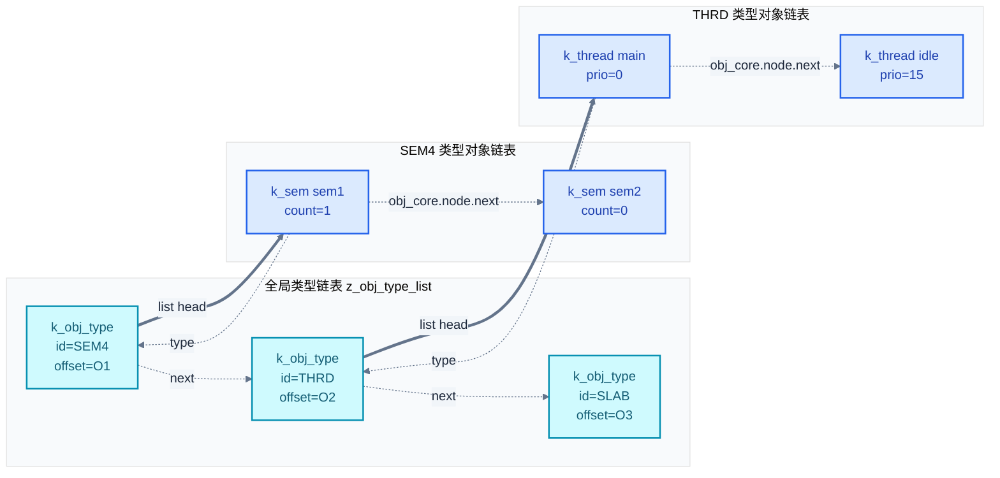
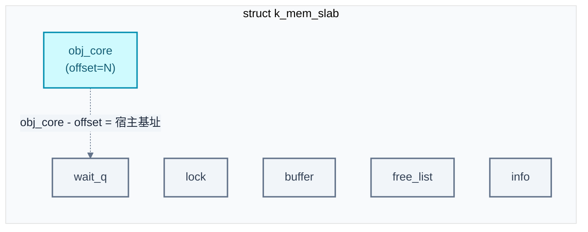
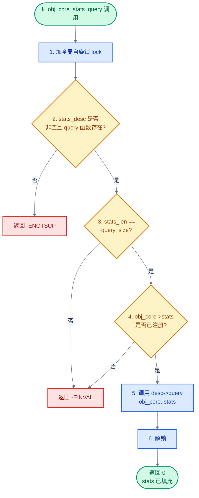

# 21. Object Cores：内核对象元数据与统计框架

> 一句话概括：本文剖析 Zephyr 的 Object Core 框架——每个内核对象内嵌一个 `struct k_obj_core`，同类对象通过 singly linked list 串起，类型本身又串成全局链表，统计走"raw → queried"二分转换，让 RTOS 内核获得类似 Linux kobject 的可观测性。
> **工程师视角**：读完后应能回答"obj_core 在内核对象中处于什么位置"、"4 字符类型 ID 如何生成"、"raw 与 queried 统计为何要分开"、"如何遍历系统中所有线程并查询每个线程的执行周期"这四个问题，并能仿照 `mem_slab` 的集成方式把自己的对象接入框架。

### 关键术语

| 缩写 | 全称 | 含义 |
|------|------|------|
| RTOS | Real-Time Operating System | 实时操作系统 |
| TCB | Thread Control Block | 线程控制块 `struct k_thread` |
| CPU | Central Processing Unit | 中央处理器 |
| RAM | Random Access Memory | 随机存取存储器 |
| ROM | Read-Only Memory | 只读存储器 |
| SMP | Symmetric Multi-Processing | 对称多处理 |
| ISR | Interrupt Service Routine | 中断服务例程 |
| API | Application Programming Interface | 应用编程接口 |
| kobject | Kernel Object | Linux 内核用于在 sysfs 中暴露内核对象元数据的机制 |
| sysfs | sys filesystem | Linux 虚拟文件系统，把内核对象按层次暴露给用户态 |
| sys_slist | Singly Linked List | Zephyr 提供的单向链表容器 `sys_slist_t` |
| sys_snode | Singly Linked Node | `sys_slist_t` 的节点类型 `sys_snode_t` |
| offset | 偏移量 | `k_obj_core` 字段在其宿主结构中的字节偏移 |

---

### 前置阅读

| 需要了解 | 参考文档 |
|----------|----------|
| 链接器 section 与静态对象枚举机制 | [20-Iterable Sections链接器魔法](./20-Iterable%20Sections链接器魔法.md) |
| 线程运行时统计的上层 API（`k_thread_runtime_stats_get`） | [05-线程与状态迁移](./05-线程与状态迁移.md) §6.4 |
| `sys_slist` 单向链表的基本用法 | [11-核心数据结构](./11-核心数据结构.md) |

---

## 1. 概述：内核对象的可观测性

> 上一章讲了 Iterable Sections——把同类静态对象分到独立 linker section，运行时用 `STRUCT_SECTION_FOREACH` 枚举。一个自然的问题是：动态创建的对象（如 `k_thread_create` 产生的线程、`k_sem_init` 初始化的信号量）不在那个 section 里，又该怎么枚举？更进一步，能不能给每个对象挂一份"统计信息"，让调试工具按统一接口查询？本章用 Object Core 框架来回答这个问题——先讲它如何用内嵌 `k_obj_core` + 双层链表组织所有对象，再讲统计接口如何把"原始数据"与"对外的查询结果"解耦。

### 1.1 一个具体小例子：枚举系统中所有信号量

假设调试时想知道"系统里到底有多少个信号量、每个被谁拿走了"。如果只能靠人工加日志，得在每个 `k_sem_*` 调用点插桩，维护成本极高。Object Core 提供的方案是：

```c
#include <zephyr/kernel/obj_core.h>

static int print_sem(struct k_obj_core *obj_core, void *data)
{
    /* obj_core 不在 struct k_sem 的首字段——用 offset 反推宿主 */
    char *ptr = (char *)obj_core - obj_core->type->obj_core_offset;
    struct k_sem *sem = (struct k_sem *)ptr;
    int *count = data;

    printk("sem %p: count=%u\n", sem, sem->count);
    (*count)++;
    return 0;
}

void dump_all_semaphores(void)
{
    struct k_obj_type *t = k_obj_type_find(K_OBJ_TYPE_SEM_ID);  /* "SEM4" */
    int count = 0;

    if (t != NULL) {
        k_obj_type_walk_locked(t, print_sem, &count);
    }
    printk("total %d semaphores\n", count);
}
```

只需在创建信号量的地方让它"被注册"（内核已自动做），调试代码就能用统一接口枚举所有同类对象——无论它是静态定义（`K_SEM_DEFINE`）还是动态初始化（`k_sem_init`）。这就是 Object Core 的核心价值：**给所有内核对象建立一份元数据，让调试工具能以统一方式发现、遍历、查询它们**。

### 1.2 设计动机

Object Core 的设计灵感来自 Linux kobject——把"对象有名字、有类型、有统计、可被遍历"这套元数据机制引入 RTOS。但 RTOS 的约束比桌面/服务器 Linux 苛刻得多：

- **RAM 紧张**：每个对象只多塞一个 `k_obj_core`（典型 8-16 字节），不能像 sysfs 那样给每个对象建完整目录
- **不能阻塞**：遍历过程中可能在中断上下文调用，链表操作必须加自旋锁而非互斥锁
- **可裁剪**：调试镜像要全开，生产镜像要全关——整个框架必须由 `CONFIG_OBJ_CORE` 一个开关控制

因此 Object Core 选择了"最小元数据 + 双层链表 + 可选统计"的极简方案。

> **核心要点**：Object Core 是 Zephyr 给 RTOS 内核装上"可观测性"的元数据框架——每个内核对象内嵌一个 `k_obj_core`，同类对象串成链表，所有类型再串成全局链表。它解决两个问题：动态对象如何被枚举、统计信息如何按统一接口查询。整套机制由 `CONFIG_OBJ_CORE` 开关，关闭时零开销。

> **设计洞察**：Object Core 的设计反映了 RTOS 借鉴桌面/服务器内核时的典型取舍——"取思想、舍实现"。Linux kobject 在桌面 Linux 上每个对象几十字节不算什么，但在 SRAM 只有 64 KB 的 Cortex-M0 上，每个信号量多 16 字节就是 0.025% 的 RAM 预算。KISS 原则在这里不是美学选择，而是物理约束。把"统计"做成可选的二级扩展（`CONFIG_OBJ_CORE_STATS`），把"名称"留给宿主对象自己管理（`k_thread_name_get`），把"层次分组"砍掉只留单一 `z_obj_type_list`——每一处"砍掉"都对应着具体的资源账单。
>
> 更值得品味的是"可裁剪"的设计纪律：整套机制由 `CONFIG_OBJ_CORE` 一个开关控制，per-object 类型再各自有 `CONFIG_OBJ_CORE_*` 子开关，统计又有 `CONFIG_OBJ_CORE_STATS_*` 子开关。三层 Kconfig 嵌套让生产镜像可以精确到"只给线程开统计、其他对象关闭"——这种"按需付费"的资源模型是 RTOS 区别于通用 OS 的核心特征。Linux 内核也有 `CONFIG_PRINTK`、`CONFIG_FTRACE` 等开关，但其默认假设是"通常开着"；Zephyr 的默认假设是"通常关着，调试镜像才开"——这种心智模型的差异，决定了整套元数据框架的每一个尺寸选择。

---

## 2. k_obj_core 结构体

Object Core 的全部基础建立在两个小结构体上。先看核心结构 `struct k_obj_core`，定义在 [include/zephyr/kernel/obj_core.h](file:///home/pbw/rtos/cs-learning-notes/zephyr-project/zephyr/include/zephyr/kernel/obj_core.h#L121-L127)：

```c
/* include/zephyr/kernel/obj_core.h */
/** Object core structure */
struct k_obj_core {
	sys_snode_t        node;   /**< Object node within object type's list */
	struct k_obj_type *type;   /**< Object type to which object belongs */
#ifdef CONFIG_OBJ_CORE_STATS
	void  *stats;              /**< Pointer to kernel object's stats */
#endif /* CONFIG_OBJ_CORE_STATS */
};
```

逐字段解释：

- `node`：`sys_snode_t` 是 Zephyr 的单向链表节点（一个 `next` 指针）。`k_obj_core` 通过它挂到所属类型的链表上。**注意是单向链表而非双向**——这是省内存的关键，每个对象只多 8 字节（64 位系统上 `next` + `type` 两个指针）。
- `type`：反向指针，指向所属的 `struct k_obj_type`。这让"从对象找到类型"成为 O(1) 操作，无需遍历类型链表。
- `stats`：仅在 `CONFIG_OBJ_CORE_STATS=y` 时存在，指向该对象的"原始统计"缓冲区。详见 §6。

容器结构 `struct k_obj_type` 紧随其后，定义在同文件 L109-L118：

```c
/* include/zephyr/kernel/obj_core.h */
/** Object type structure */
struct k_obj_type {
	sys_snode_t    node;   /**< Node within list of object types */
	sys_slist_t    list;   /**< List of objects of this object type */
	uint32_t       id;     /**< Unique type ID */
	size_t         obj_core_offset;  /**< Offset to obj_core field */
#ifdef CONFIG_OBJ_CORE_STATS
	/** Pointer to object core statistics descriptor */
	struct k_obj_core_stats_desc *stats_desc;
#endif /* CONFIG_OBJ_CORE_STATS */
};
```

逐字段解释：

- `node`：把"类型本身"挂到全局 `z_obj_type_list` 上的链表节点。
- `list`：该类型下所有对象的链表头（`sys_slist_t` 是 head + tail 双指针的单向链表）。
- `id`：32 位类型 ID，用 4 字符 ASCII 拼出（§3）。
- `obj_core_offset`：`k_obj_core` 在宿主结构中的字节偏移（§5）。
- `stats_desc`：仅在 `CONFIG_OBJ_CORE_STATS=y` 时存在，指向统计描述符（§6）。

整个框架在内存中的拓扑见下面的 Mermaid 图：



> **如何读这张图**：上层是全局类型链表 `z_obj_type_list`，每个节点是一个 `k_obj_type`（用 `node` 字段串起来）。每个类型有一条独立的对象链表（用 `list` 字段做 head）。每个对象内嵌的 `k_obj_core` 用 `node` 挂到所属类型的对象链表，用 `type` 反向指回所属类型。两层链表 + 反向指针 = 完整的对象图谱。

> **核心要点**：`k_obj_core` 只有 3 个字段——`node`（挂到对象链表）、`type`（反向指针）、`stats`（可选统计）。`k_obj_type` 也只有 5 个字段——`node`（挂到全局类型链表）、`list`（对象链表头）、`id`、`obj_core_offset`、`stats_desc`。整个框架的内存开销是"每对象多 16 字节 + 每类型 ~48 字节"。

> **设计洞察**：选择 `sys_slist`（单向链表）而非 `sys_dlist`（双向链表）是省内存的明确选择——每个节点少一个 `prev` 指针，64 位系统上每对象省 8 字节。代价是 `unlink` 需要 O(n) 查找前驱节点（`sys_slist_find_and_remove` 内部遍历）。但 obj_core 的操作分布极不均衡：`link`（对象创建时 append 到末尾，O(1)）和 `walk`（遍历，O(n)）是高频操作，`unlink`（对象销毁）是低频操作。用 O(n) unlink 换 O(1) 内存，是教科书级的"按操作频率分配复杂度"权衡。
>
> 这与 Linux 内核 `struct hlist_node`（哈希桶用单向链表节点，只有一个 `next` 指针）的设计思路同源——在"内存稀缺"与"低频操作"两个条件下，单向链表是正确选择。对比之下，Linux 调度器的运行队列用双向链表（`struct list_head`），因为任务切换时既要前插也要后插、既要删头也要删尾，O(1) 双向操作是必需的。**数据结构的选择没有银弹，只有与操作分布匹配的取舍**。从空间局部性看，单向链表还有一个隐含优势：节点更小，相同数量的对象占用的 cache 行更少，遍历时 cache miss 率更低——在 MCU 没有数据 cache 的场景这不重要，但在带 L1 cache 的 Cortex-R/A 上会成为可测量的性能差异。

---

## 3. 类型注册：K_OBJ_TYPE_ID_GEN

类型 ID 是 32 位无符号整数，但 Zephyr 选择用 4 个 ASCII 字符拼出来，定义在 [include/zephyr/kernel/obj_core.h](file:///home/pbw/rtos/cs-learning-notes/zephyr-project/zephyr/include/zephyr/kernel/obj_core.h#L26)：

```c
/* include/zephyr/kernel/obj_core.h */
#define K_OBJ_TYPE_ID_GEN(s)     ((s[0] << 24) | (s[1] << 16) | (s[2] << 8) | s[3])
```

### 3.1 4 字符 ID 的本质

`K_OBJ_TYPE_ID_GEN("SEM4")` 在编译期展开为：

```
'S' = 0x53  'E' = 0x45  'M' = 0x4D  '4' = 0x34
id = (0x53 << 24) | (0x45 << 16) | (0x4D << 8) | 0x34
   = 0x53454D34
```

这样一个 32 位整数既能用 `uint32_t` 比较（O(1) 查找），又能在调试器或日志里以 4 字符 ASCII 形式被人读懂——`hexdump` 一眼就能看出是 `SEM4` 而不是 `0x53454D34`。

> **为什么是 4 字符而不是任意字符串？** 32 位正好是一个寄存器宽度，比较与传递都是单指令开销。若用任意长度字符串，类型查找要做 `strcmp`，且每个类型要存变长字符串——这与"最小元数据"的设计目标相悖。4 字符是"可读性"与"机器效率"的折中——足够区分 26^4 ≈ 45 万种类型，又能在单寄存器内比较。

### 3.2 已注册的类型 ID

[include/zephyr/kernel/obj_core.h](file:///home/pbw/rtos/cs-learning-notes/zephyr-project/zephyr/include/zephyr/kernel/obj_core.h#L31-L61) 列出所有内置类型：

| 宏名 | 4 字符 ID | 宿主结构 |
|------|----------|----------|
| `K_OBJ_TYPE_CONDVAR_ID` | `"COND"` | `struct k_condvar` |
| `K_OBJ_TYPE_CPU_ID` | `"CPU_"` | `struct _cpu` |
| `K_OBJ_TYPE_EVENT_ID` | `"EVNT"` | `struct k_event` |
| `K_OBJ_TYPE_FIFO_ID` | `"FIFO"` | `struct k_fifo` |
| `K_OBJ_TYPE_KERNEL_ID` | `"KRNL"` | `struct z_kernel` |
| `K_OBJ_TYPE_LIFO_ID` | `"LIFO"` | `struct k_lifo` |
| `K_OBJ_TYPE_MEM_BLOCK_ID` | `"MBLK"` | `struct sys_mem_blocks` |
| `K_OBJ_TYPE_MBOX_ID` | `"MBOX"` | `struct k_mbox` |
| `K_OBJ_TYPE_MEM_SLAB_ID` | `"SLAB"` | `struct k_mem_slab` |
| `K_OBJ_TYPE_MSGQ_ID` | `"MSGQ"` | `struct k_msgq` |
| `K_OBJ_TYPE_MUTEX_ID` | `"MUTX"` | `struct k_mutex` |
| `K_OBJ_TYPE_PIPE_ID` | `"PIPE"` | `struct k_pipe` |
| `K_OBJ_TYPE_SEM_ID` | `"SEM4"` | `struct k_sem` |
| `K_OBJ_TYPE_STACK_ID` | `"STCK"` | `struct k_stack` |
| `K_OBJ_TYPE_THREAD_ID` | `"THRD"` | `struct k_thread` |
| `K_OBJ_TYPE_TIMER_ID` | `"TIMR"` | `struct k_timer` |

> **如何读这张表**：4 字符 ID 大多是类型名的缩写（COND/CONDVAR、SEM4/SEM、MUTX/MUTEX）。注意 `SEM4` 用了数字 `4` 把 `SEM` 补到 4 字符——这是 4 字符约束的体现。开发者自定义类型时，应在自己代码里 `#define K_OBJ_TYPE_MY_TYPE K_OBJ_TYPE_ID_GEN("UNIQ")`，并保证全局不冲突。

### 3.3 类型的初始化时机

每个内置类型在 `PRE_KERNEL_1` 阶段、用 `CONFIG_KERNEL_INIT_PRIORITY_OBJECTS` 优先级通过 `SYS_INIT` 注册。以线程类型为例，[kernel/thread.c](file:///home/pbw/rtos/cs-learning-notes/zephyr-project/zephyr/kernel/thread.c#L52-L69)：

```c
/* kernel/thread.c （节选） */
#ifdef CONFIG_OBJ_CORE_THREAD
static struct k_obj_type  obj_type_thread;

#ifdef CONFIG_OBJ_CORE_STATS_THREAD
static struct k_obj_core_stats_desc  thread_stats_desc = {
	.raw_size = sizeof(struct k_cycle_stats),
	.query_size = sizeof(struct k_thread_runtime_stats),
	.raw   = z_thread_stats_raw,
	.query = z_thread_stats_query,
	.reset = z_thread_stats_reset,
	.disable = z_thread_stats_disable,
	.enable  = z_thread_stats_enable,
};
#endif /* CONFIG_OBJ_CORE_STATS_THREAD */

static int init_thread_obj_core_list(void)
{
	z_obj_type_init(&obj_type_thread, K_OBJ_TYPE_THREAD_ID,
			offsetof(struct k_thread, obj_core));

#ifdef CONFIG_OBJ_CORE_STATS_THREAD
	k_obj_type_stats_init(&obj_type_thread, &thread_stats_desc);
#endif /* CONFIG_OBJ_CORE_STATS_THREAD */

	return 0;
}

SYS_INIT(init_thread_obj_core_list, PRE_KERNEL_1,
	 CONFIG_KERNEL_INIT_PRIORITY_OBJECTS);
#endif /* CONFIG_OBJ_CORE_THREAD */
```

`z_obj_type_init` 的实现非常简单，[kernel/obj_core.c](file:///home/pbw/rtos/cs-learning-notes/zephyr-project/zephyr/kernel/obj_core.c#L14-L23)：

```c
/* kernel/obj_core.c */
struct k_obj_type *z_obj_type_init(struct k_obj_type *type,
				   uint32_t id, size_t off)
{
	sys_slist_init(&type->list);
	sys_slist_append(&z_obj_type_list, &type->node);
	type->id = id;
	type->obj_core_offset = off;

	return type;
}
```

4 个动作：初始化对象链表头 → 把本类型挂到全局 `z_obj_type_list` → 记录 4 字符 ID → 记录 `obj_core` 字段在其宿主结构中的偏移。

> **核心要点**：类型 ID 用 4 字符 ASCII 拼成 32 位整数——既可在单寄存器内比较，又能在调试器里读出语义。每个内置类型在 `PRE_KERNEL_1` 阶段通过 `SYS_INIT` 调用 `z_obj_type_init` 注册到全局 `z_obj_type_list`，把"类型"也变成可遍历的对象。

---

## 4. 对象链表：同类对象串联

类型注册只是建立了"链表头"，真正让对象可被枚举的是把每个对象挂到所属类型的链表上。这通过三个 API 完成，[kernel/obj_core.c](file:///home/pbw/rtos/cs-learning-notes/zephyr-project/zephyr/kernel/obj_core.c#L25-L57)：

```c
/* kernel/obj_core.c */
void k_obj_core_init(struct k_obj_core *obj_core, struct k_obj_type *type)
{
	obj_core->node.next = NULL;
	obj_core->type = type;
#ifdef CONFIG_OBJ_CORE_STATS
	obj_core->stats = NULL;
#endif /* CONFIG_OBJ_CORE_STATS */
}

void k_obj_core_link(struct k_obj_core *obj_core)
{
	k_spinlock_key_t  key = k_spin_lock(&lock);

	sys_slist_append(&obj_core->type->list, &obj_core->node);

	k_spin_unlock(&lock, key);
}

void k_obj_core_init_and_link(struct k_obj_core *obj_core,
			      struct k_obj_type *type)
{
	k_obj_core_init(obj_core, type);
	k_obj_core_link(obj_core);
}

void k_obj_core_unlink(struct k_obj_core *obj_core)
{
	k_spinlock_key_t  key = k_spin_lock(&lock);

	sys_slist_find_and_remove(&obj_core->type->list, &obj_core->node);

	k_spin_unlock(&lock, key);
}
```

### 4.1 init / link / unlink 三步

| 操作 | API | 作用 | 是否加锁 |
|------|-----|------|----------|
| 初始化 | `k_obj_core_init` | 设置 `type` 反向指针，清空 `node.next` 与 `stats` | 否 |
| 挂链 | `k_obj_core_link` | 把 `node` append 到 `type->list` 末尾 | 是 |
| 一体化 | `k_obj_core_init_and_link` | init + link 的便捷封装 | link 部分加锁 |
| 摘链 | `k_obj_core_unlink` | 从 `type->list` 中查找并移除 `node` | 是 |

> **为什么 init 不加锁，link 加锁？** `init` 只写对象自己字段（`obj_core->type` 等），此时对象尚未入链，外部不可能拿到它的指针——无并发风险。`link` 把对象加入全局可见的链表，与其他 CPU 上同时 `link`/`unlink` 同类型对象存在竞争——必须加全局自旋锁 `lock`。

### 4.2 全局自旋锁的代价

`k_obj_core.c` 定义了唯一的全局自旋锁：

```c
/* kernel/obj_core.c */
static struct k_spinlock  lock;
```

所有 `link`/`unlink`/`walk_locked`/`stats_*` 操作都争用这一把锁。这意味着：

- 多核同时创建/销毁同类型对象时，会串行化
- 遍历某类型链表（`walk_locked`）时，所有 CPU 上该类型对象的 `link`/`unlink` 都被阻塞

为了给"不需要强一致"的场景留出口，框架还提供了 `k_obj_type_walk_unlocked`（[kernel/obj_core.c](file:///home/pbw/rtos/cs-learning-notes/zephyr-project/zephyr/kernel/obj_core.c#L104-L122)），不加锁直接遍历——调用者必须自行保证遍历期间链表不被修改。

> **设计洞察**：单一全局自旋锁是最简单的实现，但在 SMP 上会成为争用热点——所有 CPU 的 obj_core 操作都串行化，且锁变量所在的 cacheline 会在核间反复迁移（cacheline ping-pong）。每核 L1 cache 命中是几个周期，跨核 cacheline 迁移是几十到上百周期——在高频创建/销毁对象的场景下，这把锁可能成为吞吐瓶颈。Linux 内核在类似场景下会按对象类型分锁、用 RCU（Read-Copy-Update）让读者完全无锁、或用 per-cpu 计数器让写者局部化。Zephyr 的取舍是：obj_core 操作低频（对象创建/销毁非热路径，统计查询是调试行为），用一把锁换实现简单 + 内存零额外开销是可接受的；如果未来 obj_core 被用于热路径（例如运行时性能监控），应该按 `type->lock` 分锁，让不同类型的操作互不干扰。
>
> 更值得关注的是 `walk_unlocked` 的存在——它是对"强弱一致性分层"的工程化体现。`walk_locked` 保证遍历期间链表不变，适合精确统计；`walk_unlocked` 接受"可能看到脏数据"，适合调试快照、best-effort 打印。这种"提供两套接口让调用方按场景选择"的模式，与 Linux 内核 `rcu_read_lock` vs `spin_lock` 的分层是同源思想：**不是所有读操作都需要强一致，把"弱一致"作为一等公民提供出来，能让大量低风险场景避免锁开销**。Zephyr 没有照搬 RCU（其实现复杂、要求优雅期机制），但用 `walk_unlocked` + 调用方契约（"保证遍历期间不修改"）达到了 80% 的效果——这是 RTOS 资源约束下的务实选择。

### 4.3 在线程创建中的调用点

线程是动态创建最频繁的对象类型。`z_setup_new_thread` 在 [kernel/thread.c](file:///home/pbw/rtos/cs-learning-notes/zephyr-project/zephyr/kernel/thread.c#L593-L600) 完成 obj_core 的注册：

```c
/* kernel/thread.c */
#ifdef CONFIG_OBJ_CORE_THREAD
	k_obj_core_init_and_link(K_OBJ_CORE(new_thread), &obj_type_thread);
#ifdef CONFIG_OBJ_CORE_STATS_THREAD
	k_obj_core_stats_register(K_OBJ_CORE(new_thread),
				  &new_thread->base.usage,
				  sizeof(new_thread->base.usage));
#endif /* CONFIG_OBJ_CORE_STATS_THREAD */
#endif /* CONFIG_OBJ_CORE_THREAD */
```

注意三个细节：

1. `K_OBJ_CORE(new_thread)` 宏（[include/zephyr/kernel/obj_core.h](file:///home/pbw/rtos/cs-learning-notes/zephyr-project/zephyr/include/zephyr/kernel/obj_core.h#L21)）展开为 `&((new_thread)->obj_core)`，即取宿主结构里 `obj_core` 字段的地址。
2. 紧接着调用 `k_obj_core_stats_register` 把线程的 `base.usage`（一个 `struct k_cycle_stats`）登记为该线程的 raw 统计缓冲区。
3. 这段代码被 `CONFIG_OBJ_CORE_THREAD` 包裹——关闭配置时编译为空，零开销。

线程终止时（`k_thread_abort`）会调用 `k_obj_core_unlink` 把自己从链表摘掉（详见 §9 的测试代码佐证——`abort` 后再 walk 找不到对应对象）。

> **核心要点**：每个对象在初始化时调用 `k_obj_core_init_and_link` 把自己挂到所属类型的链表上，所有链表操作共用一把全局自旋锁。`init` 与 `link` 拆分让"先填好对象字段再加入全局链表"成为可能——避免外部看到半初始化的对象。`walk_locked` 与 `walk_unlocked` 提供强弱两种一致性选项，让框架既能用于精确统计，也能用于低开销快照。

---

## 5. obj_core_offset：灵活嵌入

回头看 §1.1 的例子：

```c
char *ptr = (char *)obj_core - obj_core->type->obj_core_offset;
struct k_sem *sem = (struct k_sem *)ptr;
```

这是"从内嵌的 `obj_core` 反向定位宿主结构"的标准技巧。它的前提是：**类型注册时记录了 `obj_core` 在宿主结构中的字节偏移**。

### 5.1 为什么需要 offset

`k_obj_core` 不要求是宿主结构的第一个字段。事实上，所有内置类型都把它放在最后或靠后位置，且用 `CONFIG_OBJ_CORE_*` 包裹——这样关闭配置时字段不存在，结构更紧凑。以 `struct k_mem_slab` 为例（[include/zephyr/kernel.h](file:///home/pbw/rtos/cs-learning-notes/zephyr-project/zephyr/include/zephyr/kernel.h#L5804-L5815)）：

```c
/* include/zephyr/kernel.h （节选） */
struct k_mem_slab {
	_wait_q_t wait_q;
	struct k_spinlock lock;
	char *buffer;
	char *free_list;
	struct k_mem_slab_info info;

	SYS_PORT_TRACING_TRACKING_FIELD(k_mem_slab)

#ifdef CONFIG_OBJ_CORE_MEM_SLAB
	struct k_obj_core  obj_core;
#endif
};
```

`obj_core` 在末尾，且被 `CONFIG_OBJ_CORE_MEM_SLAB` 包裹。`mem_slab.c` 在注册类型时记下偏移：

```c
/* kernel/mem_slab.c */
z_obj_type_init(&obj_type_mem_slab, K_OBJ_TYPE_MEM_SLAB_ID,
		offsetof(struct k_mem_slab, obj_core));
```

### 5.2 CONTAINER_OF 的等价写法

熟悉 Linux 内核的读者会想到 `container_of` 宏。Object Core 的 `obj_core_offset` 字段让"通过指针 + 偏移反推宿主"成为运行时配置——同一段遍历代码可以处理任何类型的对象，只需查 `obj_core->type->obj_core_offset`。



> **如何读这张图**：`obj_core` 不是首字段，它在结构体中的位置由字段顺序与前面字段大小决定。`type->obj_core_offset` 在类型注册时通过 `offsetof(struct k_mem_slab, obj_core)` 算出并保存。遍历时把 `obj_core` 指针减去这个偏移就得到宿主结构基址——等价于 `CONTAINER_OF(obj_core, struct k_mem_slab, obj_core)`，但偏移在运行时从类型描述符读取，让通用遍历代码无需知道具体类型。

> **为什么不用 `CONTAINER_OF` 宏写死？** 因为通用遍历代码（如调试 shell 的 `kernel objects` 命令）不预先知道对象类型——它从 `z_obj_type_list` 拿到类型描述符，从 `type->list` 拿到 `obj_core` 节点。`CONTAINER_OF` 需要编译期知道宿主类型与字段名；`obj_core_offset` 让这个信息在运行时从类型描述符取，实现了"一段代码遍历任意类型"。

> **核心要点**：`obj_core_offset` 让 `k_obj_core` 不必是宿主结构首字段——配合 `CONFIG_OBJ_CORE_*` 开关，关闭配置时该字段消失，结构更紧凑。遍历代码用 `obj_core - obj_core_offset` 反推宿主基址，等价于运行时版的 `CONTAINER_OF`，让通用调试工具无需为每种类型写专用代码。

---

## 6. 统计框架：CONFIG_OBJ_CORE_STATS

到此为止的机制只解决了"枚举"问题。`CONFIG_OBJ_CORE_STATS` 进一步解决"查询统计"问题——每个对象可以挂一份"原始统计"，并通过类型描述符里登记的函数指针把它转成"对外查询结果"。

### 6.1 统计描述符

`struct k_obj_core_stats_desc` 定义在 [include/zephyr/kernel/obj_core.h](file:///home/pbw/rtos/cs-learning-notes/zephyr-project/zephyr/include/zephyr/kernel/obj_core.h#L92-L106)：

```c
/* include/zephyr/kernel/obj_core.h */
struct k_obj_core_stats_desc {
	size_t  raw_size;   /**< Internal representation stats buffer size */
	size_t  query_size; /**< Stats buffer size used for reporting */

	int (*raw)(struct k_obj_core *obj_core, void *stats);
	int (*query)(struct k_obj_core *obj_core, void *stats);
	int (*reset)(struct k_obj_core *obj_core);
	int (*disable)(struct k_obj_core *obj_core);
	int (*enable)(struct k_obj_core *obj_core);
};
```

逐字段解释：

- `raw_size`：raw 统计缓冲区的大小（字节）。注册时 `k_obj_core_stats_register` 会校验传入缓冲区与此尺寸匹配。
- `query_size`：查询返回缓冲区的大小（字节）。`k_obj_core_stats_query` 会校验调用方传入的缓冲区与此尺寸匹配。
- `raw`：把 raw 统计拷贝到调用方缓冲区的函数。仅做"快照拷贝"，不做计算。
- `query`：把 raw 统计**转换**为对外可读统计的函数。可包含计算（如取平均、求和）。
- `reset`：清零 raw 统计的函数。
- `disable` / `enable`：暂停/恢复统计采集的函数。某些对象（如线程）支持运行时开关；其他对象（如 mem_slab）统计永远开，这两个指针为 `NULL`。

### 6.2 Kconfig 依赖

`CONFIG_OBJ_CORE_STATS` 是统计框架的总开关，[kernel/Kconfig.obj_core](file:///home/pbw/rtos/cs-learning-notes/zephyr-project/zephyr/kernel/Kconfig.obj_core#L122-L153)：

```
menuconfig OBJ_CORE_STATS
	bool "Object core statistics"
	default n

if OBJ_CORE_STATS
config OBJ_CORE_STATS_MEM_SLAB
	bool "Object core statistics for memory slabs"
	default y if OBJ_CORE_MEM_SLAB

config OBJ_CORE_STATS_THREAD
	bool "Object core statistics for threads"
	default y if OBJ_CORE_THREAD
	select THREAD_RUNTIME_STATS

config OBJ_CORE_STATS_SYSTEM
	bool "Object core statistics for system level objects"
	default y if OBJ_CORE_SYSTEM
	select SCHED_THREAD_USAGE_ALL
endif  # OBJ_CORE_STATS
```

> **为什么 `OBJ_CORE_STATS_THREAD` 要 `select THREAD_RUNTIME_STATS`？** 因为线程的 raw 统计 `struct k_cycle_stats` 来自调度器的周期采样（`CONFIG_SCHED_THREAD_USAGE`），而 query 输出 `struct k_thread_runtime_stats` 来自运行时统计 API（`CONFIG_THREAD_RUNTIME_STATS`）。前者是后者的数据源——`select` 表达了这个依赖：开统计就必须开底层周期采样。

### 6.3 注册流程

每个支持统计的对象在创建时调用 `k_obj_core_stats_register`，[kernel/obj_core.c](file:///home/pbw/rtos/cs-learning-notes/zephyr-project/zephyr/kernel/obj_core.c#L125-L145)：

```c
/* kernel/obj_core.c */
int k_obj_core_stats_register(struct k_obj_core *obj_core, void *stats,
			      size_t stats_len)
{
	int rv;
	k_spinlock_key_t key = k_spin_lock(&lock);

	if (obj_core->type->stats_desc == NULL) {
		/* Object type not configured for statistics. */
		rv = -ENOTSUP;
	} else if (obj_core->type->stats_desc->raw_size != stats_len) {
		/* Buffer size mismatch */
		rv = -EINVAL;
	} else {
		obj_core->stats = stats;
		rv = 0;
	}

	k_spin_unlock(&lock, key);

	return rv;
}
```

三个关键点：

1. **类型必须先有 `stats_desc`**：注册前类型描述符里 `stats_desc` 必须已通过 `k_obj_type_stats_init` 设置好，否则返回 `-ENOTSUP`。
2. **缓冲区大小校验**：调用方传入的 `stats_len` 必须等于 `stats_desc->raw_size`，防止类型误用——例如把 `struct k_cycle_stats` 的指针当作 `struct k_mem_slab_info` 传进来。
3. **登记的是指针，不是拷贝**：`obj_core->stats = stats` 只存指针。统计缓冲区由对象自身拥有（如 `k_thread.base.usage`），生命周期与对象一致。

以线程为例，[kernel/thread.c](file:///home/pbw/rtos/cs-learning-notes/zephyr-project/zephyr/kernel/thread.c#L596-L598)：

```c
k_obj_core_stats_register(K_OBJ_CORE(new_thread),
			  &new_thread->base.usage,
			  sizeof(new_thread->base.usage));
```

`new_thread->base.usage` 是 `struct k_cycle_stats` 类型（[include/zephyr/kernel/stats.h](file:///home/pbw/rtos/cs-learning-notes/zephyr-project/zephyr/include/zephyr/kernel/stats.h#L18-L31)），由调度器在每个时钟 tick 累加。obj_core 框架只是"借指针"——查询时通过指针读取，无需拷贝。

> **核心要点**：`CONFIG_OBJ_CORE_STATS` 给类型描述符加一个 `stats_desc` 指针，给对象 core 加一个 `stats` 指针。注册时只存指针、不拷贝数据——统计缓冲区由对象自身拥有，框架只是把它"暴露"给统一查询接口。`raw_size` 校验防止类型误用。

---

## 7. raw 与 queried 统计转换

统计框架的核心创新是"raw"与"queried"二分。这两个概念容易混淆，先用 mem_slab 的具体例子说明。

### 7.1 raw 与 queried 的区别

| 维度 | raw | queried |
|------|-----|---------|
| **数据来源** | 对象内部直接维护的状态 | 在 raw 基础上**计算**得到 |
| **典型字段** | 计数器（如 `num_used`、`max_used`） | 派生量（如 `allocated_bytes = num_used * block_size`） |
| **是否含历史** | 是（如 `max_used` 跟踪历史峰值） | 否（即时计算） |
| **API** | `k_obj_core_stats_raw` | `k_obj_core_stats_query` |
| **缓冲区大小** | `raw_size` | `query_size` |
| **典型场景** | 内核自身记账 | 调试/监控工具对外展示 |

### 7.2 mem_slab 的具体例子

`struct k_mem_slab_info`（[include/zephyr/kernel.h](file:///home/pbw/rtos/cs-learning-notes/zephyr-project/zephyr/include/zephyr/kernel.h#L5795-L5802)）是 mem_slab 的 raw 统计：

```c
struct k_mem_slab_info {
	uint32_t num_blocks;    /* 总块数 */
	size_t   block_size;    /* 每块字节数 */
	uint32_t num_used;      /* 当前已用块数 */
#ifdef CONFIG_MEM_SLAB_TRACE_MAX_UTILIZATION
	uint32_t max_used;      /* 历史峰值已用块数 */
#endif
};
```

`struct sys_memory_stats`（[include/zephyr/sys/mem_stats.h](file:///home/pbw/rtos/cs-learning-notes/zephyr-project/zephyr/include/zephyr/sys/mem_stats.h#L24-L28)）是 queried 输出：

```c
struct sys_memory_stats {
	size_t  free_bytes;           /* 当前空闲字节数 */
	size_t  allocated_bytes;      /* 当前已分配字节数 */
	size_t  max_allocated_bytes;  /* 历史峰值已分配字节数 */
};
```

转换函数 `k_mem_slab_stats_query`，[kernel/mem_slab.c](file:///home/pbw/rtos/cs-learning-notes/zephyr-project/zephyr/kernel/mem_slab.c#L41-L62)：

```c
/* kernel/mem_slab.c */
static int k_mem_slab_stats_query(struct k_obj_core *obj_core, void *stats)
{
	struct k_mem_slab *slab;
	k_spinlock_key_t   key;
	struct sys_memory_stats *ptr = stats;

	slab = CONTAINER_OF(obj_core, struct k_mem_slab, obj_core);
	key = k_spin_lock(&slab->lock);
	ptr->free_bytes = (slab->info.num_blocks - slab->info.num_used) *
			  slab->info.block_size;
	ptr->allocated_bytes = slab->info.num_used * slab->info.block_size;
#ifdef CONFIG_MEM_SLAB_TRACE_MAX_UTILIZATION
	ptr->max_allocated_bytes = slab->info.max_used * slab->info.block_size;
#else
	ptr->max_allocated_bytes = 0;
#endif /* CONFIG_MEM_SLAB_TRACE_MAX_UTILIZATION */
	k_spin_unlock(&slab->lock, key);

	return 0;
}
```

### 7.3 具体数值演算

假设有一个 mem_slab：`num_blocks=10`，`block_size=32`，当前 `num_used=3`，`max_used=7`（启用了 `CONFIG_MEM_SLAB_TRACE_MAX_UTILIZATION`）。

**raw 直读**（`k_obj_core_stats_raw`）：

```
num_blocks    = 10
block_size    = 32
num_used      = 3
max_used      = 7
```

**query 转换**（`k_mem_slab_stats_query`）：

```
free_bytes          = (10 - 3) * 32 = 224
allocated_bytes     = 3 * 32        = 96
max_allocated_bytes = 7 * 32        = 224
```

注意 `free_bytes` 与 `max_allocated_bytes` 数值相同（224）——这是巧合：当前空闲字节恰好等于历史峰值已分配字节。两个数字语义完全不同：前者是即时状态，后者是历史峰值。

### 7.4 raw → queried 转换流程图



> **如何读这张图**：`k_obj_core_stats_query` 的完整路径——三道校验（类型支持、长度匹配、对象已注册）→ 调用类型特定的 query 函数 → 解锁返回。`k_obj_core_stats_raw` 走完全相同的校验流程，只是调用 `desc->raw` 而非 `desc->query`。这种"通用骨架 + 类型特定函数指针"的模式让框架能容纳任意类型的统计，无需修改核心代码。

### 7.5 线程统计的 raw 与 queried

线程的统计也走 raw/queried 二分，但 raw 与 queried 字段名差异更大：

- **raw**：`struct k_cycle_stats`（[include/zephyr/kernel/stats.h](file:///home/pbw/rtos/cs-learning-notes/zephyr-project/zephyr/include/zephyr/kernel/stats.h#L18-L31)）——只有 `total`、`current`、`longest`、`num_windows`、`track_usage` 这几个字段，是调度器内部记账用的"原始数据"。
- **queried**：`struct k_thread_runtime_stats`（[include/zephyr/kernel/thread.h](file:///home/pbw/rtos/cs-learning-notes/zephyr-project/zephyr/include/zephyr/kernel/thread.h#L207-L248)）——含 `execution_cycles`、`total_cycles`、`current_cycles`、`peak_cycles`、`average_cycles`、`idle_cycles`，是 05 章 §6.4 已经讲过的对外接口。

转换函数 `z_thread_stats_query`，[kernel/usage.c](file:///home/pbw/rtos/cs-learning-notes/zephyr-project/zephyr/kernel/usage.c#L357-L366)：

```c
/* kernel/usage.c */
int z_thread_stats_query(struct k_obj_core *obj_core, void *stats)
{
	struct k_thread *thread;

	thread = CONTAINER_OF(obj_core, struct k_thread, obj_core);

	z_sched_thread_usage(thread, stats);

	return 0;
}
```

`z_sched_thread_usage` 把 raw 的 `total`/`current`/`longest`/`num_windows` 转成 queried 的 `execution_cycles`/`current_cycles`/`peak_cycles`/`average_cycles`——后者是前者的"工程化包装"。

> **为什么 raw 与 queried 要分开？** 因为它们服务不同场景：
> - **raw 是"低成本常采"**——调度器每个 tick 累加一次 `total`，几乎零开销，永远开着
> - **queried 是"按需聚合"**——查询时才计算平均值等派生量，调用方决定频率
>
> 如果只有 raw，调试工具要自己写"如何把 cycle 计数转成 average_cycles"——重复造轮子。如果只有 queried，调度器每次 tick 都要做"求平均"——浪费 CPU。二分让内核只维护最便宜的 raw，把"如何对外呈现"交给 query 函数，**让"低成本常采、按需聚合"成为可能**。

> **核心要点**：raw 是对象内部维护的"原始计数"（如 `num_used`、`total cycles`），queried 是在 raw 基础上"计算"出的对外指标（如 `allocated_bytes`、`average_cycles`）。两者通过 `k_obj_core_stats_raw` / `k_obj_core_stats_query` 暴露，走相同的"三道校验 + 函数指针分发"骨架。这种二分让内核只维护最便宜的 raw 计数，把派生计算推迟到查询时——降低常采开销。

> **设计洞察**：raw/queried 二分是 CQRS（Command Query Responsibility Segregation）在内核统计上的应用——"写侧"（raw 累加）只做最便宜的计数增量，"读侧"（query 转换）按需做派生计算与单位换算。这与数据库的"物化视图"思路同源：常采的数据是"原始事实"（fact table），查询时才计算"派生指标"（aggregated view）。延迟计算让"求平均"这种 O(n) 操作只发生在查询时，而不是每个 tick 都做——对 RTOS 而言，这意味着调度器的 tick 中断处理时间不依赖"用户是否关心 average_cycles"。
>
> 从系统软件设计原理看，这是"关注点分离"的纯粹实践。raw 关心"如何低成本地记录事实"——调度器在 tick 中断里只做 `total += delta` 一次加法，不分配、不计算、不格式化；query 关心"如何把事实呈现给人"——按字节算、按周期算、按百分比算，都是查询时的事。两层各自演化：raw 可以加新字段（如 `num_windows`）而不影响旧查询代码；query 可以加新派生量（如 `p99_cycles`）而不动调度器热路径。Linux 内核的 schedstats、/proc/stat、vmstat 都是同一模式的体现——内核只记原始事件计数，用户态读取时才做聚合与格式化。Zephyr 把这个模式标准化到 `k_obj_core_stats_desc` 函数指针表里，让任意对象类型都能复用同一套"常采 + 按需聚合"骨架，这是设计上的高明之处。

---

## 8. 已集成的内核对象

Object Core 不是"全有或全无"——每个内核对象类型都有独立的 `CONFIG_OBJ_CORE_*` 开关，可以单独启用/关闭。

### 8.1 集成清单

下表汇总所有已集成的内核对象，对应 [kernel/Kconfig.obj_core](file:///home/pbw/rtos/cs-learning-notes/zephyr-project/zephyr/kernel/Kconfig.obj_core) 与官方文档 [doc/kernel/object_cores/index.rst](file:///home/pbw/rtos/cs-learning-notes/zephyr-project/zephyr/doc/kernel/object_cores/index.rst)：

| 对象类型 | Kconfig 开关 | 类型 ID | raw 数据类型 | queried 数据类型 | 统计 Kconfig |
|----------|-------------|---------|--------------|------------------|--------------|
| Condition Variable | `OBJ_CORE_CONDVAR` | `COND` | — | — | — |
| Event | `OBJ_CORE_EVENT` | `EVNT` | — | — | — |
| FIFO | `OBJ_CORE_FIFO` | `FIFO` | — | — | — |
| LIFO | `OBJ_CORE_LIFO` | `LIFO` | — | — | — |
| Mailbox | `OBJ_CORE_MAILBOX` | `MBOX` | — | — | — |
| Memory Slab | `OBJ_CORE_MEM_SLAB` | `SLAB` | `struct k_mem_slab_info` | `struct sys_memory_stats` | `OBJ_CORE_STATS_MEM_SLAB` |
| Memory Blocks | `OBJ_CORE_SYS_MEM_BLOCKS` | `MBLK` | `struct sys_mem_blocks_info` | `struct sys_memory_stats` | `OBJ_CORE_STATS_SYS_MEM_BLOCKS` |
| Message Queue | `OBJ_CORE_MSGQ` | `MSGQ` | — | — | — |
| Mutex | `OBJ_CORE_MUTEX` | `MUTX` | — | — | — |
| Pipe | `OBJ_CORE_PIPE` | `PIPE` | — | — | — |
| Semaphore | `OBJ_CORE_SEM` | `SEM4` | — | — | — |
| Stack | `OBJ_CORE_STACK` | `STCK` | — | — | — |
| Thread | `OBJ_CORE_THREAD` | `THRD` | `struct k_cycle_stats` | `struct k_thread_runtime_stats` | `OBJ_CORE_STATS_THREAD` |
| Timer | `OBJ_CORE_TIMER` | `TIMR` | — | — | — |
| CPU | `OBJ_CORE_SYSTEM` | `CPU_` | `struct k_cycle_stats` | `struct k_thread_runtime_stats` | `OBJ_CORE_STATS_SYSTEM` |
| Kernel | `OBJ_CORE_SYSTEM` | `KRNL` | `struct k_cycle_stats[N_CPU]` | `struct k_thread_runtime_stats` | `OBJ_CORE_STATS_SYSTEM` |

> **如何读这张表**："—" 表示该对象类型未集成统计框架（仅参与枚举）。"raw 数据类型"列是该对象 register 时传入的缓冲区类型；"queried 数据类型"列是 `k_obj_core_stats_query` 输出的类型。注意 CPU 与 Kernel 共用 `OBJ_CORE_SYSTEM` 开关但有不同的类型 ID（`CPU_` 与 `KRNL`），且 Kernel 的 raw 是"每个 CPU 一个 `k_cycle_stats`"的数组。

### 8.2 静态与动态对象的初始化差异

每个内置类型的初始化代码都遵循同一模式：先在 `SYS_INIT` 里注册类型并遍历静态对象，再在该类型的 `*_init` API 里处理动态对象。以 semaphore 为例，[kernel/sem.c](file:///home/pbw/rtos/cs-learning-notes/zephyr-project/zephyr/kernel/sem.c#L218-L236)：

```c
/* kernel/sem.c */
static int init_sem_obj_core_list(void)
{
	z_obj_type_init(&obj_type_sem, K_OBJ_TYPE_SEM_ID,
			offsetof(struct k_sem, obj_core));

	/* 静态定义的信号量（K_SEM_DEFINE）走 iterable section */
	STRUCT_SECTION_FOREACH(k_sem, sem) {
		k_obj_core_init_and_link(K_OBJ_CORE(sem), &obj_type_sem);
	}

	return 0;
}

SYS_INIT(init_sem_obj_core_list, PRE_KERNEL_1,
	 CONFIG_KERNEL_INIT_PRIORITY_OBJECTS);
```

注意 `STRUCT_SECTION_FOREACH(k_sem, sem)`——这是 20 章 Iterable Sections 的应用：所有 `K_SEM_DEFINE` 静态定义的信号量被链接器分到同一 section，启动时一次性枚举并 link 到 obj_core 链表。**动态初始化的信号量**则通过 `k_sem_init` → `k_obj_core_init_and_link` 单独 link，[kernel/sem.c](file:///home/pbw/rtos/cs-learning-notes/zephyr-project/zephyr/kernel/sem.c#L69)。

> **核心要点**：obj_core 框架与 Iterable Sections 协同工作——静态对象在 `SYS_INIT` 阶段通过 `STRUCT_SECTION_FOREACH` 批量 link，动态对象在各自的 `*_init` API 中单独 link。两者最终汇入同一类型链表，让通用遍历代码无需区分静态/动态来源。

---

## 9. 实战：查询线程运行时统计

把前几节的概念串起来，用一个完整例子展示如何"遍历所有线程、查询每个线程的执行周期"。这段代码与 05 章 §6.4 的 `k_thread_runtime_stats_get` 形成对照——05 章用上层 API 查单个线程，本节用 obj_core 框架查所有线程。

### 9.1 完整代码

```c
#include <zephyr/kernel.h>
#include <zephyr/kernel/obj_core.h>

/* 1. 遍历回调：对每个 obj_core 调用一次 */
static int dump_thread_stats(struct k_obj_core *obj_core, void *data)
{
    struct k_thread_runtime_stats rt_stats;
    int *total_cycles = data;
    int status;

    /* 2. 查询该线程的运行时统计（raw → queried 转换） */
    status = k_obj_core_stats_query(obj_core, &rt_stats,
                                    sizeof(rt_stats));
    if (status != 0) {
        return 0;  /* 跳过查询失败的对象，继续遍历 */
    }

    /* 3. 通过 obj_core_offset 反推 k_thread 基址，取线程名 */
    char *ptr = (char *)obj_core - obj_core->type->obj_core_offset;
    struct k_thread *thread = (struct k_thread *)ptr;
    const char *name = k_thread_name_get(thread);

    printk("thread %p (%s): execution_cycles=%llu\n",
           thread, name ? name : "<unnamed>",
           (unsigned long long)rt_stats.execution_cycles);

    *total_cycles += (int)rt_stats.execution_cycles;
    return 0;
}

void dump_all_thread_stats(void)
{
    /* 4. 通过 4 字符 ID 找到线程类型 */
    struct k_obj_type *t = k_obj_type_find(K_OBJ_TYPE_THREAD_ID);
    int total = 0;

    if (t == NULL) {
        printk("OBJ_CORE_THREAD not enabled\n");
        return;
    }

    /* 5. 加锁遍历所有线程对象 */
    k_obj_type_walk_locked(t, dump_thread_stats, &total);
    printk("total execution_cycles across threads: %d\n", total);
}
```

### 9.2 步骤分解

1. **定义回调**：回调签名固定为 `int (*)(struct k_obj_core *, void *)`，返回非 0 终止遍历，返回 0 继续。
2. **查询统计**：调用 `k_obj_core_stats_query`，框架内部走 §7.4 的"三道校验 + 函数指针分发"路径，最终调用 `z_thread_stats_query` 把 `struct k_cycle_stats` 转成 `struct k_thread_runtime_stats`。
3. **反推宿主**：用 `obj_core_offset` 反向定位 `struct k_thread`，再调用 `k_thread_name_get` 取名字（需 `CONFIG_THREAD_NAME=y`）。
4. **查找类型**：用 `K_OBJ_TYPE_THREAD_ID`（即 4 字符 `"THRD"` 编码的 32 位整数）调用 `k_obj_type_find`，从全局 `z_obj_type_list` 中找出线程类型。
5. **加锁遍历**：`k_obj_type_walk_locked` 持全局自旋锁遍历，保证遍历过程中链表不被修改。

### 9.3 与 05 章 §6.4 的关系

05 章 §6.4 介绍的上层 API：

```c
k_thread_runtime_stats_t rt_stats_thread;
k_thread_runtime_stats_get(k_current_get(), &rt_stats_thread);
```

它内部最终也会走到 obj_core 框架——`k_thread_runtime_stats_get` 在启用 `CONFIG_OBJ_CORE_STATS_THREAD` 时通过 `k_obj_core_stats_query` 实现（在未启用 obj_core 的旧路径里则直接调用 `z_sched_thread_usage`）。两者关系：

| 维度 | 05 章 API（`k_thread_runtime_stats_get`） | 本章 API（`k_obj_core_stats_query`） |
|------|-------------------------------------------|--------------------------------------|
| **目标对象** | 单个已知线程 | 任意 obj_core 注册对象 |
| **遍历能力** | 无 | 通过 `k_obj_type_walk_locked` 遍历 |
| **类型发现** | 不需要 | 用 `k_obj_type_find` 按 ID 查找 |
| **配置依赖** | `CONFIG_THREAD_RUNTIME_STATS` | `CONFIG_OBJ_CORE_STATS` + `CONFIG_OBJ_CORE_STATS_THREAD` |
| **典型场景** | 应用代码查自己 | 调试工具枚举所有对象 |

> **核心要点**：05 章 §6.4 的 `k_thread_runtime_stats_get` 是面向应用的"查单个线程"API；本章的 `k_obj_core_stats_query` + `k_obj_type_walk_locked` 是面向调试工具的"枚举所有对象"API。前者在启用 obj_core 时底层走 obj_core 框架，但应用代码无需感知——这是分层设计的体现。

---

## 10. 与 Linux kobject 对比

Object Core 的设计灵感来自 Linux kobject，但二者在目标与实现上差异显著。

### 10.1 设计目标对比

| 维度 | Linux kobject | Zephyr Object Core |
|------|--------------|---------------------|
| **目标场景** | 服务器/桌面 Linux，sysfs 暴露内核对象给用户态 | RTOS，调试工具枚举与查询 |
| **元数据规模** | 大——含 kref、ktype、name、parent、kset、sd（sysfs 节点）等 | 小——只有 node、type、stats 三字段 |
| **典型对象大小** | 数十字节 + sysfs 目录项 | 16 字节（64 位） |
| **统计接口** | 无统一框架，各子系统自实现 | 统一的 raw/queried 二分 |
| **遍历接口** | 通过 sysfs/kset 层次遍历 | 通过单向链表 + 类型 ID 查找 |
| **用户态可见** | 是（sysfs 文件系统） | 否（仅内核/调试 shell 可见） |
| **运行时开关** | 通常不可关 | `CONFIG_OBJ_CORE` 全局可关 |
| **同步原语** | 自旋锁 + 引用计数 | 单一全局自旋锁 |
| **生命周期管理** | 引用计数（kref_get/put） | 跟随宿主对象（无独立引用计数） |

### 10.2 为什么 Object Core 不照搬 kobject

| kobject 特性 | Object Core 取舍 | 理由 |
|--------------|------------------|------|
| 引用计数（kref） | **不实现** | RTOS 对象生命周期通常由创建/销毁 API 显式管理，无需引用计数；引入 kref 会让每个对象多 4-8 字节 |
| sysfs 暴露 | **不实现** | RTOS 通常无文件系统；调试通过 shell 或调试器直接读内存 |
| kset 层次分组 | **不实现** | RTOS 对象类型有限，单一 `z_obj_type_list` 已够用；层次化反而增加 RAM 与代码量 |
| name 字段 | **不内嵌** | 名称由宿主对象自身管理（如 `k_thread_name_get`），避免 obj_core 重复存储 |
| 通用属性（attribute） | **不实现** | 用 `stats_desc` 函数指针替代——更紧凑，更适合统计型查询 |

### 10.3 共同的设计思想

尽管实现差异大，二者共享几个核心思想：

1. **元数据内嵌**：把元数据字段直接嵌入对象，而非用外部表查找——避免"对象指针 → 元数据"的额外间接层。
2. **类型描述符**：用 `ktype`（kobject）/ `k_obj_type`（obj_core）把"类型相关的操作"集中到一处——多态分发。
3. **可遍历性**：通过链表/kset 让"列出所有同类对象"成为框架内建能力，无需应用自己维护。
4. **可观测性优先**：两者都不是性能路径——设计上优先考虑"调试便利"而非"运行时开销"，因此都提供全局开关让生产镜像关闭。

> **核心要点**：Object Core 借鉴了 kobject 的"元数据内嵌 + 类型描述符 + 可遍历"思想，但砍掉了引用计数、sysfs、kset 等不适合 RTOS 的特性——用 16 字节（k_obj_core）+ 48 字节（k_obj_type）的极小开销换来了"枚举 + 统一统计查询"两大能力。这种"取思想、舍实现"的取舍是 RTOS 借鉴桌面/服务器内核的典型模式。

---

## 11. 总结

> 本文从"如何枚举动态对象、如何按统一接口查询统计"两个问题出发，剖析了 Zephyr Object Core 框架。核心结论可以归纳为四点。

**第一，双层链表组织所有对象。** 每个内核对象内嵌一个 `k_obj_core`，用 `node` 字段挂到所属类型的对象链表；每个 `k_obj_type` 又用 `node` 字段挂到全局 `z_obj_type_list`。两层链表 + `type` 反向指针构成完整的对象图谱，让调试工具可以从"类型"出发找到所有对象，也可以从"对象"反查所属类型。

**第二，4 字符类型 ID 兼顾效率与可读性。** `K_OBJ_TYPE_ID_GEN("SEM4")` 把 4 字符 ASCII 编码为 32 位整数——单寄存器内比较（O(1) 查找），调试器里又能读出语义。`obj_core_offset` 让 `k_obj_core` 不必是宿主首字段，配合 `CONFIG_OBJ_CORE_*` 开关让关闭配置时字段消失，结构更紧凑。

**第三，raw/queried 二分让"低成本常采、按需聚合"成为可能。** raw 是对象内部维护的原始计数（如 `total cycles`、`num_used`），由调度器或对象自身在每个状态变化时累加，几乎零开销；queried 是在 raw 基础上计算的对外指标（如 `average_cycles`、`allocated_bytes`），仅在查询时计算。二分让内核只维护最便宜的 raw，把派生计算推迟到查询时。

**第四，与 Iterable Sections 协同覆盖静态与动态对象。** 静态对象（`K_SEM_DEFINE` 等）在 `SYS_INIT` 阶段通过 `STRUCT_SECTION_FOREACH` 批量 link 到 obj_core 链表；动态对象（`k_sem_init`、`k_thread_create`）在各自初始化 API 中单独 link。两者最终汇入同一类型链表，让通用遍历代码无需区分来源。

这四点合起来回答了开篇的四个问题：`obj_core` 通过 `obj_core_offset` 反向定位宿主，位于宿主结构末尾被 `CONFIG_OBJ_CORE_*` 包裹；4 字符 ID 由 `K_OBJ_TYPE_ID_GEN` 在编译期拼成 32 位整数；raw 与 queried 分开是因为它们服务"常采"与"按需聚合"两种不同场景；遍历所有线程用 `k_obj_type_find(THRD)` + `k_obj_type_walk_locked` + `k_obj_core_stats_query` 三步完成。理解这四点后，再读 [kernel/obj_core.c](file:///home/pbw/rtos/cs-learning-notes/zephyr-project/zephyr/kernel/obj_core.c) 与各对象的 `init_*_obj_core_list` 函数应该不再困难。

---

## 参考资料

- [Object Cores（官方文档）](file:///home/pbw/rtos/cs-learning-notes/zephyr-project/zephyr/doc/kernel/object_cores/index.rst) — 概念、统计、自定义类型集成示例
- 源码 [kernel/obj_core.c](file:///home/pbw/rtos/cs-learning-notes/zephyr-project/zephyr/kernel/obj_core.c) — 框架核心实现：`z_obj_type_init`、`k_obj_core_init`、`k_obj_core_link`、`k_obj_type_walk_locked`、所有 `k_obj_core_stats_*` API
- 源码 [include/zephyr/kernel/obj_core.h](file:///home/pbw/rtos/cs-learning-notes/zephyr-project/zephyr/include/zephyr/kernel/obj_core.h) — `struct k_obj_core`、`struct k_obj_type`、`struct k_obj_core_stats_desc` 定义，`K_OBJ_TYPE_ID_GEN` 宏，所有内置类型 ID 宏
- 源码 [include/zephyr/kernel/stats.h](file:///home/pbw/rtos/cs-learning-notes/zephyr-project/zephyr/include/zephyr/kernel/stats.h) — `struct k_cycle_stats`（线程/CPU 的 raw 统计类型）
- 源码 [include/zephyr/sys/mem_stats.h](file:///home/pbw/rtos/cs-learning-notes/zephyr-project/zephyr/include/zephyr/sys/mem_stats.h) — `struct sys_memory_stats`（mem_slab/sys_mem_blocks 的 queried 统计类型）
- 源码 [include/zephyr/kernel.h](file:///home/pbw/rtos/cs-learning-notes/zephyr-project/zephyr/include/zephyr/kernel.h#L5795-L5815) — `struct k_mem_slab_info`（mem_slab 的 raw 统计类型）与 `struct k_mem_slab`（含 `obj_core` 字段位置示例）
- 源码 [include/zephyr/kernel/thread.h](file:///home/pbw/rtos/cs-learning-notes/zephyr-project/zephyr/include/zephyr/kernel/thread.h#L207-L248) — `struct k_thread_runtime_stats`（线程的 queried 统计类型）
- 源码 [include/zephyr/kernel_structs.h](file:///home/pbw/rtos/cs-learning-notes/zephyr-project/zephyr/include/zephyr/kernel_structs.h#L147-L240) — `struct _cpu` 与 `struct z_kernel` 中 `obj_core` 字段的位置
- 源码 [kernel/Kconfig.obj_core](file:///home/pbw/rtos/cs-learning-notes/zephyr-project/zephyr/kernel/Kconfig.obj_core) — `CONFIG_OBJ_CORE`、`CONFIG_OBJ_CORE_STATS` 及所有 per-object 开关
- 源码 [kernel/thread.c](file:///home/pbw/rtos/cs-learning-notes/zephyr-project/zephyr/kernel/thread.c#L37-L70) — 线程类型注册与 `thread_stats_desc` 初始化
- 源码 [kernel/thread.c](file:///home/pbw/rtos/cs-learning-notes/zephyr-project/zephyr/kernel/thread.c#L593-L600) — `z_setup_new_thread` 中 obj_core init_and_link 与 stats_register 调用点
- 源码 [kernel/init.c](file:///home/pbw/rtos/cs-learning-notes/zephyr-project/zephyr/kernel/init.c#L155-L180) — CPU 与 Kernel 类型的注册、`cpu_stats_desc` 与 `kernel_stats_desc` 初始化
- 源码 [kernel/mem_slab.c](file:///home/pbw/rtos/cs-learning-notes/zephyr-project/zephyr/kernel/mem_slab.c#L21-L93) — mem_slab 类型注册、`mem_slab_stats_desc`、raw/query/reset 实现
- 源码 [kernel/sem.c](file:///home/pbw/rtos/cs-learning-notes/zephyr-project/zephyr/kernel/sem.c#L218-L236) — semaphore 类型注册与静态对象批量 link 示例
- 源码 [lib/mem_blocks/mem_blocks.c](file:///home/pbw/rtos/cs-learning-notes/zephyr-project/zephyr/lib/mem_blocks/mem_blocks.c#L513-L558) — `sys_mem_blocks` 类型注册（含 `STRUCT_SECTION_FOREACH_ALTERNATE` 用法）
- 源码 [kernel/usage.c](file:///home/pbw/rtos/cs-learning-notes/zephyr-project/zephyr/kernel/usage.c#L345-L484) — `z_thread_stats_raw/query/reset/disable/enable`、`z_cpu_stats_raw/query`、`z_kernel_stats_raw/query` 实现
- 源码 [tests/kernel/obj_core/obj_core/src/main.c](file:///home/pbw/rtos/cs-learning-notes/zephyr-project/zephyr/tests/kernel/obj_core/obj_core/src/main.c) — 官方测试，覆盖所有内置类型的 walk_locked/walk_unlocked 验证
- [20-Iterable Sections链接器魔法](./20-Iterable%20Sections链接器魔法.md) — 静态对象通过 linker section 枚举的机制（与本文动态对象枚举互补）
- [05-线程与状态迁移](./05-线程与状态迁移.md) §6.4 — 线程运行时统计的上层 API `k_thread_runtime_stats_get`，本文是其底层实现剖析

---

## 下一篇

[22-cbprintf打包格式化](./22-cbprintf打包格式化.md) — 从"对象元数据"转向"日志元数据"：Zephyr 如何用 cbprintf 把格式化字符串与参数打包成字节流，让"在打印上下文打包、在任意上下文格式化"成为可能，为日志异步刷新与大小可计算的打包格式奠定基础。
