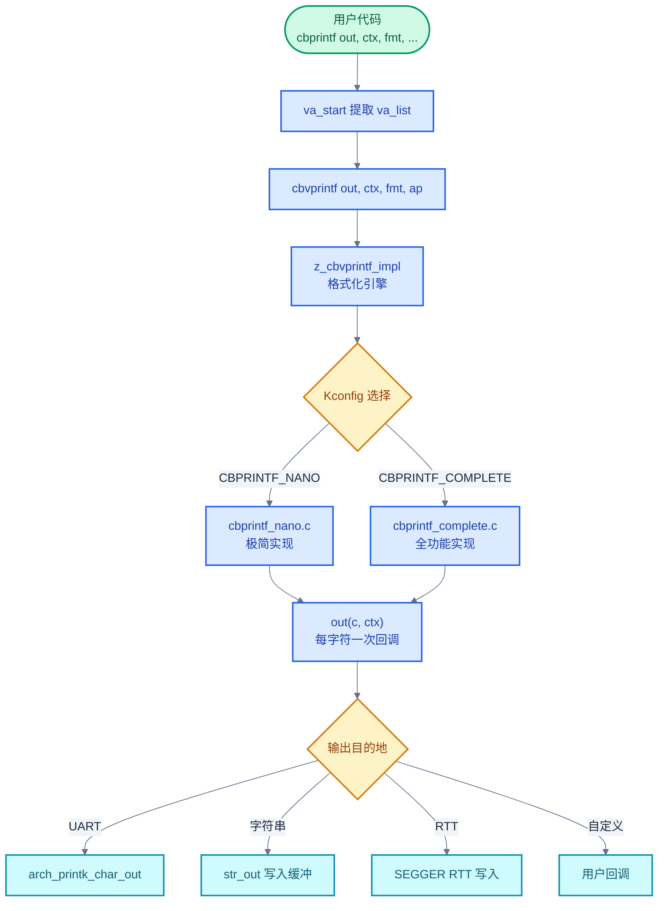
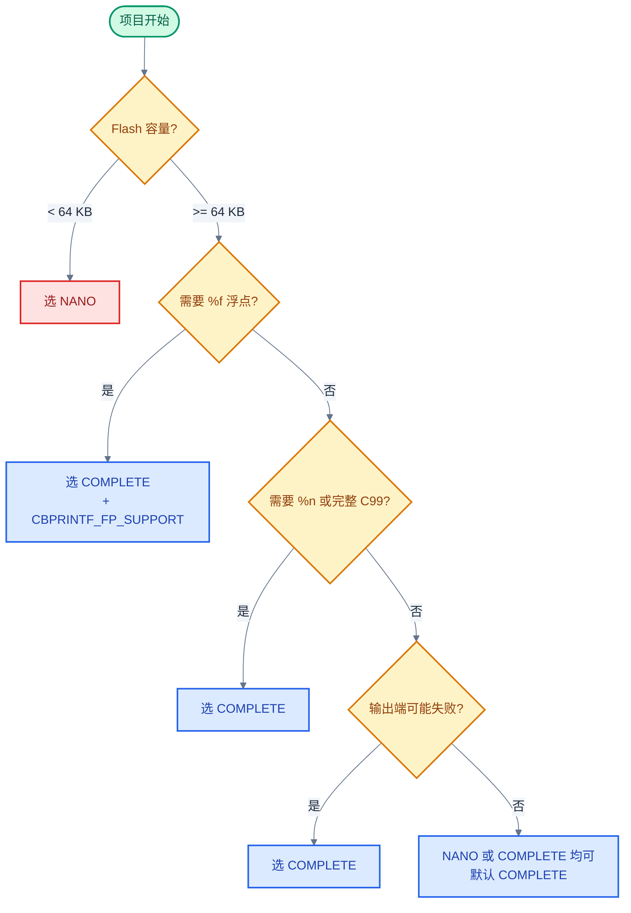
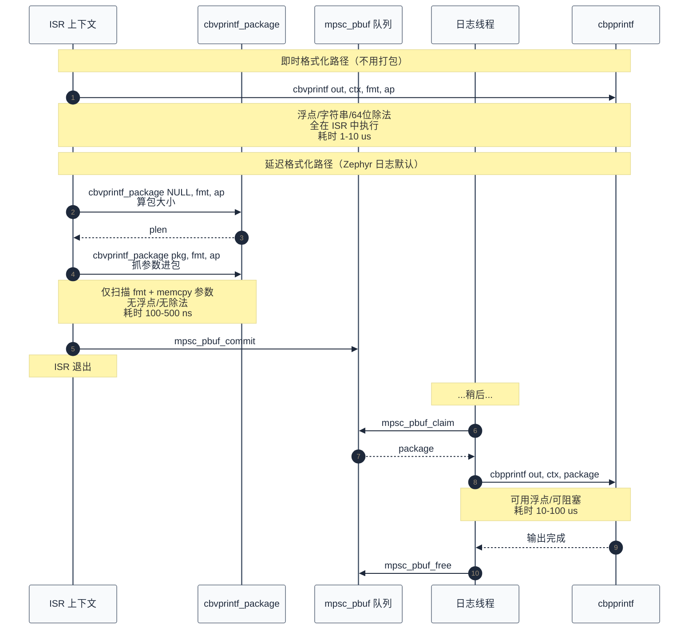

# 22. cbprintf：可打包、可延迟格式化的 printf

> 一句话概括：本文从 Zephyr 把 `printf` 拆成"回调式输出 + 可打包参数 + 极简 printk"三件套切入，深入 `lib/os/cbprintf.c`、`cbprintf_complete.c`、`cbprintf_nano.c`、`cbprintf_packaged.c`、`printk.c` 源码——讲清楚 `cbprintf` 如何用回调解耦格式化与输出、`cbvprintf_package` 如何把 `va_list` 抓成可搬运的二进制包、`cbpprintf` 如何在另一个上下文里把包重新展开成字符流，以及 `printk` 为何能成为可在 fault handler 中调用的"最后一条日志"。
> **工程师视角**：读完后应能回答"`cbprintf` 与 `printf` 的差异在哪里、为什么 RTOS 要这样拆"、"为什么日志系统能在 ISR 中纳秒级提交、把 `%f` `%s` 的格式化延迟到日志线程"、"NANO 与 COMPLETE 在代码尺寸与功能上的取舍点是什么"、"为什么 `printk` 能在 fault handler 中安全调用而 `printf` 不能"这四个问题。

### 关键术语

| 缩写 | 全称 | 含义 |
|------|------|------|
| RTOS | Real-Time Operating System | 实时操作系统 |
| ISR | Interrupt Service Routine | 中断服务例程 |
| CPU | Central Processing Unit | 中央处理器 |
| RAM | Random Access Memory | 随机存取存储器 |
| ROM | Read-Only Memory | 只读存储器 |
| API | Application Programming Interface | 应用编程接口 |
| I/O | Input/Output | 输入输出 |
| UART | Universal Asynchronous Receiver/Transmitter | 通用异步收发器 |
| FP | Floating Point | 浮点 |
| FPU | Floating Point Unit | 浮点运算单元 |
| ABI | Application Binary Interface | 应用二进制接口（调用约定与数据布局） |
| va_list | Variable Argument List | C 语言变长参数列表的不透明类型 |
| IPC | Inter-Process Communication | 进程间/核间通信 |

---

### 前置阅读

| 需要了解 | 参考文档 |
|----------|----------|
| 无锁数据结构与 mpsc_pbuf | [19-无锁数据结构深入](./19-无锁数据结构深入.md) |
| 中断上下文约束 | [08-中断与时序](./08-中断与时序.md) |
| 内核对象与元数据 | [21-Object Cores对象元数据](./21-Object%20Cores对象元数据.md) |

---

## 1. 概述：为什么 RTOS 需要特殊 printf

> 上一篇 [21-Object Cores对象元数据](./21-Object%20Cores对象元数据.md) 把内核对象的元数据从"散落全局变量"收敛到"统一对象核心"，让 shell、统计、日志等子系统可以统一枚举与查询。一个自然的问题是：这些子系统要怎么把信息"打出来"？Linux 内核直接用 `printk`+`vsnprintf`，但 RTOS 的约束更严——ISR 里不能 `malloc`、fault handler 里不能拿锁、Flash 容量按 KB 算、还要支持 `%f` 这种" ISR 中绝对不能做"的操作。本章用 Zephyr 的 cbprintf 三件套来回答这个问题——先讲为什么 `printf` 在 RTOS 里行不通，再讲 cbprintf 如何用"回调 + 打包"两步拆解。

### 1.1 标准 printf 在 RTOS 中的四个问题

C 标准库的 `printf` 假设的是"通用操作系统 + 富资源"环境。把它直接搬到 RTOS 上会撞到四堵墙：

1. **输出端固定**——`printf` 默认写到 `stdout` 这个 `FILE *` 流上，但 RTOS 没有"标准输出"概念，可能要写到 UART、RTT (Real-Time Transfer, ARM 的实时传输协议)、内存缓冲、shell 通道，甚至同时多端。`FILE *` 抽象在这里反而是负担。
2. **ISR 不能调用**——`printf` 内部可能 `malloc` 临时缓冲、可能拿 `stdio` 锁、可能阻塞在流上。ISR 中任何一项都是非法的（参见 [08-中断与时序](./08-中断与时序.md) §2）。
3. **fault handler 中不安全**——系统已经崩溃时，`malloc` 内部状态可能已损坏、`stdio` 锁可能死锁。fault handler 需要一个"绝对不做任何可能失败的事"的输出函数。
4. **`%f` 太重**——浮点格式化代码动辄 6-10 KB（含 `__aeabi_d2uiz`、`__adddf3` 等软浮点 helper），但很多 MCU 的 Flash 只有 32-64 KB。即便不开 FPU，链接了 `printf` 就把整段浮点代码拉进来。

### 1.2 Zephyr 的拆解思路：cbprintf 三件套

Zephyr 用三层拆解对应这四个问题：

| 问题 | Zephyr 的拆解 | 对应实现 |
|------|--------------|----------|
| 输出端固定 | 把"输出字符"抽象成回调 `cbprintf_cb` | `cbprintf(out, ctx, fmt, ...)` |
| ISR 不能格式化 | 把"抓参数"和"格式化输出"分两步 | `cbvprintf_package` + `cbpprintf` |
| fault handler 不安全 | 提供独立极简路径，不依赖任何运行时状态 | `printk` |
| `%f` 太重 | 提供功能裁剪的两套实现 | `CBPRINTF_NANO` / `CBPRINTF_COMPLETE` |

> **核心要点**：cbprintf 三件套不是"另一种 printf"，而是把 `printf` 的"格式化 + 输出"两件事彻底拆开。回调式输出解耦了"格式化"与"目的地"；打包机制解耦了"抓参数"与"格式化"；printk 解耦了"正常输出路径"与"故障安全输出路径"。这套拆解是 Zephyr 日志系统、shell、断言输出的共同根基。

---

## 2. cbprintf 架构：回调式输出

> 上一章讲了"为什么要拆"。本章讲"拆出来的第一层——回调式输出"是什么。源码在 [lib/os/cbprintf.c](file:///home/pbw/rtos/cs-learning-notes/zephyr-project/zephyr/lib/os/cbprintf.c) 与 [include/zephyr/sys/cbprintf.h](file:///home/pbw/rtos/cs-learning-notes/zephyr-project/zephyr/include/zephyr/sys/cbprintf.h)。

### 2.1 回调签名：一个字符一次

源码 [include/zephyr/sys/cbprintf.h](file:///home/pbw/rtos/cs-learning-notes/zephyr-project/zephyr/include/zephyr/sys/cbprintf.h#L276-L297)：

```c
/** @brief Signature for a cbprintf callback function.
 *
 * @param c a character to output. 应当作 unsigned char 处理。
 * @param ctx 提供输出上下文的对象指针。
 *
 * 返回 @p c 转 unsigned char 再转 int 的值，或负数错误码。
 */
typedef int (*cbprintf_cb)(/* int c, void *ctx */);
```

**关键设计**：回调签名是"一个字符一次"。这与 `write(fd, buf, n)` 那种"批量字节"接口截然不同——`cbprintf` 内部每生成一个字符就调一次 `out(c, ctx)`。

**为什么是一个字符一次而不是批量？** 因为 cbprintf 的设计目标是"无界长度输出"。如果用批量接口，调用者必须提供一个临时缓冲——但缓冲多大才够？`printf("%*d", 1000000, x)` 可以生成上百万字符的输出，固定缓冲必然溢出或浪费。一个字符一次让输出端可以自由选择"直接送 UART"还是"凑一批再 flush"，cbprintf 自身不需要任何中间缓冲。

> **设计洞察**：cbprintf 的"一个字符一次"回调看似低效——为什么不批量？这其实是对**依赖倒置原则**（Dependency Inversion Principle）的极致应用。`printf` 把"格式化"和"输出到 stdout"硬绑在一起，导致输出端不可替换；cbprintf 反转依赖——核心引擎只依赖一个 `cbprintf_cb` 抽象接口，具体输出由调用者注入。这与 Linux VFS 的 `file_operations.write` 异曲同工，但更彻底：VFS 仍是批量字节接口（隐含"调用者有缓冲"假设），cbprintf 连这层假设都去掉了。
>
> 这种设计的代价是函数调用开销——每个字符一次间接调用。在 Cortex-M4 @ 64 MHz 上，一次间接调用约 5-10 周期，输出 100 字节日志意味着 500-1000 周期的回调开销。但 cbprintf 的目标场景是"日志与诊断"而非"高速数据流"——这个开销相对于 UART 的毫秒级传输延迟可以忽略。真正的吞吐瓶颈永远在 I/O 端，不在格式化端。这也是为什么 §9.2 的 RTT 例子要在回调里缓冲凑批——把回调开销摊薄到批量 I/O 上。
>
> 工程上这叫**策略与机制分离**：cbprintf 是机制（怎么格式化），回调是策略（往哪里写）。同一份机制可以接任意策略，这让"日志同时送 UART + RTT + 网络"这种多端输出几乎零成本实现（§9.3 的回调链）。

### 2.2 调用链：cbprintf → cbvprintf → z_cbvprintf_impl

源码 [lib/os/cbprintf.c](file:///home/pbw/rtos/cs-learning-notes/zephyr-project/zephyr/lib/os/cbprintf.c#L11-L21)：

```c
int cbprintf(cbprintf_cb out, void *ctx, const char *format, ...)
{
	va_list ap;
	int rc;

	va_start(ap, format);
	rc = cbvprintf(out, ctx, format, ap);   /* 转交 va_list 版本 */
	va_end(ap);

	return rc;
}
```

源码 [include/zephyr/sys/cbprintf.h](file:///home/pbw/rtos/cs-learning-notes/zephyr-project/zephyr/include/zephyr/sys/cbprintf.h#L747-L752) 的 `cbvprintf` 内联：

```c
static inline
int cbvprintf(cbprintf_cb out, void *ctx, const char *format, va_list ap)
{
	return z_cbvprintf_impl(out, ctx, format, ap, 0);
}
```

调用链：



> **如何读这张图**：从上到下是"用户调用 → va_list 提取 → 格式化引擎 → 输出回调 → 实际目的地"五层。**关键解耦点**有两个：第一是 `cbvprintf` 把变长参数转成 `va_list`，让上层不必关心 ABI；第二是 `z_cbvprintf_impl` 是个弱符号——NANO 与 COMPLETE 各自实现一份，由 Kconfig 选其一链入。下方"输出回调"是第二个解耦点：同一份格式化引擎，回调是 `arch_printk_char_out` 就送 UART，是 `str_out` 就写内存，是 RTT 的 `SEGGER_RTT_Write` 就送仿真器。

### 2.3 libc 替代：fprintfcb / printfcb / snprintfcb

源码 [lib/os/cbprintf.c](file:///home/pbw/rtos/cs-learning-notes/zephyr-project/zephyr/lib/os/cbprintf.c#L52-L119) 给出一组 `cb` 后缀的 libc 替代函数。`vfprintfcb` 的实现极简：

```c
int vfprintfcb(FILE *stream, const char *format, va_list ap)
{
	return cbvprintf(fputc, stream, format, ap);   /* 把 fputc 当回调 */
}
```

**为什么需要这组替代？** 因为 minimal libc 的 `printf` 内部可能调用 `malloc` 或拿锁，而 cbprintf 路径完全无 `malloc`、无锁。开 `CONFIG_CBPRINTF_LIBC_SUBSTS` 后，应用可以用 `printfcb` 替代 `printf`，享受 cbprintf 的"无 malloc + 可裁剪"特性，同时保持 libc 风格的 API。

> **核心要点**：cbprintf 的架构本质是"用回调把格式化与输出解耦"。`z_cbvprintf_impl` 是格式化引擎，它每生成一个字符就调一次 `out(c, ctx)`——这个 `out` 可以是 UART 字符输出、字符串缓冲追加、RTT 写入，由调用者决定。这种"一个字符一次"的接口让 cbprintf 自身不需要任何中间缓冲，能处理无界长度输出。同一份引擎被 `printk`、`snprintk`、`fprintfcb`、`printfcb`、日志系统共用，是 Zephyr 全部格式化输出的统一入口。

---

## 3. 打包机制：cbprintf_packaged

> 上一章的 `cbprintf` 已经能"即时格式化即时输出"。但 ISR 里要写日志时还有麻烦——`%f` 要拉浮点寄存器、`%s` 要解指针、`%lld` 要 64 位除法，这些都不能在 ISR 中安全做。本章讲 Zephyr 的解法：把"抓参数"和"格式化"拆成两步——ISR 中只抓参数打包成二进制，格式化推后到日志线程。源码在 [lib/os/cbprintf_packaged.c](file:///home/pbw/rtos/cs-learning-notes/zephyr-project/zephyr/lib/os/cbprintf_packaged.c)。

### 3.1 本质：把 va_list 抓成可搬运的字节流

`va_list` 是个**栈上临时对象**——它的有效性只延续到当前函数返回。一旦函数返回，栈帧被回收，`va_list` 指向的参数内存就成了脏数据。所以不能直接把 `va_list` 存下来延迟使用。

`cbvprintf_package` 的本质就是**把 `va_list` 指向的栈上参数拷贝到一块独立缓冲区**，让参数脱离栈帧生命周期。这块缓冲区叫"包"（package），它是可搬运的（relocatable）——可以 `memcpy` 到另一块内存、可以塞进 [19 章](./19-无锁数据结构深入.md) 的 `mpsc_pbuf` 队列、可以跨核 IPC 传递。

> **设计洞察**：cbprintf 打包机制本质是**延迟计算**（Deferred Computation）模式——把"抓数据"和"处理数据"解耦到不同时间点。这与 Linux 内核的延迟工作队列、Java 的 Future/Promise、数据库的 WAL（Write-Ahead Log, 预写日志）是同一类思想：在快路径上只做最小捕获，把重活儿推到慢路径。
>
> 这里的关键洞察是**上下文决定可行性**。`%f` 在 ISR 中非法不是因为浮点运算本身有错，而是因为 ISR 的上下文约束（不保存 FPU 寄存器、不能阻塞）让浮点运算变得不安全。打包机制把"做什么运算"从"何时运算"中解放出来——同一份参数包可以在 ISR 中抓取（纳秒级），在线程中格式化（微秒级），在另一台机器上解码（毫秒级）。上下文变了，能做的事就变了。
>
> 这也解释了为什么包必须是**可搬运的**（relocatable）。如果包里嵌了绝对地址，搬运到另一块内存或另一台机器就失效。cbprintf 用"位置前缀 + rodata 指针"的混合策略（§7）让包既能在 `mpsc_pbuf` 队列里 `memcpy`，又能跨核 IPC 传递——这是分布式系统里"序列化"（serialization）的微型实例。Linux 不需要这套机制，因为它的日志调用点都在进程上下文，可以直接格式化入队，不需要搬运。

### 3.2 包格式：header + 参数区 + 字符串区

源码 [include/zephyr/sys/cbprintf.h](file:///home/pbw/rtos/cs-learning-notes/zephyr-project/zephyr/include/zephyr/sys/cbprintf.h#L45-L107)：

```c
struct cbprintf_package_desc {
	uint8_t len;          /* 参数区长度（以 32 位字为单位） */
	uint8_t str_cnt;      /* 内联到包体的字符串数 */
	uint8_t ro_str_cnt;   /* 只读字符串位置索引数 */
	uint8_t rw_str_cnt;   /* 读写字符串位置索引数 */
#ifdef CONFIG_CBPRINTF_PACKAGE_HEADER_STORE_CREATION_FLAGS
	uint32_t pkg_flags;   /* 创建包时用的 flags，便于后续 convert */
#endif
} __packed;

struct cbprintf_package_hdr_ext {
	union cbprintf_package_hdr hdr;   /* 上面的 desc */
	char *fmt;                        /* 格式串指针（通常在 rodata） */
} __packed;
```

包的内存布局：

```
+----------------------+
| desc (4 或 8 字节)    |  ← len / str_cnt / ro_str_cnt / rw_str_cnt
+----------------------+
| fmt 指针              |  ← 指向 rodata 中的格式串
+----------------------+
| 参数区（按对齐填充）   |  ← %d 对应 int、%ld 对应 long、%f 对应 double 等
+----------------------+
| 只读字符串位置索引[]  |  ← 每项 1 字节，记录参数区中哪个字是 RO 字符串指针
+----------------------+
| 读写字符串位置索引[]  |  ← 每项 2 字节（arg_idx + pos）
+----------------------+
| 内联字符串数据        |  ← RW 字符串内容（含 '\0'），每段前 1 字节位置前缀
+----------------------+
```

### 3.3 打包流程：扫描 fmt + 拷贝 va_list

`cbvprintf_package` 的核心逻辑在 [lib/os/cbprintf_packaged.c](file:///home/pbw/rtos/cs-learning-notes/zephyr-project/zephyr/lib/os/cbprintf_packaged.c#L233-L817)。它一边扫描格式串 `fmt`，一边按格式说明符从 `va_list` 取参数并拷贝到包缓冲：

1. **跳过 desc 头**——预留 `sizeof(*pkg_hdr)` 字节，最后回填
2. **存格式串指针**——`*(const char **)buf = fmt`，假设 `fmt` 在 rodata
3. **逐字符扫描 fmt**——遇到 `%` 进入解析状态
4. **按说明符取参**：
   - `%d` / `%i` / `%c`：`va_arg(ap, int)`，按 `int` 对齐拷贝
   - `%u` / `%x` / `%X` / `%o`：`va_arg(ap, unsigned int)`
   - `%ld`：`va_arg(ap, long)`，按 `long` 对齐
   - `%lld`：`va_arg(ap, long long)`，按 `long long` 对齐（8 字节）
   - `%f` / `%e` / `%g`：`va_arg(ap, double)`，按 `double` 对齐（8 字节）
   - `%Lf`：`va_arg(ap, long double)`，按 `long double` 对齐（16 字节）
   - `%s`：`va_arg(ap, char *)`——见 §7 字符串处理
   - `%p` / `%n`：`va_arg(ap, void *)`
   - `%*d`：`va_arg(ap, int)` 取宽度（动态宽度）
5. **回填 desc**——记录参数区长度、字符串计数
6. **追加字符串**——把所有 RW 字符串内容（含位置前缀）拼到包尾

**为什么扫描 fmt 而不直接 memcpy 整段栈？** 因为 `va_list` 在不同 ABI 下布局差异巨大（见 §3.5）——x86_64 把前 6 个整型参数放寄存器、前 8 个浮点放 XMM 寄存器，aarch64 把前 8 个参数分通用寄存器与 NEON 寄存器。直接 memcpy 栈区拿不到寄存器里的参数。扫描 fmt 才知道有几个参数、每个什么类型，才能正确调用 `va_arg` 把寄存器与栈上的值都取出来。

### 3.4 解包流程：cbpprintf_external

源码 [lib/os/cbprintf_packaged.c](file:///home/pbw/rtos/cs-learning-notes/zephyr-project/zephyr/lib/os/cbprintf_packaged.c#L831-L872)：

```c
int cbpprintf_external(cbprintf_cb out,
		       cbvprintf_external_formatter_func formatter,
		       void *ctx, void *packaged)
{
	uint8_t *buf = packaged;
	struct cbprintf_package_hdr_ext *hdr = packaged;
	/* ... */

	/* 取出参数区大小、字符串计数 */
	args_size = hdr->hdr.desc.len * sizeof(int);
	s_nbr     = hdr->hdr.desc.str_cnt;
	/* ... */

	/* 定位到字符串表（参数区之后） */
	s = (char *)(buf + args_size + ros_nbr + 2 * rws_nbr);

	/* 把内联字符串的地址回填到参数区对应位置 */
	for (i = 0; i < s_nbr; i++) {
		s_idx = *(uint8_t *)s;       /* 位置前缀 */
		++s;
		ps = (char **)(buf + s_idx * sizeof(int));
		*ps = s;                     /* 把字符串地址写回参数区 */
		s += strlen(s) + 1;
	}

	buf += sizeof(*hdr);              /* 跳过 header */

	/* 把参数区当作 va_list 喂给 formatter */
	return cbprintf_via_va_list(out, formatter, ctx, hdr->fmt, buf);
}
```

解包的关键步骤：

1. **从 desc 读出参数区大小**——`args_size = desc.len * sizeof(int)`
2. **回填字符串指针**——把内联字符串的当前地址写回参数区对应字段（包是可搬运的，地址在搬运后变了，必须用位置前缀重新定位）
3. **构造 va_list**——调用 `cbprintf_via_va_list` 把参数区起始地址包装成 `va_list`
4. **调用 formatter**——`formatter(out, ctx, fmt, ap)` 即普通的 `cbvprintf`，把参数区当栈帧格式化输出

### 3.5 跨架构 va_list 构造

源码 [lib/os/cbprintf_packaged.c](file:///home/pbw/rtos/cs-learning-notes/zephyr-project/zephyr/lib/os/cbprintf_packaged.c#L49-L194) 为每种架构单独实现 `cbprintf_via_va_list`，因为 `va_list` 的内存布局是 ABI 定义的，各架构不同：

| 架构 | va_list 结构 | 关键字段 |
|------|--------------|----------|
| 32-bit ARM / x86 | 单指针 | `__ap = buf` |
| aarch64 | 结构体（栈指针 + 寄存器顶 + 偏移） | `__stack = buf; __gr_top = __vr_top = NULL; __gr_offs = __vr_offs = 0` |
| x86_64 | 结构体（寄存器保存区 + 溢出区） | `overflow_arg_area = buf; reg_save_area = NULL; gp_offset = 48; fp_offset = 304` |
| Xtensa | 结构体（栈 + 寄存器 + 索引） | `__va_stk = buf - 32; __va_reg = NULL; __va_ndx = 32` |

> **如何读这张表**：第二行"va_list 结构"决定了第三行"关键字段"如何初始化。32 位 ARM 与 x86 最简单——`va_list` 就是个指针，直接指向参数区起始。aarch64 与 x86_64 复杂，因为它们的 ABI 把前几个参数放寄存器——`va_list` 必须区分"从寄存器区取"还是"从栈区取"。设 `reg_save_area = NULL` 与 `gp_offset` 越过寄存器区，强制 `va_arg` 走"溢出区"路径——也就是直接从我们的 buffer 取。

> **核心要点**：cbprintf 打包机制的本质是"把 `va_list` 抓成字节流"——`cbvprintf_package` 扫描 fmt 确定每个参数的类型与大小，按对齐拷贝到包缓冲；`cbpprintf_external` 把包缓冲的参数区重新包装成 `va_list`，喂给普通 `cbvprintf` 格式化。包是可搬运的——可以塞进 mpsc_pbuf 队列、可以跨核 IPC——因为字符串要么在 rodata（指针稳定），要么内联到包体（与包同搬）。这套机制让"抓参数"与"格式化"可以发生在完全不同的上下文，是 Zephyr 日志系统延迟格式化的根基。

---

## 4. NANO vs COMPLETE：极简与全功能

> 上一章讲打包机制把"抓参数"与"格式化"拆开了。但格式化引擎本身（`z_cbvprintf_impl`）也有两套实现——本章对比这两套的差异，讲清何时选哪个。源码在 [lib/os/cbprintf_nano.c](file:///home/pbw/rtos/cs-learning-notes/zephyr-project/zephyr/lib/os/cbprintf_nano.c) 与 [lib/os/cbprintf_complete.c](file:///home/pbw/rtos/cs-learning-notes/zephyr-project/zephyr/lib/os/cbprintf_complete.c)，Kconfig 在 [lib/os/Kconfig.cbprintf](file:///home/pbw/rtos/cs-learning-notes/zephyr-project/zephyr/lib/os/Kconfig.cbprintf)。

### 4.1 两套实现的来源

`z_cbvprintf_impl` 是个**由 Kconfig 选择的弱符号**——NANO 与 COMPLETE 各实现一份，编译时二选一链入：

- `CONFIG_CBPRINTF_NANO`——选择 [lib/os/cbprintf_nano.c](file:///home/pbw/rtos/cs-learning-notes/zephyr-project/zephyr/lib/os/cbprintf_nano.c)
- `CONFIG_CBPRINTF_COMPLETE`（默认）——选择 [lib/os/cbprintf_complete.c](file:///home/pbw/rtos/cs-learning-notes/zephyr-project/zephyr/lib/os/cbprintf_complete.c)

**什么是弱符号（weak symbol）？** 弱符号是链接器层面的一种约定：声明为 `weak` 的符号允许被另一个同名的"强"定义覆盖；若没有任何强定义，就用弱定义本身。它解决的问题是"核心代码需要引用一个符号，但不关心由谁来实现"——让核心与实现解耦，避免核心代码里写死某一份实现。

Zephyr 在 `z_cbvprintf_impl` 上用的是"核心引用、实现外置"模式：cbprintf 核心代码只声明并调用 `z_cbvprintf_impl`，不在核心里给实现；NANO 与 COMPLETE 各提供一个**强定义**，由 Kconfig 在编译期决定链入哪一份。切换实现只改 Kconfig 选项，不必动核心代码。`arch_printk_char_out`（§5.1）则是另一种用法——核心提供一个**默认空实现**的弱定义，平台/board 用强定义"安装"真实的 UART/RTT 输出；即便强定义不存在，链接也落到空函数成功，这是 printk 在初始化未完成时仍可安全调用的根基。

源码 [lib/os/Kconfig.cbprintf](file:///home/pbw/rtos/cs-learning-notes/zephyr-project/zephyr/lib/os/Kconfig.cbprintf#L4-L25) 注释甚至给出了 NANO 的代码尺寸节省："80: -53% / 982 B"——在某些基准配置下 NANO 比 COMPLETE 小 982 字节，相对减少 53%。

### 4.2 功能对比

| 对比维度 | CBPRINTF_NANO | CBPRINTF_COMPLETE |
|----------|---------------|---------------------|
| 代码尺寸（基准） | 1.0x（参考基线） | 约 2.1x |
| 整数转换 | `%d %i %u %x %X %o %c` | 同 NANO |
| 长度修饰 | `h hh l ll z` | `h hh l ll j z t L` |
| 指针 | `%p` | `%p` |
| 字符串 | `%s` | `%s` |
| 浮点 | **不支持** | `%f %e %g %a`（需 `CONFIG_CBPRINTF_FP_SUPPORT`） |
| `%n` | 不支持 | 支持（`CONFIG_CBPRINTF_N_SPECIFIER`） |
| 宽度 | 数字与 `*` | 数字与 `*` |
| 精度 | `.` + 数字 | `.` + 数字与 `*` |
| 标志 | `- + 空格 # 0` | `- + 空格 # 0` |
| 64 位整型 | 取低 32 位（溢出印 `ERR`） | 完整支持 |
| 错误处理 | 不检查 `out` 返回值 | 检查 `out` 返回值，遇错提前返回 |
| 适用场景 | 极小 Flash MCU、日志纯文本 | 完整 ABI、需要 `%f`、shell 命令输出 |

> **如何读这张表**：第一行"代码尺寸"是 NANO 存在的全部理由——MCU Flash 紧张时砍掉浮点与 64 位完整支持可以省 1-2 KB。第九行"精度"看似相同但 NANO 不支持 `*` 动态精度（NANO 的精度只能是字面数字）。倒数第二行"错误处理"是个隐藏差异——NANO 假设输出不会失败（适合 printk 这种"必须成功"的场景），COMPLETE 会在输出回调返错时提前返回（适合可能阻塞或失败的流式输出）。

### 4.3 NANO 的关键代码

源码 [lib/os/cbprintf_nano.c](file:///home/pbw/rtos/cs-learning-notes/zephyr-project/zephyr/lib/os/cbprintf_nano.c#L76-L98)：

```c
int z_cbvprintf_impl(cbprintf_cb __out, void *ctx, const char *fmt,
		     va_list ap, uint32_t flags)
{
	size_t count = 0;
	char buf[DIGITS_BUFLEN];                /* 10 或 21 字节，存数字串 */
	char *prefix, *data;
	int min_width, precision, data_len;
	char padding_mode, length_mod, special;
	cbprintf_cb_local out = __out;

	fmt--;
start:
	while (*++fmt != '%') {                  /* 直接输出非格式字符 */
		if (*fmt == '\0') {
			return count;
		}
		OUTC(*fmt);
	}
	/* ... 解析 % 后面的标志、宽度、精度、长度、转换说明符 ... */
```

NANO 用 `OUTC` 宏直接调 `out`，不检查返回值：

```c
#define OUTC(_c) do { \
	out((int)(_c), ctx); \
	if (IS_ENABLED(CONFIG_CBPRINTF_LIBC_SUBSTS)) { \
		++count; \
	} \
} while (false)
```

**为什么 NANO 不检查返回值？** 因为 NANO 的典型用户是 `printk`——它的回调 `arch_printk_char_out` 返回 0 且永不失败。检查返回值对 printk 是纯开销。NANO 把"输出可能失败"这个能力砍掉，换来更紧凑的代码。

### 4.4 COMPLETE 的关键代码

源码 [lib/os/cbprintf_complete.c](file:///home/pbw/rtos/cs-learning-notes/zephyr-project/zephyr/lib/os/cbprintf_complete.c#L1380-L1392) 的 `OUTC`：

```c
#define OUTC(c) do { \
	int rc = (*out)((int)(c), ctx); \
	\
	if (rc < 0) { \
		return rc; \
	} \
	++count; \
} while (false)
```

COMPLETE 用 `struct conversion` 把每个转换说明符的所有属性（flags、width、precision、length_mod、specifier）解析后存起来，再统一处理。源码 [lib/os/cbprintf_complete.c](file:///home/pbw/rtos/cs-learning-notes/zephyr-project/zephyr/lib/os/cbprintf_complete.c#L188-L307) 的 `struct conversion` 有 20+ 个 bit 字段记录所有属性——这是 COMPLETE 比 NANO 大的主因。

### 4.5 选择策略

| 场景 | 推荐选择 | 理由 |
|------|----------|------|
| 资源极紧张的 MCU（Flash < 64 KB） | NANO | 省下 ~1-2 KB 给应用 |
| 需要 `%f` 输出浮点 | COMPLETE + `CBPRINTF_FP_SUPPORT` | NANO 不支持浮点 |
| shell 命令输出（用户期望完整 C99 语义） | COMPLETE | shell 用户期望 `%g` 等正常工作 |
| 日志纯文本输出（`%d %s %u` 为主） | NANO | 日志通常不用浮点 |
| 需要错误传播（输出端可能失败） | COMPLETE | NANO 不检查 `out` 返回值 |



> **核心要点**：NANO 与 COMPLETE 不是"功能多寡"的简单对比，而是"输出端是否可能失败"与"是否需要浮点"两个维度的取舍。NANO 假设输出永不错（适合 printk、RTT 等可靠输出），COMPLETE 检查每次回调返回值（适合可能阻塞的流式输出）。选择策略是：Flash 紧张或纯日志输出选 NANO，需要 `%f` 或完整 C99 语义选 COMPLETE。

---

## 5. printk：故障安全的极简格式化器

> 前两章讲的是 cbprintf 内核机制。本章转向最常用的对外 API——`printk`。它看似简单，但承载着"故障安全"这个 RTOS 关键约束。源码在 [lib/os/printk.c](file:///home/pbw/rtos/cs-learning-notes/zephyr-project/zephyr/lib/os/printk.c) 与 [include/zephyr/sys/printk.h](file:///home/pbw/rtos/cs-learning-notes/zephyr-project/zephyr/include/zephyr/sys/printk.h)。

### 5.1 printk 与 cbprintf 的关系

`printk` 不是独立实现的格式化器——它复用 cbprintf 引擎。源码 [lib/os/printk.c](file:///home/pbw/rtos/cs-learning-notes/zephyr-project/zephyr/lib/os/printk.c#L100-L143)：

```c
void vprintk(const char *fmt, va_list ap)
{
	if (IS_ENABLED(CONFIG_LOG_PRINTK)) {
		z_log_vprintk(fmt, ap);          /* 重定向到日志子系统 */
		return;
	}

	if (k_is_user_context()) {
		/* 用户态：用缓冲 + syscall 批量输出 */
		struct buf_out_context ctx = { 0 };
		cbvprintf(buf_char_out, &ctx, fmt, ap);
		if (ctx.buf_count) {
			buf_flush(&ctx);              /* 一次 syscall 批量送出 */
		}
	} else {
		/* 内核态：直接逐字符输出 */
#ifdef CONFIG_PRINTK_SYNC
		k_spinlock_key_t key = k_spin_lock(&lock);
#endif
		cbvprintf(char_out, NULL, fmt, ap);
#ifdef CONFIG_PRINTK_SYNC
		k_spin_unlock(&lock, key);
#endif
	}
}
```

`printk` 做的事是：选回调 + 调 `cbvprintf`。回调 `char_out` 调用 `arch_printk_char_out`——这是个 weak 符号，默认什么都不做，由平台或 board 初始化时安装到 UART/RTT。

### 5.2 故障安全的三个保证

**什么是 fault handler？** MCU 遇到硬件级异常时（ARM Cortex-M 上的 HardFault、MemManage、BusFault 等），CPU 自动跳转到对应的异常处理函数——这就是 fault handler。它与普通 ISR 的关键区别在于触发前提：进入 fault handler 意味着"系统已经出了严重问题"，可能是非法内存访问、未对齐访问，也可能是更上游的 bug 已经破坏了堆或全局状态。因此 fault handler 面对的约束比普通 ISR 更严——不仅不能阻塞、不能 `malloc`，连"运行时全局状态是否还可信"都不能假设。下面三个"绝对不"正是为了满足这种最严苛的约束。

`printk` 能在 fault handler 中调用的根基是三个"绝对不"：

1. **绝对不 `malloc`**——`vprintk` 全程在栈上工作，无任何动态分配
2. **绝对不拿可睡眠锁**——最多用 `k_spinlock`（关中断临界区），fault handler 中关中断是安全的
3. **绝对不依赖运行时状态**——`arch_printk_char_out` 是 weak 符号，即便全局初始化没跑也能调用（默认空函数）

**为什么 `printf` 做不到这三点？** 因为 `printf` 内部依赖 `stdout` 流对象、流缓冲、`stdio` 互斥锁——这些都是运行时初始化的全局状态。fault 发生时这些状态可能已损坏，再调 `printf` 就可能二次 fault。`printk` 直接走 `arch_printk_char_out`，绕开所有运行时状态。

> **设计洞察**：printk 的三个"绝对不"是**故障安全设计**（Fail-Safe Design）的教科书案例。系统设计有个反直觉的原则：越是危急时刻，越要假设最少。fault handler 触发时，系统状态已不可信——堆可能损坏、锁可能死锁、全局变量可能被覆盖。此时唯一安全的选择是"不依赖任何运行时状态"。
>
> weak 符号在这里扮演了**编译期依赖注入**的角色。`arch_printk_char_out` 默认是空函数，平台初始化时用强定义覆盖。这意味着即便板级初始化代码没跑（上电早期、fault 在初始化前发生），`printk` 也能安全调用——它只是把字符送到一个空函数，不会崩。这与 Linux 的 `bust_spinlocks`（panic 时强制释放所有锁）思路相反但目标一致：Linux 假设状态可控、强行解锁；Zephyr 假设状态不可控、绕开所有状态。两种哲学反映了资源假设差异——Linux 有余力做清理，MCU 没有。
>
> 这也是为什么 `printk` 复用 cbprintf 引擎但选 `char_out` 直送回调——它需要 cbprintf 的格式化能力，但不需要 cbprintf 的任何"高级特性"（缓冲、错误传播、浮点）。**机制复用、策略隔离**——同一份引擎，不同的策略组合，产出从"故障安全 printk"到"全功能日志"的全谱系输出。

### 5.3 三种输出路径

源码 [lib/os/printk.c](file:///home/pbw/rtos/cs-learning-notes/zephyr-project/zephyr/lib/os/printk.c#L100-L143) 展示 `vprintk` 的三条路径：

| 路径 | 条件 | 回调 | 同步 |
|------|------|------|------|
| 重定向日志 | `CONFIG_LOG_PRINTK=y` | `z_log_vprintk` | 由日志子系统决定 |
| 用户态 | `k_is_user_context()` | `buf_char_out`（缓冲） | syscall 批量 |
| 内核态 | 默认 | `char_out`（直送） | 可选 `CONFIG_PRINTK_SYNC` 自旋锁 |

**为什么用户态要用缓冲？** 因为用户态每次 `arch_printk_char_out` 都要 syscall 进内核——逐字符 syscall 性能极差。用 `CONFIG_PRINTK_BUFFER_SIZE` 字节的缓冲凑一批，最后一次 syscall `k_str_out` 批量送出。

**为什么需要 `CONFIG_PRINTK_SYNC`？** 多核 SMP 上，多个核同时 `printk` 会让输出交错混乱。开 `CONFIG_PRINTK_SYNC` 用自旋锁串行化输出，保证一行 `printk` 输出原子完整。代价是多核竞争时其他核要 spin 等锁——但 `printk` 通常用于错误诊断，性能不是首要关切。

### 5.4 snprintk：字符串版本

源码 [lib/os/printk.c](file:///home/pbw/rtos/cs-learning-notes/zephyr-project/zephyr/lib/os/printk.c#L231-L254)：

```c
int vsnprintk(char *str, size_t size, const char *fmt, va_list ap)
{
	struct str_context ctx = { str, size, 0 };

	cbvprintf(str_out, &ctx, fmt, ap);    /* 用 str_out 回调写入字符串 */

	if (ctx.count < ctx.max) {
		str[ctx.count] = '\0';
	}

	return ctx.count;
}
```

`snprintk` 是 `printk` 的字符串版本——回调换成 `str_out`，把字符写入用户提供的缓冲。它的故障安全特性与 `printk` 相同（无 malloc、无锁），常用于 fault handler 中格式化错误信息后再用 `printk` 输出。

> **核心要点**：`printk` 不是 cbprintf 的"简化版"，而是 cbprintf 引擎的一个"故障安全封装"——选 `char_out`（直接送 UART）作回调、用自旋锁或无锁串行化、用户态用缓冲 + syscall 批量。它的三个"绝对不"（不 malloc、不拿可睡眠锁、不依赖运行时状态）让它能在 fault handler 中安全调用，是 RTOS 故障诊断的最后一道防线。

---

## 6. ISR 中快速打包 + 线程中慢格式化

> 前五章讲了 cbprintf 的各个组件。本章把它们串起来——这是 Zephyr 日志系统延迟格式化的核心模式：ISR 中只做"抓参数"这件纳秒级操作，把耗时的"格式化输出"推后到日志线程。这个模式把 `LOG_INF("%f %s", x, str)` 这种"ISR 中绝对不能做"的操作变成可能。

### 6.1 为什么 ISR 不能直接格式化

考虑 ISR 中调用 `LOG_INF("temp=%f, name=%s", 36.5, sensor_name)` 的需求。直接格式化会撞上三堵墙：

1. **`%f` 需要浮点寄存器**——ISR 进入时内核不会保存浮点上下文（开销太大），ISR 中碰浮点寄存器会破坏被中断线程的浮点状态
2. **`%s` 需要解指针**——`sensor_name` 指向的内存可能在 ISR 执行期间被另一核修改（跨核共享内存），需要屏障与同步
3. **`%lld` 需要 64 位除法**——Cortex-M0/M0+ 没有 64 位除法指令，要调 `__aeabi_ldivmod` 软件实现，耗时数十到数百周期

如果在 ISR 中直接 `cbvprintf` 格式化，最坏情况要数微秒——ISR 必须在微秒级返回，否则影响实时性。

### 6.2 两步拆解

Zephyr 日志系统的拆解（详见 [23-Logging日志系统](./23-Logging日志系统.md)）：

1. **ISR 中：`cbvprintf_package` 打包**——只扫描 fmt 取参数，不做任何格式化运算
2. **包入队：`mpsc_pbuf` 投递**——见 [19 章](./19-无锁数据结构深入.md) §9，多 ISR 安全
3. **日志线程：`cbpprintf` 解包格式化**——可以安全用浮点、可以阻塞在 UART

源码 [subsys/logging/log_msg.c](file:///home/pbw/rtos/cs-learning-notes/zephyr-project/zephyr/subsys/logging/log_msg.c#L348-L413) 的 `z_log_msg_runtime_vcreate` 给出实战路径：

```c
void z_log_msg_runtime_vcreate(uint8_t domain_id, const void *source,
				uint8_t level, const void *data, size_t dlen,
				uint32_t package_flags, const char *fmt, va_list ap)
{
	int plen;

	if (fmt) {
		va_list ap2;
		va_copy(ap2, ap);
		/* 第一次调用：packaged=NULL，只算包大小 */
		plen = cbvprintf_package(NULL, Z_LOG_MSG_ALIGN_OFFSET,
					 package_flags, fmt, ap2);
		va_end(ap2);
	}

	/* 分配 log_msg 缓冲（可能从 mpsc_pbuf 拿） */
	msg = z_log_msg_alloc(msg_wlen);
	pkg = msg ? msg->data : NULL;

	if (pkg && fmt) {
		/* 第二次调用：实际打包 */
		plen = cbvprintf_package(pkg, (size_t)plen, package_flags, fmt, ap);
	}

	/* 投递到 mpsc_pbuf 队列 */
	z_log_msg_finalize(msg, source, desc, data);
}
```

**为什么调两次 `cbvprintf_package`？** 第一次 `packaged=NULL` 只算包大小不写数据——返回所需字节数。日志系统据此分配 `log_msg`。第二次 `packaged=pkg` 才真正写入参数。这个"先量后写"模式避免了"包太大装不下要回滚"的复杂处理。

> **设计洞察**："先量后写"两次调用 `cbvprintf_package` 是**两遍扫描算法**（Two-Pass Algorithm）的经典应用。第一遍扫描 fmt 算出包大小，第二遍才真正写入。看似多了一次扫描的开销，换来的是**避免了回滚的复杂性**。
>
> 工程上有个普遍教训：回滚逻辑是 bug 的温床。如果用"分配固定大小缓冲，写不下就回滚"，需要处理"半写入的包要不要清理"、"已消费的 `va_list` 怎么恢复"、"分配的内存怎么释放"等一系列状态恢复问题。两遍扫描把"写不下"的可能性在第一遍就消除——第二遍写的时候，缓冲一定够。这是 KISS 原则（Keep It Simple, Stupid）的体现：用一次额外的扫描换取状态机的简化。
>
> 这个模式在系统软件里随处可见。Linux 的 `vsnprintf(NULL, 0, fmt, args)` 就是同样的"先量后写"——返回所需长度，让调用者分配后再次调用。C 标准库的 `snprintf` 也遵循这个语义。Zephyr 把它用在了日志系统的快路径上，因为日志系统的快路径**不能失败**——失败意味着丢日志，丢日志意味着调试时丢失关键信息。两遍扫描的代价（多一次 fmt 扫描，约 100 纳秒）远小于回滚的代价。

### 6.3 时序对比



> **如何读这张图**：上下两部分对比"即时格式化"与"延迟格式化"两种路径。即时路径里 ISR 要承担全部格式化工作（浮点、字符串、除法），耗时 1-10 微秒——对实时性是灾难。延迟路径里 ISR 只做"扫描 fmt + memcpy 参数"，100-500 纳秒完成；真正的格式化由日志线程承担，可以放心用浮点、可以阻塞在 UART。**关键解耦点是包**——它把"参数"从栈帧生命周期中解放出来，让格式化可以延后到任意时刻。

### 6.4 性能数量级

下表给出 Cortex-M4 @ 64 MHz 上的典型耗时（参考实现，具体数值随配置变化）：

| 操作 | 即时格式化 | 打包 |
|------|------------|------|
| `LOG_INF("x=%d", 42)` | 1.5 μs | 200 ns |
| `LOG_INF("x=%f", 3.14)` | 8 μs（含软浮点） | 250 ns |
| `LOG_INF("%s", str)` | 600 ns | 150 ns + strlen |
| `LOG_INF("%lld", big)` | 4 μs（含 64 位除法） | 200 ns |

> **如何读这张表**：第二列"即时格式化"耗时是第三列"打包"的 5-30 倍。**%f 的差距最大**——即时路径要调 `__aeabi_d2iz` 等软浮点 helper，而打包路径只 memcpy 8 字节 double。这就是日志系统默认走打包路径的根本动机：把 ISR 中最贵的操作（浮点、64 位除法）转移到日志线程。

> **核心要点**：ISR 快打包 + 线程慢格式化的本质是"把延迟敏感的抓参数与延迟不敏感的格式化解耦"。`cbvprintf_package` 只扫描 fmt 取参数（无浮点、无除法、无解引用），100-500 纳秒完成；`cbpprintf` 在日志线程中承担真正的格式化工作（可用浮点、可阻塞）。这个模式让 `LOG_INF("%f", x)` 这种看似不能在 ISR 中用的调用变成可能——是 Zephyr 日志系统能在 ISR 中安全使用的关键。

---

## 7. 字符串地址与字典模式

> 上一章的打包机制默认把字符串参数当指针原样存进包里。但指针有"指向的内存可能失效"与"跨核地址不同"两个问题。本章讲 cbprintf 如何处理 `%s` 参数——核心是"只读字符串存指针、读写字符串内联到包体"的混合策略。源码在 [lib/os/cbprintf_packaged.c](file:///home/pbw/rtos/cs-learning-notes/zephyr-project/zephyr/lib/os/cbprintf_packaged.c)。

### 7.1 问题的本质

`%s` 参数是个 `char *` 指针。打包时遇到两个问题：

1. **指针指向的内存何时失效？** 如果指向栈上的局部数组，函数返回后内存就回收了；如果指向堆，可能被 free；如果指向 rodata（字符串字面量），永远有效。
2. **跨核地址是否一致？** 共享内存 IPC 时，核 A 的 `0x20000000` 在核 B 看来可能是不同物理地址。

cbprintf 的策略：**rodata 字符串存指针，非 rodata 字符串内联到包体**。

### 7.2 rodata 判定

源码 [lib/os/cbprintf_packaged.c](file:///home/pbw/rtos/cs-learning-notes/zephyr-project/zephyr/lib/os/cbprintf_packaged.c#L33-L43)：

```c
static inline bool ptr_in_rodata(const char *addr)
{
#if defined(CBPRINTF_VIA_UNIT_TEST)
	return false;
#else
	return linker_is_in_rodata(addr);   /* 链接器提供的 rodata 区间查询 */
#endif
}
```

`linker_is_in_rodata` 由 [include/zephyr/linker/utils.h](file:///home/pbw/rtos/cs-learning-notes/zephyr-project/zephyr/include/zephyr/linker/utils.h) 提供，根据链接脚本定义的 `_image_rodata_start` / `_image_rodata_end` 符号判定指针是否落在 rodata 段。

### 7.3 三种字符串处理策略

源码 [lib/os/cbprintf_packaged.c](file:///home/pbw/rtos/cs-learning-notes/zephyr-project/zephyr/lib/os/cbprintf_packaged.c#L614-L680)：

```c
if (is_str_arg) {
	s = va_arg(ap, char *);
process_string:
	if (buf0 != NULL) {
		*(const char **)buf = s;          /* 总是先存指针 */
	}

	bool is_ro = (fros_cnt-- > 0) ? true : ptr_in_rodata(s);
	bool do_ro = !!(flags & CBPRINTF_PACKAGE_ADD_RO_STR_POS);

	if (is_ro && !do_ro) {
		/* 策略 1：RO 字符串、不开 RO_STR_POS —— 直接存指针，无后续处理 */
	} else {
		/* 策略 2 或 3：记录位置索引，待后续处理 */
		str_ptr_pos[s_idx] = s_ptr_idx;
		if (is_ro) {
			str_ptr_pos[s_idx] |= STR_POS_RO_FLAG;   /* 标记 RO */
			s_ro_cnt++;
		} else {
			s_rw_cnt++;                              /* RW 计数 */
		}
	}
	buf += sizeof(char *);
}
```

三种策略的对比：

| 策略 | 触发条件 | 包内存储 | 解包时 | 适用场景 |
|------|----------|----------|--------|----------|
| 1. 直接存指针 | RO 字符串 + 不开 `ADD_RO_STR_POS` | 仅指针 | 直接用指针 | 单映像、单核 |
| 2. 存指针 + 索引 | RO 字符串 + 开 `ADD_RO_STR_POS` | 指针 + 位置索引 | 可转 FSC（拷贝字符串） | 跨核 IPC、字典模式 |
| 3. 内联字符串 | RW 字符串 | 位置索引 + 字符串内容 | 用包内地址替换指针 | 字符串在栈/堆、跨核 |

**为什么不全用策略 3 内联？** 因为字符串字面量（`"hello"`）通常在 rodata，内联会重复存储相同内容、浪费空间。策略 1 让多个包共享同一份 rodata 字符串，零冗余。

**为什么不全用策略 1 存指针？** 因为 RW 字符串的指针在包被消费时可能已失效——栈上的局部数组在函数返回后回收。必须把内容拷进包体（策略 3）才能延迟使用。

### 7.4 字典模式（Dictionary Logging）

策略 2 是 Zephyr 字典模式日志的基础。开 `CONFIG_LOG_DICTIONARY_SUPPORT` 后：

1. 打包时记录每个 RO 字符串在参数区的位置索引
2. 包消费端用 `cbprintf_package_convert` 把 RO 字符串内容拷贝到包体（变 FSC 包）
3. FSC 包是完全自包含的——可以序列化到文件、跨核 IPC、甚至离线解码

源码 [include/zephyr/sys/cbprintf.h](file:///home/pbw/rtos/cs-learning-notes/zephyr-project/zephyr/include/zephyr/sys/cbprintf.h#L624-L632) 的 `cbprintf_fsc_package`：

```c
static inline int cbprintf_fsc_package(void *in_packaged, size_t in_len,
				       void *packaged, size_t len)
{
	return cbprintf_package_copy(in_packaged, in_len, packaged, len,
				     CBPRINTF_PACKAGE_CONVERT_RO_STR |
				     CBPRINTF_PACKAGE_CONVERT_RW_STR, NULL, 0);
}
```

FSC (Fully Self-Contained, 完全自包含) 包是把所有 RO 与 RW 字符串都内联到包体——解包时不需要任何外部字符串引用，可以独立解码。这对离线日志分析尤其重要：把日志包 dump 到文件后，可以在另一台机器上用字典文件解析，不需要原始固件的 rodata 段。

> **核心要点**：cbprintf 对字符串参数采取"按需内联"策略——rodata 字符串默认存指针（零冗余），rw 字符串必须内联（保证可延迟使用）。`CBPRINTF_PACKAGE_ADD_RO_STR_POS` flag 让 RO 字符串也带上位置索引，配合 `cbprintf_fsc_package` 可以把包转成完全自包含形式。这套机制让 cbprintf 既能高效处理常见情况（rodata 字面量），又能支持字典日志、跨核 IPC、离线解码等高级场景。

---

## 8. 浮点处理

> 前面多次提到 `%f` 不能在 ISR 中用。本章专门讲 cbprintf 对浮点的处理——从打包时的对齐，到 COMPLETE 实现的格式化算法，再到 Kconfig 的取舍。源码主要在 [lib/os/cbprintf_packaged.c](file:///home/pbw/rtos/cs-learning-notes/zephyr-project/zephyr/lib/os/cbprintf_packaged.c) 与 [lib/os/cbprintf_complete.c](file:///home/pbw/rtos/cs-learning-notes/zephyr-project/zephyr/lib/os/cbprintf_complete.c)。

### 8.1 打包时的对齐处理

源码 [lib/os/cbprintf_packaged.c](file:///home/pbw/rtos/cs-learning-notes/zephyr-project/zephyr/lib/os/cbprintf_packaged.c#L556-L597)：

```c
case 'f':
case 'F':
case 'g':
case 'G': {
	union { double d; long double ld; } v;

	if (fmt[-1] == 'L') {
		v.ld = va_arg(ap, long double);     /* 80 或 128 位 */
		align = VA_STACK_ALIGN(long double); /* 通常 16 字节对齐 */
		size = sizeof(long double);
	} else {
		v.d = va_arg(ap, double);            /* 默认参数提升 */
		align = VA_STACK_ALIGN(double);      /* 通常 8 字节对齐 */
		size = sizeof(double);
	}
	buf = ROUND_UP(buf, align);              /* 缓冲对齐 */
	if (buf0 != NULL) {
		if (Z_CBPRINTF_VA_STACK_LL_DBL_MEMCPY) {
			memcpy((void *)buf, (uint8_t *)&v, size);   /* SPARC 等需 memcpy */
		} else if (fmt[-1] == 'L') {
			*(long double *)buf = v.ld;
		} else {
			*(double *)buf = v.d;
		}
	}
	buf += size;
	parsing = false;
	continue;
}
```

**关键设计**：浮点参数按 `double` 或 `long double` 的对齐要求填充到包缓冲。源码 [include/zephyr/sys/cbprintf.h](file:///home/pbw/rtos/cs-learning-notes/zephyr-project/zephyr/include/zephyr/sys/cbprintf.h#L140-L143) 把 `CBPRINTF_PACKAGE_ALIGNMENT` 设为 `long double` 大小（如果支持）或 `long long` 大小：

```c
#define CBPRINTF_PACKAGE_ALIGNMENT \
	Z_POW2_CEIL(COND_CODE_1(CONFIG_CBPRINTF_PACKAGE_LONGDOUBLE, \
		(sizeof(long double)), (MAX(sizeof(double), sizeof(long long)))))
```

**为什么包缓冲要按浮点对齐？** 因为解包时要把参数区当 `va_list` 喂给 `cbvprintf`——`va_arg(ap, double)` 在某些架构（如 ARM）要求 8 字节对齐访问，未对齐访问会触发 fault。包缓冲对齐到 8 或 16 字节，保证参数区里的 `double` 字段天然对齐。

### 8.2 SPARC 的特殊处理

源码 [include/zephyr/sys/cbprintf_internal.h](file:///home/pbw/rtos/cs-learning-notes/zephyr-project/zephyr/include/zephyr/sys/cbprintf_internal.h#L71-L85) 注释解释：

> "The SPARC V8 ABI guarantees that the arguments of a variable argument list function are stored on the stack at addresses which are 32-bit aligned. It means that variables of type uint64_t and double may not be properly aligned on the stack."

SPARC V8 是 32 位 ABI，`double`（8 字节）在栈上只保证 4 字节对齐——直接 `*(double *)buf = v.d` 会触发未对齐访问异常。所以 SPARC 上必须用 `memcpy` 拷贝。`Z_CBPRINTF_VA_STACK_LL_DBL_MEMCPY` 宏在 SPARC 上定义为 1，其它架构为 0。

### 8.3 Kconfig 取舍

| Kconfig 选项 | 影响 | 何时开启 |
|--------------|------|----------|
| `CONFIG_CBPRINTF_FP_SUPPORT` | 启用 COMPLETE 中的 `%f %e %g` | 需要 `FPU` 时默认开 |
| `CONFIG_CBPRINTF_FP_A_SUPPORT` | 启用 `%a` 十六进制浮点 | 极少用，默认关 |
| `CONFIG_CBPRINTF_FP_ALWAYS_A` | 所有 `%f` 强制走 `%a` 路径 | `%a` 代码比 `%f` 小得多，省代码 |
| `CONFIG_CBPRINTF_PACKAGE_LONGDOUBLE` | 包缓冲按 16 字节对齐支持 `long double` | 极少用，默认关 |

**为什么 `CBPRINTF_FP_ALWAYS_A` 能省代码？** 因为 `%f` 要做十进制浮点转换（涉及大整数除法），代码量大；`%a` 是十六进制浮点（直接 dump IEEE 754 位模式），代码量小一个数量级。开 `CBPRINTF_FP_ALWAYS_A` 后所有 `%f` 都走 `%a` 路径，输出从 `3.140000` 变成 `0x1.91eb851eb851fp+1`——可读性差但代码省 1-2 KB。

### 8.4 NANO 的浮点缺失

源码 [lib/os/cbprintf_nano.c](file:///home/pbw/rtos/cs-learning-notes/zephyr-project/zephyr/lib/os/cbprintf_nano.c) 完全没有 `%f` 分支——遇到 `%f` 走 default：

```c
default:
	OUTC('%');
	OUTC(*fmt);
	goto start;
```

即原样输出 `%f` 两字符。这是 NANO 比 COMPLETE 小 1-2 KB 的主因。

> **核心要点**：cbprintf 的浮点处理体现"按需付费"原则——`CBPRINTF_FP_SUPPORT` 控制 COMPLETE 是否链入浮点格式化代码；`CBPRINTF_FP_ALWAYS_A` 用可读性换代码尺寸；`CBPRINTF_PACKAGE_LONGDOUBLE` 控制包缓冲对齐是否支持 `long double`。NANO 直接砍掉浮点分支，遇到 `%f` 原样输出。打包路径的浮点处理只是 memcpy 8 或 16 字节——这与即时格式化的"调软浮点 helper"形成鲜明对比，再次说明"ISR 中打包、线程中格式化"的优势。

---

## 9. 实战：自定义 cbprintf 回调

> 前八章讲机制。本章给两个常见实战：把 `cbprintf` 输出重定向到内存缓冲、把 `cbprintf` 输出送 RTT 仿真器通道。这两个例子覆盖了"回调式输出"的典型用法。

### 9.1 例子 1：格式化到内存缓冲

最简场景——把 `cbprintf` 当 `snprintf` 用。源码 [lib/os/cbprintf.c](file:///home/pbw/rtos/cs-learning-notes/zephyr-project/zephyr/lib/os/cbprintf.c#L98-L119) 的 `vsnprintfcb` 已是参考实现，这里给出简化版：

```c
#include <zephyr/sys/cbprintf.h>

struct str_ctx {
	char *dp;        /* 当前写入位置 */
	char *const dpe; /* 缓冲末尾 */
};

static int str_out(int c, void *ctx_p)
{
	struct str_ctx *ctx = ctx_p;

	if (ctx->dp < ctx->dpe) {
		*(ctx->dp++) = (char)c;    /* 缓冲未满才写 */
	}
	return c;                        /* 总是成功，模仿 snprintf 语义 */
}

/* 用法：等同于 snprintf(buf, size, fmt, ...) */
int my_snprintf(char *buf, size_t size, const char *fmt, ...)
{
	va_list ap;
	struct str_ctx ctx = { .dp = buf, .dpe = buf + size };

	va_start(ap, fmt);
	int rv = cbvprintf(str_out, &ctx, fmt, ap);
	va_end(ap);

	if (ctx.dp < ctx.dpe) {
		*ctx.dp = '\0';             /* 终止符 */
	} else if (size > 0) {
		buf[size - 1] = '\0';
	}
	return rv;
}
```

**关键设计**：回调 `str_out` 检查 `dp < dpe` 防止溢出，但**总是返回成功**——这模仿 `snprintf` 语义："返回本应写入的字符数，即使缓冲不够也不报错"。如果用 COMPLETE 实现，可以改成返 `EOF` 让 `cbvprintf` 提前返回。

### 9.2 例子 2：输出到 RTT 仿真器通道

SEGGER RTT 是嵌入式调试常用的高性能输出通道。RTT 的写接口是 `SEGGER_RTT_Write(channel, buf, len)`——批量字节接口，与 cbprintf 的"一个字符一次"不匹配。解决方法：在回调里凑一批再 flush：

```c
#include <SEGGER_RTT.h>

struct rtt_ctx {
	unsigned channel;
	size_t cnt;
	char buf[32];                   /* 凑 32 字节再 flush */
};

static int rtt_out(int c, void *ctx_p)
{
	struct rtt_ctx *ctx = ctx_p;

	ctx->buf[ctx->cnt++] = (char)c;
	if (ctx->cnt == sizeof(ctx->buf)) {
		SEGGER_RTT_Write(ctx->channel, ctx->buf, ctx->cnt);
		ctx->cnt = 0;
	}
	return c;
}

/* 用完必须 flush 残留字符 */
static void rtt_flush(struct rtt_ctx *ctx)
{
	if (ctx->cnt > 0) {
		SEGGER_RTT_Write(ctx->channel, ctx->buf, ctx->cnt);
		ctx->cnt = 0;
	}
}
```

**为什么需要缓冲凑批？** 因为 RTT 每次写入要查通道状态、可能要等仿真器轮询——逐字符调用会让 RTT 的开销超过字符本身。32 字节是个折中：足够大让单次 RTT 写入摊薄开销，足够小让延迟可接受（不超过 32 字符就 flush）。

### 9.3 例子 3：多端同时输出

cbprintf 的回调设计天然支持多端输出——把多个回调串成链：

```c
struct multi_ctx {
	cbprintf_cb sinks[4];
	void *ctxs[4];
	int n;
};

static int multi_out(int c, void *ctx_p)
{
	struct multi_ctx *m = ctx_p;
	for (int i = 0; i < m->n; i++) {
		m->sinks[i](c, m->ctxs[i]);   /* 依次送给每个 sink */
	}
	return c;
}
```

这个模式让"一行日志同时送 UART + RTT + 网络"成为可能——Zephyr 日志后端的 `log_backend` 多路输出就用类似机制（详见 [23-Logging日志系统](./23-Logging日志系统.md)）。

> **核心要点**：cbprintf 的回调式设计让"格式化"与"输出目的地"完全解耦——同一份格式化引擎可以输出到字符串、UART、RTT、网络，只需更换回调函数。批量接口（如 RTT）可以在回调内部缓冲凑批，无缓冲接口（如 UART 直送）可以直接逐字符调用。多端输出通过回调链实现，是日志多后端的根基。

---

## 10. 与 Linux printk/vsnprintf 对比

> 前九章讲了 Zephyr 内部的 cbprintf 体系。本章与 Linux 内核的 `printk` / `vsnprintf` 对比，帮助有 Linux 背景的读者建立参照系。

### 10.1 Linux 的方案

Linux 内核的格式化输出主要靠：

- `printk(fmt, ...)`——内核主输出函数，带日志级别、缓冲、控制台同步
- `vsnprintf(buf, size, fmt, args)`——格式化到字符串
- `vscnprintf` / `snprintf` / `scnprintf` 等变体

Linux 的 `vsnprintf` 是单一实现，位于 `lib/vsprintf.c`，不支持回调式输出——它直接写用户提供的缓冲。Linux 没有"打包"概念，因为 Linux 内核日志走 `printk` 自带的环形缓冲，直接在调用点格式化完整字符串再入队。

### 10.2 对比表

| 对比维度 | Zephyr cbprintf | Linux vsnprintf |
|----------|-----------------|------------------|
| 输出抽象 | 回调 `cbprintf_cb`，一字符一次 | 直接写用户缓冲 |
| 打包机制 | `cbvprintf_package` 把 va_list 抓成包 | 无（直接格式化字符串入队） |
| 极简实现 | `CBPRINTF_NANO` 可选 | 无（单一实现） |
| 浮点支持 | 可选（`CBPRINTF_FP_SUPPORT`） | 内核态不支持（用户态 `printf` 才支持） |
| 故障安全 | `printk` 独立路径，可 fault handler 调用 | `printk` 自身可 fault 调用，但走完整路径 |
| 多核同步 | `CONFIG_PRINTK_SYNC` 自旋锁 | `console_lock` 与 `logbuf_lock` 自旋锁 |
| 字典日志 | FSC 包 + `cbprintf_fsc_package` | 无（Linux 用 `printk` 时间戳与级别） |
| 跨核 IPC | 包可搬运，va_list 跨架构重建 | 不支持（Linux 假设单地址空间 SMP） |

> **如何读这张表**：第二行"打包机制"是 Zephyr 独有的核心创新。Linux 不需要打包，因为 Linux 内核日志的调用点都在进程上下文或可睡眠的 softirq，可以承担即时格式化开销。Zephyr 的日志可能在 ISR 中提交——ISR 不能格式化浮点、不能阻塞——必须把"抓参数"与"格式化"拆开。第三行"极简实现"也是 Zephyr 独有，反映 MCU Flash 紧张的现实。

### 10.3 设计哲学差异

| 维度 | Zephyr 哲学 | Linux 哲学 |
|------|-------------|------------|
| 资源假设 | Flash/RAM 按 KB 算 | 内存充裕 |
| 调用上下文 | ISR + 线程 + fault handler | 主要是线程 + softirq |
| 浮点需求 | 可选（很多 MCU 无 FPU） | 内核态不需要 |
| 跨核场景 | 异构多核（M4 + A53） | 同构 SMP（一致地址空间） |
| 设计选择 | 多套实现，Kconfig 裁剪 | 单套实现，编译期常量裁剪 |

> **核心要点**：Zephyr cbprintf 与 Linux `vsnprintf` 的根本差异在"打包机制"——Zephyr 必须支持 ISR 中抓参数延后格式化，所以发明了 `cbvprintf_package`；Linux 调用点都在可睡眠上下文，直接格式化即可。这反映了两个 RTOS/OS 的目标场景差异：Linux 假设富资源 + 进程上下文为主，Zephyr 假设资源紧张 + ISR 频繁提交日志。

---

## 11. 总结

> 本文从"为什么 RTOS 需要特殊 printf"切入，拆解了 Zephyr cbprintf 三件套的架构与实现。核心结论归纳为四点。

**第一，回调式输出解耦了格式化与目的地。** `cbprintf(out, ctx, fmt, ...)` 把"输出字符"抽象成 `cbprintf_cb` 回调，一字符一次。这让同一份格式化引擎可以输出到 UART、字符串、RTT、网络——只需换回调。`z_cbvprintf_impl` 是统一的格式化入口，被 `printk`、`snprintk`、`fprintfcb`、日志系统共用。

**第二，打包机制解耦了抓参数与格式化。** `cbvprintf_package` 扫描 fmt 取参数到包缓冲，包是可搬运的——可以塞进 mpsc_pbuf 队列、可以跨核 IPC。`cbpprintf_external` 在另一个上下文把包重新包装成 `va_list` 喂给 `cbvprintf` 格式化。这套机制让 ISR 中"抓参数 100 纳秒"与日志线程中"格式化 10 微秒"分离，是 Zephyr 日志能在 ISR 中安全使用的关键。

**第三，NANO 与 COMPLETE 是代码尺寸与功能的取舍。** NANO 砍掉浮点、不检查回调错误，省 1-2 KB；COMPLETE 支持完整 C99 语义、检查回调错误。选择策略是：Flash 紧张或纯日志选 NANO，需要 `%f` 或完整 C99 选 COMPLETE。`z_cbvprintf_impl` 是弱符号，由 Kconfig 二选一链入。

**第四，printk 是故障安全的最后一道防线。** 它复用 cbprintf 引擎，但选 `arch_printk_char_out` 直送回调、用自旋锁串行化、用户态用缓冲 + syscall 批量。三个"绝对不"（不 malloc、不拿可睡眠锁、不依赖运行时状态）让它能在 fault handler 中安全调用。

这四点合起来回答了开篇的四个问题：cbprintf 与 printf 的差异在"回调式输出 + 可打包"；日志系统能在 ISR 中纳秒级提交靠 `cbvprintf_package` 只抓参数不格式化；NANO 与 COMPLETE 的取舍点是浮点与错误处理；printk 能在 fault handler 调用因为它绕开所有运行时状态。理解这四点后，再读 [lib/os/cbprintf.c](file:///home/pbw/rtos/cs-learning-notes/zephyr-project/zephyr/lib/os/cbprintf.c)、[lib/os/cbprintf_packaged.c](file:///home/pbw/rtos/cs-learning-notes/zephyr-project/zephyr/lib/os/cbprintf_packaged.c)、[lib/os/printk.c](file:///home/pbw/rtos/cs-learning-notes/zephyr-project/zephyr/lib/os/printk.c) 应该不再困难。

cbprintf 是 Zephyr 日志系统、shell、断言输出的共同根基。下一篇 [23-Logging日志系统](./23-Logging日志系统.md) 会用这套机制构建完整的延迟格式化日志框架——多级别过滤、多后端输出、字典日志、跨核日志转发都建立在 cbprintf 之上。

---

## 参考资料

- 源码 [lib/os/cbprintf.c](file:///home/pbw/rtos/cs-learning-notes/zephyr-project/zephyr/lib/os/cbprintf.c) — `cbprintf` / `cbvprintf` 包装层，含 libc 替代函数 `fprintfcb` / `snprintfcb` 等
- 源码 [lib/os/cbprintf_complete.c](file:///home/pbw/rtos/cs-learning-notes/zephyr-project/zephyr/lib/os/cbprintf_complete.c) — COMPLETE 实现，支持 C99 完整语义与浮点
- 源码 [lib/os/cbprintf_nano.c](file:///home/pbw/rtos/cs-learning-notes/zephyr-project/zephyr/lib/os/cbprintf_nano.c) — NANO 实现，极简无浮点
- 源码 [lib/os/cbprintf_packaged.c](file:///home/pbw/rtos/cs-learning-notes/zephyr-project/zephyr/lib/os/cbprintf_packaged.c) — 打包/解包核心，含 `cbvprintf_package` / `cbpprintf_external` / `cbprintf_package_convert`，以及跨架构 `cbprintf_via_va_list`
- 源码 [lib/os/printk.c](file:///home/pbw/rtos/cs-learning-notes/zephyr-project/zephyr/lib/os/printk.c) — `printk` / `vprintk` / `snprintk` 实现
- 源码 [include/zephyr/sys/cbprintf.h](file:///home/pbw/rtos/cs-learning-notes/zephyr-project/zephyr/include/zephyr/sys/cbprintf.h) — 公共 API：`cbprintf_cb` 回调签名、`cbprintf_package_desc` 包头、`CBPRINTF_PACKAGE_FLAGS` 标志位
- 源码 [include/zephyr/sys/cbprintf_internal.h](file:///home/pbw/rtos/cs-learning-notes/zephyr-project/zephyr/include/zephyr/sys/cbprintf_internal.h) — 内部宏：`VA_STACK_ALIGN` 跨架构对齐、`Z_CBPRINTF_VA_STACK_LL_DBL_MEMCPY` SPARC 特殊路径
- 源码 [include/zephyr/sys/printk.h](file:///home/pbw/rtos/cs-learning-notes/zephyr-project/zephyr/include/zephyr/sys/printk.h) — `printk` API 与支持的转换说明符列表
- 源码 [lib/os/Kconfig.cbprintf](file:///home/pbw/rtos/cs-learning-notes/zephyr-project/zephyr/lib/os/Kconfig.cbprintf) — `CBPRINTF_NANO` / `CBPRINTF_COMPLETE` / `CBPRINTF_FP_SUPPORT` 等 Kconfig 选项
- 源码 [subsys/logging/log_msg.c](file:///home/pbw/rtos/cs-learning-notes/zephyr-project/zephyr/subsys/logging/log_msg.c) — 日志系统使用 `cbvprintf_package` 的实战路径，含"先量后写"两次调用模式
- 源码 [include/zephyr/linker/utils.h](file:///home/pbw/rtos/cs-learning-notes/zephyr-project/zephyr/include/zephyr/linker/utils.h) — `linker_is_in_rodata` 用于字符串 rodata 判定
- [19-无锁数据结构深入](./19-无锁数据结构深入.md) §9 — 日志后端用 `mpsc_pbuf` 承载 cbprintf 包的实战
- [08-中断与时序](./08-中断与时序.md) — ISR 上下文约束，解释为什么 ISR 不能直接格式化

---

## 下一篇

[23-Logging日志系统](./23-Logging日志系统.md) — 从 cbprintf 三件套进入"进阶 II：可观测与交互"的开篇：Zephyr 日志系统如何用 `cbvprintf_package` + `mpsc_pbuf` 构建多级别过滤、多后端输出、字典日志、跨核转发的完整延迟格式化框架。
