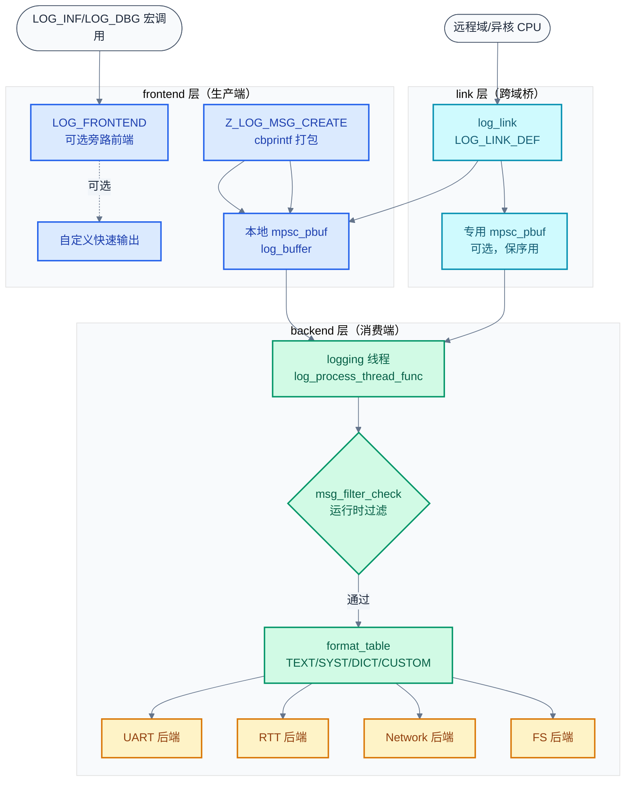
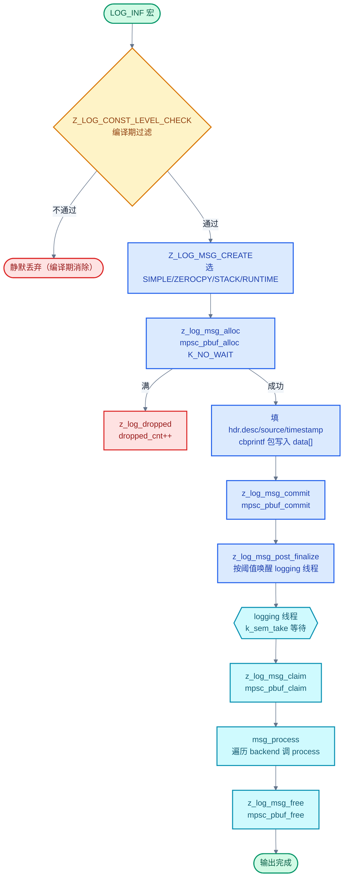

# 23. Logging 日志系统

> 一句话概括：本文把 [19 章无锁数据结构](./19-无锁数据结构深入.md) §9 提到的 `mpsc_pbuf` 与 [22 章 cbprintf 打包格式化](./22-cbprintf打包格式化.md) 提到的 cbprintf 包整合起来，讲清 Zephyr 日志子系统如何用 frontend → link → backend 三层架构、编译期/运行时双层过滤、字典模式与多域链接，在 ISR 安全、低延迟、低 flash 占用之间取得平衡。
> **工程师视角**：读完后应能回答"为什么 deferred 模式选 `mpsc_pbuf` 而非 `k_msgq`""`log_msg_desc` 为何能压成 32 bit""多核日志如何用时间戳比较保序""字典模式省 flash 的代价是什么"这四个问题。

### 关键术语

| 缩写 | 全称 | 含义 |
|------|------|------|
| RTOS | Real-Time Operating System | 实时操作系统 |
| ISR | Interrupt Service Routine | 中断服务例程 |
| MPSC | Multi-Producer Single-Consumer | 多生产者单消费者 |
| PBUF | Packet Buffer | 包缓冲 |
| IPC | Inter-Process Communication | 进程间/核间通信 |
| UART | Universal Asynchronous Receiver-Transmitter | 通用异步收发器 |
| RTT | Real-Time Transfer | SEGGER 实时传输调试接口 |
| RAM | Random Access Memory | 随机存取存储器 |
| flash | Flash Memory | 闪存（嵌入式非易失存储） |
| API | Application Programming Interface | 应用编程接口 |
| SMP | Symmetric Multi-Processing | 对称多处理 |
| MIPI | Mobile Industry Processor Interface | 移动行业处理器接口 |
| SyS-T | System Trace | MIPI 系统追踪协议 |
| DLM | Discrete Logging Mode | 离散日志模式（字典模式别名） |

---

### 前置阅读

| 需要了解 | 参考文档 |
|----------|----------|
| MPSC 包缓冲与 2 bit 包头状态机 | [19-无锁数据结构深入](./19-无锁数据结构深入.md) §9 |
| cbprintf 静态打包与运行时打包 | [22-cbprintf打包格式化](./22-cbprintf打包格式化.md) |
| iterable sections 与链接器 section | [20-Iterable Sections链接器魔法](./20-Iterable%20Sections链接器魔法.md) |
| 用户态与内存域 | [14-用户态与Syscall机制](./14-用户态与Syscall机制.md)、[15-内存域与MPU保护](./15-内存域与MPU保护.md) |

---

## 1. 概述：RTOS 日志系统的设计挑战

> [22 章 cbprintf 打包格式化](./22-cbprintf打包格式化.md) 解决了"如何在不知参数类型的情况下把可变参数压成二进制包"的问题，cbprintf 包是日志消息的载荷格式。但 cbprintf 只管打包，不管"谁来打、何时输出、丢到哪里"。本章进入"进阶 II：可观测与交互"的第一站——日志子系统，看 Zephyr 如何把 cbprintf 包、`mpsc_pbuf`、链接器 section、多域 IPC 拼成一套完整的可观测基础设施。下一篇 [24-Shell 命令行框架](./24-Shell命令行框架.md) 会基于本章的日志后端实现 shell 内嵌日志视图。

### 1.1 RTOS 日志的四个硬约束

嵌入式 RTOS 的日志系统不是"printf 加个缓冲"那么简单，它要同时满足四个互相冲突的约束：

1. **ISR 上下文可调用**——ISR 不能阻塞、不能 spin 等锁。`LOG_ERR` 可能在 ISR 里调用，提交路径必须用原子操作或关中断临界区，不能用 `k_mutex`。
2. **多生产者并发安全**——任意线程 + 任意 ISR 都可能同时打日志，提交路径必须无锁串行化。
3. **低延迟优先于吞吐**——日志是观测手段，不能反过来拖垮实时任务。生产者路径要尽量短，耗时格式化与 I/O 要推迟到独立线程。
4. **flash 与 RAM 双紧**——格式串占 flash，缓冲区占 RAM。一行 `LOG_INF("connection established: %d", id)` 在裸机环境要省到只剩 ID + 参数包。

### 1.2 Zephyr 的三选一策略

源码 [subsys/logging/Kconfig.mode:4-41](file:///home/pbw/rtos/cs-learning-notes/zephyr-project/zephyr/subsys/logging/Kconfig.mode) 用 `choice LOG_MODE` 给出三种模式：

| 模式 | Kconfig | 生产者路径 | 适用场景 | flash/RAM |
|------|---------|-----------|----------|-----------|
| **延迟**（deferred） | `LOG_MODE_DEFERRED` | 打包 → `mpsc_pbuf_commit`（极短） | 默认；ISR/高优先级线程可打 | RAM 中等 |
| **立即**（immediate） | `LOG_MODE_IMMEDIATE` | 打包 → 直接格式化输出 | 调试；不能容忍丢日志 | flash 低 |
| **极简**（minimal） | `LOG_MODE_MINIMAL` | 直接 `printk` | flash 极紧的 bootloaders | flash 极低 |

`LOG_MODE_DEFERRED` 是默认选择，它 `select MPSC_PBUF`——这正是 [19 章](./19-无锁数据结构深入.md) §9 讲过的多生产者包缓冲。生产者只做"打包 + commit"两步，格式化与 I/O 推到独立的 `logging` 线程。

> **核心要点**：Zephyr 日志的并发模型是"多生产者（任意 ISR/线程）单消费者（logging 线程）变长包"，这与 `mpsc_pbuf` 的设计目标完全吻合。三种模式让用户在延迟、可靠性、footprint 之间按需取舍，但默认的 deferred 模式才是 RTOS 日志的"正解"。

---

## 2. 架构：frontend → link → backend

> 第一章讲了日志的三个设计模式。本章展开 Zephyr 日志的三层架构——frontend（生产端）、link（跨域桥）、backend（消费端），并说明三层各自解决什么问题。

### 2.1 三层分工

源码 [subsys/logging/log_core.c:82-91](file:///home/pbw/rtos/cs-learning-notes/zephyr-project/zephyr/subsys/logging/log_core.c) 给出了输出格式分发表：

```c
static const log_format_func_t format_table[] = {
    [LOG_OUTPUT_TEXT]   = ... log_output_msg_process,        /* 人类可读文本 */
    [LOG_OUTPUT_SYST]   = ... log_output_msg_syst_process,   /* MIPI SyS-T 二进制 */
    [LOG_OUTPUT_DICT]   = ... log_dict_output_msg_process,   /* 字典二进制 */
    [LOG_OUTPUT_CUSTOM] = ... log_custom_output_msg_process, /* 自定义协议 */
};
```

四种输出格式由 backend 在运行时通过 `format_set` 切换。围绕这张表，整个子系统分成三层：



> **如何读这张图**：纵向分三段——frontend 层（蓝）负责"把宏调用变成 cbprintf 包"，link 层（青）负责"把远程域的日志投递到本地缓冲"，backend 层（绿+黄）负责"消费缓冲、过滤、格式化、输出到具体 I/O"。生产端到消费端是单向数据流，唯一反向的是 logging 线程对缓冲区的 claim/free。

### 2.2 frontend：生产端的旁路

源码 [subsys/logging/Kconfig.mode:43-49](file:///home/pbw/rtos/cs-learning-notes/zephyr-project/zephyr/subsys/logging/Kconfig.mode) 定义 `LOG_FRONTEND`：

```
config LOG_FRONTEND
    bool "Frontend"
    help
      When enabled, logs are redirected to a custom frontend which is the
      fastest way of getting logs out. The logs are redirected at the function
      level.
```

frontend 是"在 cbprintf 打包之前"的旁路。开启 `LOG_FRONTEND` 后，每条日志在走正常 `Z_LOG_MSG_CREATE` 路径前，先调用 [include/zephyr/logging/log_frontend.h:31](file:///home/pbw/rtos/cs-learning-notes/zephyr-project/zephyr/include/zephyr/logging/log_frontend.h) 的 `log_frontend_msg()`。典型用途是 STM ESP 追踪前端（`log_frontend_stmesp.c`），它把日志直接喂给硬件追踪端口，不经过缓冲与格式化。

`LOG_FRONTEND_ONLY`（[Kconfig.mode:50-55](file:///home/pbw/rtos/cs-learning-notes/zephyr-project/zephyr/subsys/logging/Kconfig.mode)）更进一步——断言"没有 backend"，所有日志只走前端，省掉 backend 与 logging 线程的全部代码。

### 2.3 link：跨域桥

源码 [include/zephyr/logging/log_link.h:62-69](file:///home/pbw/rtos/cs-learning-notes/zephyr-project/zephyr/include/zephyr/logging/log_link.h) 定义 `struct log_link`：

```c
struct log_link {
    const struct log_link_api *api;          /* initiate/activate/get_source_name 等 */
    const char *name;
    struct log_link_ctrl_blk *ctrl_blk;      /* 域计数、源计数、过滤器 */
    void *ctx;
    struct mpsc_pbuf_buffer *mpsc_pbuf;      /* 专用缓冲，NULL 则共用主缓冲 */
    const struct mpsc_pbuf_buffer_config *mpsc_pbuf_config;
};
```

link 的本质是"把远程域的 `log_msg` 字节流接到本地消费链"。一个 link 可以承载多个域（`domain_cnt`），每个域有自己的源（`source_cnt`）。`LOG_LINK_DEF` 宏（[log_link.h:86-110](file:///home/pbw/rtos/cs-learning-notes/zephyr-project/zephyr/include/zephyr/logging/log_link.h)）可选地为每个 link 分配专用 `mpsc_pbuf`，专用缓冲让 logging 线程能按时间戳跨 link 比较保序（见第 7 章）。

### 2.4 backend：消费端

源码 [include/zephyr/logging/log_backend.h:63-77](file:///home/pbw/rtos/cs-learning-notes/zephyr-project/zephyr/include/zephyr/logging/log_backend.h) 定义 backend API：

```c
struct log_backend_api {
    void (*process)(const struct log_backend *const backend, union log_msg_generic *msg);
    void (*dropped)(const struct log_backend *const backend, uint32_t cnt);
    void (*panic)(const struct log_backend *const backend);
    void (*init)(const struct log_backend *const backend);
    int  (*is_ready)(const struct log_backend *const backend);
    int  (*format_set)(const struct log_backend *const backend, uint32_t log_type);
    void (*notify)(const struct log_backend *const backend, enum log_backend_evt event, ...);
};
```

`LOG_BACKEND_DEFINE` 宏（[log_backend.h:111-125](file:///home/pbw/rtos/cs-learning-notes/zephyr-project/zephyr/include/zephyr/logging/log_backend.h)）用 `STRUCT_SECTION_ITERABLE(log_backend, _name)` 把 backend 静态注册到链接器 section（参考 [20 章 iterable sections](./20-Iterable%20Sections链接器魔法.md)）。`log_core.c:518` 的 `msg_process` 用 `STRUCT_SECTION_FOREACH(log_backend, backend)` 遍历所有 backend，逐个调用 `log_backend_msg_process`。

> **核心要点**：三层架构的解耦点是 cbprintf 包格式的 `log_msg`。frontend 在包之前介入（最快但功能受限），link 在包之后介入（跨域搬运），backend 在包格式化时介入（最灵活但最慢）。任何一层都可以独立替换或裁剪，这是 Zephyr 日志能同时支持"极简 printk"和"多核 MIPI SyS-T 追踪"的关键。

---

## 3. MPSC_PBUF：异步日志的基础

> 第二章画出了三层架构。本章聚焦生产端到消费端的核心数据结构——`mpsc_pbuf`，回答"为什么 deferred 模式必须用它"。详细的无锁算法推导见 [19 章](./19-无锁数据结构深入.md) §1-§8，这里只讲 logging 的具体用法。

### 3.1 log_core.c 的缓冲区配置

源码 [subsys/logging/log_core.c:122-143](file:///home/pbw/rtos/cs-learning-notes/zephyr-project/zephyr/subsys/logging/log_core.c)：

```c
static STRUCT_SECTION_ITERABLE(log_msg_ptr, log_msg_ptr);
static STRUCT_SECTION_ITERABLE_ALTERNATE(log_mpsc_pbuf, mpsc_pbuf_buffer, log_buffer);
static struct mpsc_pbuf_buffer *curr_log_buffer;

static uint32_t __aligned(Z_LOG_MSG_ALIGNMENT)
    buf32[CONFIG_LOG_BUFFER_SIZE / sizeof(int)];   /* 默认 1024 字节 */

static const struct mpsc_pbuf_buffer_config mpsc_config = {
    .buf = (uint32_t *)buf32,
    .size = ARRAY_SIZE(buf32),
    .notify_drop = z_log_notify_drop,              /* 丢包回调：累计 dropped_cnt */
    .get_wlen = log_msg_generic_get_wlen,          /* 从 log_msg 头算包字长 */
    .flags = (IS_ENABLED(CONFIG_LOG_MODE_OVERFLOW) ?
              MPSC_PBUF_MODE_OVERWRITE : 0) |      /* OVERWRITE：满则丢旧 */
             (IS_ENABLED(CONFIG_LOG_MEM_UTILIZATION) ?
              MPSC_PBUF_MAX_UTILIZATION : 0)        /* 跟踪最大使用量 */
};
```

四个关键字段对应四个设计决策：

| 字段 | 作用 | 为什么这么设计 |
|------|------|---------------|
| `buf32` | 静态缓冲区，`__aligned(Z_LOG_MSG_ALIGNMENT)` | `mpsc_pbuf` 假设 32 位字对齐；`Z_LOG_MSG_ALIGNMENT = CBPRINTF_PACKAGE_ALIGNMENT` |
| `notify_drop` | 丢包时累加 `dropped_cnt` | 不丢日志本身，只丢计数，让 backend 周期性报告 |
| `get_wlen` | 从包头算字长 | 变长包的核心——`mpsc_pbuf` 不知包结构，回调让它能跳过整包 |
| `flags` | OVERWRITE 模式 | ISR 不能阻塞，满时只能丢；丢旧（OVERWRITE）还是丢新由 Kconfig 决定 |

### 3.2 为什么不用 k_msgq 或 k_fifo

`k_msgq` 是定长消息队列，`k_fifo` 是基于 `k_spinlock` 的链表队列。它们都不适合日志：

| 对比维度 | `k_msgq` | `k_fifo` | `mpsc_pbuf` |
|----------|----------|----------|-------------|
| 元素长度 | 定长 | 变长（每条带指针） | 变长（连续内存） |
| ISR 多生产者 | 需关中断 | 需关中断 | 原子操作，无需关中断 |
| 内存布局 | 独立数组 | 链表节点散布 | 连续环形数组 |
| 零拷贝 | 否 | 是（指针） | 是（alloc 返回数组内指针） |
| 满策略 | 阻塞或返回错误 | 阻塞 | OVERWRITE 丢旧或返回 NULL |
| 缓存友好 | 中 | 差 | 好（连续） |

`k_msgq` 的定长约束让短日志浪费空间、长日志装不下；`k_fifo` 的链表节点需要每条日志单独分配，ISR 里分配内存是危险的。`mpsc_pbuf` 的连续环形数组 + 变长包 + 原子两阶段提交（alloc/commit）是这三个需求的最优解。

### 3.3 OVERWRITE 与阻塞的取舍

源码 [subsys/logging/Kconfig.processing:17-40](file:///home/pbw/rtos/cs-learning-notes/zephyr-project/zephyr/subsys/logging/Kconfig.processing)：

```
config LOG_MODE_OVERFLOW
    bool "Drop oldest message when full"
    default y

config LOG_BLOCK_IN_THREAD
    bool "Block in thread context on full"
    depends on MULTITHREADING

config LOG_BLOCK_IN_THREAD_TIMEOUT_MS
    int "Maximum time (in milliseconds) thread can be blocked"
    default 1000
    range -1 10000
```

`LOG_MODE_OVERFLOW` 默认开启——满则丢最旧的包。`LOG_BLOCK_IN_THREAD` 仅在**线程上下文**生效，ISR 上下文永远不阻塞。`LOG_BLOCK_IN_THREAD_TIMEOUT_MS = -1` 表示永久阻塞，但日志核心会警告"可能导致死锁"——如果 logging 线程本身也打日志，永久阻塞会自锁。

源码 [subsys/logging/log_core.c:663-674](file:///home/pbw/rtos/cs-learning-notes/zephyr-project/zephyr/subsys/logging/log_core.c) 的 `msg_alloc` 实现了这套逻辑：

```c
static struct log_msg *msg_alloc(struct mpsc_pbuf_buffer *buffer, uint32_t wlen)
{
    if (!IS_ENABLED(CONFIG_LOG_MODE_DEFERRED)) {
        return NULL;   /* immediate 模式不走缓冲 */
    }
    return (struct log_msg *)mpsc_pbuf_alloc(
        buffer, wlen,
        (CONFIG_LOG_BLOCK_IN_THREAD_TIMEOUT_MS == -1)
            ? K_FOREVER                              /* 永久阻塞 */
            : K_MSEC(CONFIG_LOG_BLOCK_IN_THREAD_TIMEOUT_MS));  /* 限时阻塞 */
}
```

> **核心要点**：日志缓冲区的满策略必须区分上下文——ISR 永远 `K_NO_WAIT`（其实 `mpsc_pbuf_alloc` 在 ISR 里就是非阻塞），线程才允许阻塞。`LOG_BLOCK_IN_THREAD_TIMEOUT_MS` 的默认 1000ms 是"宁可丢日志也不要死锁"的工程妥协：永久阻塞（-1）看似可靠，一旦 logging 线程的输出路径里又触发了日志，就会自锁。

---

## 4. 日志消息生命周期

> 第三章讲了缓冲区。本章跟踪一条日志从 `LOG_INF` 宏到 UART 输出的完整路径，这是理解整个子系统的主线。

### 4.1 log_msg 的 32 bit 描述符

源码 [include/zephyr/logging/log_msg.h:56-62](file:///home/pbw/rtos/cs-learning-notes/zephyr-project/zephyr/include/zephyr/logging/log_msg.h)：

```c
struct log_msg_desc {
    LOG_MSG_GENERIC_HDR;                 /* valid:1, busy:1, type:1 */
    uint32_t domain:3;                   /* 域 ID，最多 8 个域 */
    uint32_t level:3;                    /* 0-4，对应 NONE/ERR/WRN/INF/DBG */
    uint32_t package_len:Z_LOG_MSG_PACKAGE_BITS;  /* 11 bit，cbprintf 包长，≤2047 */
    uint32_t data_len:12;                /* hexdump 数据长，≤4096 */
};
```

`log_msg.c:16` 有 `BUILD_ASSERT(sizeof(struct log_msg_desc) == sizeof(uint32_t))`——整个描述符正好 32 bit。位域布局：

| 位段 | 字段 | 宽度 | 含义 |
|------|------|------|------|
| [0] | valid | 1 | MPSC_PBUF 包头：1=已提交 |
| [1] | busy | 1 | MPSC_PBUF 包头：1=正在消费 |
| [2] | type | 1 | 0=日志消息（Z_LOG_MSG_LOG） |
| [3:5] | domain | 3 | 域 ID（本地=0，远程按 link 偏移） |
| [6:8] | level | 3 | 严重等级 |
| [9:19] | package_len | 11 | cbprintf 包字节数 |
| [20:31] | data_len | 12 | hexdump 数据字节数 |

> **如何读这张表**：valid/busy 是 [19 章](./19-无锁数据结构深入.md) §4 讲的 2 bit 包头状态机，让 `mpsc_pbuf` 能在不锁的情况下管理包生命周期。domain 3 bit 决定了系统最多 8 个域——这就是 `CONFIG_LOG_REMOTE_DOMAIN_MAX_COUNT` 默认 4 的由来（本地 1 + 远程 4 < 8）。package_len 11 bit 限制了单条 cbprintf 包最大 2047 字节，`log_msg.c:366` 的 `Z_LOG_MSG_MAX_PACKAGE = BIT_MASK(11)` 检查会丢弃超长消息。

### 4.2 四种消息创建模式

源码 [include/zephyr/logging/log_msg.h:130-149](file:///home/pbw/rtos/cs-learning-notes/zephyr-project/zephyr/include/zephyr/logging/log_msg.h) 定义了四种创建模式：

| 模式 | Kconfig 前提 | 路径 | 速度 | 限制 |
|------|-------------|------|------|------|
| `Z_LOG_MSG_MODE_SIMPLE` | `LOG_SIMPLE_MSG_OPTIMIZE`，32 位平台 | 直接写包到缓冲 | 最快 | 仅 0-2 个 32 位整型参数 |
| `Z_LOG_MSG_MODE_ZERO_COPY` | `LOG_SPEED` | 先 alloc 再原地打包 | 快 | 不能有运行时字符串指针 |
| `Z_LOG_MSG_MODE_FROM_STACK` | 默认 | 栈上打包 → `z_log_msg_static_create` | 中 | 无 |
| `Z_LOG_MSG_MODE_RUNTIME` | `LOG_ALWAYS_RUNTIME` | `cbvprintf_package` 运行时打包 | 最慢 | 无限制，用户态也走这条 |

为什么有四条路径？因为 cbprintf 包的构建成本差异巨大。`LOG_INF("count=%d", n)` 这种简单消息，参数已知是 32 位整型，包格式可静态确定——`SIMPLE` 模式直接写几个字到缓冲区，几十条指令搞定。但 `LOG_INF("name=%s", ptr)` 的字符串指针在运行时才知，必须走 `RUNTIME` 模式让 `cbvprintf_package` 探测参数类型。

### 4.3 生命周期全程



> **如何读这张图**：上半部分（蓝）在生产者上下文（ISR 或线程）执行，必须极短——只有 alloc + 填充 + commit 三步，不涉及任何格式化。下半部分（青）在 logging 线程执行，claim → process → free 三步，process 才调用 cbprintf 解包与 backend I/O。两段通过 `mpsc_pbuf` 的环形数组解耦，生产者不需要等消费者。

### 4.4 logging 线程的批处理

源码 [subsys/logging/log_core.c:941-986](file:///home/pbw/rtos/cs-learning-notes/zephyr-project/zephyr/subsys/logging/log_core.c) 是 logging 线程的主循环：

```c
static void log_process_thread_func(void *dummy1, void *dummy2, void *dummy3)
{
    /* ... 初始化 ... */
    while (true) {
        /* 激活未就绪的 backend 与 link */
        if (log_process() == false) {
            if (processed_any) {
                processed_any = false;
                log_backend_notify_all(LOG_BACKEND_EVT_PROCESS_THREAD_DONE, NULL);
            }
            (void)k_sem_take(&log_process_thread_sem, timeout);
        } else {
            processed_any = true;
        }
    }
}
```

唤醒时机由 [log_core.c:165-201](file:///home/pbw/rtos/cs-learning-notes/zephyr-project/zephyr/subsys/logging/log_core.c) 的 `z_log_msg_post_finalize` 控制，涉及两个 Kconfig：

| Kconfig | 默认 | 作用 |
|---------|------|------|
| `CONFIG_LOG_PROCESS_THREAD_SLEEP_MS` | 1000 | 第一条消息到达后启动定时器，超时唤醒 |
| `CONFIG_LOG_PROCESS_TRIGGER_THRESHOLD` | 10 | 缓冲消息数达阈值立即唤醒，停止定时器 |

`z_log_msg_post_finalize` 的逻辑：

1. 第一条消息到达（`cnt == 0`）→ 启动 `SLEEP_MS` 定时器
2. 后续消息累加，达到 `TRIGGER_THRESHOLD` → 停定时器，立即 `k_sem_give`
3. 定时器超时 → `k_sem_give`

这是"延迟 + 批处理"的经典权衡：阈值越小延迟越低但吞吐越低；阈值越大批处理越好但首条消息延迟越高。`TRIGGER_THRESHOLD = 1` 是特例——每条消息都立即唤醒，定时器永不启动。

---

## 5. 编译期过滤与运行时过滤

> 第四章的生命周期图里有一个 `Z_LOG_CONST_LEVEL_CHECK` 判断点。本章展开日志的双层过滤机制——编译期过滤省 flash 与 CPU，运行时过滤提供动态可调。

### 5.1 双层过滤的必要性

只用一层过滤会有矛盾：

- **只编译期**：发布版本想临时开 DEBUG 看某模块的日志？做不到，DEBUG 代码已被编译器删除。
- **只运行时**：每个模块的 DEBUG 字符串都要编进 flash，即使从不开启——flash 浪费严重。

Zephyr 的方案是两层叠加：编译期用 `CONFIG_LOG_MAX_LEVEL` 全局裁剪，运行时用每模块每 backend 的 3 bit 过滤槽动态调节。

### 5.2 编译期过滤

源码 [include/zephyr/logging/log_core.h:146-154](file:///home/pbw/rtos/cs-learning-notes/zephyr-project/zephyr/include/zephyr/logging/log_core.h)：

```c
#define Z_LOG_CONST_LEVEL_CHECK(_level)                        \
    (IS_ENABLED(CONFIG_LOG) &&                                 \
     (Z_LOG_LEVEL_CHECK(_level, CONFIG_LOG_OVERRIDE_LEVEL, LOG_LEVEL_NONE) \
      ||                                                       \
      ((IS_ENABLED(CONFIG_LOG_OVERRIDE_LEVEL) == false) &&     \
       ((_level) <= __log_level) &&                            /* 模块级 */  \
       ((_level) <= CONFIG_LOG_MAX_LEVEL)                      /* 全局级 */  \
      )                                                        \
     ))
```

三个层级共同决定一条日志是否编译进来：

| 层级 | 来源 | 作用域 |
|------|------|--------|
| `CONFIG_LOG_MAX_LEVEL` | Kconfig 系统 | 全局上限，超过的等级被裁掉 |
| `__log_level` | `LOG_MODULE_REGISTER` 第三参 | 单模块上限 |
| `CONFIG_LOG_OVERRIDE_LEVEL` | Kconfig | 强制下限，覆盖模块设置 |

`Z_LOG_CONST_LEVEL_CHECK` 是 `if` 条件，编译器在 `false` 分支会消除死代码——`LOG_DBG` 的格式串与 cbprintf 打包代码全被删除。这就是为什么"关掉 DEBUG 等级能省大量 flash"。

### 5.3 运行时过滤

源码 [include/zephyr/logging/log_core.h:399-446](file:///home/pbw/rtos/cs-learning-notes/zephyr-project/zephyr/include/zephyr/logging/log_core.h) 定义了过滤槽位格式：

```c
#define LOG_LEVEL_BITS 3U                                    /* 每槽 3 bit */
#define LOG_FILTERS_NUM_OF_SLOTS (32 / LOG_LEVEL_BITS)       /* 32 位字里 10 个槽 */
#define LOG_FILTERS_MAX_BACKENDS \
    (LOG_FILTERS_NUM_OF_SLOTS - (1 + IS_ENABLED(CONFIG_LOG_FRONTEND)))
#define LOG_FILTER_AGGR_SLOT_IDX 0                           /* 槽 0：聚合等级 */
#define LOG_FILTER_FIRST_BACKEND_SLOT_IDX 1                  /* 槽 1+：每 backend */
#define LOG_FRONTEND_SLOT_ID (LOG_FILTERS_NUM_OF_SLOTS - 1)  /* 末槽：frontend */
```

每个 log source（模块或实例）有一个 32 位的 `filters` 字段，分成 10 个 3 bit 槽（共 30 bit，剩余 2 bit 未用）：

| 槽位 | 含义 |
|------|------|
| 0 | 聚合等级（所有 backend 的最高等级，生产者快速检查用） |
| 1..N | 每 backend 的等级 |
| 9 | frontend 等级（若启用 frontend） |

3 bit 能编码 0-7，日志等级只用 0-4（NONE/ERR/WRN/INF/DBG）。这意味着系统最多支持 8 个 backend（无 frontend 时），或 7 个 backend + 1 个 frontend。

源码 [subsys/logging/log_core.c:483-514](file:///home/pbw/rtos/cs-learning-notes/zephyr-project/zephyr/subsys/logging/log_core.c) 的 `msg_filter_check` 在 logging 线程消费时再查一次：

```c
static bool msg_filter_check(struct log_backend const *backend, union log_msg_generic *msg)
{
    /* ... */
    backend_level = log_filter_get(backend, domain_id, source_id, true);
    return (level <= backend_level);
}
```

### 5.4 双层过滤流程

```mermaid
%%{init: {"theme": "base", "themeVariables": {"primaryColor": "#f8fafc", "primaryTextColor": "#1e293b", "primaryBorderColor": "#475569", "lineColor": "#64748b", "secondaryColor": "#f1f5f9", "secondaryBorderColor": "#94a3b8", "tertiaryColor": "#f8fafc", "fontFamily": "\"trebuchet ms\", verdana, arial, sans-serif"}}}%%
flowchart TD
    Call(["LOG_DBG 调用"]) --> Compile{"编译期<br/>Z_LOG_CONST_LEVEL_CHECK<br/>level ≤ MAX_LEVEL<br/>且 level ≤ __log_level"}
    Compile -->|否| Elim(["编译器消除<br/>不占 flash/RAM"])
    Compile -->|是| Runtime{"运行期生产端<br/>Z_LOG_DYNAMIC_LEVEL_CHECK<br/>level ≤ 聚合槽 AGGR"}
    Runtime -->|否| DropProd(["运行时丢弃<br/>不进 mpsc_pbuf"])
    Runtime -->|是| Enqueue(["进 mpsc_pbuf 缓冲"])
    Enqueue --> Consume{"运行期消费端<br/>msg_filter_check<br/>level ≤ backend 槽"}
    Consume -->|否| SkipBackend(["跳过此 backend"])
    Consume -->|是| Output(["格式化输出"])
    classDef call fill:#d1fae5, stroke:#059669, color:#065f46, stroke-width:2px
    classDef check fill:#fef3c7, stroke:#d97706, color:#92400e, stroke-width:2px
    classDef drop fill:#fee2e2, stroke:#dc2626, color:#991b1b, stroke-width:2px
    classDef ok fill:#dbeafe, stroke:#2563eb, color:#1e40af, stroke-width:2px
    class Call call
    class Compile,Runtime,Consume check
    class Elim,DropProd,SkipBackend drop
    class Enqueue,Output ok
```

> **如何读这张图**：三层过滤从左到右依次生效，越靠左越早执行、裁剪越彻底。编译期过滤直接消除代码，零运行时开销；运行期生产端过滤读聚合槽，O(1) 时间决定是否进缓冲；运行期消费端过滤每 backend 独立检查，让不同 backend 看不同等级（如 UART 看 DEBUG，RTT 看 INF）。

> **核心要点**：双层过滤的精髓是"编译期管 flash，运行期管动态"。`CONFIG_LOG_MAX_LEVEL` 是全局硬上限——设为 3（INF），所有 DBG 代码与字符串都不进二进制。在此之上，运行期聚合槽让生产者快速判断"这条日志至少有一个 backend 要看吗"，避免无谓的打包与提交。

---

## 6. 字典模式：省 flash 的 ID 映射

> 第五章讲了过滤如何省 CPU 与 RAM。本章讲字典模式如何省 flash——把长格式串压成短 ID，把人类可读文本从设备二进制里剥离。

### 6.1 字典模式解决什么问题

一条 `LOG_INF("Bluetooth connection established, handle=%d interval=%d", h, iv)` 的格式串 `"Bluetooth connection established, handle=%d interval=%d"` 占 47 字节 flash。如果这条日志永远不开启，这 47 字节就是纯浪费。即便开启，文本也只是给开发者看的——量产固件根本不需要在设备上存这些字符串。

字典模式的思路：把所有格式串从二进制中剥离，存到主机侧的"字典数据库"；设备只输出 ID + 参数包，主机用字典把 ID 翻译回字符串。

### 6.2 三个 Kconfig 的配合

源码 [subsys/logging/Kconfig.misc:53-68](file:///home/pbw/rtos/cs-learning-notes/zephyr-project/zephyr/subsys/logging/Kconfig.misc)：

```
config LOG_FMT_SECTION
    bool "Keep log strings in dedicated section"

config LOG_FMT_SECTION_STRIP
    bool "Strip log strings from binary"
    depends on LOG_DICTIONARY_DB
    depends on LOG_FMT_SECTION
    depends on LINKER_DEVNULL_SUPPORT
    depends on !LOG_ALWAYS_RUNTIME
    depends on !LOG_OUTPUT
    imply LINKER_DEVNULL_MEMORY
    imply LOG_FMT_STRING_VALIDATE
```

三步流水线：

1. `LOG_FMT_SECTION`：把所有格式串集中到 `_log_strings` 链接器 section（参考 [log_msg.h:446-451](file:///home/pbw/rtos/cs-learning-notes/zephyr-project/zephyr/include/zephyr/logging/log_msg.h) 的 `Z_LOG_MSG_STR_VAR_IN_SECTION` 宏）。
2. `LOG_DICTIONARY_DB`：构建字典数据库，记录每个格式串地址 → ID 的映射。
3. `LOG_FMT_SECTION_STRIP`：用 `LINKER_DEVNULL_MEMORY` 把 `_log_strings` section 重定向到 `/dev/null`，二进制里格式串位置变成空地址，但地址本身保留作 ID。

### 6.3 输出端的字典格式

源码 [subsys/logging/log_output_dict.c:15-47](file:///home/pbw/rtos/cs-learning-notes/zephyr-project/zephyr/subsys/logging/log_output_dict.c) 的 `log_dict_output_msg_process`：

```c
void log_dict_output_msg_process(const struct log_output *output,
                                 struct log_msg *msg, uint32_t flags)
{
    struct log_dict_output_normal_msg_hdr_t output_hdr;
    /* 头部：type/domain/level/package_len/data_len/timestamp/source */
    output_hdr.type = MSG_NORMAL;
    output_hdr.domain = msg->hdr.desc.domain;
    output_hdr.level = msg->hdr.desc.level;
    output_hdr.package_len = msg->hdr.desc.package_len;
    output_hdr.data_len = msg->hdr.desc.data_len;
    output_hdr.timestamp = msg->hdr.timestamp;
    output_hdr.source = (source != NULL) ? log_source_id(source) : 0U;

    log_output_write(output->func, (uint8_t *)&output_hdr, sizeof(output_hdr), ctx);
    /* 跟着原始 cbprintf 包与 hexdump 数据 */
    /* ... */
}
```

设备输出的就是"固定头 + cbprintf 包 + 数据"的原始字节，没有任何文本格式化。主机侧用 `log_parser` 工具读字典数据库，把 `source_id` 翻译成模块名、把 cbprintf 包里的格式串地址翻译成字符串，再按 `printf` 语义展开参数。

### 6.4 log_cache：ID 到字符串的缓存

字典模式下，`source_id` 是个 16 位整数，但输出文本时要它对应的模块名。在线查询需要遍历 `log_const` section，开销随模块数线性增长。源码 [subsys/logging/log_cache.c](file:///home/pbw/rtos/cs-learning-notes/zephyr-project/zephyr/subsys/logging/log_cache.c) 实现了一个 LRU 缓存：

```c
bool log_cache_get(struct log_cache *cache, uintptr_t id, uint8_t **data)
{
    SYS_SLIST_FOR_EACH_CONTAINER(&cache->active, entry, node) {
        if (cache->cmp(entry->id, id)) {
            cache->hit++;
            /* 命中：移到链表头（LRU） */
            sys_slist_remove(&cache->active, prev_node, &entry->node);
            sys_slist_prepend(&cache->active, &entry->node);
            break;
        }
        /* ... */
    }
    /* 未命中：从 idle 链表取一个空槽，或淘汰链表尾 */
}
```

`log_mgmt.c:42-46` 定义了两个缓存实例——`dname_cache`（域名缓存）与 `sname_cache`（源名缓存），容量由 `CONFIG_LOG_DOMAIN_NAME_CACHE_ENTRY_COUNT`（默认 2）与 `CONFIG_LOG_SOURCE_NAME_CACHE_ENTRY_COUNT`（默认 8）控制。多域场景下，远程域的源名查询走 link API，缓存让重复查询 O(1)。

> **核心要点**：字典模式把"省 flash"做到极致——格式串完全剥离，设备只输出 ID + 参数包。代价是离线工具链依赖：必须有字典数据库才能解读日志。`log_cache` 用 LRU 缓存缓解 ID 查询的 O(n) 开销，让字典模式在运行时几乎无额外成本。

---

## 7. 多域链接：多核/远程处理器日志

> 第六章讲了单核上的字典模式。本章进入多核/远程处理器场景——多个 CPU 各自有日志源，如何汇聚到一个 backend 输出且保持时序？

### 7.1 多域的需求场景

嵌入式异构系统常见两类多域：

1. **SMP 同构多核**：多个 Cortex-A 核跑同一 Zephyr 镜像，日志源在内核里共享，不需 link。
2. **异构多核**：如 Cortex-M + Cortex-A、MCU + DSP，各自跑独立 Zephyr 镜像，日志源在各自镜像里，必须通过 IPC 传输。

`LOG_MULTIDOMAIN`（[Kconfig.mode:75-78](file:///home/pbw/rtos/cs-learning-notes/zephyr-project/zephyr/subsys/logging/Kconfig.mode)）针对第二种。每个远程域是一个 link，link 把远程 `log_msg` 字节流投递到本地缓冲，logging 线程统一消费。

### 7.2 LOG_LINK_DEF 与专用缓冲

源码 [include/zephyr/logging/log_link.h:86-110](file:///home/pbw/rtos/cs-learning-notes/zephyr-project/zephyr/include/zephyr/logging/log_link.h) 的 `LOG_LINK_DEF` 宏关键在 `_buf_wlen` 参数：

- `_buf_wlen > 0`：link 有专用 `mpsc_pbuf`，远程消息先进专用缓冲，logging 线程跨缓冲按时间戳比较取最旧（保序）
- `_buf_wlen = 0`：远程消息直接进主缓冲 `log_buffer`，不保序但省 RAM

源码 [subsys/logging/Kconfig.links:13-20](file:///home/pbw/rtos/cs-learning-notes/zephyr-project/zephyr/subsys/logging/Kconfig.links)：

```
config LOG_LINK_IPC_SERVICE_BUFFER_SIZE
    int "Dedicated buffer size"
    depends on LOG_LINK_IPC_SERVICE
    default 2048
    help
      Dedicated buffer allows to maintain ordering of processed messages.
      If 0, main buffer is used and messages are processed in the order of arrival.
```

### 7.3 跨缓冲保序算法

源码 [subsys/logging/log_core.c:724-788](file:///home/pbw/rtos/cs-learning-notes/zephyr-project/zephyr/subsys/logging/log_core.c) 的 `z_log_msg_claim_oldest` 是多域保序的核心：

```c
union log_msg_generic *z_log_msg_claim_oldest(k_timeout_t *backoff)
{
    union log_msg_generic *msg = NULL;
    log_timestamp_t t_min = UINT64_MAX;

    /* 遍历所有缓冲（主缓冲 + 各 link 专用缓冲） */
    STRUCT_SECTION_FOREACH(log_msg_ptr, msg_ptr) {
        /* 每个缓冲先 claim 一条暂存到 msg_ptr->msg */
        if (msg_ptr->msg == NULL) {
            msg_ptr->msg = (union log_msg_generic *)mpsc_pbuf_claim(&buf->buf);
        }
        /* 比较时间戳，取最旧的 */
        if (msg_ptr->msg) {
            log_timestamp_t t = log_msg_get_timestamp(&msg_ptr->msg->log);
            if (t < t_min) {
                t_min = t;
                msg = msg_ptr->msg;
                chosen = msg_ptr;
            }
        }
    }
    /* ... 返回最旧消息 ... */
}
```

算法思路：每个缓冲（主 + 各 link）各 claim 一条暂存，比较时间戳取最小者输出。这要求所有域用同一时间基准——`LOG_MULTIDOMAIN` 强制 `select LOG_TIMESTAMP_64BIT`（[Kconfig.mode:76-77](file:///home/pbw/rtos/cs-learning-notes/zephyr-project/zephyr/subsys/logging/Kconfig.mode)），用 64 位时间戳避免短周期回绕。

### 7.4 LOG_PROCESSING_LATENCY_US：容忍乱序的退避

跨域日志有个固有难题：远程域的消息经 IPC 传输有延迟，可能后发先到。源码 [subsys/logging/log_core.c:758-776](file:///home/pbw/rtos/cs-learning-notes/zephyr-project/zephyr/subsys/logging/log_core.c)：

```c
if (CONFIG_LOG_PROCESSING_LATENCY_US > 0) {
    int32_t diff = t_min - (timestamp_func() - proc_latency);
    if (diff > 0) {
        /* 消息"太新"，退避一段时间等更旧的远程消息到达 */
        *backoff = K_CYC(diff);
        return NULL;
    }
}
```

`proc_latency` 在 `log_set_timestamp_func` 里计算（[log_core.c:430-431](file:///home/pbw/rtos/cs-learning-notes/zephyr-project/zephyr/subsys/logging/log_core.c)）：

```c
proc_latency = (freq * CONFIG_LOG_PROCESSING_LATENCY_US) / 1000000;
```

数值演算：假设 `freq = 64 MHz`（Cortex-M4 典型），`CONFIG_LOG_PROCESSING_LATENCY_US = 100000`（默认 100ms）：

$$
\text{proc\_latency} = \frac{64\,000\,000 \times 100\,000}{1\,000\,000} = 6\,400\,000 \text{ cycles}
$$

即 64MHz 时钟下 100ms 对应 640 万周期。logging 线程 claim 时检查：若最旧消息的时间戳 `t_min` 比当前时间减去 `proc_latency` 还要新（`diff > 0`），说明可能有更旧的消息还在 IPC 传输路上，退避 `diff` 个周期再试。

这是延迟与保序的权衡：`LATENCY_US` 越大，保序越可靠但日志延迟越高；设为 0 则不退避，先到先处理（可能乱序）。乱序发生时 `unordered_cnt` 累加，由 `unordered_notify` 周期性报告（[log_core.c:537-542](file:///home/pbw/rtos/cs-learning-notes/zephyr-project/zephyr/subsys/logging/log_core.c)）。

### 7.5 IPC service link 实现

源码 [subsys/logging/log_link_ipc_service.c](file:///home/pbw/rtos/cs-learning-notes/zephyr-project/zephyr/subsys/logging/log_link_ipc_service.c) 是 link 的 IPC 传输实现。它用 `ipc_service` 子系统（参考 Zephyr IPC service 文档）注册名为 `"logging"` 的 endpoint：

```c
static struct ipc_ept_cfg ept_cfg = {
    .name = "logging",
    .cb = {
        .bound    = bound_cb,    /* 连接建立 → 通知 multidomain link */
        .received = recv_cb,     /* 收到数据 → log_multidomain_link_on_recv_cb */
        .error    = error_cb,
    },
};
```

远程端的 `log_multidomain_backend`（[backends/Kconfig.multidomain:4-11](file:///home/pbw/rtos/cs-learning-notes/zephyr-project/zephyr/subsys/logging/backends/Kconfig.multidomain)）把本地日志通过同一 IPC endpoint 发出。两端用 `log_multidomain_link` 共享协议（握手、域信息交换、消息转发）。

> **核心要点**：多域日志保序的核心是"每缓冲各 claim 一条 + 比时间戳取最旧"。这要求所有域共享 64 位时间基准，并容忍 `LOG_PROCESSING_LATENCY_US` 的退避延迟。专用缓冲是可选的——不要保序就共用主缓冲省 RAM，要保序就每 link 一个专用缓冲。

---

## 8. 后端：UART/RTT/Network

> 第七章讲了多域汇聚。本章看 backend 层——汇聚后的消息如何落到具体 I/O。

### 8.1 后端注册与遍历

源码 [include/zephyr/logging/log_backend.h:111-125](file:///home/pbw/rtos/cs-learning-notes/zephyr-project/zephyr/include/zephyr/logging/log_backend.h) 的 `LOG_BACKEND_DEFINE` 用 `STRUCT_SECTION_ITERABLE(log_backend, _name)` 把 backend 放到链接器 section。`log_core.c:518` 的 `msg_process` 遍历：

```c
static void msg_process(union log_msg_generic *msg)
{
    STRUCT_SECTION_FOREACH(log_backend, backend) {
        if (log_backend_is_active(backend) &&
            msg_filter_check(backend, msg)) {
            log_backend_msg_process(backend, msg);
        }
    }
}
```

每条消息对所有 active backend 都过一遍过滤检查，通过的才调 `process`。这意味着同一消息可同时输出到 UART 与 RTT，且各自看不同等级。

### 8.2 四种输出格式

`log_core.c:82-91` 的 `format_table` 定义了四种格式：

| 格式 | 枚举 | 实现 | 输出内容 |
|------|------|------|----------|
| 文本 | `LOG_OUTPUT_TEXT` | `log_output_msg_process` | 人类可读，带时间戳/颜色/源名 |
| MIPI SyS-T | `LOG_OUTPUT_SYST` | `log_output_msg_syst_process` | 二进制 SyS-T 协议 |
| 字典 | `LOG_OUTPUT_DICT` | `log_dict_output_msg_process` | 二进制头 + cbprintf 包 |
| 自定义 | `LOG_OUTPUT_CUSTOM` | `log_custom_output_msg_process` | 用户注册的回调 |

backend 通过 `format_set` 在运行时切换格式。UART 后端 [subsys/logging/backends/log_backend_uart.c:137-145](file:///home/pbw/rtos/cs-learning-notes/zephyr-project/zephyr/subsys/logging/backends/log_backend_uart.c)：

```c
static int format_set(const struct log_backend *const backend, uint32_t log_type)
{
    const struct lbu_cb_ctx *ctx = backend->cb->ctx;
    struct lbu_data *data = ctx->data;
    data->log_format_current = log_type;   /* 记下当前格式 */
    return 0;
}

static void process(const struct log_backend *const backend, union log_msg_generic *msg)
{
    log_format_func_t log_output_func = log_format_func_t_get(data->log_format_current);
    log_output_func(ctx->output, &msg->log, flags);   /* 调用对应格式函数 */
}
```

### 8.3 UART 后端实例

源码 [subsys/logging/backends/log_backend_uart.c:82-124](file:///home/pbw/rtos/cs-learning-notes/zephyr-project/zephyr/subsys/logging/backends/log_backend_uart.c) 的 `char_out` 是最终输出函数：

```c
static int char_out(uint8_t *data, size_t length, void *ctx)
{
    const struct lbu_cb_ctx *cb_ctx = ctx;
    const struct device *uart_dev = LBU_UART_DEV(cb_ctx);

    if (!IS_ENABLED(CONFIG_LOG_BACKEND_UART_ASYNC) || lb_data->in_panic ||
        !lb_data->use_async) {
        for (size_t i = 0; i < length; i++) {
            uart_poll_out(uart_dev, data[i]);   /* 轮询输出 */
        }
        goto cleanup;
    }
    err = uart_tx(uart_dev, data, length, SYS_FOREVER_US);  /* 异步 DMA 输出 */
    k_sem_take(&lb_data->sem, K_FOREVER);                   /* 等 TX_DONE */
}
```

UART 后端支持两种输出方式：

- **轮询**：`uart_poll_out` 逐字节阻塞输出，简单但慢，panic 模式强制走这条
- **异步 DMA**：`uart_tx` 触发 DMA 传输，`UART_TX_DONE` 回调里 `k_sem_give` 通知完成

`LOG_BACKEND_UART_ASYNC`（[backends/Kconfig.uart:14-17](file:///home/pbw/rtos/cs-learning-notes/zephyr-project/zephyr/subsys/logging/backends/Kconfig.uart)）依赖 `UART_ASYNC_API`。异步模式让 CPU 不必逐字节等 UART，但 panic 时强制回退到轮询——DMA 在 panic 后可能不可用。

### 8.4 其他后端概览

| 后端 | Kconfig | 传输介质 | 特点 |
|------|---------|----------|------|
| UART | `LOG_BACKEND_UART` | 串口 | 最常用，支持异步 DMA |
| RTT | `LOG_BACKEND_RTT` | SEGGER RTT | 调试器实时读取，零延迟 |
| Network | `LOG_BACKEND_NET` | UDP/TCP | 远程集中收集 |
| FS | `LOG_BACKEND_FS` | 文件系统 | 持久化，需大 flash |
| IPC service | `LOG_BACKEND_IPC_SERVICE` | IPC | 多域 backend 端 |
| MQTT | `LOG_BACKEND_MQTT` | MQTT | IoT 云端收集 |
| BLE | `LOG_BACKEND_BLE` | 蓝牙 | 无线日志 |
| MIPI SyS-T | `LOG_MIPI_SYST_ENABLE` | SyS-T 协议 | 标准化追踪 |

> **核心要点**：后端层的关键设计是"格式与传输解耦"。`format_table` 让同一 backend 在运行时切格式（UART 可输出文本或字典），`log_backend_api` 让同格式接不同传输（字典格式可走 UART 或 FS）。`STRUCT_SECTION_FOREACH` 让 backend 注册零运行时开销——所有 backend 在链接期就确定。

---

## 9. 实战：配置日志系统与自定义后端

> 前八章讲了机制。本章给两份实战配置——典型 deferred 模式配置与自定义后端骨架。

### 9.1 典型配置

一个生产固件的典型日志配置：

```ini
# 启用日志，deferred 模式
CONFIG_LOG=y
CONFIG_LOG_MODE_DEFERRED=y

# 缓冲区与丢包策略
CONFIG_LOG_BUFFER_SIZE=2048            # 默认 1024 偏小，高频日志建议 2048+
CONFIG_LOG_MODE_OVERFLOW=y             # 满则丢旧，保新日志
CONFIG_LOG_BLOCK_IN_THREAD=n           # 不阻塞线程，避免死锁

# 处理线程
CONFIG_LOG_PROCESS_THREAD=y
CONFIG_LOG_PROCESS_THREAD_SLEEP_MS=200 # 200ms 唤醒一次
CONFIG_LOG_PROCESS_TRIGGER_THRESHOLD=5 # 5 条立即唤醒

# 过滤
CONFIG_LOG_DEFAULT_LEVEL=3             # 默认 INF
CONFIG_LOG_MAX_LEVEL=3                 # 全局最高 INF，DBG 全裁掉
CONFIG_LOG_RUNTIME_FILTERING=y         # 允许运行时调

# 后端
CONFIG_LOG_BACKEND_UART=y
CONFIG_LOG_BACKEND_UART_AUTOSTART=y
CONFIG_LOG_BACKEND_UART_BUFFER_SIZE=64 # UART 输出缓冲
```

`LOG_MAX_LEVEL=3` 是关键——所有 `LOG_DBG` 的代码与字符串在编译期就被消除，省下大量 flash。运行时通过 shell `log` 命令动态调某模块到 INF/WRN/ERR。

### 9.2 自定义后端骨架

下面是一个把日志写到环形内存缓冲（用于崩溃后 dump）的自定义后端骨架。完整可编译示例参考 Zephyr `samples/subsys/logging/custom_backend`。

1. 实现 `log_backend_api` 的 `process`/`panic`/`init`：

```c
#include <zephyr/logging/log_backend.h>
#include <zephyr/logging/log_output.h>
#include <zephyr/logging/log.h>

#define RING_BUF_SIZE 4096
static uint8_t ring_buf[RING_BUF_SIZE];
static uint32_t ring_head;     /* 下一个写入位置 */
static uint32_t ring_used;     /* 已用字节数 */

/* log_output 的输出回调：把格式化后的字节写进环形缓冲 */
static int ring_char_out(uint8_t *data, size_t length, void *ctx)
{
    for (size_t i = 0; i < length; i++) {
        ring_buf[ring_head] = data[i];
        ring_head = (ring_head + 1) % RING_BUF_SIZE;
        if (ring_used < RING_BUF_SIZE) {
            ring_used++;
        }
    }
    return length;
}

LOG_OUTPUT_DEFINE(ring_output, ring_char_out, NULL, 0);

static void ring_process(const struct log_backend *const backend,
                         union log_msg_generic *msg)
{
    uint32_t flags = log_backend_std_get_flags();
    log_output_msg_process(&ring_output, &msg->log, flags);
}

static void ring_panic(const struct log_backend *const backend)
{
    /* panic 模式：立即刷新所有缓冲 */
    log_output_flush(&ring_output);
}

static void ring_init(const struct log_backend *const backend)
{
    ring_head = 0;
    ring_used = 0;
}

static const struct log_backend_api ring_backend_api = {
    .process = ring_process,
    .panic   = ring_panic,
    .init    = ring_init,
};

/* 注册后端：autostart=true 让日志核心自动激活 */
LOG_BACKEND_DEFINE(ring_backend, ring_backend_api, true);
```

2. `LOG_OUTPUT_DEFINE` 创建 `log_output` 实例，绑定点 `ring_char_out` 回调。
3. `LOG_BACKEND_DEFINE` 用 `STRUCT_SECTION_ITERABLE` 把后端注册到链接器 section。
4. `log_output_msg_process` 是文本格式化入口，它调用 cbprintf 解包，把结果字节流喂给 `ring_char_out`。

### 9.3 用户态与内存域

源码 [subsys/logging/log_core.c:28-31](file:///home/pbw/rtos/cs-learning-notes/zephyr-project/zephyr/subsys/logging/log_core.c)：

```c
#if CONFIG_USERSPACE && CONFIG_LOG_ALWAYS_RUNTIME
#include <zephyr/app_memory/app_memdomain.h>
K_APPMEM_PARTITION_DEFINE(k_log_partition);
#endif
```

用户态线程打日志时，`z_log_msg_runtime_vcreate`（[log_msg.c:348-413](file:///home/pbw/rtos/cs-learning-notes/zephyr-project/zephyr/subsys/logging/log_msg.c)）检测到 `k_is_user_context()` 后走 `alloca` + `z_log_msg_static_create` 路径——因为用户态不能直接写内核的 `mpsc_pbuf`。`k_log_partition` 把日志相关数据分配到独立内存域，让用户态线程可访问但不越权（参考 [15 章内存域](./15-内存域与MPU保护.md)）。

`LOG_ALWAYS_RUNTIME`（[Kconfig.misc:38-51](file:///home/pbw/rtos/cs-learning-notes/zephyr-project/zephyr/subsys/logging/Kconfig.misc)）在用户态、immediate 模式、无优化编译时强制开启——因为静态打包依赖编译器优化消除死代码，无优化时栈占用会爆炸。

---

## 10. 与 RT-Thread ulog/FreeRTOS printf 对比

> 前九章讲了 Zephyr 日志的全貌。本章与 RT-Thread ulog、FreeRTOS printf 对比，帮助有其他 RTOS 背景的读者建立参照系。

### 10.1 对比表

| 对比维度 | Zephyr Logging | RT-Thread ulog | FreeRTOS printf |
|----------|----------------|----------------|-----------------|
| 异步缓冲 | `mpsc_pbuf`（无锁，变长包） | `rt_ringbuffer`（互斥锁） | 无缓冲（直接输出） |
| ISR 安全 | 是（原子操作，不阻塞） | 部分（互斥锁可能阻塞） | 否（printf 在 ISR 行为未定义） |
| 多核支持 | link + 多域 + 时间戳保序 | 无原生支持 | 无 |
| 编译期过滤 | 三级（MAX/MODULE/OVERRIDE） | 模块级 | 无 |
| 运行时过滤 | 每 backend 独立 3 bit 槽 | 全局 + 模块级 | 无 |
| 输出格式 | 文本/SyS-T/字典/自定义 | 文本/二进制 | 文本 |
| flash 优化 | 字典模式剥离格式串 | 无 | 无 |
| 后端注册 | 链接器 section，零开销 | 运行时注册 | 编译期绑定 |
| 用户态支持 | 独立内存域 + syscall | 无 | 无 |

> **如何读这张表**：第一行"异步缓冲"是根本差异——Zephyr 用无锁 `mpsc_pbuf` 实现 ISR 安全的异步日志，RT-Thread 用互斥锁保护的环形缓冲（ISR 里拿锁有风险），FreeRTOS 根本没异步缓冲。第三行"多核支持"是 Zephyr 的独特优势——link + 时间戳保序让异构多核日志可汇聚可排序，其他两者需自行实现。

### 10.2 设计哲学差异

Zephyr 日志的设计哲学是"可裁剪的完整方案"：从极简 `LOG_MODE_MINIMAL`（接近 FreeRTOS printf）到完整的多域字典模式，覆盖从 bootloader 到多核 SoC 的全场景。代价是配置项繁多——本章引用的 Kconfig 就有 30+ 个。

RT-Thread ulog 哲学是"中等够用"：有异步、有过滤、有后端注册，但不追求无锁与多核。FreeRTOS printf 是"最简陋但够用"：只解决"输出文本"这一件事。

> **核心要点**：Zephyr 日志相对其他 RTOS 的两个独特设计是无锁 `mpsc_pbuf` 缓冲与 link 多域架构。前者让 ISR 高频打日志不阻塞、不丢包计错数；后者让异构多核的日志可汇聚可保序。这反映了两者的目标场景差异：FreeRTOS 假设单核小系统，Zephyr 要支持异构多核 SoC。

---

## 11. 总结

> 本文从 [19 章无锁数据结构](./19-无锁数据结构深入.md) §9 的 `mpsc_pbuf` 与 [22 章 cbprintf](./22-cbprintf打包格式化.md) 的打包格式切入，拆解了 Zephyr 日志子系统的三层架构与核心机制。结论可归纳为五点。

**第一，`mpsc_pbuf` 是异步日志的根基。** 多生产者（任意 ISR/线程）单消费者（logging 线程）变长包的并发模型，与 `mpsc_pbuf` 的设计目标完全吻合。两阶段提交（alloc/commit）让生产者无需锁即可安全提交，busy 位让 OVERWRITE 模式不破坏正在消费的包。

**第二，`log_msg_desc` 的 32 bit 压缩是工程巧思。** valid/busy/type/domain/level/package_len/data_len 七个字段压进 32 bit，既是 `mpsc_pbuf` 的包头，又是日志元数据。3 bit domain 限制最多 8 个域，11 bit package_len 限制单包 2047 字节——这些限制是性能与紧凑的平衡点。

**第三，双层过滤是 flash 与动态的折中。** 编译期过滤用 `CONFIG_LOG_MAX_LEVEL` 全局裁剪，让未开启等级的代码与字符串不进二进制；运行期过滤用每 backend 3 bit 槽动态调节，让不同 backend 看不同等级。聚合槽让生产者 O(1) 判断"是否值得打包"。

**第四，字典模式把 flash 优化做到极致。** `LOG_FMT_SECTION` + `LOG_FMT_SECTION_STRIP` 把格式串从二进制剥离到主机侧字典数据库，设备只输出 ID + 参数包。`log_cache` 的 LRU 缓存让 ID 查询几乎零开销。

**第五，link 多域架构解决异构多核日志。** 每 link 一个专用 `mpsc_pbuf`，logging 线程跨缓冲按时间戳比较取最旧消息保序。`LOG_PROCESSING_LATENCY_US` 的退避机制容忍 IPC 传输延迟，避免后发先到的乱序。

这五点合起来回答了开篇的四个问题：deferred 模式选 `mpsc_pbuf` 是因为它同时满足 ISR 安全、多生产者无锁、变长包、连续内存四项要求；`log_msg_desc` 能压成 32 bit 是因为各字段位宽精心设计且 BUILD_ASSERT 验证；多核日志保序靠跨缓冲时间戳比较与 64 位时间基准；字典模式的代价是离线工具链依赖——必须有字典数据库才能解读日志。

理解这五点后，再读 [subsys/logging/log_core.c](file:///home/pbw/rtos/cs-learning-notes/zephyr-project/zephyr/subsys/logging/log_core.c) 与 [subsys/logging/log_msg.c](file:///home/pbw/rtos/cs-learning-notes/zephyr-project/zephyr/subsys/logging/log_msg.c) 应该不再困难。

---

## 参考资料

- [Logging 官方文档](file:///home/pbw/rtos/cs-learning-notes/zephyr-project/zephyr/doc/services/logging/index.rst) — Zephyr 日志子系统官方说明
- [MIPI SyS-T 集成文档](file:///home/pbw/rtos/cs-learning-notes/zephyr-project/zephyr/doc/services/logging/cs_stm.rst) — SyS-T 格式输出说明
- 源码 [subsys/logging/log_core.c](file:///home/pbw/rtos/cs-learning-notes/zephyr-project/zephyr/subsys/logging/log_core.c) — 日志核心：初始化、处理线程、过滤、消息提交
- 源码 [subsys/logging/log_msg.c](file:///home/pbw/rtos/cs-learning-notes/zephyr-project/zephyr/subsys/logging/log_msg.c) — 日志消息：finalize、simple/static/runtime 创建路径
- 源码 [subsys/logging/log_output.c](file:///home/pbw/rtos/cs-learning-notes/zephyr-project/zephyr/subsys/logging/log_output.c) — 文本格式化输出
- 源码 [subsys/logging/log_output_dict.c](file:///home/pbw/rtos/cs-learning-notes/zephyr-project/zephyr/subsys/logging/log_output_dict.c) — 字典格式输出
- 源码 [subsys/logging/log_mgmt.c](file:///home/pbw/rtos/cs-learning-notes/zephyr-project/zephyr/subsys/logging/log_mgmt.c) — 日志管理：源名查询、过滤器控制、log_cache 使用
- 源码 [subsys/logging/log_cache.c](file:///home/pbw/rtos/cs-learning-notes/zephyr-project/zephyr/subsys/logging/log_cache.c) — LRU 缓存实现
- 源码 [subsys/logging/log_link_ipc_service.c](file:///home/pbw/rtos/cs-learning-notes/zephyr-project/zephyr/subsys/logging/log_link_ipc_service.c) — IPC service link 实现
- 源码 [subsys/logging/backends/log_backend_uart.c](file:///home/pbw/rtos/cs-learning-notes/zephyr-project/zephyr/subsys/logging/backends/log_backend_uart.c) — UART 后端实例（轮询 + 异步 DMA）
- 源码 [subsys/logging/Kconfig](file:///home/pbw/rtos/cs-learning-notes/zephyr-project/zephyr/subsys/logging/Kconfig) — 顶层 Kconfig
- 源码 [subsys/logging/Kconfig.mode](file:///home/pbw/rtos/cs-learning-notes/zephyr-project/zephyr/subsys/logging/Kconfig.mode) — 模式选择（deferred/immediate/minimal/frontend/multidomain）
- 源码 [subsys/logging/Kconfig.processing](file:///home/pbw/rtos/cs-learning-notes/zephyr-project/zephyr/subsys/logging/Kconfig.processing) — 处理线程与缓冲区配置
- 源码 [subsys/logging/Kconfig.filtering](file:///home/pbw/rtos/cs-learning-notes/zephyr-project/zephyr/subsys/logging/Kconfig.filtering) — 过滤等级配置
- 源码 [subsys/logging/Kconfig.formatting](file:///home/pbw/rtos/cs-learning-notes/zephyr-project/zephyr/subsys/logging/Kconfig.formatting) — 输出格式配置
- 源码 [subsys/logging/Kconfig.misc](file:///home/pbw/rtos/cs-learning-notes/zephyr-project/zephyr/subsys/logging/Kconfig.misc) — 字典、VLA、simple 优化等杂项
- 源码 [subsys/logging/Kconfig.links](file:///home/pbw/rtos/cs-learning-notes/zephyr-project/zephyr/subsys/logging/Kconfig.links) — 多域 link 配置
- 源码 [subsys/logging/backends/Kconfig.uart](file:///home/pbw/rtos/cs-learning-notes/zephyr-project/zephyr/subsys/logging/backends/Kconfig.uart) — UART 后端配置
- 源码 [subsys/logging/backends/Kconfig.multidomain](file:///home/pbw/rtos/cs-learning-notes/zephyr-project/zephyr/subsys/logging/backends/Kconfig.multidomain) — 多域 backend 配置
- 源码 [include/zephyr/logging/log_core.h](file:///home/pbw/rtos/cs-learning-notes/zephyr-project/zephyr/include/zephyr/logging/log_core.h) — 日志宏与过滤槽位定义
- 源码 [include/zephyr/logging/log_msg.h](file:///home/pbw/rtos/cs-learning-notes/zephyr-project/zephyr/include/zephyr/logging/log_msg.h) — 消息结构与创建模式宏
- 源码 [include/zephyr/logging/log_backend.h](file:///home/pbw/rtos/cs-learning-notes/zephyr-project/zephyr/include/zephyr/logging/log_backend.h) — 后端 API 与注册宏
- 源码 [include/zephyr/logging/log_link.h](file:///home/pbw/rtos/cs-learning-notes/zephyr-project/zephyr/include/zephyr/logging/log_link.h) — 多域 link API 与 LOG_LINK_DEF 宏
- 源码 [include/zephyr/logging/log_frontend.h](file:///home/pbw/rtos/cs-learning-notes/zephyr-project/zephyr/include/zephyr/logging/log_frontend.h) — 前端 API
- 源码 [include/zephyr/logging/log_internal.h](file:///home/pbw/rtos/cs-learning-notes/zephyr-project/zephyr/include/zephyr/logging/log_internal.h) — 内部接口
- [19-无锁数据结构深入](./19-无锁数据结构深入.md) §9 — MPSC_PBUF 在 logging 中的实战
- [22-cbprintf打包格式化](./22-cbprintf打包格式化.md) — cbprintf 打包机制
- [20-Iterable Sections链接器魔法](./20-Iterable%20Sections链接器魔法.md) — STRUCT_SECTION_ITERABLE 原理

---

## 下一篇

[24-Shell命令行框架](./24-Shell命令行框架.md) — 从日志输出转向交互输入：Zephyr shell 如何基于日志后端实现内嵌日志视图、如何用 iterable sections 注册命令、如何与内核对象（线程/信号量/队列）联动做运行时调试。
